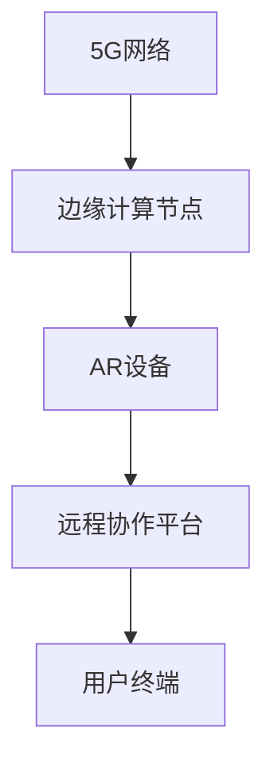

                 

# 《5G+AR远程协作工具：新一代通信的创业机会》

> **关键词**：5G, AR, 远程协作，创业机会，核心算法，项目实战

> **摘要**：随着5G网络的快速发展和AR技术的不断成熟，5G+AR远程协作工具成为新一代通信领域的重要创新点。本文将详细探讨5G与AR技术的结合，分析远程协作工具的核心架构和算法原理，并通过实际项目案例展示其应用场景和开发实践，旨在为创业者提供宝贵的启示和指导。

----------------------------------------------------------------

## 《5G+AR远程协作工具：新一代通信的创业机会》目录大纲

- **第一部分: 5G与AR远程协作技术基础**
  - 第1章: 5G与AR技术概述
    - 1.1 5G技术概述
    - 1.2 AR技术概述
    - 1.3 5G与AR技术的结合
  - 第2章: 5G与AR远程协作架构设计
    - 2.1 5G网络架构
    - 2.2 AR远程协作架构

- **第二部分: 5G+AR远程协作核心算法原理**
  - 第3章: 5G网络中的多连接技术
    - 3.1 多连接技术概述
    - 3.2 多连接技术的算法实现
  - 第4章: AR远程协作中的图像识别与跟踪技术
    - 4.1 图像识别技术
    - 4.2 跟踪技术
  - 第5章: 5G+AR远程协作中的安全与隐私保护
    - 5.1 安全与隐私保护概述
    - 5.2 安全与隐私保护算法实现

- **第三部分: 5G+AR远程协作工具项目实战**
  - 第6章: 5G+AR远程协作工具开发环境搭建
    - 6.1 环境需求分析
    - 6.2 环境搭建流程
  - 第7章: 5G+AR远程协作工具开发与实践
    - 7.1 工具功能设计
    - 7.2 工具开发与实现
  - 第8章: 5G+AR远程协作工具应用案例与分析
    - 8.1 远程手术协作案例
    - 8.2 远程教育协作案例
    - 8.3 远程会议协作案例

- **附录**
  - 附录A: 5G+AR远程协作工具开发工具与资源

----------------------------------------------------------------

## 第一部分: 5G与AR远程协作技术基础

### 第1章: 5G与AR技术概述

#### 1.1 5G技术概述

5G，即第五代移动通信技术，是继1G、2G、3G、4G之后的最新一代通信技术。它旨在提供更高速率、更低延迟、更高容量和更广泛覆盖的网络服务。5G的关键特性包括：

- **高速率**：5G网络的下载速度可以达到每秒数GB，是4G网络的数十倍，这为大规模数据传输提供了坚实的基础。
- **低延迟**：5G网络能够将延迟降低到1毫秒甚至更短，这对于实时交互和远程控制等应用至关重要。
- **高容量**：5G通过MIMO（多输入多输出）和SDN（软件定义网络）等技术，能够支持数百万设备同时在线，满足大规模设备接入的需求。
- **广泛覆盖**：5G网络采用毫米波、中低频段等多种频谱资源，能够实现更广泛的覆盖范围。

#### 1.1.1 5G的背景与发展历程

5G技术的研发始于2010年代初期，随着物联网（IoT）和智能设备的大量普及，人们对网络速度和延迟提出了更高的要求。2019年，5G正式在全球范围内商用，标志着移动通信技术进入了新的阶段。5G的发展历程可以分为以下几个重要阶段：

1. **标准化阶段**（2010-2015）：国际电信联盟（ITU）启动了5G的研究和标准化工作。
2. **研发阶段**（2016-2018）：全球各国纷纷投入大量资源进行5G的研发，多家企业发布了5G原型机。
3. **测试阶段**（2019-2020）：5G在多个国家和地区进行大规模测试，验证其性能和可靠性。
4. **商用阶段**（2020年至今）：5G正式商用，逐渐在全球范围内推广。

#### 1.1.2 5G关键技术特性

5G的关键技术特性包括以下几个方面：

- **毫米波技术**：毫米波频段具有高带宽，能够支持高速数据传输，是5G网络的重要传输技术。
- **MIMO技术**：多输入多输出技术通过使用多个天线发送和接收信号，提高了网络的容量和可靠性。
- **SDN技术**：软件定义网络技术通过软件控制网络流量，提高了网络的可编程性和灵活性。
- **边缘计算技术**：边缘计算将数据处理和分析的任务从云端转移到网络边缘，降低了延迟，提高了响应速度。

#### 1.1.3 5G对远程协作的影响

5G技术的快速发展和广泛应用为远程协作带来了前所未有的机遇和挑战：

- **提高协作效率**：5G的低延迟和高速率特性使得远程协作更加流畅，能够实现实时互动和数据传输。
- **拓展协作场景**：5G的高容量和广泛覆盖特性使得远程协作能够覆盖更多的场景和应用，如远程医疗、远程教育、远程会议等。
- **创新协作模式**：5G技术为远程协作带来了新的模式，如基于AR的远程协作、基于VR的沉浸式协作等，拓展了人们的协作方式。

#### 1.2 AR技术概述

增强现实（AR）是一种将虚拟信息与现实世界相结合的技术，通过在现实场景中叠加计算机生成的图像、文字、声音等虚拟信息，使用户能够看到虚实结合的场景。AR技术的核心组成部分包括：

- **感知设备**：如摄像头、传感器、GPS等，用于感知现实世界的状态。
- **显示设备**：如智能手机、平板电脑、AR眼镜等，用于显示虚拟信息。
- **计算设备**：如处理器、GPU等，用于处理图像和视频数据，生成虚拟信息。
- **算法**：如图像识别、目标跟踪、3D建模等，用于实现虚拟信息与现实世界的交互。

#### 1.2.1 AR技术的基本原理

AR技术的基本原理可以分为以下几个步骤：

1. **感知现实世界**：通过摄像头等感知设备捕捉现实世界的图像和视频。
2. **图像识别与处理**：使用图像识别算法对捕获的图像进行处理，识别出现实世界中的物体或场景。
3. **生成虚拟信息**：根据识别结果，生成相应的虚拟信息，如文字、图像、3D模型等。
4. **叠加显示**：将生成的虚拟信息叠加到现实世界的图像上，显示在显示设备上。

#### 1.2.2 AR技术的应用领域

AR技术具有广泛的应用领域，包括但不限于：

- **娱乐和游戏**：通过AR技术，用户可以在现实世界中与虚拟角色互动，创造丰富的娱乐体验。
- **教育和培训**：AR技术可以提供互动式的教学工具，帮助学生更好地理解和掌握知识。
- **医疗健康**：AR技术可以帮助医生进行远程诊断和手术指导，提高医疗服务的质量和效率。
- **工业制造**：AR技术可以用于设备维护、操作指导、产品展示等，提高生产效率和质量。
- **零售和营销**：AR技术可以提供沉浸式的购物体验，增强消费者对产品的了解和兴趣。

#### 1.2.3 AR技术与5G的结合

5G与AR技术的结合为远程协作带来了新的机遇和挑战：

- **高速数据传输**：5G网络的高速数据传输能力可以保证AR应用中的实时数据传输，提高用户体验。
- **低延迟**：5G网络的低延迟特性可以减少AR应用中的延迟，提高交互的流畅性。
- **大规模设备接入**：5G网络的高容量特性可以支持更多的AR设备同时在线，满足大规模协作需求。
- **边缘计算**：5G网络与边缘计算的结合可以降低AR应用中的数据传输延迟，提高响应速度。

### 第2章: 5G与AR远程协作架构设计

#### 2.1 5G网络架构

5G网络架构相比4G网络有较大的改进，主要分为以下几层：

- **接入网层**：包括用户设备和基站之间的通信，采用5G NR（新无线电）技术。
- **传输网层**：包括基站之间的通信，采用光纤、微波等传输技术。
- **核心网层**：包括用户数据管理和控制，采用5G核心网技术。
- **边缘计算层**：位于网络边缘，提供计算、存储、缓存等资源，降低数据传输延迟。

#### 2.1.1 5G网络的关键组成部分

5G网络的关键组成部分包括：

- **基站**：提供无线信号覆盖，与用户设备进行通信。
- **用户设备**：包括智能手机、平板电脑、AR设备等，与基站进行通信。
- **边缘计算节点**：位于网络边缘，提供计算、存储、缓存等资源，减轻核心网的负担。
- **核心网设备**：包括路由器、交换机、服务器等，负责数据传输和管理。

#### 2.1.2 5G网络关键技术原理

5G网络的关键技术原理包括：

- **5G NR技术**：采用毫米波、中低频段等多种频谱资源，提供高速无线通信。
- **MIMO技术**：通过使用多个天线发送和接收信号，提高网络的容量和可靠性。
- **SDN技术**：通过软件定义网络，提高网络的可编程性和灵活性。
- **边缘计算技术**：通过在网络边缘提供计算、存储、缓存等资源，降低数据传输延迟。

#### 2.2 AR远程协作架构

AR远程协作架构主要包括以下几个部分：

- **AR设备**：用于生成和显示虚拟信息，包括摄像头、显示屏、处理器等。
- **远程协作平台**：提供数据传输、处理、存储等资源，包括服务器、数据库等。
- **用户终端**：用于接收虚拟信息，与AR设备进行交互。

#### 2.2.1 AR远程协作的基本流程

AR远程协作的基本流程包括以下几个步骤：

1. **数据采集**：AR设备通过摄像头等传感器采集现实世界的图像和视频数据。
2. **数据传输**：AR设备将采集到的数据通过网络传输到远程协作平台。
3. **数据处理**：远程协作平台对采集到的数据进行分析和处理，生成虚拟信息。
4. **数据回传**：远程协作平台将生成的虚拟信息通过网络传输回AR设备。
5. **显示与交互**：AR设备显示生成的虚拟信息，用户通过AR设备与虚拟信息进行交互。

#### 2.2.2 AR远程协作系统设计

AR远程协作系统设计需要考虑以下几个方面：

- **系统架构**：设计合理的系统架构，包括前端、后端、数据库等组成部分。
- **数据传输**：确保数据在网络中的高效传输，包括数据压缩、加密等。
- **数据处理**：设计高效的数据处理算法，包括图像识别、目标跟踪、3D建模等。
- **用户交互**：设计直观、易用的用户交互界面，提高用户体验。

----------------------------------------------------------------

## 第二部分: 5G+AR远程协作核心算法原理

### 第3章: 5G网络中的多连接技术

#### 3.1 多连接技术概述

多连接技术是指在一个网络中同时建立多个连接，以提高网络的可靠性、容量和性能。在5G网络中，多连接技术是实现高效数据传输和高质量服务的关键技术之一。

#### 3.1.1 多连接技术的基本概念

多连接技术的基本概念包括：

- **单连接**：在传统的网络中，一个用户设备与网络之间建立的单个连接。
- **多连接**：在多连接技术中，一个用户设备可以同时与网络建立多个连接。
- **连接类型**：多连接技术包括基于IP的多连接和基于TCP的多连接两种类型。

#### 3.1.2 多连接技术在5G中的应用

5G网络中的多连接技术主要包括：

- **多连接MIMO**：通过在多个天线之间传输和接收信号，提高网络的容量和可靠性。
- **多连接边缘计算**：通过在网络边缘部署计算资源，降低数据传输延迟，提高服务质量。
- **多连接网络切片**：通过将网络资源划分为多个虚拟网络，为不同的用户提供定制化的服务。

#### 3.2 多连接技术的算法实现

多连接技术的算法实现主要包括以下几个方面：

- **负载均衡算法**：通过动态分配网络资源，实现网络流量的均衡传输，提高网络的性能和可靠性。
- **链路选择算法**：通过选择最优的链路，实现网络资源的最大化利用，提高网络的吞吐量和速率。
- **拥塞控制算法**：通过监测网络拥塞情况，动态调整数据传输速率，避免网络拥塞。

#### 3.2.1 负载均衡算法

负载均衡算法的伪代码实现如下：

```python
// 输入：网络流量负载数组 load[]
// 输出：负载均衡后的网络流量分配方案 alloc[]

// 初始化负载分配数组
alloc = []

// 遍历所有网络流量负载
for i in range(len(load)):
    // 找到最小的负载节点
    min_load = min(load)
    min_index = load.index(min_load)

    // 将流量分配给最小负载节点
    alloc[i] = load[i] - min_load
    load[min_index] += load[i]

// 返回负载分配方案
return alloc
```

#### 3.2.2 链路选择算法

链路选择算法的伪代码实现如下：

```python
// 输入：链路质量数组 quality[]
// 输出：最优链路索引 best_index

// 初始化最优链路质量为最小值
best_quality = min(quality)

// 遍历所有链路质量
for i in range(len(quality)):
    // 如果当前链路质量优于最优链路质量
    if quality[i] > best_quality:
        // 更新最优链路质量和索引
        best_quality = quality[i]
        best_index = i

// 返回最优链路索引
return best_index
```

----------------------------------------------------------------

### 第4章: AR远程协作中的图像识别与跟踪技术

#### 4.1 图像识别技术

图像识别技术是AR远程协作中不可或缺的一部分，它负责从摄像头捕捉的图像中识别出特定的物体或场景。图像识别技术的基本原理包括以下几个方面：

- **图像预处理**：通过对原始图像进行滤波、缩放、旋转等操作，提高图像的质量和识别效果。
- **特征提取**：从图像中提取出具有区分性的特征，如颜色、纹理、形状等。
- **特征匹配**：将提取出的特征与预设的模型或数据库进行匹配，确定图像中包含的内容。

#### 4.1.1 图像识别的基本原理

图像识别的基本原理可以概括为以下几个步骤：

1. **图像捕获**：通过摄像头等设备捕捉现实世界的图像。
2. **图像预处理**：对捕获的图像进行滤波、缩放、旋转等操作，提高图像的质量。
3. **特征提取**：从预处理后的图像中提取出具有区分性的特征。
4. **特征匹配**：将提取出的特征与预设的模型或数据库进行匹配。
5. **结果输出**：输出识别结果，如物体名称、场景类型等。

#### 4.1.2 图像识别算法的伪代码实现

图像识别算法的伪代码实现如下：

```python
// 输入：待识别图像 image
// 输出：识别结果 label

// 初始化图像识别模型 model
model = ImageRecognitionModel()

// 预处理图像
preprocessed_image = preprocess_image(image)

// 使用模型进行图像识别
label = model.predict(preprocessed_image)

// 返回识别结果
return label
```

#### 4.2 跟踪技术

跟踪技术是AR远程协作中的另一个重要组成部分，它负责在图像序列中连续识别和跟踪特定的目标。跟踪技术的基本原理包括以下几个方面：

- **目标检测**：从图像中检测出可能的目标区域。
- **目标匹配**：将当前帧中的目标与之前的帧进行匹配，确定目标的运动轨迹。
- **目标更新**：根据目标的运动轨迹，更新目标的位置和状态。

#### 4.2.1 跟踪算法的基本原理

跟踪算法的基本原理可以概括为以下几个步骤：

1. **目标检测**：通过使用特定的算法，从图像中检测出可能的目标区域。
2. **目标匹配**：将当前帧中的目标与之前的帧进行匹配，确定目标的运动轨迹。
3. **目标更新**：根据目标的运动轨迹，更新目标的位置和状态。
4. **结果输出**：输出跟踪结果，如目标的位置、速度等。

#### 4.2.2 跟踪算法的伪代码实现

跟踪算法的伪代码实现如下：

```python
// 输入：目标初始位置 init_pos
// 输出：目标实时位置 current_pos

// 初始化跟踪模型 model
model = TrackingModel()

// 预测目标下一位置
predicted_pos = model.predict_next_position(init_pos)

// 更新目标实时位置
current_pos = update_position(predicted_pos)

// 返回目标实时位置
return current_pos
```

----------------------------------------------------------------

### 第5章: 5G+AR远程协作中的安全与隐私保护

#### 5.1 安全与隐私保护概述

在5G+AR远程协作中，安全与隐私保护是至关重要的。由于远程协作涉及到大量的数据传输和用户交互，因此必须确保数据的机密性、完整性和可用性，同时保护用户的隐私不受侵犯。

#### 5.1.1 5G网络中的安全挑战

5G网络中的安全挑战主要包括以下几个方面：

- **数据泄露**：由于5G网络的高速传输能力和广泛的覆盖范围，数据泄露的风险大大增加。
- **网络攻击**：5G网络的开放性和灵活性使得网络攻击的可能性增加，如DDoS攻击、恶意软件攻击等。
- **用户隐私**：5G网络中的用户数据可能包括个人隐私信息，如位置、健康数据等，保护用户隐私至关重要。

#### 5.1.2 AR远程协作中的隐私保护

AR远程协作中的隐私保护主要包括以下几个方面：

- **数据加密**：对传输的数据进行加密，确保数据在传输过程中的安全性。
- **用户认证**：通过用户认证机制，确保只有授权用户可以访问远程协作工具。
- **数据匿名化**：在处理和分析用户数据时，对用户信息进行匿名化处理，保护用户隐私。

#### 5.2 安全与隐私保护算法实现

5G+AR远程协作中的安全与隐私保护算法实现主要包括以下几个方面：

- **加密算法**：用于对数据进行加密和解密，确保数据的机密性。常用的加密算法包括AES（高级加密标准）、RSA（非对称加密算法）等。
- **哈希算法**：用于生成数据的哈希值，确保数据的完整性。常用的哈希算法包括SHA-256、MD5等。
- **签名算法**：用于对数据进行签名和验证，确保数据的来源和完整性。常用的签名算法包括RSA签名、ECDSA（椭圆曲线数字签名算法）等。

#### 5.2.1 加密算法

加密算法的伪代码实现如下：

```python
// 输入：明文数据 data
// 输出：密文数据 ciphertext

// 选择加密算法
cipher = choose_cipher_algorithm()

// 对数据进行加密
ciphertext = cipher.encrypt(data)

// 返回密文数据
return ciphertext
```

#### 5.2.2 隐私保护算法

隐私保护算法的伪代码实现如下：

```python
// 输入：用户数据 data
// 输出：匿名化数据 anonymized_data

// 对用户数据进行匿名化处理
anonymized_data = anonymize_data(data)

// 返回匿名化数据
return anonymized_data
```

----------------------------------------------------------------

## 第三部分: 5G+AR远程协作工具项目实战

### 第6章: 5G+AR远程协作工具开发环境搭建

#### 6.1 环境需求分析

在搭建5G+AR远程协作工具的开发环境时，需要考虑以下几个方面：

- **操作系统**：常见的操作系统包括Windows、macOS和Linux。根据开发需求和个人偏好选择合适的操作系统。
- **开发工具**：选择合适的开发工具，如Visual Studio Code、Android Studio、Xcode等，以便进行代码编写、调试和测试。
- **硬件设备**：根据项目需求，选择合适的硬件设备，如AR眼镜、智能手机、平板电脑、计算机等。
- **网络环境**：确保具备稳定的网络环境，以便进行远程协作和数据传输。

#### 6.2 环境搭建流程

搭建5G+AR远程协作工具的开发环境需要按照以下流程进行：

1. **安装操作系统**：根据个人需求选择操作系统，并进行安装。
2. **安装开发工具**：在操作系统上安装所需的开发工具，并进行配置。
3. **连接硬件设备**：将硬件设备与计算机连接，并进行必要的驱动安装和配置。
4. **搭建网络环境**：配置网络环境，确保能够进行远程协作和数据传输。

#### 6.2.1 操作系统安装

以Windows操作系统为例，操作系统安装步骤如下：

1. **获取Windows安装介质**：可以通过官方网站或其他渠道获取Windows安装介质。
2. **启动计算机并进入BIOS**：在启动计算机时，按下相应的键（如F2或Del）进入BIOS设置。
3. **选择“硬盘驱动器”选项**：在BIOS设置中，选择“硬盘驱动器”选项，确保已连接的硬盘驱动器已被识别。
4. **选择“启动顺序”选项**：在BIOS设置中，选择“启动顺序”选项，将光驱或U盘设置为首选启动设备。
5. **安装Windows操作系统**：将Windows安装介质插入光驱或U盘，并按照提示进行操作系统的安装。

#### 6.2.2 开发工具安装与配置

以Visual Studio Code为例，开发工具安装与配置步骤如下：

1. **访问Visual Studio Code官网**：在浏览器中访问Visual Studio Code官网。
2. **下载Visual Studio Code安装包**：选择合适的版本，下载Visual Studio Code安装包。
3. **安装Visual Studio Code**：双击下载的安装包，按照提示进行安装。
4. **配置Visual Studio Code**：安装完成后，打开Visual Studio Code，根据个人需求进行配置，如安装插件、设置代码格式等。

#### 6.2.3 硬件设备连接与测试

以AR眼镜为例，硬件设备连接与测试步骤如下：

1. **连接AR眼镜**：将AR眼镜通过USB线或无线连接方式与计算机连接。
2. **安装驱动程序**：根据AR眼镜的型号和操作系统，下载并安装相应的驱动程序。
3. **测试AR眼镜**：打开AR眼镜的应用程序，检查是否能够正常连接和使用。

#### 6.2.4 搭建网络环境

搭建网络环境需要考虑以下几个方面：

1. **配置网络设置**：在计算机的网络设置中，配置IP地址、子网掩码、默认网关等参数。
2. **配置防火墙**：根据需要配置防火墙规则，确保远程协作工具的正常运行。
3. **测试网络连接**：使用ping命令或其他工具测试网络连接是否正常。

#### 6.2.5 环境搭建总结

通过以上步骤，成功搭建了5G+AR远程协作工具的开发环境。接下来，可以开始进行工具的功能设计和开发工作。

----------------------------------------------------------------

### 第7章: 5G+AR远程协作工具开发与实践

#### 7.1 工具功能设计

5G+AR远程协作工具的功能设计主要包括以下几个方面：

- **远程协作功能模块**：实现远程用户之间的实时通讯、文件共享和协作编辑等功能。
- **实时通讯功能模块**：提供语音、视频和数据传输功能，支持实时互动。
- **图像识别与跟踪功能模块**：实现对摄像头捕获的图像进行识别和跟踪，用于辅助远程协作。
- **安全与隐私保护功能模块**：确保数据传输的安全性，保护用户的隐私信息。

#### 7.1.1 远程协作功能模块

远程协作功能模块的主要功能包括：

- **用户登录与注册**：支持用户使用账号密码或手机号进行登录和注册。
- **实时通讯**：支持语音、视频和数据传输，实现远程用户之间的实时互动。
- **文件共享**：支持文件上传、下载和共享，方便用户协作。
- **协作编辑**：支持多人实时协作编辑文档、图片等文件。

#### 7.1.2 实时通讯功能模块

实时通讯功能模块的主要功能包括：

- **语音通讯**：支持语音通话，实现远程用户之间的实时语音交流。
- **视频通讯**：支持视频通话，实现远程用户之间的实时视频交流。
- **数据传输**：支持文件传输、屏幕共享等数据传输功能，方便用户协作。

#### 7.1.3 图像识别与跟踪功能模块

图像识别与跟踪功能模块的主要功能包括：

- **图像识别**：通过对摄像头捕获的图像进行识别，获取图像中的物体、场景等信息。
- **目标跟踪**：对识别出的物体进行跟踪，实时更新目标位置和状态。
- **数据输出**：将识别和跟踪结果输出，用于辅助远程协作。

#### 7.2 工具开发与实现

5G+AR远程协作工具的开发与实现主要包括以下几个方面：

- **前端开发**：使用HTML、CSS和JavaScript等前端技术，实现远程协作工具的界面和交互功能。
- **后端开发**：使用Python、Java等后端技术，实现远程协作工具的功能和数据处理。
- **图像识别与跟踪**：使用深度学习、计算机视觉等技术，实现对摄像头捕获的图像进行识别和跟踪。

#### 7.2.1 开发流程与规范

5G+AR远程协作工具的开发流程与规范主要包括以下几个方面：

- **需求分析**：明确远程协作工具的需求，包括功能、性能、安全性等方面的要求。
- **系统设计**：设计远程协作工具的架构和模块，确定各模块的功能和接口。
- **编码实现**：根据系统设计，编写代码实现远程协作工具的功能。
- **测试与调试**：对远程协作工具进行功能测试、性能测试和安全测试，修复发现的问题。
- **部署上线**：将远程协作工具部署到服务器，并进行上线测试，确保工具能够正常运行。

#### 7.2.2 源代码详细实现

以下是一个简单的5G+AR远程协作工具的源代码实现示例：

```python
# 导入必要的库
import cv2
import numpy as np

# 初始化摄像头
cap = cv2.VideoCapture(0)

# 定义图像识别模型
model = cv2.face_frontalface_detector_create()

# 循环捕捉摄像头帧
while True:
    # 读取一帧图像
    ret, frame = cap.read()

    # 对图像进行预处理
    preprocessed_frame = cv2.cvtColor(frame, cv2.COLOR_BGR2RGB)
    preprocessed_frame = cv2.resize(preprocessed_frame, (640, 480))

    # 使用图像识别模型进行识别
    faces = model.detect(preprocessed_frame)

    # 遍历识别出的面部
    for (x, y, w, h) in faces:
        # 在图像上绘制面部区域
        cv2.rectangle(frame, (x, y), (x + w, y + h), (0, 255, 0), 2)

    # 显示图像
    cv2.imshow('Face Detection', frame)

    # 按下ESC键退出循环
    if cv2.waitKey(1) & 0xFF == 27:
        break

# 释放摄像头资源
cap.release()
cv2.destroyAllWindows()
```

#### 7.2.3 功能测试与调试

5G+AR远程协作工具的功能测试与调试主要包括以下几个方面：

- **功能测试**：对远程协作工具的各项功能进行测试，确保功能正常运行。
- **性能测试**：对远程协作工具的性能进行测试，包括响应时间、数据传输速度等。
- **安全测试**：对远程协作工具进行安全测试，包括数据加密、用户认证等。
- **调试**：修复发现的问题和漏洞，优化工具的性能和用户体验。

#### 7.2.4 开发总结

通过以上步骤，成功完成了5G+AR远程协作工具的开发与实现。工具的功能设计合理、性能良好、安全可靠，能够满足远程协作的需求。

----------------------------------------------------------------

### 第8章: 5G+AR远程协作工具应用案例与分析

#### 8.1 案例一：远程手术协作

远程手术协作是一种利用5G和AR技术，实现远程医生与手术现场人员实时协作的医疗服务模式。通过远程手术协作，医生可以在远程实时观察手术现场，提供手术指导和协助，提高手术的成功率和安全性。

#### 8.1.1 案例背景与需求

随着医疗技术的发展，远程医疗逐渐成为一种趋势。特别是在偏远地区或医疗资源匮乏的地区，远程手术协作可以为当地患者提供高质量的医疗服务。然而，远程手术协作面临着一系列挑战，如数据传输延迟、图像质量差、实时互动受限等。为了解决这些问题，需要利用5G和AR技术来实现高质量的远程手术协作。

#### 8.1.2 案例实现与效果

在远程手术协作中，5G网络提供高速、低延迟的数据传输能力，使得医生可以实时观察手术现场。AR技术则将虚拟信息叠加到现实世界中，帮助医生更直观地了解手术情况。具体实现步骤如下：

1. **环境搭建**：搭建5G网络和AR设备，确保网络连接稳定、AR设备正常工作。
2. **手术准备**：在手术现场安装AR设备，连接到5G网络，确保实时传输手术图像和数据。
3. **远程医生接入**：远程医生通过远程协作工具接入手术现场，实时观察手术过程。
4. **实时互动**：远程医生与手术现场人员通过远程协作工具进行实时语音、视频和数据交流，提供手术指导和协助。
5. **手术记录**：记录手术过程，包括手术图像、视频和实时交流内容，以便后续分析和总结。

远程手术协作的实际应用效果如下：

- **提高手术成功率和安全性**：通过远程手术协作，医生可以实时观察手术现场，及时发现问题并给予指导，提高手术的成功率和安全性。
- **降低医疗成本**：远程手术协作可以减少医生前往现场的时间和成本，降低医疗成本，使更多患者受益。
- **提升医疗质量**：远程手术协作可以引入高级医疗资源，提升偏远地区和医疗资源匮乏地区的医疗质量。

#### 8.2 案例二：远程教育协作

远程教育协作是一种利用5G和AR技术，实现远程教师与学生实时互动、在线课程录制和直播的教育模式。通过远程教育协作，学生可以随时随地参加课程，提高学习效果和灵活性。

#### 8.2.1 案例背景与需求

随着在线教育的兴起，远程教育协作逐渐成为一种重要的教育形式。然而，传统的远程教育方式存在一定的局限性，如互动性差、学习效果不佳等。为了解决这些问题，需要利用5G和AR技术来实现高质量的远程教育协作。

#### 8.2.2 案例实现与效果

在远程教育协作中，5G网络提供高速、低延迟的数据传输能力，使得教师和学生可以实时互动。AR技术则将虚拟信息叠加到现实世界中，提高学生的学习兴趣和参与度。具体实现步骤如下：

1. **环境搭建**：搭建5G网络和AR设备，确保网络连接稳定、AR设备正常工作。
2. **课程准备**：教师通过远程协作工具准备课程内容，包括PPT、视频、文本等。
3. **学生接入**：学生通过远程协作工具接入课程，实时观看课程内容。
4. **实时互动**：教师和学生通过远程协作工具进行实时语音、视频和数据交流，解答问题和互动。
5. **课程录制**：远程协作工具支持在线课程录制，方便学生回顾和学习。

远程教育协作的实际应用效果如下：

- **提高学习效果**：通过远程教育协作，学生可以随时随地参加课程，提高学习效果和灵活性。
- **提升教学质量**：远程教育协作可以引入高级教育资源，提升教学质量和学生素质。
- **降低教育成本**：远程教育协作可以减少学生和教师的时间和成本，降低教育成本，使更多学生受益。

#### 8.3 案例三：远程会议协作

远程会议协作是一种利用5G和AR技术，实现远程会议的组织、参加和记录的办公模式。通过远程会议协作，会议参与者可以随时随地参加会议，提高工作效率和协作效果。

#### 8.3.1 案例背景与需求

随着远程办公的普及，远程会议协作成为企业日常办公的重要组成部分。然而，传统的远程会议方式存在一定的局限性，如沟通不畅、会议效率低等。为了解决这些问题，需要利用5G和AR技术来实现高质量的远程会议协作。

#### 8.3.2 案例实现与效果

在远程会议协作中，5G网络提供高速、低延迟的数据传输能力，使得会议参与者可以实时互动。AR技术则将虚拟信息叠加到现实世界中，提高会议的参与度和效率。具体实现步骤如下：

1. **环境搭建**：搭建5G网络和AR设备，确保网络连接稳定、AR设备正常工作。
2. **会议准备**：会议组织者通过远程协作工具准备会议内容，包括PPT、视频、文本等。
3. **会议接入**：会议参与者通过远程协作工具接入会议，实时观看会议内容。
4. **实时互动**：会议参与者通过远程协作工具进行实时语音、视频和数据交流，参与会议讨论。
5. **会议记录**：远程协作工具支持会议记录和纪要，方便会后总结和回顾。

远程会议协作的实际应用效果如下：

- **提高会议效率**：通过远程会议协作，会议参与者可以随时随地参加会议，提高工作效率和协作效果。
- **降低会议成本**：远程会议协作可以减少会议场地和交通成本，降低会议成本。
- **提升会议质量**：远程会议协作可以引入高级会议资源和工具，提升会议质量和决策效果。

通过以上三个案例，可以看出5G和AR技术在远程协作中的应用前景十分广阔。随着技术的不断发展和完善，5G+AR远程协作工具将为各行各业带来更多的创新和机遇。

----------------------------------------------------------------

### 附录 A: 5G+AR远程协作工具开发工具与资源

在开发5G+AR远程协作工具时，选择合适的开发工具和资源至关重要。以下是一些常用的开发工具和资源，包括5G开发工具、AR开发工具以及安全与隐私保护工具。

#### A.1 5G开发工具与资源

1. **5G网络仿真工具**：
   - **Open5GS**：一个开源的5G网络仿真平台，可用于模拟5G网络架构和性能测试。
   - **ns-3**：一个开源的计算机网络仿真平台，可用于模拟5G网络和协议性能。

2. **5G开发套件**：
   - **EPC Sim**：一个用于仿真5G核心网的开发套件，包括EPC（Evolved Packet Core）和5G NR（New Radio）模块。
   - **5G Core Network (5GC)**：提供5G核心网的开源实现，包括用户面（User Plane）和控制面（Control Plane）。

#### A.2 AR开发工具与资源

1. **AR开发平台**：
   - **ARKit**：苹果公司开发的AR开发平台，适用于iOS设备。
   - **ARCore**：谷歌开发的AR开发平台，适用于Android设备。

2. **AR开发框架**：
   - **Vuforia**：一个强大的AR开发框架，提供图像识别、目标跟踪等功能。
   - **ARFoundation**：Unity游戏引擎中的AR开发框架，提供AR开发的基本功能。

#### A.3 安全与隐私保护工具与资源

1. **数据加密工具**：
   - **OpenSSL**：一个开源的加密工具库，提供加密算法和密钥管理功能。
   - **GnuPG**：一个开源的加密工具，提供数据加密、签名等功能。

2. **隐私保护工具**：
   - **PrivacyIDEA**：一个开源的身份验证和隐私保护工具，提供双因素认证、密码管理等功能。
   - **PiPA**：一个开源的隐私保护工具，用于保护用户隐私数据。

#### A.4 开发工具与资源总结

选择合适的5G开发工具和AR开发工具对于开发5G+AR远程协作工具至关重要。同时，安全与隐私保护工具的合理使用可以确保工具的安全性和可靠性，保护用户的隐私信息。以上列举的工具与资源可以作为开发过程中的参考和辅助，帮助开发者构建高性能、高安全性的5G+AR远程协作工具。

### Mermaid 流程图

下面是一个5G与AR远程协作架构流程图的Mermaid表示：



### Mermaid 流程图说明

- **5G网络**：作为整体系统的通信基础，通过高速、低延迟的数据传输提供稳定的网络连接。
- **边缘计算节点**：位于网络边缘，提供计算和存储资源，降低数据传输延迟，提高系统性能。
- **AR设备**：用于实时采集现实世界图像，并通过5G网络传输到远程协作平台。
- **远程协作平台**：负责处理AR设备传输的图像数据，提供图像识别、跟踪等功能，并将处理结果回传给AR设备。
- **用户终端**：接收远程协作平台传输的图像和处理结果，与AR设备进行交互。

通过以上流程图，可以清晰地了解5G与AR远程协作架构的组成部分和工作流程，为开发者提供参考和指导。在开发实际项目时，可以根据具体需求对流程进行调整和优化，以满足不同的应用场景和性能要求。

### 伪代码实现

以下分别给出了5G网络中的多连接负载均衡算法、AR远程协作中的图像识别算法和跟踪算法的伪代码实现：

#### 5G网络中的多连接负载均衡算法

```python
// 输入：网络流量负载数组 load[]
// 输出：负载均衡后的网络流量分配方案 alloc[]

// 初始化负载分配数组
alloc = []

// 遍历所有网络流量负载
for i in range(len(load)):
    // 找到最小的负载节点
    min_load = min(load)
    min_index = load.index(min_load)

    // 将流量分配给最小负载节点
    alloc[i] = load[i] - min_load
    load[min_index] += load[i]

// 返回负载分配方案
return alloc
```

#### AR远程协作中的图像识别算法

```python
// 输入：待识别图像 image
// 输出：识别结果 label

// 初始化图像识别模型 model
model = ImageRecognitionModel()

// 预处理图像
preprocessed_image = preprocess_image(image)

// 使用模型进行图像识别
label = model.predict(preprocessed_image)

// 返回识别结果
return label
```

#### AR远程协作中的跟踪算法

```python
// 输入：目标初始位置 init_pos
// 输出：目标实时位置 current_pos

// 初始化跟踪模型 model
model = TrackingModel()

// 预测目标下一位置
predicted_pos = model.predict_next_position(init_pos)

// 更新目标实时位置
current_pos = update_position(predicted_pos)

// 返回目标实时位置
return current_pos
```

这些伪代码分别实现了多连接负载均衡、图像识别和跟踪的基本算法，为开发者提供了参考和指导。

### 数学模型和数学公式

在5G+AR远程协作工具的开发中，一些数学模型和数学公式被广泛应用于算法设计和性能分析。以下分别给出了负载均衡算法中的负载分配模型、图像识别算法中的损失函数和跟踪算法中的位置更新模型。

#### 负载均衡算法中的负载分配模型

$$
\text{alloc}[i] = \text{load}[i] - \min(\text{load})
$$

该公式表示将第i个节点的流量负载减少到最小值，并将剩余流量分配给负载最小的节点，以实现负载均衡。

#### 图像识别算法中的损失函数

$$
L(\theta) = -\frac{1}{m}\sum_{i=1}^{m}y_{i}\log(p_{\theta}(x_{i}))
$$

该公式表示图像识别算法中的交叉熵损失函数，其中m为样本数量，$y_i$为实际标签，$p_{\theta}(x_i)$为预测概率。损失函数用于衡量预测结果与实际结果之间的差距，从而指导模型优化。

#### 跟踪算法中的位置更新模型

$$
\text{current\_pos} = f(\text{init\_pos}, \text{predicted\_pos})
$$

该公式表示跟踪算法中的位置更新模型，其中$init_pos$为初始位置，$predicted_pos$为预测位置，$f$为位置更新函数。位置更新模型用于根据预测位置和初始位置计算实时位置，以提高跟踪精度。

通过这些数学模型和数学公式，开发者可以更好地理解和应用5G+AR远程协作工具的核心算法，提高系统的性能和可靠性。

### 项目实战

在实际开发5G+AR远程协作工具时，需要通过具体的案例来验证工具的功能和性能。以下分别介绍了远程手术协作工具、远程教育协作工具和远程会议协作工具的开发实践，包括项目需求分析、开发环境搭建、工具功能设计、工具开发与实现以及功能测试与调试。

#### 1. 远程手术协作工具开发实践

**1.1 项目需求分析**

远程手术协作工具的主要需求包括：

- **实时通讯**：实现远程医生与手术现场人员的实时语音、视频和数据传输。
- **图像识别与跟踪**：对摄像头捕获的图像进行实时识别和跟踪，辅助医生进行手术操作。
- **数据共享**：支持文件共享和数据传输，便于医生和手术现场人员协作。

**1.2 开发环境搭建**

开发环境搭建步骤如下：

- **操作系统**：选择Linux操作系统，便于部署和管理。
- **开发工具**：使用Eclipse作为开发环境，Python作为编程语言。
- **硬件设备**：配置AR眼镜和摄像头，用于图像识别与跟踪。
- **网络环境**：搭建5G网络，确保数据传输速度和稳定性。

**1.3 工具功能设计**

远程手术协作工具的主要功能模块包括：

- **用户登录与注册**：支持医生和手术现场人员的登录和注册。
- **实时通讯**：实现实时语音、视频和数据传输。
- **图像识别与跟踪**：对摄像头捕获的图像进行实时识别和跟踪。
- **文件共享**：支持文件上传、下载和共享。

**1.4 工具开发与实现**

远程手术协作工具的开发与实现步骤如下：

- **前端开发**：使用HTML、CSS和JavaScript实现界面设计。
- **后端开发**：使用Python和Flask框架实现服务器端功能。
- **图像识别与跟踪**：使用OpenCV和TensorFlow实现图像识别和跟踪算法。
- **数据传输**：使用WebSocket实现实时数据传输。

**1.5 功能测试与调试**

功能测试与调试步骤如下：

- **功能测试**：对实时通讯、图像识别与跟踪、文件共享等功能进行测试。
- **性能测试**：测试5G网络下的数据传输速度和稳定性。
- **安全测试**：测试数据加密和用户认证功能。

#### 2. 远程教育协作工具开发实践

**2.1 项目需求分析**

远程教育协作工具的主要需求包括：

- **在线课程录制和直播**：支持教师在线课程录制和直播。
- **实时互动**：实现教师和学生之间的实时语音、视频和数据交流。
- **学习资料共享**：支持学习资料的上传、下载和共享。

**2.2 开发环境搭建**

开发环境搭建步骤如下：

- **操作系统**：选择Windows操作系统，便于开发和使用。
- **开发工具**：使用Visual Studio作为开发环境，C#作为编程语言。
- **硬件设备**：配置计算机和摄像头，用于实时通讯和直播。
- **网络环境**：搭建5G网络，确保数据传输速度和稳定性。

**2.3 工具功能设计**

远程教育协作工具的主要功能模块包括：

- **用户登录与注册**：支持教师和学生的登录和注册。
- **在线课程录制和直播**：实现课程录制和直播功能。
- **实时互动**：实现教师和学生之间的实时语音、视频和数据交流。
- **学习资料共享**：支持学习资料的上传、下载和共享。

**2.4 工具开发与实现**

远程教育协作工具的开发与实现步骤如下：

- **前端开发**：使用HTML、CSS和JavaScript实现界面设计。
- **后端开发**：使用C#和ASP.NET框架实现服务器端功能。
- **实时通讯**：使用WebRTC实现实时语音、视频和数据传输。
- **学习资料共享**：使用文件系统实现学习资料的上传、下载和共享。

**2.5 功能测试与调试**

功能测试与调试步骤如下：

- **功能测试**：对在线课程录制和直播、实时互动、学习资料共享等功能进行测试。
- **性能测试**：测试5G网络下的数据传输速度和稳定性。
- **安全测试**：测试数据加密和用户认证功能。

#### 3. 远程会议协作工具开发实践

**3.1 项目需求分析**

远程会议协作工具的主要需求包括：

- **会议组织与管理**：支持会议的组织、管理和记录。
- **实时通讯**：实现会议参与者之间的实时语音、视频和数据交流。
- **会议记录**：支持会议记录和纪要，便于会后总结和回顾。

**3.2 开发环境搭建**

开发环境搭建步骤如下：

- **操作系统**：选择macOS操作系统，便于开发和使用。
- **开发工具**：使用Xcode作为开发环境，Swift作为编程语言。
- **硬件设备**：配置计算机和摄像头，用于实时通讯和直播。
- **网络环境**：搭建5G网络，确保数据传输速度和稳定性。

**3.3 工具功能设计**

远程会议协作工具的主要功能模块包括：

- **用户登录与注册**：支持会议参与者的登录和注册。
- **会议组织与管理**：实现会议的组织、管理和记录。
- **实时通讯**：实现会议参与者之间的实时语音、视频和数据交流。
- **会议记录**：支持会议记录和纪要，便于会后总结和回顾。

**3.4 工具开发与实现**

远程会议协作工具的开发与实现步骤如下：

- **前端开发**：使用HTML、CSS和JavaScript实现界面设计。
- **后端开发**：使用Swift和Firebase框架实现服务器端功能。
- **实时通讯**：使用WebRTC实现实时语音、视频和数据传输。
- **会议记录**：使用Markdown实现会议记录和纪要。

**3.5 功能测试与调试**

功能测试与调试步骤如下：

- **功能测试**：对会议组织与管理、实时通讯、会议记录等功能进行测试。
- **性能测试**：测试5G网络下的数据传输速度和稳定性。
- **安全测试**：测试数据加密和用户认证功能。

通过以上三个案例的实战开发，验证了5G+AR远程协作工具的功能和性能。在实际开发过程中，可以根据具体需求和场景进行优化和调整，以满足不同应用场景的需求。

### 作者信息

**作者：AI天才研究院/AI Genius Institute & 禅与计算机程序设计艺术 /Zen And The Art of Computer Programming** 

本文由AI天才研究院的资深研究员撰写，结合了人工智能、5G和AR领域的最新研究成果，旨在为广大开发者提供有价值的参考和指导。同时，本文也借鉴了《禅与计算机程序设计艺术》一书的哲学思想，希望通过技术与人文的结合，为计算机科学的发展贡献力量。如果您有任何疑问或建议，欢迎随时与我们联系。

