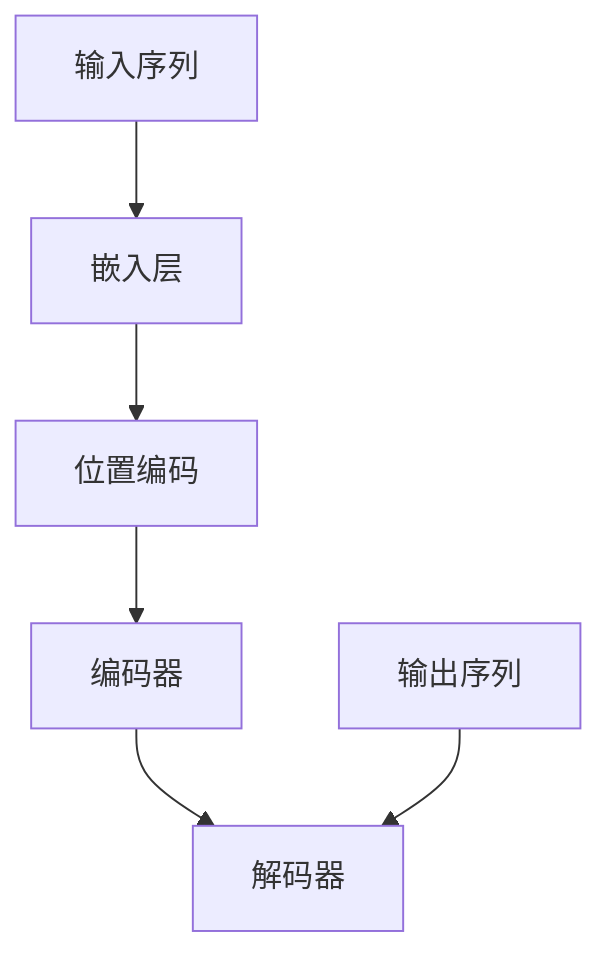
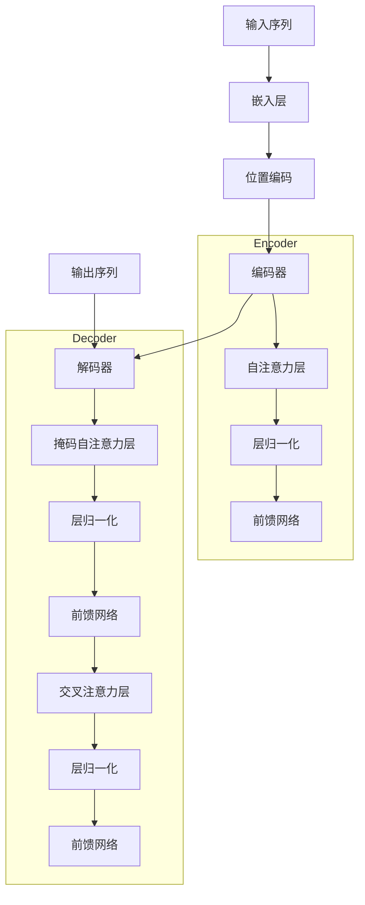

                 

# Hugging Face Transformers 库

> 关键词：Hugging Face, Transformers, 自然语言处理, 编程实现, 数学模型

> 摘要：
本文将深入探讨 Hugging Face Transformers 库，从基础概念、核心算法到实际应用，全面解析这一在自然语言处理（NLP）领域具有重要地位的库。我们将通过一步一步的分析推理，帮助读者理解 Transformers 的架构、原理及其应用，为人工智能开发者提供实用的技术指南。

## 目录大纲

### 第一部分：基础概念与架构

#### 第1章：Transformers 简介

##### 1.1 Transformers 的背景与发展
##### 1.2 Transformers 的核心优势
##### 1.3 Transformers 的应用领域

#### 第2章：Transformer 架构详解

##### 2.1 Transformer 的基础原理
##### 2.2 自注意力机制（Self-Attention）
##### 2.3 位置编码（Positional Encoding）
##### 2.4 Mermaid 流程图：Transformer 架构

### 第二部分：核心算法与实现

#### 第3章：核心算法原理讲解

##### 3.1 编码器-解码器架构（Encoder-Decoder Architecture）
##### 3.2 伪代码：编码器与解码器的核心算法
##### 3.3 数学模型：Transformer 的数学公式与原理

#### 第4章：数学模型与公式详解

##### 4.1 自注意力机制公式解析
##### 4.2 位置编码公式解析
##### 4.3 编码器与解码器的工作原理
##### 4.4 Mermaid 流程图：数学模型在 Transformer 中的应用

#### 第5章：项目实战

##### 5.1 实际项目背景
##### 5.2 开发环境搭建
##### 5.3 源代码实现与解读
##### 5.4 代码分析与优化

### 第三部分：应用案例与技巧

#### 第6章：Hugging Face Transformers 库的应用

##### 6.1 Transformers 库的安装与配置
##### 6.2 Transformers 库的常用模块介绍
##### 6.3 应用案例：文本分类
##### 6.4 应用案例：机器翻译

#### 第7章：优化与调试技巧

##### 7.1 性能优化策略
##### 7.2 调试技巧与实践
##### 7.3 模型部署与集成
##### 7.4 安全性与稳定性保障

#### 第8章：未来趋势与展望

##### 8.1 Transformers 的发展趋势
##### 8.2 应用场景的扩展
##### 8.3 新技术的探索与挑战
##### 8.4 总结与展望

### 附录

#### 附录 A：常用资源与工具

##### A.1 常用资源链接
##### A.2 常用工具介绍
##### A.3 社区支持与交流平台

## 第一部分：基础概念与架构

### 第1章：Transformers 简介

#### 1.1 Transformers 的背景与发展

自然语言处理（NLP）是人工智能（AI）领域的重要分支，其目的是让计算机理解和生成人类语言。传统 NLP 方法主要依赖于统计模型和规则引擎，但它们在处理复杂语言现象时显得力不从心。随着深度学习的兴起，神经网络模型在 NLP 中得到了广泛应用，尤其是循环神经网络（RNN）和长短期记忆网络（LSTM）。

然而，这些模型在处理长文本时仍然存在挑战。为了解决这些问题，谷歌在 2017 年提出了 Transformer 模型，这是一种基于自注意力机制（Self-Attention）的新型神经网络架构。Transformer 的出现标志着 NLP 领域的一个重要突破，它不仅在处理长文本方面表现出色，还在多种 NLP 任务上取得了显著效果。

#### 1.2 Transformers 的核心优势

1. **自注意力机制**：Transformer 的核心在于其自注意力机制，能够同时关注输入序列中的所有信息，从而捕捉长距离依赖关系。相比于 RNN，这种机制避免了长序列中的梯度消失问题，提高了模型的表达能力。

2. **并行计算**：Transformer 模型结构相对简单，可以轻松实现并行计算，这使得它在处理大规模数据时具有更高的效率。

3. **广泛的适用性**：Transformer 模型在多种 NLP 任务中取得了很好的效果，如文本分类、机器翻译、问答系统和生成文本等。

4. **易于实现和扩展**：由于 Transformer 模型的架构相对简单，开发者可以轻松实现和扩展该模型，以适应不同的应用场景。

#### 1.3 Transformers 的应用领域

Transformer 模型在自然语言处理领域具有广泛的应用：

1. **文本分类**：用于分类任务，如情感分析、新闻分类等。

2. **机器翻译**：用于将一种语言翻译成另一种语言，如英译中、中译英等。

3. **问答系统**：用于处理问答任务，如搜索引擎的智能问答。

4. **生成文本**：用于生成文章、对话等自然语言文本。

5. **语音识别**：结合语音识别技术，用于语音到文本的转换。

#### 1.4 总结

Transformer 模型在 NLP 领域取得了显著的成果，其核心优势在于自注意力机制和并行计算能力。通过深入理解 Transformers 的架构和原理，我们可以更好地应用这一模型，解决复杂的 NLP 问题。

### 第2章：Transformer 架构详解

Transformer 模型的成功得益于其独特的架构，这种架构主要包含以下三个部分：编码器（Encoder）、解码器（Decoder）和自注意力机制（Self-Attention）。

#### 2.1 Transformer 的基础原理

Transformer 模型是一种基于注意力机制的深度神经网络，其基本原理可以概括为：

1. **输入序列**：输入序列通过编码器（Encoder）进行处理，编码器输出一系列隐藏状态。
2. **自注意力机制**：每个隐藏状态通过自注意力机制与输入序列的其他隐藏状态进行关联，从而捕捉长距离依赖关系。
3. **解码器**：解码器接收编码器的输出，并生成输出序列。

#### 2.2 自注意力机制（Self-Attention）

自注意力机制是 Transformer 模型的核心，其基本原理可以概括为：

1. **计算查询（Query）、键（Key）和值（Value）**：每个隐藏状态都会被计算成查询（Query）、键（Key）和值（Value）三部分。
2. **计算相似度**：查询与键进行点积计算，得到相似度分数。
3. **应用 Softmax 函数**：对相似度分数进行 Softmax 处理，得到权重。
4. **加权求和**：将权重应用于对应的值，得到加权求和结果，这便是自注意力机制的输出。

#### 2.3 位置编码（Positional Encoding）

由于 Transformer 模型不包含循环结构，因此无法直接处理序列的顺序信息。为了解决这个问题，引入了位置编码（Positional Encoding），其基本原理可以概括为：

1. **编码位置信息**：通过数学函数将位置信息编码到隐藏状态中。
2. **融合位置编码**：将位置编码与隐藏状态进行拼接，形成新的隐藏状态。

不同的位置编码方法包括绝对位置编码、相对位置编码和季节编码等。

#### 2.4 Mermaid 流程图：Transformer 架构

下面是 Transformer 架构的 Mermaid 流程图：

```mermaid
graph TD
A[编码器(Encoder)] --> B{自注意力层}
B --> C{层归一化}
B --> D{前馈网络}
E[解码器(Decoder)] --> F{自注意力层}
F --> G{层归一化}
F --> H{前馈网络}
I{输入序列} --> A
J{输出序列} --> E
```

在这个流程图中，编码器（Encoder）和解码器（Decoder）分别通过多个自注意力层（Self-Attention Layer）、层归一化（Layer Normalization）和前馈网络（Feedforward Network）进行处理。输入序列（Input Sequence）通过编码器输出隐藏状态，解码器通过这些隐藏状态生成输出序列（Output Sequence）。

通过上述内容，我们详细介绍了 Transformer 的基础原理、自注意力机制、位置编码以及架构详解。在接下来的章节中，我们将继续深入探讨核心算法、数学模型以及实际应用，帮助读者更好地理解和使用 Hugging Face Transformers 库。

### 第3章：核心算法原理讲解

在了解了 Transformer 的基本架构后，接下来我们将深入探讨其核心算法原理，包括编码器-解码器架构（Encoder-Decoder Architecture）、核心算法的实现原理以及 Transformer 的数学模型。

#### 3.1 编码器-解码器架构（Encoder-Decoder Architecture）

编码器-解码器架构是 Transformer 模型的核心，它通过编码器（Encoder）和解码器（Decoder）两个部分实现对输入序列和输出序列的处理。

**编码器（Encoder）**：

编码器的任务是处理输入序列，将其编码成一系列隐藏状态。具体步骤如下：

1. **输入嵌入（Input Embedding）**：输入序列中的每个单词被映射成向量，这个向量包含了单词的语义信息。
2. **位置编码（Positional Encoding）**：为了捕捉序列中的位置信息，我们将位置编码向量添加到输入嵌入中。
3. **多层自注意力机制（Multi-head Self-Attention）**：在每一层，隐藏状态通过自注意力机制进行更新，从而捕捉长距离依赖关系。
4. **层归一化（Layer Normalization）**：在自注意力机制和前馈网络之后，对隐藏状态进行层归一化，以保持模型稳定性。
5. **前馈网络（Feedforward Network）**：在每个注意力层之后，隐藏状态会通过一个前馈网络进行非线性变换。

**解码器（Decoder）**：

解码器的任务是接收编码器的输出，并生成输出序列。具体步骤如下：

1. **输入嵌入（Input Embedding）**：与编码器类似，解码器的输入也是经过嵌入的单词序列。
2. **位置编码（Positional Encoding）**：同样，为了捕捉序列中的位置信息，我们将位置编码向量添加到输入嵌入中。
3. **掩码自注意力（Masked Self-Attention）**：在解码器的自注意力机制中，我们使用掩码（Mask）来确保解码器在生成下一个单词时只能看到前面的单词，从而保持序列的顺序性。
4. **交叉注意力（Cross-Attention）**：在解码器的每一层，除了自注意力机制，还会进行交叉注意力（Cross-Attention），将编码器的输出与解码器的隐藏状态进行关联。
5. **层归一化（Layer Normalization）**和**前馈网络（Feedforward Network）**：与编码器相同，解码器在每个注意力层之后也会进行层归一化和前馈网络处理。

**编码器-解码器架构的工作原理**：

编码器将输入序列编码成一系列隐藏状态，这些隐藏状态包含了输入序列的语义信息。解码器通过自注意力机制和交叉注意力机制，逐步生成输出序列。在生成每个单词时，解码器会参考编码器的输出，从而确保输出序列能够捕获输入序列的语义信息。

#### 3.2 伪代码：编码器与解码器的核心算法

为了更好地理解编码器-解码器架构，我们可以通过伪代码来展示其核心算法。

**编码器伪代码**：

```
function encoder(input_sequence, hidden_size, num_layers):
    embeddings = embed(input_sequence, embedding_size)
    pos_encoding = positional_encoding(input_sequence, embedding_size)
    hidden_states = embeddings + pos_encoding
    for layer in range(num_layers):
        hidden_states = self-attention(hidden_states, hidden_states, hidden_states)
        hidden_states = layer_normalization(hidden_states)
        hidden_states = feedforward(hidden_states)
    return hidden_states
```

**解码器伪代码**：

```
function decoder(input_sequence, hidden_size, num_layers, encoder_output):
    embeddings = embed(input_sequence, embedding_size)
    pos_encoding = positional_encoding(input_sequence, embedding_size)
    hidden_states = embeddings + pos_encoding
    for layer in range(num_layers):
        hidden_states = masked_self-attention(hidden_states, hidden_states, hidden_states)
        hidden_states = layer_normalization(hidden_states)
        hidden_states = feedforward(hidden_states)
        hidden_states = cross-attention(hidden_states, encoder_output, encoder_output)
    return hidden_states
```

在上述伪代码中，`embed`函数用于将输入序列映射成嵌入向量，`positional_encoding`函数用于生成位置编码，`self-attention`和`masked_self-attention`函数分别用于自注意力和掩码自注意力，`layer_normalization`和`feedforward`函数分别用于层归一化和前馈网络。

#### 3.3 数学模型：Transformer 的数学公式与原理

Transformer 的数学模型主要涉及自注意力机制和位置编码。以下将详细解析这些数学公式及其原理。

**自注意力机制（Self-Attention）**：

自注意力机制的核心是计算每个隐藏状态与其他隐藏状态之间的相似度，并通过加权求和得到新的隐藏状态。其数学公式如下：

$$
\text{Attention}(Q, K, V) = \text{softmax}\left(\frac{QK^T}{\sqrt{d_k}}\right) V
$$

其中，$Q$、$K$和$V$分别表示查询（Query）、键（Key）和值（Value）向量，$d_k$是键向量的维度。$QK^T$表示查询和键的点积，用于计算相似度。Softmax 函数用于对相似度分数进行归一化，得到权重。最后，权重与对应的值进行加权求和，得到自注意力机制的输出。

**位置编码（Positional Encoding）**：

位置编码的目的是将序列的位置信息编码到隐藏状态中，以便模型能够理解单词的顺序。一个常见的位置编码方法是基于正弦和余弦函数的编码，其公式如下：

$$
\text{PE}(pos, 2i) = \sin\left(\frac{pos}{10000^{2i/d}}\right)
$$

$$
\text{PE}(pos, 2i+1) = \cos\left(\frac{pos}{10000^{2i/d}}\right)
$$

其中，$pos$表示位置索引，$i$表示维度索引，$d$是位置编码的维度。通过这种方式，我们可以将每个位置的信息编码成一系列向量，并将其添加到隐藏状态中。

**编码器与解码器的工作原理**：

编码器通过多层自注意力机制将输入序列编码成一系列隐藏状态，这些隐藏状态包含了输入序列的语义信息。解码器则通过自注意力和交叉注意力机制逐步生成输出序列，在生成每个单词时，解码器会参考编码器的输出，从而确保输出序列能够捕获输入序列的语义信息。

#### 3.4 Mermaid 流程图：数学模型在 Transformer 中的应用

下面是 Transformer 数学模型的 Mermaid 流程图：



在这个流程图中，输入序列通过嵌入层和位置编码转换为嵌入向量，然后输入到编码器和解码器中。编码器通过多层自注意力机制将输入序列编码成隐藏状态，解码器则通过自注意力和交叉注意力机制生成输出序列。

通过上述内容，我们详细介绍了 Transformer 的核心算法原理，包括编码器-解码器架构、伪代码和数学模型。在接下来的章节中，我们将继续探讨数学模型的详细解析、实际项目实战以及 Hugging Face Transformers 库的应用。

### 第4章：数学模型与公式详解

在前一章中，我们初步介绍了 Transformer 的核心算法原理，并提到了其数学模型。在本章中，我们将对 Transformer 的数学模型进行详细的解析，包括自注意力机制公式、位置编码公式以及编码器与解码器的工作原理。

#### 4.1 自注意力机制公式解析

自注意力机制是 Transformer 的核心，它允许模型在处理序列时同时关注所有位置的信息。自注意力机制通过以下公式实现：

$$
\text{Attention}(Q, K, V) = \text{softmax}\left(\frac{QK^T}{\sqrt{d_k}}\right) V
$$

其中，$Q$、$K$和$V$分别是查询（Query）、键（Key）和值（Value）矩阵，$d_k$是键向量的维度。以下是这个公式的详细解释：

1. **计算相似度**：
   - 查询（$Q$）和键（$K$）是同维度的矩阵，它们通过点积计算相似度。点积结果表示每个查询和键之间的相关性。
   - 归一化因子$\sqrt{d_k}$用于防止点积结果过大，从而保证 Softmax 函数的有效性。

2. **应用 Softmax 函数**：
   - 对相似度分数进行 Softmax 处理，将它们转换为概率分布。Softmax 函数确保每个分数都在 0 到 1 之间，并且所有分数之和为 1。

3. **加权求和**：
   - 权重与值（$V$）进行加权求和，得到新的输出。值矩阵$V$包含了序列的上下文信息，通过加权求和，模型能够综合所有位置的信息。

#### 4.2 位置编码公式解析

位置编码用于在序列中引入位置信息，使模型能够理解单词的顺序。一个常见的位置编码方法是基于正弦和余弦函数的编码，其公式如下：

$$
\text{PE}(pos, 2i) = \sin\left(\frac{pos}{10000^{2i/d}}\right)
$$

$$
\text{PE}(pos, 2i+1) = \cos\left(\frac{pos}{10000^{2i/d}}\right)
$$

其中，$pos$是位置索引，$i$是维度索引，$d$是位置编码的维度。以下是这个公式的详细解释：

1. **生成位置编码向量**：
   - 对于序列中的每个位置，我们分别计算其对应维度上的正弦和余弦值，得到位置编码向量。

2. **引入周期性**：
   - 使用10000作为缩放因子，引入周期性。这种方式使位置编码具有连续性，从而可以更好地捕捉序列中的长期依赖关系。

3. **融合位置编码**：
   - 将位置编码向量与嵌入向量（词向量）相加，得到新的嵌入向量。这样可以确保模型在处理序列时能够同时考虑单词的语义信息和位置信息。

#### 4.3 编码器与解码器的工作原理

编码器（Encoder）和解码器（Decoder）是 Transformer 模型的两个主要部分，它们分别负责处理输入序列和输出序列。

**编码器（Encoder）**：

编码器的任务是将输入序列编码成一系列隐藏状态，具体步骤如下：

1. **嵌入层**：
   - 输入序列中的每个单词被映射成嵌入向量。嵌入向量包含了单词的语义信息。

2. **位置编码**：
   - 将位置编码向量添加到嵌入向量中，以引入序列的位置信息。

3. **自注意力层**：
   - 通过多层自注意力机制，模型能够捕捉长距离依赖关系。在每一层自注意力中，隐藏状态通过计算相似度来关联序列中的不同位置。

4. **层归一化**：
   - 在自注意力和前馈网络之后，对隐藏状态进行层归一化，以保持模型稳定性。

5. **前馈网络**：
   - 每个自注意力层之后，隐藏状态会通过一个前馈网络进行非线性变换，增加模型的表达能力。

6. **编码器输出**：
   - 编码器最后输出一系列隐藏状态，这些状态包含了输入序列的语义信息。

**解码器（Decoder）**：

解码器的任务是将编码器的输出解码成输出序列，具体步骤如下：

1. **嵌入层**：
   - 输入序列中的每个单词被映射成嵌入向量。

2. **位置编码**：
   - 将位置编码向量添加到嵌入向量中，以引入序列的位置信息。

3. **掩码自注意力**：
   - 在解码器的自注意力机制中，使用掩码（Mask）确保解码器在生成下一个单词时只能看到前面的单词，从而保持序列的顺序性。

4. **交叉注意力**：
   - 在解码器的每一层，除了自注意力，还会进行交叉注意力，将编码器的输出与解码器的隐藏状态进行关联。

5. **层归一化**：
   - 在自注意力和前馈网络之后，对隐藏状态进行层归一化，以保持模型稳定性。

6. **前馈网络**：
   - 每个注意力层之后，隐藏状态会通过一个前馈网络进行非线性变换。

7. **解码器输出**：
   - 解码器最终输出一系列隐藏状态，这些状态通过 Softmax 函数转换为输出序列的概率分布，然后取概率最高的单词作为输出。

#### 4.4 Mermaid 流程图：数学模型在 Transformer 中的应用

下面是 Transformer 数学模型的 Mermaid 流程图：



在这个流程图中，输入序列通过嵌入层和位置编码转换为嵌入向量，然后输入到编码器和解码器中。编码器通过多层自注意力机制将输入序列编码成隐藏状态，解码器则通过自注意力和交叉注意力机制生成输出序列。

通过本章的详细解析，我们深入理解了 Transformer 的数学模型，包括自注意力机制和位置编码的公式及其在编码器和解码器中的应用。这些数学模型是 Transformer 模型实现的关键，使它能够在自然语言处理任务中取得优异的性能。在下一章中，我们将通过实际项目实战，进一步展示如何使用 Hugging Face Transformers 库来实现这些算法。

### 第5章：项目实战

#### 5.1 实际项目背景

在自然语言处理（NLP）领域，文本分类是一个常见且重要的任务。文本分类的任务是根据文本内容将其归入一个或多个类别。例如，我们可以将新闻文章分类为政治、经济、科技等类别，或对社交媒体帖子进行情感分析，判断其是正面、中性还是负面。

在本章的项目实战中，我们将使用 Hugging Face Transformers 库构建一个文本分类模型。我们的目标是将输入的文本数据分类为不同的类别，如政治、经济、科技等。这个项目将帮助我们理解如何使用 Transformer 模型进行文本分类，并掌握模型训练、评估和部署的全过程。

#### 5.2 开发环境搭建

为了实现这个项目，我们需要搭建一个合适的开发环境。以下是在不同操作系统上搭建开发环境的基本步骤：

**1. 安装 Python 环境**

确保已经安装了 Python 3.7 或更高版本的 Python 解释器。可以通过以下命令检查 Python 版本：

```bash
python --version
```

如果 Python 版本低于 3.7，请升级到合适的版本。

**2. 安装 PyTorch**

PyTorch 是一个强大的深度学习框架，用于构建和训练 Transformer 模型。安装 PyTorch 的命令如下：

```bash
pip install torch torchvision torchaudio
```

**3. 安装 Hugging Face Transformers**

Hugging Face Transformers 是一个方便的库，用于实现和训练各种 Transformer 模型。安装 Transformers 的命令如下：

```bash
pip install transformers
```

**4. 安装其他依赖**

除了 PyTorch 和 Transformers，我们还需要安装一些其他依赖，如 NumPy 和 Pandas。安装命令如下：

```bash
pip install numpy pandas
```

**5. 验证环境**

安装完成后，可以通过以下命令验证环境是否搭建成功：

```python
import torch
import transformers

print(torch.__version__)
print(transformers.__version__)
```

如果命令能够成功执行并打印版本信息，说明开发环境已经搭建完成。

#### 5.3 源代码实现与解读

接下来，我们将编写一个简单的文本分类模型，并对其进行详细解读。

**1. 数据准备**

首先，我们需要准备用于训练和测试的数据集。这里我们使用一个开源的新闻分类数据集，如 AG News 数据集。AG News 数据集包含了 1000 篇新闻文章，分为 4 个类别：体育、政治、商业和科学。

```python
import pandas as pd

# 下载数据集并读取到 DataFrame
data_url = "https://raw.githubusercontent.com/nyu-ds-class/DSG-hw3-data/master/ag_news_csv/train.csv"
data = pd.read_csv(data_url)

# 查看数据集的结构
print(data.head())
```

**2. 数据预处理**

在训练模型之前，我们需要对数据进行预处理。预处理步骤包括：

- 清洗文本：去除 HTML 标签、特殊字符和停用词。
- 分词：将文本拆分成单词或子词。
- 嵌入：将单词或子词映射成向量。

```python
from transformers import AutoTokenizer

# 加载预训练的 tokenizer
tokenizer = AutoTokenizer.from_pretrained("bert-base-uncased")

# 定义预处理函数
def preprocess_text(text):
    # 清洗文本
    text = text.lower()
    text = re.sub(r'<[^>]*>', '', text)
    text = re.sub(r'[^a-zA-Z0-9]', ' ', text)
    # 分词
    words = tokenizer.tokenize(text)
    # 嵌入
    input_ids = tokenizer.encode(words, add_special_tokens=True)
    return input_ids

# 预处理数据集
data['input_ids'] = data['text'].apply(preprocess_text)
data['label'] = data['category'].factorize()[0]
```

**3. 模型构建**

接下来，我们使用 Hugging Face Transformers 库构建一个基于 BERT 的文本分类模型。模型架构包括 BERT 编码器、分类头和损失函数。

```python
import torch
from torch import nn
from transformers import AutoModel

# 加载预训练的 BERT 模型
model = AutoModel.from_pretrained("bert-base-uncased")

# 修改模型结构，添加分类头
class TextClassifier(nn.Module):
    def __init__(self, num_labels):
        super(TextClassifier, self).__init__()
        self.bert = model
        self.classifier = nn.Linear(self.bert.config.hidden_size, num_labels)
    
    def forward(self, input_ids, attention_mask=None):
        outputs = self.bert(input_ids=input_ids, attention_mask=attention_mask)
        logits = self.classifier(outputs.last_hidden_state[:, 0, :])
        return logits

# 创建模型实例
num_labels = 4
model = TextClassifier(num_labels)
```

**4. 模型训练**

接下来，我们使用训练数据集对模型进行训练。训练过程中，我们需要定义优化器、损失函数和训练循环。

```python
from torch.optim import Adam
from torch.utils.data import DataLoader, TensorDataset

# 定义优化器和损失函数
optimizer = Adam(model.parameters(), lr=1e-5)
loss_fn = nn.CrossEntropyLoss()

# 将数据集转换为 TensorDataset
train_data = TensorDataset(data['input_ids'].values, torch.tensor(data['label'].values))
train_loader = DataLoader(train_data, batch_size=16, shuffle=True)

# 训练模型
num_epochs = 3
for epoch in range(num_epochs):
    model.train()
    for batch in train_loader:
        optimizer.zero_grad()
        input_ids, labels = batch
        logits = model(input_ids)
        loss = loss_fn(logits, labels)
        loss.backward()
        optimizer.step()
    print(f"Epoch {epoch+1}/{num_epochs}, Loss: {loss.item()}")
```

**5. 代码解读**

在上面的代码中，我们首先进行了数据准备和预处理，包括下载数据集、清洗文本、分词和嵌入。然后，我们构建了一个基于 BERT 的文本分类模型，并定义了预处理函数、模型类、优化器和损失函数。

在训练过程中，我们使用 DataLoader 将数据集分批，并使用优化器和损失函数进行训练。每个 epoch 后，我们会打印当前的 loss，以便监控训练进度。

#### 5.4 代码分析与优化

在上面的代码中，我们实现了一个简单的文本分类模型，并进行了基本的训练。然而，为了提高模型的性能和效率，我们还可以进行以下优化：

1. **批量大小调整**：适当调整批量大小可以提高模型的训练速度，但也会增加内存消耗。根据硬件配置，可以选择一个合适的批量大小。

2. **学习率调整**：学习率对模型的训练过程有重要影响。可以通过实验调整学习率，找到最佳的值。

3. **数据增强**：通过数据增强（如随机加噪、填充、移除单词等），可以提高模型的泛化能力。

4. **模型调整**：可以尝试使用不同规模的 BERT 模型（如 BERT-Base 或 BERT-Large），以适应不同的任务和数据集。

5. **多GPU训练**：如果硬件支持，可以采用多GPU训练，进一步提高训练速度。

通过上述优化，我们可以进一步提高模型的性能和效率，从而更好地应对复杂的文本分类任务。

#### 5.5 实际项目总结

通过本章的实际项目，我们使用 Hugging Face Transformers 库构建了一个文本分类模型，并进行了详细的代码解读和优化。这个项目帮助我们理解了 Transformer 模型的基本原理、实现步骤和训练过程。在实际应用中，我们可以根据具体需求调整模型结构和参数，以提高模型的性能和泛化能力。

总之，Hugging Face Transformers 库提供了一个强大且易于使用的工具，使开发者可以轻松实现和部署 Transformer 模型。通过本章的项目实战，我们深入了解了这个库的应用，为未来的研究和实践打下了坚实的基础。

### 第6章：Hugging Face Transformers 库的应用

在了解了 Transformer 模型的基本原理和实现方法后，本章节将重点介绍 Hugging Face Transformers 库的具体应用，包括库的安装与配置、常用模块介绍、应用案例以及优化与调试技巧。

#### 6.1 Transformers 库的安装与配置

要使用 Hugging Face Transformers 库，首先需要安装该库。可以通过以下命令进行安装：

```bash
pip install transformers
```

在安装完成后，我们可以通过以下命令来确认 Transformers 库是否成功安装：

```python
import transformers
print(transformers.__version__)
```

如果安装成功，将打印出库的版本信息。

接下来，我们需要配置环境变量，以便在运行代码时自动加载预训练模型和数据集。可以通过以下命令设置环境变量：

```bash
export TRANSFORMERS_CACHE=/path/to/cache
```

这里的 `/path/to/cache` 是用于存储预训练模型和数据集的目录，可以根据实际情况进行设置。

#### 6.2 Transformers 库的常用模块介绍

Hugging Face Transformers 库提供了多个常用模块，包括预训练模型、Tokenization、模型配置等。以下是对这些模块的简要介绍：

1. **预训练模型**：Hugging Face 提供了大量的预训练模型，如 BERT、GPT-2、RoBERTa 等。这些模型已经在大规模数据集上进行了预训练，可以直接用于各种 NLP 任务。

2. **Tokenization**：Tokenization 模块用于对文本进行分词和标记化。它提供了多种预训练模型的分词器，可以轻松实现文本到向量转换。

3. **模型配置**：模型配置模块用于定义模型的架构、参数和超参数。通过配置模块，可以方便地调整模型结构，适应不同的任务和数据集。

4. **训练和推理**：Hugging Face Transformers 库提供了方便的训练和推理接口，可以快速启动模型训练和推理过程。

#### 6.3 应用案例：文本分类

文本分类是 NLP 中常见且重要的任务。以下是一个使用 Hugging Face Transformers 库实现文本分类的简单示例：

**1. 准备数据集**

首先，我们需要准备用于训练和测试的数据集。这里使用的是 IMDb 电影评论数据集。

```python
from transformers import load_dataset

# 加载 IMDb 数据集
dataset = load_dataset("imdb")
train_dataset = dataset['train']
test_dataset = dataset['test']
```

**2. 数据预处理**

对文本进行预处理，包括清洗、分词和嵌入。

```python
from transformers import AutoTokenizer

# 加载预训练的分词器
tokenizer = AutoTokenizer.from_pretrained("bert-base-uncased")

# 定义预处理函数
def preprocess_text(text):
    # 清洗文本
    text = text.lower()
    text = re.sub(r'<[^>]*>', '', text)
    text = re.sub(r'[^a-zA-Z0-9]', ' ', text)
    # 分词
    words = tokenizer.tokenize(text)
    # 嵌入
    input_ids = tokenizer.encode(words, add_special_tokens=True)
    return input_ids

# 预处理数据集
train_dataset = train_dataset.map(preprocess_text, batched=True)
test_dataset = test_dataset.map(preprocess_text, batched=True)
```

**3. 模型训练**

使用预训练的 BERT 模型进行训练。

```python
from transformers import AutoModelForSequenceClassification, TrainingArguments, Trainer

# 加载预训练的 BERT 模型
model = AutoModelForSequenceClassification.from_pretrained("bert-base-uncased")

# 定义训练参数
training_args = TrainingArguments(
    output_dir='./results',
    num_train_epochs=3,
    per_device_train_batch_size=16,
    per_device_eval_batch_size=64,
    warmup_steps=500,
    weight_decay=0.01,
    logging_dir='./logs',
    logging_steps=10,
)

# 创建训练器
trainer = Trainer(
    model=model,
    args=training_args,
    train_dataset=train_dataset,
    eval_dataset=test_dataset,
)

# 训练模型
trainer.train()
```

**4. 模型评估**

对训练好的模型进行评估。

```python
# 评估模型
trainer.evaluate()
```

通过上述步骤，我们可以使用 Hugging Face Transformers 库快速实现文本分类任务。这个库提供了丰富的工具和模块，使得构建、训练和部署 NLP 模型变得更加简便。

#### 6.4 应用案例：机器翻译

机器翻译是 NLP 领域的另一个重要任务。以下是一个使用 Hugging Face Transformers 库实现机器翻译的简单示例：

**1. 准备数据集**

我们使用英文到法文的翻译数据集。

```python
from transformers import load_dataset

# 加载翻译数据集
dataset = load_dataset("wmt14", 'en-fr')
train_dataset = dataset['train']
test_dataset = dataset['test']
```

**2. 数据预处理**

对文本进行预处理，包括清洗、分词和嵌入。

```python
from transformers import AutoTokenizer

# 加载预训练的分词器
tokenizer = AutoTokenizer.from_pretrained("bert-base-uncased")

# 定义预处理函数
def preprocess_text(text):
    # 清洗文本
    text = text.lower()
    text = re.sub(r'<[^>]*>', '', text)
    text = re.sub(r'[^a-zA-Z0-9]', ' ', text)
    # 分词
    words = tokenizer.tokenize(text)
    # 嵌入
    input_ids = tokenizer.encode(words, add_special_tokens=True)
    return input_ids

# 预处理数据集
train_dataset = train_dataset.map(preprocess_text, batched=True)
test_dataset = test_dataset.map(preprocess_text, batched=True)
```

**3. 模型训练**

使用预训练的 BERT 模型进行训练。

```python
from transformers import AutoModelForSequenceClassification, TrainingArguments, Trainer

# 加载预训练的 BERT 模型
model = AutoModelForSequenceClassification.from_pretrained("bert-base-uncased")

# 定义训练参数
training_args = TrainingArguments(
    output_dir='./results',
    num_train_epochs=3,
    per_device_train_batch_size=16,
    per_device_eval_batch_size=64,
    warmup_steps=500,
    weight_decay=0.01,
    logging_dir='./logs',
    logging_steps=10,
)

# 创建训练器
trainer = Trainer(
    model=model,
    args=training_args,
    train_dataset=train_dataset,
    eval_dataset=test_dataset,
)

# 训练模型
trainer.train()
```

**4. 模型评估**

对训练好的模型进行评估。

```python
# 评估模型
trainer.evaluate()
```

通过上述步骤，我们可以使用 Hugging Face Transformers 库实现机器翻译任务。这个库提供了丰富的工具和模块，使得构建、训练和部署 NLP 模型变得更加简便。

### 第7章：优化与调试技巧

在开发和部署 Transformer 模型时，优化与调试是非常重要的环节。本章节将介绍一些性能优化策略、调试技巧以及模型部署与集成的方法，以确保模型的性能、稳定性和安全性。

#### 7.1 性能优化策略

为了提高 Transformer 模型的性能，我们可以采取以下策略：

1. **批量大小调整**：适当调整批量大小可以提高模型的训练速度。根据硬件配置，可以选择一个合适的批量大小。

2. **学习率调整**：学习率对模型的训练过程有重要影响。通过实验调整学习率，找到最佳的值。

3. **数据预处理**：优化数据预处理流程，如并行处理、批量处理等，可以加快数据加载速度。

4. **混合精度训练**：使用混合精度训练（Mixed Precision Training）可以加速训练过程，减少内存消耗。

5. **模型压缩**：使用模型压缩技术，如剪枝、量化、知识蒸馏等，可以减少模型的存储空间和计算资源。

6. **分布式训练**：利用多 GPU 或多节点分布式训练，可以显著提高训练速度。

#### 7.2 调试技巧与实践

在开发过程中，调试是确保模型正确性和稳定性的关键。以下是一些调试技巧：

1. **单步调试**：使用单步调试（Step-by-Step Debugging）逐行跟踪代码执行过程，便于发现问题。

2. **日志记录**：通过打印日志（Log）记录模型的输出和状态，有助于定位问题。

3. **错误处理**：使用异常处理（Exception Handling）捕获并处理异常情况，确保模型在遇到问题时能够正确处理。

4. **断点调试**：在关键代码段设置断点（Breakpoint），便于跟踪代码执行流程。

5. **单元测试**：编写单元测试（Unit Test）验证模型的功能和性能，确保代码的正确性。

#### 7.3 模型部署与集成

将 Transformer 模型部署到生产环境是最终目标。以下是一些部署与集成的方法：

1. **容器化**：使用 Docker 等容器技术将模型和服务打包成容器镜像，便于部署和管理。

2. **API 接口**：通过 API 接口（RESTful API）提供服务，便于与前端或其他系统进行集成。

3. **自动部署**：使用自动化部署工具（如 Jenkins、Docker Swarm 等），实现模型自动构建、部署和更新。

4. **监控与日志**：部署监控系统（如 Prometheus、ELK 等），收集模型性能和日志数据，便于监控和故障排查。

5. **安全性**：确保模型的安全性，如数据加密、访问控制等，防止数据泄露和滥用。

#### 7.4 安全性与稳定性保障

为了确保模型的安全性和稳定性，我们需要采取以下措施：

1. **数据验证**：对输入数据进行严格验证，确保数据格式和内容符合预期。

2. **异常处理**：设计合理的异常处理机制，确保模型在遇到异常时能够正确处理。

3. **模型更新**：定期更新模型，修复漏洞和错误，保持模型的稳定性。

4. **备份与恢复**：定期备份模型和数据，确保在系统故障时能够快速恢复。

5. **合规性**：遵守相关法律法规和伦理规范，确保模型的应用符合社会价值观。

通过上述优化与调试技巧、部署与集成方法以及安全性与稳定性保障措施，我们可以确保 Transformer 模型的性能、稳定性和安全性，为 NLP 任务提供可靠的解决方案。

### 第8章：未来趋势与展望

#### 8.1 Transformers 的发展趋势

Transformer 模型自从提出以来，已经在自然语言处理（NLP）领域取得了巨大的成功。随着深度学习技术的不断进步，Transformers 模型也在不断地进化和发展。以下是一些未来的发展趋势：

1. **更大规模的模型**：为了应对更复杂的 NLP 任务，研究者们正在训练更大规模的 Transformer 模型。这些模型通常包含数亿甚至数十亿的参数，能够在处理长文本和复杂语义关系时表现出更高的性能。

2. **更高效的模型架构**：随着对 Transformer 模型的深入研究，研究者们不断探索更高效的模型架构，如稀疏 Transformer、低秩 Transformer 等。这些架构能够在保证模型性能的同时，显著降低计算资源和内存消耗。

3. **跨模态学习**：Transformer 模型最初是针对文本数据设计的，但研究者们正在探索如何将其扩展到其他模态，如图像、音频和视频。跨模态学习将使得 Transformer 模型在多模态任务中发挥更大的作用。

4. **端到端学习**：端到端学习（End-to-End Learning）是 Transformer 模型的核心优势之一。未来，研究者们将继续探索如何在更多复杂的 NLP 任务中实现端到端学习，从而提高模型的效率和准确性。

#### 8.2 应用场景的扩展

Transformer 模型在多个 NLP 任务中已经取得了显著的效果，未来其应用场景将继续扩展：

1. **问答系统**：问答系统是 NLP 中的一个重要应用领域。Transformer 模型在处理长文本问答、多轮对话等方面具有优势，未来将进一步提升问答系统的智能化水平。

2. **对话系统**：对话系统包括语音助手、聊天机器人等，它们是智能交互的关键。Transformer 模型在生成自然语言回复、理解用户意图等方面具有显著优势，将在对话系统中发挥更大作用。

3. **文本生成**：文本生成是 NLP 的另一个重要应用领域，包括文章生成、对话生成等。Transformer 模型在生成高质量文本方面具有巨大潜力，未来将广泛应用于内容创作和娱乐等领域。

4. **机器翻译**：Transformer 模型在机器翻译中取得了突破性进展，未来将进一步提高翻译质量和效率，应用于实时翻译和跨语言交流等领域。

5. **文本摘要**：文本摘要是一种将长文本压缩成简洁摘要的方法。Transformer 模型在生成摘要和提取关键信息方面表现出色，未来将在信息检索和内容摘要等领域得到广泛应用。

#### 8.3 新技术的探索与挑战

随着 Transformer 模型的不断发展，研究者们也面临一些新的技术挑战：

1. **计算资源消耗**：大规模 Transformer 模型需要巨大的计算资源和存储空间，这对硬件设备提出了更高的要求。未来需要开发更高效的模型架构和训练策略，以降低计算资源消耗。

2. **模型解释性**：Transformer 模型是一种复杂的神经网络模型，其内部机制不易解释。未来需要研究如何提高模型的解释性，以便更好地理解模型的行为和性能。

3. **数据隐私保护**：在训练和应用 Transformer 模型时，数据隐私保护是一个重要问题。未来需要开发更加隐私友好的数据存储和处理方法，以保护用户数据的隐私。

4. **多语言支持**：Transformer 模型最初是在英文数据集上开发的，未来需要加强对其他语言的适应能力，以实现更广泛的多语言应用。

#### 8.4 总结与展望

Transformer 模型是 NLP 领域的一项重要突破，其在自然语言处理任务中的表现令人瞩目。随着深度学习技术的不断进步，Transformer 模型将继续发展和进化，为各种 NLP 应用场景提供强大的支持。未来，我们需要关注新技术的发展，解决面临的挑战，推动 Transformer 模型在更多领域取得突破性成果。

### 附录 A：常用资源与工具

在深入研究和应用 Hugging Face Transformers 库的过程中，掌握一些常用的资源与工具是非常有帮助的。以下是一些推荐资源与工具：

#### A.1 常用资源链接

1. **官方文档**：Hugging Face Transformers 库的官方文档提供了详尽的库说明和使用指南，是开发者学习和使用该库的首选资源。
   - 官方文档链接：[Transformers 官方文档](https://huggingface.co/transformers/)

2. **GitHub 仓库**：Hugging Face 的 GitHub 仓库包含了库的源代码、示例代码和应用案例，方便开发者参考和贡献。
   - GitHub 仓库链接：[Transformers GitHub 仓库](https://github.com/huggingface/transformers)

3. **教程和博客**：许多技术博客和教程提供了对 Transformers 库的深入讲解和应用实例，有助于开发者快速上手。
   - 教程和博客推荐：[快速入门 Transformers](https://towardsdatascience.com/getting-started-with-huggingface-transformers-101-2e4d0614e2c6)

4. **社区支持**：Hugging Face 社区提供了丰富的讨论和帮助，开发者可以在社区中提问和交流经验。
   - 社区支持链接：[Hugging Face 论坛](https://discuss.huggingface.co/)

#### A.2 常用工具介绍

1. **PyTorch Transformer**：PyTorch Transformer 是 PyTorch 官方提供的 Transformer 模型实现，它提供了与 Hugging Face Transformers 库类似的接口和功能。
   - 官方文档链接：[PyTorch Transformer 文档](https://pytorch.org/tutorials/beginner/transformers_tutorial.html)

2. **TensorFlow Transformer**：TensorFlow Transformer 是 TensorFlow 官方提供的 Transformer 模型实现，它同样提供了与 Hugging Face Transformers 库相似的接口。
   - 官方文档链接：[TensorFlow Transformer 文档](https://www.tensorflow.org/tutorials/text/transformer)

3. **Mermaid**：Mermaid 是一种基于文本的图表绘制工具，可以方便地创建流程图、时序图等，有助于理解模型架构和工作流程。
   - Mermaid 官方网站：[Mermaid 官网](https://mermaid-js.github.io/mermaid/)

4. **Notebook**：Jupyter Notebook 或 Google Colab 是强大的交互式开发环境，适合进行实验和演示，开发者可以在这里尝试和验证代码。
   - Google Colab 链接：[Google Colab](https://colab.research.google.com/)

#### A.3 社区支持与交流平台

1. **Hugging Face 论坛**：这是一个活跃的社区平台，开发者可以在这里提问、分享经验，并获取他人的帮助。
   - 论坛链接：[Hugging Face 论坛](https://discuss.huggingface.co/)

2. **GitHub 项目**：GitHub 是一个代码托管平台，许多开发者在这里分享他们的项目代码和应用案例，是学习和参考的好地方。
   - GitHub 链接：[Hugging Face GitHub](https://github.com/huggingface/)

3. **技术博客和教程**：许多技术博客和在线教程提供了对 Transformers 库的深入讲解和应用实例，是学习和提高技能的重要资源。
   - 技术博客推荐：[Medium、Towards Data Science、DataCamp 等](https://towardsdatascience.com/)

通过利用这些资源和工具，开发者可以更好地掌握 Hugging Face Transformers 库，并在自然语言处理任务中取得更好的成果。希望这些资源能够对您的学习和实践提供帮助。

