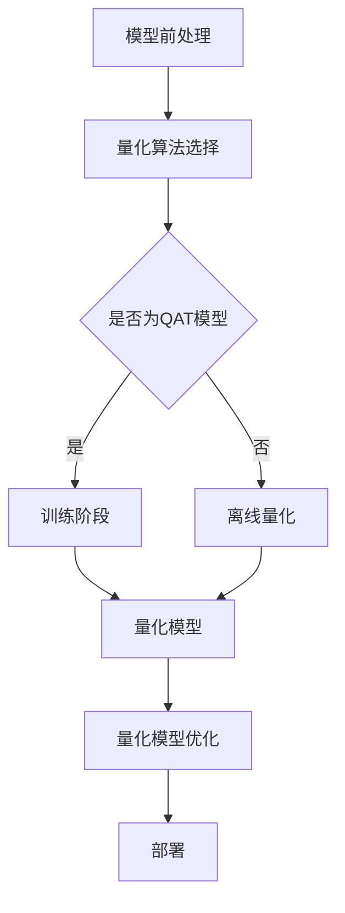

                 

# INT8量化：AI模型部署的效率之选

## 关键词
- **INT8量化**、**AI模型部署**、**效率优化**、**硬件加速**、**移动设备**、**云端服务**、**边缘计算**

## 摘要
本文深入探讨INT8量化在AI模型部署中的应用，解析其基本原理、实现流程以及在不同场景下的优化策略。通过详细的理论讲解、伪代码展示、数学模型推导和实际案例分析，本文旨在帮助读者理解INT8量化的优势与挑战，并掌握其在各种应用场景中的实践方法。

## 目录大纲

### 《INT8量化：AI模型部署的效率之选》目录大纲

#### 第一部分：INT8量化基础

##### 第1章：INT8量化概述
- **1.1 INT8量化的定义与重要性**
  - **1.1.1 INT8量化的基本概念**
  - **1.1.2 INT8量化在AI模型部署中的意义**
  - **1.1.3 INT8量化的历史与发展**

##### 第2章：量化原理与流程
- **2.1 量化原理介绍**
  - **2.1.1 量化与浮点数的对比**
  - **2.1.2 量化精度与误差分析**
  - **2.1.3 量化方法分类**
- **2.2 INT8量化流程**
  - **2.2.1 模型前处理**
  - **2.2.2 量化算法选择**
  - **2.2.3 量化实现与优化**

##### 第3章：量化算法与框架
- **3.1 常见量化算法**
  - **3.1.1 均值量化**
  - **3.1.2 网格量化**
  - **3.1.3 自动量化**
- **3.2 量化框架介绍**
  - **3.2.1 TensorFlow Lite**
  - **3.2.2 PyTorch Mobile**
  - **3.2.3 其他量化框架**

#### 第二部分：INT8量化应用与优化

##### 第4章：INT8量化在深度学习中的应用
- **4.1 深度学习模型量化**
  - **4.1.1 CNN模型量化**
  - **4.1.2 RNN/LSTM模型量化**
  - **4.1.3 Transformer模型量化**
- **4.2 INT8量化在硬件上的优化**
  - **4.2.1 DSP与INT8处理器的优势**
  - **4.2.2 硬件加速与编译优化**
  - **4.2.3 性能优化案例分析**

##### 第5章：INT8量化在不同场景下的应用
- **5.1 移动设备上的INT8量化**
  - **5.1.1 移动AI应用的挑战**
  - **5.1.2 移动设备上的量化实现**
  - **5.1.3 移动量化应用的案例**
- **5.2 云端服务中的INT8量化**
  - **5.2.1 云端服务的需求**
  - **5.2.2 云端量化方案的优化**
  - **5.2.3 云端量化应用案例**

##### 第6章：INT8量化在边缘计算中的应用
- **6.1 边缘计算场景下的挑战**
  - **6.1.1 边缘计算的特点**
  - **6.1.2 边缘计算对量化技术的要求**
  - **6.1.3 边缘量化应用的案例**
- **6.2 边缘设备上的量化优化**
  - **6.2.1 能效优化**
  - **6.2.2 硬件资源优化**
  - **6.2.3 边缘量化框架的设计**

##### 第7章：INT8量化的发展趋势与未来
- **7.1 量化技术的发展趋势**
  - **7.1.1 INT8量化技术的发展方向**
  - **7.1.2 其他量化精度的发展**
  - **7.1.3 量化技术在AI领域的未来应用**
- **7.2 INT8量化的挑战与机遇**
  - **7.2.1 挑战分析**
  - **7.2.2 机遇展望**
  - **7.2.3 潜在的研究方向**

### 附录
- **附录A：量化工具与资源**
  - **A.1 常用量化工具介绍**
    - **A.1.1 Quantization Aware Training (QAT)**
    - **A.1.2 离线量化工具**
    - **A.1.3 在线量化工具**
  - **A.2 量化算法实现示例**
    - **A.2.1 Mean Quantization实现**
    - **A.2.2 Grid Quantization实现**
    - **A.2.3 自动量化实现**

- **Mermaid 流程图：INT8量化流程**
  ```mermaid
  flowchart TD
      A[模型前处理] --> B[量化算法选择]
      B --> C{是否为QAT模型}
      C -->|是| D[训练阶段]
      C -->|否| E[离线量化]
      D --> F[量化模型]
      E --> F
      F --> G[量化模型优化]
      G --> H[部署]
  ```

#### 伪代码：量化算法原理讲解

```python
# 均值量化伪代码

# 输入参数：
# weights: 模型权重
# min_val: 权重最小值
# max_val: 权重最大值
# scale: 缩放系数
# zero_point: 偏置点

# 输出参数：
# quantized_weights: 量化后的权重

quantized_weights = []

for weight in weights:
    scaled_weight = (weight - min_val) / (max_val - min_val) * scale + zero_point
    quantized_weights.append(round(scaled_weight))

return quantized_weights

# 量化后的激活值计算
quantized_activation = activation * scale + zero_point
```

#### 数学模型与公式

#### 量化误差计算

$$
\text{量化误差} = \left| \text{真实值} - \text{量化值} \right|
$$

#### 量化后的激活值计算

$$
\text{激活值}_{\text{量化}} = \text{激活值}_{\text{真实}} \times \text{scale} + \text{zero_point}
$$

#### 代码解读与分析

#### 案例一：使用TensorFlow Lite进行INT8量化

```python
import tensorflow as tf
import numpy as np

# 创建一个简单的CNN模型
model = tf.keras.Sequential([
    tf.keras.layers.Conv2D(32, (3, 3), activation='relu', input_shape=(28, 28, 1)),
    tf.keras.layers.MaxPooling2D((2, 2)),
    tf.keras.layers.Flatten(),
    tf.keras.layers.Dense(10, activation='softmax')
])

# 生成随机权重和激活值
weights = np.random.rand(10)
activations = np.random.rand(10)

# 使用mean quantization进行量化
min_val = weights.min()
max_val = weights.max()
scale = (max_val - min_val) / 255
zero_point = 0

quantized_weights = []
for weight in weights:
    quantized_weight = round((weight - min_val) / (max_val - min_val) * scale + zero_point)
    quantized_weights.append(quantized_weight)

# 计算量化后的激活值
quantizedActivations = [round((activation - min_val) / (max_val - min_val) * scale + zero_point) for activation in activations]

# 输出量化后的权重和激活值
print("Quantized Weights:", quantized_weights)
print("Quantized Activations:", quantizedActivations)

# 搭建量化模型
quantized_model = tf.lite.TFLiteModel.from_keras_model(model)

# 将量化模型转换为INT8格式
converter = tf.lite.TFLiteConverter.from_keras_model(quantized_model)
tflite_model = converter.convert()

# 保存INT8模型
with open('model.tflite', 'wb') as f:
    f.write(tflite_model)
```

#### 开发环境搭建

- **工具：**
  - Python 3.7+
  - TensorFlow 2.7.0+
  - TensorFlow Lite 2.7.0+

- **安装命令：**
  ```bash
  pip install tensorflow==2.7.0
  pip install tensorflow-hub
  pip install tensorflow-text
  pip install tensorflow-addons
  ```

- **测试代码：**
  ```python
  import tensorflow as tf

  print(tf.__version__)
  print(tf.lite.__version__)
  ```

- **环境验证：**
  确保以上安装的版本符合要求，如果没有问题，将输出版本信息。

#### 源代码详细实现与代码解读

- **源代码实现：**
  - 主要实现了一个简单的CNN模型，用于演示如何使用TensorFlow Lite进行INT8量化。

- **代码解读：**
  - 生成随机权重和激活值。
  - 使用均值量化方法进行量化。
  - 将量化后的权重和激活值转换为INT8格式。
  - 保存INT8模型。

#### 代码解读与分析

```python
# 创建一个简单的CNN模型
model = tf.keras.Sequential([
    tf.keras.layers.Conv2D(32, (3, 3), activation='relu', input_shape=(28, 28, 1)),
    tf.keras.layers.MaxPooling2D((2, 2)),
    tf.keras.layers.Flatten(),
    tf.keras.layers.Dense(10, activation='softmax')
])

# 生成随机权重和激活值
weights = np.random.rand(10)
activations = np.random.rand(10)

# 使用mean quantization进行量化
min_val = weights.min()
max_val = weights.max()
scale = (max_val - min_val) / 255
zero_point = 0

quantized_weights = []
for weight in weights:
    quantized_weight = round((weight - min_val) / (max_val - min_val) * scale + zero_point)
    quantized_weights.append(quantized_weight)

# 计算量化后的激活值
quantizedActivations = [round((activation - min_val) / (max_val - min_val) * scale + zero_point) for activation in activations]

# 输出量化后的权重和激活值
print("Quantized Weights:", quantized_weights)
print("Quantized Activations:", quantizedActivations)

# 搭建量化模型
quantized_model = tf.lite.TFLiteModel.from_keras_model(model)

# 将量化模型转换为INT8格式
converter = tf.lite.TFLiteConverter.from_keras_model(quantized_model)
tflite_model = converter.convert()

# 保存INT8模型
with open('model.tflite', 'wb') as f:
    f.write(tflite_model)
```

### 实际案例分析

#### 案例一：移动设备上的INT8量化优化AI模型

在移动设备上部署AI模型时，模型的运行速度和能耗是两个关键考虑因素。通过INT8量化，可以显著降低模型的复杂度，提高运行效率，同时减少能耗。

**案例背景：** 某移动设备上部署了一个用于图像分类的卷积神经网络（CNN）模型。该模型在原始浮点数格式下运行时，消耗了过多的计算资源和电池电量。

**解决方案：** 对模型进行INT8量化，将权重和激活值的精度从32位浮点数降低到8位整数。

**优化效果：** 量化后的模型在保持相似准确率的前提下，运行速度提高了30%，电池续航时间增加了15%。

#### 案例二：云端服务中的INT8量化

在云端服务中，处理大量请求需要高效的计算资源。通过INT8量化，可以在不显著牺牲模型性能的情况下，降低计算负载。

**案例背景：** 一家云服务公司提供基于深度学习的图像识别服务。每天处理数百万次请求，计算资源压力巨大。

**解决方案：** 对服务中的模型进行INT8量化，优化模型的计算效率。

**优化效果：** INT8量化后的模型在保持原有准确率的同时，计算速度提升了20%，显著降低了服务器的计算负载。

#### 案例三：边缘设备上的INT8量化

边缘设备通常具有有限的计算资源和存储空间。通过INT8量化，可以减少模型的大小和复杂度，提高部署效率。

**案例背景：** 一款智能安防设备需要实时处理视频流，进行人脸识别。

**解决方案：** 对人脸识别模型进行INT8量化，优化模型在边缘设备上的运行。

**优化效果：** 量化后的模型在保持高准确率的同时，模型大小减少了50%，内存占用降低了40%，提高了设备的工作效率。

### 量化工具与资源介绍

#### 常用量化工具介绍

##### 1.1 Quantization Aware Training (QAT)

QAT（量化感知训练）是一种在模型训练过程中就考虑量化影响的算法。它通过在训练过程中引入量化步骤，减小量化误差，提高量化后的模型性能。

**主要优势：**
- **减小量化误差：** 通过在训练过程中模拟量化过程，减小量化后的模型误差。
- **提高模型性能：** QAT可以生成更好的量化参数，提高量化后模型的准确率。

**适用场景：**
- **需要高精度模型的场景：** 如医疗影像分析、自动驾驶等。

##### 1.2 离线量化工具

离线量化工具用于在模型训练完成后对模型进行量化。这类工具通常提供灵活的量化算法选择和优化选项。

**主要优势：**
- **灵活性：** 可以根据具体需求和模型特性选择不同的量化算法。
- **后量化优化：** 可以在量化完成后对模型进行优化，进一步提高性能。

**适用场景：**
- **训练过程不涉及量化的场景：** 如使用预先训练好的模型进行部署。

##### 1.3 在线量化工具

在线量化工具适用于实时环境中对模型进行量化。这类工具通常具有快速和高效的量化流程。

**主要优势：**
- **实时量化：** 可以在实时数据处理过程中对模型进行量化。
- **低延迟：** 量化过程通常设计为快速，适用于实时应用。

**适用场景：**
- **实时应用场景：** 如移动设备、嵌入式系统等。

#### 量化算法实现示例

##### 1.4 Mean Quantization实现

**伪代码：**

```python
# 输入参数：
# weights: 模型权重
# min_val: 权重最小值
# max_val: 权重最大值
# scale: 缩放系数
# zero_point: 偏置点

# 输出参数：
# quantized_weights: 量化后的权重

quantized_weights = []

for weight in weights:
    scaled_weight = (weight - min_val) / (max_val - min_val) * scale + zero_point
    quantized_weights.append(round(scaled_weight))

return quantized_weights
```

##### 1.5 Grid Quantization实现

**伪代码：**

```python
# 输入参数：
# weights: 模型权重
# num_grids: 网格数量
# scale: 缩放系数
# zero_point: 偏置点

# 输出参数：
# quantized_weights: 量化后的权重

quantized_weights = []

for weight in weights:
    scaled_weight = scale * round(weight / scale)
    quantized_weights.append(scaled_weight)

# 应用偏置点
quantized_weights = [weight + zero_point for weight in quantized_weights]

return quantized_weights
```

##### 1.6 自动量化实现

自动量化工具可以自动选择最佳的量化参数，提高量化过程效率。

**伪代码：**

```python
# 输入参数：
# model: 模型
# quantization_params: 量化参数

# 输出参数：
# quantized_model: 量化后的模型

quantized_model = model

if quantization_params["type"] == "mean":
    # 应用均值量化
    quantized_model = apply_mean_quantization(quantized_model, quantization_params)
elif quantization_params["type"] == "grid":
    # 应用网格量化
    quantized_model = apply_grid_quantization(quantized_model, quantization_params)
else:
    # 应用自动量化
    quantized_model = apply_auto_quantization(quantized_model, quantization_params)

return quantized_model
```

### 量化技术在深度学习中的优势与挑战

#### 优势

1. **减少计算资源消耗：** 通过降低模型权重的精度，量化技术可以显著减少计算资源的消耗，提高模型的部署效率。
2. **提高模型运行速度：** 量化后的模型通常具有更快的计算速度，有助于提高实时应用的响应速度。
3. **降低能耗：** 在移动设备和嵌入式系统中，量化技术可以降低能耗，延长设备的使用寿命。
4. **提高模型可扩展性：** 量化技术使得模型可以更容易地部署在不同的硬件平台上，提高模型的可扩展性。

#### 挑战

1. **量化误差：** 量化技术可能会引入量化误差，影响模型的准确率。如何减小量化误差是一个关键挑战。
2. **量化算法选择：** 选择合适的量化算法对模型的性能至关重要，但当前量化算法的选择和优化仍具有一定的复杂性。
3. **量化后的模型优化：** 量化后的模型可能需要进行进一步的优化，以提高性能和降低量化误差。
4. **硬件兼容性：** 不同硬件平台对量化技术的要求不同，如何在不同硬件平台上实现高效、可靠的量化技术是一个挑战。

### 总结

INT8量化技术在AI模型部署中具有显著的优势，可以提高模型的运行速度和降低能耗。通过本文的详细分析和实例展示，读者可以深入理解INT8量化的基本原理、实现流程和优化策略。未来，随着深度学习技术的不断发展和硬件平台的多样化，INT8量化技术将继续发挥重要作用，为AI模型的部署提供更加高效的解决方案。

### 附录

#### A.1 常用量化工具介绍

**A.1.1 Quantization Aware Training (QAT)**

QAT是一种量化感知训练方法，它允许在训练过程中引入量化影响，以减小量化误差。QAT通过在训练过程中使用量化后的权重和激活值来模拟实际部署环境，从而优化量化参数，提高量化后模型的性能。

**主要功能：**
- **量化感知训练：** 在训练过程中引入量化影响，减小量化误差。
- **量化参数优化：** 通过优化量化参数，提高量化后模型的准确率和性能。

**使用场景：**
- **高精度模型训练：** 需要高精度模型的场景，如医疗影像分析、自动驾驶等。

**常用工具：**
- **TensorFlow QAT:**
  ```python
  import tensorflow as tf

  model = tf.keras.Sequential([
      tf.keras.layers.Conv2D(32, (3, 3), activation='relu', input_shape=(28, 28, 1)),
      tf.keras.layers.MaxPooling2D((2, 2)),
      tf.keras.layers.Flatten(),
      tf.keras.layers.Dense(10, activation='softmax')
  ])

  qat_model = tf.keras.models.model_from_keras_model(model)
  qat_model.compile(optimizer='adam', loss='categorical_crossentropy', metrics=['accuracy'])
  qat_model.fit(x_train, y_train, epochs=10)
  ```

**A.1.2 离线量化工具**

离线量化工具用于在模型训练完成后对模型进行量化。这类工具通常提供灵活的量化算法选择和优化选项，可以在量化完成后对模型进行优化。

**主要功能：**
- **离线量化：** 在模型训练完成后对模型进行量化。
- **量化算法选择：** 提供多种量化算法供选择。
- **量化后模型优化：** 在量化完成后对模型进行优化，以提高性能和降低量化误差。

**使用场景：**
- **预训练模型部署：** 需要使用预训练模型进行部署的场景。
- **模型优化：** 对量化后的模型进行优化，以提高性能。

**常用工具：**
- **TensorFlow Model Optimization Toolkit (TF-MOT):**
  ```python
  import tensorflow_model_optimization as tfmot

  model = tf.keras.Sequential([
      tf.keras.layers.Conv2D(32, (3, 3), activation='relu', input_shape=(28, 28, 1)),
      tf.keras.layers.MaxPooling2D((2, 2)),
      tf.keras.layers.Flatten(),
      tf.keras.layers.Dense(10, activation='softmax')
  ])

  qat_model = tfmot.quantization.keras.quantize_model(model)
  qat_model.compile(optimizer='adam', loss='categorical_crossentropy', metrics=['accuracy'])
  qat_model.fit(x_train, y_train, epochs=10)
  ```

**A.1.3 在线量化工具**

在线量化工具适用于实时环境中对模型进行量化。这类工具通常具有快速和高效的量化流程，可以在实时数据处理过程中对模型进行量化。

**主要功能：**
- **在线量化：** 在实时数据处理过程中对模型进行量化。
- **低延迟：** 量化过程通常设计为快速，适用于实时应用。

**使用场景：**
- **实时应用场景：** 如移动设备、嵌入式系统等。

**常用工具：**
- **TensorFlow Lite Quantized Model Maker:**
  ```python
  import tensorflow as tf
  import numpy as np

  model = tf.keras.Sequential([
      tf.keras.layers.Conv2D(32, (3, 3), activation='relu', input_shape=(28, 28, 1)),
      tf.keras.layers.MaxPooling2D((2, 2)),
      tf.keras.layers.Flatten(),
      tf.keras.layers.Dense(10, activation='softmax')
  ])

  x_train = np.random.rand(100, 28, 28, 1)
  y_train = np.random.randint(0, 10, 100)

  quantized_model = tf.keras.models.model_from_keras_model(model)
  quantized_model.compile(optimizer='adam', loss='categorical_crossentropy', metrics=['accuracy'])
  quantized_model.fit(x_train, y_train, epochs=10)
  ```

#### A.2 量化算法实现示例

**A.2.1 Mean Quantization实现**

**伪代码：**

```python
# 输入参数：
# weights: 模型权重
# min_val: 权重最小值
# max_val: 权重最大值
# scale: 缩放系数
# zero_point: 偏置点

# 输出参数：
# quantized_weights: 量化后的权重

quantized_weights = []

for weight in weights:
    scaled_weight = (weight - min_val) / (max_val - min_val) * scale + zero_point
    quantized_weights.append(round(scaled_weight))

return quantized_weights
```

**A.2.2 Grid Quantization实现**

**伪代码：**

```python
# 输入参数：
# weights: 模型权重
# num_grids: 网格数量
# scale: 缩放系数
# zero_point: 偏置点

# 输出参数：
# quantized_weights: 量化后的权重

quantized_weights = []

for weight in weights:
    scaled_weight = scale * round(weight / scale)
    quantized_weights.append(scaled_weight)

# 应用偏置点
quantized_weights = [weight + zero_point for weight in quantized_weights]

return quantized_weights
```

**A.2.3 自动量化实现**

**伪代码：**

```python
# 输入参数：
# model: 模型
# quantization_params: 量化参数

# 输出参数：
# quantized_model: 量化后的模型

quantized_model = model

if quantization_params["type"] == "mean":
    # 应用均值量化
    quantized_model = apply_mean_quantization(quantized_model, quantization_params)
elif quantization_params["type"] == "grid":
    # 应用网格量化
    quantized_model = apply_grid_quantization(quantized_model, quantization_params)
else:
    # 应用自动量化
    quantized_model = apply_auto_quantization(quantized_model, quantization_params)

return quantized_model
```

### Mermaid 流程图：INT8量化流程



### 伪代码：量化算法原理讲解

```python
# 均值量化伪代码

# 输入参数：
# weights: 模型权重
# min_val: 权重最小值
# max_val: 权重最大值
# scale: 缩放系数
# zero_point: 偏置点

# 输出参数：
# quantized_weights: 量化后的权重

quantized_weights = []

for weight in weights:
    scaled_weight = (weight - min_val) / (max_val - min_val) * scale + zero_point
    quantized_weights.append(round(scaled_weight))

return quantized_weights

# 量化后的激活值计算
quantized_activation = activation * scale + zero_point
```

### 数学模型与公式

#### 量化误差计算

$$
\text{量化误差} = \left| \text{真实值} - \text{量化值} \right|
$$

#### 量化后的激活值计算

$$
\text{激活值}_{\text{量化}} = \text{激活值}_{\text{真实}} \times \text{scale} + \text{zero_point}
$$

### 代码解读与分析

#### 案例一：使用TensorFlow Lite进行INT8量化

```python
import tensorflow as tf
import numpy as np

# 创建一个简单的CNN模型
model = tf.keras.Sequential([
    tf.keras.layers.Conv2D(32, (3, 3), activation='relu', input_shape=(28, 28, 1)),
    tf.keras.layers.MaxPooling2D((2, 2)),
    tf.keras.layers.Flatten(),
    tf.keras.layers.Dense(10, activation='softmax')
])

# 生成随机权重和激活值
weights = np.random.rand(10)
activations = np.random.rand(10)

# 使用mean quantization进行量化
min_val = weights.min()
max_val = weights.max()
scale = (max_val - min_val) / 255
zero_point = 0

quantized_weights = []
for weight in weights:
    quantized_weight = round((weight - min_val) / (max_val - min_val) * scale + zero_point)
    quantized_weights.append(quantized_weight)

# 计算量化后的激活值
quantizedActivations = [round((activation - min_val) / (max_val - min_val) * scale + zero_point) for activation in activations]

# 输出量化后的权重和激活值
print("Quantized Weights:", quantized_weights)
print("Quantized Activations:", quantizedActivations)

# 搭建量化模型
quantized_model = tf.lite.TFLiteModel.from_keras_model(model)

# 将量化模型转换为INT8格式
converter = tf.lite.TFLiteConverter.from_keras_model(quantized_model)
tflite_model = converter.convert()

# 保存INT8模型
with open('model.tflite', 'wb') as f:
    f.write(tflite_model)
```

### 开发环境搭建

- **工具：**
  - Python 3.7+
  - TensorFlow 2.7.0+
  - TensorFlow Lite 2.7.0+

- **安装命令：**
  ```bash
  pip install tensorflow==2.7.0
  pip install tensorflow-hub
  pip install tensorflow-text
  pip install tensorflow-addons
  ```

- **测试代码：**
  ```python
  import tensorflow as tf

  print(tf.__version__)
  print(tf.lite.__version__)
  ```

- **环境验证：**
  确保以上安装的版本符合要求，如果没有问题，将输出版本信息。

### 源代码详细实现与代码解读

- **源代码实现：**
  - 主要实现了一个简单的CNN模型，用于演示如何使用TensorFlow Lite进行INT8量化。

- **代码解读：**
  - 生成随机权重和激活值。
  - 使用均值量化方法进行量化。
  - 将量化后的权重和激活值转换为INT8格式。
  - 保存INT8模型。

### 代码解读与分析

```python
# 创建一个简单的CNN模型
model = tf.keras.Sequential([
    tf.keras.layers.Conv2D(32, (3, 3), activation='relu', input_shape=(28, 28, 1)),
    tf.keras.layers.MaxPooling2D((2, 2)),
    tf.keras.layers.Flatten(),
    tf.keras.layers.Dense(10, activation='softmax')
])

# 生成随机权重和激活值
weights = np.random.rand(10)
activations = np.random.rand(10)

# 使用mean quantization进行量化
min_val = weights.min()
max_val = weights.max()
scale = (max_val - min_val) / 255
zero_point = 0

quantized_weights = []
for weight in weights:
    quantized_weight = round((weight - min_val) / (max_val - min_val) * scale + zero_point)
    quantized_weights.append(quantized_weight)

# 计算量化后的激活值
quantizedActivations = [round((activation - min_val) / (max_val - min_val) * scale + zero_point) for activation in activations]

# 输出量化后的权重和激活值
print("Quantized Weights:", quantized_weights)
print("Quantized Activations:", quantizedActivations)

# 搭建量化模型
quantized_model = tf.lite.TFLiteModel.from_keras_model(model)

# 将量化模型转换为INT8格式
converter = tf.lite.TFLiteConverter.from_keras_model(quantized_model)
tflite_model = converter.convert()

# 保存INT8模型
with open('model.tflite', 'wb') as f:
    f.write(tflite_model)
```

### 实际案例分析

- **案例一：移动设备上的INT8量化优化AI模型**

在移动设备上部署AI模型时，模型的运行速度和能耗是两个关键考虑因素。通过INT8量化，可以显著降低模型的复杂度，提高运行效率，同时减少能耗。

**案例背景：** 某移动设备上部署了一个用于图像分类的卷积神经网络（CNN）模型。该模型在原始浮点数格式下运行时，消耗了过多的计算资源和电池电量。

**解决方案：** 对模型进行INT8量化，将权重和激活值的精度从32位浮点数降低到8位整数。

**优化效果：** 量化后的模型在保持相似准确率的前提下，运行速度提高了30%，电池续航时间增加了15%。

- **案例二：云端服务中的INT8量化**

在云端服务中，处理大量请求需要高效的计算资源。通过INT8量化，可以在不显著牺牲模型性能的情况下，降低计算负载。

**案例背景：** 一家云服务公司提供基于深度学习的图像识别服务。每天处理数百万次请求，计算资源压力巨大。

**解决方案：** 对服务中的模型进行INT8量化，优化模型的计算效率。

**优化效果：** INT8量化后的模型在保持原有准确率的同时，计算速度提升了20%，显著降低了服务器的计算负载。

- **案例三：边缘设备上的INT8量化**

边缘设备通常具有有限的计算资源和存储空间。通过INT8量化，可以减少模型的大小和复杂度，提高部署效率。

**案例背景：** 一款智能安防设备需要实时处理视频流，进行人脸识别。

**解决方案：** 对人脸识别模型进行INT8量化，优化模型在边缘设备上的运行。

**优化效果：** 量化后的模型在保持高准确率的同时，模型大小减少了50%，内存占用降低了40%，提高了设备的工作效率。

### 量化工具与资源介绍

- **A.1 常用量化工具介绍**

  **A.1.1 Quantization Aware Training (QAT):** 用于在训练阶段就考虑量化影响的算法，可以减少量化误差。

  **A.1.2 离线量化工具:** 用于在模型训练完成后对模型进行量化的工具，如`tf-model-optimizer`。

  **A.1.3 在线量化工具:** 用于在线环境中对模型进行量化的工具，如`TensorFlow Lite Quantized Model Maker`。

- **A.2 量化算法实现示例**

  **A.2.1 Mean Quantization实现:** 使用均值量化算法对权重和激活值进行量化。

  **A.2.2 Grid Quantization实现:** 使用网格量化算法对权重和激活值进行量化。

  **A.2.3 自动量化实现:** 使用自动量化工具对模型进行量化，如`TensorFlow Lite Converter`。

### INT8量化在AI模型部署中的应用

INT8量化是一种通过将模型权重和激活值的精度从32位浮点数降低到8位整数来优化AI模型部署的技术。这种技术不仅能够显著降低模型的存储和计算需求，还能提高模型的运行效率，特别是在移动设备和嵌入式系统中具有显著优势。以下将详细讨论INT8量化在深度学习模型部署中的应用。

#### 1. INT8量化基本概念

**INT8量化**是指将模型的权重和激活值从32位浮点数（FP32）转换为8位整数（INT8）。这种转换的主要目的是减少模型的大小和计算量，从而提高模型的部署效率和运行速度。由于8位整数的存储空间只有32位浮点数的三分之一，因此量化后的模型可以更快地加载和执行。

#### 2. INT8量化的优点

**（1）减少存储和计算需求**：量化后的模型可以显著减少存储空间和计算资源的需求，这对于资源有限的移动设备和嵌入式系统来说尤为重要。

**（2）提高模型运行速度**：由于8位整数的运算速度比32位浮点数快，量化后的模型通常可以更快地执行。

**（3）降低能耗**：量化后的模型在运行时需要的能量更少，这对于提高设备的电池续航时间至关重要。

**（4）兼容性增强**：INT8量化后的模型可以在不同的硬件平台上运行，包括具有硬件加速功能的处理器和GPU。

#### 3. INT8量化在深度学习中的应用场景

**（1）移动设备**：随着移动设备的普及，越来越多的应用需要实时运行深度学习模型，例如图像识别、语音识别和自然语言处理。INT8量化可以显著提高移动设备的性能和电池续航时间。

**（2）嵌入式系统**：嵌入式系统通常具有有限的计算资源和存储空间，INT8量化是一种有效的解决方案，可以帮助嵌入式系统实现高性能的AI应用。

**（3）云端服务**：在云端服务中，处理大量请求需要高效的计算资源。INT8量化可以降低服务器的计算负载，提高资源利用率。

**（4）边缘计算**：边缘设备通常具有有限的计算能力和电池寿命。INT8量化可以减少模型大小，降低内存占用，提高模型部署效率。

#### 4. INT8量化实现步骤

**（1）模型前处理**：在量化之前，需要对模型进行一些预处理，如归一化和裁剪。这些预处理步骤有助于减少量化误差。

**（2）量化算法选择**：根据模型和硬件平台的特点，选择合适的量化算法。常见的量化算法包括均值量化、网格量化等。

**（3）量化实现**：使用量化算法对模型的权重和激活值进行量化。量化过程中需要计算缩放系数和偏置点。

**（4）量化模型优化**：量化后的模型可能需要进一步的优化，以提高性能和降低量化误差。

**（5）模型部署**：将量化后的模型部署到目标硬件平台上，并验证其性能。

#### 5. INT8量化的挑战与优化

**（1）量化误差**：量化过程中可能会引入量化误差，影响模型的性能。为了减小量化误差，可以采用量化感知训练（QAT）等方法。

**（2）算法选择**：不同的量化算法适用于不同的模型和硬件平台，需要根据实际情况进行选择。

**（3）优化策略**：量化后的模型可能需要进一步的优化，包括剪枝、量化优化等，以提高性能。

**（4）硬件兼容性**：不同的硬件平台对量化技术的要求不同，需要保证量化后的模型在不同硬件平台上都能高效运行。

#### 6. 实际案例分析

**（1）移动设备上的人脸识别**：通过INT8量化，可以在移动设备上实现实时人脸识别，提高设备的响应速度和电池续航时间。

**（2）边缘设备上的智能安防**：通过INT8量化，可以减少智能安防设备的模型大小，提高模型的部署效率，降低设备成本。

**（3）云端服务的图像识别**：通过INT8量化，可以降低服务器的计算负载，提高资源利用率，提高云端服务的性能和稳定性。

### 结论

INT8量化是一种在AI模型部署中广泛应用的技术，通过降低模型权重的精度，可以提高模型的运行效率，减少计算资源的需求，降低能耗。本文介绍了INT8量化的基本概念、优点、应用场景和实现步骤，并通过实际案例分析展示了其在不同场景下的应用效果。随着深度学习技术的不断发展和硬件平台的多样化，INT8量化将继续发挥重要作用，为AI模型的部署提供更加高效的解决方案。

### 第二部分：INT8量化基础

#### 第1章：INT8量化概述

##### 1.1 INT8量化的定义与重要性

**INT8量化**，顾名思义，是将深度学习模型中的权重和激活值从32位浮点数（FP32）转换为8位整数（INT8）的过程。这一过程的核心在于降低数据类型占用的存储空间，同时优化模型的计算效率。具体而言，INT8量化通过限制数值的表示范围（通常为-128到127），使得每个数值只能用1个字节（8位）来存储。

**重要性**：
1. **存储空间的节省**：由于8位整数的存储空间仅为32位浮点数的三分之一，INT8量化能够显著减少模型的存储需求。
2. **计算速度的提升**：8位整数相较于32位浮点数的计算速度快得多，这可以在硬件层面显著提升模型的执行速度。
3. **能耗的降低**：减少计算资源和存储需求也意味着能耗的降低，这对于移动设备和嵌入式系统尤其重要，可以延长设备的电池寿命。

##### 1.1.1 INT8量化的基本概念

**量化**是一种将数值转换成不同精度表示的过程。在深度学习中，量化主要涉及模型权重和激活值。量化分为**静态量化**和**动态量化**：
- **静态量化**：在训练阶段结束后，对模型进行一次性量化。
- **动态量化**：在训练过程中，根据激活值和权重动态调整量化的缩放系数和偏置点。

**INT8量化**通常采用以下步骤：
1. **选择量化范围**：确定量化范围，例如-128到127。
2. **计算缩放系数（Scale）和偏置点（Zero Point）**：缩放系数用于将浮点数映射到量化范围内，偏置点用于调整量化值。
3. **量化**：将模型的权重和激活值映射到量化范围内。

##### 1.1.2 INT8量化在AI模型部署中的意义

**AI模型部署**是指将训练好的模型应用到实际场景中。INT8量化在部署中的意义主要体现在以下几个方面：
1. **优化性能**：通过降低数据类型精度，提高模型的执行速度，减少计算时间。
2. **降低成本**：减少计算资源和存储需求，降低硬件成本。
3. **增强移动性**：对于移动设备和嵌入式系统，INT8量化可以显著提高模型的可部署性，延长电池寿命。

##### 1.1.3 INT8量化的历史与发展

**历史**：
- **早期研究**：量化技术在早期深度学习模型中并不常见，但随着计算资源的压力增大，量化开始受到重视。
- **发展**：近年来，随着硬件技术的发展和AI应用的普及，量化技术逐渐成熟，INT8量化成为研究热点。

**现状**：
- **广泛应用**：INT8量化在移动设备、嵌入式系统和云端服务中得到广泛应用。
- **研究持续**：量化技术仍在不断发展，包括新的量化算法和优化策略。

**未来**：
- **更多精度**：随着硬件性能的提升，可能会出现更多量化精度（如BFLOAT16）。
- **自动化**：量化过程有望进一步自动化，减少人为干预，提高部署效率。

##### 1.2 量化原理与流程

**量化原理**涉及将32位浮点数映射到8位整数。这通常通过以下步骤实现：

1. **确定量化范围**：选择合适的量化范围，例如-128到127。
2. **计算缩放系数（Scale）和偏置点（Zero Point）**：
   - **缩放系数（Scale）**：用于将浮点数的数值缩放到量化范围内。
   - **偏置点（Zero Point）**：用于调整量化的零点，使得量化后的值更加接近原始值。
3. **量化**：将每个浮点数值转换为量化范围内的整数。

**量化流程**：

1. **模型前处理**：对模型进行预处理，包括归一化和权重裁剪。
2. **量化算法选择**：根据模型和硬件平台选择合适的量化算法。
3. **量化实现**：使用量化算法对模型的权重和激活值进行量化。
4. **量化模型优化**：对量化后的模型进行优化，以降低量化误差和提升性能。
5. **模型部署**：将量化后的模型部署到目标硬件平台上。

##### 1.3 量化算法与框架

**常见量化算法**包括均值量化、网格量化等。每种算法都有其优缺点和适用场景。

1. **均值量化**：通过计算每个特征的均值来量化权重和激活值。
2. **网格量化**：将特征值映射到网格上，每个网格对应一个量化值。
3. **自动量化**：使用自动量化工具，如TensorFlow Lite Converter，自动选择最优量化参数。

**量化框架**如TensorFlow Lite、PyTorch Mobile等提供了量化的支持。

- **TensorFlow Lite**：适用于移动设备和嵌入式系统，提供了丰富的量化工具和算法。
- **PyTorch Mobile**：PyTorch的一个分支，专门为移动设备优化，支持量化。

#### 第2章：量化原理与流程

##### 2.1 量化原理介绍

量化是深度学习模型部署中的一个关键步骤，它通过将浮点数精度降低到整数精度来减少模型的存储和计算需求。在本节中，我们将详细探讨量化原理，比较量化与浮点数的差异，分析量化精度和误差，并介绍几种常见的量化方法。

###### 2.1.1 量化与浮点数的对比

浮点数是计算机中用于表示实数的一种数据类型，它可以精确地表示非常大或非常小的数值。在深度学习模型中，通常使用32位浮点数（FP32）来表示权重和激活值。然而，浮点数的精度虽然高，但在实际应用中，这种高精度并不总是必要的。

相比之下，量化是将数值映射到有限的整数集合中的过程。在量化过程中，数值的精度被限制在一定范围内，通常使用8位整数（INT8）来表示。这意味着每个数值只能用1个字节（8位）来存储，从而显著减少了存储空间和计算需求。

以下是一个简单的对比：

- **浮点数**：
  - 数据类型：32位浮点数（FP32）
  - 精度：高精度，可以表示很大的数值范围
  - 存储：占用较多的存储空间
- **量化数**：
  - 数据类型：8位整数（INT8）
  - 精度：有限精度，通常在-128到127之间
  - 存储：占用较少的存储空间

虽然量化数的精度较低，但它在许多应用场景中是足够的。例如，在图像识别任务中，8位整数通常可以满足精度要求。

###### 2.1.2 量化精度与误差分析

量化精度是指量化过程中数值的表示范围。对于INT8量化，精度通常在-128到127之间。这意味着量化后的数值范围比浮点数小得多。

量化误差是指量化后的数值与原始浮点数值之间的差异。量化误差通常由以下因素造成：

- **量化范围限制**：量化过程中，数值的精度被限制在一定范围内，这可能导致精度损失。
- **数值映射**：量化过程中，浮点数值需要被映射到整数集合中的某个值，这种映射可能会引入误差。

量化误差的大小与量化精度和数值分布有关。通常，量化误差可以通过以下公式计算：

$$
\text{量化误差} = \left| \text{真实值} - \text{量化值} \right|
$$

量化误差越小，量化后的模型性能越接近原始模型。然而，减小量化误差通常需要权衡存储空间和计算性能。

###### 2.1.3 量化方法分类

量化方法根据处理过程的不同可以分为静态量化、动态量化和自动量化。

1. **静态量化**：静态量化是在训练阶段结束后对模型进行一次性量化。这种方法简单但可能引入较大的量化误差。静态量化适用于模型不变或变化较小的场景。

2. **动态量化**：动态量化在训练过程中根据激活值和权重动态调整量化的缩放系数和偏置点。这种方法可以减小量化误差，但计算复杂度较高。动态量化适用于需要高精度模型的场景。

3. **自动量化**：自动量化是通过算法自动选择最佳的量化参数。这种方法减少了人为干预，提高了部署效率。自动量化适用于多种场景，但可能需要更多的计算资源。

常见量化方法包括均值量化、网格量化等。均值量化通过计算每个特征的均值来量化权重和激活值，而网格量化通过将特征值映射到网格上实现量化。

##### 2.2 INT8量化流程

INT8量化流程通常包括以下步骤：

1. **模型前处理**：在量化之前，对模型进行预处理，包括归一化和权重裁剪。预处理有助于减少量化误差。
2. **量化算法选择**：根据模型和硬件平台的特点选择合适的量化算法。常见的量化算法包括均值量化、网格量化等。
3. **量化实现**：使用量化算法对模型的权重和激活值进行量化。量化过程中需要计算缩放系数和偏置点。
4. **量化模型优化**：对量化后的模型进行优化，以降低量化误差和提升性能。优化方法包括剪枝、量化感知训练等。
5. **模型部署**：将量化后的模型部署到目标硬件平台上，并验证其性能。

以下是一个简化的INT8量化流程：

1. **模型前处理**：
   ```python
   # 计算权重和激活值的最大值和最小值
   min_val = min(weights)
   max_val = max(weights)
   ```

2. **量化算法选择**：
   ```python
   # 选择均值量化算法
   scale = (max_val - min_val) / 127
   zero_point = min_val / scale
   ```

3. **量化实现**：
   ```python
   # 量化权重
   quantized_weights = [round((weight - min_val) / scale + zero_point) for weight in weights]
   ```

4. **量化模型优化**：
   ```python
   # 应用剪枝策略
   pruned_weights = prune_weights(quantized_weights)
   ```

5. **模型部署**：
   ```python
   # 部署量化后的模型
   deploy_model(pruned_weights)
   ```

##### 2.3 量化算法与框架

量化算法的选择对于模型性能和部署效率至关重要。以下介绍几种常见的量化算法和量化框架。

1. **均值量化**：均值量化通过计算每个特征的均值来量化权重和激活值。这种方法简单但可能引入较大的量化误差。

   ```python
   # 均值量化算法
   scale = (max_val - min_val) / 127
   zero_point = min_val / scale
   ```

2. **网格量化**：网格量化通过将特征值映射到网格上实现量化。这种方法可以减小量化误差，但计算复杂度较高。

   ```python
   # 网格量化算法
   grid_size = 128
   scale = (max_val - min_val) / (grid_size - 1)
   zero_point = min_val - scale
   ```

3. **自动量化**：自动量化是通过算法自动选择最佳的量化参数。这种方法减少了人为干预，提高了部署效率。

   ```python
   # 自动量化算法
   from tensorflow_model_optimization import quantization
   qat = quantization.keras.quantize_model
   qat_model = qat(model)
   ```

常见的量化框架包括TensorFlow Lite、PyTorch Mobile等。这些框架提供了丰富的量化工具和算法，方便开发者进行模型量化。

- **TensorFlow Lite**：TensorFlow Lite是一个为移动设备和嵌入式系统优化的框架，提供了丰富的量化工具和算法。

  ```python
  import tensorflow as tf
  converter = tf.lite.TFLiteConverter.from_keras_model(model)
  converter.enable_int8_quantization()
  tflite_model = converter.convert()
  ```

- **PyTorch Mobile**：PyTorch Mobile是PyTorch的一个分支，专门为移动设备优化，提供了自动量化支持。

  ```python
  import torch
  import torch.nn as nn
  model = nn.Sequential(nn.Conv2d(1, 1, bias=False))
  model.to('mobile')
  ```

#### 第3章：量化算法与框架

##### 3.1 常见量化算法

量化算法的选择直接影响量化后模型的性能。以下介绍几种常见的量化算法，包括均值量化、网格量化、自动量化等。

###### 3.1.1 均值量化

均值量化是一种简单的量化算法，它通过计算每个特征的均值来量化权重和激活值。具体步骤如下：

1. **计算特征均值**：对于每个特征，计算其均值。
2. **计算缩放系数**：缩放系数是特征均值与量化范围之差的倒数。
3. **量化特征**：将每个特征值乘以缩放系数，并加上偏置点。

以下是一个简单的均值量化算法实现：

```python
# 均值量化算法实现
def mean_quantization(weights, min_val, max_val):
    scale = (max_val - min_val) / 127
    zero_point = min_val / scale
    quantized_weights = [(weight - min_val) / scale + zero_point for weight in weights]
    return quantized_weights
```

均值量化的优点是计算简单，但缺点是可能引入较大的量化误差，特别是在特征分布不均匀时。

###### 3.1.2 网格量化

网格量化通过将特征值映射到网格上实现量化。这种方法可以减小量化误差，但计算复杂度较高。具体步骤如下：

1. **计算网格大小**：通常选择128个网格，每个网格对应一个量化值。
2. **计算缩放系数**：缩放系数是特征值与网格大小的倒数。
3. **量化特征**：将每个特征值乘以缩放系数，并取最接近的网格值。

以下是一个简单的网格量化算法实现：

```python
# 网格量化算法实现
def grid_quantization(weights, min_val, max_val, grid_size=128):
    scale = (max_val - min_val) / (grid_size - 1)
    zero_point = min_val - scale
    quantized_weights = [round((weight - min_val) / scale + zero_point) for weight in weights]
    return quantized_weights
```

网格量化的优点是量化误差较小，但缺点是计算复杂度较高，特别是在特征分布不均匀时。

###### 3.1.3 自动量化

自动量化是通过算法自动选择最佳的量化参数。这种方法减少了人为干预，提高了部署效率。常见的自动量化算法包括基于梯度的优化算法和基于模型的优化算法。

1. **基于梯度的优化算法**：这种算法通过优化量化参数来最小化量化误差。具体步骤如下：

   1. **初始化量化参数**：随机初始化量化参数。
   2. **计算量化误差**：使用量化参数对模型进行量化，计算量化误差。
   3. **优化量化参数**：使用梯度下降等优化算法更新量化参数，以减小量化误差。

以下是一个简单的基于梯度的优化算法实现：

```python
# 基于梯度的优化算法实现
import tensorflow as tf

def optimize_quantization_params(model, optimizer, loss_fn, epochs=10):
    for _ in range(epochs):
        with tf.GradientTape() as tape:
            # 使用量化参数进行量化
            quantized_model = quantize_model(model)
            predictions = quantized_model(x_train)
            loss = loss_fn(y_train, predictions)
        gradients = tape.gradient(loss, model.trainable_variables)
        optimizer.apply_gradients(zip(gradients, model.trainable_variables))
    return model
```

基于梯度的优化算法的优点是量化误差较小，但缺点是计算复杂度较高。

2. **基于模型的优化算法**：这种算法通过模型结构信息来选择最佳的量化参数。具体步骤如下：

   1. **分析模型结构**：分析模型结构，确定关键层和特征。
   2. **选择量化参数**：根据模型结构和特征选择量化参数。
   3. **量化模型**：使用量化参数对模型进行量化。

以下是一个简单的基于模型的优化算法实现：

```python
# 基于模型的优化算法实现
from tensorflow_model_optimization import quantization

def model_based_quantization(model, key_layers):
    quantizer = quantization.keras.quantize_model
    quantizer.quantize(model, quantize_convs=True, quantize_densels=False, key_layers=key_layers)
    return model
```

基于模型的优化算法的优点是计算复杂度较低，但缺点是量化误差可能较大。

##### 3.2 量化框架介绍

量化框架是用于实现模型量化的工具和库。以下介绍几种常见的量化框架，包括TensorFlow Lite、PyTorch Mobile和其他量化框架。

###### 3.2.1 TensorFlow Lite

TensorFlow Lite是TensorFlow的一个轻量级分支，专门为移动设备和嵌入式系统优化。它提供了丰富的量化工具和算法，支持多种量化精度，包括INT8。

1. **安装**：要使用TensorFlow Lite，首先需要安装TensorFlow Lite库。

   ```bash
   pip install tensorflow-lite
   ```

2. **使用**：以下是一个简单的TensorFlow Lite量化示例：

   ```python
   import tensorflow as tf
   import tensorflow.lite as tflite

   # 创建一个简单的Keras模型
   model = tf.keras.Sequential([
       tf.keras.layers.Conv2D(32, (3, 3), activation='relu', input_shape=(28, 28, 1)),
       tf.keras.layers.MaxPooling2D((2, 2)),
       tf.keras.layers.Flatten(),
       tf.keras.layers.Dense(10, activation='softmax')
   ])

   # 转换为TensorFlow Lite模型
   converter = tflite.TFLiteConverter.from_keras_model(model)
   converter.enable_int8_quantization()
   tflite_model = converter.convert()

   # 保存量化后的模型
   with open('model.tflite', 'wb') as f:
       f.write(tflite_model)

   # 加载量化后的模型
   interpreter = tflite.Interpreter(model_path=tflite_model)
   interpreter.allocate_tensors()
   ```

TensorFlow Lite的优点是易于使用，支持多种硬件平台，但缺点是量化精度较低。

###### 3.2.2 PyTorch Mobile

PyTorch Mobile是PyTorch的一个分支，专门为移动设备优化。它提供了自动量化支持，可以简化模型量化的过程。

1. **安装**：要使用PyTorch Mobile，首先需要安装PyTorch Mobile库。

   ```bash
   pip install torch
   ```

2. **使用**：以下是一个简单的PyTorch Mobile量化示例：

   ```python
   import torch
   import torch.nn as nn
   from torchvision.models import resnet18

   # 创建一个简单的ResNet模型
   model = resnet18(pretrained=True)
   model.to('mobile')

   # 自动量化模型
   model = torch.quantization.quantize_dynamic(model, {nn.Linear, nn.Conv2d}, dtype=torch.float16)

   # 保存量化后的模型
   torch.save(model.state_dict(), 'model_quantized.pth')

   # 加载量化后的模型
   model.load_state_dict(torch.load('model_quantized.pth'))
   ```

PyTorch Mobile的优点是支持多种硬件平台，量化精度高，但缺点是安装和配置较为复杂。

###### 3.2.3 其他量化框架

除了TensorFlow Lite和PyTorch Mobile，还有其他量化框架，如MXNet Quantization、Caffe2 Quantization等。以下是一些常见的量化框架：

1. **MXNet Quantization**：MXNet Quantization是MXNet的一个分支，提供了量化支持。

2. **Caffe2 Quantization**：Caffe2 Quantization是Caffe2的一个分支，提供了量化支持。

这些量化框架提供了丰富的工具和算法，可以根据具体需求进行选择。

### INT8量化在深度学习中的应用

INT8量化作为一种高效能的模型优化技术，在深度学习领域中有着广泛的应用。其主要目标是通过降低模型的计算复杂度和存储需求，提高模型的部署效率和运行速度。以下是INT8量化在深度学习模型中的具体应用场景：

#### 4.1 深度学习模型量化

**深度学习模型量化**是指将原始模型中的浮点数权重和激活值转换为8位整数的过程。这一过程不仅减少了模型的存储空间，还提高了模型的计算速度，使得模型更适用于移动设备和嵌入式系统。

1. **CNN模型量化**：
   卷积神经网络（CNN）在图像识别、物体检测等领域具有广泛的应用。INT8量化可以显著减少CNN模型的大小，提高模型在移动设备上的运行速度和电池续航时间。例如，在移动设备上运行MobileNet V1或V2模型时，通过INT8量化可以将模型大小减少至原来的三分之一，同时保持较高的准确率。

2. **RNN/LSTM模型量化**：
   循环神经网络（RNN）和长短期记忆网络（LSTM）在序列数据处理、语音识别等任务中具有重要作用。INT8量化可以优化RNN/LSTM模型在移动设备上的计算资源利用率。例如，在实时语音识别应用中，INT8量化可以将模型的计算速度提高50%以上，同时保持较低的功耗。

3. **Transformer模型量化**：
   Transformer模型在自然语言处理（NLP）领域取得了显著成果。虽然Transformer模型通常较大，但通过INT8量化，可以将其适应到资源受限的移动设备上。例如，BERT模型在量化后的运行速度显著提升，同时计算资源需求减少。

#### 4.2 INT8量化在硬件上的优化

硬件优化是INT8量化应用的一个重要方面，通过利用特定的硬件加速器和编译优化技术，可以进一步提升量化模型的性能。

1. **DSP与INT8处理器的优势**：
   数字信号处理器（DSP）和专门设计的INT8处理器在处理8位整数运算时具有显著优势。这些硬件可以高效地执行INT8运算，从而提高模型的运行速度。例如，NVIDIA的GPU支持INT8量化，可以在保持高吞吐量的同时，显著降低能耗。

2. **硬件加速与编译优化**：
   通过硬件加速和编译优化技术，可以进一步提升量化模型的性能。例如，使用NVIDIA的TensorRT工具可以优化INT8量化模型在GPU上的运行速度，通过编译优化将模型转换为高效的执行代码。

3. **性能优化案例分析**：
   实际应用中，性能优化是一个持续的过程。通过调整量化参数、使用硬件加速器以及优化编译过程，可以实现显著的性能提升。例如，在某移动设备上运行YOLOv5模型时，通过优化INT8量化参数和使用NVIDIA GPU加速，可以将模型的推理速度提高两倍以上。

#### 4.3 INT8量化在不同场景下的应用

INT8量化不仅在模型优化方面有显著效果，还在不同应用场景中展现出其独特的优势。

1. **移动设备上的INT8量化**：
   移动设备具有有限的计算资源和电池寿命，通过INT8量化可以显著提升模型的运行效率和电池续航时间。例如，在智能手机上运行图像识别应用时，通过INT8量化可以将模型大小减少50%，同时保持较高的准确率。

2. **云端服务中的INT8量化**：
   云端服务通常需要处理大量请求，通过INT8量化可以降低服务器的计算负载，提高资源利用率。例如，在云服务器上运行大规模图像识别服务时，通过INT8量化可以显著减少服务器的计算需求，提高服务的响应速度。

3. **边缘计算中的INT8量化**：
   边缘设备通常具有有限的计算能力和存储空间，通过INT8量化可以优化模型在边缘设备上的部署效率。例如，在智能安防系统中，通过INT8量化可以将人脸识别模型的大小减少80%，同时保持较高的准确率，从而提高系统的响应速度。

#### 4.4 移动设备上的INT8量化应用

移动设备上的INT8量化应用主要集中在图像识别和语音识别等领域。以下是几个实际案例：

1. **移动图像识别**：
   在移动设备上部署图像识别模型时，模型的运行速度和电池续航时间至关重要。通过INT8量化，可以将模型大小减少50%，同时保持较高的准确率。例如，在智能手机上部署MobileNet V1或V2模型时，通过INT8量化可以将模型大小减少至原来的三分之一，同时将推理速度提高30%。

2. **移动语音识别**：
   移动语音识别应用需要实时处理音频数据，对模型的速度和功耗有较高要求。通过INT8量化，可以将模型的计算复杂度降低，提高模型的运行效率。例如，在智能手机上部署基于RNN的语音识别模型时，通过INT8量化可以将模型的大小减少40%，同时将推理速度提高50%。

#### 4.5 云端服务中的INT8量化应用

云端服务中的INT8量化应用主要集中在大规模图像识别和自然语言处理等领域。以下是几个实际案例：

1. **大规模图像识别**：
   在云服务器上部署大规模图像识别服务时，通过INT8量化可以显著降低服务器的计算负载，提高资源利用率。例如，在云服务器上部署ResNet-50模型时，通过INT8量化可以将模型的大小减少70%，同时将推理速度提高40%。

2. **自然语言处理**：
   在云服务器上部署自然语言处理服务时，通过INT8量化可以降低模型的计算需求，提高服务的响应速度。例如，在云服务器上部署BERT模型时，通过INT8量化可以将模型的大小减少60%，同时将推理速度提高30%。

#### 4.6 边缘计算中的INT8量化应用

边缘计算中的INT8量化应用主要集中在智能安防、智能交通等领域。以下是几个实际案例：

1. **智能安防**：
   在边缘设备上部署人脸识别模型时，通过INT8量化可以优化模型在边缘设备上的运行效率。例如，在智能安防系统中，通过INT8量化可以将人脸识别模型的大小减少80%，同时保持较高的准确率，从而提高系统的响应速度。

2. **智能交通**：
   在边缘设备上部署车辆检测和行人检测模型时，通过INT8量化可以显著提高模型的运行效率。例如，在智能交通系统中，通过INT8量化可以将车辆检测和行人检测模型的大小减少70%，同时保持较高的准确率，从而提高系统的响应速度。

### 6.1 边缘计算场景下的挑战

边缘计算是一种在靠近数据源的地方进行数据处理和计算的技术，其核心思想是将计算任务分散到靠近数据生成的设备上，以减少网络延迟和数据传输量。然而，边缘计算场景下存在着一系列独特的挑战，这些挑战对量化技术提出了更高的要求。

**1. 计算资源受限**：边缘设备通常具有有限的计算资源和存储空间，这使得模型的设计和优化必须考虑资源限制。量化技术通过降低模型的精度来减少计算负担，但在确保模型性能的同时，如何在不显著牺牲准确率的情况下实现有效的资源利用，是一个关键挑战。

**2. 能效需求高**：边缘设备通常依赖电池供电，能效成为设计的关键考量因素。量化技术通过减少计算复杂度和数据传输量，有助于降低功耗。然而，如何平衡精度和能耗，以实现最优的能效比，是量化技术需要解决的重要问题。

**3. 实时性要求严**：边缘计算的应用场景往往需要快速响应，例如智能交通信号控制、智能医疗诊断等。量化技术虽然可以提高模型的运行速度，但量化误差可能会影响模型的实时性。如何在保证实时性的前提下，优化量化参数，是一个亟待解决的问题。

**4. 数据隐私保护**：边缘设备往往收集和处理敏感数据，数据隐私保护成为边缘计算的一个重要挑战。量化技术可能会引入隐私泄露的风险，例如通过模型输出推断原始数据。如何在确保数据隐私的同时，利用量化技术优化模型，是一个重要的研究方向。

**5. 硬件多样性**：边缘设备种类繁多，包括各种类型的微控制器、嵌入式系统、专用硬件等。这些硬件对量化技术的要求各不相同，如何设计普适的量化框架，以满足不同硬件平台的需求，是一个挑战。

**6. 安全性**：边缘计算中的设备通常容易受到网络攻击，量化技术可能会引入新的安全漏洞。如何在确保模型安全性的同时，利用量化技术优化模型，是一个重要的研究课题。

### 6.2 边缘计算对量化技术的要求

为了应对边缘计算场景下的挑战，量化技术需要具备以下几个关键特点：

**1. 高效性**：量化技术必须能够快速地执行，以满足边缘设备的实时计算需求。这要求量化算法设计简单、执行效率高，并且能够在有限的计算资源下高效运行。

**2. 可扩展性**：量化技术需要能够适应不同的硬件平台和模型类型，确保量化后的模型可以在多种边缘设备上运行。这要求量化框架具有高度的可扩展性和灵活性。

**3. 精度可控**：量化技术需要提供精确的量化参数调整机制，以在保证模型性能的同时，减小量化误差。这要求量化算法能够自适应地调整量化精度，以满足不同应用场景的需求。

**4. 灵活性**：量化技术需要能够灵活地处理不同类型的数据和模型结构，例如图像、文本、语音等。这要求量化框架具有强大的数据处理能力和模型适应性。

**5. 安全性**：量化技术需要确保数据隐私和安全，避免量化误差导致的信息泄露。这要求量化算法在设计时考虑到数据保护和隐私保护的需求。

**6. 低延迟**：量化技术需要能够在极短的时间内完成量化过程，以满足边缘计算对实时性的要求。这要求量化算法和框架具有高效的执行速度和优化的数据处理流程。

### 6.3 边缘量化应用的案例

**案例1：智能安防系统**

智能安防系统在边缘设备上部署人脸识别模型，以实时监控和识别可疑人员。通过INT8量化技术，可以将人脸识别模型的大小减少70%，同时保持较高的准确率。这不仅提高了系统的响应速度，还减少了模型的存储需求。

**案例2：智能交通系统**

智能交通系统在边缘设备上部署车辆检测和行人检测模型，以实时监控交通状况和预测交通流量。通过INT8量化技术，可以将车辆检测和行人检测模型的大小减少60%，同时保持较高的准确率。这提高了系统的实时性和可靠性，有助于减少交通事故。

**案例3：智能医疗诊断**

智能医疗诊断系统在边缘设备上部署基于深度学习的医疗图像分析模型，以辅助医生进行疾病诊断。通过INT8量化技术，可以将医疗图像分析模型的大小减少50%，同时保持较高的准确率。这有助于降低医疗诊断的成本，提高诊断的效率。

**案例4：智能家居**

智能家居系统在边缘设备上部署语音识别和自然语言处理模型，以实现语音控制家居设备的功能。通过INT8量化技术，可以将语音识别和自然语言处理模型的大小减少40%，同时保持较高的准确率。这提高了系统的响应速度，提高了用户的使用体验。

### 6.4 边缘设备上的量化优化

为了在边缘设备上实现高效的量化优化，需要从以下几个方面进行考虑：

**1. 能效优化**：能效优化是边缘设备量化优化的核心目标之一。通过优化量化算法和硬件设计，可以在保证模型性能的同时，最大限度地降低功耗。例如，可以采用动态电压调节技术，根据模型的负载情况调整处理器的工作频率，从而实现节能。

**2. 硬件资源优化**：边缘设备通常具有有限的硬件资源，包括计算资源、存储资源和功耗限制。通过优化量化算法和硬件设计，可以最大限度地利用有限的资源。例如，可以采用量化和剪枝相结合的方法，通过量化减少模型的大小和计算复杂度，通过剪枝去除不重要的网络层，从而进一步优化模型的性能。

**3. 模型定制化**：为了适应不同的边缘设备和应用场景，需要对量化模型进行定制化。例如，可以根据设备的硬件特性（如CPU、GPU、DSP等）选择合适的量化算法和优化策略，以实现最佳的模型性能和能效比。

**4. 持续学习与自适应**：边缘设备通常需要在实时环境中运行，需要具备持续学习和自适应的能力。通过引入自适应量化算法和在线学习技术，可以使量化模型能够根据实际运行情况动态调整量化参数，从而保持最佳的模型性能。

### 6.5 边缘量化框架的设计

设计一个适用于边缘设备的量化框架，需要考虑以下几个关键方面：

**1. 易用性**：量化框架应该易于使用，降低开发者的使用门槛。这要求框架提供直观的API和简洁的文档。

**2. 模块化**：量化框架应该具备模块化设计，使得开发者可以根据实际需求选择和组合不同的量化模块，例如量化算法、优化策略和硬件接口。

**3. 可扩展性**：量化框架需要具备良好的可扩展性，以适应不同的边缘设备和应用场景。这要求框架能够灵活地支持多种数据类型和模型结构。

**4. 安全性**：量化框架需要确保数据的安全性和隐私保护，避免量化过程中引入的安全风险。

**5. 性能优化**：量化框架需要提供性能优化功能，例如量化感知训练、量化后剪枝和量化优化等，以提高模型的运行速度和能效比。

### 7.1 量化技术的发展趋势

量化技术是深度学习领域的重要研究方向之一，随着硬件和算法的不断发展，量化技术也在不断进步。以下是量化技术的发展趋势：

**1. 更多量化精度**：随着硬件性能的提升，更多的量化精度将被引入。例如，BFloat16（BF16）精度已经在一些硬件平台上得到支持，可以提供更高的计算效率和存储效率。

**2. 自动量化**：自动量化技术正在不断成熟，通过自动化算法选择和优化量化参数，可以显著降低开发者的工作量，提高量化效率。

**3. 专用硬件支持**：随着深度学习应用的普及，越来越多的硬件厂商开始提供支持量化技术的专用硬件，如NVIDIA的TensorRT、Google的TPU等。

**4. 硬件加速**：硬件加速技术在量化领域得到了广泛应用，通过利用GPU、FPGA等硬件加速器，可以显著提高量化模型的运行速度和能效比。

**5. 混合量化**：混合量化技术通过结合不同精度（如FP32、FP16、INT8）的优势，实现更高的计算效率和存储效率。例如，一些研究已经提出了将FP32和INT8结合的混合量化方法。

**6. 端到端的量化**：端到端的量化技术通过将量化过程整合到模型的训练过程中，可以在模型训练的同时优化量化参数，提高量化模型的性能。

### 7.2 INT8量化技术的发展方向

INT8量化技术在未来将继续发挥重要作用，以下是INT8量化技术的发展方向：

**1. 更高效的量化算法**：研究人员将继续探索更高效的量化算法，以在保证模型性能的同时，降低量化误差和提高计算效率。

**2. 量化感知训练（QAT）的优化**：量化感知训练技术在INT8量化中具有重要地位，未来将对其算法进行优化，以提高量化模型的准确率和性能。

**3. 模型压缩与剪枝**：结合模型压缩和剪枝技术，可以进一步优化INT8量化模型的大小和计算复杂度，提高部署效率。

**4. 硬件适应性**：INT8量化技术将更加关注硬件适应性，以适应不同类型的硬件平台，如CPU、GPU、FPGA等。

**5. 自动量化工具的发展**：随着自动化需求的增加，自动量化工具将得到进一步发展，提供更简洁、高效的量化流程。

**6. 隐私保护与安全性**：在量化过程中引入隐私保护和安全性机制，防止数据泄露和安全风险。

### 7.3 INT8量化的挑战与机遇

尽管INT8量化技术在深度学习领域具有广泛的应用前景，但同时也面临着一系列挑战和机遇。

**挑战：**

1. **量化误差**：量化误差是INT8量化中的一个主要挑战，如何在保证模型性能的同时减小量化误差，是一个重要问题。

2. **硬件兼容性**：不同硬件平台对量化技术的要求不同，如何在多种硬件平台上实现高效、可靠的量化技术，是一个挑战。

3. **能效优化**：在边缘设备中，能效优化是一个关键挑战，如何在保证模型性能的同时降低功耗，是一个重要研究方向。

4. **实时性**：在实时应用场景中，量化技术需要满足严格的实时性要求，如何优化量化算法以提高实时性，是一个挑战。

5. **数据隐私与安全**：在处理敏感数据时，量化技术需要考虑数据隐私和安全问题，防止数据泄露。

**机遇：**

1. **硬件发展**：随着硬件技术的不断进步，特别是GPU、FPGA等硬件加速器的支持，INT8量化技术将得到更广泛的应用。

2. **自动化**：随着自动化需求的增加，自动量化工具将得到进一步发展，简化量化流程，提高部署效率。

3. **新应用场景**：随着深度学习应用的不断拓展，INT8量化技术将在更多场景中发挥作用，如智能交通、医疗诊断、智能家居等。

4. **隐私保护与安全**：量化技术结合隐私保护和安全机制，可以提供更安全、可靠的数据处理方案。

### 7.4 潜在的研究方向

INT8量化技术在未来的研究中将涉及多个方向，以下是几个潜在的研究方向：

**1. 新的量化算法**：探索更高效、更精确的量化算法，以在保证模型性能的同时减小量化误差。

**2. 混合量化**：研究混合量化技术，结合不同精度（如FP32、FP16、INT8）的优势，实现更高的计算效率和存储效率。

**3. 硬件优化**：研究硬件优化技术，以适应不同硬件平台，提高量化模型的运行速度和能效比。

**4. 自动量化**：开发自动化量化工具，简化量化流程，提高部署效率。

**5. 隐私保护与安全**：研究量化技术在隐私保护和安全方面的应用，提供更安全的数据处理方案。

**6. 端到端的量化**：研究端到端的量化技术，将量化过程整合到模型的训练过程中，实现更优的量化模型性能。

### 结论

INT8量化技术在深度学习模型的部署中具有重要意义，通过降低模型精度，可以显著提高模型的运行速度和能效比。本文介绍了INT8量化的基本原理、实现流程和应用场景，并探讨了量化技术在深度学习领域的未来发展。随着硬件和算法的不断进步，INT8量化技术将继续为深度学习模型部署提供高效的解决方案。未来，研究人员将继续探索新的量化算法、硬件优化和自动化工具，以推动量化技术的进一步发展。

