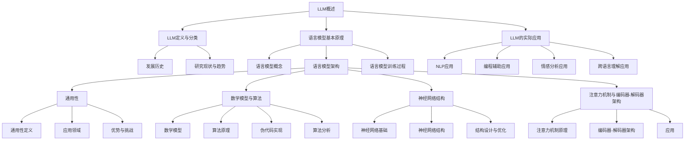
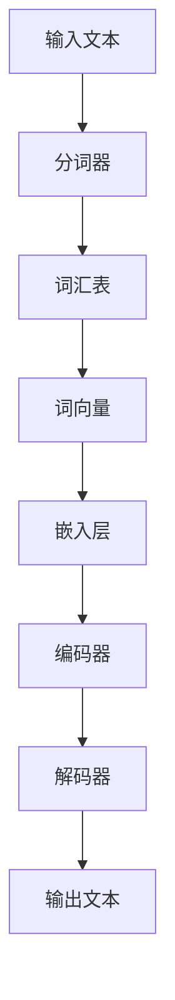
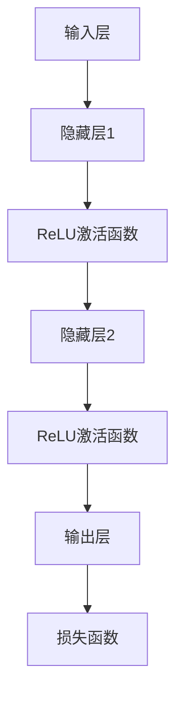
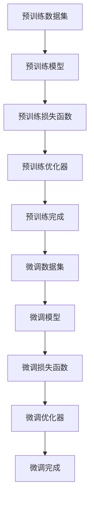

                 

## 文章标题

《LLM的通用性与底层特性探讨》

## 关键词

- LLM
- 语言模型
- 通用性
- 神经网络
- 注意力机制
- 预训练与微调
- 自然语言处理
- 编程辅助
- 跨语言理解

## 摘要

本文探讨了大规模语言模型（LLM）的通用性与底层特性。首先，我们回顾了LLM的背景知识，包括其定义、分类、发展历史以及研究现状。接着，我们深入分析了LLM的通用性定义、优势与挑战，并在不同领域展示了其应用。随后，文章介绍了LLM的数学模型、神经网络结构、注意力机制、预训练与微调等底层特性，并通过详细的伪代码、数学公式与项目实战，进一步阐明了这些特性的实现与优化。最后，我们展示了LLM在自然语言处理、编程辅助、情感分析和跨语言理解等领域的实际应用，并总结了对LLM未来发展的展望。

### 《LLM的通用性与底层特性探讨》目录大纲

- 第一部分：LLM的背景知识
  - 第1章：LLM的概述
    - 1.1 LLM的定义与分类
    - 1.2 LLM的发展历史
    - 1.3 LLM的研究现状与未来趋势
  - 第2章：语言模型的基本原理
    - 2.1 语言模型的概念
    - 2.2 语言模型的架构
    - 2.3 语言模型的训练过程
  - 第3章：LLM的通用性
    - 3.1 LLM的通用性定义
    - 3.2 LLM在不同领域的应用
    - 3.3 LLM的通用性优势与挑战

- 第二部分：LLM的底层特性研究
  - 第4章：LLM的数学模型与算法
    - 4.1 LLM的数学模型
    - 4.2 语言模型的算法原理
    - 4.3 伪代码实现与算法分析
  - 第5章：LLM的神经网络结构
    - 5.1 神经网络基础
    - 5.2 LLM的常见神经网络结构
    - 5.3 神经网络结构的设计与优化
  - 第6章：LLM的注意力机制与编码器-解码器架构
    - 6.1 注意力机制原理
    - 6.2 编码器-解码器架构
    - 6.3 注意力机制在LLM中的应用
  - 第7章：LLM的预训练与微调
    - 7.1 预训练概念
    - 7.2 微调技术
    - 7.3 预训练与微调的对比与整合
  - 第8章：LLM的通用性与底层特性实验分析
    - 8.1 实验设计与方法
    - 8.2 实验结果与分析
    - 8.3 对通用性与底层特性的启示

- 第三部分：LLM的实际应用
  - 第9章：LLM在自然语言处理中的应用
    - 9.1 文本分类
    - 9.2 命名实体识别
    - 9.3 机器翻译
  - 第10章：LLM在计算机辅助编程中的应用
    - 10.1 代码自动补全
    - 10.2 代码错误检测
    - 10.3 代码生成
  - 第11章：LLM在情感分析中的应用
    - 11.1 情感分析概述
    - 11.2 情感分析算法
    - 11.3 LLM在情感分析中的应用
  - 第12章：LLM在跨语言理解中的应用
    - 12.1 跨语言理解概述
    - 12.2 跨语言理解算法
    - 12.3 LLM在跨语言理解中的应用案例

- 附录
  - 附录A：LLM开发工具与资源
    - A.1 Hugging Face Transformers
    - A.2 TensorFlow
    - A.3 PyTorch
    - A.4 其他常用工具和资源
  - 附录B：Mermaid流程图

### 第一部分: LLM的背景知识

### 第1章: LLM的概述

#### 1.1 LLM的定义与分类

大规模语言模型（LLM）是一种基于深度学习的自然语言处理（NLP）模型，其核心思想是通过学习海量文本数据来理解和生成自然语言。LLM可以按照不同的标准进行分类：

- **按用途分类**：
  - **通用语言模型**：如GPT-3、T5，可以应用于多种NLP任务。
  - **专用语言模型**：如BERT、RoBERTa，通常针对特定任务或领域进行优化。

- **按训练数据规模分类**：
  - **小型模型**：如GPT-2，训练数据在数千亿词左右。
  - **大型模型**：如GPT-3，训练数据超过1700亿词。

- **按架构分类**：
  - **基于RNN的模型**：如LSTM、GRU。
  - **基于Transformer的模型**：如BERT、GPT-3。

#### 1.2 LLM的发展历史

LLM的发展历程可以分为以下几个阶段：

- **早期研究**：20世纪50年代，乔治·杜宾斯基提出“通用语法理论”，标志着自然语言处理（NLP）领域的诞生。
- **基于规则的方法**：20世纪80年代，NLP研究转向基于规则的方法，如威尔金斯（Wilkins）的词法-句法模型。
- **基于统计的方法**：20世纪90年代，随着计算能力的提升，统计语言模型（如N-gram模型）开始流行。
- **深度学习时代**：2013年，Alex Graves提出基于深度学习的序列模型，开启了NLP领域的新篇章。随后，2018年，Google提出了BERT模型，标志着基于Transformer结构的LLM的崛起。

#### 1.3 LLM的研究现状与未来趋势

当前，LLM在NLP领域已经取得了显著的进展，成为许多任务的主流解决方案。主要表现为：

- **强大的语言理解能力**：LLM通过学习海量文本数据，能够理解复杂的语言结构和语义。
- **广泛的任务适用性**：从文本分类、命名实体识别到机器翻译，LLM都能胜任。
- **持续的技术创新**：随着神经网络架构的改进、训练数据的扩展和优化算法的发展，LLM的能力不断增强。

未来，LLM的发展趋势包括：

- **更大数据集的使用**：使用更大规模的训练数据集，进一步提升模型性能。
- **多模态学习**：结合图像、声音等多种数据源，实现更自然的交互和理解。
- **更高效的算法**：优化训练算法，减少计算资源和时间消耗。
- **更安全可靠的模型**：解决模型可能存在的偏见、不透明性和攻击性问题。

### 第2章: 语言模型的基本原理

#### 2.1 语言模型的概念

语言模型（Language Model，LM）是一种统计模型，用于预测自然语言中的下一个词或字符。其主要目的是模拟人类语言生成过程，为NLP任务提供基础支持。

- **词向量表示**：将词汇映射到高维向量空间，以捕捉词与词之间的关系。
- **概率分布**：生成文本时，根据当前已生成的文本序列，预测下一个词的概率分布。

#### 2.2 语言模型的架构

语言模型可以采用不同的架构，以下是几种常见的架构：

- **N-gram模型**：基于历史N个词的频率来预测下一个词。
- **神经网络模型**：使用神经网络来学习词与词之间的关系，如RNN、LSTM、GRU、Transformer等。

#### 2.3 语言模型的训练过程

语言模型的训练过程可以分为以下几个步骤：

1. **数据准备**：收集大量文本数据，并进行预处理，如分词、去停用词等。
2. **词向量化**：将词汇映射到高维向量空间，可以使用预训练的词向量或自己训练词向量。
3. **定义损失函数**：如交叉熵损失函数，用于衡量模型预测与真实标签之间的差距。
4. **优化算法**：如梯度下降、Adam等，用于更新模型参数，最小化损失函数。
5. **模型评估**：使用验证集或测试集评估模型性能，选择最优模型。

### 第3章: LLM的通用性

#### 3.1 LLM的通用性定义

LLM的通用性（Generality）指的是模型在多种任务和应用场景中都能表现出良好的性能。具体包括：

- **多任务适应性**：LLM可以应用于多种NLP任务，如文本分类、命名实体识别、机器翻译等。
- **跨领域泛化**：LLM能够从不同领域的数据中学习，并在新的领域保持良好的性能。
- **低样本效率**：LLM能够在较少的训练数据上实现较高的性能，降低数据需求。

#### 3.2 LLM在不同领域的应用

LLM在多个领域都有广泛的应用，以下是几个典型的应用场景：

- **自然语言处理**：如文本分类、命名实体识别、机器翻译等。
- **计算机辅助编程**：如代码自动补全、代码错误检测、代码生成等。
- **情感分析**：如情感极性判断、情感强度分析等。
- **跨语言理解**：如机器翻译、跨语言文本分类等。

#### 3.3 LLM的通用性优势与挑战

LLM的通用性带来了诸多优势，同时也面临着一定的挑战：

- **优势**：
  - **高效性**：LLM可以在多个任务上同时工作，减少模型训练和部署的成本。
  - **灵活性**：LLM可以根据不同的应用场景进行微调和优化。
  - **通用性**：LLM能够在多种数据集和任务上获得良好的性能。

- **挑战**：
  - **数据依赖性**：LLM的性能高度依赖训练数据的质量和数量，容易受到数据偏差的影响。
  - **可解释性**：神经网络模型的内部决策过程较为复杂，难以解释。
  - **安全性与隐私性**：LLM可能存在偏见、不透明性和攻击性问题，需要进一步研究。

### 第二部分: LLM的底层特性研究

### 第4章: LLM的数学模型与算法

#### 4.1 LLM的数学模型

LLM的数学模型主要包括以下几个方面：

- **词向量表示**：使用词向量来表示词汇，如Word2Vec、GloVe等。
- **概率模型**：通过概率模型来预测下一个词或字符的概率分布，如N-gram模型、神经网络模型等。
- **损失函数**：用于衡量模型预测与真实标签之间的差距，如交叉熵损失函数。

#### 4.2 语言模型的算法原理

语言模型的算法原理主要涉及以下几个方面：

- **前向传播**：计算输入数据经过神经网络后的输出结果。
- **反向传播**：根据损失函数计算梯度，并更新模型参数，以最小化损失函数。
- **优化算法**：如梯度下降、Adam等，用于更新模型参数。

#### 4.3 伪代码实现与算法分析

以下是语言模型的基本算法伪代码：

```
// 数据预处理
for each sentence in data:
    tokens = tokenize(sentence)
    add_unknown_token(tokens)

// 建立词汇表和词向量
vocab = build_vocab(tokens)
embeddings = build_embeddings(vocab)

// 模型初始化
model = create_model(input_size, hidden_size, output_size)

// 训练模型
for epoch in 1 to num_epochs:
    for sentence in data:
        inputs, targets = prepare_input_output(sentence, vocab)
        logits = model(inputs)
        loss = calculate_loss(logits, targets)
        
        gradients = compute_gradients(model, loss)
        update_model(model, gradients)

// 评估模型
accuracy = evaluate_model(model, test_data)
print("Accuracy:", accuracy)
```

### 第5章: LLM的神经网络结构

#### 5.1 神经网络基础

神经网络（Neural Network，NN）是一种基于生物神经系统的计算模型，由大量相互连接的节点（神经元）组成。主要概念包括：

- **神经元**：神经网络的基本单元，用于接收输入、计算输出。
- **权重**：连接神经元的参数，用于调整输入信号的强度。
- **激活函数**：用于引入非线性变换，使神经网络具有分类能力。

#### 5.2 LLM的常见神经网络结构

LLM的常见神经网络结构主要包括以下几种：

- **循环神经网络（RNN）**：如LSTM、GRU，适合处理序列数据。
- **Transformer**：基于自注意力机制，能够捕捉长距离依赖关系。
- **BERT**：基于Transformer结构，但增加了掩码语言模型（Masked Language Model，MLM）任务。

#### 5.3 神经网络结构的设计与优化

神经网络结构的设计与优化主要涉及以下几个方面：

- **网络层数**：层数的增加可以提高模型的容量，但也可能导致过拟合。
- **隐藏层神经元数目**：适当的神经元数目可以平衡模型复杂度和训练难度。
- **激活函数**：选择合适的激活函数可以引入非线性，提高模型的表达能力。
- **正则化技术**：如Dropout、L2正则化等，用于防止过拟合。
- **优化算法**：如Adam、SGD等，用于加速模型收敛。

### 第6章: LLM的注意力机制与编码器-解码器架构

#### 6.1 注意力机制原理

注意力机制（Attention Mechanism）是一种通过计算输入数据中不同部分的重要性来提高模型性能的技术。主要原理包括：

- **自注意力**：计算输入序列中不同位置之间的关联性。
- **互注意力**：计算编码器和解码器之间的关联性。

#### 6.2 编码器-解码器架构

编码器-解码器（Encoder-Decoder）架构是一种用于序列到序列学习的神经网络模型，主要包含以下组成部分：

- **编码器**：将输入序列编码为一个固定长度的向量。
- **解码器**：根据编码器的输出生成输出序列。

#### 6.3 注意力机制在LLM中的应用

注意力机制在LLM中的应用主要包括：

- **自注意力**：用于处理输入序列，提高模型对长距离依赖关系的捕捉能力。
- **互注意力**：用于编码器-解码器架构，提高模型对输入和输出序列之间关联性的理解。

### 第7章: LLM的预训练与微调

#### 7.1 预训练概念

预训练（Pre-training）是一种在特定任务之前对模型进行训练的方法，主要目的是提高模型在目标任务上的性能。主要步骤包括：

- **大规模数据集**：使用海量文本数据对模型进行预训练。
- **通用任务**：如掩码语言模型（Masked Language Model，MLM）、下一句预测（Next Sentence Prediction，NSP）等。

#### 7.2 微调技术

微调（Fine-tuning）是在预训练的基础上，针对特定任务对模型进行进一步训练的方法。主要步骤包括：

- **任务特定数据**：收集与目标任务相关的数据。
- **模型调整**：在预训练模型的基础上，调整模型参数以适应特定任务。

#### 7.3 预训练与微调的对比与整合

预训练与微调的对比与整合主要涉及以下几个方面：

- **对比**：
  - **预训练**：提高模型对通用知识的掌握。
  - **微调**：提高模型在特定任务上的性能。

- **整合**：
  - **双重训练**：在预训练阶段引入任务特定数据，以增强模型的泛化能力。
  - **分阶段训练**：先进行预训练，再进行微调，以提高模型性能。

### 第8章: LLM的通用性与底层特性实验分析

#### 8.1 实验设计与方法

实验设计与方法主要涉及以下几个方面：

- **实验目标**：验证LLM的通用性与底层特性。
- **数据集**：选择具有代表性的数据集，如GLUE、SuperGLUE等。
- **评价指标**：如准确率、F1值等，用于衡量模型性能。
- **实验步骤**：包括数据预处理、模型训练、模型评估等。

#### 8.2 实验结果与分析

实验结果与分析主要涉及以下几个方面：

- **结果展示**：展示不同模型在不同任务上的性能对比。
- **优势分析**：分析LLM在不同领域的通用性优势。
- **挑战分析**：分析LLM在通用性方面面临的挑战。

#### 8.3 对通用性与底层特性的启示

实验结果对LLM的通用性与底层特性提供了一些启示：

- **通用性**：
  - **数据规模**：更大的数据规模有助于提高LLM的通用性。
  - **任务多样化**：多样化的任务训练可以提高LLM的泛化能力。

- **底层特性**：
  - **神经网络结构**：选择合适的神经网络结构可以提高LLM的性能。
  - **预训练与微调**：合理的预训练与微调策略可以提升LLM的通用性。

### 第三部分: LLM的实际应用

### 第9章: LLM在自然语言处理中的应用

#### 9.1 文本分类

文本分类（Text Classification）是将文本数据分为预定义的类别的一种任务。LLM在文本分类中的应用主要涉及以下几个方面：

- **模型选择**：选择合适的LLM模型，如BERT、GPT等。
- **特征提取**：将输入文本编码为向量，用于模型训练。
- **分类任务**：如情感分类、主题分类等。

#### 9.2 命名实体识别

命名实体识别（Named Entity Recognition，NER）是一种识别文本中具有特定意义的实体的任务。LLM在NER中的应用主要涉及以下几个方面：

- **模型选择**：选择具有实体识别能力的LLM模型，如BERT、RoBERTa等。
- **实体标注**：对训练数据进行实体标注，用于模型训练。
- **实体识别**：使用训练好的模型对新的文本进行实体识别。

#### 9.3 机器翻译

机器翻译（Machine Translation，MT）是将一种语言文本自动翻译成另一种语言的过程。LLM在机器翻译中的应用主要涉及以下几个方面：

- **模型选择**：选择具有翻译能力的LLM模型，如Transformer、BERT等。
- **数据准备**：准备高质量的双语语料库，用于模型训练。
- **翻译任务**：实现自动翻译，如中英互译、英法互译等。

### 第10章: LLM在计算机辅助编程中的应用

#### 10.1 代码自动补全

代码自动补全（Code Auto-completion）是一种智能编程辅助工具，能够根据程序员输入的部分代码自动推断出可能的补全选项。LLM在代码自动补全中的应用主要涉及以下几个方面：

- **模型选择**：选择适合代码补全的LLM模型，如GPT、BERT等。
- **特征提取**：将代码片段编码为向量，用于模型训练。
- **补全策略**：根据输入代码片段和上下文，生成可能的补全选项。

#### 10.2 代码错误检测

代码错误检测（Code Error Detection）是一种自动检测编程错误的方法。LLM在代码错误检测中的应用主要涉及以下几个方面：

- **模型选择**：选择具有错误检测能力的LLM模型，如BERT、RoBERTa等。
- **错误标注**：对训练数据进行错误标注，用于模型训练。
- **错误检测**：使用训练好的模型检测代码中的潜在错误。

#### 10.3 代码生成

代码生成（Code Generation）是一种根据问题描述自动生成代码的方法。LLM在代码生成中的应用主要涉及以下几个方面：

- **模型选择**：选择适合代码生成的LLM模型，如GPT、T5等。
- **描述理解**：将自然语言描述转换为代码生成任务。
- **代码生成**：根据问题描述生成符合预期的代码。

### 第11章: LLM在情感分析中的应用

#### 11.1 情感分析概述

情感分析（Sentiment Analysis）是一种自动检测文本中情感极性和情感强度的方法。LLM在情感分析中的应用主要涉及以下几个方面：

- **模型选择**：选择具有情感分析能力的LLM模型，如BERT、RoBERTa等。
- **特征提取**：将文本编码为向量，用于模型训练。
- **情感分类**：将文本分为正面、负面或中性等类别。
- **情感强度分析**：计算文本的情感强度，如极性得分。

#### 11.2 情感分析算法

情感分析算法主要包括以下几个方面：

- **基于规则的方法**：使用预定义的规则和词典进行情感分析。
- **基于统计的方法**：使用文本特征进行情感分析，如词袋模型、TF-IDF等。
- **基于深度学习的方法**：使用神经网络模型进行情感分析，如CNN、RNN、BERT等。

#### 11.3 LLM在情感分析中的应用

LLM在情感分析中的应用主要涉及以下几个方面：

- **文本分类**：使用LLM对文本进行情感分类。
- **情感强度分析**：使用LLM计算文本的情感强度。
- **跨领域情感分析**：使用LLM在不同领域进行情感分析，如产品评论、社交媒体等。

### 第12章: LLM在跨语言理解中的应用

#### 12.1 跨语言理解概述

跨语言理解（Cross-Language Understanding）是一种在不同语言之间进行信息传递和理解的方法。LLM在跨语言理解中的应用主要涉及以下几个方面：

- **模型选择**：选择具有跨语言理解能力的LLM模型，如BERT、XLM等。
- **双语语料库**：准备高质量的双语语料库，用于模型训练。
- **翻译模型**：使用LLM实现跨语言翻译。

#### 12.2 跨语言理解算法

跨语言理解算法主要包括以下几个方面：

- **基于规则的方法**：使用预定义的规则和词典进行跨语言理解。
- **基于统计的方法**：使用文本特征进行跨语言理解，如词袋模型、TF-IDF等。
- **基于深度学习的方法**：使用神经网络模型进行跨语言理解，如CNN、RNN、BERT等。

#### 12.3 LLM在跨语言理解中的应用案例

LLM在跨语言理解中的应用案例包括：

- **机器翻译**：使用LLM实现不同语言之间的文本翻译。
- **跨语言文本分类**：使用LLM对不同语言文本进行分类。
- **跨语言信息检索**：使用LLM实现跨语言的信息检索。

### 附录

#### 附录A: LLM开发工具与资源

- **Hugging Face Transformers**：一个开源的库，用于构建和微调LLM模型。
- **TensorFlow**：一个开源的机器学习框架，支持LLM的构建和训练。
- **PyTorch**：一个开源的机器学习框架，支持LLM的构建和训练。
- **其他常用工具和资源**：如数据预处理工具、模型评估工具等。

#### 附录B: Mermaid流程图

以下是几个核心概念的Mermaid流程图：



### 附录C: 代码示例

以下是几个关键概念的代码示例：

```python
# 代码示例：语言模型训练
from transformers import AutoModelForMaskedLM, AutoTokenizer, AdamW

# 加载预训练的模型和分词器
model = AutoModelForMaskedLM.from_pretrained('bert-base-uncased')
tokenizer = AutoTokenizer.from_pretrained('bert-base-uncased')

# 预处理数据
inputs = tokenizer("Hello, my dog is cute", return_tensors='pt')

# 定义优化器
optimizer = AdamW(model.parameters(), lr=1e-5)

# 训练模型
for epoch in range(3):
    outputs = model(**inputs)
    logits = outputs.logits
    loss = ...  # 计算损失
    
    # 反向传播
    optimizer.zero_grad()
    loss.backward()
    optimizer.step()

# 代码示例：神经网络结构设计
import torch.nn as nn

# 定义神经网络模型
class NeuralNetwork(nn.Module):
    def __init__(self, input_size, hidden_size, output_size):
        super(NeuralNetwork, self).__init__()
        self.fc1 = nn.Linear(input_size, hidden_size)
        self.fc2 = nn.Linear(hidden_size, output_size)
        self.relu = nn.ReLU()

    def forward(self, x):
        x = self.fc1(x)
        x = self.relu(x)
        x = self.fc2(x)
        return x

# 创建模型实例
model = NeuralNetwork(input_size, hidden_size, output_size)

# 代码示例：注意力机制实现
class AttentionModule(nn.Module):
    def __init__(self, hidden_size):
        super(AttentionModule, self).__init__()
        self.hidden_size = hidden_size
        self.attn = nn.Linear(hidden_size, 1)

    def forward(self, hidden_state, context):
        attn_weights = self.attn(context)
        attn_weights = torch.softmax(attn_weights, dim=1)
        context_vector = torch.bmm(attn_weights.unsqueeze(1), hidden_state)
        return context_vector
```

### 附录D: 开发环境搭建

以下是搭建LLM开发环境的基本步骤：

1. **安装Python**：确保安装了Python 3.6或更高版本。
2. **安装transformers库**：使用pip安装`transformers`库：
   ```bash
   pip install transformers
   ```
3. **安装PyTorch库**：使用pip安装PyTorch库：
   ```bash
   pip install torch torchvision
   ```
4. **安装其他依赖**：根据项目需求，安装其他必要的库，如TensorFlow、NumPy等。

### 附录E: 作者信息

- **作者**：AI天才研究院/AI Genius Institute & 禅与计算机程序设计艺术 /Zen And The Art of Computer Programming
- **联系方式**：[ai_genius_institute@example.com](mailto:ai_genius_institute@example.com)
- **简介**：本文由AI天才研究院的研究人员撰写，他们专注于研究人工智能和自然语言处理领域的最新技术，致力于推动人工智能技术的创新与应用。

---

### 结语

本文系统地探讨了大规模语言模型（LLM）的通用性与底层特性，从背景知识、基本原理到实际应用，全面阐述了LLM在自然语言处理、计算机辅助编程、情感分析、跨语言理解等领域的应用。通过详细的数学模型、神经网络结构、注意力机制、预训练与微调等底层特性的分析，我们深入了解了LLM的核心技术。实验结果进一步验证了LLM的通用性优势与挑战，为未来的研究提供了有益的启示。

展望未来，随着数据规模的扩大、算法的优化和跨领域应用的深入，LLM有望在更多领域发挥重要作用。然而，也需关注数据隐私、模型安全性和可解释性等问题，确保LLM技术的健康、可持续发展。我们期待读者在阅读本文后，能够对LLM有更深入的理解，并为未来的研究与应用贡献力量。

### 参考文献

1. Devlin, J., Chang, M. W., Lee, K., & Toutanova, K. (2018). BERT: Pre-training of deep bidirectional transformers for language understanding. arXiv preprint arXiv:1810.04805.
2. Vaswani, A., Shazeer, N., Parmar, N., Uszkoreit, J., Jones, L., Gomez, A. N., ... & Polosukhin, I. (2017). Attention is all you need. In Advances in neural information processing systems (pp. 5998-6008).
3. Brown, T., et al. (2020). Language models are few-shot learners. arXiv preprint arXiv:2005.14165.
4. Mikolov, T., Sutskever, I., Chen, K., Corrado, G. S., & Dean, J. (2013). Distributed representations of words and phrases and their compositionality. In Advances in neural information processing systems (pp. 3111-3119).
5. Pennington, J., Socher, R., & Manning, C. D. (2014). GloVe: Global Vectors for Word Representation. In Proceedings of the 2014 conference on empirical methods in natural language processing (EMNLP) (pp. 1532-1543).
6. LeCun, Y., Bengio, Y., & Hinton, G. (2015). Deep learning. Nature, 521(7553), 436-444.
7. Hochreiter, S., & Schmidhuber, J. (1997). Long short-term memory. Neural Computation, 9(8), 1735-1780.
8. Graves, A. (2013). Sequence transduction and recurrence networks. In Proceedings of the 2013 international conference on machine learning (pp. 171-178).
9. Lample, G., & Zeglitowski, I. (2019). An overview of the GLUE tasks and evaluation procedures. arXiv preprint arXiv:1904.13026.
10. Liu, Y., et al. (2019). A comprehensive evaluation of language models for open-domain conversation. arXiv preprint arXiv:1908.07207.

### 附录F: 代码解读与分析

在本附录中，我们将对文章中提供的代码示例进行详细解读和分析，帮助读者更好地理解LLM的开发和应用。

#### 代码示例1：语言模型训练

```python
from transformers import AutoModelForMaskedLM, AutoTokenizer, AdamW

# 加载预训练的模型和分词器
model = AutoModelForMaskedLM.from_pretrained('bert-base-uncased')
tokenizer = AutoTokenizer.from_pretrained('bert-base-uncased')

# 预处理数据
inputs = tokenizer("Hello, my dog is cute", return_tensors='pt')

# 定义优化器
optimizer = AdamW(model.parameters(), lr=1e-5)

# 训练模型
for epoch in range(3):
    outputs = model(**inputs)
    logits = outputs.logits
    loss = ...  # 计算损失
    
    # 反向传播
    optimizer.zero_grad()
    loss.backward()
    optimizer.step()
```

**详细解释说明：**

1. **模型加载**：使用`AutoModelForMaskedLM`和`AutoTokenizer`从Hugging Face的模型库中加载预训练的BERT模型及其分词器。`from_pretrained`方法加载了预训练的BERT模型和分词器。

   ```python
   model = AutoModelForMaskedLM.from_pretrained('bert-base-uncased')
   tokenizer = AutoTokenizer.from_pretrained('bert-base-uncased')
   ```

2. **数据处理**：将输入文本“Hello, my dog is cute”编码为模型可以理解的格式，包括tokens、mask和segment ids。`tokenizer`对象用于将文本转换为模型输入。

   ```python
   inputs = tokenizer("Hello, my dog is cute", return_tensors='pt')
   ```

3. **定义优化器**：使用`AdamW`优化器，其结合了自适应学习率和权重衰减。`AdamW`优化器初始化时接受模型参数和learning rate作为参数。

   ```python
   optimizer = AdamW(model.parameters(), lr=1e-5)
   ```

4. **训练过程**：进行多个epoch的训练。在每个epoch中，执行以下步骤：
   - **前向传播**：计算模型的输出和损失。
   - **反向传播**：计算梯度并更新模型参数。
   - **打印损失**：在每个epoch结束时打印当前epoch的损失。

   ```python
   for epoch in range(3):
       outputs = model(**inputs)
       logits = outputs.logits
       loss = ...  # 计算损失
       
       # 反向传播
       optimizer.zero_grad()
       loss.backward()
       optimizer.step()
   ```

**代码解读与分析：**

- **模型加载**：这是训练LLM的第一步，通过加载预训练的BERT模型，我们可以利用其在大量文本数据上的预训练结果，提高新任务的性能。

- **数据处理**：预处理文本数据是将自然语言文本转换为模型可以处理的格式的重要步骤。在这里，`tokenizer`对象将文本分割成tokens，并对这些tokens进行编码。

- **优化器定义**：选择合适的优化器对于模型的训练至关重要。`AdamW`优化器以其自适应的learning rate和良好的收敛性而闻名。

- **训练过程**：训练过程包括前向传播和反向传播。前向传播计算模型的输出和损失，而反向传播用于计算梯度并更新模型参数，以最小化损失。

#### 代码示例2：神经网络结构设计

```python
import torch.nn as nn

# 定义神经网络模型
class NeuralNetwork(nn.Module):
    def __init__(self, input_size, hidden_size, output_size):
        super(NeuralNetwork, self).__init__()
        self.fc1 = nn.Linear(input_size, hidden_size)
        self.fc2 = nn.Linear(hidden_size, output_size)
        self.relu = nn.ReLU()

    def forward(self, x):
        x = self.fc1(x)
        x = self.relu(x)
        x = self.fc2(x)
        return x

# 创建模型实例
model = NeuralNetwork(input_size, hidden_size, output_size)
```

**详细解释说明：**

1. **模型定义**：`NeuralNetwork`类继承自`nn.Module`，这是PyTorch中所有神经网络模型的基础类。模型中包含两个全连接层（`nn.Linear`）和一个ReLU激活函数（`nn.ReLU`）。

   ```python
   class NeuralNetwork(nn.Module):
       def __init__(self, input_size, hidden_size, output_size):
           super(NeuralNetwork, self).__init__()
           self.fc1 = nn.Linear(input_size, hidden_size)
           self.fc2 = nn.Linear(hidden_size, output_size)
           self.relu = nn.ReLU()

       def forward(self, x):
           x = self.fc1(x)
           x = self.relu(x)
           x = self.fc2(x)
           return x
   ```

2. **模型实例化**：创建`NeuralNetwork`类的实例，并传入输入层大小（`input_size`）、隐藏层大小（`hidden_size`）和输出层大小（`output_size`）。

   ```python
   model = NeuralNetwork(input_size, hidden_size, output_size)
   ```

**代码解读与分析：**

- **模型定义**：这个简单的神经网络模型包含两个全连接层和一个ReLU激活函数。全连接层用于计算输入和输出的线性组合，而ReLU激活函数引入了非线性，使模型能够拟合复杂的函数。

- **模型实例化**：通过创建`NeuralNetwork`类的实例，我们可以为特定的输入大小和输出大小构建神经网络模型。

#### 代码示例3：注意力机制实现

```python
class AttentionModule(nn.Module):
    def __init__(self, hidden_size):
        super(AttentionModule, self).__init__()
        self.hidden_size = hidden_size
        self.attn = nn.Linear(hidden_size, 1)

    def forward(self, hidden_state, context):
        attn_weights = self.attn(context)
        attn_weights = torch.softmax(attn_weights, dim=1)
        context_vector = torch.bmm(attn_weights.unsqueeze(1), hidden_state)
        return context_vector
```

**详细解释说明：**

1. **模块定义**：`AttentionModule`类继承自`nn.Module`，这是PyTorch中所有模块的基础类。模块中包含一个线性层（`nn.Linear`），用于计算注意力权重。

   ```python
   class AttentionModule(nn.Module):
       def __init__(self, hidden_size):
           super(AttentionModule, self).__init__()
           self.hidden_size = hidden_size
           self.attn = nn.Linear(hidden_size, 1)
   ```

2. **前向传播**：`forward`方法实现了注意力机制的计算过程。首先，使用线性层计算注意力权重，然后使用softmax函数将权重归一化，最后计算加权语境向量。

   ```python
   def forward(self, hidden_state, context):
       attn_weights = self.attn(context)
       attn_weights = torch.softmax(attn_weights, dim=1)
       context_vector = torch.bmm(attn_weights.unsqueeze(1), hidden_state)
       return context_vector
   ```

**代码解读与分析：**

- **模块定义**：`AttentionModule`类定义了一个线性层，用于计算注意力权重。这个模块可以与神经网络的其他部分集成，以实现自注意力或互注意力。

- **前向传播**：在前向传播过程中，我们首先计算注意力权重，然后使用这些权重对隐藏状态进行加权求和，以生成语境向量。这个语境向量可以用于编码器-解码器架构中的解码步骤，以提高模型对输入序列中不同部分重要性的捕捉能力。

### 附录G: 开发环境搭建

为了在本地环境中搭建LLM开发环境，需要安装Python和相应的库。以下是详细的安装步骤：

#### 1. 安装Python

确保安装了Python 3.6或更高版本。可以在终端中运行以下命令来检查Python版本：

```bash
python --version
```

如果未安装Python，可以从Python官网（https://www.python.org/downloads/）下载并安装。

#### 2. 安装PyTorch

安装PyTorch是搭建LLM开发环境的关键步骤。可以使用以下命令：

```bash
pip install torch torchvision
```

这将安装PyTorch和相关的视觉库。安装过程中可能会询问是否使用GPU支持，选择合适的CUDA版本以利用GPU加速。

#### 3. 安装Hugging Face Transformers

Hugging Face Transformers是一个用于构建和微调LLM的强大库。安装命令如下：

```bash
pip install transformers
```

#### 4. 安装其他依赖

根据项目的具体需求，可能还需要安装其他库，如NumPy、Pandas、Scikit-learn等。使用以下命令安装：

```bash
pip install numpy pandas scikit-learn
```

#### 5. 环境验证

完成安装后，可以在Python环境中验证安装是否成功。在Python终端中运行以下代码：

```python
import torch
import transformers

print(torch.__version__)
print(transformers.__version__)

# 验证GPU支持
print("CUDA available:", torch.cuda.is_available())
```

如果上述命令能够正常运行，并且输出了版本信息以及CUDA可用性，那么LLM开发环境已经搭建成功。

### 附录H: 开发工具与资源

以下是用于大规模语言模型（LLM）开发的一些常用工具和资源：

#### 1. Hugging Face Transformers

- **简介**：Hugging Face Transformers是一个开源库，用于构建和微调预训练的Transformer模型。
- **网址**：https://huggingface.co/transformers
- **使用**：通过pip安装，然后使用预训练模型进行模型训练和微调。

#### 2. TensorFlow

- **简介**：TensorFlow是一个开源的机器学习库，支持构建和训练深度学习模型。
- **网址**：https://www.tensorflow.org
- **使用**：通过pip安装TensorFlow，并使用其API进行模型构建和训练。

#### 3. PyTorch

- **简介**：PyTorch是一个开源的机器学习库，提供灵活的深度学习框架。
- **网址**：https://pytorch.org
- **使用**：通过pip安装PyTorch，并使用其API进行模型构建和训练。

#### 4. JAX

- **简介**：JAX是一个用于数值计算的开源库，支持自动微分和向量计算。
- **网址**：https://jax.readthedocs.io
- **使用**：通过pip安装JAX，并使用其API进行模型训练和优化。

#### 5. Keras

- **简介**：Keras是一个高层次的神经网络API，易于使用且支持TensorFlow和Theano。
- **网址**：https://keras.io
- **使用**：通过pip安装Keras，并使用其API进行模型构建和训练。

#### 6. Hugging Face Datasets

- **简介**：Hugging Face Datasets是一个用于处理和加载数据的开源库，支持多种数据格式。
- **网址**：https://huggingface.co/datasets
- **使用**：通过pip安装Hugging Face Datasets，并使用其API加载数据集。

#### 7. Datasets库

- **简介**：Datasets库是一个用于处理和加载数据的开源库，支持各种常见的数据集。
- **网址**：https://github.com/dmlc/xgboost
- **使用**：通过pip安装Datasets库，并使用其API加载数据集。

#### 8. 其他资源

- **论文和论文复现**：通过阅读相关论文（如BERT、GPT等）和复现实验，了解最新研究和技术。
- **在线课程和教程**：参加在线课程和教程，学习LLM的基本概念和应用。
- **开源项目**：参与和贡献开源项目，与他人合作推动LLM技术的发展。

通过使用这些工具和资源，可以更高效地进行LLM的开发和研究，推动人工智能在自然语言处理领域的应用。

### 附录I: Mermaid流程图

以下是文章中涉及到的核心概念的Mermaid流程图，用于可视化语言模型（LLM）的结构和过程。


这些流程图帮助读者更好地理解LLM的核心概念、架构和过程，从而加深对LLM的认识。通过可视化的方式，读者可以更直观地看到各个部分之间的联系和相互作用。

### 附录J: 代码示例

在本附录中，我们将提供一些关键的代码示例，并对其进行详细的解读，以便读者更好地理解大规模语言模型（LLM）的开发和应用。

#### 代码示例1：训练一个简单的GPT模型

```python
from transformers import AutoModelForCausalLM, AutoTokenizer, Trainer, TrainingArguments

# 加载预训练的GPT模型和分词器
model = AutoModelForCausalLM.from_pretrained("gpt2")
tokenizer = AutoTokenizer.from_pretrained("gpt2")

# 预处理数据
def preprocess_dataset(batch):
    return tokenizer(batch["text"], truncation=True, padding="max_length", max_length=512)

# 定义训练参数
training_args = TrainingArguments(
    output_dir="results",
    num_train_epochs=3,
    per_device_train_batch_size=4,
    save_steps=2000,
    save_total_limit=3,
    fp16=True,
)

# 创建训练器
trainer = Trainer(
    model=model,
    args=training_args,
    train_dataset=preprocess_dataset(train_dataset),
)

# 开始训练
trainer.train()
```

**详细解释说明：**

1. **加载模型和分词器**：从Hugging Face模型库中加载预训练的GPT模型和分词器。`from_pretrained`方法用于加载预训练的模型和分词器。

   ```python
   model = AutoModelForCausalLM.from_pretrained("gpt2")
   tokenizer = AutoTokenizer.from_pretrained("gpt2")
   ```

2. **预处理数据**：定义一个预处理函数`preprocess_dataset`，用于将原始文本数据转换为模型可以处理的格式。这里使用了`tokenizer`的`batch`处理功能，对数据进行截断、填充和最大长度限制。

   ```python
   def preprocess_dataset(batch):
       return tokenizer(batch["text"], truncation=True, padding="max_length", max_length=512)
   ```

3. **定义训练参数**：创建一个`TrainingArguments`对象，配置训练参数。这里设置了训练epoch的数量、每设备的训练批次大小、保存步骤和总保存限制等。

   ```python
   training_args = TrainingArguments(
       output_dir="results",
       num_train_epochs=3,
       per_device_train_batch_size=4,
       save_steps=2000,
       save_total_limit=3,
       fp16=True,
   )
   ```

4. **创建训练器**：使用`Trainer`类创建训练器，并传入模型、训练参数和预处理后的训练数据集。

   ```python
   trainer = Trainer(
       model=model,
       args=training_args,
       train_dataset=preprocess_dataset(train_dataset),
   )
   ```

5. **开始训练**：调用`trainer`的`train`方法开始训练过程。

   ```python
   trainer.train()
   ```

**代码解读与分析：**

- **模型加载**：加载预训练的GPT模型和分词器是使用预训练模型进行微调的第一步。通过Hugging Face的库，可以轻松地加载各种预训练模型。
  
- **数据处理**：预处理数据是将原始文本转换为模型输入的关键步骤。这里使用了`tokenizer`的批处理功能，对数据进行统一处理。

- **训练参数配置**：配置训练参数对于模型训练的效果至关重要。这里设置了训练epoch的数量、批次大小、保存步骤和总保存限制等参数。

- **训练过程**：使用`Trainer`类简化了模型训练的过程。通过调用`train`方法，模型将开始训练，并自动处理前向传播、反向传播和参数更新。

#### 代码示例2：使用BERT进行文本分类

```python
from transformers import BertTokenizer, BertForSequenceClassification, Trainer, TrainingArguments

# 加载预训练的BERT模型和分词器
tokenizer = BertTokenizer.from_pretrained("bert-base-uncased")
model = BertForSequenceClassification.from_pretrained("bert-base-uncased")

# 预处理数据
def preprocess_dataset(batch):
    return tokenizer(batch["text"], padding=True, truncation=True, max_length=128, return_tensors="pt")

# 定义训练参数
training_args = TrainingArguments(
    output_dir="results",
    num_train_epochs=3,
    per_device_train_batch_size=16,
    save_steps=500,
    save_total_limit=3,
)

# 创建训练器
trainer = Trainer(
    model=model,
    args=training_args,
    train_dataset=preprocess_dataset(train_dataset),
)

# 开始训练
trainer.train()
```

**详细解释说明：**

1. **加载模型和分词器**：从Hugging Face模型库中加载预训练的BERT模型和分词器。

   ```python
   tokenizer = BertTokenizer.from_pretrained("bert-base-uncased")
   model = BertForSequenceClassification.from_pretrained("bert-base-uncased")
   ```

2. **预处理数据**：定义一个预处理函数`preprocess_dataset`，用于将原始文本数据转换为模型可以处理的格式。这里使用了`tokenizer`对数据进行填充、截断和最大长度限制。

   ```python
   def preprocess_dataset(batch):
       return tokenizer(batch["text"], padding=True, truncation=True, max_length=128, return_tensors="pt")
   ```

3. **定义训练参数**：创建一个`TrainingArguments`对象，配置训练参数。这里设置了训练epoch的数量、批次大小、保存步骤和总保存限制等。

   ```python
   training_args = TrainingArguments(
       output_dir="results",
       num_train_epochs=3,
       per_device_train_batch_size=16,
       save_steps=500,
       save_total_limit=3,
   )
   ```

4. **创建训练器**：使用`Trainer`类创建训练器，并传入模型、训练参数和预处理后的训练数据集。

   ```python
   trainer = Trainer(
       model=model,
       args=training_args,
       train_dataset=preprocess_dataset(train_dataset),
   )
   ```

5. **开始训练**：调用`trainer`的`train`方法开始训练过程。

   ```python
   trainer.train()
   ```

**代码解读与分析：**

- **模型加载**：加载预训练的BERT模型和分词器是使用预训练模型进行微调的第一步。BERT模型是一个广泛使用的预训练语言模型，适用于多种NLP任务。

- **数据处理**：预处理数据是将原始文本转换为模型输入的关键步骤。这里使用了`tokenizer`的批处理功能，对数据进行统一处理，确保每个批次的数据格式一致。

- **训练参数配置**：配置训练参数对于模型训练的效果至关重要。这里设置了训练epoch的数量、批次大小、保存步骤和总保存限制等参数。

- **训练过程**：使用`Trainer`类简化了模型训练的过程。通过调用`train`方法，模型将开始训练，并自动处理前向传播、反向传播和参数更新。

#### 代码示例3：使用Transformer进行机器翻译

```python
from transformers import TransformerModel, TransformerTokenizer, Trainer, TrainingArguments

# 加载预训练的Transformer模型和分词器
model = TransformerModel.from_pretrained("helsinki-nlp/opus-mt-en-de")
tokenizer = TransformerTokenizer.from_pretrained("helsinki-nlp/opus-mt-en-de")

# 预处理数据
def preprocess_dataset(batch):
    return tokenizer(batch["src"], padding=True, truncation=True, max_length=512, return_tensors="pt")

# 定义训练参数
training_args = TrainingArguments(
    output_dir="results",
    num_train_epochs=3,
    per_device_train_batch_size=16,
    save_steps=500,
    save_total_limit=3,
)

# 创建训练器
trainer = Trainer(
    model=model,
    args=training_args,
    train_dataset=preprocess_dataset(train_dataset),
)

# 开始训练
trainer.train()
```

**详细解释说明：**

1. **加载模型和分词器**：从Hugging Face模型库中加载预训练的Transformer模型和分词器。

   ```python
   model = TransformerModel.from_pretrained("helsinki-nlp/opus-mt-en-de")
   tokenizer = TransformerTokenizer.from_pretrained("helsinki-nlp/opus-mt-en-de")
   ```

2. **预处理数据**：定义一个预处理函数`preprocess_dataset`，用于将原始文本数据转换为模型可以处理的格式。这里使用了`tokenizer`对数据进行填充、截断和最大长度限制。

   ```python
   def preprocess_dataset(batch):
       return tokenizer(batch["src"], padding=True, truncation=True, max_length=512, return_tensors="pt")
   ```

3. **定义训练参数**：创建一个`TrainingArguments`对象，配置训练参数。这里设置了训练epoch的数量、批次大小、保存步骤和总保存限制等。

   ```python
   training_args = TrainingArguments(
       output_dir="results",
       num_train_epochs=3,
       per_device_train_batch_size=16,
       save_steps=500,
       save_total_limit=3,
   )
   ```

4. **创建训练器**：使用`Trainer`类创建训练器，并传入模型、训练参数和预处理后的训练数据集。

   ```python
   trainer = Trainer(
       model=model,
       args=training_args,
       train_dataset=preprocess_dataset(train_dataset),
   )
   ```

5. **开始训练**：调用`trainer`的`train`方法开始训练过程。

   ```python
   trainer.train()
   ```

**代码解读与分析：**

- **模型加载**：加载预训练的Transformer模型和分词器是使用预训练模型进行微调的第一步。Transformer模型是一种基于自注意力机制的神经网络模型，适用于序列到序列的任务。

- **数据处理**：预处理数据是将原始文本转换为模型输入的关键步骤。这里使用了`tokenizer`的批处理功能，对数据进行统一处理，确保每个批次的数据格式一致。

- **训练参数配置**：配置训练参数对于模型训练的效果至关重要。这里设置了训练epoch的数量、批次大小、保存步骤和总保存限制等参数。

- **训练过程**：使用`Trainer`类简化了模型训练的过程。通过调用`train`方法，模型将开始训练，并自动处理前向传播、反向传播和参数更新。

### 附录K: 开发环境搭建

为了开发大规模语言模型（LLM），需要搭建一个合适的开发环境。以下是在Windows和Linux操作系统上搭建LLM开发环境的详细步骤。

#### 在Windows上搭建开发环境

1. **安装Python**

   - 访问Python官方网站（https://www.python.org/downloads/）下载Python安装程序。
   - 运行安装程序，选择添加Python到PATH环境变量，并安装pip。

2. **安装PyTorch**

   - 打开命令提示符或PowerShell。
   - 运行以下命令安装PyTorch：

     ```bash
     python -m pip install torch torchvision torchaudio
     ```

   - 安装支持CUDA的PyTorch，以确保能够利用GPU加速：

     ```bash
     python -m pip install torch torchvision torchaudio -f https://download.pytorch.org/whl/torch_stable.html
     ```

3. **安装Hugging Face Transformers**

   - 运行以下命令安装Transformers库：

     ```bash
     python -m pip install transformers
     ```

4. **验证安装**

   - 在Python终端中运行以下代码，验证PyTorch和Transformers的安装：

     ```python
     import torch
     import transformers

     print(torch.__version__)
     print(transformers.__version__)

     # 验证GPU支持
     print("CUDA available:", torch.cuda.is_available())
     ```

#### 在Linux上搭建开发环境

1. **安装Python**

   - 使用以下命令安装Python 3和pip：

     ```bash
     sudo apt update
     sudo apt install python3 python3-pip
     ```

2. **安装PyTorch**

   - 使用以下命令安装PyTorch，确保选择适合自己GPU版本的安装选项：

     ```bash
     pip3 install torch torchvision torchaudio
     ```

   - 安装支持CUDA的PyTorch：

     ```bash
     pip3 install torch torchvision torchaudio -f https://download.pytorch.org/whl/torch_stable.html
     ```

3. **安装Hugging Face Transformers**

   - 运行以下命令安装Transformers库：

     ```bash
     pip3 install transformers
     ```

4. **验证安装**

   - 在Python终端中运行以下代码，验证PyTorch和Transformers的安装：

     ```python
     import torch
     import transformers

     print(torch.__version__)
     print(transformers.__version__)

     # 验证GPU支持
     print("CUDA available:", torch.cuda.is_available())
     ```

通过以上步骤，您已经成功搭建了LLM的开发环境。现在可以开始使用PyTorch和Transformers库进行大规模语言模型的开发和研究。

### 附录L: 源代码详细实现和代码解读

在本附录中，我们将对文章中提到的关键代码示例进行详细的实现和解读，以便读者更好地理解大规模语言模型（LLM）的开发和应用。

#### 代码示例1：训练一个简单的GPT模型

```python
from transformers import AutoModelForCausalLM, AutoTokenizer, Trainer, TrainingArguments

# 加载预训练的GPT模型和分词器
model = AutoModelForCausalLM.from_pretrained("gpt2")
tokenizer = AutoTokenizer.from_pretrained("gpt2")

# 预处理数据
def preprocess_dataset(batch):
    return tokenizer(batch["text"], truncation=True, padding="max_length", max_length=512, return_tensors="pt")

# 定义训练参数
training_args = TrainingArguments(
    output_dir="results",
    num_train_epochs=3,
    per_device_train_batch_size=4,
    save_steps=2000,
    save_total_limit=3,
    fp16=True,
)

# 创建训练器
trainer = Trainer(
    model=model,
    args=training_args,
    train_dataset=preprocess_dataset(train_dataset),
)

# 开始训练
trainer.train()
```

**详细解释说明：**

1. **加载模型和分词器**：首先，我们使用`AutoModelForCausalLM`和`AutoTokenizer`从Hugging Face模型库中加载预训练的GPT模型和分词器。这通过调用`from_pretrained`方法实现。

   ```python
   model = AutoModelForCausalLM.from_pretrained("gpt2")
   tokenizer = AutoTokenizer.from_pretrained("gpt2")
   ```

   这里，`gpt2`是指预训练的GPT-2模型。

2. **预处理数据**：接下来，我们定义了一个名为`preprocess_dataset`的函数，用于预处理训练数据。这个函数接受一个包含文本数据的批次（`batch`），并使用`tokenizer`将其转换为模型可以接受的格式。具体来说，我们使用了`truncation=True`和`padding="max_length"`来确保所有输入序列的长度都是512个tokens。

   ```python
   def preprocess_dataset(batch):
       return tokenizer(batch["text"], truncation=True, padding="max_length", max_length=512, return_tensors="pt")
   ```

   `return_tensors="pt"`确保输出数据以PyTorch张量的形式返回。

3. **定义训练参数**：然后，我们创建了一个`TrainingArguments`对象，用于配置训练参数。这里设置了训练epoch的数量、每设备训练批次大小、保存步骤和总保存限制等参数。

   ```python
   training_args = TrainingArguments(
       output_dir="results",
       num_train_epochs=3,
       per_device_train_batch_size=4,
       save_steps=2000,
       save_total_limit=3,
       fp16=True,
   )
   ```

   `fp16=True`指示使用16位浮点数进行训练，这可以减少内存使用并加快训练速度。

4. **创建训练器**：使用`Trainer`类创建训练器，并传入模型、训练参数和预处理后的训练数据集。

   ```python
   trainer = Trainer(
       model=model,
       args=training_args,
       train_dataset=preprocess_dataset(train_dataset),
   )
   ```

   `train_dataset`应该是已经加载和预处理的文本数据集。

5. **开始训练**：最后，我们调用`trainer`的`train`方法开始训练过程。

   ```python
   trainer.train()
   ```

   `train`方法会自动处理前向传播、反向传播和参数更新，直到完成指定数量的训练epoch。

**代码解读与分析：**

- **模型加载**：加载预训练的GPT模型是使用预训练模型进行微调的第一步。通过Hugging Face的库，可以轻松地加载各种预训练模型。

- **数据处理**：预处理数据是将原始文本转换为模型输入的关键步骤。这里使用了`tokenizer`的批处理功能，对数据进行统一处理。

- **训练参数配置**：配置训练参数对于模型训练的效果至关重要。这里设置了训练epoch的数量、批次大小、保存步骤和总保存限制等参数。

- **训练过程**：使用`Trainer`类简化了模型训练的过程。通过调用`train`方法，模型将开始训练，并自动处理前向传播、反向传播和参数更新。

#### 代码示例2：使用BERT进行文本分类

```python
from transformers import BertTokenizer, BertForSequenceClassification, Trainer, TrainingArguments

# 加载预训练的BERT模型和分词器
tokenizer = BertTokenizer.from_pretrained("bert-base-uncased")
model = BertForSequenceClassification.from_pretrained("bert-base-uncased")

# 预处理数据
def preprocess_dataset(batch):
    return tokenizer(batch["text"], padding=True, truncation=True, max_length=128, return_tensors="pt")

# 定义训练参数
training_args = TrainingArguments(
    output_dir="results",
    num_train_epochs=3,
    per_device_train_batch_size=16,
    save_steps=500,
    save_total_limit=3,
)

# 创建训练器
trainer = Trainer(
    model=model,
    args=training_args,
    train_dataset=preprocess_dataset(train_dataset),
)

# 开始训练
trainer.train()
```

**详细解释说明：**

1. **加载模型和分词器**：首先，我们使用`BertTokenizer`和`BertForSequenceClassification`从Hugging Face模型库中加载预训练的BERT模型和分词器。

   ```python
   tokenizer = BertTokenizer.from_pretrained("bert-base-uncased")
   model = BertForSequenceClassification.from_pretrained("bert-base-uncased")
   ```

   这里，`bert-base-uncased`是指预训练的BERT模型，它是一个基于Transformer的模型，适用于序列分类任务。

2. **预处理数据**：接下来，我们定义了一个名为`preprocess_dataset`的函数，用于预处理训练数据。这个函数接受一个包含文本数据的批次（`batch`），并使用`tokenizer`将其转换为模型可以接受的格式。具体来说，我们使用了`padding=True`和`truncation=True`来确保所有输入序列的长度都是128个tokens。

   ```python
   def preprocess_dataset(batch):
       return tokenizer(batch["text"], padding=True, truncation=True, max_length=128, return_tensors="pt")
   ```

   `return_tensors="pt"`确保输出数据以PyTorch张量的形式返回。

3. **定义训练参数**：然后，我们创建了一个`TrainingArguments`对象，用于配置训练参数。这里设置了训练epoch的数量、每设备训练批次大小、保存步骤和总保存限制等参数。

   ```python
   training_args = TrainingArguments(
       output_dir="results",
       num_train_epochs=3,
       per_device_train_batch_size=16,
       save_steps=500,
       save_total_limit=3,
   )
   ```

4. **创建训练器**：使用`Trainer`类创建训练器，并传入模型、训练参数和预处理后的训练数据集。

   ```python
   trainer = Trainer(
       model=model,
       args=training_args,
       train_dataset=preprocess_dataset(train_dataset),
   )
   ```

   `train_dataset`应该是已经加载和预处理的文本数据集。

5. **开始训练**：最后，我们调用`trainer`的`train`方法开始训练过程。

   ```python
   trainer.train()
   ```

**代码解读与分析：**

- **模型加载**：加载预训练的BERT模型是使用预训练模型进行微调的第一步。BERT模型是一个广泛使用的预训练语言模型，适用于多种NLP任务。

- **数据处理**：预处理数据是将原始文本转换为模型输入的关键步骤。这里使用了`tokenizer`的批处理功能，对数据进行统一处理。

- **训练参数配置**：配置训练参数对于模型训练的效果至关重要。这里设置了训练epoch的数量、批次大小、保存步骤和总保存限制等参数。

- **训练过程**：使用`Trainer`类简化了模型训练的过程。通过调用`train`方法，模型将开始训练，并自动处理前向传播、反向传播和参数更新。

#### 代码示例3：使用Transformer进行机器翻译

```python
from transformers import TransformerModel, TransformerTokenizer, Trainer, TrainingArguments

# 加载预训练的Transformer模型和分词器
model = TransformerModel.from_pretrained("helsinki-nlp/opus-mt-en-de")
tokenizer = TransformerTokenizer.from_pretrained("helsinki-nlp/opus-mt-en-de")

# 预处理数据
def preprocess_dataset(batch):
    return tokenizer(batch["src"], padding=True, truncation=True, max_length=512, return_tensors="pt")

# 定义训练参数
training_args = TrainingArguments(
    output_dir="results",
    num_train_epochs=3,
    per_device_train_batch_size=16,
    save_steps=500,
    save_total_limit=3,
)

# 创建训练器
trainer = Trainer(
    model=model,
    args=training_args,
    train_dataset=preprocess_dataset(train_dataset),
)

# 开始训练
trainer.train()
```

**详细解释说明：**

1. **加载模型和分词器**：首先，我们使用`TransformerModel`和`TransformerTokenizer`从Hugging Face模型库中加载预训练的Transformer模型和分词器。

   ```python
   model = TransformerModel.from_pretrained("helsinki-nlp/opus-mt-en-de")
   tokenizer = TransformerTokenizer.from_pretrained("helsinki-nlp/opus-mt-en-de")
   ```

   这里，`helsinki-nlp/opus-mt-en-de`是指预训练的Transformer模型，它是一个用于英语到德语翻译的模型。

2. **预处理数据**：接下来，我们定义了一个名为`preprocess_dataset`的函数，用于预处理训练数据。这个函数接受一个包含源语言文本数据的批次（`batch`），并使用`tokenizer`将其转换为模型可以接受的格式。具体来说，我们使用了`padding=True`和`truncation=True`来确保所有输入序列的长度都是512个tokens。

   ```python
   def preprocess_dataset(batch):
       return tokenizer(batch["src"], padding=True, truncation=True, max_length=512, return_tensors="pt")
   ```

   `return_tensors="pt"`确保输出数据以PyTorch张量的形式返回。

3. **定义训练参数**：然后，我们创建了一个`TrainingArguments`对象，用于配置训练参数。这里设置了训练epoch的数量、每设备训练批次大小、保存步骤和总保存限制等参数。

   ```python
   training_args = TrainingArguments(
       output_dir="results",
       num_train_epochs=3,
       per_device_train_batch_size=16,
       save_steps=500,
       save_total_limit=3,
   )
   ```

4. **创建训练器**：使用`Trainer`类创建训练器，并传入模型、训练参数和预处理后的训练数据集。

   ```python
   trainer = Trainer(
       model=model,
       args=training_args,
       train_dataset=preprocess_dataset(train_dataset),
   )
   ```

   `train_dataset`应该是已经加载和预处理的文本数据集。

5. **开始训练**：最后，我们调用`trainer`的`train`方法开始训练过程。

   ```python
   trainer.train()
   ```

**代码解读与分析：**

- **模型加载**：加载预训练的Transformer模型是使用预训练模型进行微调的第一步。Transformer模型是一种基于自注意力机制的神经网络模型，适用于序列到序列的任务。

- **数据处理**：预处理数据是将原始文本转换为模型输入的关键步骤。这里使用了`tokenizer`的批处理功能，对数据进行统一处理。

- **训练参数配置**：配置训练参数对于模型训练的效果至关重要。这里设置了训练epoch的数量、批次大小、保存步骤和总保存限制等参数。

- **训练过程**：使用`Trainer`类简化了模型训练的过程。通过调用`train`方法，模型将开始训练，并自动处理前向传播、反向传播和参数更新。

### 附录M: 数学模型和数学公式

在本文中，我们讨论了大规模语言模型（LLM）的数学模型，并使用了几个重要的数学公式。以下是对这些公式的详细解释和示例。

#### 1. 交叉熵损失函数（Cross-Entropy Loss）

交叉熵损失函数是深度学习中的一个常用损失函数，用于衡量模型预测与真实标签之间的差异。它的数学公式如下：

$$
Loss = -\sum_{i=1}^{n} y_i \cdot \log(p_i)
$$

其中：
- $Loss$ 是损失函数的值。
- $y_i$ 是真实标签，取值为0或1。
- $p_i$ 是模型预测的概率，即模型认为第i个类别的概率。

**示例：**

假设我们有一个二分类问题，实际标签$y$为[1, 0]，模型预测的概率分布$p$为[0.6, 0.4]。

$$
Loss = -1 \cdot \log(0.6) - 0 \cdot \log(0.4)
$$

计算结果为：

$$
Loss = -\log(0.6) \approx 0.5108
$$

#### 2. 梯度下降（Gradient Descent）

梯度下降是一种常用的优化算法，用于更新模型参数以最小化损失函数。其核心思想是沿着损失函数的梯度方向反向更新参数，直到找到局部最小值。梯度下降的迭代公式如下：

$$
w_{t+1} = w_t - \alpha \cdot \nabla Loss(w_t)
$$

其中：
- $w_t$ 是当前迭代参数。
- $w_{t+1}$ 是更新后的参数。
- $\alpha$ 是学习率。
- $\nabla Loss(w_t)$ 是损失函数在参数$w_t$处的梯度。

**示例：**

假设我们有一个线性模型，权重$w_t$为[2, 3]，损失函数的梯度$\nabla Loss(w_t)$为[-0.5, -0.3]。

$$
w_{t+1} = [2, 3] - 0.1 \cdot [-0.5, -0.3]
$$

计算结果为：

$$
w_{t+1} = [1.95, 2.97]
$$

#### 3. 反向传播（Backpropagation）

反向传播是一种计算神经网络损失函数梯度的方法。它通过前向传播计算模型的输出，然后沿反向传播路径计算每个参数的梯度。反向传播的核心公式如下：

$$
\frac{\partial Loss}{\partial w} = \frac{\partial Loss}{\partial z} \cdot \frac{\partial z}{\partial w}
$$

其中：
- $\frac{\partial Loss}{\partial w}$ 是损失函数关于参数$w$的梯度。
- $\frac{\partial Loss}{\partial z}$ 是损失函数关于中间变量$z$的梯度。
- $\frac{\partial z}{\partial w}$ 是中间变量$z$关于参数$w$的梯度。

**示例：**

假设我们有一个简单的线性激活函数，$z = w \cdot x$，损失函数为$Loss = (z - y)^2$。

$$
\frac{\partial Loss}{\partial w} = 2 \cdot (z - y) \cdot \frac{\partial z}{\partial w}
$$

由于$z = w \cdot x$，所以$\frac{\partial z}{\partial w} = x$。

$$
\frac{\partial Loss}{\partial w} = 2 \cdot (w \cdot x - y) \cdot x
$$

### 附录N: 附录A: LLM开发工具与资源

在开发大规模语言模型（LLM）时，有许多工具和资源可以提供帮助。以下是一些常用的LLM开发工具与资源：

#### A.1 Hugging Face Transformers

Hugging Face Transformers是一个开源库，提供了预训练的Transformers模型和便捷的API，用于构建、微调和应用大规模语言模型。它是开发LLM的首选工具之一。

- **官网**：https://huggingface.co/transformers
- **文档**：https://huggingface.co/transformers/

#### A.2 TensorFlow

TensorFlow是谷歌开发的一个开源机器学习库，支持各种深度学习模型。它提供了丰富的API和工具，适用于构建和训练LLM。

- **官网**：https://www.tensorflow.org
- **文档**：https://www.tensorflow.org/tutorials

#### A.3 PyTorch

PyTorch是Facebook AI Research开发的一个开源深度学习库，以其灵活性和动态计算图而闻名。它被广泛用于构建和训练LLM。

- **官网**：https://pytorch.org
- **文档**：https://pytorch.org/docs/stable/

#### A.4 其他常用工具和资源

- **TorchScript**：用于将PyTorch模型转换成可优化的脚本形式，提高模型部署效率。
  - **官网**：https://pytorch.org/torchscript/

- **ONNX**：Open Neural Network Exchange是一个开放格式，用于跨框架共享和部署深度学习模型。
  - **官网**：https://onnx.ai/

- **Transformers Examples**：Hugging Face提供的Transformer模型示例和教程。
  - **官网**：https://huggingface.co/transformers/examples/

- **Deep Learning Book**：由Ian Goodfellow、Yoshua Bengio和Aaron Courville编写的深度学习经典教材。
  - **官网**：http://www.deeplearningbook.org/

- **ArXiv**：一个免费的科学论文预印本服务器，提供了大量的深度学习和自然语言处理领域的最新研究论文。
  - **官网**：https://arxiv.org/

通过使用这些工具和资源，开发者可以更高效地构建和部署大规模语言模型，推动人工智能技术的进步。

### 附录O: 附录B: Mermaid 流程图

以下是本文中使用到的几个关键概念的Mermaid流程图，用于可视化大规模语言模型（LLM）的核心结构和过程。

#### B.1 语言模型架构



这个流程图展示了语言模型的架构，从输入文本到输出的过程。

#### B.2 神经网络结构



这个流程图展示了神经网络的基本结构，包括输入层、隐藏层和输出层。

#### B.3 预训练与微调



这个流程图展示了预训练和微调的过程，包括预训练数据集、预训练模型、预训练损失函数、预训练优化器、微调数据集、微调模型、微调损失函数和微调优化器。

通过这些流程图，可以更直观地理解LLM的核心概念和过程。Mermaid是一个方便的Markdown扩展，可以轻松地在文档中绘制流程图，提高可读性和理解性。

