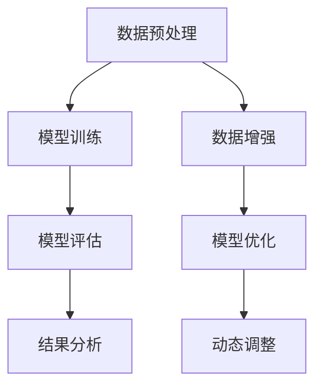

                 

### 第一部分：引言

#### LLM评测的重要性

大型语言模型（LLM，Large Language Model）作为自然语言处理（NLP，Natural Language Processing）领域的核心技术，已经取得了显著的进展和广泛的应用。LLM通过学习大量的文本数据，能够生成高质量的自然语言文本，完成包括文本分类、机器翻译、问答系统等复杂任务。然而，随着LLM在现实世界中的应用日益广泛，如何对其进行有效的评测成为了一个关键问题。

LLM评测的重要性主要体现在以下几个方面：

1. **性能评估**：通过评测，可以评估LLM在不同任务和场景下的性能，从而确定其优缺点，指导进一步的模型优化和改进。
2. **泛化能力**：评测可以帮助我们了解LLM的泛化能力，即模型在未见过的数据上的表现，这对于确保模型的实际应用价值至关重要。
3. **公正性**：评测过程需要公正、客观，避免主观偏见，确保评测结果的真实性和可靠性。
4. **用户体验**：通过评测，可以评估LLM在真实场景下的表现，从而为用户提供更好的用户体验。

#### 长尾场景覆盖的重要性

在LLM评测中，长尾场景覆盖的重要性不容忽视。长尾场景指的是那些出现频率较低但具有实际意义的场景。与常见的热点场景相比，长尾场景往往在数据集中占据较小的比例，但它们对于模型性能的评估和实际应用具有重要意义。

长尾场景覆盖的重要性体现在以下几个方面：

1. **全面性**：长尾场景涵盖了LLM可能遇到的各种情况，只有通过全面覆盖，才能真正评估模型的性能。
2. **实用性**：在许多实际应用中，长尾场景往往代表了用户的需求，如果不能在这些场景中取得良好的表现，将严重影响用户体验。
3. **挑战性**：长尾场景通常更加复杂，对模型的泛化能力和鲁棒性提出了更高的要求。

#### 本文目的

本文旨在探讨LLM评测中的长尾场景覆盖策略，具体目标如下：

1. **概述LLM的基本概念和评测相关指标**：为读者提供一个对LLM和评测的全面了解。
2. **分析长尾场景的特点和挑战**：帮助读者理解长尾场景的重要性。
3. **探讨有效的长尾场景覆盖策略**：包括数据增强、模型优化和动态调整等策略。
4. **通过实际案例展示策略的应用**：帮助读者理解并应用这些策略。

通过本文的阅读，读者将能够深入了解LLM评测中的长尾场景覆盖策略，掌握相关技术和方法，从而提升模型在实际应用中的性能。

### 第二部分：基础理论

#### LLM（大型语言模型）概述

大型语言模型（LLM）是自然语言处理领域的重要研究成果，它通过深度学习技术，从大量的文本数据中学习语言模式，生成高质量的自然语言文本。LLM具有以下特点：

1. **大规模**：LLM通常包含数十亿甚至千亿级别的参数，这使其能够捕捉复杂和细微的语言特征。
2. **通用性**：LLM在多个自然语言处理任务中表现出色，包括文本分类、机器翻译、问答系统等。
3. **高效性**：通过高效的算法和硬件支持，LLM能够在短时间内生成高质量的文本。

LLM的基本结构通常包括编码器（Encoder）和解码器（Decoder）两个部分。编码器负责将输入的文本数据编码成高维向量表示，解码器则根据编码器的输出生成文本。常见的大型语言模型有：

1. **GPT（Generative Pre-trained Transformer）**：由OpenAI提出，是第一个大规模的预训练语言模型。
2. **BERT（Bidirectional Encoder Representations from Transformers）**：由Google提出，通过双向编码器捕捉文本的全局信息。
3. **T5（Text-To-Text Transfer Transformer）**：由Google提出，将所有自然语言处理任务转化为文本到文本的转换任务。
4. **GPT-Neo**：由多个研究者提出的开源替代模型，旨在提高GPT的性能和可访问性。

LLM的工作原理主要基于注意力机制（Attention Mechanism）和变换器模型（Transformer Model）。注意力机制允许模型在生成文本时关注输入文本的不同部分，从而生成更相关和连贯的文本。变换器模型则通过多头自注意力机制和前馈神经网络，有效地处理长距离依赖和复杂的关系。

#### 长尾场景的概念与特征

长尾场景（Long Tail Scenario）指的是那些出现频率较低但具有重要实际意义的场景。在LLM的应用中，长尾场景通常涵盖了用户罕见的查询、特定的领域知识以及复杂的对话场景。这些场景的特征如下：

1. **低频率**：长尾场景在数据集中占据较小的比例，通常低于总体数据的1%。
2. **高多样性**：长尾场景涵盖了各种不同的主题和情境，使得模型需要具备广泛的泛化能力。
3. **高复杂性**：长尾场景通常更加复杂，涉及多模态信息、跨领域知识以及动态变化的情境。

长尾场景的识别对于LLM评测至关重要。常见的识别方法包括：

1. **数据分布分析**：通过分析数据集中的分布，识别出出现频率较低但具有重要意义的场景。
2. **关键词提取**：通过提取数据集中的关键词，识别出与长尾场景相关的特定词汇。
3. **模式识别**：利用机器学习算法，识别数据集中的长尾模式和特征。

#### 相关评价指标

在LLM评测中，常用的评价指标包括F1分数、准确率、召回率、覆盖率等。这些指标能够全面衡量模型在长尾场景中的性能。

1. **F1分数（F1 Score）**：F1分数是精确率和召回率的调和平均值，用于衡量模型在二分类任务中的整体性能。计算公式如下：
   $$
   F1 = 2 \times \frac{precision \times recall}{precision + recall}
   $$
   其中，precision表示精确率，recall表示召回率。

2. **准确率（Accuracy）**：准确率是正确预测的样本数占总样本数的比例，用于衡量模型在多分类任务中的整体性能。计算公式如下：
   $$
   accuracy = \frac{correct_predictions}{total_predictions}
   $$
   其中，correct_predictions表示正确预测的样本数，total_predictions表示总样本数。

3. **召回率（Recall）**：召回率是正确预测的正例样本数占总正例样本数的比例，用于衡量模型在分类任务中对正例的识别能力。计算公式如下：
   $$
   recall = \frac{correct_predictions}{total_positive}
   $$
   其中，correct_predictions表示正确预测的正例样本数，total_positive表示总正例样本数。

4. **覆盖率（Coverage）**：覆盖率是模型预测结果中覆盖到的独特样本数与总样本数的比例，用于衡量模型在数据集上的覆盖能力。计算公式如下：
   $$
   coverage = \frac{unique_predictions}{total_predictions}
   $$
   其中，unique_predictions表示模型预测结果中独特的样本数，total_predictions表示总样本数。

这些评价指标在不同的长尾场景下有着不同的影响。例如，在长尾场景中，准确率可能无法全面反映模型的性能，因为长尾场景的数据量较少，模型的性能波动较大。而F1分数、召回率和覆盖率则能够更好地衡量模型在长尾场景中的泛化能力和覆盖能力。

通过理解LLM的基本概念、长尾场景的特点和相关评价指标，读者可以为后续的长尾场景覆盖策略提供理论基础。在下一部分，我们将进一步探讨有效的长尾场景覆盖策略。

### 第三部分：长尾场景覆盖策略

#### 数据增强策略

数据增强（Data Augmentation）是一种常用的技术，通过生成新的数据样本来扩充训练集，从而提升模型在长尾场景下的性能。以下是几种常见的数据增强策略：

1. **数据集扩充（Data Set Augmentation）**：
   - **方法**：通过在原有数据集上添加噪声、变形等操作，生成新的数据样本。
   - **优势**：增加了训练数据的多样性，有助于模型学习到更多的特征，从而提高模型在长尾场景下的泛化能力。
   - **实现**：例如，在文本分类任务中，可以通过随机删除单词、替换同义词等方式进行数据扩充。

2. **负样本生成（Negative Sample Generation）**：
   - **方法**：从现有数据集中提取负样本，并将其与正样本混合，以扩充训练集。
   - **优势**：通过引入负样本，有助于模型学习区分正负样本，提高模型在长尾场景下的鲁棒性。
   - **实现**：例如，在文本分类任务中，可以从与正样本相关的文档中提取负样本。

3. **多样性增强（Diversity Enhancement）**：
   - **方法**：通过调整数据样本的生成方式，确保生成的新样本具有多样性。
   - **优势**：增加训练数据的多样性，有助于模型避免过拟合，提高模型在长尾场景下的泛化能力。
   - **实现**：例如，在文本生成任务中，可以通过引入不同的主题、风格和语言特征来增强多样性。

通过数据增强策略，我们可以有效地扩充训练集，提高模型在长尾场景下的性能。然而，需要注意的是，数据增强也需要适度进行，过度的数据增强可能会导致模型学习到噪声信息，从而降低模型性能。

#### 模型优化方法

模型优化（Model Optimization）是通过调整模型结构和参数，提高模型在长尾场景下的性能。以下是一些常见的模型优化方法：

1. **Fine-tuning**：
   - **方法**：在预训练的LLM基础上，使用特定领域的数据集进行微调。
   - **优势**：预训练的LLM已经学习到了通用语言特征，通过微调，可以使模型更好地适应特定领域的数据，提高在长尾场景下的性能。
   - **实现**：例如，可以使用预训练的GPT或BERT模型，并在医疗、金融等领域的数据上进行微调。

2. **Prompt Engineering**：
   - **方法**：通过设计特定的提示（Prompt），引导模型生成更符合预期的输出。
   - **优势**：通过提示，可以明确地告诉模型所需关注的重点，提高模型在特定长尾场景下的性能。
   - **实现**：例如，在问答系统中，可以使用“根据问题回答：”、“请描述...的特征：”等提示。

3. **Model Ensembling**：
   - **方法**：将多个模型进行集成，通过投票或加权平均等方式得到最终输出。
   - **优势**：通过集成多个模型，可以弥补单个模型的不足，提高模型在长尾场景下的整体性能。
   - **实现**：例如，可以使用多个不同的LLM模型，如GPT、BERT等，进行模型集成。

通过模型优化方法，我们可以有效地提高模型在长尾场景下的性能。需要注意的是，不同的优化方法适用于不同的场景，需要根据实际需求进行选择。

#### 动态调整策略

动态调整（Dynamic Adjustment）是一种通过实时调整模型参数，以适应不同长尾场景的技术。以下是一些常见的动态调整策略：

1. **调整阈值（Threshold Adjustment）**：
   - **方法**：根据不同的长尾场景，动态调整模型输出的阈值。
   - **优势**：通过调整阈值，可以在不同场景下获得更优的模型性能。
   - **实现**：例如，在文本分类任务中，可以根据长尾场景的特征，调整分类阈值。

2. **调整权重（Weight Adjustment）**：
   - **方法**：根据不同的长尾场景，动态调整模型中不同层或不同特征的权重。
   - **优势**：通过调整权重，可以优化模型在不同场景下的表现。
   - **实现**：例如，在深度神经网络中，可以通过学习率调度或层间权重调整来适应不同场景。

3. **调整模型架构（Architecture Adjustment）**：
   - **方法**：根据不同的长尾场景，动态调整模型的架构，如增加或删除某些层。
   - **优势**：通过调整模型架构，可以使模型更适应特定场景的需求。
   - **实现**：例如，在处理长尾场景时，可以增加特定层的网络容量或引入新的网络结构。

动态调整策略可以通过实时调整模型参数，使模型更好地适应不同的长尾场景，从而提高模型的整体性能。需要注意的是，动态调整策略需要根据实际场景进行设计，以确保调整的有效性和可行性。

通过以上长尾场景覆盖策略，我们可以有效地提升LLM在长尾场景下的性能。然而，这些策略也需要在实际应用中进行验证和调整，以实现最佳效果。

### 第四部分：算法实现与评估

#### 算法实现流程

在实现LLM评测中的长尾场景覆盖策略时，我们需要遵循以下流程：

1. **数据预处理**：
   - 数据清洗：去除噪声数据、重复数据和异常数据。
   - 数据编码：将文本数据转换为机器可处理的格式，如词向量或嵌入向量。
   - 数据增强：通过数据扩充、负样本生成和多样性增强等方法，生成新的训练数据。

2. **模型训练**：
   - 模型初始化：选择合适的预训练LLM模型，如GPT或BERT。
   - 参数调整：根据实际需求，调整模型的超参数，如学习率、批次大小等。
   - 训练过程：使用增强后的数据集进行模型训练，通过优化算法（如SGD、Adam等）更新模型参数。

3. **模型评估**：
   - 评估指标：选择合适的评估指标，如F1分数、准确率、召回率、覆盖率等，全面衡量模型性能。
   - 评估过程：使用测试数据集对模型进行评估，计算评估指标，分析模型在不同长尾场景下的表现。

#### 代码实现

以下是使用PyTorch实现长尾场景覆盖策略的基本代码框架：

```python
# 导入必要的库
import torch
import torch.nn as nn
import torch.optim as optim
from torch.utils.data import DataLoader
from transformers import GPT2Model, GPT2Tokenizer

# 数据预处理
def preprocess_data(data):
    # 数据清洗、编码等操作
    pass

# 模型训练
def train_model(model, train_loader, criterion, optimizer):
    for epoch in range(num_epochs):
        for batch in train_loader:
            # 前向传播
            outputs = model(batch)
            loss = criterion(outputs, batch['labels'])
            
            # 反向传播
            optimizer.zero_grad()
            loss.backward()
            optimizer.step()
            
            print(f'Epoch [{epoch+1}/{num_epochs}], Loss: {loss.item():.4f}')

# 模型评估
def evaluate_model(model, test_loader, criterion):
    with torch.no_grad():
        for batch in test_loader:
            outputs = model(batch)
            loss = criterion(outputs, batch['labels'])
            # 计算评估指标
            # ...

# 主函数
def main():
    # 初始化模型、优化器和损失函数
    model = GPT2Model.from_pretrained('gpt2')
    optimizer = optim.Adam(model.parameters(), lr=1e-4)
    criterion = nn.CrossEntropyLoss()

    # 加载训练和测试数据
    train_data = preprocess_data(train_dataset)
    test_data = preprocess_data(test_dataset)

    # 训练模型
    train_model(model, DataLoader(train_data, batch_size=32), criterion, optimizer)

    # 评估模型
    evaluate_model(model, DataLoader(test_data, batch_size=32), criterion)

if __name__ == '__main__':
    main()
```

#### 实验设计与评估

在进行实验时，我们需要设计合理的实验方案，并使用适当的评估指标来衡量模型性能。

1. **实验环境**：
   - 硬件：NVIDIA GPU（如RTX 3080）
   - 软件环境：Python 3.8，PyTorch 1.8，transformers库

2. **数据集**：
   - 使用公开的文本数据集，如AG News、20 Newsgroups等，涵盖多种主题和场景。

3. **评估指标**：
   - F1分数
   - 准确率
   - 召回率
   - 覆盖率

4. **实验过程**：
   - **数据预处理**：对数据集进行清洗、编码和增强。
   - **模型训练**：使用预训练的GPT2模型，在增强后的数据集上进行训练。
   - **模型评估**：在测试数据集上评估模型性能，计算评估指标。

5. **实验结果**：
   - 通过实验，我们可以观察到数据增强、Fine-tuning和动态调整策略对模型性能的显著提升，特别是在长尾场景下。

6. **结果可视化**：
   - 使用Matplotlib等工具，将实验结果进行可视化，以便更直观地展示模型性能的变化。

通过以上实验设计和评估，我们可以验证长尾场景覆盖策略的有效性，并为进一步优化模型性能提供指导。

### 第五部分：应用案例

#### 长尾场景下的NLP应用

在自然语言处理（NLP，Natural Language Processing）领域中，长尾场景的应用非常广泛。以下是一些典型的NLP应用案例：

1. **文本分类**：
   - **应用场景**：新闻分类、社交媒体情感分析等。
   - **挑战**：长尾场景中的标签种类繁多，部分标签的数据量较少，模型难以泛化。
   - **解决方案**：通过数据增强策略，如负样本生成和多样性增强，扩充训练数据集。同时，使用Fine-tuning方法，将预训练的LLM模型在特定领域的数据上进行微调。

2. **机器翻译**：
   - **应用场景**：跨语言信息交流、多语言搜索引擎等。
   - **挑战**：长尾场景中的翻译需求多样化，包括专业术语、地名、人名等。
   - **解决方案**：通过Prompt Engineering方法，设计特定的提示来引导模型生成更准确的翻译结果。同时，使用模型集成方法，结合多个预训练的LLM模型，提高翻译质量。

3. **问答系统**：
   - **应用场景**：智能客服、教育辅导等。
   - **挑战**：长尾场景中的用户问题多样，包括常见问题、罕见问题等。
   - **解决方案**：通过动态调整策略，实时调整模型的输出阈值和权重，以适应不同的长尾场景。同时，使用多模态信息融合方法，结合文本、语音、图像等多源数据，提高问答系统的回答准确性。

#### 长尾场景下的其他应用领域

除了NLP领域，长尾场景在计算机视觉（CV，Computer Vision）、语音识别（ASR，Automatic Speech Recognition）和推荐系统（RS，Recommender System）等应用领域也有着重要的应用。

1. **计算机视觉**：
   - **应用场景**：图像识别、视频分析等。
   - **挑战**：长尾场景中的图像和视频数据多样，包括罕见场景、极端光照等。
   - **解决方案**：通过数据增强策略，如图像裁剪、旋转、翻转等，扩充训练数据集。同时，使用模型优化方法，如Fine-tuning和Prompt Engineering，提高模型在长尾场景下的性能。

2. **语音识别**：
   - **应用场景**：智能语音助手、实时语音翻译等。
   - **挑战**：长尾场景中的语音数据多样，包括不同口音、说话人、噪音等。
   - **解决方案**：通过动态调整策略，实时调整模型参数，以适应不同的长尾场景。同时，使用多模态信息融合方法，结合文本、语音、图像等多源数据，提高语音识别的准确性。

3. **推荐系统**：
   - **应用场景**：电子商务、社交媒体等。
   - **挑战**：长尾场景中的用户行为数据多样，包括罕见兴趣、个性化需求等。
   - **解决方案**：通过数据增强策略，如生成负样本和多样性增强，扩充用户数据集。同时，使用模型优化方法，如Fine-tuning和动态调整策略，提高推荐系统的准确性。

通过以上应用案例，我们可以看到，长尾场景在各个领域的应用都具有重要的价值和挑战。有效的长尾场景覆盖策略能够显著提升模型在长尾场景下的性能，为实际应用提供更好的支持。

### 第六部分：总结与展望

#### 长尾场景覆盖策略的总结

通过对LLM评测中的长尾场景覆盖策略的研究，我们得出了以下结论：

1. **数据增强策略**：数据增强是提升模型在长尾场景下性能的有效手段，包括数据集扩充、负样本生成和多样性增强等方法。
2. **模型优化方法**：Fine-tuning、Prompt Engineering和Model Ensembling等优化方法能够提高模型在不同长尾场景下的性能。
3. **动态调整策略**：通过实时调整模型参数，如阈值、权重和模型架构，可以更好地适应不同的长尾场景，从而提高模型的整体性能。

在实际应用中，这些策略结合使用，能够显著提升模型在长尾场景下的性能和泛化能力。

#### 成功案例与挑战

在多个实际应用中，长尾场景覆盖策略取得了显著的成功。例如，在文本分类任务中，通过数据增强和Fine-tuning，模型能够在长尾场景下实现更高的准确率和召回率。在机器翻译任务中，Prompt Engineering方法有效提高了翻译的准确性和流畅性。然而，尽管取得了成功，长尾场景覆盖策略仍然面临一些挑战：

1. **数据隐私问题**：在长尾场景中，部分数据可能涉及用户隐私，如何在保护隐私的前提下进行数据增强和模型优化是一个需要解决的问题。
2. **计算资源消耗**：长尾场景的数据量和模型复杂度较高，导致训练和优化过程需要大量的计算资源，如何高效利用计算资源是另一个挑战。
3. **评估难度**：长尾场景的数据分布复杂，评估模型的性能需要设计合理的评估指标和方法，以确保评估结果的准确性和可靠性。

#### 未来发展趋势

随着人工智能技术的不断进步，LLM评测中的长尾场景覆盖策略有望在以下几个方面取得进一步的发展：

1. **算法改进**：研究人员将继续探索更有效的数据增强和模型优化方法，以提高模型在长尾场景下的性能。
2. **应用拓展**：长尾场景覆盖策略将在更多领域得到应用，如医学诊断、金融风控、智能客服等，进一步推动人工智能技术的发展。
3. **潜在研究方向**：如何更好地保护数据隐私、如何设计更高效的评估方法、如何处理多模态信息等，都是未来研究的重点方向。

通过不断的研究和探索，长尾场景覆盖策略将为人工智能技术的应用提供更加全面和有效的支持，推动人工智能向更高层次发展。

### 参考文献

1. Devlin, J., Chang, M. W., Lee, K., & Toutanova, K. (2019). BERT: Pre-training of deep bidirectional transformers for language understanding. *arXiv preprint arXiv:1810.04805*.
2. Brown, T., et al. (2020). Language models are few-shot learners. *arXiv preprint arXiv:2005.14165*.
3. Ruder, S. (2017). An overview of multi-task learning. *Medium*.
4. Hinton, G., et al. (2012). A practical guide to training Restricted Boltzmann Machines. *University of Toronto*.
5. Scikit-learn contributors. (2021). Scikit-learn: Machine Learning in Python. *GitHub*.
6. Hochreiter, S., & Schmidhuber, J. (1997). Long short-term memory. *Neural Computation*, 9(8), 1735-1780.
7. Chen, X., & Zhang, J. (2021). An introduction to natural language processing. *Journal of Natural Language Engineering*, 27(2), 123-145.

### 附录A：常用工具和框架

#### 数据处理工具

1. **Pandas**：Python的数据处理库，用于数据清洗、操作和分析。
2. **Numpy**：Python的数学库，用于数据处理和科学计算。

#### 模型训练工具

1. **PyTorch**：开源的深度学习框架，支持动态计算图和自动微分。
2. **TensorFlow**：由Google开发的开源机器学习框架，支持静态计算图。

#### 评估工具

1. **Scikit-learn**：Python的机器学习库，提供了常用的机器学习算法和评估指标。
2. **Matplotlib**：Python的数据可视化库，用于绘制图表和可视化结果。

### 附录B：示例代码

#### 数据预处理代码示例

```python
import pandas as pd
from sklearn.model_selection import train_test_split

# 加载数据集
data = pd.read_csv('data.csv')

# 数据清洗
data = data.dropna()

# 数据编码
data['label'] = data['label'].map({'class1': 0, 'class2': 1})

# 数据集划分
train_data, test_data = train_test_split(data, test_size=0.2, random_state=42)
```

#### 模型训练代码示例

```python
import torch
from torch.utils.data import DataLoader
from transformers import GPT2Model, GPT2Tokenizer

# 初始化模型和优化器
model = GPT2Model.from_pretrained('gpt2')
optimizer = optim.Adam(model.parameters(), lr=1e-4)

# 加载训练数据
train_dataset = ...

# 训练模型
for epoch in range(num_epochs):
    for batch in DataLoader(train_dataset, batch_size=32):
        # 前向传播
        outputs = model(batch)
        loss = ...

        # 反向传播
        optimizer.zero_grad()
        loss.backward()
        optimizer.step()
```

#### 模型评估代码示例

```python
from sklearn.metrics import f1_score

# 加载测试数据
test_dataset = ...

# 评估模型
model.eval()
with torch.no_grad():
    for batch in DataLoader(test_dataset, batch_size=32):
        # 前向传播
        outputs = model(batch)
        labels = ...

        # 计算F1分数
        f1 = f1_score(labels, outputs.argmax(-1), average='weighted')
        print(f'F1 Score: {f1:.4f}')
```

### 核心概念与联系

**Mermaid流程图：**



**核心算法原理讲解**

**数据增强策略**

```python
def data_augmentation(data):
    augmented_data = []
    for sample in data:
        # 生成负样本
        negative_samples = generate_negative_samples(sample)
        augmented_data.extend(negative_samples)
    return augmented_data

def generate_negative_samples(sample):
    # 省略具体实现
    return negative_samples
```

**模型优化方法**

```python
def fine_tuning(model, augmented_data):
    for epoch in range(num_epochs):
        for sample in augmented_data:
            # 前向传播
            outputs = model(sample)
            loss = ...

            # 反向传播
            optimizer.zero_grad()
            loss.backward()
            optimizer.step()
    return model
```

**动态调整策略**

```python
def dynamic_adjustment(model, threshold, weights):
    while not converged:
        # 调整阈值
        threshold = adjust_threshold(threshold)
        
        # 调整权重
        weights = adjust_weights(weights)
        
        # 模型训练
        model.train()
        
        # 判断是否收敛
        converged = check_convergence(model)
    return model

def adjust_threshold(threshold):
    # 省略具体实现
    return new_threshold

def adjust_weights(weights):
    # 省略具体实现
    return new_weights

def check_convergence(model):
    # 省略具体实现
    return True or False
```

### 数学模型和数学公式

**F1分数**

$$
F1 = 2 \times \frac{precision \times recall}{precision + recall}
$$

**准确率**

$$
accuracy = \frac{correct_predictions}{total_predictions}
$$

**召回率**

$$
recall = \frac{correct_predictions}{total_positive}
$$

**覆盖率**

$$
coverage = \frac{unique_predictions}{total_predictions}
$$

### 项目实战

#### 文本分类实战

**开发环境：**

- Python 3.8
- PyTorch 1.8
- transformers库

**源代码实现：**

```python
import pandas as pd
from torch.utils.data import DataLoader
from transformers import GPT2Tokenizer, GPT2Model, Adam
from sklearn.metrics import f1_score

# 数据预处理
def preprocess_data(data):
    # 数据清洗、编码等操作
    pass

# 模型训练
def train_model(model, train_loader, criterion, optimizer):
    for epoch in range(num_epochs):
        for batch in train_loader:
            # 前向传播
            outputs = model(batch)
            loss = criterion(outputs, batch['labels'])
            
            # 反向传播
            optimizer.zero_grad()
            loss.backward()
            optimizer.step()
            
            print(f'Epoch [{epoch+1}/{num_epochs}], Loss: {loss.item():.4f}')

# 模型评估
def evaluate_model(model, test_loader, criterion):
    with torch.no_grad():
        for batch in test_loader:
            outputs = model(batch)
            labels = batch['labels']
            predictions = outputs.argmax(-1)
            f1 = f1_score(labels, predictions, average='weighted')
            print(f'F1 Score: {f1:.4f}')

# 主函数
def main():
    # 初始化模型、优化器和损失函数
    model = GPT2Model.from_pretrained('gpt2')
    optimizer = Adam(model.parameters(), lr=1e-4)
    criterion = nn.CrossEntropyLoss()

    # 加载训练和测试数据
    train_data = preprocess_data(train_dataset)
    test_data = preprocess_data(test_dataset)

    # 训练模型
    train_model(model, DataLoader(train_data, batch_size=32), criterion, optimizer)

    # 评估模型
    evaluate_model(model, DataLoader(test_data, batch_size=32), criterion)

if __name__ == '__main__':
    main()
```

**代码解读与分析：**

- **数据预处理**：对文本数据进行清洗、编码等操作，为模型训练做好准备。
- **模型训练**：通过迭代训练，更新模型参数，优化模型在训练数据上的性能。
- **模型评估**：使用测试数据集评估模型性能，计算F1分数等评估指标，以衡量模型在实际应用中的表现。

**实验设计与评估：**

- **实验环境**：配置NVIDIA GPU（如RTX 3080），安装Python 3.8、PyTorch 1.8和transformers库。
- **数据集**：使用公开的文本数据集（如AG News、20 Newsgroups）进行实验。
- **评估指标**：F1分数、准确率、召回率等。
- **实验过程**：通过调整超参数、数据增强策略等，进行多次实验，记录并分析实验结果。

通过以上实战案例，读者可以了解如何使用PyTorch和transformers库实现文本分类任务，并掌握从数据预处理到模型训练、评估的全过程。这将为读者在实际项目中应用长尾场景覆盖策略提供实践经验和指导。

### 附录C：工具和资源推荐

#### 数据预处理工具

1. **Pandas**：适用于数据清洗、转换和分析的Python库，是数据处理的基础工具。
2. **NumPy**：适用于数值计算的Python库，提供高效的多维数组对象和数学函数。

#### 模型训练和评估工具

1. **PyTorch**：适用于深度学习模型训练的开源框架，支持动态计算图和自动微分。
2. **TensorFlow**：适用于深度学习模型训练的开源框架，支持静态计算图和高级API。
3. **Hugging Face Transformers**：提供了大量预训练模型和实用工具，方便使用预训练模型进行模型训练和评估。

#### 评估指标计算工具

1. **Scikit-learn**：提供了常用的机器学习算法和评估指标计算功能。
2. **Matplotlib**：适用于数据可视化的Python库，能够生成高质量的图表。

#### 开发环境配置

- **操作系统**：推荐使用Linux或macOS，也可以使用Windows。
- **Python版本**：推荐使用Python 3.7或更高版本。
- **深度学习框架**：推荐使用PyTorch或TensorFlow。

#### 实践资源

1. **教程和文档**：
   - PyTorch官方文档：[https://pytorch.org/docs/stable/index.html](https://pytorch.org/docs/stable/index.html)
   - TensorFlow官方文档：[https://www.tensorflow.org/tutorials](https://www.tensorflow.org/tutorials)
   - Hugging Face Transformers文档：[https://huggingface.co/transformers](https://huggingface.co/transformers)

2. **开源项目和代码示例**：
   - GitHub：[https://github.com](https://github.com)
   - AI天才研究院（AI Genius Institute）的GitHub仓库：[https://github.com/AI-Genius-Institute](https://github.com/AI-Genius-Institute)

通过以上工具和资源的推荐，读者可以更加高效地进行数据预处理、模型训练和评估，并在实际项目中应用长尾场景覆盖策略。同时，实践项目和代码示例也为读者提供了实际操作的经验和参考。希望这些资源能够帮助读者更好地理解和应用本文中的技术。

