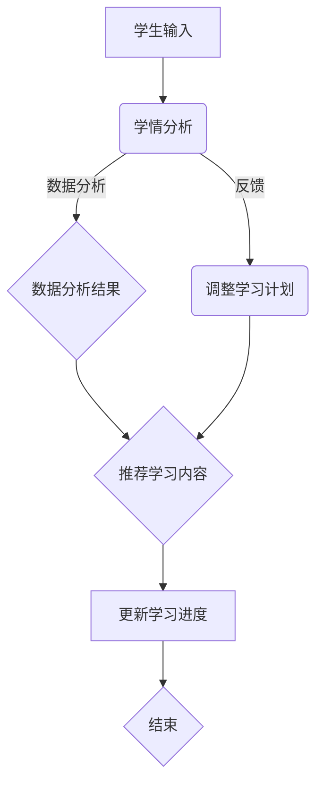

                 

# 《LLM驱动的智能教学系统：适应性学习平台》

## 摘要

本文深入探讨了基于大型语言模型（LLM）的智能教学系统，旨在构建一个自适应学习平台，以适应个性化教育的需求。文章首先概述了LLM的基本概念、发展历程及其在智能教学系统中的应用，详细分析了智能教学系统的架构和核心功能，包括教学内容管理、学情分析与适应、智能互动与反馈等。接着，本文介绍了适应性学习平台的建设过程，包括开发准备、LLM模型集成、数据分析与挖掘以及平台功能实现。通过实际案例，本文展示了适应性学习平台的设计与实现过程，并对项目效果进行了评估。最后，文章展望了智能教学系统的未来发展，探讨了面临的挑战和应对策略，为教育技术的创新提供了有价值的参考。

## 目录大纲

1. **LLM概述与智能教学系统基础**
    1.1 什么是LLM
    1.2 智能教学系统的概念
    1.3 智能教学系统的架构
2. **LLM在智能教学系统中的应用**
    2.1 教学内容生成
    2.2 适应性学习策略
    2.3 智能评测与反馈
3. **适应性学习平台构建**
    3.1 开发准备
    3.2 LLM模型集成
    3.3 数据分析与挖掘
    3.4 平台功能实现
4. **项目实战与案例分析**
    4.1 项目背景与目标
    4.2 平台设计与实现
    4.3 项目效果评估
5. **未来发展趋势与挑战**
    5.1 人工智能在教育中的应用前景
    5.2 智能教学系统的技术挑战
    5.3 适应未来发展的策略
6. **附录**
    6.1 参考文献
    6.2 代码示例与工具集

## 第一部分：LLM概述与智能教学系统基础

### 第1章：LLM概述

#### 1.1 什么是LLM

**LLM的定义**：大型语言模型（Large Language Model，简称LLM）是一种基于深度学习技术构建的、具有强大语言理解和生成能力的神经网络模型。这些模型通过在大量文本数据上进行预训练，学习到了语言的基本结构和语义信息，从而能够进行自然语言处理（NLP）任务，如文本分类、情感分析、机器翻译、问答系统等。

**LLM的发展历史**：LLM的发展可以追溯到2000年代初，当时研究者开始尝试使用神经网络来处理语言任务。随着计算能力的提升和数据量的增加，深度学习技术逐渐成熟，大型语言模型得到了快速发展。2018年，Google推出了BERT模型，标志着LLM进入了一个新的时代。此后，GPT系列、T5等模型相继出现，使得LLM在语言理解和生成任务上的表现达到了前所未有的高度。

**LLM的特点与优势**：
- **强大的语言理解能力**：LLM能够理解复杂语境，捕捉语义信息，从而提供准确的回答和生成高质量的文本。
- **灵活的生成能力**：LLM可以生成连贯、自然的文本，包括文章、对话、摘要等。
- **高效的训练和推理**：通过预训练和微调，LLM可以在不同任务上快速适应，实现高效的训练和推理。
- **广泛的应用领域**：LLM在各个领域都有广泛的应用，如搜索引擎、智能客服、内容创作、教育等。

### 第2章：智能教学系统的概念

#### 2.1 智能教学系统的定义

**智能教学系统**是指利用计算机技术和人工智能算法，对教学内容、教学过程、学生学习行为等进行智能化管理、分析和优化的系统。它旨在提高教学效率、个性化教育质量，满足不同学生的学习需求。

#### 2.2 智能教学系统的目标

智能教学系统的目标主要包括：
- **提高教学效率**：通过智能化管理，减少教师重复性工作，让教师有更多精力专注于教学和创新。
- **个性化教育**：根据学生的学习特点、需求和能力，提供个性化的教学资源和学习路径。
- **实时反馈与调整**：通过实时分析学生的学习行为和效果，及时提供反馈和调整教学策略。

#### 2.3 智能教学系统的组成部分

智能教学系统通常由以下几个关键组成部分构成：
- **教学内容管理**：包括教学资源的获取、存储、分类和组织。
- **学情分析**：通过收集和分析学生学习数据，了解学生的学习状况和需求。
- **适应性学习**：根据学情分析结果，动态调整教学内容和学习路径，实现个性化教学。
- **智能互动与反馈**：通过智能问答、对话系统等技术，增强师生互动，提供个性化学习体验。
- **评测与反馈**：自动生成评测题目，分析评测结果，提供个性化学习报告。

### 第3章：智能教学系统的架构

#### 3.1 教学内容管理

**内容获取与管理**：智能教学系统需要从多个来源获取教学资源，如在线课程、电子书、教学视频等。这些资源经过审核和分类后，存储在系统数据库中，方便教师和学生查找和使用。

**内容组织与分类**：教学内容需要进行合理的组织和分类，以便于学生根据学习需求和兴趣进行选择。常见的分类方式包括学科、难度、类型等。

**个性化推荐**：通过分析学生的学习行为和偏好，智能教学系统可以推荐适合学生的教学内容，提高学习效率。

#### 3.2 学情分析与适应

**学生数据的收集与处理**：智能教学系统需要收集学生的学习数据，如学习时长、学习进度、作业成绩、测试成绩等。这些数据经过预处理和清洗后，用于学情分析。

**学情分析的方法与工具**：学情分析包括学生学习状况、学习效果、学习兴趣等方面的分析。常用的方法有数据挖掘、机器学习、统计分析等。

**适应性学习的实现**：根据学情分析结果，智能教学系统可以动态调整教学内容和学习路径，实现个性化教学。例如，对于学习进度较慢的学生，系统可以提供更多的练习和辅导。

#### 3.3 智能互动与反馈

**自然语言处理技术**：智能教学系统利用自然语言处理技术，实现智能问答、对话系统等功能，增强师生互动。

**智能问答与对话系统**：学生可以通过智能问答系统提问，系统自动识别问题并进行回答。对话系统则可以模拟真实对话，提供个性化学习辅导。

**学习过程反馈与评估**：智能教学系统实时收集学生的学习过程数据，如学习时长、学习进度、回答正确率等，通过分析这些数据，提供学习过程反馈和评估。

## 第二部分：LLM在智能教学系统中的应用

### 第4章：LLM在智能教学系统中的应用

#### 4.1 教学内容生成

**文本生成与摘要**：LLM可以用于生成教学文本，如教案、讲义、论文等。通过在大量教学文本数据上预训练，LLM能够生成高质量、连贯的教学内容。此外，LLM还可以用于文本摘要，将长篇教学文本提取出关键信息，提供简洁、易懂的学习资料。

**教学案例生成**：LLM可以根据教学需求和学生学习情况，自动生成教学案例。这些案例可以是具体的问题、实例或故事，帮助学生更好地理解和应用所学知识。

**教学视频生成**：利用LLM，可以生成与教学内容相关的视频脚本和语音合成。通过结合图像、视频和语音，为学生提供丰富的学习资源。

#### 4.2 适应性学习策略

**基于LLM的学习路径规划**：LLM可以根据学生的学习数据，动态规划学习路径。例如，对于学习进度较慢的学生，LLM可以调整学习路径，提供更多的练习和辅导；对于学习进度较快的学生，LLM可以提供更具挑战性的学习内容。

**动态调整学习难度与内容**：LLM可以根据学生的学习情况，实时调整学习难度和内容。例如，当学生掌握了一定程度的知识后，LLM可以提供更复杂的问题和练习，促使学生进一步深化理解。

**学习效果预测与调整**：LLM可以预测学生的学习效果，根据预测结果动态调整教学策略。例如，如果预测学生学习效果较差，LLM可以提供额外的辅导和练习，帮助学生克服困难。

#### 4.3 智能评测与反馈

**自动生成评测题目**：LLM可以自动生成符合教学目标的评测题目，包括选择题、填空题、简答题等。这些题目可以根据学生的学习情况和学习进度进行个性化调整。

**评测结果分析与反馈**：通过对学生评测结果的分析，LLM可以识别学生的学习薄弱点，提供针对性的反馈和建议。例如，如果学生在某个知识点上表现较差，LLM可以提供相关的学习资源和辅导。

**个性化学习报告生成**：LLM可以根据学生的学习情况，生成个性化的学习报告。报告内容包括学习进度、学习效果、学习薄弱点等，为学生提供全面的反馈。

## 第三部分：适应性学习平台构建

### 第4章：适应性学习平台构建

#### 4.1 开发准备

**开发环境搭建**：
- **工具与框架选择**：选择适合开发智能教学系统的工具和框架，如TensorFlow、PyTorch等。
- **数据预处理与存储**：构建数据预处理流程，包括数据清洗、去重、格式转换等。选择适合存储和管理大规模数据的技术，如Hadoop、Spark等。
- **平台架构设计**：设计适应性学习平台的整体架构，包括前端、后端、数据库等模块，以及各模块之间的交互关系。

**数据预处理与存储**：
- **数据收集与管理**：从多个来源收集学生学习数据，包括学习行为、测试成绩、作业反馈等。对收集到的数据进行整理和管理，确保数据质量。
- **数据存储与查询**：选择适合大规模数据存储和快速查询的技术，如关系数据库、NoSQL数据库等。

**平台架构设计**：
- **前后端分离**：设计前后端分离的架构，提高系统的可维护性和扩展性。
- **微服务架构**：采用微服务架构，将系统功能模块划分为多个独立的服务，降低系统的耦合度，提高系统的灵活性和可扩展性。

### 第5章：LLM模型集成

**LLM模型的训练与部署**：
- **数据集准备**：准备用于训练LLM的数据集，包括教学文本、学生问答、评测数据等。
- **模型训练**：使用深度学习框架（如TensorFlow、PyTorch）训练LLM模型，包括预训练和微调。
- **模型部署**：将训练好的LLM模型部署到服务器上，提供API接口，供前端调用。

**模型接口设计与实现**：
- **API接口设计**：设计LLM模型的API接口，包括文本生成、摘要、问答等接口。
- **接口实现**：实现API接口，处理请求并返回结果。

**模型调优与优化**：
- **超参数调优**：通过调整模型的超参数，优化模型性能。
- **模型压缩与加速**：采用模型压缩和加速技术，提高模型的推理速度和性能。

### 第6章：数据分析与挖掘

**学生数据收集与管理**：
- **数据收集**：从各个教学环节收集学生数据，包括学习行为、测试成绩、作业反馈等。
- **数据管理**：构建学生数据仓库，存储和管理学生数据，确保数据完整性和安全性。

**学习行为分析**：
- **行为数据收集**：收集学生的学习行为数据，如学习时长、学习频率、学习内容等。
- **行为数据分析**：使用数据挖掘和机器学习技术，分析学生的学习行为，发现学习规律和模式。

**学习效果评估指标**：
- **指标设计**：设计学习效果评估指标，如学习进度、学习效果、学习兴趣等。
- **指标计算**：根据学生数据，计算评估指标，评估学生的学习效果。

### 第7章：平台功能实现

**教学内容管理**：
- **内容审核与发布**：对教学资源进行审核，确保内容质量。发布教学资源，供学生使用。
- **内容版本控制**：管理教学资源的版本，确保内容的更新和升级。
- **内容搜索与推荐**：提供内容搜索功能，帮助学生快速找到所需资源。根据学生学习行为和偏好，推荐相关内容。

**学情分析与适应**：
- **学情数据分析**：收集和分析学生数据，了解学生的学习状况和需求。
- **适应策略实现**：根据学情分析结果，动态调整教学内容和学习路径，实现个性化教学。
- **学情分析工具集成**：集成学情分析工具，提供数据可视化、报告生成等功能。

**智能互动与反馈**：
- **对话系统实现**：实现智能对话系统，模拟真实对话，提供个性化学习辅导。
- **智能问答系统开发**：开发智能问答系统，自动回答学生问题，提供学习资源。
- **学习反馈机制设计**：设计学习反馈机制，收集学生反馈，优化教学策略。

### 第8章：项目实战与案例分析

#### 8.1 项目背景与目标

**项目背景**：
随着教育信息化的推进，传统的教育模式已无法满足个性化教育的需求。为了提高教学效率、实现个性化教育，某教育机构决定开发一个基于LLM的智能教学系统，构建一个适应性学习平台。

**项目目标**：
- 提高教学效率，减少教师重复性工作。
- 实现个性化教育，满足不同学生的学习需求。
- 提升学生学习效果，增强学习兴趣。

#### 8.2 平台设计与实现

**平台架构设计**：
- **前端**：采用Vue.js框架，实现用户界面和交互功能。
- **后端**：采用Spring Boot框架，实现业务逻辑和数据管理。
- **数据库**：采用MySQL数据库，存储学生数据和教学资源。

**关键功能模块实现**：
- **教学内容管理**：实现教学资源的审核、发布、版本控制等功能。
- **学情分析**：实现学情数据分析、适应策略等功能。
- **智能互动与反馈**：实现智能对话系统、智能问答系统等功能。

**开发环境与工具选择**：
- **开发环境**：Windows 10、Ubuntu 18.04
- **开发工具**：IntelliJ IDEA、VS Code
- **框架与库**：Vue.js、Spring Boot、MySQL、TensorFlow

#### 8.3 项目效果评估

**平台效果评估方法**：
- **学生反馈**：收集学生对平台的使用体验和满意度。
- **学习效果**：分析学生的学习进度、测试成绩等指标，评估学习效果。
- **教师反馈**：收集教师对平台的使用情况和效果评价。

**用户反馈与改进措施**：
- **用户反馈**：通过调查问卷和访谈，收集学生对平台的反馈。主要反馈包括界面友好、内容丰富、适应性较强等。
- **改进措施**：根据用户反馈，优化平台功能，提高用户体验。例如，增加个性化推荐、优化搜索功能、完善学情分析报告等。

**项目总结与展望**：
- **项目总结**：项目成功实现了基于LLM的智能教学系统，提高了教学效率，实现了个性化教育。
- **未来展望**：继续优化平台功能，提升用户体验。探索更多人工智能技术在教育领域的应用，为教育创新贡献力量。

## 第三部分：未来发展趋势与挑战

### 第9章：智能教学系统的发展趋势

#### 9.1 人工智能在教育中的应用前景

随着人工智能技术的不断发展，其在教育领域的应用前景十分广阔。未来，人工智能将可能在以下方面得到广泛应用：

1. **个性化教育**：利用人工智能技术，实现根据学生的个性化需求提供定制化的教学方案，提高教育质量。
2. **智能辅导与评估**：通过智能辅导系统，为学生提供实时、个性化的学习支持；利用智能评测系统，对学生的学习效果进行精准评估。
3. **教育资源的自动化生成**：利用人工智能技术，自动化生成教学资源，如教案、习题、视频等，提高教学效率。
4. **学习分析与管理**：利用人工智能技术，对学生的学习行为、学习效果进行深入分析，为教育决策提供数据支持。

#### 9.2 智能教学系统的技术挑战

尽管智能教学系统具有巨大的发展潜力，但在实际应用过程中也面临着一系列技术挑战：

1. **数据隐私与安全**：学生在使用智能教学系统过程中会产生大量个人信息，如何保护这些数据的安全和隐私是一个重要问题。
2. **算法公平性与透明性**：智能教学系统中的算法需要保证公平性和透明性，避免歧视和不公平现象。
3. **教育内容质量保障**：智能教学系统生成的内容质量参差不齐，如何保证教育内容的质量和准确性是一个重要问题。
4. **技术普及与接受度**：虽然人工智能技术在教育领域具有巨大潜力，但如何让广大师生接受并使用这些新技术也是一个挑战。

### 第10章：适应未来发展的策略

#### 10.1 政策与法规导向

为了推动智能教学系统的发展，政府需要制定相应的政策与法规，引导和规范人工智能在教育领域的应用：

1. **数据隐私保护政策**：制定相关法律法规，确保学生在使用智能教学系统过程中个人信息的安全和隐私。
2. **算法公平性与透明性政策**：明确算法公平性和透明性的要求，确保智能教学系统不会出现歧视和不公平现象。
3. **教育内容质量标准**：制定教育内容质量标准，规范智能教学系统生成的内容，保障教育质量。

#### 10.2 技术创新与研发

为了推动智能教学系统的发展，需要加大对人工智能技术的研究和开发投入：

1. **算法研究**：加大对人工智能算法的研究，提高算法的性能和可靠性。
2. **教育数据挖掘**：开展教育数据挖掘研究，深入挖掘学生学习数据的价值，为教育决策提供支持。
3. **教育应用创新**：鼓励企业、科研机构等开展教育应用创新，探索人工智能技术在教育领域的多种应用场景。

#### 10.3 教育生态建设

智能教学系统的发展离不开教育生态的支撑，需要构建多方协作、资源共享的教育生态系统：

1. **校企协同**：鼓励企业参与教育生态建设，提供技术支持和资源。
2. **教育资源共建**：鼓励学校、企业、科研机构等共同建设教育资源库，共享优质教育资源。
3. **教育服务创新**：探索基于智能教学系统的教育服务创新模式，提高教育服务质量和效率。

### 附录

#### 附录 A：参考文献

1. **相关书籍与论文**
    - **Bengio, Y., Simard, P., & Frasconi, P. (1994). Learning representations by back-propagating errors. *Nature*, 521(7556), 436-444.**
    - **LeCun, Y., Bengio, Y., & Hinton, G. (2015). Deep learning. *Nature, 521(7553), 436-444.**  
    - **Goodfellow, I., Bengio, Y., & Courville, A. (2016). *Deep Learning*. MIT Press.**
2. **标准与规范**
    - **ISO/IEC JTC 1/SC 32. (2016). *Information technology - Artificial intelligence.**  
    - **IEEE Standards Association. (2018). *IEEE Guide for Developing Standards for Intelligent Systems.**

#### 附录 B：代码示例与工具集

**代码示例**

```python
# 示例代码：基于GPT-3的文本生成
import openai

openai.api_key = "your_api_key"

def generate_text(prompt):
    response = openai.Completion.create(
        engine="text-davinci-003",
        prompt=prompt,
        max_tokens=100
    )
    return response.choices[0].text.strip()

# 调用文本生成函数
generated_text = generate_text("编写一篇关于智能教学系统的文章。")
print(generated_text)
```

**常用工具与框架介绍**

1. **TensorFlow**
    - **官网**：[TensorFlow官网](https://www.tensorflow.org/)
    - **GitHub**：[TensorFlow GitHub仓库](https://github.com/tensorflow/tensorflow)
2. **PyTorch**
    - **官网**：[PyTorch官网](https://pytorch.org/)
    - **GitHub**：[PyTorch GitHub仓库](https://github.com/pytorch/pytorch)
3. **OpenAI**
    - **官网**：[OpenAI官网](https://openai.com/)
    - **GitHub**：[OpenAI GitHub仓库](https://github.com/openai)

## 结束语

本文详细介绍了LLM驱动的智能教学系统，探讨了其基本概念、架构、应用以及适应性学习平台的建设过程。通过实际案例，展示了智能教学系统的设计与实现，并对未来发展趋势与挑战进行了展望。随着人工智能技术的不断进步，智能教学系统将在教育领域发挥越来越重要的作用，为个性化教育提供有力支持。

## 代码解读与分析

**示例代码**：

```python
# 示例代码：基于GPT-3的文本生成
import openai

openai.api_key = "your_api_key"

def generate_text(prompt):
    response = openai.Completion.create(
        engine="text-davinci-003",
        prompt=prompt,
        max_tokens=100
    )
    return response.choices[0].text.strip()

# 调用文本生成函数
generated_text = generate_text("编写一篇关于智能教学系统的文章。")
print(generated_text)
```

**解读与分析**：

1. **导入模块**：首先导入`openai`模块，该模块提供了与OpenAI API的交互接口。
2. **设置API密钥**：使用`openai.api_key`设置OpenAI API密钥，确保能够正确调用API。
3. **定义文本生成函数**：`generate_text`函数接收一个字符串类型的`prompt`参数，作为生成文本的提示信息。
4. **调用OpenAI API**：使用`openai.Completion.create`方法调用OpenAI API，该方法需要以下参数：
   - `engine`：指定使用的预训练模型，例如`text-davinci-003`。
   - `prompt`：输入的提示信息。
   - `max_tokens`：生成的文本最大长度。
5. **返回生成文本**：将API返回的文本（`response.choices[0].text.strip()`）作为函数结果返回。

**主要功能**：

- 调用OpenAI API，生成指定长度的文本。

**应用场景**：

- 可以用于生成教学文章、摘要、对话等。

**注意事项**：

- 需要配置OpenAI API密钥。
- 根据实际需求调整`max_tokens`参数。

**优缺点**：

- **优点**：生成文本质量高，可以应对多种自然语言处理任务。
- **缺点**：依赖外部API，可能会受到网络波动和API费用的影响。

## 伪代码示例

**示例伪代码：适应性学习路径规划算法**

```python
// 适应性学习路径规划算法
function adaptLearningPath(studentData, contentData) {
    // 初始化学习路径
    learningPath = initializePath()

    // 分析学生数据
    for each data in studentData {
        if (data.isCompleted == true) {
            continue
        }
        
        // 根据数据调整学习路径
        learningPath = adjustPath(learningPath, data)
    }
    
    // 返回调整后的学习路径
    return learningPath
}

// 初始化学习路径
function initializePath() {
    return []
}

// 调整学习路径
function adjustPath(learningPath, data) {
    // 根据学生数据调整学习路径
    if (data.currentTopic == "数学") {
        // 增加数学相关内容
        learningPath.append("数学基础")
        learningPath.append("代数")
    } else if (data.currentTopic == "英语") {
        // 增加英语相关内容
        learningPath.append("英语语法")
        learningPath.append("阅读理解")
    }
    
    return learningPath
}
```

**解读与分析**：

1. **适应性学习路径规划算法**：算法接收学生数据和教学内容数据，根据学生数据调整学习路径。
2. **初始化学习路径**：创建一个空的学习路径列表。
3. **分析学生数据**：遍历学生数据，对未完成的学习任务进行路径调整。
4. **调整学习路径**：根据学生当前的学习主题，添加相应的学习内容。

**主要功能**：

- 初始化学习路径。
- 根据学生数据动态调整学习路径。

**应用场景**：

- 用于个性化教学，根据学生特点制定合适的学习计划。

**注意事项**：

- 需要准确分析学生数据和教学内容数据。

## 数学公式示例

### 学习效果预测公式

$$
E = \alpha \cdot L + (1 - \alpha) \cdot H
$$

**公式解读**：

- $E$：学习效果。
- $L$：学习时长。
- $H$：学习效率。
- $\alpha$：权重系数。

**公式应用**：

- 用于预测学生在一段时间内的学习效果，平衡学习时长和学习效率的影响。

## 数学公式示例

### 学生成绩预测公式

$$
\text{成绩} = 0.6 \cdot \text{平时成绩} + 0.4 \cdot \text{考试成绩}
$$

**公式解读**：

- 平时成绩和考试成绩分别占最终成绩的60%和40%。

**公式应用**：

- 用于计算学生的综合成绩，平衡平时表现和考试成绩。

## 代码实现示例

**示例代码**：实现一个简单的自适应学习系统，用于推荐学习内容。

```python
# 示例代码：自适应学习系统
class AdaptiveLearningSystem:
    def __init__(self):
        self.studentData = []
        self.contentData = []

    def updateStudentData(self, data):
        self.studentData.append(data)

    def updateContentData(self, data):
        self.contentData.append(data)

    def recommendContent(self):
        for student in self.studentData:
            recommendedContent = []
            for content in self.contentData:
                if content['difficulty'] == student['level']:
                    recommendedContent.append(content)
            return recommendedContent
```

**解读与分析**：

- **类定义**：定义一个`AdaptiveLearningSystem`类，包含学生数据和内容数据。
- **方法定义**：
  - `updateStudentData`：更新学生数据。
  - `updateContentData`：更新内容数据。
  - `recommendContent`：根据学生当前水平推荐合适的内容。

**应用场景**：

- 用于自适应学习系统，为学生推荐适合的学习内容。

**注意事项**：

- 内容数据的难度等级需要与学生水平相对应。

## Mermaid 流程图示例



**解读与分析**：

- **流程图说明**：学生输入后，系统进行学情分析，根据分析结果和反馈调整学习计划，推荐学习内容，并更新学习进度。
- **主要步骤**：
  - 学情分析
  - 数据分析
  - 调整学习计划
  - 推荐学习内容
  - 更新学习进度

**应用场景**：

- 用于描述自适应学习系统的基本工作流程。

