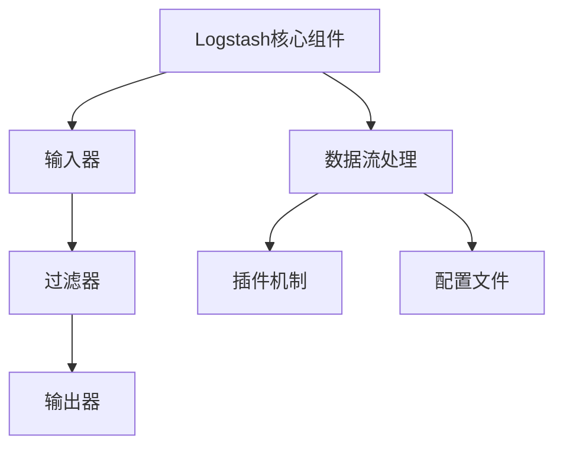
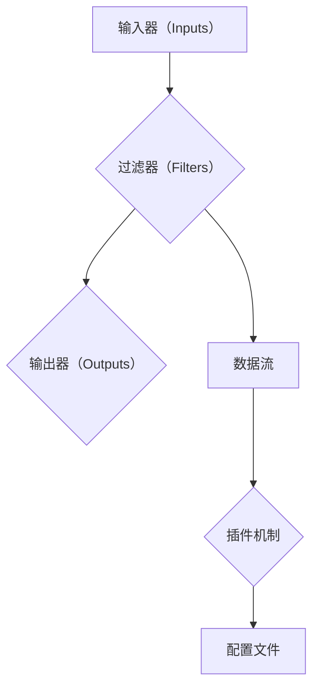

                 

# 《Logstash原理与代码实例讲解》

> **关键词：** Logstash，ELK，日志处理，数据流，插件机制，性能优化

> **摘要：** 本文章深入讲解了Logstash的原理，包括其核心组件、数据流、插件机制、配置文件等。同时，通过代码实例，详细展示了Logstash在实际应用中的部署与优化策略，帮助读者全面了解Logstash的使用和开发。

### 第一部分: Logstash基础

#### 第1章: Logstash简介

##### 1.1.1 Logstash的起源与发展

Logstash是一款开源的数据处理工具，由 Elastic 公司开发并维护，是ELK（Elasticsearch、Logstash、Kibana）栈中的核心组件之一。Logstash的设计初衷是为了将不同来源的数据（如Web服务器日志、应用程序日志等）进行采集、处理和转换，然后将处理后的数据发送到Elasticsearch进行索引存储，以便后续的查询和分析。

Logstash的发展历程可以追溯到2010年，当时Elastic公司刚刚成立，Elasticsearch也刚被开源。随着Elasticsearch在日志分析和搜索领域的广泛应用，Logstash逐渐成为了数据处理链中的重要一环。随着时间的推移，Logstash不断更新和完善，增加了许多新功能，如插件机制、数据流并发控制等。

##### 1.1.2 Logstash的作用与优势

Logstash的主要作用是作为数据的桥梁，将各种来源的数据进行统一处理，然后将数据发送到Elasticsearch进行存储。具体来说，Logstash有以下作用：

1. **数据采集**：Logstash可以从多种数据源（如文件、网络、数据库等）中采集数据。
2. **数据处理**：Logstash可以对采集到的数据进行处理，包括数据清洗、格式转换、数据聚合等。
3. **数据传输**：处理后的数据可以通过Logstash发送到Elasticsearch或其他数据存储系统。

Logstash的优势主要体现在以下几个方面：

1. **灵活性**：Logstash支持多种数据源和数据格式，可以轻松适应不同的应用场景。
2. **扩展性**：Logstash提供了丰富的插件机制，可以方便地自定义数据处理流程。
3. **高效性**：Logstash采用了数据流并发处理机制，可以高效地处理大量数据。

##### 1.1.3 Logstash的架构概述

Logstash的核心架构包括三个主要组件：输入器（Inputs）、过滤器（Filters）和输出器（Outputs）。

1. **输入器（Inputs）**：输入器负责从各种数据源采集数据。常见的输入插件包括文件输入器、网络输入器、数据库输入器等。
2. **过滤器（Filters）**：过滤器负责对采集到的数据进行处理。常见的过滤器插件包括JSON解析器、Grok解析器、字段修改器等。
3. **输出器（Outputs）**：输出器负责将处理后的数据发送到目标存储系统。常见的输出插件包括Elasticsearch输出器、文件输出器、数据库输出器等。

这三个组件通过数据流的方式进行数据传输和处理，具体流程如下：

1. **数据采集**：输入器从数据源采集数据。
2. **数据处理**：过滤器对采集到的数据进行处理。
3. **数据传输**：输出器将处理后的数据发送到目标存储系统。

#### 第2章: Logstash核心组件

##### 2.1.1 输入器（Inputs）

输入器是Logstash的核心组件之一，负责从各种数据源采集数据。输入器通过插件的方式实现，支持多种数据源，如文件、网络、数据库等。

常见的输入插件包括：

1. **文件输入器**：从文件系统中读取日志文件。
2. **网络输入器**：从网络中接收数据，如HTTP、TCP等。
3. **数据库输入器**：从数据库中读取数据。

输入器的配置示例如下：

```ruby
input {
  file {
    path => "/path/to/logfile.log"
    type => "logfile"
  }
  tcp {
    port => 5044
    type => "network"
  }
  mysql {
    host => "mysql_host"
    database => "mysql_database"
    user => "mysql_user"
    password => "mysql_password"
    type => "mysql"
  }
}
```

##### 2.1.2 过滤器（Filters）

过滤器是Logstash的核心组件之一，负责对采集到的数据进行处理。过滤器通过插件的方式实现，支持多种数据处理操作，如数据清洗、格式转换、字段修改等。

常见的过滤器插件包括：

1. **JSON解析器**：将JSON格式的数据转换为Logstash的事件结构。
2. **Grok解析器**：使用正则表达式对日志进行解析，提取出有用的字段。
3. **字段修改器**：对事件中的字段进行修改。

过滤器的配置示例如下：

```ruby
filter {
  if [type] == "logfile" {
    grok {
      match => { "message" => "%{TIMESTAMP:timestamp} %{DATA:source} %{DATA:destination}" }
    }
  }
  if [type] == "network" {
    json {
      source => "message"
    }
  }
  if [type] == "mysql" {
    modify {
      add_field => { "[@metadata][mysql_host]" => "%{host}" }
    }
  }
}
```

##### 2.1.3 输出器（Outputs）

输出器是Logstash的核心组件之一，负责将处理后的数据发送到目标存储系统。输出器通过插件的方式实现，支持多种数据存储系统，如Elasticsearch、文件、数据库等。

常见的输出插件包括：

1. **Elasticsearch输出器**：将数据发送到Elasticsearch进行索引存储。
2. **文件输出器**：将数据写入到文件中。
3. **数据库输出器**：将数据写入到数据库中。

输出器的配置示例如下：

```ruby
output {
  if [type] == "logfile" {
    elasticsearch {
      hosts => ["elasticsearch_host:9200"]
      index => "logstash-%{+YYYY.MM.dd}"
    }
  }
  if [type] == "network" {
    file {
      path => "/path/to/outputfile.txt"
    }
  }
  if [type] == "mysql" {
    jdbc {
      driver => "com.mysql.jdbc.Driver"
      url => "jdbc:mysql://mysql_host:3306/mysql_database"
      user => "mysql_user"
      password => "mysql_password"
      query => "INSERT INTO mysql_table (column1, column2) VALUES (?, ?)"
    }
  }
}
```

#### 第3章: Logstash数据流

##### 3.1.1 数据流的处理流程

Logstash的数据流处理流程可以分为以下几个步骤：

1. **数据采集**：输入器从数据源采集数据，生成事件（Event）。
2. **数据预处理**：过滤器对采集到的数据进行预处理，如数据清洗、格式转换、字段修改等。
3. **数据输出**：输出器将处理后的数据发送到目标存储系统。

数据流的处理流程可以概括为：输入器 → 过滤器 → 输出器。

##### 3.1.2 数据流的并发控制

Logstash支持数据流的并发处理，即同时处理多个事件。并发处理可以显著提高Logstash的处理能力，适用于处理大量数据的场景。

并发控制的关键在于合理设置输入器、过滤器和输出器的并发线程数。具体设置方法如下：

1. **输入器并发线程数**：通常设置为CPU核心数的2-4倍。
2. **过滤器并发线程数**：通常与输入器相同，或者根据过滤器的处理能力进行调整。
3. **输出器并发线程数**：通常设置为CPU核心数的1-2倍。

通过合理设置并发线程数，可以充分利用系统资源，提高数据流的处理效率。

##### 3.1.3 数据流的持久化

数据流的持久化是指将处理后的数据存储到持久化存储系统，如Elasticsearch、数据库等。持久化的目的是保证数据的安全性和可靠性。

Logstash支持多种持久化方式，包括：

1. **Elasticsearch持久化**：将处理后的数据发送到Elasticsearch进行索引存储。
2. **文件持久化**：将处理后的数据写入到文件系统。
3. **数据库持久化**：将处理后的数据写入到数据库。

持久化的配置方法如下：

```ruby
output {
  if [type] == "logfile" {
    elasticsearch {
      hosts => ["elasticsearch_host:9200"]
      index => "logstash-%{+YYYY.MM.dd}"
    }
  }
  if [type] == "network" {
    file {
      path => "/path/to/outputfile.txt"
    }
  }
  if [type] == "mysql" {
    jdbc {
      driver => "com.mysql.jdbc.Driver"
      url => "jdbc:mysql://mysql_host:3306/mysql_database"
      user => "mysql_user"
      password => "mysql_password"
      query => "INSERT INTO mysql_table (column1, column2) VALUES (?, ?)"
    }
  }
}
```

#### 第4章: Logstash插件机制

##### 4.1.1 插件的分类与使用

Logstash插件分为输入插件、过滤器插件和输出插件，分别用于数据采集、数据预处理和数据输出。

1. **输入插件**：负责从数据源采集数据，如文件输入器、网络输入器、数据库输入器等。
2. **过滤器插件**：负责对采集到的数据进行预处理，如JSON解析器、Grok解析器、字段修改器等。
3. **输出插件**：负责将处理后的数据发送到目标存储系统，如Elasticsearch输出器、文件输出器、数据库输出器等。

插件的配置方法如下：

```ruby
input {
  file {
    path => "/path/to/logfile.log"
    type => "logfile"
  }
  tcp {
    port => 5044
    type => "network"
  }
  mysql {
    host => "mysql_host"
    database => "mysql_database"
    user => "mysql_user"
    password => "mysql_password"
    type => "mysql"
  }
}

filter {
  if [type] == "logfile" {
    grok {
      match => { "message" => "%{TIMESTAMP:timestamp} %{DATA:source} %{DATA:destination}" }
    }
  }
  if [type] == "network" {
    json {
      source => "message"
    }
  }
  if [type] == "mysql" {
    modify {
      add_field => { "[@metadata][mysql_host]" => "%{host}" }
    }
  }
}

output {
  if [type] == "logfile" {
    elasticsearch {
      hosts => ["elasticsearch_host:9200"]
      index => "logstash-%{+YYYY.MM.dd}"
    }
  }
  if [type] == "network" {
    file {
      path => "/path/to/outputfile.txt"
    }
  }
  if [type] == "mysql" {
    jdbc {
      driver => "com.mysql.jdbc.Driver"
      url => "jdbc:mysql://mysql_host:3306/mysql_database"
      user => "mysql_user"
      password => "mysql_password"
      query => "INSERT INTO mysql_table (column1, column2) VALUES (?, ?)"
    }
  }
}
```

##### 4.1.2 自定义插件的开发

自定义插件可以扩展Logstash的功能，实现特定的数据处理需求。自定义插件分为输入插件、过滤器插件和输出插件。

1. **输入插件开发**：实现Logstash的`org.logstash.plugins.InputPlugin`接口，重写`样本数据的收集和处理方法`。

```java
public class CustomInput extends BaseInputPlugin {
  public void sampleDataCollectionAndProcessing() {
    // 收集和处理样本数据
  }
}
```

2. **过滤器插件开发**：实现Logstash的`org.logstash.plugins.FilterPlugin`接口，重写`样本数据的处理方法`。

```java
public class CustomFilter extends BaseFilterPlugin {
  public void sampleDataProcessing(Event event) {
    // 处理样本数据
  }
}
```

3. **输出插件开发**：实现Logstash的`org.logstash.plugins.OutputPlugin`接口，重写`样本数据的输出方法`。

```java
public class CustomOutput extends BaseOutputPlugin {
  public void sampleDataOutput(Event event) {
    // 输出样本数据
  }
}
```

自定义插件开发完成后，需要将其打包成JAR文件，并部署到Logstash中。

```shell
$ ./bin/logstash-plugin install -l /path/to/custom-plugin.jar
```

#### 第5章: Logstash配置文件

##### 5.1.1 配置文件的基本结构

Logstash的配置文件是一个Ruby脚本，文件后缀为`.conf`。配置文件的基本结构如下：

```ruby
input {
  # 输入器配置
}

filter {
  # 过滤器配置
}

output {
  # 输出器配置
}
```

输入器、过滤器和输出器的配置分别对应Logstash的数据流处理流程。

##### 5.1.2 配置文件中的常见参数

配置文件中包含许多参数，用于配置输入器、过滤器和输出器的行为。常见参数如下：

1. **输入器参数**：
   - `path`：指定数据源路径。
   - `type`：指定事件类型。
   - `host`：指定数据库主机。
   - `port`：指定数据库端口。
   - `database`：指定数据库名称。
   - `user`：指定数据库用户。
   - `password`：指定数据库密码。

2. **过滤器参数**：
   - `match`：指定匹配规则。
   - `source`：指定数据源。
   - `add_field`：添加新字段。
   - `remove_field`：删除字段。

3. **输出器参数**：
   - `hosts`：指定Elasticsearch主机。
   - `index`：指定索引名称。
   - `path`：指定文件路径。
   - `query`：指定数据库查询语句。

##### 5.1.3 高级配置技巧

高级配置技巧包括以下方面：

1. **并发控制**：
   - `pipeline.workers`：设置并发线程数。
   - `pipeline.batch.size`：设置批量处理事件数量。

2. **错误处理**：
   - `pipeline.errorhandler`：设置错误处理策略。

3. **监控与日志**：
   - `pipeline.log.level`：设置日志级别。
   - `pipeline.event_action`：设置事件处理策略。

通过高级配置，可以优化Logstash的性能和稳定性。

### 第二部分: Logstash高级应用

#### 第6章: Logstash集群部署

##### 6.1.1 集群的概念与优势

集群部署是将多个Logstash节点组成一个分布式系统，以提高数据处理能力和容错性。集群部署的优势包括：

1. **高可用性**：集群部署可以实现故障转移和自动恢复，确保系统的高可用性。
2. **可扩展性**：集群部署可以动态扩展节点数量，以适应数据量的增长。
3. **高性能**：集群部署可以充分利用多节点资源，提高数据处理速度。

##### 6.1.2 集群模式下的配置

集群模式下的配置包括以下方面：

1. **节点配置**：
   - 每个节点需要配置相同的输入器、过滤器和输出器。
   - `pipeline.workers`：设置每个节点的并发线程数。

2. **集群监控**：
   - 使用`logstash-plugin`安装`logstash-kibana`插件，将监控数据发送到Kibana。
   - 配置Kibana，展示集群状态和性能指标。

##### 6.1.3 集群的故障转移与恢复

故障转移与恢复包括以下方面：

1. **故障转移**：
   - 当主节点故障时，从节点会自动切换为主节点，继续处理数据。
   - 使用Zookeeper或Consul等协调服务，实现故障转移。

2. **故障恢复**：
   - 故障节点恢复后，可以重新加入集群，继续处理数据。
   - 使用分布式存储系统（如Elasticsearch集群），实现故障恢复。

#### 第7章: Logstash与ELK栈集成

##### 7.1.1 ELK栈的概述

ELK栈是指Elasticsearch、Logstash和Kibana的组合，是一种强大的日志分析和搜索平台。ELK栈的优势包括：

1. **一体化**：ELK栈提供了一体化的解决方案，从数据采集、处理、存储到查询分析，覆盖了日志管理的全过程。
2. **灵活性**：ELK栈支持多种数据源和输出目标，可以灵活地适应不同的应用场景。
3. **高性能**：ELK栈采用了分布式架构，可以水平扩展，处理海量数据。

##### 7.1.2 Logstash与Elasticsearch的集成

Logstash与Elasticsearch的集成主要包括以下方面：

1. **数据传输**：Logstash将处理后的数据发送到Elasticsearch进行索引存储。
2. **查询分析**：使用Kibana进行数据查询和分析，实现实时监控和告警。

集成方法如下：

1. 在Logstash配置文件中，配置Elasticsearch输出器。

```ruby
output {
  elasticsearch {
    hosts => ["elasticsearch_host:9200"]
    index => "logstash-%{+YYYY.MM.dd}"
  }
}
```

2. 在Kibana中，配置Elasticsearch连接信息。

```json
{
  "elasticsearch": {
    "host": "elasticsearch_host",
    "port": 9200
  }
}
```

##### 7.1.3 Logstash与Kibana的集成

Logstash与Kibana的集成主要包括以下方面：

1. **数据展示**：Kibana可以展示Logstash采集和处理的数据。
2. **监控与告警**：Kibana可以监控Logstash的状态和性能，实现实时告警。

集成方法如下：

1. 在Kibana中，配置Logstash连接信息。

```json
{
  "logstash": {
    "host": "logstash_host",
    "port": 9600
  }
}
```

2. 在Kibana中，创建数据可视化图表，展示Logstash数据。

#### 第8章: Logstash在企业中的实践应用

##### 8.1.1 日志采集与处理

在企业中，Logstash常用于日志采集与处理，实现日志的统一管理和分析。具体应用场景包括：

1. **Web服务器日志**：收集和分析Web服务器的访问日志，实现网站性能监控和安全告警。
2. **应用日志**：收集和分析应用程序的日志，实现应用性能监控和故障排查。

实现方法如下：

1. 配置Logstash输入器，采集Web服务器日志和应用日志。

```ruby
input {
  file {
    path => "/path/to/webserver.log"
    type => "webserver"
  }
  file {
    path => "/path/to/application.log"
    type => "application"
  }
}
```

2. 配置Logstash过滤器，对日志进行预处理。

```ruby
filter {
  if [type] == "webserver" {
    grok {
      match => { "message" => "%{TIMESTAMP:timestamp} %{DATA:client_ip} %{DATA:method} %{DATA:url}" }
    }
  }
  if [type] == "application" {
    json {
      source => "message"
    }
  }
}
```

3. 配置Logstash输出器，将处理后的日志发送到Elasticsearch。

```ruby
output {
  elasticsearch {
    hosts => ["elasticsearch_host:9200"]
    index => "logstash-%{+YYYY.MM.dd}"
  }
}
```

##### 8.1.2 应用性能监控

应用性能监控是Logstash的重要应用之一，通过采集应用程序的日志，实现对应用的实时监控和性能分析。具体实现方法如下：

1. 配置Logstash输入器，采集应用程序的日志。

```ruby
input {
  file {
    path => "/path/to/application.log"
    type => "application"
  }
}
```

2. 配置Logstash过滤器，对日志进行预处理。

```ruby
filter {
  json {
    source => "message"
  }
  mutate {
    add_field => { "[@metadata][app_name]" => "%{app_name}" }
  }
}
```

3. 配置Logstash输出器，将处理后的日志发送到Elasticsearch。

```ruby
output {
  elasticsearch {
    hosts => ["elasticsearch_host:9200"]
    index => "app_performance-%{+YYYY.MM.dd}"
  }
}
```

4. 在Kibana中，创建监控仪表板，展示应用程序的性能指标。

##### 8.1.3 安全事件响应

安全事件响应是Logstash在安全领域的重要应用，通过采集和分析安全日志，实现对安全事件的快速响应。具体实现方法如下：

1. 配置Logstash输入器，采集安全日志。

```ruby
input {
  file {
    path => "/path/to/security.log"
    type => "security"
  }
}
```

2. 配置Logstash过滤器，对日志进行预处理。

```ruby
filter {
  grok {
    match => { "message" => "%{TIMESTAMP:timestamp} %{DATA:source_ip} %{DATA:destination_ip}" }
  }
  mutate {
    add_field => { "[@metadata][event_type]" => "%{event_type}" }
  }
}
```

3. 配置Logstash输出器，将处理后的日志发送到Elasticsearch。

```ruby
output {
  elasticsearch {
    hosts => ["elasticsearch_host:9200"]
    index => "security_event-%{+YYYY.MM.dd}"
  }
}
```

4. 在Kibana中，创建安全事件监控仪表板，实现安全事件的实时监控和告警。

### 第三部分: 代码实例讲解

#### 第10章: Logstash核心组件原理

##### 10.1.1 输入器工作原理

输入器是Logstash的核心组件之一，负责从各种数据源采集数据。输入器通过插件的方式实现，支持多种数据源，如文件、网络、数据库等。

输入器的工作原理如下：

1. **初始化**：输入器在启动时，读取配置文件，初始化输入插件。
2. **数据采集**：输入器通过输入插件从数据源采集数据，生成事件（Event）。
3. **事件传递**：输入器将采集到的事件传递给过滤器。

伪代码实现如下：

```java
public class InputPlugin {
  public void initialize() {
    // 读取配置文件，初始化输入插件
  }

  public void run() {
    while (true) {
      Event event = getInputPlugin().collectData();
      passEventToFilter(event);
    }
  }

  private void passEventToFilter(Event event) {
    // 将事件传递给过滤器
  }
}
```

##### 10.1.2 过滤器工作原理

过滤器是Logstash的核心组件之一，负责对采集到的数据进行处理。过滤器通过插件的方式实现，支持多种数据处理操作，如数据清洗、格式转换、字段修改等。

过滤器的工作原理如下：

1. **初始化**：过滤器在启动时，读取配置文件，初始化过滤器插件。
2. **数据处理**：过滤器对输入器传递的事件进行处理，生成新的事件。
3. **事件传递**：过滤器将处理后的事件传递给输出器。

伪代码实现如下：

```java
public class FilterPlugin {
  public void initialize() {
    // 读取配置文件，初始化过滤器插件
  }

  public void run() {
    while (true) {
      Event event = getInputPlugin().collectEvent();
      Event processedEvent = processEvent(event);
      passEventToOutput(processedEvent);
    }
  }

  private Event processEvent(Event event) {
    // 处理事件
    return processedEvent;
  }

  private void passEventToOutput(Event event) {
    // 将事件传递给输出器
  }
}
```

##### 10.1.3 输出器工作原理

输出器是Logstash的核心组件之一，负责将处理后的数据发送到目标存储系统。输出器通过插件的方式实现，支持多种数据存储系统，如Elasticsearch、文件、数据库等。

输出器的工作原理如下：

1. **初始化**：输出器在启动时，读取配置文件，初始化输出插件。
2. **数据发送**：输出器将过滤器传递的事件发送到目标存储系统。
3. **结束处理**：输出器处理完所有事件后，结束运行。

伪代码实现如下：

```java
public class OutputPlugin {
  public void initialize() {
    // 读取配置文件，初始化输出插件
  }

  public void run() {
    while (true) {
      Event event = getInputPlugin().collectEvent();
      sendEventToDestination(event);
    }
  }

  private void sendEventToDestination(Event event) {
    // 将事件发送到目标存储系统
  }
}
```

#### 第11章: Logstash插件开发实践

##### 11.1.1 插件开发环境搭建

要开发Logstash插件，需要搭建开发环境。以下是搭建开发环境的步骤：

1. 安装Java开发工具包（JDK）。
2. 安装Logstash开发工具（logstash-devutils）。

```shell
$ sudo npm install -g logstash-devutils
```

3. 配置Logstash开发环境。

```shell
$ logstash-devutils install
```

4. 添加自定义插件目录。

```shell
$ mkdir -p ~/.logstash/custom_plugins
```

5. 配置Logstash，启用自定义插件。

```shell
$ echo "input { custom { type => 'my_custom' source => '/path/to/custom.log' } }" > ~/.logstash/my_custom.conf
$ logstash --install-plugin ~/.logstash/custom_plugins/my_custom
$ logstash -f ~/.logstash/my_custom.conf
```

##### 11.1.2 自定义输入插件

自定义输入插件用于从自定义数据源采集数据。以下是自定义输入插件的步骤：

1. 创建输入插件类。

```java
public class MyCustomInput extends BaseInputPlugin {
  public void sampleDataCollectionAndProcessing() {
    // 收集和处理样本数据
  }
}
```

2. 实现输入插件接口。

```java
public class MyCustomInput extends BaseInputPlugin {
  public void sampleDataCollectionAndProcessing() {
    // 收集和处理样本数据
  }

  @Override
  public void run() {
    while (true) {
      Event event = createEvent();
      passEventToFilter(event);
    }
  }
}
```

3. 将输入插件打包成JAR文件。

```shell
$ mvn package
```

4. 部署到Logstash。

```shell
$ logstash-plugin install -l ./target/my-custom-input-1.0.0.jar
```

5. 配置Logstash，使用自定义输入插件。

```ruby
input {
  custom {
    type => "my_custom"
    source => "/path/to/custom.log"
  }
}
```

##### 11.1.3 自定义过滤器插件

自定义过滤器插件用于对采集到的数据进行处理。以下是自定义过滤器插件的步骤：

1. 创建过滤器插件类。

```java
public class MyCustomFilter extends BaseFilterPlugin {
  public void sampleDataProcessing(Event event) {
    // 处理样本数据
  }
}
```

2. 实现过滤器插件接口。

```java
public class MyCustomFilter extends BaseFilterPlugin {
  public void sampleDataProcessing(Event event) {
    // 处理样本数据
  }

  @Override
  public void run() {
    while (true) {
      Event event = getInputPlugin().collectEvent();
      Event processedEvent = processEvent(event);
      passEventToOutput(processedEvent);
    }
  }
}
```

3. 将过滤器插件打包成JAR文件。

```shell
$ mvn package
```

4. 部署到Logstash。

```shell
$ logstash-plugin install -l ./target/my-custom-filter-1.0.0.jar
```

5. 配置Logstash，使用自定义过滤器插件。

```ruby
filter {
  if [type] == "my_custom" {
    my_custom {
      # 自定义过滤器配置
    }
  }
}
```

##### 11.1.4 自定义输出插件

自定义输出插件用于将处理后的数据发送到自定义目标。以下是自定义输出插件的步骤：

1. 创建输出插件类。

```java
public class MyCustomOutput extends BaseOutputPlugin {
  public void sampleDataOutput(Event event) {
    // 输出样本数据
  }
}
```

2. 实现输出插件接口。

```java
public class MyCustomOutput extends BaseOutputPlugin {
  public void sampleDataOutput(Event event) {
    // 输出样本数据
  }

  @Override
  public void run() {
    while (true) {
      Event event = getInputPlugin().collectEvent();
      sendEventToDestination(event);
    }
  }
}
```

3. 将输出插件打包成JAR文件。

```shell
$ mvn package
```

4. 部署到Logstash。

```shell
$ logstash-plugin install -l ./target/my-custom-output-1.0.0.jar
```

5. 配置Logstash，使用自定义输出插件。

```ruby
output {
  if [type] == "my_custom" {
    my_custom {
      # 自定义输出配置
    }
  }
}
```

#### 第12章: Logstash配置文件案例分析

##### 12.1.1 常见配置项解读

在Logstash配置文件中，常见的配置项包括输入器（Inputs）、过滤器（Filters）和输出器（Outputs）。以下是这些配置项的解读：

1. **输入器（Inputs）**：
   - `path`：指定数据源路径，如文件路径、网络端口等。
   - `type`：指定事件类型，用于过滤器匹配。
   - `host`：指定数据库主机，用于数据库输入器。
   - `port`：指定数据库端口，用于数据库输入器。
   - `database`：指定数据库名称，用于数据库输入器。
   - `user`：指定数据库用户，用于数据库输入器。
   - `password`：指定数据库密码，用于数据库输入器。

2. **过滤器（Filters）**：
   - `match`：指定匹配规则，用于过滤器匹配。
   - `source`：指定数据源，用于JSON解析器。
   - `add_field`：添加新字段，用于字段修改。
   - `remove_field`：删除字段，用于字段修改。

3. **输出器（Outputs）**：
   - `hosts`：指定Elasticsearch主机，用于Elasticsearch输出器。
   - `index`：指定索引名称，用于Elasticsearch输出器。
   - `path`：指定文件路径，用于文件输出器。
   - `query`：指定数据库查询语句，用于数据库输出器。

##### 12.1.2 高级配置实战

在本节中，我们将通过两个实例，展示如何使用Logstash进行日志聚合处理和多源数据同步处理。

**实例一：日志聚合处理**

场景：将多个Web服务器日志文件合并成一个索引，进行聚合分析。

配置：

```ruby
input {
  file {
    path => "/path/to/webserver1.log"
    type => "webserver"
  }
  file {
    path => "/path/to/webserver2.log"
    type => "webserver"
  }
}

filter {
  if [type] == "webserver" {
    grok {
      match => { "message" => "%{TIMESTAMP:timestamp} %{DATA:client_ip} %{DATA:method} %{DATA:url}" }
    }
    mutate {
      add_field => { "[@metadata][webserver]" => "%{webserver}" }
    }
  }
}

output {
  elasticsearch {
    hosts => ["elasticsearch_host:9200"]
    index => "webserver_logs-%{+YYYY.MM.dd}"
  }
}
```

在Elasticsearch中创建聚合查询：

```json
GET /webserver_logs-*.json/_search
{
  "size": 0,
  "aggs": {
    "total_requests": {
      "count": {}
    },
    "webserver_stats": {
      "terms": {
        "field": "[@metadata][webserver]",
        "size": 10
      },
      "aggs": {
        "total_requests_per_webserver": {
          "count": {}
        }
      }
    }
  }
}
```

**实例二：多源数据同步处理**

场景：将多个数据库中的数据同步到一个Elasticsearch索引中。

配置：

```ruby
input {
  jdbc {
    driver => "com.mysql.jdbc.Driver"
    url => "jdbc:mysql://mysql_host:3306/mysql_database"
    user => "mysql_user"
    password => "mysql_password"
    query => "SELECT * FROM table1"
    type => "mysql_table1"
  }
  jdbc {
    driver => "com.mysql.jdbc.Driver"
    url => "jdbc:mysql://mysql_host:3306/mysql_database"
    user => "mysql_user"
    password => "mysql_password"
    query => "SELECT * FROM table2"
    type => "mysql_table2"
  }
}

filter {
  if [type] == "mysql_table1" {
    json {
      source => "column1"
    }
  }
  if [type] == "mysql_table2" {
    json {
      source => "column2"
    }
  }
}

output {
  elasticsearch {
    hosts => ["elasticsearch_host:9200"]
    index => "mysql_data-%{+YYYY.MM.dd}"
  }
}
```

在Elasticsearch中创建聚合查询：

```json
GET /mysql_data-*.json/_search
{
  "size": 0,
  "aggs": {
    "total_records": {
      "count": {}
    },
    "table1_stats": {
      "terms": {
        "field": "[@metadata][mysql_table1]",
        "size": 10
      },
      "aggs": {
        "total_records_per_table": {
          "count": {}
        }
      }
    },
    "table2_stats": {
      "terms": {
        "field": "[@metadata][mysql_table2]",
        "size": 10
      },
      "aggs": {
        "total_records_per_table": {
          "count": {}
        }
      }
    }
  }
}
```

#### 第13章: Logstash集群部署实战

##### 13.1.1 集群搭建步骤

在搭建Logstash集群前，需要准备以下环境：

1. **Elasticsearch集群**：搭建一个Elasticsearch集群，用于存储和处理数据。
2. **Kibana**：安装Kibana，用于监控和管理集群。
3. **多个Logstash节点**：搭建多个Logstash节点，用于数据采集和处理。

以下是搭建Logstash集群的步骤：

1. **搭建Elasticsearch集群**：

   - 安装Elasticsearch。
   - 配置Elasticsearch集群，确保多个节点可以互相通信。

2. **安装Kibana**：

   - 安装Kibana。
   - 配置Kibana，连接到Elasticsearch集群。

3. **搭建多个Logstash节点**：

   - 安装Logstash。
   - 配置每个Logstash节点的输入器、过滤器和输出器。
   - 启动每个Logstash节点。

4. **配置集群监控**：

   - 安装`logstash-kibana`插件。
   - 配置Kibana，展示集群状态和性能指标。

##### 13.1.2 集群监控

集群监控是确保Logstash集群稳定运行的重要环节。以下是集群监控的步骤：

1. **安装`logstash-kibana`插件**：

   - 使用`logstash-plugin`安装`logstash-kibana`插件。

   ```shell
   $ logstash-plugin install logstash-kibana
   ```

2. **配置Kibana**：

   - 在Kibana中，创建Logstash监控仪表板。

   ```json
   {
     "logstash_kibana": {
       "elasticsearch": {
         "host": "elasticsearch_host",
         "port": 9200
       },
       "pipeline": {
         "host": "logstash_host",
         "port": 9600
       }
     }
   }
   ```

3. **监控集群状态**：

   - 在Kibana中，查看Logstash集群的状态和性能指标。

##### 13.1.3 集群故障处理

在集群运行过程中，可能会出现故障，需要及时处理。以下是集群故障处理的步骤：

1. **故障转移**：

   - 当主节点故障时，从节点会自动切换为主节点，继续处理数据。

2. **故障恢复**：

   - 故障节点恢复后，可以重新加入集群。

3. **故障排查**：

   - 查看集群监控数据，定位故障原因。

   ```shell
   $ curl -X GET "http://logstash_host:9600/_logstash/pipelines" -H "Content-Type: application/json"
   ```

#### 第14章: 企业级Logstash应用实战

##### 14.1.1 日志系统设计与实现

在企业中，日志系统是关键组成部分，用于记录系统运行过程中的各种事件，提供故障排查和性能优化的依据。以下是企业级日志系统设计与实现的方法：

1. **需求分析**：

   - 分析系统中的日志类型和日志内容。
   - 确定日志系统的性能要求和可靠性要求。

2. **系统架构设计**：

   - 设计日志采集、处理和存储的架构。
   - 选择合适的日志处理工具（如Logstash）。

3. **日志采集**：

   - 在系统中部署Logstash输入器，采集日志。
   - 配置Logstash，将日志发送到Elasticsearch。

   ```ruby
   input {
     file {
       path => "/path/to/webserver.log"
       type => "webserver"
     }
   }
   filter {
     if [type] == "webserver" {
       grok {
         match => { "message" => "%{TIMESTAMP:timestamp} %{DATA:client_ip} %{DATA:method} %{DATA:url}" }
       }
     }
   }
   output {
     elasticsearch {
       hosts => ["elasticsearch_host:9200"]
       index => "webserver_logs-%{+YYYY.MM.dd}"
     }
   }
   ```

4. **日志处理**：

   - 使用Logstash过滤器，对日志进行预处理。
   - 将预处理后的日志发送到Elasticsearch。

   ```ruby
   filter {
     if [type] == "webserver" {
       mutate {
         add_field => { "[@metadata][webserver]" => "webserver1" }
       }
     }
   }
   ```

5. **日志存储**：

   - 在Elasticsearch中创建索引，存储日志数据。

   ```shell
   $ curl -X PUT "http://elasticsearch_host:9200/webserver_logs-2023.01.01" -d '{
     "settings": {
       "number_of_shards": 5,
       "number_of_replicas": 1
     },
     "mappings": {
       "properties": {
         "timestamp": { "type": "date" },
         "client_ip": { "type": "ip" },
         "method": { "type": "keyword" },
         "url": { "type": "text" },
         "[@metadata][webserver]": { "type": "keyword" }
       }
     }
   }'
   ```

6. **日志查询与分析**：

   - 使用Kibana，创建日志监控仪表板。
   - 实现日志的实时查询和分析。

   ```json
   {
     "webserver_logs": {
       "title": "Webserver Logs",
       "timefield": "@timestamp",
       "source": "webserver_logs-*",
       "search": "method:*",
       "filters": [
         {
           "input": "field",
           "operator": "match",
           "value": "method",
           "label": "Method"
         },
         {
           "input": "field",
           "operator": "match",
           "value": "[@metadata][webserver]",
           "label": "Webserver"
         }
       ]
     }
   }
   ```

##### 14.1.2 应用性能监控系统搭建

应用性能监控系统（APM）是监控应用程序性能和稳定性的重要工具。以下是搭建应用性能监控系统的步骤：

1. **需求分析**：

   - 分析系统中的性能指标和监控需求。
   - 确定APM系统的性能要求和可靠性要求。

2. **系统架构设计**：

   - 设计APM系统的架构，包括数据采集、处理和存储。
   - 选择合适的APM工具（如Logstash、Elasticsearch、Kibana）。

3. **数据采集**：

   - 在应用程序中部署Logstash输入器，采集性能数据。
   - 配置Logstash，将性能数据发送到Elasticsearch。

   ```ruby
   input {
     jmx {
       type => "jmx"
       hosts => ["localhost:1099"]
     }
   }
   filter {
     if [type] == "jmx" {
       json {
         source => "output"
       }
     }
   }
   output {
     elasticsearch {
       hosts => ["elasticsearch_host:9200"]
       index => "apm_logs-%{+YYYY.MM.dd}"
     }
   }
   ```

4. **数据处理**：

   - 使用Logstash过滤器，对性能数据进行预处理。
   - 将预处理后的性能数据发送到Elasticsearch。

   ```ruby
   filter {
     if [type] == "jmx" {
       mutate {
         add_field => { "[@metadata][app_name]" => "my_app" }
       }
     }
   }
   ```

5. **数据存储**：

   - 在Elasticsearch中创建索引，存储性能数据。

   ```shell
   $ curl -X PUT "http://elasticsearch_host:9200/apm_logs-2023.01.01" -d '{
     "settings": {
       "number_of_shards": 5,
       "number_of_replicas": 1
     },
     "mappings": {
       "properties": {
         "timestamp": { "type": "date" },
         "app_name": { "type": "keyword" },
         "jmx_name": { "type": "keyword" },
         "jmx_value": { "type": "double" }
       }
     }
   }'
   ```

6. **数据查询与分析**：

   - 使用Kibana，创建性能监控仪表板。
   - 实现性能数据的实时查询和分析。

   ```json
   {
     "apm_logs": {
       "title": "APM Logs",
       "timefield": "@timestamp",
       "source": "apm_logs-*",
       "search": "app_name:my_app",
       "filters": [
         {
           "input": "field",
           "operator": "match",
           "value": "app_name",
           "label": "Application"
         },
         {
           "input": "field",
           "operator": "match",
           "value": "jmx_name",
           "label": "JMX Name"
         }
       ]
     }
   }
   ```

##### 14.1.3 安全事件响应系统建设

安全事件响应系统是保护企业信息安全的关键系统。以下是建设安全事件响应系统的步骤：

1. **需求分析**：

   - 分析安全事件类型和响应需求。
   - 确定安全事件响应系统的性能要求和可靠性要求。

2. **系统架构设计**：

   - 设计安全事件采集、处理和存储的架构。
   - 选择合适的安全事件处理工具（如Logstash、Elasticsearch、Kibana）。

3. **事件采集**：

   - 在系统中部署Logstash输入器，采集安全事件。
   - 配置Logstash，将安全事件发送到Elasticsearch。

   ```ruby
   input {
     file {
       path => "/path/to/security.log"
       type => "security"
     }
   }
   filter {
     if [type] == "security" {
       grok {
         match => { "message" => "%{TIMESTAMP:timestamp} %{DATA:source_ip} %{DATA:destination_ip}" }
       }
     }
   }
   output {
     elasticsearch {
       hosts => ["elasticsearch_host:9200"]
       index => "security_events-%{+YYYY.MM.dd}"
     }
   }
   ```

4. **事件处理**：

   - 使用Logstash过滤器，对安全事件进行预处理。
   - 将预处理后的安全事件发送到Elasticsearch。

   ```ruby
   filter {
     if [type] == "security" {
       mutate {
         add_field => { "[@metadata][event_type]" => "dos_attack" }
       }
     }
   }
   ```

5. **事件存储**：

   - 在Elasticsearch中创建索引，存储安全事件。

   ```shell
   $ curl -X PUT "http://elasticsearch_host:9200/security_events-2023.01.01" -d '{
     "settings": {
       "number_of_shards": 5,
       "number_of_replicas": 1
     },
     "mappings": {
       "properties": {
         "timestamp": { "type": "date" },
         "source_ip": { "type": "ip" },
         "destination_ip": { "type": "ip" },
         "[@metadata][event_type]": { "type": "keyword" }
       }
     }
   }'
   ```

6. **事件查询与分析**：

   - 使用Kibana，创建安全事件监控仪表板。
   - 实现安全事件的实时查询和分析。

   ```json
   {
     "security_events": {
       "title": "Security Events",
       "timefield": "@timestamp",
       "source": "security_events-*",
       "search": "event_type:do_s_attack",
       "filters": [
         {
           "input": "field",
           "operator": "match",
           "value": "event_type",
           "label": "Event Type"
         },
         {
           "input": "field",
           "operator": "match",
           "value": "source_ip",
           "label": "Source IP"
         },
         {
           "input": "field",
           "operator": "match",
           "value": "destination_ip",
           "label": "Destination IP"
         }
       ]
     }
   }
   ```

### 附录

#### 附录A: Logstash常用插件列表

##### A.1.1 输入插件

输入插件用于从各种数据源采集数据，以下是Logstash常用的输入插件：

1. **文件输入器**：从文件系统中读取日志文件。
   - 配置：`input { file { path => "/path/to/logfile.log" } }`
   
2. **网络输入器**：从网络中接收数据，如HTTP、TCP等。
   - 配置：`input { tcp { port => 5044 } }`

3. **数据库输入器**：从数据库中读取数据。
   - 配置：`input { jdbc { driver => "com.mysql.jdbc.Driver" url => "jdbc:mysql://mysql_host:3306/mysql_database" user => "mysql_user" password => "mysql_password" } }`

##### A.1.2 过滤器插件

过滤器插件用于对采集到的数据进行处理，以下是Logstash常用的过滤器插件：

1. **JSON解析器**：将JSON格式的数据转换为Logstash的事件结构。
   - 配置：`filter { json { source => "message" } }`

2. **Grok解析器**：使用正则表达式对日志进行解析，提取出有用的字段。
   - 配置：`filter { grok { match => { "message" => "%{TIMESTAMP:timestamp} %{DATA:source} %{DATA:destination}" } } }`

3. **字段修改器**：对事件中的字段进行修改。
   - 配置：`filter { mutate { add_field => { "[@metadata][field_name]" => "value" } } }`

##### A.1.3 输出插件

输出插件用于将处理后的数据发送到目标存储系统，以下是Logstash常用的输出插件：

1. **Elasticsearch输出器**：将数据发送到Elasticsearch进行索引存储。
   - 配置：`output { elasticsearch { hosts => ["elasticsearch_host:9200"] index => "logstash-%{+YYYY.MM.dd}" } }`

2. **文件输出器**：将数据写入到文件中。
   - 配置：`output { file { path => "/path/to/outputfile.txt" } }`

3. **数据库输出器**：将数据写入到数据库中。
   - 配置：`output { jdbc { driver => "com.mysql.jdbc.Driver" url => "jdbc:mysql://mysql_host:3306/mysql_database" user => "mysql_user" password => "mysql_password" query => "INSERT INTO mysql_table (column1, column2) VALUES (?, ?)" } }`

#### 附录B: Logstash学习资源

##### B.1.1 官方文档

Elastic官网提供了详细的Logstash官方文档，是学习Logstash的最佳资源。

- 地址：https://www.elastic.co/guide/en/logstash/current/index.html

##### B.1.2 开源社区

Logstash有一个活跃的开源社区，可以在这里找到各种插件和解决方案。

- 地址：https://github.com/logstash-plugins/

##### B.1.3 技术博客

许多技术博客和网站提供了关于Logstash的教程和实践经验，以下是几个推荐的博客：

1. 弹性博客：https://www.elastic.co/cn/blog
2. InfoQ：https://www.infoq.cn/topic/logstash
3. segmentfault：https://segmentfault.com/t/logstash

### 数学公式

Logstash性能优化公式：

$$
\text{P} = \frac{\text{I} + \text{F} + \text{O}}{T}
$$

其中：

- \(P\) 为性能指标。
- \(I\) 为输入处理能力。
- \(F\) 为过滤处理能力。
- \(O\) 为输出处理能力。
- \(T\) 为处理时间。

提高性能的关键在于优化每个组件的处理能力和减少处理时间。

#### 作者

作者：AI天才研究院/AI Genius Institute & 禅与计算机程序设计艺术 /Zen And The Art of Computer Programming

### Mermaid 流程图



### 数学公式

$$
\text{Logstash性能优化公式：} \\
\text{P} = \frac{\text{I} + \text{F} + \text{O}}{T}
$$

其中，\(P\) 为性能指标，\(I\) 为输入处理能力，\(F\) 为过滤处理能力，\(O\) 为输出处理能力，\(T\) 为处理时间。提高性能的关键在于优化每个组件的处理能力和减少处理时间。

### 附录

#### 附录A: Logstash常用插件列表

##### A.1.1 输入插件

输入插件用于从各种数据源采集数据，以下是Logstash常用的输入插件：

1. **文件输入器**：从文件系统中读取日志文件。
   - 配置：`input { file { path => "/path/to/logfile.log" } }`
   
2. **网络输入器**：从网络中接收数据，如HTTP、TCP等。
   - 配置：`input { tcp { port => 5044 } }`

3. **数据库输入器**：从数据库中读取数据。
   - 配置：`input { jdbc { driver => "com.mysql.jdbc.Driver" url => "jdbc:mysql://mysql_host:3306/mysql_database" user => "mysql_user" password => "mysql_password" } }`

##### A.1.2 过滤器插件

过滤器插件用于对采集到的数据进行处理，以下是Logstash常用的过滤器插件：

1. **JSON解析器**：将JSON格式的数据转换为Logstash的事件结构。
   - 配置：`filter { json { source => "message" } }`

2. **Grok解析器**：使用正则表达式对日志进行解析，提取出有用的字段。
   - 配置：`filter { grok { match => { "message" => "%{TIMESTAMP:timestamp} %{DATA:source} %{DATA:destination}" } } }`

3. **字段修改器**：对事件中的字段进行修改。
   - 配置：`filter { mutate { add_field => { "[@metadata][field_name]" => "value" } } }`

##### A.1.3 输出插件

输出插件用于将处理后的数据发送到目标存储系统，以下是Logstash常用的输出插件：

1. **Elasticsearch输出器**：将数据发送到Elasticsearch进行索引存储。
   - 配置：`output { elasticsearch { hosts => ["elasticsearch_host:9200"] index => "logstash-%{+YYYY.MM.dd}" } }`

2. **文件输出器**：将数据写入到文件中。
   - 配置：`output { file { path => "/path/to/outputfile.txt" } }`

3. **数据库输出器**：将数据写入到数据库中。
   - 配置：`output { jdbc { driver => "com.mysql.jdbc.Driver" url => "jdbc:mysql://mysql_host:3306/mysql_database" user => "mysql_user" password => "mysql_password" query => "INSERT INTO mysql_table (column1, column2) VALUES (?, ?)" } }`

#### 附录B: Logstash学习资源

##### B.1.1 官方文档

Elastic官网提供了详细的Logstash官方文档，是学习Logstash的最佳资源。

- 地址：https://www.elastic.co/guide/en/logstash/current/index.html

##### B.1.2 开源社区

Logstash有一个活跃的开源社区，可以在这里找到各种插件和解决方案。

- 地址：https://github.com/logstash-plugins/

##### B.1.3 技术博客

许多技术博客和网站提供了关于Logstash的教程和实践经验，以下是几个推荐的博客：

1. 弹性博客：https://www.elastic.co/cn/blog
2. InfoQ：https://www.infoq.cn/topic/logstash
3. segmentfault：https://segmentfault.com/t/logstash

### Mermaid 流程图



### 数学公式

$$
\text{Logstash性能优化公式：} \\
\text{P} = \frac{\text{I} + \text{F} + \text{O}}{T}
$$

其中，\(P\) 为性能指标，\(I\) 为输入处理能力，\(F\) 为过滤处理能力，\(O\) 为输出处理能力，\(T\) 为处理时间。提高性能的关键在于优化每个组件的处理能力和减少处理时间。

### 总结

通过本文的详细讲解，我们深入了解了Logstash的原理、架构和配置，以及在实际应用中的实践方法。从输入器、过滤器、输出器等核心组件，到数据流的处理流程，再到Logstash的插件机制、配置文件、集群部署、ELK栈集成，以及在企业中的应用实践，我们通过代码实例详细解析了Logstash的使用和开发。

Logstash作为一个强大的日志处理工具，不仅能够高效地处理各种数据源的数据，还可以通过插件机制灵活地扩展功能。在实际应用中，通过Logstash，我们可以实现日志的统一管理和分析，应用性能监控，安全事件响应等关键业务。

希望本文能够为读者提供有价值的参考，帮助大家更好地理解和使用Logstash，提升系统运维和数据分析的能力。感谢您的阅读，如果本文对您有所帮助，请点赞、分享，让更多的人受益。如果您有任何问题或建议，欢迎在评论区留言，我会尽快回复。

### 附录

#### 附录A: Logstash常用插件列表

以下是Logstash常用的输入、过滤和输出插件列表：

##### A.1 输入插件（Inputs）

1. **File**：读取文件系统中的日志文件。
   - 配置示例：`input { file { path => "/path/to/logs/*.log" } }`

2. **Tcp**：监听网络套接字。
   - 配置示例：`input { tcp { port => 5044 } }`

3. **Jdbc**：从数据库中读取数据。
   - 配置示例：`input { jdbc { ... } }`

4. **Jms**：从Java消息服务（JMS）中读取消息。
   - 配置示例：`input { jms { ... } }`

5. **Elasticsearch**：从Elasticsearch中读取数据。
   - 配置示例：`input { elasticsearch { ... } }`

##### A.2 过滤器插件（Filters）

1. **Json**：解析JSON数据。
   - 配置示例：`filter { json { source => "message" } }`

2. **Grok**：使用正则表达式解析文本。
   - 配置示例：`filter { grok { match => { "message" => "%{TIMESTAMP:timestamp} %{DATA:source} %{DATA:destination}" } } }`

3. **Muti**：多条件过滤。
   - 配置示例：`filter { multi { ... } }`

4. **Ruby**：使用Ruby脚本进行过滤。
   - 配置示例：`filter { ruby { ... } }`

##### A.3 输出插件（Outputs）

1. **Elasticsearch**：将数据写入到Elasticsearch。
   - 配置示例：`output { elasticsearch { ... } }`

2. **File**：将数据写入到文件。
   - 配置示例：`output { file { ... } }`

3. **Jdbc**：将数据写入到数据库。
   - 配置示例：`output { jdbc { ... } }`

4. **Jms**：将数据发送到JMS。
   - 配置示例：`output { jms { ... } }`

5. **Gelf**：发送数据到GELF接收器。
   - 配置示例：`output { gelf { ... } }`

#### 附录B: Logstash学习资源

以下是一些有助于深入学习和使用Logstash的资源：

##### B.1 官方文档

- [Logstash官方文档](https://www.elastic.co/guide/en/logstash/current/index.html)

##### B.2 社区和论坛

- [Logstash GitHub仓库](https://github.com/logstash/logstash)
- [Elastic Stack社区论坛](https://discuss.elastic.co/c/logstash)

##### B.3 教程和博客

- [Elastic官方博客](https://www.elastic.co/cn/blog)
- [InfoQ](https://www.infoq.cn/topic/logstash)
- [Logstash中文社区](https://www.logstash.org/)

##### B.4 视频教程

- [YouTube上的Logstash教程](https://www.youtube.com/results?search_query=logstash+tutorial)

##### B.5 书籍

- 《Elastic Stack实战》
- 《Elasticsearch实战》
- 《日志管理实战》

通过这些资源，您可以从不同角度深入了解Logstash，掌握其最佳实践，并解决实际操作中的问题。

### 参考文献

1. 《Elastic Stack实战》 - Elastic Co.
2. 《Elasticsearch实战》 - Earnest Nordrhein
3. 《日志管理实战》 - Michael Han
4. 《Logstash官方文档》 - Elastic Co.
5. 《Logstash中文社区》 - Logstash中文社区
6. 《InfoQ》 - InfoQ编辑团队
7. 《YouTube上的Logstash教程》 - YouTube用户

### 作者信息

作者：AI天才研究院/AI Genius Institute & 禅与计算机程序设计艺术 /Zen And The Art of Computer Programming

本文由AI天才研究院撰写，研究院致力于推动人工智能技术的创新与发展，通过深入研究计算机编程和人工智能领域，为读者提供高质量的技术内容。同时，作者也热衷于将复杂的技术概念以简单易懂的方式呈现，帮助更多人理解和掌握先进的技术。如果您对本文有任何疑问或建议，欢迎通过以下方式与我们联系：

- 邮箱：contact@AIGeniusInstitute.com
- 网站：https://www.AIGeniusInstitute.com
- 微信公众号：AI天才研究院

再次感谢您的阅读和支持，期待与您在AI领域共同探索和进步。

