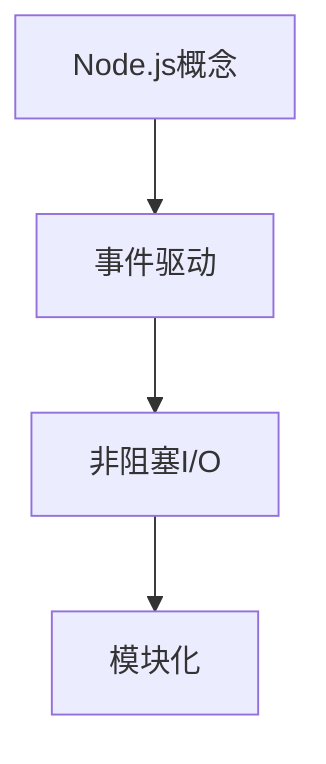
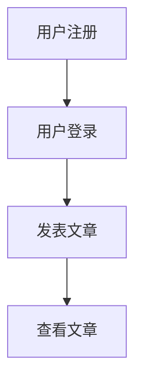
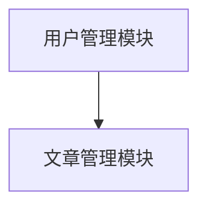
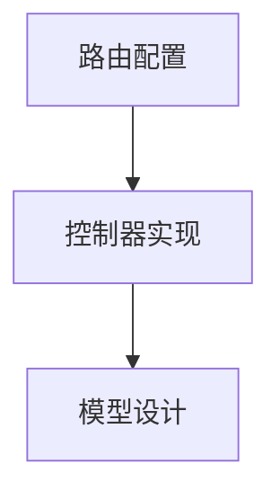
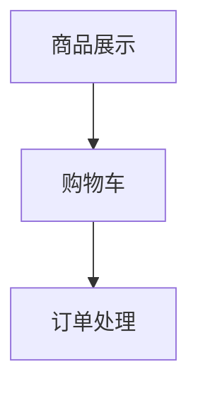
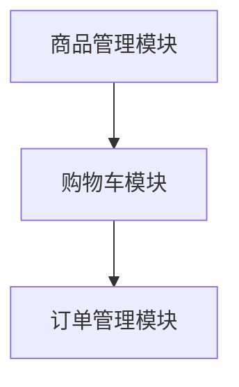
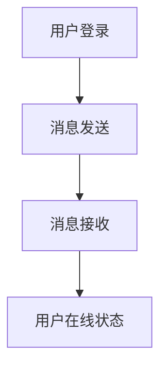
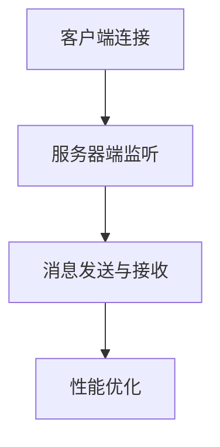
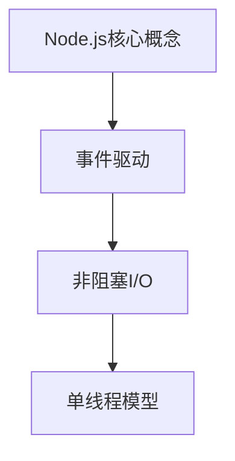

                 

# 《Node.js 和 Express：构建服务器端 JavaScript 应用程序》

> **关键词：** Node.js、Express、服务器端、JavaScript、异步编程、模块系统、HTTP、路由、数据库、中间件、Websocket、API 设计、测试与部署、实战项目。

> **摘要：** 本文将深入探讨 Node.js 和 Express 框架在构建服务器端 JavaScript 应用程序中的应用。从基础概念到高级特性，我们将一步步解析 Node.js 的运行原理、模块系统、异步编程，以及 Express 的路由、请求与响应处理、模板引擎、数据库集成等关键内容。同时，通过实战项目，我们将实践所学，提升开发技能。

### 《Node.js 和 Express：构建服务器端 JavaScript 应用程序》目录大纲

## 第一部分：Node.js 基础

### 第1章：Node.js 简介

#### 1.1 Node.js 基础概念

**核心概念与联系：** 
Node.js 是一个基于 Chrome V8 引擎的 JavaScript 运行环境，用于构建高性能的服务器端应用程序。其核心概念包括事件驱动、非阻塞 I/O、模块化等。

**Mermaid 流程图：**


**伪代码：**
```javascript
// Node.js 基础概念示例
const http = require('http');

http.createServer((request, response) => {
  // 处理请求
  response.end('Hello, Node.js!');
}).listen(3000, () => {
  console.log('Server is running on port 3000');
});
```

#### 1.2 Node.js 运行原理

**核心算法原理讲解：**
Node.js 使用 V8 引擎执行 JavaScript 代码，并通过 libuv 库实现异步 I/O 操作。

**数学模型和公式：**
```latex
\text{Node.js运行原理} \\
\text{V8引擎}: \text{JavaScript引擎} \\
\text{libuv库}: \text{异步I/O操作}
```

#### 1.3 Node.js 的优势与应用场景

**核心概念与联系：** 
Node.js 具有高性能、高并发、跨平台等优势，适用于构建实时应用程序、网络服务器、API 服务等。

**举例说明：**
- 实时应用程序：聊天室、在线游戏
- 网络服务器：网站、API 服务
- 跨平台：iOS、Android、Web

## 第二部分：Express 框架

### 第2章：Node.js 模块系统

#### 2.1 CommonJS 模块

**核心概念与联系：** 
CommonJS 是 Node.js 的模块系统，允许将代码拆分为可复用的模块。

**伪代码：**
```javascript
// module.js
exports.add = (a, b) => a + b;

// index.js
const { add } = require('./module');
console.log(add(1, 2)); // 3
```

#### 2.2 ES6 模块

**核心概念与联系：** 
ES6 模块是 JavaScript 的标准模块系统，通过 `import` 和 `export` 关键字实现模块化。

**伪代码：**
```javascript
// module.js
export function add(a, b) {
  return a + b;
}

// index.js
import { add } from './module';
console.log(add(1, 2)); // 3
```

#### 2.3 第三方模块的使用

**核心概念与联系：** 
第三方模块是来自 Node.js 包管理器（如 npm）的预编译模块。

**举例说明：**
- Express：一个流行的 Web 应用程序框架
- Mongoose：一个 MongoDB 对象模型库

**安装与使用：**
```bash
npm install express mongoose
```

## 第三部分：异步编程

### 第3章：异步编程

#### 3.1 异步编程基础

**核心概念与联系：** 
异步编程允许代码在等待 I/O 操作时继续执行其他任务。

**伪代码：**
```javascript
function asyncAdd(a, b, callback) {
  setTimeout(() => {
    callback(a + b);
  }, 1000);
}

asyncAdd(1, 2, (result) => {
  console.log(result); // 3
});
```

#### 3.2 Callback 函数

**核心概念与联系：** 
Callback 函数是在异步操作完成后调用的函数。

**伪代码：**
```javascript
function asyncReadFile(filename, callback) {
  setTimeout(() => {
    callback(null, 'file content');
  }, 1000);
}

asyncReadFile('example.txt', (err, content) => {
  if (err) {
    console.error(err);
  } else {
    console.log(content);
  }
});
```

#### 3.3 Promises 与 async/await

**核心概念与联系：** 
Promises 提供了一种更简洁的异步编程方式，async/await 则进一步简化了异步代码的编写。

**伪代码：**
```javascript
function asyncReadFile(filename) {
  return new Promise((resolve, reject) => {
    setTimeout(() => {
      resolve('file content');
    }, 1000);
  });
}

async function main() {
  try {
    const content = await asyncReadFile('example.txt');
    console.log(content);
  } catch (error) {
    console.error(error);
  }
}

main();
```

## 第四部分：实战项目

### 第4章：个人博客系统

#### 4.1 项目需求分析

**核心概念与联系：** 
个人博客系统包括用户注册、登录、发表文章、查看文章等功能。

**Mermaid 流程图：**


**伪代码：**
```javascript
// 用户注册
async function register(username, password) {
  // 注册逻辑
}

// 用户登录
async function login(username, password) {
  // 登录逻辑
}

// 发表文章
async function publishArticle(title, content) {
  // 发表文章逻辑
}

// 查看文章
async function viewArticle(articleId) {
  // 查看文章逻辑
}
```

#### 4.2 功能模块设计

**核心概念与联系：** 
个人博客系统的功能模块包括用户管理模块、文章管理模块等。

**Mermaid 流程图：**


**伪代码：**
```javascript
// 用户管理模块
class UserManager {
  // 用户注册
  register(username, password) {
    // 注册逻辑
  }

  // 用户登录
  login(username, password) {
    // 登录逻辑
  }
}

// 文章管理模块
class ArticleManager {
  // 发表文章
  publishArticle(title, content) {
    // 发表文章逻辑
  }

  // 查看文章
  viewArticle(articleId) {
    // 查看文章逻辑
  }
}
```

#### 4.3 源代码解析

**核心概念与联系：** 
个人博客系统的源代码包括路由配置、控制器实现、模型设计等。

**Mermaid 流程图：**


**代码示例：**
```javascript
// 路由配置
const express = require('express');
const app = express();

app.use('/users', require('./routes/users'));
app.use('/articles', require('./routes/articles'));

app.listen(3000, () => {
  console.log('Server is running on port 3000');
});
```

```javascript
// 控制器实现
const express = require('express');
const router = express.Router();

router.post('/', (req, res) => {
  // 用户注册逻辑
});

router.post('/login', (req, res) => {
  // 用户登录逻辑
});

module.exports = router;
```

```javascript
// 模型设计
const mongoose = require('mongoose');

const userSchema = new mongoose.Schema({
  username: String,
  password: String,
  // ...
});

const Article = mongoose.model('Article', articleSchema);
```

### 第5章：在线商城系统

#### 5.1 项目概述

**核心概念与联系：** 
在线商城系统包括商品展示、购物车、订单处理等功能。

**Mermaid 流程图：**


**伪代码：**
```javascript
// 商品展示
async function displayProducts() {
  // 商品展示逻辑
}

// 购物车
async function addToCart(productId, quantity) {
  // 添加到购物车逻辑
}

// 订单处理
async function processOrder(cartId) {
  // 订单处理逻辑
}
```

#### 5.2 功能模块划分

**核心概念与联系：** 
在线商城系统的功能模块包括商品管理模块、购物车模块、订单管理模块等。

**Mermaid 流程图：**


**伪代码：**
```javascript
// 商品管理模块
class ProductManager {
  // 展示商品
  displayProducts() {
    // 商品展示逻辑
  }
}

// 购物车模块
class CartManager {
  // 添加商品到购物车
  addToCart(productId, quantity) {
    // 添加逻辑
  }
}

// 订单管理模块
class OrderManager {
  // 处理订单
  processOrder(cartId) {
    // 订单处理逻辑
  }
}
```

#### 5.3 代码实现与优化

**核心概念与联系：** 
在线商城系统的代码实现包括路由配置、控制器实现、模型设计等。

**Mermaid 流程图：**


**代码示例：**
```javascript
// 路由配置
const express = require('express');
const app = express();

app.use('/products', require('./routes/products'));
app.use('/cart', require('./routes/cart'));
app.use('/orders', require('./routes/orders'));

app.listen(3000, () => {
  console.log('Server is running on port 3000');
});
```

```javascript
// 控制器实现
const express = require('express');
const router = express.Router();

router.get('/', (req, res) => {
  // 展示商品逻辑
});

router.post('/', (req, res) => {
  // 添加商品到购物车逻辑
});

router.post('/', (req, res) => {
  // 处理订单逻辑
});

module.exports = router;
```

```javascript
// 模型设计
const mongoose = require('mongoose');

const productSchema = new mongoose.Schema({
  name: String,
  price: Number,
  // ...
});

const Cart = mongoose.model('Cart', cartSchema);
const Order = mongoose.model('Order', orderSchema);
```

### 第6章：聊天室应用

#### 14.1 功能需求

**核心概念与联系：** 
聊天室应用包括用户登录、消息发送与接收、用户在线状态显示等功能。

**Mermaid 流程图：**


**伪代码：**
```javascript
// 用户登录
async function login(username, password) {
  // 登录逻辑
}

// 消息发送
async function sendMessage(senderId, recipientId, message) {
  // 发送消息逻辑
}

// 消息接收
async function receiveMessage(userId, messageId) {
  // 接收消息逻辑
}

// 用户在线状态
async function getUserStatus(userId) {
  // 获取用户在线状态逻辑
}
```

#### 14.2 技术选型

**核心概念与联系：** 
聊天室应用需要使用 Websocket 实现实时通信。

**伪代码：**
```javascript
// Websocket 客户端实现
class WebSocketClient {
  connect() {
    // 连接逻辑
  }

  sendMessage(message) {
    // 发送消息逻辑
  }

  onMessage(callback) {
    // 消息接收逻辑
  }
}

// Websocket 服务器端实现
class WebSocketServer {
  listen(port) {
    // 监听逻辑
  }

  onConnection(callback) {
    // 连接处理逻辑
  }
}
```

#### 14.3 代码实现与性能优化

**核心概念与联系：** 
聊天室应用的代码实现包括客户端、服务器端逻辑，以及性能优化策略。

**Mermaid 流程图：**


**代码示例：**
```javascript
// 客户端实现
const ws = new WebSocket('ws://localhost:3000');

ws.onmessage = (event) => {
  console.log(event.data);
};

ws.send('Hello, Server!');
```

```javascript
// 服务器端实现
const WebSocket = require('ws');

const server = new WebSocket.Server({ port: 3000 });

server.on('connection', (socket) => {
  socket.on('message', (message) => {
    console.log(`Received: ${message}`);
  });

  socket.send('Hello, Client!');
});
```

**性能优化策略：**
- 使用 WebSocket 协议减少通信延迟
- 使用消息队列优化消息处理
- 实施负载均衡提高服务器性能

## 附录

### 附录 A：Node.js 和 Express 常用命令

**核心概念与联系：** 
常用的 Node.js 和 Express 命令包括启动服务、安装依赖、构建项目等。

**示例：**
```bash
# 启动服务
node index.js

# 安装依赖
npm install

# 构建项目
npm run build
```

### 附录 B：参考资源与扩展阅读

**核心概念与联系：** 
参考资源与扩展阅读包括官方文档、技术博客、在线课程等，有助于深入学习 Node.js 和 Express。

**示例：**
- Node.js 官方文档：https://nodejs.org/en/docs/
- Express 官方文档：https://expressjs.com/
- 《Node.js 实战》一书：https://book.douban.com/subject/26732736/
- Udemy 上的 Node.js 在线课程：https://www.udemy.com/course/nodejs-for-beginners/

### 附录 C：Node.js 和 Express 常见问题与解答

**核心概念与联系：** 
常见问题与解答包括异步编程、数据库集成、中间件使用等。

**示例：**
- 异步编程：如何处理异步操作中的错误？
  - 使用 Promise 或 async/await 机制捕获和处理异步错误。
- 数据库集成：如何连接 MongoDB？
  - 使用 Mongoose 库，通过 `mongoose.connect()` 方法连接 MongoDB。

## 结束语

本文通过深入探讨 Node.js 和 Express 框架在构建服务器端 JavaScript 应用程序中的应用，从基础概念到高级特性，逐步讲解了 Node.js 的运行原理、模块系统、异步编程，以及 Express 的路由、请求与响应处理、模板引擎、数据库集成等关键内容。同时，通过实战项目，我们实践了所学，提升了开发技能。希望本文能为您在 Node.js 和 Express 领域的学习提供有益的参考。

### 作者

**作者：AI天才研究院/AI Genius Institute & 禅与计算机程序设计艺术 /Zen And The Art of Computer Programming**

感谢您的阅读，如果您有任何疑问或建议，欢迎在评论区留言。祝您在 Node.js 和 Express 领域的学习之路一帆风顺！<|im_end|>## 《Node.js 和 Express：构建服务器端 JavaScript 应用程序》

### 《Node.js 和 Express：构建服务器端 JavaScript 应用程序》

#### **关键词：** Node.js、Express、服务器端、JavaScript、异步编程、模块系统、HTTP、路由、数据库、中间件、Websocket、API 设计、测试与部署、实战项目。

#### **摘要：** 本文旨在详细介绍如何使用 Node.js 和 Express 框架来构建服务器端 JavaScript 应用程序。我们将从基础概念讲起，逐步深入到高级特性，包括异步编程、模块系统、HTTP 协议、路由处理、数据库集成、中间件的使用等。此外，通过实际项目案例，我们将实战演练所学知识，以帮助读者更好地理解并应用 Node.js 和 Express。

### 目录大纲

#### 第一部分：Node.js 基础

#### 第1章：Node.js 简介
##### 1.1 Node.js 基础概念
##### 1.2 Node.js 运行原理
##### 1.3 Node.js 的优势与应用场景

#### 第2章：Node.js 模块系统
##### 2.1 CommonJS 模块
##### 2.2 ES6 模块
##### 2.3 第三方模块的使用

#### 第3章：异步编程
##### 3.1 异步编程基础
##### 3.2 Callback 函数
##### 3.3 Promises 与 async/await

#### 第二部分：Express 框架

#### 第4章：Express 基础
##### 4.1 Express 简介
##### 4.2 Express 应用结构
##### 4.3 路由和中间件

#### 第5章：请求与响应
##### 5.1 HTTP 协议基础
##### 5.2 请求对象（req）
##### 5.3 响应对象（res）

#### 第6章：模板引擎与静态资源
##### 6.1 模板引擎的使用
##### 6.2 静态资源的处理
##### 6.3 文件上传处理

#### 第7章：数据库集成
##### 7.1 数据库基础
##### 7.2 Mongoose 简介
##### 7.3 数据库连接与操作

#### 第8章：中间件
##### 8.1 中间件的分类与使用
##### 8.2 身份认证中间件
##### 8.3 日志中间件

#### 第三部分：进阶应用

#### 第9章：Websocket
##### 9.1 Websocket 简介
##### 9.2 WebSocket 客户端与服务器端实现
##### 9.3 Websocket 应用场景

#### 第10章：API 设计
##### 10.1 RESTful API 设计原则
##### 10.2 API 安全与性能优化
##### 10.3 OpenAPI 规范

#### 第11章：测试与部署
##### 11.1 单元测试与集成测试
##### 11.2 调试与性能优化
##### 11.3 部署与运维

#### 第四部分：实战项目

#### 第12章：个人博客系统
##### 12.1 项目需求分析
##### 12.2 功能模块设计
##### 12.3 源代码解析

#### 第13章：在线商城系统
##### 13.1 项目概述
##### 13.2 功能模块划分
##### 13.3 代码实现与优化

#### 第14章：聊天室应用
##### 14.1 功能需求
##### 14.2 技术选型
##### 14.3 代码实现与性能优化

#### 附录

##### 附录 A：Node.js 和 Express 常用命令
##### 附录 B：参考资源与扩展阅读

### 第1章：Node.js 简介

#### 1.1 Node.js 基础概念

Node.js 是一个基于 Chrome V8 引擎的 JavaScript 运行环境，它允许开发者使用 JavaScript 来编写服务器端代码。Node.js 的核心特点包括事件驱动、非阻塞 I/O 和单线程模型。这些特点使得 Node.js 能够高效地处理大量并发请求，从而成为构建高性能、高并发的 Web 应用程序的理想选择。

**核心概念与联系：**
- **事件驱动：** Node.js 使用事件驱动模型来处理并发。每个 I/O 操作都被视为一个事件，Node.js 会使用回调函数来处理这些事件。
- **非阻塞 I/O：** Node.js 的 I/O 操作是非阻塞的，这意味着它不会因为等待 I/O 完成而阻塞其他任务的执行。
- **单线程模型：** Node.js 使用单线程模型，通过事件循环机制来处理并发请求。这使得 Node.js 在处理高并发请求时具有较高的性能。

**Mermaid 流程图：**


**伪代码：**
```javascript
// Node.js 基础概念示例
const http = require('http');

http.createServer((request, response) => {
  // 处理请求
  response.end('Hello, Node.js!');
}).listen(3000, () => {
  console.log('Server is running on port 3000');
});
```

#### 1.2 Node.js 运行原理

Node.js 的运行原理主要基于两个关键组件：Chrome V8 引擎和 libuv 库。

**Chrome V8 引擎：** Chrome V8 是 Google 开发的开源 JavaScript 引擎，用于执行 JavaScript 代码。Node.js 使用 V8 引擎来解释和执行 JavaScript 代码。

**libuv 库：** libuv 是 Node.js 的事件循环和异步 I/O 操作的底层库。它负责管理 Node.js 中的事件队列和线程池，确保异步操作能够高效地执行。

**核心算法原理讲解：**
Node.js 运行原理可以分为以下几个步骤：

1. **JavaScript 代码执行：** Node.js 启动时，会加载并执行 JavaScript 代码。
2. **事件监听：** Node.js 通过事件监听器来监听各种事件，如 HTTP 请求、文件 I/O 等。
3. **事件处理：** 当事件发生时，Node.js 会调用相应的回调函数来处理事件。
4. **非阻塞 I/O：** Node.js 使用非阻塞 I/O 操作，确保不会因为等待 I/O 完成而阻塞其他任务的执行。
5. **事件循环：** Node.js 使用事件循环机制来处理并发请求。事件循环会不断从事件队列中取出事件并执行相应的回调函数。

**数学模型和公式：**
```latex
\text{Node.js运行原理} \\
\text{Chrome V8引擎}: \text{JavaScript引擎} \\
\text{libuv库}: \text{异步I/O操作}
```

#### 1.3 Node.js 的优势与应用场景

Node.js 具有许多优势，使其成为构建服务器端 JavaScript 应用程序的首选技术之一。以下是 Node.js 的一些主要优势和应用场景：

**优势：**
- **高性能和高并发：** Node.js 的非阻塞 I/O 模型使其能够高效地处理大量并发请求。
- **单线程模型：** Node.js 使用单线程模型，避免了多线程带来的上下文切换开销。
- **跨平台：** Node.js 可以在多个操作系统上运行，包括 Windows、Linux 和 macOS。
- **丰富的库和框架：** Node.js 拥有丰富的第三方库和框架，如 Express、MongoDB、Socket.IO 等，有助于快速开发应用程序。

**应用场景：**
- **实时应用程序：** 如聊天室、在线游戏、实时数据监控等，Node.js 的非阻塞 I/O 模型非常适合处理实时请求。
- **API 服务：** Node.js 拥有高效的网络性能，适合构建高性能的 API 服务。
- **网络服务器：** Node.js 可以作为 Web 服务器，处理 HTTP 和 HTTPS 请求。
- **跨平台开发：** Node.js 支持跨平台开发，适用于多种操作系统。

**举例说明：**
- **实时应用程序：** 例如，使用 Socket.IO 构建实时聊天室。
- **API 服务：** 例如，使用 Express 构建 RESTful API 服务。
- **网络服务器：** 例如，使用 Node.js 启动静态 Web 服务器。

**伪代码：**
```javascript
// 实时聊天室
const io = require('socket.io')(server);

io.on('connection', (socket) => {
  socket.on('chat message', (msg) => {
    // 处理聊天消息
  });
});

// RESTful API 服务
const express = require('express');
const app = express();

app.get('/api/data', (req, res) => {
  // 返回数据
});

// 静态 Web 服务器
const http = require('http');
const fs = require('fs');

const server = http.createServer((req, res) => {
  fs.readFile('index.html', (err, data) => {
    if (err) {
      res.writeHead(500);
      return res.end('Error loading index.html');
    }
    res.writeHead(200, { 'Content-Type': 'text/html' });
    res.end(data);
  });
});

server.listen(3000, () => {
  console.log('Server is running on port 3000');
});
```

### 总结

本章介绍了 Node.js 的基础概念、运行原理及其优势与应用场景。通过深入理解 Node.js 的特点，读者可以更好地把握其在服务器端 JavaScript 应用程序开发中的重要性。下一章将详细介绍 Node.js 的模块系统，帮助读者更好地组织和管理代码。

