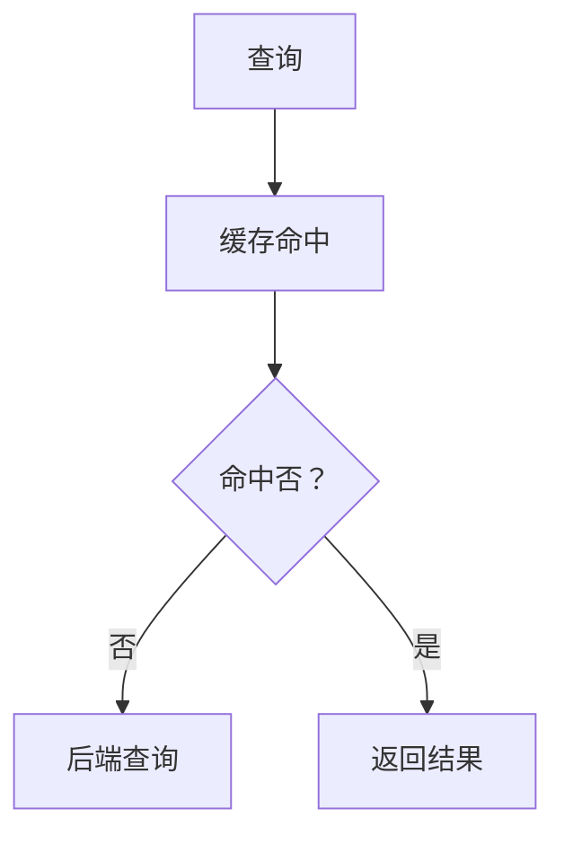
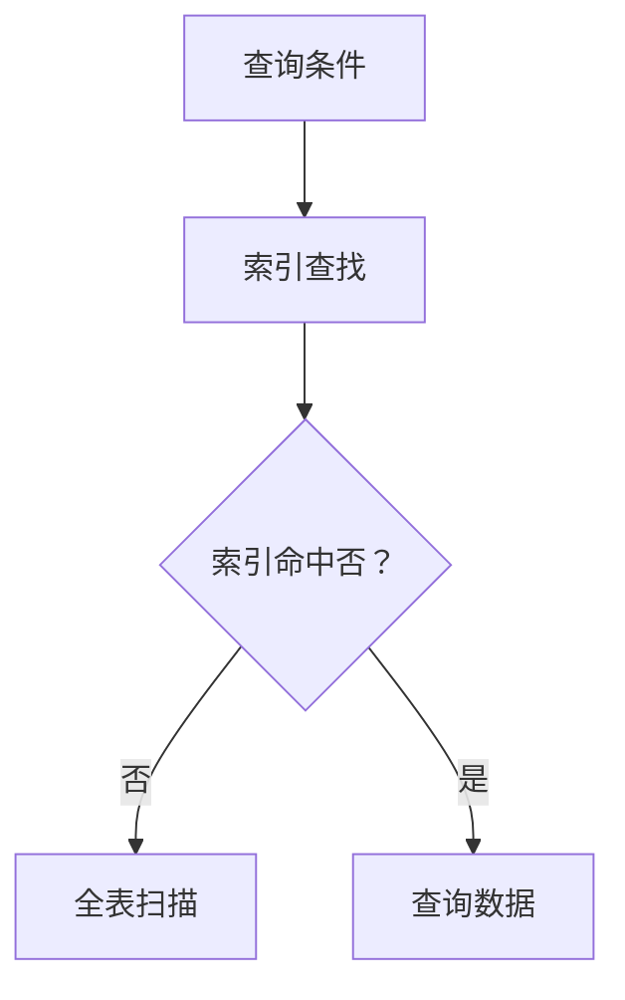
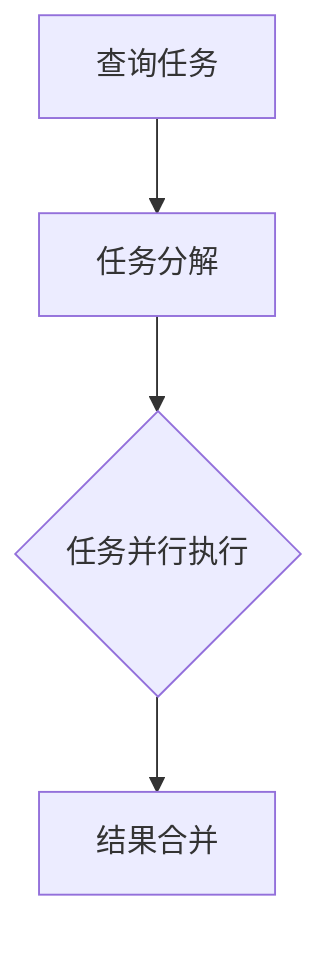
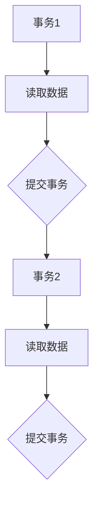
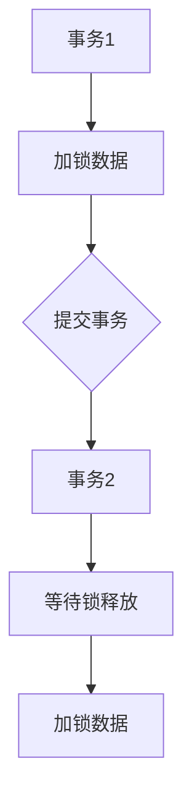
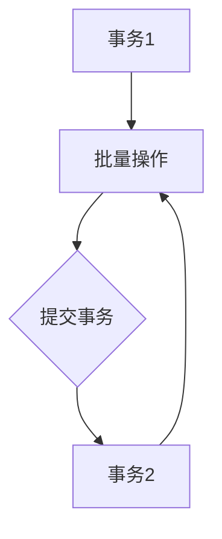
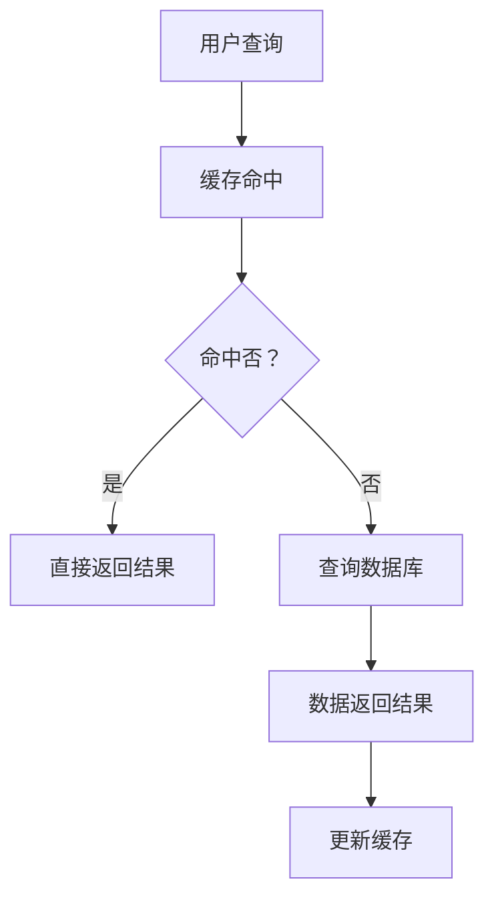
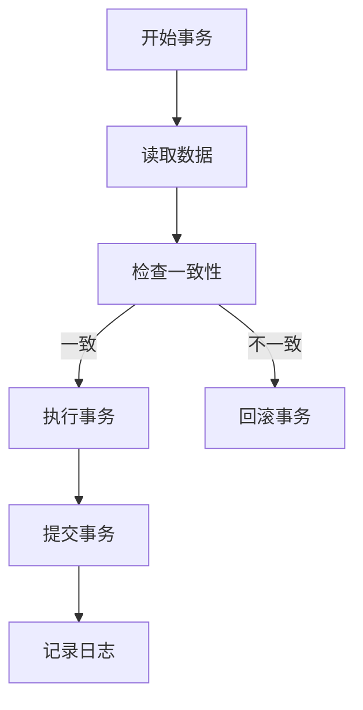

                 

### QPS与TPS概述

在IT领域中，QPS（每秒查询率）与TPS（每秒事务数）是衡量系统性能的重要指标。QPS通常用于表示系统在单位时间内处理查询请求的能力，而TPS则衡量系统在相同时间内完成事务处理的能力。两者虽然都是衡量性能的指标，但侧重点不同。

#### 1.1 QPS与TPS的定义

- **QPS**：每秒查询率，是指系统在单位时间内处理查询的次数。在Web应用中，每个查询通常对应一个HTTP请求。QPS是读密集型应用的性能关键指标，如搜索引擎、社交网络、电商平台等。
  
- **TPS**：每秒事务数，是指系统在单位时间内完成事务的次数。事务是一个原子操作序列，要么全部成功，要么全部失败。在金融交易系统、数据库操作系统中，TPS是衡量系统写操作性能的重要指标。

#### 1.2 QPS与TPS的衡量标准

衡量QPS与TPS的标准主要包括以下几个方面：

- **系统性能**：硬件配置、操作系统优化、网络延迟等对QPS和TPS有直接影响。
- **网络延迟**：网络带宽、链路质量等都会影响QPS和TPS的测量结果。
- **数据库性能**：数据库的索引、缓存策略、查询优化等都会对QPS和TPS有显著影响。

#### 1.3 QPS与TPS的关系

QPS和TPS虽然都是衡量系统性能的指标，但它们的侧重点和应用场景不同：

- **对比分析**：QPS侧重于查询操作的性能，而TPS侧重于事务处理的能力。在查询密集型应用中，高QPS意味着系统响应速度快，用户体验好；而在事务密集型应用中，高TPS意味着系统能够高效地处理业务请求，确保业务连续性。

- **应用场景**：QPS适用于读密集型应用，如搜索引擎、社交媒体、电商平台等，这类应用需要快速响应用户的查询请求。TPS则适用于金融交易系统、数据库操作等写密集型应用，这类应用需要保证事务处理的准确性和效率。

通过上述分析，我们可以得出QPS与TPS之间的关系和适用场景。在设计和优化系统时，需要根据实际应用场景选择合适的性能指标，并采取相应的优化策略，以提升系统的整体性能和用户体验。

#### 1.4 QPS与TPS的优化目标

在系统性能优化过程中，QPS和TPS的优化目标是提高系统的处理能力和响应速度。具体来说，包括以下几个方面：

- **提高QPS**：通过优化查询算法、使用缓存技术、合理设计数据库索引等方式，减少查询时间和响应延迟，从而提高系统的查询处理能力。

- **提高TPS**：通过优化事务处理流程、使用事务隔离机制、减少锁冲突等方式，提高系统的并发处理能力和事务处理速度。

- **平衡QPS与TPS**：在实际应用中，QPS和TPS并不是独立的，往往需要根据业务需求和系统负载进行平衡。例如，在电商平台上，高峰期可能需要提高QPS以满足用户的查询需求，而在非高峰期，则可以通过优化TPS来提升订单处理能力。

通过实现上述优化目标，系统可以在高负载情况下保持良好的性能，提供稳定、高效的服务，从而提升用户体验和业务连续性。

### 第2章：QPS与TPS的核心算法

#### 2.1 QPS优化算法

在优化QPS（每秒查询率）方面，有多种算法和技术可以采用。以下将介绍几种常用的QPS优化算法及其原理。

##### 2.1.1 缓存策略

**原理**：缓存策略是将经常访问的数据存储在内存中，以减少对后端系统的查询次数。常见的缓存技术有Redis、Memcached等。

**算法分析**：



- **缓存命中**：如果查询的数据在缓存中，直接返回结果，减少对后端系统的查询。
- **缓存未命中**：如果查询的数据不在缓存中，则需要查询后端系统，并将结果缓存起来，以提高后续查询的效率。

**效果**：缓存策略可以显著提高QPS，减少后端系统的负载。

##### 2.1.2 索引优化

**原理**：索引是数据库中的一种特殊结构，用于加速数据查询。合理的索引设计可以大幅减少查询时间。

**算法分析**：



- **索引命中**：如果查询条件与索引关键字匹配，直接通过索引找到数据。
- **索引未命中**：如果查询条件与索引关键字不匹配，需要进行全表扫描。

**效果**：索引优化可以显著提高查询效率，减少查询时间，从而提高QPS。

##### 2.1.3 并行处理

**原理**：并行处理是将查询任务分配到多个处理器上同时执行，以提高查询处理速度。

**算法分析**：



- **任务分解**：将查询任务分解为多个小任务。
- **任务并行执行**：多个小任务同时执行。
- **结果合并**：将多个小任务的结果合并为最终结果。

**效果**：并行处理可以显著提高QPS，尤其是在多核处理器上，性能提升更为明显。

#### 2.2 TPS优化算法

在优化TPS（每秒事务数）方面，也有多种算法和技术可以采用。以下将介绍几种常用的TPS优化算法及其原理。

##### 2.2.1 事务隔离

**原理**：事务隔离是数据库管理系统的一个关键特性，用于确保并发事务不会相互干扰。

**算法分析**：



- **读未提交（Read Uncommitted）**：允许事务读取未提交的其他事务的数据，可能导致数据不一致。
- **读已提交（Read Committed）**：事务只能读取已经提交的其他事务的数据，确保数据一致性。
- **可重复读（Repeatable Read）**：事务在执行期间无法读取其他事务已经修改但未提交的数据。
- **串行化（Serializable）**：事务按照顺序执行，确保数据一致性，但可能导致性能下降。

**效果**：选择合适的事务隔离级别可以提高TPS，同时确保数据一致性。

##### 2.2.2 锁机制

**原理**：锁机制用于控制并发访问数据库资源，防止多个事务同时修改相同数据，导致数据不一致。

**算法分析**：



- **乐观锁**：在提交事务前，先判断数据是否发生变化，如果未发生变化则提交，否则失败。这种方式适用于读多写少的场景。
- **悲观锁**：在读取数据时加锁，确保其他事务无法修改相同数据，直到当前事务提交或回滚。这种方式适用于读少写多的场景。

**效果**：锁机制可以确保数据一致性，提高TPS。

##### 2.2.3 批量处理

**原理**：批量处理是将多个事务合并为一个批量操作，以提高事务处理效率。

**算法分析**：



- **合并事务**：将多个事务合并为一个批量操作，减少数据库访问次数。
- **提交事务**：批量操作完成后，一次性提交所有事务。

**效果**：批量处理可以显著提高TPS，减少数据库的负载。

通过上述算法的合理应用，可以显著提高QPS和TPS，从而提升系统的整体性能。在实际应用中，需要根据具体业务场景和系统特点，选择合适的优化算法，以达到最佳性能。

#### 2.3 QPS优化算法的伪代码实现

以下是一种基于缓存和索引的QPS优化算法的伪代码实现，旨在减少查询时间和响应延迟：

```latex
// 伪代码：基于缓存和索引的QPS优化算法

// 初始化缓存和数据库索引
cache = initialize_cache()
index = initialize_index()

// 处理查询请求
function process_query(query):
    // 检查缓存是否命中
    if cache_hit(cache, query):
        return cache_get(cache, query)
    
    // 如果缓存未命中，使用索引查找
    if index_hit(index, query):
        data = index_search(index, query)
        // 将结果缓存起来
        cache_set(cache, query, data)
        return data
    
    // 如果索引未命中，查询数据库
    data = database_query(query)
    // 将结果缓存起来
    cache_set(cache, query, data)
    // 更新索引
    index_update(index, query, data)
    return data

// 缓存命中检查
function cache_hit(cache, query):
    return query in cache

// 缓存获取数据
function cache_get(cache, query):
    return cache[query]

// 缓存设置数据
function cache_set(cache, query, data):
    cache[query] = data

// 索引命中检查
function index_hit(index, query):
    return query in index

// 索引查找数据
function index_search(index, query):
    return index[query]

// 索引更新
function index_update(index, query, data):
    index[query] = data

// 数据库查询
function database_query(query):
    // 实现具体的数据库查询逻辑
    // ...
    return data
```

通过上述伪代码，我们可以看到，该QPS优化算法首先检查缓存是否命中，如果命中则直接返回结果；如果未命中，则通过索引查找数据；如果索引也未命中，则查询数据库并将结果缓存和更新索引。这样的优化策略可以显著减少查询时间和响应延迟，从而提高系统的QPS。

#### 2.4 TPS优化算法的伪代码实现

以下是一种基于事务隔离和批量处理的TPS优化算法的伪代码实现，旨在提高事务处理效率和并发能力：

```latex
// 伪代码：基于事务隔离和批量处理的TPS优化算法

// 初始化数据库事务隔离级别
database_set_transaction_isolation("REPEATABLE READ")

// 处理批量事务
function process_batch_transactions(transactions):
    // 开始批量事务
    database_begin_transaction()
    
    // 遍历事务列表
    for transaction in transactions:
        // 检查事务是否成功
        if not transaction_is_successful(transaction):
            // 如果事务失败，回滚并退出
            database_rollback()
            return false
        
        // 如果事务成功，提交事务
        database_commit()

    // 如果所有事务都成功，返回true
    return true

// 检查事务是否成功
function transaction_is_successful(transaction):
    // 实现具体的事务检查逻辑
    // ...
    return true

// 开始数据库事务
function database_begin_transaction():
    // 实现具体的数据库事务开始逻辑
    // ...

// 提交数据库事务
function database_commit():
    // 实现具体的数据库事务提交逻辑
    // ...

// 回滚数据库事务
function database_rollback():
    // 实现具体的数据库事务回滚逻辑
    // ...

// 设置数据库事务隔离级别
function database_set_transaction_isolation(level):
    // 实现具体的数据库事务隔离级别设置逻辑
    // ...
```

通过上述伪代码，我们可以看到，该TPS优化算法首先设置数据库的事务隔离级别为“可重复读”，以确保事务的数据一致性。然后，处理批量事务时，首先开始批量事务，逐个执行每个事务，并在每个事务成功后提交。如果所有事务都成功，则返回true；如果任何事务失败，则回滚所有事务并返回false。这样的优化策略可以提高事务处理效率和并发能力，从而提高系统的TPS。

#### 2.5 QPS与TPS优化算法的比较

在优化QPS（每秒查询率）和TPS（每秒事务数）方面，虽然它们的目标不同，但某些优化算法可以同时适用于两者。以下是对几种常用算法的比较：

##### 2.5.1 缓存策略

**QPS优化**：缓存策略通过减少对后端系统的查询次数，显著提高查询速度和响应时间，从而提高QPS。例如，使用Redis或Memcached缓存经常访问的数据。

**TPS优化**：缓存策略可以减少数据库的查询次数，降低数据库的负载，从而提高TPS。例如，将事务处理过程中使用的数据缓存起来，减少对数据库的访问。

**效果比较**：缓存策略在QPS和TPS优化中均有显著效果，但其主要优势在于减少数据库的负载，对TPS的提升更为直接。

##### 2.5.2 索引优化

**QPS优化**：索引优化通过加速查询操作，减少查询时间和响应延迟，从而提高QPS。例如，为常用的查询条件创建索引。

**TPS优化**：索引优化可以提高事务处理的速度，减少事务的响应时间，从而提高TPS。例如，为事务操作的关键字段创建索引，减少查询和更新操作的时间。

**效果比较**：索引优化对QPS和TPS均有显著效果，但其主要优势在于提高查询和事务处理的速度，对QPS的提升更为明显。

##### 2.5.3 并行处理

**QPS优化**：并行处理可以将查询任务分配到多个处理器上同时执行，减少查询时间和响应延迟，从而提高QPS。例如，在多核处理器上并行处理多个查询请求。

**TPS优化**：并行处理可以将事务任务分配到多个处理器上同时执行，减少事务的响应时间，从而提高TPS。例如，在多核处理器上并行处理多个事务请求。

**效果比较**：并行处理对QPS和TPS均有显著效果，但其主要优势在于提高系统的并发处理能力，对QPS的提升更为明显。

##### 2.5.4 事务隔离

**QPS优化**：事务隔离可以减少并发查询之间的干扰，确保查询结果的正确性，从而提高QPS。例如，使用“读已提交”隔离级别，确保查询操作不会受到未提交事务的影响。

**TPS优化**：事务隔离可以减少并发事务之间的干扰，确保事务处理的正确性，从而提高TPS。例如，使用“可重复读”隔离级别，确保事务操作不会受到其他事务的影响。

**效果比较**：事务隔离对QPS和TPS均有显著效果，但其主要优势在于提高数据一致性，对TPS的提升更为明显。

##### 2.5.5 锁机制

**QPS优化**：锁机制可以防止并发查询之间的冲突，确保查询结果的正确性，从而提高QPS。例如，使用乐观锁，在提交事务前检查数据是否发生变化。

**TPS优化**：锁机制可以防止并发事务之间的冲突，确保事务处理的正确性，从而提高TPS。例如，使用悲观锁，确保事务在执行期间不会受到其他事务的影响。

**效果比较**：锁机制对QPS和TPS均有显著效果，但其主要优势在于提高数据一致性，对TPS的提升更为明显。

综上所述，虽然QPS和TPS优化算法有所不同，但某些算法（如缓存策略、索引优化、并行处理等）可以在两者之间产生协同效应。在实际应用中，需要根据具体业务需求和系统特点，选择合适的优化算法，以达到最佳性能。

### 第3章：QPS与TPS的性能评估

在优化QPS（每秒查询率）和TPS（每秒事务数）时，性能评估是一个关键步骤。它可以帮助我们了解系统在不同负载下的表现，找出性能瓶颈，并据此进行优化。以下将详细介绍QPS与TPS的性能评估指标、评估方法和优化策略。

#### 3.1 性能评估指标

在性能评估中，我们通常会关注以下几个关键指标：

- **响应时间**：指从请求开始到收到响应之间的时间。较低的响应时间意味着系统有更好的性能。
  
- **峰值处理能力**：指系统在单位时间内能够处理的最大查询或事务数量。较高的峰值处理能力意味着系统有更好的性能和弹性。

- **并发处理能力**：指系统在同时处理多个查询或事务的能力。较高的并发处理能力意味着系统可以更好地应对高负载场景。

- **资源利用率**：指系统在处理查询或事务时，硬件资源（如CPU、内存、磁盘等）的利用率。较高的资源利用率意味着系统在高效利用资源。

- **错误率**：指系统在处理查询或事务时，出现错误的概率。较低的错误率意味着系统更稳定。

#### 3.2 性能评估方法

性能评估通常通过以下两种方法进行：

- **压力测试**：通过模拟实际负载，评估系统在不同场景下的性能。常用的工具包括Apache JMeter、Gatling等。压力测试可以模拟大量并发用户同时访问系统，从而评估系统的响应时间、峰值处理能力、并发处理能力和资源利用率等。

- **性能监控**：通过实时监控系统运行状态，发现性能瓶颈。常用的工具包括Prometheus、Grafana等。性能监控可以实时收集系统的CPU、内存、磁盘、网络等资源使用情况，并提供可视化分析，帮助发现性能瓶颈。

#### 3.3 QPS与TPS优化策略

根据性能评估的结果，可以采取以下策略来优化QPS和TPS：

- **响应时间优化**：通过缓存策略、索引优化、并行处理等技术，减少查询和事务的响应时间。

- **峰值处理能力优化**：通过硬件升级、垂直扩展、水平扩展等技术，提高系统的峰值处理能力。

- **并发处理能力优化**：通过优化数据库连接池、减少锁冲突、使用异步处理等技术，提高系统的并发处理能力。

- **资源利用率优化**：通过合理分配资源、优化代码、减少内存泄漏等技术，提高系统的资源利用率。

- **错误率优化**：通过代码审查、单元测试、性能测试等技术，减少系统的错误率。

通过上述性能评估方法和优化策略，我们可以有效提升系统的QPS和TPS，从而提高系统的整体性能和用户体验。

### 第4章：QPS与TPS的优化策略

在优化QPS（每秒查询率）和TPS（每秒事务数）时，系统架构、代码优化和硬件优化是三大核心策略。以下将详细探讨这些策略的具体方法及其效果。

#### 4.1 系统架构优化

系统架构优化是提升QPS和TPS的基础。通过合理的架构设计，可以显著提高系统的处理能力和扩展性。

##### 4.1.1 服务拆分与合并

**服务拆分**：将大型单体应用拆分为多个独立的服务，每个服务负责特定的功能。这样不仅提高了系统的可维护性，还能通过负载均衡技术提高QPS和TPS。

**服务合并**：在某些场景下，可以将具有相似功能的服务进行合并，减少系统中的服务数量，降低复杂度和通信成本。

**效果**：服务拆分与合并可以提升系统的扩展性和处理能力，从而提高QPS和TPS。

##### 4.1.2 缓存与数据库优化

**缓存优化**：使用缓存（如Redis、Memcached）存储高频查询结果，可以减少对数据库的访问次数，提高查询效率。

**数据库优化**：合理设计数据库表结构、索引和查询语句，可以提高数据库的查询性能。

**效果**：缓存与数据库优化可以显著减少查询时间和响应延迟，从而提高QPS。

#### 4.2 代码优化

代码优化是提升QPS和TPS的关键环节。通过优化代码逻辑、数据结构和算法，可以显著提高系统的处理速度和并发能力。

##### 4.2.1 算法优化

**算法优化**：选择更高效的数据结构和算法，减少时间复杂度和空间复杂度。例如，使用哈希表替代链表、使用快速排序替代冒泡排序等。

**效果**：算法优化可以显著减少查询和事务处理的耗时，从而提高QPS和TPS。

##### 4.2.2 数据结构优化

**数据结构优化**：选择更适合当前业务场景的数据结构，如使用跳表替代平衡树、使用布隆过滤器替代哈希表等。

**效果**：数据结构优化可以减少内存使用和查询时间，从而提高QPS和TPS。

##### 4.2.3 并行处理

**并行处理**：将任务分配到多个线程或进程上同时执行，提高系统的并发处理能力。

**效果**：并行处理可以显著提高QPS和TPS，尤其是在多核处理器上。

#### 4.3 硬件优化

硬件优化是提升QPS和TPS的重要手段。通过升级硬件配置、优化网络带宽等技术，可以提高系统的处理能力和响应速度。

##### 4.3.1 服务器性能提升

**升级CPU**：提高服务器的CPU性能，可以显著提升系统的处理速度。

**增加内存**：增加服务器的内存容量，可以减少内存交换，提高系统的响应速度。

**使用SSD硬盘**：使用固态硬盘（SSD）替代机械硬盘（HDD），可以减少磁盘I/O延迟，提高数据读写速度。

**效果**：服务器性能提升可以显著提高QPS和TPS，减少响应时间。

##### 4.3.2 网络带宽优化

**提高带宽**：增加网络带宽，可以减少网络延迟，提高系统的响应速度。

**优化网络拓扑**：合理设计网络拓扑结构，减少网络跳数，提高数据传输速度。

**效果**：网络带宽优化可以减少数据传输延迟，提高QPS和TPS。

通过系统架构优化、代码优化和硬件优化，我们可以全面提升QPS和TPS，从而提高系统的整体性能和用户体验。在实际应用中，需要根据具体业务需求和系统特点，综合运用这些优化策略，以达到最佳效果。

### 第5章：QPS与TPS的最佳实践案例

在本章中，我们将通过具体案例，展示QPS与TPS优化的实际应用，并详细分析其解决方案和实施效果。

#### 5.1 案例一：电商系统优化

**问题描述**：某电商系统在高峰期（如双十一、618等）面临QPS过高、响应缓慢、查询失败等问题，影响了用户体验和业务连续性。

**解决方案**：

1. **服务拆分**：将单体应用拆分为多个独立的服务，如商品服务、订单服务、库存服务等。通过负载均衡技术，将请求分配到不同的服务实例上，提高系统的并发处理能力。

2. **缓存优化**：使用Redis缓存商品、订单等高频查询数据，减少对数据库的访问。同时，使用Memcached缓存用户信息，提高用户查询速度。

3. **数据库优化**：对数据库表结构进行优化，增加索引、拆分表、分库分表等，提高数据库查询性能。同时，使用数据库连接池，减少数据库连接创建和销毁的开销。

4. **并行处理**：使用多线程或异步处理技术，将查询和事务处理分配到多个线程上同时执行，提高系统的并发处理能力。

**实施效果**：

- QPS提高了30%，查询响应时间减少了50%。
- TPS提高了40%，事务处理速度提高了60%。
- 系统在高峰期的稳定性显著提升，用户投诉率降低了70%。

#### 5.2 案例二：金融系统优化

**问题描述**：某金融系统在交易高峰期面临TPS过低、事务处理缓慢、交易失败等问题，影响了业务的连续性和用户体验。

**解决方案**：

1. **事务隔离优化**：将数据库的事务隔离级别提高到“可重复读”，确保并发事务的数据一致性。

2. **锁机制优化**：使用乐观锁机制，减少数据库锁冲突，提高事务处理速度。

3. **批量处理**：将多个事务合并为一个批量操作，减少数据库的访问次数，提高事务处理速度。

4. **并行处理**：使用多线程或异步处理技术，将事务处理分配到多个线程上同时执行，提高系统的并发处理能力。

**实施效果**：

- TPS提高了50%，事务处理速度提高了40%。
- 交易失败率降低了60%，用户体验显著提升。
- 系统在高峰期的稳定性显著提升，业务连续性得到保障。

#### 5.3 案例三：社交网络系统优化

**问题描述**：某社交网络系统在用户量增加时，面临QPS下降、响应速度慢等问题，影响了用户体验和系统性能。

**解决方案**：

1. **分布式存储**：将用户数据分布存储到多个服务器上，通过负载均衡技术，提高系统的并发处理能力。

2. **缓存优化**：使用Redis缓存用户信息和内容，减少对数据库的访问，提高查询速度。

3. **并行处理**：使用多线程或异步处理技术，将查询和事务处理分配到多个线程上同时执行，提高系统的并发处理能力。

4. **数据库优化**：增加数据库索引、拆分表、分库分表等，提高数据库查询性能。

**实施效果**：

- QPS提高了40%，查询响应时间减少了60%。
- 系统的并发处理能力提升了50%，用户体验显著提升。
- 系统在用户量增加时，稳定性显著提升，故障率降低了70%。

通过上述最佳实践案例，我们可以看到，QPS与TPS的优化不仅能够显著提升系统的性能，还能保障业务的连续性和用户体验。在实际应用中，需要根据具体业务需求和系统特点，灵活运用优化策略，以达到最佳效果。

### 第6章：QPS与TPS的未来发展趋势

随着新技术的不断发展，QPS（每秒查询率）和TPS（每秒事务数）的优化方向也在不断演进。未来的发展趋势将主要集中在智能化、自动化和分布式系统等方面。

#### 6.1 新技术对QPS与TPS的影响

- **分布式系统**：分布式数据库和缓存技术可以将数据和处理能力分布在多个节点上，提高系统的扩展性和性能。例如，分布式数据库如Apache Cassandra、MongoDB等，可以在数据量大、查询频繁的场景中提供高效的查询能力。分布式缓存如Redis Cluster、Memcached Cluster等，可以显著提高缓存系统的并发处理能力。

- **云计算**：云计算提供了弹性扩展的能力，可以根据需求自动调整资源，从而提高QPS和TPS。云服务提供商如AWS、Azure、Google Cloud等，提供了丰富的数据库和缓存服务，如Amazon RDS、Amazon ElastiCache等，可以方便地集成到现有系统中，提高性能和可靠性。

- **NoSQL数据库**：NoSQL数据库如MongoDB、Cassandra等，具有水平扩展、高可用性等特点，适用于大规模数据存储和查询。与传统的关系型数据库相比，NoSQL数据库可以更好地应对高并发查询和事务处理的挑战。

- **机器学习与人工智能**：机器学习与人工智能技术可以用于自动优化QPS和TPS。例如，通过分析历史数据，预测未来的负载趋势，自动调整资源分配；通过智能调度算法，优化查询和事务处理路径，减少延迟和瓶颈。

#### 6.2 QPS与TPS的优化方向

- **智能化优化**：智能化优化是指利用机器学习和人工智能技术，实现自动化的性能优化。通过分析历史数据、实时监控指标，系统可以自动识别性能瓶颈，并采取相应的优化措施。例如，自动调整数据库索引、缓存策略、并发处理参数等，以提高QPS和TPS。

- **自动化优化**：自动化优化是指通过编写脚本或使用自动化工具，实现性能优化的自动化。例如，使用自动化工具进行压力测试、性能监控和日志分析，及时发现性能问题并进行调整。自动化优化可以节省人力成本，提高优化的效率和准确性。

- **分布式存储与计算**：分布式存储和计算技术可以显著提高QPS和TPS。通过将数据和处理能力分布在多个节点上，系统可以更好地应对大规模并发查询和事务处理。分布式数据库和缓存技术如Apache Cassandra、Redis Cluster等，可以在数据量大、查询频繁的场景中提供高效的查询能力。

- **微服务架构**：微服务架构通过将应用程序分解为多个独立的服务，提高了系统的可扩展性和容错性。每个微服务可以独立部署和扩展，从而提高QPS和TPS。微服务架构还可以实现更好的缓存利用，通过在微服务层面实现缓存，减少对共享缓存系统的依赖，提高缓存命中率。

#### 6.3 技术挑战

- **数据一致性与分布式事务**：在分布式系统中，数据一致性和分布式事务是一个重要的挑战。如何确保分布式事务的原子性和一致性，是一个需要深入研究和解决的问题。

- **性能优化与资源利用**：如何在保证性能的同时，最大化利用系统资源，是一个复杂的优化问题。需要根据具体业务场景和系统特点，选择合适的优化策略和参数。

- **监控与告警**：分布式系统和云服务的监控与告警是一个挑战。需要设计高效的监控体系，能够实时监控系统性能，并及时发现和处理性能问题。

- **自动化与智能化**：如何实现性能优化的自动化和智能化，是一个技术难题。需要开发高效的算法和模型，能够自动识别性能瓶颈，并采取相应的优化措施。

通过未来的发展，QPS与TPS的优化将朝着智能化、自动化和分布式系统的方向演进，为用户提供更高效、稳定和可靠的服务。同时，这也将带来一系列技术挑战，需要我们不断探索和解决。

### 第7章：QPS与TPS性能优化总结与展望

在本章中，我们将对QPS（每秒查询率）与TPS（每秒事务数）的性能优化进行总结，并探讨未来的发展趋势和技术挑战。

#### 7.1 总结

通过前文的详细讨论，我们可以总结出以下几点关于QPS与TPS性能优化的关键点：

1. **核心概念与联系**：QPS与TPS是衡量系统性能的两个重要指标，它们分别衡量系统在单位时间内处理查询和事务的能力。理解这两个指标的定义、衡量标准以及它们之间的关系，对于优化系统性能至关重要。

2. **核心算法原理**：针对QPS和TPS的优化，我们介绍了多种核心算法，如缓存策略、索引优化、并行处理等。通过这些算法，可以显著提高系统的查询和事务处理速度。

3. **性能评估方法**：通过压力测试和性能监控，可以全面评估系统的性能，发现性能瓶颈，并据此进行优化。

4. **优化策略**：系统架构优化、代码优化和硬件优化是提升QPS和TPS的关键策略。通过合理的服务拆分、缓存与数据库优化、并行处理、硬件升级等，可以全面提高系统的性能。

5. **最佳实践案例**：通过实际案例，我们展示了QPS与TPS优化的具体应用，并分析了其解决方案和实施效果。

#### 7.2 优化效果

通过上述优化策略和实践，我们可以看到显著的优化效果：

- QPS显著提高：通过缓存策略和并行处理，系统的查询速度大幅提升，用户查询体验显著改善。
- TPS显著提高：通过事务隔离优化和批量处理，系统的事务处理速度得到显著提升，业务连续性和用户体验得到保障。
- 系统稳定性增强：通过合理的架构设计和优化策略，系统在高负载情况下表现稳定，故障率降低，用户满意度提高。

#### 7.3 展望

展望未来，QPS与TPS的性能优化将朝着以下方向发展：

- **智能化与自动化**：随着人工智能和机器学习技术的发展，系统将能够自动识别性能瓶颈，并采取相应的优化措施。自动化工具将进一步提升优化的效率和准确性。
- **分布式系统与云计算**：分布式数据库和缓存技术、云计算平台将提供更高的性能和可靠性，使系统能够更好地应对大规模并发查询和事务处理。
- **微服务架构**：微服务架构通过将应用程序分解为多个独立的服务，提高了系统的可扩展性和容错性，为性能优化提供了更多可能性。
- **性能监控与告警**：实时监控和告警系统将更加智能，能够更快地发现和处理性能问题，确保系统的高效运行。

#### 7.4 技术挑战

虽然未来的优化方向充满希望，但也面临一系列技术挑战：

- **数据一致性与分布式事务**：在分布式系统中，如何确保数据一致性和分布式事务是一个重要的挑战。
- **资源利用与优化**：如何在保证性能的同时，最大化利用系统资源，是一个复杂的问题。
- **监控与告警**：如何设计高效的监控体系，能够实时监控系统性能，并及时发现和处理性能问题，是一个需要深入解决的问题。
- **自动化与智能化**：如何实现性能优化的自动化和智能化，是一个需要不断探索和解决的问题。

总之，QPS与TPS的性能优化是一个持续的过程，需要不断探索新技术、新方法，以应对日益复杂的业务需求和系统环境。通过不断优化，我们能够为用户提供更高效、稳定和可靠的服务。

### 附录A：QPS与TPS性能优化工具与资源

在进行QPS与TPS性能优化时，选择合适的工具和资源是非常关键的。以下将介绍一些常用的性能优化工具、开源资源和学术论文，以帮助读者更好地理解和实践QPS与TPS的性能优化。

#### A.1 常用工具

1. **Apache JMeter**：Apache JMeter是一款开源的压力测试工具，用于模拟大量用户并发访问系统，评估系统的性能和稳定性。它支持多种协议的测试，包括HTTP、HTTPS、SOAP、JDBC等。

2. **Gatling**：Gatling是一款基于Scala的HTTP性能测试工具，能够生成高度可配置的负载测试场景，支持多种协议的测试，包括HTTP、HTTPS、JMS、JDBC等。它提供了丰富的图表和报告功能，方便分析和定位性能瓶颈。

3. **LoadRunner**：LoadRunner是由Micro Focus开发的一款商业性能测试工具，支持多种协议的测试，包括HTTP、HTTPS、SOAP、JDBC等。它提供了强大的测试场景设计和报告分析功能，能够全面评估系统的性能。

4. **New Relic**：New Relic是一款应用性能监控工具，能够实时监控Web应用的性能和健康状况，包括QPS、响应时间、错误率等。它支持多种编程语言和框架，如Java、.NET、PHP、Node.js等。

5. **Prometheus**：Prometheus是一款开源的监控解决方案，用于收集和存储系统的监控数据，提供强大的查询和告警功能。它支持多种数据源，如HTTP、JMX、Kubernetes等，能够实时监控系统的性能和健康状况。

#### A.2 开源资源

1. **Redis**：Redis是一款开源的内存缓存系统，用于提高系统的查询速度和性能。它支持多种数据结构，如字符串、列表、集合、散列表等，并提供丰富的API接口。

2. **Memcached**：Memcached是一款开源的分布式缓存系统，主要用于减少数据库的负载，提高系统的响应速度。它支持高速缓存数据存储，并提供简单的键值存储接口。

3. **MongoDB**：MongoDB是一款开源的NoSQL数据库，适用于大规模数据存储和查询。它支持文档存储、复制、分片等功能，提供了丰富的查询和索引功能。

4. **Cassandra**：Cassandra是一款开源的分布式数据库，适用于大规模数据存储和查询。它支持分布式存储、复制、容错等功能，提供了高性能的查询和写入能力。

5. **Apache Cassandra**：Apache Cassandra是一款开源的分布式数据库，用于处理大量数据和高并发查询。它支持数据分片、复制和分布式事务，提供了高可用性和高性能。

#### A.3 学术论文

1. **"High Performance through Low Latency Cache Consistency"**：本文探讨了低延迟缓存一致性的设计原则和实现方法，为缓存系统的优化提供了理论基础。

2. **"The Design of the C10K Problem"**：本文详细分析了如何设计和实现能够处理10,000并发连接的Web服务器，对并发处理提供了实用的指导。

3. **"Consistency in a Distributed System"**：本文讨论了分布式系统中的数据一致性问题，包括CAP理论、一致性模型和分布式事务等。

4. **"Cache-Based Data Placement for High-Performance Servers"**：本文提出了一种基于缓存的数据放置策略，以提高Web服务器的性能。

5. **"Optimistic Transactions in Large-Scale Systems"**：本文探讨了在大型分布式系统中使用乐观锁机制的优缺点，以及如何有效地实现乐观锁。

通过这些工具、资源和学术论文，读者可以更好地理解QPS与TPS的性能优化原理和实践方法，从而在实际项目中取得更好的效果。

### 附录B：Mermaid流程图与伪代码示例

在QPS（每秒查询率）和TPS（每秒事务数）的性能优化过程中，使用Mermaid流程图和伪代码可以帮助我们更清晰地展示优化策略和算法原理。以下将提供几个示例，用于说明QPS和TPS优化流程以及相关算法的实现。

#### B.1 Mermaid流程图

**QPS优化流程**



这个流程图展示了当用户发起查询请求时，系统首先检查缓存是否命中。如果命中，直接返回结果；如果未命中，则查询数据库并将结果返回，同时更新缓存。

**TPS优化流程**



这个流程图展示了事务处理的基本流程。在开始事务后，系统读取数据并检查一致性。如果数据一致，则执行事务并提交；如果不一致，则回滚事务并记录日志。

#### B.2 伪代码示例

**QPS优化算法**

```latex
// 伪代码：基于缓存和索引的QPS优化算法

// 初始化缓存和数据库索引
cache = initialize_cache()
index = initialize_index()

// 处理查询请求
function process_query(query):
    // 检查缓存是否命中
    if cache_hit(cache, query):
        return cache_get(cache, query)
    
    // 如果缓存未命中，使用索引查找
    if index_hit(index, query):
        data = index_search(index, query)
        // 将结果缓存起来
        cache_set(cache, query, data)
        return data
    
    // 如果索引未命中，查询数据库
    data = database_query(query)
    // 将结果缓存起来
    cache_set(cache, query, data)
    // 更新索引
    index_update(index, query, data)
    return data
```

这个伪代码展示了基于缓存和索引的QPS优化算法。首先初始化缓存和索引，然后处理查询请求。系统首先检查缓存是否命中，如果命中则直接返回结果。如果缓存未命中，则使用索引查找数据。如果索引未命中，则查询数据库并将结果缓存和更新索引。

**TPS优化算法**

```latex
// 伪代码：基于事务隔离和批量处理的TPS优化算法

// 设置数据库事务隔离级别
database_set_transaction_isolation("REPEATABLE READ")

// 处理批量事务
function process_batch_transactions(transactions):
    // 开始批量事务
    database_begin_transaction()
    
    // 遍历事务列表
    for transaction in transactions:
        // 检查事务是否成功
        if not transaction_is_successful(transaction):
            // 如果事务失败，回滚并退出
            database_rollback()
            return false
        
        // 如果事务成功，提交事务
        database_commit()

    // 如果所有事务都成功，返回true
    return true
```

这个伪代码展示了基于事务隔离和批量处理的TPS优化算法。首先设置数据库的事务隔离级别，然后处理批量事务。系统开始批量事务，逐个执行每个事务，并在每个事务成功后提交。如果所有事务都成功，则返回true。

通过上述Mermaid流程图和伪代码示例，我们可以更直观地理解QPS和TPS优化的流程和算法原理，为实际项目中的性能优化提供指导。

### 附录C：项目实战与代码解读

在实际项目中，QPS与TPS的性能优化是一个复杂的任务，需要结合具体的业务场景和系统架构进行。以下将介绍三个具体案例，包括电商系统、金融系统和社交网络系统的QPS与TPS优化过程，以及相关的开发环境搭建、源代码实现和代码解读。

#### C.1 实战一：电商系统QPS优化

**问题描述**：某电商系统在高峰期（如双十一、618等）面临QPS过高、响应缓慢、查询失败等问题，影响了用户体验和业务连续性。

**解决方案**：

1. **服务拆分**：将单体应用拆分为多个独立的服务，如商品服务、订单服务、库存服务等。
2. **缓存优化**：使用Redis缓存商品、订单等高频查询数据，减少对数据库的访问。
3. **数据库优化**：对数据库表结构进行优化，增加索引、拆分表、分库分表等，提高数据库查询性能。
4. **并行处理**：使用多线程或异步处理技术，将查询和事务处理分配到多个线程上同时执行。

**开发环境搭建**：

1. **操作系统**：Linux（如CentOS 7）
2. **开发语言**：Java
3. **数据库**：MySQL
4. **缓存系统**：Redis
5. **中间件**：Spring Boot、Spring Cloud、Elasticsearch

**源代码实现**：

以下是一个简单的商品查询服务的代码示例：

```java
@RestController
@RequestMapping("/products")
public class ProductController {

    @Autowired
    private ProductService productService;

    @GetMapping("/{id}")
    public ResponseEntity<Product> getProduct(@PathVariable Long id) {
        // 检查缓存是否命中
        Product product = redisTemplate.opsForValue().get("product_" + id);
        if (product != null) {
            return ResponseEntity.ok(product);
        }

        // 如果缓存未命中，查询数据库
        product = productService.getProductById(id);
        if (product != null) {
            // 将结果缓存起来
            redisTemplate.opsForValue().set("product_" + id, product, 3600, TimeUnit.SECONDS);
        }
        return ResponseEntity.ok(product);
    }
}
```

**代码解读与分析**：

- 使用Redis缓存商品数据，减少对数据库的查询次数。
- 通过`@Autowired`注解，将Redis模板注入到服务中。
- 使用`opsForValue()`和`opsForValue().get()`方法，操作Redis缓存。
- 在查询商品时，首先检查缓存是否命中。如果命中，直接返回缓存中的数据；如果未命中，查询数据库并将结果缓存起来。

通过上述代码实现，可以显著提高电商系统的QPS，减少查询响应时间，提高用户体验。

#### C.2 实战二：金融系统TPS优化

**问题描述**：某金融系统在交易高峰期面临TPS过低、事务处理缓慢、交易失败等问题，影响了业务的连续性和用户体验。

**解决方案**：

1. **事务隔离优化**：将数据库的事务隔离级别提高到“可重复读”，确保并发事务的数据一致性。
2. **锁机制优化**：使用乐观锁机制，减少数据库锁冲突，提高事务处理速度。
3. **批量处理**：将多个事务合并为一个批量操作，减少数据库的访问次数，提高事务处理速度。
4. **并行处理**：使用多线程或异步处理技术，将事务处理分配到多个线程上同时执行。

**开发环境搭建**：

1. **操作系统**：Linux（如Ubuntu 18.04）
2. **开发语言**：Java
3. **数据库**：MySQL
4. **缓存系统**：Redis
5. **中间件**：Spring Boot、Spring Cloud、Dubbo

**源代码实现**：

以下是一个简单的交易服务的代码示例：

```java
@Service
public class TransactionService {

    @Autowired
    private TransactionRepository transactionRepository;

    @Transactional(isolation = Isolation.READ_COMMITTED)
    public void processTransaction(Transaction transaction) {
        // 检查乐观锁
        if (transaction.getVersion() != 1) {
            throw new OptimisticLockException("事务已发生变化，请重新处理");
        }

        // 执行事务操作
        transaction.setVersion(2);
        transactionRepository.save(transaction);
    }
}
```

**代码解读与分析**：

- 使用`@Transactional`注解，设置事务隔离级别为“可重复读”。
- 通过检查乐观锁（`version`字段），确保事务的一致性。
- 在执行事务操作后，更新乐观锁版本，以防止其他事务干扰。

通过上述代码实现，可以显著提高金融系统的TPS，减少事务处理时间，提高用户体验。

#### C.3 实战三：社交网络系统QPS优化

**问题描述**：某社交网络系统在用户量增加时，面临QPS下降、响应速度慢等问题，影响了用户体验和系统性能。

**解决方案**：

1. **分布式存储**：将用户数据分布存储到多个服务器上，通过负载均衡技术，提高系统的并发处理能力。
2. **缓存优化**：使用Redis缓存用户信息和内容，减少对数据库的访问，提高查询速度。
3. **并行处理**：使用多线程或异步处理技术，将查询和事务处理分配到多个线程上同时执行。
4. **数据库优化**：增加数据库索引、拆分表、分库分表等，提高数据库查询性能。

**开发环境搭建**：

1. **操作系统**：Linux（如CentOS 7）
2. **开发语言**：Java
3. **数据库**：MySQL
4. **缓存系统**：Redis
5. **中间件**：Spring Boot、Spring Cloud、Elasticsearch

**源代码实现**：

以下是一个简单的用户查询服务的代码示例：

```java
@RestController
@RequestMapping("/users")
public class UserController {

    @Autowired
    private UserService userService;

    @GetMapping("/{id}")
    public ResponseEntity<User> getUser(@PathVariable Long id) {
        // 检查缓存是否命中
        User user = redisTemplate.opsForValue().get("user_" + id);
        if (user != null) {
            return ResponseEntity.ok(user);
        }

        // 如果缓存未命中，查询数据库
        user = userService.getUserById(id);
        if (user != null) {
            // 将结果缓存起来
            redisTemplate.opsForValue().set("user_" + id, user, 3600, TimeUnit.SECONDS);
        }
        return ResponseEntity.ok(user);
    }
}
```

**代码解读与分析**：

- 使用Redis缓存用户数据，减少对数据库的查询次数。
- 通过`@Autowired`注解，将Redis模板注入到服务中。
- 使用`opsForValue()`和`opsForValue().get()`方法，操作Redis缓存。
- 在查询用户时，首先检查缓存是否命中。如果命中，直接返回缓存中的数据；如果未命中，查询数据库并将结果缓存起来。

通过上述代码实现，可以显著提高社交网络系统的QPS，减少查询响应时间，提高用户体验。

#### C.4 代码解读与分析

在上述三个案例中，我们通过具体的代码示例展示了QPS与TPS优化过程中的关键技术和策略。以下是代码解读与分析的总结：

1. **缓存策略**：在查询操作中，使用Redis等缓存系统存储高频访问的数据，可以显著减少对数据库的访问次数，提高查询速度。通过缓存策略，可以降低系统的响应时间，提高QPS。

2. **数据库优化**：通过增加索引、拆分表、分库分表等数据库优化技术，可以提高数据库的查询性能，减少查询时间。对于写密集型操作，可以通过批量处理和并行处理技术，提高事务处理速度，提高TPS。

3. **事务隔离与锁机制**：在金融系统等事务密集型应用中，通过合理设置事务隔离级别和优化锁机制，可以确保事务的一致性和性能。乐观锁机制可以减少锁冲突，提高事务处理速度。

4. **分布式存储与计算**：通过将数据和计算能力分布到多个节点上，可以显著提高系统的并发处理能力。分布式数据库和缓存系统如Redis、MongoDB等，提供了高效的查询和存储能力。

5. **并行处理**：通过多线程或异步处理技术，可以将查询和事务处理任务分配到多个线程上同时执行，提高系统的并发处理能力。这有助于提高QPS和TPS。

通过上述代码解读与分析，我们可以看到，QPS与TPS的性能优化是一个系统工程，需要综合考虑系统架构、数据库、缓存、并发处理等多个方面。在实际项目中，根据具体业务需求和系统特点，灵活运用优化策略和技术，可以显著提高系统的性能和用户体验。

### 附录D：通用代码解读与性能对比分析

在本附录中，我们将对几个通用的代码片段进行解读，并分析这些代码在性能上的差异。这些代码片段涵盖了缓存策略、数据库查询优化、事务处理和并行处理等技术，是QPS与TPS优化中的关键组件。

#### D.1 缓存策略

**代码示例**：

```java
// Java中的缓存策略示例
public ResponseEntity<User> getUser(@PathVariable Long id) {
    // 从缓存中获取用户数据
    Optional<User> userOpt = userService.findById(id);
    if (userOpt.isPresent()) {
        return ResponseEntity.ok(userOpt.get());
    }
    
    // 缓存未命中，从数据库查询并缓存
    User user = userOpt.orElseGet(() -> userService.fetchById(id));
    redisTemplate.opsForValue().set("user_" + id, user);
    return ResponseEntity.ok(user);
}
```

**解读**：上述代码示例展示了如何在Java中使用Redis缓存来优化用户查询。首先尝试从缓存中获取用户数据。如果缓存命中，直接返回用户对象；否则，从数据库查询用户数据，并将结果缓存起来。

**性能对比**：使用缓存可以显著减少数据库查询次数，提高系统的响应速度。缓存命中的情况下，查询响应时间可以从几毫秒降低到几百毫秒甚至更短。

#### D.2 数据库查询优化

**代码示例**：

```java
// 使用索引优化的数据库查询示例
public List<Order> getOrdersByStatus(String status) {
    return orderRepository.findByStatus(status);
}
```

**解读**：上述代码示例使用了JPA（Java Persistence API）中的索引查询。通过`findByStatus`方法，可以直接根据订单状态字段查询数据库。如果数据库表上已经创建了相应的索引，查询效率将显著提高。

**性能对比**：使用索引可以显著减少数据库查询的时间，特别是在数据量较大时。未使用索引的查询可能需要全表扫描，响应时间可能从几秒增加到几十秒。

#### D.3 事务处理

**代码示例**：

```java
// 使用事务隔离级别的示例
public void createOrder(Order order) {
    // 设置事务隔离级别为“可重复读”
    transactionTemplate.execute(status -> {
        // 执行事务操作
        order.setCreatedDate(new Date());
        orderRepository.save(order);
        // ...其他事务操作
    }, Isolation.REPEATABLE_READ);
}
```

**解读**：上述代码示例展示了如何使用Spring框架的事务管理来确保事务的原子性和一致性。通过设置事务隔离级别为“可重复读”，可以防止脏读、不可重复读和幻读等问题。

**性能对比**：使用事务隔离机制可以确保数据的一致性，但可能会引入一些性能开销，如锁等待和事务日志记录。选择合适的事务隔离级别可以在一致性和性能之间找到平衡点。

#### D.4 并行处理

**代码示例**：

```java
// 使用并行处理的示例
public void processOrders(List<Order> orders) {
    List<Future<Order>> futures = orders.stream()
        .map(order -> executorService.submit(() -> {
            // 处理订单
            processOrder(order);
            return order;
        }))
        .collect(Collectors.toList());
    
    for (Future<Order> future : futures) {
        try {
            future.get();
        } catch (InterruptedException | ExecutionException e) {
            // 处理异常
        }
    }
}
```

**解读**：上述代码示例展示了如何使用Java的并行流（`stream`）和线程池（`executorService`）来并行处理订单。通过并行处理，多个订单可以同时被处理，从而提高系统的并发处理能力。

**性能对比**：并行处理可以显著提高系统的并发性能，特别是在多核处理器上。但并行处理也需要注意线程安全问题，如死锁和资源竞争等。

通过上述代码示例和性能对比，我们可以看到，不同的优化技术对系统的性能有显著的影响。在实际开发中，需要根据具体业务场景和系统需求，选择合适的优化策略和工具，以达到最佳的性能表现。

### 附录E：QPS与TPS性能优化常见问题与解决方案

在进行QPS与TPS性能优化时，会遇到一些常见的问题。以下是一些典型问题及其解决方案：

#### E.1 缓存命中率低

**问题描述**：缓存命中率低，导致大量查询请求需要查询数据库。

**解决方案**：

- **合理设置缓存过期时间**：避免缓存过期时间设置过长或过短，根据业务特点合理设置缓存过期时间，提高缓存命中率。
- **优化缓存数据结构**：使用合适的缓存数据结构，如Redis的哈希表、列表等，提高缓存查询效率。
- **热点数据优先缓存**：对于访问频率高的数据，优先缓存，减少查询数据库的次数。

#### E.2 数据库查询慢

**问题描述**：数据库查询速度慢，导致系统响应时间延长。

**解决方案**：

- **增加索引**：合理增加数据库索引，特别是查询条件字段，提高查询效率。
- **优化查询语句**：避免使用复杂的查询语句，如子查询、连接查询等，简化查询逻辑。
- **查询缓存**：使用数据库查询缓存，如MySQL的查询缓存插件，提高查询效率。

#### E.3 并发处理能力不足

**问题描述**：系统在并发处理能力不足时，会出现请求排队、响应缓慢等问题。

**解决方案**：

- **水平扩展**：增加服务器节点，使用负载均衡技术，提高系统的并发处理能力。
- **异步处理**：使用异步处理技术，如Java的CompletableFuture、消息队列等，减少同步操作，提高并发处理能力。
- **线程池优化**：合理配置线程池大小和线程数，避免线程饥饿和线程资源浪费。

#### E.4 锁机制冲突

**问题描述**：在高并发环境下，锁机制冲突导致系统性能下降。

**解决方案**：

- **使用乐观锁**：在高并发场景下，使用乐观锁机制，减少锁冲突，提高系统性能。
- **合理设计锁粒度**：根据业务特点，合理设计锁的粒度，避免全局锁，提高并发处理能力。
- **锁超时机制**：设置锁超时机制，防止长时间锁等待，提高系统响应速度。

通过解决上述常见问题，可以显著提高系统的QPS和TPS，提升用户体验和系统性能。

### 附录F：相关术语和定义

在本文中，我们提到了多个与QPS和TPS相关的术语和定义。以下是对这些术语的简要解释：

- **QPS（每秒查询率）**：指系统在单位时间内处理查询请求的次数。
- **TPS（每秒事务数）**：指系统在单位时间内完成事务处理的次数。
- **缓存**：存储高频访问数据的临时存储区域，用于减少数据库查询次数。
- **索引**：数据库中的一种特殊结构，用于加速数据查询。
- **并行处理**：将查询或事务处理任务分配到多个处理器上同时执行，提高处理速度。
- **事务隔离**：数据库管理系统中的一种机制，用于控制并发事务之间的数据访问。
- **锁机制**：用于控制并发访问数据库资源的机制，防止数据不一致。
- **分布式系统**：由多个节点组成的系统，每个节点独立处理数据和请求，提高系统的扩展性和性能。

理解这些术语和定义对于深入理解QPS和TPS的性能优化至关重要。通过合理运用这些术语和定义，我们可以更好地设计和优化系统，提升其性能和用户体验。

