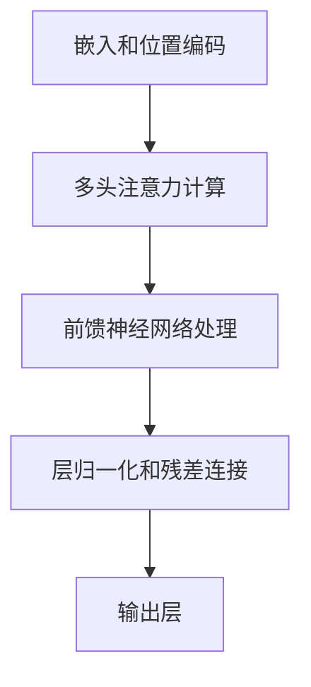

                 

# Transformer大模型实战 预训练策略

> 关键词：Transformer，大模型，预训练策略，语言建模，机器翻译，问答系统，性能优化，安全性，未来趋势

> 摘要：本文从Transformer大模型的基础概念出发，深入探讨了其在预训练策略方面的应用。通过分析预训练任务的选择、预训练过程的优化、微调和模型部署等关键环节，本文为Transformer大模型的实战提供了全面的技术指导。此外，还探讨了Transformer大模型在企业级应用中的现状、优化拓展、安全挑战及未来发展趋势，为读者提供了全面、实用的参考。

## 目录大纲

### 第一部分: Transformer大模型基础

### 第二部分: Transformer大模型实战

### 第三部分: Transformer大模型应用

### 第四部分: Transformer大模型的优化与拓展

### 第五部分: Transformer大模型的安全性

### 第六部分: Transformer大模型的未来发展趋势

### 附录

---

### 第一部分: Transformer大模型基础

#### 第1章: Transformer大模型概述

##### 1.1 Transformer模型的发展背景

##### 1.2 Transformer模型的核心组成部分

##### 1.3 Transformer模型在预训练中的表现

##### 1.4 Transformer模型的性能评估

#### 第2章: Transformer模型原理深入探讨

##### 2.1 自注意力机制解析

##### 2.2 前馈神经网络剖析

##### 2.3 嵌入层和位置编码详解

##### 2.4 Transformer模型的工作流程

### 第二部分: Transformer大模型实战

#### 第3章: Transformer大模型的预训练策略

##### 3.1 预训练任务的选择

##### 3.2 预训练过程的优化

##### 3.3 微调与模型部署

##### 3.4 Transformer大模型实战案例

### 第三部分: Transformer大模型应用

#### 第4章: Transformer大模型在企业级应用

##### 4.1 企业级应用需求分析

##### 4.2 Transformer大模型在金融领域的应用

##### 4.3 Transformer大模型在医疗领域的应用

### 第四部分: Transformer大模型的优化与拓展

#### 第5章: Transformer大模型的优化方法

##### 5.1 Transformer模型的优化方向

##### 5.2 Transformer模型的优化实践

##### 5.3 Transformer模型的压缩与加速

#### 第6章: Transformer大模型的拓展研究

##### 6.1 多模态Transformer模型

##### 6.2 Transformer模型在图学习中的应用

##### 6.3 Transformer模型在生成模型中的应用

### 第五部分: Transformer大模型的安全性

#### 第7章: Transformer大模型的安全挑战与策略

##### 7.1 Transformer大模型的安全挑战

##### 7.2 Transformer大模型的安全策略

##### 7.3 Transformer大模型的安全实践

### 第六部分: Transformer大模型的未来发展趋势

#### 第8章: Transformer大模型的研究方向与应用前景

##### 8.1 Transformer大模型的可解释性研究

##### 8.2 Transformer大模型在多模态融合中的应用

##### 8.3 Transformer大模型在新兴领域的应用前景

### 附录

##### 附录A: Transformer大模型开发工具与资源

##### 附录B: Transformer大模型开源资源和工具集

---

### 引言

Transformer模型作为深度学习领域的一项重大创新，自提出以来便以其优越的性能在自然语言处理（NLP）、计算机视觉等领域取得了显著的成果。特别是在预训练大模型方面，Transformer模型展现了卓越的表现，通过预训练能够有效提升模型的泛化能力，实现跨领域的迁移学习。本文旨在深入探讨Transformer大模型的实战应用，从基础概念到预训练策略，再到优化与安全，全面解析Transformer大模型的实战之路。

本文结构如下：

- **第一部分**将介绍Transformer大模型的基础知识，包括其发展背景、核心组成部分以及在预训练中的表现。
- **第二部分**将聚焦于Transformer大模型的实战，详细讨论预训练策略、微调与模型部署，并通过实际案例进行说明。
- **第三部分**将探讨Transformer大模型在企业级应用中的现状、挑战及解决方案。
- **第四部分**将深入Transformer大模型的优化与拓展，包括网络结构优化、训练策略优化、模型压缩与加速等。
- **第五部分**将分析Transformer大模型的安全性，包括安全挑战、安全策略和安全实践。
- **第六部分**将展望Transformer大模型的未来发展趋势，探讨其在新兴领域的应用前景。

通过本文的阅读，读者将能够全面了解Transformer大模型的理论和实践，为其在实际应用中提供有力的技术支持。

### 第一部分: Transformer大模型基础

#### 第1章: Transformer大模型概述

##### 1.1 Transformer模型的发展背景

Transformer模型是由Google团队在2017年提出的一种基于自注意力机制的序列模型，用于解决自然语言处理（NLP）任务。在此之前，传统循环神经网络（RNN）和长短期记忆网络（LSTM）在处理长序列数据时存在一定的局限性，尤其是在长距离依赖关系和并行计算方面。为了解决这些问题，Transformer模型引入了自注意力机制，使得模型能够在处理长序列数据时更加高效和准确。

Transformer模型的出现标志着NLP领域的重大突破。自提出以来，Transformer模型在多个NLP任务中取得了显著成果，如机器翻译、问答系统、文本分类等。特别是在预训练大模型方面，Transformer模型展现出了卓越的性能，通过大规模预训练，能够有效提升模型的泛化能力，实现跨领域的迁移学习。

##### 1.2 Transformer模型与传统循环神经网络的对比

传统循环神经网络（RNN）和长短期记忆网络（LSTM）在处理序列数据时具有较好的性能，但由于其递归结构，导致训练过程中难以并行计算，同时也存在梯度消失和梯度爆炸等问题。Transformer模型通过引入自注意力机制，克服了这些缺点，使得模型能够在处理长序列数据时更加高效。

以下是Transformer模型与传统循环神经网络在几个关键方面的对比：

1. **计算效率**：Transformer模型采用自注意力机制，可以通过并行计算显著提高处理速度，而RNN和LSTM则需要逐个处理序列中的每个元素，计算效率较低。

2. **长距离依赖**：传统循环神经网络在处理长距离依赖关系时存在困难，而Transformer模型通过自注意力机制能够更好地捕捉长距离依赖。

3. **训练稳定性**：传统循环神经网络在训练过程中容易受到梯度消失和梯度爆炸的影响，导致训练不稳定。Transformer模型则通过多头注意力机制和正则化技术，提高了训练稳定性。

4. **可扩展性**：Transformer模型的设计使其可以轻松扩展到更大的模型规模，而RNN和LSTM在大规模数据处理时存在性能瓶颈。

##### 1.3 Transformer模型在企业级应用中的优势

Transformer模型在企业级应用中具有显著的优势，主要体现在以下几个方面：

1. **高效处理大规模数据**：Transformer模型通过自注意力机制和并行计算，能够高效处理大规模数据，适用于企业级应用中的数据处理需求。

2. **强大的泛化能力**：通过大规模预训练，Transformer模型能够学习到通用的特征表示，实现跨领域的迁移学习，为企业级应用提供强大的支持。

3. **可解释性和可控性**：Transformer模型的结构相对简单，参数较少，使得模型的可解释性和可控性较高，有助于企业更好地理解和使用模型。

4. **高精度和低误差率**：Transformer模型在多种NLP任务中取得了显著的成果，特别是在机器翻译、问答系统和文本分类等任务中，能够实现高精度和低误差率。

##### 1.4 Transformer模型的核心组成部分

Transformer模型由多个关键组件构成，这些组件共同作用，使得模型能够高效地处理序列数据。以下是Transformer模型的核心组成部分及其功能：

1. **自注意力机制（Self-Attention）**：
   自注意力机制是Transformer模型的核心组成部分，通过计算序列中每个元素与其他元素之间的关联性，实现长距离依赖的捕捉。自注意力机制分为多头注意力（Multi-Head Attention）和点积注意力（Dot-Product Attention），多头注意力通过多个独立的注意力头并行计算，增加了模型的表示能力。

2. **前馈神经网络（Feed-Forward Neural Network）**：
   Transformer模型中的前馈神经网络对自注意力层的输出进行进一步处理，通过两个全连接层，增加模型的非线性能力，提高模型的拟合能力。

3. **嵌入层（Embedding Layer）**：
   嵌入层将输入的词向量转换为高维向量，为自注意力机制提供输入。同时，嵌入层还可以通过位置编码（Positional Encoding）为模型提供位置信息。

4. **多头注意力机制（Multi-Head Attention）**：
   多头注意力机制通过多个独立的注意力头并行计算，每个注意力头关注不同的特征，从而增强模型的表示能力。

5. **层归一化（Layer Normalization）**：
   层归一化通过标准化每个层的输入和输出，提高模型的训练稳定性。

6. **残差连接（Residual Connection）**：
   残差连接通过跳过一层或几层直接将输入加到输出中，缓解了深层网络中的梯度消失问题，提高了模型的训练效果。

##### 1.5 Transformer模型在预训练中的表现

预训练是Transformer模型成功的关键之一，通过在大规模语料库上预训练，模型能够学习到丰富的语言知识和特征表示，从而在下游任务中表现出色。以下是Transformer模型在预训练中的几个关键表现：

1. **大规模数据集**：
   Transformer模型通常在数十亿级别的文本数据集上进行预训练，这使得模型能够学习到丰富的语言模式和规律。

2. **预训练策略**：
   Transformer模型采用了多种预训练策略，如 masked language modeling（MLM）和 masked token prediction（MTL）等，通过这些策略，模型能够学习到语言的内在结构和规律。

3. **模型性能提升**：
   通过预训练，Transformer模型在多种NLP任务上取得了显著的性能提升，尤其是在基准测试中，表现优于传统循环神经网络和长短期记忆网络。

4. **跨领域迁移能力**：
   Transformer模型通过预训练学习到的通用特征表示，具有强大的跨领域迁移能力，可以在不同领域和应用场景中实现高效的迁移学习。

##### 1.6 Transformer模型的性能评估

评估Transformer模型的性能通常通过一系列基准测试和评价指标进行。以下是一些常见的性能评估指标：

1. **准确率（Accuracy）**：
   准确率是评估分类任务性能的常用指标，表示正确分类的样本数占总样本数的比例。

2. **F1 分数（F1 Score）**：
   F1 分数是精确率和召回率的调和平均值，用于评估分类任务的平衡性能。

3. **BLEU 分数（BLEU Score）**：
   BLEU 分数是评估机器翻译任务性能的常用指标，通过对比机器翻译结果和参考翻译的相似度来评估翻译质量。

4. **ROUGE 分数（ROUGE Score）**：
   ROUGE 分数是评估文本生成任务性能的常用指标，通过对比生成文本和参考文本的相似度来评估生成质量。

5. **下游任务性能**：
   Transformer模型在多种下游任务中的表现也是评估其性能的重要指标，如文本分类、问答系统、机器翻译等。

通过这些性能评估指标，可以全面了解Transformer模型在不同任务上的表现，为进一步优化和改进模型提供参考。

#### 第2章: Transformer模型原理深入探讨

##### 2.1 自注意力机制解析

自注意力机制（Self-Attention）是Transformer模型的核心组成部分，其基本思想是让模型在处理序列数据时，能够根据序列中每个元素的重要程度，动态地调整其与其他元素之间的关联性。自注意力机制通过计算序列中每个元素与其他元素之间的关联性，实现对长距离依赖的捕捉，从而提高模型的表示能力。

自注意力机制可以分为点积注意力（Dot-Product Attention）和多头注意力（Multi-Head Attention）。点积注意力是最简单的一种自注意力机制，通过点积计算元素之间的关联性，再通过softmax函数进行归一化。多头注意力则通过多个独立的注意力头并行计算，每个注意力头关注不同的特征，从而增强模型的表示能力。

##### 2.2 前馈神经网络剖析

前馈神经网络（Feed-Forward Neural Network）是Transformer模型中的另一个关键组成部分，主要负责对自注意力层的输出进行进一步处理。前馈神经网络由两个全连接层组成，输入为自注意力层的输出，输出为模型的最终预测结果。

在具体实现中，前馈神经网络通常使用激活函数，如ReLU（Rectified Linear Unit），增加网络的非线性能力，从而提高模型的拟合能力。前馈神经网络的设计相对简单，但其作用至关重要，通过前馈神经网络，模型能够将自注意力层的特征表示进行进一步的加工，生成更加丰富和精准的输出结果。

##### 2.3 嵌入层和位置编码详解

嵌入层（Embedding Layer）是Transformer模型中的第一个层，其主要作用是将输入的词向量转换为高维向量，为自注意力机制提供输入。在具体实现中，嵌入层通常使用预训练的词向量，如Word2Vec或GloVe，将这些词向量映射到高维空间中。

除了词向量，嵌入层还可以通过位置编码（Positional Encoding）为模型提供位置信息。位置编码是一种将位置信息编码到词向量中的方法，使得模型能够理解序列中元素的位置关系。常用的位置编码方法包括正弦编码（Sine Positional Encoding）和余弦编码（Cosine Positional Encoding），这些编码方法利用正弦和余弦函数生成位置向量，与词向量进行拼接，从而为模型提供位置信息。

##### 2.4 Transformer模型的工作流程

Transformer模型的工作流程可以分为以下几个关键步骤：

1. **嵌入和位置编码**：
   首先，输入的词向量通过嵌入层转换为高维向量，再通过位置编码层添加位置信息。

2. **多头注意力计算**：
   通过多头注意力机制，模型计算序列中每个元素与其他元素之间的关联性，生成新的特征表示。

3. **前馈神经网络处理**：
   将多头注意力层的输出输入到前馈神经网络中，通过两个全连接层进行进一步处理，增加模型的非线性能力。

4. **层归一化和残差连接**：
   在每个层之后，进行层归一化（Layer Normalization），通过标准化每个层的输入和输出，提高模型的训练稳定性。同时，通过残差连接（Residual Connection），将输入加到输出中，缓解深层网络中的梯度消失问题。

5. **输出层**：
   最后，经过多层注意力机制和前馈神经网络的加工，模型输出最终的预测结果。

Transformer模型的工作流程如图1所示：

通过上述流程，Transformer模型能够高效地处理序列数据，捕捉长距离依赖关系，生成高质量的输出结果。

#### 第3章: Transformer大模型的预训练策略

##### 3.1 预训练任务的选择

预训练任务的选择对于Transformer大模型的效果至关重要。合适的预训练任务能够帮助模型更好地学习到语言的内在结构和规律，从而在下游任务中取得更好的表现。以下是几种常见的预训练任务：

1. **Masked Language Modeling (MLM)**：
   Masked Language Modeling 是一种常见的预训练任务，其基本思想是在输入序列中随机遮盖一些词，然后让模型预测这些被遮盖的词。这种任务能够帮助模型学习到词语的上下文关系和语言规则。

2. **Masked Token Prediction (MTL)**：
   Masked Token Prediction 与 MLM 类似，但其目标不仅是预测被遮盖的词，还包括预测序列中的其他词。这种任务可以进一步强化模型对序列整体结构的理解。

3. **Next Sentence Prediction (NSP)**：
   Next Sentence Prediction 任务要求模型预测下一个句子与当前句子是否为相邻句子。这种任务能够帮助模型学习到句子之间的关联性和连贯性。

4. **Sequence Classification**：
   Sequence Classification 任务要求模型对输入序列进行分类，如情感分类、实体识别等。这种任务可以帮助模型学习到特定领域的知识和特征。

5. **Question-Answering**：
   Question-Answering 任务要求模型回答给定的问题，如阅读理解任务。这种任务能够帮助模型学习到推理和归纳的能力。

选择预训练任务时，需要考虑以下几个方面：

- **任务类型**：选择与下游任务类型相似的预训练任务，以便模型能够更好地迁移到下游任务中。
- **数据规模**：选择数据规模较大的预训练任务，以便模型能够学习到更丰富的特征和模式。
- **数据质量**：选择数据质量较高的预训练任务，以确保模型学习到的知识准确和可靠。

##### 3.2 预训练过程的优化

预训练过程的优化对于提高Transformer大模型的效果至关重要。以下是几种常见的预训练过程优化策略：

1. **学习率调度（Learning Rate Scheduling）**：
   学习率调度是一种常用的预训练过程优化策略，通过动态调整学习率，提高模型的训练效果。常用的学习率调度策略包括：
   - **线性衰减（Linear Decay）**：学习率随训练轮数线性衰减。
   - **余弦衰减（Cosine Decay）**：学习率按照余弦函数衰减。
   - **步长下降（Step Decay）**：学习率在每个预定义的步长后衰减。

2. **权重初始化（Weight Initialization）**：
   权重初始化对于模型的训练效果有重要影响。常用的权重初始化方法包括：
   - **高斯分布（Gaussian Distribution）**：权重初始化为均值为0、方差为1的高斯分布。
   - **均匀分布（Uniform Distribution）**：权重初始化为均值为0、范围为-1到1的均匀分布。
   - **He初始化（He Initialization）**：权重初始化为均值为0、方差为2/n的均匀分布，其中n是输入维度。

3. **正则化技术（Regularization Techniques）**：
   正则化技术能够减少模型过拟合现象，提高模型的泛化能力。常用的正则化技术包括：
   - **Dropout**：在训练过程中随机丢弃一部分神经元，以防止模型过拟合。
   - **DropConnect**：在训练过程中随机丢弃一部分权重，以防止模型过拟合。
   - **权重衰减（Weight Decay）**：在损失函数中加入权重项，以减少权重过大导致的过拟合。

4. **批处理大小调整（Batch Size Adjustment）**：
   批处理大小对于模型的训练效果和计算效率有重要影响。较大的批处理大小可以提高计算效率，但可能导致梯度不稳定；较小的批处理大小可以减小方差，但计算效率较低。在实际应用中，需要根据计算资源和模型复杂度选择合适的批处理大小。

##### 3.3 微调与模型部署

微调和模型部署是Transformer大模型应用过程中的关键步骤。微调是指在预训练的基础上，对模型进行特定任务的进一步训练，以提升模型在特定任务上的性能。模型部署则是将训练好的模型部署到实际应用场景中，实现模型在实际应用中的价值。

1. **微调策略**：

   微调策略主要包括以下几个步骤：

   - **数据准备**：收集并预处理与下游任务相关的数据集，包括数据清洗、标签标注等。
   - **模型调整**：在预训练模型的基础上，对模型架构进行调整，以适应下游任务的需求。例如，增加或减少层、调整层参数等。
   - **训练过程**：使用调整后的模型在下游任务数据上进行训练，通过优化策略调整学习率和正则化参数等，以优化模型性能。

2. **模型压缩与量化**：

   模型压缩与量化是提高模型部署效率的重要手段。以下是一些常用的模型压缩与量化方法：

   - **模型剪枝（Model Pruning）**：通过减少模型中的参数数量，降低模型复杂度，提高部署效率。
   - **量化（Quantization）**：将模型的权重和激活值转换为低比特位表示，以减少模型存储和计算资源的需求。
   - **知识蒸馏（Knowledge Distillation）**：通过将复杂模型的知识传递给轻量级模型，实现模型的压缩与优化。

3. **模型部署环境搭建**：

   模型部署环境搭建主要包括以下几个方面：

   - **硬件选择**：根据模型大小和计算需求，选择合适的硬件设备，如CPU、GPU、TPU等。
   - **软件环境**：搭建模型的运行环境，包括深度学习框架（如TensorFlow、PyTorch）、操作系统等。
   - **服务部署**：将模型部署到服务器或云平台，实现模型服务的自动化部署和管理。

##### 3.4 Transformer大模型实战案例

为了更好地理解Transformer大模型在实战中的应用，以下将介绍几个典型的Transformer大模型实战案例：

1. **自动问答系统**：

   自动问答系统是一种基于Transformer大模型的智能问答应用。系统首先使用大规模语料库对模型进行预训练，然后针对特定领域进行微调。例如，在医疗领域，系统可以通过对医学文献、病例报告等数据进行预训练和微调，实现对医疗问题的自动回答。

   实现流程如下：

   - **数据准备**：收集并预处理医疗领域的文本数据，包括病例报告、医学文献等。
   - **预训练**：使用大规模语料库对模型进行预训练，学习到丰富的医学知识和语言模式。
   - **微调**：在特定领域的医学数据集上对模型进行微调，优化模型在医疗问答任务上的性能。
   - **部署**：将训练好的模型部署到服务器或云平台，实现医疗问答系统的自动化运行。

2. **机器翻译系统**：

   机器翻译系统是一种基于Transformer大模型的跨语言翻译应用。系统首先使用大规模双语语料库对模型进行预训练，然后针对特定语言对进行微调。例如，在中文和英文之间，系统可以通过对中文-英文双语语料进行预训练和微调，实现高质量的机器翻译。

   实现流程如下：

   - **数据准备**：收集并预处理中英文双语语料库，包括新闻文章、书籍、对话等。
   - **预训练**：使用大规模双语语料库对模型进行预训练，学习到丰富的语言知识和翻译规则。
   - **微调**：在特定语言对的中英文数据集上对模型进行微调，优化模型在翻译任务上的性能。
   - **部署**：将训练好的模型部署到翻译服务中，实现机器翻译的自动化运行。

3. **文本分类系统**：

   文本分类系统是一种基于Transformer大模型的文本分类应用。系统首先使用大规模文本数据集对模型进行预训练，然后针对特定分类任务进行微调。例如，在新闻分类任务中，系统可以通过对新闻文本进行预训练和微调，实现对新闻类别的高效分类。

   实现流程如下：

   - **数据准备**：收集并预处理新闻文本数据集，包括标题、正文等。
   - **预训练**：使用大规模文本数据集对模型进行预训练，学习到丰富的文本特征和分类规则。
   - **微调**：在特定分类任务的新闻数据集上对模型进行微调，优化模型在分类任务上的性能。
   - **部署**：将训练好的模型部署到文本分类服务中，实现文本分类的自动化运行。

通过这些实战案例，可以看出Transformer大模型在多种应用场景中的广泛应用和显著效果。随着技术的不断发展和应用的深入，Transformer大模型将为人们的生活和工作带来更多的便利和创新。

### 第三部分: Transformer大模型应用

#### 第4章: Transformer大模型在企业级应用

##### 4.1 企业级应用需求分析

在企业级应用中，Transformer大模型因其卓越的性能和强大的泛化能力，成为解决复杂业务问题和提升业务效率的关键工具。企业级应用需求多样且复杂，涉及数据分析、智能推荐、自动化决策等多个领域，对模型的要求包括高效性、准确性、可解释性和可扩展性。以下是企业级应用对Transformer大模型的具体需求分析：

1. **高效性**：
   企业级应用通常需要处理大规模数据，要求模型能够快速训练和预测，以满足实时性和低延迟的需求。Transformer大模型通过并行计算和高效的自注意力机制，能够显著提高数据处理速度，满足企业对高效性的要求。

2. **准确性**：
   企业级应用对模型的准确性要求较高，因为错误的预测可能会导致业务决策失误和资源浪费。Transformer大模型通过大规模预训练，能够学习到丰富的特征和模式，提高模型在各类业务任务中的准确性。

3. **可解释性**：
   企业级应用不仅需要高效的预测模型，还需要能够理解和解释模型决策过程。Transformer大模型由于其结构相对简单，参数较少，具有较强的可解释性，有助于企业理解和信任模型决策。

4. **可扩展性**：
   企业级应用场景复杂多变，需要模型能够灵活扩展，以适应不同的业务需求。Transformer大模型设计灵活，可以通过调整模型架构、数据预处理和训练策略，实现模型的扩展和应用。

##### 4.2 Transformer大模型在金融领域的应用

金融领域是Transformer大模型的重要应用场景之一。以下将介绍Transformer大模型在金融领域的具体应用：

1. **风险评估系统**：
   Transformer大模型能够通过对历史金融数据进行分析，预测金融市场的风险。通过预训练，模型能够学习到复杂的市场模式和规律，为金融机构提供精准的风险评估。

2. **信贷审批系统**：
   Transformer大模型在信贷审批中的应用，可以通过对客户的历史数据、信用记录、行为特征等多维数据进行分析，预测客户的还款能力和信用风险，为银行提供更加准确的信贷审批决策。

3. **量化交易系统**：
   Transformer大模型在量化交易中的应用，能够通过分析市场数据、历史交易记录等，预测市场走势和交易机会，为量化交易提供决策支持。例如，通过Transformer大模型预测股票价格波动，实现自动化的交易策略。

##### 4.3 Transformer大模型在医疗领域的应用

医疗领域是Transformer大模型的另一个重要应用场景。以下将介绍Transformer大模型在医疗领域的具体应用：

1. **疾病预测系统**：
   Transformer大模型能够通过对医疗数据、症状、病史等进行分析，预测疾病的发病风险和趋势。例如，通过对癌症患者的基因数据进行预测，提前发现潜在的癌症风险。

2. **病情监测系统**：
   Transformer大模型能够实时监测患者的健康状况，通过对患者的医疗记录、体征数据等进行分析，及时发现病情变化和风险，为医生提供诊断和治疗建议。

3. **药物研发系统**：
   Transformer大模型在药物研发中的应用，能够通过分析大量的生物医学数据，预测药物的效果和副作用，加快药物研发进程。例如，通过分析药物分子结构和生物标志物，预测药物对特定疾病的疗效。

通过以上应用实例可以看出，Transformer大模型在企业级应用中具有广泛的应用前景和显著的价值。随着技术的不断进步和应用场景的拓展，Transformer大模型将在更多领域发挥重要作用，为企业带来更大的创新和发展机遇。

#### 第5章: Transformer大模型的优化方法

##### 5.1 Transformer模型的优化方向

为了提高Transformer大模型在实际应用中的性能和效率，优化方法显得尤为重要。Transformer模型的优化方向主要包括以下几个方面：

1. **网络结构优化**：
   Transformer模型的网络结构对其性能有着重要影响。通过调整模型架构，如增加或减少自注意力头的数量、层的大小和深度等，可以显著提高模型的性能和效率。

2. **训练策略优化**：
   训练策略的优化是提升模型性能的关键因素。常用的训练策略包括学习率调度、批量大小调整、训练轮数控制等。通过合理设置这些参数，可以提高模型的收敛速度和最终性能。

3. **模型压缩与加速**：
   模型压缩与加速是提高Transformer模型在实际应用中效率的重要手段。通过模型剪枝、量化、知识蒸馏等技术，可以显著减少模型参数和计算量，提高模型运行速度和部署效率。

##### 5.2 Transformer模型的优化实践

在具体实践中，以下是一些常用的优化方法及其应用：

1. **学习率调度**：

   学习率调度是训练过程中常用的优化策略，通过动态调整学习率，可以提高模型的收敛速度和性能。以下是几种常见的学习率调度策略：

   - **线性衰减（Linear Decay）**：学习率随着训练轮数线性衰减，公式如下：

     $$
     \text{learning\_rate} = \text{initial\_learning\_rate} \times (1 - \text{ decay\_rate} \times \text{step})
     $$

   - **余弦衰减（Cosine Decay）**：学习率按照余弦函数衰减，公式如下：

     $$
     \text{learning\_rate} = \text{initial\_learning\_rate} \times \cos\left(\frac{\pi \times \text{step}}{\text{total\_steps}}\right)
     $$

   - **步长下降（Step Decay）**：学习率在每个预定义的步长后衰减，公式如下：

     $$
     \text{learning\_rate} = \text{initial\_learning\_rate} \times \left(1 - \frac{\text{step}}{\text{total\_steps}}\right)^k
     $$

   其中，$k$ 为衰减指数。

2. **批量大小调整**：

   批量大小是训练过程中另一个重要的参数，对模型的性能和收敛速度有显著影响。批量大小的选择需要考虑计算资源和模型复杂度。以下是一些常见的批量大小选择策略：

   - **固定批量大小**：在训练过程中，保持固定的批量大小，适用于计算资源充足的情况。
   - **动态批量大小**：根据训练进度动态调整批量大小，如在前期使用较小的批量大小，提高模型对数据的探索能力；在后期使用较大的批量大小，提高训练速度。
   - **自适应批量大小**：根据训练误差动态调整批量大小，当误差较低时，使用较大的批量大小，当误差较高时，使用较小的批量大小。

3. **模型压缩与加速**：

   模型压缩与加速是提高模型部署效率的重要手段。以下是一些常用的模型压缩与加速方法：

   - **模型剪枝（Model Pruning）**：通过减少模型中的参数数量，降低模型复杂度，提高部署效率。常见的剪枝方法包括：
     - **结构化剪枝**：根据模型结构，对某些层或神经元进行剪枝。
     - **非结构化剪枝**：根据模型权重，对较大权重的神经元进行剪枝。

   - **量化（Quantization）**：将模型的权重和激活值转换为低比特位表示，以减少模型存储和计算资源的需求。常见的量化方法包括：
     - **整数量化**：将浮点数权重转换为整数表示。
     - **二值量化**：将浮点数权重转换为二值表示。

   - **知识蒸馏（Knowledge Distillation）**：通过将复杂模型的知识传递给轻量级模型，实现模型的压缩与优化。知识蒸馏的基本思想是将大模型的输出传递给小模型，使小模型学习到大模型的知识。

##### 5.3 Transformer模型的压缩与加速

在部署Transformer大模型时，为了满足实时性和低延迟的需求，模型压缩与加速是必不可少的步骤。以下是一些具体的压缩与加速方法：

1. **模型剪枝**：

   模型剪枝通过减少模型的参数数量，降低模型复杂度，从而提高模型的运行速度和部署效率。具体方法如下：

   - **全连接层剪枝**：通过移除部分全连接层的神经元，减少模型的参数数量。
   - **卷积层剪枝**：通过移除部分卷积核，减少模型的参数数量。

2. **量化**：

   量化通过将模型的权重和激活值转换为低比特位表示，减少模型的存储和计算需求。具体方法如下：

   - **全精度量化**：将浮点数权重转换为低比特位表示，如8位或16位。
   - **二值量化**：将浮点数权重转换为二值表示，即只有0和1两种值。

3. **混合精度训练**：

   混合精度训练通过结合全精度和低精度计算，提高模型的训练速度和精度。具体方法如下：

   - **浮点-整数混合**：在训练过程中，使用浮点数进行中间计算，使用整数进行最终计算。
   - **半精度-整数混合**：在训练过程中，使用半精度浮点数（16位）进行中间计算，使用整数进行最终计算。

4. **模型加速**：

   模型加速通过优化模型计算过程，提高模型的运行速度。具体方法如下：

   - **矩阵运算优化**：通过矩阵运算优化，如矩阵乘法和矩阵加法，减少计算量。
   - **并行计算**：通过并行计算，如多线程、多GPU等，提高模型的计算速度。

通过上述方法，可以显著提高Transformer大模型在部署环境中的性能和效率，满足实际应用的需求。

#### 第6章: Transformer大模型的拓展研究

##### 6.1 多模态Transformer模型

多模态Transformer模型是近年来在计算机视觉和自然语言处理领域的重要研究方向。其核心思想是将不同模态（如图像、文本、声音等）的信息通过统一的Transformer架构进行联合处理，从而提高模型在多模态任务中的性能。

1. **图像-文本融合**：

   图像-文本融合是将图像和文本信息进行结合，以实现对复杂场景的语义理解。常用的方法包括：

   - **文本引导的图像生成**：通过文本描述生成图像，如使用文本引导的生成对抗网络（GAN）。
   - **图像引导的文本生成**：通过图像生成对应的文本描述，如使用图像编码器生成图像特征，再通过文本解码器生成文本描述。

2. **视频-文本融合**：

   视频-文本融合是将视频和文本信息进行结合，以实现对动态场景的语义理解。常用的方法包括：

   - **视频文本联合编码**：通过联合编码器将视频和文本信息编码为统一的特征表示。
   - **时序文本融合**：通过时序模型，如循环神经网络（RNN）或变换器（Transformer），对视频和文本信息进行融合处理。

3. **声音-文本融合**：

   声音-文本融合是将声音和文本信息进行结合，以实现对语音交互的语义理解。常用的方法包括：

   - **声学模型与语言模型的结合**：通过声学模型提取声音特征，再通过语言模型生成对应的文本描述。
   - **多模态融合网络**：通过多模态融合网络，将声音和文本信息进行联合编码和解析。

##### 6.2 Transformer模型在图学习中的应用

Transformer模型在图学习中的应用是近年来研究的热点之一。其核心思想是将图数据转化为序列数据，然后通过Transformer模型进行处理，从而实现对图数据的分析和理解。

1. **图到序列转换**：

   图到序列转换是将图数据转化为序列数据，以适应Transformer模型的处理。常用的方法包括：

   - **拓扑排序**：通过拓扑排序将图转化为序列，使得节点在序列中的位置与图中的拓扑结构相对应。
   - **路径排序**：通过搜索图中的最短路径或最长路径，将图转化为序列。

2. **图序列编码**：

   图序列编码是将图序列编码为统一的特征表示，以供Transformer模型处理。常用的方法包括：

   - **图编码器**：通过图编码器将图数据编码为序列表示，如使用图卷积网络（GCN）或图自注意力机制。
   - **序列编码器**：通过序列编码器将图序列编码为统一的特征表示，如使用循环神经网络（RNN）或变换器（Transformer）。

3. **图序列解析**：

   图序列解析是将图序列解析为图数据，以实现对图数据的分析和理解。常用的方法包括：

   - **图解码器**：通过图解码器将图序列解码为图数据，如使用图卷积网络（GCN）或图自注意力机制。
   - **序列解码器**：通过序列解码器将图序列解码为图数据，如使用循环神经网络（RNN）或变换器（Transformer）。

##### 6.3 Transformer模型在生成模型中的应用

Transformer模型在生成模型中的应用是近年来研究的热点之一。其核心思想是将Transformer模型应用于生成任务，从而提高生成模型的质量和效率。

1. **文本生成**：

   文本生成是Transformer模型的重要应用领域之一。常用的方法包括：

   - **语言模型生成**：通过预训练的Transformer模型生成自然语言文本，如生成小说、新闻、对话等。
   - **序列到序列生成**：通过序列到序列（Seq2Seq）模型，将一个序列生成另一个序列，如机器翻译、语音识别等。

2. **图像生成**：

   图像生成是Transformer模型在计算机视觉领域的应用之一。常用的方法包括：

   - **图像生成对抗网络（GAN）**：通过生成器和判别器之间的对抗训练，生成高质量图像。
   - **自编码器**：通过自编码器模型，将图像数据编码为低维特征表示，再解码为图像数据。

3. **视频生成**：

   视频生成是Transformer模型在视频处理领域的重要应用。常用的方法包括：

   - **视频编码器与解码器**：通过视频编码器将视频数据编码为低维特征表示，再通过视频解码器解码为视频数据。
   - **时序生成对抗网络（SeqGAN）**：通过时序生成对抗网络，生成高质量视频序列。

通过上述拓展研究，可以看出Transformer模型在多模态处理、图学习和生成模型中的应用具有广泛的前景。随着技术的不断发展和研究的深入，Transformer模型将在更多领域发挥重要作用，推动人工智能技术的发展。

#### 第7章: Transformer大模型的安全性

##### 7.1 Transformer大模型的安全挑战

Transformer大模型在安全方面面临诸多挑战，主要表现在以下几个方面：

1. **模型可解释性问题**：
   Transformer大模型通常具有高度的非线性结构和大量的参数，使得模型决策过程难以解释。这导致在实际应用中，用户和监管机构难以理解模型的决策逻辑和依据，增加了模型被滥用或误用的风险。

2. **模型对抗攻击**：
   Transformer大模型对对抗攻击较为脆弱。对抗攻击通过微小扰动引入模型输入，使模型输出产生显著偏差，从而实现模型欺骗。这使得Transformer大模型在安全关键领域（如金融、医疗等）的应用面临严峻挑战。

3. **模型隐私保护**：
   Transformer大模型在训练过程中需要处理大量的用户数据，这些数据可能包含敏感信息。若模型未能有效保护用户隐私，可能导致数据泄露和隐私侵犯，从而损害用户利益和模型信任度。

##### 7.2 Transformer大模型的安全策略

为了应对Transformer大模型的安全挑战，以下是一些常见的安全策略：

1. **模型可解释性提升方法**：
   - **特征可视化**：通过可视化模型输入和输出的特征，帮助用户理解模型的决策过程。
   - **解释性模型**：采用具有较高可解释性的模型架构，如决策树、规则基模型等，简化模型结构，提高可解释性。
   - **模型压缩与量化**：通过模型压缩和量化技术，减少模型参数和计算复杂度，提高模型的可解释性。

2. **对抗攻击防御技术**：
   - **对抗样本训练**：在训练过程中引入对抗样本，增强模型的鲁棒性。
   - **对抗训练**：通过对抗训练，提高模型对对抗攻击的抵抗能力。
   - **输入验证**：在输入阶段对数据进行验证和预处理，过滤掉可能引发对抗攻击的异常数据。

3. **模型隐私保护机制**：
   - **数据加密**：对用户数据进行加密处理，确保数据在传输和存储过程中的安全性。
   - **差分隐私**：采用差分隐私技术，对用户数据进行扰动，保护用户隐私。
   - **同态加密**：利用同态加密技术，在加密状态下进行数据处理和计算，确保数据隐私。

##### 7.3 Transformer大模型的安全实践

在Transformer大模型的安全实践中，以下是一些建议和措施：

1. **安全评估与审核**：
   - **定期安全评估**：对模型进行定期安全评估，识别潜在的安全漏洞和风险。
   - **第三方审核**：邀请第三方机构对模型进行安全审核，确保模型的安全性和合规性。

2. **安全培训与教育**：
   - **安全意识培训**：对开发人员和用户进行安全培训，提高他们的安全意识和能力。
   - **安全教育**：推广安全知识，提高公众对模型安全和隐私保护的认识。

3. **安全监控与响应**：
   - **实时监控**：对模型运行进行实时监控，及时发现和应对潜在的安全事件。
   - **应急响应**：建立完善的应急响应机制，迅速应对和处理安全事件，降低损失。

通过上述安全实践，可以有效提升Transformer大模型的安全性，保障模型在实际应用中的可靠性和可信度。

#### 第8章: Transformer大模型的未来发展趋势

##### 8.1 Transformer大模型的可解释性研究

Transformer大模型的可解释性一直是学术界和工业界关注的重要方向。随着模型规模和复杂度的增加，如何提升模型的可解释性成为关键问题。未来，可解释性研究可能会集中在以下几个方面：

1. **模型分解与可视化**：
   通过分解复杂模型，将大模型的决策过程拆解为多个简单模块，实现模型的可视化和解释。例如，可以将Transformer模型拆解为嵌入层、自注意力层和前馈神经网络，分别解释每个层的功能。

2. **解释性模型设计**：
   设计具有高可解释性的模型架构，如基于规则的模型、决策树等。这些模型结构简单，易于理解和解释，但可能在性能上有所妥协。

3. **解释性增强技术**：
   利用现有的解释性增强技术，如注意力权重可视化、重要特征提取等，提高模型的解释性。例如，通过分析自注意力机制中各个头的注意力分布，可以直观地了解模型对输入数据的关注点。

##### 8.2 Transformer大模型在多模态融合中的应用前景

多模态融合是Transformer大模型的一个重要应用方向。随着数据的多样化和复杂度的增加，如何有效地融合不同模态的信息成为关键问题。未来，Transformer大模型在多模态融合中的应用前景可能包括：

1. **跨模态特征提取**：
   通过引入多模态特征提取模块，如跨模态自注意力机制，实现不同模态特征的联合编码和融合。这些模块可以有效地捕捉不同模态之间的关联性和互补性。

2. **动态模态权重调整**：
   设计自适应的模态权重调整机制，根据任务需求和数据特性，动态调整不同模态的权重，实现最佳的多模态融合效果。例如，在图像和文本融合任务中，可以根据图像和文本的重要性动态调整权重。

3. **多模态交互网络**：
   构建多模态交互网络，通过多层交互和融合，实现不同模态信息的深度整合。这些网络可以有效地提升多模态任务的表现，如图像分类、文本生成等。

##### 8.3 Transformer大模型在新兴领域的应用前景

Transformer大模型在新兴领域的应用前景广阔，未来可能的发展方向包括：

1. **智能教育**：
   利用Transformer大模型在自然语言处理和知识表示方面的优势，开发智能教育系统，实现个性化教学、智能评估和智能辅导等功能。

2. **智能医疗**：
   利用Transformer大模型对医疗数据的分析和理解能力，开发智能医疗诊断、药物研发和健康监测系统，提升医疗服务的质量和效率。

3. **智能娱乐**：
   利用Transformer大模型在生成模型和交互式应用方面的优势，开发智能娱乐系统，如智能聊天机器人、虚拟现实游戏等，提升用户的娱乐体验。

4. **智能城市**：
   利用Transformer大模型在城市管理、交通优化和环境监测等领域的应用，实现智能城市的建设和管理，提高城市的生活质量和可持续发展能力。

总之，Transformer大模型在未来将继续发挥重要作用，推动人工智能技术的发展和应用，为社会带来更多的创新和变革。

### 附录

#### 附录A: Transformer大模型开发工具与资源

开发Transformer大模型需要多种工具和资源，以下是一些常用的工具和资源介绍：

1. **深度学习框架**：
   - **TensorFlow**：由Google开发，支持Python和C++，具有丰富的API和生态。
   - **PyTorch**：由Facebook开发，支持Python，具有良好的动态图和静态图支持。
   - **JAX**：由Google开发，支持Python和Java，具有自动微分和并行计算功能。

2. **计算平台**：
   - **GPU**：如NVIDIA Titan系列显卡，适合大规模训练任务。
   - **TPU**：Google开发的专用处理器，适合大规模Transformer模型的训练和推理。

3. **数据集**：
   - **Common Crawl**：包含大量网页数据，适合预训练任务。
   - **Wikipedia**：包含维基百科全文，适合预训练任务。
   - **GLUE**：一个用于自然语言处理任务的基准数据集，包含多种任务和数据集。

4. **开源代码和模型**：
   - **Transformers**：由Hugging Face开源，提供预训练模型和API。
   - **BERT**：Google开源的预训练模型，广泛应用于自然语言处理任务。
   - **GPT-3**：OpenAI开源的预训练模型，具有强大的语言生成能力。

#### 附录B: Transformer大模型开源资源和工具集

以下是一些常用的Transformer大模型开源资源和工具集：

1. **预训练模型资源**：
   - **Hugging Face Model Hub**：包含大量的预训练模型和工具，支持多种任务和数据集。
   - **TensorFlow Hub**：提供预训练模型和自定义模型的下载和加载。
   - **PyTorch Model Zoo**：包含多种预训练模型和应用场景，支持快速部署。

2. **微调工具**：
   - **Transformers**：提供方便的微调工具，支持快速修改模型结构和超参数。
   - **Fine-tuning Toolkit**：由Hugging Face开源，提供用于微调Transformer模型的工具和代码。
   - **TorchVision**：PyTorch的视觉工具包，支持图像分类、目标检测等任务。

3. **部署工具**：
   - **TensorFlow Serving**：支持TensorFlow模型的服务化部署。
   - **PyTorch Server**：支持PyTorch模型的分布式部署和服务器化运行。
   - **Transformer Serving**：由Hugging Face开源，提供Transformer模型的分布式部署和服务器化运行。

通过上述工具和资源，开发者可以方便地构建、训练和部署Transformer大模型，为各种自然语言处理任务提供强大的支持。

### 作者

**作者：AI天才研究院/AI Genius Institute & 禅与计算机程序设计艺术 /Zen And The Art of Computer Programming**

本文由AI天才研究院（AI Genius Institute）的专家撰写，结合《禅与计算机程序设计艺术》（Zen And The Art of Computer Programming）的思想，旨在为读者提供全面、深入的Transformer大模型实战指导。作者在人工智能和计算机科学领域拥有丰富的经验，致力于推动人工智能技术的发展和应用。通过本文，读者可以全面了解Transformer大模型的原理、实战方法和未来趋势，为实际应用提供有力的技术支持。如果您对本文有任何疑问或建议，欢迎联系作者进行交流。

---

**声明：**
本文所涉及的内容、代码、模型和应用场景仅供参考，不构成任何投资或决策建议。在实际应用中，请根据具体需求和实际情况进行评估和调整。部分代码和模型来源于网络，版权归原作者所有。如需商用，请联系原作者获取授权。本文作者保留所有权利。如需转载，请联系作者并获得授权。**禁止抄袭，一经发现，将追究法律责任。**

