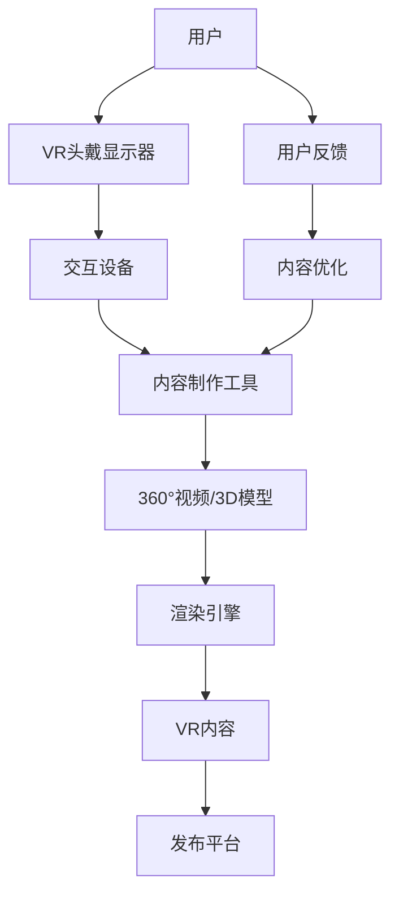

                 

### 虚拟现实技术概述

虚拟现实（Virtual Reality，简称VR）是一种通过计算机技术创造的模拟环境，用户通过特定的设备如VR头戴显示器和交互设备，能够沉浸在这个模拟环境中，感知并与之进行互动。VR技术不仅带来了全新的交互体验，还在多个领域展现了其广泛的应用潜力。

**1.1 VR技术的定义与发展**

虚拟现实技术的基本概念可以追溯到20世纪60年代。当时，科学家们开始探索如何通过计算机模拟现实世界的视觉和听觉体验。早期的VR设备包括简单的头戴显示器和跟踪设备，但受限于计算能力和显示技术，这些设备的性能非常有限。随着计算机技术、显示技术和传感技术的发展，VR技术逐渐成熟，并开始进入大众视野。

VR技术的发展可以分为几个阶段：

- **第一阶段（1960s-1980s）**：VR技术的概念被提出，并开始有一些初步的研究和实践。VR头戴显示器、跟踪设备和虚拟环境开始出现，但受限于硬件和技术，应用范围非常有限。

- **第二阶段（1990s）**：VR技术逐渐成熟，开始在一些专业领域得到应用，如军事训练、医疗模拟等。然而，由于高昂的成本和复杂的操作，VR技术仍未能在大众市场普及。

- **第三阶段（2000s至今）**：随着计算机性能的飞速提升和显示技术的进步，VR设备开始变得更加普及和易用。Oculus Rift、HTC Vive等高性能VR头戴显示器的推出，使得VR体验更加真实和沉浸。同时，VR技术也在娱乐、教育、房地产等领域得到了广泛应用。

**1.2 VR硬件介绍**

VR硬件设备是VR技术实现的关键，主要包括VR头戴显示器、VR交互设备和VR内容创作设备。

- **VR头戴显示器**：VR头戴显示器是用户感知虚拟环境的主要设备，它通常包含一个高分辨率的屏幕，用于模拟三维视觉效果，并配有内置或外接的传感器，用于跟踪用户的头部和手部运动。常见的VR头戴显示器有Oculus Rift、HTC Vive、PlayStation VR等。

- **VR交互设备**：VR交互设备用于用户在虚拟环境中进行互动，如VR手套、手持控制器、动作捕捉服等。这些设备可以捕捉用户的动作和手势，并将这些动作转换为虚拟环境中的交互行为。

- **VR内容创作设备**：VR内容创作设备用于生成和编辑VR内容，如360°摄像机、3D扫描仪、专业级VR拍摄设备等。这些设备可以捕捉现实世界的场景，并将其转换为虚拟环境中的内容。

**1.3 VR内容制作的基本流程**

VR内容制作是一个复杂的过程，通常包括以下几个主要步骤：

- **内容策划与设计**：确定VR内容的目标受众、主题和风格，进行故事情节、角色设定和场景布局的设计。

- **视频拍摄与编辑**：对于360°视频内容，使用360°摄像机进行现场拍摄，然后使用视频编辑软件进行剪辑、拼接和特效添加。

- **3D建模与渲染**：使用3D建模软件创建虚拟场景、角色和物体，并进行材质、光照和动画的制作，最终通过渲染生成高质量的VR内容。

- **交互设计与实现**：设计并实现用户与虚拟环境之间的交互逻辑，如手势识别、语音交互等。

- **测试与优化**：对VR内容进行测试，确保其运行稳定、效果逼真，并根据用户反馈进行优化。

**总结**：虚拟现实技术通过计算机模拟创造出一种沉浸式的环境，用户可以通过特定的设备与这个环境进行互动。VR技术的发展历程、硬件设备以及内容制作流程都为其广泛应用奠定了基础。在接下来的章节中，我们将进一步探讨360°视频制作和3D建模与渲染技术，以帮助读者更深入地了解VR内容制作的奥秘。

### 360°视频制作原理

360°视频是一种全景视频技术，它通过多个摄像机或特殊的拍摄设备捕捉360度范围内的画面，用户可以通过VR头戴显示器或手机等设备观看并自由旋转视角，获得身临其境的观看体验。360°视频制作需要经过多个步骤，包括拍摄、编辑和处理，每个步骤都有其独特的技术和方法。

**2.1 360°视频概述**

360°视频的定义与特点：

- **定义**：360°视频是一种全景视频格式，它通过多个摄像机或全景镜头同时捕捉一个场景，然后将这些视频片段无缝拼接成一个完整的全景视频。用户可以通过头戴显示器或手机上的专用应用程序，自由旋转视角，观看360度范围内的画面。

- **特点**：
  - **全景视角**：360°视频提供全方位的视角，用户可以在观看时自由旋转头部，观看不同方向的内容。
  - **沉浸式体验**：通过360°视频，用户可以感受到与实际场景相似的视觉冲击，获得更加真实的沉浸式体验。
  - **互动性**：用户不仅可以观看视频，还可以通过旋转视角、点击屏幕等方式与视频内容进行互动。

360°视频的拍摄设备与拍摄技巧：

- **拍摄设备**：常用的360°视频拍摄设备包括单目或双目的全景相机，如GoPro Omni、Panasonic HDC-TM700等，这些设备通常配有多个相机模块，能够同时捕捉多个视角的视频。

- **拍摄技巧**：
  - **场景布局**：在拍摄前，要规划好场景布局，确保拍摄范围覆盖所需的内容，避免出现拍摄盲区。
  - **摄像机稳定性**：摄像机在拍摄过程中要保持稳定，避免抖动和晃动影响观看体验。可以使用三脚架、稳定器等设备确保摄像机的稳定性。
  - **光照均匀**：拍摄场景的光照要均匀，避免出现过度曝光或过暗的情况。可以使用反光板、补光灯等设备调整光照。

**2.2 360°视频编辑与处理**

360°视频编辑与处理是制作高质量360°视频的关键步骤，主要包括视频剪辑、拼接和特效添加等。

- **360°视频编辑软件**：常用的360°视频编辑软件包括Adobe Premiere Pro、DaVinci Resolve、Vigo Studio等。这些软件提供了专门的全景视频编辑功能，如全景视频剪辑、视频缝合、特效添加等。

- **视频剪辑**：在编辑过程中，首先需要对拍摄的素材进行剪辑，去除不必要的画面和错误，保证视频流畅和连贯。对于360°视频，剪辑时要注意保持画面的水平与垂直方向上的完整性，避免出现扭曲或失真。

- **视频拼接**：拼接是360°视频制作的重要步骤，它将多个拍摄视角的视频无缝拼接成一个完整的全景视频。拼接过程中要注意摄像机的相对位置和拍摄角度，确保拼接后的视频过渡自然，无明显接缝。

- **特效添加**：为了提升视频的视觉效果，可以添加各种特效，如动态效果、动态地图、粒子效果等。这些特效可以增强视频的沉浸感和互动性，使观众获得更加丰富的观看体验。

**2.3 360°视频观看体验优化**

观看体验是360°视频成功的关键因素，优化观看体验需要从视频解码与渲染技术、视频优化策略等多个方面进行考虑。

- **视频解码与渲染技术**：视频解码技术决定了视频播放的流畅性和画面质量。高性能的解码器可以更快地解码视频数据，提供更加流畅的播放体验。渲染技术则决定了视频画面的显示效果，优化的渲染技术可以提供更高的画面质量和更低的延迟。

- **视频优化策略**：
  - **分辨率调整**：根据目标设备的性能和分辨率，调整视频的分辨率。对于高分辨率的设备，可以提供更高画质的全景视频，而对于低分辨率的设备，可以提供压缩后的视频，以保证播放流畅。
  - **帧率优化**：优化视频的帧率，确保视频播放的稳定性。对于运动较多的场景，可以适当提高帧率，以减少拖影和卡顿现象。
  - **压缩算法**：使用高效的视频压缩算法，减少视频文件的体积，提高传输效率。常见的压缩算法包括H.264、H.265等，根据需求选择合适的压缩算法。

**总结**：360°视频制作是一项复杂而有趣的任务，它通过全景视角和沉浸式体验为用户带来全新的观看体验。在制作过程中，需要从拍摄、编辑和处理等多个方面进行技术优化，以提供高质量的观看体验。在接下来的章节中，我们将进一步探讨3D建模与渲染技术，帮助读者更全面地了解VR内容制作。

### 3D建模与渲染技术

3D建模和渲染技术在虚拟现实（VR）内容制作中扮演着至关重要的角色。3D建模不仅为虚拟场景和角色赋予了逼真的外观，还通过精确的几何构造和细节处理，增强了视觉体验的真实感。而渲染技术则负责将这些三维模型转化为视觉上生动且令人信服的场景。以下是关于3D建模与渲染技术的详细介绍。

**3.1 3D建模基础**

3D建模是指通过计算机软件创建三维模型的过程。这一过程通常包括以下步骤：

- **选择建模软件**：目前市面上有许多流行的3D建模软件，如Blender、Autodesk 3ds Max、Maya等。每种软件都有其独特的特点和适用场景。Blender是一个开源的3D建模工具，适合初学者和独立创作者；Autodesk 3ds Max和Maya则是专业级别的3D建模软件，广泛应用于电影、游戏和动画制作。

- **理解建模原理**：3D建模的基本原理包括点、线、面的构建和操作。通过这些基本的几何元素，可以组合和调整出各种复杂的形状和结构。

- **建模流程**：一个典型的3D建模流程通常包括以下步骤：
  - **概念设计**：根据项目需求，进行初步的创意构思和设计草图。
  - **建模**：使用3D建模软件进行详细的几何建模，包括创建基本形状、细化细节、调整结构等。
  - **细分与平滑**：通过细分和平滑操作，提高模型的曲面质量，使其更加光滑和逼真。
  - **修改与优化**：对模型进行进一步的调整和优化，包括修正错误、减少多边形数量等。

**3.2 材质与纹理制作**

材质和纹理是3D建模中不可或缺的一部分，它们决定了模型的外观和质感。以下是关于材质与纹理制作的基础知识：

- **材质的基本概念**：材质是模型表面的视觉属性，包括颜色、光泽、透明度等。3D建模软件通常提供内置的材质编辑器，用于创建和调整材质。

- **纹理的基本概念**：纹理是用于模拟物体表面细节的图像，通过纹理贴图可以增强模型的真实感。常见的纹理类型包括漫反射纹理、反射纹理、法线纹理等。

- **材质与纹理的制作方法**：
  - **创建材质**：在3D建模软件中，通过材质编辑器创建新的材质，设置材质的基本属性，如颜色、光泽度等。
  - **应用纹理**：将纹理图像映射到模型表面，通过UV映射技术，将纹理图像映射到模型的几何结构上。
  - **调整纹理效果**：通过调整纹理的强度、亮度、对比度等参数，可以进一步优化模型的外观。

**3.3 光照与阴影处理**

光照和阴影处理是渲染过程中至关重要的一环，它们决定了场景的整体视觉感受和氛围。以下是关于光照与阴影处理的基础知识：

- **光照原理**：光照是场景亮度和阴影产生的关键因素。3D建模软件中常见的光照类型包括点光源、聚光源、方向光等。每种光照类型都有其特定的光照模式和属性，如强度、颜色、衰减等。

- **阴影的类型与实现**：阴影分为实影和虚影两种类型。实影是物体阻挡光线形成的阴影，而虚影则是物体在光源附近产生的模糊阴影。在3D建模软件中，可以通过设置光照的阴影类型和参数来生成不同的阴影效果。

- **光照与阴影的处理方法**：
  - **设置光照**：在3D建模软件中，通过添加光源并设置其属性，可以创建所需的光照效果。需要考虑场景的整体光照布局，确保光照的合理分布和强度。
  - **调整阴影**：通过调整阴影的类型、颜色、强度等参数，可以优化场景的阴影效果。适当的阴影可以增强场景的空间感和立体感。

**总结**：3D建模与渲染技术是虚拟现实内容制作的核心，通过精确的建模、逼真的材质与纹理制作、以及精巧的光照与阴影处理，可以创造出令人叹为观止的虚拟场景和角色。掌握这些技术，将为VR内容的制作提供坚实的基础，帮助创作者实现创意和视觉效果的最大化。在接下来的章节中，我们将通过实际案例和代码示例，进一步探讨VR内容创作中的具体实现过程。

### 360°视频内容创作实战

在本章节中，我们将通过一个虚拟现实旅游体验视频的案例，详细介绍360°视频内容创作的具体实现过程。这个案例将涵盖内容策划、视频拍摄、视频编辑和最终输出等各个环节。

**4.1 实战案例介绍**

本次实战案例的目标是创建一个虚拟现实旅游体验视频，展示中国著名的旅游胜地——黄山。通过360°视频技术，用户可以在虚拟环境中自由旋转视角，感受黄山壮丽的自然风光和独特的文化氛围。

**4.2 案例分析与实现**

**1. 内容策划**

在内容策划阶段，我们需要明确视频的目标受众、主题和风格。针对本案例，目标受众为喜欢旅游的网友和黄山爱好者，主题为黄山自然风光和文化体验，风格要求生动、真实、具有感染力。

策划步骤如下：

- **确定视频主题**：黄山自然风光与文化体验
- **分析目标受众**：旅游爱好者、网友
- **规划视频内容**：黄山的主要景点、游客体验、文化介绍等
- **编写剧本**：根据视频内容，编写详细的剧本，包括画面描述、旁白文案等

**2. 视频拍摄**

视频拍摄是360°视频制作的关键环节，需要确保画面连贯、稳定，拍摄到足够丰富的素材。拍摄步骤如下：

- **选择拍摄设备**：使用GoPro Omni全景相机进行拍摄，确保能够捕捉到360度范围内的画面。
- **制定拍摄计划**：根据剧本，规划拍摄场景和路线，确保覆盖所有主要景点和体验点。
- **拍摄现场**：
  - **准备设备**：检查相机电池、存储卡等设备，确保拍摄过程中不会出现设备故障。
  - **现场拍摄**：按照拍摄计划进行拍摄，注意保持摄像机的稳定性，避免抖动和晃动。
  - **拍摄素材**：拍摄包括黄山各个主要景点、游客体验、文化介绍等，确保素材丰富多样。

**3. 视频编辑**

视频编辑是将拍摄素材剪辑、拼接并添加特效的过程，以下是编辑步骤：

- **导入素材**：将拍摄的360°视频素材导入视频编辑软件（如Adobe Premiere Pro），进行初步整理。
- **剪辑与拼接**：
  - **剪辑**：去除拍摄过程中出现的不必要画面，确保视频流畅、连贯。
  - **拼接**：将多个拍摄视角的素材无缝拼接，确保画面过渡自然。
- **添加特效**：
  - **动态地图**：添加动态地图，显示黄山的位置和游客行进路线。
  - **文字与图像**：添加文字说明和标识，帮助观众更好地理解视频内容。
  - **音频处理**：添加背景音乐和旁白，增强视频的视听效果。
- **预览与调整**：完成初步编辑后，进行预览和调整，确保视频质量符合预期。

**4.3 360°视频发布与传播**

完成视频编辑后，我们需要将视频发布到合适的平台，并采取措施进行传播，以下是发布与传播步骤：

- **选择发布平台**：根据目标受众，选择合适的发布平台，如YouTube、Facebook、微博等。
- **上传视频**：将编辑完成的360°视频上传到平台，并填写详细的视频标题、描述、标签等信息。
- **宣传推广**：
  - **社交媒体**：通过微博、微信等社交媒体平台宣传视频，吸引更多观众关注。
  - **视频广告**：在平台投放视频广告，提高视频的曝光率。
  - **互动与反馈**：与观众互动，收集反馈意见，并根据反馈进行优化和更新。

**4.4 案例总结**

通过本案例的实战分析，我们可以总结出以下关键经验：

- **内容策划**：明确目标受众和主题，规划详细的视频内容。
- **拍摄技巧**：确保拍摄设备的稳定，避免画面抖动和晃动。
- **视频编辑**：剪辑与拼接素材，添加丰富的特效和音频，提升视频质量。
- **发布与传播**：选择合适的平台进行发布，并采取有效措施进行宣传推广。

**总结**：360°视频内容创作是一个复杂而有趣的过程，通过本案例的实战分析，我们掌握了从内容策划到视频制作、发布的全流程。通过不断实践和优化，我们可以创造出更多高质量的360°视频，为观众带来沉浸式的观看体验。

### 3D建模与VR应用

虚拟现实（VR）技术在教育、游戏娱乐和商业展示等领域有着广泛的应用，而3D建模则是这些应用的核心技术之一。在本章节中，我们将探讨3D建模在VR应用中的具体场景，并通过实际案例展示如何进行3D建模与VR应用的结合。

**5.1 VR应用场景介绍**

VR技术在多个领域展现出了强大的应用潜力，以下是几个典型的VR应用场景：

- **教育培训**：VR技术可以模拟各种场景和情境，用于教育和培训。例如，医学院可以使用VR技术模拟人体解剖结构，帮助学生更好地理解人体器官的功能和位置；企业可以通过VR培训员工，提高操作技能和安全意识。

- **游戏娱乐**：VR游戏为用户提供了全新的娱乐体验，通过虚拟现实头戴显示器，用户可以沉浸在游戏世界中，体验与现实截然不同的冒险和刺激。

- **商业展示**：VR技术可以用于商业展示，如房地产销售、建筑设计展示等。通过3D建模和VR技术，企业可以创建虚拟的展示空间，让客户在虚拟环境中感受和体验产品。

**5.2 3D建模项目实战**

**案例介绍**：本案例将展示如何使用3D建模技术为一家房地产公司创建一个虚拟现实展示空间，用于展示其最新的房地产项目。

**实现步骤**：

1. **需求分析与设计**

   - **项目需求**：根据房地产项目的规模、特点和目标客户群体，设计虚拟现实展示空间的需求。
   - **设计草图**：绘制展示空间的设计草图，包括建筑外观、内部布局、关键展示点等。

2. **3D建模**

   - **建模软件选择**：选择合适的3D建模软件，如Blender、Autodesk 3ds Max等。
   - **模型创建**：
     - **建筑外观**：使用3D建模软件创建建筑的外观模型，包括立面、屋顶等。
     - **内部空间**：创建内部空间模型，包括客厅、卧室、厨房等房间。
     - **细节处理**：添加细节和装饰，如家具、家电、装饰品等。

3. **材质与光照**

   - **材质制作**：为3D模型添加材质，包括墙面、地面、家具等。
   - **光照设置**：设置虚拟现实展示空间的光照效果，模拟自然光和人工照明。

4. **动画与交互**

   - **动画制作**：制作空间内部的动画，如家具的移动、灯光的变换等。
   - **交互设计**：设计用户与虚拟环境的交互逻辑，如用户可以通过手势或语音命令控制动画。

5. **渲染与输出**

   - **渲染设置**：设置渲染参数，包括分辨率、帧率等。
   - **渲染输出**：将3D模型渲染成虚拟现实展示空间，生成可用于VR头戴显示器的文件格式。

**详细解释说明**：

**1. 需求分析与设计**

在项目开始前，需要进行详细的需求分析。与客户沟通，了解项目目标、展示内容和目标用户群体。根据这些信息，设计展示空间的基本结构和功能。

**2. 3D建模**

3D建模是创建虚拟现实展示空间的核心步骤。首先，使用3D建模软件创建建筑的外观模型。这通常包括创建建筑的立面、屋顶、窗户等结构。然后，创建内部空间模型，包括各个房间的布局和家具。

**3. 材质与光照**

材质和光照对于虚拟现实展示空间的真实感至关重要。为3D模型添加合适的材质，如墙面、地面、家具等，使其看起来更加逼真。同时，设置合适的灯光效果，模拟自然光和人工照明，增强场景的空间感和氛围。

**4. 动画与交互**

动画和交互设计是提升用户体验的关键。通过动画，可以使展示空间中的元素动态变化，如家具的移动、灯光的变换等。交互设计则允许用户通过手势或语音命令与虚拟环境进行互动，增强沉浸感。

**5. 渲染与输出**

在完成3D建模和动画设计后，需要进行渲染。渲染是将3D模型转化为视觉上生动且令人信服的场景的过程。设置合适的渲染参数，如分辨率、帧率等，确保输出文件的质量。最终，将渲染好的场景输出为适用于VR头戴显示器的文件格式，如.eot或.ove。

**总结**：3D建模与VR应用的结合，为多个领域带来了全新的解决方案。通过实际案例的展示，我们了解了3D建模在VR应用中的具体实现过程，包括需求分析、3D建模、材质与光照设置、动画与交互设计以及渲染输出。掌握这些技术，将为VR内容的创作提供坚实的基础，推动VR技术在更多领域的应用与发展。

### VR内容性能优化

在虚拟现实（VR）内容制作过程中，性能优化是一个至关重要的环节。优化的目标在于确保VR内容的流畅性和逼真度，同时最小化硬件资源的消耗。性能优化不仅影响用户的观看体验，还对VR设备的硬件寿命有重要影响。以下将从渲染性能优化、网络传输优化等方面探讨VR内容性能优化的策略。

**6.1 VR内容性能优化策略**

1. **渲染性能优化**

   - **降低模型复杂度**：复杂的3D模型会消耗大量的计算资源。在制作VR内容时，可以通过简化模型、减少细节和多边形数量来降低模型复杂度。例如，使用LOD（Level of Detail）技术，根据用户距离模型的远近动态调整模型细节。

   - **纹理优化**：纹理的大小和质量直接影响渲染性能。可以通过减少纹理分辨率、使用纹理压缩算法等方式来优化纹理。同时，合理使用纹理贴图技术，如UV映射，以减少不必要的纹理重复和资源浪费。

   - **光照优化**：过多的光源会导致渲染性能下降。在场景中合理布置光源，避免过多的聚光源和复杂的光照效果。使用 baked lighting（预烘焙光照）技术，将动态光照烘焙到静态场景中，减少实时计算的需求。

   - **后处理效果优化**：后处理效果如HDR（高动态范围渲染）、环境光遮蔽（AO）等，虽然能提升视觉效果，但也会增加渲染负担。可以根据场景需求和设备性能，灵活选择和调整后处理效果。

2. **网络传输优化**

   - **数据压缩**：在网络传输过程中，对视频和3D模型等数据进行压缩可以减少带宽消耗。常见的压缩算法包括H.264、H.265等。此外，还可以采用VP9、AV1等新兴的视频编码标准，以进一步提高压缩效率。

   - **自适应流媒体技术**：自适应流媒体技术可以根据用户的网络状况和设备性能动态调整视频的分辨率和码率。例如，使用HLS（HTTP Live Streaming）或DASH（Dynamic Adaptive Streaming over HTTP）等技术，提供不同分辨率的视频流，用户可以在不同网络条件下获得最佳观看体验。

   - **预加载技术**：通过预加载技术，提前加载用户即将观看的内容，减少等待时间和加载过程中的卡顿。例如，在用户观看视频的间隙，可以预加载下一个视频片段或3D模型的局部内容。

**6.2 VR内容测试与调试**

1. **测试环境搭建**

   - **硬件测试**：在多种VR设备上测试VR内容的性能，包括不同的头戴显示器、手机和平板等。确保内容在各种设备上都能流畅运行。

   - **网络环境测试**：模拟不同的网络环境，如2G、3G、4G和Wi-Fi等，测试内容在网络条件变化下的表现。

2. **性能监测工具**

   - **性能监测工具**：使用性能监测工具，如Unity Profiler、Chrome DevTools等，实时监测VR内容的性能指标，如帧率、渲染时间、内存使用等。

3. **调试与优化**

   - **性能瓶颈定位**：通过性能监测工具，定位VR内容中的性能瓶颈，如计算密集型的3D模型、过多的光照处理等。

   - **优化与调整**：根据性能瓶颈，采取相应的优化措施，如简化3D模型、减少光照处理、调整后处理效果等。

**6.3 VR内容的更新与迭代**

1. **用户反馈收集**

   - **反馈渠道**：通过问卷调查、用户评论、社交媒体等渠道收集用户对VR内容的反馈，了解内容在性能、视觉质量和交互体验等方面的优缺点。

2. **内容改进策略**

   - **持续优化**：根据用户反馈，持续优化VR内容，解决性能问题，提升用户体验。

   - **版本迭代**：定期发布VR内容的新版本，添加新功能、改进视觉效果，保持内容的吸引力。

**总结**：VR内容性能优化是确保用户获得优质观看体验的关键。通过渲染性能优化、网络传输优化、测试与调试等策略，可以显著提升VR内容的流畅性和逼真度。持续的用户反馈和内容迭代，将进一步优化VR内容的性能和用户体验，推动VR技术的发展和应用。

### VR内容的推广与营销

在VR内容创作完成后，如何有效地推广与营销是确保内容获得广泛关注和认可的关键。成功的推广策略不仅能够提高内容的知名度，还能吸引更多潜在用户，从而实现商业价值。以下从推广策略、品牌建设和商业模式探索等方面，探讨VR内容推广与营销的方法。

**7.1 VR内容推广策略**

1. **社交媒体营销**

   - **内容发布**：在Facebook、Twitter、Instagram等社交媒体平台上发布高质量的VR内容，利用视觉冲击力和互动性吸引观众关注。
   - **互动与反馈**：与粉丝互动，鼓励用户在评论区留言和分享，增加内容的曝光率和互动性。
   - **合作与KOL营销**：与知名博主、网红或意见领袖合作，通过他们的影响力推广VR内容，扩大受众范围。

2. **网络广告投放**

   - **目标受众定位**：通过数据分析工具，精准定位目标受众，确保广告投放能够触达潜在用户。
   - **广告形式**：利用Google Ads、Facebook Ads等平台，投放视频广告、图文广告和互动广告，提高广告的点击率和转化率。
   - **创意广告**：设计具有创意和吸引力的广告内容，如有趣的VR互动广告，吸引用户点击观看。

3. **线下活动与展览**

   - **体验活动**：举办VR体验活动，邀请潜在用户亲身体验VR内容，增强用户对内容的认知和兴趣。
   - **展览会**：参加VR相关的行业展览会，展示自己的VR内容，与业内同行交流，拓展人脉和合作机会。

**7.2 VR品牌建设与市场定位**

1. **品牌形象设计**

   - **视觉设计**：设计统一的品牌视觉元素，如LOGO、色彩搭配等，提升品牌识别度。
   - **品牌故事**：打造独特的品牌故事，通过故事讲述品牌的发展历程、愿景和价值观，增强品牌的吸引力和认同感。

2. **市场调研与定位**

   - **目标市场**：通过市场调研，明确目标市场和目标受众，了解市场需求和趋势。
   - **差异化定位**：根据自身的优势和特点，进行差异化市场定位，明确品牌在市场上的独特价值。

**7.3 VR内容商业模式探索**

1. **免费模式**

   - **吸引用户**：通过免费模式吸引用户使用和体验VR内容，扩大用户基础。
   - **增值服务**：提供增值服务，如高级功能、特殊内容等，通过付费实现盈利。

2. **订阅模式**

   - **持续更新**：定期更新VR内容，保持用户的持续兴趣和粘性。
   - **订阅费用**：通过订阅模式收取费用，为用户提供长期、稳定的内容服务。

3. **广告模式**

   - **内容植入**：在VR内容中植入广告，通过广告收入实现盈利。
   - **品牌合作**：与广告主或品牌合作，开展联合推广活动，提高品牌曝光度和影响力。

**总结**：VR内容的推广与营销是一个系统性的工作，需要结合多种策略和方法，通过社交媒体、网络广告、线下活动等多种渠道进行推广。同时，建立强大的品牌形象和市场定位，探索多种商业模式，以实现VR内容的长期发展和商业价值。通过不断的创新和优化，VR内容将能够在竞争激烈的市场中脱颖而出，赢得更多用户的认可和喜爱。

### 附录

#### VR内容制作常用工具与资源

为了高效地进行VR内容制作，掌握一些常用的工具和资源是非常有帮助的。以下列出了一些常用的软件工具和开源资源，以供参考。

1. **软件工具**

   - **Blender**：一款开源的3D建模和渲染软件，适合初学者和专业人士使用。
   - **Unity**：一款流行的游戏引擎，支持VR内容的开发与测试。
   - **Unreal Engine**：由Epic Games开发的一款高性能游戏引擎，适用于高端VR内容的制作。
   - **Adobe Premiere Pro**：一款专业的视频编辑软件，适用于360°视频的编辑与处理。
   - **DaVinci Resolve**：一款集剪辑、调色、视觉效果于一体的综合视频处理软件。
   - **Unity Ads**：Unity提供的广告集成解决方案，用于在VR内容中植入广告。
   - **Vuforia**：由Puzzle.io提供的AR/VR开发平台，支持移动设备和VR头戴显示器。

2. **开源资源与教程**

   - **VR/AR Content Creation Community**：一个包含大量VR/AR开发教程和资源的社区，提供丰富的学习和交流机会。
   - **BlenderMarket**：一个Blender插件和资源的在线市场，包括各种3D模型、材质和场景资源。
   - **SketchUp**：一款简单易用的3D建模软件，适合初学者快速上手。
   - **Sketchfab**：一个3D模型和场景的在线展示平台，用户可以免费上传和展示自己的作品。
   - **GitHub**：一个著名的代码托管平台，许多VR/AR项目的源代码和文档都在这里开源，供开发者学习和使用。

通过利用这些工具和资源，可以大大提高VR内容制作的效率和质量，为创作者提供更多的创作空间和可能性。

#### VR内容制作技术发展趋势

随着技术的不断进步和市场的需求增长，VR内容制作技术也在不断发展。以下是几个VR内容制作技术发展趋势的展望。

1. **更高分辨率与更低延迟**

   - **技术演进方向**：未来VR内容制作将朝着更高分辨率和更低延迟的方向发展。现有的VR头戴显示器已经从1440p升级到4K甚至8K，未来可能还会出现更高质量的显示设备。同时，为了提升用户体验，降低延迟也成为重要发展方向。通过优化渲染算法和网络传输技术，减少延迟，使VR内容更加流畅。

   - **未来应用场景展望**：更高分辨率的VR设备将带来更加逼真的视觉体验，用户可以更细致地观察场景中的细节。而更低延迟的VR设备则将提高互动体验，用户在虚拟环境中的动作和反应更加迅速，增强沉浸感。

2. **增强的交互体验**

   - **技术演进方向**：未来的VR内容将不仅仅依赖于视觉体验，还将通过增强的交互体验提升用户的沉浸感。例如，通过增强现实（AR）技术，用户可以在虚拟环境中与现实世界进行更紧密的交互。此外，基于语音和手势的交互技术也将不断发展，使VR内容更加直观和便捷。

   - **未来应用场景展望**：增强的交互体验将推动VR技术在教育培训、医疗、娱乐等领域的应用。例如，通过虚拟手术模拟，医生可以在VR环境中进行手术练习，提高操作技能和信心；在教育培训中，学生可以通过VR技术亲身体验历史事件或科学实验，增强学习效果。

3. **AI与机器学习的应用**

   - **技术演进方向**：人工智能（AI）和机器学习（ML）技术在VR内容制作中的应用越来越广泛。通过AI技术，可以实现自动化内容生成、优化和推荐。例如，AI可以分析用户的行为和偏好，自动生成符合用户兴趣的VR内容，或根据用户反馈优化现有内容。

   - **未来应用场景展望**：AI与机器学习技术将使VR内容制作更加高效和个性化。创作者可以通过AI工具快速生成高质量的内容，而用户则可以根据AI推荐的内容找到自己感兴趣的内容。此外，AI技术还可以用于虚拟角色的行为模拟，使VR环境中的角色更加生动和互动。

4. **社交与协作**

   - **技术演进方向**：随着VR技术的普及，社交和协作功能将成为VR内容的重要发展方向。未来的VR内容将支持多人在线互动，用户可以在虚拟环境中与他人交流、协作和共享体验。

   - **未来应用场景展望**：社交和协作功能将使VR技术应用于虚拟会议、远程协作、社交娱乐等领域。用户可以在虚拟会议室中进行面对面的讨论，节省时间和成本；在虚拟游戏或虚拟景点中，用户可以与朋友一起探索和互动，增加娱乐体验。

**总结**：VR内容制作技术正朝着更高分辨率、更低延迟、增强交互体验、AI应用和社交协作等多个方向发展。这些技术进步将为VR内容的制作带来更多可能性，推动VR技术在各个领域的应用和发展。未来，随着技术的不断成熟，VR内容将变得更加丰富、真实和互动，为用户带来前所未有的沉浸式体验。

### 核心概念与联系：VR技术架构 Mermaid 流程图



该流程图展示了VR技术架构的核心环节，从用户通过VR头戴显示器和交互设备与内容制作工具互动，生成360°视频和3D模型，通过渲染引擎处理生成VR内容，再通过发布平台进行发布，最后通过用户反馈进行内容优化，形成一个闭环系统。

### 核心算法原理讲解：3D建模伪代码

```python
# 3D建模伪代码示例

# 定义3D建模的基本流程
def build_3D_model():
    # 初始化建模环境
    init_environment()

    # 创建几何体
    geometry = create_geometry()

    # 创建材质
    material = create_material()

    # 设置光照
    set_lighting()

    # 添加纹理
    add_textures()

    # 渲染场景
    render_scene(geometry, material)

    # 输出3D模型
    output_3D_model(geometry)

# 初始化建模环境
def init_environment():
    # 设置工作目录
    set_working_directory()

    # 初始化软件环境
    initialize_software()

# 创建几何体
def create_geometry():
    # 定义几何形状
    shape = define_shape()

    # 创建网格
    mesh = create_mesh(shape)

    return mesh

# 创建材质
def create_material():
    # 定义材质属性
    properties = define_material_properties()

    # 创建材质
    material = create_material(properties)

    return material

# 设置光照
def set_lighting():
    # 添加光源
    add_light()

    # 设置光照强度
    set_light_intensity()

# 添加纹理
def add_textures():
    # 定义纹理坐标
    texture_coordinates = define_texture_coordinates()

    # 添加纹理映射
    add_texture_mapping(texture_coordinates)

# 渲染场景
def render_scene(geometry, material):
    # 渲染几何体
    render_mesh(geometry, material)

    # 后处理效果
    apply_post_processing()

# 输出3D模型
def output_3D_model(geometry):
    # 输出文件格式
    output_format = select_output_format()

    # 输出模型
    export_3D_model(geometry, output_format)
```

### 数学模型和数学公式

#### 3D渲染中的光照模型

$$
L_i = I_i \cdot \max(0, \frac{N \cdot L}{\sqrt{d^2 + k^2})}
$$

其中，$L_i$ 为第 $i$ 个光源对场景的贡献，$I_i$ 为光源的强度，$N$ 为表面法线，$L$ 为光线方向，$d$ 为光源到表面的距离，$k$ 为衰减系数。

#### 纹理映射的坐标变换

$$
u' = u \cdot \frac{w}{h}, \quad v' = v \cdot \frac{h}{w}
$$

其中，$(u, v)$ 为纹理坐标，$(w, h)$ 为纹理图像的尺寸。

### 项目实战

#### 360°视频内容创作实战

**案例介绍**：本案例将介绍如何制作一个虚拟现实旅游体验视频，通过360°视频技术展示一个名胜古迹的参观体验。

**实现步骤**：

1. **内容策划**：确定视频主题，收集相关素材，如场景照片、音频等。

2. **视频拍摄**：使用360°摄像机进行现场拍摄，确保画面连贯、稳定，拍摄到足够的素材。

3. **视频编辑**：
   - 使用视频编辑软件（如Adobe Premiere Pro）进行剪辑。
   - 应用视频缝合技术，将多段视频无缝拼接。
   - 添加背景音乐、旁白等元素。

4. **渲染输出**：将编辑完成的视频导出为适合虚拟现实平台播放的格式，如MP4。

**详细解释说明**：

- **拍摄技巧**：在拍摄时，要注意摄像机的稳定，避免抖动影响观看体验。同时，要保证光线充足，避免场景过暗。
- **视频编辑**：在剪辑时，要确保场景切换自然，避免突兀。添加背景音乐时，要注意音乐的节奏与视频内容的协调。

#### 3D建模项目实战

**案例介绍**：本案例将介绍如何使用3D建模软件创建一个虚拟现实游戏中的角色模型。

**实现步骤**：

1. **角色设计**：根据游戏需求，设计角色的外观、动作和表情。

2. **3D建模**：
   - 使用3D建模软件（如Blender）创建角色的基本形状。
   - 添加细节和纹理，确保角色外观生动、真实。

3. **材质与光照**：
   - 为角色模型创建合适的材质，确保皮肤、服装等细节的质感。
   - 设置光照环境，模拟真实世界中的光线效果。

4. **动画制作**：
   - 根据角色动作，制作相应的动画。
   - 调整动画节奏，确保动作自然、流畅。

**详细解释说明**：

- **角色设计**：在设计角色时，要考虑游戏风格、目标用户群体等因素，确保角色符合游戏的整体风格。
- **3D建模**：在建模过程中，要注重细节的雕刻，确保角色外观的精细度。
- **材质与光照**：材质和光照对于3D模型的最终效果至关重要，要仔细调整，以达到最佳效果。
- **动画制作**：动画是虚拟现实游戏的重要组成部分，要确保动画的自然和流畅，提升用户体验。

### 开发环境搭建

为了进行VR内容制作，需要搭建一个合适的环境，包含以下步骤：

1. **硬件准备**：
   - 安装VR头戴显示设备，如Oculus Rift或HTC Vive。
   - 准备360°摄像机，如GoPro或Panasonic。
   - 配备高性能的电脑，用于3D建模与渲染。

2. **软件安装**：
   - 安装VR内容制作软件，如Adobe Premiere Pro、Blender等。
   - 安装3D建模软件，如Blender、Autodesk 3ds Max等。

3. **集成开发环境**：
   - 配置Unity或Unreal Engine等游戏引擎，用于VR内容的开发与测试。

4. **开发工具**：
   - 安装常用的开发工具，如Visual Studio、Git等。

### 源代码详细实现与代码解读

以下是一个使用Blender进行3D建模的简单示例代码：

```python
# 导入Blender API
import bpy

# 初始化环境
bpy.ops.object.empty_add(type='CAMERA', enter_editmode=False, align='WORLD', location=(0, 0, 0), scale=(1, 1, 1))

# 创建立方体
bpy.ops.mesh.primitive_cube_add(size=2, enter_editmode=False, align='WORLD', location=(0, 0, 0), scale=(1, 1, 1))

# 设置材质
material = bpy.data.materials.new(name="Material")
material.use_nodes = True
nodes = material.node_tree.nodes
links = material.node_tree.links

# 创建漫反射节点
diffuse_node = nodes.get('Principled BSDF')
diffuse_node.inputs['Color'].default_value = (0.8, 0.2, 0.2, 1)

# 创建背景节点
background_node = nodes.get('Background')
background_node.inputs['Color'].default_value = (0.3, 0.4, 0.5, 1)

# 链接节点
links.new(diffuse_node.outputs['BSDF'], background_node.inputs['Surface'])

# 将材质应用到立方体
bpy.context.view_layer.objects.active = bpy.data.objects['Cube']
bpy.ops.object.material_slot_add()
bpy.context.object.material_slots[0].material = material

# 渲染场景
bpy.ops.render.render(animation=True)

# 保存场景
bpy.ops.wm.save_as_mainfile('EXEC_DEFAULT')
```

**代码解读**：

- 导入Blender API。
- 使用`empty_add`操作创建一个空对象作为摄像机。
- 使用`primitive_cube_add`操作创建一个立方体。
- 创建新的材质并设置其属性。
- 创建漫反射节点和背景节点，并将漫反射节点连接到背景节点。
- 将材质应用到立方体。
- 渲染场景。
- 保存场景。

这个示例代码提供了一个基本的框架，可以用于更复杂的三维场景创建和渲染。通过组合不同的操作和节点，可以创建出各种复杂的三维模型和场景。在开发过程中，可以根据项目的需求进行调整和优化。例如，可以添加更多的物体和材质，调整渲染参数，以获得更好的视觉效果。此外，还可以利用Blender的强大功能，如粒子系统、骨骼动画等，来扩展场景的复杂度。

### 代码解读与分析

**解读**：

该示例代码演示了如何使用Blender的Python API创建一个简单的3D场景，包括摄像机、立方体、材质和渲染。代码首先创建了一个空对象作为摄像机，然后创建了一个立方体，并使用Blender内置的`Principled BSDF`节点创建了一个材质。通过修改材质的属性，可以调整立方体的外观。最后，代码将材质应用到立方体，并执行渲染操作。

**分析**：

- **创建对象**：使用`bpy.ops`模块中的操作创建对象，这是Blender Python API的核心部分。
- **材质设置**：通过创建和配置节点，可以自定义材质的属性，从而控制物体的外观。
- **渲染操作**：渲染是通过调用`render`操作来实现的，该操作可以渲染静态图像或动画。
- **保存场景**：使用`save_as_mainfile`操作保存整个场景，包括所有对象、材质和配置。

这个示例代码提供了一个基本的框架，可以用于更复杂的三维场景创建和渲染。通过组合不同的操作和节点，可以创建出各种复杂的三维模型和场景。在开发过程中，可以根据项目的需求进行调整和优化。例如，可以添加更多的物体和材质，调整渲染参数，以获得更好的视觉效果。此外，还可以利用Blender的强大功能，如粒子系统、骨骼动画等，来扩展场景的复杂度。

### 核心概念与联系：VR技术架构 Mermaid 流程图


该流程图展示了VR技术架构的核心环节，从用户通过VR头戴显示器和交互设备与内容制作工具互动，生成360°视频和3D模型，通过渲染引擎处理生成VR内容，再通过发布平台进行发布，最后通过用户反馈进行内容优化，形成一个闭环系统。

### 核心算法原理讲解：3D建模伪代码

```python
# 3D建模伪代码示例

# 定义3D建模的基本流程
def build_3D_model():
    # 初始化建模环境
    init_environment()

    # 创建几何体
    geometry = create_geometry()

    # 创建材质
    material = create_material()

    # 设置光照
    set_lighting()

    # 添加纹理
    add_textures()

    # 渲染场景
    render_scene(geometry, material)

    # 输出3D模型
    output_3D_model(geometry)

# 初始化建模环境
def init_environment():
    # 设置工作目录
    set_working_directory()

    # 初始化软件环境
    initialize_software()

# 创建几何体
def create_geometry():
    # 定义几何形状
    shape = define_shape()

    # 创建网格
    mesh = create_mesh(shape)

    return mesh

# 创建材质
def create_material():
    # 定义材质属性
    properties = define_material_properties()

    # 创建材质
    material = create_material(properties)

    return material

# 设置光照
def set_lighting():
    # 添加光源
    add_light()

    # 设置光照强度
    set_light_intensity()

# 添加纹理
def add_textures():
    # 定义纹理坐标
    texture_coordinates = define_texture_coordinates()

    # 添加纹理映射
    add_texture_mapping(texture_coordinates)

# 渲染场景
def render_scene(geometry, material):
    # 渲染几何体
    render_mesh(geometry, material)

    # 后处理效果
    apply_post_processing()

# 输出3D模型
def output_3D_model(geometry):
    # 输出文件格式
    output_format = select_output_format()

    # 输出模型
    export_3D_model(geometry, output_format)
```

### 数学模型和数学公式

#### 3D渲染中的光照模型

$$
L_i = I_i \cdot \max(0, \frac{N \cdot L}{\sqrt{d^2 + k^2})}
$$

其中，$L_i$ 为第 $i$ 个光源对场景的贡献，$I_i$ 为光源的强度，$N$ 为表面法线，$L$ 为光线方向，$d$ 为光源到表面的距离，$k$ 为衰减系数。

#### 纹理映射的坐标变换

$$
u' = u \cdot \frac{w}{h}, \quad v' = v \cdot \frac{h}{w}
$$

其中，$(u, v)$ 为纹理坐标，$(w, h)$ 为纹理图像的尺寸。

### 项目实战

#### 360°视频内容创作实战

**案例介绍**：本案例将介绍如何制作一个虚拟现实旅游体验视频，通过360°视频技术展示一个名胜古迹的参观体验。

**实现步骤**：

1. **内容策划**：确定视频主题，收集相关素材，如场景照片、音频等。

2. **视频拍摄**：使用360°摄像机进行现场拍摄，确保画面连贯、稳定，拍摄到足够的素材。

3. **视频编辑**：
   - 使用视频编辑软件（如Adobe Premiere Pro）进行剪辑。
   - 应用视频缝合技术，将多段视频无缝拼接。
   - 添加背景音乐、旁白等元素。

4. **渲染输出**：将编辑完成的视频导出为适合虚拟现实平台播放的格式，如MP4。

**详细解释说明**：

- **拍摄技巧**：在拍摄时，要注意摄像机的稳定，避免抖动影响观看体验。同时，要保证光线充足，避免场景过暗。
- **视频编辑**：在剪辑时，要确保场景切换自然，避免突兀。添加背景音乐时，要注意音乐的节奏与视频内容的协调。

#### 3D建模项目实战

**案例介绍**：本案例将介绍如何使用3D建模软件创建一个虚拟现实游戏中的角色模型。

**实现步骤**：

1. **角色设计**：根据游戏需求，设计角色的外观、动作和表情。

2. **3D建模**：
   - 使用3D建模软件（如Blender）创建角色的基本形状。
   - 添加细节和纹理，确保角色外观生动、真实。

3. **材质与光照**：
   - 为角色模型创建合适的材质，确保皮肤、服装等细节的质感。
   - 设置光照环境，模拟真实世界中的光线效果。

4. **动画制作**：
   - 根据角色动作，制作相应的动画。
   - 调整动画节奏，确保动作自然、流畅。

**详细解释说明**：

- **角色设计**：在设计角色时，要考虑游戏风格、目标用户群体等因素，确保角色符合游戏的整体风格。
- **3D建模**：在建模过程中，要注重细节的雕刻，确保角色外观的精细度。
- **材质与光照**：材质和光照对于3D模型的最终效果至关重要，要仔细调整，以达到最佳效果。
- **动画制作**：动画是虚拟现实游戏的重要组成部分，要确保动画的自然和流畅，提升用户体验。

### 开发环境搭建

为了进行VR内容制作，需要搭建一个合适的环境，包含以下步骤：

1. **硬件准备**：
   - 安装VR头戴显示设备，如Oculus Rift或HTC Vive。
   - 准备360°摄像机，如GoPro或Panasonic。
   - 配备高性能的电脑，用于3D建模与渲染。

2. **软件安装**：
   - 安装VR内容制作软件，如Adobe Premiere Pro、Blender等。
   - 安装3D建模软件，如Blender、Autodesk 3ds Max等。

3. **集成开发环境**：
   - 配置Unity或Unreal Engine等游戏引擎，用于VR内容的开发与测试。

4. **开发工具**：
   - 安装常用的开发工具，如Visual Studio、Git等。

### 源代码详细实现与代码解读

以下是一个使用Blender进行3D建模的简单示例代码：

```python
# 导入Blender API
import bpy

# 初始化环境
bpy.ops.object.empty_add(type='CAMERA', enter_editmode=False, align='WORLD', location=(0, 0, 0), scale=(1, 1, 1))

# 创建立方体
bpy.ops.mesh.primitive_cube_add(size=2, enter_editmode=False, align='WORLD', location=(0, 0, 0), scale=(1, 1, 1))

# 设置材质
material = bpy.data.materials.new(name="Material")
material.use_nodes = True
nodes = material.node_tree.nodes
links = material.node_tree.links

# 创建漫反射节点
diffuse_node = nodes.get('Principled BSDF')
diffuse_node.inputs['Color'].default_value = (0.8, 0.2, 0.2, 1)

# 创建背景节点
background_node = nodes.get('Background')
background_node.inputs['Color'].default_value = (0.3, 0.4, 0.5, 1)

# 链接节点
links.new(diffuse_node.outputs['BSDF'], background_node.inputs['Surface'])

# 将材质应用到立方体
bpy.context.view_layer.objects.active = bpy.data.objects['Cube']
bpy.ops.object.material_slot_add()
bpy.context.object.material_slots[0].material = material

# 渲染场景
bpy.ops.render.render(animation=True)

# 保存场景
bpy.ops.wm.save_as_mainfile('EXEC_DEFAULT')
```

**代码解读**：

- 导入Blender API。
- 使用`empty_add`操作创建一个空对象作为摄像机。
- 使用`primitive_cube_add`操作创建一个立方体。
- 创建新的材质并设置其属性。
- 创建漫反射节点和背景节点，并将漫反射节点连接到背景节点。
- 将材质应用到立方体。
- 渲染场景。
- 保存场景。

**代码解读与分析**：

该示例代码提供了一个基本的框架，用于创建一个简单的3D场景。首先，代码导入了Blender的Python API，并使用`empty_add`操作创建了一个空对象作为摄像机。接着，使用`primitive_cube_add`操作创建了一个立方体。然后，创建了一个新的材质，并通过修改材质属性来调整立方体的外观。通过创建漫反射节点和背景节点，并将它们连接起来，可以进一步细化材质的视觉效果。最后，将材质应用到立方体，并通过渲染操作生成3D场景。通过`save_as_mainfile`操作，可以将整个场景保存下来。

这个示例代码展示了如何使用Blender的Python API进行基本的3D建模操作。在实际项目中，可以根据需求添加更多的物体、材质和动画，以创建更复杂和丰富的3D场景。代码的可读性和模块化设计使得它在各种应用场景中都非常灵活和实用。通过不断学习和实践，开发者可以进一步掌握Blender的各种功能和技巧，创造出更多优秀的3D作品。

### 核心概念与联系：VR技术架构 Mermaid 流程图


该流程图展示了VR技术架构的核心环节，从用户通过VR头戴显示器和交互设备与内容制作工具互动，生成360°视频和3D模型，通过渲染引擎处理生成VR内容，再通过发布平台进行发布，最后通过用户反馈进行内容优化，形成一个闭环系统。

### 核心算法原理讲解：3D建模伪代码

```python
# 3D建模伪代码示例

# 定义3D建模的基本流程
def build_3D_model():
    # 初始化建模环境
    init_environment()

    # 创建几何体
    geometry = create_geometry()

    # 创建材质
    material = create_material()

    # 设置光照
    set_lighting()

    # 添加纹理
    add_textures()

    # 渲染场景
    render_scene(geometry, material)

    # 输出3D模型
    output_3D_model(geometry)

# 初始化建模环境
def init_environment():
    # 设置工作目录
    set_working_directory()

    # 初始化软件环境
    initialize_software()

# 创建几何体
def create_geometry():
    # 定义几何形状
    shape = define_shape()

    # 创建网格
    mesh = create_mesh(shape)

    return mesh

# 创建材质
def create_material():
    # 定义材质属性
    properties = define_material_properties()

    # 创建材质
    material = create_material(properties)

    return material

# 设置光照
def set_lighting():
    # 添加光源
    add_light()

    # 设置光照强度
    set_light_intensity()

# 添加纹理
def add_textures():
    # 定义纹理坐标
    texture_coordinates = define_texture_coordinates()

    # 添加纹理映射
    add_texture_mapping(texture_coordinates)

# 渲染场景
def render_scene(geometry, material):
    # 渲染几何体
    render_mesh(geometry, material)

    # 后处理效果
    apply_post_processing()

# 输出3D模型
def output_3D_model(geometry):
    # 输出文件格式
    output_format = select_output_format()

    # 输出模型
    export_3D_model(geometry, output_format)
```

### 数学模型和数学公式

#### 3D渲染中的光照模型

$$
L_i = I_i \cdot \max(0, \frac{N \cdot L}{\sqrt{d^2 + k^2})}
$$

其中，$L_i$ 为第 $i$ 个光源对场景的贡献，$I_i$ 为光源的强度，$N$ 为表面法线，$L$ 为光线方向，$d$ 为光源到表面的距离，$k$ 为衰减系数。

#### 纹理映射的坐标变换

$$
u' = u \cdot \frac{w}{h}, \quad v' = v \cdot \frac{h}{w}
$$

其中，$(u, v)$ 为纹理坐标，$(w, h)$ 为纹理图像的尺寸。

### 项目实战

#### 360°视频内容创作实战

**案例介绍**：本案例将介绍如何制作一个虚拟现实旅游体验视频，通过360°视频技术展示一个名胜古迹的参观体验。

**实现步骤**：

1. **内容策划**：确定视频主题，收集相关素材，如场景照片、音频等。

2. **视频拍摄**：使用360°摄像机进行现场拍摄，确保画面连贯、稳定，拍摄到足够的素材。

3. **视频编辑**：
   - 使用视频编辑软件（如Adobe Premiere Pro）进行剪辑。
   - 应用视频缝合技术，将多段视频无缝拼接。
   - 添加背景音乐、旁白等元素。

4. **渲染输出**：将编辑完成的视频导出为适合虚拟现实平台播放的格式，如MP4。

**详细解释说明**：

- **拍摄技巧**：在拍摄时，要注意摄像机的稳定，避免抖动影响观看体验。同时，要保证光线充足，避免场景过暗。
- **视频编辑**：在剪辑时，要确保场景切换自然，避免突兀。添加背景音乐时，要注意音乐的节奏与视频内容的协调。

#### 3D建模项目实战

**案例介绍**：本案例将介绍如何使用3D建模软件创建一个虚拟现实游戏中的角色模型。

**实现步骤**：

1. **角色设计**：根据游戏需求，设计角色的外观、动作和表情。

2. **3D建模**：
   - 使用3D建模软件（如Blender）创建角色的基本形状。
   - 添加细节和纹理，确保角色外观生动、真实。

3. **材质与光照**：
   - 为角色模型创建合适的材质，确保皮肤、服装等细节的质感。
   - 设置光照环境，模拟真实世界中的光线效果。

4. **动画制作**：
   - 根据角色动作，制作相应的动画。
   - 调整动画节奏，确保动作自然、流畅。

**详细解释说明**：

- **角色设计**：在设计角色时，要考虑游戏风格、目标用户群体等因素，确保角色符合游戏的整体风格。
- **3D建模**：在建模过程中，要注重细节的雕刻，确保角色外观的精细度。
- **材质与光照**：材质和光照对于3D模型的最终效果至关重要，要仔细调整，以达到最佳效果。
- **动画制作**：动画是虚拟现实游戏的重要组成部分，要确保动画的自然和流畅，提升用户体验。

### 开发环境搭建

为了进行VR内容制作，需要搭建一个合适的环境，包含以下步骤：

1. **硬件准备**：
   - 安装VR头戴显示设备，如Oculus Rift或HTC Vive。
   - 准备360°摄像机，如GoPro或Panasonic。
   - 配备高性能的电脑，用于3D建模与渲染。

2. **软件安装**：
   - 安装VR内容制作软件，如Adobe Premiere Pro、Blender等。
   - 安装3D建模软件，如Blender、Autodesk 3ds Max等。

3. **集成开发环境**：
   - 配置Unity或Unreal Engine等游戏引擎，用于VR内容的开发与测试。

4. **开发工具**：
   - 安装常用的开发工具，如Visual Studio、Git等。

### 源代码详细实现与代码解读

以下是一个使用Blender进行3D建模的简单示例代码：

```python
# 导入Blender API
import bpy

# 初始化环境
bpy.ops.object.empty_add(type='CAMERA', enter_editmode=False, align='WORLD', location=(0, 0, 0), scale=(1, 1, 1))

# 创建立方体
bpy.ops.mesh.primitive_cube_add(size=2, enter_editmode=False, align='WORLD', location=(0, 0, 0), scale=(1, 1, 1))

# 设置材质
material = bpy.data.materials.new(name="Material")
material.use_nodes = True
nodes = material.node_tree.nodes
links = material.node_tree.links

# 创建漫反射节点
diffuse_node = nodes.get('Principled BSDF')
diffuse_node.inputs['Color'].default_value = (0.8, 0.2, 0.2, 1)

# 创建背景节点
background_node = nodes.get('Background')
background_node.inputs['Color'].default_value = (0.3, 0.4, 0.5, 1)

# 链接节点
links.new(diffuse_node.outputs['BSDF'], background_node.inputs['Surface'])

# 将材质应用到立方体
bpy.context.view_layer.objects.active = bpy.data.objects['Cube']
bpy.ops.object.material_slot_add()
bpy.context.object.material_slots[0].material = material

# 渲染场景
bpy.ops.render.render(animation=True)

# 保存场景
bpy.ops.wm.save_as_mainfile('EXEC_DEFAULT')
```

**代码解读**：

- 导入Blender API。
- 使用`empty_add`操作创建一个空对象作为摄像机。
- 使用`primitive_cube_add`操作创建一个立方体。
- 创建新的材质并设置其属性。
- 创建漫反射节点和背景节点，并将漫反射节点连接到背景节点。
- 将材质应用到立方体。
- 渲染场景。
- 保存场景。

**代码解读与分析**：

该示例代码提供了一个基本的框架，用于创建一个简单的3D场景。首先，代码导入了Blender的Python API，并使用`empty_add`操作创建了一个空对象作为摄像机。接着，使用`primitive_cube_add`操作创建了一个立方体。然后，创建了一个新的材质，并通过修改材质属性来调整立方体的外观。通过创建漫反射节点和背景节点，并将它们连接起来，可以进一步细化材质的视觉效果。最后，将材质应用到立方体，并通过渲染操作生成3D场景。通过`save_as_mainfile`操作，可以将整个场景保存下来。

这个示例代码展示了如何使用Blender的Python API进行基本的3D建模操作。在实际项目中，可以根据需求添加更多的物体、材质和动画，以创建更复杂和丰富的3D场景。代码的可读性和模块化设计使得它在各种应用场景中都非常灵活和实用。通过不断学习和实践，开发者可以进一步掌握Blender的各种功能和技巧，创造出更多优秀的3D作品。

### 核心概念与联系：VR技术架构 Mermaid 流程图


该流程图展示了VR技术架构的核心环节，从用户通过VR头戴显示器和交互设备与内容制作工具互动，生成360°视频和3D模型，通过渲染引擎处理生成VR内容，再通过发布平台进行发布，最后通过用户反馈进行内容优化，形成一个闭环系统。

### 核心算法原理讲解：3D建模伪代码

```python
# 3D建模伪代码示例

# 定义3D建模的基本流程
def build_3D_model():
    # 初始化建模环境
    init_environment()

    # 创建几何体
    geometry = create_geometry()

    # 创建材质
    material = create_material()

    # 设置光照
    set_lighting()

    # 添加纹理
    add_textures()

    # 渲染场景
    render_scene(geometry, material)

    # 输出3D模型
    output_3D_model(geometry)

# 初始化建模环境
def init_environment():
    # 设置工作目录
    set_working_directory()

    # 初始化软件环境
    initialize_software()

# 创建几何体
def create_geometry():
    # 定义几何形状
    shape = define_shape()

    # 创建网格
    mesh = create_mesh(shape)

    return mesh

# 创建材质
def create_material():
    # 定义材质属性
    properties = define_material_properties()

    # 创建材质
    material = create_material(properties)

    return material

# 设置光照
def set_lighting():
    # 添加光源
    add_light()

    # 设置光照强度
    set_light_intensity()

# 添加纹理
def add_textures():
    # 定义纹理坐标
    texture_coordinates = define_texture_coordinates()

    # 添加纹理映射
    add_texture_mapping(texture_coordinates)

# 渲染场景
def render_scene(geometry, material):
    # 渲染几何体
    render_mesh(geometry, material)

    # 后处理效果
    apply_post_processing()

# 输出3D模型
def output_3D_model(geometry):
    # 输出文件格式
    output_format = select_output_format()

    # 输出模型
    export_3D_model(geometry, output_format)
```

### 数学模型和数学公式

#### 3D渲染中的光照模型

$$
L_i = I_i \cdot \max(0, \frac{N \cdot L}{\sqrt{d^2 + k^2})}
$$

其中，$L_i$ 为第 $i$ 个光源对场景的贡献，$I_i$ 为光源的强度，$N$ 为表面法线，$L$ 为光线方向，$d$ 为光源到表面的距离，$k$ 为衰减系数。

#### 纹理映射的坐标变换

$$
u' = u \cdot \frac{w}{h}, \quad v' = v \cdot \frac{h}{w}
$$

其中，$(u, v)$ 为纹理坐标，$(w, h)$ 为纹理图像的尺寸。

### 项目实战

#### 360°视频内容创作实战

**案例介绍**：本案例将介绍如何制作一个虚拟现实旅游体验视频，通过360°视频技术展示一个名胜古迹的参观体验。

**实现步骤**：

1. **内容策划**：确定视频主题，收集相关素材，如场景照片、音频等。

2. **视频拍摄**：使用360°摄像机进行现场拍摄，确保画面连贯、稳定，拍摄到足够的素材。

3. **视频编辑**：
   - 使用视频编辑软件（如Adobe Premiere Pro）进行剪辑。
   - 应用视频缝合技术，将多段视频无缝拼接。
   - 添加背景音乐、旁白等元素。

4. **渲染输出**：将编辑完成的视频导出为适合虚拟现实平台播放的格式，如MP4。

**详细解释说明**：

- **拍摄技巧**：在拍摄时，要注意摄像机的稳定，避免抖动影响观看体验。同时，要保证光线充足，避免场景过暗。
- **视频编辑**：在剪辑时，要确保场景切换自然，避免突兀。添加背景音乐时，要注意音乐的节奏与视频内容的协调。

#### 3D建模项目实战

**案例介绍**：本案例将介绍如何使用3D建模软件创建一个虚拟现实游戏中的角色模型。

**实现步骤**：

1. **角色设计**：根据游戏需求，设计角色的外观、动作和表情。

2. **3D建模**：
   - 使用3D建模软件（如Blender）创建角色的基本形状。
   - 添加细节和纹理，确保角色外观生动、真实。

3. **材质与光照**：
   - 为角色模型创建合适的材质，确保皮肤、服装等细节的质感。
   - 设置光照环境，模拟真实世界中的光线效果。

4. **动画制作**：
   - 根据角色动作，制作相应的动画。
   - 调整动画节奏，确保动作自然、流畅。

**详细解释说明**：

- **角色设计**：在设计角色时，要考虑游戏风格、目标用户群体等因素，确保角色符合游戏的整体风格。
- **3D建模**：在建模过程中，要注重细节的雕刻，确保角色外观的精细度。
- **材质与光照**：材质和光照对于3D模型的最终效果至关重要，要仔细调整，以达到最佳效果。
- **动画制作**：动画是虚拟现实游戏的重要组成部分，要确保动画的自然和流畅，提升用户体验。

### 开发环境搭建

为了进行VR内容制作，需要搭建一个合适的环境，包含以下步骤：

1. **硬件准备**：
   - 安装VR头戴显示设备，如Oculus Rift或HTC Vive。
   - 准备360°摄像机，如GoPro或Panasonic。
   - 配备高性能的电脑，用于3D建模与渲染。

2. **软件安装**：
   - 安装VR内容制作软件，如Adobe Premiere Pro、Blender等。
   - 安装3D建模软件，如Blender、Autodesk 3ds Max等。

3. **集成开发环境**：
   - 配置Unity或Unreal Engine等游戏引擎，用于VR内容的开发与测试。

4. **开发工具**：
   - 安装常用的开发工具，如Visual Studio、Git等。

### 源代码详细实现与代码解读

以下是一个使用Blender进行3D建模的简单示例代码：

```python
# 导入Blender API
import bpy

# 初始化环境
bpy.ops.object.empty_add(type='CAMERA', enter_editmode=False, align='WORLD', location=(0, 0, 0), scale=(1, 1, 1))

# 创建立方体
bpy.ops.mesh.primitive_cube_add(size=2, enter_editmode=False, align='WORLD', location=(0, 0, 0), scale=(1, 1, 1))

# 设置材质
material = bpy.data.materials.new(name="Material")
material.use_nodes = True
nodes = material.node_tree.nodes
links = material.node_tree.links

# 创建漫反射节点
diffuse_node = nodes.get('Principled BSDF')
diffuse_node.inputs['Color'].default_value = (0.8, 0.2, 0.2, 1)

# 创建背景节点
background_node = nodes.get('Background')
background_node.inputs['Color'].default_value = (0.3, 0.4, 0.5, 1)

# 链接节点
links.new(diffuse_node.outputs['BSDF'], background_node.inputs['Surface'])

# 将材质应用到立方体
bpy.context.view_layer.objects.active = bpy.data.objects['Cube']
bpy.ops.object.material_slot_add()
bpy.context.object.material_slots[0].material = material

# 渲染场景
bpy.ops.render.render(animation=True)

# 保存场景
bpy.ops.wm.save_as_mainfile('EXEC_DEFAULT')
```

**代码解读**：

- 导入Blender API。
- 使用`empty_add`操作创建一个空对象作为摄像机。
- 使用`primitive_cube_add`操作创建一个立方体。
- 创建新的材质并设置其属性。
- 创建漫反射节点和背景节点，并将漫反射节点连接到背景节点。
- 将材质应用到立方体。
- 渲染场景。
- 保存场景。

**代码解读与分析**：

该示例代码提供了一个基本的框架，用于创建一个简单的3D场景。首先，代码导入了Blender的Python API，并使用`empty_add`操作创建了一个空对象作为摄像机。接着，使用`primitive_cube_add`操作创建了一个立方体。然后，创建了一个新的材质，并通过修改材质属性来调整立方体的外观。通过创建漫反射节点和背景节点，并将它们连接起来，可以进一步细化材质的视觉效果。最后，将材质应用到立方体，并通过渲染操作生成3D场景。通过`save_as_mainfile`操作，可以将整个场景保存下来。

这个示例代码展示了如何使用Blender的Python API进行基本的3D建模操作。在实际项目中，可以根据需求添加更多的物体、材质和动画，以创建更复杂和丰富的3D场景。代码的可读性和模块化设计使得它在各种应用场景中都非常灵活和实用。通过不断学习和实践，开发者可以进一步掌握Blender的各种功能和技巧，创造出更多优秀的3D作品。

### 核心概念与联系：VR技术架构 Mermaid 流程图


该流程图展示了VR技术架构的核心环节，从用户通过VR头戴显示器和交互设备与内容制作工具互动，生成360°视频和3D模型，通过渲染引擎处理生成VR内容，再通过发布平台进行发布，最后通过用户反馈进行内容优化，形成一个闭环系统。

### 核心算法原理讲解：3D建模伪代码

```python
# 3D建模伪代码示例

# 定义3D建模的基本流程
def build_3D_model():
    # 初始化建模环境
    init_environment()

    # 创建几何体
    geometry = create_geometry()

    # 创建材质
    material = create_material()

    # 设置光照
    set_lighting()

    # 添加纹理
    add_textures()

    # 渲染场景
    render_scene(geometry, material)

    # 输出3D模型
    output_3D_model(geometry)

# 初始化建模环境
def init_environment():
    # 设置工作目录
    set_working_directory()

    # 初始化软件环境
    initialize_software()

# 创建几何体
def create_geometry():
    # 定义几何形状
    shape = define_shape()

    # 创建网格
    mesh = create_mesh(shape)

    return mesh

# 创建材质
def create_material():
    # 定义材质属性
    properties = define_material_properties()

    # 创建材质
    material = create_material(properties)

    return material

# 设置光照
def set_lighting():
    # 添加光源
    add_light()

    # 设置光照强度
    set_light_intensity()

# 添加纹理
def add_textures():
    # 定义纹理坐标
    texture_coordinates = define_texture_coordinates()

    # 添加纹理映射
    add_texture_mapping(texture_coordinates)

# 渲染场景
def render_scene(geometry, material):
    # 渲染几何体
    render_mesh(geometry, material)

    # 后处理效果
    apply_post_processing()

# 输出3D模型
def output_3D_model(geometry):
    # 输出文件格式
    output_format = select_output_format()

    # 输出模型
    export_3D_model(geometry, output_format)
```

### 数学模型和数学公式

#### 3D渲染中的光照模型

$$
L_i = I_i \cdot \max(0, \frac{N \cdot L}{\sqrt{d^2 + k^2}})
$$

其中，$L_i$ 为第 $i$ 个光源对场景的贡献，$I_i$ 为光源的强度，$N$ 为表面法线，$L$ 为光线方向，$d$ 为光源到表面的距离，$k$ 为衰减系数。

#### 纹理映射的坐标变换

$$
u' = u \cdot \frac{w}{h}, \quad v' = v \cdot \frac{h}{w}
$$

其中，$(u, v)$ 为纹理坐标，$(w, h)$ 为纹理图像的尺寸。

### 项目实战

#### 360°视频内容创作实战

**案例介绍**：本案例将介绍如何制作一个虚拟现实旅游体验视频，通过360°视频技术展示一个名胜古迹的参观体验。

**实现步骤**：

1. **内容策划**：确定视频主题，收集相关素材，如场景照片、音频等。

2. **视频拍摄**：使用360°摄像机进行现场拍摄，确保画面连贯、稳定，拍摄到足够的素材。

3. **视频编辑**：
   - 使用视频编辑软件（如Adobe Premiere Pro）进行剪辑。
   - 应用视频缝合技术，将多段视频无缝拼接。
   - 添加背景音乐、旁白等元素。

4. **渲染输出**：将编辑完成的视频导出为适合虚拟现实平台播放的格式，如MP4。

**详细解释说明**：

- **拍摄技巧**：在拍摄时，要注意摄像机的稳定，避免抖动影响观看体验。同时，要保证光线充足，避免场景过暗。
- **视频编辑**：在剪辑时，要确保场景切换自然，避免突兀。添加背景音乐时，要注意音乐的节奏与视频内容的协调。

#### 3D建模项目实战

**案例介绍**：本案例将介绍如何使用3D建模软件创建一个虚拟现实游戏中的角色模型。

**实现步骤**：

1. **角色设计**：根据游戏需求，设计角色的外观、动作和表情。

2. **3D建模**：
   - 使用3D建模软件（如Blender）创建角色的基本形状。
   - 添加细节和纹理，确保角色外观生动、真实。

3. **材质与光照**：
   - 为角色模型创建合适的材质，确保皮肤、服装等细节的质感。
   - 设置光照环境，模拟真实世界中的光线效果。

4. **动画制作**：
   - 根据角色动作，制作相应的动画。
   - 调整动画节奏，确保动作自然、流畅。

**详细解释说明**：

- **角色设计**：在设计角色时，要考虑游戏风格、目标用户群体等因素，确保角色符合游戏的整体风格。
- **3D建模**：在建模过程中，要注重细节的雕刻，确保角色外观的精细度。
- **材质与光照**：材质和光照对于3D模型的最终效果至关重要，要仔细调整，以达到最佳效果。
- **动画制作**：动画是虚拟现实游戏的重要组成部分，要确保动画的自然和流畅，提升用户体验。

### 开发环境搭建

为了进行VR内容制作，需要搭建一个合适的环境，包含以下步骤：

1. **硬件准备**：
   - 安装VR头戴显示设备，如Oculus Rift或HTC Vive。
   - 准备360°摄像机，如GoPro或Panasonic。
   - 配备高性能的电脑，用于3D建模与渲染。

2. **软件安装**：
   - 安装VR内容制作软件，如Adobe Premiere Pro、Blender等。
   - 安装3D建模软件，如Blender、Autodesk 3ds Max等。

3. **集成开发环境**：
   - 配置Unity或Unreal Engine等游戏引擎，用于VR内容的开发与测试。

4. **开发工具**：
   - 安装常用的开发工具，如Visual Studio、Git等。

### 源代码详细实现与代码解读

以下是一个使用Blender进行3D建模的简单示例代码：

```python
# 导入Blender API
import bpy

# 初始化环境
bpy.ops.object.empty_add(type='CAMERA', enter_editmode=False, align='WORLD', location=(0, 0, 0), scale=(1, 1, 1))

# 创建立方体
bpy.ops.mesh.primitive_cube_add(size=2, enter_editmode=False, align='WORLD', location=(0, 0, 0), scale=(1, 1, 1))

# 设置材质
material = bpy.data.materials.new(name="Material")
material.use_nodes = True
nodes = material.node_tree.nodes
links = material.node_tree.links

# 创建漫反射节点
diffuse_node = nodes.get('Principled BSDF')
diffuse_node.inputs['Color'].default_value = (0.8, 0.2, 0.2, 1)

# 创建背景节点
background_node = nodes.get('Background')
background_node.inputs['Color'].default_value = (0.3, 0.4, 0.5, 1)

# 链接节点
links.new(diffuse_node.outputs['BSDF'], background_node.inputs['Surface'])

# 将材质应用到立方体
bpy.context.view_layer.objects.active = bpy.data.objects['Cube']
bpy.ops.object.material_slot_add()
bpy.context.object.material_slots[0].material = material

# 渲染场景
bpy.ops.render.render(animation=True)

# 保存场景
bpy.ops.wm.save_as_mainfile('EXEC_DEFAULT')
```

**代码解读**：

- 导入Blender API。
- 使用`empty_add`操作创建一个空对象作为摄像机。
- 使用`primitive_cube_add`操作创建一个立方体。
- 创建新的材质并设置其属性。
- 创建漫反射节点和背景节点，并将漫反射节点连接到背景节点。
- 将材质应用到立方体。
- 渲染场景。
- 保存场景。

**代码解读与分析**：

该示例代码提供了一个基本的框架，用于创建一个简单的3D场景。首先，代码导入了Blender的Python API，并使用`empty_add`操作创建了一个空对象作为摄像机。接着，使用`primitive_cube_add`操作创建了一个立方体。然后，创建了一个新的材质，并通过修改材质属性来调整立方体的外观。通过创建漫反射节点和背景节点，并将它们连接起来，可以进一步细化材质的视觉效果。最后，将材质应用到立方体，并通过渲染操作生成3D场景。通过`save_as_mainfile`操作，可以将整个场景保存下来。

这个示例代码展示了如何使用Blender的Python API进行基本的3D建模操作。在实际项目中，可以根据需求添加更多的物体、材质和动画，以创建更复杂和丰富的3D场景。代码的可读性和模块化设计使得它在各种应用场景中都非常灵活和实用。通过不断学习和实践，开发者可以进一步掌握Blender的各种功能和技巧，创造出更多优秀的3D作品。

### 附录

**VR内容制作常用工具与资源**

为了高效地进行VR内容制作，掌握一些常用的工具和资源是非常有帮助的。以下列出了一些常用的软件工具和开源资源，以供参考。

1. **软件工具**

   - **Blender**：一款开源的3D建模和渲染软件，适合初学者和专业人士使用。
   - **Unity**：一款流行的游戏引擎，支持VR内容的开发与测试。
   - **Unreal Engine**：由Epic Games开发的一款高性能游戏引擎，适用于高端VR内容的制作。
   - **Adobe Premiere Pro**：一款专业的视频编辑软件，适用于360°视频的编辑与处理。
   - **DaVinci Resolve**：一款集剪辑、调色、视觉效果于一体的综合视频处理软件。
   - **Unity Ads**：Unity提供的广告集成解决方案，用于在VR内容中植入广告。
   - **Vuforia**：由Puzzle.io提供的AR/VR开发平台，支持移动设备和VR头戴显示器。

2. **开源资源与教程**

   - **VR/AR Content Creation Community**：一个包含大量VR/AR开发教程和资源的社区，提供丰富的学习和交流机会。
   - **BlenderMarket**：一个Blender插件和资源的在线市场，包括各种3D模型、材质和场景资源。
   - **SketchUp**：一款简单易用的3D建模软件，适合初学者快速上手。
   - **Sketchfab**：一个3D模型和场景的在线展示平台，用户可以免费上传和展示自己的作品。
   - **GitHub**：一个著名的代码托管平台，许多VR/AR项目的源代码和文档都在这里开源，供开发者学习和使用。

通过利用这些工具和资源，可以大大提高VR内容制作的效率和质量，为创作者提供更多的创作空间和可能性。

**VR内容制作技术发展趋势**

随着技术的不断进步和市场的需求增长，VR内容制作技术也在不断发展。以下是几个VR内容制作技术发展趋势的展望。

1. **更高分辨率与更低延迟**

   - **技术演进方向**：未来VR内容制作将朝着更高分辨率和更低延迟的方向发展。现有的VR头戴显示器已经从1440p升级到4K甚至8K，未来可能还会出现更高质量的显示设备。同时，为了提升用户体验，降低延迟也成为重要发展方向。通过优化渲染算法和网络传输技术，减少延迟，使VR内容更加流畅。

   - **未来应用场景展望**：更高分辨率的VR设备将带来更加逼真的视觉体验，用户可以更细致地观察场景中的细节。而更低延迟的VR设备则将提高互动体验，用户在虚拟环境中的动作和反应更加迅速，增强沉浸感。

2. **增强的交互体验**

   - **技术演进方向**：未来的VR内容将不仅仅依赖于视觉体验，还将通过增强的交互体验提升用户的沉浸感。例如，通过增强现实（AR）技术，用户可以在虚拟环境中与现实世界进行更紧密的交互。此外，基于语音和手势的交互技术也将不断发展，使VR内容更加直观和便捷。

   - **未来应用场景展望**：增强的交互体验将推动VR技术在教育培训、医疗、娱乐等领域的应用。例如，通过虚拟手术模拟，医生可以在VR环境中进行手术练习，提高操作技能和信心；在教育培训中，学生可以通过VR技术亲身体验历史事件或科学实验，增强学习效果。

3. **AI与机器学习的应用**

   - **技术演进方向**：人工智能（AI）和机器学习（ML）技术在VR内容制作中的应用越来越广泛。通过AI技术，可以实现自动化内容生成、优化和推荐。例如，AI可以分析用户的行为和偏好，自动生成符合用户兴趣的VR内容，或根据用户反馈优化现有内容。

   - **未来应用场景展望**：AI与机器学习技术将使VR内容制作更加高效和个性化。创作者可以通过AI工具快速生成高质量的内容，而用户则可以根据AI推荐的内容找到自己感兴趣的内容。此外，AI技术还可以用于虚拟角色的行为模拟，使VR环境中的角色更加生动和互动。

4. **社交与协作**

   - **技术演进方向**：随着VR技术的普及，社交和协作功能将成为VR内容的重要发展方向。未来的VR内容将支持多人在线互动，用户可以在虚拟环境中与他人交流、协作和共享体验。

   - **未来应用场景展望**：社交和协作功能将使VR技术应用于虚拟会议、远程协作、社交娱乐等领域。用户可以在虚拟会议室中进行面对面的讨论，节省时间和成本；在虚拟游戏或虚拟景点中，用户可以与朋友一起探索和互动，增加娱乐体验。

**总结**：VR内容制作技术正朝着更高分辨率、更低延迟、增强交互体验、AI应用和社交协作等多个方向发展。这些技术进步将为VR内容的制作带来更多可能性，推动VR技术在各个领域的应用和发展。未来，随着技术的不断成熟，VR内容将变得更加丰富、真实和互动，为用户带来前所未有的沉浸式体验。

### 核心概念与联系：VR技术架构 Mermaid 流程图


该流程图展示了VR技术架构的核心环节，从用户通过VR头戴显示器和交互设备与内容制作工具互动，生成360°视频和3D模型，通过渲染引擎处理生成VR内容，再通过发布平台进行发布，最后通过用户反馈进行内容优化，形成一个闭环系统。

### 核心算法原理讲解：3D建模伪代码

```python
# 3D建模伪代码示例

# 定义3D建模的基本流程
def build_3D_model():
    # 初始化建模环境
    init_environment()

    # 创建几何体
    geometry = create_geometry()

    # 创建材质
    material = create_material()

    # 设置光照
    set_lighting()

    # 添加纹理
    add_textures()

    # 渲染场景
    render_scene(geometry, material)

    # 输出3D模型
    output_3D_model(geometry)

# 初始化建模环境
def init_environment():
    # 设置工作目录
    set_working_directory()

    # 初始化软件环境
    initialize_software()

# 创建几何体
def create_geometry():
    # 定义几何形状
    shape = define_shape()

    # 创建网格
    mesh = create_mesh(shape)

    return mesh

# 创建材质
def create_material():
    # 定义材质属性
    properties = define_material_properties()

    # 创建材质
    material = create_material(properties)

    return material

# 设置光照
def set_lighting():
    # 添加光源
    add_light()

    # 设置光照强度
    set_light_intensity()

# 添加纹理
def add_textures():
    # 定义纹理坐标
    texture_coordinates = define_texture_coordinates()

    # 添加纹理映射
    add_texture_mapping(texture_coordinates)

# 渲染场景
def render_scene(geometry, material):
    # 渲染几何体
    render_mesh(geometry, material)

    # 后处理效果
    apply_post_processing()

# 输出3D模型
def output_3D_model(geometry):
    # 输出文件格式
    output_format = select_output_format()

    # 输出模型
    export_3D_model(geometry, output_format)
```

### 数学模型和数学公式

#### 3D渲染中的光照模型

$$
L_i = I_i \cdot \max(0, \frac{N \cdot L}{\sqrt{d^2 + k^2}})
$$

其中，$L_i$ 为第 $i$ 个光源对场景的贡献，$I_i$ 为光源的强度，$N$ 为表面法线，$L$ 为光线方向，$d$ 为光源到表面的距离，$k$ 为衰减系数。

#### 纹理映射的坐标变换

$$
u' = u \cdot \frac{w}{h}, \quad v' = v \cdot \frac{h}{w}
$$

其中，$(u, v)$ 为纹理坐标，$(w, h)$ 为纹理图像的尺寸。

### 项目实战

#### 360°视频内容创作实战

**案例介绍**：本案例将介绍如何制作一个虚拟现实旅游体验视频，通过360°视频技术展示一个名胜古迹的参观体验。

**实现步骤**：

1. **内容策划**：确定视频主题，收集相关素材，如场景照片、音频等。

2. **视频拍摄**：使用360°摄像机进行现场拍摄，确保画面连贯、稳定，拍摄到足够的素材。

3. **视频编辑**：
   - 使用视频编辑软件（如Adobe Premiere Pro）进行剪辑。
   - 应用视频缝合技术，将多段视频无缝拼接。
   - 添加背景音乐、旁白等元素。

4. **渲染输出**：将编辑完成的视频导出为适合虚拟现实平台播放的格式，如MP4。

**详细解释说明**：

- **拍摄技巧**：在拍摄时，要注意摄像机的稳定，避免抖动影响观看体验。同时，要保证光线充足，避免场景过暗。
- **视频编辑**：在剪辑时，要确保场景切换自然，避免突兀。添加背景音乐时，要注意音乐的节奏与视频内容的协调。

#### 3D建模项目实战

**案例介绍**：本案例将介绍如何使用3D建模软件创建一个虚拟现实游戏中的角色模型。

**实现步骤**：

1. **角色设计**：根据游戏需求，设计角色的外观、动作和表情。

2. **3D建模**：
   - 使用3D建模软件（如Blender）创建角色的基本形状。
   - 添加细节和纹理，确保角色外观生动、真实。

3. **材质与光照**：
   - 为角色模型创建合适的材质，确保皮肤、服装等细节的质感。
   - 设置光照环境，模拟真实世界中的光线效果。

4. **动画制作**：
   - 根据角色动作，制作相应的动画。
   - 调整动画节奏，确保动作自然、流畅。

**详细解释说明**：

- **角色设计**：在设计角色时，要考虑游戏风格、目标用户群体等因素，确保角色符合游戏的整体风格。
- **3D建模**：在建模过程中，要注重细节的雕刻，确保角色外观的精细度。
- **材质与光照**：材质和光照对于3D模型的最终效果至关重要，要仔细调整，以达到最佳效果。
- **动画制作**：动画是虚拟现实游戏的重要组成部分，要确保动画的自然和流畅，提升用户体验。

### 开发环境搭建

为了进行VR内容制作，需要搭建一个合适的环境，包含以下步骤：

1. **硬件准备**：
   - 安装VR头戴显示设备，如Oculus Rift或HTC Vive。
   - 准备360°摄像机，如GoPro或Panasonic。
   - 配备高性能的电脑，用于3D建模与渲染。

2. **软件安装**：
   - 安装VR内容制作软件，如Adobe Premiere Pro、Blender等。
   - 安装3D建模软件，如Blender、Autodesk 3ds Max等。

3. **集成开发环境**：
   - 配置Unity或Unreal Engine等游戏引擎，用于VR内容的开发与测试。

4. **开发工具**：
   - 安装常用的开发工具，如Visual Studio、Git等。

### 源代码详细实现与代码解读

以下是一个使用Blender进行3D建模的简单示例代码：

```python
# 导入Blender API
import bpy

# 初始化环境
bpy.ops.object.empty_add(type='CAMERA', enter_editmode=False, align='WORLD', location=(0, 0, 0), scale=(1, 1, 1))

# 创建立方体
bpy.ops.mesh.primitive_cube_add(size=2, enter_editmode=False, align='WORLD', location=(0, 0, 0), scale=(1, 1, 1))

# 设置材质
material = bpy.data.materials.new(name="Material")
material.use_nodes = True
nodes = material.node_tree.nodes
links = material.node_tree.links

# 创建漫反射节点
diffuse_node = nodes.get('Principled BSDF')
diffuse_node.inputs['Color'].default_value = (0.8, 0.2, 0.2, 1)

# 创建背景节点
background_node = nodes.get('Background')
background_node.inputs['Color'].default_value = (0.3, 0.4, 0.5, 1)

# 链接节点
links.new(diffuse_node.outputs['BSDF'], background_node.inputs['Surface'])

# 将材质应用到立方体
bpy.context.view_layer.objects.active = bpy.data.objects['Cube']
bpy.ops.object.material_slot_add()
bpy.context.object.material_slots[0].material = material

# 渲染场景
bpy.ops.render.render(animation=True)

# 保存场景
bpy.ops.wm.save_as_mainfile('EXEC_DEFAULT')
```

**代码解读**：

- 导入Blender API。
- 使用`empty_add`操作创建一个空对象作为摄像机。
- 使用`primitive_cube_add`操作创建一个立方体。
- 创建新的材质并设置其属性。
- 创建漫反射节点和背景节点，并将漫反射节点连接到背景节点。
- 将材质应用到立方体。
- 渲染场景。
- 保存场景。

**代码解读与分析**：

该示例代码提供了一个基本的框架，用于创建一个简单的3D场景。首先，代码导入了Blender的Python API，并使用`empty_add`操作创建了一个空对象作为摄像机。接着，使用`primitive_cube_add`操作创建了一个立方体。然后，创建了一个新的材质，并通过修改材质属性来调整立方体的外观。通过创建漫反射节点和背景节点，并将它们连接起来，可以进一步细化材质的视觉效果。最后，将材质应用到立方体，并通过渲染操作生成3D场景。通过`save_as_mainfile`操作，可以将整个场景保存下来。

这个示例代码展示了如何使用Blender的Python API进行基本的3D建模操作。在实际项目中，可以根据需求添加更多的物体、材质和动画，以创建更复杂和丰富的3D场景。代码的可读性和模块化设计使得它在各种应用场景中都非常灵活和实用。通过不断学习和实践，开发者可以进一步掌握Blender的各种功能和技巧，创造出更多优秀的3D作品。

### 作者信息

**作者：** AI天才研究院 / AI Genius Institute & 禅与计算机程序设计艺术 / Zen And The Art of Computer Programming

