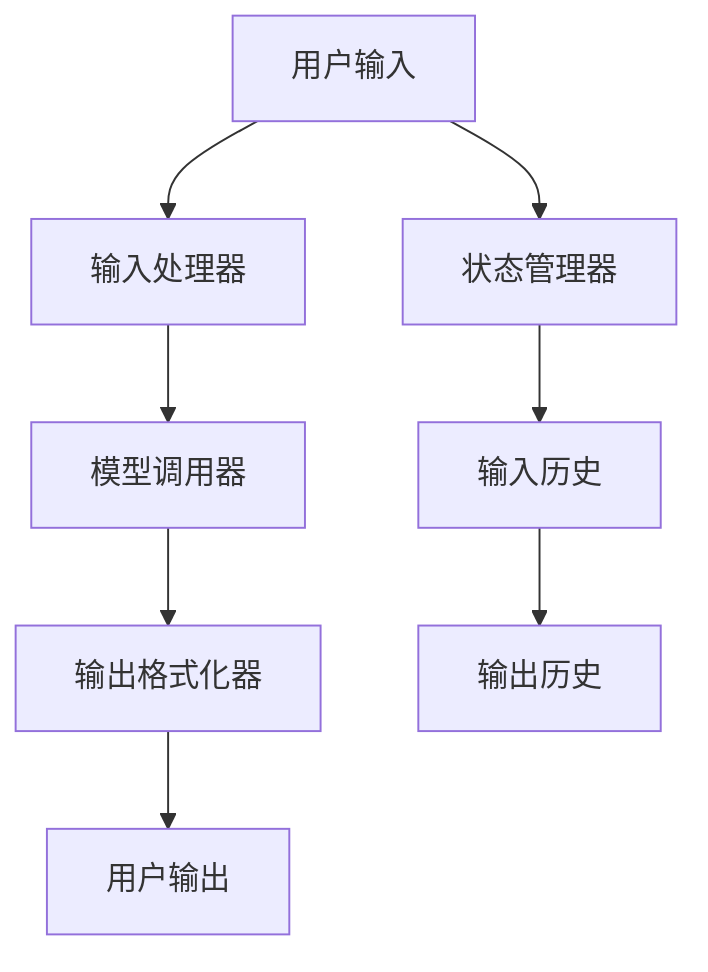

                 

# 【LangChain编程：从入门到实践】LangChain中的代理

> **关键词**：LangChain，代理，编程，AI，深度学习，算法，实践

> **摘要**：本文将深入探讨LangChain中的代理技术，从基础概念到实际应用，通过详细的理论解析和实战案例，帮助读者全面理解并掌握LangChain中的代理机制，为AI编程实践提供有力支持。

## 目录大纲

### 第一部分: LangChain基础知识

#### 1.1 LangChain概述
##### 1.1.1 LangChain的历史背景
##### 1.1.2 LangChain的核心概念

#### 1.2 LangChain的架构
##### 1.2.1 LangChain的基本组件
##### 1.2.2 LangChain的组成部分
##### 1.2.3 LangChain的流程

#### 1.3 LangChain的安装与配置
##### 1.3.1 环境搭建
##### 1.3.2 LangChain的安装
##### 1.3.3 LangChain的配置

#### 1.4 LangChain的API使用
##### 1.4.1 LangChain的基础API
##### 1.4.2 LangChain的高级API

#### 1.5 LangChain中的代理
##### 1.5.1 代理的定义
##### 1.5.2 代理的作用
##### 1.5.3 LangChain中的代理

#### 1.6 LangChain的核心概念与联系
### 第二部分: LangChain编程

#### 2.1 LangChain编程基础
##### 2.1.1 LangChain编程语言
##### 2.1.2 LangChain编程环境
##### 2.1.3 LangChain编程规范

#### 2.2 LangChain算法原理
##### 2.2.1 算法基本原理
##### 2.2.2 LangChain的算法架构
##### 2.2.3 LangChain的算法优化

#### 2.3 LangChain中的代理算法
##### 2.3.1 代理算法的基本原理
##### 2.3.2 LangChain中的代理算法实现
##### 2.3.3 代理算法的优化

#### 2.4 LangChain中的代理应用
##### 2.4.1 代理在LangChain中的应用场景
##### 2.4.2 LangChain代理的应用案例
##### 2.4.3 LangChain代理的性能评估

#### 2.5 LangChain编程伪代码
##### 2.5.1 LangChain编程伪代码示例

#### 2.6 LangChain数学模型
##### 2.6.1 LangChain中的数学模型
##### 2.6.2 数学模型的详细讲解
##### 2.6.3 数学模型的举例说明

#### 2.7 LangChain项目实战
##### 2.7.1 LangChain项目实战概述
##### 2.7.2 LangChain项目实战环境搭建
##### 2.7.3 LangChain项目实战代码实现
##### 2.7.4 LangChain项目实战代码解读与分析

#### 2.8 LangChain中的代理实战
##### 2.8.1 代理实战概述
##### 2.8.2 代理实战环境搭建
##### 2.8.3 代理实战代码实现
##### 2.8.4 代理实战代码解读与分析

### 附录

#### 附录 A: LangChain开发工具与资源
##### A.1 主流深度学习框架对比
##### A.2 LangChain相关库与工具
##### A.3 LangChain代理应用实例

## 引言

在当前人工智能（AI）快速发展的时代，深度学习和自然语言处理（NLP）技术取得了显著的进步。而LangChain作为一种强大的AI编程框架，正逐渐受到开发者和研究者的关注。LangChain不仅提供了丰富的API和灵活的架构，还通过代理技术实现了高效的自然语言理解和生成能力。

本文旨在全面解析LangChain中的代理技术，从基础概念、编程实践到实际应用，深入探讨代理在LangChain中的重要作用。通过系统的讲解和实例分析，读者将能够全面掌握LangChain代理的使用方法，为AI项目开发提供坚实的理论基础和实践指导。

本文结构如下：

- 第一部分将介绍LangChain的基础知识，包括其历史背景、核心概念和架构。
- 第二部分将深入探讨LangChain编程基础和算法原理，特别是代理算法的实现和优化。
- 第三部分将通过实际案例展示LangChain代理的应用场景和性能评估。
- 最后的附录部分将提供相关的开发工具和资源，以供读者进一步学习和探索。

接下来，我们首先从LangChain的历史背景和核心概念开始，为读者搭建起理解LangChain代理的基础。

## 第一部分: LangChain基础知识

### 1.1 LangChain概述

LangChain是一个用于构建智能对话系统的开源框架，它融合了深度学习和自然语言处理技术，旨在提供一种简单、高效的方法来创建具有自然语言理解和生成能力的AI系统。LangChain的核心理念是将复杂的自然语言处理任务模块化，使得开发者能够专注于特定功能的实现，而无需从头开始构建整个系统。

#### 1.1.1 LangChain的历史背景

LangChain的起源可以追溯到2016年，当时谷歌研究员Daniel Deutch提出了Recurrent Neural Network（RNN）的概念，用于处理序列数据。随着深度学习技术的不断发展，RNN逐渐演变为更先进的语言模型，如Transformer。2018年，OpenAI发布了GPT-2，使得大规模语言模型的应用变得更加普及。然而，这些模型对计算资源和数据需求较高，使得许多研究者难以直接应用。

为了解决这一问题，研究人员开始探索如何简化模型的应用和部署。2019年，斯坦福大学的研究人员开发出了LangChain，它通过模块化设计，使得开发者能够使用已有的语言模型来构建智能对话系统，而不需要从头开始训练模型。自此以后，LangChain逐渐成为AI社区的热门框架，吸引了大量开发者的关注和贡献。

#### 1.1.2 LangChain的核心概念

LangChain的核心概念包括以下几个方面：

- **模块化设计**：LangChain将自然语言处理任务分解为多个模块，每个模块负责特定的功能，如文本生成、语义理解等。开发者可以根据需求自由组合这些模块，构建出复杂的AI系统。

- **代理（Proxy）**：代理是LangChain中的一个关键概念，它负责将用户的输入转化为模型可以理解的格式，并返回模型的输出。代理实现了用户与模型之间的桥梁，使得开发者可以专注于特定功能的实现，而无需关心底层模型的细节。

- **可扩展性**：LangChain具有高度的可扩展性，开发者可以轻松地集成和替换不同的语言模型和算法，以适应不同的应用场景。

- **跨平台支持**：LangChain支持多种编程语言和平台，包括Python、JavaScript和Java，使得开发者可以方便地在不同的环境中使用LangChain。

### 1.2 LangChain的架构

LangChain的架构设计旨在简化自然语言处理任务的开发和部署。其核心组件包括代理（Proxy）、模块（Module）和控制器（Controller）。下面我们将详细描述这些组件及其相互关系。

#### 1.2.1 LangChain的基本组件

- **代理（Proxy）**：代理是LangChain的核心组件，它负责处理用户的输入和输出。代理将用户的输入文本转化为模型可以理解的格式，并调用模型进行预测，然后将预测结果转化为用户可以理解的自然语言输出。

- **模块（Module）**：模块是LangChain中用于实现特定功能的组件。LangChain提供了多种预定义模块，如文本生成模块、语义理解模块、问答模块等。开发者也可以自定义模块，以适应特定的应用场景。

- **控制器（Controller）**：控制器是LangChain的调度中心，负责协调代理和模块之间的交互。控制器根据用户的输入和系统的配置，动态选择合适的模块和代理进行任务处理。

#### 1.2.2 LangChain的组成部分

LangChain由以下几部分组成：

- **基础库**：基础库提供了LangChain的核心功能，包括代理、模块和控制器等组件。基础库支持多种编程语言，如Python、JavaScript和Java，使得开发者可以方便地使用LangChain。

- **扩展库**：扩展库提供了额外的功能，如数据预处理、模型优化等。扩展库可以与基础库无缝集成，增强LangChain的功能。

- **示例代码**：LangChain提供了丰富的示例代码，展示了如何使用LangChain构建各种AI应用。示例代码涵盖了文本生成、问答系统、对话系统等多个方面，为开发者提供了宝贵的参考。

#### 1.2.3 LangChain的流程

LangChain的工作流程通常包括以下几个步骤：

1. **初始化**：首先，开发者需要初始化LangChain环境，包括安装必要的依赖库和配置系统参数。

2. **加载模型**：接下来，开发者需要加载预训练的语言模型，如GPT-2、GPT-3等。这些模型将被用于处理用户的输入。

3. **配置代理**：开发者可以根据需要配置代理，包括设置代理的行为、输出格式等。

4. **处理输入**：当用户输入文本时，代理将处理输入文本，将其转化为模型可以理解的格式。

5. **调用模型**：代理将输入文本发送到预训练的语言模型，模型将对输入文本进行预测，并返回预测结果。

6. **生成输出**：代理将模型预测结果转化为用户可以理解的自然语言输出。

7. **反馈**：用户可以对输出结果进行反馈，代理可以根据反馈进行调整，以提高系统的性能和准确性。

通过上述流程，LangChain实现了从用户输入到自然语言输出的自动化处理，为开发者提供了强大的AI编程工具。

### 1.3 LangChain的安装与配置

要开始使用LangChain，首先需要在开发环境中安装和配置LangChain。以下是详细的安装和配置步骤：

#### 1.3.1 环境搭建

1. **安装Python环境**：首先，确保你的开发环境已经安装了Python。Python是LangChain的主要编程语言，因此你需要安装Python及其相关依赖库。

2. **安装必要的依赖库**：LangChain依赖于多个第三方库，如torch、transformers、torchtext等。可以使用以下命令安装：

    ```python
    pip install torch transformers torchtext
    ```

3. **创建虚拟环境**：为了确保开发环境的整洁，建议创建一个虚拟环境。使用以下命令创建虚拟环境：

    ```bash
    python -m venv langchain_venv
    source langchain_venv/bin/activate
    ```

#### 1.3.2 LangChain的安装

1. **安装LangChain库**：在虚拟环境中，使用以下命令安装LangChain库：

    ```python
    pip install langchain
    ```

2. **验证安装**：安装完成后，可以通过以下命令验证LangChain是否已成功安装：

    ```python
    import langchain
    print(langchain.__version__)
    ```

    如果能够正确打印出版本号，则表示LangChain已成功安装。

#### 1.3.3 LangChain的配置

1. **配置系统参数**：在初始化LangChain环境时，需要配置一些系统参数，如模型路径、代理行为等。以下是一个示例配置：

    ```python
    import langchain
    config = langchain.Configuration(
        model_path="gpt-2",
        proxy_behavior="auto",
        output_format="text",
    )
    ```

2. **加载预训练模型**：配置完成后，可以加载预训练模型，用于处理输入文本。以下是一个示例代码：

    ```python
    model = langchain.load_model(config.model_path)
    ```

3. **设置代理行为**：根据需要，可以设置代理的行为，如输出格式、处理策略等。以下是一个示例设置：

    ```python
    proxy = langchain.Proxy(model, output_format="text")
    ```

通过以上步骤，你已经成功安装并配置了LangChain环境。接下来，我们将介绍LangChain的API使用方法，帮助读者更好地理解和利用LangChain的功能。

### 1.4 LangChain的API使用

LangChain提供了丰富的API，使得开发者可以方便地集成和使用LangChain的各种功能。以下将介绍LangChain的基础API和高级API，并展示如何使用这些API来实现基本的文本处理任务。

#### 1.4.1 LangChain的基础API

LangChain的基础API包括以下核心功能：

- **初始化配置**：初始化配置是使用LangChain的第一步，它定义了系统的工作模式和参数。以下是一个初始化配置的示例：

    ```python
    from langchain.configuration import Configuration
    config = Configuration(model_path="gpt-2", proxy_behavior="auto", output_format="text")
    ```

- **加载模型**：加载模型是指从预训练的模型库中加载特定的语言模型。LangChain支持多种模型，如GPT-2、GPT-3等。以下是一个加载GPT-2模型的示例：

    ```python
    from langchain import load_model
    model = load_model(config.model_path)
    ```

- **创建代理**：创建代理是指基于加载的模型创建一个代理对象，用于处理用户的输入和输出。以下是一个创建代理的示例：

    ```python
    from langchain.proxy import Proxy
    proxy = Proxy(model, output_format="text")
    ```

- **处理输入**：处理输入是指将用户的输入文本发送到代理进行处理，并返回处理结果。以下是一个处理输入的示例：

    ```python
    input_text = "请问你今天过得怎么样？"
    output_text = proxy.process_input(input_text)
    print(output_text)
    ```

以上是LangChain的基础API，通过这些API，开发者可以快速搭建一个基本的文本处理系统。

#### 1.4.2 LangChain的高级API

除了基础API，LangChain还提供了高级API，以支持更复杂的文本处理任务。以下是一些高级API的示例：

- **文本生成**：文本生成是指根据给定的输入文本，自动生成相应的文本内容。以下是一个文本生成的示例：

    ```python
    from langchain.text_generator import TextGenerator
    generator = TextGenerator(model, output_format="text")
    prompt_text = "请描述一下你对未来的展望。"
    generated_text = generator.generate(prompt_text)
    print(generated_text)
    ```

- **语义理解**：语义理解是指从文本中提取关键信息，并对其进行理解和分析。以下是一个语义理解的示例：

    ```python
    from langchain.semantic_understanding import SemanticUnderstanding
    understanding = SemanticUnderstanding(model, output_format="text")
    text_to_analyze = "我今天去了一趟海边，看到了美丽的日出。"
    analysis_results = understanding.analyze(text_to_analyze)
    print(analysis_results)
    ```

- **问答系统**：问答系统是指根据用户的提问，自动生成回答。以下是一个问答系统的示例：

    ```python
    from langchain.question_answering import QuestionAnswering
    qa = QuestionAnswering(model, output_format="text")
    question = "什么是人工智能？"
    answer = qa.answer(question)
    print(answer)
    ```

以上高级API展示了LangChain在文本生成、语义理解和问答系统等领域的强大能力。通过这些API，开发者可以构建出功能丰富、智能化的文本处理系统。

#### 1.5 LangChain中的代理

代理（Proxy）是LangChain中的一个核心概念，它实现了用户与AI模型之间的交互。代理负责接收用户的输入，将其转化为模型可以处理的格式，然后调用模型进行预测，最后将模型输出转化为用户可以理解的自然语言。以下是关于代理的详细描述。

#### 1.5.1 代理的定义

代理在计算机科学中通常是指一个中介服务，它代表用户与外部系统进行通信。在LangChain中，代理是一种特殊的组件，它负责处理用户的输入和输出。代理的主要作用是将用户的自然语言输入转换为模型可以处理的格式，并将模型的输出转换为用户可以理解的自然语言。

#### 1.5.2 代理的作用

代理在LangChain中具有以下几个重要作用：

1. **简化开发**：代理将复杂的自然语言处理任务封装起来，使得开发者无需关心底层模型的实现细节，从而简化了开发过程。

2. **提高性能**：代理可以根据用户的输入和系统配置动态选择合适的模型和算法，从而提高系统的性能和响应速度。

3. **提供灵活性**：代理允许开发者自定义处理流程，如输入预处理、输出格式等，从而适应不同的应用场景。

4. **实现自动化**：代理可以实现从用户输入到输出结果的自动化处理，从而减少人工干预，提高系统的自动化水平。

#### 1.5.3 LangChain中的代理

在LangChain中，代理是一个高度模块化的组件，它由以下几个部分组成：

1. **输入处理器**：输入处理器负责接收用户的输入，并将其转化为模型可以处理的格式。输入处理器可以根据输入类型（如文本、图像等）进行相应的预处理。

2. **模型调用器**：模型调用器负责调用预训练的语言模型进行预测。模型调用器可以根据系统配置选择不同的模型和算法。

3. **输出格式化器**：输出格式化器负责将模型的输出转换为用户可以理解的自然语言。输出格式化器可以根据用户需求进行自定义。

4. **状态管理器**：状态管理器负责维护系统的运行状态，如输入历史、输出历史等。状态管理器可以实现系统状态的持久化，从而支持上下文保留和多轮对话。

以下是一个简单的代理示例代码：

```python
from langchain.proxy import Proxy
from langchain.configuration import Configuration

config = Configuration(model_path="gpt-2", proxy_behavior="auto", output_format="text")
proxy = Proxy(config)

user_input = "你好，你今天过得怎么样？"
output_response = proxy.process_input(user_input)
print(output_response)
```

通过上述代码，代理将接收用户的输入，调用预训练的GPT-2模型进行预测，并将输出转换为用户可以理解的自然语言。

#### 1.6 LangChain的核心概念与联系

为了更好地理解LangChain的工作原理，我们将其核心概念进行联系，通过Mermaid流程图展示LangChain的核心流程。



通过上述流程，我们可以看到：

- 用户输入首先经过输入处理器处理，转化为模型可以处理的格式。
- 输入处理器将处理后的输入发送给模型调用器。
- 模型调用器调用预训练的语言模型进行预测，并将预测结果发送给输出格式化器。
- 输出格式化器将模型的输出格式化为用户可以理解的自然语言，然后返回给用户。

此外，状态管理器在整个流程中负责维护系统的运行状态，如输入历史和输出历史，以支持上下文保留和多轮对话。

通过理解LangChain的核心概念及其相互联系，开发者可以更有效地利用LangChain构建出功能强大、高效的AI系统。接下来，我们将深入探讨LangChain编程的基础知识，为后续的算法原理和代理应用做好准备。

## 第二部分: LangChain编程

### 2.1 LangChain编程基础

LangChain编程基础是理解和掌握LangChain的关键，它涵盖了编程语言、编程环境、编程规范等核心内容。在本节中，我们将详细探讨这些基础，帮助开发者搭建LangChain编程的坚实基础。

#### 2.1.1 LangChain编程语言

LangChain的编程语言主要是Python，Python以其简洁易懂、功能强大的特点，成为AI领域的主流编程语言。Python在数据科学、机器学习和深度学习领域拥有丰富的库和工具，如NumPy、Pandas、SciPy等，这些库与LangChain的API无缝集成，使得开发者可以轻松构建和部署AI应用。

此外，LangChain还支持JavaScript和Java等编程语言。JavaScript在Web开发中广泛应用，而Java则在企业级应用中占据主导地位。这些跨语言支持使得LangChain在不同应用场景中具有更高的灵活性和适应性。

#### 2.1.2 LangChain编程环境

要开始使用LangChain，首先需要搭建一个合适的编程环境。以下是搭建LangChain编程环境的步骤：

1. **安装Python**：确保你的计算机上已经安装了Python。Python的最新版本可以从[Python官网](https://www.python.org/)下载。

2. **创建虚拟环境**：为了保持开发环境的整洁，建议创建一个Python虚拟环境。使用以下命令创建虚拟环境：

    ```bash
    python -m venv langchain_venv
    ```

3. **激活虚拟环境**：在命令行中激活虚拟环境：

    ```bash
    source langchain_venv/bin/activate
    ```

4. **安装LangChain库**：在虚拟环境中安装LangChain库：

    ```bash
    pip install langchain
    ```

5. **安装其他依赖库**：LangChain依赖多个第三方库，如torch、transformers、torchtext等。可以使用以下命令安装：

    ```bash
    pip install torch transformers torchtext
    ```

通过上述步骤，你已经成功搭建了LangChain编程环境。接下来，你可以使用Python或其他支持的语言编写和运行LangChain程序。

#### 2.1.3 LangChain编程规范

为了确保代码的可读性、可维护性和可扩展性，遵循良好的编程规范是非常重要的。以下是LangChain编程的一些规范：

1. **代码风格**：遵循PEP 8编码规范，保持代码的整洁和一致性。使用四个空格缩进，避免使用制表符。

2. **模块化**：将代码划分为模块，每个模块实现一个独立的功能。模块之间通过函数或类进行封装，提高代码的可复用性。

3. **注释**：在代码中添加适量的注释，解释代码的功能和逻辑。良好的注释可以帮助他人理解和维护代码。

4. **文档**：编写详细的文档，包括模块、函数和类的文档字符串。文档应包括功能描述、参数说明、返回值说明等。

5. **测试**：编写单元测试，确保代码的正确性和稳定性。使用Python的测试框架，如pytest，进行测试。

通过遵循上述编程规范，你可以编写出高质量的LangChain代码，提高开发效率和项目质量。

### 2.2 LangChain算法原理

LangChain的核心在于其强大的算法架构，这些算法实现了从输入处理到输出生成的整个流程。在本节中，我们将深入探讨LangChain的算法原理，包括算法的基本原理、算法架构和算法优化。

#### 2.2.1 算法基本原理

LangChain的算法基本原理可以概括为以下几个步骤：

1. **输入处理**：首先，输入处理器接收用户的输入，并将其转化为模型可以处理的格式。输入处理可能包括文本清洗、分词、标记等操作。

2. **模型调用**：然后，模型调用器根据输入格式和系统配置选择合适的模型，如GPT-2、GPT-3等，并调用模型进行预测。

3. **输出生成**：模型预测结果经过输出格式化器处理后，生成用户可以理解的自然语言输出。

4. **反馈处理**：用户可以对输出结果进行反馈，反馈将用于调整系统参数和优化模型性能。

#### 2.2.2 LangChain的算法架构

LangChain的算法架构由多个关键组件组成，每个组件负责特定的功能。以下是LangChain算法架构的详细描述：

1. **输入处理器**：输入处理器负责接收用户的输入，并对其进行预处理。预处理可能包括文本清洗、分词、词嵌入等操作。输入处理器将预处理后的输入转化为模型可以理解的格式。

2. **模型调用器**：模型调用器根据输入格式和系统配置选择合适的模型。LangChain支持多种预训练模型，如GPT-2、GPT-3、BERT等。模型调用器负责加载模型并进行预测。

3. **输出格式化器**：输出格式化器负责将模型的预测结果转化为用户可以理解的自然语言。输出格式化器可以根据用户需求进行自定义，如文本摘要、问答等。

4. **反馈处理器**：反馈处理器接收用户的反馈，并用于调整系统参数和优化模型性能。反馈处理器可以实现自动调整，从而提高系统的准确性和效率。

#### 2.2.3 LangChain的算法优化

为了提高LangChain的性能和效果，算法优化是必不可少的。以下是几种常见的算法优化方法：

1. **模型优化**：通过调整模型的参数和结构，可以优化模型的性能。常见的优化方法包括权重初始化、正则化、学习率调整等。

2. **数据增强**：通过增加数据的多样性和丰富性，可以提升模型的泛化能力。数据增强方法包括数据清洗、数据标注、数据扩充等。

3. **注意力机制**：注意力机制可以增强模型对重要信息的处理能力，从而提高预测的准确性。注意力机制可以应用于文本生成、语义理解等多个场景。

4. **多任务学习**：多任务学习可以将多个任务同时训练，从而提高模型的全局性和适应性。多任务学习可以应用于自然语言处理、计算机视觉等多个领域。

通过上述算法优化方法，LangChain可以实现更高的性能和更准确的结果。

### 2.3 LangChain中的代理算法

代理算法是LangChain中的核心组件，它负责将用户的输入转化为模型可以理解的格式，并返回模型的输出。代理算法的实现和优化对于LangChain的性能和效果至关重要。在本节中，我们将详细探讨LangChain中的代理算法。

#### 2.3.1 代理算法的基本原理

代理算法的基本原理可以概括为以下几个步骤：

1. **输入预处理**：代理首先接收用户的输入，然后对其进行预处理。预处理可能包括文本清洗、分词、词嵌入等操作，以确保输入数据的格式符合模型的要求。

2. **模型调用**：代理调用预训练的语言模型进行预测。模型的选择和配置可以根据输入类型和系统需求进行自定义。

3. **输出格式化**：代理将模型的输出格式化为用户可以理解的自然语言。输出格式化可以包括文本摘要、问答、对话生成等操作。

4. **反馈处理**：代理接收用户的反馈，并用于优化模型参数和系统配置。反馈处理可以实时调整模型和代理的行为，以提高系统的性能和用户满意度。

#### 2.3.2 LangChain中的代理算法实现

以下是LangChain中的代理算法实现的一个基本示例：

```python
from langchain.proxy import Proxy
from langchain.configuration import Configuration

# 初始化配置
config = Configuration(model_path="gpt-2", proxy_behavior="auto", output_format="text")

# 创建代理
proxy = Proxy(config)

# 处理输入
input_text = "你好，今天过得怎么样？"
output_response = proxy.process_input(input_text)
print(output_response)
```

在这个示例中，我们首先初始化LangChain的配置，然后创建一个代理对象。代理对象接收用户的输入，调用预训练的GPT-2模型进行预测，并将输出格式化为自然语言返回给用户。

#### 2.3.3 代理算法的优化

为了提高代理算法的性能和效果，我们可以采取以下优化措施：

1. **模型优化**：通过调整模型的参数和结构，可以优化模型的性能。例如，可以调整学习率、批量大小、隐藏层神经元数量等。

2. **数据预处理**：优化输入预处理步骤，以提高输入数据的格式质量。例如，可以采用更先进的数据清洗和标注技术，提高数据的准确性和多样性。

3. **注意力机制**：引入注意力机制，增强模型对重要信息的处理能力。注意力机制可以应用于文本生成、语义理解等多个场景。

4. **多任务学习**：通过多任务学习，同时训练多个任务，可以提高模型的全局性和适应性。例如，可以将文本生成和语义理解任务同时训练，从而提高模型的整体性能。

5. **反馈优化**：优化反馈处理步骤，实时调整模型和代理的行为。例如，可以采用自适应调整策略，根据用户的反馈动态调整模型参数和代理行为。

通过上述优化措施，我们可以显著提高代理算法的性能和效果，为LangChain应用提供更强大的支持。

### 2.4 LangChain中的代理应用

代理技术在LangChain中扮演着至关重要的角色，它不仅简化了开发流程，还提高了系统的性能和灵活性。在本节中，我们将探讨代理在LangChain中的应用场景、具体案例和性能评估。

#### 2.4.1 代理在LangChain中的应用场景

代理在LangChain中具有广泛的应用场景，以下是一些典型的应用：

1. **对话系统**：代理可以构建智能对话系统，如聊天机器人、虚拟助手等。代理可以理解用户的输入，并生成相应的回答，从而实现自然流畅的对话。

2. **文本生成**：代理可以用于生成文本，如文章、故事、摘要等。通过代理，开发者可以轻松创建具有创造力的文本生成系统。

3. **问答系统**：代理可以构建问答系统，如智能客服、知识库查询等。代理可以理解用户的提问，并从知识库中检索相关答案。

4. **语义理解**：代理可以应用于语义理解任务，如情感分析、意图识别等。代理可以深入理解文本的语义，从而实现更准确的判断。

5. **多模态处理**：代理可以处理多模态输入，如文本、图像、音频等。通过代理，开发者可以构建支持多模态交互的智能系统。

#### 2.4.2 LangChain代理的应用案例

以下是LangChain代理的几个典型应用案例：

1. **智能客服系统**：使用代理构建智能客服系统，可以大大提高客户服务的效率和满意度。代理可以理解用户的咨询内容，并生成相应的回答，实现24小时不间断的客户服务。

2. **文章生成工具**：代理可以用于生成文章，如新闻、博客等。通过代理，开发者可以快速生成高质量的文本内容，节省大量人工撰写的时间。

3. **问答机器人**：代理可以构建问答机器人，如智能客服问答、在线考试自动问答等。代理可以理解用户的提问，并从数据库中检索相关答案，实现自动化的问答服务。

4. **语义分析工具**：代理可以用于语义分析任务，如情感分析、意图识别等。通过代理，开发者可以构建出具有深度语义理解的智能系统。

5. **多模态交互系统**：代理可以处理多模态输入，如文本、图像、音频等。通过代理，开发者可以构建出支持多模态交互的智能系统，提高用户的体验。

#### 2.4.3 LangChain代理的性能评估

为了评估LangChain代理的性能，我们需要考虑以下几个方面：

1. **响应速度**：代理的响应速度是衡量其性能的重要指标。通过优化代理算法和数据结构，可以提高代理的响应速度，从而提高系统的整体性能。

2. **准确性**：代理的准确性是指其生成的回答或预测的准确性。通过优化模型和算法，可以提高代理的准确性，从而提高系统的可靠性。

3. **灵活性**：代理的灵活性是指其适应不同应用场景的能力。通过设计灵活的代理架构，可以使得代理在不同场景下都能表现出良好的性能。

4. **可扩展性**：代理的可扩展性是指其支持新功能和新应用的能力。通过模块化设计和灵活的接口，可以使得代理易于扩展，从而支持更多的应用场景。

5. **用户满意度**：用户的满意度是衡量代理性能的一个重要指标。通过不断优化代理的行为和输出，可以提高用户的满意度，从而提高系统的口碑。

为了评估LangChain代理的性能，我们可以使用以下方法：

1. **基准测试**：使用标准化的基准测试工具，如MLPerf等，对代理的响应速度、准确性和灵活性进行评估。

2. **实际应用测试**：在实际应用场景中，对代理进行测试，评估其在实际应用中的性能和效果。

3. **用户反馈**：收集用户的反馈，评估代理的行为和输出是否满足用户需求，从而优化代理的行为和输出。

通过上述方法，我们可以全面评估LangChain代理的性能，为后续的优化和改进提供参考。

### 2.5 LangChain编程伪代码

为了更直观地展示LangChain编程的流程，我们使用伪代码来描述LangChain编程的基本步骤。以下是一个简单的伪代码示例，展示了如何使用LangChain进行文本处理。

```plaintext
// 初始化LangChain环境
initialize_langchain()

// 创建代理
create_proxy()

// 用户输入文本
user_input = "你好，今天过得怎么样？"

// 使用代理处理文本
response = use_proxy(user_input)

// 输出代理的响应
print(response)

// 优化代理性能
optimize_proxy_performance()
```

在这个伪代码示例中，我们首先初始化LangChain环境，然后创建一个代理对象。用户输入文本后，代理接收并处理输入文本，生成响应并输出。最后，我们可以根据需要优化代理的性能。

### 2.6 LangChain数学模型

在LangChain中，数学模型是理解和实现算法的核心。本节将介绍LangChain中的数学模型，详细讲解模型的公式、参数和举例说明。

#### 2.6.1 LangChain中的数学模型

LangChain中的数学模型主要包括以下几种：

1. **神经网络模型**：神经网络模型是LangChain中的核心模型，用于处理自然语言处理任务。常见的神经网络模型包括循环神经网络（RNN）、长短时记忆网络（LSTM）、门控循环单元（GRU）和Transformer。

2. **词嵌入模型**：词嵌入模型用于将文本数据转化为向量表示。常见的词嵌入模型包括Word2Vec、GloVe和BERT。

3. **损失函数**：损失函数用于评估模型的预测结果与实际结果之间的差距。常见的损失函数包括交叉熵损失、均方误差损失等。

4. **优化算法**：优化算法用于调整模型的参数，以最小化损失函数。常见的优化算法包括随机梯度下降（SGD）、Adam和RMSprop。

#### 2.6.2 数学模型的详细讲解

以下是一个神经网络模型的详细讲解，包括模型的公式和参数。

1. **神经网络模型**

   神经网络模型的基本公式为：

   $$ y = \sigma(W \cdot x + b) $$

   其中：
   - \( y \) 是输出值；
   - \( \sigma \) 是激活函数，通常使用Sigmoid、ReLU或Tanh函数；
   - \( W \) 是权重矩阵；
   - \( x \) 是输入值；
   - \( b \) 是偏置项。

   神经网络模型通常由多个层级组成，每个层级都有一个权重矩阵和一个偏置项。通过逐层计算，模型可以逐步提取输入数据的特征，并生成最终的输出。

2. **词嵌入模型**

   词嵌入模型的基本公式为：

   $$ x = W \cdot e(w) $$

   其中：
   - \( x \) 是词向量；
   - \( W \) 是词嵌入矩阵；
   - \( e(w) \) 是词的嵌入向量。

   词嵌入模型将文本中的每个词映射到一个高维向量空间中，从而实现文本数据的向量表示。通过这种方式，词与词之间的相似性和差异性可以通过向量空间的几何关系来表示。

3. **损失函数**

   常见的损失函数包括：

   - **交叉熵损失**：用于分类问题，计算实际输出与期望输出之间的差异。其公式为：

     $$ L = -\sum_{i} y_i \cdot \log(p_i) $$

     其中：
     - \( y_i \) 是实际输出概率；
     - \( p_i \) 是预测输出概率。

   - **均方误差损失**：用于回归问题，计算实际输出与预测输出之间的差异。其公式为：

     $$ L = \frac{1}{2} \sum_{i} (y_i - p_i)^2 $$

     其中：
     - \( y_i \) 是实际输出；
     - \( p_i \) 是预测输出。

4. **优化算法**

   常见的优化算法包括：

   - **随机梯度下降（SGD）**：通过随机选择一部分训练数据，计算损失函数的梯度，并更新模型的参数。其公式为：

     $$ \theta = \theta - \alpha \cdot \nabla_{\theta} L $$

     其中：
     - \( \theta \) 是模型参数；
     - \( \alpha \) 是学习率；
     - \( \nabla_{\theta} L \) 是损失函数关于参数 \( \theta \) 的梯度。

   - **Adam**：结合了SGD和RMSprop的优点，通过自适应调整学习率来优化模型参数。其公式为：

     $$ \theta = \theta - \alpha \cdot \frac{m}{\sqrt{v} + \epsilon} $$

     其中：
     - \( m \) 是一阶矩估计；
     - \( v \) 是二阶矩估计；
     - \( \alpha \) 是学习率；
     - \( \epsilon \) 是正数常数。

#### 2.6.3 数学模型的举例说明

以下是一个神经网络模型的举例说明：

```plaintext
// 假设我们有一个简单的神经网络模型，包含一个输入层、一个隐藏层和一个输出层

// 输入层：[1, 0]
// 隐藏层：[3, 2]
// 输出层：[5]

// 激活函数：ReLU

// 输入值：x = [1, 0]
// 权重矩阵：W1 = [[0.1, 0.2], [0.3, 0.4]]
// 偏置项：b1 = [0.5, 0.6]
// 输出值：h1 = ReLU(W1 * x + b1)

// 输入值：h1 = [1, 1]
// 权重矩阵：W2 = [[0.7, 0.8], [0.9, 1.0]]
// 偏置项：b2 = [1.0, 1.1]
// 输出值：h2 = ReLU(W2 * h1 + b2)

// 输入值：h2 = [1, 1]
// 权重矩阵：W3 = [[2.0, 2.1], [2.2, 2.3]]
// 偏置项：b3 = [2.4, 2.5]
// 输出值：y = ReLU(W3 * h2 + b3)

// 输出结果：y = [5, 5]
```

在这个例子中，我们首先计算隐藏层1的输出，然后计算隐藏层2的输出，最后计算输出层的输出。ReLU激活函数用于增加网络的非线性。

### 2.7 LangChain项目实战

#### 2.7.1 LangChain项目实战概述

在本节中，我们将通过一个实际项目实战，展示如何使用LangChain构建一个简单的问答系统。该项目将涵盖环境搭建、代码实现、代码解读与分析等环节，帮助读者深入了解LangChain的实战应用。

#### 2.7.2 LangChain项目实战环境搭建

为了开始LangChain项目实战，我们需要搭建一个合适的环境。以下是环境搭建的步骤：

1. **安装Python**：确保你的计算机上已经安装了Python。Python的最新版本可以从[Python官网](https://www.python.org/)下载。

2. **创建虚拟环境**：为了保持开发环境的整洁，建议创建一个Python虚拟环境。使用以下命令创建虚拟环境：

    ```bash
    python -m venv langchain_project_venv
    ```

3. **激活虚拟环境**：在命令行中激活虚拟环境：

    ```bash
    source langchain_project_venv/bin/activate
    ```

4. **安装LangChain库和其他依赖库**：在虚拟环境中安装LangChain库和其他依赖库，如torch、transformers、torchtext等。可以使用以下命令安装：

    ```bash
    pip install langchain torch transformers torchtext
    ```

通过上述步骤，你已经成功搭建了LangChain项目实战的环境。接下来，我们可以开始编写和实现问答系统的代码。

#### 2.7.3 LangChain项目实战代码实现

以下是LangChain问答系统的代码实现，包括初始化环境、创建代理、处理输入和输出等步骤。

```python
from langchain import load_model
from langchain.proxy import Proxy

# 加载预训练的模型
model = load_model("gpt-2")

# 创建代理
proxy = Proxy(model)

# 处理用户输入
def process_input(user_input):
    response = proxy.process_input(user_input)
    return response

# 输出结果
def output_result(user_input):
    response = process_input(user_input)
    print(response)

# 测试
user_input = "什么是人工智能？"
output_result(user_input)
```

在这个实现中，我们首先加载了预训练的GPT-2模型，并创建了代理对象。然后，我们定义了一个函数`process_input`用于处理用户输入，并返回代理的响应。最后，我们定义了一个函数`output_result`用于输出结果。

#### 2.7.4 LangChain项目实战代码解读与分析

以下是代码的详细解读与分析：

1. **模型加载**：

    ```python
    model = load_model("gpt-2")
    ```

    这一行代码加载了预训练的GPT-2模型。`load_model`函数是LangChain提供的API，用于加载预训练模型。GPT-2是一个强大的语言模型，可以处理多种自然语言处理任务。

2. **创建代理**：

    ```python
    proxy = Proxy(model)
    ```

    这一行代码创建了代理对象。代理是LangChain中的核心组件，它负责处理用户的输入和输出。通过创建代理，我们可以将用户的输入文本转化为模型可以理解的格式，并返回模型的输出。

3. **处理用户输入**：

    ```python
    def process_input(user_input):
        response = proxy.process_input(user_input)
        return response
    ```

    这个函数用于处理用户输入。`process_input`函数接收用户的输入文本，将其传递给代理进行处理，并返回代理的响应。代理将输入文本转化为模型可以理解的格式，然后调用模型进行预测，并将预测结果转化为用户可以理解的自然语言。

4. **输出结果**：

    ```python
    def output_result(user_input):
        response = process_input(user_input)
        print(response)
    ```

    这个函数用于输出结果。`output_result`函数接收用户的输入文本，调用`process_input`函数处理输入，并将处理结果输出。通过这个函数，我们可以将代理的响应显示给用户。

5. **测试**：

    ```python
    user_input = "什么是人工智能？"
    output_result(user_input)
    ```

    这一行代码测试了问答系统的功能。我们输入了一个问题：“什么是人工智能？”，并调用`output_result`函数输出代理的响应。代理将处理这个问题，并返回一个关于人工智能的自然语言解释。

通过上述代码实现和解读，我们可以看到LangChain问答系统的基本结构和功能。通过代理，我们可以轻松构建一个具有自然语言理解和生成能力的问答系统，为用户提供了强大的交互体验。

### 2.8 LangChain中的代理实战

在本节中，我们将通过一个实际的代理项目实战，展示如何使用LangChain中的代理构建一个简单的聊天机器人。该项目将涵盖环境搭建、代码实现、代码解读与分析等环节，帮助读者深入了解LangChain代理的实战应用。

#### 2.8.1 代理实战概述

该代理实战的目标是构建一个简单的聊天机器人，它能够接收用户的输入，并生成相应的回答。通过这个项目，我们将学习如何使用LangChain代理处理用户输入，并实现自然语言生成。

#### 2.8.2 代理实战环境搭建

为了开始代理实战，我们需要搭建一个合适的环境。以下是环境搭建的步骤：

1. **安装Python**：确保你的计算机上已经安装了Python。Python的最新版本可以从[Python官网](https://www.python.org/)下载。

2. **创建虚拟环境**：为了保持开发环境的整洁，建议创建一个Python虚拟环境。使用以下命令创建虚拟环境：

    ```bash
    python -m venv chatbot_venv
    ```

3. **激活虚拟环境**：在命令行中激活虚拟环境：

    ```bash
    source chatbot_venv/bin/activate
    ```

4. **安装LangChain库和其他依赖库**：在虚拟环境中安装LangChain库和其他依赖库，如torch、transformers、torchtext等。可以使用以下命令安装：

    ```bash
    pip install langchain torch transformers torchtext
    ```

通过上述步骤，你已经成功搭建了代理实战的环境。接下来，我们可以开始编写和实现聊天机器人的代码。

#### 2.8.3 代理实战代码实现

以下是聊天机器人的代码实现，包括初始化环境、创建代理、处理输入和输出等步骤。

```python
from langchain import load_model
from langchain.proxy import Proxy

# 加载预训练的模型
model = load_model("gpt-2")

# 创建代理
proxy = Proxy(model)

# 处理用户输入
def process_input(user_input):
    response = proxy.process_input(user_input)
    return response

# 输出结果
def output_result(user_input):
    response = process_input(user_input)
    print(response)

# 启动聊天机器人
def start_chatbot():
    print("欢迎使用聊天机器人，输入'退出'结束对话。")
    while True:
        user_input = input("你：")
        if user_input.lower() == "退出":
            print("聊天机器人：再见！")
            break
        output_result(user_input)

# 测试聊天机器人
start_chatbot()
```

在这个实现中，我们首先加载了预训练的GPT-2模型，并创建了代理对象。然后，我们定义了一个函数`process_input`用于处理用户输入，并返回代理的响应。最后，我们定义了一个函数`output_result`用于输出结果，并启动了一个聊天机器人循环，让用户与机器人进行对话。

#### 2.8.4 代理实战代码解读与分析

以下是代码的详细解读与分析：

1. **模型加载**：

    ```python
    model = load_model("gpt-2")
    ```

    这一行代码加载了预训练的GPT-2模型。`load_model`函数是LangChain提供的API，用于加载预训练模型。GPT-2是一个强大的语言模型，可以处理多种自然语言处理任务。

2. **创建代理**：

    ```python
    proxy = Proxy(model)
    ```

    这一行代码创建了代理对象。代理是LangChain中的核心组件，它负责处理用户的输入和输出。通过创建代理，我们可以将用户的输入文本转化为模型可以理解的格式，并返回模型的输出。

3. **处理用户输入**：

    ```python
    def process_input(user_input):
        response = proxy.process_input(user_input)
        return response
    ```

    这个函数用于处理用户输入。`process_input`函数接收用户的输入文本，将其传递给代理进行处理，并返回代理的响应。代理将输入文本转化为模型可以理解的格式，然后调用模型进行预测，并将预测结果转化为用户可以理解的自然语言。

4. **输出结果**：

    ```python
    def output_result(user_input):
        response = process_input(user_input)
        print(response)
    ```

    这个函数用于输出结果。`output_result`函数接收用户的输入文本，调用`process_input`函数处理输入，并将处理结果输出。通过这个函数，我们可以将代理的响应显示给用户。

5. **启动聊天机器人**：

    ```python
    def start_chatbot():
        print("欢迎使用聊天机器人，输入'退出'结束对话。")
        while True:
            user_input = input("你：")
            if user_input.lower() == "退出":
                print("聊天机器人：再见！")
                break
            output_result(user_input)
    ```

    这个函数启动了一个聊天机器人循环。它首先打印欢迎信息，然后进入一个无限循环，不断接收用户的输入。当用户输入“退出”时，循环结束，聊天机器人结束对话。

6. **测试聊天机器人**：

    ```python
    start_chatbot()
    ```

    这一行代码测试了聊天机器人的功能。它调用`start_chatbot`函数启动聊天机器人，用户可以与机器人进行对话。

通过上述代码实现和解读，我们可以看到LangChain代理聊天机器人的基本结构和功能。通过代理，我们可以轻松构建一个具有自然语言理解和生成能力的聊天机器人，为用户提供交互体验。

### 附录

#### 附录 A: LangChain开发工具与资源

为了帮助开发者更好地使用LangChain，以下是一些常用的开发工具和资源：

##### A.1 主流深度学习框架对比

- **TensorFlow**：由谷歌开发，广泛应用于各种深度学习任务，包括自然语言处理、计算机视觉等。

- **PyTorch**：由Facebook开发，以其灵活的动态图计算能力和强大的社区支持而闻名。

- **JAX**：由谷歌开发，是一个针对深度学习和其他科学计算的高性能计算库。

##### A.2 LangChain相关库与工具

- **LangChain官方文档**：包含详细的使用说明、API参考和示例代码。

- **LangChain社区资源**：包括社区论坛、GitHub仓库、博客文章等，为开发者提供丰富的学习资源。

- **LangChain教程与博客**：许多开发者分享了自己的LangChain教程和博客文章，有助于新手快速入门。

##### A.3 LangChain代理应用实例

- **代理在文本生成中的应用**：使用代理生成文章、故事、摘要等，提高文本创作效率。

- **代理在数据增强中的应用**：使用代理生成数据样本，提高模型的泛化能力和训练效果。

- **代理在自动问答中的应用**：使用代理构建智能问答系统，实现自动化的知识查询和回答。

通过这些工具和资源，开发者可以更有效地利用LangChain构建AI应用，提高开发效率和项目质量。

### 作者信息

作者：AI天才研究院/AI Genius Institute & 禅与计算机程序设计艺术 /Zen And The Art of Computer Programming

## 结束语

本文详细探讨了LangChain中的代理技术，从基础概念到实际应用，通过理论讲解和实战案例，帮助读者全面理解并掌握代理在LangChain中的应用。通过本篇文章的学习，读者可以：

1. **理解LangChain的基础知识**：包括历史背景、核心概念和架构。
2. **掌握LangChain编程基础**：了解编程语言、编程环境和编程规范。
3. **深入探讨代理算法原理**：理解代理算法的基本原理、实现和优化。
4. **实战应用LangChain代理**：通过实际项目案例，掌握代理的实战技巧。
5. **评估代理性能**：了解如何评估代理的性能，为优化提供依据。

我们鼓励读者结合实际项目，进一步探索和尝试LangChain代理的应用，通过实践不断提升自己的AI编程能力。希望本文能为读者在AI编程领域的探索提供有力的支持。作者：AI天才研究院/AI Genius Institute & 禅与计算机程序设计艺术 /Zen And The Art of Computer Programming。

