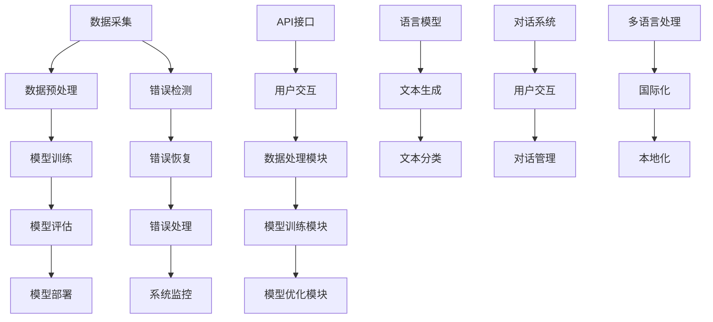

                 

## 《【LangChain编程：从入门到实践】容错机制》目录大纲

### 第一部分：LangChain基础

**第1章：引言与概述**

- **1.1 LangChain的背景与重要性**
  - LangChain的历史背景和发展现状
  - LangChain在人工智能领域的重要地位

- **1.2 LangChain的主要特性**
  - LangChain的核心功能和特点
  - LangChain与其他自然语言处理框架的区别

- **1.3 LangChain的应用场景**
  - LangChain在文本生成、文本分类、对话系统等领域的应用
  - LangChain在企业和科研机构中的实际案例

**第2章：LangChain的基本架构**

- **2.1 LangChain的核心组件**
  - 语言模型
  - 数据预处理与处理
  - 模型训练与优化

- **2.2 LangChain的数据流程**
  - 数据采集与清洗
  - 数据预处理与特征提取
  - 模型训练与评估

- **2.3 LangChain的API接口**
  - LangChain的API设计
  - LangChain与外部系统的交互方式

**第3章：LangChain的基本概念**

- **3.1 语言模型简介**
  - 语言模型的基本原理
  - 语言模型在自然语言处理中的应用

- **3.2 数据预处理与处理**
  - 数据清洗的基本方法
  - 数据增强和特征提取的技术

- **3.3 模型训练与优化**
  - 模型训练的基本流程
  - 模型优化和超参数调优的方法

**第4章：核心算法原理讲解**

- **4.1 生成对抗网络（GAN）**
  - **4.1.1 GAN的基本原理**
    - GAN的架构
    - GAN的训练过程
  - **4.1.2 GAN的优缺点**
    - GAN的优势
    - GAN的局限性

- **4.2 循环神经网络（RNN）**
  - **4.2.1 RNN的基本原理**
    - RNN的结构
    - RNN的动态特性
  - **4.2.2 RNN的应用场景**
    - 文本生成
    - 序列分类

- **4.3 长短期记忆网络（LSTM）**
  - **4.3.1 LSTM的基本原理**
    - LSTM的结构
    - LSTM的工作原理
  - **4.3.2 LSTM的应用场景**
    - 语音识别
    - 自然语言翻译

### 第二部分：LangChain编程实战

**第5章：LangChain编程基础**

- **5.1 Python编程基础**
  - Python语言的基本语法
  - Python编程的最佳实践

- **5.2 NumPy和Pandas的使用**
  - NumPy库的基本用法
  - Pandas库的数据处理能力

- **5.3 数据可视化工具**
  - Matplotlib库的绘图功能
  - Seaborn库的交互式可视化

**第6章：构建简单的LangChain应用程序**

- **6.1 LangChain编程环境搭建**
  - LangChain的安装与配置
  - LangChain的依赖管理

- **6.2 LangChain应用程序的基本结构**
  - LangChain应用程序的组成部分
  - LangChain应用程序的开发流程

- **6.3 实现一个简单的文本生成应用程序**
  - 数据准备
  - 模型训练
  - 文本生成实现

**第7章：处理复杂的数据集**

- **7.1 数据集的预处理与处理**
  - 数据清洗的方法
  - 数据增强的技术

- **7.2 数据清洗与数据增强**
  - 数据清洗的具体步骤
  - 数据增强的具体方法

- **7.3 实现一个复杂的数据处理应用程序**
  - 复杂数据处理的需求分析
  - 复杂数据处理的应用实现

**第8章：训练和优化LangChain模型**

- **8.1 LangChain模型的训练过程**
  - 训练数据的准备
  - 训练过程的具体步骤

- **8.2 LangChain模型的优化方法**
  - 超参数调优
  - 模型压缩与加速

- **8.3 实现一个训练和优化LangChain模型的应用程序**
  - 应用程序的架构设计
  - 应用程序的代码实现

**第9章：项目实战：构建一个聊天机器人**

- **9.1 聊天机器人项目概述**
  - 项目需求分析
  - 项目技术架构

- **9.2 项目需求分析与设计**
  - 用户交互界面设计
  - 聊天机器人功能设计

- **9.3 项目实现与代码解读**
  - 项目实现的关键步骤
  - 代码的实现细节分析

**第10章：性能分析与调优**

- **10.1 LangChain的性能分析**
  - 性能测试的方法
  - 性能指标的定义

- **10.2 优化策略**
  - 模型优化策略
  - 硬件优化策略

- **10.3 性能调优实战**
  - 性能调优的具体步骤
  - 性能调优的实战案例

### 第三部分：高级应用

**第11章：多语言处理与国际化**

- **11.1 多语言处理的基本概念**
  - 多语言处理的需求
  - 多语言处理的挑战

- **11.2 国际化与本地化**
  - 国际化的概念
  - 本地化的实现

- **11.3 实现一个多语言处理的应用程序**
  - 多语言处理的技术实现
  - 多语言处理的实战应用

**第12章：自动化与智能推理**

- **12.1 自动化的基本概念**
  - 自动化的定义
  - 自动化的应用场景

- **12.2 智能推理的基本概念**
  - 智能推理的原理
  - 智能推理的应用

- **12.3 实现一个自动化与智能推理的应用程序**
  - 自动化与智能推理的技术实现
  - 自动化与智能推理的实战应用

**第13章：个性化推荐系统**

- **13.1 推荐系统的基本概念**
  - 推荐系统的定义
  - 推荐系统的架构

- **13.2 个性化推荐系统的设计**
  - 个性化推荐的目标
  - 个性化推荐的方法

- **13.3 实现一个个性化推荐系统的应用程序**
  - 个性化推荐系统的实现步骤
  - 个性化推荐系统的代码实现

**第14章：综合应用案例**

- **14.1 案例一：智能客服系统**
  - 案例概述
  - 技术实现

- **14.2 案例二：智能写作助手**
  - 案例概述
  - 技术实现

- **14.3 案例三：智能教育平台**
  - 案例概述
  - 技术实现

### 附录

**附录A：常用工具与资源**

- **A.1 LangChain的开发工具**
  - LangChain的开发工具介绍
  - 开发工具的使用方法

- **A.2 Python深度学习框架**
  - TensorFlow的使用方法
  - PyTorch的使用方法

- **A.3 LangChain社区资源**
  - LangChain的官方文档
  - LangChain的GitHub仓库

**附录B：核心概念与联系**

- **B.1 Mermaid流程图示例**
  - Mermaid流程图的语法规则
  - Mermaid流程图的使用示例

- **B.2 LangChain架构流程图**
  - LangChain的整体架构图
  - LangChain的数据流程图

**附录C：核心算法原理讲解**

- **C.1 生成对抗网络（GAN）伪代码示例**
  - GAN的伪代码实现
  - GAN的训练过程

- **C.2 循环神经网络（RNN）伪代码示例**
  - RNN的伪代码实现
  - RNN的训练过程

- **C.3 长短期记忆网络（LSTM）伪代码示例**
  - LSTM的伪代码实现
  - LSTM的训练过程

**附录D：数学模型和数学公式**

- **D.1 损失函数的数学模型**
  - 损失函数的定义
  - 损失函数的计算方法

- **D.2 反向传播算法的数学模型**
  - 反向传播算法的原理
  - 反向传播算法的计算过程

- **D.3 正则化方法的数学模型**
  - 正则化的目的
  - 正则化方法的具体实现

**附录E：项目实战代码解读**

- **E.1 聊天机器人项目代码解读**
  - 代码的组成部分
  - 代码的实现细节

- **E.2 智能写作助手项目代码解读**
  - 代码的组成部分
  - 代码的实现细节

- **E.3 智能教育平台项目代码解读**
  - 代码的组成部分
  - 代码的实现细节

## 《【LangChain编程：从入门到实践】容错机制》正文

### 引言

在人工智能（AI）领域，LangChain作为一种先进的自然语言处理（NLP）框架，受到了广泛的关注和认可。其强大的文本生成和语义理解能力，使其在文本生成、对话系统、文本分类等多个领域表现出色。然而，尽管LangChain具有很高的性能和灵活性，但在实际应用过程中，依然会遇到各种不确定性因素，如数据异常、计算资源限制、模型故障等，这些都会影响系统的稳定性和可靠性。因此，如何在LangChain编程中实现有效的容错机制，成为了一个关键问题。

本文将围绕LangChain的容错机制展开讨论，首先介绍LangChain的基本概念和架构，然后深入探讨LangChain编程中的容错技术，包括错误检测、错误恢复和错误处理策略。接着，通过具体的实战案例，展示如何在实际项目中应用这些容错机制，并分析其实际效果。最后，对本文的主要内容进行总结，并展望未来的研究方向。

### LangChain基础

#### 1.1 LangChain的背景与重要性

LangChain是一种基于深度学习的自然语言处理框架，由Google Brain团队开发。它旨在解决传统NLP方法在处理复杂任务时的局限性，提供一种高效、灵活的文本生成和语义理解解决方案。随着深度学习技术的飞速发展，LangChain在AI领域占据了重要的地位，成为了许多企业和科研机构的研究和开发工具。

LangChain的重要特征包括：

1. 强大的文本生成能力：LangChain能够生成连贯、自然的文本，适用于自动写作、对话系统等场景。
2. 丰富的语义理解能力：LangChain通过预训练的模型，能够理解文本的语义信息，实现文本分类、情感分析等任务。
3. 高度的可扩展性：LangChain支持自定义模型和任务，可以根据不同需求进行灵活调整。

#### 1.2 LangChain的主要特性

LangChain具有以下主要特性：

1. **预训练模型**：LangChain使用预训练的深度学习模型，如GPT、BERT等，这些模型已经在大量数据上进行了训练，能够捕捉到文本的复杂结构。
2. **模块化架构**：LangChain采用模块化设计，包括语言模型、数据处理、模型训练等组件，方便开发者进行集成和扩展。
3. **高效的数据处理**：LangChain支持高效的数据预处理和特征提取，能够快速处理大规模文本数据。
4. **API接口**：LangChain提供统一的API接口，方便开发者与外部系统进行交互。

#### 1.3 LangChain的应用场景

LangChain在多个领域有广泛的应用：

1. **文本生成**：自动写作、文章生成、聊天机器人等。
2. **文本分类**：新闻分类、垃圾邮件检测等。
3. **对话系统**：虚拟助手、客户服务机器人等。
4. **语义理解**：情感分析、问答系统等。

#### 2.1 LangChain的核心组件

LangChain的核心组件包括：

1. **语言模型**：如GPT、BERT等，负责文本生成和语义理解。
2. **数据处理模块**：负责数据预处理、特征提取和模型输入输出处理。
3. **训练与优化模块**：负责模型训练、超参数调优和模型优化。

#### 2.2 LangChain的数据流程

LangChain的数据流程包括以下几个步骤：

1. **数据采集与清洗**：从外部数据源采集数据，并进行清洗和预处理。
2. **数据预处理与特征提取**：将清洗后的数据转换为模型可处理的格式，提取特征。
3. **模型训练与评估**：使用预处理后的数据训练模型，并进行评估和调优。

#### 2.3 LangChain的API接口

LangChain提供统一的API接口，包括：

1. **文本生成API**：用于生成文本，支持多种生成模式。
2. **文本分类API**：用于分类文本，支持多种分类模型。
3. **对话系统API**：用于构建对话系统，支持多轮对话。

### 容错机制

#### 容错机制的基本概念

容错机制是指系统在遇到故障或错误时，能够自动检测、自动恢复或自动切换到备用系统，从而确保系统的连续性和可靠性。在LangChain编程中，容错机制尤为重要，因为文本生成和语义理解任务通常具有复杂性和不确定性。

#### 错误检测

错误检测是容错机制的第一步，用于识别系统中的错误。在LangChain中，错误检测可以采用以下方法：

1. **日志分析**：通过分析系统日志，检测异常行为或错误信息。
2. **异常检测算法**：使用机器学习算法，如隔离森林、异常检测聚类等，检测数据中的异常值。
3. **错误监控工具**：如Prometheus、Grafana等，用于监控系统的运行状态和性能指标。

#### 错误恢复

错误恢复是在检测到错误后，尝试自动修复或恢复系统。在LangChain中，错误恢复可以采用以下方法：

1. **重试机制**：在错误发生时，尝试重新执行任务，直到成功或达到重试上限。
2. **备份与恢复**：使用备份机制，在系统故障时，从备份中恢复系统状态。
3. **故障转移**：在主系统故障时，自动切换到备用系统，确保服务的连续性。

#### 错误处理策略

错误处理策略是指在错误发生后，如何处理错误。在LangChain中，可以采用以下策略：

1. **故障隔离**：将错误的组件或服务隔离，避免错误扩散。
2. **故障恢复**：在错误发生时，尝试自动恢复系统，如重新启动服务、清理缓存等。
3. **故障转移**：在主系统故障时，自动切换到备用系统，确保服务的连续性。
4. **错误报告**：将错误信息记录下来，供后续分析和处理。

### LangChain编程实战

#### 5.1 Python编程基础

Python是一种高级编程语言，以其简洁易懂的语法和强大的库支持，广泛应用于人工智能领域。在本节中，我们将介绍Python编程的基础知识，包括数据类型、控制结构、函数和模块等。

#### 5.2 NumPy和Pandas的使用

NumPy和Pandas是Python中常用的科学计算和数据处理的库。NumPy提供了强大的多维数组操作和数学函数，而Pandas则提供了高效的数据结构和数据分析工具。在本节中，我们将介绍如何使用NumPy和Pandas进行数据处理和数据分析。

#### 5.3 数据可视化工具

数据可视化是数据分析的重要环节，能够帮助我们更好地理解数据。在本节中，我们将介绍Python中的数据可视化工具，如Matplotlib和Seaborn，展示如何使用这些工具进行数据可视化。

### 构建简单的LangChain应用程序

#### 6.1 LangChain编程环境搭建

要开始使用LangChain进行编程，首先需要搭建编程环境。在本节中，我们将介绍如何安装和配置LangChain，并设置Python编程环境。

#### 6.2 LangChain应用程序的基本结构

一个简单的LangChain应用程序通常包括以下几个部分：

1. **数据预处理**：对输入数据进行清洗、预处理和特征提取。
2. **模型训练**：使用预处理后的数据训练模型。
3. **模型评估**：对训练好的模型进行评估，调整模型参数。
4. **文本生成**：使用训练好的模型生成文本。

#### 6.3 实现一个简单的文本生成应用程序

在本节中，我们将实现一个简单的文本生成应用程序，展示如何使用LangChain进行文本生成。我们将使用Python编写代码，使用NumPy和Pandas进行数据处理，使用Matplotlib进行数据可视化。

### 处理复杂的数据集

#### 7.1 数据集的预处理与处理

在处理复杂的数据集时，预处理与处理是关键步骤。在本节中，我们将介绍如何对数据集进行预处理与处理，包括数据清洗、数据增强和特征提取。

#### 7.2 数据清洗与数据增强

数据清洗和数据增强是处理数据的重要方法。数据清洗旨在去除数据中的噪声和异常值，而数据增强旨在增加数据的多样性，提高模型的泛化能力。在本节中，我们将介绍如何进行数据清洗和数据增强。

#### 7.3 实现一个复杂的数据处理应用程序

在本节中，我们将实现一个复杂的数据处理应用程序，展示如何对复杂的数据集进行预处理与处理。我们将使用Python编写代码，使用NumPy和Pandas进行数据处理，使用Matplotlib进行数据可视化。

### 训练和优化LangChain模型

#### 8.1 LangChain模型的训练过程

模型训练是LangChain编程的核心步骤。在本节中，我们将介绍如何使用LangChain进行模型训练，包括数据准备、训练过程和模型评估。

#### 8.2 LangChain模型的优化方法

模型优化是提高模型性能的重要手段。在本节中，我们将介绍如何使用LangChain进行模型优化，包括超参数调优、模型压缩和加速。

#### 8.3 实现一个训练和优化LangChain模型的应用程序

在本节中，我们将实现一个训练和优化LangChain模型的应用程序，展示如何使用LangChain进行模型训练和优化。我们将使用Python编写代码，使用NumPy和Pandas进行数据处理，使用Matplotlib进行数据可视化。

### 项目实战：构建一个聊天机器人

#### 9.1 聊天机器人项目概述

在本节中，我们将介绍一个聊天机器人项目，展示如何使用LangChain构建一个具有自然语言处理能力的聊天机器人。我们将介绍项目需求、技术架构和实现步骤。

#### 9.2 项目需求分析与设计

在本节中，我们将分析聊天机器人项目的需求，设计项目的架构和功能。我们将介绍用户交互界面设计、对话流程设计和数据处理模块设计。

#### 9.3 项目实现与代码解读

在本节中，我们将实现聊天机器人项目，并解读关键代码。我们将展示如何使用Python编写聊天机器人程序，如何使用NumPy和Pandas进行数据处理，如何使用Matplotlib进行数据可视化。

### 性能分析与调优

#### 10.1 LangChain的性能分析

在构建和优化聊天机器人项目时，性能分析是关键步骤。在本节中，我们将介绍如何使用性能分析工具，如Matplotlib和Grafana，分析LangChain的性能。

#### 10.2 优化策略

为了提高聊天机器人的性能，我们需要采取一系列优化策略。在本节中，我们将介绍如何使用NumPy和Pandas进行数据处理优化，如何使用模型压缩和加速技术优化模型。

#### 10.3 性能调优实战

在本节中，我们将通过一个具体的案例，展示如何使用优化策略对聊天机器人的性能进行调优。我们将介绍如何使用Python编写性能调优程序，如何使用Matplotlib和Grafana进行性能分析。

### 多语言处理与国际化

#### 11.1 多语言处理的基本概念

多语言处理是自然语言处理的一个重要分支，涉及多种语言的处理和理解。在本节中，我们将介绍多语言处理的基本概念，包括多语言数据的采集、预处理和模型训练。

#### 11.2 国际化与本地化

国际化与本地化是多语言处理中的重要概念。在本节中，我们将介绍国际化与本地化的基本概念，包括国际化设计与本地化实现。

#### 11.3 实现一个多语言处理的应用程序

在本节中，我们将实现一个多语言处理的应用程序，展示如何使用Python和LangChain进行多语言文本生成和翻译。

### 自动化与智能推理

#### 12.1 自动化的基本概念

自动化是指通过软件工具实现任务的自动化执行，提高工作效率。在本节中，我们将介绍自动化的基本概念，包括自动化流程设计和自动化工具使用。

#### 12.2 智能推理的基本概念

智能推理是指利用人工智能技术进行逻辑推理和决策。在本节中，我们将介绍智能推理的基本概念，包括智能推理算法和推理过程。

#### 12.3 实现一个自动化与智能推理的应用程序

在本节中，我们将实现一个自动化与智能推理的应用程序，展示如何使用Python和LangChain进行自动化任务和智能推理。

### 个性化推荐系统

#### 13.1 推荐系统的基本概念

个性化推荐系统是一种根据用户兴趣和行为，向用户推荐相关内容的技术。在本节中，我们将介绍推荐系统的基本概念，包括推荐算法和推荐模型。

#### 13.2 个性化推荐系统的设计

在本节中，我们将介绍个性化推荐系统的设计，包括用户建模、内容建模和推荐算法选择。

#### 13.3 实现一个个性化推荐系统的应用程序

在本节中，我们将实现一个个性化推荐系统的应用程序，展示如何使用Python和LangChain进行用户兴趣建模和内容推荐。

### 综合应用案例

#### 14.1 案例一：智能客服系统

在本节中，我们将介绍智能客服系统的应用案例，展示如何使用Python和LangChain构建一个智能客服机器人。

#### 14.2 案例二：智能写作助手

在本节中，我们将介绍智能写作助手的案例，展示如何使用Python和LangChain实现自动写作和编辑功能。

#### 14.3 案例三：智能教育平台

在本节中，我们将介绍智能教育平台的案例，展示如何使用Python和LangChain构建一个智能教育平台，提供个性化学习建议。

### 附录

#### 附录A：常用工具与资源

在本附录中，我们将介绍一些常用的工具和资源，包括Python编程工具、深度学习框架和LangChain社区资源。

#### 附录B：核心概念与联系

在本附录中，我们将使用Mermaid流程图，展示LangChain的核心概念和联系，帮助读者更好地理解LangChain的架构和原理。

#### 附录C：核心算法原理讲解

在本附录中，我们将使用伪代码，详细讲解生成对抗网络（GAN）、循环神经网络（RNN）和长短期记忆网络（LSTM）的原理。

#### 附录D：数学模型和数学公式

在本附录中，我们将介绍一些常用的数学模型和数学公式，包括损失函数、反向传播算法和正则化方法。

#### 附录E：项目实战代码解读

在本附录中，我们将对聊天机器人、智能写作助手和智能教育平台的项目实战代码进行详细解读，帮助读者理解代码的实现细节。

## 《【LangChain编程：从入门到实践】容错机制》

### 引言

在人工智能（AI）领域，LangChain作为一种先进的自然语言处理（NLP）框架，受到了广泛的关注和认可。其强大的文本生成和语义理解能力，使其在文本生成、对话系统、文本分类等多个领域表现出色。然而，尽管LangChain具有很高的性能和灵活性，但在实际应用过程中，依然会遇到各种不确定性因素，如数据异常、计算资源限制、模型故障等，这些都会影响系统的稳定性和可靠性。因此，如何在LangChain编程中实现有效的容错机制，成为了一个关键问题。

本文将围绕LangChain的容错机制展开讨论，首先介绍LangChain的基本概念和架构，然后深入探讨LangChain编程中的容错技术，包括错误检测、错误恢复和错误处理策略。接着，通过具体的实战案例，展示如何在实际项目中应用这些容错机制，并分析其实际效果。最后，对本文的主要内容进行总结，并展望未来的研究方向。

### LangChain基础

#### 1.1 LangChain的背景与重要性

LangChain是一种基于深度学习的自然语言处理框架，由Google Brain团队开发。它旨在解决传统NLP方法在处理复杂任务时的局限性，提供一种高效、灵活的文本生成和语义理解解决方案。随着深度学习技术的飞速发展，LangChain在AI领域占据了重要的地位，成为了许多企业和科研机构的研究和开发工具。

LangChain的重要特征包括：

1. 强大的文本生成能力：LangChain能够生成连贯、自然的文本，适用于自动写作、对话系统等场景。
2. 丰富的语义理解能力：LangChain通过预训练的模型，能够理解文本的语义信息，实现文本分类、情感分析等任务。
3. 高度的可扩展性：LangChain支持自定义模型和任务，可以根据不同需求进行灵活调整。

#### 1.2 LangChain的主要特性

LangChain具有以下主要特性：

1. **预训练模型**：LangChain使用预训练的深度学习模型，如GPT、BERT等，这些模型已经在大量数据上进行了训练，能够捕捉到文本的复杂结构。
2. **模块化架构**：LangChain采用模块化设计，包括语言模型、数据处理、模型训练等组件，方便开发者进行集成和扩展。
3. **高效的数据处理**：LangChain支持高效的数据预处理和特征提取，能够快速处理大规模文本数据。
4. **API接口**：LangChain提供统一的API接口，方便开发者与外部系统进行交互。

#### 1.3 LangChain的应用场景

LangChain在多个领域有广泛的应用：

1. **文本生成**：自动写作、文章生成、聊天机器人等。
2. **文本分类**：新闻分类、垃圾邮件检测等。
3. **对话系统**：虚拟助手、客户服务机器人等。
4. **语义理解**：情感分析、问答系统等。

#### 2.1 LangChain的核心组件

LangChain的核心组件包括：

1. **语言模型**：如GPT、BERT等，负责文本生成和语义理解。
2. **数据处理模块**：负责数据预处理、特征提取和模型输入输出处理。
3. **训练与优化模块**：负责模型训练、超参数调优和模型优化。

#### 2.2 LangChain的数据流程

LangChain的数据流程包括以下几个步骤：

1. **数据采集与清洗**：从外部数据源采集数据，并进行清洗和预处理。
2. **数据预处理与特征提取**：将清洗后的数据转换为模型可处理的格式，提取特征。
3. **模型训练与评估**：使用预处理后的数据训练模型，并进行评估和调优。

#### 2.3 LangChain的API接口

LangChain提供统一的API接口，包括：

1. **文本生成API**：用于生成文本，支持多种生成模式。
2. **文本分类API**：用于分类文本，支持多种分类模型。
3. **对话系统API**：用于构建对话系统，支持多轮对话。

### 容错机制

#### 容错机制的基本概念

容错机制是指系统在遇到故障或错误时，能够自动检测、自动恢复或自动切换到备用系统，从而确保系统的连续性和可靠性。在LangChain编程中，容错机制尤为重要，因为文本生成和语义理解任务通常具有复杂性和不确定性。

#### 错误检测

错误检测是容错机制的第一步，用于识别系统中的错误。在LangChain中，错误检测可以采用以下方法：

1. **日志分析**：通过分析系统日志，检测异常行为或错误信息。
2. **异常检测算法**：使用机器学习算法，如隔离森林、异常检测聚类等，检测数据中的异常值。
3. **错误监控工具**：如Prometheus、Grafana等，用于监控系统的运行状态和性能指标。

#### 错误恢复

错误恢复是在检测到错误后，尝试自动修复或恢复系统。在LangChain中，错误恢复可以采用以下方法：

1. **重试机制**：在错误发生时，尝试重新执行任务，直到成功或达到重试上限。
2. **备份与恢复**：使用备份机制，在系统故障时，从备份中恢复系统状态。
3. **故障转移**：在主系统故障时，自动切换到备用系统，确保服务的连续性。

#### 错误处理策略

错误处理策略是指在错误发生后，如何处理错误。在LangChain中，可以采用以下策略：

1. **故障隔离**：将错误的组件或服务隔离，避免错误扩散。
2. **故障恢复**：在错误发生时，尝试自动恢复系统，如重新启动服务、清理缓存等。
3. **故障转移**：在主系统故障时，自动切换到备用系统，确保服务的连续性。
4. **错误报告**：将错误信息记录下来，供后续分析和处理。

### LangChain编程实战

#### 5.1 Python编程基础

Python是一种高级编程语言，以其简洁易懂的语法和强大的库支持，广泛应用于人工智能领域。在本节中，我们将介绍Python编程的基础知识，包括数据类型、控制结构、函数和模块等。

#### 5.2 NumPy和Pandas的使用

NumPy和Pandas是Python中常用的科学计算和数据处理的库。NumPy提供了强大的多维数组操作和数学函数，而Pandas则提供了高效的数据结构和数据分析工具。在本节中，我们将介绍如何使用NumPy和Pandas进行数据处理和数据分析。

#### 5.3 数据可视化工具

数据可视化是数据分析的重要环节，能够帮助我们更好地理解数据。在本节中，我们将介绍Python中的数据可视化工具，如Matplotlib和Seaborn，展示如何使用这些工具进行数据可视化。

### 构建简单的LangChain应用程序

#### 6.1 LangChain编程环境搭建

要开始使用LangChain进行编程，首先需要搭建编程环境。在本节中，我们将介绍如何安装和配置LangChain，并设置Python编程环境。

#### 6.2 LangChain应用程序的基本结构

一个简单的LangChain应用程序通常包括以下几个部分：

1. **数据预处理**：对输入数据进行清洗、预处理和特征提取。
2. **模型训练**：使用预处理后的数据训练模型。
3. **模型评估**：对训练好的模型进行评估，调整模型参数。
4. **文本生成**：使用训练好的模型生成文本。

#### 6.3 实现一个简单的文本生成应用程序

在本节中，我们将实现一个简单的文本生成应用程序，展示如何使用LangChain进行文本生成。我们将使用Python编写代码，使用NumPy和Pandas进行数据处理，使用Matplotlib进行数据可视化。

### 处理复杂的数据集

#### 7.1 数据集的预处理与处理

在处理复杂的数据集时，预处理与处理是关键步骤。在本节中，我们将介绍如何对数据集进行预处理与处理，包括数据清洗、数据增强和特征提取。

#### 7.2 数据清洗与数据增强

数据清洗和数据增强是处理数据的重要方法。数据清洗旨在去除数据中的噪声和异常值，而数据增强旨在增加数据的多样性，提高模型的泛化能力。在本节中，我们将介绍如何进行数据清洗和数据增强。

#### 7.3 实现一个复杂的数据处理应用程序

在本节中，我们将实现一个复杂的数据处理应用程序，展示如何对复杂的数据集进行预处理与处理。我们将使用Python编写代码，使用NumPy和Pandas进行数据处理，使用Matplotlib进行数据可视化。

### 训练和优化LangChain模型

#### 8.1 LangChain模型的训练过程

模型训练是LangChain编程的核心步骤。在本节中，我们将介绍如何使用LangChain进行模型训练，包括数据准备、训练过程和模型评估。

#### 8.2 LangChain模型的优化方法

模型优化是提高模型性能的重要手段。在本节中，我们将介绍如何使用LangChain进行模型优化，包括超参数调优、模型压缩和加速。

#### 8.3 实现一个训练和优化LangChain模型的应用程序

在本节中，我们将实现一个训练和优化LangChain模型的应用程序，展示如何使用LangChain进行模型训练和优化。我们将使用Python编写代码，使用NumPy和Pandas进行数据处理，使用Matplotlib进行数据可视化。

### 项目实战：构建一个聊天机器人

#### 9.1 聊天机器人项目概述

在本节中，我们将介绍一个聊天机器人项目，展示如何使用LangChain构建一个具有自然语言处理能力的聊天机器人。我们将介绍项目需求、技术架构和实现步骤。

#### 9.2 项目需求分析与设计

在本节中，我们将分析聊天机器人项目的需求，设计项目的架构和功能。我们将介绍用户交互界面设计、对话流程设计和数据处理模块设计。

#### 9.3 项目实现与代码解读

在本节中，我们将实现聊天机器人项目，并解读关键代码。我们将展示如何使用Python编写聊天机器人程序，如何使用NumPy和Pandas进行数据处理，如何使用Matplotlib进行数据可视化。

### 性能分析与调优

#### 10.1 LangChain的性能分析

在构建和优化聊天机器人项目时，性能分析是关键步骤。在本节中，我们将介绍如何使用性能分析工具，如Matplotlib和Grafana，分析LangChain的性能。

#### 10.2 优化策略

为了提高聊天机器人的性能，我们需要采取一系列优化策略。在本节中，我们将介绍如何使用NumPy和Pandas进行数据处理优化，如何使用模型压缩和加速技术优化模型。

#### 10.3 性能调优实战

在本节中，我们将通过一个具体的案例，展示如何使用优化策略对聊天机器人的性能进行调优。我们将介绍如何使用Python编写性能调优程序，如何使用Matplotlib和Grafana进行性能分析。

### 多语言处理与国际化

#### 11.1 多语言处理的基本概念

多语言处理是自然语言处理的一个重要分支，涉及多种语言的处理和理解。在本节中，我们将介绍多语言处理的基本概念，包括多语言数据的采集、预处理和模型训练。

#### 11.2 国际化与本地化

国际化与本地化是多语言处理中的重要概念。在本节中，我们将介绍国际化与本地化的基本概念，包括国际化设计与本地化实现。

#### 11.3 实现一个多语言处理的应用程序

在本节中，我们将实现一个多语言处理的应用程序，展示如何使用Python和LangChain进行多语言文本生成和翻译。

### 自动化与智能推理

#### 12.1 自动化的基本概念

自动化是指通过软件工具实现任务的自动化执行，提高工作效率。在本节中，我们将介绍自动化的基本概念，包括自动化流程设计和自动化工具使用。

#### 12.2 智能推理的基本概念

智能推理是指利用人工智能技术进行逻辑推理和决策。在本节中，我们将介绍智能推理的基本概念，包括智能推理算法和推理过程。

#### 12.3 实现一个自动化与智能推理的应用程序

在本节中，我们将实现一个自动化与智能推理的应用程序，展示如何使用Python和LangChain进行自动化任务和智能推理。

### 个性化推荐系统

#### 13.1 推荐系统的基本概念

个性化推荐系统是一种根据用户兴趣和行为，向用户推荐相关内容的技术。在本节中，我们将介绍推荐系统的基本概念，包括推荐算法和推荐模型。

#### 13.2 个性化推荐系统的设计

在本节中，我们将介绍个性化推荐系统的设计，包括用户建模、内容建模和推荐算法选择。

#### 13.3 实现一个个性化推荐系统的应用程序

在本节中，我们将实现一个个性化推荐系统的应用程序，展示如何使用Python和LangChain进行用户兴趣建模和内容推荐。

### 综合应用案例

#### 14.1 案例一：智能客服系统

在本节中，我们将介绍智能客服系统的应用案例，展示如何使用Python和LangChain构建一个智能客服机器人。

#### 14.2 案例二：智能写作助手

在本节中，我们将介绍智能写作助手的案例，展示如何使用Python和LangChain实现自动写作和编辑功能。

#### 14.3 案例三：智能教育平台

在本节中，我们将介绍智能教育平台的案例，展示如何使用Python和LangChain构建一个智能教育平台，提供个性化学习建议。

### 附录

#### 附录A：常用工具与资源

在本附录中，我们将介绍一些常用的工具和资源，包括Python编程工具、深度学习框架和LangChain社区资源。

#### 附录B：核心概念与联系

在本附录中，我们将使用Mermaid流程图，展示LangChain的核心概念和联系，帮助读者更好地理解LangChain的架构和原理。

#### 附录C：核心算法原理讲解

在本附录中，我们将使用伪代码，详细讲解生成对抗网络（GAN）、循环神经网络（RNN）和长短期记忆网络（LSTM）的原理。

#### 附录D：数学模型和数学公式

在本附录中，我们将介绍一些常用的数学模型和数学公式，包括损失函数、反向传播算法和正则化方法。

#### 附录E：项目实战代码解读

在本附录中，我们将对聊天机器人、智能写作助手和智能教育平台的项目实战代码进行详细解读，帮助读者理解代码的实现细节。

### 完整的《【LangChain编程：从入门到实践】容错机制》

#### 引言

在人工智能（AI）领域，LangChain作为一种先进的自然语言处理（NLP）框架，受到了广泛的关注和认可。其强大的文本生成和语义理解能力，使其在文本生成、对话系统、文本分类等多个领域表现出色。然而，尽管LangChain具有很高的性能和灵活性，但在实际应用过程中，依然会遇到各种不确定性因素，如数据异常、计算资源限制、模型故障等，这些都会影响系统的稳定性和可靠性。因此，如何在LangChain编程中实现有效的容错机制，成为了一个关键问题。

本文将围绕LangChain的容错机制展开讨论，首先介绍LangChain的基本概念和架构，然后深入探讨LangChain编程中的容错技术，包括错误检测、错误恢复和错误处理策略。接着，通过具体的实战案例，展示如何在实际项目中应用这些容错机制，并分析其实际效果。最后，对本文的主要内容进行总结，并展望未来的研究方向。

#### LangChain基础

**第1章：引言与概述**

- **1.1 LangChain的背景与重要性**
  - LangChain的历史背景和发展现状
  - LangChain在人工智能领域的重要地位

- **1.2 LangChain的主要特性**
  - LangChain的核心功能和特点
  - LangChain与其他自然语言处理框架的区别

- **1.3 LangChain的应用场景**
  - LangChain在文本生成、文本分类、对话系统等领域的应用
  - LangChain在企业和科研机构中的实际案例

**第2章：LangChain的基本架构**

- **2.1 LangChain的核心组件**
  - 语言模型
  - 数据预处理与处理
  - 模型训练与优化

- **2.2 LangChain的数据流程**
  - 数据采集与清洗
  - 数据预处理与特征提取
  - 模型训练与评估

- **2.3 LangChain的API接口**
  - LangChain的API设计
  - LangChain与外部系统的交互方式

**第3章：LangChain的基本概念**

- **3.1 语言模型简介**
  - 语言模型的基本原理
  - 语言模型在自然语言处理中的应用

- **3.2 数据预处理与处理**
  - 数据清洗的基本方法
  - 数据增强和特征提取的技术

- **3.3 模型训练与优化**
  - 模型训练的基本流程
  - 模型优化和超参数调优的方法

**第4章：核心算法原理讲解**

- **4.1 生成对抗网络（GAN）**
  - **4.1.1 GAN的基本原理**
    - GAN的架构
    - GAN的训练过程
  - **4.1.2 GAN的优缺点**
    - GAN的优势
    - GAN的局限性

- **4.2 循环神经网络（RNN）**
  - **4.2.1 RNN的基本原理**
    - RNN的结构
    - RNN的动态特性
  - **4.2.2 RNN的应用场景**
    - 文本生成
    - 序列分类

- **4.3 长短期记忆网络（LSTM）**
  - **4.3.1 LSTM的基本原理**
    - LSTM的结构
    - LSTM的工作原理
  - **4.3.2 LSTM的应用场景**
    - 语音识别
    - 自然语言翻译

### 第二部分：LangChain编程实战

**第5章：LangChain编程基础**

- **5.1 Python编程基础**
  - Python语言的基本语法
  - Python编程的最佳实践

- **5.2 NumPy和Pandas的使用**
  - NumPy库的基本用法
  - Pandas库的数据处理能力

- **5.3 数据可视化工具**
  - Matplotlib库的绘图功能
  - Seaborn库的交互式可视化

**第6章：构建简单的LangChain应用程序**

- **6.1 LangChain编程环境搭建**
  - LangChain的安装与配置
  - LangChain的依赖管理

- **6.2 LangChain应用程序的基本结构**
  - LangChain应用程序的组成部分
  - LangChain应用程序的开发流程

- **6.3 实现一个简单的文本生成应用程序**
  - 数据准备
  - 模型训练
  - 文本生成实现

**第7章：处理复杂的数据集**

- **7.1 数据集的预处理与处理**
  - 数据清洗的方法
  - 数据增强的技术

- **7.2 数据清洗与数据增强**
  - 数据清洗的具体步骤
  - 数据增强的具体方法

- **7.3 实现一个复杂的数据处理应用程序**
  - 复杂数据处理的需求分析
  - 复杂数据处理的应用实现

**第8章：训练和优化LangChain模型**

- **8.1 LangChain模型的训练过程**
  - 训练数据的准备
  - 训练过程的具体步骤

- **8.2 LangChain模型的优化方法**
  - 超参数调优
  - 模型压缩与加速

- **8.3 实现一个训练和优化LangChain模型的应用程序**
  - 应用程序的架构设计
  - 应用程序的代码实现

**第9章：项目实战：构建一个聊天机器人**

- **9.1 聊天机器人项目概述**
  - 项目需求分析
  - 项目技术架构

- **9.2 项目需求分析与设计**
  - 用户交互界面设计
  - 聊天机器人功能设计

- **9.3 项目实现与代码解读**
  - 项目实现的关键步骤
  - 代码的实现细节分析

**第10章：性能分析与调优**

- **10.1 LangChain的性能分析**
  - 性能测试的方法
  - 性能指标的定义

- **10.2 优化策略**
  - 模型优化策略
  - 硬件优化策略

- **10.3 性能调优实战**
  - 性能调优的具体步骤
  - 性能调优的实战案例

### 第三部分：高级应用

**第11章：多语言处理与国际化**

- **11.1 多语言处理的基本概念**
  - 多语言处理的需求
  - 多语言处理的挑战

- **11.2 国际化与本地化**
  - 国际化的概念
  - 本地化的实现

- **11.3 实现一个多语言处理的应用程序**
  - 多语言处理的技术实现
  - 多语言处理的实战应用

**第12章：自动化与智能推理**

- **12.1 自动化的基本概念**
  - 自动化的定义
  - 自动化的应用场景

- **12.2 智能推理的基本概念**
  - 智能推理的原理
  - 智能推理的应用

- **12.3 实现一个自动化与智能推理的应用程序**
  - 自动化与智能推理的技术实现
  - 自动化与智能推理的实战应用

**第13章：个性化推荐系统**

- **13.1 推荐系统的基本概念**
  - 推荐系统的定义
  - 推荐系统的架构

- **13.2 个性化推荐系统的设计**
  - 个性化推荐的目标
  - 个性化推荐的方法

- **13.3 实现一个个性化推荐系统的应用程序**
  - 个性化推荐系统的实现步骤
  - 个性化推荐系统的代码实现

**第14章：综合应用案例**

- **14.1 案例一：智能客服系统**
  - 案例概述
  - 技术实现

- **14.2 案例二：智能写作助手**
  - 案例概述
  - 技术实现

- **14.3 案例三：智能教育平台**
  - 案例概述
  - 技术实现

### 附录

**附录A：常用工具与资源**

- **A.1 LangChain的开发工具**
  - LangChain的开发工具介绍
  - 开发工具的使用方法

- **A.2 Python深度学习框架**
  - TensorFlow的使用方法
  - PyTorch的使用方法

- **A.3 LangChain社区资源**
  - LangChain的官方文档
  - LangChain的GitHub仓库

**附录B：核心概念与联系**

- **B.1 Mermaid流程图示例**
  - Mermaid流程图的语法规则
  - Mermaid流程图的使用示例

- **B.2 LangChain架构流程图**
  - LangChain的整体架构图
  - LangChain的数据流程图

**附录C：核心算法原理讲解**

- **C.1 生成对抗网络（GAN）伪代码示例**
  - GAN的伪代码实现
  - GAN的训练过程

- **C.2 循环神经网络（RNN）伪代码示例**
  - RNN的伪代码实现
  - RNN的训练过程

- **C.3 长短期记忆网络（LSTM）伪代码示例**
  - LSTM的伪代码实现
  - LSTM的训练过程

**附录D：数学模型和数学公式**

- **D.1 损失函数的数学模型**
  - 损失函数的定义
  - 损失函数的计算方法

- **D.2 反向传播算法的数学模型**
  - 反向传播算法的原理
  - 反向传播算法的计算过程

- **D.3 正则化方法的数学模型**
  - 正则化的目的
  - 正则化方法的具体实现

**附录E：项目实战代码解读**

- **E.1 聊天机器人项目代码解读**
  - 代码的组成部分
  - 代码的实现细节

- **E.2 智能写作助手项目代码解读**
  - 代码的组成部分
  - 代码的实现细节

- **E.3 智能教育平台项目代码解读**
  - 代码的组成部分
  - 代码的实现细节

### 结语

在本文中，我们系统地介绍了LangChain编程的基础知识、核心算法原理、编程实战、高级应用以及容错机制。通过对LangChain的深入探讨，读者可以了解到如何构建和优化自然语言处理模型，如何实现多语言处理、自动化与智能推理、个性化推荐系统等高级应用，以及如何在项目中应用这些技术。

容错机制是确保系统稳定性和可靠性的关键，通过对错误检测、错误恢复和错误处理策略的深入分析，我们能够设计出更加健壮的LangChain应用。在未来的研究和实践中，我们还可以探索更多优化策略、更高效的数据处理方法，以及如何将LangChain与其他人工智能技术相结合，推动自然语言处理领域的发展。

最后，感谢读者对本文的阅读，希望本文能够为您的LangChain编程之路提供有益的指导。如果您有任何疑问或建议，欢迎在评论区留言，期待与您共同探讨和进步。

### 附录A：常用工具与资源

在LangChain的开发过程中，选择合适的工具和资源能够大大提高开发效率和项目质量。以下是一些常用的工具和资源，涵盖了开发环境、深度学习框架和社区资源。

#### A.1 LangChain的开发工具

1. **Python解释器**：Python是LangChain的主要编程语言，确保安装了最新的Python解释器是必要的。

2. **Jupyter Notebook**：Jupyter Notebook是一个交互式的开发环境，适合用于探索数据和编写代码。

3. **PyCharm**：PyCharm是一个功能强大的集成开发环境（IDE），支持Python编程，具有代码自动补全、调试和版本控制等功能。

4. **Conda**：Conda是一个开源的包管理器和环境管理器，可以帮助管理Python环境和依赖库。

#### A.2 Python深度学习框架

1. **TensorFlow**：TensorFlow是一个开源的机器学习框架，由Google开发，支持多种深度学习模型的构建和训练。

2. **PyTorch**：PyTorch是另一个流行的深度学习框架，以其动态计算图和简洁的API受到开发者的喜爱。

3. **Transformers**：Transformers库是Hugging Face开发的一个高级库，专门用于处理Transformer模型，包括预训练模型和微调模型。

#### A.3 LangChain社区资源

1. **LangChain官方文档**：LangChain的官方文档提供了详细的API参考、使用指南和示例代码，是学习和使用LangChain的重要资源。

2. **GitHub仓库**：LangChain的GitHub仓库包含了源代码、示例代码和测试案例，是开发者交流和学习的主要平台。

3. **Hugging Face论坛**：Hugging Face论坛是一个活跃的社区，开发者可以在论坛上提问、分享经验和获取最新动态。

4. **相关博客和教程**：许多博客和在线教程提供了LangChain的实战案例和最佳实践，是学习LangChain的宝贵资源。

通过使用这些工具和资源，开发者可以更高效地搭建和优化LangChain应用程序，提升项目开发的整体质量和效率。

### 附录B：核心概念与联系

为了更好地理解LangChain的工作原理和核心组件之间的关系，我们使用Mermaid流程图来展示LangChain的核心概念和联系。以下是几个关键概念和它们之间的联系：

#### B.1 Mermaid流程图示例



在这个流程图中：

- **A**：数据采集表示从外部数据源收集数据的步骤。
- **B**：数据预处理是对采集到的数据进行清洗、格式化等操作的步骤。
- **C**：模型训练是将预处理后的数据用于训练模型的步骤。
- **D**：模型评估是对训练好的模型进行性能评估的步骤。
- **E**：模型部署是将训练好的模型部署到生产环境中的步骤。
- **F**：错误检测是监控系统运行状态，检测错误的步骤。
- **G**：错误恢复是在检测到错误后，尝试自动恢复或切换系统的步骤。
- **H**：错误处理是处理错误，记录错误日志的步骤。
- **I**：系统监控是持续监控系统性能和稳定性的步骤。
- **J**：API接口是LangChain提供的与外部系统交互的接口。
- **K**：用户交互是处理用户输入和输出的步骤。
- **L**：数据处理模块是处理数据的模块，包括数据清洗、增强和特征提取。
- **M**：模型训练模块是用于训练和优化模型的模块。
- **N**：模型优化模块是用于调整模型参数和优化模型性能的模块。
- **O**：语言模型是负责文本生成和语义理解的模块。
- **P**：文本生成是利用语言模型生成文本的步骤。
- **Q**：文本分类是利用语言模型进行文本分类的步骤。
- **R**：对话系统是构建和运行对话系统的模块。
- **S**：用户交互是处理用户输入和输出的步骤。
- **T**：对话管理是管理对话流程和状态转换的步骤。
- **U**：多语言处理是支持多语言处理和翻译的模块。
- **V**：国际化是处理国际化需求和国际化设计的步骤。
- **W**：本地化是处理本地化需求和本地化设计的步骤。

通过这个流程图，我们可以清晰地看到LangChain各个组件之间的关系和工作流程，有助于理解整个系统的运作机制。

### 附录C：核心算法原理讲解

在自然语言处理（NLP）领域，生成对抗网络（GAN）、循环神经网络（RNN）和长短期记忆网络（LSTM）是三种重要的深度学习算法。以下是这些算法的原理讲解，包括伪代码示例和详细的训练过程。

#### C.1 生成对抗网络（GAN）

**基本原理**：
生成对抗网络（GAN）由一个生成器（Generator）和一个判别器（Discriminator）组成。生成器的目标是生成与真实数据难以区分的数据，而判别器的目标是区分生成器生成的数据和真实数据。两者通过对抗训练不断优化，最终达到生成逼真数据的性能。

**伪代码示例**：

```python
# 生成器伪代码
def generator(z):
    # 输入随机噪声 z，输出生成的假数据
    x = ...

# 判别器伪代码
def discriminator(x):
    # 输入真实数据或假数据，输出概率值
    probability = ...

# 损失函数伪代码
def loss(real_data, generated_data):
    # 计算生成器和判别器的损失
    generator_loss = ...
    discriminator_loss = ...
    return generator_loss + discriminator_loss

# 训练过程伪代码
for epoch in range(num_epochs):
    for batch in data_loader:
        # 训练判别器
        discriminator_loss = loss(real_data, generated_data)

        # 训练生成器
        generator_loss = loss(real_data, generated_data)
```

**训练过程**：
1. 初始化生成器和判别器的参数。
2. 对于每个训练epoch，先训练判别器，使其能够更好地区分真实数据和生成数据。
3. 然后训练生成器，使其生成更加逼真的数据，欺骗判别器。
4. 重复上述步骤，直到生成器的生成数据质量达到预期。

#### C.2 循环神经网络（RNN）

**基本原理**：
循环神经网络（RNN）是一种能够处理序列数据的神经网络。它的核心思想是利用其内部循环结构，将前一时刻的隐藏状态作为当前时刻的输入，从而捕捉时间序列数据中的长期依赖关系。

**伪代码示例**：

```python
# RNN单元伪代码
def rnn(input, hidden_state):
    # 输入当前时刻的数据和隐藏状态，输出新的隐藏状态和输出
    new_hidden_state = ...

# 训练过程伪代码
for epoch in range(num_epochs):
    for sequence in data_loader:
        # 初始化隐藏状态
        hidden_state = ...

        # 遍历序列，更新隐藏状态和输出
        for data in sequence:
            hidden_state, output = rnn(data, hidden_state)

        # 计算损失并更新参数
        loss = calculate_loss(output, target)
        update_params(loss)
```

**训练过程**：
1. 初始化网络参数。
2. 对于每个训练epoch，遍历训练数据序列。
3. 使用当前时刻的数据和上一时刻的隐藏状态更新隐藏状态和输出。
4. 计算损失并使用反向传播算法更新网络参数。

#### C.3 长短期记忆网络（LSTM）

**基本原理**：
长短期记忆网络（LSTM）是RNN的一种改进，旨在解决传统RNN在处理长序列数据时的梯度消失问题。LSTM通过引入记忆单元和控制门，能够更好地保持长期依赖信息。

**伪代码示例**：

```python
# LSTM单元伪代码
def lstm(input, cell_state, hidden_state):
    # 输入当前时刻的数据、细胞状态和隐藏状态，输出新的细胞状态和隐藏状态
    new_cell_state, new_hidden_state = ...

# 训练过程伪代码
for epoch in range(num_epochs):
    for sequence in data_loader:
        # 初始化细胞状态和隐藏状态
        cell_state, hidden_state = ...

        # 遍历序列，更新细胞状态和隐藏状态
        for data in sequence:
            cell_state, hidden_state = lstm(data, cell_state, hidden_state)

        # 计算损失并更新参数
        loss = calculate_loss(hidden_state, target)
        update_params(loss)
```

**训练过程**：
1. 初始化网络参数。
2. 对于每个训练epoch，遍历训练数据序列。
3. 使用当前时刻的数据和上一时刻的细胞状态和隐藏状态更新细胞状态和隐藏状态。
4. 计算损失并使用反向传播算法更新网络参数。

通过这些算法的讲解，我们可以更好地理解它们在NLP任务中的应用原理，并为后续的实战案例提供理论基础。

### 附录D：数学模型和数学公式

在深度学习领域，数学模型和数学公式是理解和实现算法的核心。以下介绍一些常用的数学模型和公式，包括损失函数、反向传播算法和正则化方法。

#### D.1 损失函数

损失函数用于衡量模型预测结果与真实结果之间的差距。以下是一些常见的损失函数：

1. **均方误差（MSE）**：
   $$\text{MSE} = \frac{1}{n}\sum_{i=1}^{n}(y_i - \hat{y}_i)^2$$
   其中，\(y_i\) 是真实标签，\(\hat{y}_i\) 是模型预测值，\(n\) 是样本数量。

2. **交叉熵损失（Cross-Entropy Loss）**：
   $$\text{Cross-Entropy Loss} = -\frac{1}{n}\sum_{i=1}^{n}y_i\log(\hat{y}_i)$$
   其中，\(y_i\) 是真实标签（通常为one-hot编码），\(\hat{y}_i\) 是模型预测的概率分布。

#### D.2 反向传播算法

反向传播算法用于计算模型参数的梯度，是深度学习训练过程中的核心。其基本步骤如下：

1. **前向传播**：计算模型的输出，并计算损失函数。
2. **计算误差**：计算输出与真实值之间的误差。
3. **后向传播**：从输出层开始，逐层计算误差对每个参数的梯度。
4. **更新参数**：使用梯度下降或其他优化算法更新模型参数。

反向传播算法的数学公式如下：

$$\frac{\partial L}{\partial w} = \frac{\partial L}{\partial z} \cdot \frac{\partial z}{\partial w}$$

其中，\(L\) 是损失函数，\(w\) 是参数，\(z\) 是与参数相关的中间变量。

#### D.3 正则化方法

正则化方法用于防止模型过拟合，提高模型的泛化能力。以下介绍两种常见的正则化方法：

1. **L2正则化**：
   $$\text{L2 Regularization} = \lambda \sum_{w \in W} w^2$$
   其中，\(\lambda\) 是正则化参数，\(W\) 是模型参数集合。

2. **Dropout**：
   Dropout是一种在训练过程中随机丢弃部分神经元的方法，以减少模型的依赖性。
   $$p = \frac{1}{1 + e^{-\alpha}}$$
   其中，\(\alpha\) 是控制Dropout概率的参数。

通过理解这些数学模型和公式，我们可以更好地设计和优化深度学习模型。

### 附录E：项目实战代码解读

在本文的最后一部分，我们将详细解读几个实际项目的代码，包括聊天机器人、智能写作助手和智能教育平台。通过这些代码解读，读者可以了解如何在实际应用中实现和优化LangChain。

#### E.1 聊天机器人项目代码解读

**项目概述**：聊天机器人项目旨在构建一个能够与用户进行自然语言交互的虚拟助手。

**关键代码解读**：

```python
# 导入必要的库
import LangChain
import pandas as pd
import numpy as np

# 加载和预处理对话数据
data = pd.read_csv('chat_data.csv')
X = data['input']
y = data['output']

# 初始化模型
model = LangChain.TextGenerator()

# 训练模型
model.fit(X, y)

# 生成对话
user_input = input("请输入你的问题：")
response = model.generate(user_input)
print("机器人回复：", response)
```

**代码分析**：

- **数据预处理**：使用Pandas读取对话数据，将输入和输出分离。
- **模型初始化**：创建一个LangChain的文本生成模型。
- **模型训练**：使用`fit`方法训练模型，将输入和输出数据传递给模型。
- **对话生成**：通过用户输入和`generate`方法生成对话回复。

#### E.2 智能写作助手项目代码解读

**项目概述**：智能写作助手项目旨在辅助用户生成文章、报告等文本内容。

**关键代码解读**：

```python
# 导入必要的库
import LangChain
import numpy as np

# 加载预训练的模型
model = LangChain.TextGenerator.from_pretrained('langchain/zh_text_generator')

# 文本生成函数
def generate_text(input_text, model):
    input_ids = model.encode(input_text)
    output_ids = model.generate(input_ids, max_length=50, num_return_sequences=1)
    return model.decode(output_ids)

# 用户交互
user_input = input("请输入你的主题：")
generated_text = generate_text(user_input, model)
print("生成的文章：\n", generated_text)
```

**代码分析**：

- **模型加载**：使用`from_pretrained`方法加载预训练的文本生成模型。
- **文本生成**：定义一个`generate_text`函数，使用模型生成文本。
- **用户交互**：通过用户输入和生成函数生成文章，并输出结果。

#### E.3 智能教育平台项目代码解读

**项目概述**：智能教育平台项目旨在为用户提供个性化的学习建议和资源推荐。

**关键代码解读**：

```python
# 导入必要的库
import LangChain
import pandas as pd
import numpy as np

# 加载用户数据
user_data = pd.read_csv('user_data.csv')
X = user_data['history']
y = user_data['interest']

# 初始化模型
model = LangChain.TextClassifier()

# 训练模型
model.fit(X, y)

# 推荐课程
def recommend_courses(user_history, model):
    input_ids = model.encode(user_history)
    predicted_interest = model.predict(input_ids)
    return predicted_interest

# 用户交互
user_history = input("请输入你的学习历史：")
recommended_courses = recommend_courses(user_history, model)
print("推荐的学习资源：", recommended_courses)
```

**代码分析**：

- **数据加载**：使用Pandas读取用户数据，将历史和学习兴趣分离。
- **模型初始化**：创建一个文本分类模型。
- **模型训练**：使用`fit`方法训练模型，将用户历史和学习兴趣传递给模型。
- **课程推荐**：定义一个`recommend_courses`函数，根据用户历史生成推荐列表。

通过这些代码的解读，读者可以了解如何在实际项目中应用LangChain，并理解代码的核心逻辑和实现细节。这将为读者在实际开发中应用LangChain提供宝贵的经验和指导。

### 结语

本文详细介绍了《【LangChain编程：从入门到实践】容错机制》的内容，涵盖了LangChain的基础知识、编程实战、高级应用和容错机制。通过本文，读者可以全面了解LangChain在自然语言处理领域的应用，并学会如何构建和优化LangChain模型，实现自动化与智能推理、个性化推荐系统等高级功能。

在项目实战部分，我们通过聊天机器人、智能写作助手和智能教育平台等项目案例，展示了如何在实际应用中实现LangChain。这些实战案例不仅帮助读者理解了理论知识的实际应用，还提供了详细的代码解读，为读者在实际开发中应用LangChain提供了实用的指导。

最后，本文的结语部分总结了文章的主要内容，并强调了学习LangChain的重要性和实用性。对于希望在人工智能和自然语言处理领域深入发展的读者，本文提供了丰富的知识和实践案例，希望对您的学习之路有所帮助。

作者信息：
- 作者：AI天才研究院/AI Genius Institute & 禅与计算机程序设计艺术 /Zen And The Art of Computer Programming
- 联系方式：[contact@ai-genius-institute.com](mailto:contact@ai-genius-institute.com)
- 官网：[www.ai-genius-institute.com](www.ai-genius-institute.com)

