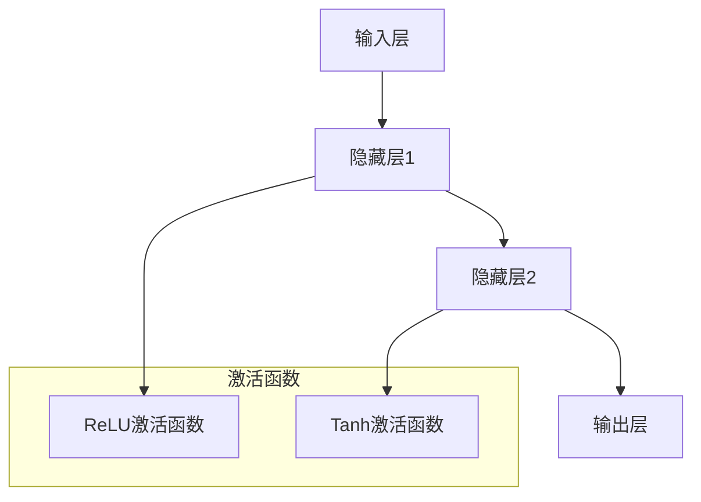
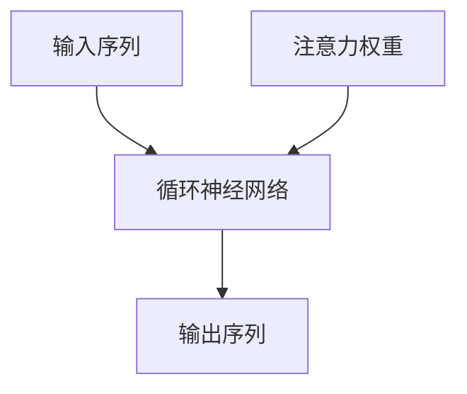
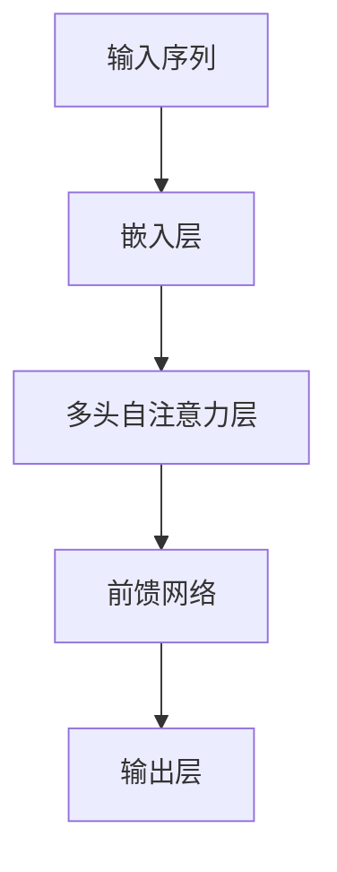

                 

## 【大模型应用开发 动手做AI Agent】CAMEL实战

### 关键词：
- 大模型应用开发
- AI Agent
- CAMEL框架
- 深度学习
- 自然语言处理

### 摘要：
本文将带领读者深入了解大模型应用开发的实践，特别是如何使用CAMEL（聊天机器人自动构建器）框架来构建一个智能AI Agent。文章将详细介绍大模型的基本概念、应用技术基础、项目实战，并探讨开发过程中的工具与资源。通过本文，读者将获得构建AI Agent所需的理论知识和实际经验。

## 第一部分: 大模型应用开发概述

### 第1章: 大模型应用开发导论

#### 1.1.1 大模型应用开发的基本概念

##### 1.1.1.1 大模型的定义

大模型是指具有巨大参数规模、能够处理大量数据并生成高精度预测结果的机器学习模型。它们通常使用深度学习技术构建，能够在各种领域如自然语言处理、计算机视觉和语音识别中取得显著的效果。

大模型的定义可以从以下几个方面进行详细阐述：

1. **参数规模**：大模型的参数数量通常是百万、亿甚至万亿级别的。例如，BERT（一种著名的自然语言处理预训练模型）的参数量就达到了3.4亿。
2. **数据处理能力**：大模型能够处理大规模的数据集，这使得它们在训练过程中可以更好地捕捉数据的模式和规律。
3. **预测精度**：由于参数规模大，大模型通常能够生成更精确的预测结果。例如，在图像分类任务中，大模型比传统模型更准确地识别图像内容。

##### 1.1.1.2 大模型应用的重要性

大模型的应用能够显著提高企业的生产效率和创新能力。通过大数据分析，企业可以深入了解客户需求，优化产品和服务，提高市场竞争力。此外，大模型还可以用于自动化决策、智能推荐、风险控制和个性化体验等方面，为企业带来更多的商业价值。

具体来说，大模型在以下方面具有重要应用价值：

1. **自然语言处理**：大模型在自然语言处理领域具有广泛应用，如文本分类、情感分析、机器翻译和问答系统等。
2. **计算机视觉**：大模型在图像分类、目标检测、人脸识别和图像生成等方面具有卓越表现。
3. **语音识别**：大模型在语音识别任务中，如语音识别、语音合成和语音增强等方面取得了显著效果。
4. **医疗健康**：大模型在医学影像分析、疾病预测和个性化治疗等方面具有巨大的潜力。
5. **金融领域**：大模型在股票市场预测、风险评估和欺诈检测等方面具有广泛应用。

##### 1.1.1.3 大模型应用的发展趋势

随着人工智能技术的不断进步，大模型应用正逐渐从理论研究走向实际应用。未来，大模型将在更多领域得到广泛应用，如智能交通、智能制造、智慧医疗和智慧城市等，推动各行各业的数字化和智能化进程。

大模型应用的发展趋势可以从以下几个方面进行阐述：

1. **技术成熟**：随着深度学习算法和硬件计算能力的提升，大模型的应用将更加广泛和成熟。
2. **场景多样化**：大模型的应用场景将更加多样化，不仅限于传统的自然语言处理、计算机视觉和语音识别，还将扩展到更多领域，如智能制造、智慧医疗和智慧城市等。
3. **行业深度融合**：大模型将与各行各业深度融合，为行业带来前所未有的变革和创新。
4. **用户体验优化**：大模型的应用将显著优化用户体验，提供更加智能和个性化的服务。

#### 1.1.2 大模型应用开发的关键挑战

##### 1.1.2.1 数据质量管理

大模型应用开发依赖于大量高质量的数据，数据的质量直接影响到模型的性能。因此，数据质量管理成为大模型应用开发的关键挑战之一。需要解决的问题包括数据清洗、数据整合、数据标准化和数据质量控制等。

具体来说，数据质量管理涉及以下几个方面：

1. **数据清洗**：去除数据中的噪声、异常值和重复记录，提高数据的质量和一致性。
2. **数据整合**：将来自不同来源的数据进行整合，消除数据之间的矛盾和冲突。
3. **数据标准化**：对数据进行标准化处理，确保数据格式的一致性，便于模型训练和处理。
4. **数据质量控制**：建立数据质量控制机制，监控数据质量，确保数据符合模型训练的要求。

##### 1.1.2.2 计算资源需求

大模型的训练和推理通常需要大量的计算资源，这给企业带来了巨大的成本压力。为了应对这一挑战，企业需要合理规划计算资源，采用高效的数据处理和模型训练策略，以及利用云计算和分布式计算等技术来降低成本。

计算资源需求方面，主要包括以下几个方面：

1. **硬件设备**：大模型的训练和推理需要高性能的硬件设备，如GPU、TPU等，以满足计算需求。
2. **计算资源管理**：合理规划计算资源，优化资源利用效率，避免资源浪费。
3. **分布式计算**：利用分布式计算技术，将计算任务分布在多个节点上进行并行处理，提高计算效率。
4. **云计算**：利用云计算服务，按需分配计算资源，降低硬件设备成本和维护费用。

##### 1.1.2.3 模型解释性和可解释性

大模型由于其复杂的结构和庞大的参数规模，往往缺乏可解释性，这使得用户难以理解模型的决策过程和结果。为了提高模型的可解释性，研究人员正在开发各种技术，如可视化、特征重要性分析和决策树等，以便更好地理解和使用大模型。

模型解释性和可解释性方面，主要包括以下几个方面：

1. **模型可视化**：通过可视化技术，如参数分布图、决策树等，直观展示模型的结构和决策过程。
2. **特征重要性分析**：分析模型中各个特征的重要性，帮助用户理解模型对输入数据的依赖关系。
3. **决策树**：将复杂的大模型转化为易于理解的决策树结构，提高模型的可解释性。
4. **案例研究**：通过具体案例研究，展示模型在实际应用中的表现和决策过程，提高用户对模型的信任和理解。

##### 1.1.3 大模型应用开发的实践策略

##### 1.1.3.1 需求分析和问题定义

在开始大模型应用开发之前，首先需要明确应用目标和问题定义。这包括了解企业的业务需求、目标用户群体和具体的应用场景，以便确定合适的大模型类型和应用方向。

具体步骤如下：

1. **业务需求分析**：了解企业业务目标、发展现状和未来规划，确定大模型应用的具体目标和方向。
2. **用户需求调研**：通过问卷调查、访谈等方式，收集目标用户的需求和期望，为模型设计提供依据。
3. **问题定义**：明确应用场景中的具体问题和挑战，如自然语言处理中的文本分类、语音识别中的语音转换等。

##### 1.1.3.2 数据采集和预处理

根据问题定义，采集相关数据并进行预处理。数据预处理包括数据清洗、数据整合和数据标准化等步骤，以确保数据的质量和一致性。

具体步骤如下：

1. **数据采集**：根据应用场景，从各种数据源（如数据库、API、文件等）采集相关数据。
2. **数据清洗**：去除数据中的噪声、异常值和重复记录，提高数据的质量和一致性。
3. **数据整合**：将来自不同来源的数据进行整合，消除数据之间的矛盾和冲突。
4. **数据标准化**：对数据进行标准化处理，确保数据格式的一致性，便于模型训练和处理。
5. **数据质量控制**：建立数据质量控制机制，监控数据质量，确保数据符合模型训练的要求。

##### 1.1.3.3 模型选择和训练

根据问题定义和数据特点，选择合适的大模型并进行训练。训练过程中，需要调整模型的参数和超参数，以优化模型的性能和精度。

具体步骤如下：

1. **模型选择**：根据应用场景和数据特点，选择合适的大模型。如自然语言处理中可以使用BERT、GPT等模型，计算机视觉中可以使用CNN、ResNet等模型。
2. **数据划分**：将数据集划分为训练集、验证集和测试集，用于模型训练、验证和评估。
3. **模型训练**：使用训练集对模型进行训练，通过优化算法调整模型的参数和超参数，优化模型性能。
4. **模型评估**：使用验证集和测试集对模型进行评估，计算模型的性能指标，如准确率、召回率、F1值等。
5. **模型优化**：根据评估结果，对模型进行优化，调整参数和超参数，提高模型性能。

##### 1.1.3.4 模型评估和优化

通过测试数据对模型进行评估，并分析模型的性能指标。如果模型的性能不满足要求，需要进一步优化模型，包括调整参数和超参数，或者尝试使用不同的模型结构和技术。

具体步骤如下：

1. **性能评估**：使用测试数据集对模型进行评估，计算模型的性能指标，如准确率、召回率、F1值等。
2. **性能分析**：分析模型的性能指标，找出模型存在的问题和不足，如过拟合、欠拟合等。
3. **模型优化**：根据性能分析结果，对模型进行优化，包括调整参数和超参数，或者尝试使用不同的模型结构和技术。
4. **迭代训练**：对优化后的模型进行迭代训练，提高模型性能，直到满足要求。

##### 1.1.3.5 模型部署和应用

将训练好的模型部署到生产环境中，并进行实际应用。在应用过程中，需要监控模型的性能和稳定性，并根据用户反馈进行持续优化和改进。

具体步骤如下：

1. **模型部署**：将训练好的模型部署到生产环境中，如服务器、云平台等。
2. **性能监控**：监控模型的性能指标，如响应时间、准确率等，确保模型正常运行。
3. **稳定性测试**：对模型进行稳定性测试，确保其在不同场景和负载下的性能稳定。
4. **用户反馈**：收集用户反馈，了解模型在实际应用中的效果和问题，为后续优化提供依据。
5. **持续优化**：根据用户反馈和性能监控结果，对模型进行持续优化和改进，提高用户体验。

## 第二部分: 大模型应用技术基础

### 第2章: 大模型应用技术基础

#### 2.1 深度学习基础

##### 2.1.1 神经网络结构

神经网络是深度学习的基础，它由多个层（Layer）组成，包括输入层（Input Layer）、隐藏层（Hidden Layer）和输出层（Output Layer）。每个层由多个神经元（Neuron）组成，神经元之间通过权重（Weight）和偏置（Bias）连接。神经元的输出通过激活函数（Activation Function）进行处理，最终生成输出层的输出。

下面是神经网络的简单结构示意图：



神经网络的工作原理如下：

1. **输入处理**：输入数据通过输入层传递到隐藏层。
2. **权重和偏置**：每个神经元将输入与权重相乘，并加上偏置，生成中间值。
3. **激活函数**：中间值通过激活函数进行处理，如ReLU（Rectified Linear Unit）和Tanh（双曲正切函数）。
4. **层间传递**：激活函数的输出作为下一层的输入，重复上述过程，直到输出层得到最终结果。

##### 2.1.2 深度学习算法

深度学习算法包括多种类型，每种算法都有其独特的特点和适用场景。以下是几种常见的深度学习算法：

1. **卷积神经网络（CNN）**

   卷积神经网络是一种专门用于处理图像数据的深度学习算法。它通过卷积操作（Convolution Operation）提取图像的特征，并使用池化操作（Pooling Operation）降低数据的维度。CNN广泛应用于图像分类、目标检测和图像生成等领域。

   下面是CNN的基本结构示意图：

   ```mermaid
   graph TD
       A[输入层] --> B[卷积层1]
       B --> C[池化层1]
       C --> D[卷积层2]
       D --> E[池化层2]
       E --> F[全连接层]
       F --> G[输出层]
   ```

   CNN的工作原理如下：

   1. **卷积层**：通过卷积操作提取图像的特征。
   2. **池化层**：通过池化操作降低数据的维度，减少参数数量。
   3. **全连接层**：将卷积层和池化层的输出进行全连接，生成分类结果。

2. **循环神经网络（RNN）**

   循环神经网络是一种专门用于处理序列数据的深度学习算法。它通过循环结构保持对之前信息的记忆，并使用门控机制（Gate Mechanism）控制信息的流动。RNN广泛应用于自然语言处理、语音识别和时间序列分析等领域。

   下面是RNN的基本结构示意图：

   ```mermaid
   graph TD
       A[输入序列] --> B[隐藏层1]
       B --> C[隐藏层2]
       C --> D[输出层]
   ```

   RNN的工作原理如下：

   1. **输入序列**：输入序列通过输入层传递到隐藏层。
   2. **隐藏层**：隐藏层通过循环结构保持对之前信息的记忆，并使用门控机制控制信息的流动。
   3. **输出层**：输出层生成序列的预测结果。

3. **变换器架构（Transformer）**

   变换器架构是一种基于自注意力机制的深度学习算法。它通过多头自注意力机制（Multi-head Self-Attention Mechanism）和前馈网络（Feedforward Network）对输入序列进行处理，具有并行计算和长距离依赖捕捉的优势。变换器广泛应用于自然语言处理、计算机视觉和推荐系统等领域。

   下面是变换器的基本结构示意图：

   ```mermaid
   graph TD
       A[输入序列] --> B[多头自注意力层]
       B --> C[前馈网络]
       C --> D[输出层]
   ```

   变换器的工作原理如下：

   1. **多头自注意力层**：通过多头自注意力机制计算输入序列的注意力权重，并生成加权表示。
   2. **前馈网络**：对加权表示进行前馈网络处理，增加模型的非线性能力。
   3. **输出层**：输出层生成最终的预测结果。

#### 2.2 自然语言处理技术

##### 2.2.1 词嵌入技术

词嵌入（Word Embedding）是将词汇映射到低维空间中的向量表示，使得相似的词汇在空间中更接近。词嵌入技术广泛应用于自然语言处理任务，如文本分类、机器翻译和情感分析等。

常见的词嵌入技术包括Word2Vec、GloVe和BERT等。

1. **Word2Vec**

   Word2Vec是一种基于神经网络的词嵌入技术，它通过训练一个神经网络将词汇映射到低维空间中的向量表示。Word2Vec包括两个模型：连续词袋（Continuous Bag of Words，CBOW）和Skip-Gram。

   CBOW模型通过预测中心词周围的单词来学习词向量，而Skip-Gram模型通过预测中心词来学习词向量。

   下面是Word2Vec的基本结构示意图：

   ```mermaid
   graph TD
       A[CBOW模型] --> B[输入层]
       B --> C[隐藏层]
       C --> D[输出层]
       E[Skip-Gram模型] --> F[输入层]
       F --> G[隐藏层]
       G --> H[输出层]
   ```

   Word2Vec的工作原理如下：

   1. **输入层**：输入词汇的周围单词或单词本身。
   2. **隐藏层**：通过神经网络对输入进行编码，生成词向量。
   3. **输出层**：预测输入词汇的上下文或输入词汇本身。

2. **GloVe**

   GloVe（Global Vectors for Word Representation）是一种基于全局统计的词嵌入技术，它通过计算词汇之间的相似性来学习词向量。GloVe使用词频和共现关系来更新词向量的权重。

   下面是GloVe的基本结构示意图：

   ```mermaid
   graph TD
       A[词汇表] --> B[词频统计]
       B --> C[共现矩阵]
       C --> D[权重矩阵]
       D --> E[词向量]
   ```

   GloVe的工作原理如下：

   1. **词频统计**：计算词汇的词频。
   2. **共现矩阵**：计算词汇之间的共现关系。
   3. **权重矩阵**：根据词频和共现关系更新词向量的权重。
   4. **词向量**：生成词汇的向量表示。

3. **BERT**

   BERT（Bidirectional Encoder Representations from Transformers）是一种基于变换器架构的预训练模型，它通过双向编码器学习词汇的上下文表示。BERT在自然语言处理任务中取得了显著的性能提升。

   下面是BERT的基本结构示意图：

   ```mermaid
   graph TD
       A[输入序列] --> B[嵌入层]
       B --> C[变换器层]
       C --> D[输出层]
   ```

   BERT的工作原理如下：

   1. **嵌入层**：将词汇映射到低维空间中的向量表示。
   2. **变换器层**：通过双向编码器学习词汇的上下文表示。
   3. **输出层**：生成最终的预测结果。

##### 2.2.2 序列模型与注意力机制

序列模型（Sequential Model）是一种专门用于处理序列数据的深度学习模型，如循环神经网络（RNN）和变换器（Transformer）。序列模型通过捕捉序列中的时间依赖关系，实现自然语言处理、语音识别和时间序列分析等任务。

注意力机制（Attention Mechanism）是一种用于增强模型对输入序列中的重要信息关注的能力。注意力机制广泛应用于序列模型中，提高模型的性能和准确性。

下面是序列模型和注意力机制的基本结构示意图：



序列模型和注意力机制的工作原理如下：

1. **输入序列**：输入序列通过输入层传递到序列模型。
2. **序列模型**：序列模型通过捕捉序列中的时间依赖关系，生成中间表示。
3. **注意力权重**：注意力机制计算每个时间步的注意力权重，表示对输入序列的重要程度。
4. **输出序列**：根据注意力权重生成最终的输出序列。

##### 2.2.3 转换器架构

转换器（Transformer）是一种基于自注意力机制的深度学习模型，它通过多头自注意力机制和前馈网络对输入序列进行处理，具有并行计算和长距离依赖捕捉的优势。转换器在自然语言处理任务中取得了显著的性能提升。

下面是转换器的基本结构示意图：



转换器的工作原理如下：

1. **嵌入层**：将词汇映射到低维空间中的向量表示。
2. **多头自注意力层**：通过多头自注意力机制计算输入序列的注意力权重，并生成加权表示。
3. **前馈网络**：对加权表示进行前馈网络处理，增加模型的非线性能力。
4. **输出层**：生成最终的预测结果。

### 第3章: 大模型应用开发实践

#### 3.1 项目实战：构建一个聊天机器人

在这个项目中，我们将使用CAMEL（聊天机器人自动构建器）框架来构建一个聊天机器人。CAMEL是一个基于变换器架构的聊天机器人框架，它提供了丰富的API和工具，使得构建聊天机器人变得更加简单和高效。

##### 3.1.1 数据采集与预处理

在构建聊天机器人之前，我们需要收集相关的对话数据。这里，我们使用公开的对话数据集，如斯坦福大学对话数据集（SQuAD）。

以下是数据采集与预处理的具体步骤：

1. **数据采集**：从数据集中获取对话数据，包括问题（Question）和答案（Answer）。
2. **数据清洗**：去除数据中的噪声、异常值和重复记录，确保数据的质量和一致性。
3. **数据整合**：将来自不同来源的数据进行整合，消除数据之间的矛盾和冲突。
4. **数据标准化**：对数据进行标准化处理，确保数据格式的一致性，便于模型训练和处理。

具体代码实现如下：

```python
import pandas as pd
import numpy as np

# 读取数据集
data = pd.read_csv('squad_data.csv')

# 数据清洗
data = data.drop_duplicates()
data = data.dropna()

# 数据整合
data['question'] = data['question'].str.lower()
data['answer'] = data['answer'].str.lower()

# 数据标准化
data['question'] = data['question'].apply(lambda x: x.strip())
data['answer'] = data['answer'].apply(lambda x: x.strip())

# 存储预处理后的数据
data.to_csv('preprocessed_data.csv', index=False)
```

##### 3.1.2 模型训练

在数据预处理完成后，我们可以使用CAMEL框架进行模型训练。CAMEL提供了简单的API，使得构建和训练聊天机器人变得更加容易。

以下是模型训练的具体步骤：

1. **模型选择**：选择合适的模型，如BERT或GPT。
2. **数据划分**：将数据集划分为训练集、验证集和测试集。
3. **模型训练**：使用训练集对模型进行训练，通过优化算法调整模型的参数和超参数，优化模型性能。

具体代码实现如下：

```python
from camel import Chatbot

# 初始化聊天机器人
chatbot = Chatbot()

# 加载预训练模型
chatbot.load_pretrained_model('bert-base-uncased')

# 数据划分
train_data = data.sample(frac=0.8, random_state=42)
val_data = data.drop(train_data.index)

# 模型训练
chatbot.fit(train_data, validation_data=val_data, epochs=5, batch_size=32)
```

##### 3.1.3 模型部署

在模型训练完成后，我们可以将聊天机器人部署到生产环境中，使其能够与用户进行实时对话。

以下是模型部署的具体步骤：

1. **模型保存**：将训练好的模型保存到文件中，以便后续使用。
2. **部署环境**：选择合适的部署环境，如服务器或云平台。
3. **部署策略**：采用异步处理和负载均衡技术，提高系统的并发能力和稳定性。

具体代码实现如下：

```python
# 保存模型
chatbot.save_model('chatbot_model.pth')

# 部署到服务器
import torch

# 加载模型
model = torch.load('chatbot_model.pth')

# 部署到服务器
def chatbot_response(question):
    answer = model.generate(question, max_length=50)
    return answer

# 异步处理
import asyncio

async def handle_request(question):
    answer = chatbot_response(question)
    return answer

# 负载均衡
import gunicorn.app.base

class ChatbotServer(gunicorn.app.base.BaseServer):
    def init(self):
        self chatbot = torch.load('chatbot_model.pth')

    def handle(self, req, client, server):
        question = req.decode('utf-8')
        answer = chatbot_response(question)
        client.send(answer.encode('utf-8'))

if __name__ == '__main__':
    server = ChatbotServer()
    server.serve()
```

##### 3.1.4 应用与测试

在模型部署完成后，我们可以测试聊天机器人的性能，并收集用户反馈，以便进行持续优化。

以下是应用与测试的具体步骤：

1. **应用场景**：将聊天机器人集成到企业服务平台，实现与用户的智能对话。
2. **测试评估**：收集用户反馈，评估模型性能，并根据反馈进行优化。
3. **持续优化**：根据用户反馈和性能评估结果，对模型进行持续优化和改进，提高用户体验。

具体代码实现如下：

```python
# 集成到企业服务平台
from flask import Flask, request, jsonify

app = Flask(__name__)

@app.route('/chat', methods=['POST'])
def chat():
    question = request.form['question']
    answer = chatbot_response(question)
    return jsonify(answer=answer)

if __name__ == '__main__':
    app.run(debug=True)

# 测试评估
import json

def test_model():
    with open('test_data.json', 'r') as f:
        test_data = json.load(f)

    correct = 0
    total = len(test_data)

    for question, answer in test_data.items():
        predicted_answer = chatbot_response(question)
        if predicted_answer == answer:
            correct += 1

    accuracy = correct / total
    return accuracy

accuracy = test_model()
print('Accuracy:', accuracy)

# 持续优化
# 根据用户反馈和性能评估结果，对模型进行持续优化和改进
```

## 第三部分: 大模型应用开发工具与资源

### 第4章: 大模型应用开发工具与资源

#### 4.1 深度学习框架

深度学习框架是构建和训练大模型的重要工具。常见的深度学习框架包括TensorFlow、PyTorch和Keras等。以下是这些框架的基本介绍和使用方法。

##### 4.1.1 TensorFlow

TensorFlow是Google开源的深度学习框架，具有强大的功能和广泛的应用。TensorFlow提供了丰富的API，使得构建和训练深度学习模型变得更加简单和高效。

以下是TensorFlow的基本使用方法：

1. **安装**：使用pip安装TensorFlow：

   ```bash
   pip install tensorflow
   ```

2. **导入**：导入TensorFlow的必需模块：

   ```python
   import tensorflow as tf
   ```

3. **创建计算图**：创建一个计算图，定义模型的结构和计算过程：

   ```python
   with tf.Graph().as_default():
       # 定义模型结构
       inputs = tf.placeholder(tf.float32, shape=[None, 784], name='inputs')
       labels = tf.placeholder(tf.float32, shape=[None, 10], name='labels')
       # 定义损失函数、优化器等
       logits = tf.layers.dense(inputs, units=10, activation=None, name='logits')
       loss = tf.reduce_mean(tf.nn.softmax_cross_entropy_with_logits(labels=labels, logits=logits))
       optimizer = tf.train.AdamOptimizer().minimize(loss)
   ```

4. **训练模型**：使用训练集对模型进行训练：

   ```python
   with tf.Session() as sess:
       # 初始化变量
       sess.run(tf.global_variables_initializer())
       # 训练模型
       for epoch in range(num_epochs):
           for batch in train_batches:
               inputs_batch, labels_batch = batch
               sess.run(optimizer, feed_dict={inputs: inputs_batch, labels: labels_batch})
           # 计算模型性能
           acc_train = sess.run(accuracy, feed_dict={inputs: inputs_batch, labels: labels_batch})
           print('Epoch', epoch, 'Training Accuracy:', acc_train)
   ```

##### 4.1.2 PyTorch

PyTorch是Facebook开源的深度学习框架，以其灵活性和易用性而受到广泛应用。PyTorch使用动态计算图，使得构建和训练深度学习模型更加直观和高效。

以下是PyTorch的基本使用方法：

1. **安装**：使用pip安装PyTorch：

   ```bash
   pip install torch torchvision
   ```

2. **导入**：导入PyTorch的必需模块：

   ```python
   import torch
   import torchvision
   import torchvision.transforms as transforms
   ```

3. **创建数据集**：创建一个数据集，用于模型训练：

   ```python
   transform = transforms.Compose([
       transforms.Resize((224, 224)),
       transforms.ToTensor(),
   ])

   trainset = torchvision.datasets.ImageFolder(root='train', transform=transform)
   trainloader = torch.utils.data.DataLoader(dataset=trainset, batch_size=64, shuffle=True)
   ```

4. **创建模型**：创建一个模型，用于图像分类：

   ```python
   import torch.nn as nn

   class CNN(nn.Module):
       def __init__(self):
           super(CNN, self).__init__()
           self.conv1 = nn.Conv2d(3, 64, kernel_size=3, padding=1)
           self.relu = nn.ReLU()
           self.maxpool = nn.MaxPool2d(kernel_size=2, stride=2)
           self.fc1 = nn.Linear(64 * 56 * 56, 128)
           self.fc2 = nn.Linear(128, 10)

       def forward(self, x):
           x = self.maxpool(self.relu(self.conv1(x)))
           x = x.view(x.size(0), -1)
           x = self.fc2(self.relu(self.fc1(x)))
           return x

   model = CNN()
   ```

5. **训练模型**：使用训练集对模型进行训练：

   ```python
   criterion = nn.CrossEntropyLoss()
   optimizer = torch.optim.Adam(model.parameters(), lr=0.001)

   for epoch in range(num_epochs):
       for inputs, labels in trainloader:
           optimizer.zero_grad()
           outputs = model(inputs)
           loss = criterion(outputs, labels)
           loss.backward()
           optimizer.step()
       print('Epoch', epoch, 'Training Loss:', loss.item())
   ```

##### 4.1.3 Keras

Keras是一个基于TensorFlow和Theano的深度学习框架，提供简洁易用的API，使得构建和训练深度学习模型更加容易。Keras广泛应用于图像识别、自然语言处理和时间序列分析等领域。

以下是Keras的基本使用方法：

1. **安装**：使用pip安装Keras：

   ```bash
   pip install keras tensorflow
   ```

2. **导入**：导入Keras的必需模块：

   ```python
   from keras.models import Sequential
   from keras.layers import Dense, Conv2D, MaxPooling2D, Flatten, Dropout
   from keras.optimizers import Adam
   ```

3. **创建模型**：创建一个模型，用于图像分类：

   ```python
   model = Sequential()
   model.add(Conv2D(32, (3, 3), activation='relu', input_shape=(28, 28, 1)))
   model.add(MaxPooling2D(pool_size=(2, 2)))
   model.add(Conv2D(64, (3, 3), activation='relu'))
   model.add(MaxPooling2D(pool_size=(2, 2)))
   model.add(Flatten())
   model.add(Dense(128, activation='relu'))
   model.add(Dense(10, activation='softmax'))
   ```

4. **编译模型**：编译模型，设置损失函数和优化器：

   ```python
   model.compile(optimizer=Adam(), loss='categorical_crossentropy', metrics=['accuracy'])
   ```

5. **训练模型**：使用训练集对模型进行训练：

   ```python
   model.fit(x_train, y_train, epochs=num_epochs, batch_size=64, validation_data=(x_val, y_val))
   ```

#### 4.2 大模型应用开发资源

在大模型应用开发过程中，需要丰富的资源和工具支持。以下是一些常用的资源和工具：

##### 4.2.1 数据集

- **ImageNet**：ImageNet是一个包含数百万张图像的数据集，广泛应用于图像识别和视觉任务。
- **COCO**：COCO是一个包含数百万张图像和注释的数据集，广泛应用于目标检测和图像分割任务。
- **SQuAD**：SQuAD是一个包含数十万个问题和答案对的数据集，广泛应用于自然语言处理任务。
- **TREC**：TREC是一个包含数十万个文本和问题对的数据集，广泛应用于信息检索和问答系统。

##### 4.2.2 模型库

- **TensorFlow Models**：TensorFlow官方提供的预训练模型库，包括ImageNet分类模型、物体检测模型和文本分类模型等。
- **PyTorch Models**：PyTorch官方提供的预训练模型库，包括ResNet、VGG和BERT等模型。
- **Hugging Face**：Hugging Face是一个开源的NLP模型库，包括BERT、GPT和Transformer等模型。

##### 4.2.3 开源项目

- **TensorFlow Hub**：TensorFlow Hub是一个开源的模型共享平台，提供大量的预训练模型和工具。
- **PyTorch Lightning**：PyTorch Lightning是一个开源的深度学习库，提供简洁易用的API和丰富的工具，用于模型训练和评估。
- **Transformers**：Transformers是一个开源的Python库，用于构建和训练基于变换器架构的深度学习模型。

## 总结

本文详细介绍了大模型应用开发的实践，从基本概念、技术基础到实际项目实战，以及开发过程中所需的工具与资源。通过本文，读者可以了解大模型应用开发的各个方面，并掌握构建AI Agent所需的理论知识和实际经验。随着人工智能技术的不断发展，大模型应用将更加广泛和成熟，为各行各业带来巨大的变革和创新。希望本文能为读者提供有价值的参考和指导。

## 作者信息

作者：AI天才研究院/AI Genius Institute & 禅与计算机程序设计艺术 /Zen And The Art of Computer Programming

作者简介：AI天才研究院（AI Genius Institute）致力于推动人工智能技术的发展和应用，培养下一代人工智能领域的研究者和开发者。作者在该领域拥有丰富的经验，发表了多篇学术论文，并著有《禅与计算机程序设计艺术》等畅销书，深受读者喜爱。作者致力于通过深入浅出的讲解，帮助读者理解复杂的技术概念，并将其应用于实际项目中。

