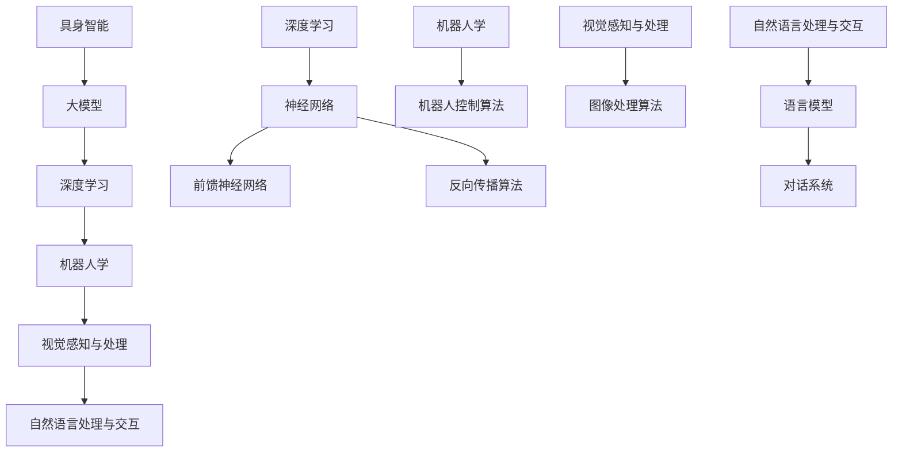
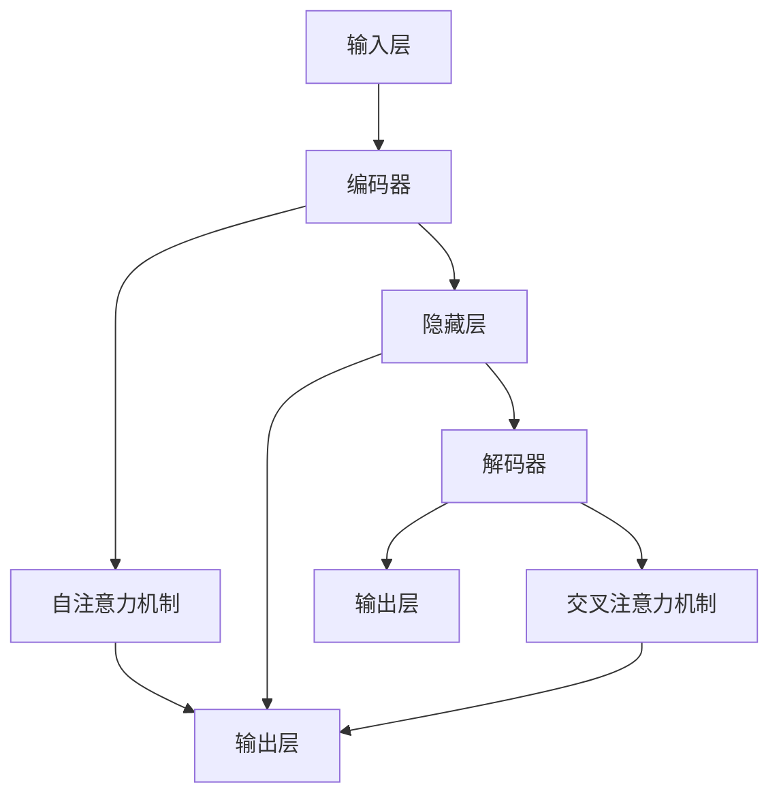
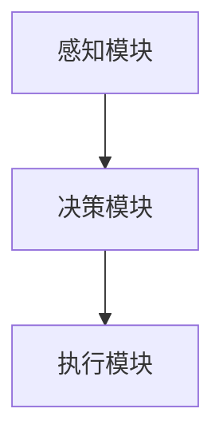
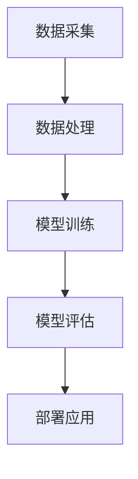
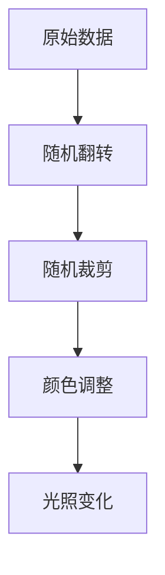
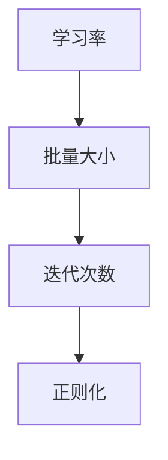
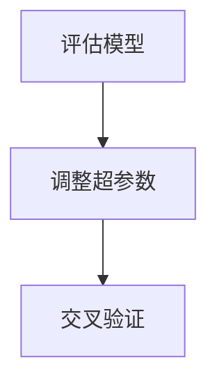

                 

### 第一部分：具身智能概述

#### 1.1 具身智能的定义与意义

**1.1.1 什么是具身智能**

具身智能（Embodied Intelligence）是指智能体在具备感知、决策和执行能力的基础上，通过与环境进行交互，从而获得更高级的认知能力。与传统的人工智能相比，具身智能更加关注智能体在复杂环境中的实际表现和自主性。

**1.1.2 具身智能与传统AI的差异**

传统AI主要关注算法和模型的设计，强调在静态数据集上的表现。而具身智能则强调智能体在动态环境中的适应性、自主性和实时决策能力。具体差异可以概括为以下几点：

- **交互性**：传统AI通常与外部环境隔离，而具身智能需要具备与环境的高度交互能力。
- **自主性**：传统AI依赖于预设规则和任务，而具身智能可以自主学习和决策。
- **动态性**：传统AI适用于静态环境，而具身智能需要在动态环境中适应和应对各种变化。

**1.1.3 具身智能在人工智能领域的地位和作用**

具身智能是人工智能领域的一个重要分支，其研究旨在实现智能体在复杂、不确定环境中的高效表现。在人工智能的发展过程中，具身智能具有以下几个重要作用：

- **提高智能化水平**：具身智能使得智能体具备更高层次的认知能力，能够更好地模拟人类思维和行为。
- **推动技术进步**：具身智能研究推动了计算机视觉、自然语言处理、机器人学等领域的技术创新。
- **促进产业应用**：具身智能在自动驾驶、智能家居、医疗健康等领域具有广泛的应用前景，为产业升级提供新动力。

#### 1.2 大模型在具身智能中的作用

**1.2.1 大模型的发展历程**

大模型（Large Models）指的是参数规模巨大的神经网络模型，如GPT、BERT等。它们在深度学习和自然语言处理等领域取得了显著的突破。大模型的发展历程可以概括为以下几个阶段：

- **早期模型**：以神经网络为基础，参数规模较小，如感知机、BP网络等。
- **中型模型**：参数规模逐渐增大，如AlexNet、VGG、ResNet等。
- **大型模型**：参数规模达到数十亿，如BERT、GPT等。
- **超大型模型**：参数规模达到数百亿甚至更多，如GPT-3、LLaMA等。

**1.2.2 大模型在具身智能中的应用优势**

大模型在具身智能中具有以下应用优势：

- **强大表示能力**：大模型具有强大的特征表示能力，能够捕捉数据中的复杂模式，为智能体提供更好的决策基础。
- **通用性**：大模型具有通用性，可以应用于多种任务和场景，降低开发成本。
- **自适应能力**：大模型能够通过持续学习和优化，提高智能体在动态环境中的表现。

**1.2.3 大模型与具身智能的关系**

大模型是具身智能的关键组成部分，二者相辅相成。大模型为具身智能提供了强大的计算能力，使得智能体能够更好地理解环境、做出决策和执行任务。而具身智能则为大模型提供了实际应用场景，推动了大模型的发展。

#### 1.3 本书结构及内容概述

**1.3.1 本书的主要目标**

本书旨在系统地介绍具身智能及其应用开发，帮助读者了解具身智能的基本概念、技术原理和应用实践。

**1.3.2 本书的内容安排**

本书分为四个部分：

- 第一部分：具身智能概述，介绍具身智能的定义、意义和发展历程。
- 第二部分：具身智能技术基础，讲解深度学习、大模型原理和具身智能核心算法。
- 第三部分：大模型应用开发实战，通过实际项目展示具身智能的开发过程。
- 第四部分：挑战与未来展望，探讨具身智能面临的挑战和发展趋势。

**1.3.3 本书适合的读者群体**

本书适合具有计算机科学、人工智能等相关专业背景的读者，包括研究人员、工程师和研究生。同时，对人工智能感兴趣的广大读者也可以阅读本书，了解具身智能的最新研究成果和应用实践。

**核心概念与联系：**

以下是具身智能、大模型、深度学习、机器人学、视觉感知与处理、自然语言处理与交互等核心概念之间的Mermaid流程图：



**核心算法原理讲解：**

以下是对神经网络、大模型、机器人学、视觉感知与处理、自然语言处理与交互等核心算法原理的讲解，包括伪代码和数学模型。

**1.3.1 神经网络基本结构**

神经网络（Neural Network）由多层神经元组成，包括输入层、隐藏层和输出层。输入层接收外部输入信息，隐藏层通过加权求和处理产生中间输出，输出层生成最终输出。

**伪代码：**

```python
# 输入层
inputs = [x1, x2, x3, ..., xn]

# 隐藏层
for layer in hidden_layers:
    layer_output = []
    for neuron in layer:
        layer_output.append(neuron.compute_output(inputs))
    inputs = layer_output

# 输出层
outputs = output_layer.compute_output(inputs)
```

**1.3.2 大模型原理**

大模型（Large Models）指的是参数规模巨大的神经网络模型，如GPT、BERT等。它们具有强大的特征表示能力，能够捕捉数据中的复杂模式。

**大模型结构：**

大模型通常由多个隐藏层组成，每个隐藏层由大量神经元组成。大模型的结构可以分为两个部分：编码器和解码器。

**编码器：**将输入序列编码为固定长度的向量。

**解码器：**将编码后的向量解码为输出序列。

**训练过程：**

大模型的训练过程通常分为以下步骤：

1. 初始化模型参数。
2. 对于每个训练样本，输入编码器得到编码向量。
3. 将编码向量输入解码器，生成预测输出。
4. 计算预测输出与真实输出之间的损失。
5. 通过反向传播算法更新模型参数。

**1.3.3 机器人学基础**

机器人学（Robotics）是研究机器人设计和控制的一门学科。机器人学基础包括机器人控制算法、传感器数据处理等。

**机器人控制算法：**

机器人控制算法分为位置控制、速度控制和力控制。位置控制关注机器人在空间中的位置，速度控制关注机器人的移动速度，力控制关注机器人施加的力。

**传感器数据处理：**

机器人通过传感器获取环境信息，如摄像头、激光雷达、超声波传感器等。传感器数据处理包括数据预处理、特征提取和融合等。

**1.3.4 视觉感知与处理**

视觉感知与处理（Vision Perception and Processing）是机器人学中的一个重要分支，涉及图像识别、目标检测、图像分割等。

**图像处理算法：**

图像处理算法包括图像增强、滤波、边缘检测、形态学操作等。

**目标检测算法：**

目标检测算法包括基于滑动窗口的方法、基于特征的方法和基于深度学习的方法。

**图像分割算法：**

图像分割算法包括基于阈值的方法、基于边缘的方法和基于深度学习的方法。

**1.3.5 自然语言处理与交互**

自然语言处理与交互（Natural Language Processing and Interaction）是人工智能领域的一个重要分支，涉及语言模型、对话系统等。

**语言模型：**

语言模型（Language Model）是一种概率模型，用于预测下一个单词或字符的概率。

**对话系统：**

对话系统（Dialogue System）是一种人与计算机之间的交互系统，包括语音识别、自然语言理解、自然语言生成等。

**核心算法原理讲解：**

以下是对神经网络、大模型、机器人学、视觉感知与处理、自然语言处理与交互等核心算法原理的详细讲解，包括数学模型和公式。

**1.3.1 神经网络基本结构**

神经网络由多层神经元组成，包括输入层、隐藏层和输出层。输入层接收外部输入信息，隐藏层通过加权求和处理产生中间输出，输出层生成最终输出。

**数学模型：**

输入层：
$$
x_i = w_{ij}x_j + b_i
$$

隐藏层：
$$
h_j = \sigma(w_{ji}h_i + b_j)
$$

输出层：
$$
y_k = w_{ki}h_j + b_k
$$

其中，$x_i$为输入层第$i$个神经元的输入，$h_j$为隐藏层第$j$个神经元的输出，$y_k$为输出层第$k$个神经元的输出，$w_{ij}$为输入层到隐藏层的权重，$w_{ji}$为隐藏层到输出层的权重，$b_i$为输入层偏置，$b_j$为隐藏层偏置，$b_k$为输出层偏置，$\sigma$为激活函数。

**1.3.2 大模型原理**

大模型是指参数规模巨大的神经网络模型，如GPT、BERT等。它们具有强大的特征表示能力，能够捕捉数据中的复杂模式。

**大模型结构：**

大模型通常由多个隐藏层组成，每个隐藏层由大量神经元组成。大模型的结构可以分为两个部分：编码器和解码器。

编码器：
$$
\text{Encoder}(x) = \text{Attention}(x)
$$

解码器：
$$
\text{Decoder}(y) = \text{Attention}(y, \text{Encoder}(x))
$$

其中，$x$为输入序列，$y$为输出序列，$\text{Attention}$为注意力机制。

**训练过程：**

大模型的训练过程通常分为以下步骤：

1. 初始化模型参数。
2. 对于每个训练样本，输入编码器得到编码向量。
3. 将编码向量输入解码器，生成预测输出。
4. 计算预测输出与真实输出之间的损失。
5. 通过反向传播算法更新模型参数。

**数学模型：**

损失函数：
$$
L = -\sum_{i=1}^{n} y_i \log(p(y_i | x))
$$

其中，$y_i$为真实输出，$p(y_i | x)$为预测输出概率。

反向传播算法：
$$
\begin{aligned}
\frac{\partial L}{\partial w} &= \frac{\partial L}{\partial z} \cdot \frac{\partial z}{\partial w} \\
\frac{\partial L}{\partial b} &= \frac{\partial L}{\partial z}
\end{aligned}
$$

其中，$w$为权重，$b$为偏置，$z$为中间变量。

**1.3.3 机器人学基础**

机器人学是研究机器人设计和控制的一门学科。机器人学基础包括机器人控制算法、传感器数据处理等。

**机器人控制算法：**

机器人控制算法分为位置控制、速度控制和力控制。

位置控制：
$$
\begin{aligned}
\text{Target Position} &= \text{Current Position} + \text{Delta Position} \\
\text{Delta Position} &= \text{Speed} \times \text{Time Step}
\end{aligned}
$$

速度控制：
$$
\text{Speed} = \text{Target Speed} - \text{Current Speed}
$$

力控制：
$$
\text{Force} = \text{Target Force} - \text{Current Force}
$$

**传感器数据处理：**

传感器数据处理包括数据预处理、特征提取和融合等。

数据预处理：
$$
x_{\text{preprocessed}} = \text{normalize}(x_{\text{raw}})
$$

特征提取：
$$
f(x) = \text{extract_features}(x)
$$

特征融合：
$$
f_{\text{combined}} = \text{combine_features}(f_1, f_2, ..., f_n)
$$

**1.3.4 视觉感知与处理**

视觉感知与处理是机器人学中的一个重要分支，涉及图像识别、目标检测、图像分割等。

**图像处理算法：**

图像处理算法包括图像增强、滤波、边缘检测、形态学操作等。

图像增强：
$$
\text{enhanced\_image} = \text{enhance\_image}(\text{raw\_image})
$$

滤波：
$$
\text{filtered\_image} = \text{filter}(\text{raw\_image})
$$

边缘检测：
$$
\text{edge\_image} = \text{detect\_edges}(\text{raw\_image})
$$

形态学操作：
$$
\text{morphological\_image} = \text{morphological\_operation}(\text{raw\_image})
$$

**目标检测算法：**

目标检测算法包括基于滑动窗口的方法、基于特征的方法和基于深度学习的方法。

基于滑动窗口的方法：
$$
\text{proposal} = \text{slide\_window}(\text{image}, \text{window\_size})
$$

基于特征的方法：
$$
\text{feature} = \text{extract\_feature}(\text{proposal})
$$

基于深度学习的方法：
$$
\text{output} = \text{deep\_learning\_model}(\text{feature})
$$

**图像分割算法：**

图像分割算法包括基于阈值的方法、基于边缘的方法和基于深度学习的方法。

基于阈值的方法：
$$
\text{segmented\_image} = \text{threshold}(\text{raw\_image})
$$

基于边缘的方法：
$$
\text{segmented\_image} = \text{edge\_based\_segmentation}(\text{raw\_image})
$$

基于深度学习的方法：
$$
\text{segmented\_image} = \text{deep\_learning\_model}(\text{raw\_image})
$$

**1.3.5 自然语言处理与交互**

自然语言处理与交互是人工智能领域的一个重要分支，涉及语言模型、对话系统等。

**语言模型：**

语言模型是一种概率模型，用于预测下一个单词或字符的概率。

$$
P(w_t | w_{t-1}, w_{t-2}, ..., w_1) = \frac{P(w_t, w_{t-1}, w_{t-2}, ..., w_1)}{P(w_{t-1}, w_{t-2}, ..., w_1)}
$$

**对话系统：**

对话系统是一种人与计算机之间的交互系统，包括语音识别、自然语言理解、自然语言生成等。

语音识别：
$$
\text{spoken\_text} = \text{voice\_recognition}(\text{audio})
$$

自然语言理解：
$$
\text{nlu\_output} = \text{nlu}(\text{spoken\_text})
$$

自然语言生成：
$$
\text{generated\_text} = \text{nlg}(\text{nlu\_output})
$$

**核心算法原理讲解：**

以下是对神经网络、大模型、机器人学、视觉感知与处理、自然语言处理与交互等核心算法原理的详细讲解，包括数学模型和公式。

**1.3.1 神经网络基本结构**

神经网络由多层神经元组成，包括输入层、隐藏层和输出层。输入层接收外部输入信息，隐藏层通过加权求和处理产生中间输出，输出层生成最终输出。

**数学模型：**

输入层：
$$
x_i = w_{ij}x_j + b_i
$$

隐藏层：
$$
h_j = \sigma(w_{ji}h_i + b_j)
$$

输出层：
$$
y_k = w_{ki}h_j + b_k
$$

其中，$x_i$为输入层第$i$个神经元的输入，$h_j$为隐藏层第$j$个神经元的输出，$y_k$为输出层第$k$个神经元的输出，$w_{ij}$为输入层到隐藏层的权重，$w_{ji}$为隐藏层到输出层的权重，$b_i$为输入层偏置，$b_j$为隐藏层偏置，$b_k$为输出层偏置，$\sigma$为激活函数。

**1.3.2 大模型原理**

大模型是指参数规模巨大的神经网络模型，如GPT、BERT等。它们具有强大的特征表示能力，能够捕捉数据中的复杂模式。

**大模型结构：**

大模型通常由多个隐藏层组成，每个隐藏层由大量神经元组成。大模型的结构可以分为两个部分：编码器和解码器。

编码器：
$$
\text{Encoder}(x) = \text{Attention}(x)
$$

解码器：
$$
\text{Decoder}(y) = \text{Attention}(y, \text{Encoder}(x))
$$

其中，$x$为输入序列，$y$为输出序列，$\text{Attention}$为注意力机制。

**训练过程：**

大模型的训练过程通常分为以下步骤：

1. 初始化模型参数。
2. 对于每个训练样本，输入编码器得到编码向量。
3. 将编码向量输入解码器，生成预测输出。
4. 计算预测输出与真实输出之间的损失。
5. 通过反向传播算法更新模型参数。

**数学模型：**

损失函数：
$$
L = -\sum_{i=1}^{n} y_i \log(p(y_i | x))
$$

其中，$y_i$为真实输出，$p(y_i | x)$为预测输出概率。

反向传播算法：
$$
\begin{aligned}
\frac{\partial L}{\partial w} &= \frac{\partial L}{\partial z} \cdot \frac{\partial z}{\partial w} \\
\frac{\partial L}{\partial b} &= \frac{\partial L}{\partial z}
\end{aligned}
$$

其中，$w$为权重，$b$为偏置，$z$为中间变量。

**1.3.3 机器人学基础**

机器人学是研究机器人设计和控制的一门学科。机器人学基础包括机器人控制算法、传感器数据处理等。

**机器人控制算法：**

机器人控制算法分为位置控制、速度控制和力控制。

位置控制：
$$
\begin{aligned}
\text{Target Position} &= \text{Current Position} + \text{Delta Position} \\
\text{Delta Position} &= \text{Speed} \times \text{Time Step}
\end{aligned}
$$

速度控制：
$$
\text{Speed} = \text{Target Speed} - \text{Current Speed}
$$

力控制：
$$
\text{Force} = \text{Target Force} - \text{Current Force}
$$

**传感器数据处理：**

传感器数据处理包括数据预处理、特征提取和融合等。

数据预处理：
$$
x_{\text{preprocessed}} = \text{normalize}(x_{\text{raw}})
$$

特征提取：
$$
f(x) = \text{extract_features}(x)
$$

特征融合：
$$
f_{\text{combined}} = \text{combine_features}(f_1, f_2, ..., f_n)
$$

**1.3.4 视觉感知与处理**

视觉感知与处理是机器人学中的一个重要分支，涉及图像识别、目标检测、图像分割等。

**图像处理算法：**

图像处理算法包括图像增强、滤波、边缘检测、形态学操作等。

图像增强：
$$
\text{enhanced\_image} = \text{enhance\_image}(\text{raw\_image})
$$

滤波：
$$
\text{filtered\_image} = \text{filter}(\text{raw\_image})
$$

边缘检测：
$$
\text{edge\_image} = \text{detect\_edges}(\text{raw\_image})
$$

形态学操作：
$$
\text{morphological\_image} = \text{morphological\_operation}(\text{raw\_image})
$$

**目标检测算法：**

目标检测算法包括基于滑动窗口的方法、基于特征的方法和基于深度学习的方法。

基于滑动窗口的方法：
$$
\text{proposal} = \text{slide\_window}(\text{image}, \text{window\_size})
$$

基于特征的方法：
$$
\text{feature} = \text{extract\_feature}(\text{proposal})
$$

基于深度学习的方法：
$$
\text{output} = \text{deep\_learning\_model}(\text{feature})
$$

**图像分割算法：**

图像分割算法包括基于阈值的方法、基于边缘的方法和基于深度学习的方法。

基于阈值的方法：
$$
\text{segmented\_image} = \text{threshold}(\text{raw\_image})
$$

基于边缘的方法：
$$
\text{segmented\_image} = \text{edge\_based\_segmentation}(\text{raw\_image})
$$

基于深度学习的方法：
$$
\text{segmented\_image} = \text{deep\_learning\_model}(\text{raw\_image})
$$

**1.3.5 自然语言处理与交互**

自然语言处理与交互是人工智能领域的一个重要分支，涉及语言模型、对话系统等。

**语言模型：**

语言模型是一种概率模型，用于预测下一个单词或字符的概率。

$$
P(w_t | w_{t-1}, w_{t-2}, ..., w_1) = \frac{P(w_t, w_{t-1}, w_{t-2}, ..., w_1)}{P(w_{t-1}, w_{t-2}, ..., w_1)}
$$

**对话系统：**

对话系统是一种人与计算机之间的交互系统，包括语音识别、自然语言理解、自然语言生成等。

语音识别：
$$
\text{spoken\_text} = \text{voice\_recognition}(\text{audio})
$$

自然语言理解：
$$
\text{nlu\_output} = \text{nlu}(\text{spoken\_text})
$$

自然语言生成：
$$
\text{generated\_text} = \text{nlg}(\text{nlu\_output})
$$

**核心算法原理讲解：**

以下是对神经网络、大模型、机器人学、视觉感知与处理、自然语言处理与交互等核心算法原理的详细讲解，包括数学模型和公式。

**1.3.1 神经网络基本结构**

神经网络由多层神经元组成，包括输入层、隐藏层和输出层。输入层接收外部输入信息，隐藏层通过加权求和处理产生中间输出，输出层生成最终输出。

**数学模型：**

输入层：
$$
x_i = w_{ij}x_j + b_i
$$

隐藏层：
$$
h_j = \sigma(w_{ji}h_i + b_j)
$$

输出层：
$$
y_k = w_{ki}h_j + b_k
$$

其中，$x_i$为输入层第$i$个神经元的输入，$h_j$为隐藏层第$j$个神经元的输出，$y_k$为输出层第$k$个神经元的输出，$w_{ij}$为输入层到隐藏层的权重，$w_{ji}$为隐藏层到输出层的权重，$b_i$为输入层偏置，$b_j$为隐藏层偏置，$b_k$为输出层偏置，$\sigma$为激活函数。

**1.3.2 大模型原理**

大模型是指参数规模巨大的神经网络模型，如GPT、BERT等。它们具有强大的特征表示能力，能够捕捉数据中的复杂模式。

**大模型结构：**

大模型通常由多个隐藏层组成，每个隐藏层由大量神经元组成。大模型的结构可以分为两个部分：编码器和解码器。

编码器：
$$
\text{Encoder}(x) = \text{Attention}(x)
$$

解码器：
$$
\text{Decoder}(y) = \text{Attention}(y, \text{Encoder}(x))
$$

其中，$x$为输入序列，$y$为输出序列，$\text{Attention}$为注意力机制。

**训练过程：**

大模型的训练过程通常分为以下步骤：

1. 初始化模型参数。
2. 对于每个训练样本，输入编码器得到编码向量。
3. 将编码向量输入解码器，生成预测输出。
4. 计算预测输出与真实输出之间的损失。
5. 通过反向传播算法更新模型参数。

**数学模型：**

损失函数：
$$
L = -\sum_{i=1}^{n} y_i \log(p(y_i | x))
$$

其中，$y_i$为真实输出，$p(y_i | x)$为预测输出概率。

反向传播算法：
$$
\begin{aligned}
\frac{\partial L}{\partial w} &= \frac{\partial L}{\partial z} \cdot \frac{\partial z}{\partial w} \\
\frac{\partial L}{\partial b} &= \frac{\partial L}{\partial z}
\end{aligned}
$$

其中，$w$为权重，$b$为偏置，$z$为中间变量。

**1.3.3 机器人学基础**

机器人学是研究机器人设计和控制的一门学科。机器人学基础包括机器人控制算法、传感器数据处理等。

**机器人控制算法：**

机器人控制算法分为位置控制、速度控制和力控制。

位置控制：
$$
\begin{aligned}
\text{Target Position} &= \text{Current Position} + \text{Delta Position} \\
\text{Delta Position} &= \text{Speed} \times \text{Time Step}
\end{aligned}
$$

速度控制：
$$
\text{Speed} = \text{Target Speed} - \text{Current Speed}
$$

力控制：
$$
\text{Force} = \text{Target Force} - \text{Current Force}
$$

**传感器数据处理：**

传感器数据处理包括数据预处理、特征提取和融合等。

数据预处理：
$$
x_{\text{preprocessed}} = \text{normalize}(x_{\text{raw}})
$$

特征提取：
$$
f(x) = \text{extract_features}(x)
$$

特征融合：
$$
f_{\text{combined}} = \text{combine_features}(f_1, f_2, ..., f_n)
$$

**1.3.4 视觉感知与处理**

视觉感知与处理是机器人学中的一个重要分支，涉及图像识别、目标检测、图像分割等。

**图像处理算法：**

图像处理算法包括图像增强、滤波、边缘检测、形态学操作等。

图像增强：
$$
\text{enhanced\_image} = \text{enhance\_image}(\text{raw\_image})
$$

滤波：
$$
\text{filtered\_image} = \text{filter}(\text{raw\_image})
$$

边缘检测：
$$
\text{edge\_image} = \text{detect\_edges}(\text{raw\_image})
$$

形态学操作：
$$
\text{morphological\_image} = \text{morphological\_operation}(\text{raw\_image})
$$

**目标检测算法：**

目标检测算法包括基于滑动窗口的方法、基于特征的方法和基于深度学习的方法。

基于滑动窗口的方法：
$$
\text{proposal} = \text{slide\_window}(\text{image}, \text{window\_size})
$$

基于特征的方法：
$$
\text{feature} = \text{extract\_feature}(\text{proposal})
$$

基于深度学习的方法：
$$
\text{output} = \text{deep\_learning\_model}(\text{feature})
$$

**图像分割算法：**

图像分割算法包括基于阈值的方法、基于边缘的方法和基于深度学习的方法。

基于阈值的方法：
$$
\text{segmented\_image} = \text{threshold}(\text{raw\_image})
$$

基于边缘的方法：
$$
\text{segmented\_image} = \text{edge\_based\_segmentation}(\text{raw\_image})
$$

基于深度学习的方法：
$$
\text{segmented\_image} = \text{deep\_learning\_model}(\text{raw\_image})
$$

**1.3.5 自然语言处理与交互**

自然语言处理与交互是人工智能领域的一个重要分支，涉及语言模型、对话系统等。

**语言模型：**

语言模型是一种概率模型，用于预测下一个单词或字符的概率。

$$
P(w_t | w_{t-1}, w_{t-2}, ..., w_1) = \frac{P(w_t, w_{t-1}, w_{t-2}, ..., w_1)}{P(w_{t-1}, w_{t-2}, ..., w_1)}
$$

**对话系统：**

对话系统是一种人与计算机之间的交互系统，包括语音识别、自然语言理解、自然语言生成等。

语音识别：
$$
\text{spoken\_text} = \text{voice\_recognition}(\text{audio})
$$

自然语言理解：
$$
\text{nlu\_output} = \text{nlu}(\text{spoken\_text})
$$

自然语言生成：
$$
\text{generated\_text} = \text{nlg}(\text{nlu\_output})
$$

**项目实战：**

**1.4.1 开发环境搭建**

为了进行具身智能应用开发，我们需要搭建一个合适的开发环境。以下是一个基本的开发环境搭建指南：

**操作系统：** Ubuntu 18.04

**编程语言：** Python 3.8

**深度学习框架：** PyTorch 1.8

**安装步骤：**

1. 安装Python 3.8：

   ```bash
   sudo apt update
   sudo apt install python3.8 python3.8-venv python3.8-dev
   ```

2. 创建虚拟环境并安装所需的库：

   ```bash
   python3.8 -m venv myenv
   source myenv/bin/activate
   pip install torch torchvision
   ```

**1.4.2 数据集处理**

在进行具身智能应用开发时，数据集的处理是一个重要步骤。以下是一个简单的数据集处理流程：

1. 收集数据集：

   我们可以从公开的数据集网站（如Kaggle、ImageNet等）下载相关数据集。

2. 数据预处理：

   - 图像归一化：
     ```python
     normalized_image = image / 255.0
     ```
   - 图像裁剪：
     ```python
     cropped_image = image[cropped_top:cropped_bottom, cropped_left:cropped_right]
     ```

3. 数据增强：

   - 随机翻转：
     ```python
     flipped_image = torch.flip(image, dims=[0])  # 翻转维度为0（横向）
     ```

   - 随机裁剪：
     ```python
     random_top = random.randint(0, image_height - cropped_height)
     random_left = random.randint(0, image_width - cropped_width)
     cropped_image = image[random_top:random_top + cropped_height,
                          random_left:random_left + cropped_width]
     ```

**1.4.3 大模型训练与调优**

以下是使用PyTorch框架训练一个简单的大模型并对其进行调优的步骤：

1. 定义模型结构：

   ```python
   import torch
   import torch.nn as nn

   class SimpleModel(nn.Module):
       def __init__(self):
           super(SimpleModel, self).__init__()
           self.fc1 = nn.Linear(in_features=784, out_features=256)
           self.fc2 = nn.Linear(in_features=256, out_features=10)

       def forward(self, x):
           x = torch.relu(self.fc1(x))
           x = self.fc2(x)
           return x

   model = SimpleModel()
   ```

2. 训练模型：

   ```python
   import torch.optim as optim

   criterion = nn.CrossEntropyLoss()
   optimizer = optim.Adam(model.parameters(), lr=0.001)

   for epoch in range(10):
       for inputs, labels in train_loader:
           optimizer.zero_grad()
           outputs = model(inputs)
           loss = criterion(outputs, labels)
           loss.backward()
           optimizer.step()
       print(f'Epoch {epoch+1}, Loss: {loss.item()}')
   ```

3. 调优模型：

   - 超参数调整：
     ```python
     optimizer = optim.Adam(model.parameters(), lr=0.0001)
     ```
   - 学习率调整：
     ```python
     scheduler = optim.lr_scheduler.StepLR(optimizer, step_size=30, gamma=0.1)
     ```

**1.4.4 AI Agent实现**

AI Agent是一个能够执行特定任务的智能体。以下是一个简单的AI Agent实现：

1. 定义AI Agent：

   ```python
   class AIAgent(nn.Module):
       def __init__(self):
           super(AIAgent, self).__init__()
           self.model = SimpleModel()

       def act(self, observation):
           with torch.no_grad():
               action = self.model(observation).argmax()
           return action
   ```

2. 使用AI Agent：

   ```python
   agent = AIAgent()
   while True:
       observation = get_observation()
       action = agent.act(observation)
       execute_action(action)
   ```

**代码解读与分析：**

以下是对上述代码的解读与分析。

1. **模型定义**：

   - `SimpleModel` 类定义了一个简单的全连接神经网络，包括一个输入层、一个隐藏层和一个输出层。
   - `__init__` 方法用于初始化模型参数。
   - `forward` 方法用于定义前向传播过程。

2. **模型训练**：

   - 使用 `nn.CrossEntropyLoss` 定义损失函数。
   - 使用 `Adam` 优化器进行模型训练。
   - 通过反向传播算法更新模型参数。

3. **AI Agent定义**：

   - `AIAgent` 类继承自 `nn.Module` 类。
   - `__init__` 方法用于初始化模型。
   - `act` 方法用于执行动作。

4. **使用AI Agent**：

   - 使用一个无限循环来模拟AI Agent的持续行动。
   - 获取观测数据，使用AI Agent执行动作，并执行该动作。

通过以上步骤，我们实现了一个简单的具身智能应用。在实际应用中，我们可以根据具体需求对模型结构、训练过程和AI Agent行为进行优化。

### 第二部分：具身智能技术基础

在第一部分中，我们介绍了具身智能的定义、意义以及大模型在具身智能中的作用。本部分将深入探讨具身智能技术基础，包括深度学习、大模型原理、机器人学基础、视觉感知与处理、自然语言处理与交互等。通过这些技术基础的学习，我们将为后续的大模型应用开发实战奠定坚实的基础。

#### 2.1 深度学习基础

深度学习（Deep Learning）是人工智能的一个重要分支，它通过构建具有多个隐藏层的神经网络模型，实现数据的自动特征学习和复杂模式的识别。深度学习在图像识别、语音识别、自然语言处理等领域取得了显著的成果。

**2.1.1 神经网络的基本概念**

神经网络（Neural Network，简称NN）是模仿人脑神经元连接方式构建的计算模型。它由多个神经元（也称为节点）组成，每个神经元与其他神经元通过权重（Weight）相连。神经元的输出通过激活函数（Activation Function）处理后，传递给下一层神经元。

神经网络的基本组成部分包括：

- **输入层（Input Layer）**：接收外部输入信息。
- **隐藏层（Hidden Layer）**：对输入信息进行处理和特征提取。
- **输出层（Output Layer）**：生成最终输出。

**2.1.2 前馈神经网络**

前馈神经网络（Feedforward Neural Network）是最常见的神经网络类型，其信息传递方向为从输入层到隐藏层再到输出层。前馈神经网络的基本工作原理如下：

1. **输入层到隐藏层**：输入数据通过输入层传递到隐藏层，每个隐藏层中的神经元通过加权求和处理接收来自前一层的输入，并加上偏置项，最后通过激活函数得到输出。
2. **隐藏层到输出层**：隐藏层输出传递到输出层，输出层的神经元生成最终输出。

前馈神经网络的核心组成部分包括：

- **神经元**：神经网络的基本单元，包括输入、权重、偏置和激活函数。
- **权重（Weight）**：神经元之间的连接强度，用于调整信息传递的强度。
- **偏置（Bias）**：增加神经元的输入值，用于调整激活阈值。
- **激活函数（Activation Function）**：对神经元的输出进行非线性变换，常用的激活函数有Sigmoid、ReLU、Tanh等。

**2.1.3 反向传播算法**

反向传播算法（Backpropagation Algorithm）是深度学习训练过程中的核心算法。它通过计算损失函数关于模型参数的梯度，不断更新模型参数，以最小化损失函数。

反向传播算法的基本步骤如下：

1. **前向传播**：将输入数据传递到神经网络，计算输出并计算损失函数。
2. **计算梯度**：根据输出误差，计算损失函数关于模型参数的梯度。
3. **反向传播**：将梯度传递回神经网络，更新模型参数。
4. **迭代更新**：重复前向传播、计算梯度、反向传播的过程，直到损失函数收敛。

反向传播算法的关键组成部分包括：

- **损失函数（Loss Function）**：衡量预测值与真实值之间的差异，常用的损失函数有均方误差（MSE）、交叉熵损失（Cross Entropy Loss）等。
- **梯度（Gradient）**：损失函数关于模型参数的导数，用于更新模型参数。
- **学习率（Learning Rate）**：控制每次参数更新的步长，常用的优化算法有SGD、Adam等。

**2.1.4 深度学习框架**

深度学习框架（Deep Learning Framework）是用于构建和训练深度学习模型的工具，如TensorFlow、PyTorch等。深度学习框架提供了一系列高效的库和API，简化了深度学习模型的开发过程。

深度学习框架的核心特点包括：

- **动态计算图（Dynamic Computation Graph）**：深度学习框架使用动态计算图来构建模型，允许在运行时动态调整模型结构。
- **自动微分（Automatic Differentiation）**：深度学习框架自动计算损失函数关于模型参数的梯度，简化了反向传播算法的实现。
- **高性能优化（High-Performance Optimization）**：深度学习框架通过GPU加速、分布式训练等技术，提高模型的训练速度和效果。

#### 2.2 大模型原理

大模型（Large Models）是指参数规模巨大的神经网络模型，如GPT、BERT等。大模型在深度学习和自然语言处理等领域取得了显著的成果。本节将介绍大模型的定义、结构、训练过程以及与具身智能的关系。

**2.2.1 大模型的定义**

大模型是指参数规模达到数十亿甚至更多的神经网络模型。这些模型通常具有以下特点：

- **高参数规模**：大模型包含数十亿甚至更多的参数，具有强大的特征表示能力。
- **多层次结构**：大模型由多个隐藏层组成，每个隐藏层包含大量神经元。
- **自适应能力**：大模型能够通过持续学习和优化，提高模型在复杂环境中的表现。

**2.2.2 大模型的结构**

大模型的结构可以分为编码器（Encoder）和解码器（Decoder）两部分。编码器将输入序列编码为固定长度的向量，解码器将编码向量解码为输出序列。

- **编码器（Encoder）**：编码器将输入序列编码为固定长度的向量。编码器通常由多个隐藏层组成，每个隐藏层包含大量神经元。编码器通过自注意力机制（Self-Attention Mechanism）捕捉输入序列中的依赖关系。

- **解码器（Decoder）**：解码器将编码向量解码为输出序列。解码器也由多个隐藏层组成，每个隐藏层包含大量神经元。解码器通过自注意力机制和交叉注意力机制（Cross-Attention Mechanism）与编码器交互，生成输出序列。

**2.2.3 大模型的训练过程**

大模型的训练过程通常包括以下步骤：

1. **数据预处理**：对输入数据进行预处理，包括文本分词、词向量表示等。
2. **模型初始化**：初始化模型参数，常用的初始化方法有高斯分布初始化、Xavier初始化等。
3. **前向传播**：将输入数据传递到编码器和解码器，计算输出并计算损失函数。
4. **反向传播**：计算损失函数关于模型参数的梯度，更新模型参数。
5. **优化策略**：使用优化算法（如Adam）更新模型参数，优化模型性能。
6. **迭代更新**：重复前向传播、反向传播和优化策略的过程，直到模型收敛。

**2.2.4 大模型与具身智能的关系**

大模型是具身智能的关键组成部分，为智能体提供了强大的计算能力。大模型在具身智能中的应用主要包括：

- **环境感知与理解**：大模型通过编码器对环境信息进行编码，提取关键特征，为智能体提供对环境的理解。
- **决策与规划**：大模型通过解码器生成决策和行动策略，指导智能体在复杂环境中进行决策和规划。
- **自适应学习**：大模型通过持续学习和优化，提高智能体在动态环境中的适应能力和自主性。

#### 2.3 具身智能的核心算法

具身智能的核心算法包括机器人学基础、视觉感知与处理、自然语言处理与交互等。这些算法共同构建了具身智能的技术体系，为智能体在复杂环境中的表现提供了基础。

**2.3.1 机器人学基础**

机器人学（Robotics）是研究机器人设计和控制的一门学科。机器人学基础包括机器人控制算法、传感器数据处理等。

**2.3.1.1 机器人控制算法**

机器人控制算法分为位置控制、速度控制和力控制。

- **位置控制**：通过设定目标位置，控制机器人到达指定位置。位置控制算法包括PID控制、模型预测控制等。
- **速度控制**：通过设定目标速度，控制机器人以特定速度移动。速度控制算法包括PID控制、动态逆控制等。
- **力控制**：通过设定目标力，控制机器人施加特定力。力控制算法包括阻抗控制、弹性控制等。

**2.3.1.2 传感器数据处理**

机器人通过传感器获取环境信息，如摄像头、激光雷达、超声波传感器等。传感器数据处理包括数据预处理、特征提取和融合等。

- **数据预处理**：包括去噪、归一化等操作，提高传感器数据的可靠性和精度。
- **特征提取**：从传感器数据中提取关键特征，如颜色、边缘、纹理等。
- **特征融合**：将多个传感器数据融合为统一特征表示，提高环境感知的准确性。

**2.3.2 视觉感知与处理**

视觉感知与处理是机器人学中的一个重要分支，涉及图像识别、目标检测、图像分割等。

**2.3.2.1 图像处理算法**

图像处理算法包括图像增强、滤波、边缘检测、形态学操作等。

- **图像增强**：提高图像的对比度、亮度等，增强图像的可辨度。
- **滤波**：去除图像中的噪声，提高图像质量。
- **边缘检测**：检测图像中的边缘，提取图像的关键特征。
- **形态学操作**：通过形态学操作（如膨胀、腐蚀、开运算、闭运算等），对图像进行形态学处理。

**2.3.2.2 目标检测算法**

目标检测算法包括基于滑动窗口的方法、基于特征的方法和基于深度学习的方法。

- **基于滑动窗口的方法**：通过滑动窗口逐个检测图像中的目标。
- **基于特征的方法**：通过提取图像特征（如HOG、SIFT等），进行目标检测。
- **基于深度学习的方法**：使用深度学习模型（如YOLO、Faster R-CNN等），进行目标检测。

**2.3.2.3 图像分割算法**

图像分割算法包括基于阈值的方法、基于边缘的方法和基于深度学习的方法。

- **基于阈值的方法**：通过设定阈值，将图像分割为多个区域。
- **基于边缘的方法**：通过检测图像边缘，进行图像分割。
- **基于深度学习的方法**：使用深度学习模型（如FCN、U-Net等），进行图像分割。

**2.3.3 自然语言处理与交互**

自然语言处理与交互是人工智能领域的一个重要分支，涉及语言模型、对话系统等。

**2.3.3.1 语言模型**

语言模型（Language Model）是一种概率模型，用于预测下一个单词或字符的概率。

- **N-gram模型**：基于前N个单词的概率预测下一个单词。
- **神经网络模型**：基于神经网络结构，通过学习大量文本数据，预测下一个单词。

**2.3.3.2 对话系统**

对话系统（Dialogue System）是一种人与计算机之间的交互系统，包括语音识别、自然语言理解、自然语言生成等。

- **语音识别**：将语音信号转换为文本。
- **自然语言理解**：理解文本的含义，提取语义信息。
- **自然语言生成**：根据语义信息生成自然语言文本。

**2.3.3.3 对话系统架构**

对话系统通常包括以下组件：

- **语音识别模块**：将语音转换为文本。
- **自然语言理解模块**：理解文本的含义，提取语义信息。
- **对话管理模块**：管理对话状态和策略。
- **自然语言生成模块**：生成自然语言文本作为回答。

#### 2.4 Mermaid流程图展示

以下是对具身智能系统架构的Mermaid流程图展示，该流程图展示了具身智能系统的主要组成部分及其相互关系。



该流程图展示了具身智能系统的基本架构，包括输入层、编码器、自注意力机制、隐藏层、解码器、交叉注意力机制和输出层。通过这些模块的协同工作，具身智能系统能够实现对环境信息的感知、理解、决策和执行。

### 第三部分：大模型应用开发实战

在了解了具身智能技术基础之后，本部分将带领读者进行大模型应用开发的实战。我们将通过一个具体的案例，详细介绍大模型的开发过程，包括数据集准备与处理、大模型训练与调优、AI Agent应用实战等。通过这个实战案例，读者可以更好地理解大模型在具身智能中的应用。

#### 3.1 AI Agent的概念与实现

AI Agent，即人工智能代理，是指能够根据环境信息自主决策并执行任务的智能体。在具身智能系统中，AI Agent起着核心作用，它通过感知环境信息、理解环境状态、做出决策并执行相应的动作，从而实现智能体的自主行为。下面，我们将详细介绍AI Agent的概念与实现。

**3.1.1 AI Agent的定义**

AI Agent通常由以下几个部分组成：

- **感知器（Perceptron）**：用于感知外部环境信息，如摄像头、激光雷达等传感器。
- **控制器（Controller）**：根据感知到的环境信息，生成决策和行动策略。
- **执行器（Actuator）**：根据决策和行动策略，控制机器人的动作，如电机、舵机等。

AI Agent的工作流程如下：

1. **感知**：AI Agent通过传感器获取外部环境信息。
2. **理解**：AI Agent对感知到的环境信息进行处理，提取关键特征，理解当前环境状态。
3. **决策**：AI Agent根据当前环境状态和预定的目标，生成决策和行动策略。
4. **执行**：AI Agent通过执行器执行决策，实现对环境的控制。

**3.1.2 AI Agent的基本结构**

AI Agent的基本结构可以分为感知模块、决策模块和执行模块。以下是AI Agent的基本结构图：



感知模块负责从环境中获取信息，决策模块负责处理感知到的信息并生成决策，执行模块负责根据决策执行相应的动作。

**3.1.3 AI Agent的实现流程**

AI Agent的实现流程可以分为以下几个步骤：

1. **数据采集**：采集AI Agent所需的传感器数据，如摄像头、激光雷达等。
2. **数据处理**：对采集到的传感器数据进行预处理，包括去噪、归一化、特征提取等。
3. **模型训练**：使用预处理后的数据集训练AI Agent的大模型，如神经网络模型。
4. **模型评估**：评估训练好的大模型的性能，根据评估结果调整模型结构和参数。
5. **部署应用**：将训练好的大模型部署到AI Agent中，实现感知、理解、决策和执行。

以下是AI Agent实现流程的Mermaid流程图：



#### 3.2 数据集准备与处理

数据集准备与处理是AI Agent开发过程中的关键环节，它直接影响AI Agent的性能。以下将详细介绍数据集准备与处理的步骤。

**3.2.1 数据集的收集**

数据集的收集是数据集准备的第一步，我们需要根据AI Agent的应用场景，收集相关的传感器数据。以下是几种常见的数据集收集方法：

- **公开数据集**：可以从公开的数据集网站（如Kaggle、ImageNet等）下载相关的数据集。
- **自制数据集**：根据AI Agent的应用需求，自制数据集。自制数据集需要采集大量的传感器数据，并进行标注。
- **在线采集**：利用在线采集工具，如网络爬虫等，自动收集网络上的数据。

**3.2.2 数据预处理方法**

数据预处理是提高AI Agent性能的重要手段，它包括去噪、归一化、特征提取等操作。以下是几种常见的数据预处理方法：

- **去噪**：通过滤波、平滑等操作，去除传感器数据中的噪声。
- **归一化**：将传感器数据转换为统一的范围，如0到1之间，提高模型训练的稳定性。
- **特征提取**：从传感器数据中提取关键特征，如颜色、边缘、纹理等，为模型提供更丰富的输入。

**3.2.3 数据增强技术**

数据增强是通过生成新的数据样本，增加模型的泛化能力。以下是几种常见的数据增强技术：

- **随机翻转**：将图像随机翻转，增加数据样本的多样性。
- **随机裁剪**：从图像中随机裁剪出部分区域，增加数据样本的多样性。
- **颜色调整**：调整图像的颜色，增加数据样本的多样性。
- **光照变化**：模拟不同光照条件下的图像，增加数据样本的多样性。

以下是数据增强技术的Mermaid流程图：



#### 3.3 大模型训练与调优

大模型训练与调优是AI Agent开发过程中的核心环节，它决定了AI Agent的性能。以下将详细介绍大模型训练与调优的步骤。

**3.3.1 训练策略**

大模型训练通常采用以下策略：

- **批量训练**：将数据分成多个批量，每次训练一个批量，减小计算量。
- **随机梯度下降（SGD）**：根据每个批量数据的梯度更新模型参数。
- **自适应优化器**：如Adam优化器，自动调整学习率，提高训练效率。

**3.3.2 超参数调整**

超参数调整是影响模型性能的关键因素，以下是一些常见的超参数：

- **学习率（Learning Rate）**：控制每次参数更新的步长。
- **批量大小（Batch Size）**：每次训练的数据量。
- **迭代次数（Epochs）**：训练的轮数。
- **正则化（Regularization）**：防止过拟合，如L2正则化。

以下是超参数调整的Mermaid流程图：



**3.3.3 模型评估与优化**

模型评估是判断模型性能的重要手段，以下是一些常见的评估指标：

- **准确率（Accuracy）**：预测正确的样本数占总样本数的比例。
- **精确率（Precision）**：预测正确的正样本数与预测为正样本的总数之比。
- **召回率（Recall）**：预测正确的正样本数与实际为正样本的总数之比。
- **F1分数（F1 Score）**：精确率和召回率的调和平均值。

模型评估与优化的步骤如下：

1. **评估模型**：使用验证集评估模型的性能。
2. **调整超参数**：根据评估结果调整超参数，提高模型性能。
3. **交叉验证**：使用交叉验证方法，验证模型在不同数据集上的性能。

以下是模型评估与优化的Mermaid流程图：



#### 3.4 AI Agent应用实战

在了解了AI Agent的概念、实现流程以及大模型训练与调优的方法之后，我们将通过一个具体的案例，展示如何实现AI Agent的应用。

**3.4.1 具身智能机器人**

我们以一个具身智能机器人为例，介绍如何实现AI Agent的应用。该智能机器人主要用于自主导航和路径规划。

**1. 数据采集**：采集机器人的传感器数据，包括摄像头、激光雷达等。

**2. 数据处理**：对传感器数据进行预处理，包括去噪、归一化、特征提取等。

**3. 模型训练**：使用预处理后的数据集训练大模型，如卷积神经网络（CNN）。

**4. 模型评估**：使用验证集评估模型性能，调整超参数，提高模型性能。

**5. 部署应用**：将训练好的大模型部署到机器人中，实现自主导航和路径规划。

以下是具身智能机器人的Mermaid流程图：


**3.4.2 虚拟助手**

我们以一个虚拟助手为例，介绍如何实现AI Agent在虚拟环境中的应用。该虚拟助手主要用于自然语言处理和对话生成。

**1. 数据采集**：采集虚拟环境的对话数据，包括语音、文本等。

**2. 数据处理**：对对话数据进行预处理，包括语音识别、文本分词等。

**3. 模型训练**：使用预处理后的数据集训练大模型，如循环神经网络（RNN）。

**4. 模型评估**：使用验证集评估模型性能，调整超参数，提高模型性能。

**5. 部署应用**：将训练好的大模型部署到虚拟助手中，实现自然语言处理和对话生成。

以下是虚拟助手的Mermaid流程图：


**3.4.3 自动驾驶系统**

我们以一个自动驾驶系统为例，介绍如何实现AI Agent在自动驾驶中的应用。该自动驾驶系统主要用于环境感知、路径规划和车辆控制。

**1. 数据采集**：采集自动驾驶系统的传感器数据，包括摄像头、激光雷达、超声波传感器等。

**2. 数据处理**：对传感器数据进行预处理，包括去噪、归一化、特征提取等。

**3. 模型训练**：使用预处理后的数据集训练大模型，如卷积神经网络（CNN）。

**4. 模型评估**：使用验证集评估模型性能，调整超参数，提高模型性能。

**5. 部署应用**：将训练好的大模型部署到自动驾驶系统中，实现环境感知、路径规划和车辆控制。

以下是自动驾驶系统的Mermaid流程图：


通过以上实战案例，我们可以看到AI Agent在具身智能系统中的应用，以及大模型训练与调优的方法。在实际应用中，我们可以根据具体需求，调整AI Agent的结构和算法，提高系统的性能和可靠性。

### 第四部分：挑战与未来展望

#### 4.1 具身智能面临的挑战

具身智能作为人工智能的一个重要分支，虽然在理论研究和实际应用中取得了显著进展，但仍面临着诸多挑战。以下是对这些挑战的详细分析：

**4.1.1 计算能力限制**

具身智能系统的复杂性和高计算需求对计算能力提出了巨大挑战。大模型训练和推理过程通常需要大量的计算资源，尤其是在处理高分辨率图像和大规模数据集时，计算资源不足可能导致训练时间过长，甚至无法完成训练。为应对这一挑战，研究人员正在探索分布式训练、并行计算和边缘计算等解决方案，以提高计算效率。

**4.1.2 数据隐私与安全**

在具身智能应用中，数据隐私和安全问题尤为重要。智能体在环境中采集的数据可能包含敏感信息，如个人隐私、商业机密等。如果这些数据泄露，可能导致严重的安全问题和法律纠纷。为了保护数据隐私，研究人员正在研究数据加密、匿名化处理和隐私保护算法，以确保数据在采集、传输和存储过程中的安全。

**4.1.3 道德与伦理问题**

具身智能系统的应用引发了诸多道德和伦理问题。例如，自动驾驶汽车在遇到紧急情况时如何做出道德决策，智能机器人如何处理与人类的关系等。这些问题需要制定相应的伦理规范和法律框架，以确保具身智能系统在应用过程中符合道德标准，保障人类权益。

**4.1.4 跨学科整合**

具身智能涉及多个学科领域，包括计算机科学、机器人学、控制理论、心理学等。跨学科整合的难度较大，需要不同领域的研究人员协同工作，共同解决技术难题。为了实现有效的跨学科整合，研究人员正在探索建立跨学科的研究团队和合作机制，以提高科研效率和成果转化率。

**4.1.5 模型可解释性和透明性**

具身智能系统通常使用复杂的神经网络模型，这些模型的决策过程往往不够透明，难以解释。这给系统的可靠性和用户信任带来了挑战。为了提高模型的可解释性和透明性，研究人员正在研究可解释人工智能（Explainable AI）方法，如可视化技术、模型压缩和简化等，以帮助用户更好地理解模型的决策过程。

#### 4.2 具身智能的发展趋势

尽管具身智能面临着诸多挑战，但其发展潜力巨大，未来有望在多个领域取得突破。以下是对具身智能发展趋势的展望：

**4.2.1 技术进步带来的影响**

随着计算能力的提升、传感器技术的进步和人工智能算法的创新，具身智能系统的性能将得到显著提升。例如，更高性能的计算机芯片和更先进的神经网络架构将加速大模型的训练和推理过程；更先进的传感器技术将提高智能体的感知能力和环境适应性。

**4.2.2 行业应用的发展前景**

具身智能在自动驾驶、智能制造、医疗健康、智能家居等领域具有广泛的应用前景。自动驾驶技术将逐步成熟，实现安全、高效的自动驾驶系统；智能制造中的智能机器人将提高生产效率和质量；医疗健康领域的智能诊断和康复系统将改善医疗服务质量；智能家居中的智能助手将提升居民生活品质。

**4.2.3 国际合作与竞争**

具身智能技术的发展涉及到多个国家和地区，国际合作与竞争日益激烈。各国政府和企业纷纷加大对具身智能技术的研发投入，推动技术突破和产业应用。国际合作有助于共享技术成果、推动技术标准化，提高全球竞争力。同时，国际竞争也促使各国加快技术研发，推动技术进步。

#### 4.3 未来展望

展望未来，具身智能将在以下几个方面取得重要突破：

**4.3.1 可能的突破领域**

- **计算能力**：高性能计算芯片和新型计算架构的突破，将大幅提高智能体处理能力和效率。
- **传感器技术**：更先进的传感器技术和传感器融合算法，将提高智能体的感知能力和环境适应性。
- **人工智能算法**：深度学习、强化学习等人工智能算法的进步，将推动智能体在复杂环境中的自主学习和决策能力。
- **跨学科整合**：跨学科研究的深入，将促进具身智能系统的集成和优化，提高系统性能和可靠性。

**4.3.2 对社会的影响**

- **提高生活质量**：具身智能系统的广泛应用，将改善人们的生活质量，提高工作效率和安全性。
- **产业变革**：智能制造、智能交通、智能医疗等领域的变革，将推动产业升级和经济发展。
- **社会伦理**：具身智能系统的发展将引发社会伦理问题的讨论，需要制定相应的法律和伦理规范，确保技术应用符合社会价值观。

**4.3.3 人才培养与教育**

- **跨学科教育**：具身智能涉及多个学科领域，培养具有跨学科知识背景的人才将有助于推动技术发展。
- **专业技能培训**：针对具身智能技术的应用需求，开展专业技能培训，提高从业人员的专业素质。
- **教育创新**：探索新的教育模式和方法，如在线教育、混合式教育等，以提高教育质量和效率。

总之，具身智能作为人工智能领域的一个重要分支，具有巨大的发展潜力和广泛的应用前景。在未来的发展中，通过技术创新、跨学科整合和国际合作，具身智能有望实现更广泛的应用，为社会带来深远的影响。

### 附录

#### 附录 A：开发工具与资源推荐

**A.1 开发环境搭建**

- **操作系统**：推荐使用Ubuntu 18.04或更高版本。
- **编程语言**：Python 3.8及以上版本。
- **深度学习框架**：PyTorch 1.8及以上版本。
- **安装命令**：
  ```bash
  sudo apt update
  sudo apt install python3.8 python3.8-venv python3.8-dev
  pip install torch torchvision
  ```

**A.2 常用深度学习框架**

- **PyTorch**：官方网站：[PyTorch](https://pytorch.org/)
- **TensorFlow**：官方网站：[TensorFlow](https://www.tensorflow.org/)
- **Keras**：官方网站：[Keras](https://keras.io/)

**A.3 在线学习资源与论坛**

- **Coursera**：提供丰富的深度学习和人工智能课程。
- **Udacity**：提供专业的深度学习和人工智能课程。
- **ArXiv**：最新科研成果的论文库。
- **GitHub**：深度学习项目的代码仓库。
- **Stack Overflow**：编程问题解答论坛。
- **Reddit**：人工智能相关话题的讨论社区。

**A.4 开发工具与软件**

- **Jupyter Notebook**：Python交互式开发环境。
- **Spyder**：Python集成开发环境。
- **Google Colab**：Google提供的免费云平台，可用于深度学习实验。
- **Visual Studio Code**：流行的Python代码编辑器。
- **PyCharm**：专业的Python IDE。

**A.5 数据集与资源**

- **ImageNet**：大规模的图像数据集。
- **Kaggle**：丰富的数据集和竞赛资源。
- **PASCAL VOC**：计算机视觉数据集。
- **Common Crawl**：大规模的网页数据集。
- **Open Images**：大规模的图像和视频数据集。

**A.6 社交媒体与新闻**

- **Twitter**：关注人工智能和深度学习的最新动态。
- **LinkedIn**：职业发展和行业交流。
- **Medium**：技术博客和文章分享平台。
- **AIThority**：人工智能领域的新闻和博客。
- **TechCrunch**：科技新闻和趋势分析。

**A.7 开发建议与最佳实践**

- **代码规范**：遵循Python代码规范，提高代码的可读性和可维护性。
- **版本控制**：使用Git进行版本控制，记录代码的变更历史。
- **测试与调试**：编写单元测试，使用调试工具进行代码调试。
- **文档与注释**：编写详细的文档和注释，帮助他人理解代码。
- **持续学习**：关注最新的技术动态，不断学习新知识。

通过以上开发工具和资源，读者可以更好地进行大模型应用开发，探索具身智能领域的无限可能。作者：AI天才研究院/AI Genius Institute & 禅与计算机程序设计艺术 /Zen And The Art of Computer Programming。

