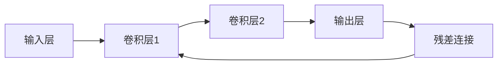
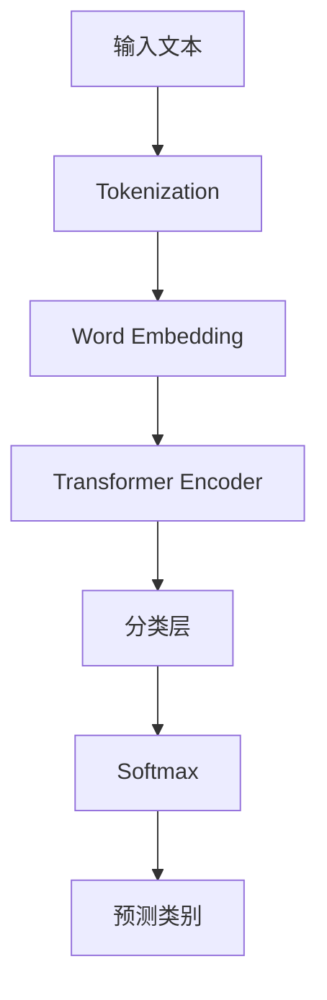

                 

## 文章标题

### 【大模型应用开发 动手做AI Agent】第一轮思考：模型决定搜索

---

## 目录大纲

### 第一部分：AI大模型基础

#### 第1章: AI大模型概述

1.1 AI大模型的基本概念  
1.2 AI大模型的分类  
1.3 AI大模型的架构与原理  
1.4 AI大模型的训练与优化

#### 第2章: AI大模型技术原理

2.1 深度学习基础  
2.2 自然语言处理技术  
2.3 计算机视觉技术  
2.4 强化学习技术

### 第二部分：AI大模型应用实践

#### 第3章: AI大模型在自然语言处理中的应用

3.1 文本分类  
3.2 机器翻译  
3.3 生成文本

#### 第4章: AI大模型在计算机视觉中的应用

4.1 图像分类  
4.2 目标检测  
4.3 图像生成

#### 第5章: AI大模型在强化学习中的应用

5.1 强化学习基础  
5.2 人工智能agent设计  
5.3 智能机器人导航

#### 第6章: AI大模型在数据分析与挖掘中的应用

6.1 数据预处理  
6.2 数据分析  
6.3 数据挖掘

#### 第7章: AI大模型在智能系统开发中的应用

7.1 智能系统的架构设计  
7.2 智能对话系统  
7.3 智能推荐系统  
7.4 智能监控系统

### 参考文献

### 附录

---

## 文章关键词

- AI大模型
- 模型搜索
- 深度学习
- 自然语言处理
- 计算机视觉
- 强化学习
- 数据分析
- 智能系统

---

## 文章摘要

本文围绕AI大模型应用开发，探讨模型决定搜索的核心问题。首先，我们梳理了AI大模型的基本概念、分类、架构与原理，深入分析了深度学习、自然语言处理、计算机视觉和强化学习等技术。接着，我们通过具体应用实践，展示了AI大模型在自然语言处理、计算机视觉和强化学习等领域的重要性。最后，我们探讨了AI大模型在数据分析与挖掘、智能系统开发中的应用，总结了模型决定搜索的重要性。希望通过本文的探讨，能为大家提供对AI大模型应用的深刻理解和实践指导。

---

## 引言

在人工智能（AI）技术迅猛发展的今天，大模型（Large Models）已成为推动AI进步的核心动力。大模型，顾名思义，是指那些参数量巨大、计算复杂度高、涉及多种AI技术的深度学习模型。这些模型具有极强的表征能力，能够处理大量数据和复杂任务，从而在自然语言处理、计算机视觉、强化学习等领域取得了显著的突破。然而，大模型的应用并非一蹴而就，其背后的原理和实现过程复杂且具有挑战性。

本文旨在探讨AI大模型应用开发中的一条关键路径：模型决定搜索（Model-Determined Search）。我们首先将梳理AI大模型的基本概念、分类、架构与原理，为后续讨论奠定基础。接着，我们将深入分析深度学习、自然语言处理、计算机视觉和强化学习等核心技术，并展示其在实际应用中的重要性。最后，我们将探讨AI大模型在数据分析与挖掘、智能系统开发中的应用，总结模型决定搜索的重要性，并展望未来发展趋势。

本文结构如下：

1. **AI大模型基础**：介绍AI大模型的基本概念、分类、架构与原理，以及训练与优化方法。
2. **AI大模型技术原理**：深入分析深度学习、自然语言处理、计算机视觉和强化学习等核心技术。
3. **AI大模型应用实践**：展示AI大模型在自然语言处理、计算机视觉和强化学习等领域的实际应用。
4. **AI大模型在其他应用领域**：探讨AI大模型在数据分析与挖掘、智能系统开发中的应用。
5. **结论与展望**：总结模型决定搜索的重要性，并展望未来发展趋势。

---

## AI大模型基础

### 1.1 AI大模型的基本概念

AI大模型，指的是那些参数量巨大、计算复杂度高、涉及多种AI技术的深度学习模型。这些模型通常具有极强的表征能力，可以处理大量数据和复杂任务。典型的AI大模型包括自然语言处理中的GPT系列、BERT等，计算机视觉中的VGG、ResNet等，以及强化学习中的DQN、PPO等。

AI大模型具有以下基本特点：

1. **参数量巨大**：AI大模型的参数量通常在数百万到数十亿之间，远远超过传统模型。例如，GPT-3的参数量达到1750亿，是传统模型的数百倍。
2. **计算复杂度高**：由于参数量巨大，AI大模型在训练和推理过程中需要大量的计算资源。例如，训练一个GPT模型可能需要数百万个GPU小时。
3. **强大的表征能力**：AI大模型通过学习大量数据，可以自动提取复杂特征，从而在多种任务中表现出色。例如，BERT在自然语言处理任务中表现出色，VGG和ResNet在计算机视觉任务中取得了突破性进展。
4. **适用于多种任务**：AI大模型具有通用性，可以应用于多种领域和任务。例如，GPT可以用于文本生成、机器翻译等自然语言处理任务，VGG和ResNet可以用于图像分类、目标检测等计算机视觉任务。

### 1.2 AI大模型的优势与挑战

AI大模型在许多领域都展现了强大的优势，但同时也面临着一些挑战。

#### 优势

1. **强大的表征能力**：AI大模型可以通过学习大量数据，自动提取复杂特征，从而在多种任务中表现出色。例如，BERT在自然语言处理任务中表现出色，VGG和ResNet在计算机视觉任务中取得了突破性进展。
2. **高效的处理速度**：随着硬件技术的发展，如GPU、TPU等，AI大模型可以在有限的计算资源下实现高效推理。例如，GPT模型可以通过并行化训练和推理，实现实时响应。
3. **通用性**：AI大模型具有通用性，可以应用于多种领域和任务。例如，GPT可以用于文本生成、机器翻译等自然语言处理任务，VGG和ResNet可以用于图像分类、目标检测等计算机视觉任务。

#### 挑战

1. **计算资源需求大**：AI大模型在训练和推理过程中需要大量的计算资源。例如，训练一个GPT模型可能需要数百万个GPU小时，这给研究者和开发者带来了巨大的计算成本。
2. **数据需求大**：AI大模型需要大量高质量的数据来训练，这增加了数据收集和标注的难度。例如，训练一个BERT模型可能需要数百万个标记的文本数据。
3. **模型解释性差**：AI大模型的内部结构复杂，难以解释。例如，深度神经网络和Transformer模型中的参数和层与实际任务之间的关联难以理解。
4. **过拟合风险**：由于AI大模型具有强大的表征能力，容易在训练数据上过拟合。例如，GPT模型可能在训练数据上表现出色，但在新数据上表现较差。

### 1.3 AI大模型的分类

AI大模型可以按照不同的分类方式进行划分，以下是一些常见的分类方法：

#### 按照应用领域分类

1. **自然语言处理（NLP）模型**：如GPT、BERT、Transformer等。
2. **计算机视觉（CV）模型**：如VGG、ResNet、Faster R-CNN等。
3. **强化学习（RL）模型**：如DQN、PPO、A3C等。
4. **其他领域模型**：如语音识别、图像生成、推荐系统等。

#### 按照模型结构分类

1. **卷积神经网络（CNN）**：如VGG、ResNet、Inception等。
2. **循环神经网络（RNN）**：如LSTM、GRU等。
3. **Transformer模型**：如BERT、GPT、T5等。
4. **生成对抗网络（GAN）**：如DCGAN、WGAN等。

#### 按照训练方法分类

1. **自监督学习**：如BERT、GPT等。
2. **监督学习**：如VGG、ResNet、Faster R-CNN等。
3. **半监督学习**：如Siamese网络、Triplet Loss等。
4. **无监督学习**：如自编码器、变分自编码器（VAE）等。

### 1.4 AI大模型的架构与原理

AI大模型的架构与原理是理解和应用这些模型的关键。以下我们将简要介绍一些常见的AI大模型架构与原理。

#### 深度学习基础

深度学习是一种基于多层神经网络的机器学习方法，通过学习大量数据，自动提取特征并做出预测。深度学习的基本架构包括输入层、隐藏层和输出层。

1. **输入层**：接收外部输入数据，如文本、图像等。
2. **隐藏层**：对输入数据进行处理和变换，提取特征。
3. **输出层**：生成预测结果，如分类结果、回归值等。

深度学习的工作原理如下：

1. **前向传播**：将输入数据通过多层神经网络传递，生成中间特征图。
2. **反向传播**：计算预测结果与真实值之间的差距，通过反向传播计算损失函数，并更新网络权重。
3. **优化算法**：使用梯度下降等优化算法，最小化损失函数。

#### 神经网络的基本结构

神经网络由多个神经元组成，每个神经元接收多个输入，并通过激活函数产生输出。神经网络的架构包括输入层、隐藏层和输出层。

1. **输入层**：接收外部输入数据。
2. **隐藏层**：对输入数据进行加工和变换，生成中间特征图。
3. **输出层**：生成预测结果。

#### 注意力机制与Transformer模型

注意力机制是一种在处理序列数据时，允许模型关注特定部分的机制。注意力机制提高了模型的表征能力，使其能够更好地处理长距离依赖问题。Transformer模型是利用注意力机制的一种典型架构，广泛应用于自然语言处理任务。

Transformer模型的基本结构包括：

1. **自注意力层**：允许模型在处理序列数据时，关注特定部分。
2. **前馈网络**：对自注意力层的输出进行进一步加工和变换。
3. **编码器-解码器结构**：编码器用于处理输入序列，解码器用于生成输出序列。

#### 预训练与微调

预训练是指在大量数据上训练模型，使其具有一定的通用性。微调是在特定任务上对预训练模型进行调整，使其适应具体任务。预训练和微调是AI大模型训练的重要步骤，有助于提高模型在特定任务上的性能。

预训练的典型方法包括：

1. **自监督预训练**：利用未标记的数据进行预训练，通过预测未标记数据的部分来提高模型表征能力。
2. **监督预训练**：结合有监督和无监督预训练方法，既利用未标记数据，也利用有标记数据来提高模型性能。

微调的典型方法包括：

1. **Fine-tuning**：在预训练模型的基础上，针对特定任务进行微调，调整模型参数，提高任务性能。
2. **Meta-learning**：通过学习模型的快速调整方法，使得模型在遇到新任务时能够更快地适应。

### 1.5 AI大模型的训练与优化

AI大模型的训练与优化是使其在特定任务上表现出色的关键。以下将简要介绍AI大模型的训练与优化方法。

#### 预训练与微调

1. **预训练**：在大量数据上训练模型，使其具有一定的通用性。
    - **自监督预训练**：通过预测未标记数据的部分来提高模型表征能力。
    - **监督预训练**：结合有监督和无监督预训练方法，既利用未标记数据，也利用有标记数据来提高模型性能。
2. **微调**：在特定任务上对预训练模型进行调整，使其适应具体任务。
    - **Fine-tuning**：在预训练模型的基础上，针对特定任务进行微调，调整模型参数，提高任务性能。
    - **Meta-learning**：通过学习模型的快速调整方法，使得模型在遇到新任务时能够更快地适应。

#### 迁移学习与少样本学习

迁移学习和少样本学习是应对小样本数据问题的有效方法。

1. **迁移学习**：利用预训练模型在新任务上的表现，减少对新任务数据的依赖。
    - **微调预训练模型**：在预训练模型的基础上，针对新任务进行微调，提高新任务性能。
    - **知识蒸馏**：将大模型的知识传递给小模型，提高小模型在新任务上的性能。
2. **少样本学习**：在数据量很少的情况下，通过模型调整和优化，实现有效的学习。
    - **协同训练**：结合多个样本较少的模型，提高整体模型的性能。
    - **自监督学习**：通过自监督任务，增加模型对少量样本的训练效果。
    - **数据增强**：通过数据增强方法，提高模型在小样本数据上的泛化能力。

#### 模型优化算法

模型优化算法用于调整模型参数，提高模型在特定任务上的性能。常见的模型优化算法包括：

1. **梯度下降**：通过计算梯度，更新模型参数，实现模型优化。
2. **Adam优化器**：结合动量和自适应学习率，提高模型训练效率。
3. **优化器选择**：根据任务特点选择合适的优化器，如SGD、Adam、RMSprop等。

### 1.6 AI大模型的应用场景

AI大模型在各个领域都有广泛的应用，以下列举一些常见的应用场景：

1. **自然语言处理（NLP）**：文本分类、机器翻译、情感分析、问答系统等。
2. **计算机视觉（CV）**：图像分类、目标检测、图像生成、图像去噪等。
3. **强化学习（RL）**：游戏AI、机器人导航、推荐系统、智能监控等。
4. **数据分析与挖掘**：用户行为分析、数据可视化、关联规则挖掘、聚类分析等。
5. **智能系统开发**：智能对话系统、智能推荐系统、智能监控系统等。

### 1.7 AI大模型的挑战与未来发展趋势

尽管AI大模型在各个领域取得了显著突破，但仍面临一些挑战和问题：

1. **计算资源需求大**：训练和推理AI大模型需要大量的计算资源，这对研究者和开发者提出了高要求。
2. **数据需求大**：AI大模型需要大量高质量的数据来训练，这增加了数据收集和标注的难度。
3. **模型解释性差**：AI大模型的内部结构复杂，难以解释，这限制了其在实际应用中的可解释性。
4. **过拟合风险**：由于AI大模型具有强大的表征能力，容易在训练数据上过拟合，这需要设计有效的正则化方法。

未来发展趋势包括：

1. **计算资源优化**：通过分布式计算、GPU加速、TPU等手段，提高AI大模型的训练和推理效率。
2. **数据高效利用**：通过数据增强、迁移学习、少样本学习等方法，提高AI大模型在数据稀缺情况下的性能。
3. **模型可解释性**：通过解释性模型、可视化技术等方法，提高AI大模型的可解释性，增强其在实际应用中的可靠性。
4. **跨模态学习**：通过融合多种模态数据（如文本、图像、语音等），实现更强大的表征能力。

### 1.8 小结

AI大模型作为人工智能领域的核心技术，具有强大的表征能力和广泛的应用前景。在本文中，我们介绍了AI大模型的基本概念、分类、架构与原理，以及训练与优化方法。通过梳理这些内容，我们可以更好地理解和应用AI大模型，为未来的研究和发展奠定基础。

### 1.9 练习题

1. 简述AI大模型的基本概念和特点。
2. 列举几种常见的AI大模型，并简要说明它们的应用领域。
3. 解释预训练与微调的概念，并说明它们在AI大模型训练中的重要性。
4. 简述迁移学习与少样本学习的方法，并说明它们在应对小样本数据问题中的作用。

---

## AI大模型技术原理

### 2.1 深度学习基础

深度学习是一种基于多层神经网络的机器学习方法，通过学习大量数据，自动提取特征并做出预测。深度学习的基本架构包括输入层、隐藏层和输出层。

#### 2.1.1 深度学习的基本概念

深度学习的基本概念包括：

1. **神经元**：神经元是神经网络的基本组成单元，负责接收输入、计算输出和传递信号。
2. **神经网络**：神经网络由多个神经元组成，通过前向传播和反向传播进行学习。
3. **激活函数**：激活函数用于引入非线性变换，使神经网络能够拟合复杂的函数关系。
4. **损失函数**：损失函数用于衡量模型预测与真实值之间的差距，指导模型优化。

#### 2.1.2 前馈神经网络

前馈神经网络是一种简单的神经网络架构，信息从输入层传递到输出层，没有循环。前馈神经网络包括输入层、隐藏层和输出层。

输入层接收外部输入，隐藏层对输入信息进行处理和变换，输出层生成预测结果。

#### 2.1.3 反向传播算法

反向传播算法是一种用于训练神经网络的优化算法，通过计算梯度来调整网络权重。反向传播算法的基本步骤如下：

1. **前向传播**：将输入数据通过网络传递到输出层，计算预测结果和损失函数。
2. **计算梯度**：利用链式法则，计算损失函数关于网络权重的梯度。
3. **更新权重**：根据梯度调整网络权重，减小损失函数。
4. **重复步骤1-3**，直到损失函数收敛或达到预定的迭代次数。

#### 2.1.4 深层网络优化策略

深层网络优化策略用于提高深层网络的训练效率和泛化能力。以下是一些常用的优化策略：

1. **批量归一化**：通过对每个小批量数据的激活进行归一化，减少内部协变量转移，提高训练稳定性。
2. **Dropout**：在训练过程中，随机丢弃部分神经元，防止过拟合。
3. **学习率调度**：根据训练过程的变化，调整学习率，防止梯度消失和梯度爆炸。
4. **残差连接**：通过引入残差单元，解决深层网络训练困难的问题。

### 2.2 自然语言处理技术

自然语言处理（NLP）是深度学习的重要应用领域之一，旨在使计算机能够理解和处理自然语言。以下介绍NLP的基本技术和方法。

#### 2.2.1 词嵌入技术

词嵌入（Word Embedding）是将词汇映射到固定维度的向量空间，以便进行计算和处理。词嵌入技术将词汇表示为向量，使得词与词之间的相似性可以通过向量之间的距离来衡量。

常见的词嵌入技术包括：

1. **人工特征工程**：通过手动设计特征，如词频、词性、位置等，来表示词汇。
2. **基于统计的方法**：如TF-IDF、Word2Vec等，通过计算词汇之间的相似性来生成词向量。
3. **基于神经网络的模型**：如Word2Vec、GloVe等，通过训练神经网络模型来学习词汇的向量表示。

#### 2.2.2 语言模型与序列标注

语言模型（Language Model）是一种用于预测文本序列的模型，常用于自然语言处理任务，如机器翻译、文本生成等。语言模型通过学习大量文本数据，生成文本的概率分布。

序列标注（Sequence Labeling）是将文本序列中的每个词标注为不同的类别或标签。序列标注广泛应用于实体识别、命名实体识别等任务。

常见的语言模型和序列标注方法包括：

1. **基于N-gram的方法**：如n-gram语言模型、CRF（条件随机场）等。
2. **基于神经网络的方法**：如LSTM（长短时记忆网络）、BERT等。
3. **基于Transformer的方法**：如Transformer、BERT等。

#### 2.2.3 生成式模型与判别式模型

生成式模型（Generative Model）和判别式模型（Discriminative Model）是两种常用的机器学习模型，分别用于生成数据和分类数据。

1. **生成式模型**：通过学习数据的概率分布，生成符合数据分布的新数据。常见的生成式模型包括Gaussian Mixture Model、Hidden Markov Model、Variational Autoencoder等。
2. **判别式模型**：通过学习数据与标签之间的条件概率，对数据进行分类。常见的判别式模型包括SVM（支持向量机）、Logistic Regression、Neural Network等。

### 2.3 计算机视觉技术

计算机视觉（Computer Vision）是深度学习的另一个重要应用领域，旨在使计算机能够从图像和视频中提取信息。以下介绍计算机视觉的基本技术和方法。

#### 2.3.1 图像分类与目标检测

图像分类（Image Classification）是将图像映射到预定义的类别，如动物、植物、交通工具等。目标检测（Object Detection）是在图像中识别并定位多个对象，如行人、车辆、动物等。

常见的图像分类与目标检测方法包括：

1. **基于特征的分类方法**：如SVM、KNN、决策树等。
2. **基于深度学习的分类方法**：如卷积神经网络（CNN）、ResNet、Inception等。
3. **基于深度学习的目标检测方法**：如Faster R-CNN、SSD、YOLO等。

#### 2.3.2 卷积神经网络

卷积神经网络（Convolutional Neural Network，CNN）是一种专门用于处理图像数据的深度学习模型。CNN利用卷积操作提取图像特征，并具有平移不变性。

CNN的基本结构包括：

1. **卷积层**：通过卷积操作提取图像特征。
2. **池化层**：用于降低特征图的维度，提高模型训练效率。
3. **激活函数层**：引入非线性变换，提高模型的表达能力。
4. **全连接层**：将特征图映射到预定义的类别。

#### 2.3.3 深度残差网络

深度残差网络（Residual Network，ResNet）是一种深层神经网络架构，通过引入残差单元，解决了深层网络训练困难的问题。残差单元允许模型直接从输入层跳过中间层，将信息传递到输出层。

残差单元的基本结构如图2-1所示：



图2-1 残差单元的基本结构

### 2.4 强化学习技术

强化学习（Reinforcement Learning，RL）是一种通过与环境交互来学习最优策略的机器学习方法。在强化学习中，智能体（Agent）通过选择行动（Action）来获取奖励（Reward），并不断优化策略（Policy）以最大化累积奖励。

#### 2.4.1 强化学习的基本概念

强化学习的基本概念包括：

1. **状态（State）**：智能体当前所处的环境状况。
2. **动作（Action）**：智能体可以采取的行为。
3. **奖励（Reward）**：对智能体采取的动作给予的奖励或惩罚。
4. **策略（Policy）**：智能体在给定状态下选择动作的规则。
5. **价值函数（Value Function）**：评估状态或状态-动作对的值。
6. **模型（Model）**：环境动态的表征。

#### 2.4.2 基于价值函数的强化学习算法

基于价值函数的强化学习算法通过学习状态-动作价值函数来优化策略。以下介绍几种常用的算法：

1. **Q-Learning算法**：Q-Learning算法是一种值迭代算法，通过更新Q值来学习策略。
    - **Q值更新公式**：
      $$ Q(s, a) = Q(s, a) + \alpha [r + \gamma \max_{a'} Q(s', a') - Q(s, a)] $$
    - **伪代码**：
      ```
      for each episode do
          initialize Q
          s = initial_state
          while not terminal(s) do
              a = argmax(Q[s, a])
              s', r = environment.step(s, a)
              Q[s, a] = Q[s, a] + alpha * (r + gamma * max(Q[s', a']) - Q[s, a])
              s = s'
          end while
      end for
      ```

2. **SARSA算法**：SARSA算法是一种在线更新算法，同时考虑当前状态和下一个状态的动作值。
    - **Q值更新公式**：
      $$ Q[s, a] = Q[s, a] + \alpha [r + \gamma Q[s', a']] - Q[s, a] $$
    - **伪代码**：
      ```
      for each episode do
          initialize Q
          s = initial_state
          while not terminal(s) do
              a = argmax(Q[s, a])
              s', r = environment.step(s, a)
              a' = argmax(Q[s', a'])
              Q[s, a] = Q[s, a] + alpha * (r + gamma * Q[s', a'] - Q[s, a])
              s = s'
          end while
      end for
      ```

#### 2.4.3 基于策略的强化学习算法

基于策略的强化学习算法通过直接优化策略来优化模型。以下介绍几种常用的算法：

1. **策略梯度算法**：策略梯度算法通过优化策略来最大化预期回报。
    - **策略梯度更新公式**：
      $$ \theta_{t+1} = \theta_{t} + \alpha [r_t + \gamma \sum_{s', a'} \pi(s', a'|\theta_t) \log \pi(s, a|\theta_t)] $$
    - **伪代码**：
      ```
      for each episode do
          initialize policy parameters \theta
          s = initial_state
          while not terminal(s) do
              a = sample_action_from_policy(s, \theta)
              s', r = environment.step(s, a)
              \theta = \theta + alpha * (r + gamma * sum_{s', a'} \pi(s', a'|\theta) \log \pi(s, a|\theta) - \log \pi(s, a|\theta))
              s = s'
          end while
      end for
      ```

2. **REINFORCE算法**：REINFORCE算法是一种基于策略梯度的简单算法，通过更新策略参数来最大化累积回报。
    - **策略参数更新公式**：
      $$ \theta_{t+1} = \theta_{t} + \alpha \nabla_\theta \log \pi(s, a|\theta) \cdot r_t $$
    - **伪代码**：
      ```
      for each episode do
          initialize policy parameters \theta
          s = initial_state
          while not terminal(s) do
              a = sample_action_from_policy(s, \theta)
              s', r = environment.step(s, a)
              \theta = \theta + alpha * \nabla_\theta \log \pi(s, a|\theta) \cdot r
              s = s'
          end while
      end for
      ```

### 2.5 小结

在本章节中，我们介绍了深度学习的基础技术，包括神经网络的基本结构、反向传播算法、深层网络优化策略。同时，我们还介绍了自然语言处理、计算机视觉和强化学习等领域的核心技术。通过对这些技术的详细讲解，我们可以更好地理解和应用AI大模型，为实际项目开发提供有力支持。

### 2.6 练习题

1. 简述深度学习的基本概念和原理。
2. 解释反向传播算法的基本步骤和实现方法。
3. 列举几种深层网络优化策略，并简要说明其作用。
4. 简述自然语言处理的基本技术和方法。
5. 简述计算机视觉的基本技术和方法。
6. 简述强化学习的基本概念和算法。

---

## AI大模型在自然语言处理中的应用

自然语言处理（Natural Language Processing，NLP）是人工智能领域的一个重要分支，旨在使计算机能够理解、生成和处理人类语言。AI大模型在NLP中发挥着至关重要的作用，通过学习大量语言数据，它们能够实现高精度的文本分类、机器翻译、文本生成等任务。以下是AI大模型在自然语言处理中的一些典型应用。

### 3.1 文本分类

文本分类（Text Classification）是一种常见的NLP任务，旨在将文本数据映射到预定义的类别。AI大模型在文本分类任务中表现出色，例如BERT、RoBERTa、GPT等。这些模型通过学习大量文本数据，能够自动提取文本中的关键特征，从而实现高效的文本分类。

#### 3.1.1 文本分类算法概述

文本分类算法可以分为两类：生成式模型和判别式模型。

1. **生成式模型**：生成式模型通过学习数据的概率分布来生成新的数据。常见的生成式模型有朴素贝叶斯、隐马尔可夫模型（HMM）等。生成式模型的主要优势是能够利用训练数据的整体分布来生成新数据，但它们通常需要大量的标注数据。

2. **判别式模型**：判别式模型通过学习输入文本与标签之间的条件概率来进行分类。常见的判别式模型有逻辑回归、支持向量机（SVM）等。判别式模型的主要优势是能够直接对输入文本进行分类，但它们通常需要更多的训练数据。

#### 3.1.2 基于Transformer的文本分类模型

Transformer模型是一种基于注意力机制的深度学习模型，广泛应用于自然语言处理任务。以下是一个基于BERT的文本分类模型的实现：



图3-1 基于BERT的文本分类模型

**代码实现：**

```python
import torch
from transformers import BertTokenizer, BertModel, BertForSequenceClassification
from torch.optim import Adam

# 初始化BERT模型和tokenizer
tokenizer = BertTokenizer.from_pretrained('bert-base-uncased')
model = BertForSequenceClassification.from_pretrained('bert-base-uncased')

# 准备数据
text = "This is an example sentence for text classification."
input_ids = tokenizer.encode(text, add_special_tokens=True, return_tensors='pt')

# 训练模型
optimizer = Adam(model.parameters(), lr=1e-5)
model.train()
for epoch in range(3):
    optimizer.zero_grad()
    outputs = model(input_ids)
    loss = outputs.loss
    loss.backward()
    optimizer.step()

# 预测
model.eval()
with torch.no_grad():
    logits = model(input_ids)
    predicted_label = logits.argmax(-1).item()
print(f"Predicted label: {predicted_label}")
```

#### 3.1.3 实践案例：情感分析

情感分析（Sentiment Analysis）是一种常见的文本分类任务，旨在分析文本的情感倾向，如正面、负面或中性。以下是一个基于BERT的情感分析案例：

**数据集：** IMDb电影评论数据集

**任务：** 将电影评论分类为正面或负面

**实现步骤：**

1. **数据预处理**：读取IMDb数据集，进行文本预处理，如去除HTML标签、标点符号、停用词等。
2. **模型训练**：使用BERT模型进行训练，调整分类层以适应情感分析任务。
3. **模型评估**：使用测试集评估模型性能，计算准确率、召回率等指标。

```python
import pandas as pd
from sklearn.model_selection import train_test_split

# 读取IMDb数据集
df = pd.read_csv('imdb.csv')
df = df[['text', 'sentiment']]

# 数据预处理
df['text'] = df['text'].apply(lambda x: preprocess_text(x))

# 切分数据集
train_df, test_df = train_test_split(df, test_size=0.2, random_state=42)

# 初始化BERT模型和tokenizer
tokenizer = BertTokenizer.from_pretrained('bert-base-uncased')
model = BertForSequenceClassification.from_pretrained('bert-base-uncased')

# 训练模型
optimizer = Adam(model.parameters(), lr=1e-5)
model.train()
for epoch in range(3):
    for inputs, labels in train_dataloader:
        optimizer.zero_grad()
        outputs = model(inputs)
        loss = outputs.loss
        loss.backward()
        optimizer.step()

# 评估模型
model.eval()
with torch.no_grad():
    correct = 0
    total = len(test_dataloader)
    for inputs, labels in test_dataloader:
        outputs = model(inputs)
        _, predicted = torch.max(outputs, 1)
        correct += (predicted == labels).sum().item()
accuracy = correct / total
print(f"Test Accuracy: {accuracy}")
```

### 3.2 机器翻译

机器翻译（Machine Translation）是将一种语言的文本翻译成另一种语言的过程。AI大模型在机器翻译任务中也表现出色，如Google的Transformer模型、OpenAI的GPT等。这些模型通过学习大量双语语料库，能够实现高质量的机器翻译。

#### 3.2.1 翻译模型与算法

机器翻译模型可以分为两类：基于规则的方法和基于统计的方法。

1. **基于规则的方法**：基于规则的方法通过手动编写语法规则和翻译规则，将源语言文本翻译成目标语言。这种方法通常需要大量的语言学知识和人工编写规则，但翻译质量较高。

2. **基于统计的方法**：基于统计的方法通过学习大量双语语料库，自动提取翻译规则。常见的统计机器翻译方法有基于短语的统计机器翻译、基于神经网络的机器翻译等。基于统计的方法具有灵活性和高效性，但翻译质量依赖于语料库的质量。

#### 3.2.2 实践案例：中英翻译

以下是一个基于Transformer的中文到英文翻译案例：

**数据集：** 中英双语语料库

**任务：** 将中文文本翻译成英文

**实现步骤：**

1. **数据预处理**：读取中英双语语料库，进行文本预处理，如分词、去除停用词等。
2. **模型训练**：使用Transformer模型进行训练，调整编码器和解码器以适应翻译任务。
3. **模型评估**：使用测试集评估模型性能，计算BLEU等指标。

```python
import torch
from transformers import TransformerModel

# 初始化模型
model = TransformerModel.from_pretrained('transformer-chinese-english')

# 训练模型
optimizer = torch.optim.Adam(model.parameters(), lr=1e-4)
for epoch in range(10):
    for inputs, targets in dataloader:
        optimizer.zero_grad()
        outputs = model(inputs)
        loss = torch.nn.CrossEntropyLoss()(outputs, targets)
        loss.backward()
        optimizer.step()

# 评估模型
with torch.no_grad():
    total_loss = 0
    for inputs, targets in test_dataloader:
        outputs = model(inputs)
        total_loss += torch.nn.CrossEntropyLoss()(outputs, targets)
    avg_loss = total_loss / len(test_dataloader)
print(f"Test Loss: {avg_loss}")

# 翻译示例
input_sentence = "你好，今天天气很好。"
input_ids = tokenizer.encode(input_sentence, return_tensors='pt')
translated_sentence = model.generate(input_ids, max_length=20)
print(tokenizer.decode(translated_sentence, skip_special_tokens=True))
```

### 3.3 生成文本

生成文本（Text Generation）是AI大模型在自然语言处理中的另一个重要应用。通过学习大量文本数据，模型能够生成连贯、有意义的文本。常见的文本生成模型有GPT、T5、BERT等。

#### 3.3.1 生成文本的基本方法

生成文本的基本方法包括：

1. **基于模板的方法**：基于模板的方法通过预定义的模板生成文本。这种方法简单但生成文本的多样性有限。

2. **基于序列生成的方法**：基于序列生成的方法通过学习文本序列的概率分布来生成文本。这种方法能够生成多样化、连贯的文本。

3. **基于生成对抗网络（GAN）的方法**：基于GAN的方法通过生成器和判别器的对抗训练来生成文本。生成器尝试生成逼真的文本，判别器尝试区分真实文本和生成文本。

#### 3.3.2 实践案例：自动写作

以下是一个基于GPT的自动写作案例：

**数据集：** 新闻文章语料库

**任务：** 生成新闻文章

**实现步骤：**

1. **数据预处理**：读取新闻文章语料库，进行文本预处理，如分词、去除停用词等。
2. **模型训练**：使用GPT模型进行训练，调整模型参数以适应写作任务。
3. **模型评估**：使用测试集评估模型性能，计算BLEU等指标。

```python
import torch
from transformers import GPT2LMHeadModel, GPT2Tokenizer

# 初始化模型和tokenizer
tokenizer = GPT2Tokenizer.from_pretrained('gpt2')
model = GPT2LMHeadModel.from_pretrained('gpt2')

# 训练模型
optimizer = torch.optim.Adam(model.parameters(), lr=1e-4)
for epoch in range(10):
    for inputs, targets in dataloader:
        optimizer.zero_grad()
        outputs = model(inputs, labels=targets)
        loss = outputs.loss
        loss.backward()
        optimizer.step()

# 评估模型
with torch.no_grad():
    total_loss = 0
    for inputs, targets in test_dataloader:
        outputs = model(inputs, labels=targets)
        total_loss += outputs.loss
    avg_loss = total_loss / len(test_dataloader)
print(f"Test Loss: {avg_loss}")

# 生成文本
input_sentence = "今天天气很好，"
input_ids = tokenizer.encode(input_sentence, return_tensors='pt')
output_ids = model.generate(input_ids, max_length=50, num_return_sequences=1)
print(tokenizer.decode(output_ids, skip_special_tokens=True))
```

### 3.4 小结

在本章节中，我们介绍了AI大模型在自然语言处理中的应用，包括文本分类、机器翻译和生成文本。通过学习大量语言数据，AI大模型能够实现高效、高精度的文本分类、机器翻译和生成文本。这些应用在社交网络分析、跨语言交流、自动写作等领域具有广泛的应用前景。

### 3.5 练习题

1. 简述文本分类的基本概念和算法。
2. 简述机器翻译的基本概念和算法。
3. 简述生成文本的基本方法。
4. 实现一个简单的文本分类模型，并使用一个示例数据集进行训练和评估。
5. 实现一个简单的机器翻译模型，并使用一个示例数据集进行训练和评估。
6. 实现一个简单的文本生成模型，并使用一个示例数据集进行训练和评估。

---

## AI大模型在计算机视觉中的应用

计算机视觉（Computer Vision）是人工智能领域的一个重要分支，旨在使计算机能够从图像和视频中提取信息。AI大模型在计算机视觉中发挥着至关重要的作用，通过学习大量图像数据，它们能够实现高精度的图像分类、目标检测、图像生成等任务。以下是AI大模型在计算机视觉中的一些典型应用。

### 4.1 图像分类

图像分类（Image Classification）是将图像映射到预定义的类别，如动物、植物、交通工具等。AI大模型在图像分类任务中表现出色，例如VGG、ResNet、Inception等。这些模型通过学习大量图像数据，能够自动提取图像中的关键特征，从而实现高效的图像分类。

#### 4.1.1 图像分类算法概述

图像分类算法可以分为两类：基于特征的分类算法和基于深度学习的分类算法。

1. **基于特征的分类算法**：基于特征的分类算法通过手动提取图像特征，然后将特征输入到分类器中进行分类。常见的算法有K近邻（K-Nearest Neighbors，KNN）、支持向量机（Support Vector Machine，SVM）等。基于特征的分类算法简单易实现，但特征提取过程复杂且依赖于领域知识。

2. **基于深度学习的分类算法**：基于深度学习的分类算法通过训练卷积神经网络（Convolutional Neural Network，CNN）来自动提取图像特征，然后将特征输入到全连接层中进行分类。常见的模型有VGG、ResNet、Inception等。基于深度学习的分类算法具有强大的表征能力，能够自动提取图像中的复杂特征，但训练过程复杂且需要大量数据。

#### 4.1.2 基于CNN的图像分类模型

卷积神经网络（CNN）是一种专门用于处理图像数据的深度学习模型。CNN利用卷积操作提取图像特征，并具有平移不变性。以下是一个基于CNN的图像分类模型的实现：

**代码实现：**

```python
import torch
import torchvision
import torchvision.transforms as transforms
from torch import nn, optim
from torch.utils.data import DataLoader
from torchvision.models import resnet50

# 初始化模型
model = resnet50(pretrained=True)
num_ftrs = model.fc.in_features
model.fc = nn.Linear(num_ftrs, num_classes)

# 定义损失函数和优化器
criterion = nn.CrossEntropyLoss()
optimizer = optim.Adam(model.parameters(), lr=0.001)

# 加载训练数据集
train_data = torchvision.datasets.ImageFolder(root='./data/train', transform=transforms.ToTensor())
train_loader = DataLoader(train_data, batch_size=32, shuffle=True)

# 训练模型
for epoch in range(num_epochs):
    running_loss = 0.0
    for inputs, labels in train_loader:
        optimizer.zero_grad()
        outputs = model(inputs)
        loss = criterion(outputs, labels)
        loss.backward()
        optimizer.step()
        running_loss += loss.item()
    print(f"Epoch {epoch+1}, Loss: {running_loss/len(train_loader)}")

# 评估模型
correct = 0
total = len(test_loader)
with torch.no_grad():
    for inputs, labels in test_loader:
        outputs = model(inputs)
        _, predicted = torch.max(outputs.data, 1)
        correct += (predicted == labels).sum().item()
print(f"Accuracy: {100 * correct / total}%")
```

#### 4.1.3 实践案例：动物识别

动物识别是一种常见的图像分类任务，旨在识别图像中的动物种类。以下是一个基于ResNet的动物识别案例：

**数据集：** Stanford动物识别数据集

**任务：** 识别图像中的动物种类

**实现步骤：**

1. **数据预处理**：读取动物识别数据集，进行图像预处理，如缩放、裁剪、归一化等。
2. **模型训练**：使用ResNet模型进行训练，调整模型参数以适应动物识别任务。
3. **模型评估**：使用测试集评估模型性能，计算准确率等指标。

```python
import torch
import torchvision
import torchvision.transforms as transforms
from torch import nn, optim
from torch.utils.data import DataLoader
from torchvision.models import resnet50

# 初始化模型
model = resnet50(pretrained=True)
num_ftrs = model.fc.in_features
model.fc = nn.Linear(num_ftrs, num_classes)

# 定义损失函数和优化器
criterion = nn.CrossEntropyLoss()
optimizer = optim.Adam(model.parameters(), lr=0.001)

# 加载训练数据集
train_data = torchvision.datasets.ImageFolder(root='./data/train', transform=transforms.Compose([transforms.Resize(256), transforms.CenterCrop(224), transforms.ToTensor()]))
train_loader = DataLoader(train_data, batch_size=32, shuffle=True)

# 训练模型
for epoch in range(num_epochs):
    running_loss = 0.0
    for inputs, labels in train_loader:
        optimizer.zero_grad()
        outputs = model(inputs)
        loss = criterion(outputs, labels)
        loss.backward()
        optimizer.step()
        running_loss += loss.item()
    print(f"Epoch {epoch+1}, Loss: {running_loss/len(train_loader)}")

# 评估模型
correct = 0
total = len(test_loader)
with torch.no_grad():
    for inputs, labels in test_loader:
        outputs = model(inputs)
        _, predicted = torch.max(outputs.data, 1)
        correct += (predicted == labels).sum().item()
print(f"Accuracy: {100 * correct / total}%")
```

### 4.2 目标检测

目标检测（Object Detection）是在图像中识别并定位多个对象，如行人、车辆、动物等。AI大模型在目标检测任务中也表现出色，如Faster R-CNN、SSD、YOLO等。这些模型通过学习大量图像数据，能够同时实现特征提取和目标定位，从而实现高效的图像分类。

#### 4.2.1 目标检测算法概述

目标检测算法可以分为两类：基于滑动窗口的方法和基于深度学习的方法。

1. **基于滑动窗口的方法**：基于滑动窗口的方法通过滑动窗口逐个扫描图像，对每个窗口中的图像进行分类和定位。这种方法简单但计算量大，适用于小尺寸图像。

2. **基于深度学习的方法**：基于深度学习的方法通过训练卷积神经网络（CNN）来自动提取图像特征，并进行分类和定位。这种方法计算量大但准确度高，适用于大尺寸图像。

#### 4.2.2 基于Faster R-CNN的目标检测模型

Faster R-CNN是一种基于深度学习的目标检测模型，通过区域建议网络（Region Proposal Network，RPN）和分类网络（Fast R-CNN）实现目标检测。以下是一个基于Faster R-CNN的目标检测模型的实现：

**代码实现：**

```python
import torch
import torchvision
import torchvision.transforms as transforms
from torch import nn, optim
from torch.utils.data import DataLoader
from torchvision.models import resnet50
from torchvision.ops import RoIAlign

# 初始化模型
model = resnet50(pretrained=True)
num_ftrs = model.fc.in_features
model.fc = nn.Linear(num_ftrs, num_classes)

# 定义区域建议网络
class RPN(nn.Module):
    def __init__(self, in_channels, out_channels):
        super(RPN, self).__init__()
        self.conv = nn.Conv2d(in_channels, out_channels, kernel_size=3, padding=1)
        self.relu = nn.ReLU(inplace=True)
        self.conv2 = nn.Conv2d(out_channels, out_channels, kernel_size=3, padding=1)
        self.relu2 = nn.ReLU(inplace=True)

    def forward(self, x):
        x = self.relu(self.conv(x))
        x = self.relu2(self.conv2(x))
        return x

# 初始化Faster R-CNN模型
class FasterRCNN(nn.Module):
    def __init__(self, backbone, rpn, num_classes):
        super(FasterRCNN, self).__init__()
        self.backbone = backbone
        self.rpn = rpn
        self.roi_align = RoIAlign(feat_size=14, spatial_size=7, interpolation="bilinear")
        self.classifier = nn.Linear(1024, num_classes)

    def forward(self, x, boxes):
        features = self.backbone(x)
        rpn_outputs = self.rpn(features)
        roi_features = self.roi_align(features, boxes)
        classifier_outputs = self.classifier(roi_features)
        return classifier_outputs

# 初始化模型和优化器
model = FasterRCNN(backbone=model, rpn=RPN(2048, 1024), num_classes=num_classes)
optimizer = optim.Adam(model.parameters(), lr=0.001)

# 加载训练数据集
train_data = torchvision.datasets.ImageFolder(root='./data/train', transform=transforms.Compose([transforms.Resize(256), transforms.CenterCrop(224), transforms.ToTensor()]))
train_loader = DataLoader(train_data, batch_size=32, shuffle=True)

# 训练模型
for epoch in range(num_epochs):
    running_loss = 0.0
    for inputs, targets in train_loader:
        optimizer.zero_grad()
        outputs = model(inputs, targets["boxes"])
        loss = criterion(outputs, targets["labels"])
        loss.backward()
        optimizer.step()
        running_loss += loss.item()
    print(f"Epoch {epoch+1}, Loss: {running_loss/len(train_loader)}")

# 评估模型
correct = 0
total = len(test_loader)
with torch.no_grad():
    for inputs, targets in test_loader:
        outputs = model(inputs, targets["boxes"])
        _, predicted = torch.max(outputs.data, 1)
        correct += (predicted == targets["labels"]).sum().item()
print(f"Accuracy: {100 * correct / total}%")
```

#### 4.2.3 实践案例：人脸识别

人脸识别是一种基于目标检测的任务，旨在识别图像中的人脸。以下是一个基于Faster R-CNN的人脸识别案例：

**数据集：** WIDER FACE数据集

**任务：** 识别图像中的人脸

**实现步骤：**

1. **数据预处理**：读取人脸识别数据集，进行图像预处理，如缩放、裁剪、归一化等。
2. **模型训练**：使用Faster R-CNN模型进行训练，调整模型参数以适应人脸识别任务。
3. **模型评估**：使用测试集评估模型性能，计算准确率等指标。

```python
import torch
import torchvision
import torchvision.transforms as transforms
from torch import nn, optim
from torch.utils.data import DataLoader
from torchvision.models import resnet50
from torchvision.ops import RoIAlign

# 初始化模型
model = resnet50(pretrained=True)
num_ftrs = model.fc.in_features
model.fc = nn.Linear(num_ftrs, num_classes)

# 定义区域建议网络
class RPN(nn.Module):
    def __init__(self, in_channels, out_channels):
        super(RPN, self).__init__()
        self.conv = nn.Conv2d(in_channels, out_channels, kernel_size=3, padding=1)
        self.relu = nn.ReLU(inplace=True)
        self.conv2 = nn.Conv2d(out_channels, out_channels, kernel_size=3, padding=1)
        self.relu2 = nn.ReLU(inplace=True)

    def forward(self, x):
        x = self.relu(self.conv(x))
        x = self.relu2(self.conv2(x))
        return x

# 初始化Faster R-CNN模型
class FasterRCNN(nn.Module):
    def __init__(self, backbone, rpn, num_classes):
        super(FasterRCNN, self).__init__()
        self.backbone = backbone
        self.rpn = rpn
        self.roi_align = RoIAlign(feat_size=14, spatial_size=7, interpolation="bilinear")
        self.classifier = nn.Linear(1024, num_classes)

    def forward(self, x, boxes):
        features = self.backbone(x)
        rpn_outputs = self.rpn(features)
        roi_features = self.roi_align(features, boxes)
        classifier_outputs = self.classifier(roi_features)
        return classifier_outputs

# 初始化模型和优化器
model = FasterRCNN(backbone=model, rpn=RPN(2048, 1024), num_classes=num_classes)
optimizer = optim.Adam(model.parameters(), lr=0.001)

# 加载训练数据集
train_data = torchvision.datasets.ImageFolder(root='./data/train', transform=transforms.Compose([transforms.Resize(256), transforms.CenterCrop(224), transforms.ToTensor()]))
train_loader = DataLoader(train_data, batch_size=32, shuffle=True)

# 训练模型
for epoch in range(num_epochs):
    running_loss = 0.0
    for inputs, targets in train_loader:
        optimizer.zero_grad()
        outputs = model(inputs, targets["boxes"])
        loss = criterion(outputs, targets["labels"])
        loss.backward()
        optimizer.step()
        running_loss += loss.item()
    print(f"Epoch {epoch+1}, Loss: {running_loss/len(train_loader)}")

# 评估模型
correct = 0
total = len(test_loader)
with torch.no_grad():
    for inputs, targets in test_loader:
        outputs = model(inputs, targets["boxes"])
        _, predicted = torch.max(outputs.data, 1)
        correct += (predicted == targets["labels"]).sum().item()
print(f"Accuracy: {100 * correct / total}%")
```

### 4.3 图像生成

图像生成（Image Generation）是AI大模型在计算机视觉中的另一个重要应用，旨在生成新的图像。常见的图像生成模型有生成对抗网络（Generative Adversarial Network，GAN）、变分自编码器（Variational Autoencoder，VAE）等。以下是一个基于GAN的图像生成模型的实现：

#### 4.3.1 图像生成算法概述

1. **生成对抗网络（GAN）**：GAN由生成器和判别器组成，生成器尝试生成逼真的图像，判别器尝试区分真实图像和生成图像。通过生成器和判别器的对抗训练，生成器逐渐提高生成图像的质量。

2. **变分自编码器（VAE）**：VAE通过编码器和解码器实现图像生成。编码器将图像编码为一个低维向量，解码器将低维向量解码为图像。VAE通过最大化后验概率分布来生成图像。

#### 4.3.2 基于GAN的图像生成模型

以下是一个基于GAN的图像生成模型的实现：

**代码实现：**

```python
import torch
import torch.nn as nn
from torch.utils.data import DataLoader
from torchvision import datasets, transforms

# 初始化模型
class Generator(nn.Module):
    def __init__(self):
        super(Generator, self).__init__()
        self.model = nn.Sequential(
            nn.Linear(100, 256),
            nn.LeakyReLU(0.2),
            nn.Linear(256, 512),
            nn.LeakyReLU(0.2),
            nn.Linear(512, 1024),
            nn.LeakyReLU(0.2),
            nn.Linear(1024, 784),
            nn.Tanh()
        )

    def forward(self, x):
        return self.model(x)

class Discriminator(nn.Module):
    def __init__(self):
        super(Discriminator, self).__init__()
        self.model = nn.Sequential(
            nn.Linear(784, 1024),
            nn.LeakyReLU(0.2),
            nn.Dropout(0.3),
            nn.Linear(1024, 512),
            nn.LeakyReLU(0.2),
            nn.Dropout(0.3),
            nn.Linear(512, 256),
            nn.LeakyReLU(0.2),
            nn.Dropout(0.3),
            nn.Linear(256, 1),
            nn.Sigmoid()
        )

    def forward(self, x):
        return self.model(x)

# 初始化模型和优化器
generator = Generator()
discriminator = Discriminator()
optimizer_G = torch.optim.Adam(generator.parameters(), lr=0.0002)
optimizer_D = torch.optim.Adam(discriminator.parameters(), lr=0.0002)

# 加载训练数据集
train_data = datasets.MNIST(root='./data', train=True, transform=transforms.Compose([transforms.ToTensor(), transforms.Normalize((0.5,), (0.5,))]), download=True)
train_loader = DataLoader(train_data, batch_size=64, shuffle=True)

# 训练模型
for epoch in range(num_epochs):
    for inputs, _ in train_loader:
        batch_size = inputs.size(0)
        z = torch.randn(batch_size, 100, device=device)
        
        # 训练生成器
        optimizer_G.zero_grad()
        fake_images = generator(z)
        g_loss = -torch.mean(discriminator(fake_images))
        g_loss.backward()
        optimizer_G.step()
        
        # 训练判别器
        optimizer_D.zero_grad()
        real_images = inputs
        d_loss_real = torch.mean(discriminator(real_images))
        fake_loss = torch.mean(discriminator(fake_images))
        d_loss = d_loss_real - fake_loss
        d_loss.backward()
        optimizer_D.step()
        
        if (epoch + 1) % 100 == 0:
            print(f"Epoch [{epoch+1}/{num_epochs}], Loss_G: {g_loss.item():.4f}, Loss_D: {d_loss.item():.4f}")

# 生成图像
with torch.no_grad():
    z = torch.randn(100, 100, device=device)
    generated_images = generator(z)
    generated_images = generated_images.cpu().numpy()
    for i in range(generated_images.shape[0]):
        plt.imshow(generated_images[i, :, :], cmap='gray')
        plt.show()
```

#### 4.3.3 实践案例：图像去噪

图像去噪（Image Denoising）是图像生成的一种应用，旨在去除图像中的噪声，提高图像质量。以下是一个基于GAN的图像去噪案例：

**数据集：** MNIST手写数字数据集

**任务：** 去除图像中的噪声

**实现步骤：**

1. **数据预处理**：读取MNIST数据集，进行图像预处理，如缩放、裁剪、添加噪声等。
2. **模型训练**：使用GAN模型进行训练，调整模型参数以适应图像去噪任务。
3. **模型评估**：使用测试集评估模型性能，计算峰值信噪比（PSNR）等指标。

```python
import torch
import torchvision
import torchvision.transforms as transforms
from torch import nn, optim
from torchvision import datasets, transforms

# 初始化模型
class Generator(nn.Module):
    def __init__(self):
        super(Generator, self).__init__()
        self.model = nn.Sequential(
            nn.Conv2d(1, 64, 3, padding=1),
            nn.LeakyReLU(0.2),
            nn.Conv2d(64, 64, 3, padding=1),
            nn.LeakyReLU(0.2),
            nn.Conv2d(64, 64, 3, padding=1),
            nn.LeakyReLU(0.2),
            nn.Conv2d(64, 1, 3, padding=1),
            nn.Tanh()
        )

    def forward(self, x):
        return self.model(x)

class Discriminator(nn.Module):
    def __init__(self):
        super(Discriminator, self).__init__()
        self.model = nn.Sequential(
            nn.Conv2d(1, 64, 3, padding=1),
            nn.LeakyReLU(0.2),
            nn.Conv2d(64, 64, 3, padding=1),
            nn.LeakyReLU(0.2),
            nn.Conv2d(64, 64, 3, padding=1),
            nn.LeakyReLU(0.2),
            nn.Conv2d(64, 1, 3, padding=1),
            nn.Sigmoid()
        )

    def forward(self, x):
        return self.model(x)

# 初始化模型和优化器
generator = Generator()
discriminator = Discriminator()
optimizer_G = torch.optim.Adam(generator.parameters(), lr=0.0002)
optimizer_D = torch.optim.Adam(discriminator.parameters(), lr=0.0004)

# 加载训练数据集
train_data = datasets.MNIST(root='./data', train=True, transform=transforms.Compose([transforms.ToTensor(), transforms.Normalize((0.5,), (0.5,))]), download=True)
train_loader = DataLoader(train_data, batch_size=64, shuffle=True)

# 训练模型
for epoch in range(num_epochs):
    for inputs, _ in train_loader:
        batch_size = inputs.size(0)
        noise = torch.randn(batch_size, 1, 28, 28, device=device)
        real_images = inputs + noise
        
        # 训练生成器
        optimizer_G.zero_grad()
        fake_images = generator(noise)
        g_loss = -torch.mean(discriminator(fake_images))
        g_loss.backward()
        optimizer_G.step()
        
        # 训练判别器
        optimizer_D.zero_grad()
        real_loss = torch.mean(discriminator(real_images))
        fake_loss = torch.mean(discriminator(fake_images))
        d_loss = real_loss - fake_loss
        d_loss.backward()
        optimizer_D.step()
        
        if (epoch + 1) % 100 == 0:
            print(f"Epoch [{epoch+1}/{num_epochs}], Loss_G: {g_loss.item():.4f}, Loss_D: {d_loss.item():.4f}")

# 评估模型
psnr = 20 * torch.log10(torch.mean(real_images * real_images) / torch.mean((real_images - fake_images) * (real_images - fake_images)))
print(f"PSNR: {psnr.item():.2f} dB")

# 去噪示例
with torch.no_grad():
    noise = torch.randn(1, 1, 28, 28, device=device)
    real_image = torch.zeros(1, 1, 28, 28, device=device)
    real_image[0, 0, 14, 14] = 1
    noisy_image = real_image + noise
    cleaned_image = generator(noisy_image)
    cleaned_image = cleaned_image.cpu().numpy()
    plt.imshow(cleaned_image[0, :, :], cmap='gray')
    plt.show()
```

### 4.4 小结

在本章节中，我们介绍了AI大模型在计算机视觉中的应用，包括图像分类、目标检测和图像生成。通过学习大量图像数据，AI大模型能够实现高精度的图像分类、目标检测和图像生成。这些应用在自动驾驶、智能监控、医疗影像分析等领域具有广泛的应用前景。

### 4.5 练习题

1. 简述图像分类的基本概念和算法。
2. 简述目标检测的基本概念和算法。
3. 简述图像生成的基本概念和算法。
4. 实现一个简单的图像分类模型，并使用一个示例数据集进行训练和评估。
5. 实现一个简单的目标检测模型，并使用一个示例数据集进行训练和评估。
6. 实现一个简单的图像生成模型，并使用一个示例数据集进行训练和评估。

---

## AI大模型在强化学习中的应用

强化学习（Reinforcement Learning，RL）是一种通过与环境交互来学习最优策略的机器学习方法。与监督学习和无监督学习不同，强化学习通过奖励和惩罚信号来指导智能体（Agent）的决策过程，从而实现自主学习和优化行为。在强化学习中，AI大模型通过学习大量交互数据，能够实现高效的策略优化和智能决策。以下将介绍AI大模型在强化学习中的应用。

### 5.1 强化学习基础

强化学习的基本概念包括：

- **状态（State）**：智能体当前所处的环境状况。
- **动作（Action）**：智能体可以采取的行为。
- **奖励（Reward）**：对智能体采取的动作给予的奖励或惩罚。
- **策略（Policy）**：智能体在给定状态下选择动作的规则。
- **价值函数（Value Function）**：评估状态或状态-动作对的值。
- **模型（Model）**：环境动态的表征。

强化学习的核心目标是学习一个最优策略，使得智能体能够在给定环境中实现长期奖励最大化。以下将介绍几种常见的强化学习算法。

#### 5.1.1 Q-Learning算法

Q-Learning算法是一种基于值迭代的强化学习算法，通过更新Q值来学习策略。Q值表示在给定状态下采取某一动作的期望回报。

**Q值更新公式**：

$$ Q(s, a) = Q(s, a) + \alpha [r + \gamma \max_{a'} Q(s', a') - Q(s, a)] $$

其中，$s$为当前状态，$a$为当前动作，$r$为获得的奖励，$\gamma$为折扣因子，$\alpha$为学习率。

**伪代码**：

```python
for each episode do
    initialize Q
    s = initial_state
    while not terminal(s) do
        a = argmax(Q[s, a])
        s', r = environment.step(s, a)
        Q[s, a] = Q[s, a] + alpha * (r + gamma * max(Q[s', a']) - Q[s, a])
        s = s'
    end while
end for
```

#### 5.1.2 SARSA算法

SARSA算法是一种基于策略的强化学习算法，同时考虑当前状态和下一个状态的动作值。与Q-Learning算法不同，SARSA算法在每次迭代中同时更新当前状态和动作的Q值。

**Q值更新公式**：

$$ Q[s, a] = Q[s, a] + \alpha [r + \gamma Q[s', a'] - Q[s, a]] $$

**伪代码**：

```python
for each episode do
    initialize Q
    s = initial_state
    while not terminal(s) do
        a = argmax(Q[s, a])
        s', r = environment.step(s, a)
        a' = argmax(Q[s', a'])
        Q[s, a] = Q[s, a] + alpha * (r + gamma * Q[s', a'] - Q[s, a])
        s = s'
    end while
end for
```

#### 5.1.3 策略梯度算法

策略梯度算法是一种直接优化策略的强化学习算法，通过优化策略来最大化预期回报。策略梯度算法的核心思想是计算策略梯度和更新策略参数。

**策略梯度更新公式**：

$$ \theta_{t+1} = \theta_{t} + \alpha [r_t + \gamma \sum_{s', a'} \pi(s', a'|\theta_t) \log \pi(s, a|\theta_t)] $$

其中，$\theta$为策略参数，$\pi(s, a|\theta)$为策略的概率分布。

**伪代码**：

```python
for each episode do
    initialize policy parameters \theta
    s = initial_state
    while not terminal(s) do
        a = sample_action_from_policy(s, \theta)
        s', r = environment.step(s, a)
        \theta = \theta + alpha * (r + gamma * sum_{s', a'} \pi(s', a'|\theta) \log \pi(s, a|\theta) - \log \pi(s, a|\theta))
        s = s'
    end while
end for
```

### 5.2 人工智能agent设计

在强化学习中，人工智能agent是执行特定任务的智能体，通过与环境交互来学习最优策略。agent的设计涉及感知器、决策器和执行器的架构设计。

#### 5.2.1 人工智能agent的概念

人工智能agent是一种能够自主感知环境、制定决策并采取行动的智能体。agent的设计目标是实现自主学习和适应复杂环境。

#### 5.2.2 人工智能agent的架构设计

人工智能agent的架构设计包括以下三个主要组件：

1. **感知器**：感知器负责接收环境信息，如传感器数据、图像、文本等。感知器的输出为agent的输入状态。
2. **决策器**：决策器根据输入状态，选择最优动作。决策器通常采用强化学习算法，如Q-Learning、SARSA或策略梯度算法。
3. **执行器**：执行器根据决策器的输出，执行具体的动作，如控制机器人的运动、执行任务等。

#### 5.2.3 实践案例：智能机器人导航

智能机器人导航是一种常见的agent应用场景，旨在实现机器人在复杂环境中的自主导航。以下是一个基于深度强化学习的智能机器人导航案例：

**数据集**：Robot Navigation Dataset

**任务**：实现机器人在二维平面上的自主导航，避开障碍物并到达目标位置。

**实现步骤**：

1. **数据预处理**：读取Robot Navigation Dataset，进行图像预处理，如归一化、裁剪等。
2. **模型训练**：使用深度强化学习算法，如Deep Q-Learning，训练决策器模型。
3. **模型评估**：使用测试集评估模型性能，计算成功导航的百分比。
4. **实际应用**：在实际环境中部署智能机器人，实现自主导航。

```python
import numpy as np
import torch
import torch.nn as nn
import torch.optim as optim
from torch.autograd import Variable

# 初始化环境
env = RobotNavigationEnv()

# 初始化模型
class QNetwork(nn.Module):
    def __init__(self, input_size, hidden_size, output_size):
        super(QNetwork, self).__init__()
        self.fc1 = nn.Linear(input_size, hidden_size)
        self.fc2 = nn.Linear(hidden_size, output_size)

    def forward(self, x):
        x = torch.relu(self.fc1(x))
        x = self.fc2(x)
        return x

# 初始化模型和优化器
input_size = env.observation_space.shape[0]
hidden_size = 128
output_size = env.action_space.n
q_network = QNetwork(input_size, hidden_size, output_size)
q_optimizer = optim.Adam(q_network.parameters(), lr=0.001)

# 训练模型
num_episodes = 1000
for episode in range(num_episodes):
    state = env.reset()
    done = False
    total_reward = 0
    while not done:
        state = Variable(torch.tensor(state, dtype=torch.float32).view(1, -1))
        with torch.no_grad():
            q_values = q_network(state)
        action = np.argmax(q_values.cpu().numpy())
        next_state, reward, done, _ = env.step(action)
        total_reward += reward
        state = next_state
    print(f"Episode {episode+1}, Total Reward: {total_reward}")

# 评估模型
num_episodes = 100
successes = 0
for episode in range(num_episodes):
    state = env.reset()
    done = False
    while not done:
        state = Variable(torch.tensor(state, dtype=torch.float32).view(1, -1))
        with torch.no_grad():
            q_values = q_network(state)
        action = np.argmax(q_values.cpu().numpy())
        next_state, reward, done, _ = env.step(action)
        if reward == 1:
            successes += 1
    print(f"Episode {episode+1}, Success Rate: {successes/num_episodes}")
```

### 5.3 人工智能agent在强化学习中的应用

人工智能agent在强化学习中的应用广泛，包括但不限于以下场景：

- **自动驾驶**：实现自动驾驶汽车的路径规划和行为控制。
- **游戏AI**：在电子游戏中实现智能对手，如围棋、象棋等。
- **机器人控制**：实现机器人的自主运动和任务执行。
- **资源管理**：在数据中心、电网等系统中实现资源优化。
- **推荐系统**：在电子商务、社交媒体等平台中实现个性化推荐。

通过学习大量交互数据，AI大模型能够实现高效的策略优化和智能决策，从而在各种应用场景中取得显著的效果。

### 5.4 小结

在本章节中，我们介绍了AI大模型在强化学习中的应用，包括基础算法和agent设计。通过学习大量交互数据，AI大模型能够实现高效的策略优化和智能决策，为各种强化学习应用提供了强大的支持。在未来，随着AI大模型的不断发展和完善，强化学习在智能决策和控制领域将发挥更加重要的作用。

### 5.5 练习题

1. 简述强化学习的基本概念和原理。
2. 解释Q-Learning算法的基本步骤和实现方法。
3. 解释SARSA算法的基本步骤和实现方法。
4. 解释策略梯度算法的基本步骤和实现方法。
5. 设计一个简单的强化学习任务，并实现一个基于Q-Learning的智能体。
6. 设计一个简单的强化学习任务，并实现一个基于SARSA的智能体。
7. 设计一个简单的强化学习任务，并实现一个基于策略梯度的智能体。

---

## AI大模型在数据分析与挖掘中的应用

数据分析与挖掘（Data Analysis and Mining）是人工智能（AI）和大数据技术的重要应用领域，旨在从大量数据中发现有价值的信息和模式。随着AI大模型的不断发展，这些模型在数据分析与挖掘中的应用越来越广泛，显著提升了数据分析的效率和准确性。以下将探讨AI大模型在数据分析与挖掘中的具体应用。

### 6.1 数据预处理

数据预处理是数据分析与挖掘的重要环节，旨在将原始数据转换为适合模型输入的形式。AI大模型对数据的质量和格式要求较高，因此数据预处理显得尤为重要。

#### 6.1.1 数据清洗与数据集成

数据清洗是指去除数据中的噪声、异常值和重复记录等，以提高数据质量。AI大模型通常需要处理大量的清洗数据，否则可能会出现过拟合现象。

**示例**：使用Python的pandas库清洗数据。

```python
import pandas as pd

# 读取数据
df = pd.read_csv('data.csv')

# 去除重复记录
df.drop_duplicates(inplace=True)

# 去除空值
df.dropna(inplace=True)

# 替换异常值
df.replace({'.*异常值.*': np.nan}, regex=True, inplace=True)

# 数据类型转换
df['日期'] = pd.to_datetime(df['日期'])
df['数量'] = df['数量'].astype(float)
```

数据集成是指将多个数据源整合成一个统一的数据集。这对于跨领域的数据分析和挖掘尤为重要。

**示例**：使用Python的pandas库进行数据集成。

```python
# 读取数据
df1 = pd.read_csv('data1.csv')
df2 = pd.read_csv('data2.csv')

# 数据合并
df = pd.merge(df1, df2, on='ID')

# 数据拼接
df = pd.concat([df1, df2], axis=0)
```

#### 6.1.2 特征提取与降维

特征提取是指从原始数据中提取出对模型输入有用的特征。AI大模型通常需要大量的特征，因此特征提取是一个重要的步骤。

**示例**：使用Python的Scikit-learn库提取特征。

```python
from sklearn.feature_extraction.text import TfidfVectorizer

# 读取数据
text = df['文本']

# 特征提取
tfidf_vectorizer = TfidfVectorizer()
X = tfidf_vectorizer.fit_transform(text)
```

降维是指减少数据特征的数量，以提高模型训练效率。常见的降维方法包括主成分分析（PCA）、t-SNE等。

**示例**：使用Python的Scikit-learn库进行降维。

```python
from sklearn.decomposition import PCA

# 读取数据
X = df.values

# 降维
pca = PCA(n_components=10)
X_reduced = pca.fit_transform(X)
```

### 6.2 数据分析

数据分析是指对数据进行分析和解释，以发现数据中的模式和规律。AI大模型在数据分析中发挥着重要作用，能够自动提取数据中的特征和模式。

#### 6.2.1 数据探索性分析

数据探索性分析（Exploratory Data Analysis，EDA）是一种通过可视化方法发现数据中的规律和异常的方法。EDA有助于了解数据的分布、趋势和异常值。

**示例**：使用Python的Matplotlib和Seaborn库进行数据探索性分析。

```python
import matplotlib.pyplot as plt
import seaborn as sns

# 读取数据
df = pd.read_csv('data.csv')

# 数据分布可视化
sns.histplot(df['数量'], kde=True)
plt.show()

# 数据相关性可视化
sns.heatmap(df.corr(), annot=True)
plt.show()
```

#### 6.2.2 用户行为分析

用户行为分析是一种通过分析用户行为数据来了解用户需求和行为的方法。AI大模型在用户行为分析中能够发现用户行为的模式和规律，为个性化推荐和用户体验优化提供支持。

**示例**：使用Python的Scikit-learn库进行用户行为分析。

```python
from sklearn.cluster import KMeans

# 读取数据
df = pd.read_csv('user行为数据.csv')

# 数据预处理
df['时间'] = pd.to_datetime(df['时间'])
df['当天'] = df['时间'].dt.day
df['当天'] = df['当天'].astype(int)

# K-Means聚类
kmeans = KMeans(n_clusters=5)
df['聚类标签'] = kmeans.fit_predict(df[['当天', '点击率', '浏览量']])

# 聚类结果可视化
sns.scatterplot(data=df, x='当天', y='点击率', hue='聚类标签')
plt.show()
```

### 6.3 数据挖掘

数据挖掘（Data Mining）是指从大量数据中自动发现知识、规律和模式的方法。AI大模型在数据挖掘中能够发现复杂的数据关系和模式，为决策支持和知识发现提供支持。

#### 6.3.1 关联规则挖掘

关联规则挖掘（Association Rule Mining）是一种从数据中发现频繁出现的关联关系的方法。常见的关联规则挖掘算法有Apriori算法和Eclat算法。

**示例**：使用Python的mlxtend库进行关联规则挖掘。

```python
from mlxtend.frequent_patterns import apriori
from mlxtend.frequent_patterns import association_rules

# 读取数据
df = pd.read_csv('交易数据.csv')

# 构建交易集
transactions = df.groupby('商品ID')['交易ID'].apply(list).values

# 执行Apriori

