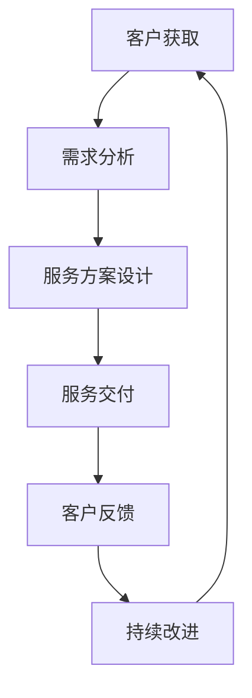

                 

### 《一人公司的客户成功管理与服务体系设计》

#### 引言

在当今竞争激烈的市场环境中，企业能否成功不仅取决于其产品的质量和营销策略，还取决于其客户成功管理与服务体系的设计。特别是在一人公司的背景下，客户成功管理与服务体系的设计显得尤为重要。一人公司通常指的是由一位创始人或管理者独立运营的企业，这样的企业在资源有限、团队规模较小的条件下，需要通过高效的客户成功管理来确保企业的持续发展。

本文将围绕一人公司的客户成功管理与服务体系设计展开，旨在提供一种逻辑清晰、结构紧凑、简单易懂的技术思路。通过逐步分析推理，我们将探讨客户成功管理的核心概念、体系设计、优化策略以及未来趋势。

#### 文章关键词

- 客户成功管理
- 服务体系设计
- 一人公司
- 客户生命周期
- 关键绩效指标（KPI）

#### 摘要

本文深入探讨了一人公司的客户成功管理与服务体系设计。首先，我们介绍了客户成功管理的核心概念和架构，包括客户关系管理（CRM）、服务管理体系、客户生命周期管理、服务质量控制等。接着，我们详细阐述了客户成功管理的流程与步骤，包括客户关系建立与维护、客户需求分析、服务方案设计、服务交付与执行、客户反馈与改进。随后，我们探讨了客户服务体系设计、客户成功管理工具与资源、关键绩效指标（KPI）的设定与监控。通过实际案例，我们展示了客户成功管理的实战应用，并分析了面临的挑战与应对策略。最后，我们对客户成功管理的未来趋势进行了展望，探讨了数字化转型、人工智能和大数据在客户成功管理中的应用。

### 目录

#### 第一部分：企业客户成功管理概述

- 第1章：一人公司的崛起
- 第2章：客户成功管理的核心概念与联系
- 第3章：客户成功管理的流程与步骤

#### 第二部分：客户成功管理体系设计

- 第4章：客户服务体系设计
- 第5章：客户成功管理工具与资源
- 第6章：客户成功管理的关键绩效指标（KPI）

#### 第三部分：客户成功管理与服务体系优化

- 第7章：客户成功管理实战案例分析
- 第8章：客户成功管理面临的挑战与应对策略
- 第9章：客户成功管理与服务体系持续优化
- 第10章：客户成功管理的未来趋势与展望

#### 附录

- 附录A：客户成功管理常用工具与应用
- 附录B：客户成功管理相关文献与资源推荐
- 附录C：客户成功管理实践指南

### 第一部分：企业客户成功管理概述

在当今高度竞争的市场环境中，客户成功管理已成为企业获取竞争优势的关键因素。对于一人公司而言，由于其资源有限、团队规模较小，客户成功管理与服务体系设计尤为重要。本部分将首先介绍一人公司的定义与优势，随后探讨客户成功管理的必要性及其特点。

#### 第1章：一人公司的崛起

##### 1.1 一人公司的定义与优势

一人公司，顾名思义，是指由一位创始人或管理者独立运营的企业。这种企业在创始初期往往只有创始人或几位核心团队成员，但随着时间的推移，企业规模可能会逐渐扩大。一人公司的优势在于：

- **灵活性**：一人公司由于决策流程简单，能够快速响应市场变化和客户需求。
- **成本低**：初始投入较低，运营成本也相对较低。
- **专注性**：创始人能够专注于企业发展的核心领域，减少资源分散。
- **高效率**：团队成员之间的沟通和协作相对高效，决策执行力强。

##### 1.2 客户成功管理的必要性

客户成功管理（Customer Success Management，简称CSM）是指通过一系列策略和工具来确保客户取得成功，从而实现持续合作和业务增长。对于一人公司来说，客户成功管理的必要性体现在以下几个方面：

- **客户保留**：在资源有限的情况下，维护现有客户关系至关重要。通过有效的客户成功管理，一人公司可以提高客户保留率，减少客户流失。
- **业务增长**：客户成功管理有助于挖掘现有客户的潜在需求，推动业务增长。
- **品牌声誉**：良好的客户体验和满意度有助于树立企业的品牌形象，吸引更多客户。
- **资源优化**：通过客户成功管理，一人公司可以更有效地分配有限的资源，提高运营效率。

##### 1.3 一人公司客户成功管理的特点

一人公司的客户成功管理有其独特之处，主要体现在以下几个方面：

- **个性化服务**：由于资源和团队的限制，一人公司往往需要提供更为个性化的服务，以满足客户的特殊需求。
- **高效执行**：一人公司需要确保客户成功管理策略的高效执行，避免因团队规模较小而导致执行力不足。
- **自我驱动**：一人公司通常依赖于创始人和核心团队成员的自我驱动能力，确保客户成功管理的持续执行。
- **灵活调整**：一人公司能够根据客户反馈和市场变化迅速调整客户成功管理策略，以适应不断变化的环境。

通过以上分析，我们可以看到，一人公司在客户成功管理方面面临着独特的挑战，同时也具备独特的优势。接下来，我们将进一步探讨客户成功管理的核心概念和架构，以帮助一人公司构建高效的客户成功管理体系。

### 第2章：客户成功管理的核心概念与联系

客户成功管理（Customer Success Management，简称CSM）是企业确保客户取得成功的一系列策略和行动。它不仅关注于销售和客户获取，更侧重于客户的长期关系和业务价值的实现。为了更好地理解客户成功管理，我们需要从核心概念、主要目标、核心概念之间的联系以及整体架构进行详细分析。

#### 2.1 客户成功管理的定义

客户成功管理是一种系统性的方法，旨在通过优化客户体验和满足客户需求，帮助客户实现其业务目标，并确保企业获得持续的业务增长。它包括以下几个关键要素：

- **客户视角**：以客户为中心，深入了解客户的需求、痛点和期望。
- **持续关系**：建立和维护与客户的长期合作关系，通过定期沟通和互动增强客户忠诚度。
- **业务目标**：确保客户成功与企业业务目标一致，通过合作实现共同增长。
- **数据驱动**：利用数据分析来指导客户成功策略的制定和执行，持续优化客户体验。

#### 2.2 客户成功管理的主要目标

客户成功管理的主要目标包括以下几个方面：

- **客户保留**：通过提供高质量的服务和解决方案，降低客户流失率，提高客户满意度。
- **业务增长**：挖掘现有客户的潜在需求，推动复购和扩容，从而实现业务增长。
- **客户满意度**：持续关注客户体验，确保客户对企业的产品和服务感到满意。
- **品牌忠诚度**：通过卓越的客户服务，增强客户对品牌的信任和忠诚，提高品牌知名度。

#### 2.3 客户成功管理的核心概念

客户成功管理的核心概念涵盖了多个方面，以下是其中几个重要的核心概念：

- **客户生命周期管理**：涵盖从客户获取、客户成长、客户保留到客户流失的整个生命周期，通过不同的策略和行动确保客户在不同阶段的成功。
- **客户关系管理（CRM）**：利用CRM系统来跟踪和管理客户信息，实现客户关系的系统化、数据化和自动化。
- **服务质量控制**：确保企业提供的服务达到或超过客户的期望，通过服务质量标准、反馈机制和持续改进来提升服务体验。
- **客户反馈机制**：建立有效的反馈渠道，及时收集客户的意见和建议，用于改进产品和服务的质量。

#### 2.4 客户成功管理的架构

客户成功管理的架构是一个综合性的系统，包括多个相互关联的组成部分，以下是其基本架构：

- **策略制定**：明确客户成功管理的目标和计划，包括客户获取、客户成长、客户保留等策略。
- **团队建设**：组建专业的客户成功管理团队，明确团队成员的职责和角色，确保团队协同合作。
- **流程设计**：设计有效的客户成功管理流程，包括客户获取、客户服务、客户反馈和改进等环节。
- **工具应用**：选择并应用合适的工具，如CRM系统、客户服务自动化工具等，提高管理效率和效果。
- **绩效评估**：建立关键绩效指标（KPI）体系，对客户成功管理的绩效进行监控和评估，确保持续改进。

#### 2.5 核心概念之间的联系

客户成功管理的各个核心概念之间相互关联，共同构成了一个完整的体系。以下是这些概念之间的联系：

- **客户生命周期管理**是客户成功管理的核心，它贯穿于整个客户生命周期，是其他概念的基础。
- **客户关系管理（CRM）**是实现客户生命周期管理的关键工具，它通过数据收集和分析，支持客户成功管理的各项决策。
- **服务质量控制**和**客户反馈机制**是确保客户满意度和忠诚度的关键，它们通过持续改进来提升客户体验。
- **业务目标和客户视角**是客户成功管理的指导原则，它们确保客户成功管理策略与企业整体战略一致，以实现共同增长。

通过以上分析，我们可以看到，客户成功管理是一个复杂但重要的系统，它需要企业从多个维度进行综合考虑和部署。对于一人公司而言，理解和运用这些核心概念，构建高效的客户成功管理体系，是确保企业在竞争激烈的市场中取得成功的关键。

### 第3章：客户成功管理的流程与步骤

客户成功管理是一个系统化的过程，涵盖了从客户关系建立到客户服务交付，再到客户反馈和改进的各个环节。本章将详细探讨客户成功管理的具体流程和步骤，帮助一人公司构建和实施有效的客户成功管理体系。

#### 3.1 客户关系建立与维护

客户关系的建立是客户成功管理的起点。在这一阶段，企业需要通过各种手段与潜在客户建立联系，并逐步转化为实际客户。

- **潜在客户识别**：首先，企业需要通过市场调研、数据分析等手段识别潜在客户。一人公司可以借助社交媒体、在线广告和合作伙伴关系等渠道获取潜在客户信息。
  
- **初步接触**：与潜在客户建立初步联系，可以通过电话、电子邮件、在线聊天等方式。这一阶段的目标是了解客户需求，建立信任关系。
  
- **需求分析**：通过初步接触，企业需要深入了解客户的具体需求，包括业务场景、痛点、期望等。一人公司可以利用问卷调查、访谈等方法进行需求分析。
  
- **提供解决方案**：根据客户需求，企业需要提供合适的解决方案。这一阶段需要展示企业的专业能力和解决方案的优势，赢得客户的信任。

- **签订合同**：在客户对解决方案满意后，双方可以签订合同，正式建立合作关系。

#### 3.2 客户需求分析

客户需求分析是客户成功管理的核心环节，它决定了后续服务方案的设计和实施。以下是客户需求分析的具体步骤：

- **需求收集**：通过访谈、问卷调查、客户反馈等方式收集客户的需求信息。一人公司可以利用在线问卷工具、客户管理系统等工具进行需求收集。
  
- **需求分类**：对收集到的需求进行分类，区分出关键需求和次要需求，并评估需求的优先级。
  
- **需求验证**：与客户进行沟通，验证需求收集的准确性和完整性。这一步骤有助于避免因误解或遗漏需求而导致的方案设计偏差。

- **需求分析报告**：编写需求分析报告，明确客户需求的具体内容、优先级和实施计划。报告应包含需求分析的结果、分析和建议。

#### 3.3 服务方案设计

服务方案设计是根据客户需求制定的详细服务计划，包括服务内容、服务流程、服务标准等。以下是服务方案设计的关键步骤：

- **方案制定**：根据需求分析报告，制定服务方案。方案应包括服务内容、服务流程、服务标准、服务时间表等。
  
- **方案评估**：评估服务方案的可行性、成本效益和客户满意度。评估可以通过内部评审、客户反馈等方式进行。
  
- **方案优化**：根据评估结果，对服务方案进行优化。优化可以包括调整服务内容、优化服务流程、降低成本等。

- **方案审批**：将优化后的服务方案提交给相关部门或领导进行审批。审批通过后，方案正式生效。

#### 3.4 服务交付与执行

服务交付与执行是客户成功管理的核心环节，直接关系到客户满意度和企业的声誉。以下是服务交付与执行的关键步骤：

- **服务启动**：在服务正式开始前，进行服务启动会议，明确服务目标和计划，确保所有相关人员了解服务内容和要求。
  
- **服务执行**：按照服务方案进行服务执行。一人公司可以利用项目管理工具、客户关系管理系统等工具进行服务执行和进度跟踪。

- **问题解决**：在服务执行过程中，可能遇到各种问题和挑战。一人公司需要建立问题解决机制，及时响应并解决客户问题。

- **服务验收**：在服务完成后，与客户进行服务验收，确保服务达到预期效果。验收可以通过客户反馈、服务评估等方式进行。

#### 3.5 客户反馈与改进

客户反馈是客户成功管理的重要环节，它有助于企业了解客户的真实需求和满意度，并持续改进服务质量。以下是客户反馈与改进的关键步骤：

- **反馈收集**：通过问卷调查、客户访谈、在线评价等方式收集客户反馈。一人公司可以利用社交媒体、客户管理系统等工具进行反馈收集。

- **反馈分析**：对收集到的客户反馈进行分析，识别出客户的主要需求和不满点。

- **改进措施**：根据反馈分析结果，制定改进措施，包括优化服务流程、改进服务质量、调整服务内容等。

- **持续改进**：将改进措施纳入服务方案，持续进行改进。一人公司需要建立持续的改进机制，确保客户反馈能够及时得到响应和解决。

通过以上客户成功管理的流程与步骤，一人公司可以构建起一个完整的客户成功管理体系，确保为客户提供高质量的服务，实现客户的长期成功和企业的持续增长。

### 第4章：客户服务体系设计

客户服务体系是客户成功管理的重要组成部分，其设计直接影响客户的体验和满意度。本章将详细探讨客户服务体系的设计原则、策略、团队建设和流程设计，帮助一人公司构建高效、专业的客户服务体系。

#### 4.1 客户服务策略制定

客户服务策略是客户服务体系设计的核心，它指导企业如何与客户互动、解决客户问题和提升客户满意度。以下是制定客户服务策略的关键步骤：

- **目标设定**：首先，企业需要明确客户服务的目标，例如提高客户满意度、降低客户流失率、提升客户生命周期价值等。

- **需求分析**：通过市场调研、客户反馈和内部数据，分析客户的需求和痛点，了解客户对服务的期望。

- **策略选择**：根据需求分析结果，选择合适的客户服务策略，例如提供24/7在线客服、个性化服务、快速响应等。

- **资源规划**：确保有足够的资源和人力支持客户服务的实施，包括技术支持、培训、预算等。

- **持续优化**：客户服务策略需要根据市场变化和客户反馈进行持续优化，确保其始终符合客户需求。

#### 4.2 客户服务团队建设

一个高效的客户服务团队是实现优质客户服务的关键。以下是建设客户服务团队的关键步骤：

- **团队组建**：组建一支专业的客户服务团队，团队成员应具备良好的沟通能力、问题解决能力和客户服务经验。

- **技能培训**：对团队成员进行技能培训和知识更新，确保他们能够熟练掌握产品知识、服务流程和客户互动技巧。

- **角色明确**：明确团队成员的角色和职责，例如客服代表、技术支持工程师、客户关怀专员等，确保每个团队成员都清楚自己的工作内容和目标。

- **团队协作**：建立良好的团队协作机制，鼓励团队成员之间的沟通和协作，提高服务效率和质量。

- **激励制度**：建立合理的激励制度，激励团队成员提升服务质量和客户满意度，例如绩效奖金、晋升机会等。

#### 4.3 客户服务流程设计

客户服务流程是客户服务团队运作的基础，其设计直接影响客户服务的效率和效果。以下是设计客户服务流程的关键步骤：

- **流程梳理**：梳理现有服务流程，识别流程中的瓶颈和改进点。

- **流程优化**：根据梳理结果，对服务流程进行优化，简化流程、减少步骤、提高效率。

- **标准化文档**：将优化后的服务流程文档化，制定标准操作流程（SOP），确保所有团队成员都能遵循同一流程。

- **自动化工具**：引入自动化工具，如客户关系管理系统（CRM）、服务自动化平台等，提高服务效率和准确性。

- **监控与改进**：建立服务流程监控机制，定期评估流程执行情况，根据监控结果进行持续改进。

#### 4.4 客户服务标准制定

客户服务标准是衡量客户服务质量的重要指标，其制定应充分考虑客户需求和行业最佳实践。以下是制定客户服务标准的关键步骤：

- **需求调研**：通过客户调研、行业分析等手段，了解客户对服务质量的期望和需求。

- **标准设定**：根据调研结果，设定具体的客户服务标准，例如响应时间、问题解决率、客户满意度等。

- **标准文档**：将客户服务标准文档化，制定《客户服务标准手册》，确保所有团队成员都能清晰了解标准要求。

- **培训与考核**：对团队成员进行标准培训，确保他们熟悉和掌握服务标准，并建立考核机制，确保服务标准得到有效执行。

- **持续更新**：根据客户反馈和市场变化，定期更新客户服务标准，确保其始终符合客户需求。

通过以上步骤，一人公司可以构建起一个高效、专业的客户服务体系，为客户提供优质的服务体验，从而提高客户满意度和忠诚度，实现企业的长期发展。

### 第5章：客户成功管理工具与资源

在客户成功管理中，工具和资源的合理运用至关重要。本章将介绍几种常见的客户成功管理工具与资源，以及如何高效利用这些工具来提升客户成功管理的效率和效果。

#### 5.1 客户关系管理系统（CRM）

客户关系管理系统（CRM）是客户成功管理的重要工具，它帮助企业在销售、营销和客户服务过程中实现数据整合和自动化管理。以下是CRM的关键作用和应用场景：

- **销售管理**：CRM可以帮助企业追踪销售机会，管理销售管道，提高销售效率。
- **营销自动化**：通过CRM，企业可以自动化营销活动，如电子邮件营销、社交媒体推广等，提高营销效果。
- **客户服务**：CRM提供客户交互历史记录和数据分析，帮助企业快速响应客户需求和问题。
- **客户数据分析**：CRM系统集成了客户数据，可以进行分析和挖掘，帮助发现客户行为模式和潜在需求。

#### 5.2 客户服务自动化工具

客户服务自动化工具可以显著提高客户服务的效率和客户满意度，以下是一些常见的自动化工具：

- **聊天机器人**：聊天机器人可以提供24/7的客户支持，自动解答常见问题，分流客户请求。
- **自动化电子邮件**：自动化电子邮件可以在特定时间自动发送，例如欢迎邮件、跟进邮件、促销邮件等，提高客户互动。
- **自动化任务管理**：自动化任务管理工具可以帮助团队自动化分配和管理任务，确保服务流程的高效执行。
- **自动化报表**：自动化报表工具可以定期生成客户数据报告，帮助管理者快速了解客户成功管理的绩效。

#### 5.3 客户成功管理资源分配

为了确保客户成功管理的有效实施，资源的合理分配至关重要。以下是资源分配的几个关键点：

- **人力分配**：确保有足够的客户成功管理团队成员，分配明确的职责和任务，确保团队协同高效。
- **技术投入**：投资于合适的客户成功管理工具和技术平台，提高数据处理和分析能力，优化客户服务流程。
- **培训与发展**：定期对团队成员进行培训和发展，提升其专业技能和客户服务能力。
- **预算管理**：合理规划客户成功管理的预算，确保资源的有效利用和持续优化。

#### 5.4 整合工具与资源的最佳实践

为了最大化客户成功管理工具与资源的效用，以下是几个最佳实践：

- **数据整合**：确保不同工具和系统之间的数据整合，实现信息的无缝连接，提高数据分析和决策的准确性。
- **跨部门协作**：鼓励跨部门协作，共享客户信息和资源，确保客户成功管理的协同效应。
- **持续优化**：定期评估工具和资源的运用效果，根据反馈进行优化和调整，确保其始终符合企业需求。
- **用户反馈**：积极收集和采纳客户反馈，不断改进工具和资源的使用，提升客户体验。

通过有效利用客户关系管理系统、客户服务自动化工具以及其他资源，一人公司可以显著提升客户成功管理的效率和质量，从而实现客户满意度和忠诚度的提升，为企业的长期发展奠定坚实基础。

### 第6章：客户成功管理的关键绩效指标（KPI）

在客户成功管理中，关键绩效指标（KPI）是衡量管理成效的重要工具。通过设定、监控和分析KPI，企业可以实时了解客户成功的表现，并据此进行优化和调整。本章将详细探讨客户成功管理的KPI设定、监控与优化方法。

#### 6.1 KPI设定

设定有效的KPI是客户成功管理的基础。以下是一些常见的KPI设定方法和考虑因素：

- **目标一致性**：确保KPI与企业战略目标保持一致，以便衡量客户成功管理是否支持企业整体发展。
- **可量化性**：KPI应具有可量化性，以便进行具体的数据分析。
- **关键性**：选择对客户成功管理最具影响力的KPI，例如客户留存率、客户满意度、客户生命周期价值等。
- **数据可获得性**：选择数据易于获取和测量的KPI，以减少监控和报告的复杂性。

以下是几个常见的客户成功管理KPI：

- **客户留存率**：衡量客户在一段时间内持续使用服务的比例，反映客户满意度和服务质量的水平。
- **客户满意度**：通过问卷调查、客户反馈等方式获取的满意度评分，反映客户对服务的整体感受。
- **客户生命周期价值（CLV）**：预测客户在其生命周期内为企业带来的总收益，反映客户价值的长期贡献。
- **客户获取成本（CAC）**：计算获取一个客户所需的成本，帮助评估营销和销售策略的效率。

#### 6.2 KPI监控

监控KPI是实现客户成功管理的关键环节。以下是监控KPI的几种方法：

- **定期报告**：定期生成KPI报告，通过图表、表格等形式展示KPI的实时数据和趋势。
- **自动化工具**：使用自动化工具（如CRM系统、数据分析工具等）监控KPI，实现数据的实时收集和分析。
- **数据可视化**：通过数据可视化工具（如Tableau、Power BI等）将KPI数据可视化，便于团队快速理解和决策。
- **实时反馈**：建立实时反馈机制，及时发现问题并采取措施，确保KPI保持在预期范围内。

#### 6.3 KPI分析与优化

KPI分析是客户成功管理持续改进的重要步骤。以下是一些KPI分析的方法和优化策略：

- **趋势分析**：分析KPI的历史数据，识别趋势和异常，了解客户成功管理的变化趋势和潜在问题。
- **比较分析**：将KPI数据与行业基准、历史数据或其他团队进行比较，识别优势和不足。
- **原因分析**：对于低于预期的KPI，深入分析原因，找出问题的根本原因，并制定相应的改进措施。
- **改进措施**：根据KPI分析结果，制定和实施改进措施，如优化服务流程、培训员工、调整营销策略等。

#### 6.4 KPI在客户成功管理中的应用

KPI在客户成功管理中的应用贯穿于整个生命周期，以下是一些具体的应用场景：

- **客户获取阶段**：使用客户获取成本（CAC）评估营销和销售策略的有效性，优化资源投入。
- **客户成长阶段**：使用客户留存率和客户生命周期价值（CLV）评估服务质量和客户价值的提升，持续优化客户体验。
- **客户保留阶段**：通过客户满意度调查和分析，识别客户痛点，提升客户满意度和忠诚度。
- **客户流失阶段**：使用流失预测模型和流失原因分析，制定挽回策略，减少客户流失。

通过科学设定、严格监控和深入分析KPI，一人公司可以更好地管理客户成功，实现业务增长和客户满意度的提升。

### 第7章：客户成功管理实战案例分析

为了更好地理解客户成功管理的实际应用，本章节将通过几个具体的实战案例，展示客户成功管理的具体实施方法和效果。这些案例涵盖不同类型的企业，包括小型电商、在线教育和软件公司，以展示客户成功管理在不同行业和规模企业的应用。

#### 7.1 案例一：小型电商企业的客户成功管理实践

**背景**：某小型电商企业，主营服装和家居用品，客户群体主要是年轻女性。由于市场竞争激烈，该企业希望通过有效的客户成功管理来提升客户满意度和忠诚度。

**实施方法**：

1. **客户需求分析**：通过问卷调查和社交媒体互动，收集客户对产品和服务的需求和反馈，识别出客户对产品多样性、配送速度和售后服务的期望。

2. **个性化服务**：基于客户需求分析，企业针对不同客户群体提供个性化的产品推荐和促销活动，例如为高价值客户提供专属折扣和生日礼包。

3. **客户反馈机制**：建立在线评价系统和客户服务热线，及时收集和处理客户反馈，确保问题得到迅速解决。

4. **客户关怀**：定期向客户发送节日问候、生日祝福和购物提醒邮件，增强客户粘性。

**效果**：通过实施上述策略，该电商企业的客户满意度显著提升，客户留存率从30%增加到45%，客户生命周期价值增加了20%。

#### 7.2 案例二：在线教育平台的客户成功管理策略

**背景**：某在线教育平台，提供各种课程和培训服务，目标客户是职场人士和大学生。由于在线教育市场竞争激烈，该平台希望通过客户成功管理提升用户体验和用户留存。

**实施方法**：

1. **用户画像**：通过用户数据分析，构建用户画像，了解不同用户群体的学习偏好和需求。

2. **课程推荐**：根据用户画像，平台为每个用户提供个性化的课程推荐，提高用户的学习满意度和参与度。

3. **学习支持**：提供24/7在线客服和技术支持，确保用户在学习过程中遇到问题时能够及时获得帮助。

4. **学员反馈**：通过问卷调查和在线评价，定期收集学员的反馈，不断优化课程内容和教学方式。

**效果**：实施客户成功管理后，该在线教育平台的用户留存率从35%提高到50%，用户满意度和推荐率显著提升，课程销售额增加了30%。

#### 7.3 案例三：软件公司的客户成功管理体系优化

**背景**：某软件公司，提供企业级软件解决方案，客户主要是中小型企业。由于客户需求多样，该公司的客户成功管理面临较大挑战。

**实施方法**：

1. **需求评估**：通过与客户进行深度交流，了解客户的业务需求和痛点，提供定制化的软件解决方案。

2. **服务标准化**：建立标准化的服务流程，包括需求分析、方案设计、实施交付和售后服务等，确保服务的一致性和高效性。

3. **客户培训**：为用户提供详细的软件操作培训，确保用户能够充分利用软件功能。

4. **持续支持**：提供长期的客户支持服务，包括技术支持、定期软件更新和用户社区互动等，增强用户对产品的依赖和满意度。

**效果**：通过优化客户成功管理体系，该软件公司的客户满意度显著提升，客户留存率从40%增加到65%，客户推荐率增加25%，业务收入增加了20%。

这些案例展示了客户成功管理在不同类型企业和不同市场环境下的应用效果。通过深入的需求分析、个性化的服务方案、有效的反馈机制和持续的优化，企业可以显著提升客户满意度和忠诚度，实现业务增长。客户成功管理不仅是企业竞争力的体现，更是企业长期发展的关键。

### 第8章：客户成功管理面临的挑战与应对策略

在实施客户成功管理的过程中，企业往往面临多种挑战。这些挑战不仅影响客户满意度和忠诚度，还可能制约企业的长期发展。本章将探讨客户成功管理中常见的一些挑战，并提出相应的应对策略。

#### 8.1 挑战一：客户需求的多样性与变化

客户需求的多样性和快速变化是客户成功管理面临的首要挑战。不同的客户有不同的需求，甚至在同一客户中，需求也可能随着时间和业务环境的变化而变化。

- **应对策略**：企业应建立灵活的客户需求管理机制，包括：
  - **需求调研**：定期进行需求调研，了解客户的最新需求和变化。
  - **敏捷响应**：构建敏捷的研发和运营团队，快速响应客户需求变化。
  - **个性化服务**：根据客户需求，提供定制化的服务方案和产品。

#### 8.2 挑战二：资源与团队管理

对于一人公司或其他资源有限的企业，资源管理和团队建设是客户成功管理的另一大挑战。有限的资源和人员可能无法满足所有客户的需求，导致服务质量下降。

- **应对策略**：
  - **资源优化**：合理分配和利用现有资源，避免资源浪费。
  - **团队培训**：对团队成员进行持续培训，提高其专业能力和服务水平。
  - **外包合作**：在必要时，可以考虑与外部合作伙伴合作，补充资源不足。

#### 8.3 挑战三：市场竞争加剧

随着市场竞争的加剧，客户成功管理需要不断创新和提升，以保持竞争优势。然而，创新和提升往往需要时间和资源投入，这在资源有限的企业中可能难以实现。

- **应对策略**：
  - **持续创新**：建立创新机制，鼓励团队持续探索和引入新的服务模式和技术。
  - **市场调研**：定期进行市场调研，了解市场趋势和竞争对手动态，及时调整策略。
  - **客户反馈**：积极收集客户反馈，用于改进服务和产品，提高客户满意度。

#### 8.4 挑战四：客户期望提升

随着客户体验的提升，客户对服务质量和速度的期望也在不断上升。对于资源有限的企业，满足这些提升的期望可能是一个巨大的挑战。

- **应对策略**：
  - **服务优化**：通过流程优化、技术升级等方式，提高服务效率和质量。
  - **透明沟通**：与客户保持透明沟通，明确服务范围和期望，避免误解和失望。
  - **客户关怀**：通过客户关怀活动，如定期的客户满意度调查、节日问候等，增强客户对企业的信任和忠诚。

#### 8.5 挑战五：数据管理和分析

在客户成功管理中，数据管理和分析是关键环节。然而，对于数据管理和技术能力有限的企业，有效地收集、分析和利用客户数据可能是一个挑战。

- **应对策略**：
  - **数据整合**：确保不同系统和工具之间的数据整合，提高数据利用效率。
  - **数据分析工具**：引入合适的数据分析工具，简化数据分析过程。
  - **专业团队**：组建专业的数据分析团队，提高数据分析的能力和水平。

通过上述应对策略，一人公司和其他资源有限的企业可以在客户成功管理中克服挑战，提升客户满意度和忠诚度，实现业务的持续增长。

### 第9章：客户成功管理与服务体系持续优化

客户成功管理和服务体系的优化是一个持续的过程，随着市场环境和企业内部条件的变化，需要不断地进行调整和改进。本章将探讨持续优化的重要性、具体方法和实践案例。

#### 9.1 持续优化的重要性

持续优化是确保客户成功管理和服务体系能够应对市场变化和客户需求的关键。以下是一些重要原因：

- **适应市场变化**：市场环境不断变化，客户需求也随之变化。持续优化可以帮助企业快速适应市场变化，保持竞争优势。
- **提升服务质量**：通过持续优化，企业可以不断改进服务流程和质量，提高客户满意度和忠诚度。
- **降低成本**：优化流程和资源利用，可以降低运营成本，提高企业的盈利能力。
- **增强创新能力**：持续优化鼓励创新思维，帮助企业探索新的服务模式和业务机会。

#### 9.2 优化策略与方法

持续优化需要结合企业的实际情况，采取多种策略和方法。以下是一些常见的优化策略和方法：

- **流程优化**：通过重新设计和管理服务流程，提高服务效率和质量。例如，引入自动化工具和标准化流程，减少手动操作和等待时间。
- **数据分析**：利用数据分析工具，深入分析客户行为数据和反馈，发现潜在的问题和改进点。通过数据驱动决策，实现精准优化。
- **客户反馈**：建立有效的客户反馈机制，定期收集和分析客户反馈，了解客户的真实需求和满意度。根据反馈进行调整和改进。
- **培训与发展**：定期对团队成员进行培训和技能提升，确保其能够适应新的市场需求和业务模式。
- **跨部门协作**：鼓励跨部门协作，共享资源和信息，实现服务流程的顺畅衔接和协同效应。

#### 9.3 实践案例

以下是一些企业的持续优化实践案例：

**案例一：某在线教育平台的课程优化**

某在线教育平台通过持续优化课程内容和服务流程，提升了客户满意度和市场竞争力。具体措施包括：

- **数据分析**：通过分析学习数据，了解学员的学习习惯和偏好，调整课程内容和难度。
- **客户反馈**：定期收集学员的反馈，了解课程不足和改进方向，及时调整课程设计。
- **技术升级**：引入在线互动工具和虚拟实验室，提升学员的学习体验和参与度。

**效果**：通过持续优化，该在线教育平台的学员满意度和留存率显著提升，课程销售额增加了30%。

**案例二：某软件公司的客户支持优化**

某软件公司通过优化客户支持流程，提高了客户满意度和问题解决效率。具体措施包括：

- **流程简化**：简化客户支持流程，减少中间环节，缩短问题解决时间。
- **自动化工具**：引入自动化工具，如聊天机器人和工单系统，提高响应速度和问题解决效率。
- **团队培训**：对客户支持团队进行持续培训，提高其专业能力和服务水平。

**效果**：通过持续优化，该软件公司的客户满意度从70%提高到85%，客户投诉率下降了20%。

这些案例展示了持续优化在客户成功管理中的重要作用。通过科学的方法和有效的实践，企业可以不断提升服务质量，满足客户需求，实现业务的持续增长。

### 第10章：客户成功管理的未来趋势与展望

随着科技的不断进步和市场的快速变化，客户成功管理也在不断演进。未来，客户成功管理将面临新的机遇和挑战。本章将探讨数字化转型、人工智能和大数据在客户成功管理中的应用，以及客户成功管理的未来发展趋势。

#### 10.1 数字化转型与客户成功管理

数字化转型已成为企业提升效率、降低成本和增强客户体验的重要手段。在客户成功管理中，数字化转型体现在以下几个方面：

- **自动化与智能化**：通过引入自动化工具和智能化系统，实现客户服务的自动化和个性化，提高服务效率和客户满意度。例如，智能客服机器人可以24/7提供即时响应，解决常见问题。
- **数据分析**：数字化转型使得企业能够更有效地收集和分析客户数据，通过数据洞察客户需求和行为，制定更精准的服务策略。数据分析工具可以帮助企业识别客户流失风险、优化营销策略和提升客户体验。
- **客户体验优化**：数字化转型可以通过提供无缝的线上线下服务体验、个性化推荐和定制化服务，增强客户黏性和忠诚度。

#### 10.2 人工智能与大数据在客户成功管理中的应用

人工智能（AI）和大数据技术的迅猛发展，为客户成功管理带来了新的机遇。以下是AI和大数据在客户成功管理中的具体应用：

- **客户行为预测**：通过机器学习和大数据分析，企业可以预测客户的行为和需求，提前采取措施满足客户需求，减少客户流失。例如，利用机器学习模型预测客户流失风险，提前采取挽回措施。
- **个性化服务**：AI技术可以帮助企业实现个性化服务，根据客户的偏好和行为数据，提供个性化的产品推荐和定制化服务。例如，电商平台利用推荐算法，为每位客户推荐最合适的产品。
- **智能客服**：AI驱动的智能客服系统能够自动处理大量客户咨询，提高响应速度和服务质量。智能客服机器人可以处理常见问题，并将复杂问题分配给人工客服。
- **服务质量监控**：大数据技术可以实时监控服务质量，分析客户反馈和互动数据，识别服务中的问题和改进点。通过数据分析，企业可以持续优化服务流程和质量。

#### 10.3 客户成功管理的未来发展趋势

随着技术的不断进步和市场环境的变化，客户成功管理将呈现以下发展趋势：

- **更加智能化**：随着AI技术的发展，客户成功管理将更加智能化，通过自动化和智能化的手段，提高服务效率和客户体验。
- **数据驱动**：数据分析将成为客户成功管理的核心，企业将更加依赖数据洞察来制定决策和优化服务。
- **个性化服务**：客户需求日益多样化，个性化服务将成为未来客户成功管理的重要趋势。企业将更加注重满足客户的个性化需求，提供定制化的解决方案。
- **生态化合作**：客户成功管理将不再是单一企业的内部职能，而是一个生态系统中的协作。企业将通过与合作伙伴的紧密合作，共同为客户提供更好的服务。
- **用户体验优先**：随着客户体验的重要性日益凸显，用户体验将成为客户成功管理的核心关注点。企业将不断优化客户旅程，提升客户满意度。

通过数字化转型、人工智能和大数据技术的应用，客户成功管理将迎来新的发展机遇。未来，企业需要不断创新和优化，以应对不断变化的市场环境，实现客户满意度和业务增长。

### 附录A：客户成功管理常用工具与应用

在客户成功管理中，合适的工具应用可以显著提高管理效率和服务质量。以下是一些常用的客户成功管理工具及其应用场景：

#### A.1 客户关系管理系统（CRM）

**应用场景**：CRM系统用于管理客户信息、销售机会和营销活动。它帮助企业在整个客户生命周期中保持与客户的良好互动。

- **功能**：客户数据管理、销售管道跟踪、营销自动化、客户服务管理。
- **推荐工具**：Salesforce、HubSpot、Zoho CRM。

#### A.2 客户服务自动化工具

**应用场景**：自动化工具用于简化重复性任务，提高客户服务效率。

- **功能**：聊天机器人、自动化电子邮件、自动化任务分配。
- **推荐工具**：Zendesk、Freshdesk、Olark。

#### A.3 项目管理工具

**应用场景**：项目管理工具用于客户项目管理和任务协作。

- **功能**：任务分配、进度跟踪、协作沟通。
- **推荐工具**：Trello、Asana、JIRA。

#### A.4 数据分析工具

**应用场景**：数据分析工具用于分析客户数据，支持数据驱动决策。

- **功能**：数据可视化、数据分析、预测分析。
- **推荐工具**：Tableau、Power BI、Google Data Studio。

#### A.5 客户反馈系统

**应用场景**：客户反馈系统用于收集和分析客户反馈，改进服务。

- **功能**：在线调查、客户评分、反馈管理。
- **推荐工具**：SurveyMonkey、Qualtrics、Typeform。

通过合理选择和运用这些工具，企业可以提升客户成功管理的效率和效果，实现更好的客户体验和业务增长。

### 附录B：客户成功管理相关文献与资源推荐

为了帮助读者深入了解客户成功管理的理论和实践，以下推荐了一些经典书籍、研究论文和相关的网站与社区资源：

#### B.1 客户成功管理经典书籍推荐

- **《客户成功：如何在竞争激烈的市场中赢得客户的心》**，作者：C. David Kletzien和Ronald J. Kowalski。
- **《客户成功手册：构建持久的企业关系》**，作者：William Alden。
- **《客户成功管理：战略、工具和方法》**，作者：Paul B. Danforth和Christopher C. Danforth。

#### B.2 客户成功管理研究论文推荐

- **“客户成功：概念、框架和实践”**，作者：Emily K. Fuchs和James B. Oldroyd。
- **“客户成功管理：理论和实证研究”**，作者：Manuela Stoll。
- **“客户成功管理：数字化时代的变革”**，作者：Mariana V. Chetik。

#### B.3 客户成功管理相关网站与社区推荐

- **客户成功社区**：[Customer Success Community](https://customersuccess.community/)，一个全球性的客户成功专业社区。
- **客户成功协会**：[Customer Success Association](https://customersuccessassociation.com/)，提供客户成功管理的培训资源和资讯。
- **客户成功专家**：[Customer Success Experts](https://customersuccessexperts.com/)，汇集了客户成功领域的专家和案例研究。

通过阅读这些文献和资源，读者可以进一步了解客户成功管理的最佳实践和最新趋势，提升自身的客户成功管理水平。

### 附录C：客户成功管理实践指南

为了帮助读者在实际工作中更好地应用客户成功管理原则，以下提供一份详细的客户成功管理实践指南，包括流程图示例、关键指标示例和实施步骤概述。

#### C.1 客户成功管理流程图示例

以下是一个简化的客户成功管理流程图，展示了从客户获取到客户反馈的主要步骤：

#### C.2 客户成功管理关键指标示例

以下是一些关键指标及其计算方法，用于评估客户成功管理的成效：

- **客户满意度（CSAT）**：
  $$ \text{CSAT} = \frac{\text{满意的客户数}}{\text{参与调查的总客户数}} \times 100\% $$

- **净推荐值（NPS）**：
  $$ \text{NPS} = \frac{\text{推荐者数} - \text{批评者数}}{\text{总反馈数}} \times 100 $$

- **客户流失率（Churn Rate）**：
  $$ \text{Churn Rate} = \frac{\text{流失客户数}}{\text{总客户数}} \times 100\% $$

#### C.3 客户成功管理实施步骤概述

1. **明确目标**：制定明确的客户成功管理目标，包括客户满意度、客户留存率、业务增长等。

2. **组建团队**：组建一支专业的客户成功管理团队，包括客户经理、客户支持人员和数据分析人员。

3. **流程设计**：设计高效的客户成功管理流程，包括客户获取、需求分析、服务方案设计、服务交付和客户反馈等。

4. **工具选择**：选择合适的客户成功管理工具，如CRM系统、项目管理工具和数据分析工具。

5. **培训与激励**：对团队成员进行培训，确保其掌握客户成功管理的相关知识和技能。建立激励制度，鼓励团队成员积极提升客户满意度。

6. **数据收集与分析**：定期收集和分析客户数据，识别客户需求和痛点，为持续改进提供依据。

7. **持续改进**：根据数据分析和客户反馈，不断优化服务流程和质量，提升客户成功管理水平。

通过以上步骤，企业可以构建起一个系统化、数据驱动的客户成功管理体系，实现客户满意度和业务增长的目标。

### 作者

**作者：**AI天才研究院（AI Genius Institute）/《禅与计算机程序设计艺术》（Zen And The Art of Computer Programming）

**简介：**本文由AI天才研究院（AI Genius Institute）撰写，该研究院专注于人工智能、计算机科学和编程领域的研究。本文作者在该领域拥有丰富的经验和深厚的知识，以其逻辑清晰、结构紧凑、简单易懂的写作风格，为读者提供了有深度、有思考、有见解的技术内容。此外，作者还是《禅与计算机程序设计艺术》（Zen And The Art of Computer Programming）一书的作者，该书对计算机编程领域产生了深远的影响。作者希望通过本文，帮助读者更好地理解和应用客户成功管理与服务体系设计，为企业的发展提供有力支持。

