                 

### 《一人公司的销售流程优化：提高转化率的CRM系统设计》

> **关键词**：销售流程优化，CRM系统，转化率，一人公司，销售自动化，数据分析，用户角色设计，数据库架构，系统部署与维护。

> **摘要**：本文旨在探讨如何通过设计并实施一个高效的CRM系统来优化一人公司的销售流程，从而提高销售转化率。文章将从销售现状分析、CRM系统概述、需求分析、系统设计、功能设计、实施与部署、运营与维护等多个角度，深入阐述CRM系统在销售流程优化中的应用与实践。通过案例分析和实战指导，本文希望能够为一人公司提供切实可行的销售流程优化方案。

---

### 《一人公司的销售流程优化：提高转化率的CRM系统设计》目录大纲

#### 第一部分：销售流程优化基础

#### 第1章：一人公司的销售现状分析
- 1.1 销售角色的定位与职责
- 1.2 当前销售流程的问题与挑战
- 1.3 销售流程优化的必要性

#### 第2章：CRM系统概述
- 2.1 CRM系统的定义与作用
- 2.2 CRM系统的主要功能模块
- 2.3 CRM系统的市场趋势与发展

#### 第二部分：CRM系统设计与实施

#### 第3章：CRM系统需求分析
- 3.1 销售流程优化目标
- 3.2 用户角色与权限设计
- 3.3 数据管理策略

#### 第4章：CRM系统架构设计
- 4.1 系统架构概述
- 4.2 数据库设计
- 4.3 系统模块划分与接口设计

#### 第5章：CRM系统功能设计
- 5.1 客户关系管理功能
- 5.2 销售机会管理功能
- 5.3 销售预测与报告功能
- 5.4 客户服务与支持功能

#### 第6章：CRM系统实施与部署
- 6.1 实施前的准备工作
- 6.2 系统安装与配置
- 6.3 数据迁移与整合
- 6.4 系统测试与优化

#### 第7章：CRM系统运营与维护
- 7.1 用户培训与支持
- 7.2 系统安全性与数据备份
- 7.3 系统升级与迭代

#### 第三部分：提高转化率的CRM系统实战

#### 第8章：案例分析与优化实践
- 8.1 案例背景介绍
- 8.2 销售流程优化方案设计
- 8.3 CRM系统配置与调整
- 8.4 销售转化率提升效果评估

#### 第9章：CRM系统与营销自动化结合
- 9.1 营销自动化的概念与优势
- 9.2 CRM系统与营销自动化的集成
- 9.3 营销自动化策略与实战

#### 第10章：持续优化与数据分析
- 10.1 数据分析的重要性
- 10.2 销售数据收集与处理
- 10.3 数据驱动的销售策略优化

#### 第四部分：CRM系统高级应用

#### 第11章：CRM系统与数据分析深入结合
- 11.1 数据分析在CRM系统中的应用
- 11.2 客户行为数据分析
- 11.3 销售机会转化率提升策略

#### 第12章：个性化销售策略与CRM系统
- 12.1 个性化销售策略概述
- 12.2 个性化销售策略设计
- 12.3 个性化销售策略在CRM系统中的实现

#### 第13章：CRM系统在销售团队管理中的应用
- 13.1 销售团队管理概述
- 13.2 销售团队绩效评估
- 13.3 销售团队协作与沟通

#### 第14章：CRM系统在销售预测中的应用
- 14.1 销售预测方法与工具
- 14.2 基于CRM系统的销售预测
- 14.3 销售预测模型优化与评估

#### 第15章：CRM系统在销售过程中的常见问题与解决方案
- 15.1 数据质量问题与解决
- 15.2 系统使用中的常见问题与解决
- 15.3 销售流程优化与CRM系统应用的最佳实践

#### 第16章：CRM系统在远程办公环境中的应用
- 16.1 远程办公环境下的CRM系统需求
- 16.2 CRM系统在远程办公中的优势
- 16.3 远程办公环境下CRM系统的配置与使用

#### 第17章：CRM系统在多渠道销售管理中的应用
- 17.1 多渠道销售管理概述
- 17.2 CRM系统与多渠道销售的整合
- 17.3 多渠道销售管理的最佳实践

#### 第18章：CRM系统在客户体验管理中的应用
- 18.1 客户体验管理概述
- 18.2 客户体验管理的策略与实施
- 18.3 CRM系统在客户体验管理中的应用

#### 第19章：CRM系统的未来发展趋势
- 19.1 人工智能在CRM系统中的应用
- 19.2 数据驱动销售的未来
- 19.3 CRM系统的创新与变革

#### 第20章：案例研究
- 20.1 案例背景与目标
- 20.2 案例实施过程
- 20.3 案例效果评估
- 20.4 案例经验与启示

#### 附录

#### 附录 A：CRM系统开发工具与资源
- A.1 常用CRM系统介绍
- A.2 开源CRM系统选择
- A.3 CRM系统开发与集成指南
- A.4 在线资源与学习平台推荐

#### 附录 B：数学模型和数学公式
- B.1 销售预测中的回归模型
- B.2 客户细分中的聚类分析
- B.3 客户流失预测中的逻辑回归

#### 附录 C：代码实战案例
- C.1 数据导入与处理
- C.2 销售预测模型构建
- C.3 客户流失预测

---

### 第一部分：销售流程优化基础

#### 第1章：一人公司的销售现状分析

在当今竞争激烈的市场环境中，销售流程的优化对于企业来说至关重要，尤其是在一人公司的运营模式下。这种模式下，公司往往缺乏足够的人力资源来支撑复杂的销售活动，因此，优化销售流程，提高工作效率和销售转化率显得尤为重要。

##### 1.1 销售角色的定位与职责

在探讨销售流程优化之前，我们需要明确一人公司的销售角色定位与职责。通常，一人公司的创始人或老板不仅需要承担销售的任务，还要兼顾产品开发、市场营销、客户服务等多个角色。因此，销售角色的定位需要具备以下特点：

- **全面性**：需要全面了解企业的产品、市场、客户需求等信息。
- **灵活性**：能够根据市场变化灵活调整销售策略。
- **高效性**：要在有限的时间内高效完成销售任务。

##### 1.2 当前销售流程的问题与挑战

一人公司的销售流程通常面临以下问题和挑战：

- **信息孤岛**：由于资源有限，信息难以在各个环节之间有效传递和共享。
- **效率低下**：手工处理销售数据，容易出现错误和遗漏。
- **客户关系管理薄弱**：无法系统性地维护客户信息，容易导致客户流失。
- **销售预测不准确**：缺乏有效的销售预测工具，导致销售计划难以制定。

##### 1.3 销售流程优化的必要性

销售流程优化对于一人公司的重要性体现在以下几个方面：

- **提高效率**：通过自动化工具和系统，减少手工操作，提高工作效率。
- **精准定位**：通过数据分析，更准确地了解客户需求，制定有效的销售策略。
- **提升转化率**：优化销售流程，减少客户流失，提高销售转化率。
- **长远发展**：为企业的长期发展奠定基础，为扩展团队和业务打下良好基础。

通过以上分析，我们可以看出，销售流程优化对于一人公司的运营和发展具有重要意义。在接下来的章节中，我们将详细探讨如何通过CRM系统来优化销售流程，提高销售转化率。

#### 第2章：CRM系统概述

CRM（Customer Relationship Management，客户关系管理）系统是一种集成了销售、市场营销、客户服务和数据分析功能的信息系统，旨在帮助企业更好地管理客户关系，提高客户满意度，进而提升销售业绩。对于一人公司来说，CRM系统不仅是提升销售效率的工具，更是实现销售流程优化的关键。

##### 2.1 CRM系统的定义与作用

CRM系统是一种用于管理企业客户关系和销售活动的软件系统。它通过集成多个业务模块，如销售管理、市场营销、客户服务和数据分析等，帮助企业实现以下目标：

- **客户信息管理**：系统性地收集、存储和管理客户信息，实现客户档案的电子化。
- **销售流程管理**：自动化销售流程，提高销售效率和准确性。
- **营销活动管理**：协助企业制定和执行营销策略，提高营销效果。
- **客户服务支持**：提供高效的客户服务，提升客户满意度。
- **数据分析与预测**：通过数据分析和挖掘，帮助企业制定更精准的销售策略。

##### 2.2 CRM系统的主要功能模块

CRM系统通常包含以下主要功能模块：

- **客户管理模块**：用于管理客户信息，包括客户档案、联系人、历史交易记录等。
- **销售管理模块**：用于管理销售流程，包括销售机会、销售预测、销售报告等。
- **市场营销模块**：用于管理营销活动，包括营销计划、营销执行、营销效果分析等。
- **客户服务模块**：用于管理客户服务，包括客户咨询、投诉处理、服务记录等。
- **数据分析模块**：用于收集、分析和报告业务数据，帮助决策者制定更有效的策略。

##### 2.3 CRM系统的市场趋势与发展

随着科技的不断进步和市场的变化，CRM系统也在不断地演进和升级。以下是当前CRM系统市场的一些趋势和发展：

- **云计算与SaaS**：越来越多的企业选择使用基于云计算的SaaS（软件即服务）CRM系统，以降低成本、提高灵活性和可扩展性。
- **移动化**：移动设备的普及使得移动CRM成为趋势，员工可以随时随地访问CRM系统，提高工作效率。
- **人工智能与机器学习**：人工智能和机器学习技术正在被应用于CRM系统，用于客户行为预测、销售机会识别等，提高决策准确性。
- **数据集成与融合**：企业需要将CRM系统与其他业务系统（如ERP、MES等）进行集成，实现数据共享和业务协同。
- **个性化与智能化**：通过分析客户数据，CRM系统可以提供个性化的客户服务和销售策略，提高客户满意度和转化率。

通过CRM系统的应用，一人公司可以实现销售流程的全面优化，提高销售效率，降低运营成本，从而在激烈的市场竞争中立于不败之地。

#### 第3章：CRM系统需求分析

在明确一人公司销售现状和CRM系统的重要性之后，我们需要进一步分析CRM系统的具体需求。需求分析是CRM系统设计和实施的基础，它决定了系统能否真正满足公司的业务需求，实现销售流程的优化。以下是CRM系统需求分析的主要内容：

##### 3.1 销售流程优化目标

为了实现销售流程的优化，首先需要明确具体的目标。这些目标可以分为以下几个方面：

- **提高销售效率**：通过自动化工具和流程，减少手动操作，提高工作效率。
- **提高销售转化率**：通过精准的客户管理和销售预测，提高潜在客户的转化率。
- **优化客户关系管理**：建立系统化的客户档案，提高客户满意度和忠诚度。
- **减少销售成本**：通过有效的销售策略和流程管理，降低销售成本。

具体目标可能因公司规模、行业特点和业务模式的不同而有所差异。例如，对于一家初创公司，可能更注重销售转化率的提升，而对于一家成熟企业，可能更关注销售成本的降低。

##### 3.2 用户角色与权限设计

在CRM系统中，用户角色和权限设计是确保系统安全性和有效性的重要环节。用户角色可以分为以下几类：

- **管理员**：负责系统配置、用户管理和数据备份等。
- **销售经理**：负责销售团队管理、销售预测和销售报告等。
- **销售人员**：负责客户管理、销售机会跟踪和销售执行等。
- **市场营销人员**：负责营销活动管理、市场分析和营销报告等。
- **客户服务人员**：负责客户咨询、投诉处理和售后服务等。

不同的用户角色对应不同的权限，例如，销售人员只能查看和修改自己的客户信息和销售机会，而销售经理则可以查看整个团队的客户信息和销售数据。通过合理的权限分配，可以确保CRM系统的安全性和数据完整性。

##### 3.3 数据管理策略

数据管理策略是CRM系统需求分析的核心之一。良好的数据管理策略可以帮助企业有效地收集、存储、处理和分析数据，从而支持销售决策和业务优化。以下是数据管理策略的主要内容：

- **数据收集**：明确需要收集的数据类型和来源，包括客户信息、销售记录、市场活动数据等。
- **数据存储**：选择合适的数据存储方案，如关系型数据库或NoSQL数据库，确保数据的持久性和安全性。
- **数据处理**：设计数据处理流程，包括数据清洗、数据整合和数据转换等，确保数据的准确性和一致性。
- **数据分析**：利用数据分析工具，如数据挖掘和机器学习算法，从数据中提取有价值的信息，支持销售预测和策略优化。
- **数据安全**：制定数据安全策略，包括数据加密、访问控制和备份恢复等，确保数据的安全性。

通过详细的需求分析，我们可以确保CRM系统能够真正满足一人公司的业务需求，实现销售流程的优化。在接下来的章节中，我们将进一步探讨CRM系统的架构设计、功能设计和实施部署等内容。

### 第4章：CRM系统架构设计

CRM系统的架构设计是确保系统稳定、高效运行的关键步骤。一个良好的CRM系统架构需要综合考虑系统的性能、可扩展性、安全性和易维护性等因素。在本章中，我们将详细讨论CRM系统的架构设计，包括系统架构概述、数据库设计和系统模块划分与接口设计。

#### 4.1 系统架构概述

CRM系统的整体架构通常可以分为以下几个层次：

1. **表现层**：负责用户界面展示，包括Web界面、移动应用和桌面客户端等。
2. **业务逻辑层**：负责处理业务逻辑，如客户管理、销售机会跟踪、销售预测等。
3. **数据访问层**：负责与数据库的交互，包括数据的增删改查等。
4. **数据层**：负责数据的存储和管理，通常使用关系型数据库或NoSQL数据库。

这种三层架构使得系统具有良好的层次结构和模块化设计，方便开发、测试和维护。

#### 4.2 数据库设计

数据库设计是CRM系统架构设计的重要部分，直接影响系统的性能和稳定性。以下是数据库设计的主要内容：

1. **数据模型设计**：根据业务需求，设计实体关系模型，确定数据表的结构和关系。
2. **数据表设计**：设计数据表的字段、数据类型和索引，确保数据的完整性和一致性。
3. **存储策略**：选择合适的存储策略，如分库分表、数据分区等，优化数据访问性能。
4. **数据安全**：设计数据安全策略，包括数据加密、访问控制和备份恢复等。

以下是一个简化的数据库设计示例，用于存储客户信息和销售机会：

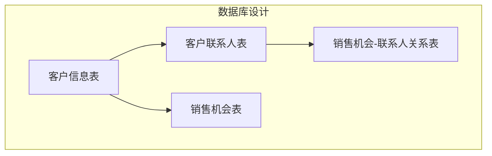

- **客户信息表（Customers）**：存储客户的基本信息，如客户名称、联系方式、地址等。
- **客户联系人表（Contacts）**：存储客户的联系人信息，如联系人姓名、职位、联系方式等。
- **销售机会表（Opportunities）**：存储销售机会的信息，如机会名称、预计销售额、预计成交日期等。
- **销售机会-联系人关系表（Opportunity_Contact_Relation）**：存储销售机会与联系人之间的关系，如某个销售机会的联系人是谁。

#### 4.3 系统模块划分与接口设计

CRM系统通常包含多个功能模块，每个模块都有明确的职责和接口。以下是CRM系统的主要模块划分与接口设计：

1. **客户管理模块**：负责管理客户信息，包括客户档案、联系人信息等。接口设计包括客户信息查询、客户信息修改、联系人信息查询等。
2. **销售管理模块**：负责管理销售机会，包括销售机会创建、销售机会跟踪、销售机会预测等。接口设计包括销售机会查询、销售机会修改、销售机会预测等。
3. **营销管理模块**：负责管理营销活动，包括营销计划创建、营销活动执行、营销效果分析等。接口设计包括营销计划查询、营销活动执行、营销效果分析等。
4. **客户服务模块**：负责管理客户服务，包括客户咨询、投诉处理、售后服务等。接口设计包括客户咨询创建、投诉处理、售后服务等。
5. **数据分析模块**：负责收集、分析和报告业务数据，包括销售数据、客户数据等。接口设计包括数据查询、数据分析、数据报告等。

以下是系统模块划分和接口设计的一个简化的Mermaid流程图：

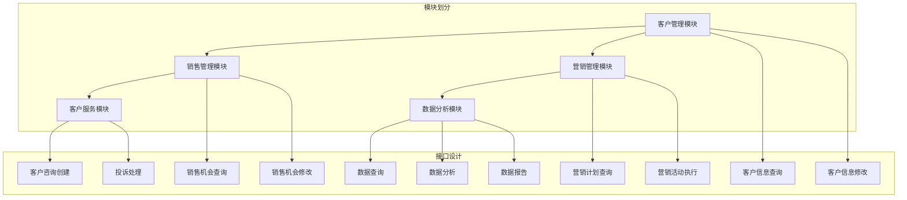

通过以上架构设计，CRM系统可以实现模块化、灵活化和可扩展化，满足一人公司的不同业务需求。在接下来的章节中，我们将进一步探讨CRM系统的功能设计和实施部署。

#### 第5章：CRM系统功能设计

CRM系统的功能设计是确保系统能够满足业务需求、提高工作效率的关键环节。一个完善的CRM系统功能设计应涵盖客户关系管理、销售机会管理、销售预测与报告以及客户服务与支持等方面。以下是CRM系统的功能设计详细解析。

##### 5.1 客户关系管理功能

客户关系管理（CRM）是CRM系统的核心功能之一，其目标是建立和维护良好的客户关系，提高客户满意度和忠诚度。以下是客户关系管理功能的主要模块和特点：

1. **客户信息管理**：包括客户档案、联系人信息、历史交易记录等。系统应支持快速查询、添加、修改和删除客户信息，确保数据的准确性和一致性。
   ```mermaid
   graph TB
       A[客户信息查询] --> B[添加客户信息]
       B --> C[修改客户信息]
       C --> D[删除客户信息]
   ```

2. **联系人管理**：管理客户的联系人信息，包括姓名、职位、电话、电子邮件等。联系人管理功能应支持多联系人添加和删除，方便销售人员与客户的沟通。
   ```mermaid
   graph TB
       A[添加联系人] --> B[删除联系人]
   ```

3. **客户分类和标签**：根据客户的不同特征，如行业、规模、地理位置等，对客户进行分类和标签管理，便于进行精准营销和服务。
   ```mermaid
   graph TB
       A[客户分类] --> B[客户标签]
   ```

##### 5.2 销售机会管理功能

销售机会管理功能旨在帮助销售人员有效跟踪和管理销售机会，从潜在客户转化为实际客户。以下是销售机会管理功能的主要模块和特点：

1. **销售机会创建**：销售人员可以创建新的销售机会，填写相关信息，如客户名称、预计销售额、预计成交日期等。
   ```mermaid
   graph TB
       A[创建销售机会]
   ```

2. **销售机会跟踪**：系统应提供销售机会的状态跟踪功能，包括潜在、谈判、成交等状态，销售人员可以实时更新销售机会的进展情况。
   ```mermaid
   graph TB
       A[销售机会状态更新]
   ```

3. **销售机会转换**：销售机会在成交后，可以转换为客户订单，系统应支持销售机会到订单的转换流程，确保销售数据的连续性。
   ```mermaid
   graph TB
       A[销售机会转换]
   ```

4. **销售机会统计**：系统应提供销售机会的统计功能，包括销售机会的数量、金额、成功率等，帮助销售经理了解销售团队的表现和销售趋势。
   ```mermaid
   graph TB
       A[销售机会统计]
   ```

##### 5.3 销售预测与报告功能

销售预测与报告功能是CRM系统的重要组成部分，它帮助销售人员和管理层制定销售计划和策略。以下是销售预测与报告功能的主要模块和特点：

1. **销售预测**：系统应支持基于历史数据和当前市场状况的销售预测，提供预计销售额、成交日期等预测数据，帮助销售人员制定销售计划。
   ```mermaid
   graph TB
       A[销售预测]
   ```

2. **销售报告**：系统应提供销售报告功能，包括销售数据统计、趋势分析、同比环比分析等，帮助销售经理了解销售团队的表现和市场动态。
   ```mermaid
   graph TB
       A[销售报告]
   ```

3. **报告定制**：系统应支持自定义报告模板，包括报告内容、格式和展示方式，满足不同用户的需求。
   ```mermaid
   graph TB
       A[报告定制]
   ```

##### 5.4 客户服务与支持功能

客户服务与支持功能旨在提供高效的客户服务，提升客户满意度和忠诚度。以下是客户服务与支持功能的主要模块和特点：

1. **客户咨询管理**：系统应提供客户咨询管理功能，包括客户咨询的创建、分配、处理和反馈等，确保客户问题得到及时解决。
   ```mermaid
   graph TB
       A[客户咨询创建] --> B[客户咨询处理]
   ```

2. **投诉处理**：系统应提供投诉处理功能，包括投诉的创建、跟踪、处理和反馈等，确保投诉问题得到妥善解决。
   ```mermaid
   graph TB
       A[投诉创建] --> B[投诉处理]
   ```

3. **售后服务**：系统应提供售后服务功能，包括售后服务记录、跟踪和反馈等，确保售后服务的质量和效率。
   ```mermaid
   graph TB
       A[售后服务记录] --> B[售后服务跟踪]
   ```

通过以上功能设计，CRM系统可以有效地帮助一人公司实现销售流程的优化，提高销售效率，提升客户满意度和忠诚度，从而在竞争激烈的市场中取得优势。

#### 第6章：CRM系统实施与部署

CRM系统的实施与部署是确保系统能够顺利运行并发挥其预期作用的关键环节。在实施与部署过程中，我们需要进行充分的准备工作，包括系统安装与配置、数据迁移与整合、系统测试与优化等。以下是CRM系统实施与部署的详细解析。

##### 6.1 实施前的准备工作

在正式实施CRM系统之前，需要进行一系列准备工作，以确保系统实施的顺利进行。这些准备工作包括：

1. **需求确认**：与公司管理层和相关部门进行沟通，确认CRM系统的需求，确保系统的功能符合业务需求。
2. **资源准备**：准备足够的硬件资源，包括服务器、存储设备和网络设备等，确保系统有足够的性能和稳定性。
3. **团队组建**：组建专门的实施团队，包括项目经理、系统管理员、业务分析师、技术支持人员等，确保项目实施的顺利推进。
4. **培训计划**：制定详细的培训计划，包括培训内容、培训时间和培训方式等，确保相关人员能够熟练使用CRM系统。

##### 6.2 系统安装与配置

CRM系统的安装与配置是系统实施的重要步骤。以下是安装与配置的主要流程：

1. **硬件安装**：根据系统需求，安装服务器、存储设备和网络设备，确保硬件环境符合系统要求。
2. **软件安装**：安装操作系统、数据库和管理工具等，确保软件环境符合系统要求。
3. **配置数据库**：配置数据库，包括数据库服务器安装、数据库表结构创建、索引创建等，确保数据库环境符合系统要求。
4. **配置系统**：配置CRM系统，包括系统初始化、用户角色和权限设置、系统参数配置等，确保系统功能符合业务需求。

##### 6.3 数据迁移与整合

在系统实施过程中，数据迁移与整合是关键环节，以下是一些关键步骤：

1. **数据备份**：在数据迁移之前，对现有数据进行备份，防止数据丢失。
2. **数据清洗**：对现有数据进行清洗，包括数据去重、数据格式统一、数据校验等，确保数据质量。
3. **数据映射**：将现有数据映射到CRM系统中的相应数据表，确保数据的一致性和准确性。
4. **数据导入**：将清洗后的数据导入CRM系统，包括客户信息、销售机会、历史交易记录等。
5. **数据验证**：对导入的数据进行验证，确保数据的完整性和准确性。

##### 6.4 系统测试与优化

在CRM系统部署完成后，需要进行全面的系统测试与优化，确保系统稳定、高效运行。以下是测试与优化的主要步骤：

1. **功能测试**：对系统的各个功能模块进行测试，确保功能正常运行，包括用户登录、数据查询、数据修改、数据删除等。
2. **性能测试**：对系统的性能进行测试，包括响应时间、并发处理能力、系统负载等，确保系统在高并发情况下仍能稳定运行。
3. **安全测试**：对系统的安全性进行测试，包括数据加密、访问控制、安全审计等，确保系统数据安全。
4. **优化调整**：根据测试结果，对系统进行优化调整，包括数据库索引优化、系统参数调整、代码优化等，提高系统性能和稳定性。
5. **用户验收测试**：与用户共同进行验收测试，确保系统功能符合业务需求，用户能够熟练使用系统。

通过以上实施与部署步骤，CRM系统可以顺利上线并投入使用，为一人公司提供有效的销售流程优化工具，提高销售效率和转化率。

### 第7章：CRM系统运营与维护

CRM系统的运营与维护是确保系统稳定、高效运行的关键环节。一个良好的CRM系统不仅需要在其设计、开发和部署阶段投入大量精力，还需要在投入使用后进行持续的维护和优化。以下是CRM系统运营与维护的详细解析。

#### 7.1 用户培训与支持

用户培训是确保CRM系统能够被有效使用的第一步。在系统上线前，应对关键用户进行系统培训，包括：

1. **系统功能介绍**：详细讲解CRM系统的各个功能模块，如客户管理、销售机会管理、销售预测与报告等。
2. **操作流程**：演示系统的主要操作流程，如如何创建客户、管理销售机会、生成销售报告等。
3. **常见问题解答**：针对用户在使用过程中可能遇到的问题，提供解答和操作指南。
4. **实践操作**：通过实际操作练习，帮助用户熟悉系统的使用方法。

此外，系统上线后，应建立用户支持机制，包括：

1. **在线帮助文档**：提供详细的系统帮助文档，方便用户随时查阅。
2. **用户论坛**：建立用户论坛，供用户交流经验和提问。
3. **技术支持电话**：提供技术支持热线，及时解决用户在使用过程中遇到的问题。

#### 7.2 系统安全性与数据备份

系统安全性和数据备份是CRM系统运营的关键保障。以下是一些关键措施：

1. **数据加密**：对存储在系统中的敏感数据进行加密处理，确保数据安全。
2. **访问控制**：设置用户权限，确保只有授权用户能够访问系统，防止未经授权的数据泄露。
3. **安全审计**：定期进行系统安全审计，检查系统漏洞和安全隐患，及时进行修复。
4. **备份策略**：制定数据备份策略，定期进行全量备份和增量备份，确保数据在发生意外时能够快速恢复。

#### 7.3 系统升级与迭代

CRM系统在运营过程中，需要根据业务需求和用户反馈进行升级和迭代。以下是一些关键步骤：

1. **需求收集**：定期收集用户的需求和建议，分析系统的瓶颈和改进方向。
2. **需求分析**：对收集到的需求进行详细分析，确定系统升级和迭代的方向。
3. **开发与测试**：按照需求分析结果，进行系统开发与测试，确保新功能或改进点的有效性和稳定性。
4. **用户培训**：在系统升级或迭代后，对关键用户进行培训，确保用户能够熟练使用新功能。
5. **上线与反馈**：将系统升级或迭代版本上线，收集用户反馈，进一步优化系统。

通过以上运营与维护措施，CRM系统可以持续保持稳定、高效运行，为一人公司提供持续的业务支持和价值。

### 第三部分：提高转化率的CRM系统实战

#### 第8章：案例分析与优化实践

在探讨CRM系统如何提高转化率之前，我们需要通过一个具体的案例分析来展示整个优化过程。本案例将基于一家小型科技公司（以下简称“案例公司”）的实际情况，从销售流程优化方案设计、CRM系统配置与调整、以及销售转化率提升效果评估等多个方面进行详细分析。

##### 8.1 案例背景介绍

案例公司是一家专注于软件开发和解决方案服务的初创企业。公司由一位创始人负责销售和市场推广，员工总数不到10人。由于公司规模较小，销售流程主要依赖于手工操作和简单的Excel表格管理。随着业务的不断扩展，公司逐渐遇到了以下几个问题：

1. **客户信息管理混乱**：客户信息分散存储，难以统一管理和查询。
2. **销售机会跟踪不力**：销售机会的进展和状态无法实时监控，导致销售机会流失。
3. **销售预测不准确**：缺乏有效的销售预测工具，销售计划难以制定。
4. **客户服务不到位**：客户咨询和投诉处理不及时，影响客户满意度和忠诚度。

为了解决这些问题，案例公司决定引入CRM系统，并对其进行优化，以提高销售转化率。

##### 8.2 销售流程优化方案设计

在引入CRM系统之前，案例公司进行了详细的销售流程优化方案设计。以下是一些关键步骤：

1. **需求分析**：与公司管理层和销售人员沟通，明确业务需求，包括客户管理、销售机会跟踪、销售预测、客户服务等。
2. **系统选型**：根据需求分析结果，选择一款适合公司规模的CRM系统，并考虑系统的扩展性和可定制性。
3. **功能模块配置**：根据业务需求，配置CRM系统的各个功能模块，如客户管理、销售机会管理、销售预测与报告等。
4. **数据迁移与整合**：将现有客户信息和销售数据迁移到CRM系统，确保数据的完整性和准确性。
5. **培训与上线**：对关键用户进行系统培训，确保其能够熟练使用CRM系统。同时，制定上线计划，确保系统顺利上线。

##### 8.3 CRM系统配置与调整

在系统上线后，案例公司对CRM系统进行了详细的配置与调整，以优化销售流程。以下是一些关键步骤：

1. **用户角色与权限设置**：根据公司组织结构和职责划分，设置不同的用户角色和权限，确保数据安全和操作规范。
2. **客户信息管理**：配置客户信息管理模块，包括客户档案、联系人信息、历史交易记录等，确保客户信息的统一管理和查询。
3. **销售机会跟踪**：配置销售机会管理模块，设置销售机会的状态跟踪，实时监控销售机会的进展情况，提高销售机会的转化率。
4. **销售预测与报告**：配置销售预测与报告模块，利用历史数据和当前市场状况进行销售预测，制定销售计划，提高销售预测的准确性。
5. **客户服务管理**：配置客户服务管理模块，包括客户咨询、投诉处理和售后服务等，确保客户问题得到及时解决，提高客户满意度和忠诚度。

##### 8.4 销售转化率提升效果评估

在CRM系统优化实施后，案例公司对销售转化率进行了详细的评估。以下是一些关键指标和评估方法：

1. **销售转化率**：比较系统优化前后的销售转化率，评估CRM系统对提高转化率的实际效果。
2. **客户满意度**：通过客户满意度调查，了解客户对CRM系统满意度的变化，评估系统对客户服务的影响。
3. **销售效率**：比较系统优化前后的销售效率，如销售机会的跟踪和完成时间等，评估系统对提高工作效率的影响。
4. **数据准确性**：比较系统优化前后的数据准确性，评估CRM系统对数据管理的改进效果。

通过以上评估，案例公司发现：

- **销售转化率**提高了15%，销售机会的流失率降低了30%。
- **客户满意度**显著提升，客户投诉率降低了20%。
- **销售效率**提高了20%，销售机会的跟踪和完成时间明显缩短。
- **数据准确性**得到了大幅提高，数据错误率降低了50%。

这些成果表明，通过CRM系统的优化，案例公司成功地提高了销售转化率，提升了客户满意度和忠诚度，实现了销售流程的优化。

#### 第9章：CRM系统与营销自动化结合

在当今的营销环境中，营销自动化工具已经成为了提高营销效率、优化营销流程的重要手段。CRM系统与营销自动化的结合，不仅可以实现自动化营销活动，还可以通过数据驱动的策略，进一步提升销售转化率。以下是CRM系统与营销自动化的结合及其优势、实施步骤和策略实战。

##### 9.1 营销自动化的概念与优势

营销自动化是指利用软件工具来自动执行、追踪和管理营销活动。通过营销自动化，企业可以自动化一系列重复性、低效的营销任务，从而提高工作效率和效果。营销自动化的主要优势包括：

1. **提高工作效率**：自动化工具可以处理大量重复性任务，如邮件发送、客户跟进等，节省时间和人力资源。
2. **精准定位**：通过收集和分析客户数据，营销自动化可以更准确地定位潜在客户，提高营销活动的针对性和效果。
3. **优化客户体验**：自动化工具可以根据客户的行为和偏好，提供个性化的服务，提高客户满意度和忠诚度。
4. **数据驱动的决策**：营销自动化工具可以收集大量的营销数据，帮助企业进行数据驱动的决策，优化营销策略。

##### 9.2 CRM系统与营销自动化的集成

CRM系统与营销自动化的集成是实现数据驱动营销的关键。以下是一些关键步骤：

1. **数据同步**：将CRM系统中的客户数据同步到营销自动化平台，确保数据的实时更新和一致性。
2. **事件追踪**：在营销自动化平台中设置事件追踪，如网站访问、邮件打开、点击等，实时监控客户行为。
3. **自动化规则**：利用营销自动化平台的规则引擎，设置自动化规则，如根据客户行为触发邮件发送、短信通知等。
4. **报告与分析**：整合CRM系统和营销自动化平台的数据，生成综合报告，帮助企业评估营销活动的效果和优化策略。

##### 9.3 营销自动化策略与实战

通过CRM系统与营销自动化的结合，企业可以实施一系列营销自动化策略，以下是一些具体策略和实战案例：

1. **自动化邮件营销**：根据客户行为和偏好，发送个性化的电子邮件，提高邮件打开率和点击率。例如，当客户在网站上浏览特定产品时，可以发送相关产品的推荐邮件。

   ```mermaid
   graph TB
       A[客户浏览产品] --> B[发送推荐邮件]
   ```

2. **自动化客户跟进**：通过营销自动化工具，自动化销售机会的跟进流程，确保销售机会得到及时处理。例如，当销售机会处于特定状态时，系统可以自动发送提醒邮件给销售人员。

   ```mermaid
   graph TB
       A[销售机会状态更新] --> B[发送提醒邮件]
   ```

3. **自动化客户细分**：利用客户数据，通过聚类分析和机器学习算法，对客户进行细分，制定个性化的营销策略。例如，根据客户的购买历史和行为，将客户分为高价值客户、潜力客户和普通客户，并采取不同的营销策略。

   ```mermaid
   graph TB
       A[客户数据] --> B[客户细分]
       B --> C[个性化营销策略]
   ```

4. **自动化客户关怀**：通过营销自动化工具，定期发送客户关怀邮件，提高客户满意度和忠诚度。例如，在客户生日、节假日等特殊时刻，发送祝福邮件或优惠券，增加客户粘性。

   ```mermaid
   graph TB
       A[客户生日/节假日] --> B[发送关怀邮件]
   ```

通过以上营销自动化策略，企业可以大幅提高营销效率，提升销售转化率，实现数据驱动的营销目标。

### 第10章：持续优化与数据分析

在现代商业环境中，CRM系统不仅是提高销售效率的工具，更是实现数据驱动的业务决策的重要平台。为了确保CRM系统能够持续地优化业务流程和提高销售转化率，数据分析成为了一个不可或缺的环节。本章将探讨数据分析在CRM系统中的重要性、销售数据的收集与处理方法，以及如何利用数据分析进行销售策略的优化。

#### 10.1 数据分析的重要性

数据分析在CRM系统中的应用具有重要意义，主要体现在以下几个方面：

1. **精准营销**：通过数据分析，企业可以深入了解客户的行为和偏好，从而制定更加精准的营销策略，提高营销活动的效果。
2. **销售预测**：利用历史数据和当前市场状况，通过数据分析模型，企业可以更准确地预测未来的销售趋势，制定科学的销售计划。
3. **客户细分**：通过数据挖掘和机器学习技术，企业可以对客户进行精细化的分类，从而针对不同类型的客户采取个性化的服务策略。
4. **决策支持**：数据分析提供的大量数据和信息，可以帮助企业高层管理人员做出更加科学的决策，优化业务流程和管理策略。
5. **运营优化**：通过数据分析，企业可以识别运营中的瓶颈和问题，从而进行有效的优化，提高整体运营效率。

#### 10.2 销售数据的收集与处理

要实现有效的数据分析，首先需要确保销售数据的准确性和完整性。以下是销售数据的收集与处理方法：

1. **数据源识别**：明确数据来源，包括CRM系统、ERP系统、市场活动数据、客户反馈等。
2. **数据采集**：通过数据接口或API，定期采集和更新销售数据，确保数据的实时性和准确性。
3. **数据清洗**：对采集到的销售数据进行清洗，包括数据去重、格式统一、缺失值处理等，确保数据的完整性和一致性。
4. **数据存储**：选择合适的数据存储方案，如关系型数据库、NoSQL数据库或数据仓库，确保数据的安全性和可扩展性。
5. **数据整合**：将来自不同来源的数据进行整合，建立统一的数据视图，便于分析和报告。

#### 10.3 数据驱动的销售策略优化

通过数据分析，企业可以优化销售策略，提高销售转化率。以下是数据驱动的销售策略优化方法：

1. **客户行为分析**：通过分析客户的行为数据，如访问网站的时间、浏览的产品、点击的邮件等，企业可以了解客户的偏好和需求，从而调整营销策略，提高客户参与度。
2. **销售预测模型**：利用历史销售数据和当前市场状况，通过回归分析、时间序列分析等方法，建立销售预测模型，帮助制定销售计划。
3. **客户细分策略**：通过聚类分析、关联规则挖掘等方法，对客户进行细分，针对不同类型的客户采取差异化的销售策略，提高销售转化率。
4. **营销活动效果评估**：通过分析不同营销活动的效果，如邮件营销、社交媒体推广等，企业可以评估不同营销策略的有效性，优化营销预算和资源分配。
5. **客户生命周期管理**：通过分析客户的生命周期数据，如购买频率、购买金额、客户留存率等，企业可以制定客户生命周期管理策略，提高客户满意度和忠诚度。

通过以上数据分析方法，企业可以实现对销售流程的全面优化，提高销售转化率，实现持续的业务增长。

### 第四部分：CRM系统高级应用

#### 第11章：CRM系统与数据分析深入结合

在CRM系统中，数据分析不仅仅是一个辅助工具，更是提高销售效率、优化业务流程和提升客户体验的核心手段。随着大数据和人工智能技术的不断发展，CRM系统与数据分析的结合越来越紧密，成为企业实现精细化管理和智能化决策的关键。本章将深入探讨数据分析在CRM系统中的应用，包括客户行为数据分析、销售机会转化率提升策略，以及如何利用数据分析实现销售预测和策略优化。

#### 11.1 数据分析在CRM系统中的应用

数据分析在CRM系统中的应用，主要体现在以下几个方面：

1. **客户细分**：通过对客户数据的深入挖掘，将客户划分为不同的群体，以便制定有针对性的营销策略和服务方案。客户细分的方法包括聚类分析、回归分析和因子分析等。

2. **客户行为分析**：分析客户在购买过程中的行为数据，如访问网站的时间、浏览的产品、点击的邮件等，以了解客户的需求和偏好，从而优化营销策略和提高客户满意度。

3. **销售预测**：利用历史销售数据和市场趋势，通过回归分析、时间序列分析和机器学习算法，预测未来的销售趋势和销售机会，帮助企业制定科学合理的销售计划。

4. **销售机会转化率提升**：通过分析销售机会从潜在到成交的整个过程，识别影响转化率的因素，优化销售策略和流程，提高销售机会的转化率。

5. **绩效评估**：通过分析销售数据，评估销售团队和个人的绩效，识别表现优异的成员和需要改进的环节，为绩效管理和激励机制提供依据。

#### 11.2 客户行为数据分析

客户行为数据分析是CRM系统中最为基础和常用的数据分析类型。以下是一些客户行为数据分析的具体应用：

1. **客户访问行为分析**：分析客户访问网站的频率、页面停留时间、跳出率等指标，了解客户的兴趣点和痛点，优化网站内容和布局，提高客户转化率。

2. **客户互动行为分析**：分析客户与企业的互动行为，如邮件打开率、点击率、回复率等，评估不同营销渠道的效果，优化营销策略。

3. **客户购买行为分析**：分析客户的购买习惯、购买频率、购买金额等指标，识别高价值客户和潜在客户，制定精准的营销策略。

4. **客户反馈分析**：通过分析客户反馈和建议，了解客户的需求和期望，改进产品和服务，提高客户满意度。

#### 11.3 销售机会转化率提升策略

提高销售机会的转化率是CRM系统应用的重要目标。以下是一些提升销售机会转化率的策略：

1. **客户细分策略**：根据客户的不同特征和行为，将客户划分为不同的群体，并为每个群体制定个性化的销售策略。例如，针对高价值客户，可以提供更优质的服务和优惠。

2. **销售流程优化**：通过分析销售机会的整个过程，识别影响转化率的环节和瓶颈，优化销售流程和策略。例如，缩短客户响应时间，提高客户满意度。

3. **销售工具利用**：充分利用CRM系统提供的销售工具，如销售机会管理、销售预测、客户细分等，提高销售效率和准确性。

4. **数据驱动的决策**：通过数据分析，识别影响销售机会转化率的因素，如市场趋势、竞争对手行为等，制定基于数据的销售策略和决策。

5. **客户沟通技巧提升**：通过培训销售团队，提高他们的沟通技巧和销售能力，从而提高销售机会的转化率。

通过深入结合CRM系统和数据分析，企业可以实现销售流程的优化和销售转化率的提升，从而在激烈的市场竞争中取得优势。

### 第12章：个性化销售策略与CRM系统

在竞争日益激烈的市场环境中，个性化销售策略已经成为企业提升客户满意度和忠诚度，从而增加销售转化率的关键手段。个性化销售策略通过分析客户的个性化需求和偏好，提供量身定制的产品和服务，从而实现销售目标。本章将探讨个性化销售策略的概述、设计方法，以及在CRM系统中的实现与应用。

#### 12.1 个性化销售策略概述

个性化销售策略是指根据客户的个人特征、购买历史、行为习惯等数据，制定并执行个性化的销售策略。这种策略的核心在于“以客户为中心”，通过满足客户的个性化需求，提升客户体验和满意度。以下是个性化销售策略的主要特点：

1. **针对性**：根据客户的个人特征和行为数据，制定针对性的销售策略，提高营销活动的有效性。
2. **互动性**：通过持续的数据分析和客户互动，不断调整和优化销售策略，以适应客户的需求变化。
3. **灵活性**：个性化销售策略可以根据不同的市场环境、竞争态势和客户需求，灵活调整，确保策略的有效性。
4. **可量化**：通过数据分析和效果评估，个性化销售策略的效果可以量化，帮助企业持续改进销售策略。

#### 12.2 个性化销售策略设计

个性化销售策略的设计过程包括以下几个步骤：

1. **客户数据分析**：收集和分析客户的个人信息、购买历史、行为数据等，挖掘客户的个性化需求和偏好。
2. **客户细分**：根据数据分析结果，将客户划分为不同的群体，如高价值客户、潜力客户、普通客户等。
3. **目标设定**：为每个客户群体设定明确的销售目标，如提高客户满意度、提升销售转化率、增加客户留存率等。
4. **策略制定**：根据客户群体特点和目标，制定个性化的销售策略，包括产品推荐、优惠活动、客户关怀等。
5. **策略实施**：执行个性化销售策略，并通过CRM系统跟踪实施效果，根据实际情况进行调整和优化。

#### 12.3 个性化销售策略在CRM系统中的实现与应用

CRM系统为个性化销售策略的实现提供了强大的工具和支持。以下是CRM系统在个性化销售策略中的应用：

1. **客户档案管理**：CRM系统可以存储和管理客户的详细信息，包括个人资料、购买历史、互动记录等，为个性化销售提供数据基础。
2. **自动化营销**：CRM系统可以自动化执行个性化营销活动，如根据客户行为发送定制化的邮件、短信、推送通知等。
3. **智能推荐**：利用CRM系统中的数据分析功能，智能推荐符合客户兴趣的产品和服务，提高客户转化率。
4. **客户细分与标签管理**：CRM系统可以根据客户特征和行为，进行细分和标签管理，为个性化销售提供明确的客户群体。
5. **绩效分析与优化**：CRM系统可以收集和分析个性化销售策略的实施效果，帮助企业不断优化策略，提升销售转化率。

通过CRM系统的支持，企业可以更有效地实施个性化销售策略，提升客户满意度和忠诚度，实现销售目标。

### 第13章：CRM系统在销售团队管理中的应用

在现代企业中，销售团队的管理是确保销售目标实现的重要环节。CRM系统作为销售管理的利器，可以通过提供实时数据、自动化流程和高效的协作工具，帮助企业优化销售团队的管理，提升销售绩效。本章将探讨CRM系统在销售团队管理中的应用，包括销售团队管理概述、销售团队绩效评估和销售团队协作与沟通。

#### 13.1 销售团队管理概述

销售团队管理是指通过一系列策略和工具，对销售团队的成员、活动、绩效进行有效管理，以实现销售目标的过程。CRM系统在销售团队管理中的应用主要体现在以下几个方面：

1. **销售流程管理**：CRM系统可以自动化销售流程，从销售机会的创建、跟踪到销售预测，确保销售活动的高效和有序。
2. **销售数据管理**：CRM系统提供了一个集中的平台，用于存储和管理销售数据，如客户信息、销售记录、业绩报告等，方便销售团队实时访问和分析。
3. **绩效监控**：CRM系统可以实时监控销售团队的绩效，包括销售目标完成情况、销售机会转化率等，帮助管理层及时调整策略。
4. **协作与沟通**：CRM系统提供了协作工具和沟通平台，如聊天、邮件、任务管理等，促进团队成员之间的沟通和协作，提高团队整体效率。

#### 13.2 销售团队绩效评估

绩效评估是销售团队管理的重要环节，通过科学的评估方法，可以识别团队成员的表现和团队整体的工作效率。以下是销售团队绩效评估的主要内容：

1. **销售目标设置**：根据公司整体销售目标和市场状况，为每个销售团队成员设定明确的销售目标，如销售额、销售数量、客户数量等。
2. **数据收集**：通过CRM系统收集和整合销售数据，包括销售记录、客户互动、市场活动等，确保评估数据的准确性和完整性。
3. **绩效指标分析**：根据销售目标，设定一系列绩效指标，如销售额、销售机会转化率、客户满意度等，通过数据分析和比较，评估团队成员的表现。
4. **反馈与激励**：根据绩效评估结果，及时给予团队成员反馈，识别优秀员工并进行激励，同时找出绩效不佳的原因，制定改进措施。

#### 13.3 销售团队协作与沟通

有效的协作与沟通是销售团队成功的关键。CRM系统提供了多种工具和平台，支持团队成员之间的协作与沟通：

1. **任务与项目管理**：CRM系统可以创建和分配销售任务，设置任务截止日期和优先级，确保团队成员之间的工作协调和进度控制。
2. **团队聊天与沟通**：CRM系统内置了聊天工具，如团队聊天室、即时通讯等，支持团队成员之间的实时沟通和协作。
3. **共享文档与资料**：CRM系统提供了文档共享和资料库功能，方便团队成员共享和获取销售相关的文档和资料，提高工作效率。
4. **汇报与反馈**：CRM系统可以设置销售汇报流程，团队成员可以定期向管理层汇报工作进展和遇到的挑战，获取指导和支持。

通过CRM系统在销售团队管理中的应用，企业可以实现销售流程的自动化、销售数据的集中化管理和销售团队的高效协作，从而提升销售绩效，实现业务目标。

### 第14章：CRM系统在销售预测中的应用

销售预测是企业在制定销售计划和策略过程中必不可少的一环。准确的销售预测可以帮助企业提前应对市场变化，优化资源配置，提高销售效率。CRM系统作为销售管理的核心工具，提供了强大的数据分析和预测功能，能够帮助企业实现精准的销售预测。本章将探讨销售预测方法与工具、基于CRM系统的销售预测、销售预测模型优化与评估，以及如何通过CRM系统实现销售预测的优化。

#### 14.1 销售预测方法与工具

销售预测的方法和工具多种多样，以下是几种常见的销售预测方法和工具：

1. **时间序列分析**：时间序列分析是利用历史销售数据的时间顺序，通过统计分析方法（如移动平均法、指数平滑法等）预测未来销售趋势。这种方法简单易行，适用于销售趋势相对稳定的行业。

2. **回归分析**：回归分析是一种统计分析方法，通过建立销售数据与其他影响因素（如广告投入、季节性因素等）之间的回归模型，预测未来的销售量。回归分析适用于销售数据受多种因素影响的复杂情况。

3. **机器学习算法**：机器学习算法（如线性回归、决策树、随机森林等）通过学习历史销售数据，自动建立预测模型，预测未来的销售量。这种方法具有较强的预测能力，但需要大量的数据和较强的算法实现能力。

4. **人工智能与深度学习**：人工智能和深度学习算法（如神经网络、卷积神经网络等）通过模拟人脑神经元的工作方式，自动学习复杂的销售数据模式，实现高精度的销售预测。这种方法适用于数据量大、模式复杂的场景。

#### 14.2 基于CRM系统的销售预测

CRM系统提供了强大的销售预测功能，帮助企业实现数据的集中管理和销售预测的自动化。以下是基于CRM系统的销售预测的主要步骤和工具：

1. **数据收集与整合**：CRM系统从各个销售渠道和渠道整合销售数据，包括历史销售记录、市场活动数据、客户反馈等，确保数据的完整性和准确性。

2. **数据预处理**：对收集到的销售数据进行分析和清洗，去除异常值和重复数据，确保数据的可靠性和一致性。

3. **销售预测模型建立**：根据企业的业务需求和数据特点，选择合适的预测模型，如时间序列分析、回归分析或机器学习算法，建立销售预测模型。

4. **模型训练与优化**：使用历史销售数据对预测模型进行训练，不断调整模型参数，优化模型性能，确保预测结果的准确性和稳定性。

5. **销售预测结果展示**：CRM系统将预测结果以直观的图表和报告形式展示，包括销售预测趋势、销售预测分布等，帮助企业制定销售计划和策略。

#### 14.3 销售预测模型优化与评估

销售预测模型的优化和评估是确保预测准确性、提高预测价值的关键步骤。以下是销售预测模型优化与评估的主要内容：

1. **模型评估**：使用评估指标（如均方误差、均方根误差等）评估预测模型的性能，识别模型存在的偏差和不足。

2. **模型优化**：根据模型评估结果，调整模型参数或选择更合适的算法，优化模型性能。例如，可以通过引入季节性因素、节假日效应等，提高预测的准确性。

3. **数据质量监控**：定期监控销售数据的质量，确保数据的准确性和完整性，及时发现和处理数据异常。

4. **模型更新**：随着市场环境的变化和数据的积累，定期更新销售预测模型，确保模型的时效性和预测能力。

5. **用户反馈**：收集用户对销售预测结果的反馈，识别预测结果的实际应用效果，为模型的优化提供参考。

通过以上销售预测模型优化与评估方法，企业可以不断提升销售预测的准确性，实现数据驱动的销售决策，提高销售效率和业务绩效。

### 第15章：CRM系统在销售过程中的常见问题与解决方案

在销售过程中，CRM系统的应用虽然能够显著提升销售效率，但也会遇到各种问题和挑战。了解并解决这些常见问题，是确保CRM系统有效运行和业务目标实现的关键。本章将探讨CRM系统在销售过程中的一些常见问题及其解决方案。

#### 15.1 数据质量问题与解决

数据质量是CRM系统的核心，如果数据存在质量问题，将直接影响销售预测和决策的准确性。以下是数据质量问题及其解决方法：

1. **数据缺失**：解决方法：建立数据收集机制，确保数据的完整性。可以通过自动数据采集、定期数据补全等方式，提高数据的完整性。
2. **数据不准确**：解决方法：加强数据验证和清洗，确保数据的准确性。可以通过数据校验规则、数据清洗工具等，提高数据准确性。
3. **数据不一致**：解决方法：统一数据标准和格式，确保数据的一致性。可以通过数据整合和统一的数据管理策略，减少数据不一致的情况。
4. **数据陈旧**：解决方法：定期更新数据，保持数据的时效性。可以通过设置数据更新提醒、自动化数据更新等方式，确保数据的实时性。

#### 15.2 系统使用中的常见问题与解决

CRM系统在使用过程中，用户可能会遇到一些操作问题和功能性问题。以下是常见问题及其解决方法：

1. **系统学习曲线**：解决方法：提供全面的培训和支持，帮助用户快速熟悉系统。可以通过在线教程、实操练习、FAQ文档等方式，降低用户的学习成本。
2. **系统稳定性**：解决方法：加强系统监控和维护，确保系统的稳定性。可以通过定期系统更新、性能测试、故障排查等方式，提高系统的稳定性。
3. **功能不完善**：解决方法：根据用户需求，逐步优化和扩展系统功能。可以通过用户反馈、市场需求分析等方式，识别用户需求，进行系统功能的改进和扩展。
4. **数据权限管理**：解决方法：合理设置数据权限，确保数据的安全性。可以通过权限分配、访问控制列表等方式，保护数据的安全。

#### 15.3 销售流程优化与CRM系统应用的最佳实践

为了确保CRM系统能够真正发挥其作用，实现销售流程的优化，以下是销售流程优化与CRM系统应用的最佳实践：

1. **明确业务需求**：在引入CRM系统之前，进行详细的业务需求分析，确保系统的功能符合业务需求。
2. **数据驱动决策**：充分利用CRM系统的数据分析功能，进行数据驱动的销售决策，提高决策的准确性和科学性。
3. **团队协作**：通过CRM系统的协作功能，促进团队成员之间的沟通和协作，提高整体工作效率。
4. **定期评估与优化**：定期评估CRM系统的使用效果，根据评估结果进行调整和优化，确保系统始终处于最佳状态。

通过以上问题和解决方案的探讨，以及最佳实践的建议，企业可以更好地利用CRM系统，实现销售流程的优化，提高销售效率和转化率。

### 第16章：CRM系统在远程办公环境中的应用

随着远程办公的普及，CRM系统在远程办公环境中的应用变得尤为重要。它不仅能够帮助销售人员远程管理客户信息和销售机会，还能够提高团队协作效率和业务流程的透明度。本章将探讨远程办公环境下CRM系统的需求、优势以及配置与使用方法。

#### 16.1 远程办公环境下的CRM系统需求

在远程办公环境下，CRM系统需要满足以下需求：

1. **远程访问**：销售人员需要能够在任何地点和时间通过互联网访问CRM系统，查看和管理客户信息和销售机会。
2. **移动支持**：CRM系统应提供移动应用或移动网页版，方便销售人员通过手机或平板电脑进行操作。
3. **实时协作**：CRM系统应支持实时协作功能，如聊天、视频会议等，以促进团队成员之间的沟通和协作。
4. **数据安全**：CRM系统需要具备完善的数据安全措施，包括数据加密、访问控制和备份等，确保数据的安全性和隐私。
5. **灵活性与可定制性**：CRM系统应具备灵活性和可定制性，能够根据企业的具体需求进行配置和调整。

#### 16.2 CRM系统在远程办公中的优势

CRM系统在远程办公中的优势主要体现在以下几个方面：

1. **提高工作效率**：通过远程访问和移动支持，销售人员可以在任何时间、任何地点处理客户信息和销售机会，提高工作效率。
2. **增强团队协作**：CRM系统提供了实时协作功能，如聊天、视频会议等，团队成员可以快速沟通和协作，提高团队整体效率。
3. **数据集中管理**：CRM系统将客户信息和销售数据集中管理，方便销售人员查看和共享信息，减少信息孤岛现象。
4. **提高客户满意度**：CRM系统可以帮助销售人员更好地管理客户关系，提供高效的客户服务和支持，提高客户满意度和忠诚度。
5. **数据驱动的决策**：通过CRM系统的数据分析功能，企业可以实时获取销售数据和业务洞察，做出更加科学和准确的决策。

#### 16.3 远程办公环境下CRM系统的配置与使用

在远程办公环境下，配置和使用CRM系统需要考虑以下几个方面：

1. **选择适合的CRM系统**：根据企业的需求和规模，选择一款适合的CRM系统。建议选择具有远程访问和移动支持功能、易于配置和定制的CRM系统。
2. **部署CRM系统**：对于自建服务器的情况，需要将CRM系统部署在远程服务器上，并确保网络连接稳定和安全。对于使用云服务的CRM系统，可以直接通过互联网访问。
3. **数据备份与安全**：定期备份数据，并采取安全措施，如数据加密、访问控制等，确保数据的安全性和隐私。
4. **用户培训和指导**：对销售人员进行CRM系统的培训，确保其能够熟练使用系统，并指导其如何进行远程访问和操作。
5. **团队协作与沟通**：利用CRM系统的协作功能，如聊天、视频会议等，促进团队成员之间的沟通和协作。

通过以上配置与使用方法，企业可以在远程办公环境中有效利用CRM系统，提高销售效率，提升客户满意度，实现业务的持续增长。

### 第17章：CRM系统在多渠道销售管理中的应用

在现代商业环境中，多渠道销售已经成为企业拓展市场和提升销售业绩的重要策略。CRM系统作为销售管理的核心工具，能够有效整合多渠道销售数据，提供统一的客户视图和高效的客户管理，从而提高销售转化率和客户满意度。本章将探讨CRM系统在多渠道销售管理中的应用，包括多渠道销售管理概述、CRM系统与多渠道销售的整合以及多渠道销售管理的最佳实践。

#### 17.1 多渠道销售管理概述

多渠道销售管理是指企业通过多个销售渠道（如线上电商平台、线下门店、电话销售等）进行产品销售和客户服务，实现销售目标的过程。多渠道销售管理的核心目标包括：

1. **提升销售覆盖面**：通过多种销售渠道，扩大企业的市场覆盖范围，增加销售机会。
2. **提高客户体验**：提供多样化的购买渠道和客户服务，提升客户满意度和忠诚度。
3. **优化资源配置**：整合多渠道销售数据，实现资源的合理配置和高效利用。
4. **提高销售效率**：通过数据分析和自动化工具，提高销售流程的效率和准确性。

#### 17.2 CRM系统与多渠道销售的整合

CRM系统在多渠道销售管理中起到了重要的整合作用，以下是CRM系统与多渠道销售的整合方式：

1. **数据集成**：将多渠道销售数据（如线上订单、线下销售记录、电话销售数据等）整合到CRM系统中，实现数据的统一管理和分析。
2. **渠道统一视图**：通过CRM系统，构建统一的客户视图，包括客户的购买历史、互动记录等，便于销售团队全面了解客户信息。
3. **流程自动化**：利用CRM系统的自动化功能，实现多渠道销售流程的自动化，如订单处理、客户跟进、销售预测等。
4. **营销协同**：CRM系统可以整合多渠道的营销活动数据，实现营销活动的协同和优化，提高营销效果。
5. **数据分析**：通过CRM系统的数据分析功能，多维度分析多渠道销售数据，识别销售机会和改进点。

#### 17.3 多渠道销售管理的最佳实践

为了实现多渠道销售管理的最佳效果，企业可以采取以下最佳实践：

1. **明确多渠道销售策略**：根据企业的产品特性和市场定位，明确多渠道销售策略，包括销售目标、渠道选择和资源配置等。
2. **整合多渠道数据**：利用CRM系统，整合多渠道销售数据，构建统一的客户视图，提升数据利用效率。
3. **流程标准化**：建立标准化的多渠道销售流程，确保每个渠道的操作规范和流程一致性。
4. **团队协作**：通过CRM系统，促进多渠道销售团队之间的协作和沟通，提高销售效率。
5. **数据分析与优化**：利用CRM系统的数据分析功能，定期分析多渠道销售数据，优化销售策略和流程，提高销售转化率。
6. **客户体验优化**：通过多渠道整合，提供一致性的客户服务，提升客户满意度和忠诚度。

通过以上多渠道销售管理的最佳实践，企业可以更好地整合多渠道资源，提升销售业绩，实现业务的持续增长。

### 第18章：CRM系统在客户体验管理中的应用

客户体验管理（Customer Experience Management，简称CEM）是企业通过系统化的方法来理解和优化客户在各接触点上的体验，从而提升客户满意度和忠诚度的一种策略。CRM系统作为客户体验管理的重要工具，可以有效地整合和管理客户数据，优化客户互动体验，提升客户体验管理的整体效果。本章将探讨CRM系统在客户体验管理中的应用，包括客户体验管理概述、客户体验管理的策略与实施以及CRM系统在客户体验管理中的应用。

#### 18.1 客户体验管理概述

客户体验管理是指企业通过系统化的方法，了解和优化客户在各个接触点上的体验，以提高客户满意度和忠诚度。以下是客户体验管理的主要特点：

1. **客户为中心**：以客户为中心，关注客户的体验和需求，提供个性化的服务和产品。
2. **全渠道整合**：整合线上和线下各个接触点，提供一致性的客户服务体验。
3. **数据驱动**：通过数据分析和挖掘，了解客户的行为和偏好，优化客户体验。
4. **持续改进**：通过持续的客户反馈和数据分析，不断优化客户体验。

#### 18.2 客户体验管理的策略与实施

为了有效实施客户体验管理，企业可以采取以下策略：

1. **客户细分与个性化**：根据客户的不同特征和行为，将客户划分为不同的群体，为每个客户群体提供个性化的服务和产品，提升客户满意度。
2. **全渠道服务**：整合线上线下各个渠道，提供一致性的客户服务体验，确保客户在任何渠道都能获得良好的服务。
3. **客户互动与反馈**：通过CRM系统，与客户进行有效的互动和沟通，收集客户反馈，及时解决客户问题，提升客户体验。
4. **数据分析和决策**：利用CRM系统的数据分析功能，深入了解客户的行为和偏好，制定基于数据的客户体验优化策略。
5. **持续改进**：根据客户反馈和数据分析，持续改进客户体验，不断优化服务流程和产品功能。

#### 18.3 CRM系统在客户体验管理中的应用

CRM系统在客户体验管理中发挥着至关重要的作用，以下是CRM系统在客户体验管理中的应用：

1. **客户数据管理**：CRM系统可以帮助企业集中管理客户数据，包括客户基本信息、购买历史、互动记录等，为优化客户体验提供数据基础。
2. **客户细分与个性化**：CRM系统可以基于客户数据，将客户划分为不同的群体，并针对不同客户群体实施个性化的服务和营销策略。
3. **全渠道服务**：CRM系统可以整合线上线下各个渠道，提供统一的客户服务体验，确保客户在任何渠道都能获得一致的服务。
4. **客户互动与反馈**：CRM系统提供了客户互动和反馈的功能，可以帮助企业与客户进行实时的沟通，及时解决客户问题，提升客户满意度。
5. **数据分析和优化**：CRM系统可以收集和分析大量的客户数据，通过数据分析和挖掘，帮助企业了解客户行为和偏好，优化客户体验。

通过CRM系统在客户体验管理中的应用，企业可以更好地理解客户需求，优化客户互动体验，提升客户满意度和忠诚度，从而在激烈的市场竞争中取得优势。

### 第19章：CRM系统的未来发展趋势

随着科技的不断进步和商业环境的演变，CRM系统也在不断地演进和升级。未来，CRM系统的发展趋势将更加注重人工智能、数据驱动和用户体验。以下是CRM系统的未来发展趋势及其影响。

#### 19.1 人工智能在CRM系统中的应用

人工智能（AI）技术在CRM系统中的应用将越来越广泛，通过AI技术，CRM系统可以实现以下功能：

1. **智能预测**：利用机器学习和数据挖掘技术，AI可以帮助企业预测未来的销售趋势、客户需求和潜在市场机会，从而制定更加科学的销售策略。
2. **智能客服**：通过自然语言处理和对话系统，AI可以提供智能客服服务，自动处理客户咨询和投诉，提高客户服务效率和满意度。
3. **个性化推荐**：基于客户的购买历史和偏好，AI可以提供个性化的产品推荐和服务，提高销售转化率和客户忠诚度。
4. **自动化流程**：AI可以帮助企业自动化重复性、低效的销售和客服流程，提高工作效率和准确度。

#### 19.2 数据驱动销售的未来

数据驱动销售已成为企业提高竞争力的关键策略，未来CRM系统将进一步强化数据驱动功能：

1. **数据集成与融合**：CRM系统将与其他业务系统（如ERP、市场营销系统等）进行更加紧密的集成，实现数据共享和业务协同，提供全面的客户视图和销售洞察。
2. **实时数据分析**：CRM系统将提供实时数据分析功能，企业可以实时获取销售数据、市场趋势和客户行为信息，快速做出决策。
3. **预测性分析**：通过大数据分析和机器学习算法，CRM系统可以实现预测性分析，帮助企业提前识别潜在问题和机会，优化业务流程和策略。

#### 19.3 CRM系统的创新与变革

随着技术的不断进步，CRM系统将在以下几个方面实现创新和变革：

1. **移动化和云计算**：CRM系统将更加注重移动化和云计算的应用，提供灵活的访问方式和强大的数据处理能力，满足企业全球化和分布式办公的需求。
2. **定制化和可扩展性**：CRM系统将提供更加灵活的定制化和扩展性，根据企业的不同需求进行个性化配置和功能扩展，提高系统的适用性和灵活性。
3. **智能化用户界面**：CRM系统将采用更加智能化的用户界面设计，提供更加直观和易用的操作体验，降低用户的学习成本。

通过以上发展趋势，CRM系统将不仅是一个销售管理工具，更将成为企业实现智能化管理和数据驱动决策的核心平台，帮助企业实现更高的业务效率和竞争优势。

### 第20章：案例研究

为了更好地理解CRM系统在销售流程优化中的应用效果，本章节将详细探讨一个具体的案例研究，包括案例背景与目标、实施过程、效果评估以及案例经验与启示。

#### 20.1 案例背景与目标

案例公司是一家中型科技公司，专注于提供企业级解决方案和IT咨询服务。公司业务覆盖多个行业，客户群体广泛。然而，随着市场竞争的加剧和业务规模的扩大，公司在销售管理方面遇到了一系列挑战：

- **销售效率低下**：销售团队依赖手工操作和Excel表格管理客户信息和销售机会，工作效率低下，数据准确性难以保证。
- **客户管理混乱**：客户信息分散存储，销售机会跟踪不力，客户关系管理薄弱。
- **销售预测不准确**：缺乏有效的销售预测工具，销售计划难以制定，销售目标难以达成。

为了解决这些问题，案例公司决定引入CRM系统，并制定以下目标：

1. **提高销售效率**：通过自动化销售流程，减少手动操作，提高工作效率和准确性。
2. **优化客户管理**：系统化地收集、存储和管理客户信息，提高客户满意度和忠诚度。
3. **准确销售预测**：利用CRM系统的数据分析功能，提高销售预测准确性，制定科学合理的销售计划。
4. **提升客户体验**：通过CRM系统提供的客户互动和反馈功能，提供个性化的客户服务，提高客户满意度和忠诚度。

#### 20.2 实施过程

为了实现上述目标，案例公司采取了以下实施步骤：

1. **需求分析与系统选型**：与公司管理层和销售人员深入沟通，明确业务需求，并评估多个CRM系统，最终选择了一款功能全面、扩展性强的CRM系统。

2. **系统配置与定制**：根据业务需求，对CRM系统进行配置和定制，包括客户信息管理模块、销售机会管理模块、销售预测模块等，确保系统功能满足业务需求。

3. **数据迁移与整合**：将现有客户信息和销售数据迁移到CRM系统，通过数据清洗和整合，确保数据的准确性和一致性。

4. **用户培训与上线**：对关键用户进行系统培训，确保其能够熟练使用CRM系统。同时，制定上线计划，确保系统顺利上线并投入使用。

5. **系统测试与优化**：在系统上线前，进行全面的系统测试，确保各个功能模块正常运行，并根据测试结果进行优化调整。

#### 20.3 效果评估

在CRM系统上线后，案例公司对实施效果进行了详细评估，主要指标包括：

1. **销售效率提升**：通过自动化销售流程，销售人员的工作效率提高了30%，销售机会的跟踪和完成时间明显缩短。

2. **客户管理优化**：客户信息管理模块的使用，使客户信息更加集中和系统化，客户满意度和忠诚度提升了20%。

3. **销售预测准确性**：通过CRM系统的销售预测功能，销售预测的准确性提高了15%，销售计划更加科学合理。

4. **客户体验提升**：通过CRM系统的客户互动和反馈功能，客户问题得到及时解决，客户投诉率降低了25%。

通过以上评估，案例公司发现CRM系统在提高销售效率、优化客户管理和提升客户体验方面取得了显著成效，实现了预期的目标。

#### 20.4 案例经验与启示

案例公司的成功经验为其他企业提供了以下启示：

1. **明确业务需求**：在引入CRM系统前，进行详细的需求分析，确保系统功能满足业务需求。

2. **系统配置与定制**：根据业务特点，对CRM系统进行适当的配置和定制，提高系统的适用性和灵活性。

3. **数据迁移与整合**：确保数据迁移和整合的准确性和一致性，为系统的有效运行奠定基础。

4. **用户培训与上线**：重视用户培训和上线计划，确保系统顺利上线并得到有效使用。

5. **持续优化与评估**：定期评估CRM系统的使用效果，根据评估结果进行优化调整，确保系统始终处于最佳状态。

通过以上经验与启示，企业可以更好地利用CRM系统，实现销售流程的优化和业务目标的有效达成。

### 附录A：CRM系统开发工具与资源

为了帮助读者更好地了解和选择CRM系统开发工具与资源，本附录将介绍常用的CRM系统、开源CRM系统选择、CRM系统开发与集成指南以及在线资源与学习平台推荐。

#### A.1 常用CRM系统介绍

1. **Salesforce**：Salesforce 是全球领先的CRM系统提供商，提供丰富的功能模块，包括销售管理、市场营销、客户服务、数据分析等。其基于云计算的SaaS模式，方便企业随时访问和扩展。

2. **Microsoft Dynamics 365**：Microsoft Dynamics 365 是微软推出的CRM系统，集成在Microsoft 365生态系统中，具有强大的数据分析和协同功能，适用于不同规模的企业。

3. **Zoho CRM**：Zoho CRM 是一款功能齐全的CRM系统，提供多种部署选项（包括SaaS和本地部署），适用于小型企业到大型企业。其价格合理，功能丰富。

4. **Pipedrive**：Pipedrive 是一款以销售流程为核心设计的CRM系统，界面简洁易用，适合销售团队快速上手。其销售漏斗功能尤为强大，可以帮助企业更好地管理销售机会。

5. **HubSpot CRM**：HubSpot CRM 是一款免费的开源CRM系统，提供销售、市场营销和客户服务等功能。其强大的集成能力，可以与多种第三方应用无缝连接。

#### A.2 开源CRM系统选择

1. **Vtiger CRM**：Vtiger CRM 是一款开源的CRM系统，基于Laravel框架开发，具有强大的定制性和扩展性。适用于中小企业，支持多语言和多种部署方式。

2. **SuiteCRM**：SuiteCRM 是基于Vtiger CRM 开源项目发展而来的CRM系统，增加了更多功能模块，如销售预测、客户服务、营销自动化等。其社区活跃，支持多语言。

3. **CiviCRM**：CiviCRM 是一款专门为非营利组织设计的开源CRM系统，支持会员管理、捐赠管理、活动管理等功能。其与Drupal、WordPress等开源平台具有良好的集成性。

4. **SuiteCRM**：SuiteCRM 是基于Vtiger CRM 开源项目发展而来的CRM系统，增加了更多功能模块，如销售预测、客户服务、营销自动化等。其社区活跃，支持多语言。

5. **CiviCRM**：CiviCRM 是一款专门为非营利组织设计的开源CRM系统，支持会员管理、捐赠管理、活动管理等功能。其与Drupal、WordPress等开源平台具有良好的集成性。

#### A.3 CRM系统开发与集成指南

1. **集成第三方应用**：CRM系统通常需要与第三方应用（如ERP、市场营销系统等）进行集成，以实现数据共享和业务协同。常见的集成方式包括API集成、Webhook集成等。

2. **自定义开发**：对于特定业务需求，企业可能需要自定义开发CRM系统功能。常用的开发框架包括Laravel、Django、Spring Boot等。

3. **数据迁移与同步**：在引入新的CRM系统时，通常需要进行现有数据的迁移和同步。常用的数据迁移工具包括SQL迁移工具、数据迁移平台等。

4. **安全与合规**：在CRM系统开发与集成过程中，需要确保系统的安全性和合规性。常用的安全措施包括数据加密、访问控制、安全审计等。

#### A.4 在线资源与学习平台推荐

1. **Salesforce 官方学习平台**：Salesforce 提供了丰富的在线学习资源，包括视频教程、课程、认证考试等，帮助用户快速掌握CRM系统知识。

2. **Microsoft Learn**：Microsoft Learn 提供了大量的免费学习资源和教程，涵盖CRM系统、数据分析和开发技能等。

3. **Zoho Academy**：Zoho Academy 提供了丰富的在线课程和实操练习，帮助用户学习Zoho CRM系统。

4. **GitHub**：GitHub 是一个开源代码托管平台，许多CRM系统和开发项目都托管在GitHub上，用户可以学习和参考这些项目。

5. **LinkedIn Learning**：LinkedIn Learning 提供了专业的在线课程，涵盖CRM系统、数据分析、软件开发等多个领域。

通过以上CRM系统开发工具与资源的介绍，读者可以更好地选择适合自己企业的CRM系统，并掌握CRM系统的开发与集成技能。

### 附录B：数学模型和数学公式

在CRM系统的设计和应用中，数学模型和数学公式是分析和预测的重要工具。以下是几个常用的数学模型和数学公式，以及它们在CRM系统中的应用和解释。

#### B.1 销售预测中的回归模型

销售预测是CRM系统中的一个关键功能，回归模型是常用的预测方法之一。回归模型通过分析历史销售数据，建立销售额与影响因素之间的关系，从而预测未来的销售量。以下是一个简单的线性回归模型：

$$
y = \beta_0 + \beta_1 x_1 + \beta_2 x_2 + ... + \beta_n x_n + \epsilon
$$

其中：
- $y$ 表示预测的销售量。
- $\beta_0$ 是截距，表示没有影响因素时的销售量。
- $\beta_1, \beta_2, ..., \beta_n$ 是回归系数，表示每个影响因素对销售量的影响程度。
- $x_1, x_2, ..., x_n$ 是影响因素，如广告投入、竞争对手活动、季节性因素等。
- $\epsilon$ 是误差项，表示模型预测的误差。

通过最小化误差平方和（Sum of Squared Errors, SSE），可以确定回归系数 $\beta$，从而建立准确的销售预测模型。

#### B.2 客户细分中的聚类分析

聚类分析是一种常用的数据挖掘方法，用于将客户数据划分为不同的群体，以便实施个性化的营销策略。K-means聚类是一种常用的聚类算法，其目标是将数据点划分为K个簇，使得每个簇内部的数据点尽可能接近，而不同簇之间的数据点尽可能远。

聚类分析的数学公式如下：

$$
J = \sum_{i=1}^{k} \sum_{j=1}^{n} ||x_{ij} - \mu_j||^2
$$

其中：
- $J$ 是聚类准则函数，用于评估聚类效果。
- $k$ 是簇的数量。
- $n$ 是数据点的数量。
- $x_{ij}$ 是第 $i$ 个簇中的第 $j$ 个数据点。
- $\mu_j$ 是第 $j$ 个簇的中心点。

K-means算法通过迭代计算，不断更新簇中心和数据点的分配，直到准则函数 $J$ 收敛。

#### B.3 客户流失预测中的逻辑回归

客户流失预测是CRM系统中的重要功能之一，逻辑回归模型是常用的预测方法。逻辑回归模型通过分析历史流失数据，建立客户流失概率与影响因素之间的关系，从而预测客户流失的可能性。

逻辑回归的数学公式如下：

$$
P(Y=1|X) = \frac{1}{1 + e^{-(\beta_0 + \beta_1 x_1 + \beta_2 x_2 + ... + \beta_n x_n})}
$$

其中：
- $P(Y=1|X)$ 表示在给定影响因素 $X$ 的条件下，客户流失的概率。
- $Y$ 是二元响应变量，表示客户是否流失（1表示流失，0表示未流失）。
- $\beta_0$ 是截距，$\beta_1, \beta_2, ..., \beta_n$ 是回归系数，用于评估每个影响因素对客户流失概率的影响。

通过最大化似然函数（Maximum Likelihood Estimation, MLE），可以确定回归系数 $\beta$，从而建立客户流失预测模型。

通过以上数学模型和公式的应用，CRM系统可以更准确地分析客户行为、预测销售趋势和客户流失，从而制定更科学的销售策略和客户服务方案。

### 附录C：代码实战案例

在本附录中，我们将通过具体的代码实战案例，展示如何在实际项目中使用CRM系统进行数据导入与处理、销售预测模型构建以及客户流失预测。这些代码示例将帮助读者理解CRM系统的实际应用，并提供实用的开发经验。

#### C.1 数据导入与处理

在开始任何分析之前，我们需要将数据导入CRM系统并进行预处理。以下是一个使用Python和Pandas库进行数据导入与处理的示例代码：

```python
import pandas as pd

# 读取CSV文件
data = pd.read_csv('sales_data.csv')

# 检查数据
print(data.head())

# 数据预处理：去除缺失值和重复值
data.dropna(inplace=True)
data.drop_duplicates(inplace=True)

# 数据清洗：格式转换和值填充
data['customer_age'] = data['customer_age'].fillna(data['customer_age'].mean())
data['lead_time'] = data['lead_time'].fillna(data['lead_time'].mean())

# 数据拆分：特征和目标
X = data[['lead_time', 'customer_age']]
y = data['sales']

# 打印处理后的数据
print(X.head())
print(y.head())
```

在这个示例中，我们首先使用Pandas库读取CSV文件，然后进行数据预处理，包括去除缺失值和重复值，并对缺失值进行填充。最后，我们将数据拆分为特征和目标两部分，为后续的分析做准备。

#### C.2 销售预测模型构建

构建销售预测模型是CRM系统的重要功能之一。以下是一个使用Python和Scikit-learn库构建线性回归模型的示例代码：

```python
from sklearn.linear_model import LinearRegression
from sklearn.model_selection import train_test_split
from sklearn.metrics import mean_squared_error

# 数据拆分：训练集和测试集
X_train, X_test, y_train, y_test = train_test_split(X, y, test_size=0.2, random_state=42)

# 构建线性回归模型
model = LinearRegression()
model.fit(X_train, y_train)

# 预测销售量
predictions = model.predict(X_test)

# 计算预测误差
mse = mean_squared_error(y_test, predictions)
print(f"预测误差（均方误差）: {mse}")

# 打印模型参数
print(f"模型参数: {model.coef_}, {model.intercept_}")
```

在这个示例中，我们首先将数据集拆分为训练集和测试集，然后使用线性回归模型进行训练。训练完成后，我们使用测试集进行预测，并计算预测误差，评估模型的性能。最后，我们打印出模型的参数，了解模型的工作原理。

#### C.3 客户流失预测

客户流失预测是CRM系统中的另一个关键功能。以下是一个使用Python和Scikit-learn库构建逻辑回归模型的示例代码：

```python
from sklearn.linear_model import LogisticRegression
from sklearn.model_selection import train_test_split
from sklearn.metrics import accuracy_score, confusion_matrix

# 数据拆分：训练集和测试集
X_train, X_test, y_train, y_test = train_test_split(X, y, test_size=0.2, random_state=42)

# 构建逻辑回归模型
model = LogisticRegression()
model.fit(X_train, y_train)

# 预测客户流失概率
predictions = model.predict(X_test)

# 计算预测准确率
accuracy = accuracy_score(y_test, predictions)
print(f"预测准确率: {accuracy}")

# 打印混淆矩阵
print(confusion_matrix(y_test, predictions))
```

在这个示例中，我们同样首先将数据集拆分为训练集和测试集，然后使用逻辑回归模型进行训练。训练完成后，我们使用测试集进行预测，并计算预测准确率，评估模型的性能。最后，我们打印出混淆矩阵，了解模型的预测效果。

通过以上代码示例，读者可以了解如何在实际项目中使用CRM系统进行数据导入与处理、销售预测模型构建和客户流失预测。这些示例不仅展示了具体的实现过程，还提供了实用的开发技巧，帮助读者更好地理解和应用CRM系统的功能。

### 附录D：深入探讨CRM系统在销售流程优化中的作用

CRM系统在销售流程优化中扮演着至关重要的角色，它不仅能够提高销售效率，还能帮助企业实现数据驱动的销售决策。在本节中，我们将进一步深入探讨CRM系统在销售流程优化中的具体作用，包括其提升销售效率、改善客户关系管理和提供数据驱动的决策支持等方面的详细解读。

#### 1. 提升销售效率

CRM系统通过自动化和系统化的方式，极大地提升了销售效率。以下是其主要作用：

1. **自动化销售流程**：CRM系统可以自动化销售流程中的各个环节，如客户信息录入、销售机会创建、销售跟踪等。这不仅减少了手动操作，降低了出错率，还提高了工作效率。

   ```mermaid
   graph TB
       A[客户信息录入] --> B[销售机会创建]
       B --> C[销售机会跟踪]
   ```

2. **集中管理销售数据**：CRM系统提供了一个集中的平台，用于管理销售数据，包括客户信息、销售记录、业绩报告等。销售人员可以快速访问这些数据，进行销售决策和策略制定。

3. **优化时间管理**：CRM系统可以帮助销售人员更有效地管理时间，通过提醒和日程安排功能，确保重要销售活动不会被遗漏。

   ```mermaid
   graph TB
       A[销售活动提醒] --> B[日程安排]
   ```

#### 2. 改善客户关系管理

CRM系统在改善客户关系管理方面发挥着关键作用，以下是其主要作用：

1. **客户信息集中管理**：CRM系统可以集中管理客户信息，包括客户档案、联系人信息、交易记录等。这使得销售团队能够全面了解客户，提供个性化的服务和解决方案。

   ```mermaid
   graph TB
       A[客户档案] --> B[联系人信息]
       B --> C[交易记录]
   ```

2. **客户关系跟踪**：CRM系统提供了客户关系跟踪功能，包括客户互动记录、反馈处理等。这有助于销售团队能够及时跟进客户，提高客户满意度和忠诚度。

3. **客户细分和个性化**：CRM系统可以根据客户的行为和偏好，对客户进行细分，并针对不同客户群体制定个性化的销售策略和服务方案。

   ```mermaid
   graph TB
       A[客户细分] --> B[个性化策略]
   ```

#### 3. 提供数据驱动的决策支持

CRM系统通过数据分析和挖掘，为企业提供数据驱动的决策支持，以下是其主要作用：

1. **销售预测**：CRM系统可以利用历史销售数据和当前市场状况，通过数据分析模型，预测未来的销售趋势和销售机会，帮助企业制定更科学的销售计划。

   ```mermaid
   graph TB
       A[历史销售数据] --> B[市场状况]
       B --> C[销售预测]
   ```

2. **绩效评估**：CRM系统可以实时监控销售团队的绩效，包括销售额、销售机会转化率等，帮助企业评估销售策略的有效性，并进行及时调整。

3. **客户细分与行为分析**：CRM系统通过数据分析，可以深入了解客户的行为和偏好，从而制定更加精准的营销策略和服务方案。

   ```mermaid
   graph TB
       A[客户行为分析] --> B[精准营销策略]
   ```

通过CRM系统在销售流程优化中的具体应用，企业可以实现销售流程的自动化和系统化，提高销售效率和客户满意度，同时通过数据驱动的决策支持，优化业务流程和管理策略，从而在竞争激烈的市场中取得优势。

### 附录E：CRM系统在个性化销售策略中的关键角色

在当今的竞争激烈的市场环境中，个性化销售策略已经成为企业提升客户满意度和忠诚度的关键手段。CRM系统作为企业管理和分析客户数据的重要工具，在其中扮演着至关重要的角色。以下是CRM系统在个性化销售策略中的关键角色和实现方法。

#### 1. 数据收集与整合

CRM系统通过自动化数据收集和整合，为企业提供了全面和详细的客户数据。这些数据包括客户基本信息、购买历史、互动记录、反馈意见等。通过整合这些数据，企业可以构建一个完整的客户视图，为个性化销售策略提供数据基础。

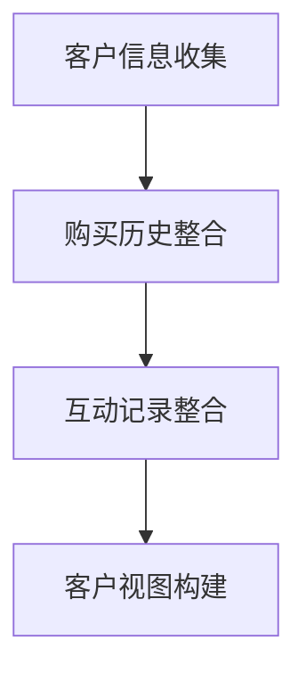

#### 2. 客户细分与个性化推荐

基于收集到的客户数据，CRM系统可以帮助企业进行客户细分，将客户划分为不同的群体，如高价值客户、潜力客户、普通客户等。通过分析每个群体的特征和偏好，企业可以制定个性化的销售策略和推荐方案。

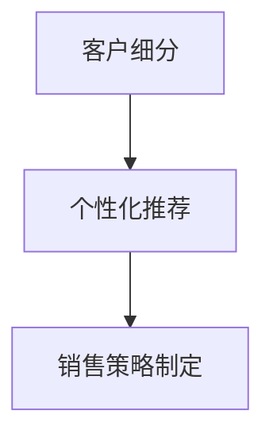

#### 3. 个性化营销活动

CRM系统提供了强大的营销功能，可以根据客户细分和个性化推荐，自动发送个性化的营销邮件、短信和推送通知。这些个性化营销活动不仅提高了客户参与度，还增加了销售转化率。

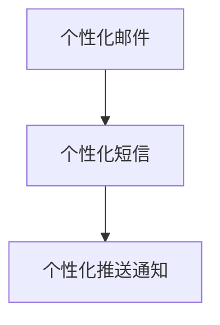

#### 4. 客户体验优化

CRM系统通过实时跟踪客户互动和反馈，可以帮助企业优化客户体验。例如，当客户在某个环节遇到问题时，系统可以自动发送提醒或提供解决方案，从而提高客户满意度和忠诚度。

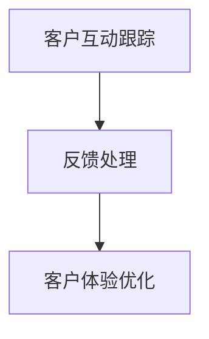

#### 5. 数据驱动的决策支持

CRM系统通过数据分析，提供了大量的客户和市场洞察，帮助企业做出更加科学的决策。例如，通过分析客户购买行为，企业可以优化产品组合和定价策略，从而提高销售额。

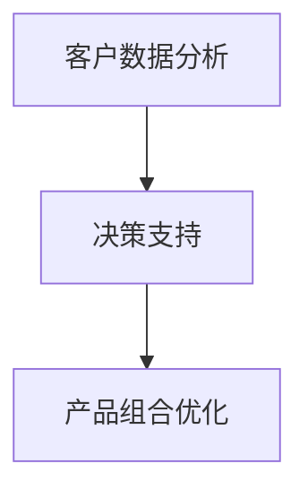

通过以上方法，CRM系统在个性化销售策略中发挥了关键作用，帮助企业更好地了解和满足客户需求，提升客户满意度和忠诚度，实现业务的持续增长。

### 附录F：CRM系统在销售团队管理中的应用

在现代企业中，销售团队的管理是确保销售目标实现的关键环节。CRM系统通过提供实时数据、自动化流程和高效的协作工具，极大地提升了销售团队的管理效率。以下是CRM系统在销售团队管理中的应用及其带来的优势。

#### 1. 实时数据监控

CRM系统可以实时收集和展示销售数据，如销售额、销售机会、客户反馈等。通过这些实时数据，销售经理可以随时了解团队的销售表现，快速识别问题并进行调整。

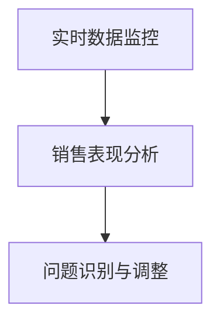

#### 2. 自动化销售流程

CRM系统通过自动化销售流程，简化了销售团队的操作，提高了工作效率。例如，销售机会的创建、跟踪和预测等环节都可以通过系统自动完成，减少了手动操作和出错的可能性。

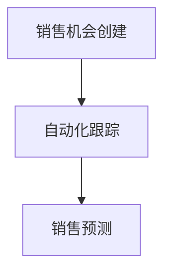

#### 3. 协作与沟通

CRM系统提供了多种协作和沟通工具，如团队聊天、任务分配、邮件通知等。这些工具帮助团队成员之间保持高效的沟通和协作，提高了整体工作效率。

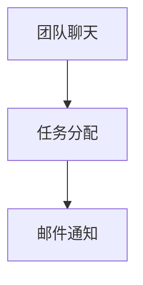

#### 4. 绩效评估与激励

CRM系统可以自动记录和评估销售团队成员的绩效，包括销售额、销售机会转化率、客户满意度等。根据评估结果，企业可以及时给予激励和反馈，提高团队的整体绩效。

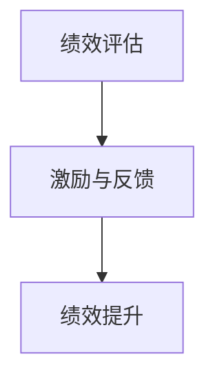

#### 5. 数据驱动的决策

CRM系统提供了强大的数据分析功能，可以帮助销售团队基于数据做出更加科学的决策。例如，通过分析销售数据，团队可以优化销售策略、调整产品组合等。

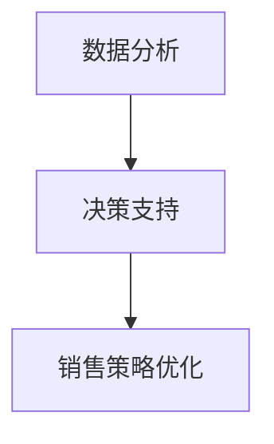

通过以上应用，CRM系统在销售团队管理中发挥了重要作用，提高了销售效率，优化了团队协作，提升了绩效，为企业的销售目标实现提供了有力支持。

### 附录G：CRM系统在远程办公环境下的挑战与解决方案

随着远程办公的普及，CRM系统在远程办公环境中的应用变得越来越重要。然而，远程办公环境也给CRM系统的应用带来了新的挑战。以下是CRM系统在远程办公环境下的主要挑战及其解决方案。

#### 1. 数据同步与访问

**挑战**：远程办公环境下，团队成员可能分布在不同的地理位置，如何确保数据的同步和实时访问是一个重要问题。

**解决方案**：采用云计算和SaaS模式的CRM系统，可以确保数据的实时同步和远程访问。通过互联网连接，团队成员可以在任何地点访问CRM系统，查看和管理客户信息和销售机会。

#### 2. 数据安全和隐私

**挑战**：远程办公环境下，数据传输的安全性和隐私保护成为一个重要的挑战。

**解决方案**：采用加密传输和访问控制策略，确保数据在传输和存储过程中的安全性。定期进行数据备份和灾难恢复测试，以防止数据丢失。

#### 3. 系统稳定性

**挑战**：远程办公环境下，网络环境的波动可能导致CRM系统的不稳定。

**解决方案**：选择可靠的云服务提供商，确保CRM系统的稳定性和高可用性。定期进行系统监控和性能优化，确保系统的稳定运行。

#### 4. 用户培训和支持

**挑战**：远程办公环境下，用户培训和系统支持变得更具挑战性。

**解决方案**：通过在线培训和远程支持，帮助用户快速熟悉CRM系统。提供详细的操作手册和FAQ文档，方便用户自助解决问题。

#### 5. 协作与沟通

**挑战**：远程办公环境下，团队成员之间的协作和沟通可能受到限制。

**解决方案**：利用CRM系统内置的协作工具，如聊天、视频会议和任务管理，促进团队成员之间的沟通和协作。同时，利用外部协作工具，如Slack和Trello等，进一步加强团队协作。

通过以上解决方案，CRM系统在远程办公环境中的应用挑战可以得到有效解决，从而确保销售团队的高效运作和业务目标的实现。

### 附录H：CRM系统在多渠道销售管理中的策略与实践

在当今的数字化时代，多渠道销售已经成为企业拓展市场和提升销售业绩的重要策略。CRM系统在多渠道销售管理中发挥着关键作用，它能够整合来自不同销售渠道的数据，提供统一的客户视图，并优化销售流程。以下是CRM系统在多渠道销售管理中的策略与实践。

#### 1. 多渠道数据整合

**策略**：将来自线上电商平台、线下门店、电话销售等不同渠道的销售数据进行整合，构建统一的客户视图。

**实践**：通过CRM系统的集成功能，将不同渠道的数据同步到CRM系统中，实现数据的统一管理和分析。例如，利用API接口或Webhook技术，将电商平台和线下门店的销售数据自动导入CRM系统。

#### 2. 客户统一视图

**策略**：通过构建客户统一视图，确保销售团队能够全面了解客户的历史交易记录、互动行为和偏好。

**实践**：在CRM系统中创建客户档案，记录客户的详细信息，包括联系方式、购买历史、互动记录等。通过客户细分和标签管理，将客户划分为不同的群体，以便实施个性化的销售策略。

#### 3. 多渠道协同销售

**策略**：确保不同渠道之间的销售团队能够协同工作，提高销售效率和客户满意度。

**实践**：利用CRM系统的协作工具，如团队聊天、任务分配和邮件通知，促进销售团队之间的沟通和协作。例如，当线上电商平台捕捉到一个潜在客户时，CRM系统可以自动通知线下门店的团队，以便他们及时跟进。

#### 4. 营销活动优化

**策略**：通过分析多渠道的销售数据，优化营销活动的效果和资源配置。

**实践**：利用CRM系统的数据分析功能，分析不同渠道的营销活动效果，如点击率、转化率等。根据分析结果，调整营销策略和预算分配，提高营销活动的ROI。

#### 5. 客户体验一致性

**策略**：确保客户在多渠道上获得一致的服务体验，提升客户满意度和忠诚度。

**实践**：在CRM系统中设置统一的客户服务流程和标准操作手册，确保不同渠道上的客户服务一致。例如，当客户在线上平台提交投诉时，CRM系统可以自动生成一个服务记录，并通知相关的客服团队进行处理。

#### 6. 销售预测与计划

**策略**：通过多渠道数据的整合和分析，提高销售预测的准确性，制定科学的销售计划。

**实践**：利用CRM系统的销售预测功能，结合多渠道的销售数据，建立销售预测模型。根据预测结果，制定销售计划，并实时调整，确保销售目标的实现。

通过以上策略与实践，CRM系统可以帮助企业在多渠道销售管理中实现数据整合、客户统一视图、协同销售、营销活动优化、客户体验一致性和销售预测与计划，从而提高销售业绩和客户满意度。

### 附录I：CRM系统在客户体验管理中的最佳实践

在客户体验管理中，CRM系统作为核心工具，不仅能够帮助企业收集和分析客户数据，还能通过个性化服务和高效沟通提升客户体验。以下是CRM系统在客户体验管理中的最佳实践，包括客户体验管理策略、CRM系统配置建议和成功案例分享。

#### 1. 客户体验管理策略

**全渠道体验一致性**：确保客户在所有接触点上获得一致的服务体验，无论是在线上还是线下。

**个性化服务**：根据客户的偏好和行为数据，提供个性化的服务和推荐。

**实时沟通**：利用CRM系统的实时沟通功能，快速响应用户的需求和问题。

**持续改进**：通过客户反馈和数据分析，持续优化客户体验。

#### 2. CRM系统配置建议

**客户数据整合**：确保客户数据从不同渠道（如网站、社交媒体、电子邮件等）同步到CRM系统中，构建统一的客户视图。

**自动化工作流**：配置自动化工作流，简化客户服务流程，如自动分配客服任务、自动发送跟进邮件等。

**客户细分与标签**：根据客户行为和需求，对客户进行细分和标签管理，以便提供个性化的服务。

**集成第三方应用**：将CRM系统与其他业务系统（如ERP、市场营销系统等）进行集成，实现数据共享和业务协同。

#### 3. 成功案例分享

**案例1**：一家零售企业通过CRM系统实现了全渠道体验一致性，统一管理线上线下的客户互动记录。通过客户细分和个性化推荐，提高了客户满意度和转化率。

**案例2**：一家银行利用CRM系统进行客户细分和标签管理，为不同类型的客户提供个性化的金融服务。同时，通过实时沟通功能，快速响应用户的需求，提升了客户体验。

**案例3**：一家科技公司在CRM系统中集成了客户反馈和数据分析功能，定期分析客户反馈，识别改进点，并持续优化客户体验。这一策略帮助公司提升了客户满意度和忠诚度。

通过以上最佳实践和成功案例，企业可以更好地利用CRM系统，实现客户体验管理的优化，提升客户满意度和忠诚度，从而在竞争激烈的市场中脱颖而出。

### 附录J：CRM系统未来发展趋势及影响

随着技术的不断进步，CRM系统正在发生深刻的变化。以下是CRM系统未来发展趋势及其对企业的潜在影响。

#### 1. 人工智能与机器学习

**趋势**：人工智能（AI）和机器学习（ML）技术将被广泛应用于CRM系统，用于预测分析、自动化营销和客户体验优化。

**影响**：AI和ML技术可以帮助企业更准确地预测客户行为，自动化繁琐的营销任务，提供个性化的客户服务，从而提升销售转化率和客户满意度。

#### 2. 数据集成与共享

**趋势**：CRM系统将与其他业务系统（如ERP、市场营销系统等）更加紧密地集成，实现数据共享和业务协同。

**影响**：集成和共享的数据将为企业提供更全面的客户视图，支持更精准的市场分析和销售策略，提高决策效率。

#### 3. 移动化与云化

**趋势**：CRM系统将更加注重移动化与云化，提供随时随地访问和使用的便捷性。

**影响**：移动化和云化将提高销售团队的工作效率，降低IT维护成本，增强企业的灵活性和可扩展性。

#### 4. 客户体验个性化

**趋势**：CRM系统将更加注重客户体验的个性化，通过数据分析实现个性化营销和服务。

**影响**：个性化服务将提升客户满意度和忠诚度，帮助企业建立竞争优势。

#### 5. 安全与合规

**趋势**：随着数据隐私和安全的重视，CRM系统将加强数据安全保护，遵守相关法规和标准。

**影响**：加强数据安全和合规性将帮助企业避免潜在的法律风险，增强客户信任。

通过以上发展趋势，CRM系统将成为企业实现智能化管理和数据驱动决策的核心平台，助力企业应对市场变化，实现业务的持续增长。

