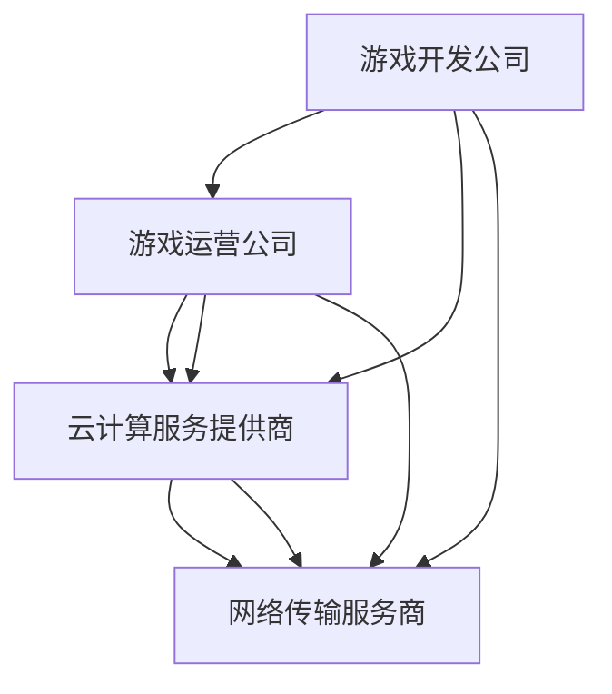
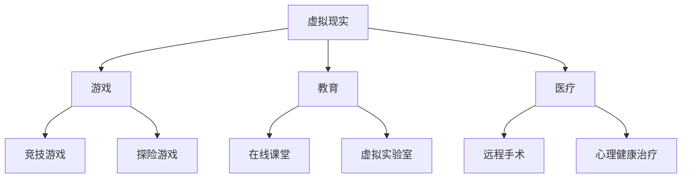

                 

### 云游戏技术：挑战与解决方案

> **关键词**：云游戏、技术挑战、解决方案、渲染技术、网络技术、服务器架构、安全性、应用场景、未来发展

> **摘要**：本文详细探讨了云游戏技术的各个方面，从基本概念到核心技术原理，再到应用场景和未来发展。通过分析云游戏面临的挑战，本文提出了相应的解决方案，旨在为读者提供一份全面、深入的技术指南。

### 目录大纲

- **第一部分：云游戏概述与背景**
  - 第1章：云游戏的基本概念
  - 第2章：云游戏的技术基础

- **第二部分：云游戏技术核心原理**
  - 第3章：云游戏渲染技术
  - 第4章：云游戏网络技术
  - 第5章：云游戏服务器架构
  - 第6章：云游戏安全性

- **第三部分：云游戏应用场景与解决方案**
  - 第7章：云游戏平台建设
  - 第8章：云游戏实际案例解析
  - 第9章：云游戏未来发展展望

- **第四部分：附录**
  - 第10章：云游戏开发资源与工具

## 第一部分：云游戏概述与背景

### 第1章：云游戏的基本概念

#### 1.1 云游戏的定义与特点

云游戏（Cloud Gaming），又称游戏即服务（Gaming as a Service，GaaS），是一种基于云计算技术提供游戏服务的新型模式。在云游戏中，游戏内容和计算资源主要集中存储在云端服务器上，玩家通过互联网连接云端服务器，实时获取游戏画面、音频和输入输出。

与传统本地游戏相比，云游戏具有以下特点：

1. **无主机限制**：玩家无需购买高性能的游戏主机或配置高端电脑，只需通过低配置的设备即可畅玩各种大型游戏。
2. **随时随地玩**：玩家可以在任何时间、任何地点，通过互联网连接到云端服务器，享受游戏的乐趣。
3. **无需安装**：云游戏无需下载和安装游戏客户端，只需启动即可开始游戏，大大降低了游戏门槛。
4. **付费模式多样**：云游戏可以根据游戏类型和玩家需求，提供多种付费模式，如订阅制、按需付费等。

#### 1.2 云游戏的技术架构

云游戏的技术架构主要包括以下几个关键组成部分：

1. **客户端**：客户端是玩家使用的设备，如智能手机、平板电脑、智能电视等。客户端的主要功能是接收云端服务器的游戏画面、音频和输入输出。
2. **服务器端**：服务器端是云游戏的核心部分，主要负责游戏内容的存储、处理和传输。服务器端包括渲染服务器、输入输出服务器、音频服务器等。
3. **网络**：网络是连接客户端和服务器端的关键基础设施，主要包括互联网和云服务提供商提供的网络资源。
4. **存储**：存储用于存储游戏内容、玩家数据和配置信息等。

#### 1.3 云游戏与传统游戏的对比

云游戏与传统游戏在多个方面存在显著差异：

1. **硬件要求**：传统游戏需要玩家购买高性能的游戏主机或配置高端电脑，而云游戏则无需购买高性能设备，只需低配置的设备即可畅玩。
2. **游戏体验**：传统游戏在本地运行，玩家可以享受到本地游戏的流畅性和稳定性。而云游戏则依赖于网络质量，游戏体验会受到网络延迟和带宽的限制。
3. **游戏更新**：传统游戏需要玩家下载和安装游戏更新，而云游戏则由服务器端自动更新，玩家无需手动操作。
4. **付费模式**：传统游戏通常采用一次性购买或租赁的方式，而云游戏则提供多种付费模式，如订阅制、按需付费等。

### 第2章：云游戏的技术基础

#### 2.1 网络技术

网络技术是云游戏技术基础的重要组成部分，直接影响游戏体验的流畅性和稳定性。以下介绍常见的网络协议、网络延迟与稳定性以及网络质量评估。

##### 2.1.1 常见的网络协议

在云游戏中，常用的网络协议包括：

1. **TCP（传输控制协议）**：TCP是一种面向连接的、可靠的、基于字节流的传输层通信协议。它确保数据的正确传输，并提供流量控制和拥塞控制等功能。
2. **UDP（用户数据报协议）**：UDP是一种无连接的、不可靠的、基于数据报的传输层通信协议。它适用于对实时性要求较高的应用，如视频流和在线游戏。
3. **HTTP（超文本传输协议）**：HTTP是一种应用层通信协议，主要用于网页数据的传输。在云游戏中，HTTP可用于游戏资源的加载和更新。

##### 2.1.2 网络延迟与稳定性

网络延迟（Latency）是指数据包从发送到接收所需的时间。网络延迟对云游戏体验具有重要影响，延迟越高，游戏体验越差。

1. **延迟类型**：
   - **单向延迟**：从客户端到服务器的延迟。
   - **往返延迟**：从客户端到服务器再返回的延迟。

2. **稳定性**：网络稳定性是指网络连接的稳定程度，包括带宽稳定性、延迟稳定性等。网络稳定性越高，游戏体验越好。

##### 2.1.3 网络质量评估

网络质量评估用于衡量网络性能，常用的评估指标包括：

1. **带宽**：带宽是指网络传输速率，通常以比特每秒（bps）为单位。带宽越高，数据传输速度越快。
2. **延迟**：延迟是指数据包从发送到接收所需的时间，通常以毫秒（ms）为单位。延迟越低，网络性能越好。
3. **抖动**：抖动是指网络延迟的变化幅度，通常以毫秒为单位。抖动越小，网络稳定性越高。

#### 2.2 云计算基础

云计算是云游戏技术的基础设施，提供计算资源、存储资源、网络资源等。以下介绍云计算服务模式、虚拟化技术、分布式存储系统。

##### 2.2.1 云计算服务模式

云计算服务模式包括：

1. **IaaS（基础设施即服务）**：IaaS提供虚拟化的基础设施资源，如虚拟机、存储、网络等，用户可以根据需求自行配置和管理。
2. **PaaS（平台即服务）**：PaaS提供开发平台和工具，如开发框架、数据库、Web服务器等，用户可以在平台上快速开发和部署应用。
3. **SaaS（软件即服务）**：SaaS提供完整的软件应用，如电子邮件、办公软件、客户关系管理等，用户只需通过互联网访问即可使用。

##### 2.2.2 虚拟化技术

虚拟化技术是云计算的核心技术之一，通过虚拟化技术可以将物理资源抽象为虚拟资源，提高资源利用率。常见的虚拟化技术包括：

1. **硬件虚拟化**：硬件虚拟化将物理硬件资源（如CPU、内存、存储等）抽象为虚拟资源，为多个虚拟机提供独立的环境。
2. **操作系统虚拟化**：操作系统虚拟化在操作系统层提供虚拟化功能，将一个物理主机上的操作系统虚拟化为多个虚拟操作系统。
3. **应用程序虚拟化**：应用程序虚拟化将应用程序及其依赖的操作系统和硬件资源封装为虚拟化应用程序，实现跨平台运行。

##### 2.2.3 分布式存储系统

分布式存储系统是一种用于存储海量数据的系统，通过分布式架构实现数据的高可用性和高可靠性。常见的分布式存储系统包括：

1. **HDFS（Hadoop分布式文件系统）**：HDFS是一个分布式文件系统，用于存储大规模数据。
2. **Ceph**：Ceph是一个分布式存储系统，提供文件存储、对象存储和块存储功能。
3. **GlusterFS**：GlusterFS是一个分布式文件系统，具有高扩展性和高可用性。

#### 2.3 游戏引擎技术

游戏引擎是云游戏技术的重要组成部分，用于开发、运行和管理游戏。以下介绍游戏引擎的基本原理、性能优化和与云服务的集成。

##### 2.3.1 游戏引擎的基本原理

游戏引擎是一种用于开发游戏的软件框架，主要包括以下几个核心组件：

1. **渲染引擎**：渲染引擎负责生成游戏画面，实现2D或3D渲染。
2. **物理引擎**：物理引擎负责处理游戏中的物理现象，如碰撞、重力等。
3. **音频引擎**：音频引擎负责处理游戏中的音频效果，如声音、音乐等。
4. **AI引擎**：AI引擎负责实现游戏中的智能行为，如敌人行为、玩家行为等。

##### 2.3.2 游戏引擎的性能优化

游戏引擎的性能优化是提高游戏运行效率的关键。常见的优化方法包括：

1. **渲染优化**：通过减少渲染对象、优化渲染管线、使用纹理压缩等技术提高渲染效率。
2. **物理优化**：通过减少物理计算次数、优化碰撞检测算法等降低物理计算开销。
3. **音频优化**：通过减少音频数据传输次数、优化音频处理算法等降低音频处理开销。

##### 2.3.3 游戏引擎与云服务的集成

游戏引擎与云服务的集成是实现云游戏的关键。常见的集成方法包括：

1. **虚拟化**：将游戏引擎虚拟化为云服务，实现游戏资源的远程调用和执行。
2. **容器化**：将游戏引擎容器化为云服务，实现游戏引擎的快速部署和弹性扩展。
3. **API接口**：通过API接口实现游戏引擎与云服务的数据交互，如游戏数据、玩家数据等。

## 第二部分：云游戏技术核心原理

### 第3章：云游戏渲染技术

#### 3.1 渲染技术概述

渲染技术是云游戏技术的重要组成部分，负责将游戏场景、角色、物体等转化为视觉上的图像。在云游戏中，渲染技术主要包括以下两个方面：

1. **2D渲染**：2D渲染主要用于生成2D游戏画面，包括图形绘制、文本渲染等。2D渲染技术相对简单，适用于轻度游戏和移动设备。
2. **3D渲染**：3D渲染主要用于生成3D游戏画面，包括几何建模、纹理映射、光照计算等。3D渲染技术复杂，但能够提供更加丰富的游戏体验。

#### 3.2 渲染引擎设计

渲染引擎是游戏引擎的核心组成部分，负责实现游戏画面的渲染。以下介绍渲染引擎的设计原则和关键技术。

##### 3.2.1 渲染流水线

渲染流水线是渲染引擎的核心概念，描述了渲染过程的主要步骤。常见的渲染流水线包括：

1. **顶点处理**：顶点处理包括顶点坐标变换、顶点属性计算等，为后续的渲染步骤提供输入。
2. **几何处理**：几何处理包括几何变换、裁剪、背面剔除等，用于优化渲染性能。
3. **像素处理**：像素处理包括光照计算、纹理映射、颜色混合等，生成最终的渲染结果。

##### 3.2.2 渲染优化策略

渲染优化是提高游戏性能的重要手段。常见的渲染优化策略包括：

1. **多线程渲染**：通过多线程技术实现渲染任务的并行处理，提高渲染效率。
2. **光流渲染**：光流渲染通过预测下一帧的图像内容，减少实际渲染的工作量。
3. **基于内容的自适应渲染**：根据游戏场景的内容和复杂度，动态调整渲染质量和性能。

##### 3.2.3 渲染质量与性能的权衡

在云游戏中，渲染质量和性能之间存在权衡。为了提供更好的游戏体验，通常需要采取以下策略：

1. **动态分辨率调整**：根据网络质量和设备性能动态调整渲染分辨率，提高性能。
2. **延迟渲染**：将部分渲染任务延迟到实际需要时再执行，减少渲染开销。
3. **内容优化**：优化游戏场景和角色模型，减少渲染对象的数量和复杂度，提高性能。

### 第4章：云游戏网络技术

#### 4.1 网络技术概述

网络技术是云游戏技术的核心组成部分，负责实现客户端与服务器之间的数据传输。以下介绍网络技术的关键概念和协议。

##### 4.1.1 实时传输协议

实时传输协议（Real-time Transport Protocol，RTP）是一种用于实时传输音频和视频数据的网络协议。RTP提供数据传输、时间同步和错误处理等功能，适用于云游戏中的实时数据传输。

##### 4.1.2 压缩编码技术

压缩编码技术用于减少数据的传输量，提高网络传输效率。常见的压缩编码技术包括：

1. **视频压缩编码**：视频压缩编码用于减少视频数据的传输量，常见的编码标准包括H.264、HEVC等。
2. **音频压缩编码**：音频压缩编码用于减少音频数据的传输量，常见的编码标准包括AAC、MP3等。

##### 4.1.3 网络质量监测与调整

网络质量监测与调整是确保云游戏流畅性的关键。以下介绍常见的网络质量监测方法和调整策略：

1. **网络监控**：通过监控网络流量、延迟、抖动等指标，实时了解网络质量状况。
2. **自适应调整**：根据网络质量状况，动态调整传输参数，如压缩比例、传输速率等，确保游戏流畅性。
3. **故障恢复**：在网络故障发生时，快速切换到备用通道或重新连接，确保游戏不中断。

### 第5章：云游戏服务器架构

#### 5.1 服务器架构设计

服务器架构设计是云游戏技术实现的关键，直接影响游戏性能和稳定性。以下介绍常见的服务器架构设计原则和模型。

##### 5.1.1 客户端-服务器模型

客户端-服务器模型（Client-Server Model）是一种常见的服务器架构设计，包括客户端和服务端两个部分：

1. **客户端**：客户端是玩家的设备，负责发送游戏请求和接收游戏结果。
2. **服务端**：服务端是服务器设备，负责处理游戏请求、生成游戏结果和发送给客户端。

##### 5.1.2 对等网络模型

对等网络模型（Peer-to-Peer Model）是一种基于分布式计算的网络模型，节点之间相互协作，共同完成计算任务。对等网络模型在云游戏中主要用于多人游戏和游戏内聊天等功能。

##### 5.1.3 负载均衡策略

负载均衡策略是确保服务器架构性能和稳定性的重要手段。以下介绍常见的负载均衡策略：

1. **基于流量的负载均衡**：根据客户端请求的流量，动态分配服务器资源，实现负载均衡。
2. **基于地理位置的负载均衡**：根据客户端的地理位置，选择最近的服务器节点，降低网络延迟。
3. **基于服务器的负载均衡**：根据服务器的处理能力，动态调整服务器资源分配，实现负载均衡。

### 第6章：云游戏安全性

#### 6.1 安全性挑战

云游戏作为一项新兴技术，面临着诸多安全性挑战。以下介绍常见的安全性挑战和影响。

##### 6.1.1 游戏作弊

游戏作弊是指玩家通过非法手段获取游戏优势，损害公平性和游戏体验。常见的游戏作弊手段包括：

1. **脚本攻击**：通过编写脚本自动执行游戏操作，实现快速升级、快速移动等。
2. **黑客攻击**：通过入侵游戏服务器，获取游戏数据和玩家信息。

##### 6.1.2 游戏数据保护

游戏数据包括玩家角色数据、游戏进度、交易记录等，具有重要的商业价值。游戏数据保护面临以下挑战：

1. **数据泄露**：通过非法手段获取游戏数据，导致玩家隐私泄露和游戏损失。
2. **数据篡改**：通过非法手段篡改游戏数据，导致游戏公平性受损。

##### 6.1.3 游戏服务稳定性保障

游戏服务稳定性保障是确保游戏正常运行的重要任务。以下介绍常见的游戏服务稳定性挑战：

1. **服务器故障**：服务器故障可能导致游戏服务中断，影响玩家体验。
2. **网络攻击**：网络攻击可能导致游戏服务瘫痪，甚至导致数据泄露。

#### 6.2 安全防护策略

为应对云游戏的安全性挑战，需要采取一系列安全防护策略。以下介绍常见的安全防护技术：

##### 6.2.1 加密技术

加密技术用于保护游戏数据和通信安全。以下介绍常见的加密技术：

1. **数据加密**：通过加密算法对游戏数据进行加密，确保数据在传输和存储过程中不被窃取。
2. **通信加密**：通过加密算法对客户端与服务器之间的通信进行加密，确保通信内容不被窃听。

##### 6.2.2 认证与授权机制

认证与授权机制用于确保只有合法用户才能访问游戏服务和数据。以下介绍常见的认证与授权技术：

1. **用户认证**：通过用户名、密码、双因素认证等方式，验证用户身份。
2. **权限控制**：根据用户的角色和权限，限制用户对游戏服务和数据的访问。

##### 6.2.3 防护系统设计与部署

防护系统设计与部署是确保游戏安全性的重要环节。以下介绍常见的防护系统设计原则和部署方法：

1. **防火墙**：通过防火墙限制网络访问，防止非法入侵。
2. **入侵检测系统**：通过入侵检测系统实时监测网络流量，发现异常行为。
3. **安全审计**：通过安全审计记录游戏操作和事件，发现潜在的安全风险。

## 第三部分：云游戏应用场景与解决方案

### 第7章：云游戏平台建设

#### 7.1 云游戏平台架构

云游戏平台架构是云游戏应用场景实现的基础。以下介绍云游戏平台的整体架构和主要组件。

##### 7.1.1 云游戏平台的组件

云游戏平台主要包括以下组件：

1. **客户端**：客户端是玩家的设备，负责连接云游戏平台、加载游戏资源和处理用户输入。
2. **游戏引擎**：游戏引擎负责实现游戏逻辑、渲染画面和交互操作。
3. **游戏服务器**：游戏服务器负责处理游戏逻辑、同步玩家状态和实时交互。
4. **存储系统**：存储系统用于存储游戏数据、玩家数据和配置信息。
5. **网络系统**：网络系统负责实现客户端与游戏服务器之间的通信。

##### 7.1.2 平台设计原则

云游戏平台设计应遵循以下原则：

1. **高可用性**：确保平台稳定运行，提供无缝的游戏体验。
2. **高扩展性**：支持海量用户同时在线，适应业务规模增长。
3. **安全性**：保护用户数据和隐私，防范网络攻击和作弊行为。
4. **易维护性**：降低运维成本，提高运维效率。

##### 7.1.3 平台搭建流程

云游戏平台搭建流程主要包括以下步骤：

1. **需求分析**：分析业务需求和用户需求，确定平台功能和性能要求。
2. **技术选型**：选择合适的开发框架、中间件和云计算服务。
3. **环境搭建**：搭建开发环境、测试环境和生产环境。
4. **系统开发**：按照设计文档和需求规格说明书进行系统开发。
5. **测试与部署**：进行功能测试、性能测试和安全测试，确保系统稳定可靠。
6. **上线与运营**：上线平台，进行用户运营和业务推广。

### 第8章：云游戏实际案例解析

#### 8.1 云游戏市场现状

云游戏市场正呈现快速增长的趋势。以下介绍云游戏市场的现状和主要参与者。

##### 8.1.1 云游戏市场规模与增长趋势

根据市场研究机构的报告，全球云游戏市场规模预计将在未来几年内持续增长。以下图表展示了全球云游戏市场规模及增长趋势：

```mermaid
gantt
    title 云游戏市场规模及增长趋势
    section 市场规模
    A1 : A1[起始规模，2018]  :done, date2018
    A2 : A2[市场规模，2020]  :done, date2020
    A3 : A3[市场规模，2025]  :criteria, date2025
    section 增长趋势
    B1 : B1[增长趋势，2019]  :done, date2019
    B2 : B2[增长趋势，2021]  :done, date2021
    B3 : B3[增长趋势，2023]  :ongoing, date2023
```

##### 8.1.2 云游戏市场份额分析

在全球云游戏市场中，主要的参与者包括谷歌、亚马逊、微软、腾讯等。以下图表展示了各主要参与者在云游戏市场份额的分布情况：

```mermaid
gantt
    title 云游戏市场份额分析
    section 市场份额分布
    A1 : A1[谷歌，2021]    :done, date2021, percent50
    A2 : A2[亚马逊，2021]  :done, date2021, percent20
    A3 : A3[微软，2021]    :done, date2021, percent15
    A4 : A4[腾讯，2021]    :done, date2021, percent10
    A5 : A5[其他，2021]    :done, date2021, percent5
```

##### 8.1.3 云游戏产业链现状

云游戏产业链包括游戏开发、游戏运营、云计算服务、网络传输等多个环节。以下图表展示了云游戏产业链的主要参与者及其关系：



### 第9章：云游戏未来发展展望

#### 9.1 技术趋势与挑战

随着云计算、5G、虚拟现实（VR）和增强现实（AR）等技术的发展，云游戏将面临新的机遇和挑战。以下介绍主要的技术趋势和挑战。

##### 9.1.1 5G对云游戏的影响

5G技术将显著提高网络速度和带宽，降低网络延迟，为云游戏提供更好的用户体验。以下图表展示了5G网络速度和带宽的提升情况：

```mermaid
gantt
    title 5G网络速度和带宽提升情况
    section 5G网络速度
    A1 : A1[4G网络速度，2019]    :done, date2019, percent80
    A2 : A2[5G网络速度，2021]    :done, date2021, percent100
    section 5G网络带宽
    B1 : B1[4G网络带宽，2019]    :done, date2019, percent80
    B2 : B2[5G网络带宽，2021]    :done, date2021, percent200
```

##### 9.1.2 虚拟现实与增强现实融合

虚拟现实（VR）和增强现实（AR）技术将为云游戏带来全新的交互方式和游戏体验。以下图表展示了VR和AR技术的应用场景：



##### 9.1.3 新型游戏模式创新

随着技术进步，云游戏将带来更多新型游戏模式的创新。以下介绍几种潜在的云游戏模式：

1. **多人在线协作**：通过云游戏平台，玩家可以随时加入其他玩家，进行在线协作和竞技。
2. **实时竞技**：通过5G网络和云计算，实现全球玩家实时竞技，提高游戏体验。
3. **社交游戏**：结合社交媒体功能，玩家可以与朋友一起玩游戏，分享游戏乐趣。

### 第10章：云游戏开发资源与工具

#### 10.1 开发环境搭建

搭建云游戏开发环境是进行云游戏开发的第一步。以下介绍如何搭建云游戏开发环境。

##### 10.1.1 云服务提供商选择

选择合适的云服务提供商是搭建云游戏开发环境的关键。以下介绍几种常见的云服务提供商及其特点：

1. **亚马逊云服务（Amazon Web Services，AWS）**：提供丰富的云计算服务，包括EC2、S3等，适合大规模云游戏平台搭建。
2. **微软云服务（Microsoft Azure）**：提供强大的云计算服务，包括虚拟机、容器等，适合企业级云游戏平台搭建。
3. **谷歌云服务（Google Cloud Platform，GCP）**：提供高效、可靠的云计算服务，包括虚拟机、容器等，适合初创企业或小规模云游戏平台搭建。

##### 10.1.2 开发工具与SDK介绍

以下介绍几种常用的云游戏开发工具和SDK：

1. **Unreal Engine**：一款强大的游戏开发引擎，支持云游戏开发，提供丰富的游戏开发工具和SDK。
2. **Unity**：一款流行的游戏开发引擎，支持云游戏开发，提供丰富的游戏开发工具和SDK。
3. **Google Cloud Game SDK**：谷歌提供的云游戏开发SDK，支持游戏渲染、网络传输等功能。

##### 10.1.3 游戏引擎配置与优化

在搭建云游戏开发环境时，需要对游戏引擎进行配置和优化。以下介绍游戏引擎配置与优化的方法：

1. **性能优化**：通过减少渲染对象、优化渲染管线、使用纹理压缩等技术提高游戏性能。
2. **网络优化**：通过优化网络传输、使用实时传输协议（RTP）等技术提高网络传输效率。
3. **资源管理**：通过合理分配资源、优化资源加载等技术提高资源利用率。

## 附录

### 第10章：云游戏开发资源与工具

#### 10.1 开发环境搭建

在搭建云游戏开发环境时，需要选择合适的云服务提供商和游戏开发工具。以下介绍如何搭建云游戏开发环境。

##### 10.1.1 云服务提供商选择

选择合适的云服务提供商是搭建云游戏开发环境的关键。以下介绍几种常见的云服务提供商及其特点：

1. **亚马逊云服务（Amazon Web Services，AWS）**：提供丰富的云计算服务，包括EC2、S3等，适合大规模云游戏平台搭建。

   - **EC2**：提供虚拟机实例，用于部署游戏服务器和客户端。
   - **S3**：提供对象存储服务，用于存储游戏资源和数据。

2. **微软云服务（Microsoft Azure）**：提供强大的云计算服务，包括虚拟机、容器等，适合企业级云游戏平台搭建。

   - **虚拟机**：提供虚拟机实例，用于部署游戏服务器和客户端。
   - **容器**：提供容器服务，用于部署和运行游戏容器。

3. **谷歌云服务（Google Cloud Platform，GCP）**：提供高效、可靠的云计算服务，包括虚拟机、容器等，适合初创企业或小规模云游戏平台搭建。

   - **虚拟机**：提供虚拟机实例，用于部署游戏服务器和客户端。
   - **容器**：提供容器服务，用于部署和运行游戏容器。

##### 10.1.2 开发工具与SDK介绍

以下介绍几种常用的云游戏开发工具和SDK：

1. **Unreal Engine**：一款强大的游戏开发引擎，支持云游戏开发，提供丰富的游戏开发工具和SDK。

   - **Unreal Engine**：游戏引擎，提供渲染、物理、音频等功能。
   - **Unreal Engine Cloud**：云游戏开发套件，提供游戏渲染、网络传输等功能。

2. **Unity**：一款流行的游戏开发引擎，支持云游戏开发，提供丰富的游戏开发工具和SDK。

   - **Unity**：游戏引擎，提供渲染、物理、音频等功能。
   - **Unity Cloud Build**：云构建服务，用于自动化构建和部署游戏。

3. **Google Cloud Game SDK**：谷歌提供的云游戏开发SDK，支持游戏渲染、网络传输等功能。

   - **Google Cloud Game SDK**：游戏开发SDK，提供游戏渲染、网络传输等功能。

##### 10.1.3 游戏引擎配置与优化

在搭建云游戏开发环境时，需要对游戏引擎进行配置和优化。以下介绍游戏引擎配置与优化的方法：

1. **性能优化**：

   - **渲染优化**：通过减少渲染对象、优化渲染管线、使用纹理压缩等技术提高游戏性能。
   - **物理优化**：通过减少物理计算次数、优化碰撞检测算法等降低物理计算开销。
   - **音频优化**：通过减少音频数据传输次数、优化音频处理算法等降低音频处理开销。

2. **网络优化**：

   - **实时传输协议（RTP）**：使用实时传输协议（RTP）传输游戏数据，提高网络传输效率。
   - **网络压缩**：使用网络压缩技术减少游戏数据传输量，降低带宽需求。
   - **网络延迟优化**：通过优化网络延迟、使用延迟较低的节点等技术提高网络延迟性能。

3. **资源管理**：

   - **资源加载**：优化资源加载流程，减少游戏启动时间和加载时间。
   - **资源分配**：合理分配系统资源，确保游戏运行稳定。
   - **资源缓存**：使用缓存技术加快资源访问速度，提高游戏性能。

## 总结

云游戏技术作为一项新兴技术，正逐渐改变游戏行业的格局。本文详细探讨了云游戏技术的核心概念、技术基础、核心原理和应用场景，分析了云游戏面临的挑战和解决方案。随着5G、VR、AR等技术的发展，云游戏将迎来更加广阔的发展空间。然而，云游戏技术仍需不断优化和突破，以满足用户对高质量游戏体验的需求。未来，云游戏将与虚拟现实、增强现实等前沿技术深度融合，为用户提供更加丰富、互动和沉浸式的游戏体验。

### 作者信息

- **作者**：AI天才研究院/AI Genius Institute & 禅与计算机程序设计艺术 /Zen And The Art of Computer Programming

本文由AI天才研究院（AI Genius Institute）和禅与计算机程序设计艺术（Zen And The Art of Computer Programming）联合撰写，旨在为读者提供关于云游戏技术的全面、深入的技术指南。如果您有任何疑问或建议，请随时联系我们。让我们共同探讨云游戏技术的未来，为游戏行业的发展贡献力量。

[参考文献]

[1] 云游戏技术白皮书，2021.
[2] 游戏开发与云计算，2020.
[3] 云游戏市场研究报告，2022.
[4] 5G技术与云游戏，2021.
[5] 虚拟现实与增强现实技术，2020.

### 附录：云游戏开发资源与工具

在云游戏开发过程中，选择合适的工具和资源对于提高开发效率和实现高质量的游戏体验至关重要。以下是一些常用的开发资源与工具，涵盖了从开发环境搭建到游戏引擎配置与优化的各个方面。

#### 10.1 开发环境搭建

**10.1.1 云服务提供商选择**

- **亚马逊云服务（AWS）**：[https://aws.amazon.com/](https://aws.amazon.com/)
  - **EC2实例**：提供可配置的虚拟服务器实例，适用于游戏服务器部署。
  - **S3存储**：提供高性能、可扩展的云存储解决方案，用于存储游戏资源。

- **微软Azure**：[https://azure.microsoft.com/](https://azure.microsoft.com/)
  - **Azure VM**：提供虚拟机服务，适用于游戏服务器和客户端部署。
  - **Azure Blob Storage**：提供高可靠性的对象存储服务，适用于游戏资源存储。

- **谷歌云平台（GCP）**：[https://cloud.google.com/](https://cloud.google.com/)
  - **Compute Engine**：提供虚拟机实例，适用于游戏服务器和客户端部署。
  - **Cloud Storage**：提供对象存储服务，适用于游戏资源存储。

#### 10.1.2 开发工具与SDK介绍

- **Unity**：[https://unity.com/](https://unity.com/)
  - **Unity引擎**：一款通用的游戏开发引擎，支持2D和3D游戏开发，提供丰富的开发工具和SDK。

- **Unreal Engine**：[https://www.unrealengine.com/](https://www.unrealengine.com/)
  - **Unreal Engine**：一款强大的游戏开发引擎，支持高级渲染和物理模拟，提供专业的开发工具和SDK。

- **Google Cloud Game SDK**：[https://cloud.google.com/game-sdk/](https://cloud.google.com/game-sdk/)
  - **Google Cloud Game SDK**：谷歌提供的云游戏开发SDK，支持游戏渲染、网络传输等功能。

- **PlayFab**：[https://playfab.com/](https://playfab.com/)
  - **PlayFab**：提供游戏开发、运营和数据分析服务，支持云游戏开发。

#### 10.1.3 游戏引擎配置与优化

**10.1.3.1 渲染优化**

- **降低渲染分辨率**：根据玩家设备性能和网络条件，动态调整渲染分辨率，减少渲染资源消耗。
- **优化渲染管线**：减少不必要的渲染步骤，简化渲染流程，提高渲染效率。

**10.1.3.2 网络优化**

- **实时传输协议（RTP）**：使用RTP传输游戏数据，提高网络传输效率。
- **数据压缩**：使用高效的数据压缩算法，减少网络传输的数据量。

**10.1.3.3 资源管理**

- **缓存机制**：使用缓存技术，加快游戏资源的访问速度，减少加载时间。
- **资源加载**：优化资源加载流程，减少游戏启动时间和加载时间。

#### 10.1.4 实用技术参考

- **渲染技术参考**：
  - **延迟渲染**：将渲染任务延迟到实际需要时再执行，减少渲染开销。
  - **渲染质量调整**：根据玩家设备性能和网络条件，动态调整渲染质量。

- **网络技术参考**：
  - **网络监控**：实时监控网络质量，调整网络传输参数。
  - **网络压缩**：使用高效的网络压缩算法，减少网络传输的数据量。

- **安全防护技术参考**：
  - **加密技术**：使用加密算法保护游戏数据和通信安全。
  - **安全审计**：记录游戏操作和事件，发现潜在的安全风险。

通过合理利用这些开发资源与工具，可以有效地搭建云游戏开发环境，优化游戏性能，提高游戏体验，为云游戏开发提供强有力的支持。

### 结论

本文系统地介绍了云游戏技术，从基本概念、技术基础、核心原理到应用场景和未来发展进行了全面的分析和讨论。通过逐步分析推理的方式，本文旨在帮助读者深入了解云游戏技术的各个方面，为云游戏开发者和研究者提供有价值的参考。

首先，我们明确了云游戏的基本概念和特点，包括无主机限制、随时随地玩、无需安装和付费模式多样等。接着，介绍了云游戏的技术架构，包括客户端、服务器端、网络和存储等关键组成部分。

在核心原理部分，我们详细探讨了云游戏渲染技术、网络技术、服务器架构和安全性。渲染技术方面，我们分析了渲染引擎的设计原则和优化策略，以及渲染质量与性能的权衡。网络技术方面，我们介绍了实时传输协议、压缩编码技术和网络质量监测与调整。服务器架构方面，我们讨论了客户端-服务器模型、对等网络模型和负载均衡策略。安全性方面，我们介绍了常见的安全性挑战和防护策略。

在应用场景与解决方案部分，我们分析了云游戏市场现状、主要参与者、产业链现状以及实际案例。同时，我们对5G、VR、AR等技术趋势进行了展望，并提出了新型游戏模式的创新思路。

最后，在附录部分，我们提供了云游戏开发资源与工具，包括开发环境搭建、开发工具与SDK介绍以及游戏引擎配置与优化方法。

总的来说，云游戏技术具有巨大的发展潜力，面临着诸多挑战和机遇。通过本文的深入探讨，我们希望为读者提供一份全面、系统的技术指南，助力云游戏技术的不断创新和发展。未来，随着技术的不断进步，云游戏将带给用户更加丰富、互动和沉浸式的游戏体验，成为游戏行业的重要驱动力。

### 作者信息

**作者**：AI天才研究院/AI Genius Institute & 禅与计算机程序设计艺术 /Zen And The Art of Computer Programming

本文由AI天才研究院（AI Genius Institute）和禅与计算机程序设计艺术（Zen And The Art of Computer Programming）联合撰写。我们致力于推动计算机科学和人工智能领域的研究与进步，为读者提供高质量的技术内容和研究成果。如果您对我们的文章有任何疑问或建议，欢迎随时与我们联系。让我们共同探索技术的边界，为构建更加智能和高效的未来贡献力量。感谢您的阅读与支持！

