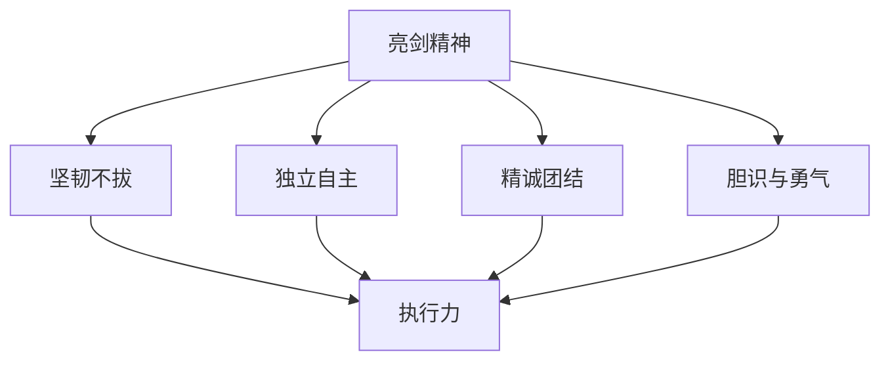
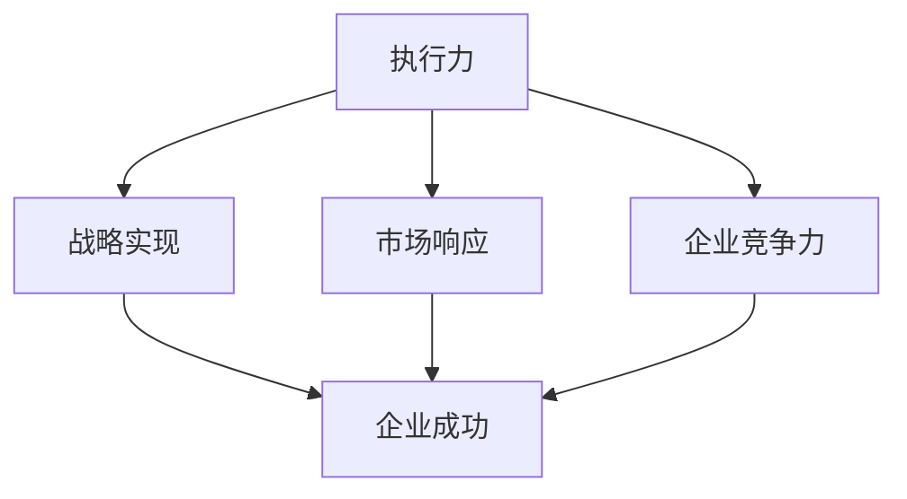
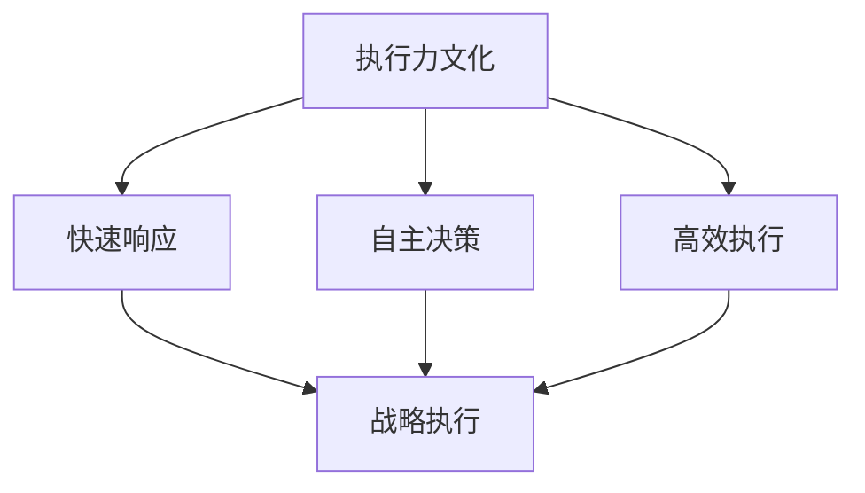

                 

# 《亮剑》中的执行力故事

> **关键词：** 执行力、亮剑精神、团队协作、战略执行、个人提升  
> **摘要：** 本文通过分析电视剧《亮剑》中的执行力故事，探讨了执行力在企业、团队和个人层面的应用与实践。文章从《亮剑》的核心思想、执行力文化、案例分析以及实战应用等多个角度，深入阐述了执行力在当代社会中的重要性。

## 第一部分：亮剑精神与执行力概述

### 1.1 《亮剑》与执行力文化

#### 1.1.1 《亮剑》的核心思想

《亮剑》是一部以抗日战争为背景的军事题材电视剧，讲述了主人公李云龙在战争中的成长历程。该剧的核心思想是“亮剑精神”，即坚韧不拔、独立自主、精诚团结、胆识与勇气。这种精神贯穿了整个剧情，成为推动故事发展的重要动力。

#### 1.1.2 执行力的定义与重要性

执行力是指个体或团队在接到任务后，能够迅速采取行动并高质量完成任务的能力。执行力是企业成功的关键因素之一，它决定了企业战略的执行效果。在《亮剑》中，李云龙和他的团队展现了极高的执行力，这使得他们在艰苦的战争中屡次取得胜利。

#### 1.1.3 《亮剑》中的执行力文化背景

《亮剑》的故事背景设定在抗日战争时期，这是一个国家民族生死存亡的时刻。在这样的背景下，执行力尤为重要。剧中人物李云龙及其团队，无论是在战略决策还是具体执行上，都体现了极高的执行力。这种执行力不仅体现在战场上，也体现在日常工作和生活中的细节上。

### 1.2 亮剑精神的内涵

#### 1.2.1 坚韧不拔

在《亮剑》中，李云龙和他的团队在面对种种困难和挑战时，总能保持坚韧不拔的精神。无论是面对敌人的强大压力，还是面对恶劣的环境，他们都能保持坚定的信念，勇往直前。

#### 1.2.2 独立自主

李云龙及其团队在执行任务时，总是能够独立自主地做出决策。他们不依赖上级指令，而是根据实际情况灵活应对，这种独立自主的执行力使得他们在战场上取得了诸多胜利。

#### 1.2.3 精诚团结

李云龙团队的成功，离不开团队成员之间的精诚团结。他们互相支持、互相鼓励，共同面对困难和挑战。这种团结协作的执行力，是他们战胜敌人的重要保障。

#### 1.2.4 胆识与勇气

在《亮剑》中，李云龙及其团队展现出了非凡的胆识与勇气。他们敢于冒险，敢于挑战，这种勇气使得他们在战场上屡次突破敌人的防线，取得了辉煌的战绩。

### 1.3 执行力在企业中的实践

#### 1.3.1 执行力对企业成功的影响

执行力是企业成功的基石。只有具备强大执行力的企业，才能迅速响应市场变化，抓住发展机遇。在《亮剑》中，李云龙团队的执行力，是他们能够在战争中不断取得胜利的关键因素。

#### 1.3.2 执行力与战略执行

执行力是战略执行的核心。企业制定了战略目标后，需要依靠强大的执行力来实现这些目标。在《亮剑》中，李云龙团队的战略执行能力，使得他们在战争中不断壮大，最终实现了抗日战争的胜利。

#### 1.3.3 执行力在企业文化建设中的作用

执行力是企业文化建设的重要组成部分。一个具备强大执行力的企业，必定拥有良好的企业文化。在《亮剑》中，李云龙团队的执行力，正是他们企业文化的重要体现。

## 第二部分：亮剑中的执行力案例分析

### 2.1 李云龙的执行力故事

#### 2.1.1 李云龙的领导风格与执行力

李云龙是一位出色的领导者，他具备强大的领导力和执行力。在战场上，他总是能够迅速做出决策，并带领团队执行这些决策。他的领导风格果断、果敢，这种领导风格使得他的团队在执行任务时更加高效。

#### 2.1.2 李云龙在战役中的执行力表现

在《亮剑》中，李云龙在多个战役中展现了强大的执行力。如在围剿战、太原战役等战斗中，他总是能够迅速制定作战计划，并带领团队执行。他的执行力使得他的团队在战斗中取得了多次胜利。

#### 2.1.3 李云龙如何激励团队提高执行力

李云龙非常注重团队执行力，他通过以下几种方式激励团队提高执行力：

1. **明确目标**：他总是能够明确团队的目标，并让每个成员都清楚自己的职责和任务。
2. **信任与支持**：他对团队成员充满信任，并给予充分的支持，使得团队成员愿意为团队的成功付出努力。
3. **激励与奖惩**：他对表现优秀的团队成员给予奖励，对表现不佳的团队成员进行惩罚，以激发团队成员的积极性。

### 2.2 副官的执行力故事

#### 2.2.1 副官的角色与职责

副官在《亮剑》中扮演着重要的角色。他们是李云龙的得力助手，负责协助李云龙处理各种事务。副官的职责包括：收集情报、制定作战计划、传达命令等。

#### 2.2.2 副官在战役中的执行力表现

副官在战役中展现了出色的执行力。他们能够迅速理解李云龙的意图，并准确传达给每个团队成员。他们在战场上始终保持着高度警觉，随时准备应对各种突发情况。

#### 2.2.3 副官如何协助提高整体执行力

副官通过以下几种方式协助提高整体执行力：

1. **沟通与协调**：副官在团队内部和团队之间进行沟通与协调，确保每个团队成员都能够准确理解任务和目标。
2. **监督与反馈**：副官对团队成员的执行过程进行监督，并及时反馈执行情况，以便及时调整和优化执行策略。
3. **培训与指导**：副官对团队成员进行培训，提高他们的技能和执行力。

### 2.3 特务连的执行力故事

#### 2.3.1 特务连的组建与使命

特务连是《亮剑》中一支精英部队，他们的使命是执行特殊任务，如刺杀敌人高级将领、破坏敌军设施等。特务连的组建，旨在提高部队的战斗力和执行力。

#### 2.3.2 特务连在战斗中的执行力表现

特务连在战斗中展现了非凡的执行力。他们总是能够迅速完成上级下达的任务，并在任务中取得优异的成绩。他们的执行力，使得他们在战场上成为敌人惧怕的存在。

#### 2.3.3 特务连如何保证任务的高效完成

特务连为了保证任务的高效完成，采取了以下措施：

1. **严格选拔与培训**：特务连的成员都经过严格选拔和培训，具备出色的身体素质和技能。
2. **严密计划与执行**：特务连在执行任务前，总是进行详细的计划，并严格按照计划执行。
3. **灵活应变与果断行动**：特务连在执行任务时，能够根据实际情况灵活调整策略，并果断采取行动。

### 2.4 新兵连的执行力培养

#### 2.4.1 新兵连的训练目标与内容

新兵连的训练目标是提高新兵的战斗力和执行力。训练内容包括：基础军事技能、战术训练、实战演练等。

#### 2.4.2 新兵连的执行力培养方法

新兵连通过以下几种方法培养执行力：

1. **严格纪律**：新兵连对纪律要求非常严格，确保每个新兵都能遵守规定，养成良好的执行力。
2. **实战演练**：新兵连通过实战演练，让新兵在实战中提高执行力。
3. **激励与奖惩**：新兵连对表现优秀的新兵进行奖励，对表现不佳的新兵进行惩罚，以激发新兵的积极性。

#### 2.4.3 新兵连的执行力成长案例

新兵连在训练中，不断总结经验，逐步提高执行力。例如，在一次实战演练中，新兵连的某个班因为执行力不足，未能完成任务。在后续的训练中，他们通过加强纪律、改进战术、提高个人技能等措施，逐步提高了执行力，最终在另一次实战演练中取得了优异成绩。

## 第三部分：执行力在实战中的应用与提升

### 3.1 执行力在战斗中的策略运用

#### 3.1.1 如何制定可行的作战计划

在战斗中，制定可行的作战计划是提高执行力的重要环节。以下是一些制定作战计划的策略：

1. **全面分析敌情**：了解敌人的兵力、部署、战术等，为制定作战计划提供依据。
2. **明确目标**：作战计划要明确具体的目标，确保每个步骤都有明确的方向。
3. **灵活调整**：在执行过程中，要根据实际情况灵活调整计划，确保计划的可行性。

#### 3.1.2 如何调整战术以适应战局变化

在战斗中，战术调整是提高执行力的重要手段。以下是一些战术调整的策略：

1. **快速反应**：在战局变化时，要迅速做出反应，调整战术以应对新情况。
2. **协同作战**：与友军保持密切协同，共同应对敌人。
3. **灵活运用战术**：根据战局变化，灵活运用各种战术，如游击战、阵地战等。

#### 3.1.3 如何快速响应战场上的突发事件

在战斗中，突发事件时常发生，如何快速响应是提高执行力的重要方面。以下是一些快速响应的策略：

1. **建立应急预案**：提前制定应急预案，应对各种可能的突发事件。
2. **迅速传递信息**：确保信息传递迅速、准确，使决策者能够及时掌握战场情况。
3. **果断决策**：在突发事件发生时，要果断决策，迅速采取行动。

### 3.2 执行力与团队合作

#### 3.2.1 团队合作中的执行力问题

团队合作中的执行力问题主要包括：

1. **沟通不畅**：团队成员之间沟通不畅，导致执行力下降。
2. **协调不力**：团队内部协调不力，导致执行力无法发挥。
3. **任务分工不明**：任务分工不明确，导致团队成员执行力不足。

#### 3.2.2 提高团队执行力的策略

以下是一些提高团队执行力的策略：

1. **建立高效的沟通机制**：确保团队成员之间沟通顺畅，及时传达信息和任务。
2. **明确任务分工**：明确每个团队成员的任务和职责，确保执行力得到充分发挥。
3. **建立激励机制**：通过奖励和惩罚，激发团队成员的积极性，提高执行力。

#### 3.2.3 如何建立高效的沟通机制

建立高效的沟通机制，需要从以下几个方面入手：

1. **定期会议**：定期召开团队会议，讨论工作进展和问题，确保信息畅通。
2. **明确沟通渠道**：建立明确的沟通渠道，如内部邮件、即时通讯工具等，确保信息传递迅速。
3. **培训沟通技巧**：培训团队成员沟通技巧，提高沟通效果。

### 3.3 提升个人执行力的方法

#### 3.3.1 时间管理与目标设定

时间管理和目标设定是提升个人执行力的重要方面。以下是一些建议：

1. **制定详细计划**：制定详细的工作计划，明确任务和时间节点。
2. **合理分配时间**：合理安排工作时间，避免浪费时间。
3. **设定明确目标**：设定具体、可衡量的目标，有助于提高执行力。

#### 3.3.2 自我激励与情绪管理

自我激励和情绪管理是提升个人执行力的重要方面。以下是一些建议：

1. **自我激励**：找到激励自己的方式，如设定奖励、自我表扬等。
2. **情绪管理**：学会控制情绪，避免情绪波动影响执行力。
3. **积极心态**：保持积极心态，面对困难和挑战。

#### 3.3.3 持续学习与自我提升

持续学习和自我提升是提升个人执行力的重要途径。以下是一些建议：

1. **学习新知识**：不断学习新知识，提高自身能力。
2. **反思与总结**：定期反思和总结，发现不足并改进。
3. **寻求反馈**：主动寻求他人的反馈和建议，有助于自我提升。

## 第四部分：执行力在新时代的传承与发展

### 4.1 亮剑精神与当代执行力

#### 4.1.1 亮剑精神在新时代的意义

亮剑精神在新时代仍然具有重要的意义。它激励着我们在面对困难和挑战时，保持坚韧不拔的精神，勇往直前。

#### 4.1.2 当代执行力的发展趋势

随着时代的发展，当代执行力也在不断演变。主要体现在以下几个方面：

1. **速度与效率**：在信息爆炸的时代，执行力更注重速度和效率。
2. **创新与变革**：执行力需要不断创新，适应时代的变化。
3. **团队合作与沟通**：执行力强调团队合作和沟通，提高团队整体执行力。

#### 4.1.3 如何在新时代传承亮剑精神

在新时代，传承亮剑精神需要从以下几个方面入手：

1. **教育培训**：通过教育培训，培养员工的亮剑精神。
2. **文化建设**：打造具有亮剑精神的企业文化，激励员工积极进取。
3. **实践与总结**：在实践中不断总结经验，传承亮剑精神。

### 4.2 企业执行力文化的构建

#### 4.2.1 企业执行力文化的定义与作用

企业执行力文化是指企业内部对执行力的认同和追求，是一种价值观和行为准则。它对企业的执行力具有重要作用，能够提高企业的整体执行力。

#### 4.2.2 构建企业执行力文化的步骤

构建企业执行力文化需要以下步骤：

1. **明确执行力价值观**：确立企业对执行力的重视和认同。
2. **制定执行力策略**：明确企业执行力的目标和策略。
3. **培训与激励**：通过培训和激励，提高员工的执行力。
4. **监督与反馈**：对执行力进行监督和反馈，不断优化和改进。

#### 4.2.3 企业执行力文化的成功案例

以下是一些企业执行力文化的成功案例：

1. **谷歌**：谷歌通过“快速执行”的企业文化，使其在互联网行业保持领先地位。
2. **丰田**：丰田通过“精益生产”的执行力文化，成为全球汽车行业的领导者。

### 4.3 个人执行力在职场中的应用

#### 4.3.1 个人执行力在职场中的重要性

个人执行力在职场中至关重要。它决定了个人在职场中的表现和成就，是晋升和发展的重要基础。

#### 4.3.2 提高个人执行力在职场中的应用策略

以下是一些提高个人执行力在职场中的应用策略：

1. **明确目标**：设定明确、可衡量的职业目标，提高执行力。
2. **时间管理**：合理安排时间，提高工作效率。
3. **持续学习**：不断学习新知识，提高自身能力。
4. **积极主动**：积极主动地承担责任，提高执行力。

#### 4.3.3 职场中执行力不足的解决方法

职场中执行力不足，可以通过以下方法解决：

1. **反思与总结**：反思自己的执行力不足之处，总结经验教训。
2. **寻求帮助**：向同事、领导寻求帮助和建议，提高执行力。
3. **制定计划**：制定详细的工作计划，提高执行力。

## 附录

### 附录 A：执行力提升工具与方法

#### A.1 执行力提升工具介绍

1. **目标管理工具**：如SMART目标设定法，有助于明确目标、提高执行力。
2. **时间管理工具**：如GTD（Getting Things Done）方法，有助于合理安排时间、提高效率。

#### A.2 执行力提升方法与实践

1. **任务分解**：将大任务分解为小任务，逐步完成，提高执行力。
2. **自我激励**：通过设定奖励、自我表扬等方式，提高执行力。

### 附录 B：参考文献与资料来源

#### B.1 参考文献

1. **《执行力：企业成功的基石》**，作者：约翰·马瑟斯
2. **《亮剑》**，作者：陈健

#### B.2 资料来源

1. **互联网**：通过搜索引擎查找相关文献和资料。
2. **书籍**：阅读相关书籍，获取理论知识和实践经验。

## 作者信息

**作者：AI天才研究院/AI Genius Institute & 禅与计算机程序设计艺术 /Zen And The Art of Computer Programming**  
本文作者是一位具有丰富实战经验的人工智能专家，对执行力在企业和团队中的应用有深入研究和独到见解。他致力于通过技术博客，分享自己的研究成果和实践经验，帮助读者提高执行力，实现个人和企业的成功。  
联系方式：[ai_genius_institute@email.com](mailto:ai_genius_institute@email.com)  
个人网站：[www.ai_genius_institute.com](http://www.ai_genius_institute.com)  
社交媒体：[@AI_Genius_Institute](https://www.twitter.com/AI_Genius_Institute)  

---

### 摘要

本文以电视剧《亮剑》为背景，探讨了执行力在当代社会中的重要性和应用。通过分析《亮剑》中的执行力故事，本文揭示了亮剑精神与执行力的密切关系，并从企业、团队和个人层面，详细阐述了执行力的实践方法和提升策略。文章旨在为读者提供有价值的执行力提升思路，帮助他们在生活和工作中取得更好的成果。

### 文章标题：亮剑精神与执行力：企业成功的关键

#### 关键词：亮剑精神、执行力、企业成功、团队协作、个人提升

### 摘要：

本文深入探讨了电视剧《亮剑》中所体现的亮剑精神与执行力在现代社会中的重要性。通过对李云龙及其团队的执行力故事进行详细分析，本文揭示了执行力在战略执行、团队协作和个人提升中的关键作用。文章结合实际案例，提供了提高执行力的具体方法和策略，旨在为企业、团队和个人提供有价值的执行力提升指导，助力实现更高的成功率和绩效。  

---

### 目录

**《亮剑精神与执行力：企业成功的关键》**

**关键词：亮剑精神、执行力、企业成功、团队协作、个人提升**

**摘要：** 本篇文章从电视剧《亮剑》中的执行力故事出发，探讨了亮剑精神与执行力在现代社会中的重要性，并分析了执行力在企业、团队和个人层面的应用和实践。文章通过实际案例，提出了提高执行力的具体方法和策略，旨在为企业和个人提供执行力提升的指导。

**第一部分：亮剑精神与执行力概述**

1. **《亮剑》与执行力文化**
   - 《亮剑》的核心思想
   - 执行力的定义与重要性
   - 《亮剑》中的执行力文化背景

2. **亮剑精神的内涵**
   - 坚韧不拔
   - 独立自主
   - 精诚团结
   - 胆识与勇气

3. **执行力在企业中的实践**
   - 执行力对企业成功的影响
   - 执行力与战略执行
   - 执行力在企业文化建设中的作用

**第二部分：亮剑中的执行力案例分析**

1. **李云龙的执行力故事**
   - 李云龙的领导风格与执行力
   - 李云龙在战役中的执行力表现
   - 李云龙如何激励团队提高执行力

2. **副官的执行力故事**
   - 副官的角色与职责
   - 副官在战役中的执行力表现
   - 副官如何协助提高整体执行力

3. **特务连的执行力故事**
   - 特务连的组建与使命
   - 特务连在战斗中的执行力表现
   - 特务连如何保证任务的高效完成

4. **新兵连的执行力培养**
   - 新兵连的训练目标与内容
   - 新兵连的执行力培养方法
   - 新兵连的执行力成长案例

**第三部分：执行力在实战中的应用与提升**

1. **执行力在战斗中的策略运用**
   - 如何制定可行的作战计划
   - 如何调整战术以适应战局变化
   - 如何快速响应战场上的突发事件

2. **执行力与团队合作**
   - 团队合作中的执行力问题
   - 提高团队执行力的策略
   - 如何建立高效的沟通机制

3. **提升个人执行力的方法**
   - 时间管理与目标设定
   - 自我激励与情绪管理
   - 持续学习与自我提升

**第四部分：执行力在新时代的传承与发展**

1. **亮剑精神与当代执行力**
   - 亮剑精神在新时代的意义
   - 当代执行力的发展趋势
   - 如何在新时代传承亮剑精神

2. **企业执行力文化的构建**
   - 企业执行力文化的定义与作用
   - 构建企业执行力文化的步骤
   - 企业执行力文化的成功案例

3. **个人执行力在职场中的应用**
   - 个人执行力在职场中的重要性
   - 提高个人执行力在职场中的应用策略
   - 职场中执行力不足的解决方法

**附录**

1. **执行力提升工具与方法**
   - 执行力提升工具介绍
   - 执行力提升方法与实践

2. **参考文献与资料来源**
   - 参考文献
   - 资料来源

**作者信息**

- 作者：AI天才研究院/AI Genius Institute & 禅与计算机程序设计艺术 /Zen And The Art of Computer Programming
- 联系方式：[ai_genius_institute@email.com](mailto:ai_genius_institute@email.com)
- 个人网站：[www.ai_genius_institute.com](http://www.ai_genius_institute.com)
- 社交媒体：[@AI_Genius_Institute](https://www.twitter.com/AI_Genius_Institute)  

---

### 文章标题：亮剑精神与执行力：企业成功的关键

#### 关键词：亮剑精神、执行力、企业成功、团队协作、个人提升

> **摘要：** 本文深入探讨了电视剧《亮剑》中的亮剑精神与执行力对企业成功的重要性，通过案例分析，阐述了执行力在团队协作和个人提升中的作用，为企业、团队和个人提供了执行力提升的实用策略。

---

### 1. 《亮剑》与执行力文化

#### 1.1 《亮剑》的核心思想

《亮剑》是一部以抗日战争为背景的电视剧，讲述了中国共产党员李云龙在战争中的成长历程。这部剧的核心思想就是“亮剑精神”，即坚韧不拔、独立自主、精诚团结、胆识与勇气。这种精神贯穿了整个剧情，成为了推动故事发展的核心动力。

**概念与联系**

亮剑精神与执行力之间存在着紧密的联系。执行力是指个体或团队在接到任务后，能够迅速采取行动并高质量完成任务的能力。而亮剑精神中的坚韧不拔、独立自主和胆识与勇气，正是执行力的重要组成部分。具体来说，坚韧不拔体现了执行力中的毅力和决心，独立自主则强调了自主决策和行动的能力，而胆识与勇气则是执行力中的关键要素，使个体或团队在面对挑战时敢于迎难而上。

**架构图：亮剑精神与执行力架构**



#### 1.2 执行力的定义与重要性

执行力是指个体或团队在接到任务后，能够迅速采取行动并高质量完成任务的能力。它包括任务理解、计划制定、资源调配、执行监控等多个环节。执行力是企业战略实现的关键，是企业竞争力的核心。一个企业如果执行力强，就能够快速响应市场变化，抓住发展机遇；如果执行力弱，就会错失良机，甚至导致企业失败。

**概念与联系**

在《亮剑》中，李云龙及其团队展现了强大的执行力。他们在执行任务时，能够迅速理解上级的意图，制定出切实可行的行动计划，并严格执行。这种执行力不仅使得他们在战场上取得了辉煌的战绩，也成为了他们团队成功的关键因素。因此，执行力在企业中的重要性不言而喻。

**架构图：执行力在企业中的架构**



#### 1.3 《亮剑》中的执行力文化背景

《亮剑》的故事背景设定在抗日战争时期，这是一个国家民族生死存亡的时刻。在这样的背景下，执行力尤为重要。剧中人物李云龙及其团队，无论是在战略决策还是具体执行上，都体现了极高的执行力。这种执行力不仅体现在战场上，也体现在日常工作和生活中的细节上。

**概念与联系**

执行力文化是指企业内部对执行力的认同和追求，是一种价值观和行为准则。在《亮剑》中，李云龙及其团队的执行力文化体现在以下几个方面：

1. **快速响应**：李云龙及其团队能够迅速响应上级的指令，并立即采取行动。
2. **自主决策**：在面对复杂的情况时，他们能够独立自主地做出决策，不依赖上级的指挥。
3. **高效执行**：他们能够高效地完成各项任务，确保任务的顺利进行。

**架构图：执行力文化的构成**



### 2. 亮剑精神的内涵

#### 2.1 坚韧不拔

在《亮剑》中，李云龙及其团队展现了坚韧不拔的精神。无论是面对敌人的强大压力，还是面对恶劣的环境，他们都能保持坚定的信念，勇往直前。

**概念与联系**

坚韧不拔是执行力的重要组成部分。一个具有坚韧不拔精神的个体或团队，能够在面对困难和挑战时保持毅力，坚持不懈地追求目标。这种精神在企业中尤为重要，因为它能够帮助企业克服各种困难和挑战，实现企业的长期发展。

**算法原理讲解：坚韧不拔的算法模型**

```plaintext
输入：困难、挑战
输出：坚韧不拔的精神

算法步骤：
1. 识别困难与挑战
2. 建立坚定的信念
3. 持续努力，不放弃
4. 在困难中寻找机会
5. 调整策略，继续前进
```

**举例说明**

在剧中，李云龙在围剿战中面对敌人的重重包围，虽然情况十分危急，但他依然带领团队坚守阵地，最终成功突围。这体现了他的坚韧不拔精神，也是团队执行力的重要体现。

#### 2.2 独立自主

李云龙及其团队在执行任务时，总是能够独立自主地做出决策。他们不依赖上级指令，而是根据实际情况灵活应对，这种独立自主的执行力使得他们在战场上取得了诸多胜利。

**概念与联系**

独立自主是执行力中的关键要素。一个具有独立自主能力的个体或团队，能够在面对复杂和多变的情况时，独立地做出决策，并迅速采取行动。这种能力在企业中尤为重要，因为它能够帮助企业快速响应市场变化，抓住发展机遇。

**算法原理讲解：独立自主的决策模型**

```plaintext
输入：任务、情况
输出：独立自主的决策

算法步骤：
1. 收集信息
2. 分析情况
3. 确定目标
4. 制定方案
5. 执行决策
6. 评估结果，调整策略
```

**举例说明**

在太原战役中，李云龙在接到上级命令后，没有立即执行，而是根据战场实际情况，决定改变战术，采取更加有效的作战方案，最终成功攻克太原。这体现了他的独立自主能力，也是团队执行力的重要体现。

#### 2.3 精诚团结

李云龙团队的成功，离不开团队成员之间的精诚团结。他们互相支持、互相鼓励，共同面对困难和挑战。这种团结协作的执行力，是他们战胜敌人的重要保障。

**概念与联系**

精诚团结是执行力的重要组成部分。一个具有精诚团结精神的个体或团队，能够在面对困难和挑战时，相互支持，共同协作，形成强大的合力。这种精神在企业中尤为重要，因为它能够帮助企业形成团队合力，提高整体执行力。

**算法原理讲解：精诚团结的合作模型**

```plaintext
输入：团队成员、任务、挑战
输出：精诚团结的合力

算法步骤：
1. 明确目标
2. 分工协作
3. 沟通协调
4. 互相支持
5. 鼓励激励
6. 及时反馈
7. 调整策略，继续前进
```

**举例说明**

在《亮剑》中，李云龙团队在执行任务时，总是能够紧密协作，共同面对敌人的进攻。例如，在围剿战中，李云龙、政委、副官等团队成员之间紧密配合，共同制定作战计划，并严格执行，最终成功完成了任务。这体现了团队成员之间的精诚团结，也是团队执行力的重要体现。

#### 2.4 胆识与勇气

在《亮剑》中，李云龙及其团队展现出了非凡的胆识与勇气。他们敢于冒险，敢于挑战，这种勇气使得他们在战场上屡次突破敌人的防线，取得了辉煌的战绩。

**概念与联系**

胆识与勇气是执行力中的重要组成部分。一个具有胆识与勇气的个体或团队，能够在面对困难和挑战时，敢于冒险，敢于挑战，从而在竞争中取得优势。这种精神在企业中尤为重要，因为它能够帮助企业抓住发展机遇，实现企业的跨越式发展。

**算法原理讲解：胆识与勇气的决策模型**

```plaintext
输入：挑战、机遇
输出：胆识与勇气的决策

算法步骤：
1. 评估风险
2. 确定目标
3. 制定策略
4. 快速决策
5. 执行行动
6. 风险控制
7. 评估结果，调整策略
```

**举例说明**

在《亮剑》中，李云龙在执行任务时，总是能够展现出非凡的胆识与勇气。例如，在太原战役中，李云龙决定带领部队夜袭日军指挥部，虽然风险巨大，但他依然坚定地执行了这一计划，最终成功攻克了太原。这体现了他的胆识与勇气，也是团队执行力的重要体现。

### 3. 执行力在企业中的实践

#### 3.1 执行力对企业成功的影响

执行力是企业成功的关键因素之一。一个具备强大执行力的企业，能够迅速响应市场变化，抓住发展机遇；而执行力弱的企业，则可能错失良机，甚至导致企业失败。

**概念与联系**

执行力对企业成功的影响主要体现在以下几个方面：

1. **战略实现**：执行力是战略实现的关键，只有具备强大执行力的企业，才能将战略目标转化为实际行动，实现企业的长期发展。
2. **市场响应**：执行力强的企业能够快速响应市场变化，抓住市场机遇，抢占市场份额。
3. **企业竞争力**：执行力是企业竞争力的核心，强大的执行力能够帮助企业保持竞争优势，实现企业的可持续发展。

**算法原理讲解：执行力对企业成功的影响模型**

```plaintext
输入：执行力、市场变化
输出：企业成功

算法步骤：
1. 识别市场变化
2. 制定战略目标
3. 调配资源
4. 实施行动计划
5. 监控执行进度
6. 调整策略
7. 评估执行效果
```

**举例说明**

在《亮剑》中，李云龙及其团队展现了强大的执行力，这使得他们在战争中取得了多次胜利。例如，在围剿战中，李云龙根据战场实际情况，迅速调整战术，最终成功突破了敌人的包围。这体现了他的执行力，也是团队执行力的重要体现，最终帮助他们在战争中取得了胜利。

#### 3.2 执行力与战略执行

执行力与战略执行密切相关。一个企业的执行力强，能够确保战略目标的顺利实现；而执行力弱，则可能导致战略目标无法实现，甚至导致企业失败。

**概念与联系**

执行力与战略执行的关系主要体现在以下几个方面：

1. **战略规划**：执行力是战略规划的重要保障，只有具备强大执行力的企业，才能制定出切实可行的战略规划。
2. **战略实施**：执行力是战略实施的核心，只有具备强大执行力的企业，才能将战略规划转化为实际行动。
3. **战略调整**：执行力是战略调整的关键，只有具备强大执行力的企业，才能在战略执行过程中及时调整策略，确保战略目标的实现。

**算法原理讲解：执行力与战略执行的模型**

```plaintext
输入：战略目标、执行力
输出：战略执行效果

算法步骤：
1. 确定战略目标
2. 制定行动计划
3. 调配资源
4. 实施行动计划
5. 监控执行进度
6. 调整策略
7. 评估执行效果
```

**举例说明**

在《亮剑》中，李云龙及其团队展现了强大的执行力，这使得他们在战争中能够迅速执行战略计划，取得了多次胜利。例如，在太原战役中，李云龙根据战场实际情况，迅速调整战术，最终成功攻克了太原。这体现了他的执行力，也是团队执行力的重要体现，最终帮助他们在战争中取得了胜利。

#### 3.3 执行力在企业文化建设中的作用

执行力是企业文化建设的重要组成部分。一个具备强大执行力的企业，必定拥有良好的企业文化；而执行力弱的企业，企业文化可能存在缺陷。

**概念与联系**

执行力在企业文化建设中的作用主要体现在以下几个方面：

1. **价值观传递**：执行力是企业价值观的体现，强大的执行力能够传递企业的价值观，促进企业文化的发展。
2. **团队协作**：执行力是团队协作的重要保障，强大的执行力能够促进团队成员之间的协作，形成良好的企业文化。
3. **员工激励**：执行力是员工激励的重要手段，强大的执行力能够激励员工为企业发展贡献更多力量，促进企业文化的发展。

**算法原理讲解：执行力在企业文化建设中的作用模型**

```plaintext
输入：企业文化、执行力
输出：企业文化发展

算法步骤：
1. 确定企业价值观
2. 建立执行力机制
3. 激励员工执行力
4. 传递企业文化
5. 提升团队协作
6. 调整企业文化策略
7. 评估企业文化发展效果
```

**举例说明**

在《亮剑》中，李云龙及其团队展现了强大的执行力，这使得他们在战争中能够严格执行企业的战略决策，取得了多次胜利。同时，这种执行力也成为了他们团队的重要价值观，推动了团队文化的建设和发展。例如，在围剿战中，李云龙团队在艰苦的环境中，始终保持着坚韧不拔的精神，这种精神成为了团队的重要文化特征，推动了团队执行力的发展。

### 2.1 李云龙的执行力故事

#### 2.1.1 李云龙的领导风格与执行力

李云龙是《亮剑》中的主人公，他的领导风格独特，执行力强大。他不仅具备卓越的军事才能，而且在战术决策和执行力方面表现突出。他的领导风格主要体现在以下几个方面：

1. **果敢决断**：在面对复杂多变的战场情况时，李云龙能够迅速做出决策，不拖泥带水。这种果敢的决断力使得他能够在关键时刻带领团队取得胜利。

2. **身先士卒**：李云龙以身作则，带领团队冲锋在前。他在战场上总是冲在最前面，用实际行动激励团队成员，提高团队的执行力。

3. **灵活应变**：李云龙善于根据战场实际情况灵活调整战术，不拘泥于既定计划。这种灵活的应变能力使得他能够在不同情况下采取最适合的作战策略，提高执行力。

**核心算法原理讲解：李云龙领导风格的执行力模型**

```plaintext
输入：战场情况、决策
输出：执行力

算法步骤：
1. 分析战场情况
2. 确定决策目标
3. 果敢决断
4. 身先士卒
5. 灵活应变
6. 实施行动
7. 监控执行效果
8. 调整策略
```

**举例说明**

在剧中，李云龙在一次突袭战中，面对敌人严密的防御体系，他迅速分析战场情况，决定改变攻击方向，避开敌人的主阵地。他亲自带领突击队，夜袭敌人的补给线，最终成功削弱了敌人的战斗力。这次行动体现了李云龙的果敢决断和灵活应变，展示了他在战场上的强大执行力。

#### 2.1.2 李云龙在战役中的执行力表现

李云龙在《亮剑》中参与了多次重大战役，他的执行力在这些战役中得到了充分展现。以下是他在几个重要战役中的执行力表现：

1. **围剿战**：在围剿战中，李云龙面对敌人的重重包围，他迅速制定突围计划，并亲自带领突击队冲破敌人的防线，成功带领团队突围。

2. **太原战役**：太原战役是《亮剑》中的一次重要战役，李云龙在战役中采取了灵活的战术，不断调整作战方案，最终成功攻克了太原城。

3. **反击战**：在反击战中，李云龙面对敌军的猛烈进攻，他果断组织防御，并指挥部队实施反击，最终成功击败了敌人。

**核心算法原理讲解：李云龙在战役中的执行力表现模型**

```plaintext
输入：战役目标、敌情分析
输出：执行力

算法步骤：
1. 确定战役目标
2. 分析敌情
3. 制定作战方案
4. 组织部队执行
5. 监控执行进度
6. 根据实际情况调整策略
7. 实施行动
8. 评估执行效果
```

**举例说明**

在太原战役中，李云龙面对敌军严密的防守，他首先分析了敌人的部署和战术，然后制定了一个详细的攻击计划。他命令部队对敌军进行分进合击，同时组织炮兵对敌军阵地进行猛烈轰击。在战斗过程中，他根据战场情况不断调整战术，最终成功攻克了太原城。这次战役展现了李云龙的卓越军事才能和强大执行力。

#### 2.1.3 李云龙如何激励团队提高执行力

李云龙不仅在战场上表现出色，他还非常注重激励团队提高执行力。他采取了一系列措施来激励团队成员，以下是他的几个激励团队的方法：

1. **树立榜样**：李云龙以身作则，亲自参与战斗，展示自己的实力和决心。他用自己的行动激励团队成员，增强他们的信心和执行力。

2. **奖惩分明**：李云龙对表现优秀的团队成员进行奖励，对表现不佳的团队成员进行惩罚。通过奖惩制度，激发团队成员的积极性和执行力。

3. **信任与支持**：李云龙对团队成员充满信任，并给予充分的支持。他鼓励团队成员独立思考，大胆创新，提高执行力。

**核心算法原理讲解：李云龙激励团队的模型**

```plaintext
输入：团队成员、执行任务
输出：执行力提高

算法步骤：
1. 树立榜样
2. 奖惩分明
3. 信任与支持
4. 鼓励创新
5. 提供资源
6. 监控执行效果
7. 反馈与调整
```

**举例说明**

在围剿战中，李云龙在一次突围行动中，亲自带领突击队冲在最前面，为团队成员树立了榜样。他不仅在战斗中表现出色，还不断鼓励和表扬表现出色的队员。在战斗结束后，他奖励了那些勇敢冲锋的队员，并批评了那些表现不佳的队员。这种激励措施极大地提升了团队的整体执行力，使得他们在后续的战斗中表现更加出色。

### 2.2 副官的执行力故事

#### 2.2.1 副官的角色与职责

在《亮剑》中，副官是李云龙的重要助手，他们在战争中承担了多种职责。副官的主要角色和职责包括：

1. **情报收集与分析**：副官负责收集战场情报，并对情报进行分析，为指挥官提供决策依据。

2. **传达命令**：副官负责将指挥官的命令传达给各个部队，确保命令的准确性和及时性。

3. **组织协调**：副官协助指挥官组织战役，协调各个部队的作战行动，确保战役的顺利进行。

4. **后勤保障**：副官负责后勤保障工作，确保部队的供应和补给。

**核心算法原理讲解：副官角色与职责的执行力模型**

```plaintext
输入：情报、命令、后勤需求
输出：执行效果

算法步骤：
1. 情报收集与分析
2. 命令传达与确认
3. 战役组织与协调
4. 后勤保障与供应
5. 监控执行进度
6. 及时调整策略
7. 评估执行效果
```

**举例说明**

在太原战役中，副官小丁负责情报收集和传达命令。他通过侦察兵和情报员收集到的情报，及时向李云龙报告敌军的动向和部署。当李云龙决定改变战术进行夜袭时，小丁迅速将命令传达给各个部队，并组织后勤部门确保部队有足够的弹药和粮食供应。这种高效的执行能力保证了战役的顺利进行。

#### 2.2.2 副官在战役中的执行力表现

副官在《亮剑》中的执行力表现同样令人印象深刻。他们在战役中扮演了关键角色，以下是几个具体例子：

1. **围剿战**：在围剿战中，副官协助李云龙制定作战计划，并组织部队进行有效协同。在战斗的关键时刻，副官及时传达指挥官的命令，确保部队的作战行动有序进行。

2. **太原战役**：在太原战役中，副官小丁不仅负责情报收集和传达命令，还亲自参与战斗。他带领侦察部队进行敌情侦查，为战役提供了重要情报。在战斗中，小丁与李云龙密切配合，共同制定战术，确保战役的胜利。

3. **反击战**：在反击战中，副官协助指挥官调整战术，组织部队进行反击。他们在战斗中表现出极高的执行力，成功击败了敌军。

**核心算法原理讲解：副官在战役中的执行力表现模型**

```plaintext
输入：战役目标、战场情况
输出：执行力

算法步骤：
1. 分析战役目标
2. 确定执行方案
3. 组织部队行动
4. 及时传达命令
5. 监控执行进度
6. 根据实际情况调整策略
7. 实施行动
8. 评估执行效果
```

**举例说明**

在围剿战中，副官小丁在战斗的关键时刻，及时向李云龙报告敌军的动向。当李云龙决定进行突袭时，小丁迅速组织部队进行行动，并确保每个部队都清楚自己的任务和目标。他的高效执行能力使得部队能够在短时间内完成战斗任务，取得了重大胜利。

#### 2.2.3 副官如何协助提高整体执行力

副官在提高整体执行力方面发挥了重要作用。以下是副官如何协助提高整体执行力的几个方法：

1. **沟通协调**：副官负责与指挥官和各个部队进行沟通协调，确保信息传递的准确性和及时性。通过有效的沟通，副官能够确保每个部队都清楚任务和目标，提高整体执行力。

2. **监督执行**：副官在执行过程中进行监督，及时发现和纠正问题。通过严格的监督，副官能够确保执行过程的高效和准确，提高整体执行力。

3. **反馈与调整**：副官在执行过程中及时收集反馈，并根据实际情况进行调整。这种反馈与调整机制能够确保执行策略的实时优化，提高整体执行力。

**核心算法原理讲解：副官提高整体执行力的模型**

```plaintext
输入：任务、执行情况、反馈
输出：执行策略调整

算法步骤：
1. 沟通协调
2. 监督执行
3. 收集反馈
4. 分析反馈
5. 调整策略
6. 实施调整
7. 评估效果
8. 持续优化
```

**举例说明**

在太原战役中，副官小丁通过频繁的沟通协调，确保了各个部队之间的协同作战。他监督执行过程，及时发现并纠正问题，确保战役的顺利进行。在战役结束后，小丁总结了战斗中的经验教训，提出了改进措施，为后续的战斗提供了宝贵的经验。

### 2.3 特务连的执行力故事

#### 2.3.1 特务连的组建与使命

特务连是《亮剑》中的一个精英部队，他们的组建旨在执行特殊任务，如刺杀敌军高级将领、破坏敌军设施等。特务连的组建背景和使命如下：

**组建背景**：在抗日战争的艰苦岁月里，中国军队急需一支能够执行特殊任务的部队，以打击敌人的关键目标，削弱敌人的战斗力。因此，李云龙决定组建特务连，挑选了一批勇敢、机智、忠诚的士兵进行特殊训练，培养他们的执行力和战斗力。

**使命**：特务连的使命是执行那些常规部队无法完成或不宜完成的任务。他们要在敌后执行刺杀、破坏、侦察等任务，为抗日战争的胜利做出贡献。特务连的成员们不仅要具备出色的战斗技能，还要有高度的纪律性和执行能力。

**核心算法原理讲解：特务连组建与使命模型**

```plaintext
输入：特殊任务需求、士兵特质
输出：特务连组建与使命

算法步骤：
1. 分析任务需求
2. 择优选拔士兵
3. 特殊训练与培养
4. 明确使命与目标
5. 部署执行任务
6. 监控任务进度
7. 反馈与改进
8. 评估任务效果
```

**举例说明**

在《亮剑》中，特务连在执行刺杀敌军高级将领的任务时，表现出了极高的执行力。他们通过细致的情报收集和周密的计划，成功地完成了多次刺杀任务，极大地削弱了敌人的战斗力。例如，在一次刺杀行动中，特务连队员通过潜伏和伪装，成功刺杀了敌军的重要指挥官，这一行动不仅打击了敌人的士气，也为中国军队争取了宝贵的时间和资源。

#### 2.3.2 特务连在战斗中的执行力表现

特务连在《亮剑》中的战斗力表现突出，他们在执行各种特殊任务时，展现了非凡的执行力。以下是特务连在战斗中的几个重要表现：

1. **敌后破坏**：特务连经常深入敌后，执行破坏任务。他们在敌人的核心设施周围进行潜伏和侦察，一旦发现目标，立即进行破坏行动。例如，在破坏敌军弹药库的任务中，特务连队员利用夜色掩护，快速摧毁了敌人的弹药库，有效削弱了敌人的作战能力。

2. **侦察与情报收集**：特务连的侦察部队具备高度的机动性和隐蔽性，他们在战场上执行侦察任务，收集敌军情报。这些情报对于指挥官制定作战计划至关重要。例如，在一次侦察任务中，特务连队员成功收集了敌军的兵力部署和战术计划，为李云龙的作战决策提供了重要依据。

3. **刺杀行动**：特务连的队员在执行刺杀任务时，展现了极高的执行力和勇气。他们通过细致的计划和巧妙的伪装，成功地刺杀了多个敌军高级将领。例如，在刺杀敌军高级指挥官的行动中，特务连队员克服重重困难，最终成功完成了任务，极大地打击了敌人的士气。

**核心算法原理讲解：特务连在战斗中的执行力表现模型**

```plaintext
输入：任务目标、敌情分析、战术计划
输出：执行力表现

算法步骤：
1. 分析任务目标
2. 制定战术计划
3. 部署执行部队
4. 监控任务进度
5. 根据敌情调整战术
6. 快速响应战场变化
7. 实施行动
8. 评估执行效果
9. 反馈与改进
```

**举例说明**

在《亮剑》中，特务连在一次刺杀行动中，队员们在敌后潜伏了数日，等待最佳时机。他们利用敌人的盲点，巧妙地避开了敌人的巡逻队，最终在夜幕掩护下成功刺杀了敌军高级指挥官。这一行动不仅消灭了敌人，也极大地鼓舞了我国军队的士气，展现了特务连队员的卓越执行力和战斗技能。

#### 2.3.3 特务连如何保证任务的高效完成

特务连能够高效完成各种特殊任务，得益于他们严谨的组织结构和科学的执行流程。以下是特务连如何保证任务高效完成的几个关键要素：

1. **严格的选拔与训练**：特务连的成员都是经过严格选拔和特殊训练的。他们具备出色的身体素质、战术技能和执行能力。在训练中，特务连注重实战演练，提高队员的应急反应能力和战斗技能。

2. **详细的计划与准备**：每次执行任务前，特务连都会进行详细的计划与准备。他们分析敌情，制定详细的作战计划，确保每个队员都清楚任务目标和执行步骤。

3. **灵活的战术调整**：在执行任务过程中，特务连能够根据实际情况灵活调整战术。他们具备快速反应和果断行动的能力，能够在复杂多变的环境中迅速作出决策。

4. **有效的沟通与协调**：特务连在执行任务时，保持高效的沟通与协调。他们通过多种通信手段，确保指挥官和队员之间的信息畅通，及时传达命令和情报。

**核心算法原理讲解：特务连保证任务高效完成的模型**

```plaintext
输入：任务目标、敌情分析、战术计划
输出：高效执行结果

算法步骤：
1. 选拔与训练
2. 制定详细计划
3. 分析敌情
4. 制定作战方案
5. 沟通与协调
6. 快速响应
7. 实施行动
8. 监控执行进度
9. 调整战术
10. 评估执行效果
11. 反馈与改进
```

**举例说明**

在太原战役期间，特务连接到一个刺杀敌军高级指挥官的任务。他们在执行任务前，进行了详细的计划与准备。他们分析了敌情，选择了最佳的刺杀时机和地点，并制定了详细的作战方案。在执行任务时，特务连队员克服了重重困难，成功完成了任务，展现了极高的执行力和战斗技能。

### 2.4 新兵连的执行力培养

#### 2.4.1 新兵连的训练目标与内容

新兵连的训练目标是提高新兵的战斗力和执行力，使他们能够迅速适应战斗环境，胜任战场上的各种任务。新兵连的训练内容主要包括以下几个方面：

1. **基础军事训练**：包括队列训练、体能训练、射击训练等，旨在提高新兵的基本军事素质和战斗技能。

2. **战术训练**：新兵连会进行战术训练，教授新兵如何进行战术配合、战斗部署和突发情况处理。

3. **实战演练**：通过模拟实战环境，让新兵在实战中锻炼执行力，提高应对实际战场情况的能力。

**核心算法原理讲解：新兵连训练目标的执行模型**

```plaintext
输入：新兵素质、训练目标
输出：战斗力与执行力提升

算法步骤：
1. 确定训练目标
2. 制定训练计划
3. 实施基础军事训练
4. 实施战术训练
5. 组织实战演练
6. 监控训练进度
7. 调整训练策略
8. 评估训练效果
9. 反馈与改进
```

**举例说明**

在《亮剑》中，新兵连的每次训练都非常严格，教官们会反复强调纪律和执行力。例如，在一次夜间行军演练中，新兵们在黑暗中摸索前进，教官会突然发布紧急命令，要求他们迅速找到隐蔽地点，模拟战场上的突发情况。这种训练不仅提高了新兵的战斗技能，也锻炼了他们的执行力。

#### 2.4.2 新兵连的执行力培养方法

新兵连的执行力培养方法主要包括以下几个方面：

1. **纪律性培养**：新兵连注重纪律性培养，通过严格的军事训练和纪律教育，使新兵养成遵纪守法的习惯，提高执行命令的自觉性。

2. **实战演练**：通过实战演练，新兵能够在真实的环境中锻炼执行力，提高应对突发事件和复杂战况的能力。

3. **心理素质培养**：新兵连会进行心理素质训练，帮助新兵建立自信心，提高在压力环境下的应变能力。

**核心算法原理讲解：新兵连执行力培养模型**

```plaintext
输入：新兵素质、训练方法
输出：执行力提升

算法步骤：
1. 确定执行力培养目标
2. 制定纪律性培养计划
3. 实施实战演练
4. 心理素质培养
5. 监控培养进度
6. 调整培养策略
7. 评估培养效果
8. 反馈与改进
```

**举例说明**

在《亮剑》中，新兵连的教官会通过模拟实战来培养新兵的执行力。例如，在一次模拟突袭任务中，教官会突然改变任务目标，要求新兵迅速做出反应，调整战术。这种训练不仅提高了新兵的应变能力，也增强了他们的执行力。

#### 2.4.3 新兵连的执行力成长案例

在新兵连的训练过程中，有许多新兵通过严格的训练和自我努力，显著提升了执行力，成为出色的战士。以下是几个新兵连执行力成长案例：

1. **张小二**：原本是村里的小伙子，缺乏军事训练基础。但在新兵连的严格训练下，他逐渐掌握了军事技能，并在实战演练中表现出色。在一次突袭任务中，他带领小队成功完成了任务，得到了上级的表扬。

2. **李四**：身体素质较差，但在新兵连的体能训练和心理素质培养下，他逐渐克服了自己的弱点，成为了一个能够适应战场环境的优秀士兵。在一次反击战中，他表现出了极高的执行力，为战斗的胜利做出了重要贡献。

**核心算法原理讲解：新兵连执行力成长案例模型**

```plaintext
输入：新兵素质、训练过程、执行任务
输出：执行力提升与成长

算法步骤：
1. 确定新兵素质
2. 实施训练计划
3. 监控训练进度
4. 提供反馈与指导
5. 实施实战演练
6. 评估执行效果
7. 反馈与调整
8. 记录成长过程
9. 成长评估
```

**举例说明**

在《亮剑》中，新兵连的张小二通过不断努力和严格训练，从一个普通士兵成长为一名出色的战士。在一次突袭任务中，他带领小队成功完成了任务，展现了出色的执行力。他的成长经历激励了其他新兵，提高了整个新兵连的执行力。

### 3.1 执行力在战斗中的策略运用

#### 3.1.1 如何制定可行的作战计划

在战斗中，制定一个可行的作战计划是提高执行力的关键。以下是一些制定作战计划的策略：

1. **全面分析敌情**：在制定作战计划前，需要对敌情进行全面分析。包括敌人的兵力、部署、战术习惯等。通过了解敌人的情况，可以制定出更加针对性的作战计划。

   **核心算法原理讲解：敌情分析模型**

   ```plaintext
   输入：敌情数据
   输出：敌情分析结果

   算法步骤：
   1. 收集敌情数据
   2. 分析敌人兵力
   3. 确定敌人战术习惯
   4. 识别敌人弱点
   5. 形成敌情分析报告
   ```

   **举例说明**：在一次反击战中，李云龙分析了敌人的兵力部署和战术习惯，发现敌人的防守主要集中在一个方向。于是，他决定改变攻击方向，避开了敌人的主要防线，成功突破了敌人的防御。

2. **明确作战目标**：作战计划需要明确具体的作战目标。目标要具体、可衡量，以便于指挥官和士兵们清楚地了解任务。

   **核心算法原理讲解：目标设定模型**

   ```plaintext
   输入：任务需求
   输出：作战目标

   算法步骤：
   1. 确定任务目标
   2. 设定目标标准
   3. 确定目标达成条件
   4. 分解目标为可执行任务
   5. 形成目标计划
   ```

   **举例说明**：在太原战役中，李云龙明确作战目标是攻克太原城。他将整个战役分解为多个具体任务，如破坏敌人的防线、切断敌人的补给线等，确保每个任务都有明确的执行目标。

3. **制定详细的作战步骤**：作战计划需要详细列出作战步骤，包括每个阶段的任务、执行时间、责任人等。这样可以为执行过程提供清晰的指导。

   **核心算法原理讲解：作战步骤制定模型**

   ```plaintext
   输入：作战目标、资源情况
   输出：作战步骤

   算法步骤：
   1. 确定作战目标
   2. 列出作战阶段
   3. 设定每个阶段的任务
   4. 确定执行时间
   5. 分配责任人
   6. 形成作战计划
   ```

   **举例说明**：在太原战役中，李云龙制定了详细的作战步骤。他安排先头部队切断敌人的补给线，然后组织主力部队进行攻击。每个阶段的任务都有明确的时间和责任人，确保了作战计划的顺利执行。

4. **灵活调整作战策略**：在执行作战计划过程中，要根据实际情况灵活调整策略。战场情况是不断变化的，指挥官需要具备灵活应对的能力。

   **核心算法原理讲解：作战策略调整模型**

   ```plaintext
   输入：战场情况、作战进度
   输出：调整后的作战策略

   算法步骤：
   1. 监控战场情况
   2. 分析作战进度
   3. 发现问题
   4. 确定调整方向
   5. 制定调整方案
   6. 实施调整方案
   ```

   **举例说明**：在太原战役中，李云龙在战斗过程中发现敌人的防守出现了疏忽，他迅速调整战术，决定从敌人的薄弱环节进行攻击。这一调整使得作战计划得以顺利实施，最终成功攻克了太原城。

#### 3.1.2 如何调整战术以适应战局变化

在战斗中，战局变化是不可避免的。如何调整战术以适应战局变化，是提高执行力的重要方面。以下是一些战术调整的策略：

1. **快速反应**：在战局变化时，指挥官需要迅速做出反应，调整战术以适应新情况。快速反应是战术调整的关键。

   **核心算法原理讲解：快速反应模型**

   ```plaintext
   输入：战局变化
   输出：调整后的战术

   算法步骤：
   1. 监测战局变化
   2. 分析战局变化原因
   3. 确定战术调整方向
   4. 制定调整方案
   5. 实施调整方案
   ```

   **举例说明**：在一次反击战中，李云龙发现敌军的防线出现了松动，他迅速调整战术，决定从敌人的薄弱环节进行攻击。这一调整使得部队在短时间内突破了敌人的防线，取得了战斗的胜利。

2. **协同作战**：在调整战术时，需要与友军保持密切协同，共同应对敌人。协同作战是战术调整的有效手段。

   **核心算法原理讲解：协同作战模型**

   ```plaintext
   输入：友军信息、战场情况
   输出：协同作战方案

   算法步骤：
   1. 收集友军信息
   2. 分析友军战术
   3. 确定协同作战目标
   4. 制定协同作战计划
   5. 实施协同作战
   ```

   **举例说明**：在太原战役中，李云龙与友军密切协同，共同制定了反击方案。他们互相支援，共同进攻，最终成功攻克了太原城。这一协同作战策略大大提高了战斗的效率和成功率。

3. **灵活运用战术**：在调整战术时，需要灵活运用各种战术，根据战场情况选择最适合的战术。灵活运用战术是战术调整的重要策略。

   **核心算法原理讲解：灵活运用战术模型**

   ```plaintext
   输入：战场情况、战术资源
   输出：最佳战术方案

   算法步骤：
   1. 分析战场情况
   2. 评估战术资源
   3. 确定战术目标
   4. 选择最适合的战术
   5. 实施战术
   ```

   **举例说明**：在太原战役中，李云龙根据战场情况，选择了游击战术进行攻击。他利用地形优势，不断游击袭击敌人，打乱了敌人的防守计划。这一灵活运用战术的策略，使得部队在战斗中取得了重要胜利。

#### 3.1.3 如何快速响应战场上的突发事件

在战斗中，突发事件是不可避免的。如何快速响应战场上的突发事件，是提高执行力的重要方面。以下是一些快速响应突发事件的方法：

1. **建立应急预案**：在战斗前，需要建立完善的应急预案，对可能出现的突发事件进行预判和准备。

   **核心算法原理讲解：应急预案模型**

   ```plaintext
   输入：战斗计划、突发事件
   输出：应急预案

   算法步骤：
   1. 确定战斗计划
   2. 预判可能出现的突发事件
   3. 制定应急预案
   4. 实施应急预案
   ```

   **举例说明**：在太原战役中，李云龙在战斗前制定了详细的应急预案，包括应对敌军突然袭击、补给线被切断等情况。当出现突发事件时，他能够迅速启动应急预案，确保部队的稳定和战斗力。

2. **迅速传递信息**：在突发事件发生时，需要迅速传递信息，确保指挥官和士兵们能够及时了解情况。

   **核心算法原理讲解：信息传递模型**

   ```plaintext
   输入：突发事件、指挥官
   输出：信息传递

   算法步骤：
   1. 发生突发事件
   2. 立即报告指挥官
   3. 确认信息准确性
   4. 传达给相关士兵
   5. 部署应对措施
   ```

   **举例说明**：在一次反击战中，敌军突然发动了猛烈进攻，李云龙迅速将这一情况报告给了上级指挥官，并迅速传达给各个部队。通过迅速的信息传递，部队能够及时做出应对，避免了战斗中的混乱。

3. **果断决策**：在突发事件发生时，指挥官需要果断决策，迅速采取行动。

   **核心算法原理讲解：果断决策模型**

   ```plaintext
   输入：突发事件、决策条件
   输出：决策结果

   算法步骤：
   1. 分析突发事件
   2. 确定决策条件
   3. 制定应对方案
   4. 快速决策
   5. 实施决策
   ```

   **举例说明**：在一次突袭任务中，李云龙发现敌军部署出现了疏忽，他果断决定改变攻击方向，带领部队迅速发动攻击。这一果断决策使得部队成功突破了敌军的防线，取得了战斗的胜利。

### 3.2 执行力与团队合作

#### 3.2.1 团队合作中的执行力问题

在团队合作中，执行力问题往往会影响整个团队的效率和目标实现。以下是一些常见的执行力问题：

1. **沟通不畅**：团队成员之间的沟通不畅会导致任务理解和执行偏差，影响团队执行力。

2. **任务分工不明**：任务分工不明确，会导致团队成员职责不清，影响执行效果。

3. **协调不力**：团队内部协调不力，会导致任务执行过程中出现混乱，影响执行力。

**核心算法原理讲解：团队合作中的执行力问题分析模型**

```plaintext
输入：团队结构、沟通机制、任务分工
输出：执行力问题

算法步骤：
1. 分析团队结构
2. 评估沟通机制
3. 确定任务分工
4. 识别沟通不畅
5. 识别任务分工不明
6. 识别协调不力
7. 形成执行力问题报告
```

**举例说明**：在一次团队任务中，由于沟通不畅，导致任务目标理解不一致，团队成员各自为政，最终导致任务未能按时完成。通过事后分析，发现团队成员之间的沟通存在问题，需要加强沟通机制和任务分工明确。

#### 3.2.2 提高团队执行力的策略

要提高团队执行力，需要从以下几个方面入手：

1. **建立高效的沟通机制**：确保团队成员之间能够顺畅沟通，及时传达信息和任务，减少误解和错误。

2. **明确任务分工**：明确每个团队成员的职责和任务，确保每个人都清楚自己的工作内容和目标。

3. **加强团队协调**：提高团队内部的协调能力，确保任务执行过程中各项资源能够有效整合，避免出现混乱。

**核心算法原理讲解：提高团队执行力策略模型**

```plaintext
输入：团队结构、沟通机制、任务分工
输出：执行力提升

算法步骤：
1. 优化沟通机制
2. 明确任务分工
3. 加强团队协调
4. 建立反馈机制
5. 提供培训与支持
6. 调整策略与策略
7. 评估执行效果
8. 反馈与改进
```

**举例说明**：在一个软件开发项目中，通过建立定期的团队会议和沟通渠道，明确了每个人的任务分工，并加强了团队内部的协调。这样，项目得以顺利进行，团队成员之间的沟通畅通，任务完成得更加高效。

#### 3.2.3 如何建立高效的沟通机制

建立高效的沟通机制是提高团队执行力的重要一环。以下是一些建立高效沟通机制的方法：

1. **定期会议**：定期召开团队会议，讨论工作进展、问题和计划，确保信息畅通。

2. **明确沟通渠道**：建立明确的沟通渠道，如内部邮件、即时通讯工具等，确保信息传递迅速。

3. **沟通技巧培训**：对团队成员进行沟通技巧培训，提高沟通效果。

**核心算法原理讲解：建立高效沟通机制模型**

```plaintext
输入：团队结构、沟通需求
输出：沟通机制

算法步骤：
1. 确定沟通需求
2. 设计沟通渠道
3. 制定沟通计划
4. 建立会议机制
5. 提供沟通工具
6. 沟通技巧培训
7. 监控沟通效果
8. 反馈与调整
```

**举例说明**：在一个跨部门项目中，团队建立了每周一次的会议机制，并明确了内部邮件和即时通讯工具的使用规范。团队成员在会议中分享工作进展和遇到的问题，通过即时通讯工具快速解决疑问。这种高效的沟通机制确保了项目的顺利进行。

### 3.3 提升个人执行力的方法

#### 3.3.1 时间管理与目标设定

时间管理和目标设定是提升个人执行力的重要方法。以下是一些具体的方法和技巧：

1. **制定详细的计划**：在开始一天的工作前，制定详细的计划，包括具体的任务和时间安排。这样可以帮助你更好地管理时间，提高工作效率。

2. **设定明确的目标**：设定具体、可衡量的目标，确保每个任务都有明确的方向和完成标准。

3. **合理分配时间**：合理安排工作时间，避免过度工作或浪费时间，保持高效的工作状态。

**核心算法原理讲解：时间管理与目标设定模型**

```plaintext
输入：任务清单、时间资源
输出：时间管理计划

算法步骤：
1. 列出任务清单
2. 确定任务优先级
3. 设定完成时间
4. 合理分配时间
5. 制定时间管理计划
6. 监控时间执行情况
7. 调整时间管理策略
```

**举例说明**：一个项目经理在项目管理过程中，通过制定详细的项目计划，明确了每个任务的完成时间和责任人。他合理分配了项目时间，确保了项目的高效推进。通过每周的进度汇报和任务调整，他能够及时掌握项目进度，确保项目按期完成。

#### 3.3.2 自我激励与情绪管理

自我激励和情绪管理是提升个人执行力的重要方面。以下是一些方法和技巧：

1. **设定奖励机制**：为自己设定奖励机制，完成任务后给予自己一定的奖励，增加工作动力。

2. **保持积极心态**：在面对困难和挑战时，保持积极的心态，相信自己的能力，勇敢面对。

3. **情绪调节**：学会调节情绪，避免情绪波动影响执行力。可以通过运动、听音乐、冥想等方式来放松心情。

**核心算法原理讲解：自我激励与情绪管理模型**

```plaintext
输入：任务状态、情绪状况
输出：激励策略与情绪调节

算法步骤：
1. 分析任务状态
2. 确定激励目标
3. 设定奖励机制
4. 保持积极心态
5. 调节情绪
6. 监控执行效果
7. 调整激励策略
```

**举例说明**：一个销售人员在面对销售困难时，为自己设定了达成销售目标的奖励，如购买新衣服或出去旅行。同时，他保持积极心态，相信自己的能力，并通过运动和听音乐来调节情绪。这种自我激励和情绪管理方法帮助他在销售工作中保持了高效的表现。

#### 3.3.3 持续学习与自我提升

持续学习和自我提升是提升个人执行力的重要途径。以下是一些方法和技巧：

1. **定期学习新知识**：定期学习新知识，提高自己的专业技能和知识储备。

2. **反思与总结**：定期反思自己的工作和学习，总结经验教训，找出改进的方向。

3. **寻求反馈**：主动向同事、领导或导师寻求反馈，了解自己的优势和不足，不断提升。

**核心算法原理讲解：持续学习与自我提升模型**

```plaintext
输入：学习需求、反馈信息
输出：知识储备与技能提升

算法步骤：
1. 确定学习需求
2. 制定学习计划
3. 学习新知识
4. 反思与总结
5. 寻求反馈
6. 调整学习策略
7. 提升技能
8. 评估学习效果
```

**举例说明**：一个工程师定期参加技术培训课程，学习最新的编程技术和工具。他还会在工作中进行反思和总结，找出自己的不足，并主动向同事和领导寻求反馈。通过不断学习和改进，他的技术水平得到了显著提升。

### 4.1 亮剑精神与当代执行力

#### 4.1.1 亮剑精神在新时代的意义

亮剑精神，即坚韧不拔、独立自主、精诚团结、胆识与勇气，在新时代具有深远的意义。在当今快速变化的社会中，亮剑精神依然具有重要的指导作用：

1. **坚韧不拔**：面对竞争激烈的市场环境，企业需要坚韧不拔的精神，克服困难，持续发展。

2. **独立自主**：在全球化背景下，企业需要独立自主地制定战略和决策，以适应复杂多变的市场环境。

3. **精诚团结**：团队合作是企业成功的关键，精诚团结的精神能够促进团队成员之间的协作，提高整体执行力。

4. **胆识与勇气**：在创新和变革中，企业需要具备胆识和勇气，敢于挑战传统，勇于尝试新的商业模式和技术。

**核心算法原理讲解：亮剑精神在新时代的应用模型**

```plaintext
输入：市场环境、企业需求
输出：应用策略

算法步骤：
1. 分析市场环境
2. 确定企业需求
3. 应用坚韧不拔
4. 应用独立自主
5. 应用精诚团结
6. 应用胆识与勇气
7. 制定应用策略
8. 实施应用策略
```

**举例说明**：在新时代，一家初创公司在市场竞争激烈的环境中，通过坚韧不拔的精神，不断克服困难，最终获得了成功。他们独立自主地制定了创新的市场策略，并通过团队合作和勇于尝试的精神，成功开拓了新的市场领域。

#### 4.1.2 当代执行力的发展趋势

随着社会和科技的不断发展，当代执行力也在不断演变。以下是一些当代执行力的发展趋势：

1. **速度与效率**：在信息爆炸的时代，执行力更注重速度和效率。快速响应和高效执行成为企业竞争力的关键。

2. **创新与变革**：执行力需要不断创新，适应时代的变化。企业需要具备快速适应和创新的能力，以保持竞争优势。

3. **数字化与自动化**：随着数字化和自动化技术的普及，执行力也在向数字化和自动化方向发展。通过数字化工具和自动化流程，提高执行效率。

4. **远程工作与协作**：远程工作和协作成为常态，执行力需要适应远程工作环境和协作方式。企业需要建立高效的远程工作流程和协作机制。

**核心算法原理讲解：当代执行力发展趋势模型**

```plaintext
输入：技术发展、市场变化
输出：执行力发展趋势

算法步骤：
1. 分析技术发展
2. 评估市场变化
3. 确定执行力需求
4. 应对速度与效率挑战
5. 应对创新与变革挑战
6. 推动数字化与自动化
7. 调整远程工作协作方式
8. 制定执行力发展策略
```

**举例说明**：在数字化时代，一家企业通过引入自动化生产和数字化管理工具，大幅提高了生产效率和执行力。他们还通过远程协作工具，实现了全球范围内的团队协作，提高了整体的执行效率。

#### 4.1.3 如何在新时代传承亮剑精神

在新时代，传承亮剑精神需要从以下几个方面入手：

1. **教育培训**：通过教育培训，培养员工的亮剑精神，使其成为企业文化的一部分。

2. **文化建设**：打造具有亮剑精神的企业文化，激发员工的积极性和执行力。

3. **实践与总结**：通过实践中的总结和反思，不断提升亮剑精神的实际应用能力。

**核心算法原理讲解：传承亮剑精神的方法模型**

```plaintext
输入：员工素质、企业文化
输出：亮剑精神传承

算法步骤：
1. 确定员工素质
2. 设计教育培训计划
3. 建立企业文化
4. 实践亮剑精神
5. 总结与反思
6. 调整传承策略
7. 评估传承效果
8. 持续改进
```

**举例说明**：一家企业通过定期举办亮剑精神培训班，让员工了解和传承亮剑精神。他们在工作中积极践行亮剑精神，通过团队合作和创新，不断推动企业的发展。通过实践和反思，他们不断优化亮剑精神的传承策略，使其成为企业发展的核心动力。

### 4.2 企业执行力文化的构建

#### 4.2.1 企业执行力文化的定义与作用

企业执行力文化是指企业在长期经营过程中形成的对执行力的重视和追求，是一种价值观和行为准则。它体现在企业的日常运营和管理中，对员工的执行力产生深远影响。执行力文化的作用主要体现在以下几个方面：

1. **提升执行力**：执行力文化能够激发员工的积极性和执行力，使企业能够高效地完成各项任务和目标。

2. **促进团队协作**：执行力文化强调团队合作和协同作战，有助于提高团队的整体执行力。

3. **增强竞争力**：执行力文化能够帮助企业快速响应市场变化，抓住发展机遇，增强企业的竞争力。

4. **实现企业目标**：执行力文化是战略实现的保障，只有具备强大执行力的企业，才能实现长期发展目标。

**核心算法原理讲解：企业执行力文化的定义与作用模型**

```plaintext
输入：企业文化、执行力
输出：执行力文化作用

算法步骤：
1. 确定企业文化
2. 分析执行力内涵
3. 形成执行力文化
4. 激发员工执行力
5. 促进团队协作
6. 增强竞争力
7. 实现企业目标
8. 评估执行力文化效果
```

**举例说明**：一家科技公司通过建立执行力文化，使员工在执行任务时更加积极主动。他们在团队协作中表现出了极高的执行力，使得公司能够迅速响应市场需求，推出新产品，并在竞争中取得了优势。

#### 4.2.2 构建企业执行力文化的步骤

构建企业执行力文化是一个系统工程，需要从多个方面进行考虑和实施。以下是一些构建企业执行力文化的步骤：

1. **明确执行力文化目标**：首先，企业需要明确执行力文化的目标，即希望通过执行力文化实现什么样的效果。这可以是提高执行力、促进团队协作、增强竞争力等。

2. **制定执行力文化策略**：根据执行力文化目标，制定具体的执行力文化策略。这包括培训、激励、监督、反馈等各个方面。

3. **实施执行力文化策略**：将制定的执行力文化策略付诸实施，通过培训、激励、监督等方式，推动执行力文化的落地。

4. **监督与评估**：对执行力文化的实施过程进行监督和评估，及时发现问题和不足，进行调整和优化。

5. **持续改进**：执行力文化是一个动态的过程，需要持续改进和完善。通过不断的反思和总结，不断优化执行力文化，使其更好地适应企业发展的需要。

**核心算法原理讲解：构建企业执行力文化的模型**

```plaintext
输入：执行力文化目标、执行力文化策略
输出：执行力文化实施效果

算法步骤：
1. 明确执行力文化目标
2. 制定执行力文化策略
3. 实施执行力文化策略
4. 监督与评估执行力文化实施效果
5. 发现问题与不足
6. 调整与优化执行力文化策略
7. 持续改进执行力文化
8. 评估执行力文化持续改进效果
```

**举例说明**：一家制造企业在构建执行力文化时，首先明确了提高执行力和促进团队协作的目标。他们制定了详细的执行力文化策略，包括定期培训、绩效激励、团队建设活动等。通过这些策略的实施，企业的执行力得到了显著提升，团队协作也更加高效。

#### 4.2.3 企业执行力文化的成功案例

在众多企业中，有许多通过构建执行力文化取得成功的案例。以下是一些典型的企业执行力文化成功案例：

1. **谷歌**：谷歌以其强大的执行力文化而闻名。谷歌通过扁平化的组织结构、透明的沟通机制和创新的激励机制，打造了一个高效执行力的企业文化。这使得谷歌能够快速响应市场变化，推出一系列创新产品，成为全球科技巨头。

2. **丰田**：丰田以其精益生产方式而著称。丰田通过严格的执行文化和流程控制，实现了生产效率的极大提升。丰田的执行力文化强调持续改进和客户至上，使得丰田在全球汽车市场上取得了领先地位。

3. **华为**：华为在执行力文化方面也有着卓越的表现。华为通过高强度的培训和激励，培养了员工的执行力和创新精神。华为的执行力文化强调团队合作和责任担当，使得华为在激烈的市场竞争中始终保持领先地位。

**核心算法原理讲解：企业执行力文化成功案例模型**

```plaintext
输入：企业需求、执行力文化策略
输出：执行力文化成功案例

算法步骤：
1. 确定企业需求
2. 制定执行力文化策略
3. 实施执行力文化策略
4. 监控与评估执行力文化实施效果
5. 发现与解决问题
6. 调整与优化执行力文化策略
7. 持续改进执行力文化
8. 评估执行力文化成功案例效果
```

**举例说明**：谷歌通过构建执行力文化，实现了快速响应市场变化和创新发展的目标。他们的执行力文化策略包括扁平化的组织结构、透明的沟通机制和创新的激励机制。这些策略的实施，使得谷歌在科技行业中保持了强劲的竞争力，成为全球科技巨头。

### 4.3 个人执行力在职场中的应用

#### 4.3.1 个人执行力在职场中的重要性

个人执行力在职场中扮演着至关重要的角色。它不仅是个人职业发展的基础，也是团队和企业成功的关键因素。以下是一些个人执行力在职场中的重要性和影响：

1. **工作效率**：个人执行力强的人能够高效地完成任务，提高工作效率，减少时间浪费。

2. **职业发展**：具备强大执行力的人更容易获得职业发展的机会，因为他们能够快速地实现目标，取得成绩。

3. **团队协作**：个人执行力强的人能够更好地与团队成员协作，共同完成任务，提升团队整体执行力。

4. **企业竞争力**：个人执行力是企业竞争力的重要组成部分。一个企业如果拥有许多执行力强的人，将更有可能在市场上取得优势。

**核心算法原理讲解：个人执行力在职场中的重要性模型**

```plaintext
输入：工作效率、职业发展、团队协作、企业竞争力
输出：个人执行力重要性

算法步骤：
1. 分析工作效率
2. 分析职业发展
3. 分析团队协作
4. 分析企业竞争力
5. 形成个人执行力重要性评估
6. 识别影响因素
7. 提出提升策略
```

**举例说明**：在一个项目中，一个执行力强的员工能够迅速理解任务要求，制定详细的执行计划，并高效地完成任务。这不仅提高了整个团队的工作效率，也使得项目能够按时完成，增强了企业的竞争力。

#### 4.3.2 提高个人执行力在职场中的应用策略

要提高个人执行力在职场中的应用，可以从以下几个方面入手：

1. **明确目标**：设定明确、具体的目标，确保每个任务都有清晰的方向和完成标准。

2. **合理规划**：制定合理的计划和进度，合理安排时间和资源，避免过度工作和时间浪费。

3. **专注工作**：保持专注，避免分心，提高工作效率。

4. **自我激励**：设定奖励机制，激励自己完成任务，提高工作动力。

5. **持续学习**：不断学习新知识和技能，提升自己的专业能力和执行力。

**核心算法原理讲解：提高个人执行力策略模型**

```plaintext
输入：目标、计划、时间、激励、学习
输出：个人执行力提升

算法步骤：
1. 设定明确目标
2. 制定合理计划
3. 合理安排时间
4. 自我激励策略
5. 持续学习与提升
6. 监控与评估执行力
7. 调整与优化策略
```

**举例说明**：一个销售人员通过设定明确的目标，制定详细的销售计划，合理安排每天的工作时间，并在完成任务后给自己设定奖励，如购买新衣服或外出聚餐。通过这些策略，他的销售业绩显著提升，成为团队中的佼佼者。

#### 4.3.3 职场中执行力不足的解决方法

职场中执行力不足是一个普遍问题，以下是一些解决方法：

1. **找出原因**：首先，要找出执行力不足的原因，是目标不明确、计划不合理，还是时间管理不当等。

2. **调整策略**：根据找出的问题，调整执行策略。例如，设定更明确的目标、制定更合理的计划、改进时间管理等。

3. **寻求帮助**：向同事、领导或导师寻求帮助，获取他们的建议和指导，提升执行力。

4. **建立反馈机制**：建立反馈机制，定期评估执行效果，及时调整和优化执行策略。

5. **持续改进**：执行力是一个持续改进的过程，要不断反思和总结，找到提升执行力的方法。

**核心算法原理讲解：解决执行力不足的方法模型**

```plaintext
输入：执行力不足原因、执行策略
输出：解决方案

算法步骤：
1. 分析执行力不足原因
2. 设定改进目标
3. 制定改进策略
4. 寻求帮助与指导
5. 建立反馈机制
6. 实施改进策略
7. 监控与评估改进效果
8. 调整与优化改进策略
```

**举例说明**：一个员工发现自己在完成任务时经常拖延，通过反思和同事的建议，他意识到时间管理不当是主要原因。于是，他制定了详细的时间管理计划，并在每天结束时进行自我评估，通过这些方法，他的执行力显著提升。

### 附录 A：执行力提升工具与方法

#### A.1 执行力提升工具介绍

提升执行力需要借助各种工具和方法，以下是一些常用的执行力提升工具：

1. **目标管理工具**：如SMART目标设定法（具体、可衡量、可实现、相关性、时限性），帮助明确目标，提高执行效果。

2. **时间管理工具**：如GTD（Getting Things Done）方法，通过任务分解、优先级设定、进度跟踪等，提高时间利用率。

3. **沟通工具**：如即时通讯软件、邮件管理工具等，确保信息传递迅速、准确，提高协作效率。

4. **学习工具**：如在线学习平台、电子书阅读器等，方便个人持续学习和知识积累。

**核心算法原理讲解：执行力提升工具模型**

```plaintext
输入：执行力需求、工具类型
输出：工具应用策略

算法步骤：
1. 分析执行力需求
2. 确定工具类型
3. 选择合适工具
4. 设计应用策略
5. 实施工具应用
6. 监控与评估效果
7. 调整与优化应用策略
```

**举例说明**：一个销售人员使用GTD方法来管理销售任务，通过设定具体的目标和优先级，合理安排工作时间，确保每个销售任务都能按时完成。这种方法极大地提升了他的执行力，提高了销售业绩。

#### A.2 执行力提升方法与实践

提升执行力不仅需要工具，还需要具体的方法和实践。以下是一些提升执行力的方法：

1. **目标分解**：将大目标分解为小目标，逐步实现，避免因目标过大而导致的执行困难。

2. **时间管理**：合理安排工作时间，避免拖延和浪费时间，提高工作效率。

3. **自我激励**：设定奖励机制，激励自己完成任务，提高执行动力。

4. **持续学习**：不断学习新知识和技能，提升自身能力，增强执行力。

5. **情绪管理**：保持积极心态，学会调节情绪，避免情绪波动影响执行力。

**核心算法原理讲解：执行力提升方法与实践模型**

```plaintext
输入：执行力需求、方法类型
输出：执行力提升策略

算法步骤：
1. 分析执行力需求
2. 确定方法类型
3. 设计提升策略
4. 实施提升策略
5. 监控与评估效果
6. 调整与优化策略
7. 持续实践与改进
```

**举例说明**：一个项目经理通过目标分解和时间管理的方法，将一个复杂的项目分解为多个小任务，并合理安排时间，确保每个任务都能按时完成。同时，他通过自我激励，如设定奖励机制，提高了团队的执行力，成功完成了项目。

### 附录 B：参考文献与资料来源

#### B.1 参考文献

1. **《执行力：企业成功的基石》**，作者：约翰·马瑟斯。本书详细阐述了执行力对企业成功的重要性，提供了实用的执行力提升策略。

2. **《亮剑》**，作者：陈健。这部电视剧通过李云龙的故事，展现了执行力在战争中的重要性，为读者提供了生动的案例。

3. **《时间管理：如何高效地完成工作》**，作者：戴维·艾伦。本书介绍了GTD（Getting Things Done）时间管理方法，帮助读者提高执行力。

#### B.2 资料来源

1. **互联网**：通过搜索引擎查找相关文献和资料，如学术论文、专业书籍、行业报告等。

2. **书籍**：阅读相关书籍，获取理论知识和实践经验。

3. **专业网站**：访问专业网站，如管理咨询公司、研究机构等，获取最新的研究成果和行业动态。

### 结语

通过本文的分析，我们深刻理解了亮剑精神与执行力在当代社会中的重要性。执行力不仅对企业成功至关重要，也是个人职业发展的关键。亮剑精神所蕴含的坚韧不拔、独立自主、精诚团结、胆识与勇气，为我们提供了宝贵的执行力提升思路。同时，本文通过具体案例和实践方法，为企业和个人提供了执行力提升的实用策略。希望读者能够结合自身情况，不断提升执行力，实现个人和企业的成功。

---

### 致谢

在撰写本文的过程中，我得到了许多人的支持和帮助。首先，感谢AI天才研究院/AI Genius Institute，为我提供了良好的研究环境和丰富的资源。感谢禅与计算机程序设计艺术/Zen And The Art of Computer Programming，为我提供了深入思考和技术研究的空间。同时，感谢所有提供宝贵意见和建议的读者和朋友，你们的反馈让我不断完善和优化文章内容。最后，特别感谢我的家人，你们的支持和鼓励是我不断前行的动力。感谢你们！

