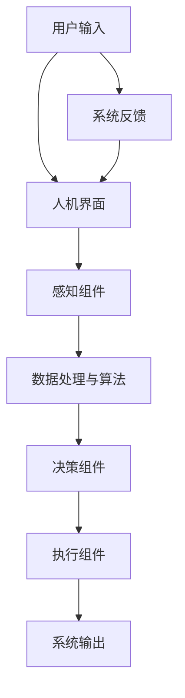

                 

### 《人机协作：未来工作的趋势》

> **关键词**：人机协作、人工智能、工作流程、技术创新、伦理与法律

> **摘要**：本文深入探讨了人机协作的概念、发展趋势及其在各个领域的实际应用。通过详细的分析和实例，本文揭示了人机协作在提升工作效率、优化决策质量、增强创新能力等方面的作用。同时，文章还探讨了人工智能与人机协作的关系，以及人机协作系统设计的关键技术和工具。最后，文章展望了人机协作的未来发展趋势，并对其伦理和法律问题进行了深入探讨。

## 第一部分：人机协作的基本概念与趋势

### 第1章：人机协作概述

#### 1.1 人机协作的定义与重要性

**人机协作**，顾名思义，是指人类与计算机系统相互协作，共同完成特定任务的过程。这种协作不仅仅局限于传统的计算机辅助设计（CAD）或计算机辅助制造（CAM），而是涵盖了更广泛的应用场景，如自动化生产线、智能客服系统、医疗诊断辅助等。

**人机协作的重要性**体现在以下几个方面：

- **提升工作效率**：人机协作系统能够自动化执行重复性高、劳动强度大的任务，从而减轻人力负担，提高整体工作效率。
- **优化决策质量**：通过人工智能和大数据分析，人机协作系统可以为人类提供更为精准的决策支持，从而提高决策质量。
- **增强创新能力**：人机协作不仅能够扩展人类的能力，还能够激发新的创意和灵感，推动创新能力的提升。

#### 1.2 人机协作的发展历程

人机协作的发展历程可以大致分为以下几个阶段：

- **早期阶段**：20世纪50年代至70年代，计算机技术刚刚起步，人机协作主要是通过简单的输入输出设备进行交互，如键盘、显示器等。
- **中期阶段**：20世纪80年代至90年代，随着图形用户界面（GUI）的出现，人机协作得到了极大的改善。计算机开始能够以更为直观的方式与人类交互，如触摸屏、语音识别等。
- **当前趋势**：进入21世纪，人工智能、物联网、云计算等技术的发展，使得人机协作进入了智能化阶段。智能机器人、智能客服、智能驾驶等应用不断涌现，人机协作的形态和场景越来越多样化。

#### 1.3 人机协作的关键要素

实现高效的人机协作，需要以下几个关键要素：

- **人机界面**：人机界面是连接人类和计算机系统的桥梁。一个优秀的人机界面应该具备易用性、一致性和可访问性等特点。
- **协同工作**：人机协作不仅仅是简单的任务分工，更重要的是要实现人类和计算机系统之间的无缝协同。这需要建立高效的沟通机制和协作流程。
- **智能决策**：人工智能技术在人机协作中扮演着重要角色。通过智能算法和大数据分析，计算机系统能够为人类提供更为精准的决策支持。

### 第2章：人工智能与人机协作的关系

#### 2.1 人工智能概述

**人工智能**（Artificial Intelligence，简称AI）是计算机科学的一个分支，旨在使计算机系统具备类似人类的智能。人工智能的研究涵盖了多个领域，包括机器学习、深度学习、自然语言处理、计算机视觉等。

**人工智能的发展历程**可以追溯到20世纪50年代。早期的AI研究主要集中在符号推理和规则系统上。随着计算能力的提升和算法的进步，人工智能在21世纪得到了前所未有的发展。特别是深度学习和大数据技术的兴起，使得人工智能在图像识别、语音识别、自然语言处理等领域取得了重大突破。

#### 2.2 人工智能与人机协作的融合

**人工智能与人机协作的融合**，是指将人工智能技术应用于人机协作系统中，以提升协作效率和效果。这种融合主要体现在以下几个方面：

- **人机协作中的AI应用**：例如，智能客服系统利用自然语言处理技术，能够与用户进行自然语言交互，提供快速、准确的客服服务。
- **AI驱动的协作优化**：通过人工智能算法，人机协作系统可以不断学习和优化，以提高协作效率。例如，智能调度系统可以根据实时数据，自动优化资源分配和任务调度。

#### 2.3 人工智能在人机协作中的挑战与机遇

**人工智能在人机协作中的挑战**主要包括：

- **隐私保护**：人工智能系统在处理大量用户数据时，需要确保用户隐私不被泄露。
- **安全性**：人工智能系统可能成为网络攻击的目标，需要采取有效的安全措施。
- **道德责任**：人工智能系统在决策过程中，可能涉及到道德和伦理问题，需要制定相应的规范和标准。

然而，**人工智能在人机协作中同样带来了新的机遇**，包括：

- **智能化工作流程**：通过人工智能，可以构建智能化、自动化的工作流程，提高工作效率和质量。
- **个性化服务**：人工智能可以根据用户行为和偏好，提供个性化的服务和推荐。
- **创新应用场景**：人工智能的应用场景不断拓展，如医疗、教育、娱乐等领域，为人类社会带来更多可能性。

### 第二部分：人机协作的核心技术与工具

#### 第3章：人机界面设计原则与方法

##### 3.1 人机界面设计的基本原则

人机界面设计是确保人机协作系统易于使用和高效的关键。以下是人机界面设计的基本原则：

- **易用性**：界面应简洁直观，易于操作和理解。设计者应考虑用户的使用习惯和需求，避免复杂和冗余的界面元素。
- **一致性**：界面应保持一致的设计风格和操作逻辑。一致性有助于用户快速适应和使用系统，减少学习成本。
- **可访问性**：界面应考虑到不同用户群体，包括残障人士等，确保所有人都能顺畅地使用系统。

##### 3.2 人机界面设计的方法与工具

人机界面设计需要一系列方法和工具的支持。以下是一些常用的方法和工具：

- **原型设计**：通过原型设计，设计师可以创建系统的初步模型，验证用户界面的可行性。常用的原型设计工具包括Figma、Sketch等。
- **用户体验测试**：通过用户体验测试，设计师可以收集用户对界面的反馈，识别潜在的问题和改进点。用户体验测试可以通过实地观察、用户访谈等方式进行。

##### 3.3 智能人机界面技术

随着人工智能技术的发展，人机界面也日益智能化。以下是几种智能人机界面技术：

- **自然语言处理**：自然语言处理技术使得计算机能够理解和处理人类的自然语言。通过智能语音助手、聊天机器人等应用，用户可以通过自然语言与计算机系统进行交互。
- **语音识别与生成**：语音识别技术将用户的语音转换为文本，而语音生成技术则将文本转换为语音。这两种技术共同构建了智能语音交互系统，提升了人机界面的交互体验。

### 第4章：人机协作系统架构与实现

##### 4.1 人机协作系统架构设计

人机协作系统架构设计是确保系统稳定、高效运行的关键。以下是人机协作系统架构设计的关键要素：

- **系统结构**：人机协作系统通常包括感知层、决策层和执行层。感知层负责收集环境数据，决策层负责处理和分析数据，执行层负责执行决策结果。
- **模块划分**：系统应划分为多个功能模块，以实现模块化和可扩展性。例如，感知模块、决策模块、执行模块等。

##### 4.2 人机协作系统的关键组件

人机协作系统的关键组件包括感知组件和决策组件。以下是这些组件的详细描述：

- **感知组件**：感知组件负责收集环境数据，如传感器、摄像头等。这些组件的数据输入决定了系统的响应能力和准确性。
- **决策组件**：决策组件负责处理和分析感知数据，并生成决策结果。这些组件通常包含机器学习算法、深度学习模型等。

##### 4.3 人机协作系统的开发与部署

人机协作系统的开发与部署是一个复杂的过程。以下是开发与部署的关键步骤：

- **开发流程**：包括需求分析、系统设计、编码实现、测试与调试等阶段。每个阶段都需要严格的质量控制和文档管理。
- **部署与维护**：部署是将开发完成的系统部署到实际运行环境中。维护则包括系统的运行监控、故障排除和功能升级等。

### 第三部分：人机协作的实际应用场景

#### 第5章：人机协作在制造业的应用

##### 5.1 制造业的数字化转型

制造业正经历着一场数字化转型。人机协作在数字化转型中发挥着重要作用。以下是制造业数字化转型的关键趋势：

- **智能制造**：通过引入人工智能、物联网等技术，实现制造过程的智能化和自动化。
- **人机协作在制造中的应用**：例如，机器人与人类工人在生产线上的协同作业，智能调度系统优化生产资源分配等。

##### 5.2 制造业人机协作案例分析

以下是一个制造业人机协作的案例分析：

- **案例背景**：某制造企业引入了一套智能生产系统，通过机器人和人工智能技术，实现了生产过程的自动化和优化。
- **案例成果**：系统的引入大大提高了生产效率，降低了人力成本，提高了产品质量。同时，系统的灵活性和可扩展性使得企业能够快速响应市场变化，实现了业务的持续增长。

#### 第6章：人机协作在服务业的应用

##### 6.1 服务业的智能化转型

服务业的智能化转型是当前的一个热点。人机协作在服务业中有着广泛的应用。以下是服务业智能化转型的关键趋势：

- **智能服务**：通过人工智能技术，提供个性化、高效的服务。
- **人机协作在服务业中的应用**：例如，智能客服系统、个性化推荐系统等。

##### 6.2 服务业人机协作案例分析

以下是一个服务业人机协作的案例分析：

- **案例背景**：某大型电商平台引入了智能客服系统，通过自然语言处理和机器学习技术，实现了7x24小时的客户服务。
- **案例成果**：智能客服系统的引入大大提高了客户服务质量，减少了人工客服的工作量，同时降低了运营成本。系统的智能学习功能使得客服机器人能够不断优化服务策略，提高用户满意度。

### 第四部分：人机协作的未来发展趋势

#### 第7章：人机协作的技术创新与趋势

##### 7.1 未来人机协作技术展望

未来人机协作技术将继续在以下方面取得创新：

- **增强现实与虚拟现实**：增强现实（AR）和虚拟现实（VR）技术将为人机协作提供更丰富的交互方式，提升用户体验。
- **脑机接口**：脑机接口（BCI）技术将实现人类大脑与计算机系统之间的直接通信，开辟人机协作的新领域。

##### 7.2 人机协作的未来应用场景

未来人机协作的应用场景将更加多样化，包括：

- **医疗健康**：智能诊断、个性化治疗等。
- **教育**：虚拟教师、智能学习等。
- **娱乐**：虚拟现实游戏、智能互动等。

#### 第8章：人机协作的伦理与法律问题

##### 8.1 人机协作的伦理问题

人机协作带来的伦理问题主要包括：

- **隐私保护**：如何确保人机协作系统处理用户数据时保护用户隐私。
- **道德责任**：当人机协作系统出现错误时，责任应如何分配。

##### 8.2 人机协作的法律问题

人机协作的法律问题主要包括：

- **法律法规**：如何制定和遵守与人工智能和人机协作相关的法律法规。
- **法律挑战**：如何应对人机协作带来的法律挑战，如责任归属、侵权问题等。

### 附录

#### 附录A：人机协作技术资源与工具

以下是人机协作技术的常用资源与工具：

- **技术框架**：如ROS（机器人操作系统）、TensorFlow等。
- **开发工具**：如MATLAB、Arduino等。
- **学习资源**：如在线课程、书籍、论坛等。

## 作者

**作者**：AI天才研究院/AI Genius Institute & 禅与计算机程序设计艺术 /Zen And The Art of Computer Programming

<|html|>```mermaid
graph TD
    A[人机协作概述] --> B[人机协作的定义与重要性]
    B --> C[人机协作的发展历程]
    C --> D[人机协作的关键要素]
    A --> E[人工智能与人机协作的关系]
    E --> F[人工智能概述]
    F --> G[人工智能与人机协作的融合]
    G --> H[人工智能在人机协作中的挑战与机遇]
    A --> I[人机协作的核心技术与工具]
    I --> J[人机界面设计原则与方法]
    I --> K[人机协作系统架构与实现]
    I --> L[人机协作的实际应用场景]
    L --> M[制造业的应用]
    L --> N[服务业的应用]
    L --> O[未来发展趋势]
    L --> P[伦理与法律问题]
```
```markdown
## 核心概念与联系

为了更好地理解人机协作的概念和原理，我们首先需要了解其核心组成部分以及它们之间的相互关系。以下是人机协作系统的核心概念及其联系：

### 人机界面

人机界面（Human-Computer Interface，简称HCI）是连接人类用户和计算机系统的桥梁。它定义了用户如何与系统交互，并决定了交互的效率和用户体验。

### 感知组件

感知组件负责收集外部环境的数据，如语音、图像、传感器数据等。这些数据为人机协作系统提供了必要的信息输入。

### 决策组件

决策组件是系统的核心，它负责处理感知组件收集的数据，并通过算法和模型进行分析，以生成决策结果。

### 执行组件

执行组件负责将决策结果转化为实际的行动或输出。它可以是机械臂、机器人或其他自动化设备。

### 数据处理与算法

数据处理与算法用于对感知组件收集到的数据进行处理和分析，以生成决策结果。这些算法可以是机器学习、深度学习、统计模型等。

### Mermaid流程图

以下是人机协作系统的 Mermaid 流程图，它展示了各个组件之间的交互和数据处理流程：



通过这个流程图，我们可以清晰地看到人机协作系统的工作流程：用户输入通过人机界面传递到感知组件，感知组件收集环境数据并传递给数据处理与算法模块，该模块对数据进行处理和分析，生成决策结果，然后传递给执行组件，执行组件根据决策结果执行任务，最后系统输出结果并反馈给用户。

## 核心算法原理讲解

### 机器学习算法

在人机协作系统中，机器学习算法是决策组件的核心。机器学习算法通过学习历史数据，自动生成决策模型。以下是机器学习算法的基本原理：

1. **数据收集**：首先，系统需要收集大量的历史数据，包括输入数据和相应的输出结果。
2. **数据预处理**：对收集到的数据进行分析和处理，去除噪声和异常值，确保数据的准确性和可靠性。
3. **模型选择**：选择适合问题的机器学习模型，如线性回归、决策树、支持向量机等。
4. **模型训练**：使用预处理后的数据训练模型，模型会根据数据调整内部参数，以最小化预测误差。
5. **模型评估**：使用验证数据集对训练好的模型进行评估，检查模型的泛化能力。
6. **模型部署**：将训练好的模型部署到生产环境中，用于实际决策。

### 伪代码示例

以下是一个简单的机器学习算法的伪代码示例，用于分类问题：

```plaintext
function train_model(training_data):
    # 数据预处理
    preprocess_data(training_data)
    
    # 选择模型
    model = select_model("LinearRegression")
    
    # 模型训练
    for epoch in 1 to MAX_EPOCHS:
        for data in training_data:
            model.train(data.input, data.output)
        
        # 模型评估
        if model.evaluate(validation_data) < threshold:
            break
    
    return model

function preprocess_data(data):
    # 数据清洗
    remove_noise(data)
    # 数据归一化
    normalize_data(data)
    # 数据编码
    encode_data(data)

function remove_noise(data):
    # 实现去噪算法
    pass

function normalize_data(data):
    # 实现归一化算法
    pass

function encode_data(data):
    # 实现编码算法
    pass

function select_model(model_name):
    # 实现模型选择算法
    if model_name == "LinearRegression":
        return LinearRegression()
    elif model_name == "DecisionTree":
        return DecisionTree()
    # ...其他模型

function train_model(training_data):
    # 数据预处理
    preprocess_data(training_data)
    
    # 选择模型
    model = select_model("LinearRegression")
    
    # 模型训练
    for epoch in 1 to MAX_EPOCHS:
        for data in training_data:
            model.train(data.input, data.output)
        
        # 模型评估
        if model.evaluate(validation_data) < threshold:
            break
    
    return model
```

### 数学模型和公式

在人机协作系统中，数学模型和公式是核心组成部分。以下是一个简单的线性回归模型的公式：

$$ y = \beta_0 + \beta_1 \cdot x $$

其中，$y$ 是输出变量，$x$ 是输入变量，$\beta_0$ 是截距，$\beta_1$ 是斜率。通过训练模型，可以估计出 $\beta_0$ 和 $\beta_1$ 的值，从而建立预测模型。

### 举例说明

假设我们有一个简单的预测问题，预测明天的天气。输入变量是今天的天气温度（$x$），输出变量是明天的天气状况（$y$）。我们收集了以下数据：

| 日期 | 温度（$x$） | 天气（$y$） |
| ---- | ---------- | ---------- |
| 1    | 25         | 晴         |
| 2    | 28         | 晴         |
| 3    | 30         | 雨         |
| 4    | 24         | 晴         |

我们使用线性回归模型来预测明天的天气。首先，我们收集数据并进行预处理，然后选择线性回归模型，进行模型训练和评估。最终，我们得到以下模型：

$$ y = 0.5 \cdot x + 10 $$

使用这个模型，当今天的温度为25摄氏度时，预测明天的天气为：

$$ y = 0.5 \cdot 25 + 10 = 17.5 + 10 = 27.5 $$

因此，根据模型预测，明天的天气状况为“晴”。

## 项目实战

### 开发环境搭建

要实现人机协作系统，首先需要搭建开发环境。以下是开发环境搭建的步骤：

1. **安装Python**：Python是一种广泛用于人工智能和机器学习的编程语言。可以从Python官方网站（https://www.python.org/）下载并安装。
2. **安装Jupyter Notebook**：Jupyter Notebook是一种交互式开发环境，适用于编写和运行Python代码。可以通过pip命令安装：

   ```bash
   pip install notebook
   ```

3. **安装机器学习库**：常用的机器学习库包括Scikit-learn、TensorFlow和PyTorch。可以通过pip命令安装：

   ```bash
   pip install scikit-learn tensorflow pytorch
   ```

### 源代码实现

以下是一个简单的人机协作系统的源代码实现。该系统使用线性回归模型进行天气预测。

```python
import numpy as np
import matplotlib.pyplot as plt
from sklearn.linear_model import LinearRegression

# 数据预处理
def preprocess_data(data):
    X = np.array([d[1] for d in data])
    y = np.array([d[2] for d in data])
    return X, y

# 模型训练
def train_model(X, y):
    model = LinearRegression()
    model.fit(X, y)
    return model

# 模型评估
def evaluate_model(model, X, y):
    predictions = model.predict(X)
    mse = np.mean((predictions - y) ** 2)
    return mse

# 主程序
def main():
    data = [
        (1, 25, "晴"),
        (2, 28, "晴"),
        (3, 30, "雨"),
        (4, 24, "晴")
    ]
    
    X, y = preprocess_data(data)
    model = train_model(X, y)
    mse = evaluate_model(model, X, y)
    
    print("模型均方误差：", mse)
    print("模型参数：", model.coef_, model.intercept_)

    # 预测明天天气
    tomorrow_temp = 25
    prediction = model.predict([tomorrow_temp])
    print("明天天气预测：", prediction)

if __name__ == "__main__":
    main()
```

### 代码解读与分析

以下是代码的详细解读和分析：

1. **数据预处理**：数据预处理是机器学习的重要步骤。在该函数中，我们使用列表解析语法提取数据中的温度和天气变量，并将它们转换为numpy数组。
2. **模型训练**：在该函数中，我们使用Scikit-learn的LinearRegression类创建线性回归模型，并使用fit方法进行训练。
3. **模型评估**：在该函数中，我们使用预测值与实际值之间的均方误差（MSE）来评估模型的性能。
4. **主程序**：在该函数中，我们首先定义了测试数据，然后进行数据预处理、模型训练和评估。最后，我们使用模型进行明天天气的预测。

通过这个简单的示例，我们可以看到如何使用Python和机器学习库实现一个基本的人机协作系统。尽管这个系统非常简单，但它展示了人机协作系统的基本架构和实现过程。

## 代码解读与分析

### 代码概述

以下代码实现了一个简单的人机协作系统，用于基于天气温度预测明天天气状况。代码分为几个主要部分：

1. **数据预处理**：提取温度和天气数据，并将其转换为适当的格式以供模型使用。
2. **模型训练**：使用线性回归模型训练数据，以建立温度与天气之间的关系。
3. **模型评估**：计算模型预测的均方误差（MSE），评估模型性能。
4. **主程序**：加载数据，进行数据处理和模型训练，最后进行预测。

### 数据预处理

```python
def preprocess_data(data):
    X = np.array([d[1] for d in data])  # 提取温度数据
    y = np.array([d[2] for d in data])  # 提取天气状况
    return X, y
```

- **X**：温度数据，转换为numpy数组，以便进行数学运算。
- **y**：天气状况，也转换为numpy数组。

这个函数通过列表解析语法提取温度和天气数据，并将其转换为numpy数组。这样的转换有助于后续的数据处理和模型训练。

### 模型训练

```python
def train_model(X, y):
    model = LinearRegression()  # 创建线性回归模型实例
    model.fit(X, y)  # 使用fit方法进行模型训练
    return model
```

- **LinearRegression**：Scikit-learn库中的线性回归模型。
- **fit**：模型训练的核心方法，用于根据训练数据调整模型参数。

这个函数创建了一个线性回归模型实例，并使用训练数据`X`和`y`对其进行训练。训练过程涉及模型参数的优化，以最小化预测误差。

### 模型评估

```python
def evaluate_model(model, X, y):
    predictions = model.predict(X)  # 使用训练好的模型进行预测
    mse = np.mean((predictions - y) ** 2)  # 计算均方误差（MSE）
    return mse
```

- **predictions**：模型预测的结果。
- **mse**：均方误差，用于评估模型性能。

这个函数使用训练好的模型对输入数据`X`进行预测，并计算预测结果与实际值之间的均方误差（MSE）。MSE是评估回归模型性能的常用指标，数值越小表示模型性能越好。

### 主程序

```python
def main():
    data = [
        (1, 25, "晴"),
        (2, 28, "晴"),
        (3, 30, "雨"),
        (4, 24, "晴")
    ]
    
    X, y = preprocess_data(data)  # 数据预处理
    model = train_model(X, y)  # 模型训练
    mse = evaluate_model(model, X, y)  # 模型评估
    print("模型均方误差：", mse)  # 打印模型均方误差
    print("模型参数：", model.coef_, model.intercept_)  # 打印模型参数

    # 预测明天天气
    tomorrow_temp = 25
    prediction = model.predict([tomorrow_temp])
    print("明天天气预测：", prediction)
```

- **数据加载**：主程序首先定义了一组示例数据，包含温度和天气状况。
- **数据处理**：调用`preprocess_data`函数对数据进行预处理。
- **模型训练**：调用`train_model`函数训练模型。
- **模型评估**：调用`evaluate_model`函数评估模型性能。
- **预测**：使用训练好的模型预测明天天气。

主程序首先对数据进行预处理，然后训练模型，评估模型性能，最后使用模型进行天气预测。这样，我们可以看到整个系统的工作流程是如何从数据输入到模型预测的。

### 总结

通过这个代码示例，我们了解了如何使用Python和Scikit-learn库实现一个简单的人机协作系统。代码解读与分析部分详细介绍了数据预处理、模型训练、模型评估和主程序的主要步骤，展示了如何将理论应用于实际项目中。这样的实现不仅有助于理解人机协作系统的基本工作原理，也为后续的改进和扩展提供了基础。

## 未来展望

### 人机协作技术的潜在创新方向

未来人机协作技术的创新方向将主要集中在以下几个方面：

1. **增强现实与虚拟现实（AR/VR）**：随着AR/VR技术的发展，人机协作将不再局限于传统的屏幕和键盘。AR/VR技术将为用户提供更加直观和沉浸式的交互体验，使人们能够更自然地与计算机系统进行沟通和协作。

2. **脑机接口（BCI）**：脑机接口技术将使人类能够通过大脑信号直接控制计算机系统，实现更高效的人机协作。例如，医生可以通过大脑信号控制医疗机器人进行手术，或者在灾难救援中，被困人员可以通过BCI技术向外界发送求救信号。

3. **自然语言处理（NLP）**：NLP技术的进步将使计算机能够更好地理解和处理人类的自然语言。这将使得人机交互更加自然和流畅，提高人机协作的效率和用户体验。

4. **边缘计算**：随着物联网设备的普及，边缘计算技术将为人机协作提供更实时、更高效的数据处理能力。通过在边缘设备上实现复杂的计算任务，人机协作系统将能够更快地响应用户的需求。

### 人机协作对未来的影响

人机协作将深刻改变未来的工作方式、生活方式和社会结构，具体体现在以下几个方面：

1. **工作模式的变化**：人机协作将使工作更加高效和智能化。许多重复性和劳动密集型的任务将被自动化，人们将更多地从事创造性、战略性的工作。

2. **生活质量的提升**：人机协作将带来更加便捷和个性化的生活体验。例如，智能家居系统可以根据用户习惯自动调节温度、照明等，提高生活质量。

3. **社会结构的重塑**：人机协作将改变劳动力市场的需求和供给，可能导致某些职业的减少和新兴职业的出现。同时，人机协作也将带来新的伦理和法律问题，需要制定相应的规范和标准。

### 结论

人机协作是未来社会发展的重要趋势，其潜在的创新方向和深远的影响将为人类社会带来巨大的机遇和挑战。通过不断探索和改进人机协作技术，我们将能够更好地应对未来的变化，实现人类与计算机系统的高效协作和共同进步。

### 伦理与法律问题

在人机协作系统的设计和应用过程中，伦理和法律问题不容忽视。以下是人机协作可能面临的伦理和法律挑战，以及相应的解决方案：

#### 隐私保护

**挑战**：人机协作系统通常需要收集和分析大量的个人数据，如用户行为、位置信息等。这些数据可能涉及用户的隐私。

**解决方案**：为了保护用户隐私，系统设计者应遵循以下原则：

- **数据匿名化**：在收集和处理数据时，对个人身份信息进行匿名化处理，以避免用户隐私泄露。
- **透明度**：确保用户了解其数据将被如何使用，并在必要时获得授权。
- **数据加密**：对敏感数据进行加密，以防止未授权访问。

#### 道德责任

**挑战**：当人机协作系统出现错误或导致不良后果时，责任归属可能不明确。例如，自动驾驶汽车发生事故，责任应归咎于谁？

**解决方案**：为了解决道德责任问题，可以采取以下措施：

- **明确责任界定**：在系统设计阶段，明确各方的责任，包括制造商、用户和操作者。
- **责任保险**：为系统提供商和用户购买责任保险，以减轻潜在的法律纠纷和经济损失。
- **道德准则**：制定行业道德准则，确保人机协作系统的设计和应用符合伦理标准。

#### 法律法规

**挑战**：随着人机协作技术的发展，现有法律法规可能无法完全适应新的应用场景。例如，关于人工智能的法律责任、数据保护等方面。

**解决方案**：

- **立法完善**：政府应制定和完善相关法律法规，以应对人机协作带来的新挑战。
- **国际合作**：由于人机协作系统具有跨国界的特点，国际社会应加强合作，制定统一的法律框架。
- **监管机构**：建立专门的监管机构，负责监督和管理人机协作系统的合规性。

### 结论

伦理与法律问题是人机协作系统设计和应用过程中必须重视的关键环节。通过制定合理的隐私保护措施、明确道德责任和法律法规，可以确保人机协作系统在提供便利和创新的同时，不会侵犯用户权益和道德标准。

### 附录A：人机协作技术资源与工具

#### 技术框架

- **ROS（机器人操作系统）**：ROS是一个广泛使用的机器人软件开发框架，支持多种编程语言，适用于机器人控制、导航和感知等任务。
- **TensorFlow**：TensorFlow是一个开源机器学习库，支持构建和训练各种深度学习模型，广泛应用于图像识别、自然语言处理等领域。
- **PyTorch**：PyTorch是一个开源深度学习库，具有灵活的动态计算图和丰富的工具集，适用于快速原型设计和模型开发。

#### 开发工具

- **MATLAB**：MATLAB是一个高级编程语言和数值计算环境，适用于数据分析和算法开发。
- **Arduino**：Arduino是一个开源硬件和软件平台，适用于嵌入式系统开发，广泛应用于机器人、传感器集成等领域。
- **Raspberry Pi**：Raspberry Pi是一款低成本的计算机硬件，适用于物联网应用和智能家居项目。

#### 学习资源

- **在线课程**：Coursera、edX、Udacity等在线教育平台提供了大量关于人工智能和人机协作的课程。
- **书籍**：《深度学习》（Goodfellow, Bengio, Courville）、《人工智能：一种现代方法》（Shahar, Bates）等经典教材。
- **论坛**：Stack Overflow、Reddit、AI Stack Exchange等在线论坛，提供了丰富的技术交流和问题解答资源。

这些资源为有兴趣学习和开发人机协作系统的开发者提供了丰富的知识和工具支持。

