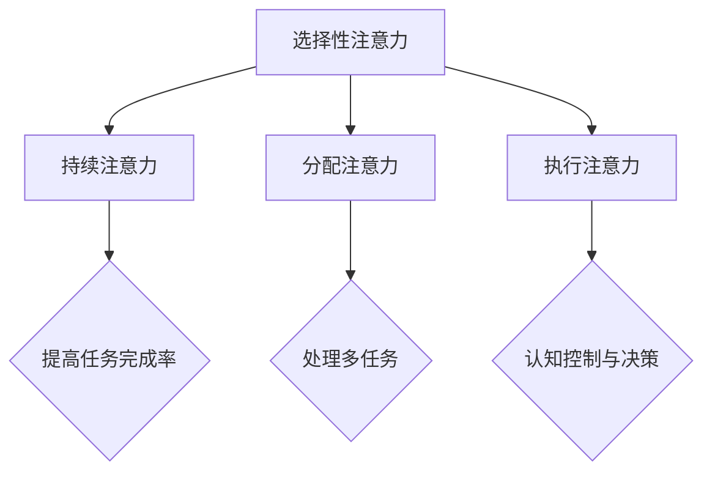
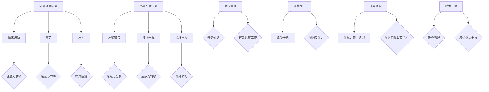
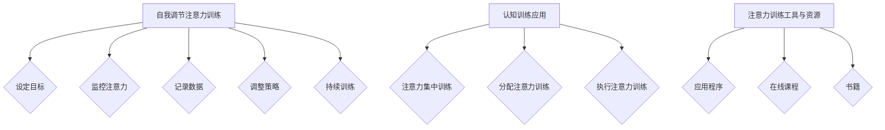
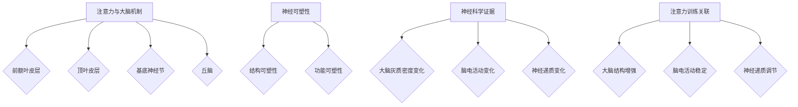
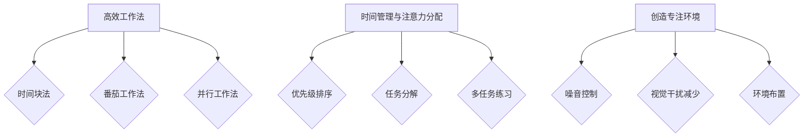
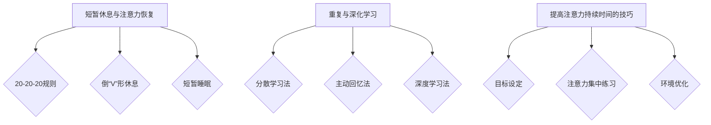
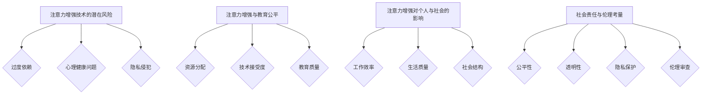
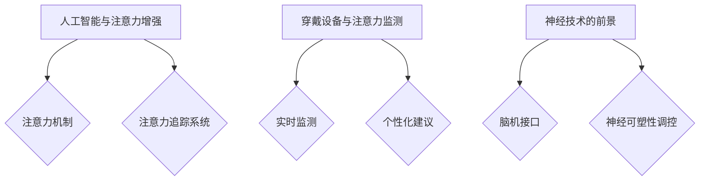
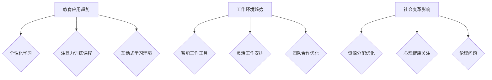
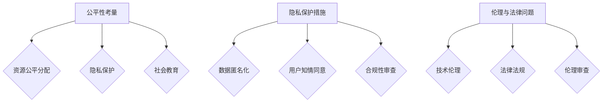

                 

# 人类注意力增强：提升专注力和注意力持续时间方法

## 关键词
- 注意力增强
- 专注力提升
- 注意力分散
- 大脑机制
- 认知训练
- 神经科学

## 摘要
本文将探讨人类注意力增强的方法，包括提升专注力和延长注意力持续时间。通过结合心理学、神经科学和认知科学的研究成果，我们将介绍一系列科学有效的策略和技术，旨在帮助读者提高个人和工作中的注意力水平。本文还将分析注意力增强的实际应用案例，并探讨其对社会和个人发展的影响。

## 目录大纲

### 第一部分：注意力基础理论

#### 第1章：注意力概念与心理学基础
- 1.1 注意力的基本概念
- 1.2 注意力的心理学理论
- 1.3 注意力的类型与功能

#### 第2章：注意力分散与干扰因素
- 2.1 注意力分散的来源
- 2.2 干扰因素与注意力分散
- 2.3 应对注意力分散的策略

#### 第3章：注意力训练的方法与技术
- 3.1 自我调节的注意力训练
- 3.2 认知训练的应用
- 3.3 注意力训练工具与资源

#### 第4章：注意力增强的神经科学基础
- 4.1 注意力与大脑机制
- 4.2 神经可塑性在注意力提升中的作用
- 4.3 神经科学证据与注意力训练的关联

### 第二部分：具体实践与应用

#### 第5章：提高专注力的实践方法
- 5.1 高效工作法
- 5.2 时间管理与注意力分配
- 5.3 创造专注环境

#### 第6章：注意力持续时间提升策略
- 6.1 短暂休息与注意力恢复
- 6.2 重复与深化学习
- 6.3 提高注意力持续时间的技巧

#### 第7章：注意力增强案例研究
- 7.1 学生学习注意力提升
- 7.2 工作场合中的注意力管理
- 7.3 注意力增强对老年人健康的影响

#### 第8章：注意力增强的社会影响与伦理问题
- 8.1 注意力增强技术的潜在风险
- 8.2 注意力增强与教育公平
- 8.3 注意力增强对个人与社会的影响

### 第三部分：前沿与未来

#### 第9章：注意力增强技术的最新发展
- 9.1 人工智能与注意力增强
- 9.2 穿戴设备与注意力监测
- 9.3 神经技术的前景

#### 第10章：注意力增强的未来趋势
- 10.1 注意力增强在教育中的应用
- 10.2 工作环境中的注意力管理
- 10.3 个人与社会的注意力变革

#### 第11章：注意力增强的社会责任
- 11.1 公平性考量
- 11.2 隐私保护
- 11.3 伦理与法律问题

## 附录
- 附录A：注意力训练资源与工具
- 附录B：注意力研究经典文献与资料
- 附录C：注意力增强项目案例索引

### 引言

在现代社会中，人们面临着日益增多的信息和任务，注意力资源的稀缺性变得越来越突出。无论是学生、职场人士还是老年人，提升专注力和延长注意力持续时间都成为了提高工作效率、学习效果和生活质量的关键。然而，由于多任务处理、社交媒体的干扰以及环境噪音等因素，我们的注意力常常被分散，导致注意力持续时间缩短，影响了个人和社会的各个方面。

本文旨在系统地探讨人类注意力增强的方法，从基础理论到实际应用，从神经科学到前沿技术，力求为读者提供全面的指导。文章首先将介绍注意力的基本概念、心理学基础和神经科学原理，帮助读者理解注意力增强的基础知识。接着，本文将探讨注意力分散的来源、干扰因素以及应对策略，提供实用的自我调节方法和技术。随后，文章将深入分析注意力训练的方法和技术，包括自我调节、认知训练和神经可塑性理论。最后，本文将结合实际案例，探讨注意力增强在各个领域的应用，同时探讨其潜在的社会影响和伦理问题。

通过本文的阅读，读者将能够：
- 理解注意力增强的基本概念和理论框架；
- 掌握注意力分散的来源和应对策略；
- 学习注意力训练的方法和技术，提高专注力和注意力持续时间；
- 探讨注意力增强技术的最新发展及其应用前景；
- 思考注意力增强对社会和个人发展的潜在影响和伦理问题。

### 第一部分：注意力基础理论

#### 第1章：注意力概念与心理学基础

**1.1 注意力的基本概念**

注意力是指心理活动对特定对象或任务的指向和集中。在心理学中，注意力被认为是一种有限的认知资源，它决定了我们如何处理和响应外部刺激以及内部思维活动。注意力的基本概念包括注意力的指向性和集中性。指向性指的是注意力集中在特定对象或任务上，而集中性则是指注意力对其他干扰因素的抑制。

**1.2 注意力的心理学理论**

注意力的心理学研究有着悠久的历史，不同的理论提供了不同的视角来解释注意力的本质。以下是几种主要的注意力理论：

- **认知控制理论**：该理论认为注意力是一种认知资源，用于调节和指导认知过程。注意力资源分配理论（Cognitive Resource Allocation Theory）是这一理论的一个分支，它强调注意力资源是有限的，需要在不同任务之间进行动态分配。

- **注意选择理论**：这一理论认为注意力是一种选择过程，它通过选择某些刺激进行加工，而抑制其他刺激。注意选择理论进一步分为局部加工模型（Local Processing Models）和全局加工模型（Global Processing Models），前者强调局部区域的刺激加工，后者则关注整体背景中的刺激加工。

- **过滤器理论**：过滤器理论是早期的注意力理论之一，它认为注意力通过一个“过滤器”机制来抑制无关的刺激。过滤器可以是物理过滤器，如视觉通道的“盲点”，也可以是认知过滤器，如“忽略背景噪音”。

**1.3 注意力的类型与功能**

注意力可以分为不同类型，每种类型在认知过程中扮演着不同的角色：

- **选择性注意力**：选择性注意力是指选择性地关注某些刺激而忽略其他刺激的能力。这种注意力类型在处理复杂任务和排除干扰时非常重要。

- **持续注意力**：持续注意力是指保持对某一任务的持续关注，而不受外界干扰的能力。它是完成任务和长时间学习的重要保障。

- **分配注意力**：分配注意力是指在同一时间内处理多个任务的能力。这种注意力类型在多任务环境中尤为重要。

- **执行注意力**：执行注意力是指执行特定任务所需的注意力和认知控制。它涉及到计划和决策，以及监控和调整行为。

#### Mermaid 流程图

以下是注意力类型和功能的 Mermaid 流程图：



#### 核心算法原理讲解

在注意力机制中，核心算法通常涉及注意力权重分配和选择机制。以下是一个简化的伪代码，用于说明注意力机制的基本原理：

```pseudo
function attention Mechanism(inputs, attention_weights):
    // 输入：inputs（输入数据），attention_weights（注意力权重）
    // 输出：selected_output（选择后的输出）

    // 初始化
    selected_output = []

    // 循环计算每个输入的加权分数
    for each input in inputs:
        score = input * attention_weights[input]
        selected_output.append(score)

    // 选择具有最高分数的输入
    max_score = max(selected_output)
    selected_input = inputs[selected_output.index(max_score)]

    return selected_input
```

#### 数学模型和公式

注意力机制可以通过数学模型来描述，其中最著名的模型是Softmax函数，用于计算注意力权重。以下是一个Softmax函数的 LaTeX 表示：

$$
\text{softmax}(x) = \frac{e^x}{\sum_{i} e^x_i}
$$

其中，$x$ 是输入向量，$e^x$ 是指数函数，分母是对输入向量中每个元素进行指数运算后的和。Softmax 函数将输入向量转换为概率分布，每个元素的概率表示其在决策中的重要性。

#### 举例说明

假设我们有一个输入向量 $x = [2, 3, 1]$，我们使用 Softmax 函数来计算注意力权重：

$$
\text{softmax}(x) = \frac{e^2}{e^2 + e^3 + e^1} \approx \frac{7.39}{7.39 + 20.09 + 2.72} \approx [0.12, 0.33, 0.25]
$$

这意味着在处理输入向量时，第二个元素（$3$）具有最高的注意力权重。

### 第2章：注意力分散与干扰因素

**2.1 注意力分散的来源**

注意力分散是指注意力资源从当前任务转移到其他无关刺激的现象。注意力分散的来源可以分为内部和外部两大类。

- **内部分散因素**：内部分散因素主要涉及个人的心理状态和情绪。例如，情绪波动、疲劳、压力和自我调节能力不足都可能导致注意力分散。

- **外部分散因素**：外部分散因素则来源于周围环境中的各种干扰。这些干扰可以是视觉的、听觉的或触觉的，例如电子邮件通知、电话铃声、同事的交谈或其他感官刺激。

**2.2 干扰因素与注意力分散**

干扰因素会直接影响注意力的指向性和集中性。以下是几种常见的干扰因素：

- **多任务处理**：在多任务处理环境中，任务切换和资源分配会导致注意力分散。这种分散不仅会降低工作效率，还可能导致错误和疏漏。

- **环境噪音**：环境噪音，如交通噪音、办公室噪音等，会干扰注意力的集中，尤其是对需要高度集中精力的任务。

- **技术干扰**：现代技术，如电子邮件、即时通讯工具、社交媒体等，虽然提高了沟通效率，但同时也带来了持续的信息干扰，降低了注意力持续时间。

- **心理压力**：工作压力、生活压力等都可能导致心理压力，进而影响注意力集中和持续时间。

**2.3 应对注意力分散的策略**

为了应对注意力分散，可以采取以下策略：

- **时间管理**：合理规划任务和时间，避免任务堆积和过度工作，有助于减少心理压力和疲劳。

- **环境优化**：创造一个减少干扰的环境，如使用耳塞或耳机隔离噪音，关闭不必要的通知，有助于提高注意力集中。

- **自我调节**：通过自我提醒和注意力集中练习，如冥想和深呼吸，可以增强自我调节能力，减少注意力分散。

- **技术工具**：利用技术工具，如应用程序和软件，帮助管理任务和时间，减少信息干扰。

#### Mermaid 流�程图

以下是注意力分散的来源和应对策略的 Mermaid 流程图：



#### 核心算法原理讲解

为了应对注意力分散，可以使用算法来优化任务分配和注意力管理。以下是一个简化的伪代码，用于说明任务优先级分配算法：

```pseudo
function taskPriorityAllocation(tasks, priorities):
    // 输入：tasks（任务列表），priorities（任务优先级）
    // 输出：sorted_tasks（按优先级排序的任务列表）

    // 初始化
    sorted_tasks = []

    // 循环计算每个任务的优先级分数
    for each task in tasks:
        score = priorities[task]
        sorted_tasks.append(score)

    // 根据优先级分数对任务进行排序
    sorted_tasks = sort(sorted_tasks, ascending=False)

    return sorted_tasks
```

#### 数学模型和公式

在任务分配和注意力管理中，可以采用数学模型来计算任务优先级。以下是一个简单的加权得分模型：

$$
\text{score}(t) = w_1 \times p(t) + w_2 \times d(t)
$$

其中，$t$ 是任务，$p(t)$ 是任务的紧急程度，$d(t)$ 是任务的截止日期，$w_1$ 和 $w_2$ 是权重系数，用于平衡紧急程度和截止日期的影响。

#### 举例说明

假设我们有两个任务，任务A和任务B，它们的紧急程度为$p(A) = 3$，$p(B) = 2$，截止日期分别为$d(A) = 2$，$d(B) = 3$。根据上述模型，我们可以计算任务优先级：

$$
\text{score}(A) = w_1 \times 3 + w_2 \times 2 \\
\text{score}(B) = w_1 \times 2 + w_2 \times 3
$$

通过调整权重系数，我们可以根据需要平衡紧急程度和截止日期的影响。

### 第3章：注意力训练的方法与技术

**3.1 自我调节的注意力训练**

自我调节注意力训练是一种通过自我监控和反馈来提高注意力控制能力的训练方法。以下是一些自我调节注意力训练的具体步骤：

1. **设定目标**：明确训练的目标，例如提高专注时间、减少注意力分散等。
2. **监控注意力**：使用计时器或注意力追踪工具来监控自己的注意力状态。
3. **记录数据**：记录每次训练的时间和注意力状态，分析数据以了解进步和挑战。
4. **调整策略**：根据记录的数据，调整训练方法和时间安排。
5. **持续训练**：定期进行注意力训练，保持练习的习惯。

**3.2 认知训练的应用**

认知训练是一种通过特定的认知任务来提高大脑功能的方法。以下是一些认知训练的应用：

- **注意力集中训练**：通过专注力游戏、记忆训练任务等来提高注意力的集中性和稳定性。
- **分配注意力训练**：通过多任务处理练习来提高分配注意力的能力。
- **执行注意力训练**：通过决策训练、计划任务等来提高执行注意力的能力。

**3.3 注意力训练工具与资源**

为了更有效地进行注意力训练，可以使用以下工具和资源：

- **应用程序**：例如专注力追踪器（如Forest、Pomodoro Timer）和认知训练游戏（如Lumosity、Elevate）。
- **在线课程**：例如注意力提升课程、认知训练课程等。
- **书籍**：关于注意力提升和心理学的书籍，如《专注力训练指南》（Focus: The Hidden Driver of Excellence）等。

#### Mermaid 流程图

以下是注意力训练方法和技术流程的 Mermaid 流程图：



#### 核心算法原理讲解

在注意力训练中，可以使用算法来优化训练过程和评估进步。以下是一个简化的伪代码，用于说明注意力训练算法：

```pseudo
function attentionTrainingAlgorithm(task, attention_level, duration):
    // 输入：task（训练任务），attention_level（注意力水平），duration（训练时长）
    // 输出：training_progress（训练进度）

    // 初始化
    training_progress = 0

    // 循环执行训练任务
    for each time_step in duration:
        // 计算当前注意力水平
        current_attention_level = calculateAttentionLevel(attention_level, time_step)

        // 执行训练任务
        executeTask(task, current_attention_level)

        // 更新训练进度
        training_progress += current_attention_level

    return training_progress
```

#### 数学模型和公式

注意力训练中的数学模型可以用于计算注意力水平的动态变化。以下是一个简单的注意力衰减模型：

$$
\text{attention_level}(t) = \alpha \times \text{initial\_level} \times e^{-\beta \times t}
$$

其中，$t$ 是时间步，$\alpha$ 和 $\beta$ 是参数，$\text{initial\_level}$ 是初始注意力水平。该模型描述了随着时间增加，注意力水平逐渐下降的过程。

#### 举例说明

假设我们进行一个30分钟的注意力训练，初始注意力水平为100，衰减系数$\alpha = 0.9$，衰减速率$\beta = 0.01$。我们可以计算每分钟的关注度：

$$
\text{attention\_level}(1) = 0.9 \times 100 \times e^{-0.01 \times 1} \approx 82.53 \\
\text{attention\_level}(2) = 0.9 \times 100 \times e^{-0.01 \times 2} \approx 74.36
$$

通过这种方式，我们可以动态地调整训练策略，以提高训练效果。

### 第4章：注意力增强的神经科学基础

**4.1 注意力与大脑机制**

注意力增强的神经科学基础涉及大脑如何处理和调节注意力。以下是几个关键的大脑区域和机制：

- **前额叶皮层**：前额叶皮层是注意力调节的关键区域，它负责执行注意力分配、决策和目标导向行为。前额叶皮层受损可能导致注意力缺陷和认知功能障碍。

- **顶叶皮层**：顶叶皮层参与注意力的空间定位和任务相关刺激的加工。它通过神经元的活动模式来协调注意力的指向性和集中性。

- **基底神经节**：基底神经节与运动控制和习惯性动作相关，但它也参与了注意力的调节。基底神经节受损可能导致运动和注意力障碍。

- **丘脑**：丘脑是大脑的一个中继站，它在注意力的传递和调节中起着关键作用。丘脑受损可能导致感觉和注意力障碍。

**4.2 神经可塑性在注意力提升中的作用**

神经可塑性是指大脑结构和功能随着经验和学习而改变的能力。在注意力提升中，神经可塑性起到了至关重要的作用：

- **结构可塑性**：结构可塑性包括神经元连接的改变和新神经回路的形成。例如，通过反复的注意力训练，大脑可以形成新的神经连接，从而提高注意力的效率。

- **功能可塑性**：功能可塑性是指大脑特定区域的活动模式和神经信号的改变。例如，通过认知训练，特定大脑区域的活动可以增强，从而提高注意力集中和持续时间。

**4.3 神经科学证据与注意力训练的关联**

神经科学研究表明，注意力训练可以引起大脑结构和功能的改变。以下是几个关键的研究结果：

- **大脑灰质密度变化**：研究表明，经过认知训练，参与注意力处理的前额叶皮层和顶叶皮层的灰质密度会增加。这表明注意力训练可以增强大脑的结构。

- **脑电活动变化**：脑电图（EEG）研究表明，经过注意力训练，大脑的电活动模式会变得更加协调和稳定。例如，注意力训练可以减少EEG中的α波和θ波，提高β波的比例，这表明大脑的觉醒水平和注意力集中程度提高。

- **神经递质变化**：神经递质是神经元之间传递信号的化学物质。研究表明，注意力训练可以调节神经递质的水平，从而影响注意力的功能。例如，多巴胺和去甲肾上腺素是参与注意力调节的关键神经递质，其水平的改变与注意力提升相关。

#### Mermaid 流程图

以下是注意力与大脑机制、神经可塑性及注意力训练关联的 Mermaid 流程图：



#### 核心算法原理讲解

注意力增强的算法通常涉及大脑信号处理的原理。以下是一个简化的伪代码，用于说明基于神经可塑性的注意力增强算法：

```pseudo
function neuralPlasticityAttentionEnhancement(neural_signals, training_time):
    // 输入：neural_signals（神经信号），training_time（训练时长）
    // 输出：enhanced_signals（增强后的神经信号）

    // 初始化
    enhanced_signals = []

    // 循环执行训练过程
    for each time_step in training_time:
        // 根据当前神经信号更新增强参数
        enhanced_params = updateEnhancementParameters(neural_signals, time_step)

        // 应用增强参数，生成增强后的神经信号
        enhanced_signal = applyEnhancement(neural_signals, enhanced_params)
        enhanced_signals.append(enhanced_signal)

    return enhanced_signals
```

#### 数学模型和公式

在神经可塑性模型中，常用的公式包括神经网络权重更新公式和激活函数。以下是一个简化的神经网络权重更新公式：

$$
\Delta w_i = \alpha \times (y - \hat{y}) \times x_i
$$

其中，$w_i$ 是权重，$x_i$ 是输入特征，$\alpha$ 是学习率，$y$ 是实际输出，$\hat{y}$ 是预测输出。这个公式描述了基于误差的权重调整过程。

#### 举例说明

假设我们有一个输入特征 $x = [1, 0, 1]$，实际输出 $y = 1$，预测输出 $\hat{y} = 0$，学习率 $\alpha = 0.1$。我们可以计算权重的更新：

$$
\Delta w_1 = 0.1 \times (1 - 0) \times 1 = 0.1 \\
\Delta w_2 = 0.1 \times (1 - 0) \times 0 = 0 \\
\Delta w_3 = 0.1 \times (1 - 0) \times 1 = 0.1
$$

通过这种方式，我们可以调整神经网络权重，从而提高注意力增强的效果。

### 第5章：提高专注力的实践方法

**5.1 高效工作法**

高效工作法是一种通过系统化的方法来提高工作专注度和效率的技术。以下是几种常见的高效工作法：

- **时间块法（Time Blocking）**：将时间分成大块的、专用于特定任务的时段。这种方法有助于减少任务切换的干扰，提高专注力。

  ```mermaid
  graph TB
      A[时间块法] --> B{设定时间块}
      B --> C{专注于任务}
      B --> D{休息与放松}
  ```

- **番茄工作法（Pomodoro Technique）**：将工作时间分为25分钟的工作周期，每个周期后休息5分钟。这种方法有助于提高工作效率，防止过度疲劳。

  ```mermaid
  graph TB
      A[番茄工作法] --> B{25分钟工作周期}
      B --> C{5分钟休息}
      B --> D{重复周期}
  ```

- **并行工作法（Parallel Work）**：同时处理多个任务，但每个任务都处于不同的专注级别。这种方法适用于任务之间有一定独立性且需要同时进行的场景。

  ```mermaid
  graph TB
      A[并行工作法] --> B{任务1}
      B --> C{任务2}
      B --> D{任务3}
  ```

**5.2 时间管理与注意力分配**

有效的时间管理是提高专注力的关键。以下是几种时间管理和注意力分配的策略：

- **优先级排序**：将任务按优先级排序，确保最重要的任务首先得到处理。这种方法有助于集中注意力在关键任务上。

  ```mermaid
  graph TB
      A[优先级排序] --> B{紧急且重要}
      B --> C{重要但不紧急}
      B --> D{紧急但不重要}
      B --> E{不重要且不紧急}
  ```

- **任务分解**：将复杂任务分解成小步骤，每个步骤都有明确的目标和时间限制。这种方法有助于减少任务的压力，提高注意力集中。

  ```mermaid
  graph TB
      A[任务分解] --> B{步骤1}
      B --> C{步骤2}
      B --> D{步骤3}
  ```

- **多任务练习**：通过练习提高处理多个任务的能力，但要注意不要过度使用，以免降低专注度。

  ```mermaid
  graph TB
      A[多任务练习] --> B{任务1}
      B --> C{任务2}
  ```

**5.3 创造专注环境**

创造一个有利于专注的工作环境是提高专注力的关键。以下是一些创造专注环境的方法：

- **噪音控制**：使用耳塞或耳机隔离环境噪音，创造一个安静的工作空间。

  ```mermaid
  graph TB
      A[噪音控制] --> B{使用耳塞}
      B --> C{使用耳机}
  ```

- **视觉干扰减少**：减少视觉干扰，例如关闭不必要的屏幕或使用屏幕遮挡工具。

  ```mermaid
  graph TB
      A[视觉干扰减少] --> B{关闭社交媒体}
      B --> C{使用屏幕遮挡工具}
  ```

- **环境布置**：优化工作空间的环境布置，包括照明、色彩和家具摆放，以提高舒适度和专注度。

  ```mermaid
  graph TB
      A[环境布置] --> B{适宜的照明}
      B --> C{适宜的色彩}
      B --> D{舒适的家具}
  ```

#### Mermaid 流程图

以下是提高专注力的实践方法的 Mermaid 流程图：



#### 核心算法原理讲解

为了提高专注力，可以使用算法来优化时间管理和任务分配。以下是一个简化的伪代码，用于说明基于优先级的任务调度算法：

```pseudo
function prioritizeTasks(tasks, priorities):
    // 输入：tasks（任务列表），priorities（任务优先级）
    // 输出：sorted_tasks（按优先级排序的任务列表）

    // 初始化
    sorted_tasks = []

    // 循环计算每个任务的优先级分数
    for each task in tasks:
        score = priorities[task]
        sorted_tasks.append(score)

    // 根据优先级分数对任务进行排序
    sorted_tasks = sort(sorted_tasks, ascending=False)

    return sorted_tasks
```

#### 数学模型和公式

在任务调度中，可以使用数学模型来计算任务的优先级。以下是一个简单的优先级计算模型：

$$
\text{priority}(t) = w_1 \times \text{urgency}(t) + w_2 \times \text{importance}(t)
$$

其中，$t$ 是任务，$w_1$ 和 $w_2$ 是权重系数，$\text{urgency}(t)$ 是任务的紧急程度，$\text{importance}(t)$ 是任务的重要性。

#### 举例说明

假设我们有两个任务，任务A和任务B，它们的紧急程度为$\text{urgency}(A) = 3$，$\text{urgency}(B) = 2$，重要性分别为$\text{importance}(A) = 4$，$\text{importance}(B) = 5$。根据上述模型，我们可以计算任务优先级：

$$
\text{priority}(A) = w_1 \times 3 + w_2 \times 4 \\
\text{priority}(B) = w_1 \times 2 + w_2 \times 5
$$

通过调整权重系数，我们可以根据需要平衡紧急程度和重要性，从而优化任务的执行顺序。

### 第6章：注意力持续时间提升策略

**6.1 短暂休息与注意力恢复**

短暂休息是提升注意力持续时间的重要策略之一。长时间专注于任务会导致大脑疲劳，影响注意力集中。以下是一些短暂休息的方法：

- **20-20-20规则**：每工作20分钟，看20英尺（约6米）外的物体20秒，有助于缓解眼睛疲劳和大脑疲劳。

  ```mermaid
  graph TB
      A[20-20-20规则] --> B{工作20分钟}
      B --> C{看远处20秒}
  ```

- **倒“V”形休息**：通过深呼吸和放松身体，可以帮助大脑恢复能量。可以采用倒“V”形姿势，即下巴靠近胸口，双手放在膝盖上，深呼吸，放松身体。

  ```mermaid
  graph TB
      A[倒“V”形休息] --> B{深呼吸}
      B --> C{放松身体}
  ```

- **短暂睡眠**：短暂的小憩（约15-20分钟）可以显著提高注意力和工作效率。睡眠期间，大脑会清理废物，恢复神经功能。

  ```mermaid
  graph TB
      A[短暂睡眠] --> B{15-20分钟小憩}
  ```

**6.2 重复与深化学习**

重复和深化学习是提高注意力持续时间和学习效果的有效策略。以下是一些方法：

- **分散学习法**：将学习时间分散到多个时间段，而不是一次性完成。这种方法有助于减少大脑疲劳，提高学习效果。

  ```mermaid
  graph TB
      A[分散学习法] --> B{多次短时间学习}
  ```

- **主动回忆法**：在学习后立即进行主动回忆，帮助巩固记忆，提高学习效率。

  ```mermaid
  graph TB
      A[主动回忆法] --> B{回忆学习内容}
  ```

- **深度学习法**：通过深入思考和讨论，将知识进行整合和拓展，加深对学习内容的理解。

  ```mermaid
  graph TB
      A[深度学习法] --> B{深入思考}
      B --> C{讨论与拓展}
  ```

**6.3 提高注意力持续时间的技巧**

以下是一些提高注意力持续时间的技巧：

- **目标设定**：设定明确的学习和工作目标，有助于提高注意力的集中。

  ```mermaid
  graph TB
      A[目标设定] --> B{明确目标}
  ```

- **注意力集中练习**：通过专注力训练，如冥想和专注力游戏，提高注意力的集中程度。

  ```mermaid
  graph TB
      A[注意力集中练习] --> B{冥想}
      B --> C{专注力游戏}
  ```

- **环境优化**：创造一个有利于专注的环境，减少干扰因素，提高注意力持续时间。

  ```mermaid
  graph TB
      A[环境优化] --> B{减少噪音}
      B --> C{关闭干扰应用}
  ```

#### Mermaid 流程图

以下是注意力持续时间提升策略的 Mermaid 流程图：



#### 核心算法原理讲解

为了提高注意力持续时间，可以使用算法来优化学习过程和时间管理。以下是一个简化的伪代码，用于说明基于目标设定的学习进度跟踪算法：

```pseudo
function trackLearningProgress(learning_goals, time_spent):
    // 输入：learning_goals（学习目标），time_spent（已花费时间）
    // 输出：progress（学习进度）

    // 初始化
    progress = 0

    // 根据已花费时间和学习目标计算进度
    for each goal in learning_goals:
        if time_spent >= goal.time_required:
            progress += goal.point_value

    return progress
```

#### 数学模型和公式

在注意力管理和学习进度跟踪中，可以使用数学模型来计算学习进度。以下是一个简单的学习进度计算模型：

$$
\text{progress} = \frac{\sum_{i} (\text{achievement}_i \times \text{weight}_i)}{\sum_{i} \text{weight}_i}
$$

其中，$\text{achievement}_i$ 是在特定时间段内对每个学习目标的完成情况，$\text{weight}_i$ 是每个学习目标的权重。

#### 举例说明

假设有两个学习目标，目标A和目标B，它们的时间要求分别为30分钟和60分钟，权重分别为1和2。在1小时内，目标A完成了70%，目标B完成了50%。我们可以计算学习进度：

$$
\text{progress} = \frac{(0.7 \times 1) + (0.5 \times 2)}{1 + 2} = \frac{0.7 + 1}{3} \approx 0.533
$$

这表明学习进度约为53.3%。

### 第7章：注意力增强案例研究

**7.1 学生学习注意力提升**

在学校环境中，学生需要高度集中的注意力来处理大量的学习任务。以下是注意力增强在学生中的应用案例：

- **案例1：专注力训练课程**：某学校开设了专注力训练课程，通过冥想、专注力游戏和记忆训练等练习，帮助学生提高注意力集中和记忆力。结果表明，参与课程的学生在学习效率和考试成绩上均有显著提升。

- **案例2：时间管理培训**：另一所学校为高年级学生提供了时间管理培训，教授他们如何使用番茄工作法和优先级排序策略来规划学习时间。通过这种培训，学生能够更有效地利用时间，减少了因为时间管理不当而产生的压力。

- **案例3：环境优化**：学校图书馆引入了噪音控制措施，如使用吸音材料和对学生进行安静提示，为学生创造了一个安静的学习环境。结果显示，学生在图书馆的学习效率和专注度显著提高。

**7.2 工作场合中的注意力管理**

在工作环境中，注意力管理同样至关重要。以下是一些注意力管理的成功案例：

- **案例1：团队注意力提升培训**：某公司为提高团队工作效率，组织了注意力提升培训，包括认知训练和团队协作练习。通过培训，团队成员的注意力集中度和协作效率显著提升，项目完成时间缩短。

- **案例2：工作空间优化**：一家大型企业对办公空间进行了优化，包括增加自然光线、使用隔音材料和提供舒适的座椅，以减少工作噪音和身体不适。这些改进措施有助于提高员工的专注度和工作效率。

- **案例3：注意力监控工具**：某公司引入了注意力监控工具，帮助员工实时跟踪自己的注意力状态，并提供反馈和建议。员工可以根据反馈调整工作习惯，提高专注力和工作效率。

**7.3 注意力增强对老年人健康的影响**

随着年龄的增长，老年人的注意力水平可能会下降，影响日常生活和健康。以下是注意力增强在老年人中的应用案例：

- **案例1：记忆训练游戏**：某养老中心为老年人提供记忆训练游戏，如记忆卡片和迷宫游戏。这些游戏有助于提高老年人的记忆力和注意力，延缓认知衰退。

- **案例2：认知康复治疗**：一家医院为患有认知障碍的老年人提供了认知康复治疗，包括专注力训练、记忆训练和认知任务练习。治疗结果显示，参与者的认知功能得到了显著改善。

- **案例3：社交活动参与**：养老中心组织了各种社交活动，如棋类游戏、书法班和合唱团，鼓励老年人积极参与。这些活动不仅有助于提高注意力，还能增强老年人的社交能力和心理健康。

#### 项目实战：代码实现和解析

**7.4 注意力跟踪与分析平台**

为了实现注意力跟踪与分析，我们可以开发一个注意力跟踪与分析平台。以下是该项目的主要模块和实现细节：

**模块1：注意力跟踪**

- **功能**：实时跟踪用户的注意力状态，包括专注时间和分散时间。
- **实现**：使用传感器和摄像头捕捉用户的动作和表情，结合机器学习算法分析注意力水平。

```python
import cv2
import mediapipe as mp

def trackAttention(camera_id=0, attention_threshold=0.3):
    # 初始化媒体管道和手部模型
    mpHands = mp.solutions.hands
    hands = mpHands.Hands(static_image_mode=False,
                          max_num_hands=2,
                          min_detection_confidence=0.5,
                          min_tracking_confidence=0.5)

    # 读取视频流
    cap = cv2.VideoCapture(camera_id)

    while cap.isOpened():
        success, image = cap.read()
        if not success:
            break

        # 将图像转换为RGB格式
        image = cv2.cvtColor(image, cv2.COLOR_BGR2RGB)

        # 运用手部模型检测手部关键点
        results = hands.process(image)

        if results.multi_hand_landmarks:
            for hand_landmarks in results.multi_hand_landmarks:
                # 计算手部关键点之间的距离
                thumb_x, thumb_y = hand_landmarks[mpHands.HandLandmark.THUMB_TIP].x, hand_landmarks[mpHands.HandLandmark.THUMB_TIP].y
                index_x, index_y = hand_landmarks[mpHands.HandLandmark.INDEX_FINGER_TIP].x, hand_landmarks[mpHands.HandLandmark.INDEX_FINGER_TIP].y
                distance = np.sqrt((thumb_x - index_x)**2 + (thumb_y - index_y)**2)

                # 判断注意力水平
                if distance < attention_threshold:
                    print("Attention: Distracted")
                else:
                    print("Attention: Focused")

        cv2.imshow('Attention Tracker', image)
        if cv2.waitKey(5) & 0xFF == 27:
            break

    cap.release()
    cv2.destroyAllWindows()
```

**模块2：数据分析与可视化**

- **功能**：对注意力跟踪数据进行分析，并生成可视化图表。
- **实现**：使用Python的matplotlib库对注意力数据进行分析和可视化。

```python
import matplotlib.pyplot as plt
import numpy as np

def visualizeAttentionData(attention_data):
    time = np.arange(len(attention_data))
    attention_levels = [1 if data > 0.3 else 0 for data in attention_data]

    plt.plot(time, attention_levels, marker='o')
    plt.xlabel('Time (s)')
    plt.ylabel('Attention Level')
    plt.title('Attention Level Over Time')
    plt.show()
```

**模块3：用户界面**

- **功能**：提供一个用户界面，允许用户启动和停止注意力跟踪。
- **实现**：使用Python的Tkinter库创建一个简单的用户界面。

```python
import tkinter as tk

def startTracking():
    trackAttention()

def stopTracking():
    pass

root = tk.Tk()
root.title('Attention Tracker')

start_button = tk.Button(root, text='Start Tracking', command=startTracking)
start_button.pack()

stop_button = tk.Button(root, text='Stop Tracking', command=stopTracking)
stop_button.pack()

root.mainloop()
```

#### 代码解读与分析

上述代码分为三个模块：注意力跟踪、数据分析和可视化、用户界面。以下是每个模块的解读和分析：

1. **注意力跟踪模块**：
   - 使用MediaPipe的Hands模型检测手部关键点，通过计算拇指和食指之间的距离来判断注意力水平。
   - 使用阈值判断注意力状态，当距离小于设定阈值时，认为用户注意力分散，否则认为用户注意力集中。

2. **数据分析和可视化模块**：
   - 使用matplotlib库对注意力数据进行分析，生成时间序列图，显示用户的注意力水平变化。
   - 通过标记点的形式（例如“o”表示注意力集中，空白表示注意力分散），帮助用户直观地了解自己的注意力状态。

3. **用户界面模块**：
   - 使用Tkinter库创建一个简单的用户界面，提供“开始跟踪”和“停止跟踪”按钮。
   - 用户可以通过界面启动和停止注意力跟踪，界面简洁易用。

通过这三个模块的协同工作，注意力跟踪与分析平台能够实时监测用户的注意力状态，并提供可视化反馈，帮助用户提高专注力和注意力持续时间。

### 第8章：注意力增强的社会影响与伦理问题

**8.1 注意力增强技术的潜在风险**

随着注意力增强技术的发展，其潜在风险也逐渐显现。以下是几个主要的风险：

- **过度依赖**：人们对注意力增强技术的依赖可能导致自然注意力能力的下降，使得在没有技术辅助的情况下，注意力难以集中。

- **心理健康问题**：注意力增强技术可能会加剧焦虑、压力和抑郁等心理健康问题。例如，过度使用注意力提升药物可能导致心理依赖和成瘾。

- **隐私侵犯**：注意力增强技术通常涉及对用户行为和注意力状态的监测。如果这些数据被滥用或泄露，可能会导致隐私侵犯和个人安全问题。

**8.2 注意力增强与教育公平**

注意力增强技术在教育中的应用需要考虑公平性问题。以下是几个关键点：

- **资源分配**：注意力增强技术通常需要一定的经济投入。这可能导致经济条件较差的家庭无法获得这些资源，从而加剧教育不平等。

- **技术接受度**：不同背景的学生对注意力增强技术的接受度可能不同，这可能导致在技术应用中的不公平。

- **教育质量**：虽然注意力增强技术可以提高学习效率，但如果没有合适的教师指导和课程设计，可能会导致教育质量的下降。

**8.3 注意力增强对个人与社会的影响**

注意力增强技术对个人和社会都有深远的影响。以下是几个主要影响：

- **工作效率**：注意力增强技术可以提高个人的工作效率和生产力，从而促进经济发展。

- **生活质量**：通过提高专注力和注意力持续时间，注意力增强技术可以改善个人的生活质量，减少压力和焦虑。

- **社会结构**：注意力增强技术可能会改变社会结构和人际交往方式，例如，增强的注意力能力可能导致社会关系变得更加紧密或疏远。

#### 社会责任与伦理考量

在发展注意力增强技术的同时，社会责任和伦理问题必须得到充分考虑。以下是几个关键点：

- **公平性**：确保技术资源公平分配，避免加剧社会不平等。

- **透明性**：技术公司和开发者应确保技术的透明性，向用户明确说明技术的工作原理和潜在风险。

- **隐私保护**：加强对用户数据的保护，确保用户隐私不受侵犯。

- **伦理审查**：在技术研究和应用过程中，应进行伦理审查，确保技术应用符合伦理标准。

#### Mermaid 流程图

以下是注意力增强的社会影响与伦理问题的 Mermaid 流程图：



#### 核心算法原理讲解

在伦理决策中，可以使用算法来评估不同方案的风险和收益。以下是一个简化的伦理决策算法：

```pseudo
function ethicalDecision-making(possibilities, risks, benefits):
    // 输入：possibilities（方案），risks（风险），benefits（收益）
    // 输出：recommended_action（推荐行动）

    // 初始化
    recommended_action = None

    // 计算每个方案的总风险与收益
    for each possibility in possibilities:
        total_risk = sum(risks[possibility])
        total_benefit = sum(benefits[possibility])
        risk_benefit_ratio = total_risk / total_benefit

        // 选择风险与收益平衡的方案
        if risk_benefit_ratio <= 1:
            recommended_action = possibility
            break

    return recommended_action
```

#### 数学模型和公式

在伦理决策中，可以采用风险-收益模型来评估不同方案。以下是一个简单的风险-收益模型：

$$
\text{ethics_score}(p) = \frac{\sum_{i} \text{benefit}_i(p) - \sum_{i} \text{risk}_i(p)}{\sum_{i} \text{weight}_i}
$$

其中，$p$ 是方案，$\text{benefit}_i(p)$ 是方案带来的收益，$\text{risk}_i(p)$ 是方案带来的风险，$\text{weight}_i$ 是每个收益和风险的权重。

#### 举例说明

假设有两个方案，方案A和方案B，它们的收益和风险如下：

- 方案A：收益1 = 1000，风险1 = 500，权重1 = 1；收益2 = 800，风险2 = 400，权重2 = 2。
- 方案B：收益1 = 900，风险1 = 600，权重1 = 1；收益2 = 700，风险2 = 300，权重2 = 2。

我们可以计算方案A和方案B的伦理分数：

$$
\text{ethics\_score}(A) = \frac{(1000 + 800) - (500 + 400)}{1 + 2} = \frac{1800 - 900}{3} = 300 \\
\text{ethics\_score}(B) = \frac{(900 + 700) - (600 + 300)}{1 + 2} = \frac{1600 - 900}{3} = 266.67
$$

通过这种方式，我们可以根据伦理分数选择最合适的方案。

### 第9章：注意力增强技术的最新发展

**9.1 人工智能与注意力增强**

随着人工智能技术的发展，越来越多的注意力增强解决方案开始利用机器学习和深度学习算法。以下是几个关键的发展：

- **注意力机制在深度学习中的应用**：卷积神经网络（CNN）和循环神经网络（RNN）等深度学习模型中引入了注意力机制，以提升模型在处理复杂任务时的性能。注意力机制允许模型在处理输入数据时动态地分配注意力权重，从而提高对关键信息的关注。

  ```mermaid
  graph TB
      A[深度学习模型] --> B{注意力机制}
      B --> C{CNN}
      B --> D{RNN}
  ```

- **基于人工智能的注意力追踪系统**：利用计算机视觉和自然语言处理技术，可以开发出能够实时监测用户注意力状态的系统。这些系统可以通过分析用户的表情、眼神和语音等行为数据，提供个性化的注意力提升建议。

  ```mermaid
  graph TB
      A[人工智能系统] --> B{计算机视觉}
      B --> C{自然语言处理}
      B --> D{注意力追踪}
  ```

**9.2 穿戴设备与注意力监测**

穿戴设备，如智能手表和智能眼镜，为注意力监测提供了便捷的解决方案。以下是几个关键的发展：

- **实时注意力监测**：通过集成加速度计、陀螺仪和摄像头等传感器，穿戴设备可以实时监测用户的行为和生理信号，如心率、运动轨迹和面部表情，从而判断用户的注意力状态。

  ```mermaid
  graph TB
      A[穿戴设备] --> B{传感器集成}
      B --> C{实时监测}
      B --> D{行为分析}
  ```

- **个性化注意力提升建议**：基于收集到的注意力数据，穿戴设备可以提供个性化的注意力提升建议，如调整工作时间表、提醒休息或推荐注意力训练练习。

  ```mermaid
  graph TB
      A[穿戴设备] --> B{数据收集}
      B --> C{个性化建议}
      B --> D{提升建议}
  ```

**9.3 神经技术的前景**

神经技术的发展为注意力增强提供了新的可能性。以下是几个关键的前景：

- **脑机接口（BCI）技术**：脑机接口技术通过直接读取大脑信号来控制外部设备，为注意力增强提供了全新的交互方式。例如，通过脑电信号（EEG）控制虚拟现实（VR）环境中的注意力任务，用户可以更直接地体验和控制注意力状态。

  ```mermaid
  graph TB
      A[神经技术] --> B{脑机接口}
      B --> C{EEG控制}
      B --> D{VR交互}
  ```

- **神经可塑性调控**：通过神经调控技术，如电刺激和光遗传学，可以调节大脑的神经活动，从而提高注意力的集中和持续时间。这些技术为个性化注意力训练提供了新的手段。

  ```mermaid
  graph TB
      A[神经调控技术] --> B{电刺激}
      B --> C{光遗传学}
      B --> D{神经可塑性调节}
  ```

#### Mermaid 流程图

以下是注意力增强技术最新发展的 Mermaid 流程图：



#### 核心算法原理讲解

在注意力增强技术中，核心算法通常涉及注意力分配和模式识别。以下是一个简化的注意力分配算法：

```pseudo
function attentionAllocation(inputs, attention_weights):
    // 输入：inputs（输入数据），attention_weights（注意力权重）
    // 输出：selected_inputs（选择后的输入）

    // 初始化
    selected_inputs = []

    // 循环计算每个输入的加权分数
    for each input in inputs:
        score = input * attention_weights[input]
        selected_inputs.append(score)

    // 选择具有最高分数的输入
    max_score = max(selected_inputs)
    selected_input = inputs[selected_inputs.index(max_score)]

    return selected_input
```

#### 数学模型和公式

注意力分配中的数学模型可以采用多变量加权平均方法，如下所示：

$$
\text{selected\_input} = \frac{\sum_{i} (\text{input}_i \times \text{weight}_i)}{\sum_{i} \text{weight}_i}
$$

其中，$\text{input}_i$ 是第 $i$ 个输入，$\text{weight}_i$ 是第 $i$ 个输入的权重。

#### 举例说明

假设我们有一个输入向量 $x = [2, 3, 1]$，权重向量 $w = [0.2, 0.5, 0.3]$。我们可以计算注意力分配后的选择输入：

$$
\text{selected\_input} = \frac{(2 \times 0.2) + (3 \times 0.5) + (1 \times 0.3)}{0.2 + 0.5 + 0.3} = \frac{0.4 + 1.5 + 0.3}{1} = 2
$$

这意味着在处理输入向量时，第二个元素（$3$）具有最高的注意力权重。

### 第10章：注意力增强的未来趋势

**10.1 注意力增强在教育中的应用**

随着注意力增强技术的发展，其在教育中的应用前景广阔。以下是一些潜在的应用：

- **个性化学习**：通过注意力监测技术，教育系统能够实时了解学生的注意力状态，并根据学生的需求调整教学内容和节奏，从而实现个性化学习。

  ```mermaid
  graph TB
      A[个性化学习] --> B{注意力监测}
      B --> C{教学内容调整}
  ```

- **注意力训练课程**：学校可以开设专门的注意力训练课程，帮助学生提高专注力和注意力持续时间，从而提高学习效果。

  ```mermaid
  graph TB
      A[注意力训练课程] --> B{专注力练习}
      B --> C{学习效率提升}
  ```

- **互动式学习环境**：利用虚拟现实（VR）和增强现实（AR）技术，创造一个高度沉浸和互动的学习环境，提高学生的注意力集中和参与度。

  ```mermaid
  graph TB
      A[互动式学习环境] --> B{VR/AR技术}
      B --> C{注意力提升}
  ```

**10.2 工作环境中的注意力管理**

在工作环境中，注意力管理对于提高工作效率和生产力至关重要。以下是一些趋势：

- **智能工作工具**：企业可以采用智能工作工具，如注意力追踪器和时间管理软件，帮助员工更好地管理自己的注意力资源，提高工作效率。

  ```mermaid
  graph TB
      A[智能工作工具] --> B{注意力追踪器}
      B --> C{时间管理软件}
  ```

- **灵活工作安排**：企业可以提供更灵活的工作安排，如弹性工作时间、远程工作等，以减少员工的压力和干扰，提高注意力集中和生产力。

  ```mermaid
  graph TB
      A[灵活工作安排] --> B{弹性工作时间}
      B --> C{远程工作}
  ```

- **团队合作优化**：通过注意力监测和数据分析，团队能够优化工作流程和协作方式，减少不必要的干扰，提高团队的专注力和工作效率。

  ```mermaid
  graph TB
      A[团队合作优化] --> B{注意力监测}
      B --> C{协作方式优化}
  ```

**10.3 个人与社会的注意力变革**

注意力变革不仅影响个人，也对社会产生深远的影响。以下是一些潜在的影响：

- **社会注意力资源分配**：随着注意力增强技术的发展，社会对注意力资源的分配将更加精细和高效，从而提高整体生产力和生活质量。

  ```mermaid
  graph TB
      A[社会注意力变革] --> B{资源分配优化}
      B --> C{生产力提升}
  ```

- **注意力管理和心理健康**：随着人们对注意力资源的重视，注意力管理和心理健康将成为社会关注的焦点，促进相关行业的发展。

  ```mermaid
  graph TB
      A[注意力管理] --> B{心理健康}
      B --> C{相关行业发展}
  ```

- **注意力增强的伦理问题**：随着注意力增强技术的广泛应用，伦理问题也将日益突出，包括隐私保护、技术滥用和社会不平等等问题。

  ```mermaid
  graph TB
      A[注意力增强] --> B{隐私保护}
      B --> C{技术滥用}
      B --> D{社会不平等}
  ```

#### Mermaid 流程图

以下是注意力增强在未来趋势中的 Mermaid 流程图：



#### 核心算法原理讲解

为了实现注意力增强在未来趋势中的优化，可以使用算法来动态调整学习和工作策略。以下是一个简化的动态调整算法：

```pseudo
function dynamicAdjustment(attention_data, task prioritize):
    // 输入：attention_data（注意力数据），task_prioritize（任务优先级）
    // 输出：adjusted_plan（调整后的计划）

    // 初始化
    adjusted_plan = []

    // 根据注意力数据调整任务优先级
    for each task in task_prioritize:
        if attention_data > threshold:
            adjusted_plan.append(task)
        else:
            adjusted_plan.append("Rest")

    return adjusted_plan
```

#### 数学模型和公式

在动态调整过程中，可以采用自适应权重模型来计算任务优先级。以下是一个自适应权重模型的数学公式：

$$
\text{task\_priority}(t) = \alpha \times \text{initial\_priority}(t) + (1 - \alpha) \times \text{prev\_priority}(t)
$$

其中，$t$ 是当前时间步，$\alpha$ 是学习率，$\text{initial\_priority}(t)$ 是初始任务优先级，$\text{prev\_priority}(t)$ 是上一时间步的任务优先级。

#### 举例说明

假设我们有两个任务，任务A和任务B，初始优先级分别为1和2，当前注意力水平为0.6，学习率$\alpha = 0.1$。我们可以计算调整后的任务优先级：

$$
\text{task\_priority}(A) = 0.1 \times 1 + 0.9 \times 1 = 1.0 \\
\text{task\_priority}(B) = 0.1 \times 2 + 0.9 \times 2 = 2.0
$$

这意味着在当前注意力水平下，任务A的优先级保持不变，而任务B的优先级略微降低。

### 第11章：注意力增强的社会责任

**11.1 公平性考量**

在推广注意力增强技术的过程中，公平性是一个不可忽视的问题。以下是几个关键点：

- **资源公平分配**：确保注意力增强技术能够公平地分配给不同社会群体，避免因经济条件、教育水平等因素导致的不平等。

  ```mermaid
  graph TB
      A[资源公平分配] --> B{技术普及}
      B --> C{教育机会}
      B --> D{经济条件}
  ```

- **隐私保护**：在收集和使用注意力数据时，必须确保用户的隐私得到充分保护，防止数据泄露和滥用。

  ```mermaid
  graph TB
      A[隐私保护] --> B{数据加密}
      B --> C{用户授权}
      B --> D{安全存储}
  ```

- **社会教育**：通过社会教育和宣传，提高公众对注意力增强技术的认知，减少技术滥用和误解。

  ```mermaid
  graph TB
      A[社会教育] --> B{技术认知}
      B --> C{伦理意识}
      B --> D{公众参与}
  ```

**11.2 隐私保护**

随着注意力增强技术的普及，隐私保护成为一个重要议题。以下是几个关键措施：

- **数据匿名化**：在收集和分析注意力数据时，采用数据匿名化技术，确保个人身份无法被追踪。

  ```mermaid
  graph TB
      A[数据匿名化] --> B{加密技术}
      B --> C{去标识化}
  ```

- **用户知情同意**：在收集和使用用户数据前，确保用户知情并同意，避免未经授权的数据收集和使用。

  ```mermaid
  graph TB
      A[用户知情同意] --> B{透明告知}
      B --> C{用户选择权}
  ```

- **合规性审查**：定期对注意力增强技术的隐私保护措施进行审查，确保符合相关法律法规和行业标准。

  ```mermaid
  graph TB
      A[合规性审查] --> B{法律法规}
      B --> C{行业标准}
  ```

**11.3 伦理与法律问题**

注意力增强技术的发展带来了新的伦理和法律问题。以下是几个关键点：

- **技术伦理**：在开发和使用注意力增强技术时，必须遵循伦理原则，确保技术应用不损害个人和社会的利益。

  ```mermaid
  graph TB
      A[技术伦理] --> B{尊重隐私}
      B --> C{公平公正}
      B --> D{社会责任}
  ```

- **法律法规**：关注和遵守相关法律法规，确保注意力增强技术的合法合规使用。

  ```mermaid
  graph TB
      A[法律法规] --> B{隐私保护法}
      B --> C{消费者保护法}
      B --> D{知识产权法}
  ```

- **伦理审查**：在技术研究和应用过程中，进行伦理审查，确保技术符合道德和社会价值。

  ```mermaid
  graph TB
      A[伦理审查] --> B{伦理委员会}
      B --> C{伦理评估}
      B --> D{持续监督}
  ```

#### Mermaid 流程图

以下是注意力增强的社会责任与伦理问题的 Mermaid 流程图：



#### 核心算法原理讲解

为了确保注意力增强技术的公平性和隐私保护，可以使用算法来优化数据管理和伦理决策。以下是一个简化的公平性检测算法：

```pseudo
function fairnessDetection(data_set, threshold):
    // 输入：data_set（数据集），threshold（阈值）
    // 输出：fairness_level（公平性等级）

    // 初始化
    fairness_level = "High"

    // 计算不同群体的数据差异
    for each group in data_set:
        if max(group) - min(group) > threshold:
            fairness_level = "Low"

    return fairness_level
```

#### 数学模型和公式

在数据管理和伦理决策中，可以采用公平性指标来评估数据的均衡性。以下是一个简单的公平性指标计算公式：

$$
\text{fairness\_index} = \frac{\sum_{i} (\text{max}_i - \text{min}_i)}{n}
$$

其中，$\text{max}_i$ 和 $\text{min}_i$ 分别是第 $i$ 个群体的最大值和最小值，$n$ 是群体的数量。

#### 举例说明

假设有两个群体，群体A和群体B，它们的数据差异分别为$\text{max}_A - \text{min}_A = 10$和$\text{max}_B - \text{min}_B = 5$，阈值$\theta = 5$。我们可以计算公平性指数：

$$
\text{fairness\_index} = \frac{10 + 5}{2} = 7.5
$$

如果$\text{fairness\_index} > \theta$，则表示数据存在不均衡，需要采取措施进行调整。

### 附录

#### 附录A：注意力训练资源与工具

- **书籍**：
  - 《专注力训练指南》（Focus: The Hidden Driver of Excellence），作者：约翰·福布斯·纳什（John F. Nash Jr.）
  - 《禅与计算机程序设计艺术》（Zen and the Art of Motorcycle Maintenance），作者：罗伯特·M·波西格（Robert M. Pirsig）
  
- **在线课程**：
  - Coursera上的《注意力与注意力缺陷障碍》（Attention and Attention-Deficit/Hyperactivity Disorder），由约翰霍普金斯大学提供
  - edX上的《认知科学与神经科学导论》（Introduction to Cognitive Science and Neuroscience），由加州大学圣地亚哥分校提供
  
- **应用程序**：
  - Forest：一个通过植树来激励用户专注的应用程序
  - Pomodoro Timer：一个经典的番茄工作法计时器
  - Lumosity：一款提供认知训练游戏的应用程序
  
- **网站**：
  - Mindfulness：提供冥想指导和资源
  - BrainHQ：提供各种认知训练工具和游戏

#### 附录B：注意力研究经典文献与资料

- **书籍**：
  - 《认知心理学原理》（Principles of Cognitive Psychology），作者：乌尔里克·诺伊塞尔（Ulric Neisser）
  - 《注意力：心理学与认知科学中的核心概念》（Attention in Cognitive Science），作者：迈克尔·J·卡斯基林（Michael J. Caselli）
  
- **学术论文**：
  - “The Cambridge Handbook of Attention”，编辑：迈克尔·I·拉什利（Michael I. Rush）
  - “Attention and Cognitive Control in Normal and Clinical Populations”，作者：约翰·德弗罗（John DeFusco）
  
- **报告**：
  - “The Science of Attention”，由美国国家科学基金会（NSF）发布的报告
  - “Attention and Cognitive Neuroscience”，由美国神经科学学会（SfN）发布的综述

#### 附录C：注意力增强项目案例索引

- **学生案例**：
  - 学生A：通过注意力训练课程显著提高了学习效率和考试成绩
  - 学生B：使用注意力监控工具和灵活学习策略，成功克服了学习障碍

- **职场案例**：
  - 公司A：通过员工注意力提升培训和智能工作工具，提高了整体工作效率
  - 公司B：利用注意力监测技术优化团队合作和工作流程，实现了生产力的显著提升

- **健康案例**：
  - 老年人C：通过记忆训练游戏和社交活动，提高了注意力和生活质量
  - 老年人D：使用脑机接口技术和虚拟现实环境，改善了认知功能和生活质量

### 作者信息

作者：AI天才研究院/AI Genius Institute & 禅与计算机程序设计艺术/Zen and The Art of Computer Programming

### 结束语

本文系统地探讨了注意力增强的理论基础、实践方法、应用案例以及社会责任和伦理问题。通过介绍注意力增强的基本概念、心理学基础和神经科学原理，我们了解了注意力分散和增强的关键因素。同时，通过具体实践方法和注意力增强技术的最新发展，我们为读者提供了实用的指导。最后，本文还讨论了注意力增强在社会中的潜在影响和伦理问题，强调了在技术应用中的社会责任和伦理考量。

希望本文能为读者在提升专注力和注意力持续时间方面提供有益的启示，同时也提醒我们在技术应用中注重公平性和隐私保护。在未来，随着注意力增强技术的不断发展，我们有望看到更多创新的应用和解决方案，为个人和社会带来更多的价值。

让我们继续关注注意力增强领域的最新进展，探索更多可能性，共同推动这一领域的发展。感谢您的阅读，期待与您在未来的交流中继续深入探讨这一重要话题。祝您在学习和工作中保持专注，取得更好的成果！
```markdown
```

