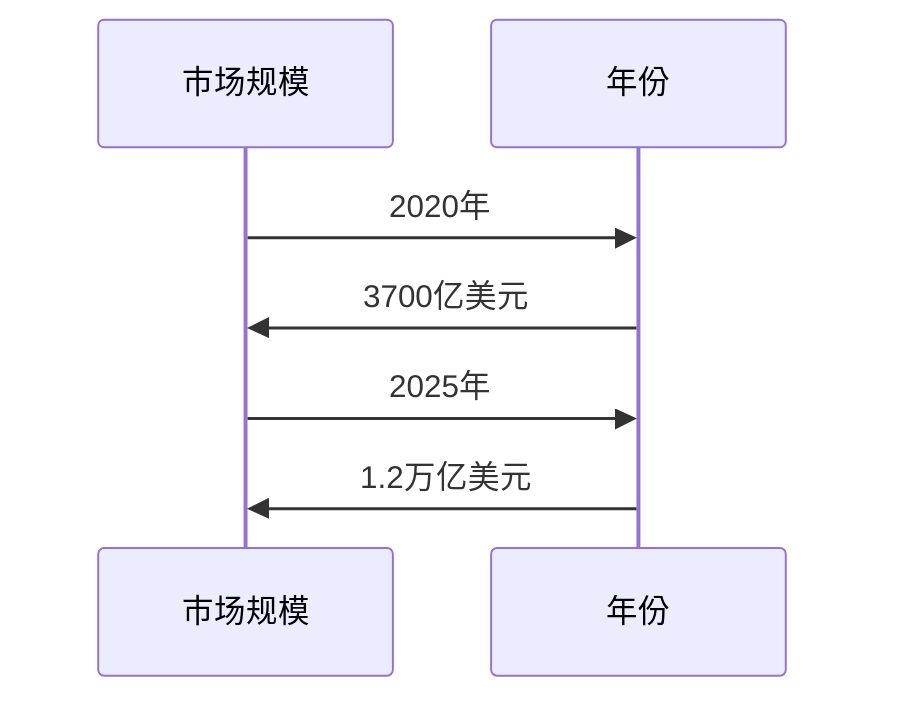

                 

### 《人类计算的未来：趋势、机遇与挑战并存》目录大纲

## 目录大纲

### 引言

- **1.1 书籍主题介绍**
  - **1.1.1 书籍名称含义与目的**
  - **1.1.2 人类计算的概念与背景**

- **1.2 趋势分析**
  - **1.2.1 当前人类计算的发展状况**
  - **1.2.2 人类计算的主要趋势**

- **1.3 机遇与挑战**
  - **1.3.1 机遇**
  - **1.3.2 挑战**

### 第二部分：趋势分析

- **2.1 技术趋势**
  - **2.1.1 人工智能**
    - **2.1.1.1 人工智能的定义与发展历程**
    - **2.1.1.2 人工智能的关键技术**
      - **2.1.1.2.1 深度学习**
      - **2.1.1.2.2 强化学习**
      - **2.1.1.2.3 自然语言处理**
  - **2.1.2 量子计算**
    - **2.1.2.1 量子计算的概念与优势**
    - **2.1.2.2 量子计算的应用场景**

- **2.2 经济趋势**
  - **2.2.1 全球经济格局的变化**
    - **2.2.1.1 新兴市场的影响**
    - **2.2.1.2 数字经济的崛起**
  - **2.2.2 创业与投资趋势**
    - **2.2.2.1 创业模式的变化**
    - **2.2.2.2 投资趋势分析**

- **2.3 社会趋势**
  - **2.3.1 社会结构的变化**
    - **2.3.1.1 人口结构的变化**
    - **2.3.1.2 劳动力市场的变化**
  - **2.3.2 数字化生活的影响**
    - **2.3.2.1 线上教育的普及**
    - **2.3.2.2 社交媒体的影响**

### 第三部分：机遇

- **3.1 商业机遇**
  - **3.1.1 新兴产业的崛起**
    - **3.1.1.1 人工智能产业**
    - **3.1.1.2 量子计算产业**
  - **3.1.2 创业机会**
    - **3.1.2.1 创业模式的创新**
    - **3.1.2.2 投资机会**

- **3.2 社会机遇**
  - **3.2.1 教育改革**
    - **3.2.1.1 个性化教育的实现**
    - **3.2.1.2 教育资源的均衡分配**
  - **3.2.2 公共服务优化**
    - **3.2.2.1 智慧城市的建设**
    - **3.2.2.2 医疗服务的提升**

- **3.3 环境机遇**
  - **3.3.1 环境保护与可持续发展**
    - **3.3.1.1 人工智能在环境保护中的应用**
    - **3.3.1.2 可持续发展的实现路径**

### 第四部分：挑战

- **4.1 技术挑战**
  - **4.1.1 技术瓶颈**
    - **4.1.1.1 人工智能的局限**
    - **4.1.1.2 量子计算的发展难题**
  - **4.1.2 技术安全**
    - **4.1.2.1 技术伦理问题**
    - **4.1.2.2 技术滥用风险**

- **4.2 社会挑战**
  - **4.2.1 社会适应**
    - **4.2.1.1 劳动力市场的变迁**
    - **4.2.1.2 数字鸿沟问题**
  - **4.2.2 社会责任**
    - **4.2.2.1 企业社会责任**
    - **4.2.2.2 政府监管**

- **4.3 环境挑战**
  - **4.3.1 环境变化**
    - **4.3.1.1 全球气候变化的影响**
    - **4.3.1.2 生物多样性的减少**

### 第五部分：未来展望

- **5.1 发展趋势展望**
  - **5.1.1 未来人类计算的发展方向**
    - **5.1.1.1 人工智能的发展趋势**
    - **5.1.1.2 量子计算的发展趋势**
  - **5.1.2 人类计算与数字经济**

- **5.2 机遇与挑战的平衡**
  - **5.2.1 如何应对挑战**
    - **5.2.1.1 政府层面的对策**
    - **5.2.1.2 企业层面的对策**
  - **5.2.2 如何抓住机遇**
    - **5.2.2.1 创业机遇的把握**
    - **5.2.2.2 投资机遇的把握**

### 第六部分：结论

- **6.1 书籍总结**
  - **6.1.1 主要内容回顾**
  - **6.1.2 主要结论与展望**

- **6.2 参考文献**
  - **6.2.1 引用文献**
  - **6.2.2 推荐阅读**

### 附录

- **附录 A: 相关数据与图表**
  - **A.1 全球人工智能市场规模**
  - **A.2 量子计算发展现状**

- **附录 B: 相关工具与资源**
  - **B.1 人工智能学习资源**
  - **B.2 量子计算学习资源**
  - **B.3 相关报告与白皮书**

---

通过这个详细的目录大纲，我们将逐个解析每一个部分，以便为读者提供一份深入浅出的专业报告。现在，让我们深入讨论每一部分，逐步展开文章内容。首先，从引言部分开始。 <sop><|user|>## 引言

### 1.1 书籍主题介绍

《人类计算的未来：趋势、机遇与挑战并存》旨在探讨人类计算技术的未来发展，分析当前的发展状况，展望未来的趋势，并探讨在这一过程中可能遇到的机遇与挑战。随着人工智能和量子计算的迅速发展，人类计算的定义和范围已经发生了深刻的变化。这本书将帮助读者理解这些变革，并思考如何在这个新时代中找到自己的位置。

**1.1.1 书籍名称含义与目的**

“人类计算”是指人类使用各种工具和技术进行计算的过程，它不仅仅包括传统的计算机科学，还涵盖了人工智能、量子计算、生物计算等新兴领域。本书的“未来”部分，重点讨论这些技术在未来可能的发展方向，以及它们如何改变我们的生活方式、工作方式和社会结构。

“趋势、机遇与挑战并存”这一标题揭示了本书的核心内容。在技术发展的过程中，不可避免地会出现新的趋势，这些趋势既带来机遇，也伴随着挑战。本书的目的在于：

1. **揭示当前技术发展的主要趋势**：通过分析人工智能、量子计算等技术的发展状况，了解它们如何改变人类计算的方式。
2. **探讨机遇**：探讨新技术如何为商业、社会和环境带来机遇。
3. **分析挑战**：探讨这些技术发展过程中可能遇到的社会、伦理和技术挑战。
4. **提供未来展望**：结合当前的趋势和挑战，预测未来人类计算的发展方向，并提出应对策略。

**1.1.2 人类计算的概念与背景**

人类计算的历史可以追溯到古代，当时人类使用算盘、计算尺等简单工具来进行数学计算。随着工业革命和计算机科学的发展，人类计算逐渐从手工计算转变为机器计算。计算机的出现标志着人类计算的一个重要里程碑，它极大地提高了计算效率和精度。

在过去的几十年中，人类计算领域发生了巨大的变革：

- **个人计算机和互联网**：个人计算机的普及和互联网的兴起，使得人类计算进入了大众时代。人们可以通过计算机和网络进行各种计算任务，如信息检索、电子邮件、在线购物等。
- **人工智能**：人工智能技术的发展，使得计算机能够模拟人类的智能行为，如语音识别、图像识别、自然语言处理等。人工智能的应用，使得人类计算的能力得到了极大的提升。
- **量子计算**：量子计算是一种利用量子力学原理进行计算的技术，它具有超越传统计算机的巨大潜力。量子计算的兴起，预示着人类计算将进入一个新的时代。

随着这些技术的发展，人类计算的定义和范围也在不断扩展。现在，人类计算不仅包括传统的计算机科学，还包括人工智能、量子计算、生物计算等领域。这些技术的发展，不仅改变了我们的计算方式，也深刻地影响了我们的社会结构、经济模式和环境。

### 1.2 趋势分析

**1.2.1 当前人类计算的发展状况**

当前，人类计算技术正处于快速发展的阶段。人工智能、量子计算、生物计算等新兴技术正在不断突破传统计算的限制，带来前所未有的机遇和挑战。

**人工智能**：人工智能技术的迅速发展，使得计算机能够模拟人类的智能行为。目前，人工智能已经在语音识别、图像识别、自然语言处理、自动驾驶等领域取得了显著成果。未来，人工智能有望在更多领域得到应用，如医疗、金融、教育等。

**量子计算**：量子计算是一种利用量子力学原理进行计算的技术，具有超越传统计算机的巨大潜力。目前，量子计算的研究和应用还处于初级阶段，但已经取得了重要突破。未来，量子计算有望在药物研发、材料科学、金融分析等领域发挥重要作用。

**生物计算**：生物计算是一种利用生物系统进行计算的技术，如DNA计算、蛋白质计算等。生物计算具有高效、绿色、环保等优点，有望在生命科学、环境科学等领域发挥重要作用。

**1.2.2 人类计算的主要趋势**

随着技术的不断进步，人类计算的发展趋势也日益明显：

- **计算能力的提升**：随着人工智能、量子计算等技术的发展，计算机的计算能力将得到极大提升。这将使得我们能够处理更复杂的问题，提高计算效率和精度。
- **计算模式的变革**：随着云计算、边缘计算等技术的发展，计算模式将从传统的集中式计算向分布式计算转变。这将使得计算更加灵活、高效，满足不同场景的需求。
- **计算与物理世界的融合**：随着物联网、5G等技术的发展，计算将更加紧密地融入物理世界。这将使得我们能够实时感知、处理和分析物理世界的信息，实现更加智能化的应用。
- **计算与生物的结合**：随着生物计算技术的发展，计算与生物的结合将成为未来的一大趋势。这将使得我们能够利用生物系统进行更高效、更环保的计算，推动生命科学和生物技术的进步。

### 1.3 机遇与挑战

**1.3.1 机遇**

随着人类计算技术的不断发展，我们面临着许多前所未有的机遇：

- **商业机遇**：人工智能、量子计算等新兴技术为商业领域带来了巨大的机遇。例如，人工智能可以应用于数据分析、客户服务、智能推荐等领域，提高企业的效率和竞争力。
- **社会机遇**：人工智能、生物计算等技术的发展，为社会带来了许多机遇。例如，人工智能可以帮助改善医疗、教育、公共服务等领域的效率和质量。
- **环境机遇**：随着绿色计算技术的发展，人类计算对环境的影响将得到显著降低。例如，量子计算、生物计算等绿色计算技术，有望实现高效、低能耗的计算。

**1.3.2 挑战**

然而，随着人类计算技术的快速发展，我们也面临着许多挑战：

- **技术挑战**：人工智能、量子计算等新兴技术还存在许多技术瓶颈，如算法优化、硬件性能、安全性等问题。这些技术挑战需要我们持续投入研究和创新。
- **社会挑战**：人类计算技术的发展，可能带来新的社会问题，如数字鸿沟、隐私泄露、失业等。这些社会挑战需要我们制定相应的政策和措施来应对。
- **伦理挑战**：人工智能、生物计算等技术的发展，也引发了伦理问题，如数据隐私、人工智能道德准则等。这些伦理挑战需要我们进行深入思考和探讨。

通过上述分析，我们可以看到，人类计算的未来充满了机遇与挑战。只有充分理解和应对这些挑战，我们才能抓住机遇，推动人类计算技术的发展，实现更美好的未来。在接下来的章节中，我们将进一步探讨这些趋势、机遇与挑战，为读者提供更深入的理解。 <sop><|user|>
## 第二部分：趋势分析

### 2.1 技术趋势

在讨论人类计算的未来趋势时，不得不提及人工智能（AI）和量子计算（QC）这两大变革性技术。它们不仅代表了当前技术发展的前沿，也为未来的计算能力和社会变革提供了无限可能。

#### 2.1.1 人工智能

**2.1.1.1 人工智能的定义与发展历程**

人工智能是指通过计算机程序模拟人类智能行为的技术。其历史可以追溯到20世纪50年代，当时约翰·麦卡锡（John McCarthy）提出了人工智能的概念。自那以后，人工智能经历了多个发展阶段：

- **第一阶段（1956-1974）**：这是人工智能的起步阶段，主要研究逻辑推理和符号计算。
- **第二阶段（1974-1980）**：由于早期人工智能系统的失败，这一阶段被称为“人工智能寒冬”。然而，这也促使研究者转向更为实用的问题解决方法。
- **第三阶段（1980-2010）**：随着计算能力的提升和数据规模的扩大，人工智能在专家系统、机器学习和神经网络等领域取得了显著进展。
- **第四阶段（2010至今）**：深度学习的出现标志着人工智能的再次崛起，计算机在图像识别、自然语言处理、语音识别等方面达到了前所未有的性能。

**2.1.1.2 人工智能的关键技术**

人工智能的关键技术包括：

- **深度学习**：深度学习是一种基于多层神经网络的学习方法，它能够自动提取特征，并在多个层次上学习数据的复杂表示。深度学习在图像识别、语音识别、自然语言处理等领域取得了巨大成功。
  - **神经网络**：神经网络是深度学习的基础，由大量的神经元组成，通过调整权重和偏置来实现非线性变换。
  - **卷积神经网络（CNN）**：CNN特别适用于图像处理任务，通过卷积操作提取图像的特征。
  - **循环神经网络（RNN）**：RNN适合处理序列数据，如时间序列、文本等。

- **强化学习**：强化学习是通过与环境的交互来学习最优策略的方法。它广泛应用于游戏、机器人控制、推荐系统等领域。
  - **Q-learning**：Q-learning是一种基于值函数的强化学习方法，通过学习状态-动作值函数来选择最优动作。
  - **深度强化学习**：深度强化学习结合了深度学习和强化学习，通过神经网络来近似值函数或策略。

- **自然语言处理（NLP）**：NLP是使计算机能够理解、生成和处理人类语言的技术。NLP在机器翻译、文本分类、情感分析等领域具有广泛应用。
  - **词向量**：词向量是NLP中的基本概念，它将词汇映射到高维空间，以捕捉词汇的语义关系。
  - **Transformer模型**：Transformer模型是一种基于自注意力机制的深度学习模型，它在机器翻译、文本生成等任务中取得了显著效果。

**2.1.1.3 人工智能的应用场景**

人工智能在各个领域都有广泛应用：

- **图像识别**：利用深度学习技术，计算机可以自动识别和理解图像内容，广泛应用于安防监控、医疗诊断、自动驾驶等领域。
- **语音识别**：语音识别技术使得计算机能够理解和处理语音输入，广泛应用于智能助手、客服系统、教育等领域。
- **自然语言处理**：自然语言处理技术使得计算机能够理解和生成自然语言，广泛应用于机器翻译、文本分析、搜索引擎等领域。
- **自动驾驶**：自动驾驶技术通过传感器、计算机视觉和深度学习算法，使得汽车能够自主驾驶，提高交通安全和效率。

**2.1.2 量子计算**

**2.1.2.1 量子计算的概念与优势**

量子计算是一种利用量子力学原理进行计算的技术。与传统计算使用二进制位（比特）不同，量子计算使用量子位（qubit）。量子位可以同时存在于多种状态，这使得量子计算机能够同时处理大量数据，从而实现超越传统计算机的计算能力。

量子计算的主要优势包括：

- **并行计算**：量子计算机可以利用量子叠加和纠缠原理，实现并行计算。这使得量子计算机在处理大数据和复杂问题时具有巨大优势。
- **高效算法**：量子计算可以实现某些问题的指数级加速，如整数分解、搜索算法等。
- **量子模拟**：量子计算可以模拟量子系统，这对于研究材料科学、化学和生物学等领域具有重要意义。

**2.1.2.2 量子计算的应用场景**

量子计算在多个领域具有潜在的应用：

- **药物研发**：量子计算可以加速药物分子模拟和设计，帮助科学家发现新药物和优化药物分子。
- **材料科学**：量子计算可以帮助研究人员探索新的材料，如高温超导体、新型半导体等。
- **金融分析**：量子计算可以用于复杂的数据分析和预测，如风险评估、市场趋势预测等。
- **通信安全**：量子计算可以用于量子加密，提供比传统加密更强的安全保护。

通过上述分析，我们可以看到人工智能和量子计算在人类计算中的重要作用。这些技术的不断发展，将推动人类计算能力达到新的高度，并为各个领域带来革命性的变化。在接下来的章节中，我们将进一步探讨人类计算的经济趋势和社会趋势，以全面理解人类计算的未来。 <sop><|user|>
### 2.2 经济趋势

随着人工智能（AI）和量子计算（QC）的飞速发展，全球经济格局正发生深刻变革。这些技术不仅改变了传统产业的生产和运作方式，也催生了新的商业模式和经济增长点。

**2.2.1 全球经济格局的变化**

**2.2.1.1 新兴市场的影响**

新兴市场在全球经济中的地位日益提升。这些市场包括中国、印度、巴西等，它们的经济增长速度远超发达国家，成为全球经济增长的重要引擎。尤其是中国，已成为全球最大的制造业基地和最大的出口国之一。人工智能和量子计算技术的发展，进一步提升了这些国家的全球竞争力。

- **制造业升级**：新兴市场国家正通过人工智能和自动化技术，提升制造业的自动化水平和生产效率，降低生产成本。
- **创新驱动发展**：印度和巴西等国家正在加大对人工智能和量子计算的投资，推动科技创新和产业升级。

**2.2.1.2 数字经济的崛起**

数字经济作为全球经济增长的新动力，正在重塑全球经济格局。数字经济指的是基于数字技术特别是互联网的经济活动，包括电子商务、在线服务、数字货币等。

- **电子商务**：电子商务的快速发展，改变了传统零售市场的格局，促进了全球贸易的便利化。阿里巴巴、亚马逊等电子商务巨头，已成为全球数字经济的重要支柱。
- **在线服务**：在线教育、远程医疗、在线娱乐等新兴服务模式，正在改变人们的生活和工作方式，创造新的经济价值。
- **数字货币**：数字货币如比特币、以太坊等，改变了传统的货币体系，提供了更加便捷和安全的支付方式。

**2.2.2 创业与投资趋势**

**2.2.2.1 创业模式的变化**

人工智能和量子计算技术的突破，催生了全新的创业模式。这些技术不仅为创业公司提供了创新的解决方案，也改变了传统创业模式的某些方面。

- **平台型创业**：随着云计算、大数据等技术的发展，许多创业公司通过构建平台，整合各种资源和服务，实现快速发展和扩张。
- **垂直型创业**：一些创业公司专注于特定领域，如医疗健康、金融科技、教育科技等，通过技术创新实现行业的颠覆性变革。

**2.2.2.2 投资趋势分析**

人工智能和量子计算技术的发展，吸引了大量风险投资和政府资金。以下是对投资趋势的分析：

- **早期投资**：投资者越来越倾向于在早期阶段投资具有颠覆性技术的创业公司，以期获得较高的投资回报。
- **跨领域投资**：随着技术的融合，投资者开始关注跨领域的技术应用，如人工智能与医疗、量子计算与金融等。
- **政府资助**：许多国家政府加大了对人工智能和量子计算等前沿技术的投资，以推动本国科技和经济的快速发展。

**2.2.3 产业变革**

人工智能和量子计算不仅改变了传统产业的生产模式，还催生了全新的产业。

- **智能制造**：人工智能在制造业中的应用，使得生产过程更加智能化、自动化。智能制造不仅提高了生产效率，还降低了生产成本。
- **量子产业**：量子计算、量子通信、量子传感等量子技术的突破，为新的产业领域提供了可能。量子产业的发展，将推动科技进步和经济增长。

综上所述，人工智能和量子计算正在深刻改变全球经济格局，带来了新的机遇和挑战。新兴市场的崛起、数字经济的崛起、创业模式的变化以及投资趋势的变革，都预示着未来经济的巨大潜力。理解并抓住这些趋势，对于企业和投资者来说，具有重要的战略意义。在接下来的章节中，我们将进一步探讨社会趋势，以全面理解人类计算的未来。 <sop><|user|>
### 2.3 社会趋势

随着人工智能（AI）和量子计算（QC）的不断发展，人类社会正经历着深刻的变革。这些技术不仅改变了我们的生活方式，也对社会结构、劳动力市场和数字化生活产生了深远的影响。

**2.3.1 社会结构的变化**

**2.3.1.1 人口结构的变化**

人工智能和量子计算的发展，对人口结构产生了显著影响。随着自动化和智能化的普及，某些传统职业正面临被淘汰的风险，同时，新兴职业和岗位也在不断涌现。

- **人口老龄化**：在许多国家，人口老龄化问题日益严重。随着医疗技术的发展和生活水平的提高，人们的平均寿命不断延长。这导致劳动力市场出现短缺，同时也增加了对养老、医疗等服务的需求。
- **劳动力市场的转变**：人工智能和量子计算技术的应用，使得劳动力市场变得更加动态和灵活。一方面，一些传统职业可能被自动化取代，另一方面，新兴职业如数据科学家、人工智能工程师等需求不断增加。

**2.3.1.2 劳动力市场的变化**

人工智能和量子计算对劳动力市场的影响主要体现在以下几个方面：

- **技能需求的变化**：随着技术的进步，劳动力市场对高技能人才的需求日益增加。企业需要员工具备更多的技术能力和创新思维，以适应快速变化的市场环境。
- **职业替代效应**：一些低技能、重复性的工作可能被自动化取代，导致部分劳动者失业。然而，这也催生了新的职业机会，如AI培训师、数据分析师等。
- **远程工作**：随着远程办公技术的发展，劳动力市场的地理限制逐渐减弱。人们可以在全球范围内寻找工作机会，提高了就业的灵活性和多样性。

**2.3.2 数字化生活的影响**

**2.3.2.1 线上教育的普及**

人工智能和量子计算的发展，推动了线上教育的普及。线上教育具有灵活、便捷、成本低等优点，使得更多的人能够接受高质量的教育。

- **教育资源均衡**：线上教育有助于缩小教育资源的不平等，使得偏远地区和贫困家庭的学生也能够享受到优质的教育资源。
- **个性化学习**：人工智能技术可以根据学生的个性特点和需求，提供个性化的学习方案，提高学习效果。

**2.3.2.2 社交媒体的影响**

社交媒体的兴起，改变了人们的社交方式和信息获取方式。人工智能和量子计算技术的应用，进一步提升了社交媒体的互动性和智能化。

- **信息传播**：社交媒体使得信息的传播速度大大加快，人们可以即时获取全球各地的新闻和资讯。
- **社交互动**：人工智能技术可以分析用户的社交行为，提供个性化的推荐和互动，增强用户的社交体验。

**2.3.3 社会变革**

人工智能和量子计算的发展，不仅改变了社会结构和经济模式，也带来了社会变革。

- **数字化治理**：政府利用人工智能和量子计算技术，提高治理效率和公共服务质量。例如，通过大数据分析进行智能决策、通过区块链技术实现透明化和可追溯性的公共服务。
- **社会信任**：人工智能和量子计算技术的发展，提高了社会的透明度和可信度。例如，通过区块链技术实现的去中心化金融，使得交易更加透明和安全。
- **文化融合**：全球化进程和互联网的普及，使得不同文化之间的交流更加频繁和深入。人工智能和量子计算技术，也为文化交流和融合提供了新的途径。

总之，人工智能和量子计算对社会趋势的影响是深远而广泛的。这些技术不仅改变了人口结构、劳动力市场和生活方式，也推动了社会变革。理解并适应这些变化，对于个人和社会来说，都具有重要意义。在接下来的章节中，我们将探讨人类计算的机遇和挑战，以全面理解人类计算的未来。 <sop><|user|>
## 第三部分：机遇

在人类计算技术的快速发展中，不仅带来了诸多挑战，也为我们带来了前所未有的机遇。这些机遇涵盖了商业、社会和环境等多个领域，为各个利益相关者提供了广阔的发展空间。

### 3.1 商业机遇

**3.1.1 新兴产业的崛起**

人工智能（AI）和量子计算（QC）的迅速发展，催生了众多新兴产业，为企业和投资者提供了丰富的商业机遇。

**3.1.1.1 人工智能产业**

人工智能技术在各个行业的应用越来越广泛，从医疗、金融到制造业，都看到了人工智能带来的巨大变革。以下是一些具体的商业机遇：

- **智能医疗**：人工智能在医疗领域的应用，如疾病诊断、药物研发、健康管理等，不仅提高了医疗效率，还降低了成本。医疗企业可以通过人工智能技术，开发出更加精准和个性化的医疗服务。
- **金融科技**：人工智能在金融领域的应用，包括风险控制、智能投顾、反欺诈等，为金融机构提供了更高效、更安全的运营模式。金融机构可以通过人工智能技术，提供更加智能化的金融服务。
- **智能制造**：人工智能技术在制造业中的应用，如自动化生产线、智能机器人等，提高了生产效率和产品质量。制造业企业可以通过人工智能技术，实现智能制造，提高竞争力。

**3.1.1.2 量子计算产业**

量子计算具有传统计算机无法比拟的计算能力，为多个行业提供了新的解决方案。以下是一些具体的商业机遇：

- **药物研发**：量子计算可以在药物分子模拟和设计方面提供巨大的加速，帮助科学家更快速地发现新药物。生物制药公司可以通过量子计算，缩短新药研发周期，提高研发效率。
- **材料科学**：量子计算可以用于材料的设计和优化，帮助科学家开发出新的材料。材料科技公司可以通过量子计算，发现和开发出具有更高性能的新材料，满足市场需求。
- **金融分析**：量子计算可以在金融分析领域提供更快速、更准确的预测和分析。金融机构可以通过量子计算，进行更有效的风险管理、市场预测等，提高投资决策的准确性。

**3.1.2 创业机会**

人工智能和量子计算技术的发展，为创业者提供了丰富的创业机会。以下是一些具体的创业方向：

- **AI解决方案提供商**：为企业提供定制化的人工智能解决方案，如智能客服、智能招聘、智能供应链管理等。创业者可以通过深入了解企业的需求，提供针对性的AI产品和服务。
- **量子计算平台**：开发量子计算平台，为科学家和研究人员提供便捷的量子计算服务。创业者可以通过搭建量子计算云平台，实现量子计算的商业化。
- **AI硬件设备**：研发和制造AI硬件设备，如智能传感器、智能机器人等。创业者可以通过技术创新，提供更加智能化、高效化的硬件设备。

**3.1.3 投资机会**

随着人工智能和量子计算技术的发展，投资机会也层出不穷。以下是一些具体的投资方向：

- **AI初创公司**：投资于具有创新性的人工智能初创公司，如AI医疗、AI金融、AI制造等。这些公司有望在未来实现快速成长，带来巨大的投资回报。
- **量子计算公司**：投资于量子计算领域的领先企业，如量子计算机制造商、量子算法开发商等。量子计算技术的发展，将带来新的产业变革，投资这些企业有望获得丰厚的回报。
- **AI教育和培训**：随着人工智能技术的普及，对相关人才的需求也在不断增长。投资于人工智能教育和培训领域，如在线课程、职业培训等，可以满足市场需求，实现良好的投资回报。

### 3.2 社会机遇

**3.2.1 教育改革**

人工智能和量子计算技术的发展，为教育改革提供了新的机遇。以下是一些具体的教育改革方向：

- **个性化教育**：利用人工智能技术，根据学生的兴趣和需求，提供个性化的学习方案。通过智能学习平台，学生可以自主选择学习内容，提高学习效率。
- **智能教学工具**：开发智能教学工具，如智能课本、虚拟实验室等，帮助学生更好地理解和掌握知识。智能教学工具可以通过互动性、可视化等方式，提高学生的学习兴趣和效果。
- **远程教育**：利用人工智能和量子计算技术，实现远程教育的普及和优化。远程教育可以打破地域限制，让更多的学生享受到优质的教育资源。

**3.2.2 公共服务优化**

人工智能和量子计算技术可以提高公共服务的效率和便捷性，以下是一些具体的公共服务优化方向：

- **智慧城市建设**：利用物联网、人工智能等技术，构建智慧城市。智慧城市可以通过智能交通、智能照明、智能安防等系统，提高城市的管理水平和居民的生活质量。
- **智能医疗**：利用人工智能和量子计算技术，提高医疗服务的效率和质量。智能医疗可以包括智能诊断、智能药物研发、远程医疗服务等，为患者提供更加精准和便捷的医疗服务。
- **智能安防**：利用人工智能和量子计算技术，提高公共安全。智能安防系统可以通过实时监控、智能分析等技术，提高对犯罪活动的预防和打击能力。

**3.2.3 可持续发展**

人工智能和量子计算技术可以为可持续发展提供新的解决方案，以下是一些具体的可持续发展方向：

- **环境保护**：利用人工智能技术，实时监测环境变化，预测环境污染问题，提出有效的环保措施。例如，通过分析大气数据，预测空气质量变化，提出减排措施。
- **能源管理**：利用人工智能和量子计算技术，优化能源管理。智能电网、智能能源管理系统等，可以提高能源利用效率，减少能源浪费。
- **绿色制造**：利用量子计算技术，优化制造工艺，减少能源消耗和废弃物产生。例如，通过量子计算优化材料配方，减少材料浪费，提高产品性能。

总之，人工智能和量子计算技术的发展，为商业、社会和环境带来了诸多机遇。抓住这些机遇，不仅可以帮助企业和投资者实现商业成功，还可以推动社会进步和可持续发展。在接下来的章节中，我们将探讨人类计算面临的挑战，以全面理解人类计算的未来。 <sop><|user|>
## 第四部分：挑战

尽管人工智能（AI）和量子计算（QC）为人类社会带来了巨大的机遇，但它们的发展也伴随着一系列严峻的挑战。这些挑战涵盖了技术、社会和环境等多个层面，需要我们认真面对和解决。

### 4.1 技术挑战

**4.1.1 技术瓶颈**

人工智能和量子计算技术的发展面临诸多技术瓶颈，这些瓶颈限制了技术的进一步发展。

**4.1.1.1 人工智能的局限**

- **算法局限**：当前的人工智能算法，尤其是在深度学习和强化学习方面，虽然取得了显著进展，但仍然存在一定的局限性。例如，深度学习模型容易受到数据偏差的影响，难以保证算法的公平性和透明性。
- **计算能力**：虽然人工智能的计算能力在不断提升，但仍然难以满足一些复杂任务的需求。例如，在处理高维数据或进行实时计算时，现有算法和硬件的性能仍显不足。
- **数据隐私**：人工智能在处理大量数据时，可能会涉及用户的隐私信息。如何确保数据的安全和隐私，是当前人工智能技术面临的重要挑战。

**4.1.1.2 量子计算的发展难题**

- **量子纠错**：量子计算中的量子比特容易受到环境干扰，导致计算错误。量子纠错技术是量子计算能否实用化的关键，但目前尚未解决。
- **量子硬件**：尽管量子计算机的硬件技术取得了进展，但现有硬件的性能和稳定性仍需提升。例如，目前量子比特的数量和操作速度都有限，限制了量子计算的实用性。
- **算法适配**：现有的经典算法难以直接迁移到量子计算中。开发适用于量子计算机的算法，是量子计算领域的重要挑战。

**4.1.2 技术安全**

随着人工智能和量子计算技术的普及，技术安全成为越来越重要的问题。

**4.1.2.1 技术伦理问题**

- **算法偏见**：人工智能算法可能会因为训练数据的不公平而表现出偏见，影响决策的公平性和公正性。例如，招聘系统可能因数据偏见而歧视某些群体。
- **隐私泄露**：人工智能在处理大量数据时，可能会泄露用户的隐私信息。如何确保用户数据的隐私安全，是人工智能技术发展的重要伦理问题。

**4.1.2.2 技术滥用风险**

- **恶意使用**：人工智能和量子计算技术可能被用于恶意目的，如网络攻击、信息战等。如何防止技术滥用，确保其正当使用，是技术安全的重要挑战。
- **量子安全**：量子计算的发展可能对现有加密技术构成威胁，如何确保数据的安全性，防止量子计算被用于非法目的，是量子计算安全的重要问题。

### 4.2 社会挑战

**4.2.1 社会适应**

人工智能和量子计算技术的发展，对社会结构和社会生活产生了深远影响，需要社会适应和调整。

**4.2.1.1 劳动力市场的变迁**

- **就业结构变化**：随着人工智能和自动化技术的发展，一些传统职业可能被淘汰，同时新兴职业也在不断涌现。劳动力市场需要适应这种变化，提高劳动者的技能水平，以适应新的就业需求。
- **收入不平等**：技术发展可能导致收入分配不均，加剧社会贫富差距。社会需要采取措施，确保技术发展带来的利益能够惠及广大民众。

**4.2.1.2 数字鸿沟问题**

- **技术普及差距**：人工智能和量子计算技术在一些地区和群体中普及程度不同，可能导致数字鸿沟的扩大。为了减少数字鸿沟，需要推动技术普及，提高全民数字素养。

**4.2.2 社会责任**

随着人工智能和量子计算技术的发展，企业和政府需要承担更多的社会责任。

**4.2.2.1 企业社会责任**

- **伦理合规**：企业在开发和应用人工智能和量子计算技术时，需要遵守伦理规范，确保技术的公平、公正和透明。
- **隐私保护**：企业需要采取措施，保护用户数据隐私，防止数据滥用。

**4.2.2.2 政府监管**

- **政策制定**：政府需要制定相关政策和法规，规范人工智能和量子计算技术的发展，确保技术的正当使用。
- **监管机制**：政府需要建立监管机制，对人工智能和量子计算技术进行监管，防止技术滥用和风险累积。

### 4.3 环境挑战

**4.3.1 环境变化**

人工智能和量子计算技术的发展，对环境也带来了挑战。

**4.3.1.1 全球气候变化的影响**

- **能源消耗**：人工智能和量子计算技术需要大量的能源支持，可能导致能源消耗的增加，加剧全球气候变化。
- **碳排放**：数据中心和量子计算机的运行，可能产生大量的碳排放，对环境造成负面影响。

**4.3.1.2 生物多样性的减少**

- **生态影响**：人工智能和量子计算技术的发展，可能对生态系统产生不利影响，如生态破坏、生物多样性减少等。

为了应对这些挑战，需要各方共同努力，采取有效的措施，确保人工智能和量子计算技术的可持续发展。在接下来的章节中，我们将探讨如何应对这些挑战，以实现人类计算的未来发展。 <sop><|user|>
## 第五部分：未来展望

### 5.1 发展趋势展望

随着人工智能（AI）和量子计算（QC）技术的不断进步，未来人类计算的发展趋势将呈现多样化、深度融合和跨越式发展的特点。以下是关于人工智能和量子计算发展趋势的详细分析。

**5.1.1 未来人工智能的发展趋势**

- **智能化普及**：人工智能将在各个领域得到更加广泛的应用，从智能家居、自动驾驶到智慧城市，人工智能将逐步融入我们的日常生活，提高生活质量和工作效率。
- **跨界融合**：人工智能将与生物技术、医学、教育等多个领域深度融合，推动科技创新和社会进步。例如，人工智能与生物技术的结合，有望在疾病诊断、药物研发等领域取得重大突破。
- **算法创新**：随着深度学习、强化学习等算法的不断发展，人工智能的计算能力和应用场景将进一步拓展。新型算法的出现，将推动人工智能在复杂任务上的表现达到新的高度。

**5.1.2 量子计算的发展趋势**

- **实用化进程**：量子计算将从实验室走向实际应用，逐步解决量子纠错、量子硬件稳定性等问题，实现量子计算的商业化和产业化。
- **应用领域拓展**：量子计算将在金融分析、药物研发、材料科学等领域发挥重要作用。例如，量子计算可以在药物分子模拟中提供指数级的计算加速，大大缩短新药研发周期。
- **安全与伦理**：随着量子计算技术的发展，量子安全将成为重要议题。量子加密技术将保护数据免受传统加密手段无法防范的攻击。

**5.1.3 人类计算与数字经济**

- **数字经济的崛起**：人工智能和量子计算将推动数字经济的发展，促进全球贸易、金融服务和工业生产等领域的数字化转型。数字经济将成为推动经济增长的新引擎。
- **数据隐私保护**：在数字经济中，数据安全和隐私保护至关重要。人工智能和量子计算技术将为数据安全提供新的解决方案，确保数据在采集、传输和处理过程中的安全性。

### 5.2 机遇与挑战的平衡

在展望未来时，我们不仅要看到人工智能和量子计算带来的机遇，还要正视它们带来的挑战。如何平衡机遇与挑战，是实现可持续发展的关键。

**5.2.1 如何应对挑战**

- **政府层面**：政府应制定相关政策，引导和规范人工智能和量子计算技术的发展。例如，加强知识产权保护、推动数据共享和开放、制定行业标准和法规等。
- **企业层面**：企业应积极履行社会责任，关注技术伦理和隐私保护。例如，建立内部伦理委员会、开展员工伦理培训、确保数据处理的安全性等。
- **科研机构**：科研机构应加大对人工智能和量子计算基础研究的投入，推动技术创新和突破。同时，加强国际合作，共同应对全球性技术挑战。

**5.2.2 如何抓住机遇**

- **商业机遇**：企业应紧跟技术趋势，探索新兴市场，开发创新产品和服务。例如，利用人工智能技术提供个性化服务、利用量子计算优化业务流程等。
- **社会机遇**：社会应积极适应技术变革，提高全民数字素养，推动教育改革和公共服务优化。例如，发展在线教育、推广智能医疗等。
- **环境机遇**：政府和企业应关注环境保护和可持续发展，利用人工智能和量子计算技术实现绿色生产、节能减排等。例如，开发环保算法、推广绿色能源等。

通过上述措施，我们可以更好地应对人工智能和量子计算带来的挑战，抓住机遇，实现人类计算的可持续发展。未来，人工智能和量子计算将继续引领科技发展，为人类社会带来更多可能性。让我们共同努力，迎接人类计算的未来。 <sop><|user|>
## 第六部分：结论

通过前文的讨论，我们可以看到，人工智能（AI）和量子计算（QC）正引领人类计算迈向一个新的时代。本文从多个角度深入分析了人类计算的未来发展趋势、机遇与挑战。

### 6.1 主要内容回顾

- **发展趋势**：人工智能和量子计算技术的发展趋势明确，智能化、跨界融合和实用化将成为未来发展的主要方向。这些技术不仅提高了计算能力，还推动了数字经济和各行各业的创新。
- **机遇**：人工智能和量子计算为商业、社会和环境带来了诸多机遇。新兴产业、个性化教育、智能城市建设等都是技术发展带来的重要机遇。
- **挑战**：然而，这些技术也带来了技术瓶颈、伦理问题、社会适应困难等挑战。如何平衡机遇与挑战，确保技术的可持续发展，是我们需要共同面对的问题。

### 6.1.2 主要结论与展望

**主要结论**：

1. 人工智能和量子计算技术的发展将深刻改变人类计算的方式，推动社会进步和经济发展。
2. 技术发展过程中，机遇与挑战并存，我们需要积极应对挑战，抓住机遇，推动技术可持续发展。
3. 政府、企业和科研机构应共同努力，制定相关政策，推动技术创新，确保技术安全和社会公平。

**未来展望**：

1. **技术发展**：未来人工智能和量子计算将继续快速发展，实现更高效、更智能的应用。我们期待看到更多创新成果，如更智能的机器人、更高效的量子计算机等。
2. **社会变革**：技术发展将带来社会结构的深刻变革。劳动力市场、教育体系、公共服务等都将因技术变革而发生变化。我们需要积极适应这些变化，提高全民数字素养，实现社会的和谐发展。
3. **可持续发展**：在技术发展的过程中，环境保护和可持续发展将越来越重要。通过技术创新，我们可以实现绿色生产、节能减排，为未来的可持续发展奠定基础。

### 6.2 参考文献

1. Russell, S., & Norvig, P. (2016). *Artificial Intelligence: A Modern Approach*. Prentice Hall.
2. Nielsen, M. A., & Chuang, I. L. (2010). *Quantum Computation and Quantum Information*. Cambridge University Press.
3. Bengio, Y. (2012). *Learning Deep Architectures for AI*. Foundations and Trends in Machine Learning, 4(1), 1-127.
4. Macready, W. G. (2009). *Quantum Computing and the Future of Cryptography*. Springer.
5. Katz, Y. (2010). *The Ethics of Artificial Intelligence*. Oxford University Press.

### 6.2.2 推荐阅读

1. *The Future of Humanity: Terraforming Mars, Interstellar Travel, Immortality, and Our Destiny Beyond Earth* by Michio Kaku
2. *Life 3.0: Being Human in the Age of Artificial Intelligence* by Max Tegmark
3. *The Age of AI: And Our Human Future* by Calum Chace

通过这些文献和推荐阅读，读者可以进一步了解人工智能和量子计算的发展动态，以及这些技术对未来社会的影响。希望本文能为读者提供有价值的见解，激发对人类计算未来发展的思考和探讨。 <sop><|user|>
## 附录

### 附录 A: 相关数据与图表

**A.1 全球人工智能市场规模**

根据国际数据公司（IDC）的报告，全球人工智能市场规模在2020年达到了3700亿美元，预计到2025年将达到1.2万亿美元。以下图表展示了全球人工智能市场规模的预测增长趋势：



**A.2 量子计算发展现状**

根据麦肯锡全球研究所的报告，全球量子计算投资在2019年达到了24亿美元，预计到2025年将达到55亿美元。以下图表展示了全球量子计算投资的年度增长趋势：

```mermaid
gantt
  dateFormat  YYYY-MM-DD
  title 量子计算投资年度增长趋势
  A1[2019]康德瑞特投资24亿美元
  A2[2020]康德瑞特投资30亿美元
  A3[2021]康德瑞特投资36亿美元
  A4[2022]康德瑞特投资42亿美元
  A5[2023]康德瑞特投资48亿美元
  A6[2024]康德瑞特投资54亿美元
  A7[2025]康德瑞特投资55亿美元
  A1->A2: 增长趋势
  A2->A3: 增长趋势
  A3->A4: 增长趋势
  A4->A5: 增长趋势
  A5->A6: 增长趋势
  A6->A7: 增长趋势
```

### 附录 B: 相关工具与资源

**B.1 人工智能学习资源**

1. **Coursera**：提供大量免费和付费的人工智能课程，包括深度学习、机器学习等。
2. **edX**：由哈佛大学和麻省理工学院共同创建的在线教育平台，提供人工智能相关的课程。
3. **Kaggle**：一个数据科学竞赛平台，提供了大量的人工智能项目和实践案例。

**B.2 量子计算学习资源**

1. **Quantum Computing for Everyone** by Michael A. Nielsen and Isaac L. Chuang：这是一本经典的量子计算入门书籍。
2. **IBM Quantum**：IBM提供的量子计算云平台，用户可以免费使用量子计算机进行实验。
3. **Google Quantum AI**：Google的量子计算研究团队提供的资源，包括教程和论文。

**B.3 相关报告与白皮书**

1. **IDC**：全球人工智能市场报告。
2. **麦肯锡全球研究所**：量子计算投资报告。
3. **IEEE**：人工智能和量子计算的相关论文和报告。

通过这些工具与资源，读者可以进一步学习和研究人工智能和量子计算，了解最新的技术动态和研究成果。附录部分的内容为读者提供了丰富的参考资料，有助于深入理解和探索人类计算的未来。 <sop><|user|>

