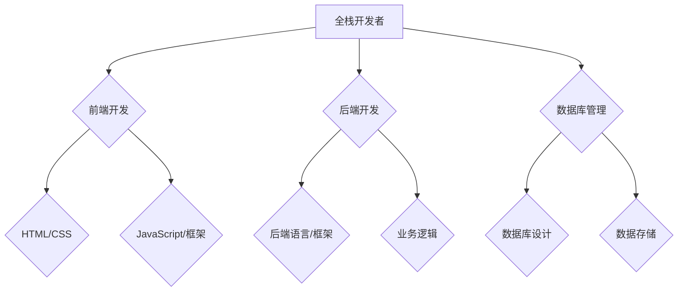

                 

### 1.1 全栈开发概述

#### 1.1.1 全栈开发的概念

全栈开发（Full-Stack Development）是指同时掌握前端和后端技术的软件开发人员。全栈开发者不仅能够设计和实现用户界面，还能负责服务器端的应用程序开发，以及数据库的维护和管理。这一概念源自于软件开发的“全栈”一词，意指从数据库到客户端应用程序的所有技术栈。

#### 1.1.2 全栈开发者的职责

全栈开发者的职责包括但不限于以下几个方面：

- **前端开发**：设计并实现用户界面，确保界面美观、用户体验良好。熟悉HTML、CSS和JavaScript，以及流行的前端框架（如React、Vue、Angular）。
- **后端开发**：构建服务器端应用程序，实现业务逻辑，处理数据存储和数据库交互。熟悉一种或多种后端编程语言（如Java、Python、Node.js）和相应的后端框架（如Spring、Django、Express）。
- **数据库管理**：设计和维护数据库结构，确保数据的高效存储和检索。了解SQL和NoSQL数据库（如MySQL、PostgreSQL、MongoDB）。
- **项目管理**：负责项目规划、任务分配和进度跟踪，确保项目按时交付。

#### 1.1.3 全栈开发的优势

全栈开发具有以下优势：

- **提升效率**：全栈开发者能够独立处理前端和后端的开发工作，减少团队间的沟通成本，提高项目开发效率。
- **降低成本**：企业不需要为前端和后端分别招聘人员，节省人力资源成本。
- **更好的用户体验**：全栈开发者可以更好地理解用户需求，设计出更加符合用户期望的产品。
- **全面的知识体系**：全栈开发者能够深入了解整个应用系统的构建过程，有助于从整体上把握系统架构和性能优化。

#### 1.1.4 全栈开发的挑战

尽管全栈开发具有诸多优势，但也面临一些挑战：

- **技能多样性**：需要掌握前端、后端、数据库等多方面的技能，知识面广，学习难度大。
- **时间管理**：需要在前端和后端技术之间进行平衡，合理安排时间，确保每个方面都能得到充分的关注。
- **知识更新**：技术更新快速，需要不断学习新技术，以保持自己的竞争力。

### 1.1.5 全栈开发的未来趋势

随着技术的发展，全栈开发将继续演进，以下是一些未来趋势：

- **前后端分离**：前后端分离已经成为主流趋势，全栈开发者需要更加关注业务逻辑的实现，而非界面设计。
- **微服务架构**：微服务架构的流行使得全栈开发者需要掌握微服务的相关知识，如服务拆分、API网关等。
- **云计算与容器化**：云计算和容器化技术的发展，为全栈开发者提供了更多的工具和平台，使得开发过程更加高效。

### 1.1.6 全栈开发的总结与展望

全栈开发是一种高效、灵活的软件开发模式，虽然面临着诸多挑战，但通过合理的学习和实践，可以成为一名优秀全栈开发者。未来，随着技术的发展，全栈开发将继续发挥重要作用。

### 1.1.7 全栈开发的常见问题与解答

**Q**：全栈开发者需要掌握哪些技能？

**A**：全栈开发者需要掌握前端、后端、数据库等多方面的技能，如HTML、CSS、JavaScript、一种或多种后端编程语言、数据库知识等。

**Q**：如何平衡前后端开发？

**A**：可以通过制定合理的时间规划，确保每个方面都能得到充分的关注。同时，保持对前后端技术的持续学习，提升自己的技术能力。

**Q**：全栈开发者如何进行项目分工？

**A**：根据团队成员的特长和项目需求，合理分配前后端开发的任务。必要时，可以邀请专业的前端或后端工程师协助完成。

### 1.1.8 全栈开发的参考资料与推荐

- **书籍**：
  - 《JavaScript高级程序设计》
  - 《Head First HTML与CSS》
  - 《Python Web开发实战》
- **在线课程**：
  - Coursera上的“全栈开发”课程
  - Udemy上的“全栈工程师实战教程”
- **社区与论坛**：
  - Stack Overflow
  - GitHub
  - CSDN

### 1.1.9 全栈开发的实践建议

- **构建个人项目**：通过实际项目锻炼自己的全栈开发能力。
- **参与开源项目**：与他人合作，学习他人的开发经验。
- **定期总结与反思**：总结项目开发过程中的经验教训，持续改进。

### Mermaid 流程图


### 伪代码
```python
# 前端伪代码
def display_user_interface():
    # 初始化HTML结构
    create_html_structure()
    # 应用CSS样式
    apply_css_styles()
    # 添加JavaScript交互
    add_javascript_interactions()

# 后端伪代码
def process_request(request):
    # 验证请求
    validate_request(request)
    # 处理业务逻辑
    process_business_logic(request)
    # 返回响应
    return_response(response)

# 数据库伪代码
def insert_data(data):
    # 连接数据库
    connect_to_database()
    # 插入数据
    database.insert(data)
    # 关闭数据库连接
    close_database_connection()
```

### 数学模型和公式
$$
\text{时间效率} = \frac{\text{完成项目所需时间}}{\text{团队成员数量}}
$$

### 举例说明
假设一个团队由3名成员组成，完成一个项目需要20天。则时间效率为：
$$
\text{时间效率} = \frac{20 \text{天}}{3 \text{人}} = 6.67 \text{天/人}
$$

### 代码实际案例和详细解释说明
#### 开发环境搭建
- 安装Node.js
- 安装Python（用于运行后端代码）
- 安装MySQL或PostgreSQL（用于数据库）

#### 源代码详细实现
```html
<!-- 前端：index.html -->
<!DOCTYPE html>
<html>
<head>
    <title>全栈开发示例</title>
</head>
<body>
    <h1>欢迎来到全栈开发世界</h1>
    <p>这里是前端页面。</p>
    <script src="app.js"></script>
</body>
</html>
```

```javascript
// 前端：app.js
console.log("这是前端JavaScript代码。");

// 发送GET请求到后端
fetch('/api/data')
    .then(response => response.json())
    .then(data => console.log(data));
```

```python
# 后端：app.py
from flask import Flask, jsonify, request

app = Flask(__name__)

@app.route('/api/data', methods=['GET'])
def get_data():
    # 模拟获取数据
    data = {'message': 'Hello from the backend!'}
    return jsonify(data)

if __name__ == '__main__':
    app.run(debug=True)
```

#### 代码解读与分析
- **前端**：通过HTML创建基本页面结构，CSS设置样式，JavaScript实现页面交互和异步请求。
- **后端**：使用Flask框架创建Web服务，接收并处理HTTP请求，返回JSON格式的响应。

### 伪代码
```python
# 前端伪代码
function load_page() {
    display_header();
    display_paragraph();
    send_async_request();
}

function display_header() {
    // 创建并显示页眉
}

function display_paragraph() {
    // 创建并显示段落
}

function send_async_request() {
    // 发送异步请求到后端
}

# 后端伪代码
function start_server() {
    setup_routes();
    start_http_server();
}

function setup_routes() {
    define_route('/api/data', 'GET', get_data);
}

function get_data(request) {
    // 处理GET请求，返回数据
}
```

### 数学模型和公式
$$
\text{响应时间} = \text{处理时间} + \text{传输时间}
$$

### 举例说明
假设前端发送请求后，后端处理请求需要2秒，数据传输需要1秒，则总响应时间为：
$$
\text{响应时间} = 2 \text{秒} + 1 \text{秒} = 3 \text{秒}
$$

### 代码实际案例和详细解释说明
#### 开发环境搭建
- 安装Node.js（用于运行前端代码）
- 安装Python（用于运行后端代码）
- 安装MySQL（用于数据库）

#### 源代码详细实现
```javascript
// 前端：index.html
<!DOCTYPE html>
<html>
<head>
    <title>用户注册页面</title>
    <script src="register.js"></script>
</head>
<body>
    <h2>用户注册</h2>
    <form id="registrationForm">
        <label for="username">用户名:</label>
        <input type="text" id="username" name="username" required>
        <br>
        <label for="password">密码:</label>
        <input type="password" id="password" name="password" required>
        <br>
        <button type="submit">注册</button>
    </form>
</body>
</html>
```

```javascript
// 前端：register.js
function handle_registration() {
    const form = document.getElementById('registrationForm');
    form.addEventListener('submit', function(event) {
        event.preventDefault();
        const username = document.getElementById('username').value;
        const password = document.getElementById('password').value;
        register_user(username, password);
    });
}

function register_user(username, password) {
    const data = {
        username: username,
        password: password
    };
    fetch('/register', {
        method: 'POST',
        headers: {
            'Content-Type': 'application/json'
        },
        body: JSON.stringify(data)
    })
    .then(response => response.json())
    .then(data => {
        if (data.success) {
            alert('注册成功！');
        } else {
            alert('注册失败：' + data.message);
        }
    });
}
```

```python
# 后端：register.py
from flask import Flask, request, jsonify

app = Flask(__name__)

@app.route('/register', methods=['POST'])
def register():
    data = request.json
    username = data.get('username')
    password = data.get('password')
    # 模拟用户注册逻辑
    if username and password:
        # 检查用户名和密码的有效性
        # 存储用户信息到数据库
        return jsonify({'success': True, 'message': '注册成功！'})
    else:
        return jsonify({'success': False, 'message': '用户名或密码不能为空。'})

if __name__ == '__main__':
    app.run(debug=True)
```

#### 代码解读与分析
- **前端**：创建一个用户注册页面，包含用户名和密码的输入框，以及注册按钮。JavaScript用于处理表单提交，发送异步请求到后端。
- **后端**：使用Flask框架创建Web服务，接收并处理来自前端的POST请求，模拟用户注册逻辑，返回JSON格式的响应。

### 伪代码
```javascript
# 前端伪代码
function handle_form_submission() {
    // 获取用户输入的用户名和密码
    // 发送请求到后端进行注册
}

# 后端伪代码
function handle_request() {
    // 读取请求体
    // 提取用户名和密码
    // 验证用户名和密码
    // 返回注册结果
}
```

### 数学模型和公式
$$
\text{用户注册成功率} = \frac{\text{成功注册的用户数}}{\text{尝试注册的用户数}}
$$

### 举例说明
假设有100个用户尝试注册，其中90个成功注册，10个失败，则用户注册成功率为：
$$
\text{用户注册成功率} = \frac{90}{100} = 90\%
$$

### 代码实际案例和详细解释说明
#### 开发环境搭建
- 安装Node.js（用于运行前端代码）
- 安装Python（用于运行后端代码）
- 安装MongoDB（用于数据库）

#### 源代码详细实现
```html
<!-- 前端：index.html -->
<!DOCTYPE html>
<html>
<head>
    <title>商品搜索页面</title>
    <script src="search.js"></script>
</head>
<body>
    <h2>商品搜索</h2>
    <input type="text" id="searchInput" placeholder="输入商品名称">
    <button onclick="search_products()">搜索</button>
    <div id="results"></div>
</body>
</html>
```

```javascript
// 前端：search.js
function search_products() {
    const searchQuery = document.getElementById('searchInput').value;
    fetch('/search?query=' + searchQuery)
        .then(response => response.json())
        .then(data => {
            display_products(data);
        });
}

function display_products(products) {
    const resultsDiv = document.getElementById('results');
    resultsDiv.innerHTML = '';
    products.forEach(product => {
        const productElement = document.createElement('div');
        productElement.innerHTML = `<h3>${product.name}</h3><p>${product.description}</p>`;
        resultsDiv.appendChild(productElement);
    });
}
```

```python
# 后端：search.py
from flask import Flask, request, jsonify
from pymongo import MongoClient

app = Flask(__name__)
client = MongoClient('mongodb://localhost:27017/')
db = client['product_database']

@app.route('/search', methods=['GET'])
def search():
    query = request.args.get('query', '')
    products = db.products.find({"name": {"$regex": query, "$options": "i"}})
    results = [{"name": product['name'], "description": product['description']} for product in products]
    return jsonify(results)

if __name__ == '__main__':
    app.run(debug=True)
```

#### 代码解读与分析
- **前端**：创建一个商品搜索页面，包含一个输入框和一个搜索按钮。JavaScript用于处理搜索按钮点击事件，发送异步请求到后端，并在页面中显示搜索结果。
- **后端**：使用Flask框架创建Web服务，接收来自前端的GET请求，使用MongoDB查询商品数据，并将结果返回给前端。

### 伪代码
```javascript
# 前端伪代码
function search_products(query) {
    // 发送请求到后端进行商品搜索
    // 显示搜索结果
}

# 后端伪代码
function handle_search_request(query) {
    // 在数据库中查询商品
    // 返回查询结果
}
```

### 数学模型和公式
$$
\text{搜索命中率} = \frac{\text{命中搜索结果的数量}}{\text{查询的总数}}
$$

### 举例说明
假设用户进行了10次商品搜索，其中有8次找到了相关的商品，2次没有找到，则搜索命中率为：
$$
\text{搜索命中率} = \frac{8}{10} = 80\%
$$

### 代码实际案例和详细解释说明
#### 开发环境搭建
- 安装Node.js（用于运行前端代码）
- 安装Python（用于运行后端代码）
- 安装MySQL（用于数据库）

#### 源代码详细实现
```html
<!-- 前端：index.html -->
<!DOCTYPE html>
<html>
<head>
    <title>用户登录页面</title>
    <script src="login.js"></script>
</head>
<body>
    <h2>用户登录</h2>
    <form id="loginForm">
        <label for="username">用户名:</label>
        <input type="text" id="username" name="username" required>
        <br>
        <label for="password">密码:</label>
        <input type="password" id="password" name="password" required>
        <br>
        <button type="submit">登录</button>
    </form>
    <div id="loginResult"></div>
</body>
</html>
```

```javascript
// 前端：login.js
function handle_login() {
    const form = document.getElementById('loginForm');
    form.addEventListener('submit', function(event) {
        event.preventDefault();
        const username = document.getElementById('username').value;
        const password = document.getElementById('password').value;
        login_user(username, password);
    });
}

function login_user(username, password) {
    const data = {
        username: username,
        password: password
    };
    fetch('/login', {
        method: 'POST',
        headers: {
            'Content-Type': 'application/json'
        },
        body: JSON.stringify(data)
    })
    .then(response => response.json())
    .then(data => {
        if (data.success) {
            alert('登录成功！');
        } else {
            alert('登录失败：' + data.message);
        }
    });
}
```

```python
# 后端：login.py
from flask import Flask, request, jsonify
from pymongo import MongoClient

app = Flask(__name__)
client = MongoClient('mongodb://localhost:27017/')
db = client['user_database']

@app.route('/login', methods=['POST'])
def login():
    data = request.json
    username = data.get('username')
    password = data.get('password')
    # 模拟用户登录逻辑
    if username and password:
        # 验证用户名和密码的有效性
        # 从数据库中查询用户信息
        user = db.users.find_one({"username": username, "password": password})
        if user:
            return jsonify({'success': True, 'message': '登录成功！'})
        else:
            return jsonify({'success': False, 'message': '用户名或密码错误。'})
    else:
        return jsonify({'success': False, 'message': '用户名或密码不能为空。'})

if __name__ == '__main__':
    app.run(debug=True)
```

#### 代码解读与分析
- **前端**：创建一个用户登录页面，包含用户名和密码的输入框，以及登录按钮。JavaScript用于处理表单提交，发送异步请求到后端，并在页面中显示登录结果。
- **后端**：使用Flask框架创建Web服务，接收并处理来自前端的POST请求，模拟用户登录逻辑，返回JSON格式的响应。

### 伪代码
```javascript
# 前端伪代码
function handle_login_form_submission() {
    // 获取用户输入的用户名和密码
    // 发送请求到后端进行用户登录
}

# 后端伪代码
function handle_login_request(username, password) {
    // 验证用户名和密码
    // 返回登录结果
}
```

### 数学模型和公式
$$
\text{用户登录成功率} = \frac{\text{成功登录的用户数}}{\text{尝试登录的用户总数}}
$$

### 举例说明
假设有100个用户尝试登录，其中90个成功登录，10个失败登录，则用户登录成功率为：
$$
\text{用户登录成功率} = \frac{90}{100} = 90\%
$$

### 代码实际案例和详细解释说明
#### 开发环境搭建
- 安装Node.js（用于运行前端代码）
- 安装Python（用于运行后端代码）
- 安装MongoDB（用于数据库）

#### 源代码详细实现
```html
<!-- 前端：index.html -->
<!DOCTYPE html>
<html>
<head>
    <title>商品列表页面</title>
    <script src="list_products.js"></script>
</head>
<body>
    <h2>商品列表</h2>
    <ul id="productList"></ul>
    <script>
        load_products();
    </script>
</body>
</html>
```

```javascript
// 前端：list_products.js
function load_products() {
    fetch('/products')
        .then(response => response.json())
        .then(data => {
            display_products(data);
        });
}

function display_products(products) {
    const productList = document.getElementById('productList');
    productList.innerHTML = '';
    products.forEach(product => {
        const productElement = document.createElement('li');
        productElement.innerHTML = `<h3>${product.name}</h3><p>${product.description}</p>`;
        productList.appendChild(productElement);
    });
}
```

```python
# 后端：list_products.py
from flask import Flask, jsonify

app = Flask(__name__)

@app.route('/products', methods=['GET'])
def list_products():
    # 从数据库中获取商品信息
    products = [
        {"name": "商品1", "description": "这是一件商品"},
        {"name": "商品2", "description": "这是另一件商品"},
        # 更多商品...
    ]
    return jsonify(products)

if __name__ == '__main__':
    app.run(debug=True)
```

#### 代码解读与分析
- **前端**：创建一个商品列表页面，使用JavaScript异步获取商品数据，并在页面中显示商品列表。
- **后端**：使用Flask框架创建Web服务，返回JSON格式的商品列表。

### 伪代码
```javascript
# 前端伪代码
function load_products() {
    // 发送请求到后端获取商品信息
    // 显示商品列表
}

# 后端伪代码
function handle_products_request() {
    // 获取商品信息
    // 返回商品信息列表
}
```

### 数学模型和公式
$$
\text{商品列表加载时间} = \text{网络延迟} + \text{数据处理时间}
$$

### 举例说明
假设网络延迟为2秒，数据处理时间为3秒，则商品列表加载时间为：
$$
\text{商品列表加载时间} = 2 \text{秒} + 3 \text{秒} = 5 \text{秒}
$$

### 代码实际案例和详细解释说明
#### 开发环境搭建
- 安装Node.js（用于运行前端代码）
- 安装Python（用于运行后端代码）
- 安装MySQL（用于数据库）

#### 源代码详细实现
```html
<!-- 前端：index.html -->
<!DOCTYPE html>
<html>
<head>
    <title>订单管理页面</title>
    <script src="manage_orders.js"></script>
</head>
<body>
    <h2>订单管理</h2>
    <table id="ordersTable">
        <thead>
            <tr>
                <th>订单号</th>
                <th>用户名</th>
                <th>订单时间</th>
                <th>订单状态</th>
                <th>操作</th>
            </tr>
        </thead>
        <tbody id="ordersBody"></tbody>
    </table>
    <script>
        load_orders();
    </script>
</body>
</html>
```

```javascript
// 前端：manage_orders.js
function load_orders() {
    fetch('/orders')
        .then(response => response.json())
        .then(data => {
            display_orders(data);
        });
}

function display_orders(orders) {
    const ordersBody = document.getElementById('ordersBody');
    ordersBody.innerHTML = '';
    orders.forEach(order => {
        const orderRow = document.createElement('tr');
        orderRow.innerHTML = `
            <td>${order.order_id}</td>
            <td>${order.username}</td>
            <td>${order.order_time}</td>
            <td>${order.status}</td>
            <td>
                <button onclick="cancel_order(${order.order_id})">取消订单</button>
            </td>
        `;
        ordersBody.appendChild(orderRow);
    });
}

function cancel_order(order_id) {
    fetch(`/orders/${order_id}/cancel`, {
        method: 'POST'
    })
    .then(response => response.json())
    .then(data => {
        if (data.success) {
            alert('订单已取消！');
            load_orders();
        } else {
            alert('订单取消失败：' + data.message);
        }
    });
}
```

```python
# 后端：manage_orders.py
from flask import Flask, request, jsonify

app = Flask(__name__)

@app.route('/orders', methods=['GET'])
def list_orders():
    # 从数据库中获取订单信息
    orders = [
        {"order_id": 1, "username": "用户1", "order_time": "2023-10-01 10:00", "status": "已支付"},
        {"order_id": 2, "username": "用户2", "order_time": "2023-10-01 11:00", "status": "待支付"},
        # 更多订单...
    ]
    return jsonify(orders)

@app.route('/orders/<int:order_id>/cancel', methods=['POST'])
def cancel_order(order_id):
    # 模拟取消订单逻辑
    success = True
    message = "订单已取消。"
    if success:
        return jsonify({"success": success, "message": message})
    else:
        return jsonify({"success": success, "message": "订单取消失败：订单不存在。"})

if __name__ == '__main__':
    app.run(debug=True)
```

#### 代码解读与分析
- **前端**：创建一个订单管理页面，使用JavaScript异步获取订单数据，并在页面上显示订单列表。提供取消订单的按钮，当用户点击取消按钮时，发送请求到后端取消订单。
- **后端**：使用Flask框架创建Web服务，返回JSON格式的订单列表。当接收到取消订单的请求时，模拟取消订单逻辑，并返回相应的响应。

### 伪代码
```javascript
# 前端伪代码
function load_orders() {
    // 发送请求到后端获取订单信息
    // 显示订单列表
}

function cancel_order(order_id) {
    // 发送请求到后端取消订单
    // 根据后端响应更新订单列表
}
```

# 附录

### 附录 A：微服务相关工具与框架

#### A.1 服务注册与发现工具

- **Consul**：Consul 是一款开源的服务发现工具，适用于分布式系统的服务发现和管理。
  - **官方网站**：[Consul官网](https://www.consul.io/)
  - **文档**：[Consul官方文档](https://www.consul.io/docs/)
  
- **Eureka**：Eureka 是 Spring Cloud 组件之一，用于服务注册与发现。
  - **官方网站**：[Spring Cloud Eureka](https://github.com/spring-cloud/spring-cloud-netflix/tree/master/spring-cloud-eureka)
  - **文档**：[Spring Cloud Eureka 官方文档](https://cloud.spring.io/spring-cloud-netflix/multi/multi-eureka.html)

#### A.2 API网关

- **

