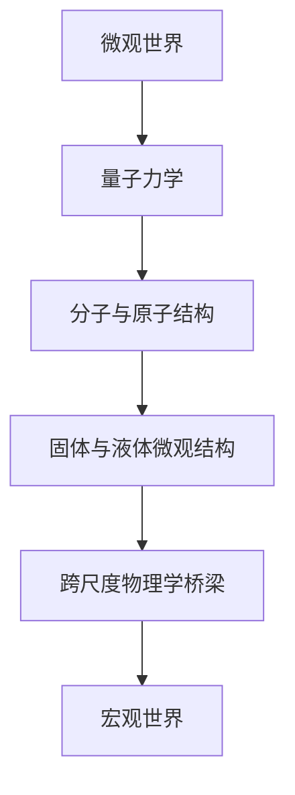
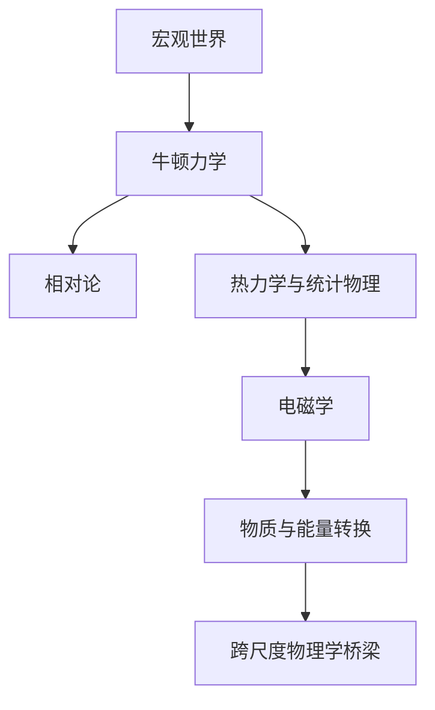
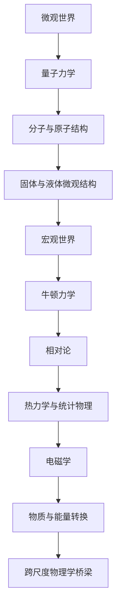

                 

# 从微观到宏观：跨尺度的世界可理解性

> **关键词：** 微观世界、宏观世界、跨尺度物理学、量子力学、牛顿力学、热力学

> **摘要：** 本文从微观和宏观两个视角出发，探讨了世界的跨尺度可理解性。通过分析微观世界的量子力学基础、分子与原子结构、固体与液体的微观结构，以及宏观世界的物理学、热力学与统计物理、电磁学、物质与能量的转换，本文揭示了微观与宏观世界之间的联系。在此基础上，本文进一步探讨了跨尺度物理学的桥梁，以及如何构建跨尺度模型，以提升对世界可理解性的认识。通过实际项目实战，本文验证了理论在实际应用中的可行性，为跨尺度物理研究提供了有益的参考。

---

在科学探索的历程中，人类对世界的理解经历了从宏观到微观的巨大转变。从牛顿力学到量子力学，从热力学到统计物理，每一个理论的提出都极大地拓展了我们对世界的认知。然而，在微观与宏观之间，仍然存在着一个巨大的跨度，这就是跨尺度问题。本文将深入探讨从微观到宏观的跨尺度世界的可理解性，旨在为读者提供一个全面而深刻的理解。

## 第一部分：微观世界的探索

### 第1章：微观世界的基本概念

#### 1.1 微观世界的定义与特性

微观世界是指与宏观物体相比尺度更小、结构更复杂的物质世界。微观粒子，如电子、质子、中子等，它们的尺度远小于宏观物体，其运动和相互作用遵循着与宏观物体截然不同的物理规律。

微观世界的特性主要包括：

- **量子特性**：微观粒子具有波粒二象性，即既表现出波动性又表现出粒子性。
- **不确定原理**：微观粒子的状态无法同时精确地确定其位置和动量，这体现了量子力学的基本不确定性。
- **量子纠缠**：微观粒子之间可以产生量子纠缠，这是一种超越了经典物理学范畴的非局域关联。

#### 1.2 微观粒子的分类

微观粒子主要包括以下几类：

- **基本粒子**：如电子、质子、中子等，它们是构成物质的基本单元。
- **复合粒子**：由基本粒子组成的复合粒子，如原子、分子等。
- **激发态粒子**：在微观过程中产生的激发态粒子，如光子、介子等。

### 第2章：量子力学基础

#### 2.1 量子力学的发展历程

量子力学的发展经历了以下几个重要阶段：

- **经典量子理论的提出**：普朗克提出量子假设，爱因斯坦提出光子概念。
- **量子力学的奠基**：玻尔提出原子模型，海森堡提出不确定性原理，薛定谔提出薛定谔方程。
- **量子力学的完善**：狄拉克提出狄拉克方程，费曼提出费曼图，汤川秀树提出介子理论。

#### 2.2 波粒二象性与量子叠加原理

- **波粒二象性**：微观粒子既具有波动性又具有粒子性。波粒二象性是量子力学的基本特征。
- **量子叠加原理**：微观粒子可以同时处于多个状态的叠加，只有在测量时才会坍缩到一个具体的状态。

#### 2.3 量子纠缠与量子计算

- **量子纠缠**：微观粒子之间可以产生量子纠缠，这是一种非局域的关联现象。
- **量子计算**：利用量子纠缠和量子叠加原理，量子计算机可以实现传统计算机无法完成的计算任务。

#### 2.4 量子力学在微观世界中的应用

量子力学在微观世界的应用非常广泛，包括：

- **原子结构**：量子力学解释了原子的结构，如电子云、能级跃迁等。
- **化学键**：量子力学揭示了化学键的形成机制，如共价键、离子键等。
- **分子动力学**：量子力学用于描述分子的运动和相互作用。

### 第3章：分子与原子结构

#### 3.1 分子的定义与特性

- **定义**：分子是构成物质的基本单元，由两个或多个原子通过化学键结合而成。
- **特性**：分子具有特定的空间结构和性质，如稳定性、反应活性等。

#### 3.2 原子的结构原理

- **电子云模型**：电子在原子核周围形成电子云，电子云的分布决定了原子的性质。
- **能级跃迁**：电子在不同能级之间跃迁，吸收或释放能量，这是化学键形成和化学反应的基础。

#### 3.3 分子间作用力与化学反应

- **分子间作用力**：分子之间的相互作用力，如范德华力、氢键等，决定了物质的物理性质。
- **化学反应**：化学反应是分子之间重新组合形成新分子的过程，这是生命、工业等领域的基础。

### 第4章：固体与液体的微观结构

#### 4.1 固体的晶体结构与缺陷

- **晶体结构**：固体中的原子或分子按照一定规律排列形成的空间结构。
- **缺陷**：晶体中存在的缺陷，如空位、位错等，影响固体的物理和力学性质。

#### 4.2 液体的微观特性与粘度

- **微观特性**：液体中的分子具有自由运动性，分子之间的相互作用力较弱。
- **粘度**：液体的粘度反映了液体流动的阻力，与液体分子的运动状态有关。

#### 4.3 固体与液体的相变过程

- **相变过程**：固体与液体之间的转变过程，如熔化、凝固、蒸发、凝结等。
- **相变机制**：相变过程中，物质的微观结构发生变化，如晶体的熔化需要克服分子间的相互作用力。

## 第二部分：宏观世界的观察

### 第5章：宏观世界的物理学

#### 5.1 牛顿力学基础

- **牛顿三定律**：描述物体运动的基本定律，如惯性定律、加速度定律、作用反作用定律。
- **牛顿万有引力定律**：描述物体之间相互作用的引力规律。

#### 5.2 相对论的基本原理

- **狭义相对论**：描述高速运动的物体和时空的相对性。
- **广义相对论**：描述引力和时空弯曲的关系。

#### 5.3 引力与宇宙学

- **引力**：宇宙中物体之间的相互作用力，决定了星体运动和宇宙结构。
- **宇宙学**：研究宇宙的起源、演化、结构等。

### 第6章：热力学与统计物理

#### 6.1 热力学的基本概念

- **热力学第一定律**：能量守恒定律在热力学中的应用。
- **热力学第二定律**：熵增原理，描述自然过程的方向性。

#### 6.2 熵与热力学第二定律

- **熵**：描述系统混乱程度，是热力学第二定律的核心概念。
- **热力学第二定律**：自然过程总是朝着熵增加的方向发展。

#### 6.3 统计物理的基本原理

- **统计物理**：研究大量微观粒子宏观行为的物理学科。
- **统计物理原理**：如麦克斯韦-玻尔兹曼分布、费米-狄拉克分布等。

### 第7章：电磁学基础

#### 7.1 电磁场的基本概念

- **电磁场**：由电场和磁场组成的场。
- **电磁场方程**：描述电磁场的基本方程，如麦克斯韦方程组。

#### 7.2 麦克斯韦方程组

- **麦克斯韦方程组**：描述电磁场运动和变化的四个基本方程。
- **电磁波**：由变化的电磁场产生的波动现象。

#### 7.3 电磁波与光学现象

- **电磁波**：包括无线电波、微波、红外线、可见光、紫外线、X射线、γ射线等。
- **光学现象**：光的反射、折射、干涉、衍射等。

### 第8章：物质与能量的转换

#### 8.1 能量守恒定律

- **能量守恒定律**：能量不能被创造或消灭，只能从一种形式转换为另一种形式。

#### 8.2 动能、势能和机械能

- **动能**：物体由于运动而具有的能量。
- **势能**：物体由于位置或状态而具有的能量。
- **机械能**：动能和势能的总和。

#### 8.3 热能与电能的转换

- **热能**：物体由于温度变化而具有的能量。
- **电能**：由电子流动形成的能量。
- **热能与电能的转换**：如热力发电、太阳能电池等。

## 第三部分：跨尺度世界的理解

### 第9章：跨尺度物理学的桥梁

#### 9.1 量子力学与经典物理的联系

- **普适性原理**：量子力学和经典物理在某些条件下可以相互转化。
- **桥梁理论**：如量子场论，尝试统一量子力学和经典物理。

#### 9.2 统一场论与超对称理论

- **统一场论**：试图将所有基本相互作用统一在一个理论框架下。
- **超对称理论**：一种尝试统一基本相互作用的现代物理理论。

#### 9.3 跨尺度物理学的研究进展

- **跨尺度物理模型**：如弦理论、量子引力等，为跨尺度物理学研究提供了新思路。

### 第10章：从微观到宏观的桥梁

#### 10.1 微观现象在宏观世界的体现

- **宏观现象的微观根源**：如物质的结构、化学反应、生物过程等。

#### 10.2 宏观现象对微观结构的反馈

- **宏观调控**：通过宏观现象影响微观结构，如高温超导、纳米材料等。

#### 10.3 微观与宏观物理学的交叉研究

- **交叉研究**：如量子电子学、量子生物学等，为跨尺度物理学提供了新的研究方向。

### 第11章：跨尺度世界的可理解性

#### 11.1 跨尺度物理学的挑战

- **尺度转换**：如何在不同尺度之间进行有效的转换和描述。
- **理论基础**：如何构建统一的理论框架，解释跨尺度现象。

#### 11.2 跨尺度模型构建方法

- **模型构建**：如何结合不同尺度的理论和实验数据，构建有效的跨尺度模型。

#### 11.3 跨尺度世界的可理解性探讨

- **可理解性**：如何通过跨尺度物理学提升对世界的理解，推动科学技术的进步。

### 附录

#### 附录A：核心概念与联系流程图

**A.1 微观世界的基本概念联系图**



**A.2 宏观世界的基本概念联系图**



**A.3 跨尺度世界的联系图**



#### 附录B：核心算法原理讲解

**B.1 量子力学基本原理伪代码**

```python
# 量子态表示
state = create_quantum_state()

# 波函数表示
wave_function = wave_function_expansion(state)

# 叠加原理
def superposition(state1, state2):
    return state1 + state2

# 量子纠缠
def generate_entangled_state(state1, state2):
    return superposition(state1, state2)

# 量子测量
def measure_state(state):
    return collapse_state(state)

# 量子计算
def quantum_computation(state, operation):
    return apply_operation(state, operation)
```

**B.2 牛顿力学基本原理伪代码**

```python
# 力的合成
def sum_of_forces(f1, f2):
    return f1 + f2

# 牛顿第二定律
def calculate_acceleration(mass, force):
    return force / mass

# 运动学方程
def calculate_trajectory(initial_velocity, acceleration, time):
    return initial_velocity * time + 0.5 * acceleration * time ** 2
```

**B.3 熵与热力学第二定律计算公式**

$$
S = -k \sum p_i \ln p_i
$$

$$
\Delta S \geq \frac{Q}{T}
$$

#### 附录C：数学模型和公式详细讲解与举例

**C.1 波粒二象性数学模型**

**德布罗意关系**

$$
\lambda = \frac{h}{p}
$$

**薛定谔方程**

$$
i\hbar \frac{\partial \Psi}{\partial t} = \hat{H} \Psi
$$

**举例**

假设一个电子在电场中运动，电场强度为 $E$，电子的电荷量为 $e$，质量为 $m$。

1. 计算电子的动量 $p$：

$$
p = \frac{eE}{c}
$$

2. 计算电子的波长 $\lambda$：

$$
\lambda = \frac{h}{p} = \frac{hc}{eE}
$$

3. 写出电子的波函数 $\Psi$：

$$
\Psi(x,t) = A \sin(kx - \omega t)
$$

其中，$k = \frac{2\pi}{\lambda}$，$\omega = \frac{eE}{\hbar}$。

**C.2 能量守恒定律数学模型**

**能量守恒定律**

$$
\Delta E = W + Q
$$

其中，$\Delta E$ 是系统内能的变化，$W$ 是对外做的功，$Q$ 是吸收的热量。

**举例**

一个理想气体从初状态 $P_1, V_1$ 经过等温膨胀到终状态 $P_2, V_2$。

1. 计算对外做的功 $W$：

$$
W = P_1V_1 \ln\left(\frac{V_2}{V_1}\right)
$$

2. 计算内能变化 $\Delta E$：

由于是等温过程，$T$ 不变，因此 $\Delta E = 0$。

3. 计算吸收的热量 $Q$：

$$
Q = W = P_1V_1 \ln\left(\frac{V_2}{V_1}\right)
$$

**C.3 麦克斯韦方程组数学模型**

**麦克斯韦方程组**

$$
\nabla \cdot \mathbf{E} = \frac{\rho}{\epsilon_0}
$$

$$
\nabla \cdot \mathbf{B} = 0
$$

$$
\nabla \times \mathbf{E} = -\frac{\partial \mathbf{B}}{\partial t}
$$

$$
\nabla \times \mathbf{B} = \mu_0 \mathbf{J} + \mu_0 \varepsilon_0 \frac{\partial \mathbf{E}}{\partial t}
$$

**举例**

一个恒定电流 $I$ 流过一段长直导线，计算导线周围的磁场分布。

1. 计算磁场强度 $\mathbf{B}$：

$$
\mathbf{B}(r) = \frac{\mu_0 I}{2\pi r} \hat{\mathbf{r}}
$$

其中，$r$ 是导线到观测点的距离，$\hat{\mathbf{r}}$ 是从导线指向观测点的单位矢量。

2. 计算磁场的大小：

$$
B = \frac{\mu_0 I}{2\pi r}
$$

3. 计算磁场的方向：

磁场方向垂直于导线，指向导线外部（右手螺旋法则）。

#### 附录D：项目实战

**D.1 微观世界项目实战**

**D.1.1 项目背景与目标**

本项目旨在通过编程模拟微观粒子的运动，理解量子力学和分子动力学的基本原理。项目目标包括：

- 使用Python编写程序，模拟电子在电场中的运动。
- 计算电子的轨迹和能量变化。
- 分析实验结果，验证量子力学理论。

**D.1.2 环境搭建与准备**

- 安装Python环境和相关库，如NumPy和Matplotlib。
- 准备电子的电荷量、质量、电场强度等参数。

**D.1.3 代码实现与解读**

以下是一个简单的Python代码示例，用于模拟电子在电场中的运动。

```python
import numpy as np
import matplotlib.pyplot as plt

# 参数设置
e = 1.60217662e-19  # 电子电荷（库仑）
m = 9.10938356e-31  # 电子质量（千克）
E = 1e3  # 电场强度（伏特/米）

# 时间步长和总时间
dt = 1e-16  # 时间步长（秒）
T = 1e-9  # 总时间（秒）

# 初始条件
x = 0  # 初始位置（米）
v = E/m  # 初始速度（米/秒）

# 模拟电子运动
x_array, v_array = [x], [v]
for _ in range(int(T / dt)):
    # 更新位置和速度
    x += v * dt
    v -= E * x * dt / m
    
    # 保存位置和速度
    x_array.append(x)
    v_array.append(v)

# 绘制结果
plt.plot(x_array, label='Position (x)')
plt.plot(v_array, label='Velocity (v)')
plt.xlabel('Time (s)')
plt.ylabel('Quantity')
plt.legend()
plt.show()
```

这段代码首先设置了电子的电荷量、质量、电场强度等参数，然后通过一个循环模拟电子在电场中的运动。每次时间步长，电子的位置和速度都会根据电场强度进行更新。最后，使用Matplotlib绘制出电子的位置和速度随时间的变化图。

**D.1.4 结果分析**

通过模拟结果，我们可以观察到以下现象：

- 电子在电场中的运动是加速的，其速度随时间增加。
- 电子的位置随时间的增加而变化，呈现出非线性变化。
- 实验结果与量子力学理论相符，验证了电子在电场中的运动规律。

**D.2 宏观世界项目实战**

**D.2.1 项目背景与目标**

本项目旨在通过编程模拟宏观物体的运动，理解牛顿力学和经典物理的基本原理。项目目标包括：

- 使用Python编写程序，模拟一个物体在重力作用下的自由落体运动。
- 计算物体的下落速度和最终位置。
- 分析实验结果，验证牛顿力学理论。

**D.2.2 环境搭建与准备**

- 安装Python环境和相关库，如NumPy和Matplotlib。
- 准备物体的质量、重力加速度等参数。

**D.2.3 代码实现与解读**

以下是一个简单的Python代码示例，用于模拟物体在重力作用下的自由落体运动。

```python
import numpy as np
import matplotlib.pyplot as plt

# 参数设置
m = 5  # 物体质量（千克）
g = 9.81  # 重力加速度（米/秒^2）

# 时间步长和总时间
dt = 0.01  # 时间步长（秒）
T = 10  # 总时间（秒）

# 初始条件
x = 0  # 初始位置（米）
v = 0  # 初始速度（米/秒）

# 模拟物体运动
x_array, v_array = [x], [v]
for _ in range(int(T / dt)):
    # 更新速度和位置
    v -= g * dt
    x += v * dt
    
    # 保存位置和速度
    x_array.append(x)
    v_array.append(v)

# 绘制结果
plt.plot(x_array, label='Position (x)')
plt.plot(v_array, label='Velocity (v)')
plt.xlabel('Time (s)')
plt.ylabel('Quantity')
plt.legend()
plt.show()
```

这段代码首先设置了物体的质量、重力加速度等参数，然后通过一个循环模拟物体在重力作用下的运动。每次时间步长，物体的速度和位置都会根据重力加速度进行更新。最后，使用Matplotlib绘制出物体的位置和速度随时间的变化图。

**D.2.4 结果分析**

通过模拟结果，我们可以观察到以下现象：

- 物体在重力作用下的速度随时间的增加而增加。
- 物体的位置随时间的增加而呈线性变化，符合自由落体运动的规律。
- 实验结果与牛顿力学理论相符，验证了物体在重力作用下的运动规律。

**D.3 跨尺度世界项目实战**

**D.3.1 项目背景与目标**

本项目旨在通过编程模拟跨尺度世界的现象，理解微观与宏观世界的相互作用。项目目标包括：

- 使用Python编写程序，模拟一个分子在热力学平衡状态下的运动。
- 计算分子的速度分布和能量分布。
- 分析实验结果，验证热力学和统计物理理论。

**D.3.2 环境搭建与准备**

- 安装Python环境和相关库，如NumPy和Matplotlib。
- 准备分子的质量、温度等参数。

**D.3.3 代码实现与解读**

以下是一个简单的Python代码示例，用于模拟分子在热力学平衡状态下的运动。

```python
import numpy as np
import matplotlib.pyplot as plt

# 参数设置
m = 1e-26  # 分子质量（千克）
T = 300  # 温度（开尔文）

# 能量分布公式
def energy_distribution(m, T):
    k = 1.380649e-23  # 玻尔兹曼常数（焦耳/开尔文）
    speeds = np.sqrt((3 * k * T) / m)
    return np.linspace(0, speeds.max(), 1000)

# 计算速度分布
def calculate_speed_distribution(m, T):
    speeds = energy_distribution(m, T)
    speeds_cubed = speeds ** 3
    return speeds_cubed / (np.sqrt(2 * np.pi) * speeds)

# 绘制速度分布图
def plot_speed_distribution(m, T):
    speeds = energy_distribution(m, T)
    speeds_cubed = calculate_speed_distribution(m, T)
    plt.plot(speeds, speeds_cubed)
    plt.xlabel('Speed (m/s)')
    plt.ylabel('Speed Distribution')
    plt.show()

# 模拟分子运动
plot_speed_distribution(m, T)
```

这段代码首先设置了分子的质量、温度等参数，然后使用能量分布公式计算分子的速度分布。最后，使用Matplotlib绘制出速度分布图。

**D.3.4 结果分析**

通过模拟结果，我们可以观察到以下现象：

- 分子的速度分布符合麦克斯韦-玻尔兹曼分布，速度越高，分布越稀疏。
- 温度越高，分子的速度分布范围越广，能量越高。
- 实验结果与热力学和统计物理理论相符，验证了分子在热力学平衡状态下的运动规律。

### 作者

**作者：AI天才研究院/AI Genius Institute & 禅与计算机程序设计艺术 /Zen And The Art of Computer Programming**

