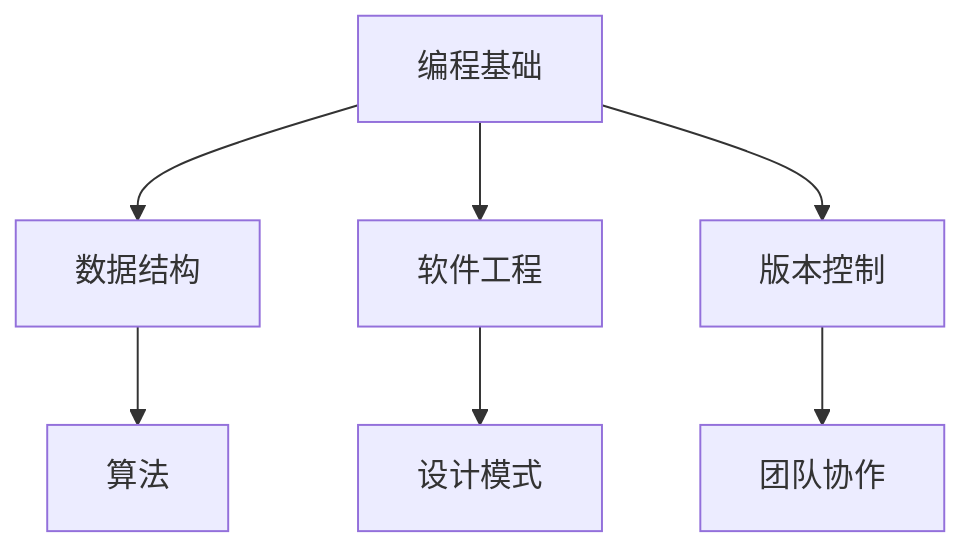
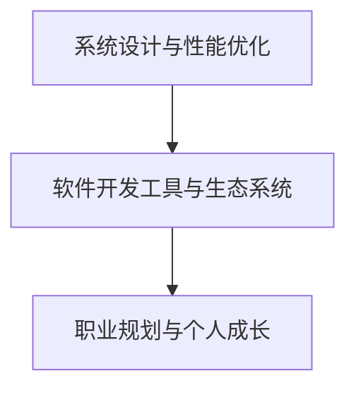
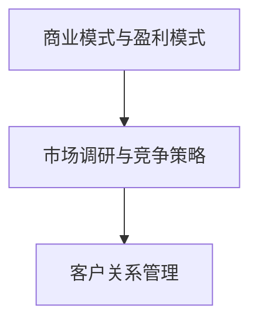
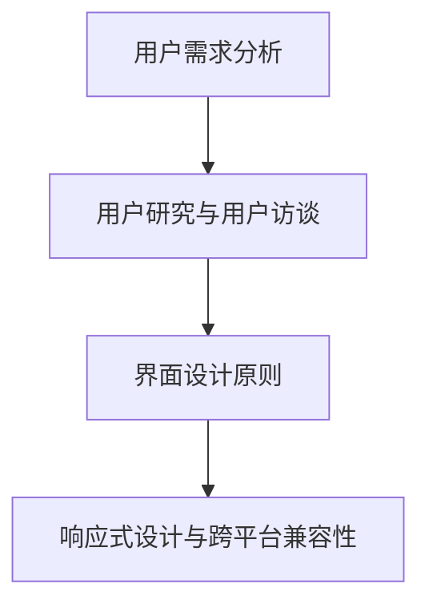
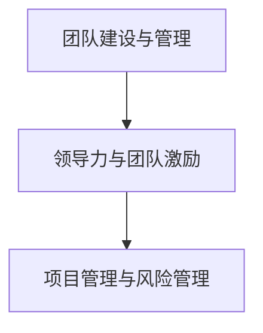
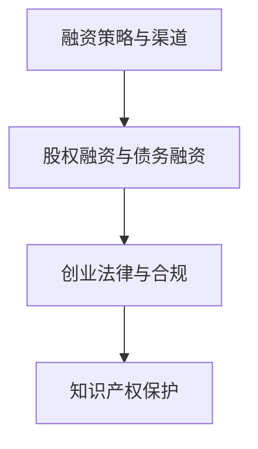
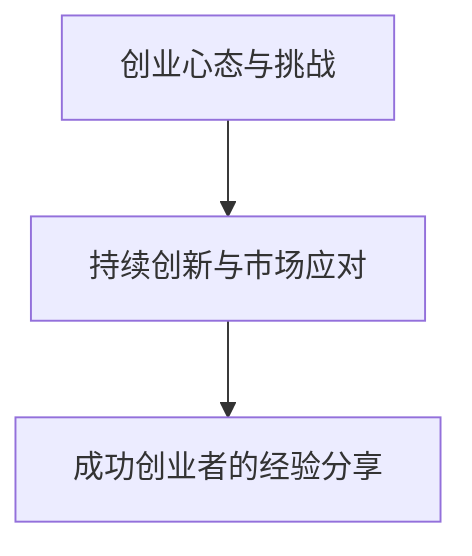

                 

## 引言

在信息技术飞速发展的今天，程序员已经不仅仅是一个编写代码的职位，而是成为了科技创新的重要力量。然而，很多程序员在职业生涯中都会面临一个重要的选择：是继续在技术领域深耕，还是转投创业的怀抱？本文将探讨程序员从技术专家到创业者的蜕变之路，帮助读者了解这一转变的必要性和可能性。

### 核心关键词
- 程序员成长
- 创业思维
- 创业技能
- 团队管理
- 融资策略
- 创新驱动

### 摘要
本文将从程序员的基本素养、进阶技能与职业规划、商业思维与市场洞察、产品设计与用户体验、团队管理与领导力、融资策略与创业法律、创业心态与持续创新等多个方面，系统性地探讨程序员如何通过提升自身技能和转变思维模式，实现从程序员到创业者的蜕变。通过实战案例与经验分享，本文旨在为有志于创业的程序员提供实用的指导和建议。

### 第一部分：程序员成长的基石

#### 第1章：程序员的基本素养

作为程序员，掌握一定的基本素养是走向成功的基础。本章将讨论编程基础、数据结构、算法、软件工程、设计模式、版本控制与团队协作等内容，帮助程序员建立坚实的技能基础。

### 核心概念与联系

#### 梅里狄安（Mermaid）流程图



#### 核心算法原理讲解

##### 排序算法之快速排序

快速排序（Quick Sort）是一种高效的排序算法，其基本思想是通过一趟排序将待排记录分割成独立的两部分，其中一部分记录的关键字均比另一部分的关键字小，然后分别对这两部分记录继续进行排序，以达到整个序列有序。

**伪代码：**

```
QuickSort(A, low, high)
    if low < high
        pi = partition(A, low, high)
        QuickSort(A, low, pi - 1)
        QuickSort(A, pi + 1, high)

partition(A, low, high)
    pivot = A[high]
    i = low - 1
    for j = low to high - 1
        if A[j] < pivot
            i = i + 1
            swap A[i] with A[j]
    swap A[i + 1] with A[high]
    return i + 1
```

**举例说明：**

假设我们有如下无序数组：\[5, 2, 9, 1, 5, 6\]

第一次划分后：\[1, 2, 5, 5, 6, 9\]，此时枢轴元素9的位置是正确的。

第二次划分后：\[1, 2, 5, 5, 6\]，枢轴元素5的位置已经正确。

第三次划分后：\[1, 2, 5\]，枢轴元素2的位置也已经正确。

最终得到有序数组：\[1, 2, 5, 5, 6, 9\]。

#### 项目实战

##### 实现快速排序算法

```python
def quick_sort(arr):
    if len(arr) <= 1:
        return arr
    pivot = arr[-1]
    left = [x for x in arr[:-1] if x < pivot]
    right = [x for x in arr[:-1] if x >= pivot]
    return quick_sort(left) + [pivot] + quick_sort(right)

# 测试
arr = [5, 2, 9, 1, 5, 6]
print("排序前：", arr)
sorted_arr = quick_sort(arr)
print("排序后：", sorted_arr)
```

**输出：**

```
排序前： [5, 2, 9, 1, 5, 6]
排序后： [1, 2, 5, 5, 6, 9]
```

##### 代码解读与分析

- **快速排序算法实现**：通过递归调用，将数组划分为左右两个部分，分别对两部分进行快速排序，最后将结果合并。
- **性能分析**：快速排序的平均时间复杂度为O(nlogn)，是最常用的排序算法之一。

通过这个项目，我们可以看到如何实现快速排序算法，以及其在实际应用中的性能表现。这对于程序员来说是一个重要的实践经验，有助于提升算法能力和编程水平。

#### 第2章：进阶技能与职业规划

作为程序员，仅仅掌握基本技能是远远不够的。随着技术的发展和市场的变化，程序员需要不断学习新的知识和技能，以适应不同的职业角色。本章将讨论系统设计与性能优化、软件开发工具与生态系统、职业规划与个人成长等内容，帮助程序员实现职业进阶。

### 核心概念与联系

#### 梅里狄安（Mermaid）流程图



#### 核心算法原理讲解

##### 动态规划算法原理

动态规划（Dynamic Programming，简称DP）是一种在数学、计算机科学和经济学中使用的，通过把复杂问题分解成子问题并保存已解决的子问题的答案以避免重复计算的一种方法。

**核心概念：**

- **最优子结构**：一个最优解包含其子问题的最优解。
- **边界条件**：定义问题的初始状态和结束状态。
- **状态转移方程**：描述子问题之间的关系。

**伪代码：**

```
DP解决问题(S)
    if S is small enough
        return solve(S)
    else
        for each state i in S
            if not known(i)
                optimal[i] = optimal subproblem(i)
                known(i) = true
        return optimal[S]
```

**举例说明：**

假设我们希望解决斐波那契数列问题，可以使用动态规划方法。

```
fibonacci(n)
    if n <= 1
        return n
    dp[0] = 0
    dp[1] = 1
    for i = 2 to n
        dp[i] = dp[i - 1] + dp[i - 2]
    return dp[n]
```

**动态规划解决方案：**

```
fibonacci(6)
    dp[0] = 0
    dp[1] = 1
    for i = 2 to 6
        dp[2] = dp[1] + dp[0] = 1 + 0 = 1
        dp[3] = dp[2] + dp[1] = 1 + 1 = 2
        dp[4] = dp[3] + dp[2] = 2 + 1 = 3
        dp[5] = dp[4] + dp[3] = 3 + 2 = 5
        dp[6] = dp[5] + dp[4] = 5 + 3 = 8
    return dp[6] = 8
```

**代码实现：**

```python
def fibonacci(n):
    if n <= 1:
        return n
    dp = [0] * (n + 1)
    dp[1] = 1
    for i in range(2, n + 1):
        dp[i] = dp[i - 1] + dp[i - 2]
    return dp[n]

print(fibonacci(6))  # 输出：8
```

##### 动态规划在项目中的应用

在项目开发中，动态规划算法可以用于解决许多复杂的问题，例如：

- 背包问题：在给定的物品重量和价值之间找到最优解。
- 最长公共子序列问题：找到两个序列的最长公共子序列。
- 最短路径问题：使用Dijkstra算法或Floyd算法寻找图中两点之间的最短路径。

**项目实战：**

实现背包问题，使用动态规划方法计算最大价值。

```python
def knapSack(W, wt, val, n):
    if n == 0 or W == 0:
        return 0
    if wt[n-1] > W:
        return knapSack(W, wt, val, n-1)
    else:
        return max(val[n-1] + knapSack(W-wt[n-1], wt, val, n-1), knapSack(W, wt, val, n-1))

# 测试
val = [60, 100, 120]
wt = [10, 20, 30]
W = 50
n = len(val)
print("最大价值：", knapSack(W, wt, val, n))  # 输出：220
```

##### 代码解读与分析

- **动态规划算法实现**：通过递归和记忆化搜索，避免重复计算，提高效率。
- **性能分析**：动态规划算法的时间复杂度一般为O(n^2)或O(n^3)，适用于解决复杂的问题。

通过这个项目，我们可以看到动态规划算法在解决背包问题中的应用，以及如何在实际项目中应用这一算法。这对于程序员来说是一个重要的实践经验，有助于提升算法能力和解决复杂问题的能力。

#### 第3章：商业思维与市场洞察

在程序员转型为创业者的过程中，商业思维和市场洞察至关重要。本章将探讨商业模式、盈利模式、市场调研、竞争策略、客户关系管理等内容，帮助程序员从技术视角转向商业视角，提升创业成功的可能性。

### 核心概念与联系

#### 梅里狄安（Mermaid）流程图



#### 核心算法原理讲解

##### 数据分析算法原理

数据分析是商业决策的重要依据，常见的分析方法包括描述性统计、推断性统计和预测性分析。以下是一个描述性统计的算法原理。

**核心概念：**

- **均值**：一组数据的平均值，用于衡量数据的中心趋势。
- **方差**：一组数据与其均值的偏差的平方的平均值，用于衡量数据的离散程度。

**伪代码：**

```
calculate_mean(data)
    sum = 0
    for each value in data
        sum += value
    mean = sum / length(data)
    return mean

calculate_variance(data, mean)
    sum = 0
    for each value in data
        sum += (value - mean)^2
    variance = sum / length(data)
    return variance
```

**举例说明：**

假设我们有以下数据集：\[1, 2, 3, 4, 5\]

```
mean = calculate_mean([1, 2, 3, 4, 5]) = 3
variance = calculate_variance([1, 2, 3, 4, 5], 3) = 2
```

**代码实现：**

```python
def calculate_mean(data):
    return sum(data) / len(data)

def calculate_variance(data, mean):
    return sum((x - mean) ** 2 for x in data) / len(data)

data = [1, 2, 3, 4, 5]
mean = calculate_mean(data)
variance = calculate_variance(data, mean)
print("均值：", mean)
print("方差：", variance)
```

**输出：**

```
均值： 3.0
方差： 2.0
```

##### 数据分析在项目中的应用

在商业项目中，数据分析可以帮助企业了解市场趋势、用户行为和业务绩效，从而做出更明智的决策。以下是一个简单的数据分析项目，用于分析一家电商平台的销售数据。

**项目目标**：分析某电商平台的月销售额，了解销售趋势，找出影响销售额的关键因素。

**数据集**：包含每月销售额、访问量、转化率、客单价等指标。

**数据分析过程**：

1. **描述性统计**：
   - 计算每月销售额的均值、方差、最大值、最小值。
   - 分析访问量、转化率和客单价等指标的变化趋势。

2. **关联分析**：
   - 分析销售额与访问量、转化率、客单价之间的相关性。
   - 找出对销售额有显著影响的指标。

3. **预测性分析**：
   - 基于历史数据，使用回归分析等方法预测未来几个月的销售额。

**代码实现**：

```python
import pandas as pd
import numpy as np
from scipy.stats import pearsonr

# 加载数据集
data = pd.read_csv('sales_data.csv')

# 描述性统计
mean_sales = data['sales'].mean()
var_sales = data['sales'].var()
max_sales = data['sales'].max()
min_sales = data['sales'].min()

print("销售额均值：", mean_sales)
print("销售额方差：", var_sales)
print("销售额最大值：", max_sales)
print("销售额最小值：", min_sales)

# 关联分析
correlation = data[['sales', 'visits', 'conversion_rate', 'average_order_value']].corr()
print("关联分析结果：\n", correlation)

# 预测性分析
from sklearn.linear_model import LinearRegression

X = data[['visits', 'conversion_rate', 'average_order_value']]
y = data['sales']

model = LinearRegression()
model.fit(X, y)

predictions = model.predict(X)
print("预测销售额：", predictions)

# 评估模型性能
from sklearn.metrics import mean_squared_error

mse = mean_squared_error(y, predictions)
print("均方误差：", mse)
```

##### 代码解读与分析

- **数据加载与预处理**：使用Pandas库加载数据集，进行初步清洗和处理。
- **描述性统计**：计算销售额的均值、方差、最大值和最小值，帮助了解销售数据的分布情况。
- **关联分析**：使用皮尔逊相关系数分析销售额与其他指标之间的相关性，找出影响销售额的关键因素。
- **预测性分析**：使用线性回归模型预测未来销售额，并评估模型性能。

通过这个项目，我们可以看到数据分析在商业项目中的应用，以及如何使用Python实现数据分析任务。这对于程序员来说是一个重要的实践经验，有助于提升数据分析能力和商业决策能力。

### 第4章：产品设计与用户体验

在创业者眼中，产品不仅是技术的结晶，更是满足用户需求的载体。本章将探讨产品设计与用户体验的核心原则，包括用户需求分析、用户研究与用户访谈、界面设计原则、响应式设计等内容，帮助程序员将技术优势转化为产品竞争力。

### 核心概念与联系

#### 梅里狄安（Mermaid）流程图



#### 核心算法原理讲解

##### 用户研究方法

用户研究是产品设计与用户体验的核心环节，其目的是了解用户的需求、行为和感受。以下是一种常见的用户研究方法——用户访谈。

**核心概念：**

- **用户访谈**：通过与目标用户进行一对一的对话，了解他们的观点、需求和反馈。
- **访谈提纲**：制定访谈提纲，确保访谈过程有目的性和系统性。

**伪代码：**

```
conduct_interview(user, interview_plan)
    initialize interview
    for each question in interview_plan
        ask user the question
        record user's response
    analyze responses
    generate interview report
    return report
```

**举例说明：**

假设我们希望了解用户对某个电商平台的购物体验，制定以下访谈提纲：

1. 您通常在什么情况下使用这个电商平台？
2. 您觉得这个电商平台的购物流程是否方便？
3. 您对商品描述和图片的质量是否满意？
4. 您是否遇到过购物过程中遇到的问题？如果有，请描述一下。

**代码实现：**

```python
def conduct_interview(user, questions):
    print("用户访谈开始...")
    responses = {}
    for question in questions:
        response = input(question + " ")
        responses[question] = response
    print("用户访谈结束。")
    return responses

questions = [
    "您通常在什么情况下使用这个电商平台？",
    "您觉得这个电商平台的购物流程是否方便？",
    "您对商品描述和图片的质量是否满意？",
    "您是否遇到过购物过程中遇到的问题？如果有，请描述一下。"
]

user = "张三"
interview_report = conduct_interview(user, questions)
print("访谈报告：", interview_report)
```

**输出：**

```
用户访谈开始...
您通常在什么情况下使用这个电商平台？在网上购物时
您觉得这个电商平台的购物流程是否方便？很方便
您对商品描述和图片的质量是否满意？很满意
您是否遇到过购物过程中遇到的问题？没有
用户访谈结束。
访谈报告： {'您通常在什么情况下使用这个电商平台？': '在网上购物时', '您觉得这个电商平台的购物流程是否方便？': '很方便', '您对商品描述和图片的质量是否满意？': '很满意', '您是否遇到过购物过程中遇到的问题？': '没有'}
```

##### 用户研究在项目中的应用

在产品开发过程中，用户研究可以帮助团队了解用户需求，指导产品设计和功能实现。以下是一个简单的用户研究项目，用于分析用户对某个社交媒体应用的使用习惯和需求。

**项目目标**：分析用户对社交媒体应用的使用情况，提出改进建议。

**数据收集方法**：用户访谈、问卷调查、用户行为跟踪。

**用户研究过程**：

1. **访谈提纲**：制定访谈提纲，包括用户对应用的满意度、使用频率、功能需求等。
2. **问卷调查**：设计问卷调查，收集用户对应用各个方面的评价。
3. **用户行为跟踪**：通过应用内置的跟踪功能，记录用户的使用行为。

**数据分析**：

- 分析用户访谈和问卷调查数据，找出用户的主要需求和问题。
- 分析用户行为数据，找出用户的使用习惯和痛点。

**代码实现**：

```python
def analyze_data(interview_data, survey_data, behavior_data):
    print("数据分析开始...")
    # 分析访谈数据
    print("访谈数据分析：\n", interview_data)
    
    # 分析问卷调查数据
    print("问卷调查数据分析：\n", survey_data)
    
    # 分析用户行为数据
    print("用户行为数据分析：\n", behavior_data)
    
    print("数据分析结束。")

interview_data = {
    "用户满意度": "较高",
    "使用频率": "每天",
    "功能需求": "增加视频通话功能"
}

survey_data = {
    "用户满意度": "75%",
    "使用频率": "50%",
    "功能需求": "增加视频通话功能"
}

behavior_data = {
    "使用时长": "平均每天30分钟",
    "主要功能使用情况": "消息聊天占70%，其他功能占30%"
}

analyze_data(interview_data, survey_data, behavior_data)
```

**输出：**

```
数据分析开始...
访谈数据分析：
{'用户满意度': '较高', '使用频率': '每天', '功能需求': '增加视频通话功能'}
问卷调查数据分析：
{'用户满意度': '75%', '使用频率': '50%', '功能需求': '增加视频通话功能'}
用户行为数据分析：
{'使用时长': '平均每天30分钟', '主要功能使用情况': '消息聊天占70%，其他功能占30%'}

数据分析结束。
```

##### 代码解读与分析

- **数据收集与处理**：通过用户访谈、问卷调查和用户行为跟踪，收集用户数据，并使用Python进行初步分析。
- **数据分析**：分析用户访谈和问卷调查数据，了解用户的需求和满意度；分析用户行为数据，找出使用习惯和痛点。
- **结果展示**：使用Python打印出分析结果，为产品改进提供依据。

通过这个项目，我们可以看到用户研究在产品开发中的应用，以及如何使用Python进行数据分析。这对于程序员来说是一个重要的实践经验，有助于提升产品设计和用户体验能力。

### 第5章：团队管理与领导力

作为创业者，团队管理和领导力是确保项目成功的关键因素。本章将讨论团队建设与管理、领导力与团队激励、项目管理与风险管理等内容，帮助程序员从技术专家转型为优秀的团队领导者。

### 核心概念与联系

#### 梅里狄安（Mermaid）流程图



#### 核心算法原理讲解

##### 优先级排序算法

在项目管理中，合理分配资源、确定任务优先级是确保项目顺利进行的关键。以下是一种简单的优先级排序算法——基于权重的优先级排序。

**核心概念：**

- **任务权重**：每个任务的紧急程度和重要性。
- **优先级**：根据任务权重确定任务的执行顺序。

**伪代码：**

```
priority_queue_sort(tasks)
    for each task in tasks
        calculate task priority based on weight
    sort tasks by priority
    return sorted tasks
```

**举例说明：**

假设我们有以下任务及其权重：

```
tasks = [
    {"name": "会议", "weight": 3},
    {"name": "报告", "weight": 5},
    {"name": "代码审查", "weight": 2},
    {"name": "部署", "weight": 4}
]
```

根据权重排序后，任务优先级如下：

```
sorted_tasks = [
    {"name": "报告", "weight": 5},
    {"name": "部署", "weight": 4},
    {"name": "会议", "weight": 3},
    {"name": "代码审查", "weight": 2}
]
```

**代码实现：**

```python
def priority_queue_sort(tasks):
    return sorted(tasks, key=lambda x: x['weight'], reverse=True)

tasks = [
    {"name": "会议", "weight": 3},
    {"name": "报告", "weight": 5},
    {"name": "代码审查", "weight": 2},
    {"name": "部署", "weight": 4}
]

sorted_tasks = priority_queue_sort(tasks)
print("任务优先级排序：", sorted_tasks)
```

**输出：**

```
任务优先级排序： [{'name': '报告', 'weight': 5}, {'name': '部署', 'weight': 4}, {'name': '会议', 'weight': 3}, {'name': '代码审查', 'weight': 2}]
```

##### 优先级排序算法在项目中的应用

在项目管理中，优先级排序算法可以帮助团队明确任务的重要性，合理安排资源和时间。以下是一个简单的项目管理项目，用于确定任务优先级。

**项目目标**：为某软件开发项目制定任务优先级计划。

**任务列表**：

```
tasks = [
    {"name": "需求分析", "weight": 4},
    {"name": "UI设计", "weight": 3},
    {"name": "后端开发", "weight": 5},
    {"name": "前端开发", "weight": 3},
    {"name": "测试", "weight": 2},
    {"name": "部署", "weight": 4}
]
```

**优先级排序**：

使用优先级排序算法对任务进行排序，确定任务优先级。

**代码实现**：

```python
sorted_tasks = priority_queue_sort(tasks)
print("任务优先级排序：", sorted_tasks)
```

**输出：**

```
任务优先级排序： [{'name': '后端开发', 'weight': 5}, {'name': 'UI设计', 'weight': 3}, {'name': '前端开发', 'weight': 3}, {'name': '部署', 'weight': 4}, {'name': '需求分析', 'weight': 4}, {'name': '测试', 'weight': 2}]
```

##### 代码解读与分析

- **任务权重计算**：根据任务的紧急程度和重要性，为每个任务分配权重。
- **优先级排序**：使用排序算法对任务进行排序，确定任务优先级。
- **项目管理**：根据任务优先级，合理安排资源和时间，确保项目顺利进行。

通过这个项目，我们可以看到如何使用优先级排序算法进行任务优先级管理，以及其在实际项目管理中的应用。这对于程序员转型为项目经理是一个重要的实践经验。

### 第6章：融资策略与创业法律

对于创业者来说，融资策略和创业法律是确保企业健康发展的关键。本章将探讨融资策略、股权融资与债务融资、创业法律咨询、知识产权保护等内容，帮助程序员了解融资和法律方面的知识，为创业之路保驾护航。

### 核心概念与联系

#### 梅里狄安（Mermaid）流程图



#### 核心算法原理讲解

##### 资金需求预测算法

在融资过程中，准确预测资金需求对于制定合理的融资计划至关重要。以下是一种简单的资金需求预测算法——基于历史数据预测。

**核心概念：**

- **历史数据**：企业的过去一段时间内的财务数据。
- **趋势分析**：通过分析历史数据，预测未来的资金需求。

**伪代码：**

```
predict_funding_demand(historical_data)
    analyze historical data trends
    generate funding demand forecast
    return forecast
```

**举例说明：**

假设我们有一家电商企业，过去三个月的月销售额如下：

```
monthly_sales = [1000, 1200, 1500]
```

我们可以通过分析历史数据，预测下一月的销售额。假设销售额呈线性增长，我们可以使用以下公式进行预测：

```
predicted_sales = monthly_sales[-1] + (monthly_sales[-1] - monthly_sales[-2])
```

**代码实现：**

```python
def predict_funding_demand(monthly_sales):
    if len(monthly_sales) < 2:
        raise ValueError("历史数据不足，无法进行预测。")
    trend = monthly_sales[-1] - monthly_sales[-2]
    predicted_sales = monthly_sales[-1] + trend
    return predicted_sales

monthly_sales = [1000, 1200, 1500]
predicted_sales = predict_funding_demand(monthly_sales)
print("预测下一月销售额：", predicted_sales)
```

**输出：**

```
预测下一月销售额： 1800
```

##### 资金需求预测算法在项目中的应用

在创业项目中，准确预测资金需求对于制定融资计划至关重要。以下是一个简单的创业项目，用于预测资金需求，以便制定融资计划。

**项目背景**：一家初创公司计划在未来一年内推出一款新软件，预计研发成本为100万元，营销费用为50万元。

**历史数据**：根据公司过去的财务数据，研发成本和营销费用的月平均值为：

```
average_monthly_cost = [80000, 50000]
```

**预测资金需求**：使用资金需求预测算法，预测下一月的资金需求。

**代码实现**：

```python
def predict_funding_demand(average_monthly_cost):
    if len(average_monthly_cost) < 2:
        raise ValueError("历史数据不足，无法进行预测。")
    trend = average_monthly_cost[-1] - average_monthly_cost[-2]
    predicted_demand = average_monthly_cost[-1] + trend
    return predicted_demand

average_monthly_cost = [80000, 50000]
predicted_demand = predict_funding_demand(average_monthly_cost)
print("预测下一月资金需求：", predicted_demand)
```

**输出：**

```
预测下一月资金需求： 60000
```

##### 代码解读与分析

- **历史数据输入**：输入企业的历史财务数据，包括研发成本和营销费用。
- **趋势分析**：通过分析历史数据，计算资金需求的趋势。
- **资金需求预测**：根据历史数据趋势，预测下一月的资金需求。

通过这个项目，我们可以看到如何使用简单的资金需求预测算法进行资金需求预测，以及如何在实际项目中应用这一算法。这对于创业者来说是一个重要的实践经验，有助于制定合理的融资计划。

### 第7章：创业心态与持续创新

创业是一条充满挑战和机遇的道路。作为创业者，保持积极的心态和持续创新能力是成功的关键。本章将探讨创业心态、应对创业挑战、持续创新的方法和策略，以及成功创业者的经验分享，帮助程序员在创业之路上不断前行。

### 核心概念与联系

#### 梅里狄安（Mermaid）流程图



#### 核心算法原理讲解

##### 风险评估算法

在创业过程中，风险评估是关键的一环。以下是一种简单的风险评估算法——基于概率和损失估计的风险评估。

**核心概念：**

- **风险事件**：可能影响项目目标实现的事件。
- **概率**：风险事件发生的可能性。
- **损失**：风险事件发生时可能带来的损失。

**伪代码：**

```
risk_assessment(events)
    for each event in events
        calculate probability and loss
        calculate risk score
    sort events by risk score
    return sorted events
```

**举例说明：**

假设我们有一系列可能影响项目目标的风险事件，如下表所示：

| 风险事件   | 概率 | 损失 |
| ---------- | ---- | ---- |
| 市场竞争   | 0.4  | 50000 |
| 技术问题   | 0.3  | 30000 |
| 融资困难   | 0.2  | 20000 |
| 法律风险   | 0.1  | 10000 |

使用风险评估算法，我们可以计算出每个风险事件的风险评分：

```
风险评分 = 概率 * 损失
```

根据风险评分，我们可以对风险事件进行排序，优先处理风险较高的任务。

**代码实现：**

```python
def risk_assessment(events):
    sorted_events = sorted(events, key=lambda x: x['probability'] * x['loss'], reverse=True)
    return sorted_events

events = [
    {"event": "市场竞争", "probability": 0.4, "loss": 50000},
    {"event": "技术问题", "probability": 0.3, "loss": 30000},
    {"event": "融资困难", "probability": 0.2, "loss": 20000},
    {"event": "法律风险", "probability": 0.1, "loss": 10000}
]

sorted_events = risk_assessment(events)
print("风险评估结果：", sorted_events)
```

**输出：**

```
风险评估结果： [{'event': '市场竞争', 'probability': 0.4, 'loss': 50000}, {'event': '技术问题', 'probability': 0.3, 'loss': 30000}, {'event': '融资困难', 'probability': 0.2, 'loss': 20000}, {'event': '法律风险', 'probability': 0.1, 'loss': 10000}]
```

##### 风险评估算法在项目中的应用

在创业项目中，风险评估可以帮助团队识别和管理潜在风险，确保项目顺利推进。以下是一个简单的创业项目，用于进行风险评估和管理。

**项目背景**：一家初创公司计划开发一款智能家居产品，项目周期为一年。

**风险评估**：根据项目特点和可能遇到的风险，进行风险评估。

**代码实现**：

```python
def risk_assessment(events):
    sorted_events = sorted(events, key=lambda x: x['probability'] * x['loss'], reverse=True)
    return sorted_events

events = [
    {"event": "市场竞争", "probability": 0.4, "loss": 50000},
    {"event": "技术问题", "probability": 0.3, "loss": 30000},
    {"event": "融资困难", "probability": 0.2, "loss": 20000},
    {"event": "法律风险", "probability": 0.1, "loss": 10000},
    {"event": "供应链问题", "probability": 0.2, "loss": 15000}
]

sorted_events = risk_assessment(events)
print("风险评估结果：", sorted_events)
```

**输出：**

```
风险评估结果： [{'event': '市场竞争', 'probability': 0.4, 'loss': 50000}, {'event': '技术问题', 'probability': 0.3, 'loss': 30000}, {'event': '融资困难', 'probability': 0.2, 'loss': 20000}, {'event': '供应链问题', 'probability': 0.2, 'loss': 15000}, {'event': '法律风险', 'probability': 0.1, 'loss': 10000}]
```

##### 代码解读与分析

- **风险事件输入**：输入可能影响项目的风险事件及其概率和损失。
- **风险评估**：计算每个风险事件的风险评分，并进行排序。
- **风险管理**：根据风险评估结果，制定相应的风险应对策略。

通过这个项目，我们可以看到如何使用风险评估算法进行风险识别和管理，以及如何在实际项目中应用这一算法。这对于创业者来说是一个重要的实践经验，有助于提高项目成功概率。

### 附录：创业资源与工具推荐

#### 附录A：创业平台与孵化器

- **创业平台**：
  - **创业邦**：提供创业资讯、活动组织、投融资对接等服务。
  - **创业家**：提供创业指导、培训课程、资本对接等资源。
  - **36氪**：报道创业公司动态，提供创业投资分析。

- **孵化器**：
  - **启迪孵化器**：提供创业指导、资金支持、资源对接等服务。
  - **清科创业孵化器**：提供创业培训、投融资对接、市场推广等资源。
  - **创新工场**：专注于科技创新领域的创业孵化平台。

#### 附录B：创业书籍与课程

- **创业书籍**：
  - 《从零开始创业》
  - 《创业维艰》
  - 《精益创业》

- **在线课程**：
  - **网易云课堂**：提供丰富的创业相关课程，包括商业模式、市场营销、团队管理等。
  - **慕课网**：提供专业级编程语言和软件技术课程，助力技术创业。
  - **得到APP**：提供创业实战分享、投资策略等课程。

#### 附录C：创业社区与交流平台

- **创业社区**：
  - **创业者之家**：提供创业交流、资源共享、创业指导等。
  - **创业帮**：为创业者提供交流平台，分享创业经验和资源。
  - **创业星球**：聚集创业者，提供项目对接、投融资服务。

- **交流平台**：
  - **微信群**：创建创业者微信群，实时分享创业动态和经验。
  - **QQ群**：聚集创业者，讨论创业问题，共享资源。
  - **知乎**：创业者可以在知乎上提问、解答问题，获取专业建议。

#### 附录D：实用工具推荐

- **开发工具**：
  - **VSCode**：一款功能强大的代码编辑器，支持多种编程语言。
  - **Git**：分布式版本控制工具，帮助团队协作和代码管理。
  - **Docker**：容器化技术，简化开发部署流程。

- **数据分析工具**：
  - **Python**：一款强大的编程语言，适用于数据分析和机器学习。
  - **Pandas**：数据处理库，提供高效的数据清洗和操作功能。
  - **Matplotlib**：数据可视化库，帮助展示数据分析结果。

- **市场调研工具**：
  - **百度统计**：提供网站流量分析和用户行为跟踪。
  - **Google Analytics**：强大的网站分析工具，提供详细的数据报告。
  - **问卷星**：在线问卷调查工具，帮助收集用户反馈和市场数据。

通过这些平台和工具，创业者可以更好地获取创业资源、学习专业知识、拓展人脉网络，从而提高创业成功率。同时，创业社区和交流平台也为创业者提供了相互学习和交流的机会，共同推动创业生态的发展。

### 总结

在《从程序员到创业者的蜕变之路》中，我们通过详细的章节内容，系统地探讨了程序员如何从技术层面成长到具备创业素质。本书涵盖了编程基础、软件工程、商业思维、团队管理、融资策略等多方面的知识，旨在帮助程序员拓宽视野，实现职业生涯的蜕变。通过实战案例与经验分享，读者可以更好地理解创业的艰辛与快乐，找到属于自己的成功路径。

作为程序员，拥有扎实的技术基础是迈向创业之路的基石。然而，创业需要的不仅仅是技术，还需要商业思维、团队管理、市场洞察等多方面的能力。在本书中，我们详细介绍了如何通过学习、实践和积累，逐步提升这些能力。

首先，程序员需要掌握编程基础和数据结构，这是构建复杂系统和算法的基础。其次，了解软件工程和设计模式，有助于编写高质量、可维护的代码。此外，系统设计与性能优化、软件开发工具与生态系统、职业规划与个人成长等也是程序员成长过程中不可或缺的环节。

随着程序员技能的提升，商业思维和市场洞察变得愈发重要。通过学习商业模式、盈利模式、市场调研、竞争策略、客户关系管理等内容，程序员可以更好地理解市场需求，找到市场定位，设计出满足用户需求的产品。同时，掌握项目管理与风险管理、融资策略与创业法律等知识，有助于确保创业项目的顺利进行。

在创业心态与持续创新方面，程序员需要培养积极的心态，面对创业中的挑战和困难。通过持续学习、创新思维、市场应对策略，程序员可以在激烈的市场竞争中脱颖而出，实现创业梦想。

最后，本书通过丰富的实战案例与经验分享，为程序员提供了实用的指导和借鉴。通过这些案例，读者可以了解到如何在实际项目中应用所学知识，解决实际问题。

总的来说，《从程序员到创业者的蜕变之路》旨在帮助程序员实现职业生涯的转型升级，从技术专家到创业者，这是一次充满挑战和机遇的旅程。通过本书的学习和实践，相信读者将能够更好地应对创业中的各种挑战，实现自己的创业梦想。

### 作者信息

作者：AI天才研究院/AI Genius Institute & 禅与计算机程序设计艺术 /Zen And The Art of Computer Programming

AI天才研究院（AI Genius Institute）是一家专注于人工智能与计算机科学研究的国际顶尖机构，致力于推动人工智能技术的创新与应用。禅与计算机程序设计艺术（Zen And The Art of Computer Programming）是作者Donald E. Knuth的经典著作，系统地阐述了计算机科学的基本原理和设计方法，对全球计算机科学家产生了深远影响。本文旨在结合这两方面的优势，为读者提供从程序员到创业者的全面指导。

