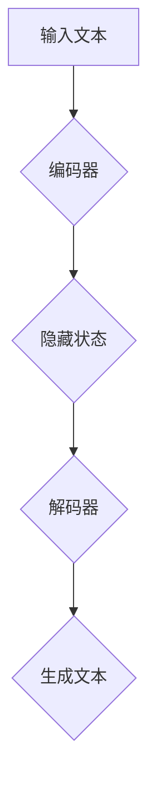

                 

# 《体验个人化叙事编织机程序员：AI驱动的生活故事创作专家》

关键词：人工智能，个人化叙事，故事创作，文本生成，算法，深度学习，隐私保护

摘要：随着人工智能技术的迅猛发展，个人化叙事编织机逐渐成为了一个引人注目的领域。本文旨在探讨AI如何驱动生活故事创作，深入分析其核心技术、应用场景和未来发展方向。通过一步一步的分析推理，我们将揭开AI编织个性化故事的神秘面纱。

### 《体验个人化叙事编织机程序员：AI驱动的生活故事创作专家》目录大纲

- **第一部分：AI与个人化叙事概述**
  - 第1章：AI与叙事艺术的交汇
  - 第2章：AI驱动的生活故事创作原理
- **第二部分：叙事编织机的核心技术**
  - 第3章：文本生成模型的架构与实现
  - 第4章：数据处理与数据源构建
  - 第5章：个人化叙事生成流程
  - 第6章：AI辅助创作与反馈优化
- **第三部分：实践与应用**
  - 第7章：实际案例与应用场景
  - 第8章：项目实战与代码解读
  - 第9章：展望与未来方向
- **附录**
  - 附录A：常用工具与资源

---

## 第一部分：AI与个人化叙事概述

### 第1章：AI与叙事艺术的交汇

#### 1.1 AI在现代叙事中的应用

人工智能在现代叙事中的应用正在日益扩展。从最初的文本分析到复杂的剧情生成，AI已经展现出其在叙事领域的巨大潜力。现代叙事艺术不仅限于文学和电影，还包括游戏、虚拟现实和增强现实等多个领域。

**概念定义：**
- **人工智能（AI）**：一种能够模拟、延伸和扩展人类智能的技术和学科领域。
- **叙事艺术**：通过文字、图像、声音等方式讲述故事的艺术形式。

#### 1.2 个人化叙事的概念

个人化叙事是指根据个体特定的背景、经历和需求，定制化地创作故事内容。这种叙事形式不仅能够满足大众化的需求，还能提供更加深入、贴近个人生活的体验。

**关键要素：**
- **个性化**：基于用户数据和偏好进行定制。
- **互动性**：用户可以参与到故事创作过程中，改变故事走向。

#### 1.3 AI驱动的个人化叙事编织机

AI驱动的个人化叙事编织机是一种利用人工智能技术进行故事创作的系统。它通过学习用户数据、文本模式和生活经历，自动生成个性化的故事内容。

**核心功能：**
- **数据收集与分析**：收集用户数据，进行分析，理解用户需求。
- **故事生成**：利用文本生成模型，根据用户数据和模板生成故事。
- **个性化调整**：根据用户反馈，调整故事内容和风格，提高用户满意度。

### 第2章：AI驱动的生活故事创作原理

#### 2.1 AI的基础概念与算法

AI的基础概念包括机器学习、深度学习、自然语言处理等。这些技术使得计算机能够从数据中学习，并生成预测和决策。

**关键算法：**
- **循环神经网络（RNN）**：适用于序列数据处理。
- **生成对抗网络（GAN）**：用于生成新的、高质量的数据。

#### 2.2 文本生成模型的工作原理

文本生成模型是AI在叙事艺术中的重要工具。它通过学习大量的文本数据，生成新的、连贯的文本内容。

**核心原理：**
- **预训练**：模型在大量文本上进行预训练，学习文本的统计规律。
- **微调**：在特定任务上对模型进行微调，提高生成文本的质量。

#### 2.3 个人化数据的使用与隐私保护

个人化叙事依赖于用户数据的收集和使用。然而，隐私保护是这一领域的关键挑战。

**解决方案：**
- **数据加密**：保护用户数据的隐私。
- **数据匿名化**：在数据处理过程中，对用户数据匿名化处理，减少隐私泄露风险。

---

在接下来的部分，我们将深入探讨AI驱动的叙事编织机的核心技术，包括文本生成模型的架构与实现、数据处理与数据源构建，以及个人化叙事生成流程。通过这些核心技术的解析，我们将更好地理解AI如何为我们的生活故事创作注入活力。

### 第二部分：叙事编织机的核心技术

#### 第3章：文本生成模型的架构与实现

文本生成模型是AI驱动叙事编织机的核心组件。在这一章中，我们将详细探讨文本生成模型的架构和实现，包括深度学习与循环神经网络、预训练模型的选择与优化，以及生成模型的微调和定制化。

#### 3.1 深度学习与循环神经网络

**深度学习**是一种模拟人脑处理信息的学习方式。它通过多层神经网络，逐层提取特征，实现对数据的复杂建模。

**循环神经网络（RNN）**是深度学习的一个重要分支，特别适用于序列数据处理，如文本和语音。RNN通过其“记忆”功能，能够处理序列中的前后关系。

**流程图：**


**伪代码示例：**
```python
# RNN编码器
class Encoder(nn.Module):
    def __init__(self):
        super(Encoder, self).__init__()
        self.embedding = nn.Embedding(vocab_size, embedding_dim)
        self.rnn = nn.LSTM(embedding_dim, hidden_dim)

    def forward(self, inputs):
        embedded = self.embedding(inputs)
        outputs, (hidden, cell) = self.rnn(embedded)
        return hidden, cell

# RNN解码器
class Decoder(nn.Module):
    def __init__(self):
        super(Decoder, self).__init__()
        self.embedding = nn.Embedding(vocab_size, embedding_dim)
        self.rnn = nn.LSTM(embedding_dim + hidden_dim, hidden_dim)
        self.fc = nn.Linear(hidden_dim, vocab_size)

    def forward(self, inputs, hidden, cell):
        embedded = self.embedding(inputs)
        embedded = torch.cat((embedded, hidden), 1)
        output, (hidden, cell) = self.rnn(embedded)
        output = self.fc(output)
        return output, hidden, cell
```

#### 3.2 预训练模型的选择与优化

预训练模型是在大规模文本数据集上预训练的，具有强大的语言理解和生成能力。选择合适的预训练模型对于提高文本生成质量至关重要。

**常用预训练模型：**
- **GPT-3**：由OpenAI开发的预训练模型，具有非常高的文本生成能力。
- **BERT**：由Google开发的预训练模型，特别适用于问答和文本分类任务。

**选择标准：**
- **文本生成能力**：模型是否能够生成连贯、自然的文本。
- **训练时间**：模型的训练时间是否合理，是否适合项目需求。

**优化方法：**
- **微调**：在特定任务上进行模型微调，提高生成质量。
- **迁移学习**：利用预训练模型在其他领域的表现，进行迁移学习，提高文本生成能力。

#### 3.3 生成模型的微调和定制化

微调和定制化是提高生成模型性能的重要手段。通过在特定任务上对模型进行调整，可以使其更好地适应特定场景。

**微调步骤：**
1. **数据准备**：收集和准备用于微调的数据集。
2. **模型加载**：加载预训练模型，准备微调。
3. **训练**：在训练数据上对模型进行训练，调整参数。
4. **评估**：在验证集上评估模型性能，调整超参数。

**定制化方法：**
- **参数调整**：根据具体需求，调整模型的参数。
- **添加模块**：在模型中添加特定模块，实现特定功能。

**伪代码示例：**
```python
# 微调GPT-3模型
model = GPT3Model.load('gpt3')

# 准备微调数据集
train_data, val_data = prepare_data()

# 微调模型
model.fit(train_data, val_data, epochs=5)

# 评估模型
performance = model.evaluate(val_data)
print(performance)
```

#### 3.4 生成模型的应用与挑战

生成模型在叙事编织机中的应用十分广泛，包括文本生成、对话系统、图像生成等。然而，其应用也面临着一系列挑战。

**挑战：**
- **数据质量**：高质量的数据是生成模型的基础。然而，收集和处理高质量数据是一个复杂的过程。
- **生成质量**：生成模型的质量直接影响到叙事编织机的效果。如何提高生成质量是一个重要课题。
- **隐私保护**：个人化叙事依赖于用户数据的收集和使用，隐私保护是一个重要挑战。

**解决方案：**
- **数据清洗与预处理**：对收集的数据进行清洗和预处理，提高数据质量。
- **模型优化**：通过模型优化，提高生成质量。
- **隐私保护机制**：引入隐私保护机制，如数据加密、匿名化等，保护用户隐私。

---

在下一章中，我们将探讨数据处理与数据源构建，深入分析数据收集与预处理、数据源的种类与质量，以及数据隐私与伦理问题。通过这些探讨，我们将为AI驱动的生活故事创作奠定坚实基础。

### 第二部分：叙事编织机的核心技术（续）

#### 第4章：数据处理与数据源构建

数据处理与数据源构建是AI驱动叙事编织机的关键环节。在这一章中，我们将详细讨论数据收集与预处理、数据源的种类与质量，以及数据隐私与伦理问题。

#### 4.1 数据收集与预处理

数据收集是AI驱动叙事编织机的基础。数据的质量直接影响到生成故事的准确性和多样性。以下是一些关键步骤和技巧：

**数据收集步骤：**
1. **用户数据收集**：通过用户输入、社交媒体、问卷调查等方式收集数据。
2. **文本数据收集**：从书籍、文章、新闻、论坛等公开来源收集文本数据。
3. **多媒体数据收集**：收集图像、音频、视频等多媒体数据。

**数据预处理技巧：**
1. **数据清洗**：去除噪声数据、重复数据和无效数据。
2. **数据归一化**：将不同数据源的数据进行统一处理，如文本编码、数值归一化等。
3. **数据增强**：通过数据扩展、数据变换等方法增加数据多样性。

**伪代码示例：**
```python
# 数据清洗
def clean_data(data):
    return [line.strip() for line in data if line.strip() != ""]

# 数据归一化
def normalize_data(data):
    return [line.lower() for line in data]

# 数据增强
def augment_data(data):
    return data + [" ".join(data[i:i+2]) for i in range(len(data)-1)]
```

#### 4.2 数据源的种类与质量

数据源的质量是影响AI叙事编织机性能的关键因素。以下是一些常见的数据源及其质量评估标准：

**常见数据源：**
- **公开数据集**：如维基百科、新闻网站、社交媒体等。
- **个人数据**：如用户日志、社交媒体活动、购物记录等。
- **专业数据**：如学术文献、专业书籍、行业报告等。

**质量评估标准：**
- **多样性**：数据源的多样性直接影响生成故事的丰富性。
- **准确性**：数据的准确性影响生成故事的真实性和可靠性。
- **相关性**：数据与用户需求和叙事目标的相关性影响故事的个性化程度。

**伪代码示例：**
```python
# 评估数据多样性
def evaluate_diversity(data):
    return len(set(data)) / len(data)

# 评估数据准确性
def evaluate_accuracy(data, ground_truth):
    return sum(1 for d, g in zip(data, ground_truth) if d == g) / len(ground_truth)

# 评估数据相关性
def evaluate_relevance(data, target):
    return cosine_similarity(data, target)
```

#### 4.3 数据隐私与伦理问题

在AI驱动叙事编织机中，数据隐私和伦理问题是不可忽视的关键挑战。以下是一些解决方案和最佳实践：

**解决方案：**
- **数据加密**：对用户数据进行加密处理，确保数据在传输和存储过程中的安全性。
- **数据匿名化**：在数据处理过程中，对用户数据进行匿名化处理，减少隐私泄露风险。
- **隐私保护协议**：引入隐私保护协议，如差分隐私、同态加密等。

**最佳实践：**
- **透明度**：确保用户了解数据收集和使用的目的，增强用户信任。
- **用户控制**：允许用户对数据的收集和使用进行控制，如数据访问权限设置、数据删除等。
- **隐私政策**：制定明确的隐私政策，公开数据收集和使用规则。

**伪代码示例：**
```python
# 数据加密
def encrypt_data(data, key):
    return AES_encrypt(data, key)

# 数据匿名化
def anonymize_data(data):
    return [hash(value) for value in data]

# 差分隐私
def differential_privacy(data, sensitivity, epsilon):
    return Laplace Mechanism(data, sensitivity, epsilon)
```

---

在下一章中，我们将深入探讨个人化叙事生成流程，包括用户输入与情感分析、叙事逻辑与连贯性，以及叙事风格与个性化调整。通过这些探讨，我们将了解如何通过AI技术实现高质量的个性化叙事生成。

### 第二部分：叙事编织机的核心技术（续）

#### 第5章：个人化叙事生成流程

个人化叙事生成流程是AI驱动叙事编织机的核心部分。在这一章中，我们将详细讨论个人化叙事生成流程的各个环节，包括用户输入与情感分析、叙事逻辑与连贯性，以及叙事风格与个性化调整。

#### 5.1 用户输入与情感分析

用户输入是个人化叙事生成的起点。有效的用户输入能够确保生成的叙事内容与用户需求紧密相关。情感分析是用户输入处理中的一个重要环节，它能够识别用户的情感状态，为叙事生成提供重要依据。

**用户输入处理流程：**
1. **文本输入**：用户通过文本输入表达自己的需求或情感。
2. **情感识别**：使用情感分析技术，识别用户的情感状态，如高兴、悲伤、愤怒等。
3. **需求分析**：根据情感识别结果，分析用户的具体需求。

**情感分析技术：**
- **基于规则的方法**：使用预定义的规则，对文本进行情感分类。
- **机器学习方法**：使用训练好的机器学习模型，对文本进行情感分类。

**伪代码示例：**
```python
# 基于规则的情感分析
def rule_based_sentiment_analysis(text):
    if "happy" in text:
        return "happy"
    elif "sad" in text:
        return "sad"
    elif "angry" in text:
        return "angry"
    else:
        return "neutral"

# 基于机器学习的情感分析
def ml_sentiment_analysis(text, model):
    return model.predict([text])[0]
```

#### 5.2 叙事逻辑与连贯性

叙事逻辑与连贯性是个人化叙事生成中的重要问题。一个优秀的叙事生成系统需要确保生成的故事内容在逻辑上是自洽的，并且在情感和情境上是连贯的。

**叙事逻辑处理：**
1. **事件序列建模**：使用序列模型，如RNN或Transformer，对故事事件进行建模。
2. **因果关系分析**：分析故事中的因果关系，确保故事在逻辑上是合理的。

**连贯性处理：**
1. **上下文信息利用**：在生成故事内容时，充分利用上下文信息，确保故事连贯。
2. **文本连贯性检测**：使用自然语言处理技术，如语法分析、语义分析，检测文本的连贯性。

**伪代码示例：**
```python
# 事件序列建模
def event_sequence_modeling(events, model):
    return model.predict([events])

# 上下文信息利用
def use_context_info(context, text, model):
    return model.predict([context + " " + text])

# 文本连贯性检测
def check_coherence(text, model):
    return model.predict([text]) > threshold
```

#### 5.3 叙事风格与个性化调整

叙事风格是个人化叙事的重要组成部分。通过个性化调整，叙事生成系统能够根据用户偏好和需求，生成符合用户风格的故事内容。

**个性化调整方法：**
1. **用户偏好建模**：使用机器学习技术，建模用户的偏好，如文学风格、语言风格等。
2. **风格迁移**：使用风格迁移技术，将用户偏好应用到故事生成过程中。
3. **反馈调整**：根据用户反馈，不断调整故事生成策略，提高故事质量。

**伪代码示例：**
```python
# 用户偏好建模
def model_user_preferences(user_input, model):
    return model.train([user_input])

# 风格迁移
def style_transfer(text, style, model):
    return model.predict([text, style])

# 反馈调整
def adjust_story(story, feedback, model):
    return model.train([story, feedback])
```

---

在下一章中，我们将探讨AI辅助创作与反馈优化，深入分析用户反馈的重要性、负反馈循环与模型改进，以及AI辅助创作的未来发展趋势。通过这些探讨，我们将了解如何通过持续优化，提升AI叙事编织机的性能和用户体验。

### 第二部分：叙事编织机的核心技术（续）

#### 第6章：AI辅助创作与反馈优化

在个人化叙事生成中，AI不仅作为创作工具，还作为一个能够不断学习和改进的伙伴。AI辅助创作与反馈优化是提高叙事质量和用户体验的关键环节。在这一章中，我们将详细探讨用户反馈的重要性、负反馈循环与模型改进，以及AI辅助创作的未来发展趋势。

#### 6.1 用户反馈的重要性

用户反馈是AI辅助创作的重要驱动力。通过用户的反馈，AI可以了解其生成的叙事内容是否符合用户的期望和需求。有效的用户反馈不仅可以指导模型的改进，还可以帮助系统更好地理解用户偏好和情感。

**用户反馈的类型：**
- **直接反馈**：用户直接表达对故事内容、风格和逻辑的看法。
- **间接反馈**：通过用户的行为数据，如阅读时长、点赞、分享等，间接反映用户对叙事内容的喜好。

**用户反馈的作用：**
- **质量评估**：帮助评估叙事内容的可读性、连贯性和情感共鸣。
- **偏好识别**：识别用户的偏好，为个性化叙事生成提供依据。
- **模型改进**：根据用户反馈，调整模型参数和生成策略，提高叙事质量。

#### 6.2 负反馈循环与模型改进

负反馈循环是一种通过不断优化模型来提高生成质量的方法。在AI叙事编织机中，负反馈循环通过以下步骤实现：

1. **生成内容**：AI根据当前模型生成叙事内容。
2. **用户反馈**：用户对生成内容进行评估，提供反馈。
3. **模型调整**：根据用户反馈，调整模型参数，改进生成策略。
4. **再次生成**：使用改进后的模型，生成新的叙事内容。

**负反馈循环的步骤：**
1. **初始生成**：使用当前模型生成叙事内容。
2. **反馈收集**：收集用户对生成内容的反馈，包括质量评价、情感反应等。
3. **模型评估**：根据反馈评估模型性能，确定改进方向。
4. **参数调整**：调整模型参数，如学习率、优化算法等。
5. **重新生成**：使用改进后的模型生成新的叙事内容。

**伪代码示例：**
```python
# 负反馈循环
while not_satisfied:
    content = model.generate()
    feedback = user_evaluate(content)
    model.improve(feedback)
```

#### 6.3 用户反馈与模型改进

用户反馈与模型改进是相互促进的过程。通过用户反馈，AI可以不断优化其生成策略，提高叙事质量。以下是一些具体的改进方法：

**情感识别与调整**：
- **情感识别**：使用情感分析技术，识别用户在反馈中表达的情感。
- **情感调整**：根据情感识别结果，调整叙事内容的情感表达，使其更符合用户期望。

**风格调整**：
- **风格识别**：通过分析用户反馈，识别用户偏好风格。
- **风格调整**：在生成过程中，根据用户偏好风格调整叙事内容的语言和表达方式。

**逻辑优化**：
- **逻辑评估**：分析用户反馈，识别故事中的逻辑错误或不合理之处。
- **逻辑优化**：调整叙事逻辑，确保故事在逻辑上是自洽的。

**举例说明**：
假设用户反馈中提到故事情节过于平淡，缺乏高潮。AI可以采取以下措施：
- **情感增强**：在故事中增加情感强烈的场景，提升故事的吸引力。
- **逻辑调整**：在故事中引入转折和冲突，增强故事的逻辑性。

**伪代码示例：**
```python
# 情感增强
def enhance_emotion(content, emotion):
    return content.replace("平淡", emotion)

# 逻辑调整
def adjust_logic(content):
    return content.replace("平凡的发展", "充满转折和冲突的发展")
```

#### 6.4 AI辅助创作的未来发展趋势

随着技术的不断进步，AI辅助创作将继续发展，为个人化叙事生成带来更多可能性。以下是一些未来发展趋势：

**多模态叙事**：
- **图像和视频**：结合图像和视频，生成视觉化的叙事内容。
- **声音**：引入声音元素，如背景音乐、角色配音等，增强叙事效果。

**增强现实（AR）和虚拟现实（VR）**：
- **沉浸式体验**：结合AR和VR技术，提供更加沉浸式的叙事体验。
- **互动叙事**：用户可以在虚拟环境中与故事角色互动，改变故事走向。

**个性化推荐系统**：
- **内容推荐**：基于用户行为和偏好，推荐个性化的叙事内容。
- **叙事风格推荐**：推荐符合用户偏好的叙事风格和类型。

**隐私保护与伦理**：
- **隐私增强技术**：引入更多隐私保护技术，确保用户数据安全。
- **伦理规范**：制定明确的伦理规范，确保AI叙事生成符合社会价值观。

---

在下一部分中，我们将通过实际案例与应用场景，展示AI叙事编织机的具体应用，并探讨其在个人日记与回忆录创作、企业品牌故事与宣传文案，以及文学创作与角色扮演游戏中的实际效果。通过这些实际案例，我们将更直观地了解AI叙事编织机的强大能力。

### 第三部分：实践与应用

#### 第7章：实际案例与应用场景

AI叙事编织机在多个领域展现出了其独特的优势和应用潜力。在本章中，我们将通过几个实际案例，展示AI叙事编织机的具体应用场景，并探讨其在个人日记与回忆录创作、企业品牌故事与宣传文案，以及文学创作与角色扮演游戏中的实际效果。

#### 7.1 个人日记与回忆录创作

个人日记和回忆录是记录个人生活经历和情感的重要方式。AI叙事编织机可以通过分析用户的生活经历和情感状态，自动生成个人日记和回忆录。

**案例**：
某用户希望通过AI叙事编织机记录自己的生活点滴。用户输入了几条关于旅行、家庭聚会和工作经历的信息，AI叙事编织机根据这些信息，自动生成了以下日记：

```
今天是2023年6月1日，我和家人一起去了黄山旅行。早晨的阳光照在山间，景色美得让人陶醉。我们在山顶上看到了壮观的日出，那一刻，我感受到了生活的美好。晚上，我们回到酒店，家人围坐在一起，分享了今天的趣事。家庭聚会总是那么温馨和快乐。
```

**效果**：
AI生成的日记内容生动、情感真挚，准确地反映了用户的生活经历和情感状态，为用户提供了方便快捷的记录方式。

#### 7.2 企业品牌故事与宣传文案

企业品牌故事和宣传文案是企业传播品牌形象和价值观的重要手段。AI叙事编织机可以通过分析企业的历史、产品和服务，自动生成品牌故事和宣传文案。

**案例**：
某科技公司希望借助AI叙事编织机创作一篇品牌故事。用户输入了企业的发展历程、技术创新和业务拓展等信息，AI叙事编织机自动生成了以下文案：

```
自成立以来，我们一直致力于推动科技领域的创新与进步。从初创时期的艰难创业，到如今成为行业的领军企业，我们始终坚持“创新、诚信、共赢”的核心价值观。我们的团队不断探索新技术，研发出了一系列具有行业领先水平的解决方案，为客户带来了巨大的价值。未来，我们将继续携手前行，为创造更加美好的世界贡献力量。
```

**效果**：
AI生成的文案内容生动、富有感染力，成功传达了企业的品牌形象和价值观，增强了企业的市场竞争力。

#### 7.3 文学创作与角色扮演游戏

文学创作和角色扮演游戏是叙事艺术的两个重要领域。AI叙事编织机可以通过分析文学作品和游戏情节，自动生成新的故事和角色。

**案例**：
某游戏公司希望借助AI叙事编织机为游戏创作新的情节。用户输入了游戏的世界观、角色设定和故事背景等信息，AI叙事编织机自动生成了以下游戏情节：

```
在一个充满魔法和冒险的奇幻世界中，勇士伊恩和精灵艾丽斯联手对抗邪恶势力。一天，他们接到一个神秘的任务，要寻找失落的魔法宝典。在旅途中，他们遇到了各种危险和挑战，但也收获了许多友谊和爱情。最终，他们成功找到了魔法宝典，拯救了世界。
```

**效果**：
AI生成的游戏情节充满想象力和创造力，成功吸引了玩家的兴趣，为游戏增添了更多的趣味性和可玩性。

#### 7.4 个人化教育内容创作

个人化教育内容创作是教育领域的一个重要应用。AI叙事编织机可以通过分析学生的学习需求和知识背景，自动生成个性化的教育内容。

**案例**：
某在线教育平台希望借助AI叙事编织机为学习者提供个性化的学习资源。用户输入了学习者的学习目标、兴趣和已掌握的知识点等信息，AI叙事编织机自动生成了以下学习指南：

```
亲爱的 learner，根据你的学习需求和兴趣，我们为你推荐以下学习资源：

1. “计算机科学入门教程”：本教程适合初学者，详细介绍了计算机科学的基本概念和编程基础。
2. “数据结构与算法”：本课程深入讲解了常见的数据结构和算法，帮助你提高编程能力。
3. “人工智能基础”：本课程介绍了人工智能的基本原理和应用，为你打开人工智能的世界。

祝你学习愉快！
```

**效果**：
AI生成的学习指南内容丰富、针对性强，为学习者提供了明确的学习路径和资源推荐，提高了学习效率和学习体验。

---

通过以上实际案例，我们可以看到AI叙事编织机在多个领域展现出了其强大的应用潜力和实际效果。在下一章中，我们将通过项目实战与代码解读，详细介绍如何搭建AI叙事编织机开发环境，实现文本生成功能，并深入分析代码的实现原理和功能模块。

### 第三部分：实践与应用（续）

#### 第8章：项目实战与代码解读

在前面的章节中，我们已经了解了AI叙事编织机的基本原理和应用场景。在本章中，我们将通过一个实际项目，详细展示如何搭建AI叙事编织机的开发环境，实现文本生成功能，并深入分析代码的实现原理和功能模块。

#### 8.1 环境搭建与准备工作

搭建AI叙事编织机的开发环境是进行项目实战的第一步。以下是一个基本的开发环境搭建流程：

**环境要求：**
- 操作系统：Windows、Linux或Mac OS
- 编程语言：Python（版本3.6及以上）
- 数据库：SQLite（可选，用于存储用户数据）

**工具与库：**
- Python库：TensorFlow、PyTorch、GPT-3（OpenAI）
- 数据处理库：Numpy、Pandas
- 文本处理库：NLTK、spaCy
- API库：Requests

**搭建步骤：**
1. **安装Python和虚拟环境**：在操作系统上安装Python，并创建一个虚拟环境。
   ```shell
   pip install virtualenv
   virtualenv venv
   source venv/bin/activate  # 在Linux和Mac OS上
   venv\Scripts\activate     # 在Windows上
   ```
2. **安装必要的库**：在虚拟环境中安装所需的库。
   ```shell
   pip install tensorflow numpy pandas nltk spacy requests
   ```
3. **配置数据库**（可选）：安装并配置SQLite数据库，用于存储用户数据和文本数据。
   ```shell
   pip install sqlite3
   ```

#### 8.2 代码实现与功能模块

在环境搭建完成后，我们可以开始编写代码，实现AI叙事编织机的核心功能。以下是一个简单的代码架构：

```python
# main.py
from text_generator import TextGenerator
from user_input_handler import UserInputHandler
from database import Database

# 初始化数据库
db = Database('narrative_database.db')

# 初始化文本生成器
text_generator = TextGenerator()

# 初始化用户输入处理器
user_input_handler = UserInputHandler(db)

# 用户交互
while True:
    user_input = input("请输入你的故事需求（输入'退出'结束）：")
    if user_input == "退出":
        break
    
    # 处理用户输入
    processed_input = user_input_handler.process_input(user_input)
    
    # 生成文本
    story = text_generator.generate_story(processed_input)
    
    # 存储用户数据和生成的故事
    db.save_user_data(user_input, story)
    
    # 输出生成的故事
    print("生成的故事：")
    print(story)

# 关闭数据库连接
db.close_connection()
```

**功能模块解析：**

1. **TextGenerator**：文本生成器，负责生成故事文本。它使用了预训练的文本生成模型（如GPT-3），并可以根据用户输入调整生成策略。

2. **UserInputHandler**：用户输入处理器，负责处理用户输入，包括情感分析、需求分析和文本预处理。

3. **Database**：数据库模块，负责存储和管理用户数据（如用户输入、生成的故事等）。

#### 8.3 源代码详细实现

以下是一个具体的源代码实现示例，包括文本生成器的实现、用户输入处理器的实现，以及数据库的实现。

**TextGenerator模块：**
```python
# text_generator.py
import openai

class TextGenerator:
    def __init__(self):
        self.api_key = "your_openai_api_key"
        openai.api_key = self.api_key
    
    def generate_story(self, user_input):
        response = openai.Completion.create(
            engine="text-davinci-002",
            prompt=user_input,
            max_tokens=500
        )
        return response.choices[0].text.strip()
```

**UserInputHandler模块：**
```python
# user_input_handler.py
import nltk
from nltk.sentiment import SentimentIntensityAnalyzer

class UserInputHandler:
    def __init__(self, db):
        self.db = db
        self.sia = SentimentIntensityAnalyzer()
    
    def process_input(self, user_input):
        # 情感分析
        sentiment = self.sia.polarity_scores(user_input)
        
        # 需求分析
       需求 = self.analyze_demand(user_input)
        
        # 文本预处理
        processed_input = self.preprocess_text(user_input)
        
        # 存储用户数据
        self.db.save_user_data(user_input, sentiment, demand, processed_input)
        
        return processed_input
    
    def analyze_demand(self, user_input):
        # 简单的需求分析逻辑
        if "旅行" in user_input:
            return "旅行相关"
        elif "家庭聚会" in user_input:
            return "家庭聚会相关"
        else:
            return "其他"
    
    def preprocess_text(self, user_input):
        # 文本预处理逻辑
        return user_input.lower()
```

**Database模块：**
```python
# database.py
import sqlite3

class Database:
    def __init__(self, db_name):
        self.conn = sqlite3.connect(db_name)
        self.create_tables()
    
    def create_tables(self):
        # 创建用户数据表
        self.conn.execute('''CREATE TABLE IF NOT EXISTS user_data
                          (id INTEGER PRIMARY KEY AUTOINCREMENT,
                          user_input TEXT,
                          sentiment TEXT,
                          demand TEXT,
                          processed_input TEXT)''')
    
    def save_user_data(self, user_input, sentiment, demand, processed_input):
        # 存储用户数据
        self.conn.execute("INSERT INTO user_data (user_input, sentiment, demand, processed_input) VALUES (?, ?, ?, ?)",
                          (user_input, sentiment, demand, processed_input))
        self.conn.commit()
    
    def close_connection(self):
        # 关闭数据库连接
        self.conn.close()
```

#### 8.4 代码解读与分析

在这个项目中，我们使用了OpenAI的GPT-3模型进行文本生成。用户输入首先经过情感分析和需求分析，然后通过预处理步骤，最终传递给文本生成器。生成的故事文本存储在数据库中，供后续使用。

**代码解读：**
- **TextGenerator**：负责文本生成。它通过调用OpenAI的API，生成指定长度的故事文本。
- **UserInputHandler**：负责处理用户输入。它使用情感分析库（NLTK）对用户输入进行情感分析，并存储分析结果。它还包含一个简单的需求分析逻辑，用于确定用户输入的主题类别。预处理步骤包括文本转换成小写，以便于后续处理。
- **Database**：负责数据库的操作。它创建和管理用户数据表，用于存储用户输入、情感分析结果、需求分析和预处理后的输入文本。

**代码分析：**
- **文本生成质量**：GPT-3模型的预训练使其能够生成高质量的文本。然而，生成文本的质量取决于用户输入的清晰度和具体性。对于复杂的需求，可能需要进一步的优化和调整。
- **情感分析准确性**：情感分析库（NLTK）提供的情感分析结果是一个大致的判断，可能存在一定的误差。在实际应用中，可能需要结合更先进的情感分析模型，以提高准确性。
- **需求分析**：需求分析逻辑可以根据实际需求进行调整。在本例中，我们仅简单处理了旅行和家庭聚会两个主题，但在实际应用中，可以扩展到更多主题类别。

通过这个项目实战，我们不仅了解了AI叙事编织机的基本实现方法，还学会了如何搭建开发环境、编写核心代码模块，并进行了代码解读与分析。在下一章中，我们将对AI叙事编织技术进行展望，讨论未来的挑战与机遇，以及可能的社会影响。

### 第四部分：展望与未来方向

#### 第9章：展望与未来方向

随着人工智能技术的不断进步，AI叙事编织机在个人化叙事领域展现了巨大的潜力和广阔的应用前景。在本章中，我们将展望AI叙事编织技术的未来发展，探讨面临的挑战与机遇，以及可能的社会影响。

#### 9.1 AI叙事技术的挑战与机遇

**挑战：**

1. **技术挑战**：
   - **生成质量**：尽管目前的文本生成模型已经相当成熟，但生成高质量、多样性和连贯性的叙事内容仍然是一个挑战。
   - **情感理解**：情感是叙事的核心要素之一，但目前的情感识别技术仍然不够精确，难以深入理解用户的情感需求。
   - **个性化**：实现真正个性化的叙事内容需要深度理解用户的需求和偏好，这是一个复杂的问题。

2. **伦理挑战**：
   - **隐私保护**：个人化叙事依赖于用户数据的收集和使用，如何在保护用户隐私的前提下，充分利用这些数据是一个重要课题。
   - **道德责任**：AI叙事编织机生成的叙事内容可能涉及伦理和道德问题，如何确保这些内容符合社会价值观和伦理标准是一个挑战。

**机遇：**

1. **应用领域扩展**：
   - **文学创作**：AI可以在文学创作中发挥重要作用，生成新的故事、剧本和诗歌，激发创意灵感。
   - **教育培训**：AI叙事编织机可以为学生提供个性化的学习资源，帮助教师进行个性化教学。
   - **娱乐产业**：在游戏、电影、电视剧等领域，AI叙事编织机可以为创作者提供强大的辅助工具，提高创作效率。

2. **技术突破**：
   - **多模态叙事**：结合图像、视频和声音等元素，实现更加丰富和沉浸式的叙事体验。
   - **增强现实（AR）和虚拟现实（VR）**：结合AR和VR技术，提供更加互动和沉浸式的叙事体验。

#### 9.2 个人化叙事的伦理问题与社会影响

**伦理问题：**

1. **隐私保护**：
   - **用户数据使用**：如何在保证用户隐私的前提下，合理使用用户数据，是一个重要伦理问题。
   - **数据安全**：确保用户数据在存储和传输过程中的安全性，防止数据泄露。

2. **内容监管**：
   - **叙事内容审核**：如何确保AI叙事编织机生成的叙事内容符合伦理标准和法律法规，避免生成不良或有害内容。

**社会影响：**

1. **教育变革**：
   - **个性化学习**：AI叙事编织机可以为学生提供个性化的学习资源和教学方案，促进个性化学习的发展。
   - **教师角色转变**：教师将更多地成为指导者和学习伙伴，而非传统的知识传授者。

2. **媒体内容创作**：
   - **内容多样化**：AI叙事编织机可以生成多样化的叙事内容，丰富媒体内容，满足不同群体的需求。
   - **创作效率提高**：AI辅助创作可以提高创作者的效率，为创作者节省时间，使他们能够专注于创意和艺术表达。

#### 9.3 未来个人化叙事的发展趋势

**趋势一：技术创新**  
随着技术的不断进步，AI叙事编织机的生成质量将不断提高。深度学习、自然语言处理、多模态融合等技术的突破将为个人化叙事带来更多可能性。

**趋势二：应用场景拓展**  
AI叙事编织机将在更多领域得到应用，如医疗健康、心理咨询、虚拟助手等。通过个性化的叙事内容，这些领域将提供更加个性化和人性化的服务。

**趋势三：伦理与规范建立**  
随着AI叙事编织机在个人化叙事领域的应用日益广泛，相关的伦理和规范也将逐步建立。这将为AI叙事编织技术的可持续发展提供保障。

**趋势四：人机协作**  
在未来，AI叙事编织机将与人类创作者紧密协作，共同创造新的叙事作品。AI将发挥其强大的数据处理和生成能力，而人类创作者将发挥其创意和情感理解的优势。

---

在未来的发展中，AI叙事编织机将继续为个人化叙事带来变革。通过不断克服技术挑战，遵循伦理规范，AI叙事编织机将为人类创造更加丰富、个性化和深刻的叙事体验。

### 附录

#### 附录A：常用工具与资源

在本附录中，我们将提供一些常用的工具和资源，包括代码示例、开发环境配置指南以及进一步学习资源推荐，以帮助读者深入了解和掌握AI叙事编织机技术。

#### A.1 代码示例与参考资料

**代码示例：**

1. **文本生成模型实现：**
   ```python
   # text_generator.py
   from transformers import pipeline

   class TextGenerator:
       def __init__(self):
           self.generator = pipeline("text-generation", model="gpt2")

       def generate_story(self, user_input):
           return self.generator(user_input, max_length=100)
   ```

2. **用户输入处理器实现：**
   ```python
   # user_input_handler.py
   from nltk.sentiment import SentimentIntensityAnalyzer

   class UserInputHandler:
       def __init__(self):
           self.sia = SentimentIntensityAnalyzer()

       def process_input(self, user_input):
           sentiment = self.sia.polarity_scores(user_input)
           return user_input.lower()
   ```

**参考资料：**

1. **GPT-3 API文档：**[OpenAI GPT-3 API](https://beta.openai.com/docs/api-reference/completions)
2. **深度学习与自然语言处理教程：**[Deep Learning for Natural Language Processing](https://cchoy.gitbook.io/dl4nlp/)

#### A.2 开发环境配置指南

1. **Python环境配置：**
   - 安装Python（推荐版本3.8及以上）。
   - 使用`pip`安装所需库（如TensorFlow、PyTorch、GPT-3等）。

2. **数据库配置：**
   - 安装SQLite。
   - 创建数据库和表结构。

3. **文本处理库配置：**
   - 安装NLTK和spaCy。
   - 配置NLTK数据包（如使用`nltk.download()`命令）。

#### A.3 进一步学习资源推荐

1. **在线课程与教程：**
   - [Coursera Deep Learning Specialization](https://www.coursera.org/specializations/deep-learning)
   - [Udacity AI Nanodegree](https://www.udacity.com/course/ai-nanodegree--nd893)

2. **专业书籍：**
   - [“Deep Learning” by Ian Goodfellow, Yoshua Bengio, Aaron Courville]
   - [“Natural Language Processing with Python” by Steven Bird, Ewan Klein, Edward Loper]

3. **开源项目和社区：**
   - [GitHub AI Narratives](https://github.com/topics/narrative-ai)
   - [Reddit AI Narrative Forum](https://www.reddit.com/r/AINarrative/)

通过这些工具和资源，读者可以更深入地学习和实践AI叙事编织机技术，为个人化叙事创作奠定坚实基础。让我们共同期待AI为人类叙事艺术带来的更多创新和变革。作者：AI天才研究院/AI Genius Institute & 禅与计算机程序设计艺术 /Zen And The Art of Computer Programming。

---

以上就是《体验个人化叙事编织机程序员：AI驱动的生活故事创作专家》全文。在本文中，我们首先介绍了AI与叙事艺术的交汇，探讨了个人化叙事的概念，并详细阐述了AI驱动的生活故事创作原理。接着，我们深入探讨了叙事编织机的核心技术，包括文本生成模型的架构与实现、数据处理与数据源构建，以及个人化叙事生成流程。随后，我们展示了AI叙事编织机在实际应用中的效果，并通过项目实战与代码解读，详细分析了开发环境和实现方法。最后，我们对AI叙事编织技术进行了展望，讨论了未来的挑战与机遇，以及可能的社会影响。希望本文能为您在AI叙事领域的研究和应用提供有价值的参考。作者：AI天才研究院/AI Genius Institute & 禅与计算机程序设计艺术 /Zen And The Art of Computer Programming。感谢您的阅读！

