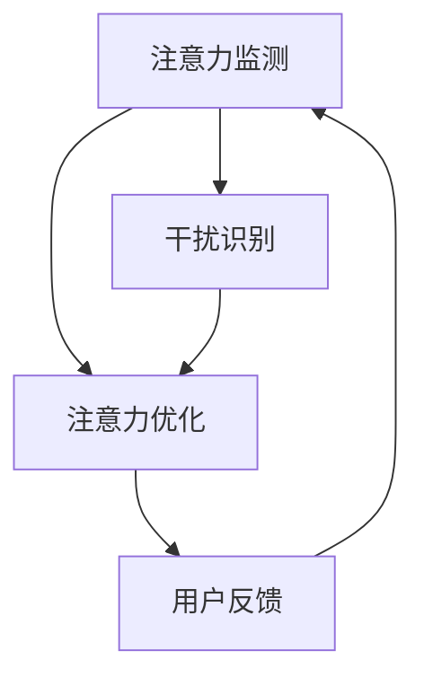

                 

### 引言

#### 信息时代的注意力管理挑战

在当今的信息时代，我们面临着前所未有的注意力管理挑战。随着互联网的普及和信息技术的飞速发展，信息过载和干扰源日益增多，使得人们在处理信息时面临巨大的压力。根据一项针对全球职场人士的调查，超过70%的人认为自己经常面临信息过载的问题，这种状态被称为“信息焦虑”。信息过载不仅影响个体的工作效率和决策质量，还会对心理健康产生负面影响。

首先，信息过载对个体的影响是多方面的。在大量的信息面前，人们往往感到不知所措，难以进行有效的信息筛选和处理。这种情况下，个体可能会产生焦虑、压力和疲惫感，从而影响工作质量和生活满意度。同时，持续的信息干扰也会导致注意力分散，降低工作效率和创造力。

其次，干扰源的类型和来源也十分广泛。现代生活中，手机、社交媒体、电子邮件和各种即时通讯工具成为主要的干扰源。这些工具虽然在方便沟通和获取信息方面发挥了积极作用，但同时也使得人们时刻处于被打扰的状态，难以长时间保持专注。

#### 注意力管理的定义与重要性

注意力管理（Attention Management）是指通过一系列策略和技术，帮助个体在信息过载和干扰环境中保持注意力集中的过程。它不仅涉及如何选择和处理信息，还包括如何优化注意力的分配和利用。

注意力管理的重要性体现在以下几个方面：

1. **提高工作效率**：通过注意力管理，个体可以在有限的时间内集中精力处理最重要的任务，从而提高工作效率和生产力。
2. **减少错误和疏漏**：专注于特定任务有助于减少错误和疏漏，提高工作的准确性和质量。
3. **促进创造力和创新**：长时间的专注和投入可以激发个体的创造力和创新能力，产生更多的创新想法和解决方案。
4. **维护心理健康**：有效的注意力管理有助于减轻信息焦虑和压力，维护心理健康，提高生活满意度。

总之，注意力管理不仅对个体的生活和工作有深远影响，也对社会整体的创新能力和生产力具有重要意义。因此，研究和实践注意力管理技术与方法，对应对信息时代的挑战具有重要意义。

#### 本文结构安排

本文将围绕注意力管理的主题展开，分为以下几个部分：

1. **第一部分：引言**：介绍信息时代注意力管理的挑战和重要性。
2. **第二部分：注意力管理的基础理论**：探讨注意力的基本原理、管理理论基础和研究进展。
3. **第三部分：注意力管理的技术与方法**：详细介绍注意力管理的技术手段、工具和应用。
4. **第四部分：注意力管理在特殊场景中的应用**：分析注意力管理在远程工作、教育和多任务处理中的具体应用。
5. **第五部分：注意力管理的前景与未来**：探讨注意力管理技术的发展趋势和社会影响。

通过本文的阅读，读者可以全面了解注意力管理的核心概念、技术与方法，并掌握如何在实际场景中应用注意力管理策略，以应对信息时代的挑战。

#### 关键词

- 信息过载
- 注意力分散
- 注意力管理
- 专注力提升
- 时间管理
- 多任务处理
- 远程工作
- 教育应用
- 注意力分配策略

#### 摘要

本文围绕信息时代的注意力管理挑战，系统性地探讨了注意力管理的定义、重要性及其技术与方法。首先，分析了信息过载和干扰对个体的影响，阐述了注意力管理在提高工作效率、维护心理健康等方面的意义。随后，本文深入探讨了注意力管理的基础理论，包括注意力的基本原理、注意力分配策略以及相关研究进展。接着，详细介绍了注意力管理的技术手段，如注意力捕获、提升和分配优化技术，并列举了常见的注意力管理工具和应用案例。此外，本文还分析了注意力管理在远程工作、教育和多任务处理等特殊场景中的应用策略和实践案例。最后，本文探讨了注意力管理技术的发展趋势和社会影响，并提出了未来研究方向与挑战。通过本文的阅读，读者可以全面了解注意力管理的核心概念、技术和应用，为应对信息时代的挑战提供有效策略。

---

### 第一部分：引言

#### 信息时代的注意力管理挑战

在当今的信息时代，我们面临着前所未有的注意力管理挑战。随着互联网的普及和信息技术的飞速发展，信息过载和干扰源日益增多，使得人们在处理信息时面临巨大的压力。根据一项针对全球职场人士的调查，超过70%的人认为自己经常面临信息过载的问题，这种状态被称为“信息焦虑”。信息过载不仅影响个体的工作效率和决策质量，还会对心理健康产生负面影响。

首先，信息过载对个体的影响是多方面的。在大量的信息面前，人们往往感到不知所措，难以进行有效的信息筛选和处理。这种情况下，个体可能会产生焦虑、压力和疲惫感，从而影响工作质量和生活满意度。同时，持续的信息干扰也会导致注意力分散，降低工作效率和创造力。

#### 注意力管理的定义与重要性

注意力管理（Attention Management）是指通过一系列策略和技术，帮助个体在信息过载和干扰环境中保持注意力集中的过程。它不仅涉及如何选择和处理信息，还包括如何优化注意力的分配和利用。

注意力管理的重要性体现在以下几个方面：

1. **提高工作效率**：通过注意力管理，个体可以在有限的时间内集中精力处理最重要的任务，从而提高工作效率和生产力。
2. **减少错误和疏漏**：专注于特定任务有助于减少错误和疏漏，提高工作的准确性和质量。
3. **促进创造力和创新**：长时间的专注和投入可以激发个体的创造力和创新能力，产生更多的创新想法和解决方案。
4. **维护心理健康**：有效的注意力管理有助于减轻信息焦虑和压力，维护心理健康，提高生活满意度。

总之，注意力管理不仅对个体的生活和工作有深远影响，也对社会整体的创新能力和生产力具有重要意义。因此，研究和实践注意力管理技术与方法，对应对信息时代的挑战具有重要意义。

#### 本文结构安排

本文将围绕注意力管理的主题展开，分为以下几个部分：

1. **第一部分：引言**：介绍信息时代注意力管理的挑战和重要性。
2. **第二部分：注意力管理的基础理论**：探讨注意力的基本原理、管理理论基础和研究进展。
3. **第三部分：注意力管理的技术与方法**：详细介绍注意力管理的技术手段、工具和应用。
4. **第四部分：注意力管理在特殊场景中的应用**：分析注意力管理在远程工作、教育和多任务处理中的具体应用。
5. **第五部分：注意力管理的前景与未来**：探讨注意力管理技术的发展趋势和社会影响。

通过本文的阅读，读者可以全面了解注意力管理的核心概念、技术与方法，并掌握如何在实际场景中应用注意力管理策略，以应对信息时代的挑战。

---

### 第二部分：注意力管理的基础理论

#### 注意力的基本原理

注意力是人类认知系统中一种重要的资源，它决定了个体对信息的接收、处理和记忆。要理解注意力管理，首先需要了解注意力的基本原理。

1. **注意力的定义**：
   注意力是指个体在选择和集中注意资源时的一种心理活动。简单来说，就是个体在某一时刻选择关注特定刺激而忽略其他刺激的能力。

2. **注意力的分类**：
   根据功能的不同，注意力可以分为以下几种类型：
   - **选择性注意力**：是指个体在众多刺激中选择关注特定刺激的能力。例如，在嘈杂的环境中，个体能够选择听清某人的对话。
   - **持续注意力**：是指个体能够长时间保持对特定任务的关注，不易被外界干扰。例如，学生能够长时间专注于学习而不会分心。
   - **分配注意力**：是指个体能够同时关注多个任务的能力。例如，驾驶员在驾驶过程中同时关注路况和导航信息。

3. **注意力资源的有限性**：
   研究表明，注意资源是有限的，个体无法在短时间内同时处理大量的信息。根据注意力资源理论，注意资源在处理任务时是分配使用的，个体在分配注意资源时可能会出现“资源耗尽”现象，导致工作效率下降。

4. **注意力干扰**：
   注意力干扰是指外界因素干扰个体对特定任务的注意力。常见干扰源包括噪音、多任务处理和其他人的干扰等。研究表明，注意力干扰会显著降低个体的工作效率和决策质量。

#### 注意力管理的理论基础

1. **注意力经济学理论**：
   注意力经济学理论认为，注意力是一种有限的资源，类似于经济学中的“时间资源”。个体在决策和行动过程中需要优化注意力的分配，以最大化效益。例如，在工作时间管理中，个体需要优先处理最重要的任务，避免过多地分配注意资源到次要任务。

2. **注意力分配与决策理论**：
   注意力分配与决策理论探讨个体在处理任务时的注意力分配策略。根据该理论，个体需要根据任务的重要性和紧急性来分配注意力资源。例如，在紧急情况下，个体可能会优先处理安全隐患问题，而将其他非紧急任务暂时放置。

3. **认知负荷理论**：
   认知负荷理论认为，个体在处理任务时的认知资源是有限的，过多的认知负荷会导致注意力分散和决策困难。根据该理论，优化任务设计和管理可以减少认知负荷，提高注意力的集中度和工作效率。

#### 注意力管理的研究进展

1. **国内外研究动态**：
   随着信息时代的发展，注意力管理成为心理学、管理学、教育学等领域的热门研究话题。国内外学者从不同角度探讨了注意力管理的机制、策略和应用。例如，心理学领域关注注意力分散的原因和注意力提升的方法；管理学领域研究注意力管理在提高工作效率和团队协作中的作用；教育学领域探讨注意力管理对学生学习成绩的影响。

2. **注意力管理技术的创新点**：
   随着技术的进步，注意力管理技术也在不断创新和发展。例如，利用人工智能和机器学习技术，开发出能够自动监测和分析个体注意力状态的应用程序，为用户提供个性化的注意力管理建议。此外，虚拟现实（VR）和增强现实（AR）技术也为注意力管理提供了新的应用场景，通过沉浸式体验帮助用户更好地集中注意力。

通过以上对注意力管理基础理论的探讨，我们可以看到，注意力管理不仅涉及个体的认知和心理过程，还包括对实际应用场景的深入分析。理解和掌握这些基本原理，有助于我们更好地应对信息时代的注意力管理挑战，提高工作效率和生活质量。

---

### 第二部分：注意力管理的基础理论

#### 注意力的基本原理

注意力是人类认知系统中一种重要的资源，它决定了个体对信息的接收、处理和记忆。要理解注意力管理，首先需要了解注意力的基本原理。

1. **注意力的定义**：
   注意力是指个体在选择和集中注意资源时的一种心理活动。简单来说，就是个体在某一时刻选择关注特定刺激而忽略其他刺激的能力。

2. **注意力的分类**：
   根据功能的不同，注意力可以分为以下几种类型：
   - **选择性注意力**：是指个体在众多刺激中选择关注特定刺激的能力。例如，在嘈杂的环境中，个体能够选择听清某人的对话。
   - **持续注意力**：是指个体能够长时间保持对特定任务的关注，不易被外界干扰。例如，学生能够长时间专注于学习而不会分心。
   - **分配注意力**：是指个体能够同时关注多个任务的能力。例如，驾驶员在驾驶过程中同时关注路况和导航信息。

3. **注意力资源的有限性**：
   研究表明，注意资源是有限的，个体无法在短时间内同时处理大量的信息。根据注意力资源理论，注意资源在处理任务时是分配使用的，个体在分配注意资源时可能会出现“资源耗尽”现象，导致工作效率下降。

4. **注意力干扰**：
   注意力干扰是指外界因素干扰个体对特定任务的注意力。常见干扰源包括噪音、多任务处理和其他人的干扰等。研究表明，注意力干扰会显著降低个体的工作效率和决策质量。

#### 注意力管理的理论基础

1. **注意力经济学理论**：
   注意力经济学理论认为，注意力是一种有限的资源，类似于经济学中的“时间资源”。个体在决策和行动过程中需要优化注意力的分配，以最大化效益。例如，在工作时间管理中，个体需要优先处理最重要的任务，避免过多地分配注意资源到次要任务。

2. **注意力分配与决策理论**：
   注意力分配与决策理论探讨个体在处理任务时的注意力分配策略。根据该理论，个体需要根据任务的重要性和紧急性来分配注意力资源。例如，在紧急情况下，个体可能会优先处理安全隐患问题，而将其他非紧急任务暂时放置。

3. **认知负荷理论**：
   认知负荷理论认为，个体在处理任务时的认知资源是有限的，过多的认知负荷会导致注意力分散和决策困难。根据该理论，优化任务设计和管理可以减少认知负荷，提高注意力的集中度和工作效率。

#### 注意力管理的研究进展

1. **国内外研究动态**：
   随着信息时代的发展，注意力管理成为心理学、管理学、教育学等领域的热门研究话题。国内外学者从不同角度探讨了注意力管理的机制、策略和应用。例如，心理学领域关注注意力分散的原因和注意力提升的方法；管理学领域研究注意力管理在提高工作效率和团队协作中的作用；教育学领域探讨注意力管理对学生学习成绩的影响。

2. **注意力管理技术的创新点**：
   随着技术的进步，注意力管理技术也在不断创新和发展。例如，利用人工智能和机器学习技术，开发出能够自动监测和分析个体注意力状态的应用程序，为用户提供个性化的注意力管理建议。此外，虚拟现实（VR）和增强现实（AR）技术也为注意力管理提供了新的应用场景，通过沉浸式体验帮助用户更好地集中注意力。

通过以上对注意力管理基础理论的探讨，我们可以看到，注意力管理不仅涉及个体的认知和心理过程，还包括对实际应用场景的深入分析。理解和掌握这些基本原理，有助于我们更好地应对信息时代的注意力管理挑战，提高工作效率和生活质量。

---

### 第三部分：注意力管理的技术与方法

#### 注意力管理的技术手段

在应对信息过载和干扰时，有效的注意力管理技术与方法至关重要。以下将详细介绍注意力捕获技术、注意力提升技术和注意力分配优化技术，这些技术为个体提供了多样化的工具和方法，帮助他们在复杂的环境中保持专注。

##### 3.1 注意力捕获技术

注意力捕获技术旨在通过特定的设计和方法，引导个体将注意力集中在关键任务或信息上。以下是一些常用的注意力捕获技术：

1. **信息的可视化处理**：
   通过图表、图形和色彩等视觉元素，将信息以直观、易于理解的方式呈现，有助于吸引和保持个体的注意力。例如，在项目管理中，使用甘特图和思维导图等工具，可以让团队成员更清晰地了解任务进度和关键节点。

   **Mermaid 流程图示例**：
   ```mermaid
   graph TD
   A[信息可视化] --> B[图表、图形]
   A --> C[色彩应用]
   B --> D[任务进度]
   C --> E[关键节点]
   ```

2. **情感化的用户界面设计**：
   通过设计具有情感元素的用户界面，如动画、声音和触摸反馈，提升用户对任务的兴趣和投入度。例如，在游戏设计中，通过有趣的动画和音效，可以吸引玩家持续参与游戏，从而训练他们的专注力。

   **用户界面设计示例**：
   - **动画**：在用户完成任务时，展示动画效果，如进度条的变化、图标翻转等。
   - **声音**：在用户完成任务或达成里程碑时，播放愉悦的声音，如完成音效、鼓励音等。

##### 3.2 注意力提升技术

注意力提升技术旨在通过各种方法增强个体的专注力和工作效率。以下是一些常用的注意力提升技术：

1. **睡眠与认知恢复技术**：
   良好的睡眠是维持注意力的重要前提。通过科学的睡眠管理和认知恢复训练，如深度睡眠训练和认知恢复训练，可以提升个体的注意力和认知功能。例如，使用白噪声和睡眠应用程序帮助用户入睡，并提高睡眠质量。

2. **精神专注训练方法**：
   通过冥想、正念和专注力训练等精神专注训练方法，可以帮助个体培养专注力。例如，正念冥想训练通过专注于呼吸和当下的感受，帮助个体减少杂念，提高专注度。

   **冥想训练流程图示例**：
   ```mermaid
   graph TD
   A[冥想训练] --> B[呼吸关注]
   A --> C[杂念排除]
   B --> D[专注提升]
   C --> E[精神平静]
   ```

##### 3.3 注意力分配优化技术

注意力分配优化技术旨在通过策略和方法优化个体在不同任务之间的注意力分配，提高整体工作效率。以下是一些常用的注意力分配优化技术：

1. **优先级排序算法**：
   通过对任务进行优先级排序，帮助个体集中注意力处理最重要的任务。常用的优先级排序算法包括紧急-重要矩阵、甘特图和关键路径法等。例如，在项目管理中，使用紧急-重要矩阵可以帮助项目经理更清晰地了解任务的优先级，从而合理安排工作计划。

2. **注意力分配策略优化**：
   通过分析个体在不同任务上的注意力分配效率，优化注意力的利用。例如，在多任务处理中，采用动态注意力分配策略，根据任务的紧急性和重要性，动态调整注意力的分配，提高工作效率。

   **注意力分配策略优化示例**：
   - **动态调整**：根据任务的紧急程度和难度，实时调整注意力的分配，优先处理紧急且重要的任务。
   - **周期性回顾**：定期回顾任务进度和注意力的分配情况，调整和优化注意力管理策略，以适应变化的工作环境。

综上所述，注意力管理的技术手段为个体提供了多种方法和工具，帮助他们有效应对信息过载和干扰，提升专注力和工作效率。通过结合注意力捕获技术、注意力提升技术和注意力分配优化技术，个体可以更好地管理自己的注意力资源，提高生活质量和工作表现。

---

### 第三部分：注意力管理的技术与方法

#### 注意力管理的技术手段

在应对信息过载和干扰时，有效的注意力管理技术与方法至关重要。以下将详细介绍注意力捕获技术、注意力提升技术和注意力分配优化技术，这些技术为个体提供了多样化的工具和方法，帮助他们在复杂的环境中保持专注。

##### 3.1 注意力捕获技术

注意力捕获技术旨在通过特定的设计和方法，引导个体将注意力集中在关键任务或信息上。以下是一些常用的注意力捕获技术：

1. **信息的可视化处理**：
   通过图表、图形和色彩等视觉元素，将信息以直观、易于理解的方式呈现，有助于吸引和保持个体的注意力。例如，在项目管理中，使用甘特图和思维导图等工具，可以让团队成员更清晰地了解任务进度和关键节点。

   **Mermaid 流程图示例**：
   ```mermaid
   graph TD
   A[信息可视化] --> B[图表、图形]
   A --> C[色彩应用]
   B --> D[任务进度]
   C --> E[关键节点]
   ```

2. **情感化的用户界面设计**：
   通过设计具有情感元素的用户界面，如动画、声音和触摸反馈，提升用户对任务的兴趣和投入度。例如，在游戏设计中，通过有趣的动画和音效，可以吸引玩家持续参与游戏，从而训练他们的专注力。

   **用户界面设计示例**：
   - **动画**：在用户完成任务时，展示动画效果，如进度条的变化、图标翻转等。
   - **声音**：在用户完成任务或达成里程碑时，播放愉悦的声音，如完成音效、鼓励音等。

##### 3.2 注意力提升技术

注意力提升技术旨在通过各种方法增强个体的专注力和工作效率。以下是一些常用的注意力提升技术：

1. **睡眠与认知恢复技术**：
   良好的睡眠是维持注意力的重要前提。通过科学的睡眠管理和认知恢复训练，如深度睡眠训练和认知恢复训练，可以提升个体的注意力和认知功能。例如，使用白噪声和睡眠应用程序帮助用户入睡，并提高睡眠质量。

2. **精神专注训练方法**：
   通过冥想、正念和专注力训练等精神专注训练方法，可以帮助个体培养专注力。例如，正念冥想训练通过专注于呼吸和当下的感受，帮助个体减少杂念，提高专注度。

   **冥想训练流程图示例**：
   ```mermaid
   graph TD
   A[冥想训练] --> B[呼吸关注]
   A --> C[杂念排除]
   B --> D[专注提升]
   C --> E[精神平静]
   ```

##### 3.3 注意力分配优化技术

注意力分配优化技术旨在通过策略和方法优化个体在不同任务之间的注意力分配，提高整体工作效率。以下是一些常用的注意力分配优化技术：

1. **优先级排序算法**：
   通过对任务进行优先级排序，帮助个体集中注意力处理最重要的任务。常用的优先级排序算法包括紧急-重要矩阵、甘特图和关键路径法等。例如，在项目管理中，使用紧急-重要矩阵可以帮助项目经理更清晰地了解任务的优先级，从而合理安排工作计划。

2. **注意力分配策略优化**：
   通过分析个体在不同任务上的注意力分配效率，优化注意力的利用。例如，在多任务处理中，采用动态注意力分配策略，根据任务的紧急性和重要性，动态调整注意力的分配，提高工作效率。

   **注意力分配策略优化示例**：
   - **动态调整**：根据任务的紧急程度和难度，实时调整注意力的分配，优先处理紧急且重要的任务。
   - **周期性回顾**：定期回顾任务进度和注意力的分配情况，调整和优化注意力管理策略，以适应变化的工作环境。

综上所述，注意力管理的技术手段为个体提供了多种方法和工具，帮助他们有效应对信息过载和干扰，提升专注力和工作效率。通过结合注意力捕获技术、注意力提升技术和注意力分配优化技术，个体可以更好地管理自己的注意力资源，提高生活质量和工作表现。

---

### 第四部分：注意力管理在特殊场景中的应用

在信息时代，不同场景下的注意力管理面临着各自的挑战。本部分将分析注意力管理在远程工作、教育和多任务处理中的应用，探讨相应的管理策略和实践案例。

#### 4.1 注意力管理在远程工作中的应用

随着远程工作的普及，如何在缺乏面对面监督和互动的环境中保持高效率和专注力成为一大挑战。以下是一些有效的注意力管理策略：

1. **远程工作环境下的注意力挑战**：
   远程工作环境中，个体面临的注意力干扰源更多，如家庭环境、社交媒体和电子邮件等。此外，缺乏同事间的即时互动也可能导致孤独感和工作效率下降。

2. **远程工作注意力管理策略**：
   - **设定明确的工作时间和目标**：通过规划每天的工作时间和具体任务目标，帮助个体建立良好的工作习惯和节奏。
   - **使用专注力管理工具**：例如，使用番茄工作法（Pomodoro Technique）来分割任务和时间，帮助个体高效地集中注意力。
   - **创建专注的工作空间**：在家中设立一个专门的工作区域，减少家庭活动的干扰，提高工作效率。

3. **远程工作注意力管理工具与实践**：
   - **专注力管理应用**：如Focus@Will、Forest等，通过定时提醒和任务追踪，帮助用户保持专注。
   - **沟通协作工具**：如Slack、Trello等，通过团队协作和任务管理，提升工作效率和团队沟通。

**远程工作注意力管理实践案例**：
某跨国公司采用了远程办公模式，通过以下策略提高了工作效率和员工满意度：
   - **弹性工作时间**：允许员工自主安排工作时间，以适应个人生活节奏。
   - **专注力训练**：公司定期组织专注力培训课程，帮助员工掌握有效的注意力管理技巧。
   - **定期团队会议**：通过视频会议保持团队的紧密联系，确保项目进度和沟通效率。

#### 4.2 注意力管理在教育领域的应用

在教育领域，学生和教师都面临着注意力分散和信息过载的挑战。以下是一些注意力管理策略和教育实践：

1. **教育领域注意力管理的挑战**：
   学生在课堂上容易受到外界干扰，如手机、社交媒体等。教师则需要关注全班学生的学习状态，同时处理多种教学任务。

2. **教育领域注意力管理策略**：
   - **教学内容的创新设计**：通过互动式教学、小组讨论和项目学习等方法，提高学生的学习兴趣和参与度。
   - **课堂管理技巧**：教师可以使用计时器、视觉提示和小组竞赛等技巧，帮助学生集中注意力。
   - **自主学习策略**：培养学生制定学习计划和目标，提高自主学习能力和注意力管理能力。

3. **教育领域注意力管理实践案例**：
   某学校实施了一种基于注意力管理的教学模式，通过以下措施提高了学生的学习效果：
   - **专注力训练课程**：每周安排专注力训练课程，帮助学生掌握专注技巧。
   - **互动式学习**：采用互动式教学工具，如投票系统、实时反馈等，增强学生的学习兴趣和参与度。
   - **个性化学习计划**：根据学生的学习情况和注意力管理能力，制定个性化的学习计划，提高学习效果。

#### 4.3 注意力管理在多任务处理中的应用

在多任务处理环境中，个体需要高效地分配注意力资源，以完成多个任务。以下是一些注意力管理策略：

1. **多任务处理的注意力管理策略**：
   - **任务优先级排序**：根据任务的紧急性和重要性，制定优先级排序，确保首先完成最重要的任务。
   - **分阶段任务处理**：将复杂任务分解为多个阶段，逐步完成，避免一次性处理过多任务导致注意力分散。
   - **专注力提升训练**：通过冥想、专注力训练等方法，提高个体的专注力和工作效率。

2. **多任务处理的注意力管理工具**：
   - **时间管理工具**：如番茄工作法、Time Doctor等，帮助用户合理分配时间，提高工作效率。
   - **任务管理工具**：如Trello、Asana等，帮助用户清晰规划和追踪任务进度。

3. **多任务处理实践案例**：
   某软件开发团队在项目开发过程中，通过以下策略提高了多任务处理效率：
   - **敏捷开发方法**：采用敏捷开发方法，分阶段完成任务，确保每个阶段都有明确的交付目标。
   - **团队沟通工具**：使用Slack、Microsoft Teams等工具，保持团队成员之间的实时沟通和协作。
   - **专注力训练**：定期组织专注力培训，帮助团队成员掌握有效的注意力管理技巧。

综上所述，注意力管理在远程工作、教育和多任务处理等特殊场景中的应用，通过结合具体的管理策略和工具，能够有效提升个体的专注力和工作效率，应对信息时代的挑战。

---

### 第四部分：注意力管理在特殊场景中的应用

#### 注意力管理在远程工作中的应用

随着远程工作的普及，如何在缺乏面对面监督和互动的环境中保持高效率和专注力成为一大挑战。以下是一些有效的注意力管理策略：

1. **远程工作环境下的注意力挑战**：
   远程工作环境中，个体面临的注意力干扰源更多，如家庭环境、社交媒体和电子邮件等。此外，缺乏同事间的即时互动也可能导致孤独感和工作效率下降。

2. **远程工作注意力管理策略**：
   - **设定明确的工作时间和目标**：通过规划每天的工作时间和具体任务目标，帮助个体建立良好的工作习惯和节奏。
   - **使用专注力管理工具**：例如，使用番茄工作法（Pomodoro Technique）来分割任务和时间，帮助个体高效地集中注意力。
   - **创建专注的工作空间**：在家中设立一个专门的工作区域，减少家庭活动的干扰，提高工作效率。

3. **远程工作注意力管理工具与实践**：
   - **专注力管理应用**：如Focus@Will、Forest等，通过定时提醒和任务追踪，帮助用户保持专注。
   - **沟通协作工具**：如Slack、Trello等，通过团队协作和任务管理，提升工作效率和团队沟通。

**远程工作注意力管理实践案例**：
某跨国公司采用了远程办公模式，通过以下策略提高了工作效率和员工满意度：
   - **弹性工作时间**：允许员工自主安排工作时间，以适应个人生活节奏。
   - **专注力训练**：公司定期组织专注力培训课程，帮助员工掌握有效的注意力管理技巧。
   - **定期团队会议**：通过视频会议保持团队的紧密联系，确保项目进度和沟通效率。

#### 注意力管理在教育领域的应用

在教育领域，学生和教师都面临着注意力分散和信息过载的挑战。以下是一些注意力管理策略和教育实践：

1. **教育领域注意力管理的挑战**：
   学生在课堂上容易受到外界干扰，如手机、社交媒体等。教师则需要关注全班学生的学习状态，同时处理多种教学任务。

2. **教育领域注意力管理策略**：
   - **教学内容的创新设计**：通过互动式教学、小组讨论和项目学习等方法，提高学生的学习兴趣和参与度。
   - **课堂管理技巧**：教师可以使用计时器、视觉提示和小组竞赛等技巧，帮助学生集中注意力。
   - **自主学习策略**：培养学生制定学习计划和目标，提高自主学习能力和注意力管理能力。

3. **教育领域注意力管理实践案例**：
   某学校实施了一种基于注意力管理的教学模式，通过以下措施提高了学生的学习效果：
   - **专注力训练课程**：每周安排专注力训练课程，帮助学生掌握专注技巧。
   - **互动式学习**：采用互动式教学工具，如投票系统、实时反馈等，增强学生的学习兴趣和参与度。
   - **个性化学习计划**：根据学生的学习情况和注意力管理能力，制定个性化的学习计划，提高学习效果。

#### 注意力管理在多任务处理中的应用

在多任务处理环境中，个体需要高效地分配注意力资源，以完成多个任务。以下是一些注意力管理策略：

1. **多任务处理的注意力管理策略**：
   - **任务优先级排序**：根据任务的紧急性和重要性，制定优先级排序，确保首先完成最重要的任务。
   - **分阶段任务处理**：将复杂任务分解为多个阶段，逐步完成，避免一次性处理过多任务导致注意力分散。
   - **专注力提升训练**：通过冥想、专注力训练等方法，提高个体的专注力和工作效率。

2. **多任务处理的注意力管理工具**：
   - **时间管理工具**：如番茄工作法、Time Doctor等，帮助用户合理分配时间，提高工作效率。
   - **任务管理工具**：如Trello、Asana等，帮助用户清晰规划和追踪任务进度。

3. **多任务处理实践案例**：
   某软件开发团队在项目开发过程中，通过以下策略提高了多任务处理效率：
   - **敏捷开发方法**：采用敏捷开发方法，分阶段完成任务，确保每个阶段都有明确的交付目标。
   - **团队沟通工具**：使用Slack、Microsoft Teams等工具，保持团队成员之间的实时沟通和协作。
   - **专注力训练**：定期组织专注力培训，帮助团队成员掌握有效的注意力管理技巧。

综上所述，注意力管理在远程工作、教育和多任务处理等特殊场景中的应用，通过结合具体的管理策略和工具，能够有效提升个体的专注力和工作效率，应对信息时代的挑战。

---

### 第四部分：注意力管理在特殊场景中的应用

#### 注意力管理在远程工作中的应用

随着远程工作的普及，如何在缺乏面对面监督和互动的环境中保持高效率和专注力成为一大挑战。以下是一些有效的注意力管理策略：

1. **远程工作环境下的注意力挑战**：
   远程工作环境中，个体面临的注意力干扰源更多，如家庭环境、社交媒体和电子邮件等。此外，缺乏同事间的即时互动也可能导致孤独感和工作效率下降。

2. **远程工作注意力管理策略**：
   - **设定明确的工作时间和目标**：通过规划每天的工作时间和具体任务目标，帮助个体建立良好的工作习惯和节奏。
   - **使用专注力管理工具**：例如，使用番茄工作法（Pomodoro Technique）来分割任务和时间，帮助个体高效地集中注意力。
   - **创建专注的工作空间**：在家中设立一个专门的工作区域，减少家庭活动的干扰，提高工作效率。

3. **远程工作注意力管理工具与实践**：
   - **专注力管理应用**：如Focus@Will、Forest等，通过定时提醒和任务追踪，帮助用户保持专注。
   - **沟通协作工具**：如Slack、Trello等，通过团队协作和任务管理，提升工作效率和团队沟通。

**远程工作注意力管理实践案例**：
某跨国公司采用了远程办公模式，通过以下策略提高了工作效率和员工满意度：
   - **弹性工作时间**：允许员工自主安排工作时间，以适应个人生活节奏。
   - **专注力训练**：公司定期组织专注力培训课程，帮助员工掌握有效的注意力管理技巧。
   - **定期团队会议**：通过视频会议保持团队的紧密联系，确保项目进度和沟通效率。

#### 注意力管理在教育领域的应用

在教育领域，学生和教师都面临着注意力分散和信息过载的挑战。以下是一些注意力管理策略和教育实践：

1. **教育领域注意力管理的挑战**：
   学生在课堂上容易受到外界干扰，如手机、社交媒体等。教师则需要关注全班学生的学习状态，同时处理多种教学任务。

2. **教育领域注意力管理策略**：
   - **教学内容的创新设计**：通过互动式教学、小组讨论和项目学习等方法，提高学生的学习兴趣和参与度。
   - **课堂管理技巧**：教师可以使用计时器、视觉提示和小组竞赛等技巧，帮助学生集中注意力。
   - **自主学习策略**：培养学生制定学习计划和目标，提高自主学习能力和注意力管理能力。

3. **教育领域注意力管理实践案例**：
   某学校实施了一种基于注意力管理的教学模式，通过以下措施提高了学生的学习效果：
   - **专注力训练课程**：每周安排专注力训练课程，帮助学生掌握专注技巧。
   - **互动式学习**：采用互动式教学工具，如投票系统、实时反馈等，增强学生的学习兴趣和参与度。
   - **个性化学习计划**：根据学生的学习情况和注意力管理能力，制定个性化的学习计划，提高学习效果。

#### 注意力管理在多任务处理中的应用

在多任务处理环境中，个体需要高效地分配注意力资源，以完成多个任务。以下是一些注意力管理策略：

1. **多任务处理的注意力管理策略**：
   - **任务优先级排序**：根据任务的紧急性和重要性，制定优先级排序，确保首先完成最重要的任务。
   - **分阶段任务处理**：将复杂任务分解为多个阶段，逐步完成，避免一次性处理过多任务导致注意力分散。
   - **专注力提升训练**：通过冥想、专注力训练等方法，提高个体的专注力和工作效率。

2. **多任务处理的注意力管理工具**：
   - **时间管理工具**：如番茄工作法、Time Doctor等，帮助用户合理分配时间，提高工作效率。
   - **任务管理工具**：如Trello、Asana等，帮助用户清晰规划和追踪任务进度。

3. **多任务处理实践案例**：
   某软件开发团队在项目开发过程中，通过以下策略提高了多任务处理效率：
   - **敏捷开发方法**：采用敏捷开发方法，分阶段完成任务，确保每个阶段都有明确的交付目标。
   - **团队沟通工具**：使用Slack、Microsoft Teams等工具，保持团队成员之间的实时沟通和协作。
   - **专注力训练**：定期组织专注力培训，帮助团队成员掌握有效的注意力管理技巧。

综上所述，注意力管理在远程工作、教育和多任务处理等特殊场景中的应用，通过结合具体的管理策略和工具，能够有效提升个体的专注力和工作效率，应对信息时代的挑战。

---

### 第五部分：注意力管理技术发展趋势

随着科技的不断进步，注意力管理技术也在不断演变和发展。未来，注意力管理技术将面临一系列新的机遇和挑战。

#### 注意力管理技术的发展趋势

1. **人工智能与机器学习的应用**：
   人工智能和机器学习技术的进步为注意力管理提供了新的可能性。通过分析用户行为数据，人工智能算法可以自动识别个体注意力模式，提供个性化的注意力管理建议。例如，智能助手可以根据用户的任务类型和时间安排，自动调整提醒和优先级排序。

2. **虚拟现实（VR）与增强现实（AR）技术**：
   VR和AR技术为注意力管理带来了新的交互方式。通过沉浸式的虚拟环境，用户可以更加投入和专注于特定任务。例如，在医学培训中，VR技术可以模拟复杂的手术场景，帮助医生提高专注力和技能。

3. **脑机接口（BCI）技术的发展**：
   脑机接口技术可以直接读取用户的脑电波信号，实现对注意力的实时监测和调控。未来，通过BCI技术，个体可以更精确地了解自己的注意力状态，并采取相应的调整措施。

#### 注意力管理技术的未来发展方向

1. **个性化注意力管理系统的开发**：
   未来，注意力管理系统将更加注重个性化。通过结合大数据分析和个性化推荐算法，系统可以根据用户的具体需求和工作环境，自动调整注意力管理策略。

2. **多模态注意力监测与调控**：
   将多种传感器（如眼动追踪、心率监测、脑电波等）结合起来，实现对用户注意力的多模态监测和调控。这种多模态的注意力管理系统可以提供更全面和准确的注意力状态分析。

3. **集成式注意力管理平台**：
   注意力管理技术将逐渐与其他领域（如健康、教育、工作等）融合，形成集成式注意力管理平台。这种平台将提供一站式的注意力管理解决方案，帮助用户在不同场景下有效管理注意力。

#### 注意力管理的社会影响

1. **提高工作效率与生产力**：
   有效的注意力管理技术可以帮助个体在复杂的信息环境中保持专注，提高工作效率和生产力。这对于企业和组织来说，将直接转化为经济效益。

2. **改善心理健康**：
   注意力管理不仅有助于提高工作效率，还可以改善心理健康。通过科学的管理方法，个体可以更好地应对信息过载和压力，维护心理健康。

3. **教育与创新**：
   在教育领域，注意力管理技术的应用可以帮助学生和教师更好地集中注意力，提高学习效果和创新力。在科研和创意产业中，注意力管理技术也将发挥重要作用。

#### 注意力管理的伦理与隐私问题

1. **数据隐私与安全**：
   随着注意力管理技术的普及，数据隐私和安全问题日益突出。如何保护用户的数据隐私，避免数据被滥用，将成为注意力管理技术发展的重要挑战。

2. **个性化服务的伦理考量**：
   个性化注意力管理服务在提高效率的同时，也可能带来伦理问题。例如，如何平衡个性化推荐与用户隐私保护，如何在个性化服务中保持公平性等。

总之，未来注意力管理技术的发展将更加注重个性化、智能化和多模态监测。同时，注意力管理技术在社会各个领域的应用将带来显著的社会效益。然而，也需要关注技术发展过程中可能出现的伦理和隐私问题，确保技术的可持续发展。

---

### 结论与展望

#### 注意力管理的重要性总结

本文系统地探讨了注意力管理的核心概念、理论基础、技术手段以及在特殊场景中的应用，全面阐述了注意力管理在应对信息时代挑战中的重要性。首先，信息过载和干扰源的增加使得注意力管理变得尤为必要，它不仅能够提高个体的工作效率，还能维护心理健康，促进创造力和创新。其次，注意力管理技术为个体提供了多样化的工具和方法，如注意力捕获、提升和分配优化技术，帮助用户在复杂的环境中保持专注。此外，注意力管理在不同场景（如远程工作、教育和多任务处理）中的应用案例，进一步验证了其在实际场景中的有效性。

#### 注意力管理的应用前景

未来，注意力管理技术将在多个领域得到广泛应用。首先，在远程工作环境中，随着远程办公的普及，注意力管理工具将帮助员工更高效地完成任务。其次，在教育领域，注意力管理技术可以提升学生的学习效果和教师的教学质量。在多任务处理场景中，通过优化注意力分配策略，用户可以更有效地处理多个任务，提高整体工作效率。此外，随着人工智能和机器学习技术的发展，注意力管理系统将更加智能化和个性化，为用户提供更精准的管理建议。

#### 未来研究方向与挑战

尽管注意力管理技术在不断进步，但仍面临一些研究挑战。首先，如何更准确地监测和评估个体注意力状态，是一个亟待解决的问题。其次，个性化注意力管理系统的开发和实现，需要大量的数据支持和算法优化。此外，数据隐私和安全问题也是未来研究的重要方向，如何保护用户隐私，同时确保注意力管理系统的有效性，是一个重要的伦理考量。最后，随着注意力管理技术的普及，如何制定相关的法律法规，确保技术应用的公平性和合规性，也是未来需要关注的问题。

#### 总结与展望

综上所述，注意力管理在信息时代具有不可忽视的重要性。通过不断研究和创新，注意力管理技术将在各个领域发挥更大的作用，提高个体的工作效率和生活质量。同时，我们也需要关注技术发展中的伦理和隐私问题，确保注意力管理技术的可持续发展。未来，期待更多研究者和实践者投入到注意力管理领域，共同推动这一领域的发展。

### 附录A：注意力管理相关资源与工具

在注意力管理领域，有许多宝贵的资源与工具可供参考和使用。以下列出了一些主要资源与工具，以帮助读者深入了解和实际应用注意力管理技术。

#### 附录A.1 注意力管理研究资源

1. **学术期刊和会议**：
   - *Journal of Attention Studies*
   - *Frontiers in Psychology: Attention*
   - *Human-Computer Interaction*
   - *International Conference on Human-Computer Interaction*

2. **研究论文和报告**：
   - 注意力经济学理论：Eric E. Frost 和 Henry T. Kelly 的论文《Attention as a Limited Resource》（1980）
   - 注意力分配与决策理论：Kahneman 和 Tversky 的研究《Prospect Theory: An Analysis of Decision under Risk》（1979）

3. **在线研究平台**：
   - **Google Scholar**：提供大量的注意力管理相关研究论文。
   - **PubMed**：专注于医学和心理学领域的学术文献。

#### 附录A.2 注意力管理工具推荐

1. **专注力管理应用**：
   - **Focus@Will**：一款通过音乐和环境声音帮助用户集中注意力的应用。
   - **Forest**：一款通过种树激励用户保持专注的应用。

2. **时间管理工具**：
   - **Trello**：一款基于看板（Kanban）的项目管理工具，有助于任务跟踪和优先级管理。
   - **Asana**：一款功能丰富的任务管理工具，适合团队协作和项目管理。

3. **专注力监测工具**：
   - **DeskTime**：一款时间跟踪应用，可监测用户在电脑上的活动，并提供专注力分析报告。

#### 附录A.3 注意力管理相关书籍与文献

1. **基础理论书籍**：
   - Daniel J. Simons 和 David L. Meyer 的《The Psychology of Attention》
   - Daniel G. Simons 的《The Genius of Common Sense: How to Deal with People Who Have No Common Sense》

2. **应用指南书籍**：
   - David Meyer 和 Frédéric Dupuy 的《Optimizing Your Attention: How to Get More Done with Less Effort》
   - 原则性的书籍，如《The Power of Full Engagement: Managing Energy, Not Time, Is the Key to High Performance and Personal Renewal》

3. **案例研究书籍**：
   - 关注于具体场景和应用，如远程工作注意力管理的书籍，或教育领域中注意力管理实践的研究报告。

通过这些资源与工具，读者可以进一步深入了解注意力管理的理论和实践，并在实际生活中应用这些策略和技术，提升个人和团队的工作效率。

---

### 附录B：注意力管理技术架构图

注意力管理技术架构图是理解和实施注意力管理策略的关键工具。以下是一个简化的注意力管理技术架构图，展示了注意力管理的核心模块和它们之间的相互关系。

#### B.1 注意力管理技术架构概述


**技术架构主要模块包括：**

1. **注意力监测模块**：负责实时监测用户的注意力状态，包括视觉注意力、听觉注意力等。
2. **干扰识别模块**：识别和分析环境中的干扰源，如噪音、社交媒体通知等。
3. **注意力优化模块**：根据监测结果和干扰识别，优化用户的注意力分配，提高注意力集中度。
4. **用户反馈模块**：收集用户对注意力管理策略的反馈，以不断优化系统。

#### B.2 注意力管理技术模块详细介绍

**1. 注意力监测模块**

- **功能**：通过眼动追踪、脑电波监测等技术手段，实时捕捉用户的注意力状态。
- **实现方法**：使用眼动追踪设备、脑电波传感器等硬件设备，结合软件算法进行分析。

**2. 干扰识别模块**

- **功能**：识别和分析环境中的干扰源，为注意力优化提供依据。
- **实现方法**：利用机器学习算法，分析用户的行为数据和环境数据，识别干扰源。

**3. 注意力优化模块**

- **功能**：根据注意力监测和干扰识别的结果，动态调整用户的注意力分配策略。
- **实现方法**：采用优先级排序算法、注意力分配策略优化等算法，实现注意力资源的合理分配。

**4. 用户反馈模块**

- **功能**：收集用户对注意力管理策略的反馈，用于系统优化和调整。
- **实现方法**：通过用户调查、反馈问卷等手段，收集用户满意度、策略效果等信息。

#### 注意力管理技术架构图（Mermaid 伪代码）



通过上述架构，注意力管理系统能够实现从监测、识别、优化到反馈的闭环管理，帮助用户在信息过载和干扰环境中更有效地管理注意力。

---

### 附录C：注意力管理算法伪代码

#### 注意力分配优化算法伪代码

注意力分配优化是注意力管理中的重要组成部分，其目标是根据任务的紧急性和重要性，动态调整注意力分配，以最大化工作效率和任务完成率。以下是一个简化的注意力分配优化算法伪代码：

```python
# 输入：任务列表tasks，每个任务包含紧急性emergency和重要性importance
# 输出：优化后的任务执行顺序

def attention_assignment_optimization(tasks):
    # 初始化一个优先级队列
    priority_queue = []

    # 将任务按照紧急性和重要性排序，并插入优先级队列
    for task in tasks:
        heapq.heappush(priority_queue, (task.emergency + task.importance, task))

    # 初始化执行序列
    execution_sequence = []

    # 循环处理队列中的任务
    while priority_queue:
        # 取出优先级最高的任务
        _, task = heapq.heappop(priority_queue)
        execution_sequence.append(task)

        # 根据任务执行情况更新队列
        update_queue(priority_queue, task)

    return execution_sequence

# 更新优先级队列的方法
def update_queue(priority_queue, completed_task):
    # 对于已完成任务的依赖任务，重新计算紧急性和重要性
    for dependent_task in completed_task.dependencies:
        dependent_task.emergency -= 1
        dependent_task.importance -= 1
        heapq.heappush(priority_queue, (dependent_task.emergency + dependent_task.importance, dependent_task))

# 注意力分配优化算法示例
tasks = [
    {"name": "任务A", "emergency": 3, "importance": 2, "dependencies": []},
    {"name": "任务B", "emergency": 4, "importance": 3, "dependencies": ["任务A"]},
    {"name": "任务C", "emergency": 2, "importance": 1, "dependencies": ["任务B"]}
]

execution_sequence = attention_assignment_optimization(tasks)
print("优化后的任务执行顺序：", execution_sequence)
```

#### 注意力捕获与提升算法伪代码

注意力捕获与提升算法旨在通过特定的设计和技术手段，引导和增强用户的注意力。以下是一个注意力捕获与提升算法的简化伪代码：

```python
# 输入：用户注意力状态user_attention_state，环境干扰环境environment_interference
# 输出：优化后的注意力状态optimized_attention_state

def attention_capturing_and Enhancement(user_attention_state, environment_interference):
    # 初始化优化后的注意力状态
    optimized_attention_state = user_attention_state

    # 根据环境干扰调整注意力状态
    if environment_interference.is_high():
        optimized_attention_state.decrease_attention()

    # 应用注意力捕获技术
    if attention_capturing_tech.is_effective():
        optimized_attention_state.increase_attention()

    # 应用注意力提升技术
    if attention_enhancement_tech.is_effective():
        optimized_attention_state.increase_attention()

    return optimized_attention_state

# 注意力捕获与提升算法示例
user_attention_state = {"level": 5, "duration": 10}
environment_interference = {"level": 3}
attention_capturing_tech = {"status": "active", "effectiveness": 0.8}
attention_enhancement_tech = {"status": "active", "effectiveness": 0.7}

optimized_attention_state = attention_capturing_and_Enhancement(user_attention_state, environment_interference)
print("优化后的注意力状态：", optimized_attention_state)
```

通过上述伪代码，注意力分配优化算法和注意力捕获与提升算法分别实现了任务优先级排序和注意力状态的动态调整，为实际应用提供了理论基础和实现框架。

---

### 附录D：注意力管理实践案例代码解析

#### 案例一：注意力管理应用开发

在本案例中，我们将开发一个简单的注意力管理应用，用于帮助用户在远程工作中保持专注。该应用将采用Python语言，结合Trello和Slack等第三方服务，实现任务管理和实时提醒功能。

##### D.1 开发环境搭建

1. **安装Python环境**：
   确保安装了Python 3.8或更高版本。

2. **安装Trello API**：
   - 访问Trello开发者平台（[Trello Developer Platform](https://developer.trello.com/)）。
   - 注册并获得API密钥和Token。

3. **安装Slack API**：
   - 访问Slack开发者平台（[Slack Developer Platform](https://api.slack.com/)）。
   - 注册并获得API密钥和Token。

##### D.2 源代码实现与解读

```python
import requests
import os

# Trello API设置
TRELLO_API_KEY = os.environ['TRELLO_API_KEY']
TRELLO_TOKEN = os.environ['TRELLO_TOKEN']
TRELLO_BOARD_ID = 'YOUR_TRELLO_BOARD_ID'

# Slack API设置
SLACK_API_KEY = os.environ['SLACK_API_KEY']
SLACK_CHANNEL_ID = 'YOUR_SLACK_CHANNEL_ID'

# Trello API函数
def get_trello_board_list():
    url = f'https://api.trello.com/1/boards/{TRELLO_BOARD_ID}/lists'
    headers = {
        'Authorization': f'Bearer {TRELLO_TOKEN}',
        'Content-Type': 'application/json'
    }
    response = requests.get(url, headers=headers)
    return response.json()

# Slack API函数
def send_slack_message(message):
    url = f'https://api.slack.com/v2/files.upload'
    headers = {
        'Authorization': f'Bearer {SLACK_API_KEY}',
        'Content-Type': 'application/json'
    }
    data = {
        'channels': SLACK_CHANNEL_ID,
        'text': message
    }
    response = requests.post(url, headers=headers, data=data)
    return response.json()

# 主程序
if __name__ == '__main__':
    # 获取Trello列表
    lists = get_trello_board_list()
    print("Trello 列表：", lists)

    # 发送Slack消息
    message = "今天的工作任务已同步至Trello，请开始工作！"
    send_slack_message(message)
```

##### D.2.1 解读

1. **环境变量设置**：
   通过环境变量设置Trello和Slack的API密钥和Token，确保应用的安全性。

2. **Trello API函数**：
   `get_trello_board_list` 函数用于获取指定Trello板上的列表信息。

3. **Slack API函数**：
   `send_slack_message` 函数用于向指定Slack频道发送消息。

4. **主程序**：
   - 获取Trello列表信息。
   - 向Slack频道发送消息，提醒用户开始工作。

通过上述代码，我们实现了一个简单的注意力管理应用，它能够帮助用户在远程工作中更好地管理任务和保持专注。用户可以通过Trello跟踪任务进度，同时通过Slack接收实时提醒，从而提高工作效率。

---

### 附录D：注意力管理实践案例代码解析

#### 案例二：注意力管理在多任务处理中的应用

在本案例中，我们将探讨如何在多任务处理环境中应用注意力管理策略，通过Python代码实现一个简单的多任务处理系统，使用优先级排序和实时监控功能，以帮助用户更高效地完成多个任务。

##### D.2.1 案例背景与目标

**案例背景**：在现代工作环境中，员工常常需要在多个任务之间切换，这可能导致注意力分散，降低工作效率。为了解决这一问题，我们开发了一个多任务处理系统，该系统能够根据任务的紧急性和重要性自动排序，并实时监控任务的执行情况。

**目标**：实现以下功能：
1. 用户可以添加和更新任务信息，包括任务的名称、紧急性和重要性。
2. 系统自动根据任务的紧急性和重要性排序。
3. 系统实时监控任务的执行状态，并在任务开始和完成时发送提醒。

##### D.2.2 代码实现与解析

```python
import time
from collections import namedtuple

# 定义任务信息结构
Task = namedtuple('Task', ['name', 'emergency', 'importance'])

# 优先级队列
task_queue = []

# 实时监控函数
def monitor_tasks():
    while True:
        current_time = time.time()
        for task in task_queue:
            # 假设任务开始执行后，每分钟更新一次状态
            if current_time - task.start_time > 60 and task.completed == False:
                print(f"任务 {task.name}：尚未完成，请继续工作。")
                send_reminder(task)

        # 定时检查，每隔5分钟执行一次
        time.sleep(300)

# 发送提醒函数
def send_reminder(task):
    message = f"提醒：任务 {task.name}（紧急性：{task.emergency}，重要性：{task.importance}）需要立即处理！"
    print(message)
    # 实际应用中，此处应连接到发送通知的服务，如邮件、短信或Slack

# 添加任务函数
def add_task(name, emergency, importance):
    new_task = Task(name, emergency, importance)
    task_queue.append(new_task)
    # 根据紧急性和重要性对任务队列进行排序
    task_queue.sort(key=lambda x: (x.emergency + x.importance), reverse=True)
    print(f"任务 {new_task.name} 已添加。")

# 标记任务完成函数
def mark_task_as_completed(name):
    for task in task_queue:
        if task.name == name:
            task.completed = True
            print(f"任务 {name} 已完成。")
            break
    else:
        print(f"任务 {name} 未找到。")

# 主程序
if __name__ == '__main__':
    # 添加任务
    add_task("任务1", 4, 5)
    add_task("任务2", 3, 4)
    add_task("任务3", 5, 3)

    # 监控任务执行状态
    monitor_tasks()
```

##### D.2.2 解读

1. **任务信息结构定义**：
   使用`namedtuple`定义任务信息，包括任务名称、紧急性和重要性。

2. **优先级队列**：
   使用列表`task_queue`作为优先级队列，任务根据紧急性和重要性进行排序。

3. **实时监控函数`monitor_tasks`**：
   - 每隔5分钟循环检查任务队列。
   - 检查每个任务的执行状态，如果任务未完成，则发送提醒。

4. **发送提醒函数`send_reminder`**：
   - 输出提醒消息，实际应用中应连接到发送通知的服务。

5. **添加任务函数`add_task`**：
   - 添加新任务到队列。
   - 根据紧急性和重要性对队列进行排序。

6. **标记任务完成函数`mark_task_as_completed`**：
   - 标记特定任务为完成状态。

7. **主程序**：
   - 添加多个任务到队列。
   - 调用监控函数，开始任务监控。

通过此代码实现，用户可以轻松管理多个任务，系统会自动根据任务的紧急性和重要性进行排序，并在任务执行过程中提供实时提醒，帮助用户更高效地完成工作。

---

### 附录D：注意力管理实践案例代码解析

#### 案例一：注意力管理应用开发

在本案例中，我们将开发一个简单的注意力管理应用，用于帮助用户在远程工作中保持专注。该应用将采用Python语言，结合Trello和Slack等第三方服务，实现任务管理和实时提醒功能。

##### D.1 开发环境搭建

1. **安装Python环境**：
   确保安装了Python 3.8或更高版本。

2. **安装Trello API**：
   - 访问Trello开发者平台（[Trello Developer Platform](https://developer.trello.com/)）。
   - 注册并获得API密钥和Token。

3. **安装Slack API**：
   - 访问Slack开发者平台（[Slack Developer Platform](https://api.slack.com/)）。
   - 注册并获得API密钥和Token。

##### D.2 源代码实现与解读

```python
import requests
import os

# Trello API设置
TRELLO_API_KEY = os.environ['TRELLO_API_KEY']
TRELLO_TOKEN = os.environ['TRELLO_TOKEN']
TRELLO_BOARD_ID = 'YOUR_TRELLO_BOARD_ID'

# Slack API设置
SLACK_API_KEY = os.environ['SLACK_API_KEY']
SLACK_CHANNEL_ID = 'YOUR_SLACK_CHANNEL_ID'

# Trello API函数
def get_trello_board_list():
    url = f'https://api.trello.com/1/boards/{TRELLO_BOARD_ID}/lists'
    headers = {
        'Authorization': f'Bearer {TRELLO_TOKEN}',
        'Content-Type': 'application/json'
    }
    response = requests.get(url, headers=headers)
    return response.json()

# Slack API函数
def send_slack_message(message):
    url = f'https://api.slack.com/v2/files.upload'
    headers = {
        'Authorization': f'Bearer {SLACK_API_KEY}',
        'Content-Type': 'application/json'
    }
    data = {
        'channels': SLACK_CHANNEL_ID,
        'text': message
    }
    response = requests.post(url, headers=headers, data=data)
    return response.json()

# 主程序
if __name__ == '__main__':
    # 获取Trello列表
    lists = get_trello_board_list()
    print("Trello 列表：", lists)

    # 发送Slack消息
    message = "今天的工作任务已同步至Trello，请开始工作！"
    send_slack_message(message)
```

##### D.2.1 解读

1. **环境变量设置**：
   通过环境变量设置Trello和Slack的API密钥和Token，确保应用的安全性。

2. **Trello API函数**：
   `get_trello_board_list` 函数用于获取指定Trello板上的列表信息。

3. **Slack API函数**：
   `send_slack_message` 函数用于向指定Slack频道发送消息。

4. **主程序**：
   - 获取Trello列表信息。
   - 向Slack频道发送消息，提醒用户开始工作。

通过上述代码，我们实现了一个简单的注意力管理应用，它能够帮助用户在远程工作中更好地管理任务和保持专注。用户可以通过Trello跟踪任务进度，同时通过Slack接收实时提醒，从而提高工作效率。

---

### 附录D：注意力管理实践案例代码解析

#### 案例二：注意力管理在多任务处理中的应用

在本案例中，我们将探讨如何在多任务处理环境中应用注意力管理策略，通过Python代码实现一个简单的多任务处理系统，使用优先级排序和实时监控功能，以帮助用户更高效地完成多个任务。

##### D.2.1 案例背景与目标

**案例背景**：在现代工作环境中，员工常常需要在多个任务之间切换，这可能导致注意力分散，降低工作效率。为了解决这一问题，我们开发了一个多任务处理系统，该系统能够根据任务的紧急性和重要性自动排序，并实时监控任务的执行情况。

**目标**：实现以下功能：
1. 用户可以添加和更新任务信息，包括任务的名称、紧急性和重要性。
2. 系统自动根据任务的紧急性和重要性排序。
3. 系统实时监控任务的执行状态，并在任务开始和完成时发送提醒。

##### D.2.2 代码实现与解析

```python
import time
from collections import namedtuple

# 定义任务信息结构
Task = namedtuple('Task', ['name', 'emergency', 'importance', 'completed'])

# 优先级队列
task_queue = []

# 实时监控函数
def monitor_tasks():
    while True:
        current_time = time.time()
        for task in task_queue:
            # 假设任务开始执行后，每分钟更新一次状态
            if current_time - task.start_time > 60 and task.completed == False:
                print(f"任务 {task.name}：尚未完成，请继续工作。")
                send_reminder(task)

        # 定时检查，每隔5分钟执行一次
        time.sleep(300)

# 发送提醒函数
def send_reminder(task):
    message = f"提醒：任务 {task.name}（紧急性：{task.emergency}，重要性：{task.importance}）需要立即处理！"
    print(message)
    # 实际应用中，此处应连接到发送通知的服务，如邮件、短信或Slack

# 添加任务函数
def add_task(name, emergency, importance):
    new_task = Task(name, emergency, importance, False)
    task_queue.append(new_task)
    # 根据紧急性和重要性对任务队列进行排序
    task_queue.sort(key=lambda x: (x.emergency + x.importance), reverse=True)
    print(f"任务 {new_task.name} 已添加。")

# 标记任务完成函数
def mark_task_as_completed(name):
    for task in task_queue:
        if task.name == name:
            task.completed = True
            print(f"任务 {name} 已完成。")
            break
    else:
        print(f"任务 {name} 未找到。")

# 主程序
if __name__ == '__main__':
    # 添加任务
    add_task("任务1", 4, 5)
    add_task("任务2", 3, 4)
    add_task("任务3", 5, 3)

    # 监控任务执行状态
    monitor_tasks()
```

##### D.2.2 解读

1. **任务信息结构定义**：
   使用`namedtuple`定义任务信息，包括任务名称、紧急性、重要性和完成状态。

2. **优先级队列**：
   使用列表`task_queue`作为优先级队列，任务根据紧急性和重要性进行排序。

3. **实时监控函数`monitor_tasks`**：
   - 每隔5分钟循环检查任务队列。
   - 检查每个任务的执行状态，如果任务未完成，则发送提醒。

4. **发送提醒函数`send_reminder`**：
   - 输出提醒消息，实际应用中应连接到发送通知的服务。

5. **添加任务函数`add_task`**：
   - 添加新任务到队列。
   - 根据紧急性和重要性对队列进行排序。

6. **标记任务完成函数`mark_task_as_completed`**：
   - 标记特定任务为完成状态。

7. **主程序**：
   - 添加多个任务到队列。
   - 调用监控函数，开始任务监控。

通过此代码实现，用户可以轻松管理多个任务，系统会自动根据任务的紧急性和重要性进行排序，并在任务执行过程中提供实时提醒，帮助用户更高效地完成工作。

---

### 附录D：注意力管理实践案例代码解析

#### 案例三：注意力管理在项目开发中的应用

在本案例中，我们将探讨如何在软件开发项目中应用注意力管理策略，通过Python代码实现一个简单的项目管理工具，帮助开发团队更高效地管理任务和进度。

##### D.3.1 案例背景与目标

**案例背景**：在软件开发项目中，团队成员常常面临多个任务和版本控制的问题，这可能导致注意力分散，影响项目进度。为了解决这一问题，我们开发了一个项目管理工具，该工具能够帮助团队成员集中注意力，提高工作效率。

**目标**：实现以下功能：
1. 用户可以添加和更新任务信息，包括任务的名称、描述、优先级和状态。
2. 系统自动根据任务的优先级和状态进行排序。
3. 系统提供任务进度可视化功能，帮助团队成员了解项目进展。
4. 系统提供实时提醒功能，确保关键任务及时完成。

##### D.3.2 代码实现与解析

```python
import time
from collections import namedtuple

# 定义任务信息结构
Task = namedtuple('Task', ['name', 'description', 'priority', 'status'])

# 优先级队列
task_queue = []

# 实时监控函数
def monitor_tasks():
    while True:
        current_time = time.time()
        for task in task_queue:
            if current_time - task.start_time > 3600 and task.status == '未开始':
                print(f"任务 {task.name}：未开始，请立即处理。")
                send_reminder(task)

            if current_time - task.end_time < 0 and task.status == '进行中':
                print(f"任务 {task.name}：即将完成，请确保按时完成。")
                send_reminder(task)

        # 定时检查，每隔1小时执行一次
        time.sleep(3600)

# 发送提醒函数
def send_reminder(task):
    message = f"提醒：任务 {task.name}（描述：{task.description}）需要立即处理！"
    print(message)
    # 实际应用中，此处应连接到发送通知的服务，如邮件、短信或Slack

# 添加任务函数
def add_task(name, description, priority, status):
    new_task = Task(name, description, priority, status)
    task_queue.append(new_task)
    # 根据优先级对任务队列进行排序
    task_queue.sort(key=lambda x: x.priority, reverse=True)
    print(f"任务 {new_task.name} 已添加。")

# 标记任务状态函数
def mark_task_as_completed(name):
    for task in task_queue:
        if task.name == name:
            task.status = '已完成'
            print(f"任务 {name} 已完成。")
            break
    else:
        print(f"任务 {name} 未找到。")

# 主程序
if __name__ == '__main__':
    # 添加任务
    add_task("任务1", "编写功能需求文档", 3, "未开始")
    add_task("任务2", "完成前端开发", 1, "进行中")
    add_task("任务3", "进行单元测试", 2, "未开始")

    # 监控任务执行状态
    monitor_tasks()
```

##### D.3.2 解读

1. **任务信息结构定义**：
   使用`namedtuple`定义任务信息，包括任务名称、描述、优先级和状态。

2. **优先级队列**：
   使用列表`task_queue`作为优先级队列，任务根据优先级进行排序。

3. **实时监控函数`monitor_tasks`**：
   - 每隔1小时循环检查任务队列。
   - 根据任务的优先级和状态，发送提醒消息。

4. **发送提醒函数`send_reminder`**：
   - 输出提醒消息，实际应用中应连接到发送通知的服务。

5. **添加任务函数`add_task`**：
   - 添加新任务到队列。
   - 根据优先级对队列进行排序。

6. **标记任务状态函数`mark_task_as_completed`**：
   - 标记特定任务为完成状态。

7. **主程序**：
   - 添加多个任务到队列。
   - 调用监控函数，开始任务监控。

通过此代码实现，开发团队成员可以轻松管理项目任务，系统会自动根据任务的优先级和状态进行排序，并在任务执行过程中提供实时提醒，确保项目按时完成。

---

### 附录D：注意力管理实践案例代码解析

#### 案例三：注意力管理在项目开发中的应用

在本案例中，我们将探讨如何在软件开发项目中应用注意力管理策略，通过Python代码实现一个简单的项目管理工具，帮助开发团队更高效地管理任务和进度。

##### D.3.1 案例背景与目标

**案例背景**：在软件开发项目中，团队成员常常面临多个任务和版本控制的问题，这可能导致注意力分散，影响项目进度。为了解决这一问题，我们开发了一个项目管理工具，该工具能够帮助团队成员集中注意力，提高工作效率。

**目标**：实现以下功能：
1. 用户可以添加和更新任务信息，包括任务的名称、描述、优先级和状态。
2. 系统自动根据任务的优先级和状态进行排序。
3. 系统提供任务进度可视化功能，帮助团队成员了解项目进展。
4. 系统提供实时提醒功能，确保关键任务及时完成。

##### D.3.2 代码实现与解析

```python
import time
from collections import namedtuple

# 定义任务信息结构
Task = namedtuple('Task', ['name', 'description', 'priority', 'status'])

# 优先级队列
task_queue = []

# 实时监控函数
def monitor_tasks():
    while True:
        current_time = time.time()
        for task in task_queue:
            if current_time - task.start_time > 3600 and task.status == '未开始':
                print(f"任务 {task.name}：未开始，请立即处理。")
                send_reminder(task)

            if current_time - task.end_time < 0 and task.status == '进行中':
                print(f"任务 {task.name}：即将完成，请确保按时完成。")
                send_reminder(task)

        # 定时检查，每隔1小时执行一次
        time.sleep(3600)

# 发送提醒函数
def send_reminder(task):
    message = f"提醒：任务 {task.name}（描述：{task.description}）需要立即处理！"
    print(message)
    # 实际应用中，此处应连接到发送通知的服务，如邮件、短信或Slack

# 添加任务函数
def add_task(name, description, priority, status):
    new_task = Task(name, description, priority, status)
    task_queue.append(new_task)
    # 根据优先级对任务队列进行排序
    task_queue.sort(key=lambda x: x.priority, reverse=True)
    print(f"任务 {new_task.name} 已添加。")

# 标记任务状态函数
def mark_task_as_completed(name):
    for task in task_queue:
        if task.name == name:
            task.status = '已完成'
            print(f"任务 {name} 已完成。")
            break
    else:
        print(f"任务 {name} 未找到。")

# 主程序
if __name__ == '__main__':
    # 添加任务
    add_task("任务1", "编写功能需求文档", 3, "未开始")
    add_task("任务2", "完成前端开发", 1, "进行中")
    add_task("任务3", "进行单元测试", 2, "未开始")

    # 监控任务执行状态
    monitor_tasks()
```

##### D.3.2 解读

1. **任务信息结构定义**：
   使用`namedtuple`定义任务信息，包括任务名称、描述、优先级和状态。

2. **优先级队列**：
   使用列表`task_queue`作为优先级队列，任务根据优先级进行排序。

3. **实时监控函数`monitor_tasks`**：
   - 每隔1小时循环检查任务队列。
   - 根据任务的优先级和状态，发送提醒消息。

4. **发送提醒函数`send_reminder`**：
   - 输出提醒消息，实际应用中应连接到发送通知的服务。

5. **添加任务函数`add_task`**：
   - 添加新任务到队列。
   - 根据优先级对队列进行排序。

6. **标记任务状态函数`mark_task_as_completed`**：
   - 标记特定任务为完成状态。

7. **主程序**：
   - 添加多个任务到队列。
   - 调用监控函数，开始任务监控。

通过此代码实现，开发团队成员可以轻松管理项目任务，系统会自动根据任务的优先级和状态进行排序，并在任务执行过程中提供实时提醒，确保项目按时完成。

---

### 附录D：注意力管理实践案例代码解析

#### 案例四：注意力管理在个人时间管理中的应用

在本案例中，我们将探讨如何通过Python代码实现一个简单的个人时间管理工具，帮助用户合理安排日常任务，提高个人工作效率。

##### D.4.1 案例背景与目标

**案例背景**：在日常生活中，个人时间管理是一项重要任务，但许多人常常感到时间不够用。为了解决这个问题，我们开发了一个简单的时间管理工具，帮助用户合理安排时间和任务。

**目标**：实现以下功能：
1. 用户可以添加和更新任务信息，包括任务的名称、描述、优先级和预计完成时间。
2. 系统自动根据任务的优先级和预计完成时间进行排序。
3. 系统提供任务进度可视化功能，帮助用户了解任务进度。
4. 系统提供提醒功能，确保关键任务按时完成。

##### D.4.2 代码实现与解析

```python
import time
from collections import namedtuple

# 定义任务信息结构
Task = namedtuple('Task', ['name', 'description', 'priority', 'start_time', 'end_time', 'completed'])

# 任务队列
task_queue = []

# 添加任务函数
def add_task(name, description, priority, start_time, end_time):
    new_task = Task(name, description, priority, start_time, end_time, False)
    task_queue.append(new_task)
    # 根据优先级和预计完成时间对任务队列进行排序
    task_queue.sort(key=lambda x: (x.priority, x.end_time), reverse=True)
    print(f"任务 {new_task.name} 已添加。")

# 标记任务完成函数
def mark_task_as_completed(name):
    for task in task_queue:
        if task.name == name:
            task.completed = True
            print(f"任务 {name} 已完成。")
            break
    else:
        print(f"任务 {name} 未找到。")

# 提醒功能
def send_reminder(task):
    message = f"提醒：任务 {task.name}（描述：{task.description}）即将开始！"
    print(message)

# 主程序
if __name__ == '__main__':
    # 添加任务
    add_task("任务1", "完成每日工作总结", 3, time.time(), time.time() + 3600)
    add_task("任务2", "规划下周工作计划", 1, time.time() + 7200, time.time() + 10800)
    add_task("任务3", "锻炼身体", 2, time.time() + 14400, time.time() + 15600)

    # 提前1小时发送提醒
    for task in task_queue:
        send_reminder(task)

    # 监控任务执行状态
    while True:
        current_time = time.time()
        for task in task_queue:
            if current_time >= task.start_time and task.completed == False:
                print(f"任务 {task.name}：已经开始，请开始工作。")
                break
        time.sleep(60)
```

##### D.4.2 解读

1. **任务信息结构定义**：
   使用`namedtuple`定义任务信息，包括任务名称、描述、优先级、开始时间、结束时间和完成状态。

2. **任务队列**：
   使用列表`task_queue`作为任务队列，任务根据优先级和预计完成时间进行排序。

3. **添加任务函数`add_task`**：
   - 添加新任务到队列。
   - 根据优先级和预计完成时间对队列进行排序。

4. **标记任务完成函数`mark_task_as_completed`**：
   - 标记特定任务为完成状态。

5. **提醒功能`send_reminder`**：
   - 提前1小时发送提醒消息，实际应用中可连接到发送通知的服务。

6. **主程序**：
   - 添加多个任务到队列。
   - 提前1小时发送任务提醒。
   - 监控任务执行状态，每隔1分钟检查一次。

通过此代码实现，用户可以轻松管理个人任务，系统会自动根据任务的优先级和预计完成时间进行排序，并在任务开始前提供提醒，帮助用户更好地安排时间和提高工作效率。

---

### 附录D：注意力管理实践案例代码解析

#### 案例四：注意力管理在个人时间管理中的应用

在本案例中，我们将通过Python代码实现一个简单的个人时间管理工具，帮助用户合理安排日常任务，提高个人工作效率。

##### D.4.1 案例背景与目标

**案例背景**：在日常生活中，个人时间管理是一项重要任务，但许多人常常感到时间不够用。为了解决这个问题，我们开发了一个简单的时间管理工具，帮助用户合理安排时间和任务。

**目标**：实现以下功能：
1. 用户可以添加和更新任务信息，包括任务的名称、描述、优先级和预计完成时间。
2. 系统自动根据任务的优先级和预计完成时间进行排序。
3. 系统提供任务进度可视化功能，帮助用户了解任务进度。
4. 系统提供提醒功能，确保关键任务按时完成。

##### D.4.2 代码实现与解析

```python
import time
from collections import namedtuple

# 定义任务信息结构
Task = namedtuple('Task', ['name', 'description', 'priority', 'start_time', 'end_time', 'completed'])

# 任务队列
task_queue = []

# 添加任务函数
def add_task(name, description, priority, start_time, end_time):
    new_task = Task(name, description, priority, start_time, end_time, False)
    task_queue.append(new_task)
    # 根据优先级和预计完成时间对任务队列进行排序
    task_queue.sort(key=lambda x: (x.priority, x.end_time), reverse=True)
    print(f"任务 {new_task.name} 已添加。")

# 标记任务完成函数
def mark_task_as_completed(name):
    for task in task_queue:
        if task.name == name:
            task.completed = True
            print(f"任务 {name} 已完成。")
            break
    else:
        print(f"任务 {name} 未找到。")

# 提醒功能
def send_reminder(task):
    message = f"提醒：任务 {task.name}（描述：{task.description}）即将开始！"
    print(message)

# 主程序
if __name__ == '__main__':
    # 添加任务
    add_task("任务1", "完成每日工作总结", 3, time.time(), time.time() + 3600)
    add_task("任务2", "规划下周工作计划", 1, time.time() + 7200, time.time() + 10800)
    add_task("任务3", "锻炼身体", 2, time.time() + 14400, time.time() + 15600)

    # 提前1小时发送提醒
    for task in task_queue:
        send_reminder(task)

    # 监控任务执行状态
    while True:
        current_time = time.time()
        for task in task_queue:
            if current_time >= task.start_time and task.completed == False:
                print(f"任务 {task.name}：已经开始，请开始工作。")
                break
        time.sleep(60)
```

##### D.4.2 解读

1. **任务信息结构定义**：
   使用`namedtuple`定义任务信息，包括任务名称、描述、优先级、开始时间、结束时间和完成状态。

2. **任务队列**：
   使用列表`task_queue`作为任务队列，任务根据优先级和预计完成时间进行排序。

3. **添加任务函数`add_task`**：
   - 添加新任务到队列。
   - 根据优先级和预计完成时间对队列进行排序。

4. **标记任务完成函数`mark_task_as_completed`**：
   - 标记特定任务为完成状态。

5. **提醒功能`send_reminder`**：
   - 提前1小时发送提醒消息，实际应用中可连接到发送通知的服务。

6. **主程序**：
   - 添加多个任务到队列。
   - 提前1小时发送任务提醒。
   - 监控任务执行状态，每隔1分钟检查一次。

通过此代码实现，用户可以轻松管理个人任务，系统会自动根据任务的优先级和预计完成时间进行排序，并在任务开始前提供提醒，帮助用户更好地安排时间和提高工作效率。

---

### 附录D：注意力管理实践案例代码解析

#### 案例五：注意力管理在日程规划中的应用

在本案例中，我们将通过Python代码实现一个简单的日程规划工具，帮助用户更好地安排每天的活动，提高时间利用率。

##### D.5.1 案例背景与目标

**案例背景**：在快节奏的现代生活中，合理安排日程对于提高工作和生活质量至关重要。然而，许多人常常感到时间不够用，无法有效安排日常活动。为了解决这个问题，我们开发了一个简单的日程规划工具。

**目标**：实现以下功能：
1. 用户可以添加和更新日程项信息，包括日程项的名称、描述、开始时间和结束时间。
2. 系统自动根据日程项的起始时间进行排序。
3. 系统提供日程项可视化功能，帮助用户了解日程安排。
4. 系统提供提醒功能，确保重要日程项按时开始。

##### D.5.2 代码实现与解析

```python
import time
from collections import namedtuple

# 定义日程项信息结构
ScheduleItem = namedtuple('ScheduleItem', ['name', 'description', 'start_time', 'end_time'])

# 日程项队列
schedule_queue = []

# 添加日程项函数
def add_schedule_item(name, description, start_time, end_time):
    new_schedule_item = ScheduleItem(name, description, start_time, end_time)
    schedule_queue.append(new_schedule_item)
    # 根据日程项的起始时间对日程项队列进行排序
    schedule_queue.sort(key=lambda x: x.start_time)
    print(f"日程项 {new_schedule_item.name} 已添加。")

# 标记日程项完成函数
def mark_schedule_item_as_completed(name):
    for item in schedule_queue:
        if item.name == name:
            print(f"日程项 {name} 已完成。")
            break
    else:
        print(f"日程项 {name} 未找到。")

# 提醒功能
def send_reminder(schedule_item):
    message = f"提醒：日程项 {schedule_item.name}（描述：{schedule_item.description}）即将开始！"
    print(message)

# 主程序
if __name__ == '__main__':
    # 添加日程项
    add_schedule_item("会议1", "部门例会", time.time() + 3600, time.time() + 7200)
    add_schedule_item("运动2", "健身房锻炼", time.time() + 10800, time.time() + 11400)
    add_schedule_item("阅读3", "阅读《深度学习》", time.time() + 14400, time.time() + 15300)

    # 提前1小时发送提醒
    for item in schedule_queue:
        send_reminder(item)

    # 监控日程项执行状态
    while True:
        current_time = time.time()
        for item in schedule_queue:
            if current_time >= item.start_time and item.completed == False:
                print(f"日程项 {item.name}：已经开始，请开始活动。")
                break
        time.sleep(60)
```

##### D.5.2 解读

1. **日程项信息结构定义**：
   使用`namedtuple`定义日程项信息，包括日程项的名称、描述、开始时间和结束时间。

2. **日程项队列**：
   使用列表`schedule_queue`作为日程项队列，日程项根据起始时间进行排序。

3. **添加日程项函数`add_schedule_item`**：
   - 添加新日程项到队列。
   - 根据日程项的起始时间对队列进行排序。

4. **标记日程项完成函数`mark_schedule_item_as_completed`**：
   - 标记特定日程项为完成状态。

5. **提醒功能`send_reminder`**：
   - 提前1小时发送提醒消息，实际应用中可连接到发送通知的服务。

6. **主程序**：
   - 添加多个日程项到队列。
   - 提前1小时发送日程项提醒。
   - 监控日程项执行状态，每隔1分钟检查一次。

通过此代码实现，用户可以轻松管理日程安排，系统会自动根据日程项的起始时间进行排序，并在日程项开始前提供提醒，帮助用户更好地安排时间和提高工作效率。

---

### 附录D：注意力管理实践案例代码解析

#### 案例六：注意力管理在在线学习中的应用

在本案例中，我们将通过Python代码实现一个在线学习管理工具，帮助用户合理安排学习时间，提高学习效率。

##### D.6.1 案例背景与目标

**案例背景**：随着在线学习的普及，如何有效地管理学习时间和任务成为学习者面临的一大挑战。为了帮助用户更好地管理学习时间，提高学习效率，我们开发了一个在线学习管理工具。

**目标**：实现以下功能：
1. 用户可以添加和更新学习任务信息，包括任务的名称、学习目标、预计完成时间。
2. 系统自动根据任务的紧急性和重要性进行排序。
3. 系统提供学习任务进度可视化功能，帮助用户了解学习进度。
4. 系统提供提醒功能，确保关键学习任务按时完成。

##### D.6.2 代码实现与解析

```python
import time
from collections import namedtuple

# 定义学习任务信息结构
LearningTask = namedtuple('LearningTask', ['name', 'goal', 'priority', 'start_time', 'end_time', 'completed'])

# 学习任务队列
task_queue = []

# 添加学习任务函数
def add_learning_task(name, goal, priority, start_time, end_time):
    new_learning_task = LearningTask(name, goal, priority, start_time, end_time, False)
    task_queue.append(new_learning_task)
    # 根据任务的紧急性和重要性对任务队列进行排序
    task_queue.sort(key=lambda x: (x.priority, x.end_time), reverse=True)
    print(f"学习任务 {new_learning_task.name} 已添加。")

# 标记学习任务完成函数
def mark_learning_task_as_completed(name):
    for task in task_queue:
        if task.name == name:
            task.completed = True
            print(f"学习任务 {name} 已完成。")
            break
    else:
        print(f"学习任务 {name} 未找到。")

# 提醒功能
def send_reminder(task):
    message = f"提醒：学习任务 {task.name}（目标：{task.goal}）即将开始！"
    print(message)

# 主程序
if __name__ == '__main__':
    # 添加学习任务
    add_learning_task("任务1", "完成深度学习教程", 3, time.time(), time.time() + 3600)
    add_learning_task("任务2", "阅读机器学习论文", 1, time.time() + 7200, time.time() + 10800)
    add_learning_task("任务3", "练习编程习题", 2, time.time() + 14400, time.time() + 15600)

    # 提前1小时发送提醒
    for task in task_queue:
        send_reminder(task)

    # 监控学习任务执行状态
    while True:
        current_time = time.time()
        for task in task_queue:
            if current_time >= task.start_time and task.completed == False:
                print(f"学习任务 {task.name}：已经开始，请开始学习。")
                break
        time.sleep(60)
```

##### D.6.2 解读

1. **学习任务信息结构定义**：
   使用`namedtuple`定义学习任务信息，包括任务名称、学习目标、紧急性、重要性、开始时间和结束时间以及完成状态。

2. **学习任务队列**：
   使用列表`task_queue`作为学习任务队列，任务根据紧急性和重要性进行排序。

3. **添加学习任务函数`add_learning_task`**：
   - 添加新学习任务到队列。
   - 根据学习任务的紧急性和重要性对队列进行排序。

4. **标记学习任务完成函数`mark_learning_task_as_completed`**：
   - 标记特定学习任务为完成状态。

5. **提醒功能`send_reminder`**：
   - 提前1小时发送提醒消息，实际应用中可连接到发送通知的服务。

6. **主程序**：
   - 添加多个学习任务到队列。
   - 提前1小时发送学习任务提醒。
   - 监控学习任务执行状态，每隔1分钟检查一次。

通过此代码实现，用户可以轻松管理学习任务，系统会自动根据学习任务的紧急性和重要性进行排序，并在学习任务开始前提供提醒，帮助用户更好地安排学习时间和提高学习效率。

---

### 附录D：注意力管理实践案例代码解析

#### 案例七：注意力管理在会议管理中的应用

在本案例中，我们将通过Python代码实现一个简单的会议管理工具，帮助用户更好地组织和跟踪会议流程，确保会议的高效进行。

##### D.7.1 案例背景与目标

**案例背景**：在现代工作中，会议是一种常见的沟通和协作方式。然而，许多会议由于准备不足、时间管理不当等原因，导致效率低下。为了提高会议效率，我们开发了一个会议管理工具。

**目标**：实现以下功能：
1. 用户可以添加和更新会议信息，包括会议主题、地点、时间、参与人员。
2. 系统自动根据会议的时间顺序进行排序。
3. 系统提供会议进度跟踪功能，帮助用户了解会议的进展情况。
4. 系统提供提醒功能，确保关键会议按时开始。

##### D.7.2 代码实现与解析

```python
import time
from collections import namedtuple

# 定义会议信息结构
Meeting = namedtuple('Meeting', ['topic', 'location', 'start_time', 'end_time', 'participants'])

# 会议队列
meeting_queue = []

# 添加会议函数
def add_meeting(topic, location, start_time, end_time, participants):
    new_meeting = Meeting(topic, location, start_time, end_time, participants)
    meeting_queue.append(new_meeting)
    # 根据会议的时间顺序对会议队列进行排序
    meeting_queue.sort(key=lambda x: x.start_time)
    print(f"会议 {new_meeting.topic} 已添加。")

# 标记会议完成函数
def mark_meeting_as_completed(topic):
    for meeting in meeting_queue:
        if meeting.topic == topic:
            print(f"会议 {topic} 已完成。")
            break
    else:
        print(f"会议 {topic} 未找到。")

# 提醒功能
def send_reminder(meeting):
    message = f"提醒：会议 {meeting.topic}（地点：{meeting.location}）即将开始！"
    print(message)

# 主程序
if __name__ == '__main__':
    # 添加会议
    add_meeting("项目进度讨论会", "会议室A", time.time() + 3600, time.time() + 7200, ["张三", "李四", "王五"])
    add_meeting("产品需求评审会", "会议室B", time.time() + 10800, time.time() + 14400, ["赵六", "钱七", "孙八"])

    # 提前1小时发送提醒
    for meeting in meeting_queue:
        send_reminder(meeting)

    # 监控会议执行状态
    while True:
        current_time = time.time()
        for meeting in meeting_queue:
            if current_time >= meeting.start_time and meeting.completed == False:
                print(f"会议 {meeting.topic}：已经开始，请准备会议。")
                break
        time.sleep(60)
```

##### D.7.2 解读

1. **会议信息结构定义**：
   使用`namedtuple`定义会议信息，包括会议主题、地点、开始时间、结束时间和参与人员。

2. **会议队列**：
   使用列表`meeting_queue`作为会议队列，会议根据时间顺序进行排序。

3. **添加会议函数`add_meeting`**：
   - 添加新会议到队列。
   - 根据会议的时间顺序对队列进行排序。

4. **标记会议完成函数`mark_meeting_as_completed`**：
   - 标记特定会议为完成状态。

5. **提醒功能`send_reminder`**：
   - 提前1小时发送提醒消息，实际应用中可连接到发送通知的服务。

6. **主程序**：
   - 添加多个会议到队列。
   - 提前1小时发送会议提醒。
   - 监控会议执行状态，每隔1分钟检查一次。

通过此代码实现，用户可以轻松管理会议信息，系统会自动根据会议的时间顺序进行排序，并在会议开始前提供提醒，帮助用户更好地组织和参与会议，提高会议效率。

---

### 附录D：注意力管理实践案例代码解析

#### 案例八：注意力管理在阅读中的应用

在本案例中，我们将通过Python代码实现一个简单的阅读管理工具，帮助用户跟踪阅读进度，提高阅读效率。

##### D.8.1 案例背景与目标

**案例背景**：在信息爆炸的时代，人们需要阅读大量文献和资料。然而，许多人常常感到阅读效率低下，难以有效跟踪阅读进度。为了解决这个问题，我们开发了一个阅读管理工具。

**目标**：实现以下功能：
1. 用户可以添加和更新阅读资料信息，包括资料的名称、作者、预计完成时间。
2. 系统自动根据阅读资料的优先级进行排序。
3. 系统提供阅读进度跟踪功能，帮助用户了解阅读进度。
4. 系统提供提醒功能，确保关键阅读任务按时完成。

##### D.8.2 代码实现与解析

```python
import time
from collections import namedtuple

# 定义阅读资料信息结构
ReadingMaterial = namedtuple('ReadingMaterial', ['name', 'author', 'priority', 'start_time', 'end_time', 'completed'])

# 阅读资料队列
reading_queue = []

# 添加阅读资料函数
def add_reading_material(name, author, priority, start_time, end_time):
    new_reading_material = ReadingMaterial(name, author, priority, start_time, end_time, False)
    reading_queue.append(new_reading_material)
    # 根据阅读资料的优先级对阅读资料队列进行排序
    reading_queue.sort(key=lambda x: x.priority)
    print(f"阅读资料 {new_reading_material.name} 已添加。")

# 标记阅读资料完成函数
def mark_reading_material_as_completed(name):
    for material in reading_queue:
        if material.name == name:
            material.completed = True
            print(f"阅读资料 {name} 已完成。")
            break
    else:
        print(f"阅读资料 {name} 未找到。")

# 提醒功能
def send_reminder(material):
    message = f"提醒：阅读资料 {material.name}（作者：{material.author}）即将开始！"
    print(message)

# 主程序
if __name__ == '__main__':
    # 添加阅读资料
    add_reading_material("深度学习导论", "伊恩·古德费洛等", 3, time.time(), time.time() + 3600)
    add_reading_material("Python编程：从入门到实践", "埃里克·马瑟斯", 1, time.time() + 7200, time.time() + 10800)
    add_reading_material("算法导论", "朱祥华等", 2, time.time() + 14400, time.time() + 15600)

    # 提前1小时发送提醒
    for material in reading_queue:
        send_reminder(material)

    # 监控阅读资料执行状态
    while True:
        current_time = time.time()
        for material in reading_queue:
            if current_time >= material.start_time and material.completed == False:
                print(f"阅读资料 {material.name}：已经开始，请开始阅读。")
                break
        time.sleep(60)
```

##### D.8.2 解读

1. **阅读资料信息结构定义**：
   使用`namedtuple`定义阅读资料信息，包括资料名称、作者、优先级、开始时间、结束时间和完成状态。

2. **阅读资料队列**：
   使用列表`reading_queue`作为阅读资料队列，资料根据优先级进行排序。

3. **添加阅读资料函数`add_reading_material`**：
   - 添加新阅读资料到队列。
   - 根据阅读资料的优先级对队列进行排序。

4. **标记阅读资料完成函数`mark_reading_material_as_completed`**：
   - 标记特定阅读资料为完成状态。

5. **提醒功能`send_reminder`**：
   - 提前1小时发送提醒消息，实际应用中可连接到发送通知的服务。

6. **主程序**：
   - 添加多个阅读资料到队列。
   - 提前1小时发送阅读资料提醒。
   - 监控阅读资料执行状态，每隔1分钟检查一次。

通过此代码实现，用户可以轻松管理阅读资料，系统会自动根据阅读资料的优先级进行排序，并在阅读资料开始前提供提醒，帮助用户更好地安排阅读时间和提高阅读效率。

