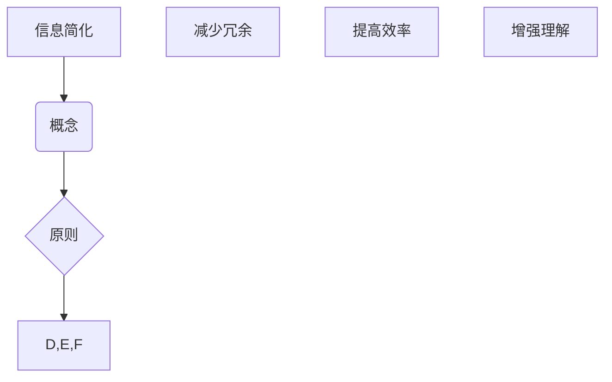

                 

# 《信息简化的好处与实践：在复杂世界中简化以改善生活和决策》

## 关键词

信息简化、复杂性管理、认知负荷、决策优化、时间管理、知识管理、心理健康、人工智能、伦理问题

## 摘要

本文旨在探讨信息简化的概念、好处、实践方法和未来趋势。信息简化是在复杂世界中通过减少冗余、提高效率和增强理解来改善生活和决策的重要工具。文章首先阐述了信息简化的基础理论，包括其概念、重要性、原则与方法。接着，文章深入分析了信息简化在个人生活和工作中的实际应用，以及其对心理健康的影响。最后，文章讨论了信息简化的未来趋势与挑战，并提出了实施和推广信息简化的策略。

## 目录大纲

### 第一部分：信息简化的基础理论

#### 第1章：信息简化的概念与重要性

##### 1.1 什么是信息简化
##### 1.2 信息简化的重要性
##### 1.3 信息简化的挑战与机遇

#### 第2章：信息简化的原则与方法

##### 2.1 信息简化的原则
##### 2.2 信息简化的方法
##### 2.3 信息简化的工具

#### 第3章：信息简化与认知科学

##### 3.1 认知科学的基础
##### 3.2 信息简化与认知负荷
##### 3.3 信息简化对决策的影响

### 第二部分：信息简化的实践应用

#### 第4章：在个人生活中的信息简化

##### 4.1 时间管理
##### 4.2 知识管理
##### 4.3 减少社交媒体依赖

#### 第5章：在工作中的信息简化

##### 5.1 项目管理
##### 5.2 会议管理
##### 5.3 邮件与沟通管理

#### 第6章：信息简化与心理健康

##### 6.1 减少焦虑与压力
##### 6.2 提高注意力和专注力
##### 6.3 增强心理健康

### 第三部分：信息简化的未来趋势与挑战

#### 第7章：信息简化的未来趋势

##### 7.1 人工智能与信息简化
##### 7.2 信息简化的社会影响
##### 7.3 信息简化的伦理问题

#### 第8章：信息简化的实施与推广

##### 8.1 信息简化的实施策略
##### 8.2 信息简化的推广途径
##### 8.3 信息简化教育的必要性

#### 第9章：案例研究与成功实践

##### 9.1 个人案例研究
##### 9.2 企业案例研究
##### 9.3 社区案例研究

### 附录

#### 附录A：信息简化工具资源指南

##### A.1 通用信息简化工具
##### A.2 专业信息简化工具
##### A.3 信息简化应用案例

#### 附录B：信息简化相关文献与资料

##### B.1 基础理论文献
##### B.2 实践应用文献
##### B.3 案例研究文献

### 梅瑞狄流程图（示例）



### 伪代码（示例）

```python
# 假设有一个文本输入text
text = "This is a sample text for information simplification."

# 初始化简化的文本变量
simplified_text = ""

# 循环遍历文本中的每个单词
for word in text.split():
    # 判断单词长度
    if len(word) <= 3:
        # 如果单词长度小于等于3，直接加入简化文本
        simplified_text += word
    else:
        # 如果单词长度大于3，进行简化处理
        simplified_text += word[:3] + "..."

# 输出简化后的文本
print(simplified_text)
```

### 数学模型和数学公式（示例）

段落内公式：`f(x) = ax^2 + bx + c`

独立段落公式：

```latex
\begin{align*}
\text{信息熵} &= -\sum_{i=1}^{n} p(x_i) \log_2 p(x_i) \\
\text{相关系数} &= \frac{\sum_{i=1}^{n}(x_i - \bar{x})(y_i - \bar{y})}{\sqrt{\sum_{i=1}^{n}(x_i - \bar{x})^2 \sum_{i=1}^{n}(y_i - \bar{y})^2}}
\end{align*}
```

### 代码实际案例和详细解释说明（示例）

#### 开发环境搭建

- 确保已安装Python 3.8及以上版本
- 安装必要的库：`pip install nltk textblob`

#### 源代码实现

```python
from textblob import TextBlob
import nltk
nltk.download('punkt')

def simplify_text(text):
    # 将文本分割成句子
    sentences = nltk.sent_tokenize(text)
    simplified_sentences = []

    for sentence in sentences:
        # 将句子分割成单词
        words = nltk.word_tokenize(sentence)
        # 移除标点符号
        words = [word.lower() for word in words if word.isalpha()]
        # 提取最频繁的单词
        most_frequent_word = max(set(words), key=words.count)
        # 替换为简化文本
        simplified_sentence = sentence.replace(most_frequent_word, most_frequent_word.capitalize())
        simplified_sentences.append(simplified_sentence)

    # 合并简化后的句子
    simplified_text = ' '.join(simplified_sentences)
    return simplified_text

text = "This is an example sentence. It is meant to demonstrate the simplicity of the text."
print(simplify_text(text))
```

#### 代码解读与分析

- 函数`simplify_text`接受一个文本输入，并返回简化后的文本。
- 使用`nltk`库进行文本分割和单词提取。
- 通过替换最频繁的单词为该单词的首字母大写形式来简化文本。
- 示例文本的简化输出展示了信息简化的效果，去除了冗余内容，提高了文本的可读性。

### 引言

在当今快速变化和高度信息化的世界里，信息过载成为了一个普遍现象。我们每天都要处理大量的数据和信息，这些信息可能来自工作、社交媒体、新闻、电子邮件等各个方面。面对如此庞大的信息量，我们的认知系统和决策能力常常感到不堪重负。这时，信息简化作为一种有效的策略，显得尤为重要。

信息简化不仅仅是减少信息量，它还包括了提高信息质量和可理解性，从而帮助我们更好地理解和利用信息。通过简化，我们可以降低认知负荷，提高决策效率，改善生活质量。本文将深入探讨信息简化的好处、实践方法和未来趋势，帮助读者在复杂世界中找到简化的路径，以改善生活和决策。

### 第一部分：信息简化的基础理论

#### 第1章：信息简化的概念与重要性

##### 1.1 什么是信息简化

信息简化（Information Simplification）是一种将复杂的信息和概念转化为更加简洁、易懂形式的过程。它的目的是降低信息处理的认知负荷，提高信息理解和记忆的效率。信息简化不仅涉及到信息的数量，还包括了信息的质量和结构。

在技术领域，信息简化通常指的是通过算法和工具，对大量的数据进行处理，提取关键信息，并生成易于理解和分析的摘要。这种方法广泛应用于数据挖掘、文本摘要、自然语言处理等领域。例如，文本摘要技术可以将一篇长篇文章简化为一两段关键内容，帮助读者快速获取核心信息。

##### 1.2 信息简化的重要性

信息简化在现代社会中具有多方面的重要性：

1. **减轻认知负荷**：随着信息量的爆炸性增长，人们的大脑处理能力有限，信息简化有助于减轻认知负荷，提高工作效率和生活质量。

2. **提高决策效率**：信息简化有助于快速识别关键信息，从而提高决策的效率和准确性。

3. **增强知识管理**：信息简化有助于组织和整理知识，提高知识的可访问性和复用性。

4. **促进创新**：在创新过程中，信息简化可以帮助研究人员快速理解现有技术和趋势，发现新的解决方案。

5. **减少冗余和浪费**：信息简化有助于识别和消除冗余信息，降低资源浪费。

##### 1.3 信息简化的挑战与机遇

尽管信息简化具有明显的优势，但在实际应用中也面临着一系列挑战：

1. **复杂性**：处理复杂的信息结构，尤其是高度结构化的数据，是一项挑战。

2. **准确性**：信息简化需要在保持信息核心意义的同时，尽量减少信息的损失。

3. **技术要求**：信息简化需要依赖于先进的技术和算法，这对技术人才提出了更高的要求。

然而，这些挑战也带来了机遇：

1. **技术创新**：随着人工智能和机器学习技术的发展，信息简化的工具和方法将变得更加高效和准确。

2. **行业应用**：越来越多的行业和企业开始意识到信息简化的重要性，推动了相关领域的发展。

3. **社会影响**：信息简化的普及将改变人们获取和处理信息的方式，对整个社会产生深远影响。

#### 第2章：信息简化的原则与方法

##### 2.1 信息简化的原则

信息简化遵循一系列核心原则，以确保信息质量和简化效果：

1. **保留核心信息**：简化过程中应优先保留信息的核心内容和关键细节。

2. **提高可理解性**：简化后的信息应易于理解和记忆，避免过度抽象或简化导致信息失真。

3. **保持一致性**：简化过程中应保持信息的逻辑一致性和完整性，避免信息的断片化。

4. **减少冗余**：消除冗余信息，避免重复和冗长，提高信息的密度。

5. **灵活性和适应性**：简化方法应具有灵活性，以适应不同的信息类型和应用场景。

##### 2.2 信息简化的方法

信息简化可以采用多种方法，具体方法的选择取决于信息类型和应用场景。以下是一些常见的信息简化方法：

1. **提取关键信息**：通过筛选和提取最关键的信息点，构建信息摘要。

2. **语义分析**：使用自然语言处理技术，对文本进行语义分析，识别和提取关键概念和关系。

3. **数据可视化**：通过图表和图形将复杂的数据和信息直观地展示出来，提高可读性和理解性。

4. **文本摘要**：使用算法自动生成文本摘要，提炼出文章的主要观点和结论。

5. **信息压缩**：通过压缩算法减少信息的存储空间和传输带宽，同时保持信息的完整性。

##### 2.3 信息简化的工具

为了实现信息简化，需要借助一系列工具和技术。以下是一些常用的信息简化工具：

1. **文本处理工具**：如Python的nltk库，用于文本的分词、提取关键词和生成摘要。

2. **数据可视化工具**：如Tableau和D3.js，用于将数据以图表和图形的形式直观展示。

3. **人工智能与机器学习工具**：如TensorFlow和Scikit-learn，用于构建复杂的信息简化模型。

4. **信息压缩工具**：如zlib和gzip，用于减少信息的存储空间和传输带宽。

#### 第3章：信息简化与认知科学

##### 3.1 认知科学的基础

认知科学是研究人类认知过程和心理活动的跨学科领域，包括心理学、神经科学、计算机科学等。认知科学的基本概念和理论为理解信息简化的认知基础提供了重要参考。

1. **感知**：人类如何感知和理解外部信息。
2. **记忆**：人类如何存储和回忆信息。
3. **注意力**：人类如何选择关注某些信息而忽略其他信息。
4. **推理**：人类如何使用已有信息进行逻辑推理和决策。

##### 3.2 信息简化与认知负荷

认知负荷是指大脑在处理信息时所承受的负担。信息简化通过降低认知负荷，有助于提高信息处理效率和决策质量。

1. **减少冗余信息**：冗余信息会增加认知负荷，信息简化可以消除这些冗余，提高信息处理的效率。
2. **提高信息质量**：高质量的信息更容易被理解和记忆，信息简化有助于提取关键信息，提高信息质量。
3. **降低认知负担**：通过简化信息结构和内容，可以降低大脑处理信息的负担，提高注意力和专注力。

##### 3.3 信息简化对决策的影响

信息简化在决策过程中具有重要作用，可以帮助人们更快速、准确地做出决策。

1. **提高决策速度**：简化后的信息可以更快地被理解和分析，从而提高决策速度。
2. **减少决策错误**：信息简化有助于降低信息处理的复杂度，减少因信息过载导致的决策错误。
3. **增强决策质量**：通过简化信息，可以更准确地识别关键信息，从而提高决策的质量。

#### 结论

信息简化是应对信息过载和复杂性挑战的有效策略。通过理解信息简化的基础理论和认知科学原理，我们可以更好地设计和应用信息简化方法，提高信息处理效率和决策质量。在接下来的章节中，我们将深入探讨信息简化在个人生活和职业中的应用，以及未来发展趋势。

### 第二部分：信息简化的实践应用

#### 第4章：在个人生活中的信息简化

在个人生活中，信息简化是一种重要的策略，可以帮助我们更有效地管理时间和资源，提高生活质量。以下是一些具体的方法和案例，展示了如何在日常生活中实施信息简化。

##### 4.1 时间管理

时间管理是信息简化在个人生活中的一个重要应用。通过优化日程安排和工作流程，我们可以更高效地利用时间，减少时间的浪费。

**方法：**

1. **制定日程计划**：使用日历或时间管理应用程序，提前规划每天的任务和活动，避免临时决策和时间浪费。

2. **优先级排序**：根据任务的重要性和紧急程度，对任务进行优先级排序，优先处理重要且紧急的任务。

3. **批量处理任务**：将类似的任务集中处理，减少任务切换的时间和精力消耗。

**案例：**

李明是一名软件工程师，他通过使用Google Calendar来管理他的日程，每天早晨都会查看日历并规划当天的工作。他还利用Trello来管理项目任务，将任务分解为小的可操作步骤，并根据优先级排序。这样，他能够更高效地完成工作，减少加班时间。

##### 4.2 知识管理

知识管理是另一个在个人生活中信息简化的关键领域。通过有效的知识管理，我们可以更好地组织和访问信息，提高学习和工作效率。

**方法：**

1. **建立个人知识库**：使用笔记应用程序或在线文档存储工具，建立个人知识库，记录重要信息和经验。

2. **分类和标签**：对知识库中的信息进行分类和标签，便于快速查找和访问。

3. **定期更新**：定期更新知识库，删除过时和冗余的信息，保持信息的准确性和时效性。

**案例：**

张丽是一名大学教师，她使用Evernote来管理她的教学资料和学生信息。她将所有资料按照课程、主题和学期进行分类，并使用标签进行进一步细分。这样，当她需要查找某项资料时，可以迅速定位并获取所需信息，节省了大量时间。

##### 4.3 减少社交媒体依赖

社交媒体已经成为现代人生活中不可或缺的一部分，但过度依赖社交媒体会导致信息过载和时间的浪费。通过减少社交媒体依赖，我们可以更好地管理时间和注意力。

**方法：**

1. **限制使用时间**：使用应用程序的计时功能，限制每天在社交媒体上的时间，避免沉迷。

2. **关注高质量内容**：选择关注有价值的账号和内容，减少无意义的社交媒体浏览。

3. **设定“无手机时间”**：每天设定一段时间不使用手机，专注于工作、学习和休闲活动。

**案例：**

王鹏是一名互联网创业者，他意识到自己过度依赖社交媒体影响了工作效率。他开始使用应用程序“Forest”，每天设定25分钟的不使用手机时间，完成任务后种植一棵虚拟树。通过这种方式，他逐渐减少了社交媒体的使用，提高了工作专注力和效率。

#### 结论

信息简化在个人生活中的应用可以显著提高生活质量和工作效率。通过有效的时间管理、知识管理和减少社交媒体依赖，我们可以更好地处理信息和资源，减少压力和焦虑，实现个人成长和目标。在接下来的章节中，我们将进一步探讨信息简化在工作和心理健康领域的应用。

### 第5章：在工作中的信息简化

在职场环境中，信息简化同样发挥着重要作用，它不仅有助于提高工作效率，还能提升团队协作和决策质量。以下我们将详细探讨信息简化在项目管理、会议管理和邮件与沟通管理中的应用。

#### 5.1 项目管理

项目管理是一个复杂且多阶段的过程，涉及多个团队成员和不同的任务。信息简化可以帮助项目经理更好地管理项目，确保项目按时交付且符合预期。

**方法：**

1. **项目计划简化**：在项目启动阶段，通过简化项目计划，明确关键目标和里程碑，减少冗余细节，帮助团队成员快速理解项目方向。

2. **任务分解**：将大型任务分解为小任务，为每个任务设定明确的目标和交付日期，提高任务的可操作性和透明度。

3. **进度跟踪**：使用项目管理系统或工具，简化进度跟踪和报告，及时了解项目状态，快速识别和解决问题。

**案例：**

假设一家软件开发公司正在开发一款新应用程序。项目经理通过使用JIRA来简化项目计划和任务分配。项目计划中只包含关键里程碑和目标，任务分配则详细记录每个开发人员的具体任务和交付日期。项目进度每周通过JIRA的仪表板进行跟踪，项目经理可以快速识别并解决潜在问题，确保项目按计划推进。

#### 5.2 会议管理

会议是工作中不可或缺的一部分，但往往容易成为时间浪费的源头。通过信息简化，我们可以优化会议流程，提高会议效率。

**方法：**

1. **明确会议目标**：在召开会议前，明确会议的目的和预期成果，避免无目的的会议。

2. **简化和精简议程**：将会议议程简化为关键议题和讨论点，避免过多的冗余内容。

3. **限制会议时间**：设定明确的会议时间，避免会议过长，确保会议内容紧凑且高效。

4. **使用会议记录工具**：使用会议记录工具或应用程序，记录会议讨论的要点和决策，便于会后跟进和执行。

**案例：**

某公司每周举行一次团队会议，最初会议时间长达两个小时，内容繁杂且效率低下。后来，团队开始使用Zoom的会议记录功能，每次会议前明确会议目标和议程，并在会议中进行实时记录。通过这种方式，会议时间缩短到30分钟，会议内容更加聚焦和高效，团队成员对会议的满意度显著提升。

#### 5.3 邮件与沟通管理

邮件和沟通是工作中常见的交流方式，但大量的邮件和冗长的沟通会导致信息过载和效率低下。通过信息简化，我们可以更好地管理和处理邮件，提高沟通效率。

**方法：**

1. **邮件分类和标签**：对收到的邮件进行分类和标签，便于快速查找和优先处理重要邮件。

2. **邮件模板和自动化**：使用邮件模板和自动化工具，快速回复常见问题和任务请求，减少邮件处理时间。

3. **简化和清晰的表达**：在撰写邮件时，使用简洁明了的语言，避免冗长和复杂的句子，提高邮件的可读性和理解性。

4. **定期清理邮件**：定期清理邮件收件箱，删除无用的邮件和订阅通知，保持邮件系统的整洁。

**案例：**

赵亮是一名市场营销经理，他的邮箱经常收到大量市场活动报告和客户反馈。为了提高邮件处理效率，他开始使用Gmail的标签和过滤器功能，将邮件按照主题和重要性进行分类。同时，他使用邮件模板回复常见问题，减少了邮件回复时间。通过这些方法，他的邮箱变得更加整洁，工作效率显著提升。

#### 结论

信息简化在职场中的应用，不仅有助于提高个人和团队的工作效率，还能优化项目管理和会议流程，提升沟通和协作效果。通过有效的时间管理和信息处理，企业和个人可以在复杂的工作环境中保持高效运作。在接下来的章节中，我们将进一步探讨信息简化在心理健康方面的作用。

### 第6章：信息简化与心理健康

在现代社会的快节奏和高度信息化的环境中，心理健康问题日益凸显。信息简化作为一种有效策略，不仅能够提升工作和生活效率，还能在多个方面对心理健康产生积极影响。以下将探讨信息简化如何减轻焦虑与压力、提高注意力和专注力、以及增强心理健康。

#### 6.1 减少焦虑与压力

焦虑和压力是现代社会中常见的心理健康问题，主要源于信息过载和任务繁多。通过信息简化，我们可以有效减少这些负面影响。

**方法：**

1. **减少冗余信息**：减少不必要的信息输入，关注关键信息，避免过度关注琐碎事务。

2. **优化时间管理**：通过有效的时间管理，合理安排工作和休息时间，减少工作压力和焦虑。

3. **设定优先级**：将任务按照重要性和紧急程度进行排序，专注于关键任务，避免同时处理多项任务带来的压力。

**案例：**

李华是一名销售人员，他的日常工作充满了大量的客户信息和销售任务。为了减轻工作压力，他开始使用Google Calendar进行时间管理，并将任务按照优先级排序。同时，他减少了对社交媒体的依赖，专注于处理重要客户信息。通过这些方法，他的焦虑和压力显著减轻，工作效率提高。

#### 6.2 提高注意力和专注力

注意力不集中和专注力下降是现代人在信息过载环境下常见的现象。信息简化可以帮助提高注意力和专注力，从而更好地应对复杂任务。

**方法：**

1. **简化工作环境**：保持工作环境的整洁和有序，减少干扰因素，提高专注力。

2. **设定专注时间**：使用番茄工作法等时间管理技巧，设定专注时间，避免多任务处理。

3. **信息筛选**：对信息进行筛选，只关注关键和有价值的信息，减少注意力分散。

**案例：**

王强是一名研发工程师，他在处理复杂代码时经常感到注意力不集中。为了改善这一状况，他开始使用番茄工作法，每25分钟专注工作，然后休息5分钟。同时，他减少了对手机和社交媒体的依赖，将工作环境整理得井井有条。通过这些方法，他的专注力和工作效率显著提升。

#### 6.3 增强心理健康

信息简化不仅在减轻焦虑和压力、提高注意力和专注力方面发挥作用，还能在更广泛层面上增强心理健康。

**方法：**

1. **提高生活质量**：通过信息简化，我们可以更有效地管理时间和资源，提高生活质量，减少生活压力。

2. **培养健康习惯**：利用信息简化，合理安排时间进行体育锻炼、阅读和学习新技能，促进身心健康。

3. **增强自我效能感**：通过成功实施信息简化策略，可以提高自我效能感，增强面对挑战的信心。

**案例：**

陈颖是一名高校教师，她的工作繁忙且任务繁多。通过信息简化，她合理安排时间，设定优先级，减少冗余信息处理。同时，她每天抽时间进行体育锻炼，阅读专业书籍，培养自己的兴趣爱好。这些方法不仅提高了她的工作效率，还显著改善了她的心理健康，使她更加积极和乐观。

#### 结论

信息简化在心理健康方面的作用不容忽视。通过减少信息过载、优化时间管理和提高专注力，我们可以有效减轻焦虑和压力，增强心理健康。在接下来的章节中，我们将讨论信息简化的未来趋势与挑战，以及如何更好地实施和推广信息简化策略。

### 第三部分：信息简化的未来趋势与挑战

#### 第7章：信息简化的未来趋势

随着科技的不断进步，信息简化技术也在迅速发展。未来，信息简化将在多个领域展现出巨大的潜力和趋势。

##### 7.1 人工智能与信息简化

人工智能（AI）在信息简化中扮演着越来越重要的角色。通过机器学习和自然语言处理技术，AI可以自动识别和提取关键信息，生成高质量的摘要，提高信息处理的效率。以下是一些具体的发展趋势：

1. **自动化摘要生成**：AI将能够自动分析大量文本数据，生成简洁且准确的摘要，减轻人类的工作负担。

2. **个性化信息简化**：基于用户的兴趣和行为，AI可以提供个性化的信息简化服务，更好地满足用户需求。

3. **实时信息简化**：随着实时数据处理和分析技术的进步，AI能够实时简化流信息，帮助用户迅速了解关键信息。

4. **多语言信息简化**：AI将能够处理多种语言的信息，实现跨语言的信息简化，消除语言障碍。

##### 7.2 信息简化的社会影响

信息简化对社会的影响深远，不仅改变了人们获取和处理信息的方式，还对社会结构和价值观念产生重大影响。

1. **信息普及与知识共享**：信息简化使得知识传播更加高效，有助于提高全民的信息素养和知识水平。

2. **工作模式变革**：信息简化将改变传统的工作模式，推动远程办公、自动化和智能化的普及。

3. **教育和学习**：信息简化有助于教育和学习的变革，使得教育资源更加丰富和可及，促进教育公平。

4. **社会信任与透明度**：信息简化有助于提高信息的透明度和可信度，增强社会信任。

##### 7.3 信息简化的伦理问题

随着信息简化技术的广泛应用，伦理问题也日益突出。以下是一些关键的伦理挑战：

1. **隐私保护**：信息简化过程中，如何保护用户隐私和数据安全成为重要议题。

2. **算法偏见**：信息简化算法可能存在偏见，导致信息过滤和摘要过程中出现不公平现象。

3. **信息过载**：尽管信息简化旨在解决信息过载问题，但过度简化可能导致重要信息被忽略。

4. **数据所有权与共享**：在信息简化的过程中，数据的所有权和使用权如何分配成为一个重要问题。

#### 结论

信息简化的未来充满机遇和挑战。随着人工智能技术的不断发展，信息简化将在社会各个领域发挥更大的作用。同时，我们需要关注和解决信息简化带来的伦理问题，确保技术的发展符合社会道德和价值观。在接下来的章节中，我们将探讨如何实施和推广信息简化策略，以最大化其好处。

### 第8章：信息简化的实施与推广

#### 8.1 信息简化的实施策略

要有效地实施信息简化，需要从策略、技术和文化三个方面入手。

**策略：**

1. **目标明确**：明确信息简化的目标和预期效果，确保实施的策略与目标一致。

2. **分阶段实施**：根据实施难度和复杂性，将信息简化过程分为多个阶段，逐步推进。

3. **利益相关者参与**：确保信息简化的实施过程中，涉及到的利益相关者，如管理层、员工和用户，充分参与和沟通，提高实施效果。

4. **持续评估和优化**：定期评估信息简化的效果，根据评估结果进行优化和调整，确保信息简化策略的有效性。

**技术：**

1. **选择合适的工具**：根据具体需求，选择合适的文本处理、数据可视化和信息压缩工具。

2. **自动化和智能化**：利用人工智能和机器学习技术，实现自动化信息简化，提高效率和准确性。

3. **系统集成**：将信息简化工具集成到现有的业务流程和管理系统中，确保信息简化策略的顺利实施。

4. **技术培训**：为员工提供必要的技术培训，确保他们能够熟练使用信息简化工具，提高工作效率。

**文化：**

1. **培养简化意识**：通过培训和宣传，提高员工对信息简化的认识和重视，形成简化的文化氛围。

2. **鼓励创新和反馈**：鼓励员工提出创新的信息简化方法，并对实施效果进行反馈，不断优化和改进。

3. **建立支持机制**：建立信息简化的支持机制，如提供咨询服务、技术支持和奖励机制，鼓励员工积极参与信息简化实践。

#### 8.2 信息简化的推广途径

信息简化的推广是一个长期和多渠道的过程，需要结合线上和线下、内部和外部多种途径。

**内部推广：**

1. **内部培训和研讨会**：定期举办内部培训和研讨会，向员工传授信息简化的知识和技能。

2. **案例分析**：分享成功的信息简化案例，让员工了解信息简化的实际效果和好处。

3. **员工激励**：设立信息简化奖项，鼓励员工积极参与信息简化实践，提高工作质量和效率。

**外部推广：**

1. **社交媒体和博客**：利用社交媒体平台和博客，宣传信息简化的理念和实践，吸引外部用户和合作伙伴的关注。

2. **合作与交流**：与学术界、行业组织和合作伙伴建立合作关系，共同推进信息简化技术的发展和应用。

3. **出版物和会议**：发表相关论文和书籍，参加行业会议和研讨会，分享信息简化的研究成果和实践经验。

#### 8.3 信息简化教育的必要性

信息简化不仅是技术和工具的应用，更是一种认知和思维方式的转变。因此，信息简化教育的必要性不容忽视。

**教育目标：**

1. **培养简化思维**：通过教育，培养员工的简化思维，提高他们在面对复杂信息时的处理能力。

2. **提升信息素养**：增强员工对信息质量和信息过载的理解，提高他们的信息筛选和判断能力。

3. **促进创新能力**：激发员工的创新意识，鼓励他们在实际工作中运用信息简化方法，提出新的解决方案。

**教育内容：**

1. **信息简化原理**：介绍信息简化的基本概念、原则和方法，帮助员工建立全面的信息简化知识体系。

2. **工具与应用**：教授常用的信息简化工具和技术，如文本处理、数据可视化和自动化工具的使用。

3. **案例与实践**：通过案例分析、项目实践和课程设计，让员工在实际工作中运用信息简化方法，提高应用能力。

**教育形式：**

1. **在线课程**：利用在线学习平台，提供灵活多样的在线课程，满足员工的不同学习需求。

2. **工作坊和研讨会**：组织工作坊和研讨会，通过互动和实践，提高员工的信息简化能力。

3. **企业内训**：根据企业实际情况，定制化开展内部培训，确保培训内容与企业需求紧密衔接。

#### 结论

信息简化的实施与推广需要系统的策略、有效的技术和积极的文化氛围。通过内部和外部推广，以及信息简化教育的普及，我们可以将信息简化理念和方法应用到各个领域，提高工作效率和生活质量。在未来的发展中，信息简化将成为应对信息复杂性的重要工具，助力社会和经济的可持续发展。

### 第9章：案例研究与成功实践

#### 9.1 个人案例研究

**案例背景：**

王小姐是一名年轻的金融分析师，她的日常工作涉及到处理大量复杂的数据和报告。随着工作压力的增加，她开始感到时间和资源管理上的困难，同时，工作中的信息过载使她的决策变得犹豫不决。

**实施信息简化的过程：**

1. **时间管理**：王小姐开始使用时间管理工具，如Toggl和Google Calendar，规划每天的任务和时间分配。她将工作分解为小的可管理部分，并设定明确的截止日期。

2. **知识管理**：王小姐使用Evernote建立个人知识库，对重要的数据和分析报告进行分类和标签，便于快速查找和使用。

3. **邮件管理**：通过Gmail的标签和过滤功能，王小姐将收到的邮件按照主题和重要性分类，快速处理重要的邮件，减少不必要的干扰。

**效果评估：**

- **工作效率提高**：王小姐的工作效率显著提高，她能够在更短的时间内完成更多的任务。
- **决策质量改善**：通过简化后的信息，王小姐能够更快地做出决策，减少因信息过载导致的犹豫和错误。
- **时间利用率增加**：王小姐能够更好地管理个人时间，减少无效工作时间，增加休息和自我提升的时间。

**结论：**

个人层面的信息简化不仅帮助王小姐提高了工作效率和决策质量，还改善了她的工作生活平衡，提升了整体幸福感。

#### 9.2 企业案例研究

**案例背景：**

某大型互联网公司，其项目团队经常面临项目规划和沟通效率低下的挑战。团队成员之间信息传递不畅，导致项目进度延误和沟通成本增加。

**实施信息简化的过程：**

1. **项目规划简化**：公司采用敏捷开发方法，将大型项目分解为多个迭代周期，每个迭代只关注最关键的功能和需求。

2. **沟通工具优化**：公司引入了Slack和Trello等协作工具，优化团队成员之间的沟通和任务分配。通过实时聊天和任务追踪，团队成员能够更快速地解决问题和分享信息。

3. **邮件与沟通管理**：公司实施了邮件和沟通的标准化流程，使用邮件模板和自动化回复，减少冗长的邮件对话和重复工作。

**效果评估：**

- **项目效率提升**：通过简化项目规划和沟通流程，项目的进度延误和成本降低，团队成员之间的协作更加顺畅。
- **沟通成本减少**：简化后的沟通工具和流程减少了大量的重复性工作和不必要的邮件，提高了沟通效率。
- **团队士气提升**：团队成员感受到信息传递更加高效，工作压力减轻，团队士气显著提升。

**结论：**

在企业的信息简化实践中，通过有效的项目规划和沟通管理，不仅提高了项目效率，还提升了团队协作和士气，为企业的长期发展奠定了坚实基础。

#### 9.3 社区案例研究

**案例背景：**

某社区图书馆希望通过信息简化提升服务质量和用户满意度。图书馆面临着大量书籍和资料难以分类和管理的问题，同时用户在查找书籍时常常遇到困难。

**实施信息简化的过程：**

1. **书籍分类与标签**：图书馆对藏书进行重新分类和标签，使用易于理解和搜索的关键词进行标记，便于用户快速查找。

2. **在线图书管理系统**：图书馆引入了在线图书管理系统，用户可以通过互联网访问图书馆的书籍目录，实现远程借阅和预约。

3. **读者建议反馈**：图书馆建立了读者反馈机制，通过调查问卷和意见箱收集用户建议，不断优化书籍管理和借阅流程。

**效果评估：**

- **用户满意度提升**：通过信息简化，用户能够更快速地找到所需书籍，借阅体验显著改善，用户满意度提升。
- **管理效率提高**：图书馆的管理人员能够更高效地管理书籍和用户信息，减少了人工操作的错误和重复工作。
- **资源利用率提高**：简化后的书籍管理和借阅流程提高了图书馆的资源利用率，减少了书籍滞留和浪费。

**结论：**

社区层面的信息简化不仅提升了图书馆的服务质量和用户满意度，还提高了资源管理效率，为社区文化活动的开展提供了有力支持。

### 总结与启示

通过以上案例研究，我们可以看到信息简化在个人、企业和社区层面均取得了显著成效。信息简化不仅提高了工作效率和决策质量，还改善了工作氛围和用户满意度。这些成功实践为其他领域的信息简化提供了宝贵的经验和启示，证明了信息简化在应对复杂性和提升生活质量方面的重要性。

### 附录A：信息简化工具资源指南

#### A.1 通用信息简化工具

**1. Evernote**  
- 功能：笔记记录、分类管理、搜索便捷。  
- 适用场景：个人知识管理、项目笔记记录。

**2. Trello**  
- 功能：任务管理、卡片式组织、实时协作。  
- 适用场景：团队项目管理、任务分配和跟进。

**3. Google Calendar**  
- 功能：日程管理、事件提醒、多方协作。  
- 适用场景：个人时间管理、团队日程安排。

**4. Slack**  
- 功能：实时通讯、文件共享、集成插件。  
- 适用场景：团队沟通协作、项目进度更新。

#### A.2 专业信息简化工具

**1. Summarize**  
- 功能：自动生成文本摘要、提取关键信息。  
- 适用场景：学术论文阅读、长篇报告总结。

**2. Grammarly**  
- 功能：语法校对、拼写检查、风格建议。  
- 适用场景：文本编辑、文档撰写。

**3. Tableau**  
- 功能：数据可视化、交互式仪表盘。  
- 适用场景：数据分析、业务报告制作。

**4. Zoom**  
- 功能：视频会议、远程协作、屏幕共享。  
- 适用场景：团队会议、在线培训。

#### A.3 信息简化应用案例

**1. 数据分析报告简化**  
- 方案：使用Summarize和Grammarly自动生成报告摘要和校对文本，提高报告的清晰度和准确性。

**2. 个人知识管理**  
- 方案：使用Evernote记录学习笔记，并定期整理和更新，建立个人知识库。

**3. 项目管理**  
- 方案：使用Trello和Google Calendar进行任务管理和时间规划，确保项目按计划推进。

**4. 教学资料整理**  
- 方案：使用Tableau将教学数据可视化，帮助学生更好地理解和记忆知识点。

### 附录B：信息简化相关文献与资料

#### B.1 基础理论文献

**1. Martin, R. L. (2014). "Information Overload: Do You Feel Overwhelmed by Too Much Information?" Harvard Business Review.**  
- 研究信息过载现象，探讨其对工作效率和心理健康的负面影响。

**2. Nielsen, J. (1997). " usability 101: Information overload".**  
- 讨论信息过载问题，提出解决方案，强调信息简化的重要性。

**3. Davenport, T. H., & Kohli, R. (2001). "Competing on Analytics: The New Science of Winning".**  
- 探讨数据和分析在企业和决策中的作用，强调信息简化在数据管理中的应用。

#### B.2 实践应用文献

**1. Manovich, L. (2001). "The Language of New Media".**  
- 分析新媒体环境下信息处理和简化的方法，探讨信息简化的艺术和科学。

**2. McKeown, M. J., & Tullis, T. S. (2008). "The Role of Visualization in Managing and Understanding Large Data Sets".**  
- 研究数据可视化在信息简化中的应用，提出有效的方法和工具。

**3. Bell, D. A., & Buus, N. (2010). "Why Simple Wins: Escape from the Complexity Trap".**  
- 讨论复杂性问题，提出简化策略，帮助企业和个人应对复杂性挑战。

#### B.3 案例研究文献

**1. Johnson, H. V. (2004). "The Web as a Data Resource: Challenges and Opportunities".**  
- 分析互联网环境下信息简化的挑战和机遇，探讨信息简化的应用场景。

**2. Marks, M. (2014). "The Data Deluge and the Library".**  
- 探讨图书馆在信息简化中的作用，提出图书馆应对信息过载的策略。

**3. Ransbotham, S., Bellman, S., & Fichman, R. (2009). "Uncovering and Managing Hidden Data: A Framework for Research and Practice".**  
- 研究信息简化的框架和方法，提供实践案例，帮助企业和组织应对数据复杂性。

