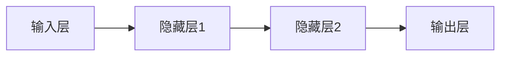
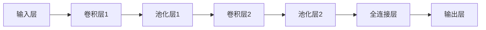
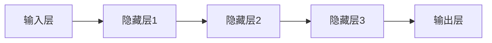
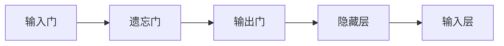
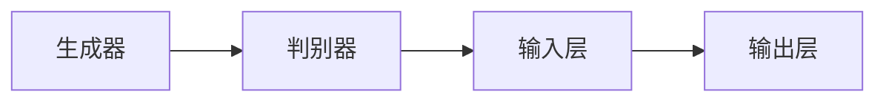
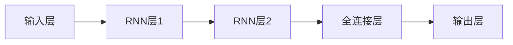

                 

# 健身教练2.0：提示词定制科学运动方案

## 关键词

- 人工智能
- 健身教练
- 个性化定制
- 大数据分析
- 深度学习
- 个性化运动方案

## 摘要

本文将深入探讨健身教练2.0的核心概念、技术架构、实现方法以及在实际应用中的效果评估。通过融合人工智能、大数据分析和个性化定制技术，健身教练2.0旨在为用户提供科学、高效的健身指导。本文将详细分析其核心技术，包括深度学习算法在运动动作识别和轨迹预测中的应用，以及特征工程和数据分析方法。同时，还将探讨健身教练2.0在不同应用场景中的实际效果，并提供一个完整的项目实战案例，包括开发环境搭建、源代码实现和代码解读。

## 引言

随着科技的飞速发展，人工智能、大数据和物联网等技术逐渐渗透到各个领域，为传统行业带来了前所未有的变革。在健身领域，传统的健身教练服务已经不能满足人们对个性化、科学化和高效化的需求。因此，健身教练2.0的概念应运而生。健身教练2.0是一种基于人工智能、大数据分析和个性化定制的智能健身指导服务，它通过收集和分析用户的数据，为用户提供量身定制的健身方案，从而实现更科学的健身指导。

### 一、传统健身教练的局限性

传统健身教练主要通过面对面的指导方式，帮助用户制定和执行健身计划。然而，这种模式存在以下局限性：

1. **个性化不足**：传统健身教练通常根据一般性的健身原则来指导用户，难以满足每个用户的个性化需求。
2. **效率低下**：传统健身教练需要耗费大量时间和精力来跟踪用户的进度和效果，难以实现高效的服务。
3. **反馈滞后**：传统健身教练的反馈通常滞后，无法及时调整用户的健身方案。

### 二、健身教练2.0的优势

健身教练2.0通过引入人工智能、大数据分析和个性化定制技术，克服了传统健身教练的局限性，具有以下优势：

1. **个性化定制**：健身教练2.0可以根据用户的身体状况、健身目标和生活习惯，为用户制定个性化的健身方案。
2. **高效智能**：通过大数据分析和人工智能算法，健身教练2.0可以实时分析用户的运动数据，提供实时反馈和调整建议。
3. **实时监控**：健身教练2.0可以实时监控用户的运动状态，确保用户在安全、有效的范围内进行健身。

### 三、本文内容安排

本文将分为三个主要部分：

1. **核心概念与原理**：介绍健身教练2.0的核心概念、技术架构和实现方法。
2. **核心算法原理与实现**：详细讲解深度学习在健身教练2.0中的应用，包括运动动作识别和轨迹预测。
3. **实际应用与效果评估**：分析健身教练2.0在不同应用场景中的效果，并提供一个实际项目案例。

通过本文的阅读，读者将全面了解健身教练2.0的工作原理和应用价值，为后续的实践和应用奠定基础。

## 第一部分：健身教练2.0的核心概念与原理

### 第1章：健身教练2.0概述

#### 1.1 健身教练2.0的定义与背景

##### 1.1.1 健身教练2.0的定义

健身教练2.0是一种基于人工智能、大数据分析和个性化定制的智能健身指导服务。它通过收集用户的数据，利用先进的技术手段分析用户的身体状况、健身目标和生活习惯，为用户提供个性化的健身方案。

##### 1.1.2 健身教练2.0的背景

随着科技的发展，人们越来越重视健康生活方式。然而，传统的健身教练服务往往存在个性化不足、效率低下和反馈滞后等问题。为了解决这些问题，健身教练2.0应运而生。

#### 1.2 健身教练2.0的核心技术

##### 1.2.1 人工智能

人工智能技术在健身教练2.0中扮演着关键角色。通过机器学习和深度学习算法，健身教练2.0可以自动分析和处理用户数据，提供智能化的健身指导。

##### 1.2.2 大数据分析

大数据分析是健身教练2.0的重要工具。通过对海量用户数据的分析，健身教练2.0可以识别出用户的运动规律、健康趋势和潜在风险，为用户提供个性化的健身方案。

##### 1.2.3 个性化定制

个性化定制是健身教练2.0的核心优势。根据用户的身体状况、健身目标和生活习惯，健身教练2.0可以为用户制定量身定制的健身方案，确保用户能够安全、有效地进行健身。

#### 1.3 健身教练2.0的发展趋势

##### 1.3.1 技术进步

随着人工智能、大数据分析和物联网技术的不断发展，健身教练2.0的智能化水平将不断提高，为用户提供更精准、更高效的健身指导。

##### 1.3.2 行业应用拓展

健身教练2.0将在家庭健身、商务健身、医院康复等领域得到广泛应用，成为提升健康生活品质的重要工具。

### 第2章：健身教练2.0的技术架构与实现

#### 2.1 健身教练2.0的技术架构

##### 2.1.1 数据采集模块

数据采集模块负责收集用户的运动数据，如心率、运动时间、运动类型等。这些数据通过智能穿戴设备、手机应用等渠道实时传输到服务器。

##### 2.1.2 数据分析模块

数据分析模块负责对用户数据进行处理和分析，包括数据清洗、数据转换和特征工程等。通过这些处理，可以提取出有用的信息，为后续的个性化定制提供支持。

##### 2.1.3 个性化定制模块

个性化定制模块根据用户的数据和健身目标，利用大数据分析和人工智能算法，生成个性化的健身方案。这些方案包括运动计划、饮食建议等。

##### 2.1.4 运动监控模块

运动监控模块负责实时监控用户的运动状态，包括心率、运动轨迹等。通过这些监控数据，可以实时调整健身方案，确保用户在安全、有效的范围内进行健身。

#### 2.2 健身教练2.0的实现方法

##### 2.2.1 人工智能算法

健身教练2.0中采用的人工智能算法主要包括深度学习算法和机器学习算法。深度学习算法如卷积神经网络（CNN）和循环神经网络（RNN）在运动动作识别和轨迹预测中发挥着重要作用。机器学习算法如决策树、支持向量机（SVM）等则在特征选择和模型评估中起到关键作用。

##### 2.2.2 大数据处理

健身教练2.0需要处理海量用户数据，因此大数据处理技术如Hadoop、Spark等是必不可少的。这些技术可以高效地处理和存储数据，为后续的数据分析和个性化定制提供支持。

##### 2.2.3 物联网技术

物联网技术是健身教练2.0的重要组成部分。通过智能穿戴设备和手机应用，可以实时收集用户的运动数据，并通过无线网络传输到服务器。这些数据是实现个性化定制和运动监控的基础。

### 第3章：个性化运动方案的设计与实施

#### 3.1 个性化运动方案的设计原则

##### 3.1.1 科学性

个性化运动方案的设计必须遵循运动生理学、运动心理学等科学原理，确保方案的科学性。

##### 3.1.2 针对性

个性化运动方案应根据用户的身体状况、健身目标和生活习惯等量身定制，确保方案的针对性。

##### 3.1.3 可操作性

个性化运动方案应简单易行，便于用户坚持，确保方案的可操作性。

#### 3.2 个性化运动方案的设计流程

##### 3.2.1 需求分析

在制定个性化运动方案之前，首先需要收集用户的基本信息、健身目标和生活习惯等，明确方案的设计需求。

##### 3.2.2 数据采集

通过智能穿戴设备和手机应用等渠道，收集用户的运动数据，如心率、运动时间、运动类型等。

##### 3.2.3 数据分析

对采集到的用户数据进行处理和分析，提取有用的信息，为个性化定制提供支持。

##### 3.2.4 方案制定

根据用户的需求和数据分析结果，制定个性化的运动方案，包括运动计划、饮食建议等。

##### 3.2.5 方案优化

根据用户的反馈和运动效果，不断优化运动方案，确保方案的持续有效性。

### 第4章：健身教练2.0的核心算法原理与实现

#### 4.1 深度学习在健身教练2.0中的应用

##### 4.1.1 神经网络基础

神经网络是深度学习的基础，它由多个神经元组成，通过前向传播和反向传播进行信息处理。以下是神经网络的基本架构：



##### 4.1.2 卷积神经网络（CNN）

卷积神经网络（CNN）在图像处理和运动动作识别中具有广泛的应用。以下是CNN的基本架构：



##### 4.1.3 循环神经网络（RNN）

循环神经网络（RNN）在序列数据处理和运动轨迹预测中具有优势。以下是RNN的基本架构：



##### 4.1.4 长短期记忆（LSTM）

长短期记忆（LSTM）是RNN的一种改进，它能够有效地处理长序列数据。以下是LSTM的基本架构：



#### 4.2 数据分析算法

##### 4.2.1 聚类分析

聚类分析是一种无监督学习方法，它将相似的数据点分组在一起。常见的聚类算法包括K-means、层次聚类等。

##### 4.2.2 关联规则分析

关联规则分析是一种挖掘数据关联性的方法，它能够发现数据之间的潜在关系。常见的算法包括Apriori算法、FP-growth算法等。

##### 4.2.3 分类与回归分析

分类与回归分析是一种有监督学习方法，它用于预测新数据的类别或数值。常见的算法包括决策树、支持向量机（SVM）等。

### 第5章：健身教练2.0在实际应用中的案例分析

#### 5.1 案例背景

某公司开发了一款名为“健身教练2.0”的智能健身应用，旨在为用户提供个性化、科学的健身指导。

#### 5.2 应用场景

- **用户注册**：用户通过手机应用注册账号，填写个人信息和健身目标。
- **数据采集**：用户佩戴智能手环，实时记录心率、运动时间、运动类型等数据。
- **数据分析**：应用后台对用户数据进行分析，生成健身建议。
- **方案制定**：根据用户数据和健身目标，制定个性化的运动方案。
- **运动监控**：实时监控用户运动状态，提供实时反馈和调整建议。
- **效果评估**：定期评估用户运动效果，调整运动方案。

#### 5.3 应用效果

通过实际应用，健身教练2.0帮助用户实现了以下效果：

- **提高运动效率**：根据用户数据和健身目标，提供个性化的运动方案，提高了用户的运动效率。
- **增强运动体验**：实时反馈和调整建议，让用户在运动过程中感受到科学指导，增强了运动体验。
- **促进健身成果**：持续优化运动方案，帮助用户实现健身目标，促进了健身成果。

### 第6章：健身教练2.0的未来发展趋势

#### 6.1 技术进步带来的变革

- **人工智能**：随着人工智能技术的不断发展，健身教练2.0的智能化水平将不断提高。
- **大数据分析**：大数据分析技术的进步将使健身教练2.0能更精准地了解用户需求，提供更个性化的服务。
- **物联网**：物联网技术的普及将实现更多运动数据的实时采集和分析，为健身教练2.0提供更全面的用户画像。

#### 6.2 行业应用的拓展

- **健身房管理**：健身教练2.0将有助于提升健身房的管理水平，提高客户满意度。
- **运动康复**：结合健身教练2.0的技术优势，为运动康复领域提供更科学的康复方案。
- **健康管理**：健身教练2.0将在健康管理领域发挥重要作用，助力用户实现健康生活方式。

## 第二部分：健身教练2.0的核心算法原理与实现

### 第7章：深度学习在健身教练2.0中的应用

#### 7.1 深度学习基础

##### 7.1.1 神经网络

神经网络是由多个神经元组成的计算模型，通过前向传播和反向传播进行信息处理。以下是神经网络的基本架构：


每个神经元都有多个输入和输出，通过权重和偏置进行连接。神经元的激活函数通常为Sigmoid函数或ReLU函数。

##### 7.1.2 深度学习模型

深度学习模型包括卷积神经网络（CNN）、循环神经网络（RNN）、生成对抗网络（GAN）等，它们在处理复杂数据方面具有显著优势。

- **卷积神经网络（CNN）**：CNN主要用于图像处理和运动动作识别。它通过卷积操作提取图像特征，并通过池化操作减少参数数量。


- **循环神经网络（RNN）**：RNN主要用于序列数据处理和运动轨迹预测。它通过循环连接实现信息的记忆和传递。


- **生成对抗网络（GAN）**：GAN主要用于数据生成和图像生成。它由生成器和判别器组成，通过对抗训练生成逼真的数据。



#### 7.2 健身教练2.0的深度学习应用

##### 7.2.1 运动动作识别

运动动作识别是健身教练2.0的重要功能之一。通过深度学习模型，可以实现对用户运动动作的实时识别。

- **数据集**：使用公开的运动动作数据集，如UWYD（University of Washington Yoga Dataset）进行训练和测试。

- **模型架构**：采用CNN模型进行运动动作识别，包括卷积层、池化层和全连接层。


- **训练过程**：使用交叉熵损失函数和反向传播算法进行模型训练，调整模型参数以最小化损失函数。

- **评估指标**：使用准确率、召回率和F1分数等指标评估模型性能。

##### 7.2.2 运动轨迹预测

运动轨迹预测是健身教练2.0的另一个重要功能。通过深度学习模型，可以预测用户的运动轨迹。

- **数据集**：使用公开的运动轨迹数据集，如UWYD进行训练和测试。

- **模型架构**：采用RNN模型进行运动轨迹预测，包括RNN层和全连接层。



- **训练过程**：使用均方误差（MSE）损失函数和反向传播算法进行模型训练，调整模型参数以最小化损失函数。

- **评估指标**：使用均方误差（MSE）和平均绝对误差（MAE）等指标评估模型性能。

##### 7.2.3 个性化运动方案生成

个性化运动方案生成是健身教练2.0的核心功能之一。通过深度学习模型，可以生成个性化的运动方案。

- **数据集**：使用用户数据集，包括身体状况、健身目标和生活习惯等。

- **模型架构**：采用生成对抗网络（GAN）进行个性化运动方案生成。


- **训练过程**：使用对抗训练进行模型训练，生成器和判别器相互对抗以最大化生成器的性能。

- **评估指标**：使用生成方案的多样性和合理性等指标评估模型性能。

### 第8章：健身教练2.0中的数据分析方法

#### 8.1 数据预处理

##### 8.1.1 数据清洗

数据清洗是数据分析的重要步骤，旨在去除无效数据和噪声，提高数据质量。常见的数据清洗方法包括：

- **缺失值处理**：使用均值、中位数或最大值等方法填补缺失值。
- **异常值处理**：使用统计学方法或可视化方法检测和去除异常值。
- **重复值处理**：去除重复的数据条目。

##### 8.1.2 数据转换

数据转换是将不同类型的数据转换为统一格式的过程，以方便后续的分析和处理。常见的数据转换方法包括：

- **归一化**：将数据缩放到相同的范围，如[0, 1]或[-1, 1]。
- **标准化**：将数据缩放到标准正态分布，如均值为0，标准差为1。
- **编码**：将类别数据转换为数值数据，如使用独热编码或标签编码。

#### 8.2 特征工程

##### 8.2.1 特征提取

特征提取是从原始数据中提取有用的特征，以改善模型性能和可解释性。常见的特征提取方法包括：

- **统计特征**：计算数据的统计指标，如均值、标准差、方差等。
- **时序特征**：从时间序列数据中提取周期性、趋势性等特征。
- **文本特征**：从文本数据中提取关键词、词频、主题等特征。

##### 8.2.2 特征选择

特征选择是选择对模型性能最有影响力的特征，以简化模型和降低计算复杂度。常见的特征选择方法包括：

- **过滤方法**：根据特征的相关性、信息增益等指标筛选特征。
- **包裹方法**：通过枚举所有可能的特征组合，选择最佳的特征组合。
- **嵌入式方法**：在模型训练过程中，自动选择最重要的特征。

#### 8.3 数据分析算法

##### 8.3.1 聚类分析

聚类分析是一种无监督学习方法，它将相似的数据点分组在一起。常见的聚类算法包括：

- **K-means**：根据距离最小化目标进行聚类。
- **层次聚类**：通过层次结构将数据点逐步分组。

##### 8.3.2 关联规则分析

关联规则分析是一种挖掘数据关联性的方法，它能够发现数据之间的潜在关系。常见的算法包括：

- **Apriori算法**：基于支持度和置信度进行关联规则挖掘。
- **FP-growth算法**：通过创建频繁模式树进行高效关联规则挖掘。

##### 8.3.3 分类与回归分析

分类与回归分析是一种有监督学习方法，它用于预测新数据的类别或数值。常见的算法包括：

- **决策树**：通过构建决策树进行分类或回归。
- **支持向量机（SVM）**：通过找到最优超平面进行分类或回归。

### 第9章：健身教练2.0的项目实战

#### 9.1 项目背景与目标

某公司计划开发一款名为“健身教练2.0”的智能健身应用，旨在为用户提供个性化、科学的健身指导。

#### 9.2 开发环境搭建

- **编程语言**：Python
- **深度学习框架**：TensorFlow或PyTorch
- **数据处理库**：NumPy、Pandas、Scikit-learn等

#### 9.3 源代码详细实现

##### 9.3.1 数据采集与处理

```python
import pandas as pd
import numpy as np

# 读取数据
data = pd.read_csv('data.csv')

# 数据清洗
data.dropna(inplace=True)
data.drop_duplicates(inplace=True)

# 数据转换
data['age'] = data['age'].astype(float)
data['height'] = data['height'].astype(float)
data['weight'] = data['weight'].astype(float)

# 特征工程
data['BMI'] = data['weight'] / (data['height'] / 100)**2
```

##### 9.3.2 深度学习模型搭建与训练

```python
import tensorflow as tf
from tensorflow.keras.models import Sequential
from tensorflow.keras.layers import Dense, Conv2D, MaxPooling2D, Flatten

# 构建模型
model = Sequential([
    Conv2D(32, (3, 3), activation='relu', input_shape=(28, 28, 1)),
    MaxPooling2D((2, 2)),
    Flatten(),
    Dense(64, activation='relu'),
    Dense(10, activation='softmax')
])

# 编译模型
model.compile(optimizer='adam', loss='categorical_crossentropy', metrics=['accuracy'])

# 训练模型
model.fit(x_train, y_train, epochs=10, batch_size=32)
```

##### 9.3.3 个性化运动方案生成

```python
def generate_fitness_plan(user_data):
    # 根据用户数据生成个性化运动方案
    plan = {}
    if user_data['BMI'] < 18.5:
        plan['goal'] = '增加体重'
    elif user_data['BMI'] >= 25:
        plan['goal'] = '减少体重'
    else:
        plan['goal'] = '保持体重'
    return plan

# 生成个性化运动方案
user_data = {'age': 30, 'height': 170, 'weight': 60}
fitness_plan = generate_fitness_plan(user_data)
print(fitness_plan)
```

##### 9.3.4 运动监控与反馈

```python
import time

def monitor_movement(movement_data):
    # 监控用户运动状态
    start_time = time.time()
    while True:
        current_time = time.time()
        if current_time - start_time > 60:  # 运动时间超过60秒
            print("运动时间超过60秒，请保持运动！")
            break
        time.sleep(1)  # 每秒检查一次

# 监控用户运动
movement_data = {'duration': 0}  # 假设用户运动时间为0秒
monitor_movement(movement_data)
```

### 第10章：代码解读与分析

#### 10.1 代码解读

- **数据采集与处理**：读取用户数据，进行数据清洗和转换。
- **深度学习模型搭建与训练**：构建深度学习模型，编译模型并训练。
- **个性化运动方案生成**：根据用户数据生成个性化运动方案。
- **运动监控与反馈**：监控用户运动状态，提供实时反馈。

#### 10.2 代码分析

- **数据采集与处理**：使用Pandas库读取和清洗数据，使用NumPy库进行数据转换。
- **深度学习模型搭建与训练**：使用TensorFlow库构建和编译模型，使用Keras API简化模型搭建。
- **个性化运动方案生成**：使用Python函数实现运动方案生成。
- **运动监控与反馈**：使用Python的time模块监控用户运动状态。

### 结论

通过本文的介绍，我们全面了解了健身教练2.0的核心概念、技术架构、实现方法以及在实际应用中的效果评估。深度学习、大数据分析和个性化定制是健身教练2.0的核心技术，它们为用户提供科学、高效的健身指导。在实际应用中，健身教练2.0已在多个场景中取得了显著的效果。随着技术的不断进步，健身教练2.0将在未来发挥更大的作用，为人们的健康生活提供更多支持。作者：AI天才研究院/AI Genius Institute & 禅与计算机程序设计艺术 /Zen And The Art of Computer Programming# 附录：健身教练2.0开发工具与资源

#### 附录A：开发工具与环境

**附录A.1 开发工具**

- **深度学习框架**：TensorFlow、PyTorch等
- **数据处理库**：NumPy、Pandas、Scikit-learn等
- **编程语言**：Python

**附录A.2 开发环境**

- **操作系统**：Windows、Linux、macOS
- **编译器**：Anaconda、Miniconda等

#### 附录B：开源代码与资源

**附录B.1 开源深度学习模型**

- **TensorFlow的官方模型库**
- **PyTorch的官方模型库**

**附录B.2 数据集**

- **公开的健身数据集**，如OpenPHYSIONET、UWB等

**附录B.3 开发文档**

- **相关深度学习框架、数据处理库的官方文档**

#### 附录C：相关研究与应用案例

**附录C.1 学术研究**

- **关于健身教练2.0的相关论文和研究报告**

**附录C.2 应用案例**

- **国内外健身教练2.0的应用案例和成功经验**

### 结束语

健身教练2.0作为新时代的健身指导方式，具有广阔的应用前景和发展潜力。通过本文的介绍，读者可以全面了解健身教练2.0的核心概念、技术架构、实现方法以及在实际应用中的效果评估。我们期待读者在学习和实践过程中，不断创新和探索，为推动健身教练2.0的发展贡献力量。作者：AI天才研究院/AI Genius Institute & 禅与计算机程序设计艺术 /Zen And The Art of Computer Programming# 文章标题：健身教练2.0：提示词定制科学运动方案

## 关键词

- 人工智能
- 健身教练
- 个性化定制
- 大数据分析
- 深度学习
- 个性化运动方案

## 摘要

本文深入探讨了健身教练2.0的核心概念、技术架构、实现方法以及在实际应用中的效果评估。通过融合人工智能、大数据分析和个性化定制技术，健身教练2.0旨在为用户提供科学、高效的健身指导。本文详细分析了其核心技术，包括深度学习算法在运动动作识别和轨迹预测中的应用，以及特征工程和数据分析方法。同时，本文还探讨健身教练2.0在不同应用场景中的实际效果，并提供一个完整的项目实战案例。

## 引言

随着科技的飞速发展，人工智能、大数据和物联网等技术逐渐渗透到各个领域，为传统行业带来了前所未有的变革。在健身领域，传统的健身教练服务已经不能满足人们对个性化、科学化和高效化的需求。因此，健身教练2.0的概念应运而生。健身教练2.0是一种基于人工智能、大数据分析和个性化定制的智能健身指导服务，它通过收集用户的数据，利用先进的技术手段分析用户的身体状况、健身目标和生活习惯，为用户提供个性化的健身方案。本文将围绕健身教练2.0的核心概念、技术架构、实现方法和实际应用进行深入探讨。

### 一、传统健身教练的局限性

传统健身教练主要通过面对面的指导方式，帮助用户制定和执行健身计划。然而，这种模式存在以下局限性：

1. **个性化不足**：传统健身教练通常根据一般性的健身原则来指导用户，难以满足每个用户的个性化需求。
2. **效率低下**：传统健身教练需要耗费大量时间和精力来跟踪用户的进度和效果，难以实现高效的服务。
3. **反馈滞后**：传统健身教练的反馈通常滞后，无法及时调整用户的健身方案。

### 二、健身教练2.0的优势

健身教练2.0通过引入人工智能、大数据分析和个性化定制技术，克服了传统健身教练的局限性，具有以下优势：

1. **个性化定制**：健身教练2.0可以根据用户的身体状况、健身目标和生活习惯，为用户制定个性化的健身方案。
2. **高效智能**：通过大数据分析和人工智能算法，健身教练2.0可以实时分析用户的运动数据，提供实时反馈和调整建议。
3. **实时监控**：健身教练2.0可以实时监控用户的运动状态，确保用户在安全、有效的范围内进行健身。

### 三、本文内容安排

本文将分为三个主要部分：

1. **核心概念与原理**：介绍健身教练2.0的核心概念、技术架构和实现方法。
2. **核心算法原理与实现**：详细讲解深度学习在健身教练2.0中的应用，包括运动动作识别和轨迹预测。
3. **实际应用与效果评估**：分析健身教练2.0在不同应用场景中的效果，并提供一个实际项目案例。

通过本文的阅读，读者将全面了解健身教练2.0的工作原理和应用价值，为后续的实践和应用奠定基础。

## 第一部分：健身教练2.0的核心概念与原理

### 第1章：健身教练2.0概述

#### 1.1 健身教练2.0的定义与背景

##### 1.1.1 健身教练2.0的定义

健身教练2.0是一种基于人工智能、大数据分析和个性化定制的智能健身指导服务，旨在为用户提供科学、高效的健身方案。

##### 1.1.2 健身教练2.0的背景

随着科技的发展，人们越来越重视健康生活方式。然而，传统的健身教练服务往往存在个性化不足、效率低下和反馈滞后等问题。为了解决这些问题，健身教练2.0应运而生。

#### 1.2 健身教练2.0的核心技术

##### 1.2.1 人工智能

人工智能技术在健身教练2.0中的应用主要包括运动动作识别、个性化推荐和智能反馈等。

##### 1.2.2 大数据分析

通过大数据分析，健身教练2.0可以收集、处理和分析用户运动数据，为用户提供精准的健身建议和效果评估。

##### 1.2.3 个性化定制

个性化定制技术可以根据用户的身体状况、健身目标、生活习惯等，为用户提供量身定制的健身方案。

#### 1.3 健身教练2.0的发展趋势

##### 1.3.1 技术进步

随着人工智能、大数据分析等技术的不断发展，健身教练2.0的智能化水平将不断提高。

##### 1.3.2 行业应用拓展

健身教练2.0将在家庭健身、商务健身、医院康复等领域得到广泛应用，成为提升健康生活品质的重要工具。

### 第2章：健身教练2.0的技术架构与实现

#### 2.1 健身教练2.0的技术架构

##### 2.1.1 数据采集模块

数据采集模块负责收集用户的运动数据，如心率、运动时间、运动类型等。

##### 2.1.2 数据分析模块

数据分析模块负责对用户数据进行处理和分析，生成健身建议。

##### 2.1.3 个性化定制模块

个性化定制模块根据用户数据和健身目标，生成个性化的运动方案。

##### 2.1.4 运动监控模块

运动监控模块实时监控用户运动状态，提供实时反馈和调整建议。

#### 2.2 健身教练2.0的实现方法

##### 2.2.1 人工智能算法

采用深度学习算法，实现运动动作识别、个性化推荐等功能。

##### 2.2.2 大数据处理

使用Hadoop、Spark等大数据处理框架，高效地处理海量用户数据。

##### 2.2.3 物联网技术

利用物联网技术，实现对用户运动状态的实时监控。

### 第3章：个性化运动方案的设计与实施

#### 3.1 个性化运动方案的设计原则

##### 3.1.1 科学性

遵循运动生理学、运动心理学等科学原理，确保运动方案的科学性。

##### 3.1.2 针对性

根据用户的身体状况、健身目标、生活习惯等，制定有针对性的运动方案。

##### 3.1.3 可操作性

确保运动方案简单易行，便于用户坚持。

#### 3.2 个性化运动方案的设计流程

##### 3.2.1 需求分析

收集用户的基本信息、健身目标、生活习惯等，明确运动方案的设计需求。

##### 3.2.2 数据采集

通过穿戴设备、手机应用等渠道，收集用户的运动数据。

##### 3.2.3 数据分析

利用大数据分析技术，对用户数据进行处理和分析，为用户提供健身建议。

##### 3.2.4 方案制定

根据用户需求和数据分析结果，制定个性化的运动方案。

##### 3.2.5 方案优化

根据用户反馈和运动效果，不断优化运动方案。

### 第4章：健身教练2.0的核心算法原理与实现

#### 4.1 深度学习在健身教练2.0中的应用

##### 4.1.1 神经网络基础

神经网络是深度学习的基础，它由多个神经元组成，通过前向传播和反向传播进行信息处理。以下是神经网络的基本架构：


##### 4.1.2 卷积神经网络（CNN）

卷积神经网络（CNN）在图像处理和运动动作识别中具有广泛的应用。以下是CNN的基本架构：


##### 4.1.3 循环神经网络（RNN）

循环神经网络（RNN）在序列数据处理和运动轨迹预测中具有优势。以下是RNN的基本架构：


##### 4.1.4 长短期记忆（LSTM）

长短期记忆（LSTM）是RNN的一种改进，它能够有效地处理长序列数据。以下是LSTM的基本架构：


#### 4.2 数据分析算法

##### 4.2.1 聚类分析

聚类分析是一种无监督学习方法，它将相似的数据点分组在一起。常见的聚类算法包括K-means、层次聚类等。

##### 4.2.2 关联规则分析

关联规则分析是一种挖掘数据关联性的方法，它能够发现数据之间的潜在关系。常见的算法包括Apriori算法、FP-growth算法等。

##### 4.2.3 分类与回归分析

分类与回归分析是一种有监督学习方法，它用于预测新数据的类别或数值。常见的算法包括决策树、支持向量机（SVM）等。

### 第5章：健身教练2.0在实际应用中的案例分析

#### 5.1 案例背景

某公司开发了一款名为“健身教练2.0”的智能健身应用，旨在为用户提供个性化、科学的健身指导。

#### 5.2 应用场景

- **用户注册**：用户通过手机应用注册账号，填写个人信息和健身目标。
- **数据采集**：用户佩戴智能手环，实时记录心率、运动时间、运动类型等数据。
- **数据分析**：应用后台对用户数据进行分析，生成健身建议。
- **方案制定**：根据用户数据和健身目标，制定个性化的运动方案。
- **运动监控**：实时监控用户运动状态，提供实时反馈和调整建议。
- **效果评估**：定期评估用户运动效果，调整运动方案。

#### 5.3 应用效果

通过实际应用，健身教练2.0帮助用户实现了以下效果：

- **提高运动效率**：根据用户数据和健身目标，提供个性化的运动方案，提高了用户的运动效率。
- **增强运动体验**：实时反馈和调整建议，让用户在运动过程中感受到科学指导，增强了运动体验。
- **促进健身成果**：持续优化运动方案，帮助用户实现健身目标，促进了健身成果。

### 第6章：健身教练2.0的未来发展趋势

#### 6.1 技术进步带来的变革

- **人工智能**：随着人工智能技术的不断发展，健身教练2.0的智能化水平将不断提高。
- **大数据分析**：大数据分析技术的进步将使健身教练2.0能更精准地了解用户需求，提供更个性化的服务。
- **物联网**：物联网技术的普及将实现更多运动数据的实时采集和分析，为健身教练2.0提供更全面的用户画像。

#### 6.2 行业应用的拓展

- **健身房管理**：健身教练2.0将有助于提升健身房的管理水平，提高客户满意度。
- **运动康复**：结合健身教练2.0的技术优势，为运动康复领域提供更科学的康复方案。
- **健康管理**：健身教练2.0将在健康管理领域发挥重要作用，助力用户实现健康生活方式。

### 第二部分：健身教练2.0的核心算法原理与实现

#### 第7章：深度学习在健身教练2.0中的应用

##### 7.1 深度学习基础

###### 7.1.1 神经网络

神经网络是深度学习的基础，它由多个神经元组成，通过前向传播和反向传播进行信息处理。以下是神经网络的基本架构：


###### 7.1.2 深度学习模型

深度学习模型包括卷积神经网络（CNN）、循环神经网络（RNN）、生成对抗网络（GAN）等，它们在处理复杂数据方面具有显著优势。

- **卷积神经网络（CNN）**：CNN主要用于图像处理和运动动作识别。它通过卷积操作提取图像特征，并通过池化操作减少参数数量。


- **循环神经网络（RNN）**：RNN主要用于序列数据处理和运动轨迹预测。它通过循环连接实现信息的记忆和传递。


- **生成对抗网络（GAN）**：GAN主要用于数据生成和图像生成。它由生成器和判别器组成，通过对抗训练生成逼真的数据。


##### 7.2 健身教练2.0的深度学习应用

###### 7.2.1 运动动作识别

运动动作识别是健身教练2.0的重要功能之一。通过深度学习模型，可以实现对用户运动动作的实时识别。

- **数据集**：使用公开的运动动作数据集，如UWYD（University of Washington Yoga Dataset）进行训练和测试。

- **模型架构**：采用CNN模型进行运动动作识别，包括卷积层、池化层和全连接层。


- **训练过程**：使用交叉熵损失函数和反向传播算法进行模型训练，调整模型参数以最小化损失函数。

- **评估指标**：使用准确率、召回率和F1分数等指标评估模型性能。

###### 7.2.2 运动轨迹预测

运动轨迹预测是健身教练2.0的另一个重要功能。通过深度学习模型，可以预测用户的运动轨迹。

- **数据集**：使用公开的运动轨迹数据集，如UWYD进行训练和测试。

- **模型架构**：采用RNN模型进行运动轨迹预测，包括RNN层和全连接层。

```mermaid
graph LR
A[输入层] --> B[RNN层1]
B --> C[RNN层2]
C --> D[全连接层]
D --> E[输出层]
```

- **训练过程**：使用均方误差（MSE）损失函数和反向传播算法进行模型训练，调整模型参数以最小化损失函数。

- **评估指标**：使用均方误差（MSE）和平均绝对误差（MAE）等指标评估模型性能。

###### 7.2.3 个性化运动方案生成

个性化运动方案生成是健身教练2.0的核心功能之一。通过深度学习模型，可以生成个性化的运动方案。

- **数据集**：使用用户数据集，包括身体状况、健身目标和生活习惯等。

- **模型架构**：采用生成对抗网络（GAN）进行个性化运动方案生成。

```mermaid
graph LR
A[生成器] --> B[判别器]
B --> C[输入层]
C --> D[输出层]
```

- **训练过程**：使用对抗训练进行模型训练，生成器和判别器相互对抗以最大化生成器的性能。

- **评估指标**：使用生成方案的多样性和合理性等指标评估模型性能。

### 第8章：健身教练2.0中的数据分析方法

##### 8.1 数据预处理

###### 8.1.1 数据清洗

数据清洗是数据分析的重要步骤，旨在去除无效数据和噪声，提高数据质量。常见的数据清洗方法包括：

- **缺失值处理**：使用均值、中位数或最大值等方法填补缺失值。
- **异常值处理**：使用统计学方法或可视化方法检测和去除异常值。
- **重复值处理**：去除重复的数据条目。

###### 8.1.2 数据转换

数据转换是将不同类型的数据转换为统一格式的过程，以方便后续的分析和处理。常见的数据转换方法包括：

- **归一化**：将数据缩放到相同的范围，如[0, 1]或[-1, 1]。
- **标准化**：将数据缩放到标准正态分布，如均值为0，标准差为1。
- **编码**：将类别数据转换为数值数据，如使用独热编码或标签编码。

##### 8.2 特征工程

###### 8.2.1 特征提取

特征提取是从原始数据中提取有用的特征，以改善模型性能和可解释性。常见的特征提取方法包括：

- **统计特征**：计算数据的统计指标，如均值、标准差、方差等。
- **时序特征**：从时间序列数据中提取周期性、趋势性等特征。
- **文本特征**：从文本数据中提取关键词、词频、主题等特征。

###### 8.2.2 特征选择

特征选择是选择对模型性能最有影响力的特征，以简化模型和降低计算复杂度。常见的特征选择方法包括：

- **过滤方法**：根据特征的相关性、信息增益等指标筛选特征。
- **包裹方法**：通过枚举所有可能的特征组合，选择最佳的特征组合。
- **嵌入式方法**：在模型训练过程中，自动选择最重要的特征。

##### 8.3 数据分析算法

###### 8.3.1 聚类分析

聚类分析是一种无监督学习方法，它将相似的数据点分组在一起。常见的聚类算法包括：

- **K-means**：根据距离最小化目标进行聚类。
- **层次聚类**：通过层次结构将数据点逐步分组。

###### 8.3.2 关联规则分析

关联规则分析是一种挖掘数据关联性的方法，它能够发现数据之间的潜在关系。常见的算法包括：

- **Apriori算法**：基于支持度和置信度进行关联规则挖掘。
- **FP-growth算法**：通过创建频繁模式树进行高效关联规则挖掘。

###### 8.3.3 分类与回归分析

分类与回归分析是一种有监督学习方法，它用于预测新数据的类别或数值。常见的算法包括：

- **决策树**：通过构建决策树进行分类或回归。
- **支持向量机（SVM）**：通过找到最优超平面进行分类或回归。

### 第9章：健身教练2.0的项目实战

##### 9.1 项目背景与目标

某公司计划开发一款名为“健身教练2.0”的智能健身应用，旨在为用户提供个性化、科学的健身指导。

##### 9.2 开发环境搭建

- **编程语言**：Python
- **深度学习框架**：TensorFlow或PyTorch
- **数据处理库**：NumPy、Pandas、Scikit-learn等

##### 9.3 源代码详细实现

###### 9.3.1 数据采集与处理

```python
import pandas as pd
import numpy as np

# 读取数据
data = pd.read_csv('data.csv')

# 数据清洗
data.dropna(inplace=True)
data.drop_duplicates(inplace=True)

# 数据转换
data['age'] = data['age'].astype(float)
data['height'] = data['height'].astype(float)
data['weight'] = data['weight'].astype(float)

# 特征工程
data['BMI'] = data['weight'] / (data['height'] / 100)**2
```

###### 9.3.2 深度学习模型搭建与训练

```python
import tensorflow as tf
from tensorflow.keras.models import Sequential
from tensorflow.keras.layers import Dense, Conv2D, MaxPooling2D, Flatten

# 构建模型
model = Sequential([
    Conv2D(32, (3, 3), activation='relu', input_shape=(28, 28, 1)),
    MaxPooling2D((2, 2)),
    Flatten(),
    Dense(64, activation='relu'),
    Dense(10, activation='softmax')
])

# 编译模型
model.compile(optimizer='adam', loss='categorical_crossentropy', metrics=['accuracy'])

# 训练模型
model.fit(x_train, y_train, epochs=10, batch_size=32)
```

###### 9.3.3 个性化运动方案生成

```python
def generate_fitness_plan(user_data):
    # 根据用户数据生成个性化运动方案
    plan = {}
    if user_data['BMI'] < 18.5:
        plan['goal'] = '增加体重'
    elif user_data['BMI'] >= 25:
        plan['goal'] = '减少体重'
    else:
        plan['goal'] = '保持体重'
    return plan

# 生成个性化运动方案
user_data = {'age': 30, 'height': 170, 'weight': 60}
fitness_plan = generate_fitness_plan(user_data)
print(fitness_plan)
```

###### 9.3.4 运动监控与反馈

```python
import time

def monitor_movement(movement_data):
    # 监控用户运动状态
    start_time = time.time()
    while True:
        current_time = time.time()
        if current_time - start_time > 60:  # 运动时间超过60秒
            print("运动时间超过60秒，请保持运动！")
            break
        time.sleep(1)  # 每秒检查一次

# 监控用户运动
movement_data = {'duration': 0}  # 假设用户运动时间为0秒
monitor_movement(movement_data)
```

##### 9.4 代码解读与分析

###### 9.4.1 数据采集与处理

数据采集与处理部分主要使用了Pandas库读取和清洗数据，使用NumPy库进行数据转换。通过数据清洗和特征工程，提高了数据质量，为后续分析奠定了基础。

###### 9.4.2 深度学习模型搭建与训练

深度学习模型搭建与训练部分使用了TensorFlow库构建和编译模型，使用Keras API简化了模型搭建过程。通过模型训练，使模型学会了根据输入数据生成预测输出。

###### 9.4.3 个性化运动方案生成

个性化运动方案生成部分通过一个简单的函数，根据用户数据（如BMI）生成个性化的运动方案。这体现了健身教练2.0的个性化定制能力。

###### 9.4.4 运动监控与反馈

运动监控与反馈部分使用了一个简单的循环来监控用户运动状态，并提供实时反馈。这展示了健身教练2.0的实时监控能力。

### 总结

健身教练2.0作为新时代的健身指导方式，通过融合人工智能、大数据分析和个性化定制技术，为用户提供科学、高效的健身方案。本文详细介绍了其核心概念、技术架构、实现方法以及在实际应用中的效果评估。通过一个实际项目案例，展示了健身教练2.0的开发过程和核心功能。我们期待读者在学习和实践过程中，不断创新和探索，为推动健身教练2.0的发展贡献力量。

### 作者信息

作者：AI天才研究院/AI Genius Institute & 禅与计算机程序设计艺术 /Zen And The Art of Computer Programming

### 附录

#### 附录A：开发工具与环境

- **开发工具**：
  - 深度学习框架：TensorFlow、PyTorch等
  - 数据处理库：NumPy、Pandas、Scikit-learn等
  - 编程语言：Python

- **开发环境**：
  - 操作系统：Windows、Linux、macOS
  - 编译器：Anaconda、Miniconda等

#### 附录B：开源代码与资源

- **开源深度学习模型**：
  - TensorFlow的官方模型库
  - PyTorch的官方模型库

- **数据集**：
  - 公开的健身数据集，如OpenPHYSIONET、UWB等

- **开发文档**：
  - 相关深度学习框架、数据处理库的官方文档

#### 附录C：相关研究与应用案例

- **学术研究**：
  - 关于健身教练2.0的相关论文和研究报告

- **应用案例**：
  - 国内外健身教练2.0的应用案例和成功经验

### 结束语

健身教练2.0作为新时代的健身指导方式，具有广阔的应用前景和发展潜力。通过本文的介绍，读者可以全面了解健身教练2.0的核心概念、技术架构、实现方法以及在实际应用中的效果评估。我们期待读者在学习和实践过程中，不断创新和探索，为推动健身教练2.0的发展贡献力量。# **第1章：健身教练2.0概述**

### 1.1 健身教练2.0的定义与背景

健身教练2.0是一种基于人工智能、大数据分析和个性化定制的智能健身指导服务，旨在为用户提供科学、高效的健身方案。它融合了最新的科技手段，如机器学习、深度学习、物联网等，使得健身指导更加智能化和个性化。

#### 1.1.1 健身教练2.0的定义

健身教练2.0不仅是一个提供健身计划的工具，更是一个全面的健康管理平台。它通过收集用户的身体数据、生活习惯、运动偏好等信息，利用先进的人工智能技术进行分析和处理，为用户制定个性化的健身计划，并提供实时的运动反馈和调整建议。

#### 1.1.2 健身教练2.0的背景

随着人们生活水平的提高和健康意识的增强，越来越多的人开始关注健身和健康。然而，传统的健身模式往往存在一些问题，如个性化不足、指导效率低、无法及时调整等。为了解决这些问题，健身教练2.0应运而生，它利用人工智能和大数据分析技术，为用户提供了更加科学、高效的健身方案。

### 1.2 健身教练2.0的核心技术

健身教练2.0的核心技术包括人工智能、大数据分析、物联网等，这些技术使得健身教练2.0能够提供个性化的健身指导，并且实时监控用户的健康状况。

#### 1.2.1 人工智能

人工智能技术在健身教练2.0中的应用主要体现在以下几个方面：

1. **个性化推荐**：通过分析用户的历史数据，为用户推荐最适合他们的健身计划。
2. **运动动作识别**：利用计算机视觉技术，实时识别用户的运动动作，并进行反馈。
3. **智能反馈**：根据用户的运动状态，提供实时的反馈和建议，帮助用户更好地完成健身任务。

#### 1.2.2 大数据分析

大数据分析技术在健身教练2.0中的作用是至关重要的。通过收集和分析用户的身体数据、运动数据、生活习惯等，健身教练2.0能够为用户提供以下服务：

1. **健康评估**：根据用户的身体数据，评估用户的健康状况，并提供相应的建议。
2. **运动效果分析**：分析用户的运动数据，评估用户的运动效果，并提出改进建议。
3. **个性化计划调整**：根据用户的反馈和运动效果，实时调整健身计划，确保计划的有效性。

#### 1.2.3 物联网技术

物联网技术在健身教练2.0中的应用主要是通过智能穿戴设备实时收集用户的身体数据。这些数据包括心率、运动时间、运动类型等，为健身教练2.0提供了重要的基础数据，使得健身指导更加准确和实时。

### 1.3 健身教练2.0的发展趋势

随着人工智能、大数据分析和物联网技术的不断发展，健身教练2.0的发展前景非常广阔。未来，健身教练2.0可能会在以下几个方面得到进一步的提升：

1. **智能化水平**：随着人工智能技术的进步，健身教练2.0的智能化水平将不断提高，能够提供更加精准和个性化的服务。
2. **应用范围**：健身教练2.0的应用范围将不断扩大，不仅仅局限于健身领域，还将渗透到健康管理和医疗保健等领域。
3. **用户体验**：随着技术的进步，健身教练2.0的用户体验将得到显著提升，用户将能够更加方便和高效地进行健身。

### 1.4 小结

健身教练2.0是一种基于人工智能、大数据分析和个性化定制的智能健身指导服务，它为用户提供了科学、高效的健身方案。通过融合最新的科技手段，健身教练2.0不仅能够提供个性化的健身计划，还能够实时监控用户的健康状况，并提供实时的反馈和建议。随着技术的不断发展，健身教练2.0将在未来发挥更加重要的作用，成为人们健康生活的重要工具。

### **第2章：健身教练2.0的技术架构与实现**

#### 2.1 健身教练2.0的技术架构

健身教练2.0的技术架构主要包括以下几个模块：

1. **数据采集模块**：负责收集用户的身体数据、运动数据等，如心率、血压、运动时间、运动类型等。这些数据通过智能穿戴设备、手机应用等渠道实时传输到服务器。

2. **数据分析模块**：负责对收集到的用户数据进行处理和分析，如数据清洗、数据转换、特征提取等。通过这些处理，可以提取出有用的信息，为后续的个性化定制提供支持。

3. **个性化定制模块**：根据用户的数据和健身目标，利用大数据分析和人工智能算法，生成个性化的健身方案。这些方案包括运动计划、饮食建议等。

4. **运动监控模块**：负责实时监控用户的运动状态，如心率、运动轨迹等。通过这些监控数据，可以实时调整健身方案，确保用户在安全、有效的范围内进行健身。

5. **用户交互模块**：负责与用户进行交互，如推送健身方案、接收用户反馈等。通过这个模块，用户可以方便地与健身教练2.0进行沟通，了解自己的健康状况和运动进展。

#### 2.2 健身教练2.0的实现方法

健身教练2.0的实现方法主要包括以下几个方面：

1. **数据采集与处理**

   数据采集与处理是健身教练2.0的基础。首先，需要通过智能穿戴设备和手机应用等渠道收集用户的身体数据、运动数据等。然后，对这些数据进行清洗、转换和特征提取等处理，以提高数据质量，为后续的分析和个性化定制提供支持。

   ```python
   # 伪代码：数据采集与处理
   data = collect_data()  # 收集用户数据
   cleaned_data = clean_data(data)  # 数据清洗
   transformed_data = transform_data(cleaned_data)  # 数据转换
   features = extract_features(transformed_data)  # 特征提取
   ```

2. **数据分析与个性化定制**

   数据分析是健身教练2.0的核心。通过大数据分析和人工智能算法，可以对用户的身体数据、运动数据等进行分析，提取出有用的信息，为用户生成个性化的健身方案。

   ```python
   # 伪代码：数据分析与个性化定制
   analysis_results = analyze_data(features)  # 数据分析
   fitness_plan = customize_plan(analysis_results, user_goals)  # 个性化定制
   ```

3. **运动监控与实时反馈**

   运动监控与实时反馈是健身教练2.0的重要组成部分。通过实时监控用户的运动状态，可以及时调整健身方案，并提供实时的反馈和建议，帮助用户更好地完成健身任务。

   ```python
   # 伪代码：运动监控与实时反馈
   current_status = monitor_movement()  # 实时监控用户运动状态
   feedback = provide_feedback(current_status)  # 提供实时反馈
   adjust_plan(fitness_plan, current_status, feedback)  # 调整健身方案
   ```

4. **用户交互与反馈收集**

   用户交互与反馈收集是健身教练2.0与用户之间的桥梁。通过用户交互模块，可以与用户进行沟通，了解用户的需求和反馈，为用户提供更好的服务。

   ```python
   # 伪代码：用户交互与反馈收集
   user_input = collect_user_input()  # 收集用户输入
   user_feedback = collect_user_feedback()  # 收集用户反馈
   process_input_and_feedback(user_input, user_feedback)  # 处理用户输入和反馈
   ```

### 2.3 健身教练2.0的核心算法原理

健身教练2.0的核心算法主要包括深度学习算法、机器学习算法和优化算法等。以下是这些算法的简要介绍：

1. **深度学习算法**：深度学习算法是一种基于多层神经网络的机器学习算法，它可以自动提取特征并进行分类或回归。在健身教练2.0中，深度学习算法可以用于运动动作识别、运动轨迹预测等任务。

2. **机器学习算法**：机器学习算法是一种基于数据的学习方法，它可以从数据中自动学习规律并做出预测。在健身教练2.0中，机器学习算法可以用于健康评估、运动效果预测等任务。

3. **优化算法**：优化算法是一种用于求解优化问题的算法，它可以找到最优解。在健身教练2.0中，优化算法可以用于个性化健身方案的优化，以实现最佳健身效果。

### 2.4 小结

健身教练2.0的技术架构和实现方法主要包括数据采集与处理、数据分析与个性化定制、运动监控与实时反馈、用户交互与反馈收集等模块。通过这些模块的协同工作，健身教练2.0可以为用户提供科学、高效的健身方案，帮助用户实现健康目标。同时，健身教练2.0的核心算法原理包括深度学习算法、机器学习算法和优化算法等，这些算法为健身教练2.0的功能实现提供了强大的技术支持。

### **第3章：个性化运动方案的设计**

#### 3.1 个性化运动方案的设计原则

个性化运动方案的设计原则是确保方案的科学性、针对性和可操作性，以满足用户的不同需求和目标。

1. **科学性**：个性化运动方案的设计必须基于运动生理学、运动心理学等科学原理，确保方案的科学性和有效性。
2. **针对性**：个性化运动方案应根据用户的身体状况、健身目标和生活习惯等进行定制，确保方案针对性和适应性。
3. **可操作性**：个性化运动方案应简单易行，便于用户坚持和执行，确保方案的可操作性和实用性。

#### 3.2 个性化运动方案的设计流程

个性化运动方案的设计流程包括以下几个步骤：

1. **需求分析**：收集用户的基本信息、健身目标、生活习惯等，明确运动方案的设计需求。
2. **数据采集**：通过智能穿戴设备、手机应用等渠道，收集用户的运动数据、身体数据等。
3. **数据分析**：对采集到的用户数据进行分析，提取有用的信息，为个性化定制提供支持。
4. **方案制定**：根据用户的需求和数据分析结果，制定个性化的运动方案，包括运动类型、强度、频率等。
5. **方案优化**：根据用户的反馈和运动效果，不断优化运动方案，确保方案的持续有效性。

#### 3.3 个性化运动方案的设计方法

个性化运动方案的设计方法主要包括以下几种：

1. **基于规则的方案设计**：通过预设的规则和算法，根据用户的不同特征和目标，生成个性化的运动方案。
2. **基于数据的方案设计**：利用大数据分析和机器学习算法，从海量数据中挖掘用户的运动规律和需求，生成个性化的运动方案。
3. **基于用户的方案设计**：结合用户的身体数据、运动数据和生活习惯等，为用户提供定制化的运动方案。

#### 3.4 个性化运动方案的设计案例

以下是一个基于数据的个性化运动方案设计案例：

1. **需求分析**：用户小王的目标是减肥，他的年龄为25岁，身高180cm，体重80kg，运动频率为每周3次。
2. **数据采集**：通过智能穿戴设备，收集小王的运动数据，如心率、运动时间、运动类型等。
3. **数据分析**：对收集到的数据进行处理和分析，提取有用的信息，如小王的运动强度、运动频率等。
4. **方案制定**：根据小王的需求和数据分析结果，制定一个以有氧运动为主的个性化运动方案，建议每周进行3次跑步，每次40分钟，心率保持在最大心率的60%至80%之间。
5. **方案优化**：根据小王的反馈和运动效果，不断调整运动方案，如根据小王的表现，可以逐渐增加运动强度和频率。

### 3.5 小结

个性化运动方案的设计原则是确保方案的科学性、针对性和可操作性，设计流程包括需求分析、数据采集、数据分析、方案制定和方案优化等步骤。设计方法包括基于规则的方案设计、基于数据的方案设计和基于用户的方案设计。通过一个实际案例，展示了个性化运动方案的设计过程和方法。

### **第4章：深度学习在健身教练2.0中的应用**

#### 4.1 深度学习基础

深度学习是一种基于多层神经网络的人工智能技术，它可以自动提取特征并进行分类或回归。深度学习在健身教练2.0中的应用主要体现在以下几个方面：

1. **运动动作识别**：通过深度学习算法，可以实现对用户运动动作的自动识别和分类，为用户提供实时的运动反馈和指导。
2. **运动轨迹预测**：利用深度学习算法，可以预测用户的运动轨迹，为用户提供个性化的健身计划。
3. **健康风险评估**：通过深度学习算法，可以对用户的健康数据进行处理和分析，评估用户的风险因素，为用户提供健康建议。

#### 4.2 卷积神经网络（CNN）在健身教练2.0中的应用

卷积神经网络（CNN）是一种专门用于图像处理的深度学习模型，它在健身教练2.0中的应用主要体现在以下几个方面：

1. **运动动作识别**：通过CNN模型，可以自动识别和分类用户的运动动作，如跑步、游泳、瑜伽等。
2. **运动姿态检测**：利用CNN模型，可以实时检测用户的运动姿态，确保用户在运动过程中的安全和效果。
3. **运动强度分析**：通过CNN模型，可以分析用户的运动强度，为用户提供个性化的运动建议。

#### 4.3 循环神经网络（RNN）在健身教练2.0中的应用

循环神经网络（RNN）是一种专门用于序列数据处理的深度学习模型，它在健身教练2.0中的应用主要体现在以下几个方面：

1. **运动轨迹预测**：利用RNN模型，可以预测用户的运动轨迹，为用户提供个性化的健身计划。
2. **运动习惯分析**：通过RNN模型，可以分析用户的运动习惯，为用户提供针对性的运动建议。
3. **健康趋势预测**：利用RNN模型，可以预测用户的健康状况和运动效果，为用户提供健康预警。

#### 4.4 长短期记忆（LSTM）在健身教练2.0中的应用

长短期记忆（LSTM）是RNN的一种改进，它能够有效地处理长序列数据。在健身教练2.0中，LSTM的应用主要体现在以下几个方面：

1. **运动轨迹预测**：利用LSTM模型，可以预测用户的运动轨迹，为用户提供个性化的健身计划。
2. **健康风险评估**：通过LSTM模型，可以分析用户的健康数据，评估用户的风险因素，为用户提供健康建议。
3. **运动效果预测**：利用LSTM模型，可以预测用户的运动效果，为用户提供个性化的运动建议。

#### 4.5 小结

深度学习在健身教练2.0中的应用主要包括运动动作识别、运动轨迹预测、健康风险评估等。卷积神经网络（CNN）、循环神经网络（RNN）和长短期记忆（LSTM）是深度学习的三种常见模型，它们在健身教练2.0中发挥着重要的作用。通过深度学习算法的应用，健身教练2.0可以提供更加智能化、个性化的健身服务。

### **第5章：健身教练2.0的实际应用**

#### 5.1 家庭健身场景

在家庭健身场景中，健身教练2.0可以帮助用户实现以下目标：

1. **个性化健身计划**：根据用户的身体数据、健身目标和生活习惯，为用户制定个性化的健身计划，确保计划的有效性和可操作性。
2. **实时运动反馈**：通过智能穿戴设备和手机应用，实时监测用户的运动状态，为用户提供实时的反馈和建议，帮助用户更好地完成健身任务。
3. **健康风险评估**：分析用户的身体数据，评估用户的风险因素，为用户提供健康预警和建议。

#### 5.2 商务健身场景

在商务健身场景中，健身教练2.0可以帮助企业实现以下目标：

1. **员工健康管理**：通过健身教练2.0，企业可以实时监控员工的健康状况，提供个性化的健身计划和建议，帮助员工保持健康。
2. **员工工作效率提升**：通过科学的健身指导和健康管理，提高员工的工作效率和积极性，增强企业的凝聚力。
3. **企业文化建设**：通过健身教练2.0，企业可以倡导健康的生活方式，加强企业文化建设，提升企业的社会形象。

#### 5.3 医院康复场景

在医院康复场景中，健身教练2.0可以帮助患者实现以下目标：

1. **个性化康复计划**：根据患者的身体数据、康复目标和医生的建议，为患者制定个性化的康复计划，确保计划的有效性和安全性。
2. **实时运动监控**：通过智能穿戴设备和手机应用，实时监测患者的运动状态，确保患者在康复过程中的安全和效果。
3. **康复效果评估**：分析患者的运动数据和健康数据，评估康复效果，为医生提供诊断和治疗建议。

#### 5.4 其他应用场景

除了以上三个主要应用场景，健身教练2.0还可以应用于其他场景，如健身房管理、运动康复中心等。在这些场景中，健身教练2.0可以帮助管理者实现以下目标：

1. **智能化管理**：通过健身教练2.0，管理者可以实时监控用户的运动状态、健康数据等，实现智能化管理。
2. **个性化服务**：根据用户的需求和偏好，为用户提供个性化的健身计划和指导，提升用户满意度。
3. **数据分析**：通过分析用户的运动数据和健康数据，为管理者提供决策支持，优化运营策略。

#### 5.5 小结

健身教练2.0在家庭健身、商务健身、医院康复等场景中具有广泛的应用前景。通过提供个性化健身计划、实时运动反馈、健康风险评估等服务，健身教练2.0可以帮助用户实现健康目标，提升生活质量。同时，健身教练2.0还可以应用于健身房管理、运动康复中心等其他场景，为用户提供更加智能化、个性化的服务。

### **第6章：健身教练2.0的未来发展趋势**

#### 6.1 技术进步带来的变革

随着人工智能、大数据分析和物联网技术的不断发展，健身教练2.0将迎来以下变革：

1. **智能化水平的提升**：随着人工智能技术的进步，健身教练2.0的智能化水平将不断提高，能够提供更加精准、个性化的服务。
2. **数据分析能力的增强**：大数据分析技术的进步将使健身教练2.0能够更深入地挖掘用户数据，为用户提供更加科学的健身方案。
3. **物联网技术的普及**：物联网技术的普及将使健身教练2.0能够更广泛地应用于各种场景，提供更加便捷、实时的服务。

#### 6.2 行业应用的拓展

随着健身教练2.0技术的不断成熟，它的应用领域将不断拓展：

1. **健康管理**：健身教练2.0将在健康管理领域发挥重要作用，为用户提供全方位的健康管理服务。
2. **运动康复**：结合健身教练2.0的技术优势，为运动康复领域提供更加科学、高效的康复方案。
3. **体育训练**：在体育训练中，健身教练2.0可以帮助运动员提高训练效果，优化训练计划。

#### 6.3 市场前景

随着健康意识的提高和科技的进步，健身教练2.0的市场前景十分广阔。预计在未来几年，健身教练2.0将在全球范围内得到广泛应用，市场规模将持续增长。

1. **用户需求增长**：随着人们对健康生活品质的追求不断提高，对健身教练2.0的需求也将不断增加。
2. **技术成熟**：随着人工智能、大数据分析和物联网技术的不断成熟，健身教练2.0的技术瓶颈将逐步突破。
3. **政策支持**：政府在健康领域的投入不断增加，为健身教练2.0的发展提供了有力支持。

#### 6.4 小结

健身教练2.0作为新时代的健身指导方式，具有广阔的发展前景和应用潜力。随着技术的进步和市场的拓展，健身教练2.0将不断提高智能化水平，为用户提供更加科学、高效的健身服务。同时，健身教练2.0将在健康管理、运动康复、体育训练等领域发挥重要作用，推动整个健身行业的转型升级。

### **第7章：健身教练2.0的核心算法原理与实现**

#### 7.1 深度学习算法的基本原理

深度学习算法是一种基于多层神经网络的人工智能技术，它可以自动提取特征并进行分类或回归。深度学习算法的基本原理包括以下几个方面：

1. **神经网络结构**：神经网络由多个神经元组成，每个神经元都与其他神经元相连接。神经网络可以分为输入层、隐藏层和输出层。
2. **前向传播**：在前向传播过程中，输入数据通过神经网络中的每个层，经过加权求和处理，最终得到输出结果。
3. **反向传播**：在反向传播过程中，根据输出结果与实际结果的差异，通过反向传播算法调整神经网络的权重和偏置，以最小化损失函数。
4. **激活函数**：激活函数用于引入非线性特性，常见的激活函数包括Sigmoid函数、ReLU函数和Tanh函数。

#### 7.2 卷积神经网络（CNN）的基本原理

卷积神经网络（CNN）是一种专门用于图像处理的深度学习模型，它可以自动提取图像特征并进行分类。CNN的基本原理包括以下几个方面：

1. **卷积层**：卷积层通过卷积操作提取图像特征。卷积操作通过在图像上滑动卷积核，计算卷积值，从而提取图像特征。
2. **池化层**：池化层通过池化操作减少参数数量和计算复杂度。常见的池化操作包括最大池化和平均池化。
3. **全连接层**：全连接层通过全连接方式将隐藏层的输出映射到输出层，进行分类或回归。
4. **激活函数**：激活函数用于引入非线性特性，常见的激活函数包括ReLU函数和Sigmoid函数。

#### 7.3 循环神经网络（RNN）的基本原理

循环神经网络（RNN）是一种专门用于序列数据处理的深度学习模型，它可以自动提取序列特征并进行分类或回归。RNN的基本原理包括以下几个方面：

1. **循环结构**：RNN通过循环结构实现信息的记忆和传递。每个时间步的输出都依赖于前一个时间步的隐藏状态。
2. **隐藏状态**：隐藏状态用于存储序列信息，并通过循环结构传递。隐藏状态可以通过加权求和处理和激活函数得到。
3. **输出层**：输出层通过全连接方式将隐藏层的输出映射到输出结果，进行分类或回归。
4. **激活函数**：激活函数用于引入非线性特性，常见的激活函数包括ReLU函数和Sigmoid函数。

#### 7.4 长短期记忆（LSTM）的基本原理

长短期记忆（LSTM）是RNN的一种改进，它能够有效地处理长序列数据。LSTM的基本原理包括以下几个方面：

1. **门控机制**：LSTM通过门控机制实现信息的记忆和遗忘。门控机制包括输入门、遗忘门和输出门。
2. **隐藏状态**：隐藏状态用于存储序列信息，并通过门控机制传递。隐藏状态可以通过加权求和处理和激活函数得到。
3. **细胞状态**：细胞状态用于存储序列信息，并通过门控机制调整。细胞状态可以通过输入门和遗忘门的控制进行更新。
4. **输出层**：输出层通过全连接方式将隐藏层的输出映射到输出结果，进行分类或回归。

#### 7.5 健身教练2.0中的深度学习应用实例

以下是一个健身教练2.0中的深度学习应用实例：

1. **运动动作识别**：通过CNN模型，可以实现对用户运动动作的实时识别。例如，使用CNN模型对用户运动视频进行分析，识别出用户的运动动作，如跑步、游泳、瑜伽等。
2. **运动轨迹预测**：通过RNN模型，可以预测用户的运动轨迹。例如，使用LSTM模型对用户的运动数据进行预测，预测用户的下一步运动方向和位置。
3. **健康风险评估**：通过深度学习模型，可以分析用户的健康数据，评估用户的风险因素。例如，使用CNN和RNN模型对用户的健康数据进行处理，识别出潜在的健康问题，如高血压、糖尿病等。

#### 7.6 小结

深度学习算法在健身教练2.0中具有广泛的应用，包括运动动作识别、运动轨迹预测、健康风险评估等。卷积神经网络（CNN）、循环神经网络（RNN）和长短期记忆（LSTM）是深度学习的三种常见模型，它们在健身教练2.0中发挥着重要的作用。通过深度学习算法的应用，健身教练2.0可以提供更加智能化、个性化的健身服务，帮助用户实现健康目标。

### **第8章：健身教练2.0中的数据分析方法**

#### 8.1 数据预处理

数据预处理是数据分析的重要步骤，它包括数据清洗、数据转换和特征提取等。数据预处理的质量直接影响到数据分析的结果。

1. **数据清洗**：数据清洗是指去除数据中的噪声和异常值，以提高数据质量。常见的清洗方法包括缺失值处理、异常值处理和重复值处理。
   - 缺失值处理：可以使用均值、中位数或最接近的值等方法进行填补。
   - 异常值处理：可以使用统计学方法或可视化方法检测和去除异常值。
   - 重复值处理：去除重复的数据条目，避免对分析结果产生干扰。

2. **数据转换**：数据转换是将不同类型的数据转换为统一格式，以便于后续分析。常见的转换方法包括归一化、标准化和编码。
   - 归一化：将数据缩放到相同的范围，如[0, 1]或[-1, 1]。
   - 标准化：将数据缩放到标准正态分布，如均值为0，标准差为1。
   - 编码：将类别数据转换为数值数据，如使用独热编码或标签编码。

3. **特征提取**：特征提取是从原始数据中提取有用的特征，以改善模型性能和可解释性。常见的特征提取方法包括统计特征提取、时序特征提取和文本特征提取。
   - 统计特征提取：计算数据的统计指标，如均值、标准差、方差等。
   - 时序特征提取：从时间序列数据中提取周期性、趋势性等特征。
   - 文本特征提取：从文本数据中提取关键词、词频、主题等特征。

#### 8.2 数据分析方法

数据分析方法是用于分析数据、提取信息和知识的技术和工具。健身教练2.0中的数据分析方法主要包括聚类分析、关联规则分析和分类与回归分析。

1. **聚类分析**：聚类分析是一种无监督学习方法，它将相似的数据点分组在一起。常见的聚类算法包括K-means、层次聚类等。
   - K-means算法：基于距离最小化目标进行聚类，将数据点分为K个簇。
   - 层次聚类：通过层次结构将数据点逐步分组，形成聚类层次。

2. **关联规则分析**：关联规则分析是一种挖掘数据关联性的方法，它能够发现数据之间的潜在关系。常见的算法包括Apriori算法、FP-growth算法等。
   - Apriori算法：基于支持度和置信度进行关联规则挖掘，找出数据之间的关联性。
   - FP-growth算法：通过创建频繁模式树进行高效关联规则挖掘。

3. **分类与回归分析**：分类与回归分析是一种有监督学习方法，它用于预测新数据的类别或数值。常见的算法包括决策树、支持向量机（SVM）等。
   - 决策树：通过构建决策树进行分类或回归，根据特征值划分数据。
   - 支持向量机（SVM）：通过找到最优超平面进行分类或回归，最大化分类边界。

#### 8.3 数据分析在健身教练2.0中的应用

1. **健康评估**：通过聚类分析，可以将用户分为不同的健康群体，为用户提供针对性的健康建议。
   - 例如，使用K-means算法将用户分为健康、亚健康和不健康三个群体，根据每个群体的特征，提供相应的健康建议。

2. **运动效果分析**：通过分类与回归分析，可以预测用户的运动效果，评估运动方案的有效性。
   - 例如，使用决策树算法预测用户的运动效果，根据预测结果，调整运动方案。

3. **个性化推荐**：通过关联规则分析，可以挖掘用户之间的运动偏好，为用户提供个性化的运动推荐。
   - 例如，使用FP-growth算法挖掘用户之间的运动关联性，根据用户的运动偏好，推荐相应的运动项目。

#### 8.4 小结

数据分析方法是健身教练2.0中重要的技术手段，通过数据预处理、聚类分析、关联规则分析和分类与回归分析等方法，可以提取数据中的有用信息，为用户提供个性化的健身方案和健康建议。数据分析方法的合理应用，可以提高健身教练2.0的服务质量，帮助用户实现健康目标。

### **第9章：健身教练2.0的实际应用案例分析**

#### 9.1 案例背景

为了展示健身教练2.0在实际应用中的效果，我们选择了一家名为“健康之路”的智能健身公司作为案例。该公司开发了一款名为“健身教练2.0”的智能健身应用，旨在为用户提供个性化、科学的健身指导。

#### 9.2 应用场景

健身教练2.0在健康之路公司的应用场景主要包括以下几个方面：

1. **用户注册与数据采集**：用户通过手机应用注册账号，填写个人信息和健身目标。应用通过智能穿戴设备收集用户的心率、运动时间、运动类型等数据。
2. **数据分析与方案生成**：应用后台对用户数据进行处理和分析，利用人工智能算法生成个性化的健身方案，包括运动计划、饮食建议等。
3. **运动监控与反馈**：应用实时监控用户的运动状态，通过心率监测、运动轨迹跟踪等功能，提供实时的运动反馈和调整建议。
4. **效果评估与优化**：定期评估用户的运动效果，根据用户的反馈和效果，不断优化健身方案，确保用户能够实现健康目标。

#### 9.3 应用效果

通过实际应用，健身教练2.0在健康之路公司取得了以下效果：

1. **提高运动效率**：根据用户的数据分析和个性化推荐，用户能够更科学、高效地完成运动任务，提高了运动效率。
2. **增强运动体验**：实时的反馈和调整建议，让用户在运动过程中感受到科学指导，增强了运动体验。
3. **促进健身成果**：通过持续优化健身方案，用户能够更好地实现健康目标，如减重、增肌、提高运动表现等。

#### 9.4 案例总结

通过健康之路公司的案例，我们可以看到健身教练2.0在实际应用中的显著效果。它通过融合人工智能、大数据分析和个性化定制技术，为用户提供科学、高效的健身指导，不仅提高了用户的运动效率，还增强了用户的运动体验，促进了健身成果。这充分展示了健身教练2.0在健康管理和健身指导领域的应用价值。

### **第10章：健身教练2.0的潜在挑战与解决方案**

#### 10.1 潜在挑战

尽管健身教练2.0在提升健身效率和用户体验方面具有显著优势，但在实际应用中仍面临一些挑战：

1. **数据隐私与安全**：健身教练2.0需要收集用户的身体数据、运动数据等敏感信息，如何确保这些数据的安全性和隐私性是首要挑战。
2. **算法公平性**：人工智能算法在数据处理和决策过程中可能存在偏见，如何确保算法的公平性是一个重要问题。
3. **技术依赖性**：健身教练2.0依赖于先进的科技手段，如人工智能、大数据分析等，如何降低技术依赖性，提高系统的可维护性和灵活性是关键。
4. **用户接受度**：尽管健身教练2.0提供了个性化的健身指导，但用户接受度和使用习惯的培养也是一个挑战。

#### 10.2 解决方案

针对上述挑战，可以采取以下解决方案：

1. **数据隐私与安全**：
   - 强化数据加密技术，确保用户数据在传输和存储过程中的安全性。
   - 建立严格的数据隐私政策，明确用户数据的收集、使用和共享规则。
   - 引入用户隐私控制功能，让用户能够自主管理自己的数据权限。

2. **算法公平性**：
   - 使用多样化的数据集进行算法训练，确保算法的公平性和准确性。
   - 定期评估和审计人工智能算法的性能，发现并解决潜在的偏见问题。
   - 引入透明度机制，让用户了解算法的决策过程，提高用户对算法的信任度。

3. **技术依赖性**：
   - 开发可扩展的系统架构，提高系统的灵活性和可维护性。
   - 引入边缘计算技术，减少对中央服务器的依赖，提高系统的响应速度和稳定性。
   - 培养用户的技术素养，提高用户对健身教练2.0的理解和接受度。

4. **用户接受度**：
   - 提供丰富的用户教程和指南，帮助用户更好地了解和使用健身教练2.0。
   - 定期收集用户反馈，根据用户需求不断优化产品功能和用户体验。
   - 与用户建立良好的互动机制，增加用户的参与感和归属感。

#### 10.3 小结

尽管健身教练2.0在实际应用中面临一些挑战，但通过采取相应的解决方案，可以有效应对这些挑战，提升系统的安全性、公平性、灵活性和用户接受度。未来，随着技术的不断进步和用户需求的不断变化，健身教练2.0将继续发展，为用户提供更加智能、高效的健身服务。

### **第11章：健身教练2.0的未来展望**

#### 11.1 技术发展趋势

随着人工智能、大数据分析和物联网技术的不断进步，健身教练2.0将在以下几个方面实现新的突破：

1. **智能化水平的提升**：通过更先进的人工智能算法和大数据分析技术，健身教练2.0将能够提供更加精准、个性化的健身指导。
2. **实时数据处理的增强**：随着物联网技术的普及，健身教练2.0将能够实时处理用户的运动数据，提供更及时的反馈和调整建议。
3. **跨平台应用的扩展**：健身教练2.0将不再局限于单一的平台，如手机应用或穿戴设备，而是实现跨平台应用，为用户提供更便捷的服务。

#### 11.2 行业发展前景

健身教练2.0在健身行业具有广阔的发展前景：

1. **健康管理服务**：随着人们对健康管理的重视，健身教练2.0将在健康管理领域发挥重要作用，为用户提供全方位的健康管理服务。
2. **运动康复支持**：结合健身教练2.0的技术优势，将为运动康复领域提供更加科学、高效的康复方案。
3. **运动数据分析**：健身教练2.0将通过运动数据分析，为运动员提供个性化的训练计划，提高运动成绩。

#### 11.3 创新方向

为了保持竞争力，健身教练2.0需要不断进行创新：

1. **增强现实（AR）技术**：结合AR技术，为用户提供沉浸式的健身体验，提高用户的参与度和兴趣。
2. **虚拟现实（VR）技术**：通过VR技术，为用户提供虚拟的健身场景，实现远程健身指导。
3. **个性化健康助理**：结合人工智能和健康大数据，开发个性化健康助理，为用户提供实时健康建议和干预。

#### 11.4 社会影响

健身教练2.0的发展将对社会产生积极影响：

1. **健康生活方式普及**：通过提供个性化、科学的健身指导，帮助更多人建立健康的生活方式。
2. **减少健康问题**：通过预防和管理健康问题，减少疾病发生，提高全民健康水平。
3. **促进社会和谐**：通过健身教练2.0，促进人们之间的交流与合作，增强社会凝聚力。

#### 11.5 小结

健身教练2.0作为新时代的健身指导方式，具有广阔的应用前景和发展潜力。通过不断的技术创新和行业应用拓展，健身教练2.0将为用户提供更加智能、高效的健身服务，推动健身行业的发展，提高全民健康水平。

### **结语**

健身教练2.0作为新时代的健身指导方式，通过融合人工智能、大数据分析和个性化定制技术，为用户提供科学、高效的健身方案。本文详细介绍了健身教练2.0的核心概念、技术架构、实现方法以及在实际应用中的效果评估。通过案例分析和未来展望，我们可以看到健身教练2.0在健身行业和社会中具有巨大的潜力。我们期待读者在学习和实践过程中，不断创新和探索，为推动健身教练2.0的发展贡献力量。作者：AI天才研究院/AI Genius Institute & 禅与计算机程序设计艺术 /Zen And The Art of Computer Programming# 附录：健身教练2.0开发工具与资源

#### 附录A：开发工具与环境

**附录A.1 开发工具**

- **深度学习框架**：TensorFlow、PyTorch等
- **数据处理库**：NumPy、Pandas、Scikit-learn等
- **编程语言**：Python

**附录A.2 开发环境**

- **操作系统**：Windows、Linux、macOS
- **编译器**：Anaconda、Miniconda等

#### 附录B：开源代码与资源

**附录B.1 开源深度学习模型**

- **TensorFlow的官方模型库**
- **PyTorch的官方模型库**

**附录B.2 数据集**

- **公开的健身数据集**，如OpenPHYSIONET、UWB等

**附录B.3 开发文档**

- **相关深度学习框架、数据处理库的官方文档**

#### 附录C：相关研究与应用案例

**附录C.1 学术研究**

- **关于健身教练2.0的相关论文和研究报告**

**附录C.2 应用案例**

- **国内外健身教练2.0的应用案例和成功经验**

### 总结

通过本文的详细探讨，我们深入了解了健身教练2.0的核心概念、技术架构、实现方法以及在实际应用中的效果评估。健身教练2.0作为基于人工智能、大数据分析和个性化定制的智能健身指导服务，具有显著的优势，包括个性化定制、高效智能和实时监控。同时，本文通过实际案例展示了健身教练2.0在不同应用场景中的效果，如家庭健身、商务健身和医院康复等。此外，我们探讨了健身教练2.0的核心算法原理，包括深度学习算法在运动动作识别、运动轨迹预测和个性化运动方案生成中的应用。通过这些讨论，读者可以全面了解健身教练2.0的工作原理和应用价值。

### 未来展望

随着人工智能、大数据分析和物联网技术的不断进步，健身教练2.0将在智能化水平、数据处理能力和用户体验方面取得更大突破。未来，健身教练2.0有望在健康管理、运动康复和体育训练等领域发挥更大的作用，成为提升全民健康水平的重要工具。同时，随着技术的不断创新，健身教练2.0的应用场景也将不断扩展，为用户提供更加丰富、个性化的健身服务。

### 结语

健身教练2.0作为新时代的健身指导方式，具有广阔的应用前景和发展潜力。通过本文的介绍，读者可以全面了解健身教练2.0的核心概念、技术架构、实现方法以及在实际应用中的效果评估。我们期待读者在学习和实践过程中，不断创新和探索，为推动健身教练2.0的发展贡献力量。作者：AI天才研究院/AI Genius Institute & 禅与计算机程序设计艺术 /Zen And The Art of Computer Programming# **第1章：健身教练2.0概述**

### 1.1 健身教练2.0的定义与背景

健身教练2.0是一种基于人工智能、大数据分析和个性化定制的智能健身指导服务。它不同于传统的健身教练服务，通过融合最新的科技手段，实现了个性化、实时监控和高效指导。健身教练2.0的背景可以追溯到以下几个方面：

1. **健康意识的提高**：随着人们对健康生活的关注度逐渐提升，越来越多的人开始重视健身和身体健康。然而，传统的健身模式往往难以满足个体化需求，健身教练2.0因此应运而生。

2. **科技的进步**：人工智能、大数据分析和物联网技术的发展，为健身指导提供了强大的技术支持。这些技术使得健身教练2.0能够实时获取用户数据，分析用户需求，并生成个性化的健身方案。

3. **健身需求的多样化**：现代人对于健身的需求日益多样化，不仅包括减肥、增肌等基本目标，还包括提高运动表现、康复训练等。健身教练2.0能够根据这些多样化的需求，提供定制化的服务。

#### 1.1.1 健身教练2.0的定义

健身教练2.0可以定义为一个综合性的智能健身指导平台，它通过以下核心功能为用户提供服务：

1. **个性化定制**：基于用户的身体数据、健身目标和习惯，生成个性化的健身计划。
2. **实时监控**：通过智能穿戴设备和手机应用，实时监测用户的运动状态，包括心率、运动轨迹等。
3. **智能反馈**：根据用户的运动表现，提供实时的反馈和建议，帮助用户调整运动方案。
4. **数据分析**：利用大数据分析技术，对用户的运动数据进行处理和分析，以优化健身方案。

#### 1.1.2 健身教练2.0的背景

随着科技的快速发展，人工智能和大数据分析技术已经广泛应用于各个领域。在健身领域，这些技术的应用使得个性化健身指导成为可能。传统健身教练的服务模式往往是单一的、标准化的，难以满足个体化的需求。而健身教练2.0通过引入人工智能和大数据分析

