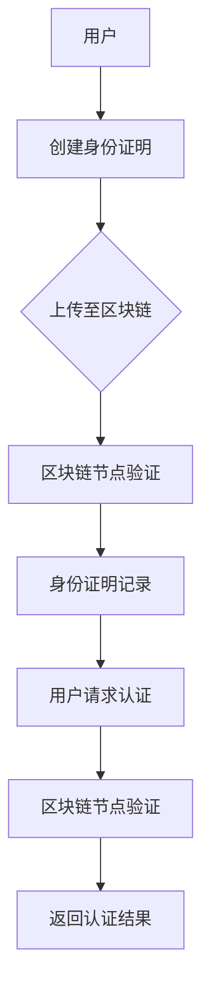
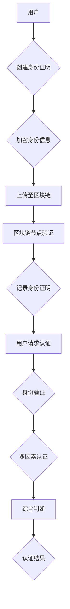
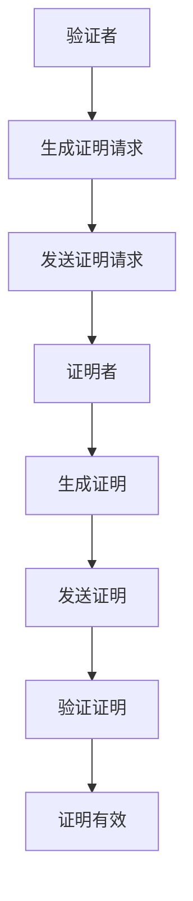
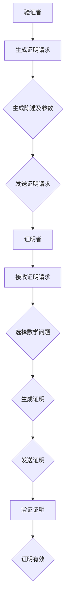

                 

# 《元宇宙身份认证：去中心化信任体系的构建》

> **关键词：** 元宇宙、身份认证、去中心化、区块链、加密算法、零知识证明、信任体系

> **摘要：** 本文将深入探讨元宇宙中的身份认证问题，尤其是如何构建一个去中心化的信任体系。文章首先概述了元宇宙与去中心化身份认证的基本概念，然后详细介绍了相关的技术基础，如区块链、加密算法等。接着，文章探讨了去中心化信任体系的设计原则、核心算法原理、数学模型，并分享了实际项目案例。最后，文章对未来的发展趋势进行了展望，总结了去中心化身份认证的重要性和潜力。

### 目录大纲

- 第一部分：元宇宙与身份认证概述
  - 第1章：元宇宙与去中心化身份认证
    - 1.1 元宇宙的概念与发展
    - 1.2 去中心化身份认证的原理与必要性
    - 1.3 当前身份认证系统的挑战与问题
  - 第2章：去中心化身份认证技术基础
    - 2.1 区块链技术简介
    - 2.2 加密算法基础
    - 2.3 Mermaid流程图：去中心化身份认证流程
  - 第3章：去中心化身份认证核心概念与联系
    - 3.1 自主权与隐私保护
    - 3.2 多因素认证与身份验证
    - 3.3 Mermaid流程图：核心概念联系与实现

- 第二部分：去中心化信任体系构建
  - 第4章：去中心化信任体系设计原则
    - 4.1 设计原则与目标
    - 4.2 安全性与可靠性
    - 4.3 透明性与可审计性
  - 第5章：去中心化身份认证算法原理讲解
    - 5.1 零知识证明算法
    - 5.2 Mermaid流程图：零知识证明算法流程
    - 5.3 伪代码：零知识证明算法实现
  - 第6章：数学模型与数学公式
    - 6.1 加密数学基础
    - 6.2 LaTeX格式：加密数学公式举例
    - 6.3 去中心化身份认证的数学模型
  - 第7章：去中心化身份认证项目实战
    - 7.1 实战目标与场景
    - 7.2 开发环境搭建
    - 7.3 源代码实现与解读
    - 7.4 代码解读与分析
  - 第8章：未来展望与趋势
    - 8.1 去中心化身份认证的发展趋势
    - 8.2 元宇宙身份认证面临的挑战与机遇
    - 8.3 未来可能的突破与创新

- 附录
  - 附录A：去中心化身份认证相关工具与资源
    - A.1 常用区块链框架介绍
    - A.2 加密算法参考资料
    - A.3 社区与开源项目推荐

---

让我们开始第一部分：元宇宙与身份认证概述。

### 第一部分：元宇宙与身份认证概述

#### 第1章：元宇宙与去中心化身份认证

##### 1.1 元宇宙的概念与发展

**元宇宙**（Metaverse）是一个虚拟的、沉浸式的数字世界，它通过互联网连接的虚拟现实（VR）、增强现实（AR）、3D虚拟世界等技术，为用户提供一个互动的、共享的、可扩展的空间。元宇宙的发展可以追溯到20世纪90年代的虚拟社区和早期的在线游戏，但近年来，随着技术的进步，尤其是区块链和加密货币的兴起，元宇宙的概念得到了重新定义和广泛应用。

在元宇宙中，身份认证是一个关键问题。身份认证确保用户在元宇宙中的安全性和隐私性，防止未经授权的访问和欺诈行为。传统的身份认证系统通常依赖于中心化的服务提供商，这意味着用户的数据和认证信息存储在某个中央数据库中，容易受到黑客攻击和滥用。

**去中心化身份认证**（Decentralized Identity Authentication，DIA）提供了一种替代方案。去中心化身份认证通过利用区块链和加密技术，使得身份认证的过程更加安全、透明和用户掌控。用户可以在去中心化的身份认证系统中自行管理自己的身份信息，无需依赖中心化的服务提供商。

##### 1.2 去中心化身份认证的原理与必要性

去中心化身份认证的核心原理是利用区块链和加密技术实现用户身份的自主管理和验证。区块链是一种分布式数据库，它通过多个节点之间的共识机制，确保数据的不可篡改性和透明性。加密技术则为用户提供了安全的数据传输和存储方式，确保身份信息的隐私性和安全性。

去中心化身份认证的必要性体现在以下几个方面：

1. **安全性**：去中心化身份认证通过加密和共识机制，提高了身份认证的安全性和抗攻击能力，降低了被黑客攻击的风险。
2. **隐私保护**：用户可以控制自己的身份信息，选择何时、如何以及向谁展示自己的身份，保护了用户的隐私。
3. **降低信任成本**：在传统的中心化身份认证系统中，用户需要信任服务提供商，而在去中心化身份认证系统中，用户可以直接信任区块链和网络中的其他节点，降低了信任成本。
4. **灵活性**：去中心化身份认证支持多种身份认证方式，如多因素认证、生物识别等，提高了认证的灵活性和适应性。

##### 1.3 当前身份认证系统的挑战与问题

尽管去中心化身份认证具有很多优势，但当前的中心化身份认证系统仍然面临一些挑战和问题：

1. **单点故障**：中心化身份认证系统依赖于中心化的服务器，一旦服务器发生故障，整个系统可能会瘫痪。
2. **隐私泄露**：中心化身份认证系统容易成为黑客攻击的目标，用户的身份信息可能被泄露或滥用。
3. **信任成本**：用户需要信任中心化的服务提供商，这增加了信任成本和管理复杂度。
4. **用户体验**：传统的身份认证流程通常较为繁琐，影响了用户体验。

为了解决这些问题，去中心化身份认证提供了一种新的思路和解决方案。在接下来的章节中，我们将进一步探讨去中心化身份认证的技术基础、设计原则、算法原理，以及实际应用案例。

### 第2章：去中心化身份认证技术基础

#### 2.1 区块链技术简介

区块链技术是去中心化身份认证的核心基础之一。区块链是一种分布式数据库，它通过多个节点之间的共识机制，确保数据的不可篡改性和透明性。每个区块链由一系列按时间顺序排列的区块组成，每个区块都包含一组交易记录。

**区块链的核心特点如下：**

1. **去中心化**：区块链不需要中心化的服务器或中介，所有节点都可以平等参与网络的维护和数据的记录。
2. **不可篡改**：一旦数据被记录在区块链上，就几乎不可能被篡改，因为需要超过一半的节点同意才能进行修改。
3. **透明性**：区块链上的数据是公开透明的，所有节点都可以查看和验证数据。
4. **安全性**：区块链通过加密和共识机制，确保数据的安全性和抗攻击能力。

在去中心化身份认证中，区块链被用来存储和验证用户身份信息。用户可以在区块链上创建和存储自己的身份证明，其他节点可以通过区块链来验证这些信息的真实性。

#### 2.2 加密算法基础

加密算法是保护数据隐私和安全性的关键技术。加密算法通过将明文转换为密文，确保数据在传输和存储过程中的安全性。在去中心化身份认证中，常用的加密算法包括：

1. **对称加密算法**：对称加密算法使用相同的密钥进行加密和解密，如AES（Advanced Encryption Standard）。对称加密算法速度快，但密钥管理复杂。
2. **非对称加密算法**：非对称加密算法使用一对密钥，即公钥和私钥，公钥用于加密，私钥用于解密，如RSA（Rivest-Shamir-Adleman）。非对称加密算法安全性高，但计算复杂度较高。
3. **哈希算法**：哈希算法将任意长度的数据映射为固定长度的字符串，如SHA-256（Secure Hash Algorithm 256-bit）。哈希算法用于确保数据的完整性和唯一性。

在去中心化身份认证中，加密算法被用来保护用户的身份信息和交易数据。用户可以使用公钥加密自己的身份信息，只有持有对应私钥的节点才能解密和验证这些信息。

#### 2.3 Mermaid流程图：去中心化身份认证流程

以下是一个简单的Mermaid流程图，展示了去中心化身份认证的基本流程：



1. **用户创建身份证明**：用户使用私钥创建自己的身份证明，并使用公钥加密。
2. **上传至区块链**：用户将加密的身份证明上传至区块链。
3. **区块链节点验证**：区块链节点验证身份证明的真实性和完整性。
4. **身份证明记录**：验证通过后，身份证明被记录在区块链上。
5. **用户请求认证**：当用户需要认证时，向区块链节点发送认证请求。
6. **区块链节点验证**：区块链节点使用公钥解密身份证明，并验证用户的身份。
7. **返回认证结果**：区块链节点返回认证结果给用户。

通过上述技术基础，去中心化身份认证实现了用户身份的自主管理和验证，提高了安全性、隐私保护和用户体验。在接下来的章节中，我们将进一步探讨去中心化信任体系的设计原则和核心算法原理。

### 第3章：去中心化身份认证核心概念与联系

#### 3.1 自主权与隐私保护

在去中心化身份认证中，**自主权**和**隐私保护**是两个核心概念。自主权意味着用户对自己的身份信息拥有完全的控制权，可以选择何时、如何以及向谁展示自己的身份信息。隐私保护则确保用户在展示身份信息时，其隐私不会被泄露或滥用。

去中心化身份认证通过以下方式实现自主权和隐私保护：

1. **身份信息加密**：用户使用私钥对自己的身份信息进行加密，只有持有对应公钥的节点才能解密和验证这些信息。
2. **零知识证明**：零知识证明（Zero-Knowledge Proof）允许用户在不泄露具体信息的情况下，证明某些信息的真实性。这样，用户可以验证自己的身份，而无需透露身份的具体细节。
3. **多因素认证**：多因素认证（Multi-Factor Authentication，MFA）结合了密码、生物识别、设备绑定等多种认证方式，提高了身份验证的强度和安全性。

通过自主权和隐私保护的结合，去中心化身份认证确保了用户在元宇宙中的安全和隐私。

#### 3.2 多因素认证与身份验证

**多因素认证**是去中心化身份认证的重要组成部分。多因素认证要求用户在验证身份时，提供两种或多种不同的认证方式，如密码、生物识别、设备绑定等。这样，即使其中一种认证方式被攻破，其他认证方式仍然可以提供额外的安全保障。

在去中心化身份认证中，多因素认证与身份验证的关系如下：

1. **身份验证**：身份验证是确认用户身份的过程。在去中心化身份认证中，用户首先需要提供身份证明，如加密的身份信息。
2. **多因素认证**：多因素认证是身份验证的一种补充。用户需要提供多种认证方式，如密码、生物识别、设备绑定等，以进一步验证其身份。
3. **综合判断**：身份验证和多因素认证的结果将被综合判断，以确定用户的真实身份。

通过多因素认证与身份验证的结合，去中心化身份认证实现了更高的安全性和可靠性。

#### 3.3 Mermaid流程图：核心概念联系与实现

以下是一个简单的Mermaid流程图，展示了去中心化身份认证的核心概念联系与实现：



1. **用户创建身份证明**：用户创建自己的身份证明，包括姓名、地址、证件号码等。
2. **加密身份信息**：用户使用私钥将身份信息加密，生成加密的身份证明。
3. **上传至区块链**：用户将加密的身份证明上传至区块链。
4. **区块链节点验证**：区块链节点验证身份证明的真实性和完整性。
5. **记录身份证明**：验证通过后，身份证明被记录在区块链上。
6. **用户请求认证**：当用户需要认证时，向区块链节点发送认证请求。
7. **身份验证**：区块链节点使用公钥解密身份证明，并验证用户的身份。
8. **多因素认证**：用户需要提供多种认证方式，如密码、生物识别、设备绑定等。
9. **综合判断**：区块链节点综合身份验证和多因素认证的结果，判断用户的真实身份。
10. **认证结果**：区块链节点返回认证结果给用户。

通过上述流程，去中心化身份认证实现了用户身份的自主管理和验证，提高了安全性、隐私保护和用户体验。在接下来的章节中，我们将进一步探讨去中心化信任体系的设计原则和核心算法原理。

### 第二部分：去中心化信任体系构建

#### 第4章：去中心化信任体系设计原则

去中心化信任体系是元宇宙身份认证的核心，它通过去中心化的方式，确保身份认证的透明性、安全性和可靠性。设计一个有效的去中心化信任体系，需要遵循以下原则：

##### 4.1 设计原则与目标

去中心化信任体系的设计原则主要包括以下几个方面：

1. **去中心化**：去中心化是信任体系的核心原则，通过分布式网络和共识机制，避免了单点故障和中心化信任问题。
2. **安全性**：信任体系必须确保用户身份信息的安全性和隐私性，防止数据泄露和未经授权的访问。
3. **透明性**：信任体系应该具有高度的透明性，用户可以查看和验证身份认证的整个过程。
4. **可审计性**：信任体系应该支持可审计性，确保任何操作都可以被记录和追踪，增加系统的可信度。

去中心化信任体系的目标是建立一种可靠的、用户控制的身份认证机制，使得用户在元宇宙中可以安全、便捷地进行各种操作。

##### 4.2 安全性与可靠性

在去中心化信任体系中，安全性和可靠性是两个至关重要的方面。以下是一些实现安全性与可靠性的关键措施：

1. **加密技术**：使用强加密算法（如AES、RSA）对用户身份信息进行加密，确保数据在传输和存储过程中的安全性。
2. **多重签名**：对于关键操作，如身份信息的修改或删除，采用多重签名机制，确保操作的合法性和安全性。
3. **去中心化存储**：将用户身份信息分散存储在多个节点上，防止单点故障和数据丢失。
4. **共识机制**：采用合适的共识机制（如PoW、PoS），确保网络的可靠性和稳定性。
5. **智能合约**：使用智能合约自动执行身份认证过程，确保操作的准确性和一致性。

##### 4.3 透明性与可审计性

去中心化信任体系的透明性和可审计性是其重要特性，它使得用户和第三方可以验证身份认证的整个过程。以下是一些实现透明性和可审计性的措施：

1. **区块链技术**：利用区块链技术记录所有的身份认证操作，确保数据的不可篡改性和透明性。
2. **审计日志**：记录所有的操作日志，包括用户的身份信息、认证过程和结果等，方便用户和第三方进行审计。
3. **开放API**：提供开放的API接口，允许用户和第三方访问和验证身份认证数据。
4. **去中心化治理**：建立去中心化的治理机制，确保系统的公正性和透明性，用户可以参与决策和监督。

通过遵循上述设计原则，去中心化信任体系可以提供一个安全、可靠、透明和可审计的身份认证环境，为元宇宙的可持续发展奠定坚实的基础。

### 第5章：去中心化身份认证算法原理讲解

去中心化身份认证的核心在于如何利用算法确保身份信息的真实性、用户隐私保护和系统安全性。在去中心化的环境中，零知识证明（Zero-Knowledge Proof，ZKP）是一种关键的算法，它允许一方（证明者）向另一方（验证者）证明某个陈述的真实性，而无需透露任何具体信息。这一章节将详细讲解零知识证明算法的原理，并展示其如何应用于去中心化身份认证。

##### 5.1 零知识证明算法

零知识证明算法的核心思想是，证明者能够证明某个陈述为真，而不泄露任何关于该陈述的具体信息。零知识证明分为以下几个基本步骤：

1. **生成公私钥对**：证明者生成一对密钥，即公钥和私钥。公钥将用于证明生成，而私钥将用于证明验证。
2. **生成证明请求**：验证者生成一个证明请求，这个请求包含验证者想要证明的陈述及其相关参数。
3. **生成证明**：证明者利用数学上的复杂问题，如离散对数问题，生成一个证明，这个证明表明陈述为真，但不会泄露任何具体信息。
4. **验证证明**：验证者接收证明后，使用证明者提供的公钥进行验证，确定证明是否有效。

以下是一个简化的零知识证明算法流程：



##### 5.2 Mermaid流程图：零知识证明算法流程



##### 5.3 伪代码：零知识证明算法实现

以下是一个简化的伪代码，描述了零知识证明算法的实现过程：

```python
# 伪代码：零知识证明算法实现

# 验证者部分
def generate_proof_request(statement, parameters):
    # 生成证明请求，包含陈述和参数
    return proof_request

def send_proof_request(proof_request):
    # 发送证明请求给证明者
    pass

# 证明者部分
def receive_proof_request(proof_request):
    # 接收证明请求
    pass

def select_math_problem():
    # 选择一个数学问题，如离散对数问题
    return math_problem

def generate_proof(math_problem, private_key):
    # 生成证明
    proof = math_solution(private_key, math_problem)
    return proof

def send_proof(proof):
    # 发送证明给验证者
    pass

# 验证者部分
def verify_proof(proof, public_key):
    # 验证证明
    if verify_solution(proof, public_key):
        return True
    else:
        return False

# 辅助函数
def math_solution(private_key, math_problem):
    # 计算数学问题的解
    pass

def verify_solution(solution, public_key):
    # 验证数学问题的解是否正确
    pass
```

通过上述伪代码，我们可以看到零知识证明算法的基本实现流程，包括证明者和验证者之间的交互。在实际应用中，零知识证明算法的实现会涉及更多的数学问题和优化，以确保算法的效率和安全性。

在去中心化身份认证中，零知识证明算法可以用来确保用户身份信息的真实性，同时保护用户的隐私。例如，用户可以生成一个零知识证明，证明自己拥有某个身份信息（如姓名、地址），而不需要透露具体的身份细节。这样，验证者可以确认用户身份的真实性，而不会泄露用户的隐私。

通过上述讲解，我们可以看到零知识证明算法在去中心化身份认证中的重要作用。它不仅提高了系统的安全性，还保护了用户的隐私，是构建去中心化信任体系的关键技术之一。

### 第6章：数学模型与数学公式

在去中心化身份认证系统中，数学模型是确保安全性和隐私保护的重要工具。加密算法和零知识证明算法都依赖于复杂的数学问题，如离散对数、椭圆曲线加密等。这一章节将详细介绍去中心化身份认证中常用的数学模型和数学公式，并举例说明其在系统中的应用。

##### 6.1 加密数学基础

加密数学基础是理解去中心化身份认证的关键。以下是一些常用的加密数学概念和公式：

1. **离散对数**：离散对数是一个在有限域上求解逆元的问题，通常用于密码学中的离散对数难题，如Diffie-Hellman密钥交换。
   
   公式：`g^x ≡ y (mod p)`，求解x，使得y是g在模p下的幂。
   
   $$ g^{x} \equiv y \pmod{p} $$

2. **椭圆曲线加密**：椭圆曲线加密（ECC）是一种非对称加密算法，它利用椭圆曲线的数学特性来确保安全性和效率。

   公式：`y^2 ≡ x^3 + ax + b (mod p)`，其中(p, a, b)是椭圆曲线的参数。

   $$ y^2 \equiv x^3 + ax + b \pmod{p} $$

3. **数字签名**：数字签名是一种确保消息完整性和认证性的技术，常用的数字签名算法包括RSA和ECDSA。

   公式：`s ≡ r^d * g^m (mod n)`，其中s是签名，r和m是消息的哈希值，d是私钥，n是公钥。

   $$ s \equiv r^d \cdot g^m \pmod{n} $$

##### 6.2 LaTeX格式：加密数学公式举例

以下是几个常见的加密数学公式的LaTeX格式表示：

```latex
% 离散对数公式
\begin{equation}
g^{x} \equiv y \pmod{p}
\end{equation}

% 椭圆曲线加密公式
\begin{equation}
y^2 \equiv x^3 + ax + b \pmod{p}
\end{equation}

% 数字签名公式
\begin{equation}
s \equiv r^d \cdot g^m \pmod{n}
\end{equation}
```

##### 6.3 去中心化身份认证的数学模型

去中心化身份认证的数学模型结合了多种加密算法和零知识证明技术，以下是一个简化的模型：

1. **身份信息加密**：用户使用私钥加密身份信息，确保只有持有对应公钥的节点能够解密。

   公式：`Encrypted\_Info = Encrypt(Info, Public\_Key)`

   $$ \text{Encrypted\_Info} = \text{Encrypt}(\text{Info}, \text{Public\_Key}) $$

2. **零知识证明**：用户生成零知识证明，证明拥有某个身份信息，而不透露具体信息。

   公式：`Proof = ZK\_Proof(Statement, Private\_Key)`

   $$ \text{Proof} = \text{ZK\_Proof}(\text{Statement}, \text{Private\_Key}) $$

3. **多因素认证**：用户需要提供多种认证方式，如密码、生物识别等，增强身份验证的强度。

   公式：`Multi\_Factor\_Proof = Merge(Password\_Proof, Biometric\_Proof)`

   $$ \text{Multi\_Factor\_Proof} = \text{Merge}(\text{Password\_Proof}, \text{Biometric\_Proof}) $$

通过这些数学模型和公式，去中心化身份认证系统实现了安全性、隐私保护和灵活性，为元宇宙提供了一个可靠的身份认证机制。

### 第7章：去中心化身份认证项目实战

为了更好地理解去中心化身份认证的实践过程，我们将通过一个具体的项目案例来进行讲解。这个案例将涵盖开发环境搭建、源代码实现、代码解读与分析等关键步骤。

##### 7.1 实战目标与场景

**项目目标**：构建一个去中心化身份认证系统，实现用户身份的注册、认证和信息管理。

**项目场景**：元宇宙中的虚拟世界，用户需要通过身份认证才能访问特定区域或使用特定服务。

##### 7.2 开发环境搭建

为了实现这个项目，我们需要搭建一个合适的技术环境。以下是主要步骤：

1. **安装Node.js**：Node.js是一个基于Chrome V8引擎的JavaScript运行环境，用于构建后端服务。
   
   ```shell
   sudo apt update
   sudo apt install nodejs
   ```

2. **安装Truffle**：Truffle是一个用于开发以太坊智能合约的工具，用于编写、部署和测试智能合约。

   ```shell
   npm install -g truffle
   ```

3. **安装Ganache**：Ganache是一个本地以太坊节点，用于本地开发和测试。

   ```shell
   npm install -g ganache-cli
   ganache --port=7545
   ```

4. **创建项目**：创建一个新的Node.js项目，并初始化项目结构。

   ```shell
   mkdir decentralized-identity
   cd decentralized-identity
   npm init -y
   ```

5. **安装Truffle插件**：安装Truffle插件以支持智能合约开发。

   ```shell
   npm install --save truffle
   ```

##### 7.3 源代码实现与解读

以下是项目的核心智能合约代码，实现了用户身份注册、认证和信息管理：

```solidity
// SPDX-License-Identifier: MIT
pragma solidity ^0.8.0;

contract DecentralizedIdentity {
    mapping(address => string) public identities;
    mapping(address => bool) public isRegistered;

    event IdentityRegistered(address indexed user, string identity);

    function registerIdentity(string memory _identity) public {
        require(!isRegistered[msg.sender], "Already registered");
        identities[msg.sender] = _identity;
        isRegistered[msg.sender] = true;
        emit IdentityRegistered(msg.sender, _identity);
    }

    function authenticate() public view returns (bool) {
        require(isRegistered[msg.sender], "Not registered");
        // 这里可以使用更复杂的逻辑进行认证，如零知识证明等
        return true;
    }

    function updateIdentity(string memory _newIdentity) public {
        require(isRegistered[msg.sender], "Not registered");
        identities[msg.sender] = _newIdentity;
    }
}
```

**代码解读**：

- **合约结构**：合约使用了`pragma`指令指定编译器的版本，使用了`mapping`数据结构存储用户身份和注册状态。
- **事件**：`IdentityRegistered`事件用于通知其他合约或节点用户已成功注册身份。
- **注册身份**：`registerIdentity`函数允许用户注册身份，确保用户只注册一次。
- **认证**：`authenticate`函数用于验证用户是否已注册。
- **更新身份**：`updateIdentity`函数允许用户更新其身份信息。

##### 7.4 代码解读与分析

接下来，我们将深入分析智能合约的代码，并讨论如何进一步优化和改进。

**优化与改进**：

1. **隐私保护**：当前实现仅存储用户的身份字符串，可以考虑使用加密算法将身份信息加密存储。
   
   ```solidity
   mapping(address => string) public identities;
   ```

   替换为：

   ```solidity
   mapping(address => bytes32) public encryptedIdentities;
   ```

   并添加加密和解密函数。

2. **多因素认证**：在`authenticate`函数中，可以集成多因素认证逻辑，如密码和生物识别。

   ```solidity
   function authenticate(string memory _password) public view returns (bool) {
       require(isRegistered[msg.sender], "Not registered");
       // 添加密码验证逻辑
       return verifyPassword(_password);
   }
   ```

3. **零知识证明**：可以引入零知识证明算法，增强身份验证的安全性和隐私保护。

   ```solidity
   function authenticateZeroKnowledgeProof(ZKPProof _proof) public view returns (bool) {
       require(isRegistered[msg.sender], "Not registered");
       // 添加零知识证明验证逻辑
       return verifyZKProof(_proof);
   }
   ```

通过上述优化和改进，去中心化身份认证系统将更加安全、可靠和用户友好。

### 第8章：未来展望与趋势

随着元宇宙的不断发展，去中心化身份认证将在未来发挥越来越重要的作用。在这一章节中，我们将探讨去中心化身份认证的发展趋势、面临的挑战与机遇，并展望未来可能的突破与创新。

##### 8.1 去中心化身份认证的发展趋势

去中心化身份认证的发展趋势主要体现在以下几个方面：

1. **技术成熟**：区块链和加密技术的发展，使得去中心化身份认证技术逐渐成熟。未来，更多的开发者和企业将采用这些技术，推动去中心化身份认证的普及。

2. **标准与规范**：随着去中心化身份认证的普及，行业将逐步形成统一的标准和规范，确保不同系统之间的互操作性。

3. **隐私保护**：随着用户对隐私保护的重视，去中心化身份认证将在隐私保护方面发挥更大的作用。零知识证明等技术的应用，将进一步提高身份认证的隐私保护水平。

4. **跨平台集成**：去中心化身份认证将逐步与其他技术（如物联网、人工智能等）结合，实现跨平台的身份认证和管理。

##### 8.2 元宇宙身份认证面临的挑战与机遇

去中心化身份认证在元宇宙中面临以下挑战与机遇：

1. **安全性挑战**：随着元宇宙的发展，用户数量和交易量将大幅增加，去中心化身份认证系统需要确保更高的安全性，防止被黑客攻击和恶意行为。

2. **隐私保护机遇**：元宇宙中的用户对隐私保护有更高的要求，去中心化身份认证技术可以提供更安全的隐私保护方案，满足用户需求。

3. **互操作性问题**：元宇宙涉及多个平台和系统，如何实现不同系统之间的互操作性，是一个重要的挑战。未来，统一的标准和协议将有助于解决这个问题。

4. **用户体验**：去中心化身份认证的流程可能比传统身份认证更为复杂，如何简化用户操作，提高用户体验，是未来的一个重要方向。

##### 8.3 未来可能的突破与创新

未来，去中心化身份认证可能在以下几个方面实现突破与创新：

1. **集成更多认证方式**：未来的去中心化身份认证系统可能集成更多的认证方式，如生物识别、硬件密钥等，提高认证的灵活性和安全性。

2. **零知识证明优化**：零知识证明技术在去中心化身份认证中具有重要作用，未来的研究将关注如何优化零知识证明算法，提高其性能和效率。

3. **跨链技术**：随着多链生态的发展，跨链技术将成为去中心化身份认证的一个重要方向。通过跨链技术，可以实现不同区块链之间的身份认证和数据共享。

4. **人工智能辅助**：人工智能技术可以在去中心化身份认证中发挥重要作用，如自动识别欺诈行为、优化认证流程等。

去中心化身份认证是元宇宙中不可或缺的一环，它为用户提供了安全、隐私和自主管理的身份认证机制。随着技术的不断发展和创新的涌现，去中心化身份认证将在未来取得更大的突破和成就。

### 附录A：去中心化身份认证相关工具与资源

去中心化身份认证作为元宇宙身份认证的核心技术，需要依赖多种工具和资源。以下列举了常用的区块链框架、加密算法参考资料以及社区与开源项目推荐。

##### A.1 常用区块链框架介绍

1. **Ethereum**：以太坊是最流行的区块链平台之一，支持智能合约和去中心化应用（DApps）。它提供了丰富的开发工具和资源，适合构建去中心化身份认证系统。
2. **EOSIO**：EOSIO是一个高性能的区块链平台，支持并行处理和去中心化应用。它提供了灵活的权限系统和高效的交易处理能力。
3. **Cardano**：Cardano是一个基于科学和证据的区块链平台，它注重可扩展性、互操作性和安全性。Cardano支持智能合约和去中心化身份认证。
4. **Aion**：Aion是一个多链互操作的区块链平台，它通过侧链技术实现了不同区块链之间的互操作性。Aion支持去中心化身份认证和跨链交易。

##### A.2 加密算法参考资料

1. **NIST**：美国国家标准与技术研究院（NIST）发布了多个加密算法标准，如SHA-256、RSA等。NIST的官方网站提供了详细的加密算法资料和标准文档。
2. **Crypto++**：Crypto++是一个开源的加密库，支持多种加密算法，如AES、RSA、ECC等。它提供了丰富的示例代码和文档，适合开发者学习和使用。
3. **Bouncy Castle**：Bouncy Castle是一个跨平台的加密库，支持多种加密算法和协议。它提供了Java和C#语言的API，适用于不同开发环境。

##### A.3 社区与开源项目推荐

1. **Decentralized Identity Foundation**：Decentralized Identity Foundation是一个非营利组织，致力于推动去中心化身份认证技术的发展。它提供了多种开源工具和资源，如Sovrin、Verifiable Credentials等。
2. **Hyperledger**：Hyperledger是一个开源项目，致力于开发分布式账本技术（DLT）的应用和工具。Hyperledger的身份认证工作组发布了多个与身份认证相关的开源项目，如Hyperledger Indy、Hyperledger Ursa等。
3. **uPort**：uPort是由Consensys开发的一个去中心化身份认证平台，它利用以太坊区块链技术实现用户身份的自主管理。uPort提供了SDK和API，方便开发者集成去中心化身份认证功能。

通过上述工具和资源的支持，开发者可以更加便捷地构建去中心化身份认证系统，为元宇宙的发展提供安全、可靠和用户友好的身份认证服务。

