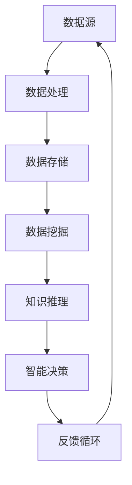
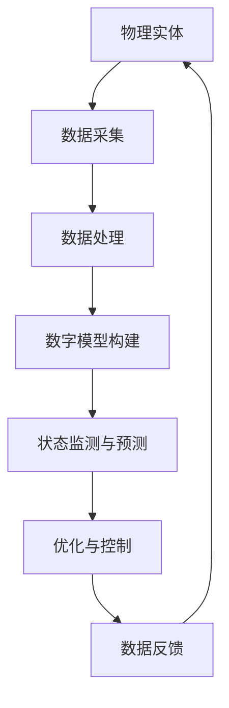
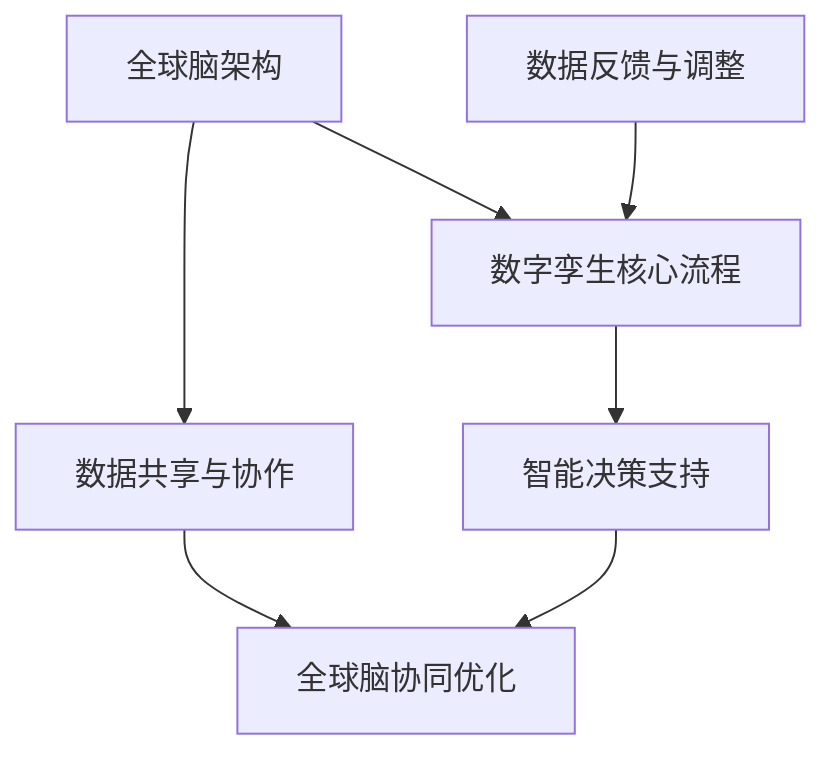

                 

### 文章标题

《全球脑与全球脑：数字孪生技术在文化研究中的应用》

---

> **关键词：** 全球脑、数字孪生、文化研究、文化遗产保护、文化创意产业、跨文化交流

> **摘要：** 本文深入探讨了全球脑和数字孪生技术在全球文化研究中的双重角色。首先，介绍了全球脑的基本概念和原理，以及数字孪生技术的理论基础。接着，详细阐述了数字孪生技术在中国和西方文化研究中的具体应用。随后，通过成功案例分析展示了全球脑与数字孪生技术相结合在文化研究中的实际成效。最后，本文分析了全球脑与数字孪生技术在文化研究中的挑战与机遇，并对未来的发展趋势进行了展望。

---

### 目录大纲

# 《全球脑与全球脑：数字孪生技术在文化研究中的应用》

## 第一部分：全球脑的基本概念与原理

### 第1章：全球脑的概念与理论

- **1.1 全球脑的定义与发展背景**
- **1.2 全球脑的核心原理**
- **1.3 全球脑的关键特性**

### 第2章：数字孪生技术的理论基础

- **2.1 数字孪生技术的起源与演进**
- **2.2 数字孪生技术的核心概念**
- **2.3 数字孪生技术在其他领域的应用**

## 第二部分：数字孪生技术在文化研究中的应用

### 第3章：数字孪生技术在中国文化研究中的应用

- **3.1 数字孪生技术在文化遗产保护中的应用**
- **3.2 数字孪生技术在文化创意产业中的应用**
- **3.3 数字孪生技术在中外文化交流中的应用**

### 第4章：数字孪生技术在西方文化研究中的应用

- **4.1 数字孪生技术在西方文化遗产保护中的应用**
- **4.2 数字孪生技术在西方文化创意产业中的应用**
- **4.3 数字孪生技术在跨文化交流中的应用**

## 第三部分：案例分析与未来展望

### 第5章：全球脑与数字孪生技术在文化研究中的成功案例

- **5.1 案例一：故宫数字孪生文化遗产保护项目**
- **5.2 案例二：巴黎圣母院数字重建与虚拟旅游**
- **5.3 案例三：莎士比亚戏剧的数字孪生呈现**

### 第6章：全球脑与数字孪生技术在文化研究中的挑战与机遇

- **6.1 挑战一：数据隐私与安全问题**
- **6.2 挑战二：技术标准化与跨领域协作**
- **6.3 机遇一：跨学科研究与创新发展**

### 第7章：全球脑与数字孪生技术的未来发展趋势

- **7.1 未来趋势一：个性化文化体验**
- **7.2 未来趋势二：全球文化资源共享**
- **7.3 未来趋势三：数字孪生技术在文化教育中的应用**

## 附录

### 附录A：全球脑与数字孪生技术相关资源与工具

- **A.1 资源与工具介绍**
- **A.2 常用技术栈与工具选择**
- **A.3 开发环境搭建指南**

### 附录B：全球脑与数字孪生技术的 Mermaid 流程图

- **B.1 全球脑的基本架构**
- **B.2 数字孪生技术的核心流程**
- **B.3 全球脑与数字孪生技术的集成应用**

---

### 第一部分：全球脑的基本概念与原理

### 第1章：全球脑的概念与理论

在全球化的今天，信息技术的迅猛发展使得全球范围内的知识、文化、资源等联系更加紧密。在这样的背景下，“全球脑”（Global Brain）这一概念应运而生。全球脑不仅是一个理论框架，更是一个连接全球智慧、共享知识的平台。

#### 1.1 全球脑的定义与发展背景

**全球脑**，或称“全球智慧脑”，是模拟人类大脑运作机制的复杂网络系统。它通过互联网、物联网、大数据、人工智能等现代信息技术，将全球范围内的信息、知识、资源和智慧连接起来，形成一个分布式的大规模计算和协作平台。

全球脑的概念最早由生物学家弗里曼（Dale J. Freeman）于1988年提出。他在研究人类大脑运作机制时，发现大脑是由数以亿计的神经元通过复杂的网络连接构成的。这一发现启发了弗里曼，他设想是否可以创造一个类似的全球性网络，将全球的知识和信息连接起来，形成一个“全球脑”。

自那以后，随着互联网和信息技术的发展，全球脑理论逐渐成熟，并在多个领域得到应用，如人工智能、物联网、文化研究等。

#### 1.2 全球脑的核心原理

全球脑的核心原理可以概括为以下几点：

1. **网络化**：全球脑是通过互联网将全球范围内的计算资源、数据资源和知识资源连接起来，形成一个庞大的分布式计算网络。
2. **智能化**：全球脑利用大数据、人工智能等技术，对海量数据进行处理和分析，从而实现智能化的决策和协作。
3. **共享性**：全球脑强调资源的共享和知识交流，通过分布式计算和协作，实现全球范围内的资源优化和知识共享。
4. **自组织**：全球脑是一个自组织的系统，它通过自我学习和适应，不断优化和调整自身结构和功能，以适应不断变化的环境。

#### 1.3 全球脑的关键特性

全球脑具有以下几个关键特性：

1. **分布式**：全球脑是一个分布式的系统，它不是集中在一个地点或服务器上，而是分散在全球各个角落。
2. **动态性**：全球脑是一个动态的系统，它能够根据环境的变化和需求的变化，实时调整自身的结构和功能。
3. **适应性**：全球脑具有较强的适应性，它能够通过自我学习和自我优化，不断适应新的挑战和需求。
4. **协同性**：全球脑通过分布式计算和协作，实现全球范围内的资源优化和知识共享，从而提高整体的效率和效能。

#### 1.4 全球脑在文化研究中的重要性

在全球脑的背景下，文化研究面临着新的机遇和挑战。全球脑不仅为文化研究提供了新的工具和方法，也为文化的传播、保护和传承提供了新的思路。

首先，全球脑为文化研究提供了丰富的数据资源。通过全球脑，研究者可以获取到全球范围内的文化数据，如文化遗产、文学作品、艺术作品等，从而对文化现象进行深入分析。

其次，全球脑为文化研究提供了智能化的分析工具。通过大数据和人工智能技术，全球脑可以实现对文化数据的自动化处理和分析，从而提高文化研究的效率和质量。

最后，全球脑为文化的传播和传承提供了新的途径。通过虚拟现实、增强现实等技术，全球脑可以实现文化的数字化和可视化，从而让更多人了解和欣赏文化。

#### 总结

全球脑是一种模拟人类大脑运作机制的复杂网络系统，它通过互联网、物联网、大数据、人工智能等技术，将全球范围内的信息、知识、资源和智慧连接起来，形成一个分布式的大规模计算和协作平台。在全球脑的背景下，文化研究面临着新的机遇和挑战，研究者需要充分利用全球脑提供的工具和方法，深入挖掘文化内涵，推动文化传承和创新。

### 第2章：数字孪生技术的理论基础

#### 2.1 数字孪生技术的起源与演进

数字孪生（Digital Twin）技术起源于工业领域，最早的概念可以追溯到2002年，由Michael Grieves在密歇根大学提出。他提出了将物理实体与数字模型相连接，通过实时数据的交互，实现对实体状态和行为的监测与优化。

数字孪生技术的演进经历了几个阶段：

1. **初步探索阶段（2002-2010年）**：这一阶段主要关注数字孪生技术在特定领域的应用，如航空航天、汽车制造等。
2. **技术应用阶段（2010-2015年）**：随着物联网和传感器技术的发展，数字孪生技术开始广泛应用于各个行业，如制造业、能源、医疗等。
3. **智能化阶段（2015年至今）**：人工智能、大数据和云计算等技术的发展，使得数字孪生技术更加智能化，能够实现实时监测、预测和优化。

#### 2.2 数字孪生技术的核心概念

数字孪生技术的核心概念可以概括为以下几个方面：

1. **物理实体与数字模型的映射**：数字孪生技术通过构建物理实体的数字模型，实现对实体的全面描述和模拟。
2. **实时数据交互**：数字孪生技术通过传感器、物联网等手段，实时收集物理实体的数据，并将其传输到数字模型中。
3. **实时状态监测与预测**：数字孪生技术通过对实时数据的分析，实时监测物理实体的状态，并预测其未来的行为和性能。
4. **优化与控制**：基于实时状态监测和预测，数字孪生技术能够对物理实体进行优化和控制，提高其效率和性能。

#### 2.3 数字孪生技术在其他领域的应用

除了在工业领域得到广泛应用外，数字孪生技术还在其他领域展现了巨大的潜力：

1. **医疗健康**：数字孪生技术可以用于构建病人的数字模型，实时监测病人的健康状况，为医生提供决策支持，提高医疗服务的效率和质量。
2. **城市建设**：数字孪生技术可以用于构建城市的数字模型，实现对城市基础设施的实时监测和管理，提高城市治理的智能化水平。
3. **交通运输**：数字孪生技术可以用于构建交通工具的数字模型，实现对交通工具的实时监测和预测，提高交通运行的安全性和效率。
4. **环境保护**：数字孪生技术可以用于构建环境系统的数字模型，实时监测环境质量，为环境保护提供科学依据。

#### 2.4 数字孪生技术在文化研究中的应用

数字孪生技术在文化研究中的应用主要集中在文化遗产保护、文化创意产业和中外文化交流等方面：

1. **文化遗产保护**：数字孪生技术可以用于构建文化遗产的数字模型，实现对文化遗产的全面描述和监测，提高文化遗产的保护和传承效果。
2. **文化创意产业**：数字孪生技术可以用于构建文化创意产业的数字模型，实现对文化产品的设计、生产和营销的实时监测和优化，提高文化创意产业的生产效率和产品质量。
3. **中外文化交流**：数字孪生技术可以用于构建中外文化的数字模型，实现文化交流的实时监测和优化，提高中外文化交流的互动性和实效性。

#### 总结

数字孪生技术是一种通过构建物理实体的数字模型，实现对实体状态和行为的实时监测、预测和优化的技术。它起源于工业领域，但随着物联网、大数据和人工智能等技术的发展，逐渐在医疗健康、城市建设、交通运输、环境保护等多个领域得到广泛应用。在文化研究领域，数字孪生技术为文化遗产保护、文化创意产业和中外文化交流提供了新的工具和方法，具有重要的应用价值。

### 第3章：数字孪生技术在中国文化研究中的应用

#### 3.1 数字孪生技术在文化遗产保护中的应用

中国是一个拥有悠久历史和丰富文化遗产的国家。随着城市化进程的加速和自然环境的变迁，许多文化遗产正面临严重的破坏和损失。为了更好地保护这些宝贵的文化遗产，数字孪生技术提供了一种创新的解决方案。

**数字孪生技术在文化遗产保护中的应用主要体现在以下几个方面：**

1. **数字模型构建**：通过激光扫描、三维建模等技术，对文化遗产进行高精度的数字建模。这些数字模型可以精确还原文化遗产的外观、结构和材料特性，为文化遗产的保护提供准确的依据。

   ```mermaid
   graph TB
   A[数字建模] --> B[激光扫描]
   A --> C[三维建模]
   B --> D[数据传输]
   C --> D
   D --> E[数字模型]
   ```

2. **实时监测**：通过传感器和物联网技术，对文化遗产进行实时监测。传感器可以监测环境温度、湿度、光照等参数，将数据传输到数字模型中，实现对文化遗产状态的实时监控。

   ```mermaid
   graph TB
   A[传感器] --> B[数据采集]
   B --> C[数据传输]
   C --> D[数字模型]
   D --> E[实时监测]
   ```

3. **状态预测与预警**：通过数据分析与机器学习算法，对文化遗产的未来状态进行预测，提前发现潜在的风险和问题，实现预警。这有助于提前采取保护措施，防止文化遗产的破坏。

   ```mermaid
   graph TB
   A[数据分析] --> B[机器学习]
   B --> C[状态预测]
   C --> D[预警系统]
   ```

**案例：故宫数字孪生文化遗产保护项目**

故宫是中国最著名的文化遗产之一。为了更好地保护故宫，故宫博物院引入了数字孪生技术，构建了故宫的数字模型。该项目主要包括以下几个步骤：

1. **数据采集**：使用激光扫描和高清摄影技术，对故宫的每一个角落进行数据采集，构建故宫的三维模型。
2. **模型整合**：将采集到的数据整合到数字模型中，实现对故宫的全面描述。
3. **实时监测**：在故宫内部安装传感器，实时监测环境参数，并将数据传输到数字模型中。
4. **状态预测与预警**：通过数据分析与机器学习算法，对故宫的状态进行预测，提前发现潜在的风险。

#### 3.2 数字孪生技术在文化创意产业中的应用

文化创意产业是中国经济的重要组成部分。数字孪生技术为文化创意产业的创新发展提供了新的动力。

**数字孪生技术在文化创意产业中的应用主要体现在以下几个方面：**

1. **设计优化**：通过数字孪生技术，设计师可以创建文化产品的数字模型，通过虚拟现实（VR）和增强现实（AR）技术，实现对产品的设计优化和体验提升。

   ```mermaid
   graph TB
   A[数字模型] --> B[VR/AR技术]
   B --> C[设计优化]
   ```

2. **生产监控**：通过数字孪生技术，制造企业可以对生产过程进行实时监控和优化。数字模型可以模拟产品的生产过程，预测生产中的潜在问题，提高生产效率和产品质量。

   ```mermaid
   graph TB
   A[数字模型] --> B[生产过程]
   B --> C[监控与优化]
   ```

3. **营销推广**：数字孪生技术可以帮助文化创意产业进行精准的营销推广。通过数字模型，企业可以创建个性化的文化产品展示，吸引更多的消费者。

   ```mermaid
   graph TB
   A[数字模型] --> B[营销推广]
   B --> C[个性化展示]
   ```

**案例：杭州宋城景区数字孪生项目**

杭州宋城景区是中国著名的旅游目的地之一。为了提升游客体验，宋城景区引入了数字孪生技术，构建了景区的数字模型。该项目主要包括以下几个步骤：

1. **数据采集**：使用激光扫描和高清摄影技术，对宋城景区的每一个角落进行数据采集，构建景区的三维模型。
2. **模型整合**：将采集到的数据整合到数字模型中，实现对宋城景区的全面描述。
3. **VR/AR体验**：在景区内设置VR/AR体验区，游客可以通过VR/AR技术，体验虚拟的文化场景和互动游戏。
4. **实时监控**：在景区内安装传感器，实时监测游客流量和景区状态，优化游客导览和景区管理。

#### 3.3 数字孪生技术在中外文化交流中的应用

随着中国文化的全球传播，中外文化交流日益频繁。数字孪生技术为中外文化交流提供了新的平台和工具。

**数字孪生技术在中外文化交流中的应用主要体现在以下几个方面：**

1. **文化展示**：通过数字孪生技术，可以构建中外文化的数字模型，实现文化展示的数字化和虚拟化。这不仅提高了展示效果，也便于全球观众进行观看和体验。

   ```mermaid
   graph TB
   A[数字模型] --> B[文化展示]
   ```

2. **互动体验**：通过数字孪生技术，可以创建文化互动体验区，让中外观众在虚拟环境中进行互动，加深对文化理解。

   ```mermaid
   graph TB
   A[数字模型] --> B[互动体验]
   ```

3. **文化交流**：数字孪生技术可以帮助不同文化背景的观众进行实时交流和互动，促进文化的多元化和融合。

   ```mermaid
   graph TB
   A[数字模型] --> B[文化交流]
   ```

**案例：中国美术馆数字孪生文化交流项目**

中国美术馆是中国最重要的美术博物馆之一。为了推动中外文化交流，中国美术馆引入了数字孪生技术，构建了馆内展品的数字模型。该项目主要包括以下几个步骤：

1. **数据采集**：使用激光扫描和高清摄影技术，对展品进行数据采集，构建展品的三维模型。
2. **模型整合**：将采集到的数据整合到数字模型中，实现对展品的全面描述。
3. **线上展览**：通过数字模型，在互联网平台上创建线上展览，让全球观众可以在线观看和体验。
4. **互动交流**：在在线展览中设置互动区，观众可以通过数字模型与展品进行互动，增加展览的趣味性和互动性。

#### 总结

数字孪生技术在中国文化研究中的应用，不仅为文化遗产保护、文化创意产业和中外文化交流提供了新的工具和方法，也为中国文化的传承和创新带来了新的机遇。通过数字模型、实时监测、状态预测和虚拟体验等技术，数字孪生技术为文化研究带来了革命性的变革。

### 第4章：数字孪生技术在西方文化研究中的应用

#### 4.1 数字孪生技术在西方文化遗产保护中的应用

西方世界拥有丰富的文化遗产，从古代的希腊和罗马文明到中世纪的艺术作品，再到现代的建筑和博物馆藏品，这些文化遗产不仅见证了人类历史的发展，也是文化传承的重要组成部分。数字孪生技术为这些文化遗产的保护提供了新的手段。

**数字孪生技术在西方文化遗产保护中的应用主要包括以下几个方面：**

1. **数字化保存**：通过高精度的激光扫描和三维建模技术，将文化遗产的物理形态数字化保存。数字模型不仅保留了文化遗产的外貌特征，还包括了其结构细节和材料信息。

   ```mermaid
   graph TB
   A[激光扫描] --> B[三维建模]
   B --> C[数字化保存]
   ```

2. **实时监测**：利用传感器网络和物联网技术，对文化遗产的环境条件进行实时监测，如温度、湿度、光照等，以防止环境因素对文化遗产的损害。

   ```mermaid
   graph TB
   A[传感器网络] --> B[环境监测]
   B --> C[数据传输]
   ```

3. **状态预测与预警**：通过大数据分析和机器学习算法，对文化遗产的状态进行预测，及时发现潜在的问题并采取预防措施。

   ```mermaid
   graph TB
   A[数据分析] --> B[机器学习]
   B --> C[状态预测]
   C --> D[预警系统]
   ```

**案例：巴黎圣母院数字重建与虚拟旅游**

巴黎圣母院是法国的象征性建筑，也是世界文化遗产之一。2019年4月，巴黎圣母院发生火灾，造成建筑严重损毁。为了保护这一文化遗产，法国政府决定利用数字孪生技术对巴黎圣母院进行数字重建。

该项目主要包括以下几个步骤：

1. **数据采集**：使用无人机和地面扫描设备，对巴黎圣母院进行高精度扫描和数据采集。
2. **数字建模**：根据采集的数据，使用三维建模软件创建巴黎圣母院的数字模型。
3. **虚拟旅游**：通过虚拟现实（VR）技术，为公众提供虚拟参观巴黎圣母院的机会，即使在实际建筑损毁后，人们仍可以通过数字重建体验这一文化遗产。

   ```mermaid
   graph TB
   A[数据采集] --> B[三维建模]
   B --> C[VR技术]
   C --> D[虚拟旅游]
   ```

#### 4.2 数字孪生技术在西方文化创意产业中的应用

文化创意产业在西方国家有着广泛的发展，包括电影、音乐、艺术、设计等多个领域。数字孪生技术为这些文化创意产业的创新发展提供了技术支持。

**数字孪生技术在西方文化创意产业中的应用主要包括以下几个方面：**

1. **设计优化**：通过数字孪生技术，设计师可以创建文化产品的数字模型，利用虚拟现实和增强现实技术进行设计优化和预览。

   ```mermaid
   graph TB
   A[数字模型] --> B[VR/AR技术]
   B --> C[设计优化]
   ```

2. **生产模拟**：通过数字孪生技术，可以对生产过程进行模拟和优化，提高生产效率和产品质量。

   ```mermaid
   graph TB
   A[数字模型] --> B[生产模拟]
   B --> C[生产优化]
   ```

3. **市场营销**：数字孪生技术可以帮助文化创意产业进行精准的市场营销，通过数字模型创建个性化的宣传和推广内容。

   ```mermaid
   graph TB
   A[数字模型] --> B[市场营销]
   B --> C[个性化推广]
   ```

**案例：英国博物馆数字孪生艺术展览**

英国博物馆（The British Museum）是世界上最著名的博物馆之一。为了提升参观者的体验，该博物馆引入了数字孪生技术，对馆内的艺术品进行数字建模和展览。

该项目主要包括以下几个步骤：

1. **数据采集**：使用激光扫描和高清摄影技术，对博物馆内的艺术品进行数据采集。
2. **数字建模**：根据采集的数据，创建艺术品的三维数字模型。
3. **交互体验**：通过虚拟现实技术，为观众提供与艺术品互动的机会，如360度旋转、细节放大等，使观众能够更深入地了解艺术品。

   ```mermaid
   graph TB
   A[数据采集] --> B[三维建模]
   B --> C[VR技术]
   C --> D[交互体验]
   ```

#### 4.3 数字孪生技术在跨文化交流中的应用

随着全球化的发展，跨文化交流日益频繁。数字孪生技术为跨文化交流提供了新的平台和工具，促进了不同文化之间的理解和融合。

**数字孪生技术在跨文化交流中的应用主要包括以下几个方面：**

1. **文化展示**：通过数字孪生技术，可以构建不同文化的数字模型，实现文化的数字化展示和传播。

   ```mermaid
   graph TB
   A[数字模型] --> B[文化展示]
   ```

2. **互动体验**：通过数字孪生技术，可以创建跨文化的互动体验区，让观众在不同文化之间进行互动和交流。

   ```mermaid
   graph TB
   A[数字模型] --> B[互动体验]
   ```

3. **文化交流**：数字孪生技术可以帮助不同文化的观众进行实时交流和互动，促进文化的多元化和融合。

   ```mermaid
   graph TB
   A[数字模型] --> B[文化交流]
   ```

**案例：纽约现代艺术博物馆（MoMA）数字孪生跨文化交流项目**

纽约现代艺术博物馆（The Museum of Modern Art, MoMA）是世界著名的现代艺术博物馆。为了促进跨文化交流，MoMA引入了数字孪生技术，对馆内的艺术品进行数字建模和展示。

该项目主要包括以下几个步骤：

1. **数据采集**：使用激光扫描和高清摄影技术，对博物馆内的艺术品进行数据采集。
2. **数字建模**：根据采集的数据，创建艺术品的三维数字模型。
3. **在线展览**：通过数字模型，在博物馆的官方网站上创建在线展览，观众可以在线观看和体验艺术品。
4. **跨文化互动**：在在线展览中设置互动区，观众可以通过数字模型与艺术品进行互动，促进不同文化之间的交流。

   ```mermaid
   graph TB
   A[数据采集] --> B[三维建模]
   B --> C[在线展览]
   C --> D[跨文化互动]
   ```

#### 总结

数字孪生技术在西方文化研究中的应用，为文化遗产保护、文化创意产业和跨文化交流提供了新的工具和方法。通过数字化保存、实时监测、虚拟体验等技术，数字孪生技术不仅提高了文化研究的效率和质量，也为文化的传承和创新带来了新的机遇。未来，随着数字孪生技术的不断发展，它将在西方文化研究中发挥越来越重要的作用。

### 第5章：全球脑与数字孪生技术在文化研究中的成功案例

全球脑与数字孪生技术的结合在文化研究中的应用已经取得了显著成效。以下我们通过三个具体的成功案例，展示这一技术在文化遗产保护、文化创意产业和跨文化交流中的实际应用。

#### 5.1 案例一：故宫数字孪生文化遗产保护项目

故宫是中国最重要的文化遗产之一，为了保护这一宝贵的历史遗产，故宫博物院引入了全球脑与数字孪生技术。该项目主要包括以下几个步骤：

1. **数据采集**：使用激光扫描和高清摄影技术，对故宫的每一个角落进行数据采集，构建故宫的三维数字模型。这一步骤确保了数字模型的精度和完整性。

   ```mermaid
   graph TB
   A[激光扫描] --> B[三维建模]
   ```

2. **实时监测**：在故宫内部安装传感器，实时监测环境参数，如温度、湿度、光照等。这些传感器将数据传输到全球脑平台，实现对文化遗产状态的实时监控。

   ```mermaid
   graph TB
   A[传感器] --> B[数据采集]
   B --> C[全球脑]
   ```

3. **状态预测与预警**：通过大数据分析和机器学习算法，对故宫的状态进行预测，提前发现潜在的风险和问题。这一步骤有助于提前采取保护措施，防止文化遗产的损害。

   ```mermaid
   graph TB
   A[数据分析] --> B[机器学习]
   B --> C[状态预测]
   ```

4. **虚拟体验**：通过数字模型和虚拟现实（VR）技术，观众可以在线上虚拟游览故宫，体验历史文化的魅力。

   ```mermaid
   graph TB
   A[数字模型] --> B[VR技术]
   ```

这一案例展示了全球脑与数字孪生技术在文化遗产保护中的综合应用，不仅提高了文化遗产的保护效果，也为公众提供了全新的文化体验。

#### 5.2 案例二：巴黎圣母院数字重建与虚拟旅游

巴黎圣母院是法国的象征性建筑，也是世界文化遗产之一。2019年4月，巴黎圣母院发生火灾，造成建筑严重损毁。为了保护这一文化遗产，法国政府决定利用全球脑与数字孪生技术对巴黎圣母院进行数字重建。

该项目主要包括以下几个步骤：

1. **数据采集**：使用无人机和地面扫描设备，对巴黎圣母院进行高精度扫描和数据采集。这一步骤确保了数字模型的精度和完整性。

   ```mermaid
   graph TB
   A[无人机扫描] --> B[数据采集]
   ```

2. **数字建模**：根据采集的数据，使用三维建模软件创建巴黎圣母院的数字模型。这一步骤不仅保留了建筑的外貌特征，还包括了其结构细节和材料信息。

   ```mermaid
   graph TB
   A[数据采集] --> B[三维建模]
   ```

3. **虚拟旅游**：通过虚拟现实（VR）技术，为公众提供虚拟参观巴黎圣母院的机会。这一步骤使人们即使在建筑损毁后，仍能通过数字重建体验这一文化遗产。

   ```mermaid
   graph TB
   A[数字模型] --> B[VR技术]
   ```

4. **重建与修复**：基于数字模型，专家团队对巴黎圣母院进行重建与修复，确保建筑的完整性和历史真实性。

   ```mermaid
   graph TB
   A[数字模型] --> B[重建与修复]
   ```

这一案例展示了全球脑与数字孪生技术在文化遗产保护和修复中的应用，为文化遗产的传承和创新提供了新的思路。

#### 5.3 案例三：莎士比亚戏剧的数字孪生呈现

莎士比亚是英国文学史上最伟大的戏剧家之一，其作品对世界文学产生了深远的影响。为了推动莎士比亚戏剧的传播和普及，英国一家剧院引入了全球脑与数字孪生技术，对莎士比亚的戏剧进行数字呈现。

该项目主要包括以下几个步骤：

1. **剧本分析**：通过对莎士比亚戏剧的文本进行深入分析，提取关键信息，如角色、情节、语言风格等。这一步骤为数字模型的建设提供了基础数据。

   ```mermaid
   graph TB
   A[剧本分析] --> B[文本提取]
   ```

2. **数字建模**：基于剧本分析结果，创建莎士比亚戏剧的数字模型。数字模型不仅包括角色的外观和动作，还包括了剧本的情感和氛围。

   ```mermaid
   graph TB
   A[文本提取] --> B[数字建模]
   ```

3. **虚拟演出**：通过虚拟现实（VR）和增强现实（AR）技术，观众可以在线观看莎士比亚戏剧的虚拟演出。这一步骤使观众能够在虚拟环境中体验莎士比亚戏剧的魅力。

   ```mermaid
   graph TB
   A[数字模型] --> B[VR/AR技术]
   ```

4. **互动体验**：在虚拟演出中，观众可以通过互动界面与虚拟角色进行互动，如提问、评论等。这一步骤增强了观众的参与感和体验感。

   ```mermaid
   graph TB
   A[虚拟演出] --> B[互动体验]
   ```

这一案例展示了全球脑与数字孪生技术在文化创意产业中的应用，为莎士比亚戏剧的传播和普及提供了新的途径。

#### 总结

通过以上三个案例，我们可以看到全球脑与数字孪生技术在文化研究中的成功应用。无论是文化遗产保护、文化创意产业还是跨文化交流，数字孪生技术都为文化研究带来了革命性的变革。未来，随着技术的不断发展和完善，全球脑与数字孪生技术将在文化研究中发挥更加重要的作用。

### 第6章：全球脑与数字孪生技术在文化研究中的挑战与机遇

#### 6.1 挑战一：数据隐私与安全问题

在全球脑与数字孪生技术应用于文化研究的过程中，数据隐私和安全问题成为首要挑战。首先，文化遗产和文学作品等文化数据往往包含敏感信息，如个人隐私、历史事件等，这些信息一旦泄露，可能对个人或社会造成不良影响。其次，数字孪生技术依赖于大量的实时数据，这些数据可能涉及用户隐私，如位置信息、行为数据等，如何保护这些数据不被滥用或泄露是一个重要问题。

**解决方案**：

1. **数据加密与安全传输**：对敏感数据进行加密处理，确保数据在传输过程中的安全性。使用安全的传输协议，如TLS（传输层安全协议），确保数据在网络传输过程中的完整性。

   ```mermaid
   graph TB
   A[数据加密] --> B[安全传输]
   ```

2. **隐私保护技术**：采用隐私保护技术，如差分隐私（Differential Privacy），在数据分析过程中保护个体隐私。差分隐私通过在数据中添加噪声，确保分析结果的准确性和个体隐私。

   ```mermaid
   graph TB
   A[数据分析] --> B[差分隐私]
   ```

3. **数据安全法规**：制定和遵守相关的数据安全法规和标准，如GDPR（欧盟通用数据保护条例），确保数据处理的合法性和合规性。

   ```mermaid
   graph TB
   A[数据安全法规] --> B[合规性]
   ```

#### 6.2 挑战二：技术标准化与跨领域协作

全球脑与数字孪生技术在文化研究中的应用涉及多个领域，包括信息技术、文化遗产保护、文化创意产业等。不同领域的技术标准和发展速度不尽相同，导致技术集成和跨领域协作面临挑战。

**解决方案**：

1. **标准化组织**：成立标准化组织，如IEEE（电气和电子工程师协会）或ISO（国际标准化组织），制定统一的技术标准和规范，促进不同领域的技术兼容和互操作性。

   ```mermaid
   graph TB
   A[标准化组织] --> B[技术标准]
   ```

2. **跨领域合作**：鼓励不同领域的专家和机构开展合作，共同研究和开发全球脑与数字孪生技术在文化研究中的应用。通过合作，可以实现技术的互补和优势的整合。

   ```mermaid
   graph TB
   A[跨领域合作] --> B[技术整合]
   ```

3. **开放数据与平台**：建立开放的数据和平台，鼓励数据共享和合作。开放的数据和平台可以促进不同领域的技术交流和协作，加快技术的创新和应用。

   ```mermaid
   graph TB
   A[开放数据] --> B[平台建设]
   ```

#### 6.3 机遇一：跨学科研究与创新发展

全球脑与数字孪生技术的结合为文化研究带来了前所未有的机遇。通过跨学科的研究和创新，可以发掘出更多的文化价值和意义。

**解决方案**：

1. **跨学科研究团队**：组建跨学科的研究团队，包括计算机科学家、文化学者、历史学家等，共同开展文化研究。跨学科团队的协作可以融合不同领域的知识和方法，推动文化研究的深入发展。

   ```mermaid
   graph TB
   A[计算机科学家] --> B[文化学者]
   A --> C[历史学家]
   ```

2. **创新应用场景**：探索全球脑与数字孪生技术在文化研究中的新应用场景，如文化遗产数字化保护、文化创意产业智能化设计、跨文化交流虚拟体验等。通过创新应用，可以提升文化研究的质量和效果。

   ```mermaid
   graph TB
   A[数字孪生技术] --> B[文化遗产保护]
   A --> C[文化创意产业]
   A --> D[跨文化交流]
   ```

3. **政策支持**：政府和企业应加大对全球脑与数字孪生技术在文化研究领域的支持力度，提供资金、技术和政策支持，推动文化研究的创新发展。

   ```mermaid
   graph TB
   A[政策支持] --> B[创新发展]
   ```

#### 总结

全球脑与数字孪生技术在文化研究中的应用面临着数据隐私与安全、技术标准化与跨领域协作等挑战，但也存在跨学科研究与创新发展等机遇。通过采取有效的解决方案，可以克服这些挑战，充分利用机遇，推动文化研究的深入发展。

### 第7章：全球脑与数字孪生技术的未来发展趋势

#### 7.1 未来趋势一：个性化文化体验

随着全球脑与数字孪生技术的发展，个性化文化体验将成为未来文化研究的一个重要趋势。通过大数据和人工智能技术，可以收集和分析用户的行为和偏好数据，为用户提供个性化的文化内容和服务。

**实现路径**：

1. **用户数据分析**：利用大数据技术，收集和分析用户的文化偏好、行为习惯等信息，构建用户画像。

   ```mermaid
   graph TB
   A[用户行为数据] --> B[大数据分析]
   ```

2. **个性化推荐**：基于用户画像，利用推荐算法为用户推荐个性化的文化内容，如艺术品、文学作品、文化活动等。

   ```mermaid
   graph TB
   A[用户画像] --> B[推荐算法]
   ```

3. **虚拟现实（VR）与增强现实（AR）**：通过VR和AR技术，为用户提供沉浸式的个性化文化体验，如虚拟博物馆、虚拟剧场等。

   ```mermaid
   graph TB
   A[VR/AR技术] --> B[个性化体验]
   ```

**案例**：谷歌文化学院（Google Arts & Culture）利用数字孪生技术和人工智能，为用户提供个性化的艺术展览推荐，用户可以根据自己的兴趣和偏好浏览世界各地的艺术作品。

#### 7.2 未来趋势二：全球文化资源共享

全球脑与数字孪生技术为全球文化资源的共享提供了新的平台和手段。通过数字孪生技术，可以将全球各地的文化遗产和文化资源数字化，实现全球范围内的资源共享。

**实现路径**：

1. **数字孪生构建**：利用数字孪生技术，对全球文化遗产和文化资源进行数字化建模和保存，构建全球文化资源的数字库。

   ```mermaid
   graph TB
   A[数字孪生技术] --> B[数字库建设]
   ```

2. **开放平台**：建立开放的文化资源共享平台，鼓励不同国家和地区的文化机构和文化企业参与，实现全球文化资源的共建共享。

   ```mermaid
   graph TB
   A[开放平台] --> B[资源共享]
   ```

3. **跨境合作**：推动不同国家和地区之间的文化合作，共同开发全球文化资源的数字化产品和服务，促进文化交流和传播。

   ```mermaid
   graph TB
   A[跨境合作] --> B[文化合作]
   ```

**案例**：联合国教科文组织（UNESCO）推出的“数字文化遗产计划”（Digital Cultural Heritage Program），旨在利用数字孪生技术保护和共享全球文化遗产，推动全球文化资源的共建共享。

#### 7.3 未来趋势三：数字孪生技术在文化教育中的应用

数字孪生技术在文化教育中的应用具有巨大的潜力，可以改变传统教育的教学模式，提供更丰富、更互动的学习体验。

**实现路径**：

1. **虚拟课堂**：通过数字孪生技术，构建虚拟课堂，让学生可以在虚拟环境中学习文化知识，如虚拟博物馆、虚拟历史场景等。

   ```mermaid
   graph TB
   A[虚拟课堂] --> B[互动学习]
   ```

2. **个性化教学**：利用大数据和人工智能技术，分析学生的学习行为和偏好，为每个学生提供个性化的学习方案。

   ```mermaid
   graph TB
   A[学生数据分析] --> B[个性化教学]
   ```

3. **教育资源共享**：通过数字孪生技术，将全球优秀的教育资源进行数字化保存和共享，实现全球教育资源的共建共享。

   ```mermaid
   graph TB
   A[教育资源] --> B[共享平台]
   ```

**案例**：清华大学推出的“虚拟博物馆”项目，利用数字孪生技术，为学生提供了一个虚拟的学习平台，学生可以在虚拟环境中了解世界各地的博物馆藏品和文化知识。

#### 总结

全球脑与数字孪生技术在文化研究中的应用正朝着个性化文化体验、全球文化资源共享和数字孪生技术在文化教育中的应用等方向发展。这些趋势将为文化研究带来新的机遇和挑战，推动文化传承和创新的发展。

### 附录A：全球脑与数字孪生技术相关资源与工具

#### A.1 资源与工具介绍

1. **全球脑相关资源**：
   - **学术文献**：Google Scholar、IEEE Xplore、ACM Digital Library等提供了丰富的全球脑相关的研究论文和报告。
   - **开源平台**：GitHub、GitLab等提供了全球脑相关的开源项目和代码库。
   - **在线课程**：Coursera、edX等在线教育平台提供了全球脑相关的课程和教程。

2. **数字孪生技术相关工具**：
   - **三维建模软件**：如Blender、Autodesk Maya、SketchUp等。
   - **虚拟现实（VR）与增强现实（AR）开发工具**：如Unity、Unreal Engine、ARCore、ARKit等。
   - **传感器与物联网平台**：如Arduino、Raspberry Pi、IoT platforms（如Amazon Web Services IoT、Google Cloud IoT）等。
   - **大数据与数据分析工具**：如Hadoop、Spark、Python Pandas、R等。
   - **机器学习平台**：如TensorFlow、PyTorch、Scikit-learn等。

#### A.2 常用技术栈与工具选择

1. **三维建模**：
   - **Blender**：免费开源，功能强大，适用于各种复杂的三维建模任务。
   - **Autodesk Maya**：专业级三维建模软件，适用于电影制作和高级动画制作。

2. **虚拟现实（VR）与增强现实（AR）**：
   - **Unity**：跨平台游戏和实时3D应用开发引擎，适用于VR和AR应用开发。
   - **Unreal Engine**：强大的游戏开发引擎，适用于高端VR和AR应用开发。

3. **传感器与物联网**：
   - **Arduino**：开源硬件平台，适用于简单的物联网项目。
   - **Raspberry Pi**：小型计算机，适用于复杂物联网项目和实时数据采集。

4. **大数据与数据分析**：
   - **Hadoop**：分布式数据处理框架，适用于大规模数据存储和分析。
   - **Spark**：高速大数据处理引擎，适用于实时数据分析。

5. **机器学习**：
   - **TensorFlow**：开源机器学习框架，适用于复杂机器学习任务。
   - **PyTorch**：开源机器学习框架，适用于深度学习任务。

#### A.3 开发环境搭建指南

1. **硬件准备**：
   - **计算机**：推荐使用高性能计算机，特别是对于大型三维建模和机器学习任务。
   - **传感器**：根据项目需求准备相应的传感器，如温度传感器、湿度传感器等。
   - **物联网设备**：如Arduino、Raspberry Pi等。

2. **软件安装**：
   - **操作系统**：推荐使用Linux操作系统，如Ubuntu。
   - **三维建模软件**：如Blender、Autodesk Maya等。
   - **虚拟现实（VR）与增强现实（AR）开发工具**：如Unity、Unreal Engine等。
   - **大数据与数据分析工具**：如Hadoop、Spark、Python Pandas等。
   - **机器学习平台**：如TensorFlow、PyTorch等。

3. **集成与调试**：
   - **集成开发环境（IDE）**：如Visual Studio Code、Eclipse等。
   - **版本控制**：使用Git进行版本控制，确保代码的安全和一致性。
   - **测试与调试**：定期进行代码测试和调试，确保项目的稳定性和可靠性。

### 附录B：全球脑与数字孪生技术的 Mermaid 流程图

#### B.1 全球脑的基本架构



#### B.2 数字孪生技术的核心流程



#### B.3 全球脑与数字孪生技术的集成应用



