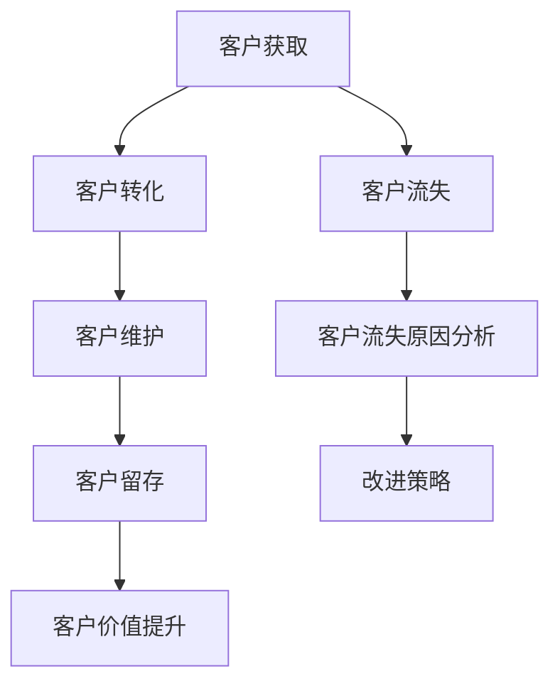

                 

## 《创业公司的客户生命周期管理：最大化客户价值》

### 关键词：客户生命周期管理、客户获取、转化、留存、价值评估、实战案例

#### 摘要：
本文将探讨创业公司在客户生命周期管理方面的关键策略和实践。通过详细分析客户生命周期的各个阶段，包括获取、转化、维护和留存，以及提升客户价值的方法，我们将提供一套完整的客户生命周期管理框架。同时，通过实际案例的深入剖析，读者将了解如何在实际运营中应用这些策略，从而实现客户价值的最大化。

### 目录大纲

1. **客户生命周期管理基础**
   - 客户生命周期管理概述
   - 获取客户
   - 转化客户
   - 维护客户
   - 提升客户价值
   - 客户生命周期管理实战案例

2. **获取客户**
   - 获取客户的渠道分析
   - 营销策略与预算分配
   - 客户细分与目标市场确定
   - 客户获取策略实施与效果评估

3. **转化客户**
   - 客户转化率计算公式
   - 转化客户的关键因素
   - 客户转化策略
   - 客户转化效果评估与优化

4. **维护客户**
   - 客户关系管理
   - 客户满意度调查与反馈
   - 客户忠诚度培养策略
   - 客户留存策略

5. **提升客户价值**
   - 客户价值评估
   - 客户价值提升策略

6. **客户生命周期管理实战案例**
   - 案例介绍
   - 案例分析
   - 案例启示与经验总结

7. **附录**
   - 客户生命周期管理常用工具与资源
   - 客户生命周期管理流程图

---

在接下来的内容中，我们将逐步深入分析客户生命周期的各个阶段，并提供具体的策略和工具，帮助创业公司实现客户价值的最大化。首先，让我们从客户生命周期管理的概述开始。

---

### 客户生命周期管理概述

#### 1.1 客户生命周期的定义与重要性

客户生命周期（Customer Lifecycle）是指客户从首次接触企业产品或服务开始，到最终结束与企业的关系的整个过程。它通常被分为以下几个阶段：获取（Acquisition）、转化（Conversion）、维护（Retention）和留存（Loyalty）。这四个阶段共同构成了客户生命周期管理的核心内容。

客户生命周期管理的重要性体现在以下几个方面：

1. **提升客户价值**：通过全面管理客户生命周期，企业可以更有效地挖掘客户的潜在价值，从而实现收益的最大化。
2. **优化资源分配**：了解客户在不同生命周期阶段的特征，有助于企业合理分配资源，提高营销和服务的有效性。
3. **增强客户满意度**：通过提供个性化的服务和体验，提高客户满意度，从而促进客户的忠诚度和复购率。
4. **降低客户流失率**：通过有效的维护和留存策略，减少客户流失，保护企业市场份额。

在客户生命周期管理中，我们可以用以下公式来概括客户生命周期（L\_C）：

\[ L_{C} = A \times B \times C \times D \]

其中：
- \( A \)：获取（Acquisition），表示客户获取的数量和成本；
- \( B \)：转化（Conversion），表示客户从潜在客户转化为实际购买者的比例；
- \( C \)：维护（Retention），表示客户对企业保持忠诚和持续购买的比例；
- \( D \)：留存（Loyalty），表示客户对企业长期忠诚和推荐的比例。

#### 1.2 客户生命周期管理的基本概念

1. **获取（Acquisition）**：获取阶段是指企业通过各种渠道吸引潜在客户，使其对企业产品或服务产生兴趣。这一阶段的关键是增加客户的曝光度和知名度。

2. **转化（Conversion）**：转化阶段是指潜在客户转化为实际购买者的过程。这一阶段的关键是提供有吸引力的产品或服务，并通过有效的营销策略提升客户的购买意愿。

3. **维护（Retention）**：维护阶段是指企业通过持续的服务和体验来保持现有客户的忠诚度。这一阶段的关键是提供优质的客户服务和个性化体验，以增加客户的满意度和忠诚度。

4. **留存（Loyalty）**：留存阶段是指企业通过持续的价值提供和客户互动，使客户对企业形成长期忠诚和依赖。这一阶段的关键是建立深度客户关系，实现客户的长期价值。

#### 1.3 客户生命周期管理策略

1. **获取策略**：
   - 分析目标市场，确定潜在客户群体；
   - 选择合适的获取渠道，如广告、社交媒体、线下活动等；
   - 制定有针对性的营销计划，提高客户获取效率。

2. **转化策略**：
   - 优化产品或服务，提升客户满意度；
   - 设计吸引人的营销活动，提高客户转化率；
   - 提供优质的客户体验，增加客户的购买意愿。

3. **维护策略**：
   - 建立客户关系管理系统，记录客户信息和互动历史；
   - 定期与客户沟通，提供定制化的服务和解决方案；
   - 收集客户反馈，不断优化产品和服务。

4. **留存策略**：
   - 提供持续的价值，如优惠、积分制度等，增加客户的忠诚度；
   - 开展忠诚度计划，如会员制度、VIP服务等，提升客户的归属感；
   - 通过深度互动和个性化服务，建立长期的客户关系。

#### 1.4 客户生命周期管理工具与技术

1. **CRM系统**：客户关系管理系统（CRM）是一种有效的客户生命周期管理工具，可以帮助企业记录和管理客户信息，提高客户满意度和服务质量。

2. **数据分析工具**：通过对客户数据的分析，企业可以更深入地了解客户行为和需求，从而制定更精准的营销策略和客户服务方案。

3. **营销自动化**：营销自动化工具可以帮助企业自动化营销流程，提高营销效率，降低成本。

4. **客户互动平台**：通过搭建客户互动平台，如社交媒体、论坛等，企业可以与客户进行实时互动，增加客户参与度和忠诚度。

通过上述策略和工具，创业公司可以系统地管理客户生命周期，提高客户满意度和忠诚度，实现客户价值的最大化。

---

在接下来的章节中，我们将分别探讨获取客户、转化客户、维护客户和留存客户的策略和实践，帮助创业公司实现客户生命周期管理的全面优化。

---

### 获取客户

#### 2.1 获取客户的渠道分析

在客户生命周期管理中，获取客户是整个流程的第一步，也是至关重要的一步。有效的客户获取策略能够帮助企业吸引大量潜在客户，为后续的转化和留存打下坚实基础。以下是对几种常见客户获取渠道的分析：

1. **广告**：
   - 广告是最传统、也是最常见的客户获取渠道之一。企业可以通过各种广告形式，如电视广告、报纸广告、户外广告等，向潜在客户传达产品或服务的信息。
   - **优点**：覆盖面广，品牌宣传效果好。
   - **缺点**：成本较高，难以精准定位潜在客户。

2. **搜索引擎优化（SEO）**：
   - SEO是指通过优化网站内容和结构，提高在搜索引擎结果页面的排名，从而吸引潜在客户访问企业网站。
   - **优点**：长期效果显著，客户获取成本较低。
   - **缺点**：优化周期较长，需要持续投入。

3. **社交媒体营销**：
   - 社交媒体营销是指通过社交媒体平台（如微信、微博、Facebook等）发布内容、互动和推广产品或服务，吸引潜在客户。
   - **优点**：互动性强，传播速度快，客户参与度高。
   - **缺点**：效果难以量化，需投入大量时间和精力。

4. **内容营销**：
   - 内容营销是指通过创作和发布高质量的内容，如博客文章、电子书、视频等，吸引潜在客户的注意力，提高品牌知名度和影响力。
   - **优点**：客户获取成本低，有助于建立品牌权威。
   - **缺点**：内容创作和推广需要专业技能和经验。

5. **线下活动**：
   - 线下活动包括展会、讲座、论坛等，通过直接与潜在客户面对面交流，提高品牌知名度和客户转化率。
   - **优点**：互动性强，客户体验直接。
   - **缺点**：覆盖面有限，成本较高。

6. **口碑营销**：
   - 口碑营销是通过现有客户的推荐和好评，吸引潜在客户。
   - **优点**：可信度高，客户获取成本低。
   - **缺点**：效果受限于现有客户群体。

在选择客户获取渠道时，企业需要综合考虑以下因素：

- **目标市场**：了解目标客户的特点和需求，选择最适合的获取渠道。
- **资源限制**：根据企业的预算和人力资源，选择性价比高的获取渠道。
- **品牌定位**：根据品牌形象和价值观，选择符合品牌调性的获取渠道。

通过多渠道、多角度的获取策略，企业可以最大限度地扩大潜在客户的覆盖面，提高客户获取效率。

#### 2.2 营销策略与预算分配

一旦确定了合适的客户获取渠道，企业需要制定详细的营销策略，并合理分配预算，以确保营销活动的有效执行。以下是一些关键的营销策略和预算分配建议：

1. **制定明确的营销目标**：
   - 在开始营销活动之前，企业需要明确营销目标，如增加网站访问量、提高转化率、扩大品牌知名度等。
   - **例子**：目标是在下个月通过SEO和社交媒体营销，将网站访问量提升20%，同时将产品转化率提高10%。

2. **分配预算**：
   - 根据不同的获取渠道，合理分配预算。一般建议将大部分预算投入到效果较好的渠道，如SEO和社交媒体营销。
   - **公式**：预算分配 \( M_{\text{budget}} = B \times \frac{1}{\text{渠道}} \)，其中 \( B \) 为总预算，\( \text{渠道} \) 为不同获取渠道。
   - **例子**：如果总预算为100万元，可以将80万元分配给SEO和社交媒体营销，10万元分配给广告和线下活动。

3. **制定详细的营销计划**：
   - 制定详细的营销计划，包括营销活动的时间、内容、执行步骤等。
   - **例子**：在SEO方面，每周发布两篇高质量博客文章，每月进行一次关键词优化。

4. **跟踪和评估效果**：
   - 在营销活动执行过程中，定期跟踪和评估效果，如网站流量、转化率、客户反馈等。
   - **工具**：使用Google Analytics、CRM系统等工具进行数据收集和分析。
   - **例子**：每周分析一次SEO和社交媒体营销的数据，根据分析结果调整策略。

5. **优化和调整**：
   - 根据跟踪和评估结果，及时优化和调整营销策略。
   - **原则**：不断测试和优化，寻找最佳的营销组合。
   - **例子**：如果SEO效果不佳，可以增加内容营销的投入，或者调整关键词策略。

通过科学合理的营销策略和预算分配，企业可以最大限度地提高客户获取效率，实现营销目标。

#### 2.3 客户细分与目标市场确定

在获取客户的过程中，客户细分和目标市场确定是至关重要的步骤。通过明确目标市场，企业可以更有针对性地进行营销，提高客户获取的效果。以下是一些关键步骤和方法：

1. **了解目标市场**：
   - 在确定目标市场之前，企业需要深入了解目标客户的特点、需求和行为。
   - **方法**：通过市场调研、客户访谈、竞争对手分析等方式获取信息。

2. **客户细分**：
   - 根据客户的特点和需求，将市场细分为多个子市场。
   - **方法**：可以使用人口统计、行为统计、心理统计等方式进行细分。

3. **确定目标市场**：
   - 根据企业的资源和能力，选择最有利可图的目标市场。
   - **原则**：选择市场需求大、竞争对手少的细分市场。

4. **制定目标市场策略**：
   - 针对目标市场，制定有针对性的营销策略，如广告、促销、内容等。
   - **例子**：如果目标市场是年轻女性，可以在社交媒体平台上发布时尚美妆内容，并进行相关产品的促销。

通过客户细分和目标市场确定，企业可以更精准地定位潜在客户，提高营销效果。

#### 2.4 客户获取策略实施与效果评估

在客户获取策略实施过程中，企业需要关注以下几个方面，以确保策略的有效性和持续优化：

1. **执行策略**：
   - 按照制定的营销计划，执行各项客户获取活动。
   - **步骤**：制定详细的活动执行计划，包括时间表、责任人、执行步骤等。

2. **跟踪效果**：
   - 通过各种工具和指标，跟踪客户获取活动的效果。
   - **指标**：网站流量、点击率、转化率、客户满意度等。

3. **分析数据**：
   - 对获取的数据进行详细分析，了解客户获取活动的效果。
   - **方法**：使用数据分析工具，如Google Analytics、CRM系统等。

4. **优化策略**：
   - 根据分析结果，及时调整和优化客户获取策略。
   - **原则**：不断测试和优化，寻找最佳策略组合。

5. **评估ROI**：
   - 定期评估客户获取活动的投资回报率（ROI），确保资源的有效利用。
   - **公式**：ROI = （收入 - 成本）/ 成本

通过有效的客户获取策略实施和效果评估，企业可以不断提高客户获取效率，实现营销目标。

---

在获取客户的过程中，合理的渠道选择、精准的市场定位和有效的策略实施是关键。接下来，我们将探讨客户转化的关键因素和策略。

---

### 转化客户

#### 3.1 客户转化率计算公式

客户转化率（Conversion Rate）是衡量客户获取策略成功与否的重要指标，它反映了潜在客户转化为实际购买者的比例。客户转化率的计算公式如下：

\[ \text{转化率} = \frac{\text{成功转化客户数}}{\text{接触客户数}} \]

其中：
- 成功转化客户数：指在特定营销活动中，完成预定目标的客户数量，如注册、购买、下载等。
- 接触客户数：指参与营销活动的总客户数量。

客户转化率可以进一步细分为不同阶段的转化率，如访客到注册转化率、注册到购买转化率等，以全面评估营销活动的效果。

#### 3.2 转化客户的关键因素

提高客户转化率需要综合考虑多个因素，以下是一些关键因素：

1. **产品质量**：
   - 产品质量是客户购买决策的重要因素。高质量的产品能够提高客户的满意度和信任度，从而增加转化率。

2. **价格**：
   - 价格是影响客户购买决策的重要因素之一。合理的价格策略能够吸引更多潜在客户，提高转化率。

3. **品牌影响力**：
   - 品牌影响力是客户信任和忠诚的重要基础。强大的品牌能够提高客户的购买意愿，从而增加转化率。

4. **用户体验**：
   - 优质的用户体验能够提高客户的满意度和忠诚度。包括网站界面设计、购物流程、售后服务等，都需要考虑用户体验。

5. **营销策略**：
   - 有效的营销策略能够吸引更多潜在客户，并提高转化率。包括内容营销、社交媒体推广、广告投放等。

6. **客户互动**：
   - 与客户的互动能够提高客户满意度和忠诚度，从而增加转化率。包括客户咨询、反馈、互动活动等。

7. **竞争对手分析**：
   - 分析竞争对手的营销策略和产品特点，可以为企业提供改进方向，提高转化率。

#### 3.3 客户转化策略

为了提高客户转化率，企业可以采取以下策略：

1. **提供优惠**：
   - 通过提供优惠券、折扣、限时优惠等，吸引客户购买。

2. **增强售后服务**：
   - 提供优质的售后服务，包括快速响应客户咨询、退换货政策等，提高客户满意度。

3. **优化用户体验**：
   - 优化网站界面设计，简化购物流程，提供个性化推荐等，提高用户体验。

4. **营销活动**：
   - 开展针对性的营销活动，如限时抢购、团购、抽奖等，提高客户购买意愿。

5. **客户互动**：
   - 通过社交媒体、邮件、电话等方式，与客户保持互动，提供定制化的服务和解决方案。

6. **数据分析**：
   - 通过数据分析工具，监控和优化营销活动效果，不断调整策略。

#### 3.4 客户转化效果评估与优化

评估客户转化效果是优化转化策略的关键步骤，以下是一些评估方法和优化建议：

1. **数据收集**：
   - 收集与客户转化相关的数据，如网站流量、转化率、客户满意度等。

2. **数据分析**：
   - 对收集的数据进行详细分析，识别转化过程中的问题和优化机会。

3. **A/B测试**：
   - 通过A/B测试，对比不同策略的效果，找出最佳策略。

4. **持续优化**：
   - 根据分析结果，不断调整和优化营销策略，提高客户转化率。

5. **ROI评估**：
   - 定期评估客户转化活动的投资回报率（ROI），确保资源利用效率。

通过科学的数据分析和持续优化，企业可以不断提高客户转化率，实现营销目标。

---

在客户转化过程中，关键因素和策略的科学应用至关重要。接下来，我们将探讨如何维护客户，确保客户在购买后能够持续满意并保持忠诚。

---

### 维护客户

#### 4.1 客户关系管理

客户关系管理（Customer Relationship Management，CRM）是企业通过系统化的方法来管理客户信息和互动过程，以提高客户满意度和忠诚度的策略。CRM的核心目标是通过维护和加强客户关系，实现客户价值的最大化。

1. **CRM的目的与意义**：

   - **提高客户满意度**：通过CRM系统，企业可以更好地了解客户需求，提供个性化的服务和解决方案，从而提高客户满意度。
   - **增强客户忠诚度**：CRM系统可以帮助企业建立长期客户关系，通过持续的价值提供和互动，增强客户的忠诚度。
   - **降低客户流失率**：通过CRM系统，企业可以及时发现客户流失的信号，并采取针对性的措施，减少客户流失。
   - **提升运营效率**：CRM系统可以自动化管理客户信息，提高销售、服务和营销的效率，降低运营成本。

2. **CRM的基本概念**：

   - **CRM系统**：CRM系统是一种集成软件，用于管理客户信息、销售机会、服务请求等。常见的CRM系统包括Salesforce、Microsoft Dynamics 365等。
   - **客户数据**：CRM系统的基础是客户数据，包括客户基本信息、购买历史、互动记录等。
   - **客户生命周期**：CRM系统通过客户生命周期模型，追踪客户从获取、转化、维护到留存的全过程。

3. **CRM的策略与工具**：

   - **数据收集与整合**：通过多种渠道（如网站、社交媒体、客服系统等）收集客户数据，并将其整合到CRM系统中。
   - **客户画像**：基于客户数据，构建详细的客户画像，包括人口统计信息、行为特征、需求偏好等。
   - **个性化服务**：根据客户画像，提供个性化的服务和推荐，提高客户满意度。
   - **互动管理**：通过CRM系统，记录和管理与客户的互动历史，提高客户沟通效率。
   - **自动化流程**：利用CRM系统中的自动化工具，如邮件模板、销售预测等，提高工作效率。

#### 4.2 客户关系管理的工具与方法

1. **CRM系统**：

   - **功能**：CRM系统通常包含客户信息管理、销售管理、营销管理、服务管理等功能模块。
   - **实施**：实施CRM系统需要考虑以下几个方面：需求分析、系统配置、数据迁移、员工培训等。

2. **客户数据分析工具**：

   - **功能**：客户数据分析工具可以帮助企业挖掘客户行为、需求趋势等。
   - **应用**：用于优化营销策略、提升客户体验、提高客户满意度等。

3. **客户互动平台**：

   - **功能**：客户互动平台（如在线客服、社交媒体等）提供实时与客户互动的渠道。
   - **应用**：用于解答客户疑问、处理客户问题、增加客户参与度等。

4. **客户忠诚度计划**：

   - **功能**：客户忠诚度计划（如积分制度、会员制度等）用于激励客户持续消费。
   - **应用**：用于提高客户留存率、增加客户生命周期价值等。

#### 4.3 客户满意度调查与反馈

客户满意度调查是企业了解客户需求和体验的重要手段。以下是一些关键步骤和方法：

1. **设计调查问卷**：

   - **内容**：问卷应包括客户对企业产品、服务、互动体验等方面的满意度评价。
   - **形式**：可以选择在线调查、电话调查、面对面访谈等方式。

2. **分发问卷**：

   - **渠道**：通过网站、社交媒体、邮件等渠道分发问卷，提高参与度。
   - **时机**：选择合适的时机，如购买后、服务后等。

3. **收集与分析反馈**：

   - **方法**：收集问卷结果，并进行数据整理和分析。
   - **工具**：可以使用数据分析工具，如Excel、SPSS等。

4. **反馈与改进**：

   - **措施**：根据分析结果，制定改进措施，如优化产品、改进服务、调整策略等。
   - **跟进**：与客户进行沟通，告知改进措施，并跟踪客户满意度变化。

#### 4.4 客户忠诚度培养策略

客户忠诚度是企业长期发展的重要保障。以下是一些有效的客户忠诚度培养策略：

1. **提供优质服务**：

   - **原则**：始终将客户需求放在首位，提供优质的产品和服务。
   - **措施**：建立快速响应的客服体系，提供个性化的解决方案等。

2. **增强互动体验**：

   - **渠道**：通过社交媒体、邮件、短信等渠道与客户保持互动。
   - **活动**：举办互动活动，如在线问答、用户评价等，提高客户参与度。

3. **提供优惠与激励**：

   - **方式**：提供优惠券、折扣、会员制度等优惠措施。
   - **原则**：让客户感受到实际的价值和关怀。

4. **构建社区文化**：

   - **平台**：建立客户社区，提供交流、分享和互助的平台。
   - **目标**：增强客户归属感和认同感，提高客户忠诚度。

通过有效的客户关系管理策略，企业可以更好地维护客户，提高客户满意度和忠诚度，从而实现长期发展。

---

在客户维护过程中，客户关系管理和满意度调查是关键。接下来，我们将探讨如何通过客户留存策略，进一步巩固客户的忠诚度。

---

### 客户留存策略

客户留存（Customer Retention）是企业通过一系列策略和措施，保持现有客户的持续消费和忠诚度，减少客户流失的过程。客户留存是客户生命周期管理中至关重要的一环，它不仅能够提高客户满意度，还能降低客户获取成本，从而实现企业的长期发展。以下是一些有效的客户留存策略：

#### 5.1 客户留存的重要性

1. **提高客户满意度**：通过持续的价值提供和个性化服务，提高客户的满意度和幸福感，从而增强客户的忠诚度。
2. **降低获取成本**：留住现有客户比获取新客户成本更低。根据统计，增加5%的客户留存率，能够提高至少25%-95%的利润。
3. **提升客户生命周期价值**：通过增加客户的复购率和生命周期价值，实现企业的持续收益。
4. **增强品牌忠诚度**：长期的客户关系有助于建立品牌忠诚度，提高市场竞争力。

#### 5.2 客户留存策略

1. **提供优质服务**：

   - **目标**：确保客户在购买和使用过程中享受到高效、专业、满意的服务。
   - **措施**：建立完善的售后服务体系，包括快速响应、个性化解决方案、定期回访等。

2. **增强客户互动**：

   - **目标**：通过互动增加客户参与度和忠诚度。
   - **措施**：开展线上线下的互动活动，如用户论坛、线下聚会、会员活动等。

3. **提供优惠与激励**：

   - **目标**：通过优惠和激励措施吸引客户持续消费。
   - **措施**：提供优惠券、会员折扣、积分兑换、礼品赠送等。

4. **优化产品和服务**：

   - **目标**：不断满足客户需求，提高客户满意度。
   - **措施**：收集客户反馈，及时优化产品和服务。

5. **个性化推荐**：

   - **目标**：提供个性化的产品和服务，提高客户满意度。
   - **措施**：利用数据分析，为不同客户提供个性化的推荐。

6. **建立客户社区**：

   - **目标**：增强客户归属感和认同感。
   - **措施**：创建客户社区，提供交流、分享和互助的平台。

#### 5.3 客户流失率计算公式

客户流失率（Churn Rate）是指在一定时间内，因各种原因离开企业的客户数量占总客户数量的比例。计算公式如下：

\[ \text{流失率} = \frac{\text{流失客户数}}{\text{总客户数}} \]

其中，流失客户数是指在一定时间内失去的企业客户数量。流失率是衡量客户留存效果的重要指标，可以用来评估客户维护策略的有效性。

#### 5.4 客户留存效果评估与优化

1. **数据收集与分析**：

   - **指标**：收集与客户留存相关的数据，如客户流失率、客户满意度、客户生命周期价值等。
   - **工具**：使用CRM系统、客户满意度调查等工具进行数据收集和分析。

2. **监控与预警**：

   - **机制**：建立流失预警机制，及时发现潜在流失客户。
   - **措施**：通过数据分析，找出流失客户的主要原因，并采取针对性的措施。

3. **持续优化**：

   - **原则**：根据分析结果，持续优化客户留存策略。
   - **方法**：通过A/B测试、用户体验优化等手段，不断改进客户留存策略。

4. **客户反馈**：

   - **目标**：了解客户需求和反馈，持续改进产品和服务。
   - **措施**：定期进行客户满意度调查，收集客户反馈，并根据反馈调整策略。

通过科学的数据分析、持续优化和客户反馈，企业可以有效地降低客户流失率，提高客户留存率，实现长期发展。

---

客户留存策略的优化是客户生命周期管理的最后一步。接下来，我们将探讨如何评估客户价值，以进一步挖掘客户的潜在价值。

---

### 提升客户价值

#### 6.1 客户价值的定义与衡量

客户价值（Customer Value）是指客户与企业进行交易或互动过程中所获得的收益和满足感。它既包括客户在购买产品或服务时直接支付的费用，也包括客户在使用产品或服务过程中获得的体验和满足感。衡量客户价值对于企业制定有效的客户生命周期管理策略至关重要。

客户价值的定义可以分解为以下几个方面：

1. **收益**：客户通过购买产品或服务所获得的直接经济收益，如节省成本、提高效率等。
2. **体验**：客户在使用产品或服务过程中所获得的体验和满足感，包括品牌感知、服务质量、产品性能等。
3. **忠诚度**：客户对企业的忠诚度和依赖程度，表现为复购率、推荐率等。

衡量客户价值的方法主要包括以下几种：

1. **财务指标**：
   - **生命周期价值（CLV）**：客户在整个生命周期中为企业带来的净收益。计算公式为：
     \[ \text{CLV} = \text{收益} - \text{成本} \]
   - **客户获取成本（CAC）**：获取一个客户所需的平均成本。计算公式为：
     \[ \text{CAC} = \frac{\text{营销费用} + \text{销售费用} + \text{客户服务费用}}{\text{新客户数}} \]

2. **客户满意度**：
   - **满意度评分**：通过调查问卷或访谈，收集客户对产品或服务的满意度评分。
   - **NPS（净推荐值）**：衡量客户推荐意愿的指标，计算公式为：
     \[ \text{NPS} = \text{推荐者比例} - \text{贬损者比例} \]

3. **客户互动**：
   - **互动频率**：客户与企业互动的频率，如购买次数、咨询次数等。
   - **参与度**：客户在社区、论坛等互动平台的参与程度，如发帖数量、回复数量等。

通过上述指标，企业可以全面衡量客户价值，为制定客户价值提升策略提供依据。

#### 6.2 客户价值评估模型

客户价值评估模型（Customer Value Assessment Model）是一种用于评估和衡量客户价值的方法。以下是一个简单的客户价值评估模型：

\[ V_{C} = f(R_{C}, T_{C}, L_{C}) \]

其中：
- \( V_{C} \)：客户价值
- \( R_{C} \)：客户收益
- \( T_{C} \)：客户体验
- \( L_{C} \)：客户忠诚度

该模型假设客户价值是由客户收益、客户体验和客户忠诚度三个因素共同决定的。具体计算方法如下：

1. **客户收益（\( R_{C} \)）**：
   - **直接收益**：客户通过购买产品或服务所获得的直接经济收益，如节省成本、增加收入等。
   - **间接收益**：客户在使用产品或服务过程中获得的间接收益，如提高工作效率、提升生活质量等。

2. **客户体验（\( T_{C} \)）**：
   - **产品质量**：产品或服务的质量水平，如可靠性、性能等。
   - **服务质量**：企业提供的服务水平，如响应速度、解决能力等。
   - **品牌体验**：客户对品牌的整体感知和体验，如品牌形象、品牌故事等。

3. **客户忠诚度（\( L_{C} \)）**：
   - **复购率**：客户再次购买同一产品或服务的概率。
   - **推荐率**：客户向他人推荐产品或服务的意愿。
   - **参与度**：客户在社区、论坛等互动平台的参与程度。

通过以上三个因素的评估，企业可以综合衡量客户价值。实际应用中，可以根据具体情况调整模型的参数和计算方法。

#### 6.3 客户价值提升策略

提升客户价值是客户生命周期管理的关键目标之一。以下是一些有效的客户价值提升策略：

1. **优化产品和服务**：
   - **目标**：提高产品或服务的质量，满足客户需求。
   - **措施**：定期收集客户反馈，进行产品改进，提升服务质量。

2. **增强客户体验**：
   - **目标**：提供优质的客户体验，提高客户满意度。
   - **措施**：简化购物流程，提供个性化推荐，提升品牌形象。

3. **提供额外价值**：
   - **目标**：通过提供额外价值，增加客户满意度，提升客户忠诚度。
   - **措施**：提供优惠活动、积分兑换、会员制度等。

4. **客户互动与反馈**：
   - **目标**：建立良好的客户关系，提高客户忠诚度。
   - **措施**：定期与客户沟通，收集客户反馈，及时解决问题。

5. **数据分析与优化**：
   - **目标**：利用数据分析，持续优化客户价值提升策略。
   - **措施**：使用CRM系统、客户满意度调查等工具，进行数据收集和分析。

通过上述策略，企业可以全面提升客户价值，实现客户满意度和忠诚度的提高，从而推动企业的长期发展。

---

客户价值的提升是客户生命周期管理的核心目标。接下来，我们将通过一个实际的创业公司案例，展示如何在实际运营中应用上述客户生命周期管理的策略。

---

### 客户生命周期管理实战案例

#### 7.1 案例介绍

本案例将介绍一家名为“绿源科技”（GreenTech）的创业公司，该公司专注于开发环保智能电动汽车。绿源科技在客户生命周期管理方面采取了全面的策略，以最大化客户价值，提高市场竞争力。

#### 7.2 案例分析

**客户获取阶段**：

1. **渠道选择**：
   - 绿源科技选择了线上和线下多种渠道进行客户获取。线上渠道包括搜索引擎优化（SEO）、社交媒体营销、内容营销等；线下渠道包括参加汽车展会、举办线下体验活动等。

2. **营销策略**：
   - 通过SEO优化，提高网站在搜索引擎中的排名，吸引潜在客户访问。
   - 利用社交媒体平台（如微博、微信公众号等）发布环保、智能电动汽车的相关内容，吸引目标客户关注。
   - 开展内容营销，发布高质量的博客文章、视频等，提高品牌知名度和影响力。

**客户转化阶段**：

1. **转化率提升**：
   - 通过优化网站设计，简化购车流程，提高用户转化率。
   - 提供限时优惠活动，如折扣、礼品赠送等，刺激客户购买欲望。
   - 通过线上线下互动，及时解答客户疑问，提高客户信任度。

**客户维护阶段**：

1. **客户关系管理**：
   - 利用CRM系统，记录和管理客户信息，提供个性化的售后服务。
   - 定期与客户沟通，了解客户需求和反馈，提供定制化的解决方案。
   - 开展会员制度，提供积分兑换、专属优惠等，增强客户忠诚度。

**客户留存阶段**：

1. **留存策略**：
   - 通过提供优质的售后服务，如快速响应的维修服务、定期保养等，提高客户满意度。
   - 开展车主社区活动，如车主聚会、驾驶培训等，增强客户归属感。
   - 定期推出新品体验活动，吸引客户持续关注和购买。

**客户价值提升阶段**：

1. **价值评估**：
   - 利用数据分析工具，评估客户的生命周期价值和忠诚度。
   - 通过定期客户满意度调查，了解客户需求，优化产品和服务。

2. **价值提升**：
   - 通过提供增值服务，如车联网服务、智能驾驶辅助系统等，提高客户满意度。
   - 开展会员积分制度，鼓励客户持续消费和推荐。
   - 利用大数据分析，为不同客户提供个性化的产品推荐和解决方案。

#### 7.3 案例启示与经验总结

1. **全渠道策略**：通过线上线下多种渠道进行客户获取，提高客户获取效率。
2. **个性化服务**：利用CRM系统，提供个性化的售后服务和互动体验，增强客户满意度。
3. **持续优化**：通过数据分析，持续优化产品和服务，提高客户价值。
4. **社区文化**：建立车主社区，增强客户归属感，提高客户忠诚度。
5. **价值挖掘**：通过数据分析和客户满意度调查，全面了解客户需求，提供增值服务。

通过本案例的分析，我们可以看到，绿源科技通过系统的客户生命周期管理策略，成功地提高了客户满意度和忠诚度，实现了客户价值的最大化。

---

本案例展示了客户生命周期管理在实际创业中的应用，通过多渠道获取客户、个性化服务、数据分析等手段，实现了客户价值的最大化。接下来，我们将总结客户生命周期管理的关键点和常用工具。

---

### 附录

#### 附录A：客户生命周期管理常用工具与资源

1. **CRM系统**：
   - **Salesforce**：全球领先的CRM解决方案，提供全面的客户管理功能。
   - **Microsoft Dynamics 365**：集营销、销售、客户服务于一体的CRM平台。
   - **Zoho CRM**：功能丰富的CRM系统，适合中小企业。

2. **客户数据分析工具**：
   - **Google Analytics**：分析网站流量和用户行为，提供详细的报告和洞察。
   - **Tableau**：数据可视化工具，帮助用户轻松理解复杂数据。
   - **Power BI**：微软推出的商业智能工具，提供丰富的数据分析功能。

3. **营销自动化工具**：
   - **HubSpot**：集营销自动化、CRM于一体的平台，帮助用户实现高效营销。
   - **Marketo**：营销自动化工具，提供全面的营销管理功能。
   - **Pardot**：Salesforce的营销自动化解决方案，适用于企业级用户。

4. **客户互动平台**：
   - **Slack**：团队沟通工具，提高内部协作效率。
   - **Trello**：项目管理工具，帮助团队高效协作。
   - **Asana**：任务管理工具，确保项目进度和目标达成。

5. **客户满意度调查工具**：
   - **SurveyMonkey**：在线调查平台，提供多种类型的问卷设计和分析功能。
   - **Qualtrics**：专业的调查和分析工具，适用于复杂的市场研究。
   - **Google Forms**：Google提供的简单易用的调查问卷工具。

#### 附录B：客户生命周期管理流程图

以下是一个简单的客户生命周期管理流程图，使用Mermaid语言表示：

通过上述流程图，我们可以清晰地看到客户生命周期管理的各个阶段及其相互关系，为企业的运营决策提供指导。

---

通过本文的探讨，我们详细了解了创业公司如何通过客户生命周期管理实现客户价值的最大化。客户生命周期管理不仅涉及获取、转化、维护和留存客户，还包括提升客户价值的策略和实践。创业公司应利用CRM系统、数据分析工具、营销自动化工具等，科学地进行客户管理，提高客户满意度和忠诚度。通过不断优化策略，创业公司可以实现在竞争激烈的市场中脱颖而出。

---

### 作者信息

**作者：AI天才研究院/AI Genius Institute & 禅与计算机程序设计艺术 /Zen And The Art of Computer Programming**

