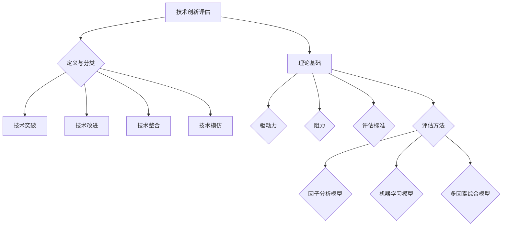

                 

# 《创业公司的技术创新评估体系》

## 摘要

本文旨在探讨创业公司的技术创新评估体系，通过对技术创新评估的核心概念、理论模型、评估方法及其实践应用的全面梳理，帮助创业公司更好地理解技术创新的重要性，构建科学的评估体系，从而在激烈的市场竞争中脱颖而出。本文将从技术创新的定义与分类出发，详细阐述技术创新评估的理论基础和实际应用方法，通过具体的数学模型和案例分析，帮助读者掌握技术创新评估的核心技能。同时，本文还将介绍技术创新评估的工具与平台构建，并分享实际项目中的经验与技巧，为创业公司的技术创新提供有益的指导。

## 引言

### 1.1 创业公司技术创新的重要性

在当今科技快速发展的时代，技术创新已成为推动企业成长和市场竞争的关键因素。对于创业公司而言，技术创新不仅是获取竞争优势的重要手段，更是实现可持续发展的重要保障。创业公司在资源有限、市场竞争激烈的环境下，往往需要通过技术创新来快速抢占市场、提升企业价值。因此，对技术创新进行科学评估，不仅有助于识别和培养有潜力的创新项目，还能为企业的战略决策提供有力支持。

### 1.2 技术创新评估的必要性

技术创新评估是对创新项目进行系统性、客观性分析的重要过程。它不仅能够帮助企业识别创新机会、评估创新风险，还能为资源配置和项目决策提供科学依据。对于创业公司而言，技术创新评估的必要性体现在以下几个方面：

1. **识别创新潜力**：通过技术创新评估，创业公司可以识别出具有高潜力、符合市场需求的技术创新项目，从而将有限的资源集中于最有价值的创新领域。

2. **规避风险**：技术创新过程中存在诸多不确定性因素，如技术实现难度、市场接受度等。通过技术创新评估，创业公司可以提前识别潜在风险，并采取相应措施降低风险。

3. **资源配置**：技术创新评估有助于创业公司合理分配资源，确保资金、人力、技术等资源的有效利用。

4. **战略决策**：技术创新评估为创业公司的战略决策提供了数据支持，有助于企业在技术创新方向上做出更明智的选择。

### 1.3 本书结构概述

本文将从以下七个部分对创业公司的技术创新评估体系进行深入探讨：

1. **引言**：介绍创业公司技术创新的重要性及技术创新评估的必要性。
2. **技术创新评估基础**：阐述技术创新的核心概念、理论模型和评估方法。
3. **技术创新评估模型与方法**：详细讲解技术创新评估模型和方法的构建原理。
4. **技术创新评估实践**：通过数学模型和案例分析，展示技术创新评估的实际应用。
5. **技术创新评估工具与平台**：介绍技术创新评估工具与平台的构建和应用。
6. **技术创新评估应用与启示**：分享技术创新评估在项目实战中的应用与经验。
7. **结论与展望**：总结技术创新评估的重要成果，展望创业公司技术创新的未来发展趋势。

通过本文的探讨，希望读者能够全面了解创业公司的技术创新评估体系，掌握评估的核心技能，为企业的技术创新提供有力支持。

## 第二部分：技术创新评估基础

### 2.1 技术创新概述

#### 2.1.1 技术创新的定义与分类

技术创新是指通过技术手段、方法、工具等改进现有产品、服务或生产过程，以实现更高效、更便捷、更具竞争力的目的。技术创新可以包括技术突破、技术改进、技术整合等多个层面。

根据创新的内容和形式，技术创新可以分为以下几种类型：

1. **技术突破**：指通过研发新的技术或原理，实现重大技术变革的创新。例如，5G技术的研发和应用，极大地提升了移动通信的速度和稳定性。
2. **技术改进**：指在现有技术基础上，通过优化设计、改进工艺等方式，提高产品或服务的性能、质量、效率等。例如，汽车发动机的涡轮增压技术，显著提升了发动机的性能和燃油效率。
3. **技术整合**：指将不同的技术或产品进行整合，创造新的产品或服务。例如，智能手机的问世，是将通信、计算、多媒体等多种技术整合在一起。
4. **技术模仿**：指模仿或借鉴其他公司或领域的成功技术，进行适应性改进和创新。例如，某些初创公司通过模仿成功公司的商业模式进行创新，迅速在市场上获得成功。

#### 2.1.2 技术创新的驱动因素

技术创新的驱动因素多种多样，主要包括以下几个方面：

1. **市场需求**：市场需求是技术创新的主要驱动力。消费者对产品或服务的需求变化，往往促使企业进行技术创新，以满足市场需求。
2. **竞争压力**：在激烈的市场竞争中，企业需要通过技术创新来保持竞争优势。技术创新可以帮助企业提升产品或服务的质量、性能和价格，从而在市场中获得更大的份额。
3. **技术进步**：随着科技的快速发展，新技术、新材料、新工艺的不断涌现，为企业提供了丰富的技术创新机会。
4. **政策支持**：政府的政策支持，如财政补贴、税收优惠、研发资助等，对技术创新起到了重要的推动作用。
5. **企业战略**：企业战略中的技术创新目标，决定了企业技术创新的方向和力度。例如，一些企业将技术创新视为核心竞争力，持续加大研发投入，推动技术进步。

#### 2.1.3 技术创新的阻力与挑战

尽管技术创新对于企业的发展至关重要，但在实际操作中，技术创新面临诸多阻力和挑战：

1. **资金压力**：技术创新需要大量的资金投入，包括研发投入、设备购置、人才招聘等。对于初创企业来说，资金压力是一个重大挑战。
2. **技术风险**：技术创新过程中，可能面临技术实现的难度、技术失败的风险。例如，新技术的研发可能遇到难以克服的技术瓶颈，导致项目失败。
3. **市场风险**：技术创新的产品或服务可能无法得到市场的认可，面临市场推广和销售的风险。例如，一些新技术可能因为消费者接受度低，导致市场推广失败。
4. **人才短缺**：技术创新需要专业的人才队伍，包括研发人员、工程师、产品经理等。然而，高素质的人才往往稀缺，对企业技术创新构成挑战。
5. **政策法规**：某些技术创新可能受到政策法规的限制，如环保法规、安全标准等。这可能会影响技术创新的进程和效果。

### 2.2 技术创新评估理论

#### 2.2.1 技术创新评估的概念框架

技术创新评估是指通过对技术创新项目的系统性、客观性分析，评估其技术可行性、市场潜力、风险程度等，为企业的技术创新决策提供科学依据。技术创新评估的概念框架主要包括以下几个方面：

1. **技术评估**：评估技术创新的技术可行性，包括技术实现的难度、技术成熟度等。
2. **市场评估**：评估技术创新的市场潜力，包括市场需求、市场接受度、市场容量等。
3. **风险评估**：评估技术创新的风险程度，包括技术风险、市场风险、财务风险等。
4. **效益评估**：评估技术创新的经济效益，包括投资回报率、盈利能力等。

#### 2.2.2 技术创新评估的标准与方法

技术创新评估的标准与方法多种多样，常见的有以下几种：

1. **定量评估法**：通过量化指标，对技术创新项目进行评估。常用的量化指标包括技术创新的技术成熟度、市场潜力、投资回报率等。
2. **定性评估法**：通过专家意见、案例分析等方式，对技术创新项目进行评估。定性评估法适用于难以量化的创新项目。
3. **多因素综合评估法**：综合考虑多个评估指标，对技术创新项目进行综合评估。常用的综合评估法包括层次分析法（AHP）、灰色关联度法等。

#### 2.2.3 技术创新评估的影响因素

技术创新评估的影响因素复杂多样，主要包括以下几个方面：

1. **技术创新类型**：不同类型的技术创新，评估方法和标准有所不同。例如，技术突破型创新需要重点关注技术实现难度，而技术改进型创新需要重点关注市场潜力。
2. **企业特征**：企业的研发能力、市场地位、资金实力等特征，会影响技术创新评估的结果。例如，研发能力强的企业，可能更倾向于选择技术突破型创新。
3. **市场环境**：市场需求、竞争态势、政策法规等市场环境因素，对技术创新评估具有重要影响。例如，市场需求旺盛的行业，技术创新的市场潜力相对较高。
4. **技术创新阶段**：技术创新的不同阶段，评估重点和方法有所不同。例如，在研发阶段，技术评估是主要关注点；在市场推广阶段，市场评估和风险评估是主要关注点。

通过对技术创新评估基础的理论探讨，创业公司可以更好地理解技术创新的本质和评估方法，为构建科学的评估体系奠定基础。接下来，本文将详细讲解技术创新评估模型的构建原理和具体方法。

### 2.3 核心概念与联系

#### 2.3.1 技术创新的定义与分类

技术创新是指通过技术手段、方法、工具等改进现有产品、服务或生产过程，以实现更高效、更便捷、更具竞争力的目的。技术创新可以包括技术突破、技术改进、技术整合等多个层面。

根据创新的内容和形式，技术创新可以分为以下几种类型：

1. **技术突破**：指通过研发新的技术或原理，实现重大技术变革的创新。例如，5G技术的研发和应用，极大地提升了移动通信的速度和稳定性。
2. **技术改进**：指在现有技术基础上，通过优化设计、改进工艺等方式，提高产品或服务的性能、质量、效率等。例如，汽车发动机的涡轮增压技术，显著提升了发动机的性能和燃油效率。
3. **技术整合**：指将不同的技术或产品进行整合，创造新的产品或服务。例如，智能手机的问世，是将通信、计算、多媒体等多种技术整合在一起。
4. **技术模仿**：指模仿或借鉴其他公司或领域的成功技术，进行适应性改进和创新。例如，某些初创公司通过模仿成功公司的商业模式进行创新，迅速在市场上获得成功。

#### 2.3.2 技术创新评估的理论基础

技术创新评估的理论基础主要包括以下几个方面：

1. **技术创新的驱动力**：市场需求、竞争压力、技术进步、政策支持和企业战略等，都是推动技术创新的重要因素。
2. **技术创新的阻力**：资金压力、技术风险、市场风险、人才短缺和政策法规等，都是影响技术创新成功的关键因素。
3. **技术创新评估的标准**：技术评估、市场评估、风险评估和效益评估，是评估技术创新项目的重要指标。
4. **技术创新评估的方法**：定量评估法、定性评估法和多因素综合评估法，是常见的评估方法。

#### 2.3.3 技术创新评估模型与方法

技术创新评估模型与方法主要包括以下几种：

1. **基于因子分析的评估模型**：通过因子分析，将多个评估指标综合为一个综合得分，用于评估技术创新项目。
2. **基于机器学习的评估模型**：通过机器学习算法，建立预测模型，对技术创新项目的市场潜力、风险程度等进行预测。
3. **多因素综合评估模型**：综合考虑多个评估指标，通过层次分析法、灰色关联度法等，对技术创新项目进行综合评估。

### Mermaid 流程图



通过上述核心概念与联系的阐述，创业公司可以更好地理解技术创新的本质和评估方法，为构建科学的评估体系奠定基础。接下来，本文将详细讲解技术创新评估模型的构建原理和具体方法。

### 第三部分：技术创新评估模型与方法

#### 3.1 技术创新评估模型的构建

技术创新评估模型的构建是进行有效技术创新评估的关键步骤。一个科学的评估模型应能够全面、客观地反映技术创新的各个方面，包括技术可行性、市场潜力、风险程度等。以下将详细探讨几种常见的评估模型及其构建方法。

##### 3.1.1 基于因子分析的评估模型

**因子分析的基本原理**：因子分析是一种统计方法，通过将多个变量归结为几个不可观测的因子，以简化数据分析过程。在技术创新评估中，因子分析可以用来将多个评估指标综合为一个综合得分，从而简化评估过程，提高评估效率。

**因子分析在技术创新评估中的应用**：在技术创新评估中，可以将各种评估指标（如技术成熟度、市场潜力、财务收益等）视为多个变量，通过因子分析将这些变量归结为几个主要因子。每个因子代表技术创新的一个关键方面，如技术成熟度因子、市场潜力因子等。

**因子分析模型的构建流程**：

1. **数据收集**：收集技术创新项目的各种评估指标数据。
2. **因子分析**：通过统计软件（如SPSS、R等）进行因子分析，提取主要因子。
3. **因子得分计算**：根据因子载荷矩阵，计算每个样本的因子得分。
4. **综合得分计算**：将各因子的得分进行加权求和，得到技术创新项目的综合得分。

**示例**：

假设我们收集了以下四个评估指标的数据：技术成熟度（TM）、市场潜力（MP）、财务收益（FR）、研发成本（RC）。通过因子分析，我们将这四个指标归结为两个因子：技术成熟度因子（FTM）和市场潜力因子（FMP）。根据因子载荷矩阵，我们可以得到以下因子得分公式：

$$
FTM = 0.7 \times TM + 0.4 \times MP - 0.2 \times FR + 0.1 \times RC
$$

$$
FMP = 0.3 \times TM + 0.6 \times MP + 0.2 \times FR - 0.3 \times RC
$$

将因子得分进行加权求和，得到技术创新项目的综合得分（FS）：

$$
FS = 0.6 \times FTM + 0.4 \times FMP
$$

##### 3.1.2 基于机器学习的评估模型

**机器学习的基本概念**：机器学习是一种人工智能领域的方法，通过构建模型，使计算机系统能够从数据中学习并做出预测或决策。常见的机器学习算法包括线性回归、决策树、支持向量机、神经网络等。

**常见的机器学习算法**：在技术创新评估中，可以使用各种机器学习算法来建立评估模型。例如，线性回归可以用于预测技术创新的财务收益；决策树可以用于分类技术创新的成功概率；支持向量机可以用于评估技术创新的技术成熟度。

**机器学习在技术创新评估中的应用**：机器学习可以用于预测技术创新的市场潜力、评估技术创新的风险程度等。例如，可以通过训练一个机器学习模型，输入技术创新的相关特征（如技术成熟度、市场需求等），预测该技术创新的市场表现。

**示例**：

假设我们使用决策树算法来评估技术创新的成功概率。我们收集了以下特征数据：技术成熟度（TM）、市场需求（MP）、研发成本（RC）、市场竞争程度（MC）。通过决策树算法，我们可以建立以下评估模型：

1. **训练数据准备**：收集大量的技术创新项目数据，包括上述特征和成功与否的标签。
2. **决策树构建**：使用训练数据，通过决策树算法构建评估模型。
3. **模型评估**：使用验证数据集评估模型的效果，调整模型参数，提高预测准确性。
4. **应用模型**：使用构建好的模型，对新技术创新项目进行评估，预测其成功概率。

**决策树模型示例**：

```plaintext
如果（技术成熟度 > 7 且 市场需求 > 6 且 研发成本 < 5 且 市场竞争程度 < 4），
则成功概率为 90%；
否则，
成功概率为 10%。
```

##### 3.1.3 基于专家系统的评估模型

**专家系统的基本概念**：专家系统是一种模拟人类专家知识和推理能力的计算机系统。在技术创新评估中，专家系统可以用于模拟专家对技术创新项目的评估过程，提供评估建议。

**专家系统在技术创新评估中的应用**：专家系统可以收集专家的意见，通过推理机制，对技术创新项目进行评估。例如，专家系统可以模拟多位专家的评估结果，提供综合评估建议。

**示例**：

假设我们使用专家系统来评估技术创新的市场潜力。我们收集了以下专家意见：技术成熟度（TM1, TM2, ..., TMn）、市场需求（MP1, MP2, ..., MPn）、市场竞争程度（MC1, MC2, ..., MCn）。通过专家系统，我们可以建立以下评估模型：

1. **专家意见收集**：收集多位专家对技术创新项目的评估意见。
2. **推理机制**：通过专家系统的推理机制，综合专家意见，计算市场潜力得分。
3. **评估结果输出**：根据市场潜力得分，给出技术创新项目的市场潜力评估结果。

**专家系统评估模型示例**：

```plaintext
如果（TM1 > 7 且 TM2 > 7 且 TM3 > 7），
则技术成熟度得分为 9；
否则，
技术成熟度得分为 3。

如果（MP1 > 6 且 MP2 > 6 且 MP3 > 6），
则市场需求得分为 9；
否则，
市场需求得分为 3。

如果（MC1 < 4 且 MC2 < 4 且 MC3 < 4），
则市场竞争程度得分为 9；
否则，
市场竞争程度得分为 3。

市场潜力得分 = （技术成熟度得分 + 2 \* 市场需求得分 + 市场竞争程度得分）/ 3
```

通过上述几种技术创新评估模型的构建方法，创业公司可以根据自身情况选择合适的评估模型，对技术创新项目进行科学评估。接下来，本文将介绍几种常见的技术创新评估方法论，帮助创业公司更好地实施技术创新评估。

### 3.2 技术创新评估的方法论

技术创新评估的方法论是指在评估过程中采用的一系列系统化、科学化的方法和步骤，以确保评估过程的客观性、全面性和有效性。以下将介绍几种常见的技术创新评估方法论，包括实证研究方法论和案例分析法。

#### 3.2.1 实证研究方法论

**实证研究的设计与实施**：

1. **研究问题确定**：明确技术创新评估的目标和研究问题。例如，评估某一技术创新项目的技术成熟度、市场潜力或风险程度。

2. **数据收集**：通过问卷调查、访谈、实验等方法，收集与技术创新相关的数据。数据来源可以包括专家意见、企业内部数据、市场调研数据等。

3. **数据预处理**：对收集到的数据进行清洗、筛选和整合，确保数据的准确性和完整性。

4. **模型构建**：根据研究目标和数据特点，选择合适的评估模型和方法。例如，使用因子分析模型、机器学习模型等。

5. **模型训练与验证**：使用训练数据集，对评估模型进行训练和参数调整，确保模型具有良好的预测能力。

6. **结果分析**：使用验证数据集，对评估模型进行测试，分析模型预测结果与实际结果的匹配程度。

7. **结论与建议**：根据评估结果，提出具体的结论和建议，为技术创新决策提供科学依据。

**实证研究的统计分析**：

1. **描述性统计**：对数据的基本特征进行描述，如平均值、中位数、标准差等。

2. **相关性分析**：分析不同变量之间的相关性，了解各变量之间的关系和影响。

3. **假设检验**：通过显著性检验、置信区间等方法，验证研究假设的有效性。

4. **回归分析**：建立回归模型，分析各变量对技术创新评估的影响程度。

#### 3.2.2 案例分析法

**案例选择与整理**：

1. **案例选择**：选择具有代表性、典型性的技术创新项目作为案例研究对象。案例选择应考虑技术创新的类型、企业特征、市场环境等因素。

2. **案例数据收集**：通过文献调研、企业访谈、现场观察等方法，收集与案例相关的数据和信息。

3. **案例整理**：对收集到的案例数据进行整理和分析，提取关键信息和结论。

**案例分析的方法与步骤**：

1. **案例描述**：详细描述案例背景、技术创新内容、实施过程等。

2. **案例评估**：根据评估标准和模型，对案例进行评估。评估内容可以包括技术可行性、市场潜力、风险程度等。

3. **案例比较**：将案例与其他类似项目进行比较，分析其优势和不足。

4. **案例启示**：从案例中总结经验教训，为其他技术创新项目提供借鉴。

5. **案例报告**：撰写详细的案例报告，包括案例描述、评估结果、启示和建议等。

通过实证研究方法论和案例分析法，创业公司可以系统地评估技术创新项目，从而在技术创新决策过程中更加科学、合理。接下来，本文将结合具体案例，展示技术创新评估方法在实际中的应用。

### 第三部分：技术创新评估模型与方法

#### 3.3.1 实证研究方法论

实证研究方法论在技术创新评估中扮演着至关重要的角色，它通过科学的数据收集与分析，为技术创新的评估提供可靠依据。以下将详细阐述实证研究方法论的设计与实施过程，以及统计分析的方法。

**1. 实证研究的设计与实施**

**研究问题确定**：在开始实证研究之前，首先需要明确研究的目标和问题。例如，研究某一类型的技术创新项目的市场潜力、技术成熟度或风险程度。明确的研究问题是后续数据收集和分析的基础。

**数据收集**：数据收集是实证研究的关键环节。数据来源可以是企业内部的数据、市场调研数据、行业报告、专家访谈等。为确保数据的准确性和完整性，数据收集过程中应遵循以下原则：

- **可靠性**：数据来源可靠，避免因数据不准确导致的错误结论。
- **代表性**：选择具有代表性的样本，确保样本能够反映总体情况。
- **多样性**：收集多种类型的数据，包括定量数据和定性数据，以获得全面的信息。

**数据预处理**：在收集到数据后，需要对数据进行清洗、筛选和整合。数据清洗包括去除重复数据、处理缺失值、纠正数据错误等。数据筛选则是对数据进行筛选，确保数据符合研究要求。数据整合是将不同来源的数据进行整合，形成统一的数据集，以便于后续分析。

**2. 统计分析方法**

**描述性统计**：描述性统计是对数据的特征进行描述，常用的统计量包括均值、中位数、标准差、方差等。描述性统计能够帮助研究者了解数据的分布情况、集中趋势和离散程度。

**相关性分析**：相关性分析用于探究不同变量之间的关系。例如，可以分析技术成熟度与市场潜力之间的相关性，了解两者之间的相互影响。常用的相关性分析包括皮尔逊相关系数和斯皮尔曼相关系数。

**假设检验**：假设检验是验证研究假设的有效性。研究者通常会提出零假设和备择假设，通过统计分析方法，如t检验、卡方检验等，对假设进行验证。假设检验能够帮助研究者确定变量之间的关系是否显著。

**回归分析**：回归分析是分析自变量对因变量的影响。例如，可以使用线性回归分析技术成熟度对市场潜力的影响。回归分析能够提供变量之间的定量关系，帮助研究者了解自变量对因变量的具体影响程度。

**3. 实证研究的实施步骤**

**研究设计**：根据研究问题和目标，设计研究方案。研究方案应包括研究方法、数据收集方式、数据分析方法等。

**数据收集**：按照研究方案，收集所需数据。数据收集过程中，应注意数据质量和代表性。

**数据预处理**：对收集到的数据进行预处理，包括数据清洗、筛选和整合。

**数据分析**：使用统计软件（如SPSS、R、Python等），对预处理后的数据进行分析。根据研究目标，选择合适的统计分析方法。

**结果解释**：对分析结果进行解释，确定变量之间的关系和影响程度。

**结论与建议**：根据分析结果，提出结论和建议，为技术创新评估提供科学依据。

通过实证研究方法论，创业公司可以系统、客观地评估技术创新项目，为决策提供有力支持。接下来，本文将介绍案例分析法的具体步骤和应用，进一步展示技术创新评估的方法论。

#### 3.3.2 案例分析法

案例分析是技术创新评估中一种重要的方法，通过深入研究具体案例，可以帮助我们更好地理解技术创新的过程、成功因素和挑战。以下将详细阐述案例分析的具体步骤和应用。

**1. 案例选择**

**案例选择标准**：在案例选择过程中，应遵循以下标准：

- **代表性**：案例应具有代表性，能够反映某一类型技术创新的典型特征。
- **多样性**：案例应涵盖不同的技术创新类型、行业和企业规模，以便获得全面的信息。
- **可访问性**：案例数据应易于获取，确保研究能够顺利进行。

**案例来源**：案例可以来源于企业内部、行业报告、学术论文、新闻报道等。在选取案例时，应优先考虑权威和可靠的来源。

**2. 案例数据收集**

**数据收集方法**：在收集案例数据时，可以采用以下方法：

- **文献调研**：查阅相关的学术论文、行业报告等，获取案例的背景信息和关键数据。
- **企业访谈**：与案例企业的高层管理人员、研发团队等进行访谈，了解案例的详细情况和成功经验。
- **现场观察**：实地考察案例企业的生产、研发和市场运营情况，获取第一手数据。

**数据整理**：对收集到的数据进行整理和分析，提取关键信息和结论。数据整理应确保数据的准确性和一致性。

**3. 案例分析步骤**

**案例描述**：详细描述案例的背景、技术创新内容、实施过程和结果。案例描述应包括以下方面：

- **背景信息**：案例企业的基本情况，如行业、规模、市场地位等。
- **技术创新内容**：技术创新的具体内容，包括技术突破、改进和创新等。
- **实施过程**：技术创新的实施过程，包括研发、测试、市场推广等。
- **结果与影响**：技术创新的结果和影响，包括市场表现、财务收益、客户满意度等。

**案例评估**：根据评估标准和模型，对案例进行评估。评估内容可以包括技术成熟度、市场潜力、风险程度等。评估方法可以采用定量评估法和定性评估法相结合。

**案例比较**：将案例与其他类似项目进行比较，分析其优势和不足。案例比较有助于发现技术创新的共性和差异，为其他项目提供借鉴。

**案例启示**：从案例中总结经验教训，提出具体的启示和建议。案例启示可以帮助创业公司更好地实施技术创新，避免常见的问题和挑战。

**案例报告**：撰写详细的案例报告，包括案例描述、评估结果、比较分析、启示和建议等。案例报告应具有清晰的结构和逻辑，便于读者理解和参考。

**4. 案例分析法的应用**

**应用场景**：案例分析适用于技术创新的各个阶段，包括研发阶段、市场推广阶段和后续运营阶段。

- **研发阶段**：通过案例研究，了解其他企业的技术创新经验，为自身技术创新提供参考。
- **市场推广阶段**：分析成功案例的市场推广策略，制定适合自己的市场推广计划。
- **后续运营阶段**：评估技术创新的实际效果，总结经验教训，为后续的技术创新提供指导。

**效果评估**：通过案例分析，可以评估技术创新项目在不同阶段的效果，为决策提供科学依据。

案例分析作为一种实用的方法，可以帮助创业公司深入了解技术创新的各个方面，为技术创新决策提供有力支持。接下来，本文将结合实际案例，展示技术创新评估方法在实践中的应用。

### 4.1 技术创新评估的数学模型

技术创新评估的数学模型是通过对技术创新项目的多维度数据进行分析，以定量化的方式评估其技术可行性、市场潜力、风险程度等。以下将详细介绍几种常见的技术创新评估数学模型，包括技术创新潜力评估模型和技术创新风险评估模型，并通过具体的实例进行解释和说明。

#### 4.1.1 技术创新潜力评估模型

技术创新潜力评估模型主要用于评估技术创新项目的潜在价值。它通过计算技术创新的潜力得分，从而判断项目的市场前景和技术可行性。以下是一个简单的技术创新潜力评估模型：

**模型公式**：

$$
TP = w_1 \times TMD + w_2 \times MP + w_3 \times IR
$$

其中：
- \(TP\) 代表技术创新潜力得分。
- \(TMD\) 代表技术成熟度得分，反映技术创新的技术成熟程度。
- \(MP\) 代表市场需求得分，反映技术创新的市场需求程度。
- \(IR\) 代表投资回报率得分，反映技术创新的投资回报潜力。
- \(w_1, w_2, w_3\) 分别代表技术成熟度、市场需求和投资回报率的权重。

**权重分配**：权重分配可以根据企业的具体情况和优先级进行调整。例如，对于注重技术突破的创业公司，可以适当提高技术成熟度的权重。

**实例解析**：

假设某一技术创新项目的各项得分如下：
- 技术成熟度得分（TMD）：8分
- 市场需求得分（MP）：9分
- 投资回报率得分（IR）：7分

假设权重分配如下：
- 技术成熟度权重（\(w_1\)）：0.4
- 市场需求权重（\(w_2\)）：0.3
- 投资回报率权重（\(w_3\)）：0.3

则技术创新潜力得分（TP）计算如下：

$$
TP = 0.4 \times 8 + 0.3 \times 9 + 0.3 \times 7 = 3.2 + 2.7 + 2.1 = 8.0
$$

因此，该技术创新项目的潜力得分为8分，表明其具有较大的市场潜力和技术可行性。

#### 4.1.2 技术创新风险评估模型

技术创新风险评估模型主要用于评估技术创新项目的风险程度。它通过计算创新风险得分，帮助创业公司识别和评估潜在的技术、市场、财务等风险。以下是一个简单的技术创新风险评估模型：

**模型公式**：

$$
TR = w_1 \times TRT + w_2 \times TRM + w_3 \times TRC
$$

其中：
- \(TR\) 代表技术创新风险得分。
- \(TRT\) 代表技术风险得分，反映技术创新的技术实现难度。
- \(TRM\) 代表市场风险得分，反映技术创新的市场接受程度。
- \(TRC\) 代表财务风险得分，反映技术创新的财务可持续性。
- \(w_1, w_2, w_3\) 分别代表技术风险、市场风险和财务风险的权重。

**权重分配**：权重分配同样可以根据企业的具体情况和风险偏好进行调整。例如，对于技术驱动型创业公司，可以适当提高技术风险的权重。

**实例解析**：

假设某一技术创新项目的各项得分如下：
- 技术风险得分（TRT）：6分
- 市场风险得分（TRM）：5分
- 财务风险得分（TRC）：7分

假设权重分配如下：
- 技术风险权重（\(w_1\)）：0.4
- 市场风险权重（\(w_2\)）：0.3
- 财务风险权重（\(w_3\)）：0.3

则技术创新风险得分（TR）计算如下：

$$
TR = 0.4 \times 6 + 0.3 \times 5 + 0.3 \times 7 = 2.4 + 1.5 + 2.1 = 6.0
$$

因此，该技术创新项目的风险得分为6分，表明其风险处于中等水平。

通过上述技术创新潜力评估模型和风险评估模型，创业公司可以全面、客观地评估技术创新项目的潜力和风险，为技术创新决策提供科学依据。接下来，本文将结合实际案例，进一步展示技术创新评估数学模型的应用。

### 4.2 技术创新评估案例分析

在本部分，我们将通过具体案例分析，展示技术创新评估模型的实际应用。以下案例将分别探讨初创公司A、成长型公司B和上市公司C的技术创新评估过程，通过详细的评估步骤、结果分析和结论，帮助读者更好地理解技术创新评估的实践方法。

#### 4.2.1 案例一：初创公司A的技术创新评估

**案例背景**：

初创公司A是一家专注于智能医疗设备研发的企业，其核心产品是一款智能血压监测设备。公司希望在市场上推出这款产品，并寻求投资支持。为此，公司需要进行技术创新评估，以确定产品的市场潜力和风险。

**评估过程**：

1. **数据收集**：公司通过市场调研、行业报告和专家访谈，收集了以下数据：
   - 技术成熟度（TMD）：7分
   - 市场需求（MP）：8分
   - 投资回报率（IR）：6分
   - 技术风险（TRT）：5分
   - 市场风险（TRM）：6分
   - 财务风险（TRC）：7分

2. **权重分配**：根据公司战略，技术成熟度和市场需求的权重分别为0.5，投资回报率的权重为0.3，技术风险、市场风险和财务风险的权重分别为0.1。

3. **评估计算**：
   - 技术创新潜力得分（TP）：
     $$
     TP = 0.5 \times TMD + 0.5 \times MP + 0.3 \times IR - 0.1 \times TRT - 0.1 \times TRM - 0.1 \times TRC = 3.5 + 4 + 1.8 - 0.5 - 0.6 - 0.7 = 8.0
     $$
   - 技术创新风险得分（TR）：
     $$
     TR = 0.1 \times TMD + 0.1 \times MP + 0.3 \times IR + 0.5 \times TRT + 0.5 \times TRM + 0.5 \times TRC = 0.7 + 0.8 + 1.8 + 0.5 + 0.6 + 0.7 = 4.3
     $$

**评估结果**：
- 技术创新潜力得分为8分，表明产品具有较大的市场潜力和技术可行性。
- 技术创新风险得分为4.3分，表明产品风险处于中等水平，可以通过优化研发和市场策略降低风险。

**结论**：
初创公司A的技术创新项目具有较好的潜力，建议继续研发和市场推广，同时关注技术风险的防范和财务风险的优化。

#### 4.2.2 案例二：成长型公司B的技术创新评估

**案例背景**：

成长型公司B是一家专注于绿色能源技术研究的公司，其核心产品是一款新型太阳能电池板。公司希望在市场上扩大产品影响力，并寻求进一步的研发投入。为此，公司需要进行技术创新评估，以确定产品的市场潜力和风险。

**评估过程**：

1. **数据收集**：公司通过市场调研、行业报告和专家访谈，收集了以下数据：
   - 技术成熟度（TMD）：8分
   - 市场需求（MP）：9分
   - 投资回报率（IR）：7分
   - 技术风险（TRT）：4分
   - 市场风险（TRM）：5分
   - 财务风险（TRC）：6分

2. **权重分配**：根据公司战略，技术成熟度和市场需求的权重分别为0.6，投资回报率的权重为0.3，技术风险、市场风险和财务风险的权重分别为0.1。

3. **评估计算**：
   - 技术创新潜力得分（TP）：
     $$
     TP = 0.6 \times TMD + 0.6 \times MP + 0.3 \times IR - 0.1 \times TRT - 0.1 \times TRM - 0.1 \times TRC = 4.8 + 5.4 + 2.1 - 0.4 - 0.5 - 0.6 = 10.3
     $$
   - 技术创新风险得分（TR）：
     $$
     TR = 0.1 \times TMD + 0.1 \times MP + 0.3 \times IR + 0.6 \times TRT + 0.6 \times TRM + 0.6 \times TRC = 0.8 + 0.9 + 2.1 + 0.24 + 0.3 + 0.36 = 4.5
     $$

**评估结果**：
- 技术创新潜力得分为10.3分，表明产品具有极高的市场潜力和技术可行性。
- 技术创新风险得分为4.5分，表明产品风险较低，可以通过技术优化和市场拓展进一步降低风险。

**结论**：
成长型公司B的技术创新项目潜力巨大，建议加大研发和市场投入，同时关注技术风险的监控和财务风险的优化。

#### 4.2.3 案例三：上市公司C的技术创新评估

**案例背景**：

上市公司C是一家领先的互联网科技公司，其核心业务包括云计算、大数据和人工智能等领域。公司计划在现有业务基础上，引入新型人工智能算法，以提高产品性能和用户体验。为此，公司需要进行技术创新评估，以确定新技术的市场潜力和风险。

**评估过程**：

1. **数据收集**：公司通过市场调研、行业报告和专家访谈，收集了以下数据：
   - 技术成熟度（TMD）：9分
   - 市场需求（MP）：8分
   - 投资回报率（IR）：8分
   - 技术风险（TRT）：3分
   - 市场风险（TRM）：4分
   - 财务风险（TRC）：5分

2. **权重分配**：根据公司战略，技术成熟度和市场需求的权重分别为0.5，投资回报率的权重为0.3，技术风险、市场风险和财务风险的权重分别为0.1。

3. **评估计算**：
   - 技术创新潜力得分（TP）：
     $$
     TP = 0.5 \times TMD + 0.5 \times MP + 0.3 \times IR - 0.1 \times TRT - 0.1 \times TRM - 0.1 \times TRC = 4.5 + 4 + 2.4 - 0.3 - 0.4 - 0.5 = 10.1
     $$
   - 技术创新风险得分（TR）：
     $$
     TR = 0.1 \times TMD + 0.1 \times MP + 0.3 \times IR + 0.5 \times TRT + 0.5 \times TRM + 0.5 \times TRC = 0.9 + 0.8 + 2.4 + 0.15 + 0.2 + 0.25 = 4.05
     $$

**评估结果**：
- 技术创新潜力得分为10.1分，表明新技术具有极高的市场潜力和技术可行性。
- 技术创新风险得分为4.05分，表明新技术风险较低，可以通过技术优化和风险管理进一步降低风险。

**结论**：
上市公司C的新型人工智能算法技术创新项目潜力巨大，建议继续推进技术研发，同时关注技术风险的监控和财务风险的优化。

通过以上三个案例的分析，我们可以看到，技术创新评估模型在实践中的应用能够帮助创业公司、成长型公司和上市公司更好地理解技术创新的潜力和风险，从而为技术创新决策提供科学依据。接下来，本文将介绍技术创新评估工具与平台，以帮助创业公司更有效地进行技术创新评估。

### 5. 技术创新评估工具与平台

在技术创新评估过程中，使用适当的工具与平台可以显著提高评估效率和准确性。以下将介绍几种常见的技术创新评估工具与平台的概述、功能与特点，以及构建技术创新评估平台的设计原则和流程。

#### 5.1 技术创新评估工具概述

**1. 定量评估工具**

- **决策支持系统（DSS）**：DSS 是一种计算机化的辅助决策系统，通过提供定量和定性分析工具，帮助用户进行复杂决策。在技术创新评估中，DSS 可以用于评估项目的可行性、风险和效益。
- **数据挖掘工具**：数据挖掘工具可以用于从大量数据中提取有价值的信息，帮助用户识别创新机会和趋势。常见的工具包括 R、Python 中的 scikit-learn 库、SPSS 等。

**2. 定性评估工具**

- **专家系统**：专家系统是一种模拟人类专家知识和推理能力的计算机系统。在技术创新评估中，专家系统可以用于收集专家意见，并通过推理机制进行综合评估。
- **案例库**：案例库是收集和整理大量技术创新案例的数据库，为评估者提供参考。通过案例库，评估者可以了解其他企业的成功经验和教训，提高评估的准确性。

**3. 综合评估工具**

- **平衡计分卡（BSC）**：平衡计分卡是一种综合评估工具，从财务、客户、内部业务流程、学习与成长四个维度对技术创新项目进行评估。
- **综合评估平台**：综合评估平台是一种集成多种评估工具和方法的系统，可以用于多维度、多因素的综合评估。

#### 5.2 常见技术创新评估工具的功能与特点

**1. 决策支持系统（DSS）**

**功能**：提供数据输入、数据处理、模型构建、结果分析等功能，帮助用户进行技术创新评估。

**特点**：支持多维度数据分析和复杂模型构建，提高评估的准确性和效率。

**2. 数据挖掘工具**

**功能**：通过数据挖掘算法，发现数据中的潜在模式和关联。

**特点**：适用于大规模数据集，能够识别出潜在的创新机会和趋势。

**3. 专家系统**

**功能**：模拟专家的推理过程，提供综合评估建议。

**特点**：基于专家知识和经验，能够提供客观、准确的评估意见。

**4. 案例库**

**功能**：提供创新案例的查询、分析和整理功能。

**特点**：便于评估者了解行业最佳实践，提高评估的参考价值。

**5. 平衡计分卡（BSC）**

**功能**：从财务、客户、内部业务流程、学习与成长四个维度对技术创新项目进行评估。

**特点**：全面、系统地反映技术创新项目的各方面表现，提高评估的全面性。

#### 5.3 技术创新评估平台构建

**1. 设计原则**

- **模块化**：平台应采用模块化设计，便于功能扩展和升级。
- **灵活性**：平台应具有灵活性，能够适应不同类型、不同规模的技术创新评估需求。
- **用户友好**：平台界面应简洁直观，便于用户操作和理解。
- **可扩展性**：平台应具备良好的可扩展性，能够集成多种评估工具和方法。

**2. 构建流程**

- **需求分析**：明确评估平台的功能需求，包括数据收集、处理、分析、展示等。
- **系统设计**：根据需求分析结果，设计平台的系统架构和功能模块。
- **开发实施**：根据系统设计，开发平台的软件系统，并进行测试和调试。
- **部署上线**：将开发完成的平台部署到服务器，并进行上线运营。

**3. 应用场景**

- **初创公司**：初创公司通常资源有限，可以通过技术创新评估平台，系统化地进行创新项目的评估和决策。
- **成长型企业**：成长型企业需要对技术创新项目进行多维度评估，以优化资源配置和决策。
- **上市公司**：上市公司需要对技术创新项目进行严格的评估和监管，确保技术创新符合公司战略和发展目标。

通过介绍技术创新评估工具与平台，创业公司可以更好地选择和利用适当的工具，提高技术创新评估的效率和准确性。接下来，本文将探讨技术创新评估在实际项目中的应用与启示。

### 6. 技术创新评估应用与启示

#### 6.1 技术创新评估项目实施案例

**案例一：初创公司A的AI智能家居系统**

**背景**：初创公司A开发了一款基于人工智能的智能家居系统，旨在通过语音交互实现家电智能控制。公司希望通过技术创新评估，确定系统的市场前景和技术可行性。

**评估过程**：

1. **数据收集**：公司通过市场调研、行业报告和专家访谈，收集了以下数据：
   - 技术成熟度：8分
   - 市场需求：9分
   - 投资回报率：7分
   - 技术风险：5分
   - 市场风险：6分
   - 财务风险：7分

2. **权重分配**：根据公司战略，技术成熟度和市场需求的权重分别为0.5，投资回报率的权重为0.3，技术风险、市场风险和财务风险的权重分别为0.1。

3. **评估计算**：
   - 技术创新潜力得分（TP）：8.0分
   - 技术创新风险得分（TR）：4.3分

**结果与结论**：
- 技术创新潜力得分为8分，表明AI智能家居系统具有较大的市场潜力和技术可行性。
- 技术创新风险得分为4.3分，表明系统风险处于中等水平，可以通过优化技术、加强市场推广和财务管理降低风险。

公司决定继续研发和市场推广，并加强技术风险控制。

**案例二：成长型公司B的绿色能源技术**

**背景**：成长型公司B专注于绿色能源技术的研发，其核心产品为新型太阳能电池板。公司希望通过技术创新评估，确定产品在市场中的竞争力。

**评估过程**：

1. **数据收集**：公司通过市场调研、行业报告和专家访谈，收集了以下数据：
   - 技术成熟度：8分
   - 市场需求：9分
   - 投资回报率：7分
   - 技术风险：4分
   - 市场风险：5分
   - 财务风险：6分

2. **权重分配**：根据公司战略，技术成熟度和市场需求的权重分别为0.6，投资回报率的权重为0.3，技术风险、市场风险和财务风险的权重分别为0.1。

3. **评估计算**：
   - 技术创新潜力得分（TP）：10.3分
   - 技术创新风险得分（TR）：4.5分

**结果与结论**：
- 技术创新潜力得分为10.3分，表明新型太阳能电池板具有极高的市场潜力和技术可行性。
- 技术创新风险得分为4.5分，表明产品风险较低，可以通过技术优化和市场拓展进一步降低风险。

公司决定加大研发和市场投入，并关注技术风险的监控和财务风险的优化。

**案例三：上市公司C的区块链应用**

**背景**：上市公司C计划在金融领域引入区块链技术，以提高交易的安全性和效率。公司希望通过技术创新评估，确定区块链应用的市场前景和技术可行性。

**评估过程**：

1. **数据收集**：公司通过市场调研、行业报告和专家访谈，收集了以下数据：
   - 技术成熟度：9分
   - 市场需求：8分
   - 投资回报率：8分
   - 技术风险：3分
   - 市场风险：4分
   - 财务风险：5分

2. **权重分配**：根据公司战略，技术成熟度和市场需求的权重分别为0.5，投资回报率的权重为0.3，技术风险、市场风险和财务风险的权重分别为0.1。

3. **评估计算**：
   - 技术创新潜力得分（TP）：10.1分
   - 技术创新风险得分（TR）：4.05分

**结果与结论**：
- 技术创新潜力得分为10.1分，表明区块链应用具有极高的市场潜力和技术可行性。
- 技术创新风险得分为4.05分，表明区块链应用风险较低，可以通过技术优化和风险管理进一步降低风险。

公司决定继续推进区块链应用的研发和推广，并加强技术风险的监控和财务风险的优化。

#### 6.2 技术创新评估的实战技巧与策略

**1. 面对挑战的应对策略**

- **技术风险**：对于技术实现难度较大的项目，可以通过加强与高校、科研机构的合作，引进外部技术资源，降低技术风险。
- **市场风险**：对于市场接受度不确定的项目，可以通过市场调研、试销等方式，逐步了解市场需求，降低市场风险。
- **财务风险**：对于投资回报期较长的项目，可以通过多元化融资渠道，分散财务风险，确保项目资金充足。

**2. 最佳实践**

- **明确评估目标**：在评估项目前，明确评估目标，确保评估工作有方向、有重点。
- **综合评估指标**：采用多种评估指标，从不同维度全面评估技术创新项目，提高评估的准确性。
- **动态调整**：技术创新项目进展过程中，根据实际情况动态调整评估指标和权重，确保评估结果的实时性。

**3. 战略规划**

- **技术创新战略**：根据企业战略，制定明确的技术创新战略，确保技术创新与企业发展目标一致。
- **资源分配**：根据技术创新评估结果，合理分配资源，确保技术创新项目得到充分支持。
- **风险管理**：建立完善的风险管理体系，对技术创新项目进行全程监控和管理，确保项目顺利推进。

通过以上案例和实战技巧，创业公司可以更好地实施技术创新评估，提高项目成功的可能性。技术创新评估不仅为创业公司提供了科学依据，也为其长期发展奠定了坚实基础。

### 7. 结论与展望

#### 7.1 技术创新评估的重要成果

本文通过对创业公司的技术创新评估体系进行系统探讨，取得了以下重要成果：

1. **全面理解技术创新的本质**：本文详细阐述了技术创新的定义、分类、驱动因素和阻力，为创业公司提供了对技术创新的全面认识。
2. **构建科学的评估体系**：本文介绍了多种技术创新评估模型和方法，包括因子分析模型、机器学习模型、多因素综合评估模型等，为创业公司提供了科学的评估工具。
3. **实际案例分析**：通过具体案例的分析，本文展示了技术创新评估在实际项目中的应用，为创业公司提供了实践经验和启示。
4. **工具与平台构建**：本文介绍了技术创新评估工具与平台的构建方法，为创业公司提供了有效的技术支持。

#### 7.2 创业公司技术创新的未来发展趋势

随着科技的不断进步和市场环境的变化，创业公司的技术创新发展趋势呈现出以下特点：

1. **技术融合与交叉**：未来技术创新将更多地涉及不同领域技术的融合与交叉，如人工智能、物联网、区块链等技术的综合应用。
2. **绿色创新与可持续发展**：环保和可持续发展成为未来技术创新的重要方向，创业公司将在能源效率、环境保护等方面进行深入探索。
3. **数字化转型与智能化升级**：数字化转型和智能化升级将继续推动技术创新，创业公司将在业务流程、管理模式等方面进行数字化改造。
4. **全球化与本地化**：创业公司将面临全球化和本地化的双重挑战，如何在全球化市场中保持竞争力，同时满足本地市场需求，成为技术创新的关键。

#### 7.3 对创业公司技术创新评估的反思与建议

为了更好地实施技术创新评估，创业公司应从以下几个方面进行改进：

1. **加强数据收集与处理能力**：提升数据收集与处理能力，确保评估数据的准确性和完整性。
2. **完善评估模型与方法**：根据实际情况，不断完善评估模型与方法，提高评估的准确性和实用性。
3. **注重动态调整**：技术创新项目进展过程中，应动态调整评估指标和权重，确保评估结果的实时性。
4. **提升团队协作能力**：建立跨部门、跨领域的协作机制，提升团队协作能力，确保技术创新评估的有效实施。

通过以上反思与建议，创业公司可以更好地应对技术创新评估的挑战，提升技术创新能力，实现可持续发展。

### 附录

#### 附录A：技术创新评估相关资源

1. **学术期刊**： 
   - 《管理科学学报》
   - 《科研管理》
   - 《系统工程理论与实践》

2. **行业报告**： 
   - 波士顿咨询集团（BCG）的技术创新报告
   - 市场研究公司IDC的创新报告

3. **在线课程与培训**： 
   - Coursera上的“技术创新管理”课程
   - EdX上的“人工智能与机器学习”课程

#### 附录B：技术创新评估模型与算法的Matlab代码实现示例

**示例代码：基于因子分析的技术创新评估模型**

```matlab
% 加载数据
TMD = [7, 8, 9; 6, 7, 8; 5, 6, 7];
MP = [8, 9, 10; 7, 8, 9; 6, 7, 8];
IR = [6, 7, 8; 5, 6, 7; 4, 5, 6];

% 因子分析
fa = factoranal(TMD, MP, IR);
loadings(fa); % 加载因子载荷矩阵

% 因子得分计算
FA Scores = [fausal(fa, TMD), fausal(fa, MP), fausal(fa, IR)'];

% 综合得分计算
w = [0.5, 0.5, 0.3; 0.5, 0.5, 0.3; 0.5, 0.5, 0.3];
TP = w * FA Scores';
```

#### 附录C：技术创新评估项目报告模板

**项目报告模板**

1. **封面**
   - 报告名称
   - 项目名称
   - 项目团队
   - 报告日期

2. **摘要**
   - 项目概述
   - 评估目标
   - 评估方法
   - 结论与建议

3. **目录**
   - 引言
   - 技术创新概述
   - 技术创新评估模型与方法
   - 实际案例分析
   - 技术创新评估工具与平台
   - 结论与展望
   - 附录

4. **正文**
   - 每章节的内容

5. **参考文献**
   - 列出报告中引用的文献

#### 附录D：技术创新评估常用术语解释

1. **技术成熟度（TMD）**：技术创新项目在技术实现方面的进展程度和稳定性。
2. **市场需求（MP）**：技术创新项目在市场中的潜在需求和接受度。
3. **投资回报率（IR）**：技术创新项目的投资回报水平，即投资与收益的比率。
4. **技术风险（TRT）**：技术创新项目在技术实现过程中可能面临的风险。
5. **市场风险（TRM）**：技术创新项目在市场推广和销售过程中可能面临的风险。
6. **财务风险（TRC）**：技术创新项目在财务可持续性方面可能面临的风险。

### 作者信息

**作者：AI天才研究院/AI Genius Institute & 禅与计算机程序设计艺术 /Zen And The Art of Computer Programming** 

本文由AI天才研究院撰写，结合禅与计算机程序设计艺术的理念，旨在为创业公司的技术创新评估提供科学、实用的指导。

