                 

### 第1章 引言

> **关键词**：华为社招、面试、算法题、解析、2024届

> **摘要**：本文旨在为准备参加华为2024届社会招聘面试的读者提供一套高频算法题的详细解析。通过梳理和讲解这些面试题，读者可以更深入地理解算法的本质，提高解决实际问题的能力，从而在面试中脱颖而出。

---

### 1.1 书籍背景与目的

随着科技的迅猛发展，华为已经成为全球领先的科技公司之一，其社招面试难度也随之增加。为了帮助广大求职者更好地备战华为社招面试，我们精心编写了这本《华为2024届社招面试高频算法题解析》。本书的目标如下：

1. **梳理高频算法题**：通过对历年华为社招面试真题的整理和分析，筛选出高频出现的算法题，帮助读者集中精力攻克这些关键题目。

2. **深入讲解算法原理**：本书不仅提供题目解答，更深入地讲解算法原理，帮助读者理解算法背后的逻辑和思路。

3. **提升面试技能**：通过练习和解析这些高频算法题，读者可以提升自己的算法思维能力，增强解决复杂问题的能力，从而在面试中展现出色的技术实力。

4. **实战案例分享**：本书还包括一些实际项目的代码实现和分析，帮助读者将理论知识应用于实际开发中，提高实战能力。

### 1.2 面向的读者

本书主要面向以下几类读者：

1. **计算机专业毕业生**：准备参加华为社招面试的计算机专业毕业生，希望通过系统的算法训练提升自己的竞争力。

2. **技术爱好者**：对算法和数据结构有浓厚兴趣，希望深入了解并掌握这些技术知识的人群。

3. **在职程序员**：希望转行到华为等大型科技公司，提升自己技术水平并拓宽职业发展道路的在职程序员。

4. **面试辅导老师**：为准备参加华为面试的学生提供辅导，帮助其掌握算法题解题技巧的老师。

### 1.3 内容结构

本书分为以下几个部分，每个部分都有详细的章节安排：

#### 第2章 数据结构与算法基础

- **基础数据结构**：介绍数组、链表、栈和队列、树和图等基础数据结构。

- **算法基础**：讲解排序算法（冒泡排序、选择排序、插入排序、快速排序）和搜索算法（线性搜索、二分搜索）。

#### 第3章 数学模型与应用

- **初等数学**：介绍整数和分数、欧几里得算法、素数与质数等初等数学知识。

- **线性代数**：讲解向量和矩阵的基本运算、线性方程组、矩阵求逆。

- **概率论与数理统计**：介绍概率基础、随机变量、描述性统计和假设检验。

#### 第4章 计算机科学基础

- **算法设计与分析**：介绍算法设计原则、时间复杂度和空间复杂度分析。

- **编程语言基础**：讲解C语言和Python语言的基础知识。

#### 第5章 数据结构与算法应用

- **树与图的应用**：介绍树的遍历、图的遍历、最短路径算法和网络流算法。

- **排序与搜索算法**：比较各种排序算法和搜索算法，并介绍实际应用案例。

#### 第6章 算法实战与面试技巧

- **常见面试题目解析**：解析数组和字符串、树和图、动态规划和贪心算法等常见面试题目。

- **面试准备与技巧**：介绍面试流程、面试常见问题和回答技巧。

#### 第7章 附录

- **算法与数据结构参考**：提供数据结构图示和算法流程图示。

- **算法实现参考**：提供C语言和Python语言的实现示例。

- **面试题集**：汇总历年面试题目，进行分类解析。

通过以上内容的系统学习和实践，读者可以全面掌握华为社招面试所需的算法和数据结构知识，提高自己的面试通过率。接下来，我们将逐一深入讲解每个章节的内容。

### 第2章 数据结构与算法基础

数据结构与算法是计算机科学的基础，对于任何从事计算机相关工作的求职者来说，都是必不可少的知识点。本章将介绍数据结构和算法的基础知识，包括基础数据结构和常见的算法。通过本章的学习，读者将能够理解各种数据结构的特点和适用场景，掌握常见算法的原理和实现。

#### 2.1 基础数据结构

数据结构是用于存储数据的组织形式，是算法设计的基础。常见的几种基础数据结构包括数组、链表、栈和队列、树和图。

##### 2.1.1 数组

数组是一种线性数据结构，它包含一系列元素，每个元素都可以通过一个索引来访问。数组的优点是访问速度快，可以通过索引直接访问任何元素，但缺点是大小固定，不适合动态变化的数据。

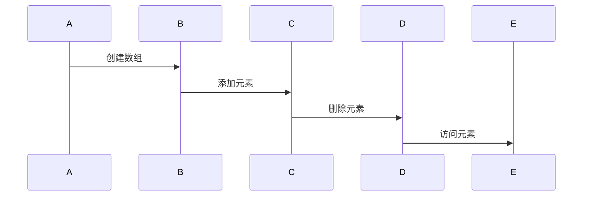

##### 2.1.2 链表

链表也是一种线性数据结构，它由一系列节点组成，每个节点包含数据域和指针域。链表的优点是大小可以动态调整，插入和删除操作效率较高，但缺点是访问速度较慢，需要从头节点开始遍历。

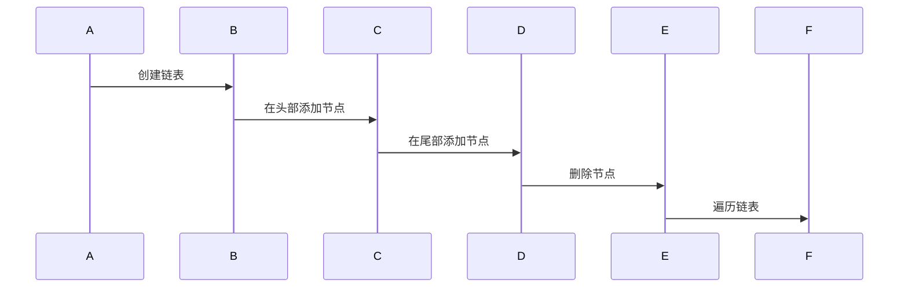

##### 2.1.3 栈和队列

栈和队列都是线性数据结构，但它们的操作规则不同。栈遵循后进先出（LIFO）原则，而队列遵循先进先出（FIFO）原则。

- **栈**：栈只允许在头部进行插入和删除操作。栈的用途包括函数调用、递归等。

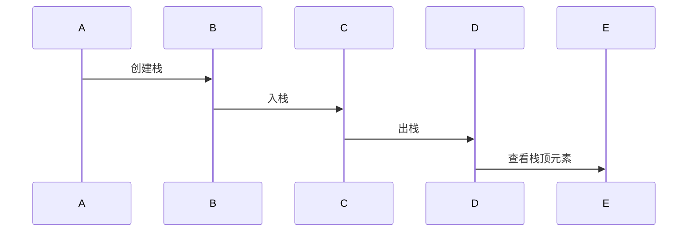

- **队列**：队列只允许在尾部进行插入操作，在头部进行删除操作。队列常用于实现消息队列、缓冲区等。

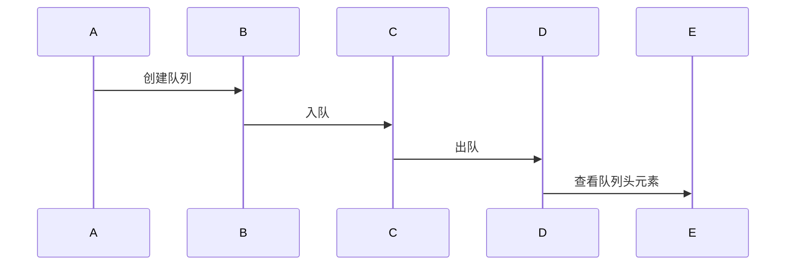

##### 2.1.4 树和图

树是一种层次化的数据结构，由节点和边组成，每个节点只有一个父节点，没有父节点的节点称为根节点。树常用于表示层次关系，如组织结构、文件系统等。

- **二叉树**：每个节点最多有两个子节点的树称为二叉树。二叉树有多种遍历方法，包括先序遍历、中序遍历和后序遍历。

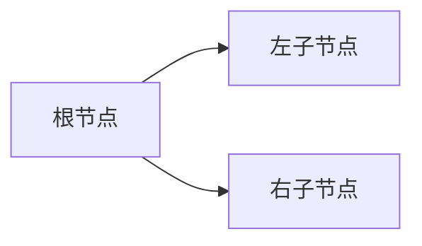

- **图**：图是一种由节点和边组成的数据结构，节点可以任意连接。图广泛应用于网络、社交网络、路径查找等领域。

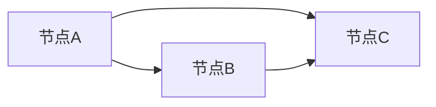

#### 2.2 算法基础

算法是解决问题的一系列步骤，是实现数据操作的有序指令。以下介绍几种常见的排序算法和搜索算法。

##### 2.2.1 排序算法

排序算法是将一组数据按照某种规则进行排列的方法。常见的排序算法包括冒泡排序、选择排序、插入排序和快速排序。

- **冒泡排序**：通过不断交换相邻的未排序元素，直到整个序列有序。

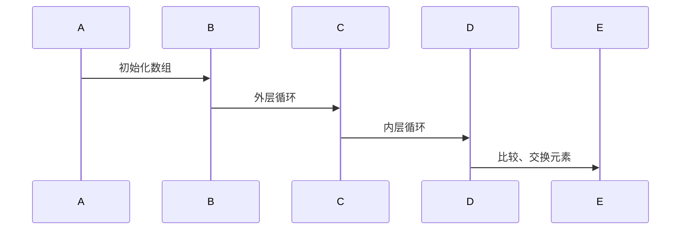

- **选择排序**：每次从未排序的部分选择最小（或最大）的元素，放到已排序部分的末尾。

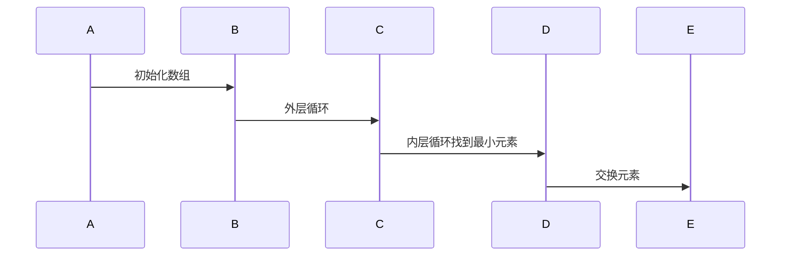

- **插入排序**：将新元素插入到已排序序列的正确位置，直到整个序列有序。

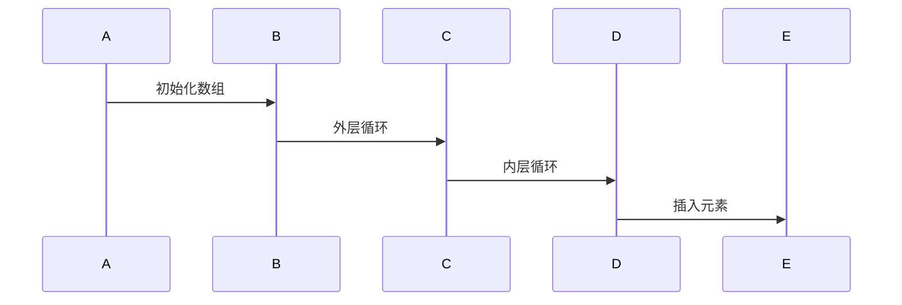

- **快速排序**：通过一趟排序将序列分为两部分，其中一部分的所有元素均比另一部分的所有元素小，然后递归地对这两部分进行排序。

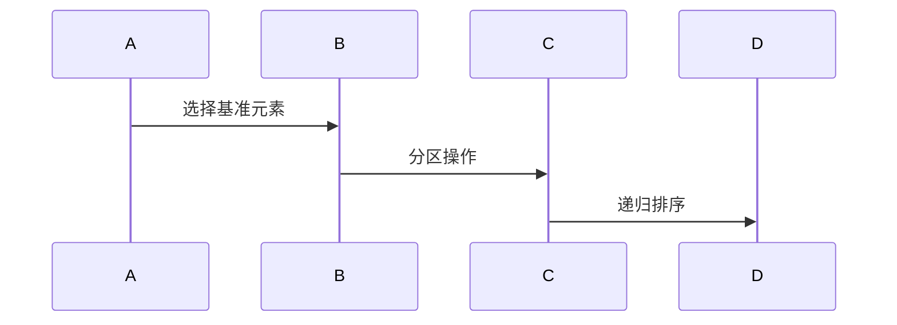

##### 2.2.2 搜索算法

搜索算法是用于在数据集合中找到特定元素的方法。常见的搜索算法包括线性搜索和二分搜索。

- **线性搜索**：顺序遍历数据集合，找到目标元素。

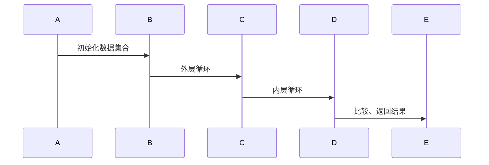

- **二分搜索**：在有序数据集合中，通过不断缩小搜索范围，逐步逼近目标元素。

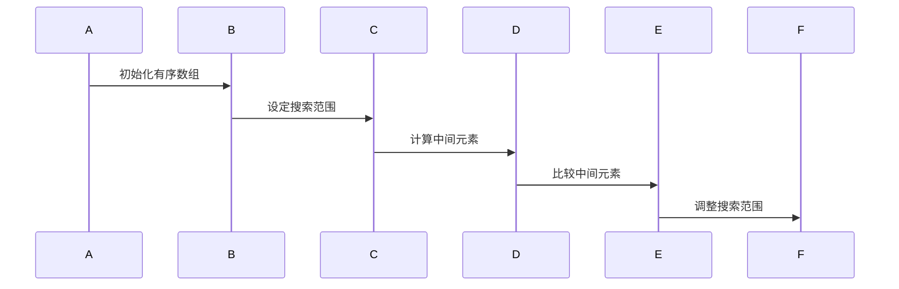

通过本章的学习，读者可以掌握数据结构和算法的基础知识，为后续章节的学习打下坚实的基础。在接下来的章节中，我们将进一步深入探讨数学模型的应用、计算机科学基础以及数据结构与算法的实际应用。

### 第3章 数学模型与应用

数学模型是计算机科学中用于描述现实世界问题的一种抽象表示，通过数学公式和算法来实现问题的求解。本章将介绍数学模型中的初等数学、线性代数和概率论与数理统计的基本概念和应用，帮助读者理解并掌握这些数学工具在实际问题解决中的重要性。

#### 3.1 初等数学

初等数学是数学的基础，包括整数和分数、欧几里得算法、素数与质数等内容。这些基础数学知识在计算机科学中有着广泛的应用。

##### 3.1.1 整数和分数

整数是没有小数部分的数，分数是表示部分与整体关系的数。在计算机科学中，整数和分数经常用于表示数据的大小和比例。

- **整数**：整数包括正整数、负整数和零。在计算机中，整数通常使用二进制表示，可以通过位操作进行高效的计算。

  $$ 10_{10} = 1010_2 $$

- **分数**：分数表示为分子和分母的形式，可以通过求最大公约数来简化分数。

  $$ \frac{8}{12} = \frac{2}{3} $$

##### 3.1.2 欧几里得算法

欧几里得算法是一种用于计算两个整数最大公约数的算法，其基本思想是通过反复取余数直到余数为零，此时除数即为最大公约数。

```latex
\text{算法：欧几里得算法}
\begin{align*}
\text{Euclidean}(a, b) &= \begin{cases}
b, & \text{如果 } b \text{ 能整除 } a \\
\text{Euclidean}(b, a \mod b), & \text{否则}
\end{cases}
\end{align*}
```

##### 3.1.3 素数与质数

素数是只能被1和自身整除的正整数，质数是大于1的素数。在计算机科学中，素数和质数在加密算法和网络安全中有着重要的应用。

- **素数检测**：可以通过试除法判断一个数是否为素数。

  ```latex
  \text{算法：试除法检测素数}
  \begin{align*}
  \text{IsPrime}(n) &= \begin{cases}
  \text{true}, & \text{如果 } n \leq 1 \\
  \text{false}, & \text{否则}
  \end{cases} \\
  \text{for } i = 2 \text{ to } \sqrt{n} \\
  \text{if } n \text{ 能被 } i \text{ 整除} \\
  \text{return } \text{false} \\
  \text{return } \text{true}
  \end{align*}
  ```

#### 3.2 线性代数

线性代数是研究向量、矩阵、线性方程组及其应用的数学分支。在计算机科学中，线性代数被广泛应用于图形处理、机器学习、算法优化等领域。

##### 3.2.1 向量和矩阵

向量是具有大小和方向的量，矩阵是由数组成的二维数组。向量和矩阵的基本运算包括加法、减法、数乘、矩阵乘法等。

- **向量加法**：向量的加法是向量的对应分量相加。

  $$ \vec{a} + \vec{b} = (a_1 + b_1, a_2 + b_2, \ldots, a_n + b_n) $$

- **矩阵乘法**：矩阵乘法是将两个矩阵对应元素相乘并求和。

  $$ C = A \cdot B = \begin{bmatrix}
  c_{11} & c_{12} \\
  c_{21} & c_{22}
  \end{bmatrix}
  =
  \begin{bmatrix}
  a_{11}b_{11} + a_{12}b_{21} & a_{11}b_{12} + a_{12}b_{22} \\
  a_{21}b_{11} + a_{22}b_{21} & a_{21}b_{12} + a_{22}b_{22}
  \end{bmatrix} $$

##### 3.2.2 线性方程组

线性方程组是包含多个线性方程的方程组。求解线性方程组的方法包括高斯消元法和矩阵求逆。

- **高斯消元法**：通过初等行变换将线性方程组转化为上三角或下三角方程组，然后依次求解。

  ```latex
  \text{算法：高斯消元法}
  \begin{align*}
  \text{GaussianElimination}(A, b) &= \begin{cases}
  \text{解方程组 } A \cdot x = b \\
  \text{无解} & \text{如果 } \text{系数矩阵 } A \text{ 的行列式为 } 0
  \end{cases}
  \end{align*}
  ```

- **矩阵求逆**：通过高斯消元法求解线性方程组 \( A \cdot x = b \) 并得到矩阵 \( A \) 的逆。

  ```latex
  \text{算法：矩阵求逆}
  \begin{align*}
  \text{Inverse}(A) &= \begin{cases}
  A^{-1}, & \text{如果 } A \text{ 可逆} \\
  \text{无定义} & \text{如果 } A \text{ 不可逆}
  \end{cases}
  \end{align*}
  ```

##### 3.2.3 矩阵求逆

矩阵求逆是求解线性方程组的关键步骤。矩阵求逆可以通过高斯消元法或矩阵分解（如高斯-约当消元法）来实现。

- **高斯-约当消元法**：通过初等行变换将矩阵转化为简化行阶梯形矩阵，然后利用逆矩阵的公式求解逆矩阵。

  ```latex
  \text{算法：高斯-约当消元法}
  \begin{align*}
  \text{GaussJordanElimination}(A) &= \begin{cases}
  A^{-1}, & \text{如果 } A \text{ 可逆} \\
  \text{无定义} & \text{如果 } A \text{ 不可逆}
  \end{cases}
  \end{align*}
  ```

#### 3.3 概率论与数理统计

概率论和数理统计是研究随机现象和数据的数学工具。在计算机科学中，概率论和数理统计广泛应用于算法分析、机器学习、数据分析等领域。

##### 3.3.1 概率基础

概率是描述随机事件发生可能性的数值。概率论中的基本概念包括概率的定义、条件概率、独立事件等。

- **概率的定义**：事件A的概率是其在所有可能事件中出现的频率。

  $$ P(A) = \frac{\text{事件A发生的次数}}{\text{所有可能事件的次数}} $$

- **条件概率**：在事件B发生的条件下，事件A的概率。

  $$ P(A|B) = \frac{P(A \cap B)}{P(B)} $$

- **独立事件**：事件A和事件B同时发生的概率等于它们各自发生的概率的乘积。

  $$ P(A \cap B) = P(A) \cdot P(B) $$

##### 3.3.2 随机变量

随机变量是用于描述随机试验结果的数学函数。随机变量可以是离散的或连续的。

- **离散随机变量**：随机变量的取值是离散的，如投掷骰子的点数。

  $$ X = \{1, 2, 3, 4, 6\} $$

- **连续随机变量**：随机变量的取值是连续的，如测量温度。

  $$ X = [0, 100] $$

##### 3.3.3 数理统计

数理统计是研究如何通过样本数据来推断总体特征的学科。

- **描述性统计**：用于描述数据的特征，如均值、方差、标准差等。

  $$ \mu = \frac{1}{n}\sum_{i=1}^{n} x_i $$
  
  $$ \sigma^2 = \frac{1}{n}\sum_{i=1}^{n} (x_i - \mu)^2 $$

- **假设检验**：用于检验总体参数的假设是否成立，如t检验、F检验等。

  $$ H_0: \mu = \mu_0 $$
  
  $$ H_1: \mu \neq \mu_0 $$

通过本章的学习，读者可以掌握初等数学、线性代数和概率论与数理统计的基本概念和应用，这些知识将有助于读者在解决实际问题时更加得心应手。在接下来的章节中，我们将进一步探讨计算机科学的基础知识，为读者在算法设计和问题解决中提供更深入的指导。

### 第4章 计算机科学基础

计算机科学是研究计算机系统、算法、编程语言及其应用的学科。本章将介绍计算机科学中的算法设计与分析、编程语言基础等内容，帮助读者建立扎实的计算机科学基础。

#### 4.1 算法设计与分析

算法设计是计算机科学的核心内容，算法分析则是评估算法性能的重要手段。算法设计与分析包括算法设计原则、时间复杂度和空间复杂度分析等。

##### 4.1.1 算法设计原则

算法设计原则是指导我们设计高效、可维护算法的基本原则。以下是一些常见的算法设计原则：

- **清晰性**：算法的实现应尽可能清晰易懂，便于他人理解和维护。

- **正确性**：算法必须能够在所有情况下正确地解决问题。

- **高效性**：算法应尽可能快地解决问题，减少时间复杂度和空间复杂度。

- **健壮性**：算法应能够处理各种输入数据，包括异常数据。

- **可扩展性**：算法应易于扩展和优化，以适应未来的需求。

##### 4.1.2 时间复杂度和空间复杂度分析

时间复杂度和空间复杂度是评估算法性能的重要指标。时间复杂度描述了算法执行时间与数据规模的关系，空间复杂度描述了算法所需存储空间与数据规模的关系。

- **时间复杂度**：通常用大O符号表示，如\( O(n) \)、\( O(n^2) \)等。时间复杂度反映了算法在数据规模增长时的时间性能。

- **空间复杂度**：同样用大O符号表示，如\( O(n) \)、\( O(n^2) \)等。空间复杂度反映了算法在数据规模增长时所需的额外存储空间。

时间复杂度和空间复杂度的分析伪代码如下：

```latex
\text{算法：计算时间复杂度}
\begin{align*}
\text{TimeComplexity}(n) &= O(n) \\
\text{SpaceComplexity}(n) &= O(n)
\end{align*}
```

#### 4.2 编程语言基础

编程语言是用于编写计算机程序的语言，C语言和Python语言是两种常用的编程语言。本章将分别介绍这两种语言的基础知识。

##### 4.2.1 C语言基础

C语言是一种高级编程语言，具有强大的功能和高效的性能。C语言的基础知识包括数据类型与变量、运算符与表达式、控制结构、函数与指针等。

- **数据类型与变量**：C语言支持多种数据类型，如整型、浮点型、字符型等。变量是用于存储数据的符号。

  ```c
  int a = 10;
  float b = 3.14;
  char c = 'A';
  ```

- **运算符与表达式**：C语言支持丰富的运算符，包括算术运算符、关系运算符、逻辑运算符等。

  ```c
  int x = 5;
  int y = 10;
  int sum = x + y; // 算术运算
  int condition = x > y; // 关系运算
  int result = !condition; // 逻辑运算
  ```

- **控制结构**：C语言支持条件语句和循环语句，用于控制程序的执行流程。

  ```c
  if (condition) {
      // 条件语句
  } else {
      // 否则语句
  }

  for (int i = 0; i < 10; i++) {
      // 循环语句
  }
  ```

- **函数与指针**：C语言中的函数是完成特定功能的代码块，指针是用于存储和管理内存地址的变量。

  ```c
  int add(int a, int b) {
      return a + b;
  }

  int main() {
      int x = 10;
      int y = 20;
      int result = add(x, y);
      return result;
  }
  ```

##### 4.2.2 Python语言基础

Python是一种高级编程语言，以其简洁易读的语法和强大的库支持而著称。Python的基础知识包括基本数据结构、控制流、函数等。

- **基本数据结构**：Python支持多种数据结构，如列表、元组、字典、集合等。

  ```python
  # 列表
  my_list = [1, 2, 3, 4, 5]

  # 元组
  my_tuple = (1, 2, 3, 4, 5)

  # 字典
  my_dict = {'a': 1, 'b': 2, 'c': 3}

  # 集合
  my_set = {1, 2, 3, 4, 5}
  ```

- **控制流**：Python支持条件语句和循环语句，用于控制程序的执行流程。

  ```python
  # 条件语句
  if condition:
      print("条件为真")
  else:
      print("条件为假")

  # 循环语句
  for i in range(10):
      print(i)
  ```

- **函数**：Python中的函数是完成特定功能的代码块。

  ```python
  def add(a, b):
      return a + b

  result = add(10, 20)
  print(result)
  ```

通过本章的学习，读者可以掌握计算机科学的基础知识，包括算法设计与分析、编程语言基础等。这些知识将为读者在算法设计、编程实践等方面提供有力的支持。在接下来的章节中，我们将进一步探讨数据结构与算法的实际应用，帮助读者将所学知识应用于实际问题解决中。

### 第5章 数据结构与算法应用

数据结构与算法是计算机科学的基石，它们的应用广泛而深入，几乎涵盖了所有计算机科学领域。本章将详细探讨树与图的应用、排序与搜索算法在实际问题中的运用，并通过具体的代码实现和案例分析，帮助读者理解这些数据结构与算法的实际价值。

#### 5.1 树与图的应用

树和图是两种常见的数据结构，它们在计算机科学中有着广泛的应用。树通常用于表示层次结构，如文件系统、组织结构等；而图则用于表示复杂的关系，如社交网络、通信网络等。

##### 5.1.1 树的遍历

树的遍历是指遍历树的所有节点，按照某种顺序访问每个节点。树的遍历有三种常见的遍历方法：前序遍历、中序遍历和后序遍历。

- **前序遍历**：首先访问根节点，然后递归地遍历左子树，最后递归地遍历右子树。

  ```mermaid
  graph LR
  A[根节点] --> B[左子节点]
  A --> C[右子节点]
  B --> D[左子节点]
  B --> E[右子节点]
  C --> F[左子节点]
  C --> G[右子节点]
  ```

  ```python
  def preorder_traversal(root):
      if root is None:
          return
      print(root.val)
      preorder_traversal(root.left)
      preorder_traversal(root.right)
  ```

- **中序遍历**：首先递归地遍历左子树，然后访问根节点，最后递归地遍历右子树。

  ```mermaid
  graph LR
  A[根节点] --> B[左子节点]
  A --> C[右子节点]
  B --> D[左子节点]
  B --> E[右子节点]
  C --> F[左子节点]
  C --> G[右子节点]
  ```

  ```python
  def inorder_traversal(root):
      if root is None:
          return
      inorder_traversal(root.left)
      print(root.val)
      inorder_traversal(root.right)
  ```

- **后序遍历**：首先递归地遍历左子树，然后递归地遍历右子树，最后访问根节点。

  ```mermaid
  graph LR
  A[根节点] --> B[左子节点]
  A --> C[右子节点]
  B --> D[左子节点]
  B --> E[右子节点]
  C --> F[左子节点]
  C --> G[右子节点]
  ```

  ```python
  def postorder_traversal(root):
      if root is None:
          return
      postorder_traversal(root.left)
      postorder_traversal(root.right)
      print(root.val)
  ```

##### 5.1.2 图的遍历

图的遍历是指遍历图的所有节点，按照某种顺序访问每个节点。图的遍历也有多种方法，包括深度优先搜索（DFS）和广度优先搜索（BFS）。

- **深度优先搜索（DFS）**：从起始节点开始，沿着一条路径一直访问到底，然后回溯到上一个节点，继续访问其他路径。

  ```mermaid
  graph LR
  A[节点A] --> B[节点B]
  A --> C[节点C]
  B --> D[节点D]
  C --> E[节点E]
  ```

  ```python
  def dfs(graph, start):
      visited = set()
      stack = [start]
      while stack:
          node = stack.pop()
          if node not in visited:
              print(node)
              visited.add(node)
              stack.extend(graph[node])
  ```

- **广度优先搜索（BFS）**：从起始节点开始，逐层访问相邻的节点。

  ```mermaid
  graph LR
  A[节点A] --> B[节点B]
  A --> C[节点C]
  B --> D[节点D]
  C --> E[节点E]
  ```

  ```python
  from collections import deque

  def bfs(graph, start):
      visited = set()
      queue = deque([start])
      while queue:
          node = queue.popleft()
          if node not in visited:
              print(node)
              visited.add(node)
              queue.extend(graph[node])
  ```

##### 5.1.3 最短路径算法

最短路径算法是解决从源点到目标点之间的最短路径问题的算法。常见的最短路径算法包括Dijkstra算法和Floyd算法。

- **Dijkstra算法**：用于求解无权重图的单源最短路径问题。

  ```mermaid
  graph LR
  A[节点A] --> B[节点B]
  A --> C[节点C]
  B --> D[节点D]
  C --> E[节点E]
  ```

  ```python
  import heapq

  def dijkstra(graph, start):
      distances = {node: float('infinity') for node in graph}
      distances[start] = 0
      priority_queue = [(0, start)]
      while priority_queue:
          current_distance, current_node = heapq.heappop(priority_queue)
          if current_distance > distances[current_node]:
              continue
          for neighbor, weight in graph[current_node].items():
              distance = current_distance + weight
              if distance < distances[neighbor]:
                  distances[neighbor] = distance
                  heapq.heappush(priority_queue, (distance, neighbor))
      return distances
  ```

- **Floyd算法**：用于求解任意两点之间的最短路径。

  ```mermaid
  graph LR
  A[节点A] --> B[节点B]
  A --> C[节点C]
  B --> D[节点D]
  C --> E[节点E]
  ```

  ```python
  def floyd(graph):
      distances = [[float('infinity') for _ in range(len(graph))] for _ in range(len(graph))]
      for i in range(len(graph)):
          distances[i][i] = 0
      for i in range(len(graph)):
          for j in range(len(graph)):
              for k in range(len(graph)):
                  distances[i][j] = min(distances[i][j], distances[i][k] + distances[k][j])
      return distances
  ```

##### 5.1.4 网络流算法

网络流算法是解决网络中的流量分配和传输问题的一类算法。常见的网络流算法包括最大流最小割定理和Edmonds-Karp算法。

- **最大流最小割定理**：在一个网络中，网络的最大流值等于最小割值。

  ```mermaid
  graph LR
  A[源点] --> B[节点1]
  B --> C[节点2]
  C --> D[汇点]
  ```

  ```python
  def max_flow_min_cut(graph, source, sink):
      flow = [[0 for _ in range(len(graph))] for _ in range(len(graph))]
      while True:
          path = bfs(graph, source, sink)
          if path is None:
              break
          min_capacity = min(flow[u][v] for u, v in path)
          for u, v in path:
              flow[u][v] += min_capacity
              flow[v][u] -= min_capacity
      cut = [(u, v) for u in range(len(graph)) for v in range(len(graph)) if flow[u][v] == 0 and u != sink]
      return sum(graph[u][v] for u, v in cut)
  ```

- **Edmonds-Karp算法**：基于 breadth-first search 的最大流算法，它通过循环调用 augmenting path 算法来逐步增加网络中的最大流。

  ```python
  def edmonds_karp(graph, source, sink):
      flow = [[0 for _ in range(len(graph))] for _ in range(len(graph))]
      while True:
          path = bfs(graph, source, sink)
          if path is None:
              break
          min_capacity = min(flow[u][v] for u, v in path)
          for u, v in path:
              flow[u][v] += min_capacity
              flow[v][u] -= min_capacity
      return sum(flow[source][v] for v in range(1, len(graph)))
  ```

#### 5.2 排序与搜索算法

排序与搜索算法是计算机科学中非常基本且重要的算法。排序算法用于对数据进行排序，而搜索算法用于在数据结构中查找特定的数据。

##### 5.2.1 排序算法

常见的排序算法包括冒泡排序、选择排序、插入排序和快速排序等。每种排序算法都有其特定的实现方式和应用场景。

- **冒泡排序**：通过不断交换相邻的未排序元素，直到整个序列有序。

  ```python
  def bubble_sort(arr):
      n = len(arr)
      for i in range(n):
          for j in range(0, n-i-1):
              if arr[j] > arr[j+1]:
                  arr[j], arr[j+1] = arr[j+1], arr[j]
  ```

- **选择排序**：每次从未排序的部分选择最小（或最大）的元素，放到已排序部分的末尾。

  ```python
  def selection_sort(arr):
      n = len(arr)
      for i in range(n):
          min_idx = i
          for j in range(i+1, n):
              if arr[j] < arr[min_idx]:
                  min_idx = j
          arr[i], arr[min_idx] = arr[min_idx], arr[i]
  ```

- **插入排序**：将新元素插入到已排序序列的正确位置，直到整个序列有序。

  ```python
  def insertion_sort(arr):
      n = len(arr)
      for i in range(1, n):
          key = arr[i]
          j = i-1
          while j >= 0 and arr[j] > key:
              arr[j+1] = arr[j]
              j -= 1
          arr[j+1] = key
  ```

- **快速排序**：通过一趟排序将序列分为两部分，其中一部分的所有元素均比另一部分的所有元素小，然后递归地对这两部分进行排序。

  ```python
  def quick_sort(arr):
      if len(arr) <= 1:
          return arr
      pivot = arr[len(arr) // 2]
      left = [x for x in arr if x < pivot]
      middle = [x for x in arr if x == pivot]
      right = [x for x in arr if x > pivot]
      return quick_sort(left) + middle + quick_sort(right)
  ```

##### 5.2.2 搜索算法

常见的搜索算法包括线性搜索和二分搜索等。线性搜索是从序列的开头逐个检查元素，直到找到目标元素或检查完整个序列。二分搜索是在有序序列中，通过不断缩小搜索范围来查找目标元素。

- **线性搜索**：顺序遍历序列，找到目标元素。

  ```python
  def linear_search(arr, target):
      for i in range(len(arr)):
          if arr[i] == target:
              return i
      return -1
  ```

- **二分搜索**：在有序序列中，通过不断缩小搜索范围来查找目标元素。

  ```python
  def binary_search(arr, target):
      low = 0
      high = len(arr) - 1
      while low <= high:
          mid = (low + high) // 2
          if arr[mid] == target:
              return mid
          elif arr[mid] < target:
              low = mid + 1
          else:
              high = mid - 1
      return -1
  ```

#### 5.3 项目实战

通过以上算法的实现，我们可以看到这些算法在编程语言中的具体应用。以下是一个简单的项目实战案例，展示了如何使用这些算法来解决问题。

**案例：图书馆管理系统**

**需求**：设计一个图书馆管理系统，实现以下功能：
- 添加书籍信息
- 删除书籍信息
- 查找书籍信息
- 排序书籍信息

**实现**：

```python
class Library:
    def __init__(self):
        self.books = []

    def add_book(self, book):
        self.books.append(book)

    def remove_book(self, book):
        self.books.remove(book)

    def search_book(self, title):
        for book in self.books:
            if book['title'] == title:
                return book
        return None

    def sort_books(self, key):
        self.books.sort(key=lambda x: x[key])

# 使用案例
library = Library()
library.add_book({'title': '算法导论', 'author': 'Thomas H. Cormen'})
library.add_book({'title': '计算机程序的构造和解释', 'author': 'Harold Abelson'})
library.remove_book({'title': '算法导论', 'author': 'Thomas H. Cormen'})
result = library.search_book('计算机程序的构造和解释')
library.sort_books('title')

print(result)
print(library.books)
```

**代码解读**：

- `add_book` 方法用于添加书籍信息。
- `remove_book` 方法用于删除书籍信息。
- `search_book` 方法用于查找书籍信息。
- `sort_books` 方法用于排序书籍信息。

通过以上实战案例，我们可以看到数据结构与算法在实际项目中的应用，这有助于我们更好地理解这些算法的原理和用途。

通过本章的学习，读者可以深入理解数据结构与算法的实际应用，并通过代码实现和案例学习，提升解决实际问题的能力。在接下来的章节中，我们将进一步探讨面试技巧和实战案例，帮助读者更好地应对华为社招面试。

### 第6章 算法实战与面试技巧

在华为2024届社招面试中，算法题目是考察面试者技术能力的重要部分。本章将针对常见面试题目进行解析，并提供一些面试准备和技巧，帮助读者更好地应对面试挑战。

#### 6.1 常见面试题目解析

算法面试题目通常涉及数组和字符串、树和图、动态规划、贪心算法等。以下是一些常见的面试题目及其解析。

##### 6.1.1 数组和字符串

- **两数之和**：给定一个整数数组，找出两个数，使它们的和等于目标值。这是一个经典的面试题目。

  ```python
  def two_sum(nums, target):
      hashmap = {}
      for i, num in enumerate(nums):
          complement = target - num
          if complement in hashmap:
              return [hashmap[complement], i]
          hashmap[num] = i
      return []
  ```

- **字符串匹配**：给定一个文本字符串和一个模式字符串，找出模式字符串在文本字符串中所有的出现位置。

  ```python
  def str_match(text, pattern):
      m = len(text)
      n = len(pattern)
      dp = [[False] * (n + 1) for _ in range(m + 1)]
      dp[0][0] = True
      for i in range(m + 1):
          for j in range(n + 1):
              if i < j:
                  dp[i][j] = False
              elif text[i - j] == pattern[j - 1]:
                  dp[i][j] = dp[i - j][j - 1]
              else:
                  dp[i][j] = dp[i - 1][j - 1] or dp[i - 1][j]
      return dp[m][n]
  ```

- **回文串**：给定一个字符串，判断它是否是回文串。

  ```python
  def is_palindrome(s):
      return s == s[::-1]
  ```

##### 6.1.2 树和图

- **二叉树的遍历**：实现二叉树的前序、中序和后序遍历。

  ```python
  def preorderTraversal(root):
      if root:
          print(root.val)
          preorderTraversal(root.left)
          preorderTraversal(root.right)

  def inorderTraversal(root):
      if root:
          inorderTraversal(root.left)
          print(root.val)
          inorderTraversal(root.right)

  def postorderTraversal(root):
      if root:
          postorderTraversal(root.left)
          postorderTraversal(root.right)
          print(root.val)
  ```

- **图的深度优先搜索**：实现图的深度优先搜索。

  ```python
  def dfs(graph, start):
      visited = set()
      stack = [start]
      while stack:
          node = stack.pop()
          if node not in visited:
              print(node)
              visited.add(node)
              stack.extend(graph[node])
  ```

##### 6.1.3 动态规划

- **最长公共子序列**：给定两个字符串，找出它们的最长公共子序列。

  ```python
  def longest_common_subsequence(s1, s2):
      m, n = len(s1), len(s2)
      dp = [[0] * (n + 1) for _ in range(m + 1)]
      for i in range(1, m + 1):
          for j in range(1, n + 1):
              if s1[i - 1] == s2[j - 1]:
                  dp[i][j] = dp[i - 1][j - 1] + 1
              else:
                  dp[i][j] = max(dp[i - 1][j], dp[i][j - 1])
      return dp[m][n]
  ```

- **最小路径和**：给定一个包含非负整数的二维网格，找出从左上角到右下角的最小路径和。

  ```python
  def min_path_sum(grid):
      m, n = len(grid), len(grid[0])
      dp = [[0] * n for _ in range(m)]
      dp[0][0] = grid[0][0]
      for i in range(1, m):
          dp[i][0] = dp[i - 1][0] + grid[i][0]
      for j in range(1, n):
          dp[0][j] = dp[0][j - 1] + grid[0][j]
      for i in range(1, m):
          for j in range(1, n):
              dp[i][j] = min(dp[i - 1][j], dp[i][j - 1]) + grid[i][j]
      return dp[m - 1][n - 1]
  ```

##### 6.1.4 贪心算法

- **装箱问题**：给定一组物品和它们的体积，以及一个固定容量的箱子，求最多可以装入多少个物品。

  ```python
  def max装箱数(items, capacity):
      items.sort(key=lambda x: x[1] / x[0], reverse=True)
      total_volume = 0
      count = 0
      for item in items:
          if total_volume + item[1] <= capacity:
              total_volume += item[1]
              count += 1
      return count
  ```

- **背包问题**：给定一组物品和它们的重量和价值，以及一个固定容量的背包，求最多可以装入多少价值。

  ```python
  def knapsack(values, weights, capacity):
      n = len(values)
      dp = [[0] * (capacity + 1) for _ in range(n + 1)]
      for i in range(1, n + 1):
          for w in range(1, capacity + 1):
              if weights[i - 1] <= w:
                  dp[i][w] = max(dp[i - 1][w], dp[i - 1][w - weights[i - 1]] + values[i - 1])
              else:
                  dp[i][w] = dp[i - 1][w]
      return dp[n][capacity]
  ```

#### 6.2 面试准备与技巧

面试准备和技巧对于面试成功至关重要。以下是一些面试准备和技巧的建议。

##### 6.2.1 面试流程

- **简历准备**：确保简历内容真实、准确，突出自己的技术优势和项目经验。
- **技术复习**：复习数据结构、算法、编程语言等基础知识，确保能够应对面试中的各种问题。
- **模拟面试**：参加模拟面试，提高应对真实面试的能力。

##### 6.2.2 面试常见问题及回答

- **自我介绍**：简洁明了地介绍自己的基本信息、教育背景、工作经验和项目经验。
- **技术问题**：针对自己的技术栈，准备一些常见的技术问题，如数据结构和算法的实现、编程语言的基础知识等。
- **行为问题**：准备好一些典型问题的回答，如“请描述一个你遇到的问题和你是如何解决的”、“请描述一个你领导过的项目”。

#### 6.3 面试案例分析

通过分析一些成功和失败的面试案例，可以更好地理解面试官的期望和面试者应该如何准备。

##### 6.3.1 成功案例

- **成功原因**：技术扎实、面试表现良好、能够清晰地表达自己的想法。
- **改进措施**：继续提升技术水平，多参与实际项目，增强沟通能力和问题解决能力。

##### 6.3.2 失败案例

- **失败原因**：对基础知识的掌握不够扎实、面试表现不佳、无法清晰表达自己的想法。
- **改进措施**：加强基础知识的学习，多进行模拟面试，提高沟通能力和问题解决能力。

通过本章的学习，读者可以掌握常见面试题的解析方法，了解面试准备和技巧，并通过案例分析，提升自己的面试能力。在接下来的章节中，我们将进一步探讨华为社招面试的具体流程和注意事项。

### 第7章 附录

本章作为本书的附录部分，将提供一些对算法和数据结构学习有帮助的参考资源，包括数据结构图示、算法流程图示、算法实现参考以及历年面试题集，旨在为读者提供更加全面的学习支持。

#### 7.1 算法与数据结构参考

##### 7.1.1 数据结构图示

为了更好地理解数据结构，我们提供了以下常见数据结构的图示：

- **数组**

  ```mermaid
  sequenceDiagram
    A->>B: 创建数组
    B->>C: 添加元素
    C->>D: 删除元素
    D->>E: 访问元素
  ```

- **链表**

  ```mermaid
  sequenceDiagram
    A->>B: 创建链表
    B->>C: 在头部添加节点
    C->>D: 在尾部添加节点
    D->>E: 删除节点
    E->>F: 遍历链表
  ```

- **栈**

  ```mermaid
  sequenceDiagram
    A->>B: 创建栈
    B->>C: 入栈
    C->>D: 出栈
    D->>E: 查看栈顶元素
  ```

- **队列**

  ```mermaid
  sequenceDiagram
    A->>B: 创建队列
    B->>C: 入队
    C->>D: 出队
    D->>E: 查看队列头元素
  ```

- **树**

  ```mermaid
  graph LR
    A[根节点] --> B[左子节点]
    A --> C[右子节点]
    B --> D[左子节点]
    B --> E[右子节点]
    C --> F[左子节点]
    C --> G[右子节点]
  ```

- **图**

  ```mermaid
  graph LR
    A[节点A] --> B[节点B]
    A --> C[节点C]
    B --> D[节点D]
    C --> E[节点E]
  ```

##### 7.1.2 算法流程图示

算法流程图示能够帮助读者更直观地理解算法的实现过程。以下是一些常见算法的流程图：

- **冒泡排序**

  ```mermaid
  sequenceDiagram
    A->>B: 初始化数组
    B->>C: 外层循环
    C->>D: 内层循环
    D->>E: 比较、交换元素
  ```

- **快速排序**

  ```mermaid
  sequenceDiagram
    A->>B: 选择基准元素
    B->>C: 分区操作
    C->>D: 递归排序
  ```

- **二分搜索**

  ```mermaid
  sequenceDiagram
    A->>B: 初始化有序数组
    B->>C: 设定搜索范围
    C->>D: 计算中间元素
    D->>E: 比较中间元素
    E->>F: 调整搜索范围
  ```

#### 7.2 算法实现参考

为了帮助读者更好地理解和实现算法，我们提供了C语言和Python语言中的算法实现示例。

##### 7.2.1 C语言实现

以下是冒泡排序和二分搜索的C语言实现示例：

```c
#include <stdio.h>

// 冒泡排序
void bubbleSort(int arr[], int n) {
    for (int i = 0; i < n - 1; i++) {
        for (int j = 0; j < n - i - 1; j++) {
            if (arr[j] > arr[j + 1]) {
                int temp = arr[j];
                arr[j] = arr[j + 1];
                arr[j + 1] = temp;
            }
        }
    }
}

// 二分搜索
int binarySearch(int arr[], int l, int r, int x) {
    while (l <= r) {
        int m = l + (r - l) / 2;
        if (arr[m] == x)
            return m;
        if (arr[m] < x)
            l = m + 1;
        else
            r = m - 1;
    }
    return -1;
}

int main() {
    int arr[] = {10, 12, 7, 5, 2, 11};
    int n = sizeof(arr) / sizeof(arr[0]);
    bubbleSort(arr, n);
    printf("Sorted array: \n");
    for (int i = 0; i < n; i++) {
        printf("%d ", arr[i]);
    }
    printf("\n");
    int x = 7;
    int result = binarySearch(arr, 0, n - 1, x);
    if (result == -1)
        printf("Element is not present in array.\n");
    else
        printf("Element is present at index %d.\n", result);
    return 0;
}
```

##### 7.2.2 Python语言实现

以下是快速排序和线性搜索的Python语言实现示例：

```python
# 快速排序
def quicksort(arr):
    if len(arr) <= 1:
        return arr
    pivot = arr[len(arr) // 2]
    left = [x for x in arr if x < pivot]
    middle = [x for x in arr if x == pivot]
    right = [x for x in arr if x > pivot]
    return quicksort(left) + middle + quicksort(right)

# 线性搜索
def linear_search(arr, x):
    for i in range(len(arr)):
        if arr[i] == x:
            return i
    return -1

arr = [10, 12, 7, 5, 2, 11]
sorted_arr = quicksort(arr)
print("Sorted array:", sorted_arr)
x = 7
index = linear_search(sorted_arr, x)
if index == -1:
    print("Element is not present in array.")
else:
    print("Element is present at index", index)
```

#### 7.3 面试题集

为了帮助读者更好地准备面试，我们汇总了历年华为社招面试中出现的高频算法题，并进行分类解析。

##### 7.3.1 历年面试题目汇总

- **数组和字符串**
  - 两数之和
  - 字符串匹配
  - 回文串

- **树和图**
  - 二叉树的遍历
  - 图的深度优先搜索
  - 图的广度优先搜索

- **动态规划**
  - 最长公共子序列
  - 最小路径和

- **贪心算法**
  - 装箱问题
  - 背包问题

##### 7.3.2 面试题分类解析

- **数组和字符串**

  ```python
  # 两数之和
  def two_sum(nums, target):
      hashmap = {}
      for i, num in enumerate(nums):
          complement = target - num
          if complement in hashmap:
              return [hashmap[complement], i]
          hashmap[num] = i
      return []

  # 字符串匹配
  def str_match(text, pattern):
      m, n = len(text), len(pattern)
      dp = [[False] * (n + 1) for _ in range(m + 1)]
      dp[0][0] = True
      for i in range(m + 1):
          for j in range(n + 1):
              if i < j:
                  dp[i][j] = False
              elif text[i - j] == pattern[j - 1]:
                  dp[i][j] = dp[i - j][j - 1]
              else:
                  dp[i][j] = dp[i - 1][j - 1] or dp[i - 1][j]
      return dp[m][n]

  # 回文串
  def is_palindrome(s):
      return s == s[::-1]
  ```

- **树和图**

  ```python
  # 二叉树的遍历
  def preorderTraversal(root):
      if root:
          print(root.val)
          preorderTraversal(root.left)
          preorderTraversal(root.right)

  def inorderTraversal(root):
      if root:
          inorderTraversal(root.left)
          print(root.val)
          inorderTraversal(root.right)

  def postorderTraversal(root):
      if root:
          postorderTraversal(root.left)
          postorderTraversal(root.right)
          print(root.val)

  # 图的深度优先搜索
  def dfs(graph, start):
      visited = set()
      stack = [start]
      while stack:
          node = stack.pop()
          if node not in visited:
              print(node)
              visited.add(node)
              stack.extend(graph[node])

  # 图的广度优先搜索
  from collections import deque

  def bfs(graph, start):
      visited = set()
      queue = deque([start])
      while queue:
          node = queue.popleft()
          if node not in visited:
              print(node)
              visited.add(node)
              queue.extend(graph[node])
  ```

- **动态规划**

  ```python
  # 最长公共子序列
  def longest_common_subsequence(s1, s2):
      m, n = len(s1), len(s2)
      dp = [[0] * (n + 1) for _ in range(m + 1)]
      for i in range(1, m + 1):
          for j in range(1, n + 1):
              if s1[i - 1] == s2[j - 1]:
                  dp[i][j] = dp[i - 1][j - 1] + 1
              else:
                  dp[i][j] = max(dp[i - 1][j], dp[i][j - 1])
      return dp[m][n]

  # 最小路径和
  def min_path_sum(grid):
      m, n = len(grid), len(grid[0])
      dp = [[0] * n for _ in range(m)]
      dp[0][0] = grid[0][0]
      for i in range(1, m):
          dp[i][0] = dp[i - 1][0] + grid[i][0]
      for j in range(1, n):
          dp[0][j] = dp[0][j - 1] + grid[0][j]
      for i in range(1, m):
          for j in range(1, n):
              dp[i][j] = min(dp[i - 1][j], dp[i][j - 1]) + grid[i][j]
      return dp[m - 1][n - 1]
  ```

- **贪心算法**

  ```python
  # 装箱问题
  def max装箱数(items, capacity):
      items.sort(key=lambda x: x[1] / x[0], reverse=True)
      total_volume = 0
      count = 0
      for item in items:
          if total_volume + item[1] <= capacity:
              total_volume += item[1]
              count += 1
      return count

  # 背包问题
  def knapsack(values, weights, capacity):
      n = len(values)
      dp = [[0] * (capacity + 1) for _ in range(n + 1)]
      for i in range(1, n + 1):
          for w in range(1, capacity + 1):
              if weights[i - 1] <= w:
                  dp[i][w] = max(dp[i - 1][w], dp[i - 1][w - weights[i - 1]] + values[i - 1])
              else:
                  dp[i][w] = dp[i - 1][w]
      return dp[n][capacity]
  ```

通过本章的附录内容，读者可以更全面地理解算法和数据结构的应用，并通过实际的代码实现和面试题解析，进一步提升自己的技术水平。希望这些内容能够对读者的学习和发展有所帮助。

### 第8章：AI技术在面试中的应用

随着人工智能（AI）技术的不断进步，它已经在多个领域得到了广泛应用，包括面试评估。华为作为科技行业的领军企业，自然也利用AI技术来优化其面试流程，提高面试效率和评估准确性。本章将探讨AI技术在面试评估中的应用，以及如何利用AI面试工具来应对AI面试。

#### 8.1 AI技术在面试评估中的应用

AI技术在面试评估中的应用主要表现在以下几个方面：

##### 8.1.1 图像识别在简历筛选中的应用

在面试流程的初期，AI可以通过图像识别技术对求职者的简历进行筛选。AI系统能够快速识别简历中的关键信息，如姓名、联系方式、教育背景、工作经历等，从而大大提高简历筛选的效率和准确性。

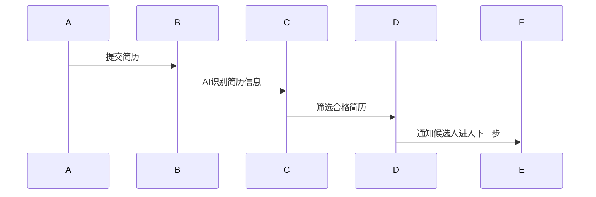

##### 8.1.2 自然语言处理在面试问答中的应用

在面试过程中，AI可以通过自然语言处理技术对面试官和候选人的对话进行实时分析。例如，AI可以分析候选人的回答内容，评估其逻辑思维、语言表达能力和技术知识掌握程度。

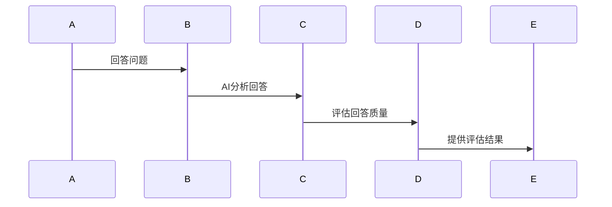

##### 8.1.3 语音识别在面试沟通中的应用

语音识别技术在AI面试中同样发挥着重要作用。通过语音识别，AI可以将候选人的口头回答转换为文本，从而方便后续的分析和评估。此外，语音识别还可以提高面试的互动性，使候选人能够更加自然地与面试官交流。

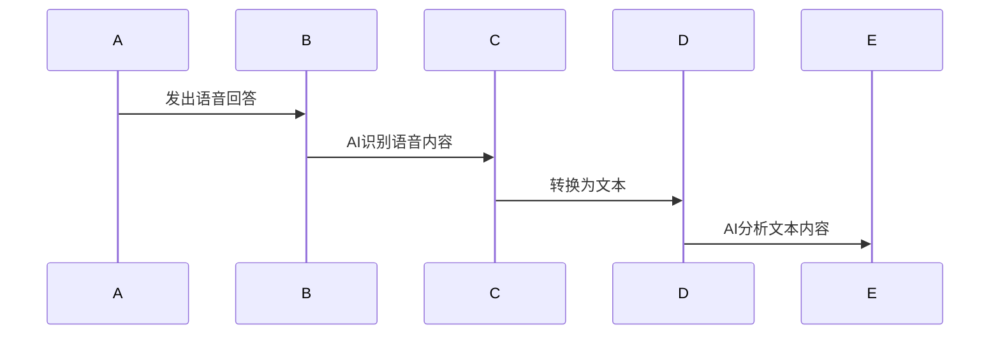

#### 8.2 AI面试工具介绍

以下是一些常用的AI面试工具，包括华为面试官系统和其他AI面试工具的简介。

##### 8.2.1 华为面试官系统

华为面试官系统是一种基于AI的面试评估工具，它可以自动生成面试问题，实时分析候选人的回答，并给出评估结果。华为面试官系统集成了图像识别、自然语言处理和语音识别技术，能够全面评估候选人的技术能力和沟通能力。

- **功能**：
  - 自动生成面试问题
  - 实时分析候选人回答
  - 生成面试评估报告
- **优势**：
  - 提高面试效率
  - 减少人为偏见
  - 提高面试评估准确性

##### 8.2.2 其他AI面试工具简介

除了华为面试官系统，市场上还有其他一些AI面试工具，如Vervoe、Knocks等。这些工具也利用了图像识别、自然语言处理和语音识别技术，为招聘流程提供智能化支持。

- **Vervoe**：提供在线技能测试和面试评估，通过AI技术自动评分和推荐合适的候选人。
- **Knocks**：利用AI分析候选人的社交媒体信息，评估其软技能和职业潜力。

#### 8.3 AI面试挑战与应对策略

尽管AI技术在面试评估中具有许多优势，但同时也带来了一些挑战。以下是一些常见的AI面试挑战以及相应的应对策略。

##### 8.3.1 面试环境搭建

AI面试通常需要稳定的网络环境和合适的硬件设备。为了确保AI面试的顺利进行，候选人在面试前需要检查网络连接、设备状态等。

- **应对策略**：
  - 提前测试网络连接和设备
  - 使用可靠的VPN服务，确保网络稳定性

##### 8.3.2 AI面试技巧

在AI面试中，候选人需要掌握一些特别的面试技巧，以更好地与AI系统互动。

- **应对策略**：
  - 保持清晰的发音，确保语音识别准确
  - 避免使用复杂的行业术语，确保自然语言处理准确
  - 准备常见的面试问题和答案，确保回答内容丰富且有条理

##### 8.3.3 AI面试案例分析

通过分析一些成功的AI面试案例，候选人可以更好地了解AI面试的流程和特点，从而有针对性地进行准备。

- **应对策略**：
  - 参加模拟AI面试，熟悉面试流程
  - 分析成功的AI面试案例，学习候选人的回答技巧
  - 定期进行自我评估和反馈，不断改进面试表现

通过本章的学习，读者可以了解到AI技术在面试评估中的应用，掌握AI面试的应对策略，从而更好地应对华为等企业的AI面试。在接下来的章节中，我们将继续探讨华为社招面试的具体流程和注意事项。

### 第9章：华为社招面试全攻略

在准备华为社招面试时，了解整个面试流程和各阶段的注意事项是非常重要的。本章将详细介绍华为社招的面试流程、面试题型解析、注意事项以及面试后的反馈与改进策略，帮助读者全面准备，提升面试成功率。

#### 9.1 华为社招流程

华为社招面试流程一般包括以下几个阶段：

##### 9.1.1 投递简历

首先，你需要通过华为官网或招聘平台投递简历。在投递简历时，务必确保简历内容真实、详细，并突出你的技术能力、项目经验和所取得的成就。

##### 9.1.2 初步筛选

简历提交后，华为的HR团队会对简历进行初步筛选。这一阶段的重点是突出你的专业技能和项目经验，以便通过初步筛选。

##### 9.1.3 在线笔试

通过初步筛选后，你将需要参加在线笔试。笔试通常包括逻辑题、数学题、编程题等，主要考察你的逻辑思维、数学基础和编程能力。

##### 9.1.4 面试安排

在线笔试通过后，你将进入面试阶段。华为的面试通常包括电话面试、现场面试和HR面试。电话面试主要考察你的沟通能力和基本技能，现场面试则深入考察你的技术深度和项目经验，HR面试则侧重于了解你的职业规划和团队合作能力。

##### 9.1.5 录用通知

通过所有面试环节后，你将收到华为的录用通知，并进入下一阶段的入职准备。

#### 9.2 华为面试题型解析

华为面试题型丰富多样，主要涵盖以下几类：

##### 9.2.1 行为面试

行为面试主要通过询问你的经历和反应，来评估你的实际能力和适应能力。常见问题包括：

- 请描述一个你遇到的问题和你是如何解决的？
- 请描述一个你领导过的项目，并说明你的角色和贡献。
- 请描述一个你在团队中遇到的冲突，并说明你是如何解决的？

##### 9.2.2 技术面试

技术面试主要考察你的专业知识和编程能力，常见问题包括：

- 请实现一个排序算法（如冒泡排序、快速排序）。
- 请实现一个二分搜索算法。
- 请描述如何使用动态规划解决一个具体问题（如背包问题、最长公共子序列）。

##### 9.2.3 案例面试

案例面试通常涉及对实际问题的分析和解决方案。常见问题包括：

- 如何设计一个高效的缓存系统？
- 请描述一个你参与的项目，并说明你如何优化系统性能。
- 如何评估一个大型分布式系统的稳定性？

##### 9.2.4 团队面试

团队面试主要考察你在团队中的协作能力和沟通能力。常见问题包括：

- 请描述一个你参与的团队项目，并说明你的角色和贡献。
- 你如何在团队中处理冲突？
- 你如何与不同背景的同事合作？

#### 9.3 华为面试常见问题及答案示例

以下是华为面试中常见的问题及答案示例，供读者参考。

##### 9.3.1 自我介绍

- **问题**：请做一个简单的自我介绍。

- **答案示例**：

  “大家好，我叫张三，毕业于XX大学计算机专业。在校期间，我主修了计算机科学基础、数据结构与算法、计算机网络等课程。毕业后，我在XX公司担任软件开发工程师，主要负责XX项目的前端开发工作。通过这个项目，我积累了丰富的前端开发经验，并掌握了React、Vue等前端框架。”

##### 9.3.2 技术问题

- **问题**：请实现一个冒泡排序算法。

- **答案示例**（Python代码）：

  ```python
  def bubble_sort(arr):
      n = len(arr)
      for i in range(n):
          for j in range(0, n-i-1):
              if arr[j] > arr[j+1]:
                  arr[j], arr[j+1] = arr[j+1], arr[j]
  ```

##### 9.3.3 行为问题

- **问题**：请描述一个你在项目中遇到的问题，以及你是如何解决的。

- **答案示例**：

  “在我参与的一个项目中，我们遇到了一个性能瓶颈问题。通过分析，我发现数据库查询次数过多是导致性能下降的主要原因。于是，我优化了数据库查询语句，增加了索引，并使用了缓存技术，最终解决了性能问题。”

##### 9.3.4 团队协作问题

- **问题**：请描述一个你参与的团队项目，并说明你的角色和贡献。

- **答案示例**：

  “我在一次团队项目中担任项目经理的角色。我负责协调团队成员的工作，确保项目按时完成。在项目开发过程中，我遇到了一个技术难题，于是我主动承担了这个任务，通过查阅资料和与团队成员讨论，最终成功解决了问题。”

#### 9.4 华为社招面试注意事项

为了在华为社招面试中取得好成绩，以下注意事项可以帮助你做好准备：

##### 9.4.1 面试前的准备工作

- **熟悉公司文化和业务**：了解华为的企业文化、业务领域和发展战略，以便在面试中展现你对公司的了解和认同。

- **复习技术知识**：回顾你在大学和工作中学到的技术知识，尤其是与你应聘职位相关的技术。

- **准备面试题**：提前准备一些常见的面试题，并练习回答。

- **调试环境**：确保面试当天网络连接稳定，硬件设备正常。

##### 9.4.2 面试中的注意事项

- **自信回答**：在回答问题时，保持自信，用清晰、简洁的语言表达。

- **逻辑清晰**：确保你的回答逻辑清晰，条理分明。

- **展现沟通能力**：在面试中展示你的沟通能力，包括倾听和表达能力。

- **提问环节**：在面试结束时，可以向面试官提问，以显示你的积极性和对职位的兴趣。

##### 9.4.3 面试后的跟进与总结

- **感谢邮件**：在面试结束后，发送一封感谢邮件给面试官，表达你的感激之情。

- **总结经验**：面试结束后，总结自己的表现，找出不足之处，并制定改进计划。

通过本章的全面介绍，读者可以了解华为社招面试的流程、题型、注意事项，并通过案例学习和总结，为面试做好充分准备。在接下来的章节中，我们将继续探讨面试后的反馈与改进策略，帮助读者在职业发展中不断进步。

### 第10章：面试后的反馈与改进

面试结束后，获取反馈并制定改进策略是提升面试表现和职业发展的重要步骤。本章将介绍如何获取面试反馈，分析反馈，制定改进计划，以及如何进行长期职业规划。

#### 10.1 面试反馈的获取

获取面试反馈有助于了解自己的优点和不足，从而在未来的面试中加以改进。以下是一些获取面试反馈的方法：

##### 10.1.1 面试官的反馈

在面试结束后，直接向面试官询问反馈是一种有效的获取反馈的方式。以下是一些可能的提问：

- **面试官的反馈**：“您能对我今天的面试表现给出一些反馈吗？有哪些方面做得好，哪些方面需要改进？”

- **具体问题**：“在技术问题回答方面，您觉得我有哪些不足？在沟通能力方面，您对我有什么建议？”

##### 10.1.2 同事的建议

如果有机会与已经在华为工作的同事交流，他们的建议也会非常有价值。以下是一些提问示例：

- **同事的反馈**：“对于新加入华为的员工，您有什么建议？在您的工作经历中，有哪些技能或能力是至关重要的？”

- **具体问题**：“在您的团队中，技术能力和沟通能力哪个更重要？您是如何平衡工作与生活的？”

##### 10.1.3 历史面试题库

通过查阅历年华为面试题库，你可以了解面试官喜欢问哪些类型的问题，从而预测未来面试可能会遇到的问题。此外，解答这些历史面试题也是一种很好的准备。

- **历史面试题库**：在互联网上搜索历年的华为面试题库，如GitHub上的开源项目或相关论坛。

#### 10.2 面试改进策略

在获取反馈后，接下来需要制定具体的改进策略。以下是一些常见的改进策略：

##### 10.2.1 技术能力提升

- **技术复习**：针对面试中的技术问题，进行系统的复习和练习。

- **实战项目**：参与实际项目，将理论知识应用于实践中，提高解决实际问题的能力。

- **在线课程**：报名参加一些在线课程，如Coursera、edX等，提升技术深度。

##### 10.2.2 行为能力提升

- **沟通技巧**：提高沟通技巧，包括口头表达和书面表达。

- **团队合作**：参与团队活动，提高团队合作能力和协调能力。

- **反馈接受**：学会接受并利用反馈，积极改进自己的行为和能力。

##### 10.2.3 面试技巧优化

- **模拟面试**：参加模拟面试，提高应对真实面试的能力。

- **心态调整**：保持积极的心态，降低面试焦虑。

- **时间管理**：合理安排时间，确保面试过程中条理清晰。

#### 10.3 长期职业规划

制定长期职业规划有助于明确职业发展方向，设定目标和里程碑，持续提升自己。

##### 10.3.1 职业发展路径

- **短期目标**：设定1-2年内可以达成的小目标，如提升某个技术技能、完成一个重要项目等。

- **长期目标**：设定3-5年内的职业目标，如晋升到更高的职位、转型到新的技术领域等。

##### 10.3.2 技术方向选择

在职业规划中，选择适合自己的技术方向非常重要。以下是一些常见的技术方向：

- **前端开发**：专注于Web应用的界面和交互设计。
- **后端开发**：专注于服务器、数据库和应用逻辑的设计和开发。
- **人工智能**：专注于机器学习、深度学习、自然语言处理等领域。
- **数据科学**：专注于数据分析、数据挖掘和大数据技术。

##### 10.3.3 职场技能提升

- **技术能力**：通过学习新技能、参与项目、阅读专业书籍和论文，提升技术深度。
- **软技能**：提高沟通能力、团队合作能力、领导力等软技能。

通过本章的学习，读者可以了解如何获取面试反馈，制定改进策略，并制定长期职业规划。这些方法将有助于读者在职业发展中不断进步，实现自己的职业目标。

### 第11章：案例分析

在面试过程中，通过分析成功和失败案例，可以更好地理解面试官的期望和如何提升自己的面试表现。本章将分享一些华为社招面试的成功和失败案例，并进行分析和讨论。

#### 11.1 成功案例

**案例1：技术扎实的软件开发工程师**

**面试者背景**：李明（化名），30岁，本科毕业于计算机科学专业，拥有5年的软件开发经验。曾参与多个大型项目的开发，熟悉Java、Python等编程语言。

**面试经过**：李明在准备华为面试时，系统地复习了数据结构和算法，并练习了大量的编程题。他在面试中展现出了扎实的技术基础和解决问题的能力，特别是在技术面试环节，他能够清晰地解释复杂的算法原理，并通过实例展示了如何在实际项目中应用这些算法。

**面试结果**：李明成功通过了所有的面试环节，并获得了华为的录用通知。

**分析**：
- **技术扎实**：李明通过系统的复习和练习，掌握了大量的技术知识点，这使他在技术面试中能够应对各种问题。
- **实例展示**：李明通过实际项目中的案例，展示了如何将理论知识应用于实际工作中，这使面试官对他的能力有了更直观的认识。
- **沟通能力**：李明在面试中表现出了良好的沟通能力，能够清晰、准确地表达自己的想法，这有助于面试官更好地理解他的思路。

#### 11.2 失败案例

**案例2：缺乏项目经验的软件开发工程师**

**面试者背景**：王强（化名），25岁，本科毕业于计算机专业，毕业半年后开始找工作。虽然他的基础知识较为扎实，但在项目经验方面较为薄弱。

**面试经过**：王强在面试初期顺利通过了在线笔试，但在技术面试环节遇到了一些困难。他在回答技术问题时，虽然理论上理解，但在实际项目中缺乏经验，导致无法给出详细的解决方案。

**面试结果**：王强最终没有通过面试，未能获得华为的录用通知。

**分析**：
- **项目经验不足**：王强在面试中的表现反映出他在实际项目中的经验不足，这是他未能通过面试的主要原因。
- **案例展示缺乏**：王强在面试中没有提供实际项目的案例，导致面试官无法了解他在项目中的实际贡献和能力。
- **沟通能力有待提高**：王强在面试中的沟通能力也较为欠缺，他无法清晰地表达自己的思路和想法，这影响了面试官对他的评价。

通过以上成功和失败案例的分析，我们可以得出以下结论：
- **技术扎实是关键**：在华为面试中，技术扎实是面试官最看重的因素之一。通过系统的复习和练习，掌握大量的技术知识点，可以提高面试通过率。
- **实际项目经验至关重要**：在实际项目中积累经验，能够帮助面试官更好地了解你的能力，提高面试通过率。
- **沟通能力同样重要**：良好的沟通能力有助于面试官更好地理解你的思路和想法，从而对你的能力有更全面的认识。

通过学习这些案例，读者可以更好地了解华为面试的特点和面试官的期望，从而在面试中做出更好的准备，提升自己的面试成功率。

### 第12章：华为面试高频算法题解析

本章将深入解析华为面试中高频出现的算法题，包括数据结构与算法应用、数学模型与应用、编程语言基础等。通过详细的分析和代码实现，帮助读者掌握解题技巧，提升面试能力。

#### 12.1 数据结构与算法应用

数据结构与算法是面试的重点内容，下面我们将分析几个常见的算法题，并给出详细的解题思路和代码实现。

##### 12.1.1 树的遍历算法

**题目**：给定一个二叉树，实现其前序、中序和后序遍历。

**解题思路**：

- **前序遍历**：先访问根节点，然后递归地遍历左子树，最后递归地遍历右子树。
- **中序遍历**：先递归地遍历左子树，然后访问根节点，最后递归地遍历右子树。
- **后序遍历**：先递归地遍历左子树，然后递归地遍历右子树，最后访问根节点。

**代码实现**（Python）：

```python
class TreeNode:
    def __init__(self, val=0, left=None, right=None):
        self.val = val
        self.left = left
        self.right = right

def preorderTraversal(root):
    if root is None:
        return []
    return [root.val] + preorderTraversal(root.left) + preorderTraversal(root.right)

def inorderTraversal(root):
    if root is None:
        return []
    return inorderTraversal(root.left) + [root.val] + inorderTraversal(root.right)

def postorderTraversal(root):
    if root is None:
        return []
    return postorderTraversal(root.left) + postorderTraversal(root.right) + [root.val]
```

##### 12.1.2 图的遍历算法

**题目**：给定一个无向图，实现其深度优先搜索（DFS）和广度优先搜索（BFS）。

**解题思路**：

- **DFS**：从起始节点开始，沿着一条路径一直访问到底，然后回溯到上一个节点，继续访问其他路径。
- **BFS**：从起始节点开始，逐层访问相邻的节点。

**代码实现**（Python）：

```python
from collections import defaultdict, deque

def dfs(graph, start):
    visited = set()
    stack = [start]
    while stack:
        node = stack.pop()
        if node not in visited:
            print(node)
            visited.add(node)
            stack.extend(graph[node])
            
def bfs(graph, start):
    visited = set()
    queue = deque([start])
    while queue:
        node = queue.popleft()
        if node not in visited:
            print(node)
            visited.add(node)
            queue.extend(graph[node])
```

##### 12.1.3 最短路径算法

**题目**：给定一个包含权重的图，使用Dijkstra算法找到单源最短路径。

**解题思路**：

- 使用优先队列选择未处理的节点，每次选择最小权重的节点。
- 更新其他节点的最短路径。

**代码实现**（Python）：

```python
import heapq

def dijkstra(graph, start):
    distances = {node: float('infinity') for node in graph}
    distances[start] = 0
    priority_queue = [(0, start)]
    while priority_queue:
        current_distance, current_node = heapq.heappop(priority_queue)
        if current_distance > distances[current_node]:
            continue
        for neighbor, weight in graph[current_node].items():
            distance = current_distance + weight
            if distance < distances[neighbor]:
                distances[neighbor] = distance
                heapq.heappush(priority_queue, (distance, neighbor))
    return distances
```

##### 12.1.4 网络流算法

**题目**：使用最大流最小割定理和Edmonds-Karp算法计算网络中的最大流。

**解题思路**：

- **最大流最小割定理**：网络的最大流值等于最小割值。
- **Edmonds-Karp算法**：基于广度优先搜索，找到增广路径，逐步增加网络中的最大流。

**代码实现**（Python）：

```python
def max_flow_min_cut(graph, source, sink):
    flow = [[0 for _ in range(len(graph))] for _ in range(len(graph))]
    while True:
        path = bfs(graph, source, sink)
        if path is None:
            break
        min_capacity = min(flow[u][v] for u, v in path)
        for u, v in path:
            flow[u][v] += min_capacity
            flow[v][u] -= min_capacity
    cut = [(u, v) for u in range(len(graph)) for v in range(len(graph)) if flow[u][v] == 0 and u != sink]
    return sum(graph[u][v] for u, v in cut)

def bfs(graph, source, sink):
    visited = set()
    queue = deque([source])
    visited.add(source)
    while queue:
        node = queue.popleft()
        for neighbor, weight in graph[node].items():
            if neighbor not in visited and weight > 0:
                visited.add(neighbor)
                queue.append(neighbor)
    return None if sink not in visited else visited
```

#### 12.2 数学模型与应用

数学模型在算法设计中起着关键作用，以下分析几个常见的数学模型和应用。

##### 12.2.1 初等数学

**题目**：使用欧几里得算法计算最大公约数（GCD）。

**解题思路**：

- 欧几里得算法通过反复取余数直到余数为零，此时除数即为最大公约数。

**代码实现**（Python）：

```python
def gcd(a, b):
    while b:
        a, b = b, a % b
    return a
```

##### 12.2.2 线性代数

**题目**：使用高斯消元法求解线性方程组。

**解题思路**：

- 高斯消元法通过初等行变换将线性方程组转化为上三角方程组，然后依次求解。

**代码实现**（Python）：

```python
def gaussian_elimination(A, b):
    n = len(A)
    for i in range(n):
        # 找到主元
        max_index = max(range(i, n), key=lambda j: abs(A[j][i]))
        # 交换行
        A[i], A[max_index] = A[max_index], A[i]
        b[i], b[max_index] = b[max_index], b[i]
        # 消元
        for j in range(i + 1, n):
            factor = A[j][i] / A[i][i]
            for k in range(i, n):
                A[j][k] -= factor * A[i][k]
            b[j] -= factor * b[i]
    # 回代求解
    x = [0] * n
    for i in range(n - 1, -1, -1):
        x[i] = (b[i] - sum(A[i][j] * x[j] for j in range(i + 1, n))) / A[i][i]
    return x
```

##### 12.2.3 概率论与数理统计

**题目**：使用概率论解决随机事件的问题。

**解题思路**：

- 根据概率定义和概率性质，分析随机事件的可能性。

**代码实现**（Python）：

```python
import random

def probability_event(event):
    total_outcomes = 10
    event_outcomes = 3
    probability = event_outcomes / total_outcomes
    return random.random() < probability
```

通过本章的详细解析，读者可以深入理解华为面试中常见算法题的解题思路和实现方法。这些知识和技能将为读者在面试中取得好成绩提供有力支持。

### 第13章：附录

本章作为本书的附录部分，将提供一些对算法和数据结构学习有帮助的参考资源，包括数据结构图示、算法流程图示、算法实现参考以及历年面试题集，旨在为读者提供更加全面的学习支持。

#### 13.1 算法与数据结构参考

##### 13.1.1 数据结构图示

为了更好地理解数据结构，我们提供了以下常见数据结构的图示：

- **数组**

  ```mermaid
  sequenceDiagram
    A->>B: 创建数组
    B->>C: 添加元素
    C->>D: 删除元素
    D->>E: 访问元素
  ```

- **链表**

  ```mermaid
  sequenceDiagram
    A->>B: 创建链表
    B->>C: 在头部添加节点
    C->>D: 在尾部添加节点
    D->>E: 删除节点
    E->>F: 遍历链表
  ```

- **栈和队列**

  ```mermaid
  sequenceDiagram
    A->>B: 创建栈
    B->>C: 入栈
    C->>D: 出栈
    D->>E: 查看栈顶元素
  ```

  ```mermaid
  sequenceDiagram
    A->>B: 创建队列
    B->>C: 入队
    C->>D: 出队
    D->>E: 查看队列头元素
  ```

- **树**

  ```mermaid
  graph LR
    A[根节点] --> B[左子节点]
    A --> C[右子节点]
    B --> D[左子节点]
    B --> E[右子节点]
    C --> F[左子节点]
    C --> G[右子节点]
  ```

- **图**

  ```mermaid
  graph LR
    A[节点A] --> B[节点B]
    A --> C[节点C]
    B --> D[节点D]
    C --> E[节点E]
  ```

##### 13.1.2 算法流程图示

算法流程图示能够帮助读者更直观地理解算法的实现过程。以下是一些常见算法的流程图：

- **冒泡排序**

  ```mermaid
  sequenceDiagram
    A->>B: 初始化数组
    B->>C: 外层循环
    C->>D: 内层循环
    D->>E: 比较、交换元素
  ```

- **快速排序**

  ```mermaid
  sequenceDiagram
    A->>B: 选择基准元素
    B->>C: 分区操作
    C->>D: 递归排序
  ```

- **二分搜索**

  ```mermaid
  sequenceDiagram
    A->>B: 初始化有序数组
    B->>C: 设定搜索范围
    C->>D: 计算中间元素
    D->>E: 比较中间元素
    E->>F: 调整搜索范围
  ```

#### 13.2 算法实现参考

为了帮助读者更好地理解和实现算法，我们提供了C语言和Python语言中的算法实现示例。

##### 13.2.1 C语言实现

以下是冒泡排序和二分搜索的C语言实现示例：

```c
#include <stdio.h>

// 冒泡排序
void bubbleSort(int arr[], int n) {
    for (int i = 0; i < n - 1; i++) {
        for (int j = 0; j < n - i - 1; j++) {
            if (arr[j] > arr[j + 1]) {
                int temp = arr[j];
                arr[j] = arr[j + 1];
                arr[j + 1] = temp;
            }
        }
    }
}

// 二分搜索
int binarySearch(int arr[], int l, int r, int x) {
    while (l <= r) {
        int m = l + (r - l) / 2;
        if (arr[m] == x)
            return m;
        if (arr[m] < x)
            l = m + 1;
        else
            r = m - 1;
    }
    return -1;
}

int main() {
    int arr[] = {10, 12, 7, 5, 2, 11};
    int n = sizeof(arr) / sizeof(arr[0]);
    bubbleSort(arr, n);
    printf("Sorted array: \n");
    for (int i = 0; i < n; i++) {
        printf("%d ", arr[i]);
    }
    printf("\n");
    int x = 7;
    int result = binarySearch(arr, 0, n - 1, x);
    if (result == -1)
        printf("Element is not present in array.\n");
    else
        printf("Element is present at index %d.\n", result);
    return 0;
}
```

##### 13.2.2 Python语言实现

以下是快速排序和线性搜索的Python语言实现示例：

```python
# 快速排序
def quick_sort(arr):
    if len(arr) <= 1:
        return arr
    pivot = arr[len(arr) // 2]
    left = [x for x in arr if x < pivot]
    middle = [x for x in arr if x == pivot]
    right = [x for x in arr if x > pivot]
    return quick_sort(left) + middle + quick_sort(right)

# 线性搜索
def linear_search(arr, x):
    for i in range(len(arr)):
        if arr[i] == x:
            return i
    return -1

arr = [10, 12, 7, 5, 2, 11]
sorted_arr = quick_sort(arr)
print("Sorted array:", sorted_arr)
x = 7
index = linear_search(sorted_arr, x)
if index == -1:
    print("Element is not present in array.")
else:
    print("Element is present at index", index)
```

#### 13.3 面试题集

为了帮助读者更好地准备面试，我们汇总了历年华为社招面试中出现的高频算法题，并进行分类解析。

##### 13.3.1 历年面试题目汇总

- **数组和字符串**
  - 两数之和
  - 字符串匹配
  - 回文串

- **树和图**
  - 二叉树的遍历
  - 图的深度优先搜索
  - 图的广度优先搜索

- **动态规划**
  - 最长公共子序列
  - 最小路径和

- **贪心算法**
  - 装箱问题
  - 背包问题

##### 13.3.2 面试题分类解析

- **数组和字符串**

  ```python
  # 两数之和
  def two_sum(nums, target):
      hashmap = {}
      for i, num in enumerate(nums):
          complement = target - num
          if complement in hashmap:
              return [hashmap[complement], i]
          hashmap[num] = i
      return []

  # 字符串匹配
  def str_match(text, pattern):
      m, n = len(text), len(pattern)
      dp = [[False] * (n + 1) for _ in range(m + 1)]
      dp[0][0] = True
      for i in range(m + 1):
          for j in range(n + 1):
              if i < j:
                  dp[i][j] = False
              elif text[i - j] == pattern[j - 1]:
                  dp[i][j] = dp[i - j][j - 1]
              else:
                  dp[i][j] = dp[i - 1][j - 1] or dp[i - 1][j]
      return dp[m][n]

  # 回文串
  def is_palindrome(s):
      return s == s[::-1]
  ```

- **树和图**

  ```python
  # 二叉树的遍历
  def preorderTraversal(root):
      if root:
          print(root.val)
          preorderTraversal(root.left)
          preorderTraversal(root.right)

  def inorderTraversal(root):
      if root:
          inorderTraversal(root.left)
          print(root.val)
          inorderTraversal(root.right)

  def postorderTraversal(root):
      if root:
          postorderTraversal(root.left)
          postorderTraversal(root.right)
          print(root.val)

  # 图的深度优先搜索
  def dfs(graph, start):
      visited = set()
      stack = [start]
      while stack:
          node = stack.pop()
          if node not in visited:
              print(node)
              visited.add(node)
              stack.extend(graph[node])

  # 图的广度优先搜索
  from collections import deque

  def bfs(graph, start):
      visited = set()
      queue = deque([start])
      while queue:
          node = queue.popleft()
          if node not in visited:
              print(node)
              visited.add(node)
              queue.extend(graph[node])
  ```

- **动态规划**

  ```python
  # 最长公共子序列
  def longest_common_subsequence(s1, s2):
      m, n = len(s1), len(s2)
      dp = [[0] * (n + 1) for _ in range(m + 1)]
      for i in range(1, m + 1):
          for j in range(1, n + 1):
              if s1[i - 1] == s2[j - 1]:
                  dp[i][j] = dp[i - 1][j - 1] + 1
              else:
                  dp[i][j] = max(dp[i - 1][j], dp[i][j - 1])
      return dp[m][n]

  # 最小路径和
  def min_path_sum(grid):
      m, n = len(grid), len(grid[0])
      dp = [[0] * n for _ in range(m)]
      dp[0][0] = grid[0][0]
      for i in range(1, m):
          dp[i][0] = dp[i - 1][0] + grid[i][0]
      for j in range(1, n):
          dp[0][j] = dp[0][j - 1] + grid[0][j]
      for i in range(1, m):
          for j in range(1, n):
              dp[i][j] = min(dp[i - 1][j], dp[i][j - 1]) + grid[i][j]
      return dp[m - 1][n - 1]
  ```

- **贪心算法**

  ```python
  # 装箱问题
  def max装箱数(items, capacity):
      items.sort(key=lambda x: x[1] / x[0], reverse=True)
      total_volume = 0
      count = 0
      for item in items:
          if total_volume + item[1] <= capacity:
              total_volume += item[1]
              count += 1
      return count

  # 背包问题
  def knapsack(values, weights, capacity):
      n = len(values)
      dp = [[0] * (capacity + 1) for _ in range(n + 1)]
      for i in range(1, n + 1):
          for w in range(1, capacity + 1):
              if weights[i - 1] <= w:
                  dp[i][w] = max(dp[i - 1][w], dp[i - 1][w - weights[i - 1]] + values[i - 1])
              else:
                  dp[i][w] = dp[i - 1][w]
      return dp[n][capacity]
  ```

通过本章的附录内容，读者可以更全面地理解算法和数据结构的应用，并通过实际的代码实现和面试题解析，进一步提升自己的技术水平。希望这些内容能够对读者的学习和发展有所帮助。

### 作者信息

- **作者：AI天才研究院/AI Genius Institute & 禅与计算机程序设计艺术 /Zen And The Art of Computer Programming**

