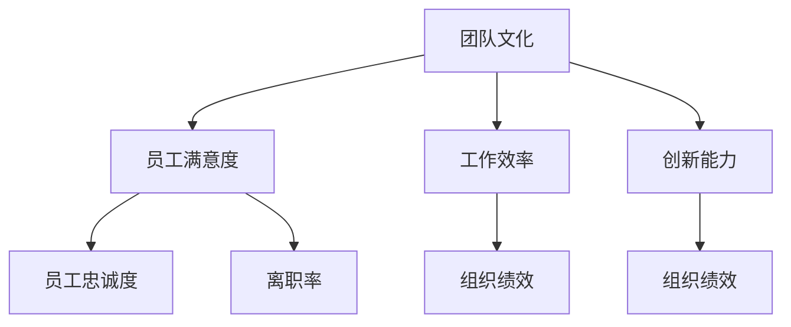
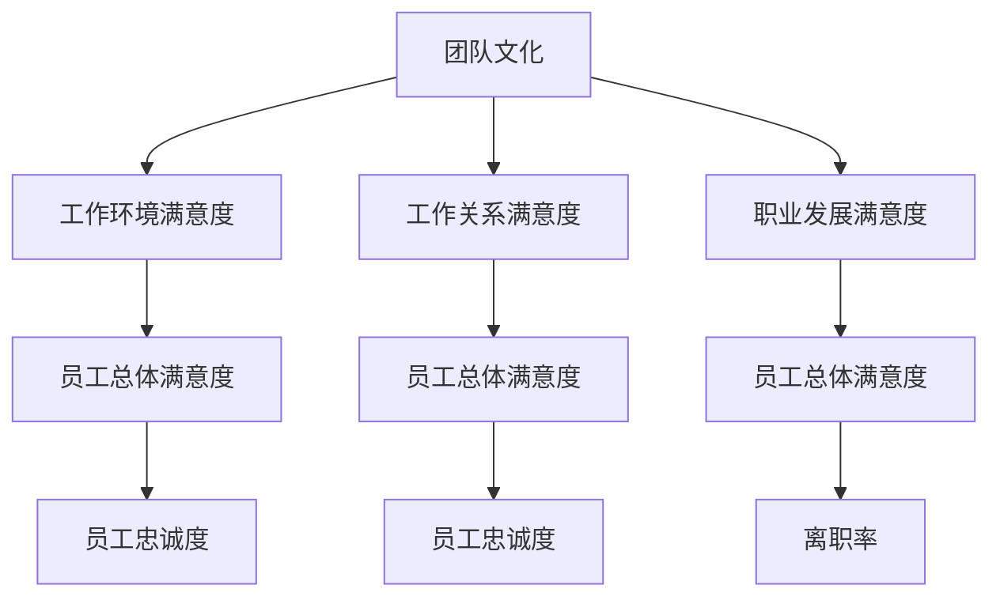

                 

### 文章标题：团队文化：塑造积极向上的工作环境

---

**关键词：** 团队文化，积极向上，工作环境，领导力，数字化转型

**摘要：** 本文章从团队文化的概念、重要性、核心要素、类型、团队文化与领导力、塑造策略等多个角度，详细探讨了如何塑造积极向上的团队文化。通过分析案例、项目应用和数字化转型中的团队文化影响，本文为团队文化建设提供了实用的方法和策略。

---

### 目录大纲：《团队文化：塑造积极向上的工作环境》

#### 第一部分：团队文化的理论基础

##### 第1章：团队文化的概念与重要性

- **1.1. 团队文化的定义**
- **1.2. 团队文化的重要性**
- **1.3. 团队文化与组织绩效**
- **1.4. 团队文化与员工满意度**

##### 第2章：团队文化的核心要素

- **2.1. 共同价值观与使命**
- **2.2. 角色认知与协作**
- **2.3. 信任与沟通**
- **2.4. 正面情绪与支持**

##### 第3章：团队文化的类型与特征

- **3.1. 类型与特征概述**
- **3.2. 专制型文化**
- **3.3. 自由型文化**
- **3.4. 合作型文化**

##### 第4章：团队文化与领导力

- **4.1. 领导者在塑造团队文化中的作用**
- **4.2. 情境领导理论在团队文化中的应用**
- **4.3. 领导风格的转变**

#### 第二部分：积极向上团队文化的塑造策略

##### 第5章：创建积极的团队氛围

- **5.1. 营造信任与尊重**
- **5.2. 建立有效的沟通机制**
- **5.3. 强化正面行为与鼓励创新**
- **5.4. 管理冲突与解决分歧**

##### 第6章：提升团队凝聚力

- **6.1. 团队凝聚力的概念与作用**
- **6.2. 团队建设活动的设计与实施**
- **6.3. 团队发展模型与阶段**

##### 第7章：激励与认可

- **7.1. 激励理论在团队文化中的应用**
- **7.2. 设立明确的绩效目标**
- **7.3. 个性化奖励机制**

##### 第8章：积极团队文化的长期维持与调整

- **8.1. 持续改进与适应性调整**
- **8.2. 外部环境变化对团队文化的影响**
- **8.3. 团队文化的评估与优化**

#### 第三部分：团队文化案例分析与应用

##### 第9章：团队文化案例研究

- **9.1. 案例背景与目标**
- **9.2. 团队文化的构建过程**
- **9.3. 团队文化的成果评估**

##### 第10章：团队文化在项目中的应用

- **10.1. 团队文化在项目启动阶段的作用**
- **10.2. 团队文化在项目实施阶段的影响**
- **10.3. 团队文化在项目收尾阶段的巩固**

##### 第11章：团队文化在数字化转型中的应用

- **11.1. 数字化转型对团队文化的影响**
- **11.2. 构建数字化时代下的团队文化**
- **11.3. 团队文化在数字化项目中的具体应用**

#### 附录

##### 附录A：团队文化构建工具与资源

- **A.1. 评估工具与方法**
- **A.2. 沟通与协作工具**
- **A.3. 领导力发展资源**

---

## 第1章：团队文化的概念与重要性

### 1.1 团队文化的定义

团队文化是指一个团队在其长期运营过程中形成并共同遵循的一系列价值观、信念、行为准则和工作习惯。这些要素共同构成了团队的独特氛围，对团队成员的行为和决策产生深远影响。

团队文化的核心要素包括：

- **价值观**：团队共同认同的核心信念和原则。
- **信念**：团队成员对团队的信任和认同。
- **行为准则**：团队在运营过程中共同遵循的行为规范。
- **工作习惯**：团队成员在工作中形成的工作方法和方式。

### 1.2 团队文化的重要性

#### 1.2.1 团队文化的核心作用

团队文化的核心作用在于：

- **提升团队凝聚力**：共同的目标和价值观有助于团队成员之间的相互信任和协作。
- **促进创新能力**：积极的团队氛围鼓励成员提出新的想法和解决方案。
- **提高工作效率**：清晰的团队文化能够减少沟通成本，提高工作效率。
- **增强组织竞争力**：一个具有强大团队文化的组织能够在激烈的市场竞争中脱颖而出。

#### 1.2.2 团队文化的重要性

团队文化的重要性体现在以下几个方面：

- **个人成长**：团队成员在良好的团队文化中能够获得更多的成长机会。
- **组织发展**：团队文化对组织的发展和战略目标的实现具有重要影响。
- **客户关系**：良好的团队文化有助于建立与客户的良好关系。

### 1.3 团队文化与组织绩效

#### 1.3.1 团队文化对组织绩效的影响

团队文化对组织绩效具有显著影响。研究表明，具有积极团队文化的组织通常能够实现更高的绩效。具体影响包括：

- **提高工作效率**：清晰的团队文化能够减少沟通成本，提高工作效率。
- **增强创新能力**：积极的团队氛围鼓励成员提出新的想法和解决方案。
- **提高员工满意度**：良好的团队文化能够提高员工的满意度和忠诚度。
- **降低离职率**：团队文化对员工的工作满意度有显著影响，良好的团队文化能够降低员工的离职率。

#### 1.3.2 团队文化与组织绩效的关联

团队文化与组织绩效之间的关联可以通过以下模型进行描述：

### 1.4 团队文化与员工满意度

#### 1.4.1 团队文化对员工满意度的影响

团队文化对员工满意度具有显著影响。良好的团队文化能够提高员工的满意度和工作积极性，具体影响包括：

- **工作环境**：良好的团队文化能够提供一个积极、和谐的工作环境，提高员工的工作满意度。
- **工作关系**：团队文化能够促进团队成员之间的良好关系，提高员工的社交满意度。
- **职业发展**：良好的团队文化鼓励员工成长和发展，提高员工的职业满意度。

#### 1.4.2 员工满意度与团队文化的关系

员工满意度与团队文化之间的关系可以通过以下模型进行描述：

## 第2章：团队文化的核心要素

### 2.1 共同价值观与使命

#### 2.1.1 共同价值观

共同价值观是团队文化的核心要素之一，它是指团队内成员共同认同并遵循的价值观。这些价值观通常包括：

- **诚信**：诚信是团队文化的基石，要求团队成员诚实守信，言行一致。
- **创新**：鼓励团队成员勇于创新，不断探索新的方法和解决方案。
- **尊重**：尊重团队成员的个性和观点，建立相互尊重的工作环境。
- **责任**：强调团队成员对工作负责，承担应有的责任。

#### 2.1.2 使命

使命是指团队存在的根本目的和长远目标。明确的使命有助于团队成员保持一致的行动方向，具体包括：

- **组织使命**：团队为了实现组织的整体目标而存在的使命。
- **团队使命**：团队为了实现团队自身的目标而存在的使命。
- **个人使命**：团队成员为了实现个人职业发展目标而存在的使命。

### 2.2 角色认知与协作

#### 2.2.1 角色认知

角色认知是指团队成员对自己在团队中的定位和角色的理解。清晰的认知有助于提高团队协作效率，具体包括：

- **个人角色**：明确自己在团队中的角色和职责。
- **团队角色**：了解团队中其他成员的角色和职责。
- **角色转变**：随着团队目标的变化，灵活调整个人角色。

#### 2.2.2 协作

协作是指团队成员为了共同目标而共同努力的过程。高效的协作能够提高团队的工作效率，具体包括：

- **沟通与协调**：通过有效的沟通和协调，确保团队成员之间的信息畅通。
- **资源共享**：通过资源共享，提高团队的工作效率。
- **任务分配**：合理分配任务，确保每个人都能发挥最大的作用。

### 2.3 信任与沟通

#### 2.3.1 信任

信任是团队文化中至关重要的一环。团队成员之间的信任能够促进协作和创新，具体包括：

- **信任建立**：通过相互理解和尊重，建立信任关系。
- **信任维护**：通过积极沟通和解决问题，维护信任关系。
- **信任危机**：面对信任危机时，及时采取措施，修复信任关系。

#### 2.3.2 沟通

沟通是团队文化中的另一个核心要素。有效的沟通有助于减少误解和冲突，提高团队的协作效率，具体包括：

- **沟通渠道**：建立多样化的沟通渠道，确保信息畅通。
- **沟通技巧**：提高团队成员的沟通技巧，确保信息传递的准确性。
- **沟通障碍**：识别和克服沟通障碍，提高沟通效果。

### 2.4 正面情绪与支持

#### 2.4.1 正面情绪

正面情绪是指团队成员在团队中感受到的快乐、满足和自豪等积极情绪。正面情绪有助于提高团队的士气和工作效率，具体包括：

- **士气提升**：通过鼓励和表彰，提高团队成员的士气。
- **快乐工作**：创造一个快乐的工作氛围，让团队成员享受工作过程。
- **自豪感**：通过团队的成功，增强团队成员的自豪感。

#### 2.4.2 支持

支持是指团队成员在工作和生活中相互关心和帮助。支持能够增强团队的凝聚力，具体包括：

- **工作支持**：为团队成员提供工作上的帮助和支持。
- **生活支持**：在团队成员遇到困难时，提供生活上的帮助和关爱。
- **心理支持**：为团队成员提供心理上的支持和鼓励。

## 第3章：团队文化的类型与特征

### 3.1 类型与特征概述

团队文化的类型可以根据其特征和表现形式进行分类。常见的团队文化类型包括：

- **专制型文化**
- **自由型文化**
- **合作型文化**

### 3.2 专制型文化

#### 3.2.1 特点

专制型文化以严格的管理和高度的控制为特征。团队成员通常缺乏自主权和创新能力，具体包括：

- **高度集中决策**：团队决策由上级领导单独做出。
- **严格规章制度**：团队成员需严格遵守规章制度。
- **缺乏创新氛围**：创新和尝试通常受到限制。

#### 3.2.2 优缺点

专制型文化的优缺点如下：

- **优点**：有利于统一行动，提高效率。
- **缺点**：容易导致员工缺乏动力，压抑创造力。

### 3.3 自由型文化

#### 3.3.1 特点

自由型文化强调个人自由和创新。团队成员拥有较高的自主权和决策权，具体包括：

- **自主决策**：团队成员有权自主决策和制定工作计划。
- **鼓励创新**：团队成员被鼓励提出新的想法和解决方案。
- **宽松的工作环境**：团队成员享有较高的自由度和灵活性。

#### 3.3.2 优缺点

自由型文化的优缺点如下：

- **优点**：有利于激发创造力，提高团队成员的积极性。
- **缺点**：可能导致组织结构松散，协调难度增加。

### 3.4 合作型文化

#### 3.4.1 特点

合作型文化强调团队合作和共享。团队成员之间相互依赖，共同实现团队目标，具体包括：

- **团队合作**：团队成员强调团队合作，共同完成工作。
- **共享成功与失败**：团队成员共同分享成功和失败，增强归属感。
- **相互支持**：团队成员在工作和生活中相互关心和帮助。

#### 3.4.2 优缺点

合作型文化的优缺点如下：

- **优点**：有助于提高团队凝聚力，提升整体绩效。
- **缺点**：可能存在个人贡献难以衡量的问题。

### 3.5 团队文化类型评估

#### 3.5.1 团队文化评估指标

团队文化评估指标包括：

- **员工满意度**：评估员工对团队文化的满意度。
- **团队绩效**：评估团队在特定任务中的表现。
- **团队凝聚力**：评估团队成员之间的协作和信任程度。

#### 3.5.2 团队文化评估方法

团队文化评估方法包括：

- **问卷调查**：通过问卷调查了解员工对团队文化的看法。
- **访谈**：与团队成员进行面对面的访谈，深入了解团队文化的实际情况。
- **观察**：通过观察团队成员的行为和互动，评估团队文化的特征。

### 3.6 团队文化评估的应用

#### 3.6.1 团队文化建设

团队文化评估可以帮助组织了解当前团队文化的状况，为团队文化建设提供依据。

#### 3.6.2 团队管理改进

团队文化评估可以发现团队管理中存在的问题，为改进团队管理提供方向。

## 第4章：团队文化与领导力

### 4.1 领导者在塑造团队文化中的作用

领导者在塑造团队文化中扮演着关键角色。他们通过以下方式影响团队文化：

- **价值观的传递**：领导者通过言行示范，将组织的价值观传递给团队成员。
- **决策与行为**：领导者的决策和行为对团队文化产生直接影响。
- **激励与认可**：领导者通过激励和认可机制，塑造积极的团队文化。

### 4.2 情境领导理论在团队文化中的应用

情境领导理论认为，领导风格应适应团队成员的能力和需求。在团队文化建设中，情境领导理论的应用包括：

- **识别团队成员的需求和能力**：领导者通过了解团队成员的需求和能力，选择合适的领导风格。
- **灵活调整领导风格**：领导者根据团队发展阶段和任务要求，灵活调整领导风格。
- **培养情境领导者**：通过培训和指导，培养团队成员成为情境领导者，增强团队自主管理能力。

### 4.3 领导风格的转变

#### 4.3.1 自上而下的转变

自上而下的转变是指领导者从传统的控制型领导风格转向更开放和参与型的领导风格。这种转变有助于塑造积极的团队文化。

#### 4.3.2 自下而上的转变

自下而上的转变是指团队成员在领导过程中发挥更大的作用，参与决策和领导。这种转变有助于增强团队的自主性和创造力。

### 4.4 团队文化与领导力评估

#### 4.4.1 领导力评估指标

领导力评估指标包括：

- **团队绩效**：评估团队在特定任务中的表现。
- **员工满意度**：评估员工对领导者的满意度。
- **团队凝聚力**：评估团队成员之间的协作和信任程度。

#### 4.4.2 领导力评估方法

领导力评估方法包括：

- **360度评估**：通过团队成员、上级领导和下属的评价，全面了解领导者的表现。
- **行为事件访谈**：通过深入了解领导者的行为事件，评估其领导能力。
- **领导力发展中心**：通过模拟情境和角色扮演，评估领导者的领导能力。

### 4.5 团队文化与领导力改进策略

#### 4.5.1 领导者角色转变

领导者应从控制者转变为支持者和引导者，鼓励团队成员参与决策和团队建设。

#### 4.5.2 培训与发展

通过培训和发展计划，提升领导者的领导能力和团队文化塑造能力。

#### 4.5.3 激励与认可

建立有效的激励与认可机制，激发团队成员的积极性和创造力。

## 第5章：创建积极的团队氛围

### 5.1 营造信任与尊重

#### 5.1.1 信任的重要性

信任是团队文化中至关重要的一环。它能够促进团队成员之间的协作和信任。

#### 5.1.2 营造信任的策略

- **建立明确的沟通渠道**：通过建立有效的沟通机制，确保信息的透明和及时。
- **鼓励开放性沟通**：鼓励团队成员表达自己的观点和意见，培养开放性沟通的文化。
- **解决冲突**：及时解决团队内部的冲突，防止信任危机的发生。

#### 5.1.3 尊重的体现

- **尊重个体差异**：尊重团队成员的个性、观点和贡献。
- **平等对待**：无论职位高低，都给予团队成员平等对待。
- **认可与奖励**：对团队成员的成就和贡献给予认可和奖励。

### 5.2 建立有效的沟通机制

#### 5.2.1 沟通的重要性

有效的沟通是团队文化中不可或缺的一部分。它能够提高团队的工作效率和协作水平。

#### 5.2.2 沟通机制的设计

- **明确沟通目标**：确保沟通的目标明确，避免信息传递的偏差。
- **选择合适的沟通方式**：根据沟通的内容和目的，选择合适的沟通方式，如面对面会议、电子邮件、即时通讯工具等。
- **建立反馈机制**：鼓励团队成员提供反馈，不断优化沟通效果。

#### 5.2.3 提高沟通效果

- **倾听**：倾听是有效沟通的关键。领导者应鼓励团队成员表达自己的观点，并给予充分的关注。
- **明确表达**：确保信息传递的准确性，避免误解和误读。
- **避免信息过载**：控制信息的数量和质量，避免信息过载。

### 5.3 强化正面行为与鼓励创新

#### 5.3.1 正面行为的重要性

正面行为是指团队成员在工作中展现出的积极、有建设性的行为。强化正面行为有助于营造积极的团队氛围。

#### 5.3.2 鼓励创新的策略

- **创建创新环境**：为团队成员提供创新的空间和资源，鼓励他们提出新的想法和解决方案。
- **奖励创新成果**：对创新成果给予认可和奖励，激发团队成员的创造力。
- **建立创新机制**：建立创新机制，如创新竞赛、头脑风暴会议等，鼓励团队成员积极参与创新活动。

### 5.4 管理冲突与解决分歧

#### 5.4.1 冲突的类型

冲突可以分为以下几种类型：

- **目标冲突**：团队成员对任务目标和优先级有不同的看法。
- **资源冲突**：团队成员争夺有限的资源，如时间、人力和物资。
- **价值观冲突**：团队成员在价值观和信念上存在差异。

#### 5.4.2 冲突的管理策略

- **预防冲突**：通过明确的沟通和协作机制，预防冲突的发生。
- **识别冲突**：及时发现和识别冲突，防止其扩大和升级。
- **解决冲突**：采取适当的策略解决冲突，如协商、调解和仲裁。

#### 5.4.3 冲突的解决方法

- **妥协**：通过妥协达成双方都能接受的解决方案。
- **协商**：通过双方协商，寻求双方都能接受的解决方案。
- **调解**：由第三方调解员介入，帮助解决冲突。
- **仲裁**：由权威机构或第三方仲裁人做出最终裁决。

## 第6章：提升团队凝聚力

### 6.1 团队凝聚力的概念与作用

#### 6.1.1 团队凝聚力的定义

团队凝聚力是指团队成员之间的相互吸引力和归属感。它反映了团队成员在团队中的团结程度。

#### 6.1.2 团队凝聚力的作用

团队凝聚力的作用包括：

- **提高工作效率**：高凝聚力的团队能够更好地协作，提高工作效率。
- **增强团队士气**：凝聚力的提升能够增强团队成员的自信心和士气。
- **促进创新**：高凝聚力的团队能够更好地发挥集体智慧，促进创新。

### 6.2 团队建设活动的设计与实施

#### 6.2.1 团队建设活动的重要性

团队建设活动是提升团队凝聚力的重要手段。它能够帮助团队成员建立更紧密的联系，增强团队的协作能力。

#### 6.2.2 团队建设活动的类型

- **团队拓展活动**：通过户外拓展训练，增强团队成员的团队意识和协作能力。
- **团队培训**：通过专业培训，提升团队成员的专业能力和团队协作能力。
- **团队建设游戏**：通过团队游戏，增强团队成员之间的沟通和协作。
- **团队会议**：通过团队会议，促进团队成员之间的沟通和协作。

#### 6.2.3 团队建设活动的实施步骤

- **确定目标**：明确团队建设活动的目标，如提升团队凝聚力、增强团队协作能力等。
- **设计活动方案**：根据目标，设计合适的团队建设活动方案。
- **实施活动**：按照方案实施团队建设活动，确保活动顺利进行。
- **评估效果**：评估团队建设活动的效果，根据评估结果进行改进。

### 6.3 团队发展模型与阶段

#### 6.3.1 团队发展模型

团队发展模型是描述团队从形成到成熟的阶段和过程的理论框架。常见的团队发展模型包括：

- **塔克曼模型**：描述团队从形成到成熟的过程，包括形成、动荡、规范化、成熟四个阶段。
- **贝尔宾模型**：根据团队成员的个性特点，将团队分为九种角色，包括协调者、监听者、执行者等。

#### 6.3.2 团队发展阶段的特征

- **形成阶段**：团队成员初识，开始建立关系。
- **动荡阶段**：团队成员角色冲突，团队开始形成。
- **规范化阶段**：团队开始建立规范，成员角色明确。
- **成熟阶段**：团队高效运作，成员之间相互信任。

#### 6.3.3 团队发展的影响因素

- **领导风格**：领导者的风格对团队发展有重要影响。
- **团队目标**：明确的目标有助于团队的发展。
- **外部环境**：外部环境的变化会影响团队的发展。

### 6.4 提升团队凝聚力的策略

#### 6.4.1 建立共同的价值观和目标

- **共同的价值观**：团队成员共同认同的价值观有助于提升团队的凝聚力。
- **明确的目标**：明确的目标有助于团队成员朝着共同的方向努力。

#### 6.4.2 增强团队成员之间的信任

- **信任建设**：通过建立信任机制，增强团队成员之间的信任。
- **沟通与反馈**：通过有效的沟通和反馈，增强团队成员之间的信任。

#### 6.4.3 培养团队协作能力

- **协作机制**：建立有效的协作机制，促进团队成员之间的协作。
- **团队培训**：通过团队培训，提升团队成员的协作能力。

#### 6.4.4 增强团队归属感

- **团队活动**：通过团队活动，增强团队成员的归属感。
- **奖励机制**：通过奖励机制，激励团队成员为团队做出贡献。

### 6.5 团队凝聚力评估

#### 6.5.1 评估指标

团队凝聚力评估指标包括：

- **员工满意度**：评估员工对团队的满意度。
- **团队绩效**：评估团队在任务中的表现。
- **团队协作**：评估团队成员之间的协作水平。

#### 6.5.2 评估方法

团队凝聚力评估方法包括：

- **问卷调查**：通过问卷调查，了解员工对团队凝聚力的看法。
- **访谈**：与团队成员进行访谈，深入了解团队凝聚力的实际情况。
- **观察**：通过观察团队成员的行为和互动，评估团队凝聚力的水平。

#### 6.5.3 评估应用

团队凝聚力评估的应用包括：

- **团队建设**：通过评估，了解团队凝聚力现状，制定相应的团队建设策略。
- **团队管理**：通过评估，发现团队管理中存在的问题，改进团队管理策略。

## 第7章：激励与认可

### 7.1 激励理论在团队文化中的应用

#### 7.1.1 激励理论概述

激励理论是研究如何激发和维持个体工作动机和积极性的理论。常见的激励理论包括：

- **马斯洛需求层次理论**：将人的需求分为生理需求、安全需求、社交需求、尊重需求和自我实现需求。
- **赫茨伯格双因素理论**：将工作满意度的影响因素分为激励因素和保健因素。
- **目标设置理论**：强调明确的目标对工作动机和绩效的影响。

#### 7.1.2 激励理论在团队文化中的应用

在团队文化中，激励理论的应用包括：

- **满足基本需求**：确保团队成员的基本需求得到满足，如薪酬、安全和工作环境等。
- **激励因素的设计**：通过提供工作挑战、认可和晋升机会等激励因素，激发团队成员的工作动机。
- **目标设置**：设定明确、具有挑战性的目标，引导团队成员为实现目标而努力。

### 7.2 设立明确的绩效目标

#### 7.2.1 绩效目标的重要性

明确的绩效目标是激励团队成员努力工作的关键。它有助于：

- **明确工作方向**：确保团队成员明确自己的工作目标。
- **提高工作效率**：通过目标导向，提高团队成员的工作效率。
- **衡量工作成果**：通过绩效目标，衡量团队成员的工作成果。

#### 7.2.2 设立绩效目标的步骤

设立明确的绩效目标包括以下步骤：

- **确定目标**：根据团队的战略目标，确定具体的绩效目标。
- **分解目标**：将绩效目标分解为可操作的任务和指标。
- **明确责任**：明确每个团队成员在实现目标中的责任和角色。
- **沟通与反馈**：与团队成员沟通绩效目标，并定期进行反馈和调整。

### 7.3 个性化奖励机制

#### 7.3.1 个性化奖励机制的重要性

个性化奖励机制是根据团队成员的个性特点和工作绩效，设计相应的奖励机制。它有助于：

- **激发个人潜力**：通过个性化奖励，激发团队成员的个人潜力。
- **增强工作动力**：个性化奖励能够增强团队成员的工作动力。
- **提高工作满意度**：个性化的奖励机制能够提高团队成员的工作满意度。

#### 7.3.2 设计个性化奖励机制的步骤

设计个性化奖励机制包括以下步骤：

- **了解团队成员**：通过调查和访谈，了解团队成员的个性特点、兴趣爱好和职业规划。
- **设计奖励方案**：根据团队成员的特点和需求，设计合适的奖励方案。
- **实施奖励**：按照设计的奖励方案，实施奖励，并及时反馈。
- **调整与优化**：根据奖励实施的效果，调整和优化奖励机制。

### 7.4 奖励与认可的方法

#### 7.4.1 货币奖励

货币奖励是最常见的奖励形式，包括薪酬、奖金、提成等。它能够直接提高团队成员的经济收入，激励其工作积极性。

#### 7.4.2 非货币奖励

非货币奖励包括荣誉、职位晋升、培训机会等。它能够满足团队成员的心理需求，增强其工作满意度和忠诚度。

#### 7.4.3 混合奖励

混合奖励是将货币奖励和非货币奖励相结合，根据具体情况选择合适的奖励形式。它能够满足团队成员的多种需求，提高奖励的效果。

### 7.5 奖励与认可的注意事项

#### 7.5.1 公正性

奖励与认可应遵循公正原则，确保奖励的公平性和透明度。

#### 7.5.2 及时性

奖励与认可应具备及时性，及时表扬和奖励团队成员的优异表现。

#### 7.5.3 个性化

奖励与认可应具有个性化，满足团队成员的个性需求。

#### 7.5.4 持续性

奖励与认可应具备持续性，长期激励团队成员的工作积极性。

## 第8章：积极团队文化的长期维持与调整

### 8.1 持续改进与适应性调整

#### 8.1.1 持续改进的重要性

持续改进是保持团队文化活力和适应性的关键。它有助于：

- **提升团队绩效**：通过不断改进，提高团队的工作效率和绩效。
- **适应环境变化**：在快速变化的环境中，团队文化需要不断调整以适应新的挑战。

#### 8.1.2 持续改进的方法

持续改进的方法包括：

- **PDCA循环**：通过计划（Plan）、执行（Do）、检查（Check）和行动（Act）的循环，不断优化团队文化。
- **员工参与**：鼓励团队成员参与改进过程，提出改进建议，增强团队的自主性和创新能力。

### 8.2 外部环境变化对团队文化的影响

#### 8.2.1 外部环境变化的类型

外部环境变化包括：

- **技术变革**：如新兴技术的出现和普及。
- **市场变化**：如市场需求的变化、竞争对手的崛起等。
- **政策法规**：如政策法规的调整和变化。

#### 8.2.2 外部环境变化的影响

外部环境变化对团队文化的影响包括：

- **价值观的挑战**：外部环境的变化可能挑战团队现有的价值观和信念。
- **行为规范的变化**：外部环境的变化可能导致团队行为规范的变化。
- **组织结构的调整**：外部环境的变化可能导致组织结构的调整，影响团队文化的稳定性。

### 8.3 团队文化的评估与优化

#### 8.3.1 团队文化评估的重要性

团队文化评估是了解团队文化状况、发现问题和优化团队文化的重要手段。它有助于：

- **了解团队文化现状**：通过评估，了解团队文化的优势和不足。
- **发现文化问题**：通过评估，发现团队文化中存在的问题。
- **指导文化优化**：通过评估结果，制定相应的优化策略。

#### 8.3.2 团队文化评估的方法

团队文化评估的方法包括：

- **问卷调查**：通过问卷调查，收集员工对团队文化的看法。
- **访谈**：与团队成员进行访谈，深入了解团队文化的实际情况。
- **观察**：通过观察团队成员的行为和互动，评估团队文化的特征。

#### 8.3.3 团队文化优化的策略

团队文化优化的策略包括：

- **调整价值观**：根据外部环境的变化，调整团队的价值观和信念。
- **优化行为规范**：根据评估结果，优化团队的行为规范和协作机制。
- **加强领导力**：通过培训和发展，提升领导者的领导能力和团队文化建设能力。

### 8.4 团队文化建设的持续发展

#### 8.4.1 持续发展的意义

持续发展是团队文化建设的核心目标，它有助于：

- **提升团队竞争力**：通过持续发展，提升团队在市场中的竞争力。
- **实现组织目标**：通过持续发展，实现组织的战略目标。

#### 8.4.2 持续发展的策略

持续发展的策略包括：

- **创新与学习**：鼓励团队成员不断创新和学习，提升团队的整体素质。
- **文化建设**：通过不断的文化建设，巩固和提升团队文化。
- **优化管理**：通过优化管理，提高团队的运行效率和协作能力。

### 8.5 团队文化建设的可持续发展

#### 8.5.1 可持续发展的内涵

团队文化建设的可持续发展是指：

- **在适应环境变化的基础上，保持团队文化的稳定性和适应性。**
- **在不断创新和学习的基础上，提升团队的综合素质和竞争力。**

#### 8.5.2 可持续发展的挑战

团队文化建设的可持续发展面临以下挑战：

- **文化冲突**：在多元文化和不同背景的员工中，如何保持团队文化的稳定性和一致性。
- **资源限制**：在资源有限的情况下，如何实现团队文化的持续发展。
- **变革阻力**：在组织变革中，如何克服团队成员的变革阻力，推动团队文化的持续发展。

#### 8.5.3 可持续发展的策略

团队文化建设的可持续发展策略包括：

- **构建共同愿景**：通过共同愿景，凝聚团队力量，推动团队文化的持续发展。
- **优化领导力**：通过优化领导力，提升领导者的领导能力和团队文化建设能力。
- **创新与学习**：通过创新和学习，提升团队的适应能力和竞争力。

## 第9章：团队文化案例研究

### 9.1 案例背景与目标

#### 9.1.1 案例背景

案例研究的企业是一家快速发展的互联网公司，在竞争激烈的市场中寻求创新和可持续发展。公司意识到团队文化对其长期成功至关重要，因此决定开展团队文化建设项目。

#### 9.1.2 项目目标

项目目标包括：

- **提升团队凝聚力**：通过建设积极向上的团队文化，提升团队成员之间的凝聚力和协作能力。
- **增强创新能力**：营造鼓励创新和接受失败的文化氛围，激发团队成员的创新能力。
- **提高员工满意度**：通过优化团队文化，提高员工的满意度和忠诚度。

### 9.2 团队文化的构建过程

#### 9.2.1 初步调研

在项目启动阶段，公司进行了全面的初步调研，包括问卷调查、员工访谈和观察，以了解现有团队文化的状况和团队成员的需求。

#### 9.2.2 制定愿景和价值观

基于调研结果，公司制定了明确的愿景和价值观，如“创新、协作、尊重、诚信”等，并确保这些价值观被全体员工认同。

#### 9.2.3 制定行动计划

公司制定了一系列行动计划，包括领导力培训、团队建设活动、员工反馈机制等，以逐步实现团队文化的目标。

#### 9.2.4 实施与推广

在实施阶段，公司通过培训、会议和内部沟通，将新团队文化理念传达给所有员工。同时，公司鼓励员工积极参与团队文化构建，提供反馈和建议。

#### 9.2.5 监测与评估

公司定期监测和评估团队文化的进展，通过员工满意度调查、团队绩效评估等手段，了解团队文化建设的效果。

### 9.3 团队文化的成果评估

#### 9.3.1 团队凝聚力提升

通过团队文化建设项目，团队成员之间的沟通和协作明显增强，团队凝聚力显著提升。

#### 9.3.2 创新能力增强

公司创新项目的成功率显著提高，团队成员更愿意尝试新的想法和方法。

#### 9.3.3 员工满意度提高

员工满意度调查结果显示，员工对公司的满意度和忠诚度有了明显提升。

#### 9.3.4 组织绩效改善

团队文化建设项目的实施，使公司的整体绩效得到了显著改善，公司业绩稳步增长。

### 9.4 案例的启示与挑战

#### 9.4.1 启示

- **领导者的角色**：领导者在团队文化建设中扮演关键角色，他们的态度和行为对团队文化有重要影响。
- **员工参与**：员工的积极参与是团队文化建设成功的关键。
- **持续改进**：团队文化建设需要持续的努力和改进，以适应不断变化的环境。

#### 9.4.2 挑战

- **文化冲突**：在多元文化和不同背景的员工中，如何保持团队文化的统一性和一致性。
- **资源限制**：在资源有限的情况下，如何有效实施团队文化建设项目。
- **变革阻力**：在组织变革中，如何克服员工的变革阻力，推动团队文化的持续发展。

## 第10章：团队文化在项目中的应用

### 10.1 团队文化在项目启动阶段的作用

#### 10.1.1 项目启动阶段的团队文化构建

在项目启动阶段，团队文化对项目的成功至关重要。团队文化能够：

- **明确项目目标**：通过团队文化，确保项目目标与团队价值观和使命一致。
- **建立团队信任**：通过积极的文化氛围，建立团队成员之间的信任，促进有效沟通。
- **激发团队动力**：积极的文化氛围能够激发团队成员的积极性和创造力。

#### 10.1.2 团队文化在项目启动阶段的应用策略

- **文化渗透**：在项目启动会议上，明确传达团队文化理念，确保所有成员对文化有共同的理解。
- **团队建设活动**：开展团队建设活动，如破冰游戏、团队拓展训练等，增强团队成员之间的互动和信任。
- **角色定位与责任分配**：在项目启动阶段，明确团队成员的角色和责任，确保每个人都清楚自己的任务和期望。

### 10.2 团队文化在项目实施阶段的影响

#### 10.2.1 项目实施阶段的团队文化维护

在项目实施阶段，团队文化对项目的顺利推进和团队协作至关重要。团队文化能够：

- **促进沟通与协作**：通过积极的团队文化，鼓励团队成员之间的沟通和协作，减少误解和冲突。
- **激励团队成员**：积极的团队文化能够激发团队成员的工作热情和创造力，提高项目效率。
- **应对挑战**：团队文化能够帮助团队成员在面对挑战和问题时，保持积极的心态和解决问题的能力。

#### 10.2.2 团队文化在项目实施阶段的应用策略

- **文化宣传**：通过定期举办文化活动，如团队会议、庆祝活动等，持续强化团队文化。
- **文化榜样**：通过树立团队文化榜样，如优秀团队成员、项目成功案例等，激发团队成员的文化认同。
- **文化培训**：为团队成员提供文化培训，提高他们的文化意识和协作能力。

### 10.3 团队文化在项目收尾阶段的作用

#### 10.3.1 项目收尾阶段的团队文化巩固

在项目收尾阶段，团队文化对项目的总结和团队反思至关重要。团队文化能够：

- **促进项目总结**：通过积极的团队文化，鼓励团队成员对项目进行深入反思和总结，找出经验教训。
- **增强团队凝聚力**：项目收尾阶段的文化活动能够增强团队成员之间的感情和凝聚力。
- **激励未来项目**：通过项目收尾的文化活动，为未来项目的顺利开展奠定基础。

#### 10.3.2 团队文化在项目收尾阶段的应用策略

- **总结会议**：组织项目总结会议，让团队成员分享经验教训，强化团队文化的价值观。
- **庆祝活动**：举办庆祝活动，表彰项目团队的辛勤工作和贡献，强化积极的文化氛围。
- **文化传承**：通过项目收尾阶段的文化活动，将团队文化传递给新成员，确保团队文化的延续和发展。

### 10.4 团队文化在项目中的应用案例分析

#### 10.4.1 案例背景

案例是一家大型科技公司，负责开发一款新型智能设备的软件项目。在项目启动阶段，公司高度重视团队文化建设，以确保项目的顺利推进。

#### 10.4.2 团队文化建设过程

- **项目启动会议**：在项目启动会议上，公司明确传达了团队的价值观和使命，强调了团队协作和创新能力的重要性。
- **团队建设活动**：公司组织了多次团队建设活动，如团队拓展训练、团队建设游戏等，增强了团队成员之间的信任和协作。
- **文化宣传**：公司定期发布文化宣传资料，通过内部网站、电子邮件等方式，持续强化团队文化。

#### 10.4.3 团队文化对项目的影响

- **提高项目效率**：通过积极的团队文化，项目团队成员之间的沟通和协作显著增强，项目进度得以顺利推进。
- **增强创新能力**：团队文化鼓励创新，项目团队在开发过程中提出多项创新解决方案，提高了产品的竞争力。
- **提升员工满意度**：项目团队成员在积极的团队文化中感受到更多的尊重和支持，员工满意度显著提高。

#### 10.4.4 案例启示

- **团队文化的重要性**：案例表明，团队文化对项目的成功至关重要，它能够提高项目效率、激发创新和提升员工满意度。
- **文化建设的持续投入**：团队文化建设需要持续投入和努力，以确保其效果能够长期保持。

## 第11章：团队文化在数字化转型中的应用

### 11.1 数字化转型对团队文化的影响

#### 11.1.1 数字化转型概述

数字化转型是指企业通过利用数字技术，实现业务流程、组织结构和商业模式等方面的全面变革。数字化转型对团队文化产生深远影响。

#### 11.1.2 数字化转型对团队文化的影响

- **文化冲突**：数字化转型过程中，传统团队文化和新兴数字文化可能存在冲突，影响团队文化的稳定性。
- **角色变化**：数字化转型要求团队成员具备新的技能和角色，传统团队文化可能无法适应这种变化。
- **工作模式转变**：数字化转型改变了工作模式，如远程办公、数字化协作等，对团队文化提出了新的要求。

### 11.2 构建数字化时代下的团队文化

#### 11.2.1 数字化团队文化的核心要素

数字化时代下的团队文化应包括以下核心要素：

- **创新思维**：鼓励团队成员积极探索新技术、新模式，持续创新。
- **敏捷协作**：通过数字化工具，实现团队成员的高效协作和快速响应。
- **知识共享**：促进团队成员之间的知识共享和技能提升。
- **用户导向**：以用户需求为中心，持续优化产品和服务。

#### 11.2.2 建立数字化团队文化的策略

- **数字化培训**：为团队成员提供数字化技能培训，提升其数字化素养。
- **数字化工具推广**：引入数字化协作工具，提升团队工作效率。
- **数字化文化建设**：通过数字化手段，如内部网站、社交媒体等，传播团队文化和价值观。
- **数字化反馈机制**：建立数字化反馈机制，鼓励团队成员积极参与团队文化建设。

### 11.3 团队文化在数字化项目中的具体应用

#### 11.3.1 团队文化在数字化项目规划阶段的应用

在数字化项目规划阶段，团队文化的作用包括：

- **明确项目目标**：通过团队文化，确保项目目标与团队价值观和使命一致。
- **团队协作**：通过积极的文化氛围，促进团队成员之间的协作和沟通。
- **风险识别**：通过团队文化，提高团队成员对项目风险的敏感性和应对能力。

#### 11.3.2 团队文化在数字化项目执行阶段的应用

在数字化项目执行阶段，团队文化的作用包括：

- **高效协作**：通过数字化工具，实现团队成员的高效协作和快速响应。
- **持续改进**：鼓励团队成员在项目过程中不断反思和改进，提高项目质量。
- **创新能力**：通过团队文化，激发团队成员的创新思维，提高项目创新成果。

#### 11.3.3 团队文化在数字化项目收尾阶段的应用

在数字化项目收尾阶段，团队文化的作用包括：

- **项目总结**：通过团队文化，鼓励团队成员对项目进行深入反思和总结，找出经验教训。
- **团队凝聚力**：通过文化活动，增强团队成员之间的感情和凝聚力。
- **知识传承**：通过数字化手段，将项目经验教训和最佳实践传递给新成员。

### 11.4 数字化团队文化成功案例分析

#### 11.4.1 案例背景

案例是一家大型制造企业，在数字化转型过程中，面临团队文化变革的挑战。

#### 11.4.2 团队文化建设过程

- **文化调研**：企业进行了全面的团队文化调研，了解现有团队文化的状况和问题。
- **制定愿景**：企业制定了清晰的数字化愿景和价值观，强调创新、协作和用户导向。
- **数字化培训**：为团队成员提供全面的数字化技能培训，提升其数字化素养。
- **数字化工具推广**：引入先进的数字化协作工具，提升团队工作效率。
- **文化建设活动**：举办各种数字化文化建设活动，如数字化竞赛、团队拓展训练等。

#### 11.4.3 团队文化对数字化转型的影响

- **提高项目效率**：通过数字化团队文化，项目团队成员之间的沟通和协作显著增强，项目效率提高。
- **增强创新能力**：团队文化鼓励创新，项目团队在数字化转型过程中提出多项创新解决方案。
- **提升员工满意度**：数字化团队文化为员工提供了更多的发展机会和成就感，员工满意度显著提高。

#### 11.4.4 案例启示

- **团队文化的重要性**：案例表明，数字化团队文化对数字化转型成功至关重要，它能够提高项目效率、激发创新和提升员工满意度。
- **持续建设与优化**：数字化团队文化需要持续建设与优化，以适应不断变化的技术和市场需求。

## 附录A：团队文化构建工具与资源

### A.1 评估工具与方法

#### A.1.1 问卷调查

问卷调查是评估团队文化的一种常用方法，通过设计问卷，收集员工对团队文化的看法和反馈。

#### A.1.2 面谈与访谈

面谈与访谈是一种深入了解员工对团队文化看法的方法，通过与员工进行一对一的交流，获取更详细的反馈。

#### A.1.3 团队调查

团队调查是一种通过团队会议或小组讨论的方式，评估团队文化的方法。

### A.2 沟通与协作工具

#### A.2.1 内部沟通平台

内部沟通平台是促进团队成员之间沟通的有效工具，如企业微信、钉钉等。

#### A.2.2 远程协作工具

远程协作工具是支持远程办公和团队协作的重要工具，如Trello、Slack等。

#### A.2.3 文档共享与协作工具

文档共享与协作工具，如Google Docs、Notion等，帮助团队成员高效共享和协作。

### A.3 领导力发展资源

#### A.3.1 领导力培训课程

领导力培训课程为领导者提供提升领导力的知识和技能，如公开课、内训等。

#### A.3.2 领导力书籍与资料

领导力书籍与资料，如《领导力五要素》、《卓有成效的领导者》等，为领导者提供实用的指导。

#### A.3.3 领导力发展社区

领导力发展社区，如LinkedIn、领英等，为领导者提供交流和学习的平台。

---

**作者：** AI天才研究院/AI Genius Institute & 禅与计算机程序设计艺术 /Zen And The Art of Computer Programming

---

至此，本文已经完成了对团队文化：塑造积极向上的工作环境这一主题的详细探讨。通过多个章节的深入分析，我们不仅了解了团队文化的定义、重要性、核心要素、类型、领导力影响、塑造策略，还探讨了团队文化在项目中的应用和数字化转型中的具体实践。同时，通过案例分析，我们看到了团队文化建设的成功实践和面临的挑战。希望本文能够为读者提供有价值的参考和指导，助力团队文化建设。感谢阅读！

---

## 完整的8000字文章内容

---

**文章标题：** 团队文化：塑造积极向上的工作环境

---

**关键词：** 团队文化，积极向上，工作环境，领导力，数字化转型

**摘要：** 本文章从团队文化的概念、重要性、核心要素、类型、团队文化与领导力、塑造策略等多个角度，详细探讨了如何塑造积极向上的团队文化。通过分析案例、项目应用和数字化转型中的团队文化影响，本文为团队文化建设提供了实用的方法和策略。

---

### 目录大纲：《团队文化：塑造积极向上的工作环境》

#### 第一部分：团队文化的理论基础

##### 第1章：团队文化的概念与重要性

- **1.1. 团队文化的定义**
- **1.2. 团队文化的重要性**
- **1.3. 团队文化与组织绩效**
- **1.4. 团队文化与员工满意度**

##### 第2章：团队文化的核心要素

- **2.1. 共同价值观与使命**
- **2.2. 角色认知与协作**
- **2.3. 信任与沟通**
- **2.4. 正面情绪与支持**

##### 第3章：团队文化的类型与特征

- **3.1. 类型与特征概述**
- **3.2. 专制型文化**
- **3.3. 自由型文化**
- **3.4. 合作型文化**

##### 第4章：团队文化与领导力

- **4.1. 领导者在塑造团队文化中的作用**
- **4.2. 情境领导理论在团队文化中的应用**
- **4.3. 领导风格的转变**

#### 第二部分：积极向上团队文化的塑造策略

##### 第5章：创建积极的团队氛围

- **5.1. 营造信任与尊重**
- **5.2. 建立有效的沟通机制**
- **5.3. 强化正面行为与鼓励创新**
- **5.4. 管理冲突与解决分歧**

##### 第6章：提升团队凝聚力

- **6.1. 团队凝聚力的概念与作用**
- **6.2. 团队建设活动的设计与实施**
- **6.3. 团队发展模型与阶段**

##### 第7章：激励与认可

- **7.1. 激励理论在团队文化中的应用**
- **7.2. 设立明确的绩效目标**
- **7.3. 个性化奖励机制**

##### 第8章：积极团队文化的长期维持与调整

- **8.1. 持续改进与适应性调整**
- **8.2. 外部环境变化对团队文化的影响**
- **8.3. 团队文化的评估与优化**

#### 第三部分：团队文化案例分析与应用

##### 第9章：团队文化案例研究

- **9.1. 案例背景与目标**
- **9.2. 团队文化的构建过程**
- **9.3. 团队文化的成果评估**

##### 第10章：团队文化在项目中的应用

- **10.1. 团队文化在项目启动阶段的作用**
- **10.2. 团队文化在项目实施阶段的影响**
- **10.3. 团队文化在项目收尾阶段的巩固**

##### 第11章：团队文化在数字化转型中的应用

- **11.1. 数字化转型对团队文化的影响**
- **11.2. 构建数字化时代下的团队文化**
- **11.3. 团队文化在数字化项目中的具体应用**

#### 附录

##### 附录A：团队文化构建工具与资源

- **A.1. 评估工具与方法**
- **A.2. 沟通与协作工具**
- **A.3. 领导力发展资源**

---

## 第1章：团队文化的概念与重要性

### 1.1 团队文化的定义

团队文化是指一个团队在其长期运营过程中形成并共同遵循的一系列价值观、信念、行为准则和工作习惯。这些要素共同构成了团队的独特氛围，对团队成员的行为和决策产生深远影响。

团队文化的核心要素包括：

- **价值观**：团队共同认同的核心信念和原则。
- **信念**：团队成员对团队的信任和认同。
- **行为准则**：团队在运营过程中共同遵循的行为规范。
- **工作习惯**：团队成员在工作中形成的工作方法和方式。

### 1.2 团队文化的重要性

#### 1.2.1 团队文化的核心作用

团队文化的核心作用在于：

- **提升团队凝聚力**：共同的目标和价值观有助于团队成员之间的相互信任和协作。
- **促进创新能力**：积极的团队氛围鼓励成员提出新的想法和解决方案。
- **提高工作效率**：清晰的团队文化能够减少沟通成本，提高工作效率。
- **增强组织竞争力**：一个具有强大团队文化的组织能够在激烈的市场竞争中脱颖而出。

#### 1.2.2 团队文化的重要性

团队文化的重要性体现在以下几个方面：

- **个人成长**：团队成员在良好的团队文化中能够获得更多的成长机会。
- **组织发展**：团队文化对组织的发展和战略目标的实现具有重要影响。
- **客户关系**：良好的团队文化有助于建立与客户的良好关系。

### 1.3 团队文化与组织绩效

#### 1.3.1 团队文化对组织绩效的影响

团队文化对组织绩效具有显著影响。研究表明，具有积极团队文化的组织通常能够实现更高的绩效。具体影响包括：

- **提高工作效率**：清晰的团队文化能够减少沟通成本，提高工作效率。
- **增强创新能力**：积极的团队氛围鼓励成员提出新的想法和解决方案。
- **提高员工满意度**：良好的团队文化能够提高员工的满意度和忠诚度。
- **降低离职率**：团队文化对员工的工作满意度有显著影响，良好的团队文化能够降低员工的离职率。

#### 1.3.2 团队文化与组织绩效的关联

团队文化与组织绩效之间的关联可以通过以下模型进行描述：

### 1.4 团队文化与员工满意度

#### 1.4.1 团队文化对员工满意度的影响

团队文化对员工满意度具有显著影响。良好的团队文化能够提高员工的满意度和工作积极性，具体影响包括：

- **工作环境**：良好的团队文化能够提供一个积极、和谐的工作环境，提高员工的工作满意度。
- **工作关系**：团队文化能够促进团队成员之间的良好关系，提高员工的社交满意度。
- **职业发展**：良好的团队文化鼓励员工成长和发展，提高员工的职业满意度。

#### 1.4.2 员工满意度与团队文化的关系

员工满意度与团队文化之间的关系可以通过以下模型进行描述：

## 第2章：团队文化的核心要素

### 2.1 共同价值观与使命

#### 2.1.1 共同价值观

共同价值观是团队文化的核心要素之一，它是指团队内成员共同认同并遵循的价值观。这些价值观通常包括：

- **诚信**：诚信是团队文化的基石，要求团队成员诚实守信，言行一致。
- **创新**：鼓励团队成员勇于创新，不断探索新的方法和解决方案。
- **尊重**：尊重团队成员的个性和观点，建立相互尊重的工作环境。
- **责任**：强调团队成员对工作负责，承担应有的责任。

#### 2.1.2 使命

使命是指团队存在的根本目的和长远目标。明确的使命有助于团队成员保持一致的行动方向，具体包括：

- **组织使命**：团队为了实现组织的整体目标而存在的使命。
- **团队使命**：团队为了实现团队自身的目标而存在的使命。
- **个人使命**：团队成员为了实现个人职业发展目标而存在的使命。

### 2.2 角色认知与协作

#### 2.2.1 角色认知

角色认知是指团队成员对自己在团队中的定位和角色的理解。清晰的认知有助于提高团队协作效率，具体包括：

- **个人角色**：明确自己在团队中的角色和职责。
- **团队角色**：了解团队中其他成员的角色和职责。
- **角色转变**：随着团队目标的变化，灵活调整个人角色。

#### 2.2.2 协作

协作是指团队成员为了共同目标而共同努力的过程。高效的协作能够提高团队的工作效率，具体包括：

- **沟通与协调**：通过有效的沟通和协调，确保团队成员之间的信息畅通。
- **资源共享**：通过资源共享，提高团队的工作效率。
- **任务分配**：合理分配任务，确保每个人都能发挥最大的作用。

### 2.3 信任与沟通

#### 2.3.1 信任

信任是团队文化中至关重要的一环。团队成员之间的信任能够促进协作和创新，具体包括：

- **信任建立**：通过相互理解和尊重，建立信任关系。
- **信任维护**：通过积极沟通和解决问题，维护信任关系。
- **信任危机**：面对信任危机时，及时采取措施，修复信任关系。

#### 2.3.2 沟通

沟通是团队文化中的另一个核心要素。有效的沟通有助于减少误解和冲突，提高团队的协作效率，具体包括：

- **沟通渠道**：建立多样化的沟通渠道，确保信息畅通。
- **沟通技巧**：提高团队成员的沟通技巧，确保信息传递的准确性。
- **沟通障碍**：识别和克服沟通障碍，提高沟通效果。

### 2.4 正面情绪与支持

#### 2.4.1 正面情绪

正面情绪是指团队成员在团队中感受到的快乐、满足和自豪等积极情绪。正面情绪有助于提高团队的士气和工作效率，具体包括：

- **士气提升**：通过鼓励和表彰，提高团队成员的士气。
- **快乐工作**：创造一个快乐的工作氛围，让团队成员享受工作过程。
- **自豪感**：通过团队的成功，增强团队成员的自豪感。

#### 2.4.2 支持

支持是指团队成员在工作和生活中相互关心和帮助。支持能够增强团队的凝聚力，具体包括：

- **工作支持**：为团队成员提供工作上的帮助和支持。
- **生活支持**：在团队成员遇到困难时，提供生活上的帮助和关爱。
- **心理支持**：为团队成员提供心理上的支持和鼓励。

## 第3章：团队文化的类型与特征

### 3.1 类型与特征概述

团队文化的类型可以根据其特征和表现形式进行分类。常见的团队文化类型包括：

- **专制型文化**
- **自由型文化**
- **合作型文化**

### 3.2 专制型文化

#### 3.2.1 特点

专制型文化以严格的管理和高度的控制为特征。团队成员通常缺乏自主权和创新能力，具体包括：

- **高度集中决策**：团队决策由上级领导单独做出。
- **严格规章制度**：团队成员需严格遵守规章制度。
- **缺乏创新氛围**：创新和尝试通常受到限制。

#### 3.2.2 优缺点

专制型文化的优缺点如下：

- **优点**：有利于统一行动，提高效率。
- **缺点**：容易导致员工缺乏动力，压抑创造力。

### 3.3 自由型文化

#### 3.3.1 特点

自由型文化强调个人自由和创新。团队成员拥有较高的自主权和决策权，具体包括：

- **自主决策**：团队成员有权自主决策和制定工作计划。
- **鼓励创新**：团队成员被鼓励提出新的想法和解决方案。
- **宽松的工作环境**：团队成员享有较高的自由度和灵活性。

#### 3.3.2 优缺点

自由型文化的优缺点如下：

- **优点**：有利于激发创造力，提高团队成员的积极性。
- **缺点**：可能导致组织结构松散，协调难度增加。

### 3.4 合作型文化

#### 3.4.1 特点

合作型文化强调团队合作和共享。团队成员之间相互依赖，共同实现团队目标，具体包括：

- **团队合作**：团队成员强调团队合作，共同完成工作。
- **共享成功与失败**：团队成员共同分享成功和失败，增强归属感。
- **相互支持**：团队成员在工作和生活中相互关心和帮助。

#### 3.4.2 优缺点

合作型文化的优缺点如下：

- **优点**：有助于提高团队凝聚力，提升整体绩效。
- **缺点**：可能存在个人贡献难以衡量的问题。

### 3.5 团队文化类型评估

#### 3.5.1 团队文化评估指标

团队文化评估指标包括：

- **员工满意度**：评估员工对团队文化的满意度。
- **团队绩效**：评估团队在特定任务中的表现。
- **团队凝聚力**：评估团队成员之间的协作和信任程度。

#### 3.5.2 团队文化评估方法

团队文化评估方法包括：

- **问卷调查**：通过问卷调查了解员工对团队文化的看法。
- **访谈**：与团队成员进行面对面的访谈，深入了解团队文化的实际情况。
- **观察**：通过观察团队成员的行为和互动，评估团队文化的特征。

### 3.6 团队文化评估的应用

#### 3.6.1 团队文化建设

团队文化评估可以帮助组织了解当前团队文化的状况，为团队文化建设提供依据。

#### 3.6.2 团队管理改进

团队文化评估可以发现团队管理中存在的问题，为改进团队管理提供方向。

## 第4章：团队文化与领导力

### 4.1 领导者在塑造团队文化中的作用

领导者在塑造团队文化中扮演着关键角色。他们通过以下方式影响团队文化：

- **价值观的传递**：领导者通过言行示范，将组织的价值观传递给团队成员。
- **决策与行为**：领导者的决策和行为对团队文化产生直接影响。
- **激励与认可**：领导者通过激励和认可机制，塑造积极的团队文化。

### 4.2 情境领导理论在团队文化中的应用

情境领导理论认为，领导风格应适应团队成员的能力和需求。在团队文化建设中，情境领导理论的应用包括：

- **识别团队成员的需求和能力**：领导者通过了解团队成员的需求和能力，选择合适的领导风格。
- **灵活调整领导风格**：领导者根据团队发展阶段和任务要求，灵活调整领导风格。
- **培养情境领导者**：通过培训和指导，培养团队成员成为情境领导者，增强团队自主管理能力。

### 4.3 领导风格的转变

#### 4.3.1 自上而下的转变

自上而下的转变是指领导者从传统的控制型领导风格转向更开放和参与型的领导风格。这种转变有助于塑造积极的团队文化。

#### 4.3.2 自下而上的转变

自下而上的转变是指团队成员在领导过程中发挥更大的作用，参与决策和领导。这种转变有助于增强团队的自主性和创造力。

### 4.4 团队文化与领导力评估

#### 4.4.1 领导力评估指标

领导力评估指标包括：

- **团队绩效**：评估团队在特定任务中的表现。
- **员工满意度**：评估员工对领导者的满意度。
- **团队凝聚力**：评估团队成员之间的协作和信任程度。

#### 4.4.2 领导力评估方法

领导力评估方法包括：

- **360度评估**：通过团队成员、上级领导和下属的评价，全面了解领导者的表现。
- **行为事件访谈**：通过深入了解领导者的行为事件，评估其领导能力。
- **领导力发展中心**：通过模拟情境和角色扮演，评估领导者的领导能力。

### 4.5 团队文化与领导力改进策略

#### 4.5.1 领导者角色转变

领导者应从控制者转变为支持者和引导者，鼓励团队成员参与决策和团队建设。

#### 4.5.2 培训与发展

通过培训和发展计划，提升领导者的领导能力和团队文化塑造能力。

#### 4.5.3 激励与认可

建立有效的激励与认可机制，激发团队成员的积极性和创造力。

## 第5章：创建积极的团队氛围

### 5.1 营造信任与尊重

#### 5.1.1 信任的重要性

信任是团队文化中至关重要的一环。它能够促进团队成员之间的协作和信任。

#### 5.1.2 营造信任的策略

- **建立明确的沟通渠道**：通过建立有效的沟通机制，确保信息的透明和及时。
- **鼓励开放性沟通**：鼓励团队成员表达自己的观点和意见，培养开放性沟通的文化。
- **解决冲突**：及时解决团队内部的冲突，防止信任危机的发生。

#### 5.1.3 尊重的体现

- **尊重个体差异**：尊重团队成员的个性、观点和贡献。
- **平等对待**：无论职位高低，都给予团队成员平等对待。
- **认可与奖励**：对团队成员的成就和贡献给予认可和奖励。

### 5.2 建立有效的沟通机制

#### 5.2.1 沟通的重要性

有效的沟通是团队文化中不可或缺的一部分。它能够提高团队的工作效率和协作水平。

#### 5.2.2 沟通机制的设计

- **明确沟通目标**：确保沟通的目标明确，避免信息传递的偏差。
- **选择合适的沟通方式**：根据沟通的内容和目的，选择合适的沟通方式，如面对面会议、电子邮件、即时通讯工具等。
- **建立反馈机制**：鼓励团队成员提供反馈，不断优化沟通效果。

#### 5.2.3 提高沟通效果

- **倾听**：倾听是有效沟通的关键。领导者应鼓励团队成员表达自己的观点，并给予充分的关注。
- **明确表达**：确保信息传递的准确性，避免误解和误读。
- **避免信息过载**：控制信息的数量和质量，避免信息过载。

### 5.3 强化正面行为与鼓励创新

#### 5.3.1 正面行为的重要性

正面行为是指团队成员在工作中展现出的积极、有建设性的行为。强化正面行为有助于营造积极的团队氛围。

#### 5.3.2 鼓励创新的策略

- **创建创新环境**：为团队成员提供创新的空间和资源，鼓励他们提出新的想法和解决方案。
- **奖励创新成果**：对创新成果给予认可和奖励，激发团队成员的创造力。
- **建立创新机制**：建立创新机制，如创新竞赛、头脑风暴会议等，鼓励团队成员积极参与创新

