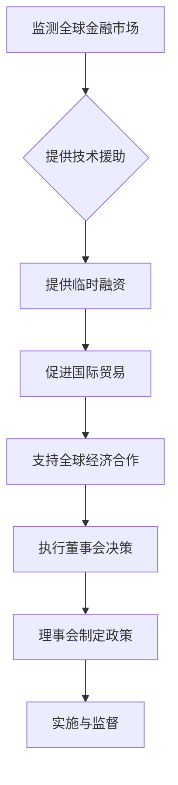
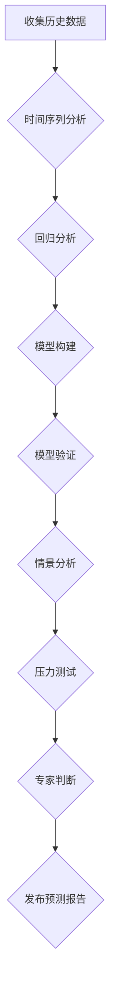
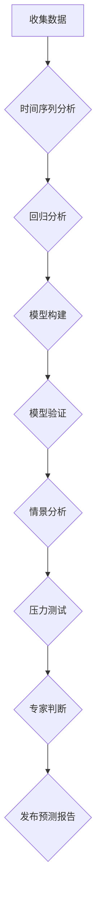

                 

### 《国际货币基金组织预测未来经济增长》

#### 关键词：国际货币基金组织、经济增长、预测模型、宏观经济政策、地区经济增长

> 摘要：本文旨在详细探讨国际货币基金组织（IMF）如何预测未来经济增长，包括其历史与功能、预测方法、全球及地区经济增长预测、行业经济增长预测、宏观经济政策与行业政策的影响，以及预测报告的解读与应用。本文将通过逻辑清晰、结构紧凑、简单易懂的专业技术语言，对IMF的经济增长预测进行全方位的剖析，为政策制定者、投资者和企业提供有价值的参考。

---

## 引言

国际货币基金组织（IMF）作为全球重要的国际经济机构，其工作之一便是预测未来经济增长。经济增长预测对于理解全球经济动态、制定宏观经济政策、规划行业发展战略具有重要意义。本文将从以下几个方面进行探讨：

1. **国际货币基金组织的历史与功能**：介绍IMF的成立背景、组织结构、决策过程和主要职能。
2. **国际货币基金组织的预测方法**：阐述经济增长预测的原理、IMF的经济预测模型以及经济预测中的不确定性应对策略。
3. **全球经济增长预测**：分析全球经济增长的历史、驱动因素和潜在风险。
4. **地区经济增长预测**：探讨北美、欧洲、亚太、拉丁美洲和非洲地区的经济增长预测。
5. **行业经济增长预测**：分析制造业、服务业、科技行业和能源行业的经济增长预测。
6. **经济增长预测与政策建议**：讨论经济增长预测对宏观经济政策、行业发展政策和国际合作政策的影响。
7. **国际货币基金组织报告的解读与应用**：解读IMF的预测报告，探讨其在实践中的应用。
8. **未来经济增长预测的新趋势**：分析新兴经济体的崛起、科技创新的推动、全球经济一体化的发展和未来经济增长预测的挑战与机遇。
9. **国际货币基金组织常用术语解释**：解释国际货币基金组织常用的一些术语。
10. **国际货币基金组织报告示例**：展示《世界经济展望》报告和《全球金融稳定报告》的结构和内容。

通过上述内容的逐一探讨，本文将帮助读者全面了解国际货币基金组织如何预测未来经济增长，以及这些预测对政策制定、市场分析和风险评估的重要影响。

---

## 第1章 国际货币基金组织的历史与功能

### 1.1 国际货币基金组织的成立背景与目的

国际货币基金组织（IMF）成立于1944年，其成立背景主要是为了避免二战期间货币竞争和贸易壁垒导致的全球经济衰退，并促进国际合作与稳定。在二战期间，各国的货币政策和贸易政策混乱，导致了国际贸易的严重受阻和全球经济的动荡。为了重建战后世界经济秩序，确保货币合作和金融稳定，44个国家的代表在美国新罕布什尔州的布雷顿森林会议上一致决定成立国际货币基金组织。

IMF的成立目的是：

1. **促进国际货币合作**：通过协调成员国的货币政策，确保国际金融体系的稳定。
2. **促进国际贸易平衡发展**：通过提供短期贷款，帮助成员国解决国际支付困难，促进国际贸易的顺利进行。
3. **支持成员国经济发展**：通过提供技术援助和资金支持，帮助成员国制定和实施宏观经济政策，促进经济增长和稳定。
4. **帮助成员国解决短期国际支付困难**：当成员国面临国际支付困难时，IMF提供临时贷款，帮助其渡过难关。

### 1.2 国际货币基金组织的组织结构与决策过程

IMF的组织结构包括理事会、执行董事会和总裁。理事会是IMF的最高权力机构，由各成员国派代表组成，负责制定IMF的总体政策和战略方向。执行董事会负责执行理事会的决策，处理日常事务，由24名执行董事组成，其中8名由最大成员国派驻，其余由其他成员国按区域分配。

IMF的决策过程包括以下几个步骤：

1. **政策制定**：由执行董事会根据理事会的指示制定具体的政策和计划。执行董事会根据各成员国在基金组织中的投票权进行决策。
2. **决策通过**：重要决策需要得到理事会的多数票通过。理事会成员的投票权与其在基金组织中的出资比例相关。
3. **实施与监督**：由IMF各职能部门负责执行政策，并定期向理事会报告执行情况。执行董事会负责监督政策的实施，并根据需要调整政策。

### 1.3 国际货币基金组织的主要职能

IMF的主要职能包括以下几个方面：

1. **监测全球金融市场**：IMF定期发布《世界经济展望》报告，评估全球经济的健康状况，并提供政策建议。通过监测国际金融市场，IMF帮助成员国预测和应对全球金融危机。
2. **提供技术援助**：IMF为成员国提供宏观经济政策制定、金融监管和财政政策等方面的技术援助。这些援助帮助成员国提高经济管理能力，实现可持续发展。
3. **提供临时融资**：当成员国面临国际支付困难时，IMF提供临时贷款，帮助其解决短期资金短缺问题。这种贷款通常用于应对自然灾害、经济危机等紧急情况。
4. **促进国际贸易**：IMF通过促进成员国间的货币合作和贸易自由化，推动全球经济增长。IMF鼓励成员国实施自由贸易政策，减少贸易壁垒，促进全球贸易平衡发展。
5. **支持全球经济合作**：IMF在推动全球经济合作方面发挥着重要作用。IMF通过组织国际会议、发布研究报告和提供政策建议，促进成员国之间的经济合作与交流。

### 1.4 国际货币基金组织的历史与发展

自1944年成立以来，IMF经历了多次重大变革和发展。以下是一些关键历史事件：

1. **成立与早期发展**：1944年，IMF在布雷顿森林会议上成立，标志着国际货币合作和金融稳定的新时代。在1947年，IMF成为联合国的一个专门机构。

2. **黄金与美元挂钩**：1944年，布雷顿森林体系的建立使得美元与黄金挂钩，成为国际储备货币，IMF在此体系中扮演了关键角色。

3. **1960年代的调整**：1960年代，随着全球经济增长和国际收支不平衡问题加剧，IMF进行了多次政策调整，包括引入特别提款权（SDR）和改进贷款机制。

4. **1980年代与1990年代**：1980年代，IMF推动了全球经济自由化和市场化改革，支持成员国进行经济结构调整和金融改革。1990年代，随着全球金融市场的自由化和全球化，IMF的角色进一步扩大，包括提供技术援助和推动国际金融合作。

5. **2008年全球金融危机**：2008年全球金融危机爆发后，IMF迅速行动，为成员国提供金融援助，帮助其应对危机。这一事件使IMF认识到全球经济金融稳定的重要性。

6. **2020年新冠疫情期间的行动**：2020年新冠疫情期间，IMF再次发挥重要作用，为成员国提供金融援助，支持经济复苏和抗疫措施。

### 国际货币基金组织的职能流程图

下面是IMF职能的Mermaid流程图：

通过这一章节，我们了解了国际货币基金组织的成立背景、组织结构、决策过程和主要职能。这些知识为我们后续探讨IMF的预测方法和应用奠定了基础。

---

## 第2章 国际货币基金组织的预测方法

### 2.1 经济增长预测的原理与方法

经济增长预测是国际货币基金组织（IMF）的一项核心工作，其原理和方法如下：

#### 历史数据分析

历史数据分析是经济增长预测的基础。通过对过去经济数据的分析，可以识别出经济增长的趋势、季节性和周期性特征。历史数据包括GDP增长率、通货膨胀率、失业率、利率、贸易收支、国际投资等。分析这些数据，可以帮助预测未来的经济增长。

常用的历史数据分析方法包括：

- **时间序列分析**：时间序列分析是通过分析经济变量随时间变化的规律来预测未来的经济走势。例如，可以通过ARIMA模型（自回归积分滑动平均模型）来分析时间序列数据。

- **回归分析**：回归分析是通过建立经济变量之间的关系模型来预测未来的经济变量。例如，可以建立GDP增长率与消费、投资、出口等变量的回归模型。

#### 模型构建

经济增长预测通常需要建立数学模型。这些模型可以是简单的回归模型，也可以是复杂的动态模型。模型构建的步骤如下：

1. **变量选择**：选择与经济增长相关的变量，如GDP增长率、通货膨胀率、失业率、利率、贸易收支、国际投资等。

2. **模型设定**：根据经济理论，设定经济变量之间的关系。例如，可以使用多部门模型、一般均衡模型或宏观经济调整模型。

3. **模型估计**：使用历史数据对模型进行估计，确定模型参数。例如，可以使用最小二乘法、最大似然估计等方法。

#### 模型验证

模型验证是确保模型预测准确性的重要步骤。模型验证的方法包括：

- **回溯测试**：在模型估计之前，使用部分历史数据进行模型训练，然后使用剩余的数据进行模型验证。

- **前向验证**：使用最近的历史数据进行模型验证，以评估模型的预测能力。

#### 情景分析

情景分析是一种用于评估不同经济情景下预测结果的方法。情景分析包括：

- **基准情景**：假设当前的经济趋势将持续，以此为基础进行预测。

- **乐观情景**：假设经济将出现更好的发展，例如，全球经济增长加速、通货膨胀率下降等。

- **悲观情景**：假设经济将面临更大的挑战，例如，全球经济增长放缓、通货膨胀率上升等。

#### 压力测试

压力测试是评估经济模型在极端条件下的表现。压力测试的方法包括：

- **单因素压力测试**：对单个经济变量进行极端假设，评估其对经济增长的影响。

- **多因素压力测试**：对多个经济变量进行极端假设，评估其对经济增长的综合影响。

#### 专家判断

专家判断是在模型预测结果的基础上，结合专家的经验和专业知识，对预测结果进行调整。专家判断可以帮助识别模型预测可能忽略的因素，例如，政策变化、突发事件等。

### IMF的经济预测模型

IMF使用多种经济预测模型来评估和预测全球及成员国的经济走势。以下是几个常用的模型：

1. **世界展望模型（WEO）**：这是一个综合性的预测模型，涵盖全球和主要经济体的经济增长、通货膨胀率、失业率、国际贸易和财政状况。WEO模型使用多种统计和计量经济方法，结合专家判断进行预测。

2. **全球金融稳定报告模型（GFSR）**：该模型主要分析全球金融市场的稳定性，预测金融市场的风险和波动性。GFSR模型考虑了银行系统、证券市场、保险市场等因素。

3. **宏观经济调整模型**：这是一个专门用于评估和预测新兴市场和发展中国家宏观经济调整过程的模型。该模型考虑了经济结构、政策调整和外部冲击等因素。

### 经济预测中的不确定性与应对策略

经济预测本质上是一个不确定性过程，因为经济系统的复杂性和不可预测性。为了应对这种不确定性，IMF采取了以下策略：

1. **情景分析**：通过构建不同的经济情景，分析可能的经济走势。情景分析包括基准情景、乐观情景和悲观情景等。

2. **压力测试**：对经济模型进行压力测试，评估经济系统在不同极端条件下的表现。例如，可以测试高利率、金融危机等极端情况。

3. **专家判断**：在模型预测结果的基础上，结合专家判断，对预测结果进行调整。专家判断可以帮助识别潜在的风险和机遇，以及模型预测可能忽略的因素。

4. **透明度**：IMF在发布预测报告时，通常会对预测的置信区间和不确定性进行说明，提高预测的透明度。

### 经济预测方法的Mermaid流程图

通过本章，我们了解了国际货币基金组织经济增长预测的基本原理和方法，以及如何应对预测中的不确定性。这些知识为我们后续分析IMF的预测应用和未来经济增长趋势提供了基础。

---

## 第3章 国际货币基金组织对全球经济增长的预测

国际货币基金组织（IMF）对全球经济增长的预测是其核心工作之一。这些预测不仅帮助成员国制定宏观经济政策，也为国际组织和私人部门提供了重要的参考依据。以下是对IMF全球经济增长预测的详细分析。

### 3.1 全球经济增长预测的指标与数据来源

IMF的全球经济增长预测主要依赖于以下几个关键指标和数据来源：

1. **国内生产总值（GDP）增长率**：GDP增长率是衡量经济增长的核心指标。IMF通过收集各成员国的GDP数据，结合全球贸易和资本流动情况，进行综合分析。

2. **通货膨胀率**：通货膨胀率反映了物价水平的变动情况，对经济增长有重要影响。IMF通过监测各成员国的通货膨胀数据，评估其对全球经济增长的潜在影响。

3. **失业率**：失业率是衡量劳动力市场状况的重要指标。IMF通过分析各成员国的劳动力市场数据，预测其对经济增长的影响。

4. **国际贸易**：国际贸易是全球经济增长的重要推动力。IMF通过分析全球贸易数据，预测贸易对经济增长的促进作用。

5. **国际投资**：国际投资，特别是外国直接投资（FDI），对经济增长具有重要影响。IMF通过监测全球投资流动，评估其对经济增长的贡献。

### 3.2 全球经济增长的主要驱动因素

全球经济增长的驱动因素多种多样，以下是一些主要因素：

1. **技术创新**：技术创新，如人工智能、大数据、5G等，推动了全球生产力的提升。这些技术不仅提高了生产效率，还改变了商业模式，推动了经济增长。

2. **全球化进程**：全球化进程加速了资本、劳动力和技术的流动，促进了全球经济增长。国际贸易和跨国投资的增长是全球化进程的重要表现。

3. **政策调整**：各国和地区的政策调整对经济增长具有重要影响。例如，货币政策的宽松和财政政策的积极调控，有助于促进经济增长。

4. **人口结构变化**：人口结构变化对经济增长具有重要影响。年轻人口比例较高的国家通常具有较高的经济增长潜力，而老龄化国家则需要面对经济增长的挑战。

5. **资源分配**：资源的合理分配对经济增长至关重要。资源丰富的国家通常具有更高的经济增长潜力，而资源稀缺的国家则需要通过技术进步和产业升级来提高经济增长率。

### 3.3 IMF对全球经济增长的预测

根据IMF的最新预测，全球经济增长将呈现出以下趋势：

1. **总体增长率**：IMF预计2023年全球经济增长率为4.4%，这一预测考虑了全球经济增长的驱动因素和潜在风险。

2. **区域增长差异**：不同地区的经济增长存在显著差异。预计亚太地区和中国将继续成为全球经济增长的主要动力，而北美和欧洲的增长相对较缓。

3. **主要经济体的增长预测**：

   - **美国**：IMF预计美国2023年的经济增长率为2.9%，主要受消费增长和出口增长的推动。
   - **欧元区**：预计欧元区2023年的经济增长率为2.3%，主要受消费增长和贸易增长的推动。
   - **中国**：预计中国2023年的经济增长率为5.5%，主要受内需增长和出口增长的推动。

4. **全球经济增长的主要风险**：

   - **通货膨胀压力**：全球经济增长可能导致通货膨胀压力上升，对经济稳定和消费者信心产生负面影响。
   - **地缘政治风险**：地缘政治风险，如战争、政治动荡和贸易摩擦等，可能对全球经济产生重大冲击。
   - **金融风险**：全球金融市场的波动和金融危机可能对全球经济产生严重负面影响。
   - **环境压力**：环境问题，如气候变化和资源枯竭等，可能对全球经济增长产生长期负面影响。

### 3.4 全球经济增长预测的模型与方法

IMF使用多种模型和方法进行全球经济增长预测，包括：

1. **世界展望模型（WEO）**：这是一个综合性的预测模型，涵盖全球和主要经济体的经济增长、通货膨胀率、失业率、国际贸易和财政状况。WEO模型使用多种统计和计量经济方法，结合专家判断进行预测。

2. **宏观动态模型**：通过模拟经济系统的动态行为，预测未来的经济走势。这种模型通常基于数学方程，如差分方程或微分方程。

3. **情景分析**：通过构建不同的经济情景，分析可能的经济走势。情景分析包括基准情景、乐观情景和悲观情景等。

4. **压力测试**：对经济模型进行压力测试，评估经济系统在不同极端条件下的表现。

5. **专家判断**：在模型预测结果的基础上，结合专家判断，对预测结果进行调整。

### 全球经济增长预测的Mermaid流程图

通过本章，我们了解了IMF对全球经济增长的预测方法和关键指标，以及主要驱动因素和潜在风险。这些预测为政策制定者、投资者和企业提供了重要的参考依据。

---

## 第4章 国际货币基金组织对地区经济增长的预测

国际货币基金组织（IMF）的地区经济增长预测是其分析全球经济增长趋势的重要组成部分。不同地区的经济特点、政策环境和发展水平决定了其经济增长的预测结果。以下是对IMF对各地区经济增长预测的详细分析。

### 4.1 北美地区经济增长预测

北美地区主要包括美国和加拿大，是全球经济的重要引擎之一。根据IMF的预测，北美地区的经济增长将受到以下因素的影响：

1. **美国经济增长预测**：

   - **总体增长率**：IMF预计美国2023年的经济增长率为2.5%。这一预测主要基于以下几个方面：
     - **消费增长**：消费是美国经济增长的主要驱动力，预计2023年消费增长率约为2.0%。
     - **投资增长**：企业投资增长预计将达到3.0%，主要受基础设施投资和技术投资的支持。
     - **出口增长**：随着全球经济的复苏，出口有望继续增长，预计2023年出口增长率为2.5%。

   - **潜在风险**：美国经济增长也面临一些挑战，如高债务水平、劳动力市场紧张和通货膨胀压力等。

2. **加拿大经济增长预测**：

   - **总体增长率**：IMF预计加拿大2023年的经济增长率约为2.0%。主要因素包括：
     - **贸易增长**：加拿大与美国的贸易关系对其经济增长具有重要影响。随着美国经济的复苏，加拿大出口有望增长。
     - **资源出口**：加拿大的资源出口，如石油和天然气，将继续对其经济增长产生积极影响。
     - **国内需求**：加拿大的国内需求预计将保持稳定增长，但受通货膨胀和利率上升的影响，消费和投资增速可能放缓。

### 4.2 欧洲地区经济增长预测

欧洲地区，特别是欧元区国家，是全球经济增长的重要一极。根据IMF的预测，欧洲地区2023年的经济增长率预计约为1.8%。

1. **欧元区经济增长预测**：

   - **总体增长率**：IMF预计欧元区2023年的经济增长率约为1.8%。主要因素包括：
     - **消费增长**：消费是欧元区经济增长的主要驱动力，预计2023年消费增长率约为1.5%。
     - **投资增长**：企业投资增长预计将达到2.0%，主要受基础设施投资和制造业投资的推动。
     - **出口增长**：随着全球经济的复苏，出口有望增长，预计2023年出口增长率为2.0%。

   - **潜在风险**：欧元区经济增长也面临一些挑战，如通货膨胀压力、劳动力市场紧张和地缘政治风险等。

2. **主要国家经济增长预测**：

   - **德国经济增长**：德国是欧元区的经济引擎，2023年预计经济增长率约为1.5%。主要因素包括消费增长、投资增长和出口增长。
   - **法国经济增长**：法国2023年预计经济增长率约为1.8%。主要因素包括消费增长、投资增长和出口增长。

### 4.3 亚太地区经济增长预测

亚太地区，尤其是中国和印度，是全球经济增长的重要引擎。根据IMF的预测，亚太地区2023年的经济增长率预计约为5.0%。

1. **中国经济增长预测**：

   - **总体增长率**：IMF预计中国2023年的经济增长率约为4.5%。这一预测主要基于以下几个方面：
     - **消费增长**：随着国内消费能力的提升，消费将继续成为中国经济增长的主要驱动力。
     - **投资增长**：中国将继续加大基础设施投资和科技创新投资，推动经济增长。
     - **出口增长**：随着全球经济复苏，中国出口有望继续增长。

   - **潜在风险**：中国经济增长也面临一些挑战，如房地产市场波动、债务风险和外部环境不确定性等。

2. **印度经济增长预测**：

   - **总体增长率**：IMF预计印度2023年的经济增长率将达到6.0%。主要因素包括：
     - **消费增长**：印度消费市场潜力巨大，随着中产阶级的崛起，消费将继续增长。
     - **投资增长**：印度政府将继续推进基础设施建设和产业升级，促进经济增长。
     - **出口增长**：印度出口有望继续增长，受益于全球经济的复苏。

### 4.4 拉丁美洲与非洲地区经济增长预测

拉丁美洲和非洲地区，由于其经济多样性和发展水平的差异，经济增长预测存在一定的不确定性。

1. **拉丁美洲经济增长预测**：

   - **总体增长率**：根据IMF的预测，拉丁美洲2023年的经济增长率预计约为1.5%。主要因素包括：
     - **消费增长**：拉丁美洲消费市场相对成熟，消费将继续作为经济增长的主要驱动力。
     - **投资增长**：随着地区经济的稳定，投资有望逐步增长。
     - **出口增长**：受全球经济增长的影响，拉丁美洲出口有望保持稳定增长。

   - **潜在风险**：拉丁美洲经济增长也面临一些挑战，如通货膨胀压力、劳动力市场紧张和地缘政治风险等。

2. **非洲地区经济增长预测**：

   - **总体增长率**：非洲地区经济增长预计将达到3.0%。主要因素包括：
     - **消费增长**：非洲消费市场潜力巨大，随着城市化进程的加速，消费将继续增长。
     - **投资增长**：非洲地区将继续受益于全球投资流入和基础设施投资。
     - **出口增长**：非洲地区出口有望继续增长，受益于矿产资源和农产品出口。

通过本章，我们对北美、欧洲、亚太、拉丁美洲和非洲地区的经济增长预测进行了分析。这些预测结果为政策制定者和企业提供了重要的参考依据，帮助他们制定相应的战略和计划。

---

## 第5章 国际货币基金组织对行业经济增长的预测

国际货币基金组织（IMF）对行业经济增长的预测是其分析全球经济发展趋势的重要组成部分。不同行业的经济增长受到多种因素的影响，包括技术创新、市场需求、政策环境等。以下是对IMF对主要行业经济增长预测的详细分析。

### 5.1 制造业行业经济增长预测

制造业是全球经济增长的重要驱动力之一。根据IMF的预测，制造业行业在全球范围内的经济增长有望保持稳定。

1. **全球制造业经济增长**：

   - **预测**：IMF预计，全球制造业2023年的增长率约为4.5%。
   - **驱动因素**：
     - **全球经济增长**：随着全球经济的复苏，制造业需求增加，推动了制造业的增长。
     - **技术创新**：智能制造、数字化和自动化技术的应用，提高了生产效率和产品质量。
     - **贸易自由化**：国际贸易的逐步恢复和贸易自由化，促进了全球制造业的贸易和合作。

   - **挑战**：制造业也面临一些挑战，如劳动力成本上升、环境法规趋严和地缘政治风险等。

2. **主要国家的制造业增长**：

   - **美国**：美国制造业预计2023年增长率为4.0%，主要受消费需求和技术创新的驱动。
   - **中国**：中国作为全球制造业的中心，预计2023年制造业增长率为5.0%，主要受国内消费需求和技术进步的驱动。
   - **德国**：德国制造业预计2023年增长率为2.5%，主要受国内需求和技术创新的驱动。

### 5.2 服务业行业经济增长预测

服务业是许多国家经济增长的重要动力，特别是在发达经济体中。根据IMF的预测，服务业行业在全球范围内的经济增长有望保持稳定。

1. **全球服务业经济增长**：

   - **预测**：IMF预计，全球服务业2023年的增长率约为6.0%。
   - **驱动因素**：
     - **全球经济增长**：随着全球经济的复苏，服务业需求增加，推动了服务业的增长。
     - **数字化和自动化**：数字化和自动化技术的应用，提高了服务业的生产效率和客户体验。
     - **消费升级**：消费升级和消费模式的转变，推动了服务业的多样化发展。

   - **挑战**：服务业也面临一些挑战，如劳动力成本上升、市场竞争加剧和地缘政治风险等。

2. **主要国家的服务业增长**：

   - **美国**：美国服务业预计2023年增长率为6.5%，主要受消费需求和技术创新的驱动。
   - **中国**：中国服务业预计2023年增长率为8.0%，主要受国内消费需求和技术进步的驱动。
   - **日本**：日本服务业预计2023年增长率为3.0%，主要受国内需求和技术创新的驱动。

### 5.3 科技行业经济增长预测

科技行业是全球经济增长的另一个重要驱动力。根据IMF的预测，科技行业在全球范围内的经济增长有望保持高速增长。

1. **全球科技行业经济增长**：

   - **预测**：IMF预计，全球科技行业2023年的增长率约为8.0%。
   - **驱动因素**：
     - **技术创新**：人工智能、5G、云计算等新兴技术的快速发展，推动了科技行业的增长。
     - **数字化转型**：越来越多的企业采用数字化技术，推动了科技行业的应用和发展。
     - **投资增长**：全球范围内，对科技行业的投资持续增加，推动了科技行业的快速发展。

   - **挑战**：科技行业也面临一些挑战，如知识产权保护、数据安全和隐私等问题。

2. **主要国家的科技行业增长**：

   - **美国**：美国科技行业预计2023年增长率为9.0%，主要受技术创新和投资增长的驱动。
   - **中国**：中国科技行业预计2023年增长率为10.0%，主要受技术创新和投资增长的驱动。
   - **欧盟**：欧盟科技行业预计2023年增长率为7.0%，主要受技术创新和投资增长的驱动。

### 5.4 能源行业经济增长预测

能源行业是全球经济增长的重要支撑，但在应对气候变化和能源转型的背景下，能源行业的增长面临新的挑战和机遇。

1. **全球能源行业经济增长**：

   - **预测**：IMF预计，全球能源行业2023年的增长率约为2.0%。
   - **驱动因素**：
     - **需求增长**：随着全球经济的复苏，能源需求继续增长，尤其是石油和天然气需求。
     - **能源转型**：全球能源转型加速，可再生能源的快速发展，如太阳能、风能等。

   - **挑战**：能源行业也面临一些挑战，如能源价格波动、气候变化政策和地缘政治风险等。

2. **主要国家的能源行业增长**：

   - **美国**：美国能源行业预计2023年增长率为3.0%，主要受石油和天然气需求的增长和能源转型的驱动。
   - **中国**：中国能源行业预计2023年增长率为2.5%，主要受煤炭、石油和天然气需求的增长和可再生能源的发展的驱动。
   - **欧盟**：欧盟能源行业预计2023年增长率为1.5%，主要受可再生能源的发展和能源转型的驱动。

通过本章，我们对制造业、服务业、科技行业和能源行业的经济增长预测进行了分析。这些预测结果为政策制定者和企业提供了重要的参考依据，帮助他们制定相应的战略和计划。

---

## 第6章 经济增长预测与政策建议

经济增长预测在制定宏观经济政策和行业发展策略中起着至关重要的作用。国际货币基金组织（IMF）通过其预测报告，为各国政府和国际组织提供了科学依据和实用建议。以下是对经济增长预测在宏观经济政策、行业发展政策和国际合作政策中的具体应用及其影响的分析。

### 6.1 经济增长预测与宏观经济政策

宏观经济政策包括财政政策、货币政策和收入政策等，其目标是实现经济稳定、促进增长、保持就业和平衡国际收支。经济增长预测为这些政策的制定提供了重要的参考。

1. **财政政策**

   - **政策制定**：经济增长预测帮助政府确定财政政策的方向和力度。例如，当预测显示经济将进入扩张阶段，政府可以采取扩张性财政政策，增加公共投资和减少税收，以刺激经济增长。相反，在经济过热或面临通货膨胀压力时，政府可以采取紧缩性财政政策，减少公共支出和增加税收，以抑制过热。

   - **实际案例**：在2020年新冠疫情期间，许多国家根据IMF的预测，采取了大规模的财政刺激措施，以支持经济复苏。

2. **货币政策**

   - **政策制定**：经济增长预测帮助中央银行确定货币政策的方向和力度。例如，在预测显示经济将放缓或面临通缩风险时，中央银行可以采取宽松的货币政策，降低利率和增加货币供应，以刺激经济活动。相反，在经济过热或面临通货膨胀压力时，中央银行可以采取紧缩的货币政策，提高利率和减少货币供应，以抑制过热。

   - **实际案例**：在2020年新冠疫情期间，许多国家的中央银行采取了极低利率和量化宽松政策，以支持经济复苏。

3. **收入政策**

   - **政策制定**：经济增长预测帮助政府制定收入分配政策，以减少收入不平等和促进社会稳定。例如，当预测显示经济将增长时，政府可以采取措施增加低收入群体的收入，如提高最低工资标准和提供社会福利。

   - **实际案例**：在新冠疫情期间，一些国家采取了临时措施，提高低收入群体的收入，以缓解疫情对社会的不利影响。

### 6.2 经济增长预测与行业发展政策

经济增长预测不仅对宏观经济政策的制定有重要影响，也对行业发展政策的制定提供了科学依据。

1. **产业政策**

   - **政策制定**：经济增长预测帮助政府确定优先发展的产业。例如，当预测显示某些产业具有巨大的发展潜力时，政府可以采取措施支持这些产业的发展，如提供财政补贴、税收优惠和技术支持。

   - **实际案例**：中国政府在“十四五”规划中，根据IMF的预测，加大对科技创新和绿色产业的投入。

2. **区域政策**

   - **政策制定**：经济增长预测帮助政府确定区域发展的重点。例如，当预测显示某些地区具有较大的经济增长潜力时，政府可以采取措施支持这些地区的经济发展，如提供基础设施投资、优惠政策和人才支持。

   - **实际案例**：印度政府根据IMF的预测，实施了一系列区域发展计划，以促进东北部的经济增长。

### 6.3 经济增长预测与国际合作政策

经济增长预测在促进国际合作政策中也发挥着重要作用。

1. **贸易政策**

   - **政策制定**：经济增长预测帮助政府确定贸易政策。例如，当预测显示全球经济将保持稳定增长时，政府可以推动自由贸易和减少贸易壁垒，以促进全球贸易繁荣。相反，在预测显示全球经济存在不确定性时，政府可以采取保护主义政策，以保护国内产业。

   - **实际案例**：在新冠疫情期间，一些国家采取了保护主义政策，以应对疫情带来的经济冲击。

2. **金融政策**

   - **政策制定**：经济增长预测帮助政府制定金融政策。例如，当预测显示全球经济将保持稳定增长时，政府可以推动金融市场的开放和合作，以促进全球金融市场的繁荣。相反，在预测显示全球经济存在不确定性时，政府可以采取金融监管措施，以维护金融市场的稳定。

   - **实际案例**：在2008年全球金融危机后，国际货币基金组织（IMF）与其他国际金融机构合作，共同制定和实施了一系列金融监管措施，以防止金融危机的再次发生。

### 6.4 经济增长预测的影响与应用

经济增长预测对政策制定者和市场参与者产生了深远的影响。

1. **政策制定者**：经济增长预测帮助政策制定者制定出更加科学和有效的宏观经济政策、行业发展政策和国际合作政策。

2. **市场参与者**：经济增长预测为投资者、企业和金融机构提供了重要的参考依据，帮助他们制定投资策略、业务计划和风险管理。

3. **学术研究**：经济增长预测为学术研究提供了丰富的数据来源和分析框架，推动了经济学领域的研究和发展。

通过本章，我们分析了经济增长预测在宏观经济政策、行业发展政策和国际合作政策中的具体应用及其影响。这些分析有助于我们更好地理解经济增长预测的重要性，并为政策制定者、市场参与者和学者提供有价值的参考。

---

## 第7章 国际货币基金组织报告的解读与分析

国际货币基金组织（IMF）发布的报告是理解全球经济动态和预测未来趋势的重要资源。以下是对IMF报告的结构、内容和解读方法的详细分析。

### 7.1 IMF报告的结构与内容

IMF的报告通常包括以下几个部分：

1. **摘要与概述**：摘要部分简要介绍报告的主要发现和结论，帮助读者快速了解报告的核心内容。
2. **全球经济展望**：这部分详细分析全球经济增长、通货膨胀、失业率、国际收支和财政状况等宏观经济指标。
3. **区域经济分析**：报告对各主要区域的经济状况进行详细分析，包括北美、欧洲、亚太、非洲等。
4. **行业分析**：报告对各主要行业（如制造业、服务业、科技行业等）的经济增长进行预测和分析。
5. **政策建议**：报告根据全球和区域经济分析，提出相应的政策建议，包括财政政策、货币政策和产业政策等。
6. **附录与数据表格**：附录部分包含详细的数据表格、模型假设、预测方法和技术说明等，供读者查阅。

### 7.2 IMF报告的解读方法

解读IMF报告需要系统地分析和综合判断。以下是一些关键步骤：

1. **阅读摘要与概述**：首先，仔细阅读摘要和概述部分，了解报告的主要发现和结论。
2. **分析宏观经济数据**：重点关注全球经济展望部分，分析全球经济增长、通货膨胀、失业率等宏观经济指标的数据和趋势。
3. **区域经济分析**：详细分析报告中的区域经济分析部分，了解各大区域的经济状况和增长预测。
4. **行业分析**：关注行业分析部分，了解各行业的发展趋势和潜在风险。
5. **政策建议**：评估报告中的政策建议，分析其可行性和有效性。
6. **查阅附录与数据表格**：查阅附录部分的数据表格和模型假设，以支持对报告内容的深入理解。

### 7.3 IMF报告的解读实例

以下是一个IMF报告的解读实例：

**实例**：《2023年世界经济展望报告》

1. **摘要与概述**：报告摘要指出，全球经济增长预计将在2023年达到4.4%，比2022年有所提升。通货膨胀压力依然存在，但预计将逐渐缓解。

2. **全球经济展望**：
   - **经济增长**：报告显示，全球经济增长的主要驱动因素包括消费和投资的增长，以及全球贸易的逐步恢复。
   - **通货膨胀**：报告指出，全球通货膨胀率预计将在2023年达到4.9%，随后逐步回落。

3. **区域经济分析**：
   - **北美地区**：美国预计2023年的经济增长率为2.9%，主要受消费和出口增长的推动。加拿大预计经济增长率为2.0%，受贸易增长的支持。
   - **欧洲地区**：欧元区预计2023年的经济增长率为2.3%，主要受消费增长的推动。德国和法国的经济增长预计分别为1.5%和1.8%。

4. **行业分析**：
   - **制造业**：报告预计，全球制造业增长率将在2023年达到4.5%，主要受技术创新和全球贸易增长的推动。
   - **服务业**：全球服务业预计将在2023年增长6.0%，主要受数字化和自动化技术的推动。

5. **政策建议**：
   - **财政政策**：报告建议，各国政府应继续实施扩张性财政政策，以支持经济复苏和减少不平等。
   - **货币政策**：报告建议，各国央行应继续实施宽松的货币政策，以支持经济增长，同时密切关注通货膨胀风险。

6. **附录与数据表格**：附录部分提供了详细的数据表格和模型假设，如GDP增长率、通货膨胀率、失业率等，以及各行业的具体增长预测。

通过实例解读，我们可以看到IMF报告提供了全面的经济分析和预测，为政策制定者和市场参与者提供了重要的参考。

### 7.4 IMF报告的影响与应用

IMF报告对政策制定者、投资者和企业产生了深远的影响，并在实际应用中发挥着重要作用：

1. **政策制定**：IMF报告为各国政府和国际组织提供了重要的经济数据和预测，帮助他们制定宏观经济政策和行业发展策略。
2. **企业战略**：企业可以通过分析IMF报告，了解全球经济和行业的发展趋势，制定相应的企业战略和业务计划。
3. **学术研究**：IMF报告为学术研究提供了丰富的数据来源和分析框架，推动了经济学领域的研究和发展。
4. **国际合作**：IMF报告促进了国际间的经济合作和协调，为全球治理提供了参考和指导。

通过本章，我们详细解读了IMF报告的结构、内容和解读方法，并分析了其在实际应用中的影响。这些知识有助于我们更好地理解和利用IMF报告，为经济发展提供科学依据。

---

## 第8章 国际货币基金组织预测在实践中的应用

国际货币基金组织（IMF）的预测不仅是一个理论框架，更是在实际经济生活中具有广泛应用的工具。以下我们将探讨IMF预测在决策制定、市场分析和风险评估中的应用。

### 8.1 国际货币基金组织预测在决策制定中的应用

国际货币基金组织的预测在政府制定经济政策中扮演了至关重要的角色。以下是具体的实例：

1. **财政政策**：

   - **实例**：在2020年新冠疫情期间，IMF的预测显示经济将面临严重的衰退。许多国家政府根据这一预测采取了大规模的财政刺激措施，包括增加基础设施投资和直接向公民发放补贴，以支持经济复苏。

2. **货币政策**：

   - **实例**：在2021年，IMF预测全球经济将逐渐复苏，但通货膨胀风险上升。许多国家的中央银行采取了收紧货币政策的措施，如提高利率和减少货币供应，以控制通货膨胀。

3. **产业政策**：

   - **实例**：IMF预测显示，科技行业和绿色经济具有巨大的增长潜力。许多国家政府据此制定了支持科技创新和可持续发展的政策，如提供税收优惠和补贴，以推动这些行业的发展。

### 8.2 国际货币基金组织预测在市场分析中的应用

投资者和企业可以利用IMF的预测来制定市场策略和投资决策。以下是具体的应用实例：

1. **投资策略**：

   - **实例**：一位基金经理可能会根据IMF对全球经济增长的预测，调整其投资组合。例如，当IMF预测全球经济将保持稳定增长时，基金经理可能会增加对新兴市场的投资，以抓住增长机会。

2. **行业分析**：

   - **实例**：一家制造企业可能会根据IMF对制造业的预测，调整其生产计划和投资决策。例如，当IMF预测制造业将迎来增长时，企业可能会增加产能和投资，以应对市场需求。

3. **风险评估**：

   - **实例**：在2020年新冠疫情期间，IMF的预测显示全球经济将面临巨大的不确定性。投资者据此调整了其投资策略，减少了对高风险资产的投资，同时增加了对避险资产的投资。

### 8.3 国际货币基金组织预测在风险评估中的应用

IMF的预测在识别和评估经济风险中发挥了关键作用。以下是具体的应用实例：

1. **宏观经济风险**：

   - **实例**：在2022年，IMF预测全球经济增长将放缓，同时通货膨胀压力上升。这促使许多国家政府和企业密切关注宏观经济风险，采取相应的措施，如收紧货币政策以控制通货膨胀。

2. **行业风险**：

   - **实例**：IMF预测显示，能源行业将面临供需失衡的风险。能源企业据此调整了其生产计划，增加了对可再生能源的投资，以降低行业风险。

3. **政策风险**：

   - **实例**：在2021年，IMF预测全球多个国家可能实施货币紧缩政策。投资者和企业据此调整了其财务策略，如减少债务和增加现金储备，以应对潜在的货币紧缩风险。

### 8.4 国际货币基金组织预测在实践中的挑战与机遇

尽管IMF的预测在实践中的应用广泛，但也面临着一些挑战和机遇：

1. **挑战**：

   - **数据准确性**：经济增长预测依赖于历史数据和统计模型，但数据的准确性和模型的适用性可能受到限制。
   - **不确定性**：经济系统的复杂性和不可预测性使得经济增长预测存在不确定性。

2. **机遇**：

   - **技术创新**：随着大数据和人工智能技术的发展，预测模型可以更加精确和实时，为政策制定和市场分析提供更好的支持。
   - **国际合作**：全球化背景下，国际货币基金组织的预测为全球政策协调提供了重要参考，促进了国际合作与共赢。

通过本章，我们探讨了国际货币基金组织预测在决策制定、市场分析和风险评估中的具体应用。这些应用实例展示了IMF预测在实践中的重要性，同时也指出了其在应用过程中面临的挑战和机遇。

---

## 第9章 未来经济增长预测的新趋势

未来经济增长预测的新趋势将受到多种因素的影响，包括新兴经济体的崛起、科技创新的推动、全球经济一体化的加速以及未来经济增长面临的挑战。以下是对这些趋势的详细分析。

### 9.1 新兴经济体的崛起

新兴经济体的崛起是未来经济增长的重要趋势之一。这些国家正逐渐在全球经济中扮演更加重要的角色。

1. **经济增长潜力**：

   - **印度**：印度是世界上人口最多的国家之一，具有庞大的消费市场。随着中产阶级的崛起和基础设施建设的推进，印度经济增长潜力巨大。
   - **中国**：中国是全球第二大经济体，具有强大的制造业基础和庞大的人口规模。中国政府推行的创新驱动发展战略和“一带一路”倡议，将进一步推动中国的经济增长。

2. **政策改革**：

   - **印度**：印度政府正在推进一系列改革措施，如简化税收制度、改善商业环境、推动数字化等，以促进经济增长。
   - **中国**：中国继续加大对科技创新的投入，推进产业升级和数字化转型，以实现经济的可持续发展。

3. **跨国公司投资**：

   - **印度**：许多跨国公司正在印度设立研发中心和生产设施，以抓住印度的市场机会。
   - **中国**：中国已成为全球外商直接投资（FDI）的主要目的地之一，吸引了大量的外资企业投资于中国的制造业、服务业和高科技产业。

### 9.2 科技创新的推动

科技创新是推动未来经济增长的关键因素。以下是一些重要的科技创新趋势：

1. **人工智能与大数据**：

   - **应用领域**：人工智能和大数据技术在金融、医疗、零售等多个领域得到了广泛应用。
   - **影响**：这些技术提高了生产效率和服务质量，推动了各行各业的数字化转型。

2. **5G与物联网**：

   - **应用领域**：5G技术的普及将推动智能制造、智能交通和智慧城市的发展。
   - **影响**：5G和物联网技术将促进数字经济的发展，提高各行各业的运营效率。

3. **绿色科技**：

   - **应用领域**：绿色科技，如太阳能、风能和电动汽车等，正在改变能源消费模式。
   - **影响**：绿色科技的发展将推动绿色经济增长，减少对化石燃料的依赖，促进可持续发展。

### 9.3 全球经济一体化的发展

全球经济一体化的发展将继续推动全球经济增长。以下是一些重要趋势：

1. **贸易自由化**：

   - **趋势**：全球贸易自由化进程将继续推进，更多的国家将加入区域贸易协定和自由贸易区。
   - **影响**：贸易自由化将促进全球商品和服务的流动，推动全球经济增长。

2. **跨国投资**：

   - **趋势**：跨国投资将继续增加，企业将通过全球布局实现资源优化配置和成本效益最大化。
   - **影响**：跨国投资将推动全球资本流动，促进技术和管理经验的转移。

3. **数字全球化**：

   - **趋势**：数字经济的快速发展将推动全球经济的数字化和在线化。
   - **影响**：数字全球化将促进全球经济的融合，提高企业的全球运营效率。

### 9.4 未来经济增长预测的挑战与机遇

未来经济增长预测将面临诸多挑战和机遇。

1. **挑战**：

   - **经济不确定性**：全球政治、经济和地缘政治的不确定性增加了经济增长预测的难度。
   - **气候变化**：气候变化可能导致极端天气事件频发，对经济产生负面影响。
   - **人口老龄化**：人口老龄化可能影响经济增长，增加社会养老负担。

2. **机遇**：

   - **数字化转型**：数字化转型提供了新的经济增长点，推动了数字经济的快速发展。
   - **绿色经济**：绿色经济的兴起为经济增长提供了新的机遇，促进了可持续发展。
   - **科技创新**：科技创新不断推动技术进步，为经济增长提供了新的动力。

通过本章，我们分析了未来经济增长预测的新趋势，包括新兴经济体的崛起、科技创新的推动、全球经济一体化的发展以及未来经济增长预测面临的挑战与机遇。这些趋势和挑战为我们理解和预测未来经济增长提供了重要的参考。

---

## 附录A：国际货币基金组织常用术语解释

为了更好地理解国际货币基金组织（IMF）的预测报告和相关经济概念，以下是对一些常用术语的详细解释。

### 1. 国际货币基金组织（IMF）

**定义**：国际货币基金组织（IMF）是一个国际组织，旨在促进全球货币合作、稳定国际金融系统、实现可持续经济增长和减少贫困。

**作用**：IMF提供短期贷款、技术援助、政策建议，并发布经济预测报告，如《世界经济展望》和《全球金融稳定报告》。

### 2. 经济增长

**定义**：经济增长是指一个国家或地区在一定时期内生产的物质和服务总量的增加。

**衡量指标**：常用的衡量经济增长的指标包括国内生产总值（GDP）增长率和人均GDP增长率。

### 3. 财政政策

**定义**：财政政策是指政府通过调整政府支出和税收来影响经济活动的总需求。

**工具**：

- **政府支出**：包括公共投资、社会福利和公共服务等。
- **税收**：通过调整税率、税收结构和税基来影响经济活动。

### 4. 货币政策

**定义**：货币政策是指中央银行通过调节货币供应量和利率来影响经济活动。

**工具**：

- **利率政策**：调整基准利率来影响市场利率。
- **公开市场操作**：通过买卖政府债券来调节市场上的流动性。
- **外汇管理政策**：调控汇率和外汇市场。

### 5. 国际收支

**定义**：国际收支是指一个国家在一定时期内与其他国家之间的经济交易记录。

**衡量指标**：国际收支平衡表包括经常账户和资本账户。

- **经常账户**：包括贸易收支、服务收支、收入收支和转移收支。
- **资本账户**：包括直接投资、证券投资、其他投资和储备资产变动。

### 6. 通货膨胀

**定义**：通货膨胀是指一般物价水平持续上涨的现象。

**衡量指标**：常用的衡量通货膨胀的指标包括消费者价格指数（CPI）和生产者价格指数（PPI）。

### 7. 失业率

**定义**：失业率是指失业人口占总劳动力的比例。

**衡量指标**：失业率反映了劳动力市场的状况和经济

