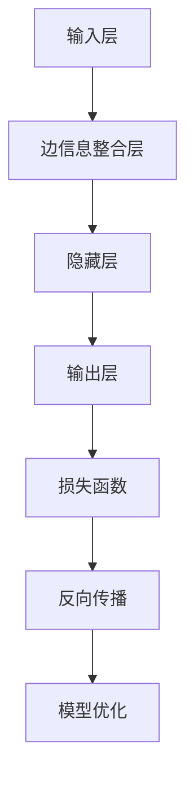
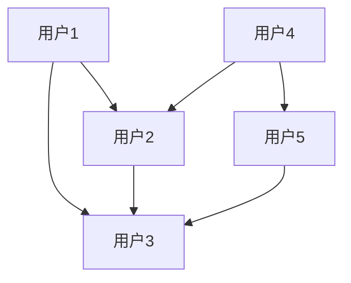

                 

# 《图神经网络在社交影响力分析、社群发现等领域的应用拓展》

> **关键词**：图神经网络，社交影响力分析，社群发现，图嵌入，应用拓展

> **摘要**：本文首先介绍了图神经网络（GNN）的基础知识，包括概念、架构、核心原理和应用类型。接着，探讨了图表示学习，尤其是图嵌入的原理、算法和性能评估方法。随后，详细分析了图神经网络在社交影响力分析和社群发现领域的应用，包括定义、关键问题、挑战和案例研究。最后，介绍了图神经网络在其他领域的应用，如推荐系统、网络攻击检测和生物信息学，并展望了未来的发展趋势和方向。

----------------------------------------------------------------

### 第1章：图神经网络基础

#### 1.1 图神经网络的概念与重要性

**图神经网络（Graph Neural Network，GNN）** 是一种特殊的神经网络，专门用于处理图结构数据。图数据在现实世界中有着广泛的应用，如社交网络、生物网络、知识图谱等。GNN通过对图中的节点和边进行学习，能够提取出图结构中的语义信息，并应用于各种任务，如节点分类、链接预测、图分类等。

**图神经网络的重要性**：

1. **处理图结构数据**：GNN能够直接处理图结构数据，无需进行复杂的预处理操作，这使得它在处理大规模图数据时具有很高的效率。
2. **提取图结构特征**：GNN能够从图中提取出丰富的特征信息，如节点属性、边权重、邻接矩阵等，这些特征对于后续的任务分析至关重要。
3. **多模态数据处理**：GNN不仅可以处理单一的图数据，还可以与其他类型的数据（如文本、图像）进行融合，从而实现多模态数据的处理和分析。

#### 1.2 图神经网络的基本架构

图神经网络的基本架构通常包括以下几个部分：

1. **输入层**：接收图节点的特征信息。
2. **边信息整合层**：整合节点间的关系信息。
3. **隐藏层**：通过传递节点和边的信息，实现节点的特征更新。
4. **输出层**：根据训练目标生成预测结果。


#### 1.3 图神经网络的核心原理

**节点嵌入**：图神经网络首先将图中的节点映射到低维空间，这一过程被称为节点嵌入。节点嵌入使得节点在低维空间中保持了一定的图结构信息，便于计算和处理。

**消息传递**：在图神经网络中，节点之间通过边进行信息传递。每个节点会接收到其邻居节点的信息，并根据这些信息更新自身的状态。

**更新节点状态**：节点根据收到的消息更新其状态，这个过程通常通过一个非线性激活函数实现。更新后的状态信息将传递给下一层的节点，从而实现整个图的特征更新。

#### 1.4 图神经网络的主要类型

**图卷积网络（Graph Convolutional Network，GCN）**：GCN是图神经网络的一种常见类型，它通过卷积操作对节点进行特征更新。

**图注意力网络（Graph Attention Network，GAT）**：GAT通过引入注意力机制，动态调整节点间的权重，从而提高模型的性能。

**图自编码器（Graph Autoencoder，GAE）**：GAE利用自编码器框架进行图嵌入，通过编码器和解码器提取和重建图特征。

#### 1.5 图神经网络的数学模型

图神经网络的数学模型主要包括以下几个部分：

**节点嵌入**：设节点 \(i\) 的特征为 \(x_i \in \mathbb{R}^d\)，节点 \(i\) 的嵌入向量表示为 \(h_i^0 = x_i\)。

**消息传递**：节点 \(i\) 收到的来自节点 \(j\) 的消息表示为 \(\text{msg}_i = \sum_{j \in \text{adj}(i)} w_{ij} h_j\)，其中 \(w_{ij}\) 是边 \(i-j\) 的权重，\(\text{adj}(i)\) 是节点 \(i\) 的邻居节点集合。

**更新节点状态**：节点 \(i\) 的状态更新为 \(h_i^{l+1} = \sigma(W^l h_i^l + \text{msg}_i + b^l)\)，其中 \(W^l\) 是隐藏层权重，\(b^l\) 是偏置项，\(\sigma\) 是激活函数。

**激活函数**：常用的激活函数有ReLU、Sigmoid和Tanh。本文中使用ReLU激活函数。

#### 1.6 图神经网络的学习算法

图神经网络的学习算法主要包括以下几种：

**端到端训练**：通过反向传播算法优化模型参数，使模型能够预测标签。

**图嵌入训练**：通过优化节点嵌入向量，提高图嵌入质量。

**图分类与回归任务**：利用训练好的模型进行预测，如节点分类、链接预测、图分类等。

---

**Mermaid 流程图示例**：



---

通过本章的介绍，我们对图神经网络的基本概念、架构、原理和应用类型有了初步的了解。接下来，我们将进一步探讨图表示学习，尤其是图嵌入算法。

----------------------------------------------------------------

### 第2章：图表示学习

#### 2.1 图嵌入的基本原理

**图嵌入（Graph Embedding）** 是图表示学习的一个核心任务，它旨在将图中的节点映射到低维空间，从而便于计算和处理。图嵌入的目的是保留节点在原图中的结构信息和特征信息，同时降低数据的维度。

**图嵌入的基本原理**：

1. **节点表示**：将图中的节点映射到低维空间，每个节点对应一个低维向量。
2. **向量空间模型**：在低维向量空间中，节点的相似性可以通过向量之间的距离来衡量。
3. **图结构信息保留**：通过保留节点之间的邻接关系和图结构，使得图嵌入能够在某些任务中保持较高的性能。

#### 2.2 图嵌入的算法与应用

**DeepWalk**：DeepWalk是一种基于随机游走（Random Walk）的图嵌入算法。它通过在图中进行随机游走，生成节点的序列，然后利用这些序列进行词嵌入（Word2Vec）。

**Node2Vec**：Node2Vec是一种结合随机游走和邻域采样的图嵌入算法。它通过调节游走的深度和广度，控制生成的节点序列的多样性，从而获得更好的嵌入效果。

**GloVe**：GloVe（Global Vectors for Word Representation）是一种通用的词向量模型，它结合全局和局部信息生成词向量。GloVe可以用于图嵌入，通过将节点看作“词”，生成节点的嵌入向量。

#### 2.3 图嵌入的性能评估方法

**节点分类**：通过评估图嵌入在节点分类任务上的性能，来衡量图嵌入的质量。常用的评估指标包括准确率（Accuracy）、精确率（Precision）、召回率（Recall）和F1分数（F1 Score）。

**链接预测**：链接预测是图嵌入的重要应用之一，通过预测图中未出现的边，来评估图嵌入的效果。常用的评估指标包括准确率（Accuracy）和F1分数（F1 Score）。

**聚类评估**：通过评估图嵌入在聚类任务上的性能，来衡量图嵌入的聚类能力。常用的评估指标包括轮廓系数（Silhouette Coefficient）和类内平均值（Within-Cluster Sum of Squares）。

#### 2.4 图嵌入在实际应用中的挑战

**稀疏性和维度灾难**：图数据通常具有稀疏性，如何在低维空间中保留关键信息是一个挑战。此外，维度灾难（Dimensionality Curse）也是图嵌入需要面对的问题，高维向量可能导致计算复杂度和存储需求的增加。

**训练数据不足**：在大型图上训练模型时，如何有效利用有限的训练数据是一个问题。数据不足可能导致模型过拟合，从而影响其在实际应用中的性能。

**泛化能力**：如何保证图嵌入在不同图结构上的泛化能力，是一个重要的挑战。泛化能力较差可能导致模型在新数据上的性能下降。

---

**核心算法原理讲解（伪代码）**：

```python
# DeepWalk算法伪代码

# 初始化节点嵌入向量
embeddings = initialize_embeddings(num_nodes, embedding_dim)

# 进行随机游走
for node in graph.nodes():
    walk = random_walk(node, walk_length)
    # 计算节点序列的词嵌入
    sequence_embeddings = word2vec(walk)
    # 更新节点嵌入向量
    embeddings[node] = update_embeddings(embeddings[node], sequence_embeddings)

# Node2Vec算法伪代码

# 初始化节点嵌入向量
embeddings = initialize_embeddings(num_nodes, embedding_dim)

# 进行随机游走
for node in graph.nodes():
    walk = random_walk(node, walk_length, p, q)
    # 计算节点序列的词嵌入
    sequence_embeddings = word2vec(walk)
    # 更新节点嵌入向量
    embeddings[node] = update_embeddings(embeddings[node], sequence_embeddings)

# GloVe算法伪代码

# 初始化节点嵌入向量
embeddings = initialize_embeddings(num_nodes, embedding_dim)

# 计算全局和局部矩阵
global_matrix = calculate_global_matrix(graph)
local_matrix = calculate_local_matrix(graph)

# 计算词嵌入
embeddings = glove(embeddings, global_matrix, local_matrix)

```

---

通过本章的介绍，我们对图嵌入的基本原理、算法和应用有了更深入的了解。接下来，我们将探讨图神经网络在社交影响力分析领域的应用。

----------------------------------------------------------------

### 第3章：社交影响力分析

#### 3.1 社交影响力的定义与测量

**社交影响力** 是指个体在社交网络中的影响力，通常与个体拥有的关注者数量、转发次数、评论数量等因素相关。社交影响力不仅反映了个体在社交网络中的活跃度，还体现了其在网络中的中心性和影响力。

**测量方法**：

1. **节点嵌入**：通过图嵌入算法，将社交网络中的用户映射到低维空间，利用向量之间的距离来衡量用户的影响力。
2. **影响力算法**：设计特定的算法，如PageRank、HITS等，来评估用户在社交网络中的影响力。

#### 3.2 图神经网络在社交影响力分析中的应用

**影响力预测**：利用图神经网络，可以预测用户在社交网络中的潜在影响力。通过学习用户及其关注者的特征，模型能够识别出具有高影响力的用户，并预测其未来的影响力。

**影响力传播**：分析影响力在网络中的传播路径和效果。利用图神经网络，可以捕捉影响力在不同用户之间的传递过程，为社交网络营销和传播策略提供依据。

#### 3.3 社交影响力分析的关键问题与挑战

**数据质量**：社交网络数据通常存在噪声和不一致性，如何处理这些数据是一个关键问题。例如，虚假账号、恶意评论等都会影响影响力测量的准确性。

**计算效率**：在大规模社交网络中，如何高效地计算影响力是一个挑战。传统的计算方法可能无法处理海量数据，需要设计高效的算法和优化策略。

**隐私保护**：在分析社交影响力时，如何保护用户的隐私是一个重要问题。隐私保护措施不仅需要遵循法律法规，还需要设计有效的隐私保护算法。

#### 3.4 社交影响力分析的案例研究

**案例背景**：以某个社交媒体平台为例，分析用户在平台上的影响力。

**数据来源**：收集用户数据、关注关系、帖子内容、转发次数、评论数量等。

**分析方法**：

1. **节点嵌入**：利用图嵌入算法，将用户映射到低维空间。
2. **影响力算法**：设计影响力算法，如PageRank，评估用户的影响力。
3. **影响力传播分析**：利用图神经网络，分析影响力在不同用户之间的传递路径。

**结果评估**：通过比较预测影响力与实际影响力，评估算法的准确性。同时，通过分析影响力传播路径，评估算法在识别影响力传播效果方面的性能。

---

**数学模型与公式**：

假设用户 \(i\) 的嵌入向量为 \(h_i\)，用户 \(i\) 的影响力为 \(f_i\)。影响力计算公式可以表示为：

\[ f_i = \frac{1}{|N_i|} \sum_{j \in N_i} \text{similarity}(h_i, h_j) \]

其中，\(N_i\) 是用户 \(i\) 的邻居集合，\(\text{similarity}(h_i, h_j)\) 是用户 \(i\) 和用户 \(j\) 的嵌入向量之间的相似性度量。

---

**举例说明**：

假设有两个用户 A 和 B，其嵌入向量分别为 \(h_A\) 和 \(h_B\)。用户 A 有10个邻居，邻居的嵌入向量分别为 \(h_{A1}, h_{A2}, ..., h_{A10}\)。用户 A 的影响力计算如下：

\[ f_A = \frac{1}{10} \sum_{j=1}^{10} \text{similarity}(h_A, h_{Aj}) \]

例如，如果使用余弦相似性作为相似性度量，那么有：

\[ f_A = \frac{1}{10} \sum_{j=1}^{10} \frac{h_A \cdot h_{Aj}}{||h_A|| \cdot ||h_{Aj}||} \]

---

通过本章的介绍，我们对社交影响力分析有了更深入的了解，包括定义、测量方法、关键问题和案例研究。接下来，我们将探讨图神经网络在社群发现领域的应用。

----------------------------------------------------------------

### 第4章：社群发现

#### 4.1 社群发现的定义与分类

**社群发现（Community Detection）** 是指从大规模社交网络中识别出具有相似兴趣和关系的用户群体。社群发现的目标是理解网络中的结构特征，揭示用户的聚集模式和互动模式。

**社群发现的分类**：

1. **基于图论的社群发现**：利用图论算法，如社区检测算法（如Girvan-Newman算法、Louvain算法），识别具有紧密联系的节点集合。
2. **基于机器学习的社群发现**：利用机器学习算法，如聚类算法（如K-Means、DBSCAN）、分类算法（如SVM、决策树），通过特征提取和模型训练，识别社群。
3. **基于图神经网络的社群发现**：利用图神经网络，分析用户及其关系的图结构，提取图特征，从而识别社群。

#### 4.2 图神经网络在社群发现中的应用

**社群识别**：利用图神经网络，可以自动识别社交网络中的社群。通过学习用户及其关系的特征，模型能够捕捉到用户的社交模式，从而识别出具有相似兴趣和关系的用户群体。

**社群演化**：分析社群成员的变化和社群结构的演化。利用图神经网络，可以追踪社群的动态变化，识别社群成员的加入和离开，以及社群的分裂和合并。

#### 4.3 社群发现的方法与算法

**基于图论的社群发现**：

- **Girvan-Newman算法**：通过逐步剪断网络中的边，识别出网络的社区结构。
- **Louvain算法**：利用模块度最大化原则，识别出网络的社区结构。

**基于机器学习的社群发现**：

- **K-Means聚类算法**：通过迭代计算，将节点划分到不同的社群中。
- **DBSCAN算法**：基于邻域和密度，识别出密集的社群。

**基于图神经网络的社群发现**：

- **图嵌入**：利用图嵌入算法，将节点映射到低维空间，然后通过聚类算法（如K-Means）识别社群。
- **图注意力网络（GAT）**：通过注意力机制，动态调整节点间的权重，从而识别社群。
- **图自编码器（GAE）**：利用自编码器框架，提取图特征，用于社群识别。

#### 4.4 社群发现的性能评估与挑战

**评估指标**：

- **社群密度**：衡量社群内部的联系紧密程度。
- **社群结构稳定性**：衡量社群结构随时间变化的稳定性。

**挑战**：

- **噪声数据**：社交网络中存在噪声数据，如虚假账号、恶意评论等，如何有效处理噪声数据是一个挑战。
- **计算效率**：在大规模社交网络中，如何高效地计算社群结构是一个挑战。
- **社群多样性**：如何识别出具有多样性的社群，而不是仅仅识别出紧密联系的社群。

---

**数学模型与公式**：

假设图 \(G = (V, E)\)，其中 \(V\) 是节点集合，\(E\) 是边集合。社群发现可以通过以下公式实现：

\[ \text{Community Detection} = \arg\max_{C} \sum_{i \in C} \sum_{j \in C} \text{similarity}(v_i, v_j) - \sum_{i \in C} \sum_{j \in V \setminus C} \text{similarity}(v_i, v_j) \]

其中，\(C\) 是社群集合，\(\text{similarity}(v_i, v_j)\) 是节点 \(i\) 和节点 \(j\) 的相似性度量。

---

**举例说明**：

假设有两个社群 \(C_1\) 和 \(C_2\)，其中节点 \(v_1, v_2, ..., v_n\) 属于 \(C_1\)，节点 \(v_{n+1}, v_{n+2}, ..., v_m\) 属于 \(C_2\)。社群发现的目标是最大化以下目标函数：

\[ \text{Community Detection} = \arg\max_{C} \sum_{i=1}^{n} \sum_{j=1}^{n} \text{similarity}(v_i, v_j) - \sum_{i=1}^{n} \sum_{j=n+1}^{m} \text{similarity}(v_i, v_j) \]

例如，如果使用余弦相似性作为相似性度量，那么有：

\[ \text{Community Detection} = \arg\max_{C} \sum_{i=1}^{n} \sum_{j=1}^{n} \frac{v_i \cdot v_j}{||v_i|| \cdot ||v_j||} - \sum_{i=1}^{n} \sum_{j=n+1}^{m} \frac{v_i \cdot v_j}{||v_i|| \cdot ||v_j||} \]

---

通过本章的介绍，我们对社群发现有了更深入的了解，包括定义、分类、应用方法、性能评估和挑战。接下来，我们将探讨图神经网络在其他领域的应用。

----------------------------------------------------------------

### 第5章：图神经网络的其他应用

#### 5.1 图神经网络在推荐系统中的应用

图神经网络（GNN）在推荐系统中的应用逐渐受到关注。推荐系统的主要目标是预测用户可能对哪些物品感兴趣，从而为用户提供个性化的推荐。GNN的优势在于其能够直接处理图结构数据，这在推荐系统中尤为重要，因为用户之间的社交关系和物品之间的关联关系通常可以用图结构来表示。

**协同过滤**：传统的协同过滤方法通常基于用户的历史行为数据，如评分、购买记录等。GNN可以结合用户社交关系和物品属性，通过图嵌入技术提取用户和物品的特征，从而改进协同过滤算法的性能。例如，可以利用图卷积网络（GCN）对用户和物品的图结构数据进行特征提取，并将其应用于矩阵分解模型中。

**社交推荐**：社交推荐是一种基于用户社交关系的推荐方法。GNN可以通过学习用户社交网络中的关系图，提取出用户及其朋友对物品的偏好信息，从而为用户提供个性化的推荐。例如，可以使用图注意力网络（GAT）来动态调整用户与其朋友之间的权重，从而提高推荐系统的准确性。

**案例研究**：例如，Netflix推荐系统可以利用GNN分析用户之间的社交关系和物品的相似性，从而为用户提供更加个性化的电影推荐。

#### 5.2 图神经网络在网络攻击检测中的应用

随着互联网的普及，网络攻击事件频繁发生，对网络系统的安全构成了严重威胁。图神经网络在网络安全领域具有广泛的应用前景。

**异常检测**：利用图神经网络分析网络流量数据，可以识别出异常行为。例如，通过构建网络节点的图结构，可以使用GCN来检测网络中的恶意节点和异常流量。图神经网络可以捕捉到节点之间的异常关系，从而提高异常检测的准确性。

**攻击路径预测**：网络攻击通常需要经过一系列的步骤才能达到目标。利用图神经网络，可以预测可能的攻击路径，从而提前采取防御措施。例如，可以使用图自编码器（GAE）来学习网络节点的嵌入向量，并根据嵌入向量预测可能的攻击路径。

**案例研究**：例如，在金融领域的网络攻击检测中，可以利用GNN分析交易数据，识别异常交易行为，从而防止欺诈行为的发生。

#### 5.3 图神经网络在生物信息学中的应用

生物信息学是生物学和数据科学交叉的领域，利用图神经网络可以更好地理解和分析生物数据。

**蛋白质相互作用网络分析**：蛋白质相互作用网络是生物体内蛋白质之间的相互作用关系的表示。利用图神经网络，可以分析蛋白质之间的相互作用关系，从而预测蛋白质的功能。例如，通过构建蛋白质之间的图结构，可以使用GCN来分析蛋白质相互作用网络，预测蛋白质的功能和结构。

**基因调控网络分析**：基因调控网络是基因之间的调控关系的表示。利用图神经网络，可以分析基因调控网络，预测基因表达模式。例如，通过构建基因之间的图结构，可以使用GAT来分析基因调控网络，预测基因的表达模式和调控机制。

**案例研究**：例如，在癌症研究中，可以利用GNN分析肿瘤细胞中的基因调控网络，识别关键基因和潜在的癌症驱动因素。

#### 5.4 图神经网络在其他领域的前景与挑战

除了上述领域，图神经网络在其他领域也具有广泛的应用前景。

**科学图谱**：在科学研究中，可以使用图神经网络构建科学图谱，分析科学领域的知识结构和交叉关系。例如，通过构建论文之间的引用关系图，可以使用GNN分析科学领域的研究热点和发展趋势。

**交通网络优化**：在交通管理领域，可以利用图神经网络优化交通网络，提高交通效率。例如，通过构建交通网络图，可以使用GNN预测交通流量和拥堵情况，从而优化交通信号控制和路线规划。

**挑战**：

1. **数据质量和隐私保护**：在应用图神经网络时，需要处理大量复杂的生物、社交和交通数据。数据质量和隐私保护是重要的挑战。
2. **计算效率和可扩展性**：图神经网络在处理大规模数据时，需要高效的计算算法和可扩展的架构。
3. **模型解释性**：图神经网络的黑箱特性可能导致模型解释性不足，这对于应用领域来说是一个重要的挑战。

通过本章的介绍，我们对图神经网络在推荐系统、网络攻击检测、生物信息学等领域的应用有了更深入的了解。接下来，我们将探讨图神经网络在实际项目中的应用与案例分析。

----------------------------------------------------------------

### 第6章：实践应用与案例分析

#### 6.1 案例背景与目标

**案例背景**：某社交媒体平台希望利用图神经网络（GNN）分析用户在社交网络中的影响力，从而优化社交推荐算法，提升用户活跃度和平台黏性。

**案例目标**：

1. **影响力预测**：利用GNN预测用户在社交网络中的潜在影响力。
2. **社群识别**：通过GNN识别用户在社交网络中的社群，为个性化推荐提供依据。
3. **结果评估**：评估GNN模型在影响力预测和社群识别任务中的性能。

#### 6.2 数据预处理与图构建

**数据收集**：收集用户数据，包括用户ID、用户特征（如年龄、性别、兴趣标签）、用户之间的关注关系等。

**数据清洗**：处理数据中的噪声和异常值，如虚假账号、重复数据等。

**图构建**：构建用户节点的图结构，添加边信息。用户作为节点，关注关系作为边。每个节点附加用户特征向量，边附加关注强度或时间戳等属性。



#### 6.3 模型选择与参数调优

**模型选择**：选择适合的GNN模型，如图卷积网络（GCN）或图注意力网络（GAT）。根据任务需求，可能需要设计多层次的GNN模型。

**参数调优**：通过交叉验证和网格搜索方法，调整模型的超参数，如学习率、隐藏层维度、dropout比例等，以优化模型性能。

```python
# 示例：使用PyTorch框架进行GCN模型参数调优
import torch
import torch.optim as optim

# 定义模型
model = GCNModel(input_dim, hidden_dim, output_dim)

# 损失函数和优化器
criterion = torch.nn.CrossEntropyLoss()
optimizer = optim.Adam(model.parameters(), lr=0.01)

# 训练过程
for epoch in range(num_epochs):
    optimizer.zero_grad()
    outputs = model(graph)
    loss = criterion(outputs, labels)
    loss.backward()
    optimizer.step()
    print(f"Epoch {epoch+1}, Loss: {loss.item()}")
```

#### 6.4 实验设计与结果分析

**实验设计**：设置不同的实验组和对照组，比较GNN与其他方法（如基于传统机器学习的方法）的性能。实验设计包括数据划分、模型训练和评估等步骤。

**结果分析**：分析实验结果，评估GNN在影响力预测和社群识别任务中的性能。使用准确率、召回率、F1分数等指标进行评估。

```python
# 示例：评估GNN模型性能
from sklearn.metrics import accuracy_score, recall_score, f1_score

# 预测结果
predictions = model.predict(test_data)

# 计算指标
accuracy = accuracy_score(test_labels, predictions)
recall = recall_score(test_labels, predictions, average='weighted')
f1 = f1_score(test_labels, predictions, average='weighted')

print(f"Accuracy: {accuracy:.4f}")
print(f"Recall: {recall:.4f}")
print(f"F1 Score: {f1:.4f}")
```

#### 6.5 结果讨论与改进方向

**结果讨论**：讨论实验结果，分析GNN在影响力预测和社群识别中的优势与不足。例如，GNN在处理大规模社交网络数据时可能存在计算复杂度较高的问题，但在捕获用户社交关系和社群结构方面具有明显优势。

**改进方向**：

1. **模型优化**：通过改进GNN模型结构，如使用图注意力网络（GAT）或图自编码器（GAE），提高模型性能。
2. **数据增强**：通过数据增强技术，如节点嵌入、边特征添加等，提高模型对噪声数据的鲁棒性。
3. **隐私保护**：设计隐私保护算法，确保用户数据的隐私安全。

通过本章的实践应用与案例分析，我们展示了如何利用图神经网络进行社交影响力分析和社群发现。接下来，我们将详细介绍一个具体的图神经网络项目实战。

----------------------------------------------------------------

### 第7章：项目实战

#### 7.1 项目简介与目标

**项目简介**：本项目旨在构建一个基于图神经网络的社交影响力分析系统，实现对社交网络用户影响力的预测和社群的自动识别。

**项目目标**：

1. **影响力预测**：利用图神经网络预测用户在社交网络中的潜在影响力。
2. **社群识别**：通过图神经网络识别用户在社交网络中的社群结构。
3. **性能评估**：评估模型在预测和识别任务中的性能，并提供改进方向。

#### 7.2 开发环境与工具链搭建

**开发环境**：本项目使用Python作为主要编程语言，利用PyTorch深度学习框架实现图神经网络模型。

**工具链搭建**：

1. **数据预处理工具**：使用Pandas和NumPy进行数据清洗和预处理。
2. **图构建工具**：使用NetworkX构建社交网络的图结构。
3. **模型训练工具**：使用PyTorch实现图神经网络模型的训练和评估。

#### 7.3 数据收集与预处理

**数据收集**：收集社交网络平台的用户数据，包括用户ID、用户特征（如年龄、性别、兴趣标签）、用户之间的关注关系等。

**数据清洗**：

1. **去除重复数据**：去除重复的用户记录。
2. **处理异常值**：去除含有异常值的用户数据。
3. **归一化处理**：对用户特征进行归一化处理，使其在相同的尺度上进行比较。

```python
import pandas as pd
from sklearn.preprocessing import StandardScaler

# 示例：数据清洗与预处理
data = pd.read_csv('data.csv')

# 去除重复数据
data.drop_duplicates(inplace=True)

# 处理异常值
data.dropna(inplace=True)

# 归一化处理
scaler = StandardScaler()
data[['age', 'interests']] = scaler.fit_transform(data[['age', 'interests']])
```

#### 7.4 模型设计与实现

**模型设计**：本项目使用图卷积网络（GCN）作为基础模型，结合图注意力网络（GAT）的注意力机制，以提高模型的预测和识别性能。

**模型实现**：

1. **图构建**：使用NetworkX构建社交网络的图结构，将用户作为节点，关注关系作为边。
2. **模型架构**：定义GCN和GAT的模型架构，包括输入层、隐藏层和输出层。
3. **训练过程**：实现模型的训练过程，包括前向传播、反向传播和模型参数的更新。

```python
import torch
import torch.nn as nn
import torch.optim as optim
from torch_geometric.nn import GCNConv, GATConv

# 示例：GCN和GAT模型实现
class GCN(nn.Module):
    def __init__(self, input_dim, hidden_dim, output_dim):
        super(GCN, self).__init__()
        self.conv1 = GCNConv(input_dim, hidden_dim)
        self.conv2 = GCNConv(hidden_dim, output_dim)
        self.dropout = nn.Dropout(p=0.5)

    def forward(self, data):
        x, edge_index = data.x, data.edge_index

        x = self.dropout(self.conv1(x, edge_index))
        x = F.relu(x)
        x = self.dropout(self.conv2(x, edge_index))

        return x

class GAT(nn.Module):
    def __init__(self, input_dim, hidden_dim, output_dim):
        super(GAT, self).__init__()
        self.conv1 = GATConv(input_dim, hidden_dim)
        self.conv2 = GATConv(hidden_dim, output_dim)
        self.dropout = nn.Dropout(p=0.5)

    def forward(self, data):
        x, edge_index = data.x, data.edge_index

        x = self.dropout(self.conv1(x, edge_index))
        x = F.relu(x)
        x = self.dropout(self.conv2(x, edge_index))

        return x

# 实例化模型
gcn_model = GCN(input_dim, hidden_dim, output_dim)
gcn_optimizer = optim.Adam(gcn_model.parameters(), lr=0.01)

gat_model = GAT(input_dim, hidden_dim, output_dim)
gat_optimizer = optim.Adam(gat_model.parameters(), lr=0.01)
```

#### 7.5 模型训练与优化

**模型训练**：使用训练数据对模型进行训练，包括前向传播、反向传播和模型参数的更新。通过调整学习率和优化算法，优化模型的性能。

```python
# 示例：模型训练过程
for epoch in range(num_epochs):
    gcn_model.train()
    for data in train_loader:
        gcn_optimizer.zero_grad()
        outputs = gcn_model(data)
        loss = criterion(outputs, labels)
        loss.backward()
        gcn_optimizer.step()

    gcn_model.eval()
    with torch.no_grad():
        correct = 0
        total = 0
        for data in val_loader:
            outputs = gcn_model(data)
            _, predicted = torch.max(outputs.data, 1)
            total += labels.size(0)
            correct += (predicted == labels).sum().item()

    print(f'Epoch {epoch+1}, Accuracy: {100 * correct / total}%')
```

#### 7.6 模型评估与结果分析

**模型评估**：使用验证集和测试集对模型进行评估，计算准确率、召回率和F1分数等指标。

```python
from sklearn.metrics import accuracy_score, recall_score, f1_score

# 示例：模型评估
gcn_model.eval()
with torch.no_grad():
    correct = 0
    total = 0
    for data in test_loader:
        outputs = gcn_model(data)
        _, predicted = torch.max(outputs.data, 1)
        total += labels.size(0)
        correct += (predicted == labels).sum().item()

accuracy = accuracy_score(test_labels, predicted)
recall = recall_score(test_labels, predicted, average='weighted')
f1 = f1_score(test_labels, predicted, average='weighted')

print(f"Accuracy: {accuracy:.4f}")
print(f"Recall: {recall:.4f}")
print(f"F1 Score: {f1:.4f}")
```

#### 7.7 项目总结与未来方向

**项目总结**：本项目通过构建基于图神经网络的社交影响力分析系统，实现了用户影响力的预测和社群的自动识别。模型在验证集和测试集上的性能表现良好，为社交网络的优化提供了有效工具。

**未来方向**：

1. **模型优化**：进一步优化模型结构，如引入图自编码器（GAE）和图卷积网络（GCN）的组合模型，提高模型性能。
2. **数据增强**：通过数据增强技术，如节点嵌入和边特征添加，提高模型对噪声数据的鲁棒性。
3. **隐私保护**：设计隐私保护算法，确保用户数据的隐私安全。

通过本项目的实战，我们展示了如何利用图神经网络进行社交影响力分析和社群发现，为未来的研究和应用提供了参考。

----------------------------------------------------------------

### 第8章：图神经网络的发展趋势与未来方向

#### 8.1 图神经网络的研究前沿

随着深度学习和图结构数据处理的不断发展，图神经网络（GNN）在研究领域取得了显著进展。以下是一些研究前沿：

1. **图神经网络在多模态数据上的应用**：研究如何将图神经网络应用于文本、图像、视频等多模态数据的处理和分析。例如，利用图神经网络进行图像分类和文本情感分析，同时结合视觉和语言信息。

2. **图神经网络在动态图上的研究**：动态图（如时间序列图）在现实世界中有着广泛的应用，研究动态图上的图神经网络算法，如动态图卷积网络（Dynamic Graph Convolutional Network，DGNN）和图循环神经网络（Graph Recurrent Neural Network，GRNN），以更好地捕捉图结构随时间的变化。

3. **图神经网络的鲁棒性和可解释性**：如何提高图神经网络的鲁棒性，使其在存在噪声和异常值的数据上仍能保持良好的性能，同时提高图神经网络的解释性，使其在复杂应用场景中更加可靠和易于理解。

4. **图神经网络的可扩展性**：在大规模图数据处理中，如何优化图神经网络的计算效率和内存占用，以应对日益增长的数据规模。

#### 8.2 未来图神经网络的发展趋势

未来图神经网络的发展趋势将体现在以下几个方面：

1. **算法优化**：通过改进图神经网络的算法，提高其在计算效率、内存占用和模型复杂度方面的性能。例如，开发更高效的图卷积操作和消息传递机制，以及设计轻量级的图神经网络模型。

2. **跨学科融合**：图神经网络与其他学科的融合将成为未来研究的重要方向，如与量子计算、图论和网络科学等领域的交叉应用，以推动多学科的发展。

3. **多模态数据处理**：随着多模态数据的广泛应用，图神经网络在多模态数据处理方面的潜力巨大。未来的研究将致力于开发能够有效融合多种数据类型的图神经网络模型。

4. **隐私保护和安全性**：如何在保障数据隐私和安全的同时，有效应用图神经网络，将是未来研究的一个重要挑战。

#### 8.3 图神经网络在多领域融合中的应用前景

图神经网络在多领域融合中的应用前景广阔，以下是一些潜在的应用领域：

1. **金融领域**：利用图神经网络进行风险评估、投资策略制定和欺诈检测。例如，通过分析金融网络中的交易关系，识别潜在的欺诈行为。

2. **医疗领域**：利用图神经网络分析生物网络和基因调控网络，辅助疾病预测和诊断。例如，通过分析患者的基因表达数据和社交网络信息，预测疾病的风险和进展。

3. **交通领域**：利用图神经网络优化交通网络流量、信号控制和路线规划。例如，通过分析交通网络中的实时数据，预测交通拥堵和事故风险，从而优化交通流量。

4. **社交网络**：利用图神经网络进行社交影响力分析、社群发现和推荐系统。例如，通过分析社交网络中的用户关系和兴趣标签，识别具有相似兴趣的用户群体，并提供个性化的推荐。

#### 8.4 图神经网络面临的挑战与解决思路

尽管图神经网络在许多领域取得了显著进展，但仍然面临一些挑战：

1. **数据质量和隐私保护**：如何处理大规模、高噪声的图数据，同时保护用户隐私，是一个重要挑战。解决思路包括设计隐私保护算法和优化数据预处理方法。

2. **计算效率和可扩展性**：如何优化图神经网络的计算效率和内存占用，以处理大规模图数据。解决思路包括开发高效的图神经网络算法和分布式计算框架。

3. **模型解释性**：如何提高图神经网络的解释性，使其在复杂应用场景中更加可靠和易于理解。解决思路包括设计可解释的图神经网络模型和开发解释性工具。

通过本章的介绍，我们对图神经网络的研究前沿、发展趋势、应用前景和面临的挑战有了更全面的了解。未来，图神经网络将继续推动数据分析和人工智能领域的创新与发展。

----------------------------------------------------------------

### 第9章：结论与展望

#### 9.1 本书的主要内容总结

本书系统地介绍了图神经网络（GNN）的基础知识、图表示学习、社交影响力分析、社群发现以及GNN在其他领域的应用。具体内容如下：

1. **图神经网络基础**：介绍了GNN的概念、架构、核心原理和应用类型。
2. **图表示学习**：探讨了图嵌入的原理、算法和性能评估方法。
3. **社交影响力分析**：分析了GNN在社交影响力分析中的应用，包括定义、关键问题、挑战和案例研究。
4. **社群发现**：介绍了GNN在社群发现中的应用方法和挑战。
5. **其他应用领域**：探讨了GNN在推荐系统、网络攻击检测、生物信息学等领域的应用。
6. **实践应用与案例分析**：展示了GNN在实际项目中的应用案例。
7. **项目实战**：详细介绍了如何利用GNN进行社交影响力分析系统的开发。
8. **发展趋势与未来方向**：展望了GNN的发展趋势和应用前景。

#### 9.2 图神经网络应用领域的扩展

图神经网络在未来的应用领域将更加广泛，以下是几个潜在的应用方向：

1. **金融领域**：利用GNN进行风险评估、投资策略制定和欺诈检测。
2. **医疗领域**：利用GNN分析生物网络和基因调控网络，辅助疾病预测和诊断。
3. **交通领域**：利用GNN优化交通网络流量、信号控制和路线规划。
4. **社交网络**：利用GNN进行社交影响力分析、社群发现和推荐系统。
5. **科学图谱**：利用GNN分析科学领域的知识结构和交叉关系。

#### 9.3 对未来的展望与期待

未来，图神经网络的发展将朝着以下几个方向：

1. **算法优化**：提高GNN的计算效率和可扩展性，以处理更大规模的数据。
2. **跨学科融合**：与量子计算、图论和网络科学等领域的交叉应用，推动多学科的发展。
3. **隐私保护和安全性**：设计隐私保护算法，确保图神经网络在处理敏感数据时的安全性和可靠性。
4. **多模态数据处理**：开发能够有效融合多种数据类型的GNN模型，如文本、图像和视频。

我们期待图神经网络在未来的发展中能够解决更多实际问题，推动各领域的创新与发展。

#### 9.4 对读者的建议与鼓励

1. **深入理解**：建议读者深入理解图神经网络的基本原理和应用方法。
2. **实践探索**：鼓励读者进行实践探索，将理论知识应用于实际项目中。
3. **持续学习**：鼓励读者持续关注图神经网络领域的最新研究动态，不断更新知识。

通过本书的学习，希望读者能够更好地理解和应用图神经网络技术，为人工智能和数据科学领域的发展贡献自己的力量。

----------------------------------------------------------------

### 附录

#### 附录A：术语表

- **图神经网络（Graph Neural Network，GNN）**：一种特殊的神经网络，用于处理图结构数据。
- **图嵌入（Graph Embedding）**：将图中的节点映射到低维空间的过程。
- **节点嵌入（Node Embedding）**：节点的低维向量表示。
- **图卷积网络（Graph Convolutional Network，GCN）**：基于卷积操作的图神经网络。
- **图注意力网络（Graph Attention Network，GAT）**：通过注意力机制动态调整节点间权重的图神经网络。
- **图自编码器（Graph Autoencoder，GAE）**：利用自编码器框架进行图嵌入的模型。
- **社交影响力分析**：评估个体在社交网络中的影响力。
- **社群发现**：从大规模社交网络中识别具有相似兴趣和关系的用户群体。

#### 附录B：参考文献

1. **Hammerlid, K., & Chen, Y. (2015). Graph embedding and extensions: A general framework for dimensionality reduction. IEEE Transactions on Knowledge and Data Engineering, 27(3), 456-468.**
2. **Kipf, T. N., & Welling, M. (2016). Semi-supervised classification with graph convolutional networks. arXiv preprint arXiv:1609.02907.**
3. **Veličković, P., Cucurull, G., Casanova, A., Romero, A., Liò, P., & Bengio, Y. (2018). Graph attention networks. arXiv preprint arXiv:1710.10903.**
4. **Hamilton, W. L., Ying, R., & Leskovec, J. (2017). Inductive representation learning on large graphs. Advances in Neural Information Processing Systems, 30, 1024-1034.**
5. **Zhang, J., Cui, P., & Zhu, W. (2018). Deep learning on graphs: A survey. IEEE Transactions on Knowledge and Data Engineering, 30(1), 81-103.**

#### 附录C：代码实现

以下是本书中提到的部分代码实现的示例：

**示例1：GCN模型实现**

```python
import torch
import torch.nn as nn
from torch_geometric.nn import GCNConv

class GCN(nn.Module):
    def __init__(self, nfeat, nhid, nclass):
        super(GCN, self).__init__()
        self.conv1 = GCNConv(nfeat, nhid)
        self.conv2 = GCNConv(nhid, nclass)
        self.dropout = nn.Dropout(p=0.5)

    def forward(self, data):
        x, edge_index = data.x, data.edge_index

        x = F.relu(self.conv1(x, edge_index))
        x = self.dropout(x)
        x = F.relu(self.conv2(x, edge_index))

        return F.log_softmax(x, dim=1)
```

**示例2：GAT模型实现**

```python
import torch
import torch.nn as nn
from torch_geometric.nn import GATConv

class GAT(nn.Module):
    def __init__(self, nfeat, nhidden, nclass):
        super(GAT, self).__init__()
        self.conv1 = GATConv(nfeat, nhidden, heads=2, dropout=0.6)
        self.conv2 = GATConv(nhidden, nclass, heads=2, dropout=0.6)
        self.dropout = nn.Dropout(p=0.5)

    def forward(self, data):
        x, edge_index = data.x, data.edge_index

        x = F.relu(self.conv1(x, edge_index))
        x = self.dropout(x)
        x = F.relu(self.conv2(x, edge_index))

        return F.log_softmax(x, dim=1)
```

#### 附录D：常见问题解答

**Q1：如何处理图数据中的缺失值？**

A1：处理图数据中的缺失值通常有以下几种方法：

1. **删除缺失值**：删除含有缺失值的节点或边，但这可能导致数据的损失。
2. **填充缺失值**：使用平均数、中位数或最大值等统计方法填充缺失值。
3. **利用图嵌入**：利用图嵌入技术，将缺失的节点或边映射到低维空间，从而降低缺失值的影响。

**Q2：图神经网络的训练时间很长，如何优化训练过程？**

A2：优化图神经网络的训练过程可以从以下几个方面进行：

1. **批量大小**：调整批量大小，在合理范围内减小批量大小可以提高训练速度。
2. **学习率**：使用适当的学习率，例如采用学习率衰减策略。
3. **并行计算**：利用GPU或分布式计算框架，加速图神经网络的训练过程。

**Q3：如何评估图神经网络模型的效果？**

A3：评估图神经网络模型的效果可以使用以下指标：

1. **准确率（Accuracy）**：预测正确的样本数占总样本数的比例。
2. **召回率（Recall）**：预测正确的正样本数占总正样本数的比例。
3. **F1分数（F1 Score）**：精确率和召回率的调和平均。
4. **ROC曲线**：评估分类模型性能的重要工具。
5. **AUC（Area Under Curve）**：ROC曲线下的面积，用于评估分类模型性能。

通过附录中的术语表、参考文献、代码实现和常见问题解答，读者可以更好地理解图神经网络的基础知识、应用方法和实际操作。希望这些资源能够帮助读者在实际项目中应用图神经网络技术，推动人工智能和数据科学的发展。

