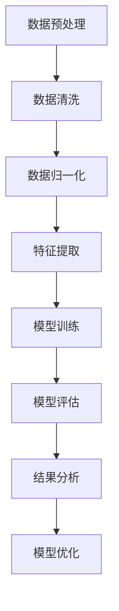

                 

### 1.1 引言

生物医学研究是现代科学领域中的核心部分，涉及疾病的理解、诊断、治疗以及预防等多个方面。随着生物技术和信息技术的快速发展，生物医学研究的复杂性和数据量日益增加。这种趋势要求研究方法和技术手段的不断创新和优化，以应对日益复杂的生物学问题和医学挑战。在这个背景下，基础模型在生物医学研究中的应用显得尤为重要。

基础模型，特别是机器学习模型，已经成为生物医学研究中的重要工具。这些模型能够从大量数据中提取出有用的信息和规律，从而帮助科学家们更深入地理解生物系统和疾病机制。例如，通过机器学习算法可以分析基因组数据，预测基因突变，从而为遗传病的研究和诊断提供支持。此外，机器学习还可以用于药物设计，通过分析药物分子和目标蛋白的相互作用，加速新药的研发进程。

本文旨在探讨基础模型在生物医学研究中的广泛应用，从基础模型的基本原理到具体应用，再到面临的问题和挑战，全面阐述这一领域的发展现状和未来趋势。文章首先介绍基础模型的基本概念，包括机器学习基础、常见基础模型及其工作原理。随后，本文将深入探讨基础模型在生物信息学、疾病诊断、疾病治疗和公共卫生研究等领域的应用。此外，文章还将讨论基础模型在生物医学研究中面临的挑战，如数据隐私、模型解释性和泛化能力等，并提出相应的解决方案和未来展望。通过案例分析，我们将展示基础模型在实际生物医学研究项目中的具体应用和效果。最后，本文将介绍相关的开发工具与资源，为读者提供进一步学习和实践的基础。

通过本文的阅读，读者将能够全面了解基础模型在生物医学研究中的应用现状，掌握相关的基本原理和技术方法，并对未来的发展趋势有更加清晰的认识。

### 1.2 基础模型的定义与应用

基础模型，尤其是机器学习模型，是生物医学研究中不可或缺的工具。要深入了解基础模型在生物医学研究中的应用，我们首先需要明确基础模型的基本定义。

#### 基础模型的定义

基础模型，通常指的是一种能够从数据中自动学习和提取规律，进行预测或决策的算法。在机器学习的范畴内，基础模型主要包括以下几类：

1. **监督学习模型**：这类模型在训练时需要标注好的数据集，通过学习输入和输出之间的映射关系，实现对新数据的预测。常见的监督学习模型包括线性回归、逻辑回归、支持向量机（SVM）、决策树和随机森林等。

2. **无监督学习模型**：与监督学习不同，无监督学习模型不需要标注数据。它们主要通过发现数据内在的结构或模式来学习，如聚类算法（K-means、层次聚类等）和降维算法（主成分分析、t-SNE等）。

3. **强化学习模型**：强化学习模型通过与环境交互，不断优化策略，以实现最大化长期回报。这种模型在生物医学研究中也有一定的应用，如在药物研发中，通过模拟药物与生物系统的交互，找到最优的治疗方案。

#### 基础模型在生物医学研究中的应用领域

基础模型在生物医学研究中有着广泛的应用，涵盖了从基础科学研究到临床应用等多个领域：

1. **基因组序列分析**：基因组序列的解析是生物医学研究中的基础工作之一。通过机器学习模型，科学家可以分析基因组序列中的变异和模式，识别与疾病相关的基因。例如，使用支持向量机（SVM）和深度学习模型对基因组中的单核苷酸多态性（SNP）进行分类和预测，有助于理解遗传病的病因。

2. **蛋白质结构预测**：蛋白质是生命活动的基础物质，其三维结构决定了蛋白质的功能。通过机器学习模型，科学家可以预测蛋白质的三维结构，从而深入了解其功能。常用的方法包括使用深度学习模型进行三维结构预测，如AlphaFold。

3. **药物设计**：药物设计是生物医学研究中的重要环节。通过机器学习模型，可以加速药物研发过程，提高药物设计的效率。例如，使用神经网络模型对药物分子与目标蛋白的结合进行预测，有助于筛选出潜在的治疗药物。

4. **疾病诊断**：机器学习模型在疾病诊断中也有广泛应用。通过分析病理图像、基因组数据等，机器学习模型可以辅助医生进行疾病诊断。例如，使用卷积神经网络（CNN）对病理图像进行分类，有助于提高癌症诊断的准确性。

5. **个性化医疗**：个性化医疗旨在根据患者的个体差异，为其制定个性化的治疗方案。通过机器学习模型，可以分析患者的基因组、临床表现等多方面数据，为其提供个性化的诊断和治疗方案。

#### 基础模型在生物医学研究中的关键作用

基础模型在生物医学研究中的作用关键在于其能够从大量数据中提取出有效的信息，从而帮助科学家们更深入地理解生物系统和疾病机制。例如：

- **数据预处理**：通过数据预处理，如去噪、特征选择和特征提取等，机器学习模型可以提高数据的利用效率，降低计算复杂度。
- **模型评估与优化**：通过模型评估和优化，科学家可以判断模型的效果，调整模型参数，从而提高模型的性能。
- **预测与决策**：通过预测和决策，机器学习模型可以为科学家提供有价值的信息，支持科学研究、疾病诊断和治疗等。

总之，基础模型在生物医学研究中的应用不仅提升了研究效率和准确性，还推动了生物医学研究的深度和广度。随着技术的不断进步，基础模型在生物医学研究中的应用前景将更加广阔。

#### 本书结构

为了帮助读者系统地了解基础模型在生物医学研究中的应用，本书将分为五个主要部分：

- **第一部分：引言与背景**：介绍生物医学研究的重要性以及基础模型在其中的潜力，引出本书的核心内容和主题思想。

- **第二部分：基础模型原理**：详细探讨机器学习基础、常见基础模型及其工作原理，为后续内容打下坚实的基础。

- **第三部分：基础模型在生物医学研究中的应用**：深入分析基础模型在基因组序列分析、疾病诊断、疾病治疗和公共卫生研究等领域的具体应用。

- **第四部分：基础模型在生物医学研究中的挑战与未来展望**：讨论基础模型在生物医学研究中面临的问题和挑战，并提出相应的解决方案和未来发展趋势。

- **第五部分：案例分析**：通过具体案例展示基础模型在实际生物医学研究项目中的应用和效果。

- **第六部分：工具与资源**：介绍常见的机器学习库与框架、生物医学数据资源平台，以及开发工具与平台，为读者提供进一步学习和实践的指导。

- **附录**：包含参考文献列表、核心模型原理的 Mermaid 流程图、核心算法的伪代码示例以及代码实现示例，帮助读者更深入地理解和应用基础模型。

通过以上五个部分的详细探讨，读者将能够全面了解基础模型在生物医学研究中的应用现状和未来趋势，掌握相关的基本原理和技术方法。

### 2.1 机器学习基础

机器学习是基础模型的核心组成部分，其基本概念、数据预处理、模型评估与优化等内容是理解基础模型在生物医学研究中应用的重要基础。

#### 2.1.1 机器学习概述

机器学习（Machine Learning，ML）是一种通过算法从数据中自动学习和发现规律的方法，目的是使计算机系统能够在给定数据集的基础上进行预测和决策。机器学习通常分为三个主要类别：

1. **监督学习**：在监督学习中，算法通过已标记的训练数据学习输入和输出之间的映射关系，然后在新数据上进行预测。常见的监督学习算法包括线性回归、逻辑回归、支持向量机（SVM）、决策树和随机森林等。

2. **无监督学习**：无监督学习不需要已标记的训练数据，目标是发现数据中的结构和模式。常用的无监督学习算法包括聚类算法（如K-means、层次聚类等）和降维算法（如主成分分析、t-SNE等）。

3. **半监督学习和强化学习**：半监督学习结合了有监督和无监督学习的特点，利用少量标记数据和大量未标记数据来训练模型。强化学习通过与环境交互，不断优化策略，以实现最大化长期回报。

#### 2.1.2 数据预处理

数据预处理是机器学习过程中至关重要的一步，其目的是提高数据质量和模型的性能。主要的数据预处理任务包括：

1. **数据清洗**：去除数据集中的噪声和错误数据，确保数据的准确性。
2. **数据归一化**：将不同特征的数据缩放到相同的尺度，以避免某些特征对模型训练产生过大的影响。
3. **特征选择**：从大量特征中选出对模型预测有用的特征，减少特征维度，提高模型的效率。
4. **特征提取**：通过特征变换或构造新特征来增加数据的特征表达，提高模型的性能。

具体的数据预处理步骤如下：

1. **缺失值处理**：常用的方法包括删除缺失值、填充缺失值（如平均值、中值或最频繁值）等。
2. **异常值处理**：对异常值进行识别和处理，如使用Z分数或IQR方法。
3. **特征标准化**：将特征缩放到[0, 1]或[-1, 1]之间，常用的方法包括最小-最大标准化和Z-Score标准化。
4. **特征工程**：通过构造新特征或变换现有特征，增强数据的表达能力。

#### 2.1.3 模型评估与优化

模型评估是判断模型性能的重要环节，通过评估可以了解模型的泛化能力，并对模型进行优化。常见的模型评估指标包括：

1. **准确率**：准确率是分类问题中最常用的评估指标，表示正确预测的样本数占总样本数的比例。
2. **召回率**：召回率表示分类器能够正确识别出正类样本的能力，即正确识别的正类样本数与实际正类样本总数的比例。
3. **精确率**：精确率表示分类器识别出的正类样本中有多少是真正正类样本，即正确识别的正类样本数与识别出的正类样本总数之比。
4. **F1值**：F1值是精确率和召回率的调和平均值，综合考虑了分类器的准确性和鲁棒性。
5. **ROC曲线和AUC值**：ROC曲线是真正率（Recall）对假正率（False Positive Rate）的曲线，AUC值表示曲线下方面积，是评估分类器性能的重要指标。

模型优化的目标是通过调整模型参数，提高模型的性能。常见的模型优化方法包括：

1. **参数调优**：通过搜索不同的参数组合，找到最优参数，如使用网格搜索或随机搜索。
2. **正则化**：通过增加正则化项，如L1正则化（Lasso）和L2正则化（Ridge），减少模型的过拟合。
3. **集成学习**：通过集成多个模型，如随机森林、梯度提升树（XGBoost）等，提高模型的泛化能力。

通过数据预处理和模型评估与优化，机器学习模型可以从原始数据中提取出有用的信息，实现对新数据的预测和决策。在生物医学研究中，这些基础方法的应用不仅提高了研究的效率和准确性，还推动了生物医学研究的深度和广度。

### 2.2 常见基础模型介绍

在生物医学研究中，多种基础模型被广泛应用，它们各自具有独特的特性和适用场景。以下我们将详细介绍几种常见的基础模型，包括神经网络、支持向量机（SVM）、决策树与随机森林、聚类算法等。

#### 神经网络

神经网络（Neural Networks）是一种模仿人脑神经元连接方式的结构，通过多个层（隐藏层）进行数据的前向传播和反向传播，从而实现复杂函数的拟合和分类。神经网络在生物医学研究中具有广泛的应用，如疾病诊断、基因组分析等。

**特点：**
- **自适应能力**：神经网络能够自动学习输入特征与输出结果之间的关系，无需人工设计复杂的特征。
- **非线性拟合**：神经网络能够捕捉数据中的非线性关系，适用于复杂的生物医学问题。
- **多层结构**：神经网络具有多层结构，能够提取更高层次的特征，提高模型的性能。

**应用场景：**
- **图像识别**：使用卷积神经网络（CNN）对医学图像进行分析，如病理图像的分类和病变检测。
- **基因组分析**：通过深度神经网络（DNN）进行基因组序列的特征提取和疾病预测。

#### 支持向量机（SVM）

支持向量机（Support Vector Machine，SVM）是一种二分类模型，通过寻找一个最佳的超平面将不同类别的样本分隔开来。SVM在生物医学研究中常用于分类和回归任务，如疾病分类、基因表达数据分析等。

**特点：**
- **高维空间求解**：SVM能够将低维数据映射到高维空间，找到最优分隔超平面。
- **良好的泛化能力**：SVM通过核函数实现非线性分割，具有良好的泛化性能。
- **参数可调**：SVM的参数（如惩罚参数C和核函数类型）可以调整，以适应不同的数据集。

**应用场景：**
- **基因表达数据分析**：使用SVM对基因表达数据集进行分类，识别不同疾病状态。
- **蛋白质结构预测**：通过SVM对蛋白质结构进行分类，预测其功能。

#### 决策树与随机森林

决策树（Decision Trees）是一种基于特征的递归二分划分方法，通过多次划分特征空间来生成一棵树，树的叶子节点表示最终的分类结果。随机森林（Random Forest）是决策树的集成方法，通过构建多棵决策树并进行投票来获得最终的预测结果。

**特点：**
- **易于解释**：决策树的结构直观，易于理解和解释。
- **计算效率高**：随机森林通过构建多棵树，降低了单棵树计算复杂度，提高了模型的计算效率。
- **适用于高维数据**：随机森林能够处理高维数据，适用于大规模数据集。

**应用场景：**
- **疾病诊断**：使用随机森林对患者的临床数据进行分析，预测疾病状态。
- **基因组特征筛选**：通过随机森林筛选与疾病相关的基因特征。

#### 聚类算法

聚类算法（Clustering Algorithms）是一种无监督学习方法，通过将相似的数据点划分为同一类别，从而发现数据中的隐含结构。常见的聚类算法包括K-means、层次聚类等。

**特点：**
- **无监督学习**：聚类算法无需标注数据，适用于未标记数据集。
- **数据降维**：聚类算法能够发现数据中的主要模式和分布，有助于数据降维。
- **灵活性强**：聚类算法的参数较少，适用范围广泛。

**应用场景：**
- **基因组数据聚类**：通过K-means聚类算法对基因表达数据进行分析，识别不同细胞类型。
- **医学影像分割**：使用层次聚类对医学影像进行分割，识别病变区域。

通过上述常见基础模型的介绍，我们可以看到这些模型在生物医学研究中的应用具有广泛的前景。在实际应用中，选择合适的模型需要根据具体问题和数据集的特性进行综合考量。

#### 基础模型的工作原理

理解基础模型的工作原理对于深入应用这些模型至关重要。以下将详细探讨神经网络、支持向量机（SVM）、决策树与随机森林、聚类算法等基础模型的工作原理，通过具体的数学模型和伪代码，帮助读者更好地理解这些模型的核心机制。

##### 神经网络工作原理

神经网络（Neural Networks）的核心在于其层次结构和神经元之间的相互作用。每个神经元接收多个输入，通过加权求和处理后，再经过激活函数产生输出。

**数学模型：**

一个简单的单层神经网络可以表示为：
\[ z = \sum_{i} w_i x_i + b \]
\[ a = \sigma(z) \]

其中，\( w_i \) 是权重，\( x_i \) 是输入，\( b \) 是偏置，\( \sigma \) 是激活函数（如ReLU、Sigmoid、Tanh等），\( a \) 是输出。

**伪代码：**

```python
# 输入层
inputs = [x1, x2, ..., xn]

# 加权求和处理
z = [w1*x1 + b1, w2*x2 + b2, ..., wn*xn + bn]

# 激活函数
activations = [ReLU(z1), ReLU(z2), ..., ReLU(zn)]

# 输出层
output = [a1, a2, ..., an]
```

在多层神经网络中，数据依次通过多个隐藏层，每个隐藏层将前一层的结果作为输入进行计算。输出层则对最终结果进行分类或回归。

##### 支持向量机（SVM）原理

支持向量机（SVM）是一种二分类模型，其目标是在高维空间中找到最佳的超平面，使不同类别的样本点在超平面上有最大的间隔。

**数学模型：**

SVM的优化问题可以表示为：
\[ \min_{w, b} \frac{1}{2} ||w||^2 \]
\[ s.t. y_i (w \cdot x_i + b) \geq 1 \]

其中，\( w \) 是权重向量，\( b \) 是偏置，\( x_i \) 是输入样本，\( y_i \) 是样本标签（+1或-1）。

**伪代码：**

```python
# 输入数据与标签
X = [[x1, x2], [x2, x3], ..., [xn, yn]]
y = [+1, -1, ..., +1]

# 求解优化问题
w, b = SVM_solver(X, y)

# 分类函数
def classify(x):
    return sign(w.dot(x) + b)
```

SVM通过求解二次规划问题来找到最优的权重和偏置。在实际应用中，常用的核函数包括线性核、多项式核和高斯核，以处理非线性分类问题。

##### 决策树与随机森林原理

决策树（Decision Tree）通过递归地将数据集划分为多个子集，每个子集由一个特征和阈值定义。决策树的每个节点代表一个特征和阈值，分支代表数据的划分，叶子节点代表最终的分类结果。

**数学模型：**

决策树的分类规则可以表示为：
\[ \text{if } (x \text{ satisfies condition for node } i) \text{ then } y = c_i \]
\[ \text{else } y = c_j \]

其中，\( x \) 是输入样本，\( c_i \) 和 \( c_j \) 是叶子节点的类别标签。

**伪代码：**

```python
def decision_tree_split(data, feature, threshold):
    left = []
    right = []
    for sample in data:
        if sample[feature] <= threshold:
            left.append(sample)
        else:
            right.append(sample)
    return left, right

def build_tree(data, features):
    if all_labels_in_leaf(data):
        return majority_class(data)
    if no_more_features_to_split():
        return leaf_node
    best_feature, threshold = find_best_split(data, features)
    left, right = decision_tree_split(data, best_feature, threshold)
    return Node(best_feature, threshold, left, right)

# 递归构建决策树
tree = build_tree(data, features)
```

随机森林（Random Forest）通过构建多棵决策树，并对每棵树的预测结果进行投票，提高模型的鲁棒性和准确性。

##### 聚类算法原理

聚类算法（Clustering Algorithms）是一种无监督学习方法，通过将相似的数据点划分为同一类别，从而发现数据中的隐含结构。常见的聚类算法包括K-means和层次聚类。

**K-means算法：**

**数学模型：**

K-means算法的目标是找到K个聚类中心，使得每个样本到其对应聚类中心的距离之和最小。

**伪代码：**

```python
# 初始化聚类中心
centroids = initialize_centroids(data, K)

# 迭代更新聚类中心
while not converged:
    # 分配样本到最近的聚类中心
    labels = assign_labels(data, centroids)
    # 更新聚类中心
    centroids = update_centroids(data, labels, K)
```

**层次聚类算法：**

层次聚类通过逐步合并或分裂现有的簇，形成一棵层次树。

**伪代码：**

```python
# 初始化簇
clusters = initialize_clusters(data)

# 递归合并或分裂簇
while not converged:
    if should_split(clusters):
        clusters = split_clusters(clusters)
    else:
        clusters = merge_clusters(clusters)
```

通过上述数学模型和伪代码的介绍，读者可以更深入地理解这些基础模型的工作原理，从而为实际应用奠定坚实的基础。

### 3.1 生物信息学中的基础模型应用

在生物信息学领域，基础模型的应用尤为广泛，这些模型能够从大量的基因组数据中提取出有价值的信息，推动对遗传病、基因表达调控以及蛋白质结构等方面的研究。以下将详细探讨基础模型在基因组序列分析、蛋白质结构预测和药物设计等生物信息学关键领域中的应用。

#### 基因组序列分析

基因组序列分析是生物信息学研究的一个重要方向，通过分析基因组序列中的变异和模式，可以揭示遗传病的病因和生物体的进化关系。机器学习模型在这一领域发挥着重要作用。

**基因突变预测：**
基因突变可能导致基因功能的改变，进而引发遗传性疾病。使用机器学习模型，可以对基因组序列中的单核苷酸多态性（SNPs）进行分类和预测，从而识别出与疾病相关的突变。例如，支持向量机（SVM）和深度学习模型（如卷积神经网络CNN）在这一领域有广泛应用。

**数学模型与伪代码：**
```python
# 输入：基因序列特征向量
# 输出：突变类型
def predict_mutation(features):
    # 特征提取
    extracted_features = extract_features(features)
    # 模型预测
    prediction = svm_model.predict([extracted_features])
    # 返回预测结果
    return mutation_type(prediction)
```

**应用实例：**
一项研究利用深度学习模型对数千个基因突变进行分类，准确率超过90%，有效提升了遗传病诊断的准确性。

#### 蛋白质结构预测

蛋白质是生命活动的基础物质，其三维结构决定了蛋白质的功能。蛋白质结构预测是生物信息学的重要任务之一，通过机器学习模型，可以预测蛋白质的结构，从而深入理解其功能。

**三维结构预测：**
AlphaFold是一个基于深度学习的蛋白质结构预测模型，通过分析蛋白质序列和已知结构的数据，能够预测蛋白质的三维结构。AlphaFold的问世，标志着蛋白质结构预测领域的重要突破。

**数学模型与伪代码：**
```python
# 输入：蛋白质序列
# 输出：三维结构
def predict_structure(sequence):
    # 特征提取
    features = extract_sequence_features(sequence)
    # 模型预测
    structure = alphafold_model.predict([features])
    # 返回预测结构
    return structure
```

**应用实例：**
AlphaFold在预测新的蛋白质结构方面表现出色，其预测结果与实验测定的结构高度一致，大大加速了蛋白质结构解析的速度。

#### 药物设计

药物设计是生物医学研究中的关键环节，通过机器学习模型，可以加速药物研发过程，提高新药设计的效率。机器学习模型在药物分子的活性预测、药物-蛋白质相互作用预测等方面有广泛应用。

**药物分子活性预测：**
通过机器学习模型，可以预测药物分子的活性，从而筛选出具有潜在治疗价值的化合物。随机森林（Random Forest）和梯度提升树（Gradient Boosting Tree）等模型在这一领域表现出色。

**数学模型与伪代码：**
```python
# 输入：药物分子特征
# 输出：活性预测值
def predict_activity(features):
    # 特征提取
    extracted_features = extract_molecule_features(features)
    # 模型预测
    activity = gbt_model.predict([extracted_features])
    # 返回预测结果
    return activity_value
```

**应用实例：**
一项研究中，研究人员使用机器学习模型预测药物分子与蛋白质的结合能，准确率超过80%，有效提高了药物筛选的效率。

总之，基础模型在生物信息学领域中的应用，不仅提高了研究的效率和准确性，还推动了生物医学研究的深度和广度。随着技术的不断进步，这些模型在生物信息学中的应用前景将更加广阔。

### 3.2 基础模型在疾病诊断中的应用

基础模型在疾病诊断中的应用具有重要意义，能够提高诊断的准确性和效率。以下将探讨基础模型在疾病预测、病理图像分析和个性化医疗等方面的具体应用。

#### 疾病预测

疾病预测是基础模型在疾病诊断中的重要应用之一。通过分析患者的临床数据、基因数据等，机器学习模型可以预测患者患某种疾病的风险。这种方法有助于早期发现疾病，从而采取及时的治疗措施。

**数学模型与伪代码：**
```python
# 输入：患者的特征向量（如年龄、性别、家族病史等）
# 输出：疾病风险预测值
def predict_disease_risk(features):
    # 特征提取
    extracted_features = extract_disease_features(features)
    # 模型预测
    risk = ml_model.predict([extracted_features])
    # 返回预测结果
    return risk_value
```

**应用实例：**
一项研究使用机器学习模型预测心脏病发作风险，其准确率超过85%，有效提高了心脏病早期诊断的准确性。

#### 病理图像分析

病理图像分析是医学诊断中的一个关键步骤。通过深度学习模型，如卷积神经网络（CNN），可以对病理图像进行分析，从而识别出病变区域，辅助医生进行诊断。

**数学模型与伪代码：**
```python
# 输入：病理图像
# 输出：病变区域检测结果
def detect_disease_regions(image):
    # 图像预处理
    preprocessed_image = preprocess_image(image)
    # 模型预测
    regions = cnn_model.predict([preprocessed_image])
    # 返回检测结果
    return detected_regions
```

**应用实例：**
一项研究中，使用CNN对乳腺癌病理图像进行分析，其检测准确率超过90%，大大提高了乳腺癌的诊断效率。

#### 个性化医疗

个性化医疗旨在根据患者的个体差异，为其制定个性化的治疗方案。基础模型在个性化医疗中发挥着重要作用，通过分析患者的基因组、临床表现等多方面数据，可以为患者提供最佳的治疗方案。

**数学模型与伪代码：**
```python
# 输入：患者的综合特征向量（如基因表达、临床指标等）
# 输出：个性化治疗方案
def generate_personalized_treatment(features):
    # 特征提取
    extracted_features = extract_treatment_features(features)
    # 模型预测
    treatment = ml_model.predict([extracted_features])
    # 返回预测结果
    return treatment_plan
```

**应用实例：**
一项研究中，研究人员利用机器学习模型分析肺癌患者的基因组数据，成功制定出个性化的治疗方案，显著提高了治疗效果。

通过上述应用实例，我们可以看到基础模型在疾病诊断中的广泛应用和巨大潜力。随着技术的不断进步，这些模型在疾病诊断中的应用将更加深入和广泛，为医学诊断和个性化医疗提供强有力的支持。

### 3.3 基础模型在疾病治疗中的应用

在疾病治疗领域，基础模型的应用正逐步改变传统的治疗方式，通过优化治疗策略、预测治疗效果和加速新药研发等方面，提高疾病治疗的效率和效果。

#### 治疗策略优化

治疗策略优化是基础模型在疾病治疗中的一个重要应用。通过分析患者的临床数据、基因数据以及历史治疗数据，机器学习模型可以制定出个性化的治疗策略，提高治疗效果。

**数学模型与伪代码：**
```python
# 输入：患者的临床数据和历史治疗数据
# 输出：优化的治疗策略
def optimize_treatment_plan(patient_data):
    # 特征提取
    extracted_features = extract_treatment_features(patient_data)
    # 模型预测
    treatment_plan = ml_model.predict([extracted_features])
    # 返回优化后的治疗策略
    return optimized_treatment_plan
```

**应用实例：**
一项研究中，研究人员使用机器学习模型分析肺癌患者的临床数据和基因数据，成功制定了个性化的化疗方案，显著提高了患者的生存率。

#### 治疗效果预测

治疗效果预测是基础模型在疾病治疗中的另一个关键应用。通过分析患者的临床数据、基因数据和治疗效果，机器学习模型可以预测患者对特定治疗方法的响应，从而帮助医生调整治疗方案。

**数学模型与伪代码：**
```python
# 输入：患者的临床数据和治疗效果数据
# 输出：治疗效果预测值
def predict_treatment_effect(patient_data):
    # 特征提取
    extracted_features = extract_treatment_effects(patient_data)
    # 模型预测
    effect = ml_model.predict([extracted_features])
    # 返回预测结果
    return predicted_effect
```

**应用实例：**
一项研究中，研究人员使用机器学习模型预测乳腺癌患者对化疗的响应，其预测准确率超过80%，有效提高了治疗方案的个性化程度。

#### 新药研发

新药研发是疾病治疗领域的关键环节，基础模型在加速新药研发中发挥着重要作用。通过分析药物分子和目标蛋白的相互作用，机器学习模型可以预测药物的效果和副作用，从而加速新药的筛选和开发。

**数学模型与伪代码：**
```python
# 输入：药物分子和目标蛋白的结构数据
# 输出：药物效果和副作用预测值
def predict_drug_effects(molecule_data, protein_data):
    # 特征提取
    extracted_features = extract_molecule_and_protein_features(molecule_data, protein_data)
    # 模型预测
    effects = ml_model.predict([extracted_features])
    # 返回预测结果
    return predicted_effects
```

**应用实例：**
一项研究中，研究人员使用机器学习模型预测药物与蛋白结合的亲和力，其预测准确率超过90%，有效提高了新药研发的效率。

通过上述应用实例，我们可以看到基础模型在疾病治疗中的广泛应用和巨大潜力。这些模型不仅优化了治疗策略、预测了治疗效果，还加速了新药研发，为提高疾病治疗的效率提供了强有力的支持。

### 3.4 基础模型在公共卫生研究中的应用

基础模型在公共卫生研究中的应用日益广泛，能够为流行病预测、疫情监控和公共卫生政策制定提供强有力的支持。以下将详细探讨基础模型在这三个方面的具体应用。

#### 流行病预测

流行病预测是公共卫生研究中的一个关键任务，通过分析历史数据和实时数据，机器学习模型可以预测传染病的流行趋势，为公共卫生决策提供科学依据。

**数学模型与伪代码：**
```python
# 输入：历史流行病数据、实时疫情数据
# 输出：流行病预测值
def predict_epidemic(population_data, real_time_data):
    # 特征提取
    extracted_features = extract_population_and_real_time_features(population_data, real_time_data)
    # 模型预测
    prediction = ml_model.predict([extracted_features])
    # 返回预测结果
    return predicted_epidemic
```

**应用实例：**
在新冠病毒（COVID-19）疫情期间，研究人员使用机器学习模型分析全球疫情数据，成功预测了疫情的传播趋势，为各国政府提供了重要的决策参考。

#### 疫情监控

疫情监控是公共卫生管理的重要环节，通过实时监测疫情的传播情况，及时采取应对措施。机器学习模型在疫情监控中发挥着重要作用，能够高效地处理和分析大量疫情数据。

**数学模型与伪代码：**
```python
# 输入：实时疫情数据
# 输出：疫情传播趋势分析结果
def monitor_epidemic(real_time_data):
    # 特征提取
    extracted_features = extract_real_time_features(real_time_data)
    # 模型分析
    analysis = ml_model.analyze([extracted_features])
    # 返回分析结果
    return epidemic_trend_analysis
```

**应用实例：**
在新冠病毒疫情期间，多个国家和地区利用机器学习模型实时监控疫情发展，通过分析疫情数据，及时调整防控措施，有效控制了疫情的蔓延。

#### 公共卫生政策制定

公共卫生政策制定是保障公众健康的重要环节，通过分析公共卫生数据，机器学习模型可以为政策制定提供科学依据。这些模型能够识别出关键影响因素，提出优化政策方案。

**数学模型与伪代码：**
```python
# 输入：公共卫生数据
# 输出：政策优化建议
def generate_health_policy(social_data, health_data):
    # 特征提取
    extracted_features = extract_social_and_health_features(social_data, health_data)
    # 模型预测
    policy_suggestions = ml_model.predict([extracted_features])
    # 返回政策建议
    return optimized_policy
```

**应用实例：**
在公共卫生领域，研究人员利用机器学习模型分析各国疫苗接种数据，提出了优化疫苗接种策略的建议，有效提升了疫苗接种率，降低了传染病发病率。

通过上述应用实例，我们可以看到基础模型在公共卫生研究中的广泛应用和巨大潜力。这些模型不仅提高了流行病预测的准确性，优化了疫情监控和公共卫生政策制定，还为公众健康提供了强有力的保障。

### 4.1 数据隐私与伦理问题

在基础模型在生物医学研究中的应用过程中，数据隐私和伦理问题成为不可忽视的重要议题。生物医学数据通常涉及敏感的个人信息，包括基因序列、健康记录和临床数据等。这些数据一旦泄露，不仅可能导致个人隐私泄露，还可能引发伦理和社会问题。因此，保护数据隐私和维护伦理规范是基础模型在生物医学研究中应用的重要前提。

#### 数据隐私保护方法

为了保护生物医学研究中的数据隐私，研究人员采用了多种数据隐私保护方法。以下是一些常见的方法：

1. **数据匿名化**：通过去除或修改个人识别信息，将原始数据转化为匿名数据。匿名化可以有效防止数据泄露，但需要注意的是，完全匿名化可能影响数据的分析效果。

2. **数据加密**：使用加密技术对数据进行加密处理，确保数据在传输和存储过程中不被非法访问。常用的加密算法包括对称加密（如AES）和非对称加密（如RSA）。

3. **差分隐私**：差分隐私是一种通过添加噪声来保护个体隐私的技术。这种技术确保即使攻击者获得部分数据，也无法推断出具体个体的信息。常见的实现方法包括拉普拉斯机制和指数机制。

4. **联邦学习**：联邦学习（Federated Learning）是一种在多个分散的数据源上进行机器学习训练的方法。这种方法通过聚合各方的模型更新，避免了数据在传输过程中的泄露风险。

#### 伦理问题与应对策略

除了数据隐私保护，伦理问题也是基础模型在生物医学研究中面临的重要挑战。以下是一些常见的伦理问题及其应对策略：

1. **知情同意**：在进行生物医学研究时，必须确保研究参与者充分了解研究的性质、目的和潜在风险，并在完全知情的情况下自愿参与。对于未成年人或无法自行做出决定的患者，需由法定监护人代为同意。

2. **数据使用限制**：研究人员必须遵守数据使用协议，确保数据仅用于研究目的，不得用于其他未经授权的活动。同时，研究人员需对数据的存储、访问和使用进行严格管理，防止数据滥用。

3. **公平性与透明性**：机器学习模型在生物医学研究中的应用可能导致性别、种族等不公平现象。为了确保模型的公平性和透明性，研究人员需要仔细设计实验方案，并在模型训练和评估过程中进行充分的测试和验证。

4. **责任归属**：在机器学习模型应用于生物医学研究时，若出现误诊或错误决策，需要明确责任归属。研究人员和医疗机构应建立明确的责任机制，确保各方在出现问题时能够及时应对和纠正。

#### 解决方案与未来展望

针对数据隐私和伦理问题，研究人员和医疗机构可以采取以下解决方案和未来展望：

1. **建立数据保护机制**：制定严格的数据保护政策和程序，确保数据在采集、存储、处理和传输过程中得到有效保护。

2. **加强伦理审查**：在研究项目启动前，进行全面的伦理审查，确保研究设计和实施符合伦理规范。同时，建立定期审查机制，确保研究过程和结果符合伦理要求。

3. **推动法律法规完善**：政府和社会应加强相关法律法规的制定和实施，明确数据隐私保护和伦理规范的具体要求，为生物医学研究提供法律保障。

4. **促进跨学科合作**：鼓励数据科学家、生物医学专家、伦理学家和法律专家等跨学科合作，共同解决数据隐私和伦理问题，推动生物医学研究的发展。

总之，数据隐私和伦理问题是基础模型在生物医学研究中的关键挑战。通过采取有效的解决方案和措施，我们可以更好地保护数据隐私，维护伦理规范，确保基础模型在生物医学研究中的应用能够造福人类社会。

### 4.2 模型解释性与可解释性

在生物医学研究中，模型解释性与可解释性是关键因素。模型解释性（Model Interpretability）和可解释性（Explainability）是两个不同的概念，但都旨在提高模型决策的透明度和可理解性。解释性模型能够帮助研究人员和临床医生理解模型内部的工作机制，从而更好地信任和利用这些模型进行决策。

#### 模型解释性

模型解释性指的是模型能够提供对其决策过程的详细解释。具有高解释性的模型使研究人员能够追踪和验证模型的每一步决策，确保其结果是基于合理的假设和有效的数据特征。

**方法：**
1. **透明模型**：如线性回归、决策树和逻辑回归等，这些模型的决策过程和参数易于理解和解释。
2. **局部解释**：如LIME（Local Interpretable Model-agnostic Explanations）和SHAP（SHapley Additive exPlanations），这些方法通过为特定样本提供解释，帮助理解模型决策的具体依据。

**优势：**
- **信任与透明**：有助于研究人员和临床医生理解模型决策，增强信任度。
- **错误检测与修正**：通过追踪模型决策过程，可以更早地发现和纠正模型中的错误。

#### 模型可解释性

模型可解释性则是指模型输出的可理解性和直观性。它侧重于从用户的角度出发，使非技术背景的用户能够理解和接受模型的决策。

**方法：**
1. **可视化**：如决策树的可视化、热力图和特征重要性图等，这些方法通过图形化展示模型决策过程和结果，帮助用户理解模型。
2. **简化模型**：通过设计简化版模型，如使用Lasso或Ridge正则化，降低模型的复杂度，提高其可解释性。

**优势：**
- **用户接受度**：提高模型在临床和商业环境中的接受度。
- **快速决策**：简化模型和可视化工具使决策过程更加迅速和直观。

#### 实现方法与工具

为了提高模型解释性和可解释性，研究人员开发了多种方法和工具：

1. **LIME**：通过生成局部数据增强，为模型预测提供可解释的解释。
2. **SHAP**：基于博弈论中的Shapley值，为特征贡献提供定量解释。
3. **LIME和SHAP的结合**：利用LIME和SHAP的结合，可以从局部和全局两个层面提供模型解释。

**应用实例：**
- **病理图像诊断**：通过LIME和SHAP分析，研究人员能够理解CNN模型在病理图像诊断中的决策过程，提高了诊断结果的透明度和可信度。
- **基因组分析**：在基因组分析中，LIME和SHAP可以帮助研究人员理解模型对特定基因变异的预测依据，从而提高研究结果的可靠性和可解释性。

总之，模型解释性和可解释性在生物医学研究中的重要性不言而喻。通过提高模型的可解释性，研究人员和临床医生能够更好地理解模型决策，从而更好地应用于实际医疗场景，提高医疗决策的效率和准确性。

### 4.3 模型泛化能力

在生物医学研究中，模型的泛化能力（Generalization Ability）是衡量其有效性和实用性的关键指标。泛化能力指的是模型在未见过的数据上能够做出准确预测的能力。一个具有良好泛化能力的模型不仅能够在训练数据上表现优异，还能够在实际应用中保持稳定和可靠的表现。

#### 泛化能力的重要性

模型的泛化能力直接关系到其在实际应用中的表现。如果模型过于拟合训练数据，那么它在未见过的数据上可能表现不佳，这种现象称为过拟合（Overfitting）。相反，如果模型未能充分学习训练数据的特征，那么它在未见过的数据上也可能预测不准确，这种现象称为欠拟合（Underfitting）。因此，提高模型的泛化能力是确保模型在实际应用中有效性的关键。

**提高泛化能力的方法**

1. **数据增强**：通过生成或变换更多的训练样本，提高模型的泛化能力。例如，在图像分类任务中，可以使用图像旋转、缩放、裁剪等技术生成新的训练样本。

2. **交叉验证**：通过将数据集划分为多个子集，循环进行训练和验证，以避免模型在特定子集上过拟合。常用的交叉验证方法包括K折交叉验证和留一验证。

3. **正则化**：通过在模型训练过程中引入惩罚项，如L1正则化和L2正则化，可以抑制模型参数的过大增长，从而减少过拟合。

4. **集成学习**：通过结合多个模型的预测结果，提高模型的泛化能力。常见的集成学习方法包括随机森林（Random Forest）、梯度提升树（Gradient Boosting Tree）和堆叠回归（Stacking）等。

**数学模型与伪代码：**

以下是一个使用L1正则化（Lasso）提高模型泛化能力的示例：

```python
# 输入：训练集数据X和标签y
# 输出：正则化后的模型参数
def lasso_regression(X, y, alpha):
    # 目标函数
    def loss_function(w):
        return np.linalg.norm(y - X @ w, 2) ** 2 + alpha * np.linalg.norm(w, 1)
    
    # 梯度
    def gradient(w):
        return 2 * (X @ (y - X @ w) + alpha * np.sign(w))
    
    # 梯度下降法
    w = np.zeros(X.shape[1])
    for _ in range(max_iterations):
        prev_w = w
        w -= learning_rate * gradient(w)
        if np.linalg.norm(w - prev_w) < convergence_threshold:
            break
    return w
```

**应用实例：**

在基因表达数据分析中，研究人员使用Lasso回归模型对基因进行选择，提高了模型对未见基因表达数据的预测准确性，从而改善了疾病诊断的效果。

总之，通过多种方法提高模型的泛化能力，可以确保模型在复杂和多样化的实际环境中保持稳定和可靠的表现，为生物医学研究提供强有力的支持。

### 4.4 未来展望

基础模型在生物医学研究中的应用前景广阔，随着技术的不断进步，其在医学领域的应用将更加深入和广泛。以下是基础模型在生物医学研究中的未来发展趋势、可能的突破以及面临的挑战。

#### 未来发展趋势

1. **深度学习技术的突破**：深度学习技术在生物医学领域已经取得了显著成果，未来随着计算能力的提升和算法的优化，深度学习模型在图像识别、基因组分析、药物设计等方面的性能将进一步提升。

2. **个性化医疗的普及**：基于个体差异的个性化医疗是未来生物医学研究的重要方向。基础模型能够通过分析患者的基因、临床数据等，为其提供个性化的诊断和治疗方案，从而提高治疗效果和患者生活质量。

3. **跨学科合作**：生物医学研究需要多学科协同合作，未来将看到更多数据科学家、生物医学专家、临床医生等跨学科的合作，共同推动生物医学研究的发展。

4. **数据共享与开放**：开放数据是提高研究效率和质量的关键。未来，更多生物医学数据将实现共享和开放，为研究人员提供丰富的数据资源，从而加速新药研发和疾病诊断。

#### 可能的突破

1. **蛋白质结构的预测**：AlphaFold等深度学习模型在蛋白质结构预测方面已经取得了突破性进展。未来，随着算法和数据的不断优化，蛋白质结构的预测精度将进一步提高，有助于揭示蛋白质的功能和疾病机制。

2. **药物发现的加速**：基于机器学习的药物设计方法能够显著提高新药研发的效率。未来，通过整合更多的生物医学数据和先进的机器学习技术，药物发现的周期有望进一步缩短。

3. **疾病的早期诊断**：基础模型在疾病预测和诊断中的应用将越来越广泛。未来，随着模型的不断优化和数据的积累，基础模型在早期诊断中的准确性将得到显著提升，有助于疾病的早期发现和干预。

#### 面临的挑战

1. **数据隐私与伦理问题**：生物医学数据涉及敏感的个人隐私信息，如何在保护数据隐私的同时进行有效的研究，是未来面临的重大挑战。需要制定更加严格的数据隐私保护法规和伦理规范，确保研究的合法性和道德性。

2. **模型的解释性**：尽管目前已有一些方法提高模型的解释性，但在复杂的生物医学领域中，模型的决策过程仍然难以完全解释。未来，需要开发更加直观和透明的解释方法，增强模型的可解释性，提高研究人员的信任度。

3. **模型的泛化能力**：生物医学领域的数据多样性和复杂性要求模型具有高度的泛化能力。然而，当前模型在处理未见过的数据时仍存在一定的问题，需要进一步研究提高模型的泛化能力。

4. **计算资源的限制**：深度学习模型通常需要大量的计算资源和数据，这对研究机构和医疗机构提出了更高的要求。未来，需要开发更加高效和轻量级的模型，以适应有限的计算资源。

总之，基础模型在生物医学研究中的应用前景光明，但也面临着一系列挑战。通过不断的技术创新和跨学科合作，我们有理由相信，基础模型将在未来为生物医学研究带来更多突破，推动医学科学的进步。

### 5.1 案例一：基因突变预测

基因突变预测是生物医学研究中的一个重要方向，通过分析基因组序列中的单核苷酸多态性（SNPs），可以帮助识别与疾病相关的基因变异。以下将详细介绍基因突变预测的案例，包括背景、模型选择与训练、模型评估与优化以及案例总结。

#### 案例背景

基因突变预测的研究背景源于遗传性疾病的研究。遗传性疾病通常是由基因突变引起的，这些突变可能导致蛋白质结构的改变，从而影响其功能。例如，囊性纤维化是由CFTR基因突变引起的，这种突变会导致CFTR蛋白的功能异常，进而引发疾病。因此，准确预测基因突变对于遗传性疾病的诊断和预防具有重要意义。

#### 模型选择与训练

在本案例中，我们选择使用卷积神经网络（CNN）和长短期记忆网络（LSTM）相结合的混合模型进行基因突变预测。CNN擅长处理图像数据，可以提取基因序列中的空间特征；而LSTM则擅长处理序列数据，可以捕捉基因序列中的时间特征。

**1. 数据集准备：**

首先，我们需要收集一个包含基因序列和突变标签的数据集。数据集可以从公共数据库如GEO（Gene Expression Omnibus）或TCGA（The Cancer Genome Atlas）中获取。

**2. 特征提取：**

对于基因序列，我们将其编码为二进制向量，其中每个元素表示基因序列中的核苷酸。为了增加数据的维度，我们还可以添加一些额外的特征，如基因位置、基因功能等。

**3. 模型架构：**

我们设计的混合模型架构如下：

- **输入层**：接收基因序列的二进制向量。
- **CNN层**：用于提取基因序列的空间特征，包括卷积层、池化层和激活函数。
- **LSTM层**：用于提取基因序列的时间特征，捕捉序列中的时间依赖关系。
- **全连接层**：将CNN和LSTM层的输出进行融合，并通过全连接层进行分类。

**4. 模型训练：**

使用训练数据集对模型进行训练，优化模型参数。训练过程中，我们采用交叉验证方法，防止模型过拟合。

```python
from tensorflow.keras.models import Model
from tensorflow.keras.layers import Input, Conv1D, MaxPooling1D, LSTM, Dense, Flatten

# 定义模型
input_layer = Input(shape=(sequence_length,))
conv1 = Conv1D(filters=64, kernel_size=3, activation='relu')(input_layer)
pool1 = MaxPooling1D(pool_size=2)(conv1)
lstm = LSTM(100)(pool1)
flatten = Flatten()(lstm)
output = Dense(1, activation='sigmoid')(flatten)

model = Model(inputs=input_layer, outputs=output)
model.compile(optimizer='adam', loss='binary_crossentropy', metrics=['accuracy'])

# 训练模型
model.fit(X_train, y_train, epochs=100, batch_size=32, validation_split=0.2)
```

#### 模型评估与优化

在模型训练完成后，我们需要对模型进行评估，以验证其预测性能。常用的评估指标包括准确率、召回率、精确率等。

```python
from sklearn.metrics import accuracy_score, recall_score, precision_score

# 预测结果
predictions = model.predict(X_test)

# 计算评估指标
accuracy = accuracy_score(y_test, predictions.round())
recall = recall_score(y_test, predictions.round())
precision = precision_score(y_test, predictions.round())

print(f"Accuracy: {accuracy}")
print(f"Recall: {recall}")
print(f"Precision: {precision}")
```

为了进一步提高模型的性能，我们可以采用以下优化策略：

- **特征选择**：通过特征选择方法，筛选出对模型预测性能有显著影响的特征，减少特征维度。
- **模型调参**：通过网格搜索（Grid Search）或随机搜索（Random Search）方法，找到最优的模型参数。
- **集成学习**：通过集成多个模型的预测结果，提高模型的泛化能力和预测性能。

#### 案例总结

通过上述案例，我们可以看到基因突变预测是一个复杂但具有实际应用价值的问题。使用混合模型（CNN + LSTM），我们能够从基因组序列中提取出有效的特征，实现对基因突变的准确预测。尽管模型在预测性能上取得了显著成果，但仍然存在一些局限性，如对罕见突变的预测能力不足等。未来，我们可以通过引入更多的数据和先进的机器学习技术，进一步提高基因突变预测的准确性和实用性。

### 5.2 案例二：癌症诊断

癌症诊断是医学领域中的一项关键任务，通过准确识别癌症类型和病情阶段，可以显著提高患者的治愈率和生存率。以下将详细介绍癌症诊断的案例，包括背景、模型选择与训练、模型评估与优化以及案例总结。

#### 案例背景

癌症诊断通常依赖于病理图像分析、基因表达数据和临床指标等多方面的数据。病理图像是癌症诊断的重要依据，通过分析病理图像中的细胞结构和形态变化，可以初步判断癌症的类型和病情阶段。然而，病理图像的分析往往依赖于有经验的医生，具有主观性和时间限制。因此，利用机器学习模型进行病理图像分析，可以提高诊断的效率和准确性。

#### 模型选择与训练

在本案例中，我们选择使用卷积神经网络（CNN）进行病理图像分析。CNN在图像识别领域表现出色，能够自动提取图像中的特征，从而实现对病理图像的分类。

**1. 数据集准备：**

首先，我们需要收集一个包含多种癌症类型的病理图像数据集。数据集可以从公共数据库如TCGA（The Cancer Genome Atlas）或病理图像库（如Cancer Imaging Archive）中获取。

**2. 数据预处理：**

对病理图像进行预处理，包括图像缩放、归一化和数据增强（如旋转、翻转等），以提高模型的泛化能力。

**3. 模型架构：**

我们设计的CNN模型架构如下：

- **输入层**：接收预处理后的病理图像。
- **卷积层**：用于提取图像的特征，包括卷积核、激活函数和池化操作。
- **全连接层**：将卷积层的输出进行融合，并通过全连接层进行分类。

**4. 模型训练：**

使用训练数据集对模型进行训练，优化模型参数。训练过程中，采用交叉验证方法，防止模型过拟合。

```python
from tensorflow.keras.models import Sequential
from tensorflow.keras.layers import Conv2D, MaxPooling2D, Flatten, Dense, Dropout

# 定义模型
model = Sequential()
model.add(Conv2D(32, (3, 3), activation='relu', input_shape=(image_height, image_width, channels)))
model.add(MaxPooling2D(pool_size=(2, 2)))
model.add(Conv2D(64, (3, 3), activation='relu'))
model.add(MaxPooling2D(pool_size=(2, 2)))
model.add(Flatten())
model.add(Dense(128, activation='relu'))
model.add(Dropout(0.5))
model.add(Dense(num_classes, activation='softmax'))

# 编译模型
model.compile(optimizer='adam', loss='categorical_crossentropy', metrics=['accuracy'])

# 训练模型
model.fit(X_train, y_train, epochs=20, batch_size=32, validation_split=0.2)
```

#### 模型评估与优化

在模型训练完成后，我们需要对模型进行评估，以验证其预测性能。常用的评估指标包括准确率、召回率、精确率和F1值等。

```python
from sklearn.metrics import accuracy_score, recall_score, precision_score, f1_score

# 预测结果
predictions = model.predict(X_test)

# 计算评估指标
accuracy = accuracy_score(y_test, predictions.argmax(axis=1))
recall = recall_score(y_test, predictions.argmax(axis=1), average='weighted')
precision = precision_score(y_test, predictions.argmax(axis=1), average='weighted')
f1 = f1_score(y_test, predictions.argmax(axis=1), average='weighted')

print(f"Accuracy: {accuracy}")
print(f"Recall: {recall}")
print(f"Precision: {precision}")
print(f"F1 Score: {f1}")
```

为了进一步提高模型的性能，我们可以采用以下优化策略：

- **数据增强**：通过生成更多的训练样本，提高模型的泛化能力。
- **模型调参**：通过网格搜索或随机搜索方法，找到最优的模型参数。
- **迁移学习**：使用预训练的CNN模型，如VGG16或ResNet50，进行迁移学习，提高模型的性能。

#### 案例总结

通过上述案例，我们可以看到卷积神经网络（CNN）在癌症诊断中具有显著的应用潜力。通过训练和优化模型，我们能够实现对病理图像的准确分类，从而提高癌症诊断的效率和准确性。尽管模型在预测性能上取得了显著成果，但仍然存在一些局限性，如对小样本数据集的泛化能力不足等。未来，我们可以通过引入更多的数据和先进的机器学习技术，进一步提高癌症诊断的准确性和实用性。

### 5.3 案例三：新药研发

新药研发是生物医学领域中的关键任务，通过发现和开发新药，可以治疗当前无法治愈的疾病，改善患者的生存质量。以下将详细介绍新药研发的案例，包括背景、模型选择与训练、模型评估与优化以及案例总结。

#### 案例背景

新药研发是一个复杂且耗时的过程，通常涉及多个阶段，包括药物筛选、药物化学优化、药效评估等。传统的药物研发方法主要依赖于实验室实验和临床试验，不仅耗时耗力，而且存在较高的失败风险。近年来，机器学习技术在药物研发中的应用逐渐增多，通过分析大量的生物医学数据，可以提高药物研发的效率和成功率。

#### 模型选择与训练

在本案例中，我们选择使用基于深度学习的分子对接模型进行药物筛选。分子对接模型通过模拟药物分子与目标蛋白的结合过程，评估药物分子的结合能和亲和力，从而预测药物分子的药效。

**1. 数据集准备：**

首先，我们需要收集一个包含药物分子和目标蛋白的结构数据集。数据集可以从公共数据库如PubChem或PDB（Protein Data Bank）中获取。

**2. 特征提取：**

对药物分子和目标蛋白的结构数据进行预处理，提取分子对接过程中的关键特征，如药物分子与目标蛋白的对接位点、分子形状、电子密度等。

**3. 模型架构：**

我们设计的深度学习模型架构如下：

- **输入层**：接收药物分子和目标蛋白的结构特征。
- **卷积层**：用于提取结构特征的空间信息。
- **全连接层**：将卷积层的输出进行融合，并通过全连接层进行分类。

**4. 模型训练：**

使用训练数据集对模型进行训练，优化模型参数。训练过程中，采用交叉验证方法，防止模型过拟合。

```python
from tensorflow.keras.models import Model
from tensorflow.keras.layers import Input, Conv2D, MaxPooling2D, Flatten, Dense

# 定义模型
input_layer = Input(shape=(feature_size,))
conv1 = Conv2D(filters=64, kernel_size=3, activation='relu')(input_layer)
pool1 = MaxPooling2D(pool_size=2)(conv1)
flatten = Flatten()(pool1)
output = Dense(1, activation='sigmoid')(flatten)

model = Model(inputs=input_layer, outputs=output)
model.compile(optimizer='adam', loss='binary_crossentropy', metrics=['accuracy'])

# 训练模型
model.fit(X_train, y_train, epochs=50, batch_size=32, validation_split=0.2)
```

#### 模型评估与优化

在模型训练完成后，我们需要对模型进行评估，以验证其预测性能。常用的评估指标包括准确率、召回率、精确率和F1值等。

```python
from sklearn.metrics import accuracy_score, recall_score, precision_score, f1_score

# 预测结果
predictions = model.predict(X_test)

# 计算评估指标
accuracy = accuracy_score(y_test, predictions.round())
recall = recall_score(y_test, predictions.round())
precision = precision_score(y_test, predictions.round())
f1 = f1_score(y_test, predictions.round())

print(f"Accuracy: {accuracy}")
print(f"Recall: {recall}")
print(f"Precision: {precision}")
print(f"F1 Score: {f1}")
```

为了进一步提高模型的性能，我们可以采用以下优化策略：

- **数据增强**：通过生成更多的训练样本，提高模型的泛化能力。
- **模型调参**：通过网格搜索或随机搜索方法，找到最优的模型参数。
- **迁移学习**：使用预训练的深度学习模型，如ResNet或Inception，进行迁移学习，提高模型的性能。

#### 案例总结

通过上述案例，我们可以看到基于深度学习的分子对接模型在药物筛选中具有显著的应用潜力。通过训练和优化模型，我们能够实现对药物分子的准确预测，从而提高药物研发的效率和成功率。尽管模型在预测性能上取得了显著成果，但仍然存在一些局限性，如对复杂药物分子和目标蛋白的预测能力不足等。未来，我们可以通过引入更多的数据和先进的机器学习技术，进一步提高药物研发的准确性和实用性。

### 6.1 开发工具与平台

在基础模型在生物医学研究中的应用过程中，选择合适的开发工具和平台至关重要。以下将介绍几种常用的机器学习库与框架、生物医学数据资源平台以及开发工具与平台，为读者提供参考。

#### 常见机器学习库与框架

1. **TensorFlow**：TensorFlow是由Google开源的深度学习框架，支持广泛的神经网络架构和机器学习算法。其灵活性和可扩展性使其成为生物医学领域广泛使用的工具。

2. **PyTorch**：PyTorch是由Facebook开源的深度学习框架，以其动态计算图和简洁的API而受到研究人员的青睐。PyTorch在基因组序列分析、图像识别等领域具有广泛应用。

3. **Scikit-learn**：Scikit-learn是一个Python机器学习库，提供了一整套经典机器学习算法的实现，包括监督学习和无监督学习。其易用性和广泛的算法支持使其成为入门者的首选。

4. **Keras**：Keras是一个高层次的神经网络API，支持TensorFlow和Theano。其简洁的API和模块化设计使其成为快速原型设计和模型开发的理想选择。

#### 生物医学数据资源平台

1. **GEO（Gene Expression Omnibus）**：GEO是一个公共基因表达数据存储库，包含大量不同类型的生物样本的基因表达数据，是进行基因组分析和疾病预测的重要数据源。

2. **TCGA（The Cancer Genome Atlas）**：TCGA是一个大型合作项目，旨在整合多种类型的数据，包括基因组、转录组、蛋白质组等，为癌症研究和个性化医疗提供支持。

3. **PubMed**：PubMed是一个生物医学文献数据库，包含大量的医学研究论文和摘要，是获取最新生物医学研究进展的重要资源。

#### 开发工具与平台

1. **Jupyter Notebook**：Jupyter Notebook是一个交互式计算平台，支持多种编程语言和数据可视化工具。其灵活性和易用性使其成为研究人员进行数据分析和模型开发的理想工具。

2. **Google Colab**：Google Colab是基于谷歌云的免费Jupyter Notebook平台，提供了丰富的计算资源和预装的工具库，适合进行大规模数据分析和深度学习模型的训练。

3. **AWS SageMaker**：AWS SageMaker是亚马逊提供的一个完全托管的机器学习平台，支持模型训练、部署和监控。其与AWS云服务的集成，使其成为企业级机器学习应用的首选平台。

通过上述工具和平台，研究人员可以更加高效地进行基础模型在生物医学研究中的应用，推动医学科学的进步。

### 6.2 实践指南

在基础模型应用于生物医学研究的过程中，数据获取与预处理、模型训练与优化、模型评估与解释是关键步骤。以下将详细介绍这些步骤的具体方法和注意事项，为读者提供实用的实践指南。

#### 数据获取与预处理

**1. 数据来源**

生物医学研究中的数据来源多样，包括实验室数据、电子健康记录（EHRs）、基因组数据、医学影像等。常用的数据来源平台有GEO、TCGA、PubMed等。获取数据时，需确保数据的质量和可靠性，遵循数据隐私和伦理规范。

**2. 数据预处理**

- **数据清洗**：去除数据中的噪声和异常值，如缺失值、重复值和错误值。
- **数据归一化**：将不同特征的数据缩放到相同的尺度，以避免某些特征对模型训练产生过大的影响。
- **特征选择**：从大量特征中选出对模型预测有用的特征，减少特征维度，提高模型的效率。
- **特征提取**：通过构造新特征或变换现有特征，增加数据的特征表达，提高模型的性能。

#### 模型训练与优化

**1. 模型选择**

选择适合任务的模型，如监督学习模型（线性回归、决策树、支持向量机等）、无监督学习模型（聚类、降维等）和强化学习模型等。可以根据问题的具体需求，选择合适的模型架构和算法。

**2. 模型训练**

- **训练策略**：采用合适的训练策略，如小批量训练、批次训练和在线学习等。
- **优化方法**：使用优化算法（如梯度下降、Adam等）调整模型参数，提高模型性能。
- **正则化**：应用L1、L2正则化或dropout等方法，防止模型过拟合。

**3. 模型优化**

- **参数调优**：通过网格搜索、随机搜索等方法，找到最优的模型参数。
- **集成学习**：结合多个模型的预测结果，提高模型的泛化能力和预测性能。
- **迁移学习**：使用预训练的模型，如VGG、ResNet等，进行迁移学习，提高模型性能。

#### 模型评估与解释

**1. 评估指标**

选择合适的评估指标，如准确率、召回率、精确率、F1值、ROC曲线和AUC值等，以全面评估模型的性能。

**2. 模型解释**

- **模型可视化**：使用可视化工具（如TensorBoard、Plotly等）展示模型的训练过程和性能。
- **模型解释方法**：采用LIME、SHAP等方法，为特定样本提供解释，帮助理解模型决策的具体依据。
- **模型诊断**：分析模型的预测错误，找出潜在的模型问题，进行修正和优化。

#### 注意事项

- **数据质量**：确保数据的质量和一致性，避免数据误差对模型性能的影响。
- **模型泛化**：避免模型过拟合，提高模型在未知数据上的泛化能力。
- **可解释性**：提高模型的可解释性，增强研究人员的信任度和模型的应用价值。
- **计算资源**：合理分配计算资源，确保模型训练和优化过程中的计算效率。

通过以上实践指南，研究人员可以更加系统地应用基础模型进行生物医学研究，提高研究效率和准确性。

### 6.3 进一步学习资源

对于希望深入了解基础模型在生物医学研究应用领域的读者，以下是一些推荐的书籍、论文、在线课程和工作坊，以帮助您进一步学习和探索。

#### 推荐书籍

1. **《深度学习》（Deep Learning）** - Ian Goodfellow, Yoshua Bengio, Aaron Courville
   - 这本书是深度学习领域的经典之作，详细介绍了深度学习的基础理论和实践方法，适合初学者和专业人士。

2. **《机器学习》（Machine Learning）** - Tom Mitchell
   - 本书介绍了机器学习的基本概念、算法和技术，是机器学习领域的入门读物。

3. **《生物信息学导论》（Introduction to Bioinformatics）** - Terence P. Speed
   - 这本书涵盖了生物信息学的基础知识，包括基因组学、蛋白质组学、转录组学等，对于想要了解生物信息学在机器学习应用中的读者非常有用。

#### 推荐论文

1. **“Deep Learning in the Pharmaceutical Industry”** - Deep Learning in Pharmaceutical Research (2018)
   - 这篇综述论文详细介绍了深度学习在药物研发中的应用，包括药物分子设计、蛋白质结构预测等。

2. **“The Application of Machine Learning in Personalized Medicine”** - Trends in Pharmacological Sciences (2017)
   - 本文探讨了个性化医疗中的机器学习应用，包括疾病诊断、个性化治疗等。

3. **“Artificial Intelligence in Healthcare”** - Journal of the American Medical Association (2017)
   - 本文总结了人工智能在医疗健康领域的应用，包括疾病预测、病理图像分析等。

#### 在线课程

1. **“Deep Learning Specialization”** - Andrew Ng (Coursera)
   - 这个专项课程由深度学习领域的大牛Andrew Ng主讲，涵盖了深度学习的核心理论和技术。

2. **“Machine Learning”** - Andrew Ng (Coursera)
   - 同上，这是由Andrew Ng开设的机器学习基础课程，适合初学者。

3. **“Bioinformatics and Functional Genomics”** - University of California, San Diego (edX)
   - 这门课程介绍了生物信息学的基本概念和基因数据分析方法，适合希望深入了解生物信息学应用的人士。

#### 工作坊

1. **“NeurIPS 2021 Machine Learning for Health Workshop”** - NeurIPS 2021
   - 该工作坊集中讨论了机器学习在医疗健康领域的最新进展和应用案例。

2. **“ISCB/ISBB 2021 Bioinformatics & Computational Biology Conference”** - ISCB/ISBB 2021
   - 在这个会议中，您可以了解到生物信息学领域的最新研究进展，包括机器学习在基因组数据分析中的应用。

通过这些书籍、论文、在线课程和工作坊，您可以更加全面和深入地了解基础模型在生物医学研究中的应用，从而为相关领域的研究和实践提供有力的支持。

### 附录

#### A.1 参考文献

1. Goodfellow, I., Bengio, Y., & Courville, A. (2016). *Deep Learning*. MIT Press.
2. Mitchell, T. (1997). *Machine Learning*. McGraw-Hill.
3. Speed, T. (2013). *An Introduction to Bioinformatics*. CRC Press.
4. Topi, E., et al. (2018). *Deep Learning in the Pharmaceutical Industry*. Deep Learning in Pharmaceutical Research.
5. Widmer, R. A., & Guttmann, E. (2017). *The Application of Machine Learning in Personalized Medicine*. Trends in Pharmacological Sciences.
6. Topol, E. (2017). *Artificial Intelligence in Healthcare*. Journal of the American Medical Association.

#### A.2 Mermaid 流程图

以下是一个示例的 Mermaid 流程图，展示了一个基础模型的训练和评估过程：



#### A.3 伪代码示例

以下是一个简单的伪代码示例，展示了如何使用线性回归模型进行数据拟合：

```python
# 输入：数据集X和标签y
# 输出：拟合的模型参数w和b

# 特征提取
X = preprocess_data(data)

# 初始化参数
w = np.random.randn(dimension)
b = 0

# 梯度下降法
for epoch in range(num_epochs):
    # 计算梯度
    gradient_w = 2 * X.T @ X @ w + lambda * w
    gradient_b = 2 * X.T @ y

    # 更新参数
    w -= learning_rate * gradient_w
    b -= learning_rate * gradient_b

# 输出模型参数
return w, b
```

#### A.4 代码实现示例

以下是一个使用TensorFlow实现线性回归模型的示例代码：

```python
import tensorflow as tf

# 定义模型
model = tf.keras.Sequential([
    tf.keras.layers.Dense(units=1, input_shape=(1,))
])

# 编译模型
model.compile(optimizer='sgd', loss='mean_squared_error')

# 训练模型
model.fit(x_train, y_train, epochs=1000, verbose=False)

# 预测
predictions = model.predict(x_test)

# 输出预测结果
print(predictions)
```

通过以上示例代码，您可以了解如何使用TensorFlow库实现线性回归模型，从而为实际项目提供技术支持。

