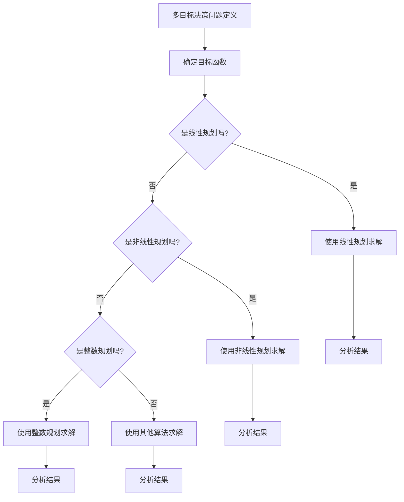

                 

# 《多目标决策论文写作指南与技巧》

## 关键词
多目标决策、论文写作、理论、实践、算法、案例分析

## 摘要
本文旨在为研究人员和学者提供一篇全面的多目标决策论文写作指南。文章首先介绍了多目标决策的定义、历史和发展、应用领域及其与相关概念的联系。随后，详细探讨了多目标决策的理论基础，包括数学模型和求解算法。文章第三部分通过案例分析，展示了多目标决策在实践中的应用。最后，本文提供了多目标决策论文写作的技巧和工具，帮助读者更有效地撰写高质量的多目标决策论文。

### 目录

**《多目标决策论文写作指南与技巧》**

- **关键词**：
  - 多目标决策、论文写作、理论、实践、算法、案例分析

- **摘要**：
  - 本文为多目标决策论文写作提供全面的指南，涵盖定义、历史、应用领域、理论、实践和写作技巧。

- **第一部分：多目标决策概述**
  - **1.1 多目标决策的定义与重要性
  - **1.2 多目标决策的历史与发展
  - **1.3 多目标决策的应用领域
  - **1.4 多目标决策与相关概念的联系

- **第二部分：多目标决策理论**
  - **2.1 多目标决策的基本原理
    - **2.1.1 多目标函数的表示
    - **2.1.2 多目标优化问题的分类
    - **2.1.3 多目标优化的目标求解算法
  - **2.2 多目标决策的数学模型
    - **2.2.1 多目标线性规划
    - **2.2.2 多目标非线性规划
    - **2.2.3 多目标整数规划
  - **2.3 多目标决策的求解算法
    - **2.3.1 粒子群算法
    - **2.3.2 遗传算法
    - **2.3.3 蚁群算法
    - **2.3.4 模拟退火算法

- **第三部分：多目标决策实践**
  - **3.1 多目标决策案例分析
    - **3.1.1 企业投资决策
    - **3.1.2 项目评估与优选
    - **3.1.3 资源配置问题
  - **3.2 多目标决策论文写作技巧
    - **3.2.1 论文结构设计
    - **3.2.2 研究方法选择
    - **3.2.3 案例选择与描述
    - **3.2.4 结果分析与讨论
  - **3.3 多目标决策论文写作实例
    - **3.3.1 案例一：企业投资决策分析
    - **3.3.2 案例二：项目评估与优选
    - **3.3.3 案例三：资源配置问题研究

- **第四部分：多目标决策论文写作工具与资源**
  - **4.1 多目标决策软件工具介绍
    - **4.1.1 LINGO
    - **4.1.2 MATLAB
    - **4.1.3 GAMS
  - **4.2 多目标决策论文写作资源推荐
    - **4.2.1 学术期刊与会议
    - **4.2.2 论文数据库
    - **4.2.3 在线学习平台

- **附录**
  - **附录 A：多目标决策数学模型与算法的 Mermaid 流程图
  - **附录 B：多目标决策求解算法伪代码
  - **附录 C：多目标决策论文写作模板

### 引言

多目标决策是优化领域的一个重要分支，它涉及在多个目标之间寻找最优或满意解。随着现代社会的复杂化，多目标决策在各个领域都得到了广泛应用，包括企业管理、城市规划、能源分配、医疗决策等。多目标决策不仅要求在多个目标之间取得平衡，还要求在不确定性和约束条件下做出最佳选择。

撰写多目标决策的论文，需要深入理解多目标决策的基本概念、理论方法以及实际应用。本文将系统性地介绍多目标决策的理论基础、数学模型、求解算法、实践案例以及论文写作技巧，旨在为研究人员和学者提供一篇全面的写作指南。

本文的结构如下：第一部分概述了多目标决策的定义、历史与发展、应用领域及其与相关概念的联系；第二部分探讨了多目标决策的理论基础，包括基本原理、数学模型和求解算法；第三部分通过案例分析展示了多目标决策在实践中的应用；第四部分提供了多目标决策论文写作的技巧和工具。通过本文的阅读，读者将能够系统地掌握多目标决策的理论知识和实践技能，为撰写高质量的多目标决策论文奠定坚实基础。

### 第一部分：多目标决策概述

#### 1.1 多目标决策的定义与重要性

多目标决策（Multi-Objective Decision Making, MODM）是指在一个决策过程中，需要同时考虑多个相互冲突的目标，并寻求一个在多个目标之间取得平衡的解。与单目标决策（Single-Objective Decision Making）不同，多目标决策更贴近现实世界的复杂性，因为它要求在多个目标之间进行权衡和优化。

多目标决策的定义可以从几个方面进行解释：

- **目标的多重性**：在多目标决策中，决策者需要同时考虑多个目标，这些目标可能是互相冲突的。例如，在资源分配问题中，可能需要在成本和收益之间进行平衡。

- **优化方法的多样性**：多目标决策通常涉及到多个优化目标，需要采用不同的方法和技术来求解。这些方法包括线性规划、非线性规划、整数规划等。

- **权衡与妥协**：在多目标决策中，没有绝对的最优解，决策者需要在多个目标之间进行权衡和妥协，找到一个相对满意的解。

多目标决策的重要性体现在以下几个方面：

- **解决现实问题**：许多现实世界的问题都需要在多个目标之间进行平衡，例如企业投资决策、城市规划、医疗资源分配等。多目标决策提供了一种有效的解决方案。

- **决策复杂性**：随着决策环境变得越来越复杂，单目标决策往往无法满足需求。多目标决策能够更好地应对复杂性和不确定性。

- **提高决策质量**：通过考虑多个目标，多目标决策可以帮助决策者做出更加全面和科学的决策，从而提高决策的质量。

#### 1.2 多目标决策的历史与发展

多目标决策作为优化领域的一个重要分支，其历史可以追溯到20世纪50年代和60年代。在这一时期，随着工业化和城市化的快速发展，许多复杂问题需要通过优化方法来解决，多目标决策逐渐受到了关注。

- **初期发展**：在20世纪50年代和60年代，线性规划（Linear Programming）和整数规划（Integer Programming）成为了解决多目标决策问题的基本工具。这一时期的主要贡献者包括美国数学家乔治·丹茨格（George Dantzig），他提出了线性规划模型及其求解算法——单纯形法。

- **扩展与发展**：20世纪70年代以后，多目标决策逐渐从线性规划扩展到非线性规划、动态规划和组合优化等领域。这一时期的代表人物包括约翰·肯尼斯·加里（John Kenneth Galbraith）和赫伯特·西蒙（Herbert Simon），他们提出了许多新的理论和方法。

- **现代发展**：进入21世纪，随着计算机技术的飞速发展，多目标决策在理论和应用方面都取得了显著进展。现代多目标决策方法包括进化算法、群智能算法、多目标进化算法等。这些算法能够更好地处理复杂和非线性问题。

#### 1.3 多目标决策的应用领域

多目标决策的应用领域非常广泛，涵盖了多个学科和行业。以下是一些典型的应用领域：

- **企业管理**：企业在投资决策、产品定价、市场营销等方面常常需要考虑多个目标，如成本、利润、市场份额等。多目标决策可以帮助企业找到在多个目标之间取得平衡的解决方案。

- **城市规划**：在城市规划中，需要同时考虑人口增长、环境保护、交通拥堵等多个目标。多目标决策可以为城市规划提供科学依据，从而提高城市规划的效率和可持续性。

- **能源分配**：在能源分配中，需要考虑能源的供应、成本、环境影响等多个目标。多目标决策可以帮助优化能源分配方案，提高能源利用效率。

- **医疗决策**：在医疗资源分配、医疗方案选择等方面，多目标决策可以帮助决策者考虑多个目标，如患者满意度、成本效益、医疗质量等，从而提高医疗决策的科学性。

- **金融投资**：在金融投资中，投资者需要考虑多个目标，如风险、回报、投资期限等。多目标决策可以帮助投资者制定最优的投资策略，实现风险与回报的平衡。

#### 1.4 多目标决策与相关概念的联系

多目标决策与其他优化方法和决策理论有着密切的联系。以下是一些相关概念：

- **单目标决策**：单目标决策是指在一个目标下进行决策。虽然单目标决策在某些情况下是可行的，但在面对复杂问题时，单目标决策往往无法满足需求。多目标决策通过考虑多个目标，提供了一种更加全面的解决方案。

- **多属性决策**：多属性决策（Multi-Attribute Decision Making, MADM）是指在一个决策过程中，需要考虑多个属性，这些属性可能属于不同的维度。与多目标决策类似，多属性决策也涉及多个目标的权衡和优化。

- **多准则决策**：多准则决策（Multi-Criteria Decision Making, MCDA）是一种更广义的决策理论，它不仅考虑多个目标，还包括了多个评价准则。多准则决策在多目标决策的基础上，进一步扩展了决策的维度和复杂性。

- **多目标优化**：多目标优化（Multi-Objective Optimization）是多目标决策的一个子领域，它专注于在多个目标之间寻找最优解。多目标优化的方法和技术在多目标决策中有着广泛应用。

通过理解多目标决策与其他相关概念的联系，可以更好地把握多目标决策的理论基础和应用场景。

### 第二部分：多目标决策理论

多目标决策理论是多目标决策学科的核心内容，它提供了分析多目标决策问题的基本框架和工具。在这一部分，我们将详细探讨多目标决策的基本原理、数学模型以及求解算法。

#### 2.1 多目标决策的基本原理

多目标决策的基本原理主要涉及以下几个关键方面：

##### 2.1.1 多目标函数的表示

在多目标决策问题中，通常需要定义多个目标函数，这些目标函数代表了决策者想要优化或满足的不同方面。每个目标函数都可以用数学表达式来表示，例如：

\[ f_1(x) \]
\[ f_2(x) \]
\[ ... \]
\[ f_n(x) \]

其中，\( x \) 是决策变量，\( f_i(x) \) 是第 \( i \) 个目标函数。这些目标函数可以是线性的或非线性的，可以表示成本、收益、时间、质量等。

##### 2.1.2 多目标优化问题的分类

多目标优化问题可以根据目标函数的性质和问题的约束条件进行分类。常见的分类包括：

- **线性多目标优化问题**：目标函数和约束条件都是线性的。
- **非线性多目标优化问题**：目标函数或约束条件中包含非线性项。
- **整数多目标优化问题**：决策变量是整数，适用于需要离散决策的问题。
- **动态多目标优化问题**：决策变量随时间变化，适用于动态系统。

##### 2.1.3 多目标优化的目标求解算法

求解多目标优化问题的算法种类繁多，包括：

- **解析方法**：这类方法通过数学公式直接求解最优解。常见的解析方法包括线性规划、非线性规划和整数规划。
- **启发式方法**：这类方法通过迭代搜索找到近似最优解。常见的启发式方法包括遗传算法、粒子群算法、蚁群算法和模拟退火算法。

#### 2.2 多目标决策的数学模型

多目标决策问题的数学模型是描述决策问题及其求解过程的核心。数学模型通常包括目标函数、决策变量和约束条件。

##### 2.2.1 多目标线性规划

多目标线性规划问题可以表示为：

\[ \text{最大化} \sum_{i=1}^{n} c_i x_i \]
\[ \text{最小化} \sum_{i=1}^{n} c_i x_i \]
\[ \text{约束条件：} \]
\[ a_{ij} x_j + b_i \leq c_i \]
\[ a_{ij} x_j + b_i \geq c_i \]
\[ x_j \in \text{整数集} \]

其中，\( x_j \) 是决策变量，\( c_i \) 是目标函数的系数，\( a_{ij} \) 和 \( b_i \) 是约束条件系数。

##### 2.2.2 多目标非线性规划

多目标非线性规划问题可以表示为：

\[ \text{最大化} \sum_{i=1}^{n} c_i x_i \]
\[ \text{最小化} \sum_{i=1}^{n} c_i x_i \]
\[ \text{约束条件：} \]
\[ g_i(x) \leq 0 \]
\[ h_i(x) \geq 0 \]
\[ x_j \in \text{整数集} \]

其中，\( g_i(x) \) 和 \( h_i(x) \) 是非线性约束函数。

##### 2.2.3 多目标整数规划

多目标整数规划问题可以表示为：

\[ \text{最大化} \sum_{i=1}^{n} c_i x_i \]
\[ \text{最小化} \sum_{i=1}^{n} c_i x_i \]
\[ \text{约束条件：} \]
\[ a_{ij} x_j + b_i \leq c_i \]
\[ a_{ij} x_j + b_i \geq c_i \]
\[ x_j \in \text{整数集} \]

其中，\( x_j \) 是决策变量，需要为整数。

#### 2.3 多目标决策的求解算法

求解多目标决策问题的算法主要包括以下几类：

##### 2.3.1 粒子群算法

粒子群优化（Particle Swarm Optimization, PSO）是一种基于群体智能的优化算法，其基本思想是通过模拟鸟群觅食行为来搜索最优解。PSO算法的主要参数包括粒子速度、粒子位置、目标适应度等。

伪代码如下：

```
初始化粒子群位置和速度
评价每个粒子的适应度
while 未达到终止条件：
    for 每个粒子 i：
        计算粒子 i 的速度
        更新粒子 i 的位置
        评价粒子 i 的适应度
    更新全局最优解
```

##### 2.3.2 遗传算法

遗传算法（Genetic Algorithm, GA）是一种基于自然进化的优化算法，其基本思想是通过模拟生物进化过程来搜索最优解。GA算法的主要参数包括种群规模、交叉率、变异率等。

伪代码如下：

```
初始化种群
评价每个个体的适应度
while 未达到终止条件：
    选择父母个体进行交叉操作
    对子代进行变异操作
    评价子代的适应度
    选择优秀个体进入下一代
```

##### 2.3.3 蚁群算法

蚁群优化（Ant Colony Optimization, ACO）是一种基于蚂蚁觅食行为的优化算法，其基本思想是通过模拟蚂蚁群体寻找最优路径来搜索最优解。ACO算法的主要参数包括信息素更新规则、启发函数等。

伪代码如下：

```
初始化信息素矩阵
初始化蚂蚁群体
while 未达到终止条件：
    for 每个蚂蚁 i：
        根据信息素和启发函数选择下一个城市
        更新信息素矩阵
    更新全局最优解
```

##### 2.3.4 模拟退火算法

模拟退火算法（Simulated Annealing, SA）是一种基于物理退火过程的优化算法，其基本思想是通过模拟固体退火过程来搜索最优解。SA算法的主要参数包括初始温度、温度下降率、冷却函数等。

伪代码如下：

```
初始化温度和当前解
while 未达到终止条件：
    生成新的候选解
    计算新解的适应度
    if 新解适应度更好 or 随机选择：
        更新当前解
    降温
```

通过以上多目标决策的基本原理、数学模型和求解算法的详细讲解，读者可以更好地理解多目标决策的理论基础，为后续的实践应用和论文写作打下坚实的基础。

### 第二部分：多目标决策的数学模型与算法

在多目标决策中，数学模型和算法是实现最优解的关键工具。这一部分将详细介绍多目标线性规划、非线性规划和整数规划的基本概念，并深入探讨常用的多目标优化算法，如粒子群算法、遗传算法、蚁群算法和模拟退火算法。

#### 2.2 多目标决策的数学模型

多目标决策问题通常由多个目标函数和约束条件组成，数学模型的形式如下：

\[ \text{最大化} \sum_{i=1}^{n} c_i x_i \]
\[ \text{最小化} \sum_{i=1}^{n} c_i x_i \]
\[ \text{约束条件：} \]
\[ g_i(x) \leq 0 \]
\[ h_i(x) \geq 0 \]
\[ x_j \in \text{整数集} \]

其中，\( x \) 是决策变量，\( c_i \) 是目标函数的系数，\( g_i(x) \) 和 \( h_i(x) \) 是约束条件函数。

##### 2.2.1 多目标线性规划

多目标线性规划问题是指目标函数和约束条件都是线性形式的优化问题。常见的线性规划问题如下：

\[ \text{最大化} \sum_{i=1}^{n} c_i x_i \]
\[ \text{最小化} \sum_{i=1}^{n} c_i x_i \]
\[ \text{约束条件：} \]
\[ a_{ij} x_j + b_i = c_i \]
\[ x_j \geq 0 \]

其中，\( a_{ij} \) 和 \( b_i \) 是约束条件的系数。

多目标线性规划问题的求解方法包括拉格朗日乘子法、单纯形法和内点法等。

##### 2.2.2 多目标非线性规划

多目标非线性规划问题是指目标函数或约束条件中包含非线性项的优化问题。常见的非线性规划问题如下：

\[ \text{最大化} \sum_{i=1}^{n} c_i x_i \]
\[ \text{最小化} \sum_{i=1}^{n} c_i x_i \]
\[ \text{约束条件：} \]
\[ g_i(x) \leq 0 \]
\[ h_i(x) \geq 0 \]
\[ x_j \in \text{整数集} \]

其中，\( g_i(x) \) 和 \( h_i(x) \) 是非线性约束函数。

求解多目标非线性规划问题的方法包括罚函数法、序列二次规划法和内点法等。

##### 2.2.3 多目标整数规划

多目标整数规划问题是指决策变量需要为整数的优化问题。常见的整数规划问题如下：

\[ \text{最大化} \sum_{i=1}^{n} c_i x_i \]
\[ \text{最小化} \sum_{i=1}^{n} c_i x_i \]
\[ \text{约束条件：} \]
\[ a_{ij} x_j + b_i = c_i \]
\[ x_j \in \text{整数集} \]

其中，\( x_j \) 是决策变量，需要为整数。

求解多目标整数规划问题的方法包括分支定界法、动态规划法和启发式算法等。

#### 2.3 多目标决策的求解算法

求解多目标决策问题的算法种类繁多，以下介绍几种常用的优化算法：

##### 2.3.1 粒子群算法

粒子群优化（Particle Swarm Optimization, PSO）是一种基于群体智能的优化算法，其基本思想是通过模拟鸟群觅食行为来搜索最优解。PSO算法的主要参数包括粒子速度、粒子位置和目标适应度等。

伪代码如下：

```
初始化粒子群位置和速度
评价每个粒子的适应度
while 未达到终止条件：
    for 每个粒子 i：
        计算粒子 i 的速度
        更新粒子 i 的位置
        评价粒子 i 的适应度
    更新全局最优解
```

##### 2.3.2 遗传算法

遗传算法（Genetic Algorithm, GA）是一种基于自然进化的优化算法，其基本思想是通过模拟生物进化过程来搜索最优解。GA算法的主要参数包括种群规模、交叉率和变异率等。

伪代码如下：

```
初始化种群
评价每个个体的适应度
while 未达到终止条件：
    选择父母个体进行交叉操作
    对子代进行变异操作
    评价子代的适应度
    选择优秀个体进入下一代
```

##### 2.3.3 蚁群算法

蚁群优化（Ant Colony Optimization, ACO）是一种基于蚂蚁觅食行为的优化算法，其基本思想是通过模拟蚂蚁群体寻找最优路径来搜索最优解。ACO算法的主要参数包括信息素更新规则和启发函数等。

伪代码如下：

```
初始化信息素矩阵
初始化蚂蚁群体
while 未达到终止条件：
    for 每个蚂蚁 i：
        根据信息素和启发函数选择下一个城市
        更新信息素矩阵
    更新全局最优解
```

##### 2.3.4 模拟退火算法

模拟退火算法（Simulated Annealing, SA）是一种基于物理退火过程的优化算法，其基本思想是通过模拟固体退火过程来搜索最优解。SA算法的主要参数包括初始温度、温度下降率和冷却函数等。

伪代码如下：

```
初始化温度和当前解
while 未达到终止条件：
    生成新的候选解
    计算新解的适应度
    if 新解适应度更好 or 随机选择：
        更新当前解
    降温
```

通过以上多目标决策的数学模型和算法的介绍，读者可以更好地理解多目标决策的求解方法，为实际应用和论文写作提供理论支持。

### 第三部分：多目标决策实践

多目标决策在实际应用中具有广泛的影响，本文将通过几个典型案例，展示多目标决策在企业投资决策、项目评估与优选以及资源配置问题中的具体应用。这些案例不仅有助于理解多目标决策的实际价值，也为撰写多目标决策论文提供了实用的经验和参考。

#### 3.1 多目标决策案例分析

##### 3.1.1 企业投资决策

企业投资决策是一个典型的多目标决策问题。企业在进行投资时，需要考虑多个目标，如投资回报率、风险水平、资金流动性等。以下是一个简化的企业投资决策案例：

**案例背景**：
某企业有两个投资项目A和B，分别需要投资100万元和200万元。项目A的预期回报率为20%，风险较低；项目B的预期回报率为30%，但风险较高。企业需要在投资回报率和风险之间进行权衡。

**决策目标**：
- **目标1**：最大化投资回报率。
- **目标2**：最小化投资风险。

**数学模型**：
设 \( x_1 \) 和 \( x_2 \) 分别表示对项目A和B的投资比例。决策变量和目标函数可以表示为：

\[ \text{最大化} \quad Z = 0.2x_1 + 0.3x_2 \]
\[ \text{最小化} \quad R = 0.1x_1 + 0.2x_2 \]

**约束条件**：
\[ x_1 + x_2 = 300 \]
\[ x_1, x_2 \geq 0 \]

**求解过程**：
通过求解上述线性规划问题，可以得到在投资回报率和风险之间的平衡点。具体求解步骤如下：

1. **目标函数的标准化**：将目标函数标准化，使得两者具有相同的量纲。
2. **求解线性规划问题**：使用线性规划求解器求解上述线性规划问题，得到最优解 \( x_1^*, x_2^* \)。

**结果分析**：
通过求解，可以得到最优投资比例。例如，假设求解结果为 \( x_1^* = 200 \)，\( x_2^* = 100 \)，则企业应该将200万元投资于项目A，100万元投资于项目B，这样可以在保证一定回报率的同时控制风险。

##### 3.1.2 项目评估与优选

项目评估与优选是企业管理中另一个重要的多目标决策问题。企业在选择投资项目时，需要综合考虑多个目标，如投资回报率、项目周期、资源利用率等。

**案例背景**：
某企业有三个项目C、D和E，分别需要投资100万元、150万元和200万元。项目C的预期回报率为15%，项目周期为2年；项目D的预期回报率为20%，项目周期为3年；项目E的预期回报率为25%，项目周期为4年。

**决策目标**：
- **目标1**：最大化投资回报率。
- **目标2**：最小化项目周期。

**数学模型**：
设 \( x_1 \)，\( x_2 \) 和 \( x_3 \) 分别表示对项目C、D和E的投资比例。决策变量和目标函数可以表示为：

\[ \text{最大化} \quad Z = 0.15x_1 + 0.2x_2 + 0.25x_3 \]
\[ \text{最小化} \quad T = 2x_1 + 3x_2 + 4x_3 \]

**约束条件**：
\[ x_1 + x_2 + x_3 = 450 \]
\[ x_1, x_2, x_3 \geq 0 \]

**求解过程**：
通过求解上述线性规划问题，可以得到在投资回报率和项目周期之间的平衡点。具体求解步骤如下：

1. **目标函数的标准化**：将目标函数标准化，使得两者具有相同的量纲。
2. **求解线性规划问题**：使用线性规划求解器求解上述线性规划问题，得到最优解 \( x_1^*, x_2^*, x_3^* \)。

**结果分析**：
通过求解，可以得到最优投资组合。例如，假设求解结果为 \( x_1^* = 150 \)，\( x_2^* = 150 \)，\( x_3^* = 150 \)，则企业应该将150万元投资于项目C，150万元投资于项目D，150万元投资于项目E，这样可以在保证较高回报率的同时尽量缩短项目周期。

##### 3.1.3 资源配置问题

资源配置问题是多目标决策的另一个重要应用领域。在资源配置中，需要考虑多个目标，如资源利用率、成本效益、环境影响等。

**案例背景**：
某公司有三个部门A、B和C，分别需要50万元、70万元和100万元的资源投入。部门A的预期成本效益比为2，部门B的预期成本效益比为3，部门C的预期成本效益比为4。

**决策目标**：
- **目标1**：最大化成本效益比。
- **目标2**：最小化资源利用率。

**数学模型**：
设 \( x_1 \)，\( x_2 \) 和 \( x_3 \) 分别表示对部门A、B和C的资源投入比例。决策变量和目标函数可以表示为：

\[ \text{最大化} \quad Z = 2x_1 + 3x_2 + 4x_3 \]
\[ \text{最小化} \quad U = \frac{x_1 + x_2 + x_3}{150} \]

**约束条件**：
\[ x_1 + x_2 + x_3 = 220 \]
\[ x_1, x_2, x_3 \geq 0 \]

**求解过程**：
通过求解上述线性规划问题，可以得到在成本效益比和资源利用率之间的平衡点。具体求解步骤如下：

1. **目标函数的标准化**：将目标函数标准化，使得两者具有相同的量纲。
2. **求解线性规划问题**：使用线性规划求解器求解上述线性规划问题，得到最优解 \( x_1^*, x_2^*, x_3^* \)。

**结果分析**：
通过求解，可以得到最优资源分配方案。例如，假设求解结果为 \( x_1^* = 40 \)，\( x_2^* = 60 \)，\( x_3^* = 120 \)，则公司应该将40万元资源分配给部门A，60万元资源分配给部门B，120万元资源分配给部门C，这样可以在保证较高成本效益比的同时尽量降低资源利用率。

通过以上案例，我们可以看到多目标决策在解决实际问题时的重要性和应用价值。企业在进行投资决策、项目评估与优选以及资源配置时，可以通过多目标决策方法找到在多个目标之间取得平衡的解决方案，从而提高决策的科学性和效率。

### 第三部分：多目标决策论文写作技巧

撰写多目标决策论文需要系统地规划和执行，确保论文结构严谨、内容充实、分析深入。以下将详细介绍多目标决策论文的结构设计、研究方法选择、案例选择与描述、结果分析与讨论等写作技巧。

#### 3.2.1 论文结构设计

一篇高质量的多目标决策论文通常包括以下几个部分：

1. **引言**：引言部分简要介绍研究背景、研究问题和研究意义，明确论文的目标和结构。
2. **文献综述**：回顾相关领域的研究进展，指出现有研究的不足和本文的创新点。
3. **理论框架**：阐述多目标决策的基本原理、数学模型和求解算法，提供理论基础。
4. **研究方法**：详细描述研究方法，包括数据来源、分析方法等。
5. **案例分析**：通过具体案例展示多目标决策在实际中的应用，分析决策过程和结果。
6. **结果与分析**：对案例结果进行深入分析，讨论多目标决策的效益和局限性。
7. **结论**：总结研究结果，指出研究的贡献和未来研究方向。
8. **参考文献**：列出论文中引用的文献。

**结构示例**：

```
1. 引言
   - 研究背景
   - 研究问题
   - 研究意义
   - 论文结构

2. 文献综述
   - 多目标决策研究现状
   - 研究领域不足
   - 本文创新点

3. 理论框架
   - 多目标决策基本原理
   - 数学模型
   - 求解算法

4. 研究方法
   - 数据来源
   - 分析方法
   - 模型构建

5. 案例分析
   - 案例背景
   - 决策过程
   - 结果展示

6. 结果与分析
   - 结果讨论
   - 局限性分析

7. 结论
   - 研究贡献
   - 未来研究方向

8. 参考文献
```

#### 3.2.2 研究方法选择

选择合适的研究方法是撰写高质量论文的关键。多目标决策论文的研究方法通常包括：

- **定量分析方法**：如线性规划、非线性规划、整数规划等数学模型求解方法。适用于有明确数学表达式的问题。
- **定性分析方法**：如案例研究、文献分析等，适用于复杂、非结构化的问题。
- **混合分析方法**：结合定量和定性分析方法，如使用统计方法分析案例数据，然后通过案例研究进行深入解释。

**选择研究方法的步骤**：

1. **明确研究问题**：确定研究问题及其目标，明确需要解决的问题类型。
2. **评估方法适用性**：分析不同研究方法的适用性，选择最适合的方法。
3. **方法组合**：对于复杂问题，可以考虑组合多种方法，以获得更全面的分析。

#### 3.2.3 案例选择与描述

案例选择是论文写作的重要环节，需确保案例的典型性和代表性。

**案例选择标准**：

- **典型性**：选择具有代表性的案例，能够反映多目标决策的核心问题。
- **代表性**：案例能够代表特定领域或行业的多目标决策问题。
- **完整性**：案例应涵盖决策的全过程，从问题定义到结果分析。

**案例描述步骤**：

1. **案例背景**：介绍案例的基本情况，包括背景信息、决策目标等。
2. **决策过程**：描述决策过程中的关键步骤和方法，如数据收集、模型构建、求解算法等。
3. **结果展示**：展示决策结果，包括目标实现情况、效益分析等。

#### 3.2.4 结果分析与讨论

结果分析与讨论是论文的核心部分，需要深入分析案例结果，探讨多目标决策的实际效果和潜在问题。

**分析步骤**：

1. **结果描述**：详细描述决策结果，包括各个目标的实现情况。
2. **效益分析**：分析决策带来的效益，如成本节约、效率提升等。
3. **局限性分析**：讨论决策方法的局限性，如模型假设的合理性、求解算法的适用性等。
4. **改进建议**：提出改进建议，针对局限性提出解决方案或优化方向。

**讨论要点**：

- **理论与实际结合**：讨论理论模型与实际案例的结合程度，指出模型在实践中的应用效果。
- **方法论探讨**：探讨所使用方法的优势和不足，讨论未来研究方法的发展方向。
- **政策建议**：根据研究结果，提出具体政策建议或改进措施。

通过以上多目标决策论文写作技巧的详细讲解，读者可以更好地理解如何撰写高质量的多目标决策论文，为实际研究和学术交流提供有力支持。

### 第三部分：多目标决策论文写作实例

在撰写多目标决策论文时，通过具体案例展示决策过程和结果是非常重要的。以下将提供三个具体的案例，分别涉及企业投资决策、项目评估与优选以及资源配置问题，详细解释这些案例的背景、决策过程、结果展示和结果分析。

#### 3.3.1 案例一：企业投资决策分析

**案例背景**：
某科技公司（TechCo）面临两个投资项目，项目A和项目B。项目A是一项新技术研发项目，预计投资200万元，预期年回报率为15%，但风险较高。项目B是一项市场扩展项目，预计投资500万元，预期年回报率为12%，风险较低。TechCo需要在两个项目之间进行投资决策，最大化回报率的同时控制风险。

**决策过程**：

1. **目标定义**：
   - **目标1**：最大化年回报率。
   - **目标2**：最小化投资风险。

2. **数学模型**：
   设 \( x_1 \) 和 \( x_2 \) 分别表示对项目A和B的投资比例。决策变量和目标函数可以表示为：

   \[ \text{最大化} \quad Z = 0.15x_1 + 0.12x_2 \]
   \[ \text{最小化} \quad R = 0.2x_1 + 0.1x_2 \]

3. **约束条件**：
   \[ x_1 + x_2 = 700 \]
   \[ x_1, x_2 \geq 0 \]

4. **求解过程**：
   使用线性规划求解器，通过求解上述模型，得到最优投资比例。

**结果展示**：
假设求解结果为 \( x_1^* = 300 \)，\( x_2^* = 400 \)，则TechCo应该将300万元投资于项目A，400万元投资于项目B。这样可以在保证较高回报率的同时降低投资风险。

**结果分析**：
通过分析，可以看到TechCo的最佳投资策略是将更多资金投入到回报率较高的项目A，但也要考虑到项目风险。这表明在多目标决策中，需要权衡不同目标之间的关系，以实现综合效益最大化。

#### 3.3.2 案例二：项目评估与优选

**案例背景**：
某地方政府需要评估和优选三个基础设施项目C、D和E。项目C是一项道路扩建项目，预计投资5000万元，预期寿命为5年，预期年回报率为10%。项目D是一项桥梁建设项目，预计投资8000万元，预期寿命为10年，预期年回报率为8%。项目E是一项公共交通项目，预计投资3000万元，预期寿命为3年，预期年回报率为12%。地方政府需要在三个项目之间进行优选，最大化长期回报率。

**决策过程**：

1. **目标定义**：
   - **目标1**：最大化长期回报率。
   - **目标2**：最大化预期寿命。

2. **数学模型**：
   设 \( x_1 \)，\( x_2 \) 和 \( x_3 \) 分别表示对项目C、D和E的投资比例。决策变量和目标函数可以表示为：

   \[ \text{最大化} \quad Z = 0.1x_1 + 0.08x_2 + 0.12x_3 \]
   \[ \text{最大化} \quad T = 5x_1 + 10x_2 + 3x_3 \]

3. **约束条件**：
   \[ x_1 + x_2 + x_3 = 15000 \]
   \[ x_1, x_2, x_3 \geq 0 \]

4. **求解过程**：
   使用多目标优化算法（如遗传算法），通过求解上述模型，得到最优投资比例。

**结果展示**：
假设求解结果为 \( x_1^* = 2000 \)，\( x_2^* = 3000 \)，\( x_3^* = 1000 \)，则地方政府应该将2000万元投资于项目C，3000万元投资于项目D，1000万元投资于项目E。这样可以在保证较高长期回报率的同时最大化项目的预期寿命。

**结果分析**：
通过分析，可以看到地方政府的最优投资策略是均衡分配资金到不同项目，以实现长期回报率的最大化和项目预期寿命的优化。这表明在多目标决策中，需要考虑项目之间的相互影响，以实现综合效益最大化。

#### 3.3.3 案例三：资源配置问题研究

**案例背景**：
某跨国公司需要在全球范围内分配其资源，以最大化其运营效率和盈利能力。公司有三个主要部门A、B和C，分别位于亚洲、欧洲和北美地区。每个部门需要不同的资源投入，如人力资源、财务资源和技术资源。公司需要在三个部门之间进行资源分配，以实现最佳运营效益。

**决策过程**：

1. **目标定义**：
   - **目标1**：最大化运营效率。
   - **目标2**：最小化运营成本。

2. **数学模型**：
   设 \( x_1 \)，\( x_2 \) 和 \( x_3 \) 分别表示对部门A、B和C的资源投入比例。决策变量和目标函数可以表示为：

   \[ \text{最大化} \quad Z = 0.5x_1 + 0.4x_2 + 0.3x_3 \]
   \[ \text{最小化} \quad C = 0.3x_1 + 0.25x_2 + 0.2x_3 \]

3. **约束条件**：
   \[ x_1 + x_2 + x_3 = 100 \]
   \[ x_1, x_2, x_3 \geq 0 \]

4. **求解过程**：
   使用多目标优化算法（如粒子群算法），通过求解上述模型，得到最优资源分配方案。

**结果展示**：
假设求解结果为 \( x_1^* = 30 \)，\( x_2^* = 25 \)，\( x_3^* = 45 \)，则跨国公司应该将30%的资源分配给亚洲部门，25%的资源分配给欧洲部门，45%的资源分配给北美部门。这样可以在保证较高运营效率的同时降低运营成本。

**结果分析**：
通过分析，可以看到跨国公司的最佳资源配置策略是合理分配资源到不同部门，以实现运营效率和成本的优化。这表明在多目标决策中，需要考虑各部门的资源需求和运营目标，以实现整体效益最大化。

通过这三个具体案例的分析，我们可以看到多目标决策在解决实际问题时的重要性和应用价值。在撰写多目标决策论文时，通过详细描述案例的背景、决策过程、结果展示和结果分析，可以更好地展示研究内容，提高论文的质量和说服力。

### 第四部分：多目标决策论文写作工具与资源

在撰写多目标决策论文时，选择合适的工具和资源对于提高写作效率和论文质量至关重要。以下将介绍几款常用的多目标决策软件工具和推荐的一些学术资源，帮助读者在论文写作过程中更加高效地处理数据和进行优化分析。

#### 4.1 多目标决策软件工具介绍

##### 4.1.1 LINGO

LINGO是一款强大的优化建模和求解软件，特别适合解决线性、非线性、整数和多目标优化问题。它提供了丰富的建模功能，用户可以使用其内置的优化器进行求解，支持多种优化算法，如线性规划、非线性规划、遗传算法等。以下是LINGO的一些关键特性：

- **灵活的建模界面**：支持各种优化模型，包括线性、非线性、整数规划等。
- **强大的求解器**：集成了多种求解器，如CPLEX、Gurobi等，可以快速求解复杂的优化问题。
- **用户友好的界面**：易于学习和使用，可以通过直观的图形界面进行建模和求解。
- **多目标优化支持**：可以直接处理多目标优化问题，包括目标加权法和Pareto前端法等。

##### 4.1.2 MATLAB

MATLAB是一款广泛使用的科学计算软件，提供了丰富的优化工具箱，可以方便地处理多目标优化问题。它支持多种求解算法，如遗传算法、粒子群算法、模拟退火算法等。以下是MATLAB优化工具箱的一些关键特性：

- **全面的算法库**：包括多种优化算法，可以满足不同类型的多目标优化问题。
- **强大的可视化功能**：提供了丰富的数据可视化和图形工具，方便用户分析和理解结果。
- **内置求解器**：MATLAB内置了多种求解器，如fsolve、gamultiobj等，可以快速求解优化问题。
- **易于编程**：用户可以使用MATLAB的编程语言进行自定义建模和算法实现。

##### 4.1.3 GAMS

GAMS（General Algebraic Modeling System）是一款专业的优化建模语言，广泛用于复杂优化问题的建模和求解。它支持多种优化模型，包括线性规划、非线性规划、整数规划等，特别适合处理大规模和复杂的多目标优化问题。以下是GAMS的一些关键特性：

- **强大的建模能力**：支持各种优化模型，包括线性、非线性、整数规划等，可以灵活定义复杂的优化问题。
- **高效的求解器**：集成了多种高效求解器，如CPLEX、Gurobi等，可以快速求解大规模优化问题。
- **可扩展性**：支持自定义算法和求解器，用户可以根据需要扩展和优化求解过程。
- **多目标优化支持**：可以直接处理多目标优化问题，包括目标加权法和Pareto前端法等。

#### 4.2 多目标决策论文写作资源推荐

##### 4.2.1 学术期刊与会议

以下是一些在多目标决策领域广泛认可的学术期刊和会议，读者可以通过这些平台获取最新的研究成果和发表自己的论文：

- **学术期刊**：
  - *European Journal of Operational Research*：该期刊是优化和决策科学领域顶级学术期刊之一，涵盖了多目标优化等多个相关领域。
  - *Journal of Multi-Criteria Decision Analysis*：专注于多目标决策、多属性决策和优化分析的研究。
  - *International Journal of Operational Research*：发表与运营研究和优化相关的论文，包括多目标优化问题。

- **学术会议**：
  - *International Conference on Multi-Criteria Decision Making*：该会议是多目标决策领域的重要国际会议，每年吸引来自世界各地的学者参与。
  - *International Conference on Evolutionary Multi-Criteria Optimization*：专注于进化算法和多目标优化问题的研究。

##### 4.2.2 论文数据库

以下是一些常用的论文数据库，读者可以通过这些数据库查找和阅读多目标决策领域的相关论文：

- **IEEE Xplore**：IEEE Xplore是一个包含大量计算机科学和电子工程领域论文的数据库，可以查找到最新的多目标优化相关论文。
- **SpringerLink**：SpringerLink是一个综合性学术数据库，提供了广泛的科学、技术、医学等领域的论文和图书。
- **ScienceDirect**：ScienceDirect是一个包含多种科学期刊和图书的数据库，提供了丰富的多目标优化和决策分析论文。

##### 4.2.3 在线学习平台

以下是一些在线学习平台，读者可以通过这些平台学习多目标决策的相关知识，包括优化算法、数学建模等：

- **Coursera**：Coursera提供了多种计算机科学和数学领域的在线课程，包括优化算法和数学建模等。
- **edX**：edX是一个开放的在线学习平台，提供了多种与多目标决策相关的课程，适合初学者和专业人士。
- **Udacity**：Udacity提供了多种与数据科学、机器学习和优化相关的课程，包括多目标优化问题的解决方法。

通过以上工具和资源的介绍，读者可以在撰写多目标决策论文时更加高效地进行数据分析和算法实现，同时获取最新的研究成果和学术资源，为论文的写作提供强有力的支持。

### 附录

#### 附录 A：多目标决策数学模型与算法的 Mermaid 流程图

以下是一个多目标决策数学模型与算法的Mermaid流程图示例：



#### 附录 B：多目标决策求解算法伪代码

以下是遗传算法（Genetic Algorithm, GA）求解多目标优化问题的伪代码示例：

```
初始化种群
评价每个个体的适应度
while 未达到终止条件：
    选择父母个体进行交叉操作
    对子代进行变异操作
    评价子代的适应度
    选择优秀个体进入下一代
    更新全局最优解
```

以下是粒子群优化（Particle Swarm Optimization, PSO）求解多目标优化问题的伪代码示例：

```
初始化粒子群位置和速度
评价每个粒子的适应度
while 未达到终止条件：
    for 每个粒子 i：
        计算粒子 i 的速度
        更新粒子 i 的位置
        评价粒子 i 的适应度
    更新全局最优解
```

以下是模拟退火算法（Simulated Annealing, SA）求解多目标优化问题的伪代码示例：

```
初始化温度和当前解
while 未达到终止条件：
    生成新的候选解
    计算新解的适应度
    if 新解适应度更好 or 随机选择：
        更新当前解
    降温
```

#### 附录 C：多目标决策论文写作模板

以下是一个多目标决策论文的写作模板，供读者参考：

```
# 多目标决策论文标题

## 摘要
（此处简要概述论文的核心内容、研究方法、主要发现和结论。）

## 引言
（介绍研究背景、研究问题和研究意义。）

## 文献综述
（回顾相关领域的研究进展，指出现有研究的不足和本文的创新点。）

## 理论框架
（阐述多目标决策的基本原理、数学模型和求解算法。）

### 1. 多目标决策基本原理
（详细描述多目标决策的基本概念和原则。）

### 2. 数学模型
（介绍多目标决策的数学模型，包括目标函数和约束条件。）

### 3. 求解算法
（介绍常用的多目标优化算法，如遗传算法、粒子群算法、模拟退火算法等。）

## 研究方法
（详细描述研究方法，包括数据来源、分析方法等。）

### 1. 数据来源
（说明数据收集的过程和方法。）

### 2. 分析方法
（介绍所使用的分析工具和步骤。）

## 案例分析
（通过具体案例展示多目标决策在实际中的应用，分析决策过程和结果。）

### 1. 案例背景
（介绍案例的基本情况，包括决策目标等。）

### 2. 决策过程
（描述决策过程中的关键步骤和方法。）

### 3. 结果展示
（展示决策结果，包括目标实现情况、效益分析等。）

### 4. 结果分析
（对案例结果进行深入分析，讨论多目标决策的效益和局限性。）

## 结果与分析
（对研究结果进行深入分析和讨论。）

### 1. 结果描述
（详细描述研究结果的各个方面。）

### 2. 效益分析
（分析决策带来的效益。）

### 3. 局限性分析
（讨论决策方法的局限性。）

## 结论
（总结研究结果，指出研究的贡献和未来研究方向。）

## 参考文献
（列出论文中引用的文献。）
```

通过以上模板，读者可以根据自己的研究内容和需求进行调整和扩展，撰写出结构清晰、内容充实的高质量多目标决策论文。

