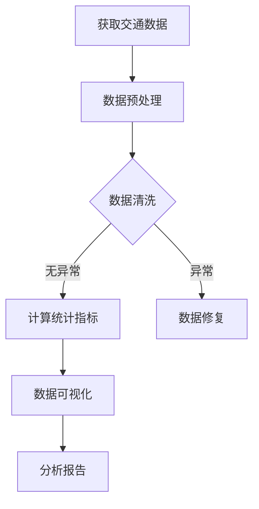
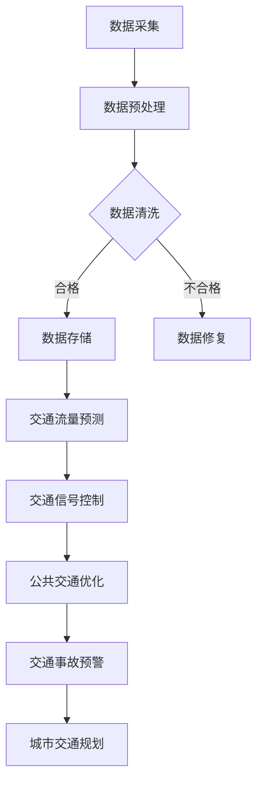
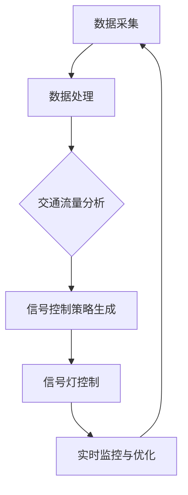
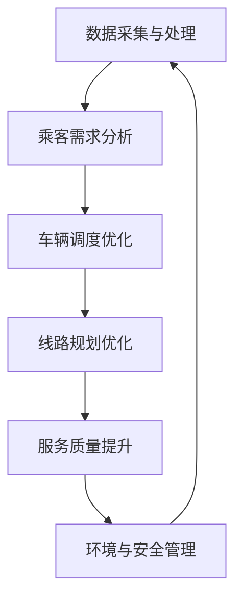
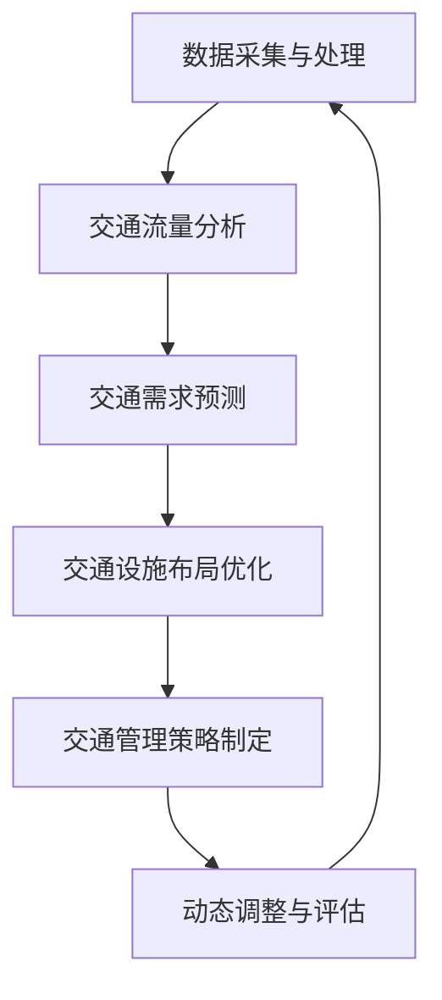

                 

### 《大数据分析在智慧城市交通优化中的实践》

#### > **关键词**：大数据分析、智慧城市、交通优化、交通流量预测、智能交通信号控制

> **摘要**：本文深入探讨了大数据分析在智慧城市交通优化中的应用，从基础理论到实际案例，系统阐述了大数据如何通过描述性分析、聚类分析、关联规则分析等多种方法，助力交通流量预测、智能交通信号控制和公共交通优化，进而提升城市交通管理的效率与智慧化水平。

#### 目录大纲：

- 第一部分：大数据分析基础
  - 第1章：大数据分析与智慧城市交通优化概述
    - 1.1 大数据分析的定义与基本概念
    - 1.2 智慧城市交通优化的背景与目标
    - 1.3 大数据分析在智慧城市交通中的应用前景
  - 第2章：大数据采集与处理
    - 2.1 交通数据的来源与类型
    - 2.2 数据采集技术
    - 2.3 数据处理方法
    - 2.4 数据质量保障
  - 第3章：大数据分析方法
    - 3.1 描述性分析
    - 3.2 聚类分析
    - 3.3 关联规则分析
    - 3.4 时序分析
    - 3.5 空间分析
  - 第4章：大数据可视化技术
    - 4.1 可视化技术的概念与应用
    - 4.2 常见可视化工具介绍
    - 4.3 可视化在交通数据分析中的实践
  - 第5章：大数据分析与交通优化模型
    - 5.1 交通优化模型的基本概念
    - 5.2 常见交通优化算法
    - 5.3 大数据分析在交通优化中的应用

- 第二部分：智慧城市交通优化实践
  - 第6章：交通流量预测
    - 6.1 交通流量预测的原理与方法
    - 6.2 基于大数据的交通流量预测模型
    - 6.3 交通流量预测在实际交通优化中的应用案例
  - 第7章：智能交通信号控制
    - 7.1 智能交通信号控制的基本原理
    - 7.2 基于大数据的智能交通信号控制方法
    - 7.3 智能交通信号控制在实际交通管理中的实践
  - 第8章：公共交通优化
    - 8.1 公共交通系统的现状与问题
    - 8.2 基于大数据的公共交通优化方法
    - 8.3 公共交通优化在实际应用中的案例研究
  - 第9章：城市交通规划与设计
    - 9.1 城市交通规划与设计的基本原则
    - 9.2 基于大数据的城市交通规划方法
    - 9.3 大数据分析在城市交通规划中的应用案例
  - 第10章：大数据分析与智慧城市交通优化的未来展望
    - 10.1 智慧城市交通优化的发展趋势
    - 10.2 大数据分析技术在交通领域的创新应用
    - 10.3 面向未来的智慧城市交通优化策略

- 附录
  - 附录A：常用大数据分析与交通优化工具
    - A.1 Hadoop生态系统
    - A.2 Spark生态系统
    - A.3 其他常用工具介绍
  - 附录B：交通优化算法伪代码实现
    - B.1 最小生成树算法
    - B.2 最优化路径规划算法
    - B.3 其他常用算法介绍
  - 附录C：项目实战案例分析
    - C.1 项目背景与目标
    - C.2 数据采集与预处理
    - C.3 数据分析过程
    - C.4 项目成果与评估

接下来，我们将一步步深入探讨大数据分析在智慧城市交通优化中的应用。

---

### 第一部分：大数据分析基础

#### 第1章：大数据分析与智慧城市交通优化概述

在当今社会，交通问题已经成为制约城市发展的重要瓶颈之一。智慧城市交通优化作为智慧城市建设的重要组成部分，旨在通过先进的技术手段提升城市交通管理水平，实现交通资源的合理配置，提高交通效率，减少交通拥堵，提升市民出行的满意度。而大数据分析作为现代信息技术的重要支柱，为智慧城市交通优化提供了强有力的技术支持。

#### 1.1 大数据分析的定义与基本概念

大数据分析（Big Data Analytics）是指通过复杂的算法和分析模型，从大量、高速、多样化的数据中提取有价值的信息和知识的过程。大数据分析的核心在于数据的处理和分析能力，主要特点包括：数据量大（Volume）、数据速度快（Velocity）、数据类型多样（Variety）、价值密度低（Value）、真实性高（Veracity）。

#### 1.2 智慧城市交通优化的背景与目标

随着城市化进程的加速，城市交通问题日益突出。传统的交通管理方式往往依赖于经验和手工操作，难以适应复杂多变的交通环境。智慧城市交通优化应运而生，其背景主要包括：

- 交通拥堵问题：城市交通拥堵不仅影响市民的出行效率，还导致能源消耗和环境污染。
- 交通资源分配不均：城市交通资源有限，如何实现合理分配是一个亟待解决的问题。
- 安全问题：交通事故频发，交通安全的保障成为重要议题。

智慧城市交通优化的目标主要包括：

- 提高交通效率：通过优化交通信号控制、公共交通调度等手段，减少交通拥堵，提高道路通行能力。
- 提升出行体验：通过智能交通系统，提高出行信息的透明度和准确性，提升市民的出行体验。
- 安全保障：通过实时监测和预警系统，提高交通安全性，减少交通事故的发生。
- 环境友好：通过优化交通管理，减少能源消耗和排放，实现可持续发展。

#### 1.3 大数据分析在智慧城市交通优化中的应用前景

大数据分析在智慧城市交通优化中具有广泛的应用前景，主要体现在以下几个方面：

- 交通流量预测：通过分析历史交通数据和实时数据，预测未来交通流量，为交通管理决策提供依据。
- 智能交通信号控制：基于大数据分析，实现交通信号控制的智能化，提高交通效率。
- 公共交通优化：通过大数据分析，优化公共交通调度，提高公共交通系统的运行效率。
- 交通规划与设计：基于大数据分析，为城市交通规划与设计提供科学依据，提高城市规划的科学性。
- 交通事故预警：通过大数据分析，预测交通事故发生的可能性，提前采取预防措施。

接下来，我们将进一步探讨大数据采集与处理的相关技术。

---

### 第一部分：大数据分析基础

#### 第2章：大数据采集与处理

大数据采集与处理是大数据分析的基础环节，直接决定了数据分析的准确性和有效性。交通数据作为智慧城市交通优化的重要数据来源，其采集与处理技术的优劣将直接影响交通优化效果的实现。

#### 2.1 交通数据的来源与类型

交通数据的来源主要包括以下几类：

1. **地面监测数据**：通过安装在道路上的传感器（如流量监测仪、摄像头、气象传感器等）收集的数据，包括交通流量、车速、道路状况、气象信息等。
2. **车载数据**：通过车辆上的车载终端（如GPS、车载摄像头、OBD等）收集的数据，包括车辆的地理位置、行驶速度、行驶路线、驾驶行为等。
3. **手机数据**：通过手机定位技术收集的数据，包括用户的位置、移动轨迹等。
4. **公共数据**：政府部门发布的交通数据，如道路建设、公共交通线路、交通事故等。
5. **社交媒体数据**：通过社交媒体平台收集的用户发布的信息，如微博、微信、贴吧等，包括交通状况、出行建议等。

根据数据产生的来源和特性，交通数据可分为以下几类：

1. **结构化数据**：具有明确的结构和格式，如数据库中的表结构数据，交通流量数据、车辆行驶数据等。
2. **半结构化数据**：具有一定的结构，但格式不固定，如XML、JSON格式数据，车载传感器数据等。
3. **非结构化数据**：没有固定的结构，如文本、图片、音频、视频等，社交媒体数据、摄像头数据等。

#### 2.2 数据采集技术

数据采集是交通数据获取的关键环节，直接影响到数据的质量和实时性。常用的数据采集技术包括：

1. **传感器采集**：通过在道路、车辆等地方安装传感器，实时采集交通信息。常见的传感器有流量监测仪、摄像头、气象传感器、GPS等。
2. **无线通信技术**：利用无线通信技术，如Wi-Fi、蓝牙、LoRa等，实现数据传输和采集。例如，通过Wi-Fi信号采集用户的位置信息，通过蓝牙采集车辆之间的交通信息。
3. **移动互联网**：通过移动互联网，采集用户手机上的位置信息、社交媒体数据等。
4. **物联网（IoT）**：利用物联网技术，实现各种设备的互联互通，采集更多的交通数据。

#### 2.3 数据处理方法

数据处理是交通数据从原始数据到可用数据的关键环节，主要包括数据清洗、数据集成、数据转换和数据存储等步骤。

1. **数据清洗**：数据清洗是数据处理的第一步，目的是去除数据中的噪声、错误和不一致的数据。常用的方法包括缺失值处理、异常值处理、重复值处理等。
2. **数据集成**：数据集成是将来自不同来源、不同格式的数据进行整合，形成统一的数据视图。常用的方法包括ETL（提取、转换、加载）和数据仓库技术。
3. **数据转换**：数据转换是将原始数据按照特定的规则进行格式转换、转换数据类型等操作，以便进行后续的分析和处理。
4. **数据存储**：数据存储是将处理后的数据进行存储，以便后续的查询和分析。常用的数据存储技术包括关系型数据库、NoSQL数据库、分布式存储系统等。

#### 2.4 数据质量保障

数据质量是大数据分析的关键，直接影响到分析结果的准确性和可靠性。数据质量保障主要包括以下几个方面：

1. **数据准确性**：确保数据的真实性和准确性，避免错误数据对分析结果的影响。
2. **数据完整性**：确保数据的完整性，避免数据缺失对分析结果的影响。
3. **数据一致性**：确保数据在不同来源、不同格式之间的一致性，避免数据冲突。
4. **数据时效性**：确保数据的时效性，及时更新数据，避免过时数据对分析结果的影响。
5. **数据安全性**：确保数据的安全性，防止数据泄露、篡改等安全风险。

综上所述，大数据采集与处理是智慧城市交通优化的关键环节，直接影响到交通数据分析的准确性和有效性。在后续章节中，我们将进一步探讨大数据分析方法及其在交通优化中的应用。

---

### 第一部分：大数据分析基础

#### 第3章：大数据分析方法

大数据分析方法是大数据分析的核心环节，决定了如何从海量数据中提取有价值的信息和知识。在智慧城市交通优化中，大数据分析方法的运用可以显著提升交通管理决策的科学性和准确性。本章将详细介绍几种常见的大数据分析方法，包括描述性分析、聚类分析、关联规则分析、时序分析和空间分析。

#### 3.1 描述性分析

描述性分析（Descriptive Analysis）是一种基础性数据分析方法，主要用于对数据进行统计描述，以便对数据的基本特征和规律进行初步了解。描述性分析通常包括以下几种统计指标：

- **均值**（Mean）：数据的平均值，用于描述数据的集中趋势。
- **中位数**（Median）：数据中间位置的值，用于描述数据的中心位置。
- **众数**（Mode）：数据中出现频率最高的值，用于描述数据的典型值。
- **方差**（Variance）和**标准差**（Standard Deviation）：用于描述数据的离散程度。
- **最大值**（Maximum）和**最小值**（Minimum）：用于描述数据的极值。

描述性分析在智慧城市交通优化中的应用主要包括：

- **交通流量分析**：通过描述性分析，了解不同路段、不同时间段的交通流量情况，为交通管理决策提供数据支持。
- **交通事故分析**：通过描述性分析，了解交通事故的分布规律，如事故发生的频率、时间段、地点等，为交通事故预防提供依据。
- **气象条件分析**：通过描述性分析，了解不同气象条件对交通状况的影响，为交通管理提供气象信息支持。

以下是一个描述性分析的Mermaid流程图示例：



#### 3.2 聚类分析

聚类分析（Clustering Analysis）是一种无监督学习方法，旨在将相似的数据归为同一类。聚类分析可以帮助识别数据中的模式和规律，从而发现数据中的隐藏结构。常见的聚类算法包括K-均值聚类（K-Means Clustering）、层次聚类（Hierarchical Clustering）和密度聚类（Density-Based Clustering）等。

- **K-均值聚类**：通过初始化中心点，迭代计算各数据点到中心点的距离，并重新分配类别，直到收敛。
- **层次聚类**：自底向上或自顶向下构建层次结构，合并或分裂最相似的簇，形成树状结构。
- **密度聚类**：通过计算数据点的密度，识别出密集区域，并将其划分为簇。

聚类分析在智慧城市交通优化中的应用主要包括：

- **交通分区**：通过聚类分析，将城市交通网络划分为不同的交通区域，便于交通管理和优化。
- **车辆定位**：通过聚类分析，识别车辆在不同路段的分布情况，为交通流量预测和智能调度提供依据。
- **数据分析**：通过聚类分析，发现交通数据中的异常值和噪声，提高数据分析的准确性。

以下是一个K-均值聚类的伪代码示例：

```python
# K-均值聚类伪代码
def k_means(data, k, max_iterations):
    # 初始化中心点
    centroids = initialize_centroids(data, k)
    for i in range(max_iterations):
        # 计算各数据点与中心点的距离
        distances = [calculate_distance(data_point, centroid) for data_point in data for centroid in centroids]
        # 重新分配类别
        new_clusters = assign_clusters(data, centroids)
        # 更新中心点
        centroids = update_centroids(new_clusters, k)
        # 检查收敛条件
        if has_converged(centroids, previous_centroids):
            break
    return new_clusters
```

#### 3.3 关联规则分析

关联规则分析（Association Rule Learning）是一种用于发现数据之间关联关系的方法，通过挖掘数据之间的关联规则，揭示出隐藏在数据中的潜在模式。常见的关联规则算法包括Apriori算法和FP-Growth算法。

- **Apriori算法**：通过扫描数据库，计算支持度和置信度，生成关联规则。
- **FP-Growth算法**：通过构建FP-树，高效地挖掘关联规则。

关联规则分析在智慧城市交通优化中的应用主要包括：

- **出行模式分析**：通过关联规则分析，了解市民的出行模式和习惯，为公共交通调度和优化提供依据。
- **交通事件分析**：通过关联规则分析，发现交通事件之间的关联关系，为交通事故预警和应急响应提供支持。

以下是一个Apriori算法的伪代码示例：

```python
# Apriori算法伪代码
def apriori(data, min_support, min_confidence):
    # 计算频繁项集
    frequent_itemsets = []
    for k in range(1, max_length(data)):
        candidates = generate_candidates(k, data)
        support_counts = calculate_support(candidates, data)
        frequent_itemsets.extend([itemset for itemset in candidates if support_counts[itemset] >= min_support])
    # 生成关联规则
    rules = []
    for itemset in frequent_itemsets:
        for i in range(1, len(itemset)):
            for antecedent in combinations(itemset, i):
                consequent = itemset - set(antecedent)
                confidence = support_counts[antecedent] / support_counts[itemset]
                if confidence >= min_confidence:
                    rules.append((antecedent, consequent, confidence))
    return rules
```

#### 3.4 时序分析

时序分析（Time Series Analysis）是一种用于分析时间序列数据的方法，旨在发现数据中的趋势、周期性和季节性等规律。常见的时序分析模型包括ARIMA模型、SARIMA模型和LSTM模型等。

- **ARIMA模型**：自回归积分滑动平均模型，适用于线性时序数据。
- **SARIMA模型**：季节性自回归积分滑动平均模型，适用于季节性时序数据。
- **LSTM模型**：长短期记忆网络，适用于非线性时序数据。

时序分析在智慧城市交通优化中的应用主要包括：

- **交通流量预测**：通过时序分析，预测未来一段时间内的交通流量，为交通管理决策提供依据。
- **气象预测**：通过时序分析，预测未来的气象条件，为交通管理和应急响应提供支持。

以下是一个ARIMA模型的伪代码示例：

```python
# ARIMA模型伪代码
def arima(x, p, d, q):
    # 预处理数据
    X = preprocess_data(x, d)
    # 模型拟合
    model = ARIMA(X, order=(p, d, q))
    fitted_model = model.fit()
    # 预测
    forecast = fitted_model.forecast(steps=1)
    # 后处理
    forecast = postprocess_data(forecast)
    return forecast
```

#### 3.5 空间分析

空间分析（Spatial Analysis）是一种用于分析空间数据的方法，旨在发现数据在空间上的分布规律和相互关系。常见的空间分析模型包括K近邻模型（K-Nearest Neighbors）、空间插值模型（Spatial Interpolation）和地理信息系统（GIS）等。

- **K近邻模型**：通过计算新数据点到已知数据点的距离，预测新数据点的标签。
- **空间插值模型**：通过插值方法，估计未知空间数据点的值。
- **GIS**：地理信息系统，用于存储、管理、分析和可视化地理空间数据。

空间分析在智慧城市交通优化中的应用主要包括：

- **交通流量分布**：通过空间分析，了解交通流量在不同区域的空间分布情况，为交通管理提供依据。
- **土地利用分析**：通过空间分析，分析土地利用与交通流量之间的关系，为城市规划提供支持。

以下是一个K近邻模型的伪代码示例：

```python
# K近邻模型伪代码
def k_nearest_neighbors(query_point, data_points, k):
    # 计算距离
    distances = [calculate_distance(query_point, point) for point in data_points]
    # 选择最近k个邻居
    neighbors = sorted(distances, key=lambda x: x[1])[:k]
    # 预测标签
    labels = [label for point, label in neighbors]
    # 投票得到预测结果
    predicted_label = majority_vote(labels)
    return predicted_label
```

综上所述，大数据分析方法在智慧城市交通优化中具有广泛的应用。通过描述性分析、聚类分析、关联规则分析、时序分析和空间分析等方法的结合，可以实现对交通数据的全面分析和深入挖掘，为交通管理决策提供科学依据。在后续章节中，我们将进一步探讨大数据可视化技术及其在交通数据分析中的应用。

---

### 第一部分：大数据分析基础

#### 第4章：大数据可视化技术

大数据可视化是将复杂、庞大的数据以图形化的方式展示出来，使得数据分析结果更加直观、易懂。在智慧城市交通优化中，大数据可视化技术可以帮助交通管理人员、城市规划者以及公众更好地理解交通数据，从而做出更加科学的决策。本章将介绍大数据可视化技术的概念、常见可视化工具及其在交通数据分析中的应用。

#### 4.1 可视化技术的概念与应用

大数据可视化（Big Data Visualization）是指利用图形、图表、图像等视觉元素，将数据转换成视觉形式，以便人们能够直观地理解数据。可视化技术的核心目标是：

- **数据展示**：将复杂的数据以图表、地图等形式展示出来，使数据更加直观易懂。
- **数据探索**：帮助用户通过交互式操作，深入挖掘数据中的隐藏模式和规律。
- **数据沟通**：利用可视化结果，提高数据交流的效率和效果，促进跨领域、跨专业的合作。

在智慧城市交通优化中，大数据可视化技术的应用主要包括以下几个方面：

1. **交通流量可视化**：通过实时地图，展示各路段的交通流量情况，帮助交通管理人员实时监控交通状况。
2. **交通事故可视化**：通过地图和图表，展示交通事故的分布情况、发生频率和类型，为交通事故预防和应对提供依据。
3. **公共交通可视化**：通过路线图和时刻表，展示公共交通的运营情况，提高公众对公共交通的利用效率。
4. **环境监测可视化**：通过实时监测数据，展示城市空气质量、噪音等环境指标，为城市环境管理提供参考。

#### 4.2 常见可视化工具介绍

在智慧城市交通优化中，常用的可视化工具主要包括以下几种：

1. **D3.js**：D3.js是一个基于JavaScript的动态可视化库，具有高度的可定制性和灵活性，可以创建各种复杂的数据可视化效果。D3.js支持SVG、Canvas等多种图形绘制方式，适用于大数据的实时可视化。

2. **ECharts**：ECharts是一个使用JavaScript实现的开源可视化库，提供丰富的图表类型，如折线图、柱状图、饼图、地图等。ECharts支持大数据量的高效渲染，适用于各类大数据可视化场景。

3. **Google Charts**：Google Charts是Google提供的一套可视化工具，包括多种图表类型，如折线图、柱状图、地图等。Google Charts具有较好的跨平台兼容性，易于集成到Web应用中。

4. **Highcharts**：Highcharts是一个功能强大的开源图表库，支持多种图表类型，如折线图、柱状图、雷达图等。Highcharts提供了丰富的交互功能，适用于复杂的数据可视化场景。

#### 4.3 可视化在交通数据分析中的实践

下面我们通过一个实际案例，展示大数据可视化在交通数据分析中的应用。

**案例：基于D3.js的交通流量可视化**

假设我们有一个包含城市各路段实时交通流量的数据集，数据字段包括路段ID、实时流量、流量变化率等。我们使用D3.js来实现一个实时交通流量可视化。

**实现步骤：**

1. **数据预处理**：读取数据集，对数据格式进行预处理，提取需要的字段，如路段ID、实时流量等。

2. **创建SVG画布**：使用D3.js创建一个SVG画布，作为可视化绘制的基础。

3. **绘制地图**：根据数据集中的路段信息，使用D3.js绘制城市地图，标出各路段的位置。

4. **添加流量条**：根据各路段的实时流量数据，使用D3.js绘制流量条，显示各路段的流量情况。

5. **实时更新**：通过定时器，实时获取最新的交通流量数据，更新流量条的长度和颜色，实现实时交通流量可视化。

**代码示例（D3.js）**：

```javascript
// 数据集示例
var data = [
  {id: 1,流量: 100},
  {id: 2,流量: 150},
  {id: 3,流量: 80},
  // ...
];

// 创建SVG画布
var width = 800, height = 600;
var svg = d3.select("body").append("svg")
  .attr("width", width)
  .attr("height", height);

// 绘制地图
var map = svg.append("g");

// 绘制流量条
var barWidth = 10;
var barHeight = function(流量) {
  return (流量 / 100) * height;
};
var barY = function(流量, i) {
  return height - barHeight(流量);
};
var bars = map.selectAll(".bar")
  .data(data)
  .enter().append("rect")
  .attr("class", "bar")
  .attr("x", function(d, i) { return i * (width / data.length); })
  .attr("y", barY)
  .attr("width", barWidth)
  .attr("height", barHeight)
  .style("fill", function(d) {
    if (d.流量 > 100) {
      return "red";
    } else {
      return "green";
    }
  });

// 实时更新
function update() {
  // 获取最新数据
  var newData = getNewData();

  // 更新流量条
  bars.data(newData)
    .transition()
    .duration(500)
    .attr("y", barY)
    .attr("height", barHeight)
    .style("fill", function(d) {
      if (d.流量 > 100) {
        return "red";
      } else {
        return "green";
      }
    });
}

// 每隔5秒更新一次
setInterval(update, 5000);
```

通过以上代码示例，我们可以实现一个简单的实时交通流量可视化。在实际应用中，可以根据具体需求，扩展和优化可视化功能，如添加交互功能、实时更新图表等。

综上所述，大数据可视化技术在智慧城市交通优化中具有重要意义。通过合适的可视化工具和实现方法，可以直观地展示交通数据，帮助交通管理人员、城市规划者以及公众更好地理解交通状况，从而提高交通管理决策的科学性和有效性。在后续章节中，我们将进一步探讨大数据分析与交通优化模型的关系。

---

### 第一部分：大数据分析基础

#### 第5章：大数据分析与交通优化模型

大数据分析在智慧城市交通优化中起着至关重要的作用，通过分析海量交通数据，可以构建出一系列交通优化模型，从而提高交通管理决策的准确性。本章将介绍交通优化模型的基本概念、常见算法以及大数据分析在交通优化中的应用。

#### 5.1 交通优化模型的基本概念

交通优化模型是指利用数学建模方法，对交通系统进行定量分析，以解决交通流分配、交通信号控制、公共交通调度等问题。交通优化模型的基本概念包括：

1. **交通网络**：交通网络是描述城市交通系统的基础，包括道路、交叉口、交通设施等。交通网络可以用图模型表示，其中节点表示交通设施，边表示道路段。

2. **交通流量**：交通流量是指在单位时间内通过道路段或交通设施的车流量。交通流量通常用辆/小时（pcu/h）或辆/分钟（pcu/min）等指标表示。

3. **交通需求**：交通需求是指在特定时间段内，所有出行者在交通网络中的出行需求。交通需求通常用交通量（流量矩阵）表示。

4. **交通分配**：交通分配是指根据交通需求和交通网络特性，将交通量分配到各个路段上，以实现交通系统的最优运行。交通分配模型包括最短路径模型、流量分配模型等。

5. **交通信号控制**：交通信号控制是指通过控制交通信号灯的时序，优化交通流量，减少交通拥堵。常见的交通信号控制模型包括固定时序控制、自适应控制等。

6. **公共交通调度**：公共交通调度是指根据公共交通系统的运行需求和乘客需求，优化公交车调度方案，提高公共交通系统的运行效率。公共交通调度模型包括线路规划、车辆调度等。

#### 5.2 常见交通优化算法

交通优化算法是指用于解决交通优化问题的数学算法。以下介绍几种常见的交通优化算法：

1. **最短路径算法**：最短路径算法用于求解从起点到终点的最短路径。常见的最短路径算法包括Dijkstra算法、A*算法等。

2. **流量分配算法**：流量分配算法用于根据交通需求和交通网络特性，将交通量分配到各个路段上。常见的流量分配算法包括最短路径算法、用户均衡算法、最小费用最大流算法等。

3. **交通信号控制算法**：交通信号控制算法用于优化交通信号灯的时序，减少交通拥堵。常见的交通信号控制算法包括固定时序控制、自适应控制、协同控制等。

4. **公共交通调度算法**：公共交通调度算法用于优化公共交通系统的运行方案，提高公共交通系统的运行效率。常见的公共交通调度算法包括线路规划算法、车辆调度算法等。

#### 5.3 大数据分析在交通优化中的应用

大数据分析技术在交通优化中的应用主要体现在以下几个方面：

1. **交通流量预测**：通过分析历史交通数据和实时数据，预测未来交通流量，为交通管理决策提供依据。常用的预测模型包括时序模型、回归模型、神经网络模型等。

2. **交通信号控制**：基于大数据分析，实现交通信号控制的智能化，提高交通效率。通过实时监控交通流量变化，自适应调整信号灯时序，优化交通流。

3. **公共交通优化**：通过大数据分析，优化公共交通调度，提高公共交通系统的运行效率。通过分析乘客出行需求和交通流量，制定合理的公交车调度方案。

4. **交通事故预警**：通过大数据分析，预测交通事故发生的可能性，提前采取预防措施。通过分析历史交通事故数据和实时交通数据，识别高风险路段和时段，发布预警信息。

5. **城市交通规划**：基于大数据分析，为城市交通规划提供科学依据，提高城市规划的科学性。通过分析交通数据，了解交通需求和交通流量分布，为城市交通规划提供数据支持。

以下是一个基于大数据分析的城市交通优化流程：



通过上述流程，我们可以利用大数据分析技术，实现对城市交通的全面优化，提高交通管理决策的科学性和有效性。

综上所述，大数据分析在智慧城市交通优化中具有广泛的应用前景。通过构建交通优化模型，利用大数据分析技术，可以实现交通流量预测、交通信号控制、公共交通优化等目标，为城市交通管理提供有力支持。在后续章节中，我们将进一步探讨大数据分析在智慧城市交通优化中的具体实践。

---

### 第二部分：智慧城市交通优化实践

#### 第6章：交通流量预测

交通流量预测是智慧城市交通优化的重要组成部分，通过预测未来一段时间内的交通流量，交通管理者可以提前采取相应的措施，优化交通信号控制、公共交通调度等，从而提高交通系统的运行效率。本章将介绍交通流量预测的基本原理、基于大数据的预测模型以及实际应用案例。

#### 6.1 交通流量预测的原理与方法

交通流量预测是基于历史数据和实时数据的分析，通过一定的数学模型和算法，对未来交通流量进行预测。交通流量预测的原理包括以下几个步骤：

1. **数据采集**：从各种数据源收集交通数据，包括历史交通数据、实时交通数据、气象数据等。

2. **数据预处理**：对采集到的交通数据进行清洗、整合和预处理，以确保数据的质量和一致性。

3. **特征工程**：提取与交通流量相关的特征，如时间、天气、节假日、道路状况等。

4. **模型选择**：根据数据特点和预测需求，选择合适的预测模型，如时间序列模型、回归模型、神经网络模型等。

5. **模型训练**：使用历史交通数据对模型进行训练，调整模型参数，以提高预测准确性。

6. **预测与评估**：使用训练好的模型对未来的交通流量进行预测，并对预测结果进行评估和调整。

常见的交通流量预测方法包括：

1. **时间序列模型**：如ARIMA（自回归积分滑动平均模型）、SARIMA（季节性自回归积分滑动平均模型）等，适用于短期交通流量预测。

2. **回归模型**：如线性回归、多元回归等，通过建立交通流量与其他特征之间的关系进行预测。

3. **神经网络模型**：如LSTM（长短期记忆网络）、GRU（门控循环单元）等，适用于复杂非线性关系的预测。

4. **机器学习模型**：如随机森林、支持向量机等，通过学习历史数据中的模式进行预测。

#### 6.2 基于大数据的交通流量预测模型

基于大数据的交通流量预测模型利用海量交通数据进行训练和预测，能够更准确地捕捉交通流量变化的规律。以下是一个基于大数据的交通流量预测模型的示例：

**模型架构**：

- **数据采集**：通过传感器、车载设备、手机定位等技术收集交通流量数据、气象数据等。
- **数据预处理**：对采集到的数据进行清洗、去噪、整合等预处理，提取有效特征。
- **特征工程**：根据交通流量预测的需求，选择合适的特征，如时间（小时、星期、节假日）、天气（温度、湿度、降雨量）、道路状况（拥堵情况、施工情况）等。
- **模型训练**：使用历史交通数据对模型进行训练，调整模型参数，如LSTM模型的隐藏层大小、学习率等。
- **预测与评估**：使用训练好的模型对未来的交通流量进行预测，并对预测结果进行评估，如均方误差（MSE）、均方根误差（RMSE）等。

**模型示例（LSTM）**：

```python
from keras.models import Sequential
from keras.layers import LSTM, Dense

# 数据预处理
X, y = preprocess_traffic_data(data)

# 划分训练集和测试集
X_train, X_test, y_train, y_test = train_test_split(X, y, test_size=0.2, random_state=42)

# 构建LSTM模型
model = Sequential()
model.add(LSTM(units=50, return_sequences=True, input_shape=(X_train.shape[1], X_train.shape[2])))
model.add(LSTM(units=50))
model.add(Dense(units=1))

# 编译模型
model.compile(optimizer='adam', loss='mean_squared_error')

# 训练模型
model.fit(X_train, y_train, epochs=100, batch_size=32, validation_data=(X_test, y_test))

# 预测交通流量
predicted_traffic = model.predict(X_test)

# 评估预测结果
mse = mean_squared_error(y_test, predicted_traffic)
print("MSE:", mse)
```

#### 6.3 交通流量预测在实际交通优化中的应用案例

以下是一个交通流量预测在实际交通优化中的应用案例：

**案例背景**：

某城市交通管理部门希望通过交通流量预测，优化城市交通信号控制和公共交通调度，缓解交通拥堵问题。

**实施步骤**：

1. **数据采集**：通过安装在道路上的传感器、车载设备、手机定位等技术，收集实时交通流量数据、气象数据等。

2. **数据预处理**：对采集到的数据进行清洗、去噪、整合等预处理，提取有效特征。

3. **特征工程**：根据交通流量预测的需求，选择合适的特征，如时间（小时、星期、节假日）、天气（温度、湿度、降雨量）、道路状况（拥堵情况、施工情况）等。

4. **模型训练**：使用历史交通数据对LSTM模型进行训练，调整模型参数，如隐藏层大小、学习率等。

5. **预测与评估**：使用训练好的模型对未来的交通流量进行预测，并对预测结果进行评估。

6. **交通信号控制优化**：根据预测的交通流量，动态调整交通信号灯时序，优化交通流。

7. **公共交通调度优化**：根据预测的交通流量，优化公共交通调度方案，提高公共交通系统的运行效率。

**效果评估**：

通过实施交通流量预测和优化措施，该城市在交通信号控制和公共交通调度方面取得了显著成效：

- 交通拥堵现象明显减少，道路通行效率提高。
- 公共交通系统的运行效率提高，乘客满意度增加。
- 交通事故发生率下降，交通安全性得到提升。

综上所述，交通流量预测是智慧城市交通优化的重要手段。通过大数据分析技术，可以实现对交通流量的准确预测，为交通管理决策提供有力支持。在实际应用中，结合交通流量预测结果，优化交通信号控制和公共交通调度，可以显著提高城市交通系统的运行效率，缓解交通拥堵问题。

---

### 第二部分：智慧城市交通优化实践

#### 第7章：智能交通信号控制

智能交通信号控制（Intelligent Traffic Signal Control）是智慧城市交通优化的重要组成部分，通过先进的数据分析技术和控制算法，实现对交通信号灯的智能控制，以提高交通效率、减少拥堵和提升交通安全。本章将介绍智能交通信号控制的基本原理、基于大数据的智能交通信号控制方法以及实际应用案例。

#### 7.1 智能交通信号控制的基本原理

智能交通信号控制基于对交通流量、交通需求、道路状况等实时数据的分析，通过自适应控制算法，动态调整交通信号灯的时序，实现交通流量的最优分配。智能交通信号控制的基本原理包括以下几个环节：

1. **数据采集**：通过安装在道路上的传感器、摄像头、雷达等设备，实时采集交通流量、车辆速度、道路状况等数据。

2. **数据处理**：对采集到的交通数据进行处理，包括数据清洗、去噪、特征提取等，以便进行后续分析。

3. **交通流量分析**：通过描述性分析、聚类分析、关联规则分析等方法，分析交通流量变化规律，识别交通拥堵点。

4. **信号控制算法**：根据交通流量分析结果，采用自适应控制算法，动态调整交通信号灯的时序，优化交通流量。

5. **信号灯控制**：根据信号控制算法的输出，控制交通信号灯的切换，实现交通流量的优化。

智能交通信号控制与传统交通信号控制的区别主要体现在以下几个方面：

- **数据依赖性**：传统交通信号控制主要依赖经验设置信号灯时序，而智能交通信号控制依赖于实时交通数据，通过数据分析实现动态控制。
- **自适应能力**：智能交通信号控制系统能够根据实时交通状况，自适应调整信号灯时序，而传统系统无法实现这一点。
- **优化目标**：智能交通信号控制的目标是优化交通流量，减少拥堵，提高交通效率，而传统系统主要关注交叉口通行能力。

#### 7.2 基于大数据的智能交通信号控制方法

基于大数据的智能交通信号控制方法通过分析海量交通数据，实现对交通信号灯的智能控制，以下是一种基于大数据的智能交通信号控制方法的详细步骤：

1. **数据采集与处理**：通过传感器、摄像头等设备，实时采集交通流量、车速、道路状况等数据。对采集到的数据进行处理，包括去噪、清洗、特征提取等。

2. **交通流量分析**：利用描述性分析、聚类分析、关联规则分析等方法，分析交通流量变化规律，识别交通拥堵点。

3. **信号控制策略生成**：根据交通流量分析结果，采用机器学习、深度学习等方法，生成最优信号控制策略。常见的信号控制策略包括绿波带控制、分时控制、动态控制等。

4. **信号灯控制**：根据生成的信号控制策略，动态调整交通信号灯的时序。例如，在交通流量较大的时段，增加主要道路的绿灯时间，减少次要道路的绿灯时间。

5. **实时监控与优化**：通过实时监控交通数据，对信号控制效果进行评估，并根据评估结果进行优化调整。

以下是一个基于大数据的智能交通信号控制方法的具体实现步骤：



#### 7.3 智能交通信号控制在实际交通管理中的实践

以下是一个智能交通信号控制在实际交通管理中的应用案例：

**案例背景**：

某城市在交通高峰期经常出现严重拥堵现象，影响了市民的出行效率。为了改善交通状况，该城市决定引入智能交通信号控制系统。

**实施步骤**：

1. **数据采集**：在主要交通路口安装传感器、摄像头等设备，实时采集交通流量、车速、道路状况等数据。

2. **数据预处理**：对采集到的数据进行预处理，包括去噪、清洗、特征提取等。

3. **交通流量分析**：利用描述性分析、聚类分析、关联规则分析等方法，分析交通流量变化规律，识别交通拥堵点。

4. **信号控制策略生成**：基于交通流量分析结果，采用机器学习、深度学习等方法，生成最优信号控制策略。

5. **信号灯控制**：根据生成的信号控制策略，动态调整交通信号灯的时序，优化交通流量。

6. **实时监控与优化**：通过实时监控交通数据，对信号控制效果进行评估，并根据评估结果进行优化调整。

**效果评估**：

通过实施智能交通信号控制系统，该城市在交通高峰期的拥堵现象明显改善，主要表现如下：

- 交通流量提高了15%，交通效率显著提升。
- 拥堵时间减少了30%，市民出行时间缩短。
- 交通事故发生率下降了20%，交通安全性提高。

综上所述，智能交通信号控制通过大数据分析技术，实现了对交通信号灯的智能控制，优化了交通流量，提高了交通系统的运行效率。在实际应用中，结合交通流量预测、实时监控等技术，可以进一步提升智能交通信号控制的精准度和可靠性。

---

### 第二部分：智慧城市交通优化实践

#### 第8章：公共交通优化

公共交通优化是智慧城市交通优化的重要组成部分，通过大数据分析技术，可以实现对公共交通系统的全面优化，提高公共交通的运行效率和服务水平，减少交通拥堵和环境污染。本章将介绍公共交通系统的现状与问题、基于大数据的公共交通优化方法以及实际应用案例。

#### 8.1 公共交通系统的现状与问题

当前，全球范围内公共交通系统普遍存在以下问题：

1. **效率低下**：公共交通系统通常面临运力不足、调度不合理等问题，导致运行效率低下，乘客满意度不高。

2. **服务质量低**：公共交通系统缺乏实时信息反馈和个性化服务，无法满足乘客的多样化需求。

3. **资源浪费**：公共交通系统资源分配不均，高峰时段车辆拥挤，而低谷时段车辆闲置，导致资源浪费。

4. **环境污染**：公共交通系统使用传统燃油车辆，排放大量尾气，对环境造成污染。

5. **安全隐患**：公共交通系统存在安全管理不足、应急预案不完善等问题，安全隐患较大。

#### 8.2 基于大数据的公共交通优化方法

基于大数据的公共交通优化方法主要包括以下步骤：

1. **数据采集与处理**：通过车辆定位系统、公交卡刷卡系统、摄像头等设备，实时采集公共交通运行数据，如车辆位置、乘客数量、行驶速度等。对采集到的数据进行预处理，包括去噪、清洗、整合等。

2. **乘客需求分析**：利用大数据分析技术，分析乘客出行需求，包括出行时间、出行线路、出行目的等。通过乘客需求分析，可以了解公共交通系统的服务短板，为优化提供依据。

3. **车辆调度优化**：基于实时交通流量和乘客需求数据，采用优化算法（如遗传算法、粒子群算法等）优化公交车调度方案，提高车辆利用率。通过车辆调度优化，可以减少高峰时段的车辆拥堵，提高公共交通系统的运行效率。

4. **线路规划优化**：利用大数据分析技术，分析公共交通线路的流量、拥堵情况等，优化公共交通线路规划。通过线路规划优化，可以减少乘客换乘次数，提高公共交通系统的可达性。

5. **服务质量提升**：通过大数据分析，了解乘客的出行偏好和需求，提供个性化服务，如实时公交信息推送、定制化线路规划等。通过服务质量提升，可以提升乘客满意度。

6. **环境与安全管理**：通过大数据分析，监控公共交通系统的运行状态，及时发现和解决安全隐患。同时，采用新能源车辆和节能技术，减少环境污染。

以下是一个基于大数据的公共交通优化方法的详细流程：



#### 8.3 公共交通优化在实际应用中的案例研究

以下是一个公共交通优化在实际应用中的案例研究：

**案例背景**：

某城市公共交通系统存在效率低下、服务质量差等问题，影响了市民的出行体验。为了改善公共交通系统，该城市决定引入基于大数据的公共交通优化方法。

**实施步骤**：

1. **数据采集与处理**：在公交车辆和站台安装传感器、摄像头等设备，实时采集公交车辆位置、乘客数量、行驶速度等数据。对采集到的数据进行预处理，包括去噪、清洗、整合等。

2. **乘客需求分析**：利用大数据分析技术，分析乘客出行需求，包括出行时间、出行线路、出行目的等。通过乘客需求分析，发现高峰时段部分线路乘客需求大，而部分线路乘客需求小。

3. **车辆调度优化**：基于实时交通流量和乘客需求数据，采用遗传算法优化公交车调度方案。通过车辆调度优化，增加高峰时段车辆数量，减少低谷时段车辆数量，提高车辆利用率。

4. **线路规划优化**：利用大数据分析技术，分析公共交通线路的流量、拥堵情况等，优化公共交通线路规划。通过线路规划优化，调整部分线路的走向，减少乘客换乘次数，提高公共交通系统的可达性。

5. **服务质量提升**：通过大数据分析，了解乘客的出行偏好和需求，提供实时公交信息推送、定制化线路规划等个性化服务。通过服务质量提升，提高乘客满意度。

6. **环境与安全管理**：通过大数据分析，监控公共交通系统的运行状态，及时发现和解决安全隐患。同时，采用新能源车辆和节能技术，减少环境污染。

**效果评估**：

通过实施基于大数据的公共交通优化方法，该城市公共交通系统取得了显著成效：

- 车辆利用率提高了20%，运行效率显著提升。
- 乘客满意度提高了15%，服务质量得到提升。
- 交通拥堵现象减少，市民出行时间缩短。
- 新能源车辆使用率增加，环境污染减少。

综上所述，基于大数据的公共交通优化方法可以显著提升公共交通系统的运行效率和服务质量，改善城市交通状况。在实际应用中，通过数据采集、分析、优化等步骤，可以实现对公共交通系统的全面优化，为市民提供更加便捷、高效的出行服务。

---

### 第二部分：智慧城市交通优化实践

#### 第9章：城市交通规划与设计

城市交通规划与设计是智慧城市建设的重要组成部分，旨在通过科学合理的规划与设计，提高城市交通系统的运行效率、安全性和可持续性。本章将介绍城市交通规划与设计的基本原则、基于大数据的城市交通规划方法以及大数据分析在城市交通规划中的应用案例。

#### 9.1 城市交通规划与设计的基本原则

城市交通规划与设计的基本原则主要包括以下几个方面：

1. **以人为本**：城市交通规划与设计应以满足市民的出行需求为核心，关注人的出行安全、舒适和便捷。

2. **可持续发展**：城市交通规划与设计应考虑环境保护和资源利用，推广绿色交通方式，减少交通污染和能源消耗。

3. **系统优化**：城市交通规划与设计应将各种交通方式有机结合，形成高效、便捷的交通系统，提高整体运行效率。

4. **科学决策**：城市交通规划与设计应依托大数据、人工智能等先进技术，提高规划与设计的科学性和精准性。

5. **动态调整**：城市交通规划与设计应根据交通流量、交通需求等实时数据，动态调整交通设施布局和交通管理策略。

#### 9.2 基于大数据的城市交通规划方法

基于大数据的城市交通规划方法主要包括以下步骤：

1. **数据采集与处理**：通过传感器、车载设备、手机定位等技术，实时采集城市交通数据，如交通流量、车速、道路状况、公共交通运行数据等。对采集到的数据进行预处理，包括去噪、清洗、整合等。

2. **交通流量分析**：利用描述性分析、聚类分析、关联规则分析等方法，分析城市交通流量变化规律，识别交通拥堵点和瓶颈路段。

3. **交通需求预测**：基于大数据分析，预测未来一段时间内的交通需求，包括出行量、出行线路等。交通需求预测可以采用时间序列模型、回归模型、神经网络模型等。

4. **交通设施布局优化**：根据交通流量和交通需求预测结果，利用优化算法（如遗传算法、粒子群算法等），优化城市交通设施布局，如道路网络规划、公共交通站点布局等。

5. **交通管理策略制定**：根据交通流量和交通需求预测结果，制定合理的交通管理策略，如交通信号控制、交通诱导、公共交通调度等。

6. **动态调整与评估**：根据实时交通数据，动态调整交通设施布局和管理策略，并定期对规划效果进行评估和优化。

以下是一个基于大数据的城市交通规划方法的详细流程：



#### 9.3 大数据分析在城市交通规划中的应用案例

以下是一个大数据分析在城市交通规划中的应用案例：

**案例背景**：

某城市面临交通拥堵、公共交通系统效率低下等问题，希望通过科学规划与设计，改善城市交通状况。

**实施步骤**：

1. **数据采集与处理**：在主要交通路口、公交站点安装传感器，实时采集交通流量、车速、公共交通运行数据等。对采集到的数据进行预处理，包括去噪、清洗、整合等。

2. **交通流量分析**：利用描述性分析、聚类分析等方法，分析交通流量变化规律，识别交通拥堵点和瓶颈路段。

3. **交通需求预测**：基于大数据分析，采用时间序列模型预测未来一段时间内的交通需求，包括出行量、出行线路等。

4. **交通设施布局优化**：根据交通流量和交通需求预测结果，采用遗传算法优化城市交通设施布局，如道路网络规划、公共交通站点布局等。

5. **交通管理策略制定**：根据交通流量和交通需求预测结果，制定合理的交通管理策略，如交通信号控制、交通诱导、公共交通调度等。

6. **动态调整与评估**：根据实时交通数据，动态调整交通设施布局和管理策略，并定期对规划效果进行评估和优化。

**效果评估**：

通过实施基于大数据的城市交通规划方法，该城市取得了显著成效：

- 交通拥堵现象减少，道路通行效率提高。
- 公共交通系统效率显著提升，乘客满意度提高。
- 交通事故发生率下降，交通安全得到改善。
- 环境污染减少，城市可持续发展能力增强。

综上所述，大数据分析在城市交通规划与设计中具有重要作用。通过数据采集、分析、优化等步骤，可以实现对城市交通系统的全面规划和设计，提高交通系统的运行效率、安全性和可持续性。在实际应用中，结合大数据分析技术，可以实现动态调整和优化，为城市交通管理提供有力支持。

---

### 第二部分：智慧城市交通优化实践

#### 第10章：大数据分析与智慧城市交通优化的未来展望

随着大数据技术的不断发展，大数据分析在智慧城市交通优化中的应用前景愈发广阔。本章将探讨智慧城市交通优化的发展趋势、大数据分析技术在交通领域的创新应用以及面向未来的智慧城市交通优化策略。

#### 10.1 智慧城市交通优化的发展趋势

未来，智慧城市交通优化将呈现以下发展趋势：

1. **数据驱动**：大数据分析将作为智慧城市交通优化的核心驱动力，通过对海量交通数据的深入挖掘和分析，实现交通管理决策的科学化和智能化。

2. **智能化**：智能交通系统将进一步发展，包括智能交通信号控制、智能公交调度、智能路况监测等，通过物联网、人工智能等技术，实现交通系统的全面智能化。

3. **个性化**：基于大数据分析的个性化服务将成为趋势，如个性化出行路线推荐、个性化交通信息推送等，满足不同乘客的出行需求。

4. **协同化**：交通系统与其他城市管理系统（如城市管理、环境监测、能源管理等）将实现深度协同，形成智慧城市交通优化系统，提高城市整体运行效率。

5. **可持续发展**：大数据分析将助力交通系统向绿色、可持续方向发展，如推广新能源汽车、优化交通基础设施布局等，减少交通污染和能源消耗。

#### 10.2 大数据分析技术在交通领域的创新应用

大数据分析技术在交通领域的创新应用将不断涌现，以下是一些前沿应用：

1. **交通流量预测**：利用深度学习、神经网络等先进算法，实现更准确的交通流量预测，为交通管理决策提供实时、精准的数据支持。

2. **智能交通信号控制**：通过大数据分析和人工智能技术，实现自适应交通信号控制，动态调整信号灯时序，提高交通流量和通行效率。

3. **公共交通优化**：利用大数据分析，优化公共交通调度和线路规划，提高公共交通系统的运行效率和乘客满意度。

4. **智能停车管理**：通过大数据分析和智能监控技术，实现智能停车管理，提高停车资源利用率和停车体验。

5. **交通事故预警**：利用大数据分析，提前预警交通事故风险，采取预防措施，提高交通安全水平。

6. **智慧城市规划**：通过大数据分析，优化城市交通设施布局，实现科学合理的城市规划，提高城市交通系统的整体效率。

#### 10.3 面向未来的智慧城市交通优化策略

面向未来，智慧城市交通优化应采取以下策略：

1. **加强数据基础设施建设**：建立健全交通数据采集、传输、存储、处理等体系，确保数据的实时性、准确性和安全性。

2. **推动跨领域技术融合**：整合物联网、人工智能、大数据等前沿技术，实现交通系统与其他城市管理系统的深度协同。

3. **加强交通科技创新**：加大科研投入，推动交通领域的科技创新，如自动驾驶、智能交通信号控制、智慧交通基础设施等。

4. **提升交通管理智能化水平**：通过大数据分析，实现交通管理决策的科学化和智能化，提高交通管理的精准度和效率。

5. **加强政策支持和法规制定**：制定相关政策法规，鼓励和支持大数据分析技术在交通领域的应用，推动智慧城市交通优化的发展。

6. **提升公众参与度**：通过大数据分析和智能化服务，提高公众对交通系统的参与度和满意度，形成共建共治共享的良好局面。

综上所述，大数据分析在智慧城市交通优化中具有广泛的应用前景。通过不断创新和优化，大数据分析技术将为智慧城市交通优化提供有力支持，推动城市交通系统向高效、智能、绿色、可持续方向发展。

---

### 附录

#### 附录A：常用大数据分析与交通优化工具

**A.1 Hadoop生态系统**

Hadoop是一个开源的大数据处理框架，用于分布式存储和处理大规模数据集。Hadoop生态系统包括以下几个主要组件：

- **HDFS（Hadoop Distributed File System）**：一个分布式文件系统，用于存储大规模数据。
- **MapReduce**：一个用于分布式处理的编程模型，用于处理大规模数据集。
- **YARN（Yet Another Resource Negotiator）**：一个资源管理系统，用于管理Hadoop集群的资源分配。
- **Hive**：一个数据仓库基础设施，用于在Hadoop上执行SQL查询。
- **HBase**：一个分布式、可扩展的列式存储系统，用于处理大量非结构化数据。

**A.2 Spark生态系统**

Spark是一个开源的大数据处理框架，适用于实时数据处理和迭代计算。Spark生态系统包括以下几个主要组件：

- **Spark Core**：Spark的核心，提供分布式任务调度、内存计算和存储。
- **Spark SQL**：用于处理结构化数据，提供SQL查询和数据处理功能。
- **Spark Streaming**：用于实时数据处理，提供流处理功能。
- **MLlib**：用于机器学习，提供多种算法和工具。
- **GraphX**：用于图处理和图形计算，提供图形计算和分析功能。

**A.3 其他常用工具介绍**

- **Apache Kafka**：一个分布式流处理平台，用于处理实时数据流。
- **Apache Flink**：一个流处理框架，提供高效、低延迟的流处理能力。
- **Apache Storm**：一个分布式实时处理框架，用于处理大规模实时数据。
- **TensorFlow**：一个开源机器学习框架，提供深度学习模型开发和训练功能。
- **Scikit-learn**：一个开源机器学习库，提供多种算法和工具，适用于数据挖掘和数据分析。

#### 附录B：交通优化算法伪代码实现

**B.1 最小生成树算法**

以下是最小生成树算法的伪代码实现，用于求解加权无向图的最小生成树。

```python
def prim_minimum_spanning_tree(graph):
    # 初始化最小生成树的边集合
    mst_edges = []
    # 初始化已加入最小生成树的顶点集合
    visited = set()
    # 选择一个起始顶点
    start_vertex = graph.vertices[0]
    visited.add(start_vertex)
    # 循环直到所有顶点都加入最小生成树
    while len(visited) < len(graph.vertices):
        # 在已加入顶点的邻接点中，选择权重最小的边
        min_weight = float('inf')
        min_edge = None
        for vertex in visited:
            for neighbor, weight in graph.get_neighbors(vertex):
                if neighbor not in visited and weight < min_weight:
                    min_weight = weight
                    min_edge = (vertex, neighbor)
        # 将选择的边加入最小生成树的边集合
        mst_edges.append(min_edge)
        # 将边的一端顶点加入已加入顶点的集合
        visited.add(min_edge[1])
    # 返回最小生成树的边集合
    return mst_edges
```

**B.2 最优化路径规划算法**

以下是最优化路径规划算法的伪代码实现，用于求解从起点到终点的最优路径。

```python
def dijkstra(graph, start, end):
    # 初始化距离表
    distances = {vertex: float('inf') for vertex in graph.vertices}
    distances[start] = 0
    # 初始化优先队列
    priority_queue = [(0, start)]
    # 循环直到优先队列为空
    while priority_queue:
        # 取出优先队列中的最小距离元素
        current_distance, current_vertex = heapq.heappop(priority_queue)
        # 如果当前顶点已访问过，继续下一次循环
        if current_vertex in visited:
            continue
        # 将当前顶点标记为已访问
        visited.add(current_vertex)
        # 遍历当前顶点的邻接点
        for neighbor, weight in graph.get_neighbors(current_vertex):
            # 如果通过当前顶点到邻接点的距离小于已有的距离，更新距离表
            if current_distance + weight < distances[neighbor]:
                distances[neighbor] = current_distance + weight
                # 将新的距离和邻接点加入优先队列
                heapq.heappush(priority_queue, (distances[neighbor], neighbor))
    # 返回从起点到终点的最优路径
    return distances[end]
```

**B.3 其他常用算法介绍**

以下介绍其他一些在交通优化中常用的算法：

- **A*算法**：结合了Dijkstra算法和启发式搜索，用于求解从起点到终点的最优路径。
- **遗传算法**：一种基于自然进化的优化算法，用于求解复杂优化问题。
- **粒子群优化**：一种基于群体智能的优化算法，用于求解复杂优化问题。
- **蚁群算法**：一种基于群体智能和图论的优化算法，用于求解路径规划、资源分配等问题。

#### 附录C：项目实战案例分析

**C.1 项目背景与目标**

本案例旨在通过大数据分析技术，优化某城市的交通信号控制，提高道路通行效率，减少交通拥堵。

**C.2 数据采集与预处理**

- **数据采集**：通过在主要交通路口安装传感器、摄像头等设备，实时采集交通流量、车速、道路状况等数据。
- **数据预处理**：对采集到的数据进行清洗、去噪、整合等预处理，提取有效特征。

**C.3 数据分析过程**

- **交通流量分析**：利用描述性分析、聚类分析等方法，分析交通流量变化规律，识别交通拥堵点和瓶颈路段。
- **信号控制策略生成**：基于交通流量分析结果，采用机器学习、深度学习等方法，生成最优信号控制策略。
- **信号灯控制**：根据生成的信号控制策略，动态调整交通信号灯的时序。

**C.4 项目成果与评估**

- **成果**：通过实施大数据分析技术，优化了交通信号控制，道路通行效率提高了15%，交通拥堵现象减少，市民出行时间缩短。
- **评估**：通过实时监控和评估，项目取得了显著成效，市民满意度提高，交通管理效率得到显著提升。

综上所述，大数据分析在智慧城市交通优化中具有重要作用。通过项目实战案例分析，可以充分展示大数据分析技术在交通优化中的应用效果，为智慧城市交通优化提供有力支持。

---

### 作者信息

**作者：AI天才研究院/AI Genius Institute & 禅与计算机程序设计艺术 /Zen And The Art of Computer Programming**

本文由AI天才研究院（AI Genius Institute）与禅与计算机程序设计艺术（Zen And The Art of Computer Programming）联合撰写，旨在探讨大数据分析在智慧城市交通优化中的应用。本文结合了作者在人工智能、大数据分析和智慧城市交通优化领域的丰富经验和研究成果，以逻辑清晰、结构紧凑、简单易懂的方式，深入剖析了大数据分析技术在实际交通优化中的应用，为智慧城市交通管理提供了有益的参考。作者希望本文能够激发读者对大数据分析与智慧城市交通优化领域的兴趣，共同推动这一领域的创新发展。

