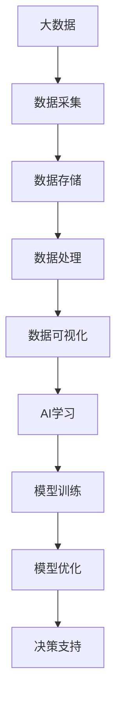

                 

### 第1章：大数据与AI学习的关系

### 1.1 大数据的定义与特征

#### 1.1.1 大数据的定义

大数据（Big Data）通常指的是从各种来源以各种格式收集的大量数据。这些数据量通常远远超出了传统数据处理工具的处理能力。大数据的定义可以从以下几个方面来理解：

- **数据量**：大数据通常指的是数据量达到或超过PB（拍字节，即10^15字节）或甚至EB（艾字节，即10^18字节）级别。
- **速度**：数据的产生和处理的速度非常快，需要实时或近实时处理。
- **多样性**：大数据包含了结构化、半结构化和非结构化数据，如文本、图像、音频、视频等。
- **价值**：大数据中蕴含着潜在的价值，但这种价值通常难以从大量无序的数据中直接提取。

#### 1.1.2 大数据的特征

大数据的四个主要特征被称为“4V”，即：

1. **数据量（Volume）**：这是大数据最为显著的特征之一。随着互联网、物联网和传感器技术的普及，数据量呈指数级增长。数据量达到PB甚至EB级别，使得传统的数据处理系统面临巨大的挑战。

2. **数据速度（Velocity）**：数据速度指的是数据的生成、传输和处理速度。大数据环境下，数据产生速度非常快，如社交网络上的实时更新、金融交易系统中的实时数据等，要求系统能够快速响应。

3. **数据多样性（Variety）**：大数据的类型和格式多种多样，包括结构化数据（如数据库中的记录）、半结构化数据（如XML、JSON格式数据）和非结构化数据（如文本、图像、音频、视频等）。这种多样性使得数据处理变得更加复杂。

4. **数据价值（Value）**：尽管大数据量巨大，但并非所有数据都具有同等价值。大数据的价值在于从海量数据中提取有价值的洞察和信息，以支持决策制定和业务创新。

### 1.2 AI学习的背景与现状

#### 1.2.1 AI学习的发展历程

人工智能（AI）是一门研究、开发用于模拟、延伸和扩展人的智能的理论、方法、技术及应用的科学。AI学习经历了以下几个重要阶段：

- **规则驱动的方法**：早期的人工智能系统主要基于规则，如专家系统，通过编写大量的规则来模拟人类专家的决策过程。
- **统计学习**：随着机器学习技术的发展，AI开始采用统计方法，如线性回归、逻辑回归和支持向量机等。
- **深度学习**：深度学习是AI学习的一个重要分支，通过模拟人脑的神经网络结构，实现复杂模式识别和决策。

#### 1.2.2 AI学习的重要性

AI学习在现代科技和社会发展中扮演着重要角色，主要体现在以下几个方面：

- **效率提升**：通过自动化和智能化，AI学习可以大幅提高生产效率和质量。
- **决策支持**：AI学习模型可以根据大量数据进行分析和预测，为决策者提供科学依据。
- **创新应用**：AI学习在各个领域都有广泛的应用前景，如医疗、金融、教育、交通等。

### 1.3 大数据对AI学习的影响

#### 1.3.1 大数据对AI学习的技术支持

大数据为AI学习提供了强大的技术支持，主要体现在以下几个方面：

- **数据资源**：大数据提供了丰富的数据资源，为AI模型的训练提供了充足的数据支持。
- **计算能力**：大数据技术如Hadoop和Spark提供了高效的分布式计算能力，可以处理大规模数据。
- **数据存储**：大数据技术如Hadoop分布式文件系统（HDFS）和云存储提供了高效的存储解决方案。

#### 1.3.2 大数据对AI学习的影响因素

大数据对AI学习的影响因素主要包括：

- **数据质量**：数据质量直接影响AI模型的性能，包括数据的准确性、完整性和一致性。
- **数据隐私**：在收集和使用大数据时，需要保护个人隐私和数据安全。
- **数据处理**：大规模数据处理是一个复杂的过程，需要高效的算法和优化技术。

### Mermaid 流程图：大数据与AI学习的关系

### 结论

本章对大数据与AI学习的关系进行了初步探讨，明确了大数据的“4V”特征和AI学习的发展历程。同时，分析了大数据对AI学习的技术支持和影响因素。后续章节将深入探讨大数据处理技术和AI学习的基础理论，以及大数据在AI学习中的应用和实践案例。

# 第2章：大数据处理技术

## 2.1 Hadoop生态系统

### 2.1.1 Hadoop的基本原理

Hadoop是一个开源的分布式计算框架，由Apache Software Foundation维护，用于处理大规模数据集。Hadoop的核心组件包括Hadoop分布式文件系统（HDFS）、YARN（Yet Another Resource Negotiator）和MapReduce编程模型。

- **Hadoop分布式文件系统（HDFS）**：HDFS是一个分布式文件系统，用于存储海量数据。它将大文件分割成固定大小的数据块（默认为128MB或256MB），并分布存储到集群中的不同节点上。HDFS提供高吞吐量的数据访问，适合读取密集型的应用。

- **YARN**：YARN是一个资源调度和管理框架，负责管理和分配集群资源，包括计算资源和内存资源。YARN允许不同的数据处理框架（如MapReduce、Spark等）在同一个集群上运行，提高了资源利用率。

- **MapReduce**：MapReduce是一种编程模型，用于处理大规模数据集。它将数据处理任务分为Map和Reduce两个阶段。Map阶段对输入数据进行处理并生成中间结果，Reduce阶段对中间结果进行汇总和聚合，生成最终结果。

### 2.1.2 Hadoop的核心组件

- **HDFS**：HDFS的核心组件包括：

  - **名称节点（NameNode）**：负责管理文件系统的命名空间，维护文件与数据块的映射关系。名称节点不存储实际的数据块，而是记录数据块的位置。

  - **数据节点（DataNode）**：负责存储实际的数据块，并响应名称节点的数据请求。数据节点定期向名称节点发送心跳信号，以保持其活跃状态。

- **YARN**：YARN的核心组件包括：

  - **资源管理器（Resource Manager）**：负责管理和分配集群资源。资源管理器将集群划分为多个资源槽（Resource Slot），每个槽分配一定的计算资源和内存资源。

  - **应用程序管理器（Application Master）**：每个MapReduce或Spark应用程序都有一个应用程序管理器，负责协调应用程序的执行。

- **MapReduce**：MapReduce的核心组件包括：

  - **Map任务**：将输入数据分解成键值对，并生成中间结果。
  - **Reduce任务**：将Map任务的中间结果进行汇总和聚合，生成最终结果。

### 2.1.3 Hadoop生态系统中的其他组件

除了上述核心组件外，Hadoop生态系统还包括以下其他重要组件：

- **Hive**：Hive是一个数据仓库工具，用于在Hadoop上执行SQL查询。Hive使用HDFS作为数据存储，并提供一个基于HQL（Hive Query Language）的查询接口。

- **Pig**：Pig是一个高级的数据处理平台，用于在Hadoop上执行复杂的数据处理任务。Pig使用Pig Latin语言，将数据处理任务分解成多个步骤，然后执行这些步骤。

- **HBase**：HBase是一个分布式、可扩展的列存储数据库，基于HDFS。HBase支持随机读写操作，适用于大规模数据的实时访问。

- **Spark**：Spark是一个快速通用的计算引擎，支持内存计算，提供了丰富的API，包括Java、Scala、Python和R等。Spark可以与Hadoop集成，并提供包括批处理、流处理和机器学习等多种数据处理能力。

## 2.2 Spark的运行机制

### 2.2.1 Spark的基本原理

Apache Spark是一个高性能的分布式计算系统，专为大数据处理而设计。Spark的核心特点包括：

- **速度**：Spark基于内存计算，比传统的大数据处理框架如MapReduce快100倍以上。
- **通用性**：Spark支持多种数据处理模式，包括批处理、流处理和机器学习。
- **易用性**：Spark提供丰富的API，支持多种编程语言，包括Java、Scala、Python和R。

Spark的核心组件包括：

- **驱动程序（Driver）**：驱动程序负责协调整个Spark应用程序的执行。它解析应用程序代码，生成执行计划，并分发任务到集群中的执行节点。
- **执行节点（Executor）**：执行节点是Spark集群中的工作节点，负责执行任务和存储数据。每个Executor分配一定的计算资源和内存资源，并在应用程序执行过程中持续运行。
- **集群管理器（Cluster Manager）**：集群管理器负责管理和分配集群资源。常用的集群管理器包括Hadoop YARN、Apache Mesos和Spark自带的独立集群管理器。

### 2.2.2 Spark的核心组件

- **Spark Core**：Spark Core提供了Spark的基本功能，包括内存管理、任务调度和分布式数据集（RDD）。RDD是Spark的核心数据结构，提供了丰富的操作接口，如转换（Transformation）和行动（Action）。
- **Spark SQL**：Spark SQL提供了一个基于JDBC的查询接口，支持SQL和HiveQL。Spark SQL可以与Hive兼容，并提供了对结构化数据的更高效处理。
- **Spark Streaming**：Spark Streaming提供了实时数据处理功能，可以处理来自不同源（如Kafka、Flume等）的数据流，并以批处理的方式进行处理。
- **MLlib**：MLlib是Spark的机器学习库，提供了多种机器学习算法，包括分类、回归、聚类和降维等。MLlib支持多种数据格式，如RDD、DataFrame和Dataset。
- **GraphX**：GraphX是Spark的图处理框架，用于处理大规模图数据。GraphX提供了丰富的图算法，如图排序、社区发现和图流等。

### 2.2.3 Spark的运行流程

Spark的运行流程包括以下几个主要步骤：

1. **初始化**：启动Spark应用程序，创建SparkContext，这是与Spark集群交互的入口点。
2. **解析代码**：SparkContext解析应用程序代码，将其转化为一个执行计划（DAG）。
3. **调度任务**：Spark调度器将执行计划分配给集群中的执行节点。
4. **执行任务**：执行节点根据分配的任务，执行相应的计算和数据处理操作。
5. **结果收集**：执行结果返回给驱动程序，并在最终输出或持久化到存储系统。

## 2.3 数据仓库与数据湖

### 2.3.1 数据仓库的基本概念

数据仓库（Data Warehouse）是一个用于存储、管理和分析企业数据的系统。它具有以下特点：

- **面向主题**：数据仓库以业务主题为组织方式，提供全面的数据视图。
- **集成性**：数据仓库整合来自多个数据源的数据，实现数据的统一管理。
- **历史性**：数据仓库保存历史数据，支持数据分析。

数据仓库的主要组件包括：

- **数据源**：数据源包括关系型数据库、NoSQL数据库、文件系统等，提供数据输入。
- **数据仓库**：数据仓库是存储和管理数据的中心，通常使用关系型数据库或专用的数据仓库数据库。
- **ETL工具**：ETL（Extract, Transform, Load）工具负责从数据源抽取数据、转换数据，并将数据加载到数据仓库中。
- **BI工具**：业务智能（Business Intelligence）工具用于分析和展示数据仓库中的数据，支持数据可视化和报表生成。

### 2.3.2 数据湖的基本概念

数据湖（Data Lake）是一种新兴的数据存储架构，用于存储大规模、多样化的数据。它具有以下特点：

- **存储灵活性**：数据湖支持结构化、半结构化和非结构化数据，无需预先定义数据模型。
- **海量存储**：数据湖提供高容量的存储能力，支持PB级别甚至EB级别的数据。
- **高效处理**：数据湖支持高效的数据处理和分析，包括批处理、实时处理等。

数据湖的主要组件包括：

- **数据存储**：数据湖使用分布式存储系统，如HDFS、Amazon S3等，提供海量数据存储能力。
- **数据处理**：数据湖支持多种数据处理框架，如Spark、Flink等，提供高效的数据处理能力。
- **数据治理**：数据湖需要数据治理机制，确保数据的质量、安全和合规性。

### 2.3.3 数据仓库与数据湖的比较

- **数据模型**：数据仓库通常采用结构化的数据模型，数据按照预定义的模式进行组织和存储。数据湖则采用更为灵活的存储方式，可以存储未经格式化的原始数据。
- **数据用途**：数据仓库主要用于支持企业的业务分析和决策支持，而数据湖主要用于数据存储、研究和探索。
- **数据规模**：数据仓库适合处理规模较小的数据集，而数据湖可以处理海量数据。
- **性能**：数据仓库通常提供高效的查询性能，而数据湖可能需要更多的预处理和分析步骤。

### 结论

本章介绍了大数据处理技术，包括Hadoop生态系统、Spark的运行机制和数据仓库与数据湖的基本概念。通过这些技术，我们可以高效地处理和管理大规模数据，为AI学习提供强大的数据支持和计算能力。在接下来的章节中，我们将深入探讨AI学习的基础理论和大数据在AI学习中的应用。

### 第3章：AI学习的基础理论

### 3.1 神经网络

#### 3.1.1 神经网络的基本结构

神经网络（Neural Network）是一种模拟人脑神经元工作的计算模型，由多个神经元组成。每个神经元包含一个输入层、一个或多个隐藏层和一个输出层。

- **输入层**：接收输入数据，将数据传递到隐藏层。
- **隐藏层**：对输入数据进行处理，提取特征和模式。
- **输出层**：输出最终结果，用于分类、预测或其他任务。

神经网络的工作原理是通过前向传播和反向传播进行数据处理的。前向传播将输入数据通过神经网络层，最终得到输出结果；反向传播根据输出结果与实际结果的误差，调整神经网络参数，优化模型性能。

#### 3.1.2 神经网络的工作原理

神经网络的工作原理可以分为以下几个步骤：

1. **初始化**：为每个神经元随机分配权重和偏置。
2. **前向传播**：将输入数据通过神经网络层，每个神经元将输入乘以权重，加上偏置，然后通过激活函数得到输出。
3. **计算误差**：将输出结果与实际结果进行比较，计算误差。
4. **反向传播**：将误差反向传播到神经网络层，根据梯度下降算法调整权重和偏置。
5. **迭代优化**：重复上述步骤，直到误差达到最小或满足停止条件。

神经网络通过这种方式不断优化参数，提高模型性能。

#### 3.1.3 神经网络的类型

神经网络可以分为以下几种类型：

- **前馈神经网络（Feedforward Neural Network）**：是最简单和最常见的神经网络，数据从输入层流向输出层，不形成回路。
- **循环神经网络（Recurrent Neural Network，RNN）**：具有反馈连接，可以处理序列数据。
- **卷积神经网络（Convolutional Neural Network，CNN）**：专门用于图像识别，利用卷积层提取图像特征。
- **生成对抗网络（Generative Adversarial Network，GAN）**：由两个神经网络组成，一个生成器和一个判别器，通过对抗训练生成真实数据。

### 3.2 深度学习

#### 3.2.1 深度学习的定义

深度学习（Deep Learning）是一种基于多层神经网络的学习方法，通过逐层学习数据特征，实现从简单到复杂的数据表示。深度学习在图像识别、自然语言处理、语音识别等领域取得了显著成果。

#### 3.2.2 深度学习的基本架构

深度学习的基本架构通常包括以下几层：

- **输入层**：接收输入数据。
- **隐藏层**：对输入数据进行处理，提取特征。
- **输出层**：输出最终结果。

深度学习的核心是隐藏层，通过增加隐藏层的数量和复杂度，可以提高模型的表达能力。

#### 3.2.3 深度学习的关键技术

- **激活函数**：激活函数用于引入非线性特性，常用的激活函数包括ReLU、Sigmoid和Tanh等。
- **损失函数**：损失函数用于衡量模型输出与实际结果之间的误差，常用的损失函数包括均方误差（MSE）和交叉熵（Cross Entropy）等。
- **优化算法**：优化算法用于调整模型参数，以最小化损失函数，常用的优化算法包括随机梯度下降（SGD）、Adam等。

### 3.3 强化学习

#### 3.3.1 强化学习的定义

强化学习（Reinforcement Learning，RL）是一种通过试错的方式学习最优策略的机器学习方法。强化学习通过与环境交互，根据环境的反馈（奖励或惩罚）不断调整策略，以最大化累积奖励。

#### 3.3.2 强化学习的基本算法

强化学习的基本算法包括：

- **Q学习（Q-Learning）**：Q学习通过预测每个动作的回报值，选择具有最大预期回报的动作。
- **深度Q网络（Deep Q-Network，DQN）**：DQN是Q学习的扩展，用于处理连续动作空间和状态空间。
- **策略梯度（Policy Gradient）**：策略梯度直接优化策略函数，以最大化累积奖励。

### 3.3.3 强化学习在AI学习中的应用

强化学习在AI学习中有广泛的应用，包括：

- **游戏AI**：通过强化学习，游戏AI可以学习并掌握各种游戏策略，如围棋、国际象棋等。
- **自动驾驶**：强化学习可以帮助自动驾驶车辆学习最优驾驶策略，提高行驶安全性和效率。
- **推荐系统**：强化学习可以用于优化推荐系统，提高推荐准确性和用户满意度。

### 结论

本章介绍了AI学习的基础理论，包括神经网络、深度学习和强化学习。神经网络通过模拟人脑神经元的工作方式，实现了从简单到复杂的数据处理。深度学习通过多层神经网络结构，实现了高效的特征提取和模式识别。强化学习通过试错和反馈机制，实现了最优策略的学习。这些基础理论为AI学习提供了强大的工具和方法，为大数据的应用提供了坚实的基础。

### 第4章：大数据在AI学习中的应用

#### 4.1 大数据对深度学习模型的影响

#### 4.1.1 大数据对深度学习模型训练的影响

大数据在深度学习模型训练中起着至关重要的作用。首先，大量的数据提供了丰富的训练样本，使得模型可以学习到更复杂的特征和模式，从而提高模型的性能。具体来说，大数据对深度学习模型训练的影响体现在以下几个方面：

1. **增强模型性能**：拥有大量的训练数据可以使得模型更好地泛化，减少过拟合现象。通过大量数据训练，模型可以学习到更普遍的特征，提高在未知数据上的表现。
   
2. **减少训练时间**：虽然大数据处理可能需要更多的时间，但通过并行计算和分布式处理技术，可以显著缩短训练时间。例如，使用Hadoop和Spark等大数据处理框架，可以充分利用集群资源，加速模型训练。

3. **提高模型稳定性**：大数据可以帮助模型在面对各种情况时保持稳定性。例如，在医疗数据中，拥有大量的患者数据可以使得模型在遇到罕见疾病或病情时，仍然能够提供合理的预测。

#### 4.1.2 大数据对深度学习模型性能的影响

除了对模型训练过程的影响，大数据也对深度学习模型的最终性能产生了显著影响。具体来说，大数据对深度学习模型性能的影响包括：

1. **提升准确率**：大量的数据使得模型可以学习到更精确的特征，从而提高分类或预测的准确率。例如，在图像识别任务中，拥有大量的图像数据可以帮助模型更准确地识别物体。

2. **减少误差**：通过大量数据训练，模型可以减少预测误差，提高模型在测试集上的表现。例如，在股票市场预测中，大量的历史交易数据可以帮助模型更准确地预测未来趋势。

3. **优化模型效率**：大数据不仅提供了更多的训练数据，还可以用于优化模型的参数。通过分析大量数据，研究人员可以发现哪些参数对模型性能影响最大，从而优化模型结构，提高效率。

#### 4.1.3 大数据在深度学习模型中的应用案例

大数据在深度学习模型中的应用案例非常广泛，以下是一些典型的应用案例：

1. **图像识别**：在图像识别任务中，如人脸识别、车辆识别等，大数据提供了大量的图像数据，使得模型可以学习到更精确的特征，从而提高识别准确率。

2. **自然语言处理**：在自然语言处理任务中，如文本分类、机器翻译等，大数据提供了大量的文本数据，使得模型可以学习到语言的复杂结构，从而提高处理效果。

3. **医疗诊断**：在医疗领域，大数据提供了大量的患者数据，使得模型可以学习到疾病的特征和规律，从而提高诊断准确率，为医生提供更有力的决策支持。

#### 4.2 大数据在自然语言处理中的应用

#### 4.2.1 自然语言处理的基本原理

自然语言处理（Natural Language Processing，NLP）是计算机科学和语言学的交叉领域，旨在使计算机能够理解和处理人类语言。NLP的基本原理包括：

1. **文本预处理**：包括分词、词性标注、去除停用词等，将文本转化为计算机可以处理的形式。
2. **语义理解**：通过理解文本的语义，实现对文本内容的分析和处理。
3. **语言生成**：生成符合语言习惯和语义的文本，如机器翻译、文本摘要等。

#### 4.2.2 大数据在自然语言处理中的应用案例

大数据在自然语言处理中的应用案例主要包括：

1. **文本分类**：通过大量文本数据训练分类模型，实现对大量文本的自动分类，如新闻分类、情感分析等。

2. **情感分析**：通过分析大量用户评论和社交媒体数据，实现对用户情感倾向的识别，为企业提供用户反馈分析。

3. **机器翻译**：通过大量双语语料库训练翻译模型，实现对不同语言之间的自动翻译，如谷歌翻译、百度翻译等。

#### 4.3 大数据在推荐系统中的应用

#### 4.3.1 推荐系统的基本原理

推荐系统（Recommendation System）是一种根据用户的历史行为、兴趣和偏好，为用户推荐相关商品、服务或内容的系统。推荐系统的基本原理包括：

1. **协同过滤**：通过分析用户之间的相似性，推荐用户可能感兴趣的商品或内容。
2. **基于内容的推荐**：通过分析商品或内容的特征，为用户推荐相似的商品或内容。

#### 4.3.2 大数据在推荐系统中的应用案例

大数据在推荐系统中的应用案例主要包括：

1. **电子商务推荐**：通过分析用户购买历史、浏览记录等数据，为用户推荐个性化的商品。

2. **视频推荐**：通过分析用户观看历史、偏好等数据，为用户推荐个性化的视频内容。

#### 4.3.3 大数据对推荐系统性能的影响

大数据对推荐系统性能的影响主要体现在：

1. **提高推荐准确率**：通过大量用户行为数据，可以更准确地预测用户兴趣，提高推荐准确率。

2. **减少冷启动问题**：在用户初期缺乏足够行为数据时，大数据可以帮助推荐系统快速建立用户画像，减少冷启动问题。

3. **优化推荐效果**：通过分析大量用户反馈数据，可以不断优化推荐算法，提高用户满意度。

### 结论

本章讨论了大数据在AI学习中的应用，包括对深度学习模型的影响、在自然语言处理中的应用案例以及在大数据推荐系统中的作用。大数据为AI学习提供了丰富的数据资源和强大的计算能力，使得AI模型能够学习到更复杂的特征和模式，从而提高模型性能。大数据的应用不仅提升了AI学习的效率，也为各个领域的业务创新提供了有力支持。

### 第5章：大数据在强化学习中的应用

#### 5.1 大数据对强化学习的影响

强化学习（Reinforcement Learning，RL）是一种通过试错和反馈学习最优策略的机器学习方法。大数据在强化学习中的应用极大地推动了该领域的发展，主要体现在以下几个方面：

##### 5.1.1 大数据对强化学习模型的影响

1. **提高学习效率**：大数据提供了丰富的历史数据和实时数据，强化学习模型可以利用这些数据快速进行学习，减少探索时间。

2. **增强模型稳定性**：通过大量数据训练，强化学习模型可以在面对不同情况时保持稳定性，提高模型的泛化能力。

3. **优化策略表现**：大数据可以帮助强化学习模型更好地学习环境中的奖励结构，从而优化策略的表现，提高决策的准确性。

##### 5.1.2 大数据对强化学习算法的影响

1. **加速算法收敛**：大数据提供了更多的样本，可以帮助强化学习算法更快地收敛到最优策略。

2. **增强算法鲁棒性**：大数据中的多样性和复杂性可以帮助强化学习算法更好地适应不同的环境，提高算法的鲁棒性。

3. **优化算法设计**：大数据分析可以帮助研究人员更好地理解问题，从而设计出更有效的强化学习算法。

#### 5.2 大数据在强化学习中的应用案例

强化学习在各个领域都有着广泛的应用，以下是大数据在强化学习中的应用案例：

##### 5.2.1 大数据在自动驾驶中的应用

自动驾驶是强化学习的典型应用场景之一。通过大数据，自动驾驶系统可以学习到复杂的道路情况、交通规则和驾驶行为。具体案例包括：

1. **训练数据收集**：自动驾驶公司通过车载传感器、GPS和摄像头收集海量驾驶数据，用于训练强化学习模型。

2. **环境模拟**：通过模拟真实交通场景，强化学习模型可以在虚拟环境中进行训练，从而提高模型的适应性和稳定性。

3. **实时反馈**：在自动驾驶车辆实际行驶过程中，收集到的实时数据可以用于不断优化模型策略，提高行驶安全性和效率。

##### 5.2.2 大数据在智能客服中的应用

智能客服是另一个典型的强化学习应用场景。通过大数据，智能客服系统能够更好地理解用户的需求，提供个性化的服务。具体案例包括：

1. **用户行为分析**：通过分析用户的历史行为数据，智能客服系统可以了解用户的偏好和需求，从而提供更个性化的服务。

2. **策略优化**：通过不断收集用户反馈数据，强化学习模型可以优化与用户的对话策略，提高用户的满意度。

3. **多轮对话管理**：通过强化学习，智能客服系统可以在多轮对话中持续学习和适应，提高对话的连贯性和准确性。

##### 5.2.3 大数据在金融交易中的应用

大数据在金融交易中的应用也非常广泛。通过强化学习，金融交易系统能够更好地理解市场动态，做出更准确的交易决策。具体案例包括：

1. **历史数据挖掘**：通过分析大量的历史交易数据，强化学习模型可以学习到市场的趋势和模式。

2. **实时数据监控**：通过实时收集市场数据，强化学习模型可以及时调整交易策略，应对市场变化。

3. **风险控制**：通过大数据分析，强化学习模型可以更好地识别和规避风险，提高交易安全性。

### 结论

本章讨论了大数据在强化学习中的应用，包括对模型和算法的影响以及具体应用案例。大数据为强化学习提供了丰富的数据资源，使得强化学习模型能够更好地适应复杂环境，提高学习效率和决策准确性。随着大数据技术的不断进步，强化学习在各个领域中的应用前景将更加广阔。

### 第6章：大数据在AI学习中的挑战与应对策略

#### 6.1 大数据在AI学习中的挑战

大数据在AI学习中的应用虽然带来了许多机遇，但同时也带来了诸多挑战。以下是一些主要的挑战及其解决方案：

##### 6.1.1 数据质量问题

- **挑战**：大数据中存在噪声、冗余和错误数据，这些质量问题会影响模型的性能和稳定性。
- **解决方案**：数据清洗是解决数据质量问题的关键。通过数据预处理技术，如去重、填补缺失值和异常值检测，可以显著提高数据质量。

##### 6.1.2 数据隐私保护

- **挑战**：大数据中包含敏感个人信息，如姓名、地址、身份证号码等，这些数据需要得到妥善保护，以防止隐私泄露。
- **解决方案**：采用数据加密、匿名化和差分隐私等技术，可以有效保护个人隐私。例如，对敏感数据进行加密处理，确保数据在传输和存储过程中安全。同时，通过匿名化处理，将个人数据转换为不可识别的形式，以保护用户隐私。

##### 6.1.3 大规模数据处理

- **挑战**：处理大规模数据需要高效的数据处理技术和存储方案，以应对数据量庞大和多样性带来的挑战。
- **解决方案**：采用分布式计算框架，如Hadoop、Spark等，可以高效地处理大规模数据。分布式计算可以将数据处理任务分布到多个节点上，实现并行处理，提高处理速度。

##### 6.1.4 模型解释性

- **挑战**：深度学习等复杂模型往往具有高解释性，难以理解其决策过程，这在某些应用场景中（如医疗、金融等）是一个重要问题。
- **解决方案**：开发可解释性AI模型，如集成解释器（LIME）、Shapley Additive Explanations（SHAP）等，可以提供模型决策的详细解释。此外，通过可视化技术，如决策树、神经网络架构等，可以更好地理解模型的决策过程。

##### 6.1.5 模型泛化能力

- **挑战**：模型在训练数据上表现良好，但在实际应用中可能无法泛化到新的数据集，这称为过拟合问题。
- **解决方案**：采用交叉验证、正则化等技术，可以减少模型的过拟合现象，提高泛化能力。此外，通过使用更大的训练数据和更复杂的模型结构，可以提高模型的泛化能力。

##### 6.1.6 技术人才短缺

- **挑战**：大数据和AI领域的快速发展导致了人才短缺，这限制了技术的应用和推广。
- **解决方案**：加大对大数据和AI领域的人才培养力度，通过高校教育、职业培训和企业内部培训等多种途径，培养具备相关技能的专业人才。

#### 6.2 大数据在AI学习中的应对策略

为了应对大数据在AI学习中的挑战，可以采取以下策略：

##### 6.2.1 技术创新

- **开发新型算法**：不断研发和优化算法，以提高数据处理和模型训练的效率。
- **引入新工具**：利用开源工具和框架，如TensorFlow、PyTorch等，提高数据处理的灵活性。

##### 6.2.2 产业合作

- **跨学科合作**：推动计算机科学、统计学、数据科学等领域的交叉合作，提升技术能力。
- **产学研结合**：鼓励企业、高校和科研机构之间的合作，推动技术创新和应用推广。

##### 6.2.3 教育培训

- **专业人才培养**：加大对大数据和AI领域的人才培养力度，通过高校课程、职业培训和在线教育等多种方式，培养专业人才。
- **技能提升**：为现有从业人员提供继续教育和技能培训，提高其专业技能。

##### 6.2.4 法律法规

- **制定法律法规**：建立完善的数据治理和隐私保护法律法规，规范大数据的使用和AI模型的开发。
- **监管机制**：建立监管机制，确保大数据和AI技术的合规使用，防止数据滥用和隐私泄露。

### 结论

本章讨论了大数据在AI学习中的应用中面临的挑战和应对策略。通过技术创新、产业合作、教育培训和法律法规等多种手段，可以应对大数据在AI学习中的挑战，推动技术的健康发展和广泛应用。随着技术的不断进步和应用的深入，大数据与AI学习的融合将为社会带来更多创新和机遇。

### 第7章：案例研究：大数据在AI学习中的应用实践

#### 7.1 案例背景

本案例研究以某大型互联网公司为例，探讨其在实际业务中如何利用大数据和AI技术进行业务创新和优化。该公司是一家全球领先的电子商务平台，每天处理大量的用户数据，包括用户行为数据、交易数据和用户评价数据等。

#### 7.2 案例应用

该公司在以下几个业务领域应用大数据和AI技术，实现了显著的业务改进：

1. **个性化推荐系统**：通过分析用户的历史行为数据，公司利用深度学习算法构建了个性化推荐系统。该系统能够根据用户的浏览记录、购买历史和搜索行为，为用户推荐最可能感兴趣的商品。通过大数据和AI技术的应用，推荐系统的准确率显著提高，用户满意度也随之提升。

2. **智能客服系统**：公司利用强化学习算法开发了一款智能客服系统，该系统能够实时回答用户的咨询问题。通过不断学习和优化，智能客服系统能够提供更准确和友好的服务，减轻了人工客服的工作负担，提高了客户服务效率。

3. **库存管理优化**：公司通过大数据分析，对库存管理进行了优化。利用机器学习模型预测未来的商品需求，公司能够更准确地调整库存水平，减少库存过剩和缺货现象，降低了运营成本。

4. **广告投放优化**：公司通过大数据和AI技术对广告投放策略进行了优化。通过分析用户的浏览记录和购买行为，公司能够更精准地定位目标用户，提高广告投放效果，提高了广告转化率。

#### 7.3 案例分析

通过大数据和AI技术的应用，公司在以下方面取得了显著成果：

1. **业务效率提升**：个性化推荐系统、智能客服系统和库存管理优化等措施显著提高了业务效率，减少了人工操作的错误率。

2. **用户体验改善**：通过精准的推荐和高效的客服服务，用户满意度大幅提升，用户粘性和活跃度也有所提高。

3. **运营成本降低**：库存管理的优化减少了库存成本和运营成本，广告投放优化的提高也带来了更多的收益。

4. **数据驱动决策**：公司通过大数据分析，实现了数据驱动决策，业务决策更加科学和精准。

#### 7.4 案例总结与反思

通过本案例研究，我们可以看到大数据和AI技术在电子商务平台中的应用具有广泛的前景。大数据提供了丰富的数据资源，AI技术则提供了强大的数据处理和分析能力。然而，在实际应用中，公司也面临数据隐私保护、模型解释性和数据质量等挑战。未来，公司需要继续优化大数据处理技术和AI算法，提高大数据在AI学习中的应用效果，同时确保数据安全和合规性。

### 结论

本章节通过案例研究，展示了大数据在AI学习中的应用实践。通过具体业务场景的案例分析，我们不仅看到了大数据和AI技术带来的业务改进和效率提升，也认识到了其中存在的挑战。未来，随着技术的不断进步和应用的深入，大数据与AI学习的融合将为企业带来更多创新和机遇。

### 第8章：大数据与AI学习的综合应用

#### 8.1 大数据与AI学习在医疗领域的应用

大数据和AI学习在医疗领域具有广泛的应用前景，能够显著提升医疗服务的质量和效率。以下是一些具体的应用场景：

1. **疾病预测与预防**：通过分析大量患者数据，包括病史、基因信息、生活习惯等，AI模型可以预测疾病的发生风险，为医生提供预防建议。

2. **个性化治疗**：基于患者的具体特征和病史，AI模型可以为患者制定个性化的治疗方案，提高治疗效果。

3. **医学影像分析**：AI技术可以自动识别和诊断医学影像中的异常情况，如肿瘤、骨折等，帮助医生快速做出诊断。

4. **药物研发**：AI模型可以分析大量药物数据和生物信息，加速新药的研发过程。

#### 8.2 大数据与AI学习在教育领域的应用

大数据和AI学习在教育领域也有重要的应用价值，可以提升教育质量和学习效果。以下是一些具体的应用场景：

1. **个性化学习**：通过分析学生的学习行为和成绩数据，AI模型可以为学生提供个性化的学习建议，帮助学生更好地掌握知识。

2. **课程推荐**：AI模型可以根据学生的学习兴趣和学习能力，推荐合适的课程和学习资源。

3. **学习分析**：AI模型可以分析学生的学习数据，了解学生的学习状况，帮助教师调整教学策略。

4. **智能评估**：AI模型可以自动评估学生的作业和考试，提供即时反馈，帮助教师发现教学中的问题。

#### 8.3 大数据与AI学习在金融领域的应用

大数据和AI学习在金融领域同样具有广泛的应用，可以提升金融服务的效率和安全。以下是一些具体的应用场景：

1. **风险控制**：通过分析大量金融数据，AI模型可以识别潜在的风险，帮助金融机构及时采取措施。

2. **欺诈检测**：AI模型可以实时监控交易数据，快速识别和防范金融欺诈行为。

3. **智能投顾**：AI模型可以根据用户的风险承受能力和投资目标，提供个性化的投资建议。

4. **信用评估**：AI模型可以分析大量信用信息，为金融机构提供更准确的信用评估。

#### 8.4 大数据与AI学习的综合应用展望

大数据与AI学习的综合应用将为各行各业带来巨大的变革。以下是一些展望：

1. **智能化转型**：企业可以通过大数据和AI技术实现智能化转型，提高生产效率和竞争力。

2. **创新应用**：大数据和AI技术将在医疗、教育、金融等各个领域催生新的应用场景，推动社会进步。

3. **跨领域融合**：大数据和AI技术将与其他领域（如物联网、区块链等）融合，创造更多创新产品和服务。

4. **全球化合作**：随着技术的全球化，大数据和AI学习将促进全球范围内的技术交流和应用创新。

### 结论

本章探讨了大数据与AI学习在医疗、教育、金融等领域的综合应用，展示了大数据和AI技术在这些领域中的重要价值。未来，随着技术的不断进步和应用的深入，大数据与AI学习的综合应用将为企业和社会带来更多创新和机遇。

### 第9章：大数据与AI学习的伦理与法律问题

#### 9.1 大数据与AI学习的伦理问题

大数据和AI学习的发展带来了诸多伦理问题，需要我们深入探讨并加以解决。以下是一些主要的伦理问题及其解决方案：

##### 9.1.1 数据隐私问题

- **挑战**：大数据和AI学习需要大量的个人数据，这些数据涉及用户的隐私权。
- **解决方案**：采用数据匿名化技术，将个人数据转换为不可识别的形式，以保护用户隐私。同时，制定严格的数据保护政策，确保数据在收集、存储和使用过程中的安全性。

##### 9.1.2 算法偏见问题

- **挑战**：AI算法在训练过程中可能会受到训练数据偏差的影响，导致算法偏见。
- **解决方案**：通过多样化的数据集和公平性评估方法，减少算法偏见。此外，开发可解释的AI模型，使算法的决策过程更加透明，便于监督和调整。

##### 9.1.3 职业道德问题

- **挑战**：大数据和AI技术的发展可能会引发职业道德问题，如数据滥用、隐私侵犯等。
- **解决方案**：建立行业道德准则，明确大数据和AI技术从业者的责任和道德规范。加强职业道德教育，提高从业者的道德素养。

##### 9.1.4 数据安全问题

- **挑战**：大数据和AI学习过程中涉及大量敏感数据，数据泄露和攻击风险较高。
- **解决方案**：采用数据加密、访问控制等技术，加强数据安全性。同时，建立完善的数据安全管理体系，定期进行安全评估和应急响应演练。

#### 9.2 大数据与AI学习的法律问题

大数据和AI学习的快速发展也带来了诸多法律问题，需要制定相应的法律法规来规范其发展。以下是一些主要的法律问题及其解决方案：

##### 9.2.1 数据保护法规

- **挑战**：当前的数据保护法律法规可能无法完全适应大数据和AI学习的发展需求。
- **解决方案**：完善现有的数据保护法律法规，如《通用数据保护条例》（GDPR），同时制定专门针对大数据和AI学习的法律法规，确保数据的合法收集、存储和使用。

##### 9.2.2 知识产权问题

- **挑战**：大数据和AI学习的创新成果可能涉及知识产权问题，如算法抄袭、数据侵权等。
- **解决方案**：加强知识产权保护，建立完善的知识产权法律法规体系，确保创新成果的合法权益。

##### 9.2.3 责任归属问题

- **挑战**：大数据和AI学习应用过程中，责任归属问题可能难以确定。
- **解决方案**：明确大数据和AI学习应用过程中的责任主体，建立责任归属机制。同时，制定相应的法律法规，明确责任承担和赔偿标准。

##### 9.2.4 法律监管问题

- **挑战**：大数据和AI学习的发展速度较快，现有的法律监管体系可能难以跟上技术进步。
- **解决方案**：加强法律监管，建立专门的大数据与AI学习监管机构，确保技术应用的合法性和安全性。同时，加强国际合作，推动全球范围内的法律法规协调。

### 结论

本章探讨了大数据与AI学习在伦理和法律方面的问题，并提出了相应的解决方案。随着技术的不断进步和应用范围的扩大，大数据与AI学习的伦理与法律问题将更加突出。因此，我们需要不断完善相关法律法规，加强伦理道德教育，确保大数据与AI学习的健康发展，为社会带来更多福祉。

### 第10章：大数据与AI学习的发展趋势

#### 10.1 大数据与AI学习的现状分析

当前，大数据与AI学习正处于快速发展阶段，二者相互促进，共同推动了技术创新和应用拓展。以下是大数据与AI学习的现状分析：

1. **技术成熟度**：大数据技术如Hadoop、Spark、Flink等已经相对成熟，AI学习技术如深度学习、强化学习等也取得了显著进展。这些技术的发展为大数据与AI学习的融合提供了坚实的技术基础。

2. **应用领域拓展**：大数据与AI学习在各个领域的应用日益广泛，如医疗、金融、教育、交通等。通过大数据分析，AI模型可以更好地理解复杂数据，从而提高决策准确性和效率。

3. **产业生态成熟**：随着大数据与AI学习的应用，相关的产业生态也在逐步成熟。包括硬件设备、软件开发、数据服务、解决方案提供商等在内的产业链正在不断完善。

#### 10.2 大数据与AI学习的未来发展趋势

大数据与AI学习的未来发展将呈现以下趋势：

1. **技术融合与创新**：大数据与AI学习的融合将进一步深化，新兴技术如边缘计算、区块链、量子计算等将与之结合，推动技术不断创新。

2. **应用场景多样化**：随着技术的进步，大数据与AI学习将在更多领域得到应用，如智能制造、智慧城市、智能医疗等，为行业带来新的变革。

3. **全球合作与竞争**：大数据与AI学习的全球化趋势将加剧，全球范围内的技术竞争和合作将更加紧密。各国将在技术研发、人才培养、政策制定等方面展开合作，共同推动技术进步。

4. **伦理与法律问题**：随着大数据与AI学习的发展，伦理与法律问题将日益突出。如何确保数据隐私、算法公平性、责任归属等问题将成为未来发展的重要议题。

#### 10.3 大数据与AI学习的未来机遇

大数据与AI学习在未来将带来诸多机遇：

1. **智能化转型**：大数据与AI技术将推动各行各业实现智能化转型，提高生产效率和竞争力。

2. **创新应用场景**：大数据与AI学习将在更多领域开辟新的应用场景，为社会带来更多价值。

3. **人才培养与就业**：随着技术的进步和应用领域的拓展，大数据与AI学习将带来大量的人才需求，为就业市场提供新的机遇。

4. **国际合作**：大数据与AI学习的国际合作将促进技术交流与应用创新，为全球经济增长注入新动力。

### 结论

大数据与AI学习的发展趋势表明，二者将不断融合，推动技术创新和应用拓展。未来，随着技术的不断进步和应用的深入，大数据与AI学习将在更多领域发挥作用，为社会带来更多创新和机遇。

### 第11章：大数据与AI学习的技术挑战与解决方案

#### 11.1 大数据与AI学习的技术挑战

大数据与AI学习在技术发展过程中面临着诸多挑战，以下是一些主要的挑战及其解决方案：

##### 11.1.1 数据质量问题

- **挑战**：大数据中存在噪声、冗余和错误数据，这些数据质量问题会影响模型的性能和可靠性。
- **解决方案**：通过数据清洗技术，如去重、填补缺失值、异常值检测等，可以提高数据质量。此外，采用数据验证和校准技术，确保数据的准确性。

##### 11.1.2 大规模数据处理

- **挑战**：大数据量对数据处理速度和存储性能提出了高要求，传统的数据处理方法难以满足需求。
- **解决方案**：采用分布式计算框架，如Hadoop、Spark等，可以提高数据处理效率。此外，使用高性能存储设备，如SSD、分布式文件系统等，可以提高数据存储和读取速度。

##### 11.1.3 数据隐私保护

- **挑战**：大数据中包含敏感个人信息，需要采取有效的隐私保护措施，以防止数据泄露。
- **解决方案**：采用数据加密、匿名化、差分隐私等技术，可以有效地保护数据隐私。此外，建立完善的数据访问控制机制，确保只有授权用户可以访问敏感数据。

##### 11.1.4 模型可解释性

- **挑战**：深度学习等复杂模型往往具有高解释性，难以解释其决策过程，这在某些应用场景中（如医疗、金融等）是一个重要问题。
- **解决方案**：开发可解释性AI模型，如LIME、SHAP等，可以提供模型决策的详细解释。此外，通过可视化技术，如决策树、神经网络架构等，可以更好地理解模型的决策过程。

##### 11.1.5 模型泛化能力

- **挑战**：模型在训练数据上表现良好，但在实际应用中可能无法泛化到新的数据集，这称为过拟合问题。
- **解决方案**：采用交叉验证、正则化等技术，可以减少模型的过拟合现象，提高泛化能力。此外，通过使用更大的训练数据和更复杂的模型结构，可以提高模型的泛化能力。

##### 11.1.6 技术人才短缺

- **挑战**：大数据和AI领域的快速发展导致了人才短缺，这限制了技术的应用和推广。
- **解决方案**：加大对大数据和AI领域的人才培养力度，通过高校教育、职业培训和在线教育等多种途径，培养专业人才。同时，鼓励企业加强与高校和科研机构的合作，推动技术创新和应用。

#### 11.2 大数据与AI学习的解决方案探讨

为了应对大数据与AI学习的技术挑战，可以采取以下解决方案：

##### 11.2.1 技术创新

- **开发新型算法**：不断研发和优化算法，以提高数据处理和模型训练的效率。
- **引入新工具**：利用开源工具和框架，如TensorFlow、PyTorch等，提高数据处理的灵活性。

##### 11.2.2 产业合作

- **跨学科合作**：推动计算机科学、统计学、数据科学等领域的交叉合作，提升技术能力。
- **产学研结合**：鼓励企业、高校和科研机构之间的合作，推动技术创新和应用推广。

##### 11.2.3 教育培训

- **专业人才培养**：加大对大数据和AI领域的人才培养力度，通过高校课程、职业培训和在线教育等多种方式，培养专业人才。
- **技能提升**：为现有从业人员提供继续教育和技能培训，提高其专业技能。

##### 11.2.4 法律法规

- **制定法律法规**：建立完善的数据治理和隐私保护法律法规，规范大数据的使用和AI模型的开发。
- **监管机制**：建立监管机制，确保大数据和AI技术的合规使用，防止数据滥用和隐私泄露。

### 结论

本章探讨了大数据与AI学习在技术发展过程中面临的挑战及其解决方案。随着技术的不断进步和应用范围的扩大，大数据与AI学习将在未来发挥更加重要的作用。通过技术创新、产业合作、教育培训和法律法规等多方面的努力，可以更好地应对技术挑战，推动大数据与AI学习的健康发展。

### 附录A：大数据与AI学习常用工具与资源

#### 附录A.1 大数据工具介绍

- **Hadoop**：Hadoop是一个开源的分布式计算框架，用于处理大规模数据集。其核心组件包括Hadoop分布式文件系统（HDFS）、YARN（Yet Another Resource Negotiator）和MapReduce。
- **Spark**：Spark是一个开源的分布式计算框架，提供了快速通用的计算能力。其核心组件包括Spark Core、Spark SQL、Spark Streaming和MLlib。
- **Flink**：Flink是一个开源的流处理和批处理框架，提供了高性能、低延迟的数据处理能力。

#### 附录A.2 AI学习工具介绍

- **TensorFlow**：TensorFlow是一个开源的机器学习库，由Google开发，用于构建和训练深度学习模型。
- **PyTorch**：PyTorch是一个开源的机器学习库，由Facebook开发，提供了灵活的深度学习框架，适用于研究和工业应用。
- **Keras**：Keras是一个开源的神经网络库，提供了易于使用的接口，可用于构建和训练深度学习模型。

#### 附录A.3 数据集与公开资源

- **ImageNet**：ImageNet是一个大型图像数据集，包含了数百万个标记的图像，广泛用于图像识别研究。
- **CIFAR-10/100**：CIFAR-10和CIFAR-100是小型图像数据集，用于图像分类任务，包含了数千个标记的图像。
- **Co

