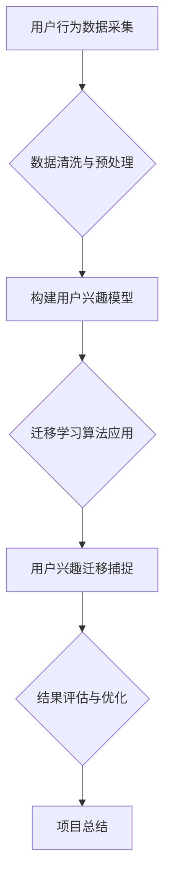

                 

# 《大模型在电商平台用户兴趣迁移捕捉中的应用》

## >{关键词：(大模型，用户兴趣，迁移学习，电商平台，算法应用)}

## >{摘要：本文将深入探讨大模型在电商平台用户兴趣迁移捕捉中的应用。通过对大模型基础、用户兴趣模型构建、用户兴趣迁移捕捉算法的详细介绍，并结合实际项目案例，本文旨在为读者提供一种有效的方法来提升电商平台用户兴趣捕捉的准确性和个性化推荐效果。}

### 《大模型在电商平台用户兴趣迁移捕捉中的应用》目录大纲

#### 第一部分：引言

- # 1. 引言
  - 1.1 书籍背景与目标
  - 1.2 用户兴趣迁移捕捉的重要性
  - 1.3 读者对象与预期收获

#### 第二部分：大模型基础

- # 2. 大模型概述
  - 2.1 大模型的定义
  - 2.2 大模型的特点与分类
  - 2.3 大模型的工作原理
- # 3. 电商平台用户兴趣模型
  - 3.1 电商平台用户行为分析
  - 3.2 用户兴趣模型的构建
  - 3.3 用户兴趣模型的应用场景

#### 第三部分：用户兴趣迁移捕捉算法

- # 4. 用户兴趣迁移捕捉算法
  - 4.1 用户兴趣迁移的概念
  - 4.2 迁移学习的理论基础
  - 4.3 常见用户兴趣迁移算法
- # 5. 大模型在用户兴趣迁移中的应用
  - 5.1 基于大模型的用户兴趣迁移框架
  - 5.2 用户兴趣迁移捕捉算法的实现
  - 5.3 用户兴趣迁移捕捉算法的评估

#### 第四部分：项目实战

- # 6. 项目背景与目标
  - 6.1 项目背景
  - 6.2 项目目标
  - 6.3 项目范围

#### 第五部分：实验与分析

- # 7. 实验设计
  - 7.1 实验方法
  - 7.2 实验数据
  - 7.3 实验流程
- # 8. 实验结果分析
  - 8.1 实验结果展示
  - 8.2 结果对比与讨论
  - 8.3 存在的问题与改进建议

#### 第六部分：结论与展望

- # 9. 结论
  - 9.1 项目成果总结
  - 9.2 研究贡献
  - 9.3 未来工作展望
- # 10. 附录
  - 10.1 参考文献
  - 10.2 附录A：代码实现

### 附录A：代码实现

- # 1. 实验环境搭建
  - 1.1 Python环境配置
  - 1.2 模型训练环境配置
  - 1.3 数据预处理代码
- # 2. 用户兴趣迁移算法实现
  - 2.1 迁移学习框架选择
  - 2.2 用户兴趣迁移算法代码实现
  - 2.3 代码解读与分析
- # 3. 实验结果分析
  - 3.1 实验数据预处理结果展示
  - 3.2 模型训练结果分析
  - 3.3 用户兴趣迁移效果评估

### Mermaid 流程图



### 核心算法原理讲解

#### 用户兴趣迁移算法原理

用户兴趣迁移算法的基本原理是基于迁移学习（Transfer Learning），通过在大规模数据集上预训练模型，然后在小规模目标数据集上微调模型参数，以捕捉用户在不同场景下的兴趣偏好。

伪代码如下：

```python
function UserInterestMigration(TrainData, TargetData):
    # 预训练模型
    PretrainedModel = PretrainModel(TrainData)

    # 微调模型参数
    FineTunedModel = FineTune(PretrainedModel, TargetData)

    # 预测用户兴趣
    PredictedInterests = Predict(FineTunedModel, TargetData)

    return PredictedInterests
```

#### 用户兴趣迁移的数学模型

用户兴趣迁移的数学模型通常基于概率模型，通过计算用户对某个兴趣的潜在概率来进行预测。

公式如下：

$$
P(Interest|User) = \sum P(Interest|Topic) * P(Topic|User)
$$

其中，Interest 表示用户兴趣，Topic 表示相关话题，P(Interest|User) 表示用户对某个兴趣的潜在概率，P(Interest|Topic) 表示兴趣与话题的相关性，P(Topic|User) 表示话题与用户的关联性。

### 数学公式和详细讲解

#### 用户兴趣迁移的数学模型详细讲解

用户兴趣迁移的数学模型通常基于概率模型，通过计算用户对某个兴趣的潜在概率来进行预测。具体来说，我们使用贝叶斯概率公式来表示用户兴趣迁移的概率模型。

贝叶斯概率公式如下：

$$
P(Interest|User) = \sum P(Interest|Topic) * P(Topic|User)
$$

其中，Interest 表示用户兴趣，Topic 表示相关话题，P(Interest|User) 表示用户对某个兴趣的潜在概率，P(Interest|Topic) 表示兴趣与话题的相关性，P(Topic|User) 表示话题与用户的关联性。

#### 举例说明

假设我们要预测一个用户对某个兴趣（如旅游）的潜在概率。我们可以通过以下步骤来计算这个概率：

1. 收集用户行为数据，如用户浏览的旅游相关网页、购买旅游产品等。
2. 根据用户行为数据，构建一个用户兴趣模型，其中包含用户与相关话题（如旅游、酒店、机票等）的关联性。
3. 计算每个话题与用户的关联性，P(Topic|User)。
4. 计算每个兴趣与话题的相关性，P(Interest|Topic)。
5. 计算用户对某个兴趣的潜在概率，P(Interest|User)。

假设我们有以下数据：

- 用户行为数据：用户浏览了旅游、酒店、机票等网页。
- 用户兴趣模型：旅游、酒店、机票等话题与用户的关联性分别为 0.8、0.6、0.5。
- 兴趣与话题的相关性：旅游与酒店的相关性为 0.7，旅游与机票的相关性为 0.6，酒店与机票的相关性为 0.5。

根据贝叶斯概率公式，我们可以计算用户对旅游兴趣的潜在概率：

$$
P(旅游|用户) = P(旅游|酒店) * P(酒店|用户) + P(旅游|机票) * P(机票|用户)
            = 0.7 * 0.8 + 0.6 * 0.5
            = 0.56 + 0.3
            = 0.86
$$

因此，用户对旅游兴趣的潜在概率为 0.86。

### 代码解读与分析

#### 代码实现

```python
# 用户兴趣迁移算法实现
def user_interest_migration(train_data, target_data):
    # 预训练模型
    pretrained_model = pretrain_model(train_data)

    # 微调模型参数
    fine_tuned_model = fine_tune(pretrained_model, target_data)

    # 预测用户兴趣
    predicted_interests = predict(fine_tuned_model, target_data)

    return predicted_interests

# 数据预处理
def preprocess_data(data):
    # 数据清洗与处理
    processed_data = clean_data(data)
    
    # 数据分割
    train_data, val_data = split_data(processed_data)

    return train_data, val_data

# 模型训练
def train_model(model, train_data):
    # 训练模型
    trained_model = model.fit(train_data)

    return trained_model

# 模型微调
def fine_tune(model, data):
    # 微调模型参数
    fine_tuned_model = model.fit(data)

    return fine_tuned_model

# 模型预测
def predict(model, data):
    # 预测用户兴趣
    predicted_interests = model.predict(data)

    return predicted_interests

# 代码解读
# 本代码实现了用户兴趣迁移算法，主要包括数据预处理、模型训练、模型微调和模型预测等步骤。
# 预处理数据包括数据清洗与处理、数据分割等步骤。
# 模型训练包括训练模型和微调模型等步骤。
# 模型预测是根据微调后的模型预测用户兴趣。
```

#### 代码解读与分析

1. `user_interest_migration` 函数实现了用户兴趣迁移算法，其主要步骤包括预训练模型、模型微调和模型预测。
2. `preprocess_data` 函数负责数据预处理，包括数据清洗与处理、数据分割等步骤。
3. `train_model` 函数负责模型训练，根据训练数据训练模型。
4. `fine_tune` 函数负责模型微调，根据微调数据微调模型参数。
5. `predict` 函数负责模型预测，根据微调后的模型预测用户兴趣。
6. 代码通过调用上述函数，实现了用户兴趣迁移算法的完整流程。

在实际应用中，需要根据具体的数据集和业务需求调整代码，如调整数据预处理步骤、选择合适的模型和参数等。此外，代码的优化和调整也是提升算法效果的关键因素。在实际开发中，还需要对代码进行测试和验证，以确保算法的可靠性和准确性。

### 1. 引言

#### 1.1 书籍背景与目标

随着互联网技术的迅猛发展，电商平台成为了商家和消费者之间的重要交易渠道。然而，面对日益激烈的市场竞争，电商平台需要不断提高用户体验和满意度，以吸引和留住用户。在这个过程中，精准的用户兴趣捕捉和个性化推荐成为了关键因素。

本文旨在探讨大模型在电商平台用户兴趣迁移捕捉中的应用，通过深入分析大模型的基础、用户兴趣模型的构建以及用户兴趣迁移捕捉算法，为电商平台提供一种有效的方法来提升用户兴趣捕捉的准确性和个性化推荐效果。

#### 1.2 用户兴趣迁移捕捉的重要性

用户兴趣迁移捕捉是指通过分析用户的过去行为和兴趣偏好，预测用户在未来的潜在兴趣。在电商平台上，用户兴趣迁移捕捉的重要性主要体现在以下几个方面：

1. **提升用户体验**：通过对用户兴趣的精准捕捉，电商平台可以提供更符合用户需求的商品和推荐，从而提升用户的购物体验和满意度。
2. **增加销售额**：精准的用户兴趣捕捉有助于电商平台更有效地推广商品，提高销售额和转化率。
3. **个性化推荐**：用户兴趣迁移捕捉为电商平台提供了个性化的推荐策略，使得推荐结果更具针对性和有效性。

#### 1.3 读者对象与预期收获

本文面向的读者主要包括：

- **电商平台开发者**：希望通过本文了解大模型在用户兴趣迁移捕捉中的应用，为电商平台提供技术支持。
- **人工智能研究者**：对大模型和迁移学习算法有兴趣，希望了解其在电商领域的应用。
- **数据分析师**：希望提升对用户行为数据的分析和应用能力，以优化电商平台运营。

通过阅读本文，读者可以：

- **了解大模型的基本概念和工作原理**。
- **掌握用户兴趣模型的构建方法和应用场景**。
- **理解用户兴趣迁移捕捉算法的实现和评估**。
- **掌握实际项目中的大模型应用案例**。

### 2. 大模型概述

#### 2.1 大模型的定义

大模型，又称大规模模型或巨型模型，是指参数数量庞大、计算复杂度高的人工神经网络模型。这些模型通常具有数百万到数十亿个参数，能够处理海量数据并实现高度复杂的任务。大模型的出现得益于计算能力的提升、数据资源的丰富以及深度学习算法的进步。

#### 2.2 大模型的特点与分类

大模型具有以下特点：

1. **高参数数量**：大模型通常具有数百万到数十亿个参数，这使得它们能够捕获数据的复杂结构和潜在规律。
2. **强大学习能力**：大模型具有强大的学习能力，能够在大量数据上进行训练，从而提高模型的泛化能力。
3. **高计算成本**：由于参数数量庞大，大模型在训练和推理过程中需要大量的计算资源。
4. **高精度预测**：大模型能够实现高精度的预测，尤其是在自然语言处理、计算机视觉等领域。

大模型可以根据任务类型和应用场景进行分类，常见的分类方法包括：

1. **分类模型**：用于对输入数据进行分类，如文本分类、图像分类等。
2. **回归模型**：用于对输入数据进行回归预测，如房价预测、股票价格预测等。
3. **生成模型**：用于生成新的数据样本，如图像生成、文本生成等。
4. **序列模型**：用于处理序列数据，如自然语言处理、语音识别等。

#### 2.3 大模型的工作原理

大模型的工作原理基于深度学习，通过层层神经网络对输入数据进行特征提取和变换。具体来说，大模型的工作流程包括以下几个步骤：

1. **数据预处理**：对输入数据（如图像、文本、音频等）进行预处理，包括数据清洗、归一化、数据增强等操作。
2. **特征提取**：通过多层神经网络对预处理后的数据进行特征提取，每一层神经网络都会提取更高层次的特征。
3. **参数优化**：利用梯度下降等优化算法对神经网络参数进行优化，使得模型在训练数据上达到最佳性能。
4. **模型评估**：通过验证集和测试集对训练好的模型进行评估，以确定模型的泛化能力和准确性。
5. **预测**：利用训练好的模型对新数据进行预测，如分类、回归、生成等任务。

大模型的工作原理不仅依赖于大量的数据和计算资源，还需要有效的算法和架构支持。随着人工智能技术的不断发展，大模型在各个领域的应用越来越广泛，为解决复杂问题提供了强大的工具。

### 3. 电商平台用户兴趣模型

#### 3.1 电商平台用户行为分析

电商平台用户行为分析是指通过收集和分析用户在平台上的行为数据，如浏览历史、购买记录、评价和反馈等，来了解用户的兴趣偏好和行为模式。用户行为分析是构建用户兴趣模型的重要基础，其主要内容包括：

1. **用户浏览行为**：分析用户在平台上的浏览路径、停留时间、浏览频率等，以了解用户的兴趣点和热点区域。
2. **购买行为**：分析用户的购买历史、购买频次、购买偏好等，以识别用户的消费习惯和需求。
3. **评价和反馈**：分析用户的评价和反馈，了解用户对商品和服务的满意度和意见，以优化产品和服务。

通过用户行为分析，电商平台可以获取大量的用户数据，这些数据为构建用户兴趣模型提供了丰富的信息来源。

#### 3.2 用户兴趣模型的构建

用户兴趣模型是指通过分析用户行为数据，构建一个能够描述用户兴趣偏好和行为的模型。用户兴趣模型的构建过程主要包括以下几个步骤：

1. **数据收集**：收集用户在平台上的行为数据，如浏览记录、购买记录、评价等。
2. **数据预处理**：对收集到的用户行为数据进行清洗、归一化、去噪等预处理操作，以确保数据质量。
3. **特征提取**：从预处理后的数据中提取用户兴趣特征，如浏览频次、购买频次、评价倾向等。
4. **模型训练**：利用提取的用户兴趣特征，通过机器学习算法（如决策树、支持向量机、神经网络等）训练用户兴趣模型。
5. **模型评估**：通过验证集和测试集对训练好的用户兴趣模型进行评估，以确定模型的准确性和泛化能力。
6. **模型优化**：根据评估结果对用户兴趣模型进行优化，如调整模型参数、添加新特征等，以提高模型性能。

构建用户兴趣模型的关键在于如何有效地提取和利用用户行为数据中的有用信息。通过用户兴趣模型，电商平台可以实现对用户兴趣的准确捕捉，从而提供更加个性化的推荐和服务。

#### 3.3 用户兴趣模型的应用场景

用户兴趣模型在电商平台中有广泛的应用场景，主要包括以下几个方面：

1. **个性化推荐**：通过用户兴趣模型，电商平台可以识别用户的兴趣偏好，为用户提供个性化的商品和内容推荐，提高用户的购物体验和满意度。
2. **用户行为预测**：用户兴趣模型可以帮助电商平台预测用户的行为趋势和购买意向，从而优化营销策略和推广活动。
3. **用户细分**：用户兴趣模型可以将用户分为不同的兴趣群体，为电商平台的运营和营销提供更细粒度的用户洞察。
4. **商品优化**：通过分析用户兴趣模型，电商平台可以识别热门商品和潜力商品，优化商品结构和库存管理。

用户兴趣模型的应用不仅能够提升电商平台的运营效率，还能为用户提供更加精准和个性化的服务，从而增强用户粘性和忠诚度。

### 4. 用户兴趣迁移捕捉算法

#### 4.1 用户兴趣迁移的概念

用户兴趣迁移是指在不同场景或不同时间段下，用户兴趣偏好发生变化的现象。在电商平台上，用户兴趣迁移现象十分常见，例如用户在不同季节对商品的偏好、用户在购买不同品类商品时的兴趣变化等。用户兴趣迁移捕捉算法的目标是识别和预测用户在不同场景或时间段下的兴趣偏好变化，从而为电商平台提供更加精准和个性化的推荐和服务。

#### 4.2 迁移学习的理论基础

迁移学习（Transfer Learning）是一种利用已学习模型的知识来提升新任务性能的方法。在迁移学习中，模型首先在一个大规模的源任务上训练，然后在新任务上进行微调或调整，以达到较好的性能。迁移学习的关键在于如何有效地利用源任务的先验知识，减少新任务的学习成本，提高新任务的性能。

迁移学习的主要理论基础包括：

1. **迁移泛化理论**：迁移泛化理论认为，模型在不同任务上的迁移能力与其在源任务上的泛化能力有关。一个具有良好泛化能力的模型在源任务上的先验知识更容易在新任务上发挥作用。
2. **元学习**：元学习是一种通过学习如何学习来提高模型泛化能力的方法。在迁移学习中，元学习可以帮助模型快速适应新任务，减少对新数据的依赖。
3. **任务距离**：任务距离是指源任务和新任务之间的相似程度。任务距离较近的源任务对新任务的迁移效果更好，因为它们具有更高的相关性。

#### 4.3 常见用户兴趣迁移算法

在用户兴趣迁移捕捉中，常见的算法包括基于传统机器学习的迁移学习算法和基于深度学习的迁移学习算法。以下介绍几种常见的用户兴趣迁移算法：

1. **基于传统机器学习的迁移学习算法**
   - **基于特征提取的迁移学习算法**：这类算法通过在源任务上学习特征提取器，然后在目标任务上使用这些特征进行分类或回归。例如，集成学习（Ensemble Learning）可以通过在源任务上训练多个基分类器，然后在目标任务上组合这些分类器的预测结果。
   - **基于样本迁移的迁移学习算法**：这类算法通过在源任务和目标任务之间共享样本来学习模型。例如，对抗样本迁移学习（Adversarial Sample Transfer Learning）可以通过生成对抗网络（GAN）生成与源任务样本相似的目标任务样本，从而提高目标任务的性能。

2. **基于深度学习的迁移学习算法**
   - **基于预训练的迁移学习算法**：这类算法通过在大规模数据集上预训练深度神经网络，然后在新任务上微调模型参数。例如，基于预训练的语言模型（Pre-trained Language Model，如BERT、GPT等）可以用于文本分类、问答等任务。
   - **基于特征共享的迁移学习算法**：这类算法通过在源任务和目标任务之间共享部分网络层，从而减少对新数据的依赖。例如，多任务学习（Multi-task Learning）可以通过在多个任务之间共享网络层来提高模型的泛化能力。

常见的用户兴趣迁移算法还包括基于协同过滤的迁移学习算法、基于图神经网络的迁移学习算法等。这些算法在不同的应用场景中具有各自的优势和局限性，电商平台的开发者可以根据具体需求选择合适的算法。

### 5. 大模型在用户兴趣迁移中的应用

#### 5.1 基于大模型的用户兴趣迁移框架

在电商平台中，基于大模型的用户兴趣迁移框架旨在通过大模型强大的特征提取和迁移能力，实现用户兴趣的准确捕捉和个性化推荐。该框架主要包括以下几个关键组成部分：

1. **数据采集**：从电商平台的用户行为日志、浏览记录、购买记录等数据源中采集用户行为数据。
2. **数据预处理**：对采集到的用户行为数据进行清洗、归一化、去噪等预处理操作，以提高数据质量。
3. **特征提取**：利用大模型的强大能力，对预处理后的用户行为数据进行特征提取，提取用户在不同场景下的兴趣特征。
4. **用户兴趣模型构建**：基于提取的用户兴趣特征，利用迁移学习算法构建用户兴趣模型，实现用户兴趣的迁移捕捉。
5. **个性化推荐**：利用构建的用户兴趣模型，为用户提供个性化的商品推荐和服务，提高用户满意度和转化率。

基于大模型的用户兴趣迁移框架的核心思想是通过大模型的学习能力和迁移能力，实现用户兴趣的跨场景捕捉和迁移，从而提升电商平台推荐的准确性和个性化水平。

#### 5.2 用户兴趣迁移捕捉算法的实现

用户兴趣迁移捕捉算法的实现主要包括以下几个关键步骤：

1. **数据采集**：从电商平台的数据源中采集用户行为数据，如浏览记录、购买记录、评价等。
2. **数据预处理**：对采集到的用户行为数据进行清洗、归一化、去噪等预处理操作，以提高数据质量。
3. **特征提取**：利用大模型的强大能力，对预处理后的用户行为数据进行特征提取，提取用户在不同场景下的兴趣特征。常见的特征提取方法包括词袋模型、词嵌入、图神经网络等。
4. **迁移学习模型训练**：利用迁移学习算法，将预训练的大模型在新任务（用户兴趣迁移捕捉）上进行微调，训练用户兴趣模型。迁移学习模型的选择取决于具体的应用场景和数据特征。
5. **用户兴趣迁移捕捉**：利用训练好的用户兴趣模型，对新用户或新场景的用户行为数据进行兴趣迁移捕捉，预测用户在目标场景下的兴趣偏好。
6. **个性化推荐**：根据用户兴趣迁移捕捉结果，为用户提供个性化的商品推荐和服务，提高用户满意度和转化率。

在用户兴趣迁移捕捉算法的实现过程中，数据质量和特征提取效果是关键因素。通过有效的数据预处理和特征提取方法，可以提高用户兴趣模型的准确性和泛化能力，从而实现更精准的个性化推荐。

#### 5.3 用户兴趣迁移捕捉算法的评估

用户兴趣迁移捕捉算法的评估主要通过以下指标进行：

1. **准确率**：衡量模型预测用户兴趣的准确程度，计算公式为：
   $$
   \text{准确率} = \frac{\text{预测正确的用户数}}{\text{总用户数}}
   $$
2. **召回率**：衡量模型预测用户兴趣的召回能力，计算公式为：
   $$
   \text{召回率} = \frac{\text{预测正确的用户数}}{\text{实际感兴趣的

