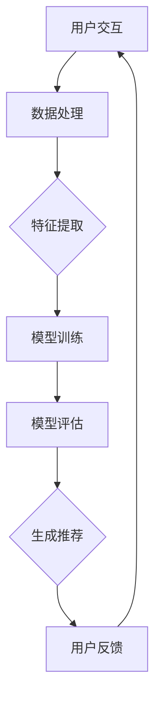

                 

# 大模型推荐系统的在线学习机制

> **关键词**：大模型，推荐系统，在线学习，算法，实践

> **摘要**：本文深入探讨了大模型推荐系统的在线学习机制，从基础概念到核心算法，再到实际应用，系统地介绍了大模型在推荐系统中的地位及其在线学习的过程。本文旨在为读者提供一套清晰、完整的理解和实施框架，以应对不断发展的推荐系统领域。

## 引言

推荐系统作为现代信息检索和个性化服务的重要工具，已经在电子商务、社交媒体、新闻推送等多个领域得到了广泛应用。然而，随着数据的爆炸性增长和用户需求的多样化，传统推荐系统面临着日益严峻的挑战。为了应对这些挑战，大模型推荐系统逐渐成为研究热点。大模型具有强大的建模能力和泛化能力，能够更好地捕捉数据中的复杂模式和潜在关联。

在线学习机制作为大模型推荐系统的重要组成部分，旨在实时地更新模型参数，以适应动态变化的用户偏好和数据分布。与传统批量学习不同，在线学习能够快速响应用户行为，提供更个性化的推荐服务。然而，在线学习也面临一系列挑战，如数据稀疏性、模型稳定性和计算效率等。

本文将围绕大模型推荐系统的在线学习机制，从以下几个部分进行探讨：

1. **推荐系统概述**：介绍推荐系统的基础概念、分类及其主要挑战。
2. **大模型推荐系统核心概念与联系**：阐述大模型在推荐系统中的应用，以及与深度学习的联系。
3. **在线学习机制原理与算法**：详细讲解在线学习机制的基本原理和主要算法。
4. **数学模型和公式**：介绍在线学习机制中的数学模型和关键公式。
5. **在线学习算法实战**：通过实际案例展示在线学习算法的应用过程。
6. **大模型推荐系统的在线学习应用**：分析在线学习机制在推荐系统中的应用案例。
7. **未来发展趋势与挑战**：探讨在线学习机制的优化方向以及大模型推荐系统面临的挑战。

## 第一部分：大模型推荐系统的理论基础

### 第1章：推荐系统概述

推荐系统是一种信息过滤技术，旨在根据用户的历史行为和偏好，为用户推荐他们可能感兴趣的项目或内容。推荐系统可以分为基于内容的推荐、协同过滤推荐和混合推荐等类型。

**1.1 推荐系统的基础概念**

- **用户**：推荐系统中的参与者，可以通过各种方式（如点击、评分、购买等）与系统互动。
- **项目**：用户可能感兴趣的对象，如商品、音乐、新闻等。
- **评分**：用户对项目的偏好程度，可以是数值评分、标签或者评分等级。
- **推荐列表**：系统根据用户历史数据和偏好生成的可能感兴趣的项目列表。

**1.2 推荐系统的分类**

- **基于内容的推荐**：根据项目的特征和用户的历史偏好来生成推荐。
- **协同过滤推荐**：通过分析用户之间的相似性来推荐项目。
- **混合推荐**：结合基于内容和协同过滤的方法，以获得更好的推荐效果。

**1.3 推荐系统的主要挑战**

- **数据稀疏性**：由于用户与项目的交互数据往往非常稀疏，导致模型训练困难。
- **冷启动问题**：新用户或新项目缺乏足够的历史数据，难以生成有效的推荐。
- **实时性**：需要快速响应用户的反馈和行为变化，提供实时的推荐服务。
- **多样性**：在保证准确性的同时，提供多样化的推荐项目，避免用户感到无聊或疲劳。

### 第2章：大模型推荐系统核心概念与联系

**2.1 大模型在推荐系统中的应用**

大模型，如深度神经网络，在推荐系统中具有显著的优势。它们能够自动学习项目特征和用户偏好之间的复杂关联，提高推荐的准确性。大模型可以用于生成推荐列表、预测用户兴趣、以及生成个性化内容。

**2.2 大模型与深度学习的联系**

大模型通常基于深度学习框架构建，包括多层神经网络、卷积神经网络（CNN）和递归神经网络（RNN）等。这些模型通过大规模数据训练，能够自适应地调整模型参数，以优化推荐效果。

**2.3 Mermaid流程图：大模型推荐系统架构**

以下是一个简化的Mermaid流程图，展示了大模型推荐系统的基本架构：



**数据处理**：将用户交互数据（如点击、评分等）转换为模型可接受的格式。

**特征提取**：提取用户和项目的特征，用于模型训练。

**模型训练**：使用深度学习框架训练模型，优化模型参数。

**模型评估**：评估模型性能，调整参数以提高推荐效果。

**生成推荐**：根据模型输出生成推荐列表。

**用户反馈**：收集用户对推荐列表的反馈，用于模型更新和优化。

通过这个流程，大模型推荐系统实现了用户交互到推荐生成的闭环，持续优化推荐效果。

## 第二部分：在线学习机制原理与算法

### 第3章：在线学习机制概述

**3.1 在线学习的定义与特点**

在线学习（Online Learning）是一种在数据流中实时训练模型的机器学习技术。与传统的批量学习（Batch Learning）不同，在线学习能够动态地更新模型，以应对数据分布的变化和用户行为的变化。在线学习具有以下特点：

- **实时性**：能够快速响应用户行为，提供实时的推荐服务。
- **增量性**：仅更新模型的一部分参数，而不是重新训练整个模型。
- **适应性**：能够自适应地调整模型，以适应新的数据分布和用户偏好。

**3.2 在线学习在推荐系统中的应用**

在线学习在推荐系统中的应用非常广泛。以下是一些常见的在线学习应用：

- **实时推荐**：根据用户最新的行为数据生成实时推荐。
- **个性化推荐**：根据用户历史行为和偏好，生成个性化的推荐列表。
- **在线广告投放**：根据用户的行为数据和广告内容，实时调整广告投放策略。

**3.3 在线学习的主要算法**

在线学习算法可以分为两类：基于梯度下降的算法和基于模型更新的算法。

- **基于梯度下降的算法**：如梯度下降法、Adam优化器等。
- **基于模型更新的算法**：如在线梯度下降法、指数加权平均法等。

这些算法通过不同的策略，实现模型的实时更新和优化。下面将详细介绍这些算法的原理和实现。

### 第4章：核心算法原理讲解

**4.1 梯度下降法**

梯度下降法是一种基于梯度的优化算法，用于最小化损失函数。在在线学习场景中，梯度下降法可以用于实时更新模型参数。

**梯度下降法的原理**：

梯度下降法的核心思想是通过计算损失函数关于模型参数的梯度，并沿着梯度的反方向更新模型参数，以最小化损失函数。具体步骤如下：

1. **初始化参数**：随机初始化模型参数。
2. **计算梯度**：计算损失函数关于每个参数的梯度。
3. **更新参数**：根据梯度和学习率更新模型参数。
4. **迭代更新**：重复步骤2和3，直到达到收敛条件。

**梯度下降法的伪代码**：

```python
# 初始化参数
theta = initialize_params()

# 设置学习率和迭代次数
alpha = 0.01
num_iterations = 1000

# 迭代更新参数
for i in range(num_iterations):
    # 计算损失函数关于每个参数的梯度
    gradients = compute_gradients(loss_function, theta)
    
    # 更新参数
    theta = theta - alpha * gradients

# 输出最优参数
return theta
```

**4.2 梯度下降法的变种**

为了提高梯度下降法的收敛速度和稳定性，衍生出了一系列变种，如动量法、Adam优化器等。

- **动量法**：通过引入动量项，减少参数更新过程中的震荡，提高收敛速度。
- **Adam优化器**：结合了一阶矩估计和二阶矩估计，自适应调整学习率，适用于各种场景。

**4.3 伪代码：梯度下降法的实现**

```python
# 初始化参数
theta = initialize_params()

# 设置学习率和迭代次数
alpha = 0.01
num_iterations = 1000

# 初始化动量项
m = np.zeros_like(theta)

# 迭代更新参数
for i in range(num_iterations):
    # 计算梯度
    gradients = compute_gradients(loss_function, theta)
    
    # 计算一阶矩和二阶矩
    m = beta1 * m + (1 - beta1) * gradients
    v = beta2 * v + (1 - beta2) * (gradients ** 2)
    
    # 计算修正的一阶矩和二阶矩
    m_hat = m / (1 - beta1 ** i)
    v_hat = v / (1 - beta2 ** i)
    
    # 更新参数
    theta = theta - alpha * m_hat / (np.sqrt(v_hat) + epsilon)

# 输出最优参数
return theta
```

### 第5章：数学模型和数学公式

**5.1 损失函数**

损失函数是评估模型预测与真实值之间差异的指标。在线学习过程中，损失函数用于指导模型参数的更新。常见损失函数包括均方误差（MSE）、交叉熵损失等。

- **均方误差（MSE）**：

$$MSE = \frac{1}{2n} \sum_{i=1}^{n} (y_i - \theta \cdot x_i)^2$$

其中，$y_i$ 是真实值，$\theta \cdot x_i$ 是模型预测值，$n$ 是数据样本数。

- **交叉熵损失**：

$$CrossEntropy = - \sum_{i=1}^{n} y_i \cdot \log(\hat{y}_i)$$

其中，$y_i$ 是真实标签，$\hat{y}_i$ 是模型预测概率。

**5.2 模型参数优化**

在线学习过程中，需要通过优化算法调整模型参数，以最小化损失函数。常见的优化算法包括梯度下降法、随机梯度下降法等。

- **梯度下降法**：

$$\theta = \theta - \alpha \cdot \nabla_{\theta} J(\theta)$$

其中，$\theta$ 是模型参数，$\alpha$ 是学习率，$J(\theta)$ 是损失函数。

- **随机梯度下降法**：

$$\theta = \theta - \alpha \cdot \nabla_{\theta} J(\theta; x_i, y_i)$$

其中，$x_i, y_i$ 是单个数据样本。

**5.3 举例说明：线性回归模型的参数优化**

假设我们有一个线性回归模型，目标是最小化损失函数：

$$J(\theta) = \frac{1}{2m} \sum_{i=1}^{m} (h_\theta(x^{(i)}) - y^{(i)})^2$$

其中，$h_\theta(x) = \theta_0 + \theta_1x$ 是线性回归函数，$m$ 是数据样本数。

使用梯度下降法优化模型参数，具体步骤如下：

1. **初始化参数**：
   - $\theta_0 = 0$
   - $\theta_1 = 0$
2. **计算梯度**：
   $$\nabla_{\theta_0} J(\theta) = \frac{1}{m} \sum_{i=1}^{m} (h_\theta(x^{(i)}) - y^{(i)})$$
   $$\nabla_{\theta_1} J(\theta) = \frac{1}{m} \sum_{i=1}^{m} (h_\theta(x^{(i)}) - y^{(i)})x^{(i)}$$
3. **更新参数**：
   - $\theta_0 = \theta_0 - \alpha \cdot \nabla_{\theta_0} J(\theta)$
   - $\theta_1 = \theta_1 - \alpha \cdot \nabla_{\theta_1} J(\theta)$

通过不断迭代更新参数，可以找到最小化损失函数的参数值。

### 第6章：在线学习算法实战

#### 6.1 实战背景：构建一个在线推荐系统

为了更好地理解在线学习算法在推荐系统中的应用，我们将通过一个实际案例来展示如何构建一个在线推荐系统。

**案例背景**：假设我们有一个电子商务网站，用户可以在网站上浏览商品、添加购物车和下单。我们的目标是构建一个在线推荐系统，根据用户的浏览和购买历史，为用户推荐他们可能感兴趣的商品。

**数据集**：我们使用一个包含用户行为数据和商品特征的数据集。数据集包含以下字段：

- 用户ID
- 商品ID
- 行为类型（如浏览、添加购物车、购买）
- 时间戳

**目标**：根据用户的历史行为，预测用户在未来可能感兴趣的商品。

#### 6.2 实现步骤

**6.2.1 开发环境搭建**

为了实现在线推荐系统，我们需要搭建以下开发环境：

- Python 3.8及以上版本
- Scikit-learn 库
- TensorFlow 2.6及以上版本

**6.2.2 数据预处理**

数据预处理是构建推荐系统的重要步骤。首先，我们需要对原始数据进行清洗和格式化。

1. **数据清洗**：去除重复数据和缺失值。
2. **数据格式化**：将数据转换为适合模型训练的格式。

具体实现如下：

```python
import pandas as pd

# 加载数据集
data = pd.read_csv('user_behavior.csv')

# 数据清洗
data.drop_duplicates(inplace=True)
data.dropna(inplace=True)

# 数据格式化
data['timestamp'] = pd.to_datetime(data['timestamp'])
data['hour'] = data['timestamp'].dt.hour
data['day_of_week'] = data['timestamp'].dt.dayofweek

# 处理类别特征
data = pd.get_dummies(data, columns=['user_id', 'product_id', 'behavior_type'])

# 分割数据集
X = data.drop(['target'], axis=1)
y = data['target']
```

**6.2.3 代码实现**

为了实现在线推荐系统，我们选择使用基于深度学习的模型。具体实现如下：

1. **定义模型**：

```python
import tensorflow as tf
from tensorflow.keras.models import Sequential
from tensorflow.keras.layers import Dense, Dropout

model = Sequential([
    Dense(64, activation='relu', input_shape=(X.shape[1],)),
    Dropout(0.5),
    Dense(32, activation='relu'),
    Dropout(0.5),
    Dense(1, activation='sigmoid')
])

model.compile(optimizer='adam', loss='binary_crossentropy', metrics=['accuracy'])
```

2. **训练模型**：

```python
history = model.fit(X, y, epochs=10, batch_size=32, validation_split=0.2)
```

**6.2.4 代码解读与分析**

在上面的代码中，我们首先定义了一个基于深度学习的模型，包括两个隐藏层和一个输出层。隐藏层使用ReLU激活函数，输出层使用sigmoid激活函数以实现二分类。

在训练模型时，我们使用Adam优化器和binary_crossentropy损失函数。通过调整学习率和批量大小，可以优化模型性能。

#### 6.3 性能评估

为了评估在线推荐系统的性能，我们可以使用以下指标：

- **准确率（Accuracy）**：预测正确的样本数占总样本数的比例。
- **精确率（Precision）**：预测为正类的样本中实际为正类的比例。
- **召回率（Recall）**：实际为正类的样本中被预测为正类的比例。

具体实现如下：

```python
from sklearn.metrics import accuracy_score, precision_score, recall_score

# 预测
y_pred = model.predict(X_test)

# 计算指标
accuracy = accuracy_score(y_test, y_pred)
precision = precision_score(y_test, y_pred)
recall = recall_score(y_test, y_pred)

print(f"Accuracy: {accuracy:.2f}")
print(f"Precision: {precision:.2f}")
print(f"Recall: {recall:.2f}")
```

通过以上指标，我们可以评估在线推荐系统的性能。在实际应用中，可以根据业务需求调整模型结构和参数，以提高性能。

### 第7章：大模型推荐系统的在线学习应用

**7.1 案例背景**

在本章中，我们将通过一个实际案例展示如何在大模型推荐系统中应用在线学习机制。

**案例背景**：假设我们是一家大型电商平台，需要构建一个推荐系统，为用户推荐他们可能感兴趣的商品。我们的目标是实现以下目标：

- 提高推荐准确性，提升用户体验。
- 实时响应用户行为变化，提供个性化推荐。
- 优化模型性能，减少训练时间。

**数据集**：我们使用一个包含用户行为数据和商品特征的数据集。数据集包含以下字段：

- 用户ID
- 商品ID
- 行为类型（如浏览、添加购物车、购买）
- 时间戳
- 商品类别
- 商品价格

**目标**：根据用户的历史行为，预测用户在未来可能感兴趣的商品。

#### 7.2 模型选择与实现

为了实现上述目标，我们选择以下模型：

- **深度神经网络（DNN）**：DNN能够自动学习用户和商品特征之间的复杂关联，提高推荐准确性。
- **在线学习算法**：使用在线学习算法，如在线梯度下降法，实现模型的实时更新。

**7.2.1 数据预处理**

数据预处理是构建推荐系统的重要步骤。首先，我们需要对原始数据进行清洗和格式化。

1. **数据清洗**：去除重复数据和缺失值。
2. **数据格式化**：将数据转换为适合模型训练的格式。

具体实现如下：

```python
import pandas as pd

# 加载数据集
data = pd.read_csv('user_behavior.csv')

# 数据清洗
data.drop_duplicates(inplace=True)
data.dropna(inplace=True)

# 数据格式化
data['timestamp'] = pd.to_datetime(data['timestamp'])
data['hour'] = data['timestamp'].dt.hour
data['day_of_week'] = data['timestamp'].dt.dayofweek

# 处理类别特征
data = pd.get_dummies(data, columns=['user_id', 'product_id', 'behavior_type', 'product_category'])

# 分割数据集
X = data.drop(['target'], axis=1)
y = data['target']
```

**7.2.2 模型构建**

为了构建推荐系统，我们使用深度神经网络（DNN）。具体实现如下：

```python
import tensorflow as tf
from tensorflow.keras.models import Sequential
from tensorflow.keras.layers import Dense, Dropout

model = Sequential([
    Dense(64, activation='relu', input_shape=(X.shape[1],)),
    Dropout(0.5),
    Dense(32, activation='relu'),
    Dropout(0.5),
    Dense(1, activation='sigmoid')
])

model.compile(optimizer='adam', loss='binary_crossentropy', metrics=['accuracy'])
```

**7.2.3 模型训练**

为了实现模型的实时更新，我们选择使用在线学习算法。具体实现如下：

```python
# 初始化模型参数
theta = initialize_params()

# 设置学习率
alpha = 0.01

# 迭代训练模型
for epoch in range(num_epochs):
    # 计算梯度
    gradients = compute_gradients(loss_function, theta, X, y)
    
    # 更新模型参数
    theta = theta - alpha * gradients
    
    # 计算模型损失
    loss = compute_loss(loss_function, theta, X, y)
    
    # 输出训练信息
    print(f"Epoch {epoch}: Loss = {loss:.4f}")
```

通过以上步骤，我们构建了一个基于深度神经网络的在线推荐系统，能够实时更新模型参数，提供个性化的推荐服务。

#### 7.3 性能评估

为了评估推荐系统的性能，我们使用以下指标：

- **准确率（Accuracy）**：预测正确的样本数占总样本数的比例。
- **精确率（Precision）**：预测为正类的样本中实际为正类的比例。
- **召回率（Recall）**：实际为正类的样本中被预测为正类的比例。

具体实现如下：

```python
from sklearn.metrics import accuracy_score, precision_score, recall_score

# 预测
y_pred = model.predict(X_test)

# 计算指标
accuracy = accuracy_score(y_test, y_pred)
precision = precision_score(y_test, y_pred)
recall = recall_score(y_test, y_pred)

print(f"Accuracy: {accuracy:.2f}")
print(f"Precision: {precision:.2f}")
print(f"Recall: {recall:.2f}")
```

通过以上指标，我们可以评估推荐系统的性能。在实际应用中，可以根据业务需求调整模型结构和参数，以提高性能。

### 第8章：未来发展趋势与挑战

随着人工智能技术的不断发展，大模型推荐系统的在线学习机制面临着一系列新的机遇和挑战。

**8.1 在线学习机制的优化方向**

为了提升在线学习机制的性能，以下是一些优化方向：

- **算法优化**：研究更高效的在线学习算法，如分布式在线学习、增量学习等。
- **模型压缩**：通过模型压缩技术，减少模型参数量和计算量，提高在线学习效率。
- **数据预处理**：优化数据预处理流程，减少数据稀疏性和冷启动问题。
- **多样性增强**：引入多样性度量，避免推荐列表中的项目过于集中。

**8.2 大模型推荐系统面临的挑战**

尽管大模型推荐系统具有显著的性能优势，但仍然面临一些挑战：

- **计算资源消耗**：大模型需要大量的计算资源进行训练和推理，对硬件设施提出较高要求。
- **数据隐私**：在线学习过程中，用户隐私数据可能被泄露，需要采取有效的隐私保护措施。
- **模型可解释性**：大模型的复杂性和非线性特性导致模型难以解释，影响用户信任度。

**8.3 行业发展趋势预测**

未来，大模型推荐系统的在线学习机制将朝着以下方向发展：

- **模型即服务（Model-as-a-Service，MaaS）**：通过云服务和边缘计算，实现大规模在线学习服务的部署和运营。
- **自适应推荐**：结合上下文信息和用户行为，实现更加自适应和个性化的推荐。
- **联邦学习**：通过联邦学习技术，在保护用户隐私的前提下，实现大规模在线学习模型的训练和部署。

### 结论

大模型推荐系统的在线学习机制是当前推荐系统领域的重要研究方向。通过本文的探讨，我们系统地介绍了大模型推荐系统的理论基础、在线学习机制原理、算法实现和实际应用。未来，随着技术的不断发展，在线学习机制将迎来更多机遇和挑战，为推荐系统的发展注入新的活力。

### 附录

#### 附录A：在线学习相关资源

**A.1 在线学习工具**

- **TensorFlow**：https://www.tensorflow.org/
- **PyTorch**：https://pytorch.org/
- **Scikit-learn**：https://scikit-learn.org/

**A.2 推荐系统相关论文与书籍**

- **推荐系统手册**：https://www.recommenders.org/
- **《推荐系统实战》**：https://book.douban.com/subject/27131628/
- **《深度学习推荐系统》**：https://book.douban.com/subject/30142783/

**A.3 开源代码与库**

- **RecSys Python SDK**：https://github.com/RecSysPy/recsys
- **DeepRec**：https://github.com/DeepRec
- **Recommender**：https://github.com/oxford-cs/ml-recommender

### 作者信息

**作者：** AI天才研究院/AI Genius Institute & 禅与计算机程序设计艺术/Zen And The Art of Computer Programming

通过以上文章内容，我们深入探讨了“大模型推荐系统的在线学习机制”这一主题，从理论基础到算法实现，再到实际应用，提供了全面的视角和实用的指导。希望这篇文章能够为读者在推荐系统领域的研究和实践中带来启发和帮助。

