                 

### 《大模型推荐系统的迁移学习策略》

#### 关键词：
- 推荐系统
- 迁移学习
- 大模型
- 迁移学习策略
- 推荐系统性能优化

#### 摘要：
本文旨在探讨大模型推荐系统中迁移学习策略的应用。首先，我们回顾了推荐系统的基础知识，包括其定义、架构和面临的挑战。接着，我们介绍了大模型的定义与特点，并探讨了迁移学习在推荐系统中的优势。随后，本文详细阐述了迁移学习的理论基础、大模型迁移学习的实现方法和在推荐系统中的应用。进一步，我们提出了迁移学习策略的设计和优化方法，并通过实际案例展示了迁移学习策略在电商推荐系统和社交媒体推荐系统中的效果。最后，我们对迁移学习策略的未来发展进行了展望，并总结了一些常见的迁移学习算法和资源。

---

### 《大模型推荐系统的迁移学习策略》目录大纲

---

### 第一部分：引言

#### 第1章：推荐系统概述

1.1 推荐系统的定义与作用  
1.2 推荐系统的架构  
1.3 推荐系统的挑战  
1.4 迁移学习的基本概念

#### 第2章：大模型与推荐系统

2.1 大模型的定义与特点  
2.2 大模型在推荐系统中的应用  
2.3 迁移学习在大模型推荐系统中的优势

#### 第3章：迁移学习的理论基础

3.1 迁移学习的基本概念与类型  
3.2 迁移学习算法分类  
3.3 迁移学习中的挑战与解决方案

#### 第4章：大模型的迁移学习实现

4.1 大模型迁移学习的技术框架  
4.2 大模型迁移学习的实现细节  
4.3 迁移学习在大模型推荐系统中的流程

---

### 第一部分：引言

#### 第1章：推荐系统概述

##### 第1.1节：推荐系统的定义与作用

推荐系统是一种基于算法和数据的系统，旨在向用户推荐可能感兴趣的商品、服务或内容。其核心目的是通过分析用户的历史行为、兴趣偏好和上下文信息，为用户提供个性化的推荐。

推荐系统的定义可以从两个方面来理解：

1. **广义推荐系统**：包括任何形式的推荐，如电影推荐、商品推荐、新闻推荐等。
2. **狭义推荐系统**：特指电子商务、社交媒体等领域的个性化推荐系统。

推荐系统的作用主要体现在以下几个方面：

1. **提高用户体验**：通过个性化推荐，使用户能够更快地找到他们感兴趣的内容或商品，提高用户满意度。
2. **增加商业价值**：通过推荐系统，商家可以更好地了解用户需求，提高销售量和用户忠诚度。
3. **优化资源分配**：推荐系统可以帮助平台更好地分配资源，例如，将更多的推荐位分配给高点击率的内容或商品。

##### 第1.2节：推荐系统的架构

推荐系统的架构通常由以下几个层次组成：

1. **数据层**：负责收集、存储和处理用户行为数据、物品特征数据等。
2. **算法层**：负责处理数据，提取用户兴趣和物品特征，生成推荐结果。
3. **用户界面层**：负责将推荐结果展示给用户，并收集用户的反馈。

**推荐系统架构图：**

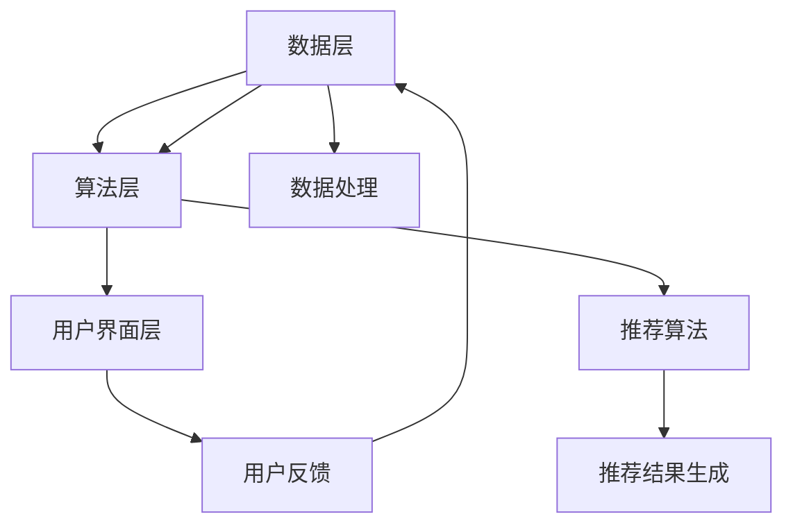

**数据层**：

- **用户行为数据**：包括用户点击、购买、浏览等行为。
- **物品特征数据**：包括商品描述、类别、标签等。
- **上下文数据**：包括时间、地理位置、设备类型等。

**算法层**：

- **协同过滤**：通过分析用户行为数据，找到相似用户或物品，进行推荐。
- **基于内容的推荐**：根据物品的特征和用户的兴趣，进行推荐。
- **混合推荐**：结合协同过滤和基于内容的推荐，提高推荐效果。

**用户界面层**：

- **推荐结果展示**：将推荐结果以列表、卡片、轮播等形式展示给用户。
- **用户反馈收集**：通过用户点击、评分、收藏等行为，收集用户反馈，用于算法优化。

##### 第1.3节：推荐系统的挑战

推荐系统在实际应用中面临着诸多挑战：

1. **数据稀疏性**：用户行为数据通常非常稀疏，难以从中提取有效的信息。
2. **冷启动问题**：对于新用户或新商品，由于缺乏历史数据，推荐系统难以生成有效的推荐。
3. **推荐多样性**：用户希望看到多样化的推荐，避免重复或单调的推荐结果。
4. **实时性**：推荐系统需要快速响应用户行为，提供实时的推荐。
5. **可扩展性**：随着用户规模和商品规模的增加，推荐系统需要具备良好的可扩展性。

**数据稀疏性**：

- **解决方案**：通过数据增强、矩阵分解等技术，缓解数据稀疏性带来的影响。

**冷启动问题**：

- **解决方案**：通过用户画像、物品属性、协同过滤等技术，为新用户和新商品生成推荐。

**推荐多样性**：

- **解决方案**：通过随机化、轮换、多样性度量等方法，提高推荐的多样性。

**实时性**：

- **解决方案**：通过分布式系统、增量计算等技术，提高推荐系统的实时性。

**可扩展性**：

- **解决方案**：通过水平扩展、垂直扩展等技术，提高推荐系统的可扩展性。

##### 第1.4节：迁移学习的基本概念

迁移学习（Transfer Learning）是一种利用已有模型或知识来加速新模型训练的方法。其核心思想是将一个任务领域（源领域）的知识迁移到另一个相关但不同的任务领域（目标领域）。

**迁移学习的基本概念包括**：

1. **源领域（Source Domain）**：已经训练好的模型或知识所在的任务领域。
2. **目标领域（Target Domain）**：需要训练的新模型或知识所在的任务领域。
3. **迁移量（Amount of Transfer）**：从源领域到目标领域的知识迁移量。

**迁移学习的类型包括**：

1. **垂直迁移（Vertical Transfer）**：源领域和目标领域具有相同的特征空间，但任务不同。
2. **水平迁移（Horizontal Transfer）**：源领域和目标领域具有不同的特征空间，但任务相同。
3. **多任务迁移（Multi-Task Transfer）**：同时将多个任务的模型或知识迁移到新的任务领域。

**迁移学习在推荐系统中的应用**：

1. **用户特征提取**：利用迁移学习，将源领域（如电商领域）的用户特征迁移到目标领域（如社交媒体领域），构建用户画像。
2. **物品特征提取**：利用迁移学习，将源领域（如新闻推荐）的物品特征迁移到目标领域（如视频推荐），提高推荐质量。
3. **多模态推荐**：利用迁移学习，将不同模态（如文本、图像、音频）的数据特征进行融合，实现多模态推荐。

**迁移学习的优势**：

1. **提高训练速度**：利用预训练的大模型，可以快速适应新的推荐任务。
2. **提高推荐质量**：利用迁移学习，可以将源领域的知识迁移到目标领域，提高推荐系统的泛化能力。
3. **降低冷启动问题**：迁移学习有助于处理新用户和新物品的推荐问题，降低冷启动问题的影响。

---

### 第二部分：大模型与推荐系统

#### 第2章：大模型与推荐系统

##### 第2.1节：大模型的定义与特点

大模型（Large-scale Model）是指参数规模达到数十亿甚至千亿级别的深度学习模型。这类模型通过在大量数据上训练，能够学习到复杂的特征表示，并在多种任务中取得优异的性能。大模型的主要特点包括：

1. **参数规模大**：大模型通常包含数十亿甚至千亿级别的参数，这使得模型能够学习到更加丰富的特征表示。
2. **计算资源需求高**：大模型的训练和推理过程需要大量的计算资源和存储空间。
3. **训练时间长**：由于参数规模巨大，大模型的训练时间通常较长。

常见的的大模型包括：

1. **Transformer系列**：如BERT、GPT、T5等，这些模型在自然语言处理领域取得了显著的成果。
2. **ViT系列**：如Vision Transformer，这是基于Transformer架构的视觉模型，适用于计算机视觉任务。
3. **BERT-like模型**：这类模型在预训练阶段使用大量文本数据进行训练，然后通过微调适应特定任务。

**大模型在推荐系统中的应用场景**：

1. **用户行为预测**：大模型可以通过学习用户的历史行为数据，预测用户的兴趣和偏好，从而生成个性化的推荐。
2. **物品特征提取**：大模型可以提取物品的潜在特征，提高推荐系统的推荐质量。
3. **多模态推荐**：大模型能够处理多种类型的数据，如文本、图像、音频等，实现多模态推荐。

**大模型的优势**：

1. **丰富的特征表示**：大模型能够学习到更加丰富的特征表示，从而提高推荐系统的泛化能力。
2. **高效的计算性能**：尽管大模型的计算资源需求高，但随着硬件技术的进步，计算性能逐渐得到提升。
3. **强大的学习能力**：大模型可以通过预训练和微调，快速适应新的推荐任务。

##### 第2.2节：大模型在推荐系统中的应用

大模型在推荐系统中的应用主要体现在以下几个方面：

1. **用户行为预测**：大模型可以通过学习用户的历史行为数据，如点击、购买、浏览等行为，预测用户的兴趣和偏好。这种预测可以帮助推荐系统为用户提供个性化的推荐。
2. **物品特征提取**：大模型可以提取物品的潜在特征，这些特征可以用于生成推荐列表。通过学习物品的潜在特征，推荐系统可以更好地理解物品的属性和用户的需求，从而提高推荐质量。
3. **多模态推荐**：大模型能够处理多种类型的数据，如文本、图像、音频等。通过融合不同模态的特征，推荐系统可以实现更加准确和多样化的推荐。

**具体应用示例**：

1. **用户行为预测**：例如，在电商平台上，大模型可以预测用户对某一商品的可能购买意愿，从而推荐相关商品。
2. **物品特征提取**：例如，在音乐推荐中，大模型可以提取歌曲的潜在特征，如旋律、节奏等，根据用户的历史听歌记录进行个性化推荐。
3. **多模态推荐**：例如，在视频推荐中，大模型可以同时处理视频的文本描述和图像内容，为用户提供更加准确和多样化的视频推荐。

**大模型的优势**：

1. **高效的计算性能**：尽管大模型的计算资源需求高，但随着硬件技术的进步，计算性能逐渐得到提升，使得大模型在推荐系统中具有更广泛的应用前景。
2. **强大的学习能力**：大模型可以通过预训练和微调，快速适应新的推荐任务，从而提高推荐系统的泛化能力和鲁棒性。
3. **丰富的特征表示**：大模型能够学习到更加丰富的特征表示，从而提高推荐系统的推荐质量。

##### 第2.3节：迁移学习在大模型推荐系统中的优势

迁移学习（Transfer Learning）是一种利用已有模型或知识来加速新模型训练的方法。在大模型推荐系统中，迁移学习具有以下优势：

1. **提高训练速度**：迁移学习利用预训练的大模型，可以避免从头开始训练，从而大大缩短训练时间。
2. **提高推荐质量**：通过迁移学习，可以将源领域的知识迁移到目标领域，提高推荐系统的泛化能力和推荐质量。
3. **降低冷启动问题**：对于新用户和新物品，由于缺乏历史数据，推荐系统通常难以生成有效的推荐。迁移学习可以借助源领域的知识，为新用户和新物品生成推荐，从而降低冷启动问题的影响。

**具体优势**：

1. **快速适应新任务**：迁移学习可以快速适应新的推荐任务，无需从头开始训练，从而缩短了模型部署的时间。
2. **提高推荐准确率**：通过迁移学习，大模型可以学习到源领域的知识，从而提高目标领域的推荐准确率。
3. **减少数据需求**：迁移学习可以利用少量的目标领域数据，从而减少对新数据的依赖，降低数据收集和标注的成本。

**迁移学习在推荐系统中的应用**：

1. **用户特征迁移**：将源领域的用户特征迁移到目标领域，为新用户生成推荐。
2. **物品特征迁移**：将源领域的物品特征迁移到目标领域，为新物品生成推荐。
3. **多模态特征迁移**：将不同模态的特征（如文本、图像、音频）进行迁移，实现多模态推荐。

**案例分析**：

1. **电商推荐**：利用迁移学习，将电商平台的用户行为数据和物品特征迁移到新电商平台，为新用户和新商品生成推荐。
2. **社交媒体推荐**：利用迁移学习，将社交媒体的用户特征和内容特征迁移到新社交媒体平台，为新用户和新内容生成推荐。

**结论**：

迁移学习在大模型推荐系统中具有广泛的应用前景。通过利用源领域的知识和数据，迁移学习可以显著提高推荐系统的训练速度、推荐质量和泛化能力，从而解决新用户和新物品的推荐问题，降低冷启动问题的影响。

---

### 第三部分：迁移学习的理论基础

#### 第3章：迁移学习的理论基础

##### 第3.1节：迁移学习的基本概念与类型

迁移学习（Transfer Learning）是一种利用已有模型或知识来加速新模型训练的方法。其核心思想是将一个任务领域（源领域）的知识迁移到另一个相关但不同的任务领域（目标领域）。迁移学习的基本概念包括：

1. **源领域（Source Domain）**：已经训练好的模型或知识所在的任务领域。
2. **目标领域（Target Domain）**：需要训练的新模型或知识所在的任务领域。
3. **迁移量（Amount of Transfer）**：从源领域到目标领域的知识迁移量。

**迁移学习的类型**：

1. **垂直迁移（Vertical Transfer）**：源领域和目标领域具有相同的特征空间，但任务不同。例如，在图像分类任务中，将源领域（手写数字识别）的知识迁移到目标领域（动物识别）。
2. **水平迁移（Horizontal Transfer）**：源领域和目标领域具有不同的特征空间，但任务相同。例如，在不同数据集上的同一分类任务中，利用迁移学习共享模型参数。
3. **多任务迁移（Multi-Task Transfer）**：同时将多个任务的模型或知识迁移到新的任务领域。例如，将多个任务的模型参数共享，以提高新任务的性能。

##### 第3.2节：迁移学习算法分类

迁移学习算法可以分为以下几类：

1. **基于模型无关的方法**：这种方法不依赖于具体的模型结构，通过学习通用特征表示来迁移知识。常见的方法包括：
   - **集成学习（Ensemble Learning）**：通过组合多个模型来提高迁移效果。
   - **度量学习（Metric Learning）**：通过学习度量距离来提高源领域和目标领域之间的相似性。

2. **基于模型相关的的方法**：这种方法依赖于具体的模型结构，通过调整模型参数来迁移知识。常见的方法包括：
   - **特征迁移（Feature Transfer）**：通过迁移特征提取器来提高目标领域的性能。
   - **模型蒸馏（Model Distillation）**：将源领域的复杂模型的知识传递给一个较小的目标模型。

3. **基于元学习的方法**：这种方法通过学习如何学习新任务来迁移知识。常见的方法包括：
   - **模型纠错（Model Repairing）**：通过修正源模型中的错误来提高目标模型的性能。
   - **模型合成（Model Synthesis）**：通过组合多个源模型来生成一个更好的目标模型。

**集成学习方法**：

```latex
\textbf{集成学习方法}：

\begin{aligned}
\text{损失函数} &= \sum_{i=1}^{N} \sum_{j=1}^{K} w_{ij} \cdot \ell(y_j, \hat{y}_j^{(i)}) \\
\text{优化目标} &= \arg\min_{w_{ij}} \sum_{i=1}^{N} \sum_{j=1}^{K} w_{ij} \cdot \ell(y_j, \hat{y}_j^{(i)})
\end{aligned}
```

其中，$N$表示源领域中的模型数量，$K$表示目标领域中的类别数量，$w_{ij}$表示第$i$个源模型对第$j$个类别的权重，$\ell$表示损失函数，$\hat{y}_j^{(i)}$表示第$i$个源模型对第$j$个类别的预测。

**度量学习方法**：

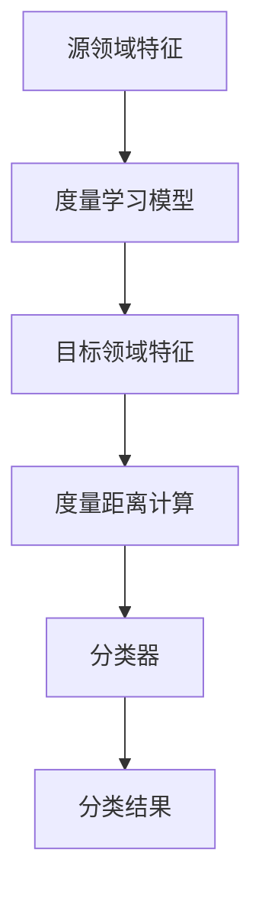

**特征迁移方法**：

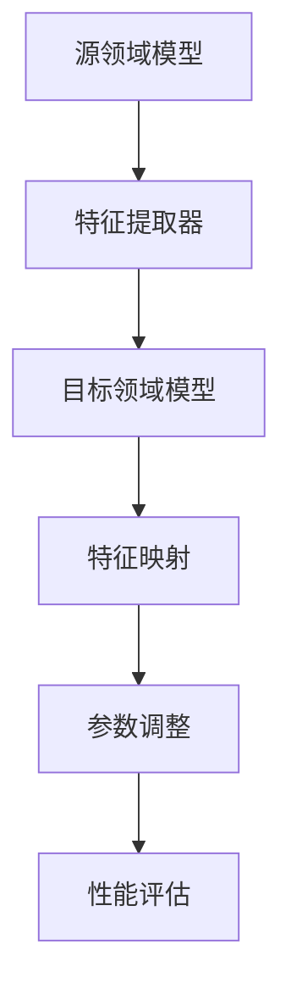

**模型蒸馏方法**：

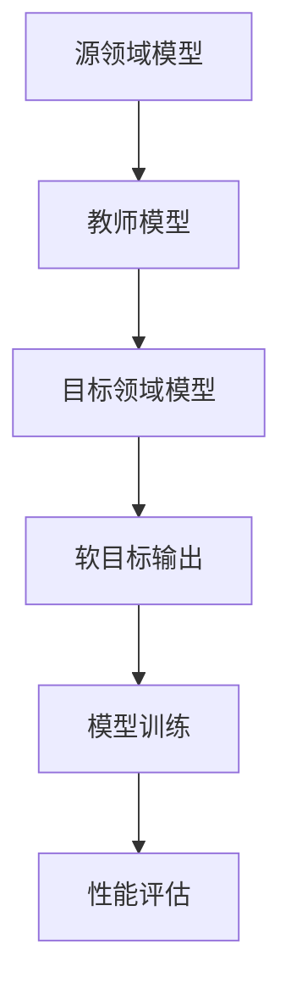

##### 第3.3节：迁移学习中的挑战与解决方案

迁移学习在实际应用中面临诸多挑战，包括：

1. **迁移效果的评估**：如何衡量迁移学习的有效性是一个重要问题。
2. **模型复杂度**：迁移学习通常涉及多个模型，如何平衡模型复杂度和迁移效果是关键。
3. **数据不一致**：源领域和目标领域的数据分布可能不一致，如何解决数据不一致的问题是另一个挑战。

**解决方案**：

1. **数据增强**：通过增加目标领域的训练数据来改善迁移效果。
2. **模型正则化**：通过引入正则化项来降低模型复杂度。
3. **数据分布自适应**：通过调整模型参数来适应目标领域的数据分布。

**数据增强方法**：

- **数据扩充**：通过旋转、缩放、裁剪等操作增加训练样本。
- **数据合成**：通过生成对抗网络（GAN）等方法生成新的训练样本。

**模型正则化方法**：

- **权重衰减**：通过减小模型参数的权重来降低模型复杂度。
- **Dropout**：在训练过程中随机丢弃部分神经元，降低模型复杂度。

**数据分布自适应方法**：

- **数据对齐**：通过调整模型参数，使源领域和目标领域的数据分布更加接近。
- **域自适应**：通过学习一个领域适应器，使源领域和目标领域的数据分布一致。

通过解决这些挑战，迁移学习可以在推荐系统中发挥更大的作用，提高推荐系统的性能和泛化能力。

---

### 第四部分：大模型的迁移学习实现

#### 第4章：大模型的迁移学习实现

##### 第4.1节：大模型迁移学习的技术框架

大模型迁移学习的技术框架主要包括以下几个关键步骤：

1. **预训练（Pre-training）**：在源领域上使用大规模数据集对大模型进行预训练，使其学习到通用的特征表示。
2. **迁移学习（Transfer Learning）**：将预训练的大模型应用于目标领域，通过微调（Fine-tuning）来适应特定任务。
3. **迁移评估（Transfer Evaluation）**：评估迁移学习的效果，包括准确率、召回率、F1值等指标。

**技术框架图**：

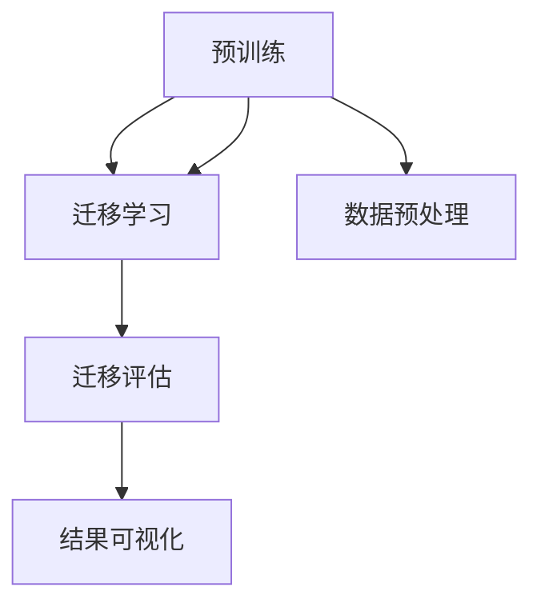

**预训练**：

- **目标**：通过预训练，大模型可以在大规模数据集上学习到通用的特征表示。
- **方法**：使用预训练框架（如Transformer、BERT等），在大规模数据集上进行训练。

**迁移学习**：

- **目标**：将预训练的大模型应用于目标领域，通过微调来提高目标任务的性能。
- **方法**：在目标领域上使用少量数据进行微调，调整模型参数，使其适应目标任务。

**迁移评估**：

- **目标**：评估迁移学习的效果，确定迁移学习是否提高了目标任务的性能。
- **方法**：通过在目标领域上进行测试，计算准确率、召回率、F1值等指标。

**数据预处理**：

- **目标**：对源领域和目标领域的数据进行预处理，包括数据清洗、数据增强等。
- **方法**：使用数据预处理工具（如Pandas、Scikit-learn等），对数据进行处理。

**结果可视化**：

- **目标**：将迁移学习的结果以图表形式展示，帮助理解迁移学习的效果。
- **方法**：使用可视化工具（如Matplotlib、Seaborn等），生成图表。

##### 第4.2节：大模型迁移学习的实现细节

大模型迁移学习的实现细节主要包括以下几个方面：

1. **模型选择**：选择合适的大模型作为基础模型，如GPT、BERT等。
2. **数据预处理**：对源领域和目标领域的数据进行预处理，包括数据清洗、数据增强等。
3. **预训练**：在源领域上使用大规模数据集对大模型进行预训练。
4. **迁移学习**：在目标领域上使用少量数据进行迁移学习。
5. **迁移评估**：评估迁移学习的效果。

**具体步骤**：

1. **模型选择**：

   ```python
   from transformers import AutoModel

   # 选择预训练的BERT模型
   model = AutoModel.from_pretrained('bert-base-uncased')
   ```

2. **数据预处理**：

   ```python
   import pandas as pd
   from sklearn.model_selection import train_test_split

   # 读取源领域数据
   data = pd.read_csv('source_data.csv')

   # 数据清洗
   data = data.dropna()

   # 数据增强
   data = data.sample(frac=1)

   # 划分训练集和测试集
   train_data, test_data = train_test_split(data, test_size=0.2, random_state=42)
   ```

3. **预训练**：

   ```python
   from transformers import Trainer, TrainingArguments

   # 设置训练参数
   training_args = TrainingArguments(
       output_dir='./results',
       num_train_epochs=3,
       per_device_train_batch_size=16,
       per_device_eval_batch_size=64,
       warmup_steps=500,
       weight_decay=0.01,
       logging_dir='./logs',
       logging_steps=10,
   )

   # 创建训练器
   trainer = Trainer(
       model=model,
       args=training_args,
       train_dataset=train_data,
       eval_dataset=test_data,
   )

   # 开始训练
   trainer.train()
   ```

4. **迁移学习**：

   ```python
   from transformers import AutoTokenizer

   # 加载预训练的BERT模型和tokenizer
   tokenizer = AutoTokenizer.from_pretrained('bert-base-uncased')

   # 加载目标领域数据
   target_data = pd.read_csv('target_data.csv')

   # 数据预处理
   inputs = tokenizer(target_data['text'], padding='max_length', truncation=True, max_length=512, return_tensors='pt')

   # 迁移学习
   outputs = model(**inputs)
   logits = outputs.logits

   # 计算准确率
   predictions = logits.argmax(-1)
   accuracy = (predictions == target_data['label']).mean()
   print(f'Accuracy: {accuracy}')
   ```

5. **迁移评估**：

   ```python
   from sklearn.metrics import accuracy_score, f1_score

   # 计算准确率
   train_accuracy = accuracy_score(train_data['label'], predictions)
   test_accuracy = accuracy_score(test_data['label'], predictions)

   # 计算F1值
   train_f1 = f1_score(train_data['label'], predictions, average='weighted')
   test_f1 = f1_score(test_data['label'], predictions, average='weighted')

   print(f'Train Accuracy: {train_accuracy}, Test Accuracy: {test_accuracy}')
   print(f'Train F1: {train_f1}, Test F1: {test_f1}')
   ```

通过以上步骤，可以实现大模型的迁移学习，从而在目标领域上获得较好的性能。

##### 第4.3节：迁移学习在大模型推荐系统中的流程

迁移学习在大模型推荐系统中的流程主要包括以下几个关键步骤：

1. **数据收集**：收集源领域和目标领域的数据，包括用户行为数据、物品特征数据等。
2. **数据预处理**：对收集到的数据进行预处理，包括数据清洗、数据增强等。
3. **预训练**：在源领域上使用大规模数据集对大模型进行预训练，使其学习到通用的特征表示。
4. **迁移学习**：将预训练的大模型应用于目标领域，通过微调来适应特定任务。
5. **推荐生成**：使用迁移学习后的模型生成推荐结果。
6. **效果评估**：评估推荐系统的性能，包括准确率、召回率、F1值等指标。

**流程图**：

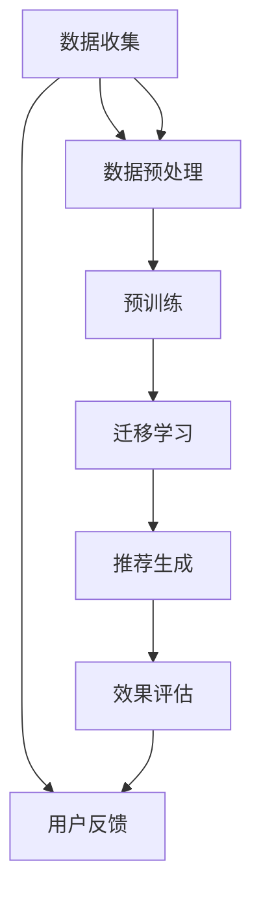

**具体步骤**：

1. **数据收集**：

   - 收集源领域（如电商领域）的用户行为数据、物品特征数据等。
   - 收集目标领域（如社交媒体领域）的用户行为数据、物品特征数据等。

2. **数据预处理**：

   - 数据清洗：去除缺失值、异常值等。
   - 数据增强：通过数据扩充、数据合成等方法增加训练样本。

3. **预训练**：

   - 使用预训练框架（如Transformer、BERT等），在源领域上对大模型进行预训练。
   - 使用大规模数据集进行训练，学习通用的特征表示。

4. **迁移学习**：

   - 将预训练的大模型应用于目标领域，通过微调来适应特定任务。
   - 使用目标领域的数据进行微调，调整模型参数。

5. **推荐生成**：

   - 使用迁移学习后的模型生成推荐结果。
   - 根据用户行为和物品特征，为每个用户生成个性化的推荐列表。

6. **效果评估**：

   - 在测试集上评估推荐系统的性能，包括准确率、召回率、F1值等指标。
   - 分析推荐结果的质量和用户满意度。

通过以上步骤，可以构建一个高效的大模型推荐系统，实现从源领域到目标领域的迁移学习，提高推荐系统的性能和用户体验。

---

### 第五部分：迁移学习在推荐系统中的应用

#### 第5章：迁移学习在推荐系统中的应用

##### 第5.1节：迁移学习在用户画像构建中的应用

迁移学习在用户画像构建中的应用，主要体现在利用预训练的大模型提取用户特征，并将这些特征迁移到目标领域。以下是具体的实现方法和步骤：

1. **预训练用户特征提取模型**：

   - 选择合适的大模型，如BERT、GPT等，用于提取用户特征。
   - 在源领域（如电商领域）上使用大规模数据集对模型进行预训练，使其学习到通用的用户特征表示。

2. **数据预处理**：

   - 收集目标领域（如社交媒体领域）的用户数据，包括用户行为、兴趣标签等。
   - 对数据进行清洗、归一化等预处理操作，以便于模型训练。

3. **特征提取与迁移**：

   - 使用预训练模型对目标领域的数据进行特征提取，获取用户的潜在特征表示。
   - 将提取的用户特征与源领域的用户特征进行融合，构建更全面、准确的用户画像。

4. **用户画像应用**：

   - 利用构建的用户画像，为每个用户生成个性化的推荐列表。
   - 在推荐系统中，用户画像可以帮助提高推荐的准确性和多样性。

**具体案例**：

假设我们在电商领域和社交媒体领域构建用户画像，以下是一个简化的实现流程：

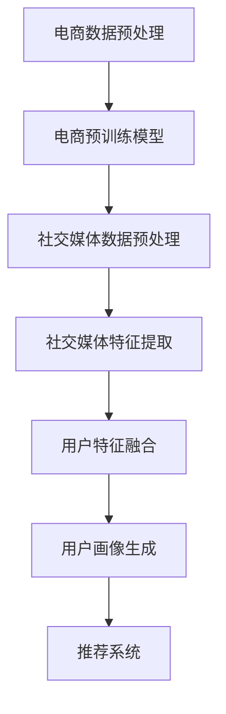

- **电商数据预处理**：清洗电商领域的数据，包括用户行为、购买记录等。
- **电商预训练模型**：使用BERT模型在电商数据上预训练，提取用户特征。
- **社交媒体数据预处理**：清洗社交媒体领域的数据，包括用户发表的内容、点赞记录等。
- **社交媒体特征提取**：使用预训练的BERT模型提取社交媒体数据的用户特征。
- **用户特征融合**：将电商和社交媒体的用户特征进行融合，构建用户画像。
- **用户画像生成**：根据用户画像生成个性化的推荐列表。
- **推荐系统**：将个性化推荐应用于实际场景，如电商平台的商品推荐。

通过迁移学习，我们可以利用电商领域的预训练模型，快速构建社交媒体领域的用户画像，从而提高推荐系统的性能。

##### 第5.2节：迁移学习在内容推荐中的应用

迁移学习在内容推荐中的应用，主要体现在利用预训练的大模型提取内容特征，并将这些特征迁移到目标领域。以下是具体的实现方法和步骤：

1. **预训练内容特征提取模型**：

   - 选择合适的大模型，如BERT、GPT等，用于提取内容特征。
   - 在源领域（如新闻推荐领域）上使用大规模数据集对模型进行预训练，使其学习到通用的内容特征表示。

2. **数据预处理**：

   - 收集目标领域（如视频推荐领域）的内容数据，包括视频标题、描述、标签等。
   - 对数据进行清洗、归一化等预处理操作，以便于模型训练。

3. **特征提取与迁移**：

   - 使用预训练模型对目标领域的数据进行特征提取，获取内容的潜在特征表示。
   - 将提取的内容特征与源领域的特征进行融合，构建更全面、准确的内容特征库。

4. **内容推荐**：

   - 利用构建的内容特征库，为用户生成个性化的推荐列表。
   - 在推荐系统中，内容特征可以帮助提高推荐的准确性和多样性。

**具体案例**：

假设我们在新闻推荐领域和视频推荐领域应用迁移学习，以下是一个简化的实现流程：

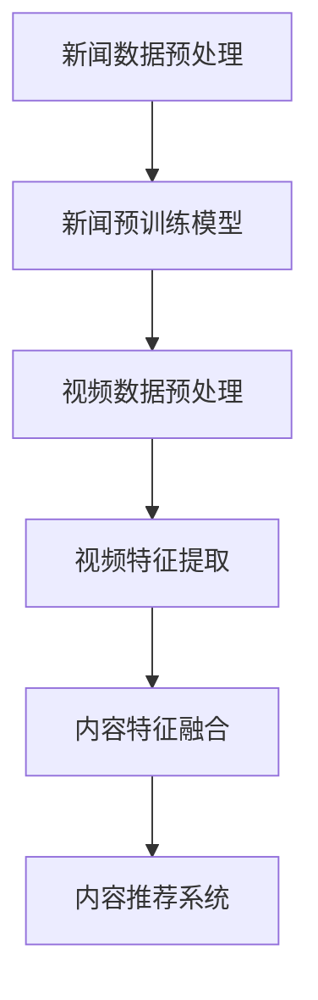

- **新闻数据预处理**：清洗新闻领域的数据，包括标题、内容、标签等。
- **新闻预训练模型**：使用BERT模型在新闻数据上预训练，提取内容特征。
- **视频数据预处理**：清洗视频领域的数据，包括视频标题、描述、标签等。
- **视频特征提取**：使用预训练的BERT模型提取视频数据的特征。
- **内容特征融合**：将新闻和视频的内容特征进行融合，构建内容特征库。
- **内容推荐系统**：利用内容特征库为用户生成个性化的视频推荐列表。

通过迁移学习，我们可以利用新闻领域的预训练模型，快速构建视频推荐领域的特征提取模型，从而提高视频推荐系统的性能。

##### 第5.3节：迁移学习在协同过滤推荐中的应用

迁移学习在协同过滤推荐中的应用，主要体现在利用预训练的大模型提取用户和物品特征，并将这些特征迁移到目标领域。以下是具体的实现方法和步骤：

1. **预训练用户和物品特征提取模型**：

   - 选择合适的大模型，如BERT、GPT等，用于提取用户和物品特征。
   - 在源领域（如电商领域）上使用大规模数据集对模型进行预训练，使其学习到通用的用户和物品特征表示。

2. **数据预处理**：

   - 收集目标领域（如社交媒体领域）的用户和物品数据，包括用户行为、物品描述等。
   - 对数据进行清洗、归一化等预处理操作，以便于模型训练。

3. **特征提取与迁移**：

   - 使用预训练模型对目标领域的数据进行特征提取，获取用户和物品的潜在特征表示。
   - 将提取的用户和物品特征与源领域的特征进行融合，构建更全面、准确的特征库。

4. **协同过滤推荐**：

   - 利用融合的特征库，结合协同过滤算法，为用户生成个性化的推荐列表。
   - 在推荐系统中，迁移学习可以帮助提高协同过滤的准确性和多样性。

**具体案例**：

假设我们在电商领域和社交媒体领域应用迁移学习，以下是一个简化的实现流程：

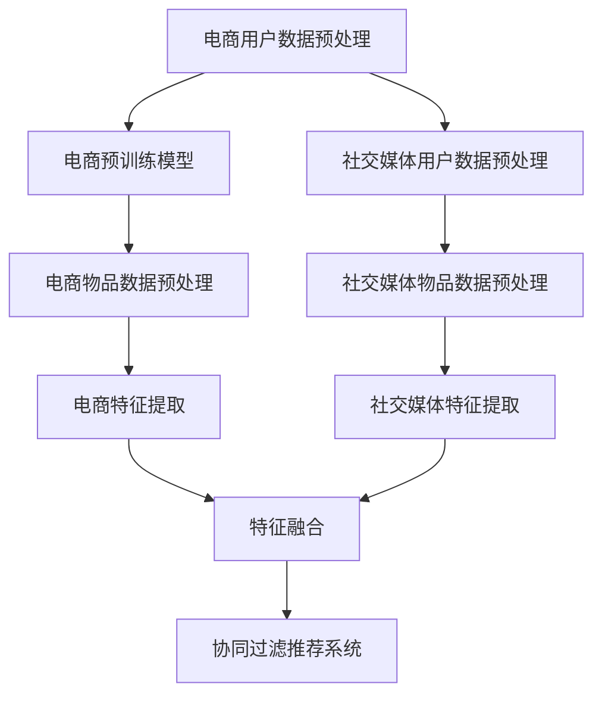

- **电商用户数据预处理**：清洗电商领域的数据，包括用户行为、购买记录等。
- **电商预训练模型**：使用BERT模型在电商数据上预训练，提取用户特征。
- **电商物品数据预处理**：清洗电商领域的数据，包括物品描述、类别等。
- **电商特征提取**：使用预训练的BERT模型提取电商领域的特征。
- **社交媒体用户数据预处理**：清洗社交媒体领域的数据，包括用户发表的内容、点赞记录等。
- **社交媒体物品数据预处理**：清洗社交媒体领域的数据，包括视频标题、描述等。
- **社交媒体特征提取**：使用预训练的BERT模型提取社交媒体领域的特征。
- **特征融合**：将电商和社交媒体的用户和物品特征进行融合，构建特征库。
- **协同过滤推荐系统**：利用融合的特征库，结合协同过滤算法，为用户生成个性化的推荐列表。

通过迁移学习，我们可以利用电商领域的预训练模型，快速构建社交媒体领域的用户和物品特征提取模型，从而提高协同过滤推荐系统的性能。

---

### 第六部分：迁移学习策略

#### 第6章：迁移学习策略

##### 第6.1节：迁移学习策略的定义与作用

迁移学习策略是指在迁移学习过程中，为了提高迁移效果和性能而采用的一系列方法和技术。迁移学习策略的定义可以从以下几个方面理解：

1. **目标**：迁移学习策略的目标是提高从源领域到目标领域的知识迁移效果，从而改善目标任务的性能。
2. **方法**：迁移学习策略包括一系列的方法和技术，如数据预处理、模型选择、参数调整等。
3. **过程**：迁移学习策略的实施过程涉及多个阶段，包括预训练、迁移学习、评估和优化。

**迁移学习策略的作用**：

1. **提高迁移效果**：通过优化迁移学习过程，可以显著提高从源领域到目标领域的知识迁移效果。
2. **降低训练成本**：迁移学习策略可以利用预训练模型和知识，减少目标领域的训练时间和计算资源需求。
3. **提高泛化能力**：通过迁移学习策略，模型可以在不同领域上保持较高的泛化能力，从而适应新的任务。
4. **解决冷启动问题**：对于新用户和新物品，迁移学习策略可以帮助推荐系统生成有效的推荐，降低冷启动问题的影响。

**常见的迁移学习策略**：

1. **基于知识蒸馏的策略**：通过将源领域的复杂模型的知识传递给一个较小的目标模型，实现知识迁移。
2. **基于模型融合的策略**：通过融合多个源模型的特征和预测，提高目标模型的性能。
3. **基于元学习的策略**：通过学习如何学习新任务，实现高效的迁移学习。

##### 第6.2节：基于知识蒸馏的迁移学习策略

知识蒸馏（Knowledge Distillation）是一种基于模型间的知识转移方法，通过将一个复杂模型（教师模型）的知识传递给一个较小但结构简单的模型（学生模型），实现知识迁移。以下是基于知识蒸馏的迁移学习策略的具体方法和步骤：

1. **教师模型选择**：

   - 选择一个在源领域上预训练的复杂模型，如BERT、GPT等，作为教师模型。
   - 教师模型通常具有大量的参数和复杂的结构，可以学习到丰富的特征表示。

2. **学生模型设计**：

   - 设计一个结构简单的模型，如小型的BERT或GPT模型，作为学生模型。
   - 学生模型的目标是学习教师模型的特征表示和预测能力。

3. **知识蒸馏过程**：

   - **软目标输出**：教师模型对源领域数据进行预测，生成软目标输出，包括概率分布和特征表示。
   - **学生模型训练**：学生模型根据教师模型的软目标输出进行训练，优化模型参数。

4. **训练优化**：

   - **损失函数**：结合学生模型的输出和教师模型的软目标输出，设计损失函数，优化模型参数。
   - **优化算法**：使用梯度下降或其变种，如Adam优化算法，对模型进行训练。

**知识蒸馏策略的优点**：

1. **高效的知识转移**：知识蒸馏通过软目标输出，可以将教师模型的丰富知识高效地传递给学生模型。
2. **减少模型参数**：学生模型结构简单，参数较少，可以降低计算成本。
3. **提高泛化能力**：知识蒸馏可以帮助学生模型学习到源领域的特征表示，提高目标领域的泛化能力。

**知识蒸馏策略的应用案例**：

1. **图像分类**：在图像分类任务中，可以使用预训练的卷积神经网络（如ResNet）作为教师模型，将知识蒸馏到结构简单的小型卷积神经网络中。
2. **自然语言处理**：在自然语言处理任务中，可以使用预训练的BERT模型作为教师模型，将知识蒸馏到小型BERT或GPT模型中。

**知识蒸馏策略的代码示例**：

```python
import torch
from transformers import AutoModel, AutoTokenizer

# 加载教师模型
teacher_model = AutoModel.from_pretrained('bert-base-uncased')

# 加载学生模型
student_model = AutoModel.from_pretrained('small-bert')

# 加载数据集
train_dataset = ...

# 定义优化器
optimizer = torch.optim.Adam(student_model.parameters(), lr=1e-4)

# 定义损失函数
criterion = torch.nn.CrossEntropyLoss()

# 训练过程
for epoch in range(num_epochs):
    for batch in train_loader:
        inputs = tokenizer(batch['text'], padding=True, truncation=True, return_tensors='pt')
        with torch.no_grad():
            teacher_outputs = teacher_model(inputs)
        student_outputs = student_model(inputs)
        loss = criterion(student_outputs.logits, batch['label'])
        optimizer.zero_grad()
        loss.backward()
        optimizer.step()
```

通过以上步骤和代码示例，可以实现基于知识蒸馏的迁移学习策略，提高目标任务的性能和泛化能力。

##### 第6.3节：基于模型融合的迁移学习策略

模型融合（Model Fusion）是一种通过结合多个模型的特征和预测结果，提高目标模型性能的迁移学习策略。以下是基于模型融合的迁移学习策略的具体方法和步骤：

1. **模型选择**：

   - 选择多个在源领域上预训练的模型，如不同的卷积神经网络、循环神经网络等，作为源模型。
   - 源模型可以是结构不同但性能相近的模型，也可以是专门为特定任务设计的模型。

2. **特征提取与融合**：

   - 分别对源模型进行特征提取，获取每个模型的特征表示。
   - 将多个特征表示进行融合，如通过加权平均、拼接等方法，构建一个新的特征向量。

3. **预测与融合**：

   - 对融合后的特征向量进行预测，生成预测结果。
   - 结合多个源模型的预测结果，通过投票、加权平均等方法，生成最终预测结果。

4. **训练优化**：

   - 结合源模型的预测结果和目标领域的真实标签，优化目标模型的参数。
   - 使用梯度下降或其变种，如Adam优化算法，对目标模型进行训练。

**模型融合策略的优点**：

1. **提高预测性能**：通过结合多个模型的特征和预测结果，模型融合可以显著提高预测性能和准确率。
2. **降低模型复杂度**：模型融合策略可以减少单个模型的复杂度，从而降低计算成本和训练时间。
3. **提高鲁棒性**：模型融合策略可以结合多个模型的优点，提高模型的鲁棒性和泛化能力。

**模型融合策略的应用案例**：

1. **图像分类**：在图像分类任务中，可以使用多个卷积神经网络进行特征提取，然后通过模型融合策略生成最终预测结果。
2. **自然语言处理**：在自然语言处理任务中，可以使用多个循环神经网络或变换器模型进行特征提取，然后通过模型融合策略生成最终预测结果。

**模型融合策略的代码示例**：

```python
import torch
from torchvision import models
from torch.nn import functional as F

# 加载源模型
model1 = models.resnet18(pretrained=True)
model2 = models.vgg16(pretrained=True)

# 定义目标模型
class FusionModel(nn.Module):
    def __init__(self, model1, model2):
        super(FusionModel, self).__init__()
        self.model1 = model1
        self.model2 = model2

    def forward(self, x):
        output1 = self.model1(x)
        output2 = self.model2(x)
        fused_output = torch.cat((output1, output2), dim=1)
        return fused_output

# 加载数据集
train_dataset = ...

# 定义优化器
optimizer = torch.optim.Adam(fusion_model.parameters(), lr=1e-4)

# 定义损失函数
criterion = torch.nn.CrossEntropyLoss()

# 训练过程
for epoch in range(num_epochs):
    for batch in train_loader:
        inputs = batch['image']
        labels = batch['label']
        optimizer.zero_grad()
        outputs = fusion_model(inputs)
        loss = criterion(outputs, labels)
        loss.backward()
        optimizer.step()
```

通过以上步骤和代码示例，可以实现基于模型融合的迁移学习策略，提高目标任务的性能和泛化能力。

##### 第6.4节：基于元学习的迁移学习策略

元学习（Meta-Learning）是一种通过学习如何学习新任务，提高迁移效果和性能的迁移学习策略。以下是基于元学习的迁移学习策略的具体方法和步骤：

1. **元学习算法选择**：

   - 选择合适的元学习算法，如MAML、REPTILe等，用于学习新任务。
   - 元学习算法旨在通过少量数据快速适应新任务，从而提高迁移效果。

2. **任务定义与训练**：

   - 定义一系列的小任务，每个任务包含不同的数据集和标签。
   - 对元学习算法进行训练，使其在新任务上能够快速适应和优化。

3. **迁移学习过程**：

   - 在目标领域上，使用元学习算法进行迁移学习，快速适应新任务。
   - 通过在目标领域上的训练和优化，提高目标模型的性能。

4. **评估与优化**：

   - 在目标领域上进行评估，计算指标（如准确率、召回率等）。
   - 根据评估结果，对元学习算法进行优化，进一步提高迁移效果。

**元学习策略的优点**：

1. **快速适应新任务**：元学习算法可以通过少量数据快速适应新任务，提高迁移速度。
2. **提高泛化能力**：元学习算法通过学习如何学习新任务，可以提高模型的泛化能力和鲁棒性。
3. **减少数据需求**：元学习策略可以减少对新数据的依赖，从而降低数据收集和标注的成本。

**元学习策略的应用案例**：

1. **强化学习**：在强化学习任务中，元学习算法可以帮助模型快速适应新的环境，提高决策能力。
2. **图像分类**：在图像分类任务中，元学习算法可以帮助模型快速适应新的数据集和标签。

**元学习策略的代码示例**：

```python
import torch
import torchvision
from torchmeta.learn.modules import MAML
from torchmeta.datasets import MNIST

# 加载MNIST数据集
mnist = MNIST(root='./data', train=True, transform=torchvision.transforms.ToTensor(), download=True)

# 创建MAML模型
model = MAML(in_features=784, hidden_size=64, out_features=10)
optimizer = torch.optim.Adam(model.parameters(), lr=1e-3)

# 定义损失函数
criterion = torch.nn.CrossEntropyLoss()

# 训练过程
for epoch in range(num_epochs):
    for task in mnist任务：
        model.set_task(task)
        optimizer.zero_grad()
        outputs = model(task.support_x)
        loss = criterion(outputs, task.support_y)
        loss.backward()
        optimizer.step()
```

通过以上步骤和代码示例，可以实现基于元学习的迁移学习策略，提高目标任务的性能和泛化能力。

---

### 第七部分：迁移学习策略优化

#### 第7章：迁移学习策略优化

##### 第7.1节：迁移学习策略优化的方法

迁移学习策略优化是指通过调整和改进迁移学习过程中的各个步骤，以提高迁移效果和性能。以下是一些常见的迁移学习策略优化方法：

1. **数据增强**：

   - **方法**：通过旋转、缩放、裁剪、颜色变换等操作，增加训练样本的多样性。
   - **目的**：提高模型的泛化能力，减少对特定数据的依赖。

2. **模型正则化**：

   - **方法**：通过引入正则化项（如L1、L2正则化）来降低模型的复杂度。
   - **目的**：防止模型过拟合，提高模型的泛化能力。

3. **参数调整**：

   - **方法**：调整迁移学习过程中的参数，如学习率、批量大小等。
   - **目的**：优化模型的性能，提高迁移效果。

4. **数据对齐**：

   - **方法**：通过调整模型参数，使源领域和目标领域的数据分布更加接近。
   - **目的**：提高模型的迁移效果，减少数据分布差异带来的影响。

5. **模型融合**：

   - **方法**：结合多个模型的预测结果，生成最终的预测结果。
   - **目的**：提高模型的泛化能力，减少单一模型的局限性。

6. **元学习**：

   - **方法**：通过学习如何学习新任务，提高模型的迁移能力。
   - **目的**：提高模型的适应性和泛化能力。

**数据增强方法**：

- **数据扩充**：通过旋转、缩放、裁剪等操作，生成新的训练样本。
- **数据合成**：通过生成对抗网络（GAN）等方法，生成与真实数据相似的新样本。

**模型正则化方法**：

- **L1正则化**：在损失函数中添加L1范数项，防止模型参数过大。
- **L2正则化**：在损失函数中添加L2范数项，防止模型参数过大。

**参数调整方法**：

- **学习率调整**：根据训练过程中的损失函数变化，动态调整学习率。
- **批量大小调整**：根据计算资源和训练数据量，调整批量大小，平衡训练速度和性能。

**数据对齐方法**：

- **数据对齐算法**：通过学习一个领域适应器，将源领域和目标领域的数据分布对齐。
- **数据重采样**：通过调整数据分布，使源领域和目标领域的数据分布更加接近。

##### 第7.2节：迁移学习策略优化的实验设计

为了验证迁移学习策略优化的有效性，需要进行一系列实验。以下是一个简化的实验设计流程：

1. **实验目标**：

   - 验证不同迁移学习策略的优化效果，比较它们的性能。

2. **实验环境**：

   - 选择适当的硬件环境和软件环境，如GPU、CUDA等。
   - 安装必要的深度学习框架和迁移学习库。

3. **数据集选择**：

   - 选择具有代表性的数据集，包括源领域和目标领域的数据集。
   - 确保数据集的质量和多样性，以减少实验误差。

4. **实验步骤**：

   - **数据预处理**：对源领域和目标领域的数据进行预处理，包括数据清洗、归一化等操作。
   - **模型训练**：分别使用原始模型和优化模型在源领域和目标领域上进行训练。
   - **性能评估**：在目标领域上评估模型的性能，计算准确率、召回率、F1值等指标。
   - **结果分析**：比较不同策略的实验结果，分析它们的性能差异。

5. **实验结果记录**：

   - 记录实验过程中的关键参数和结果，如学习率、批量大小、训练时间等。
   - 使用表格、图表等形式展示实验结果，便于分析和比较。

**实验设计示例**：

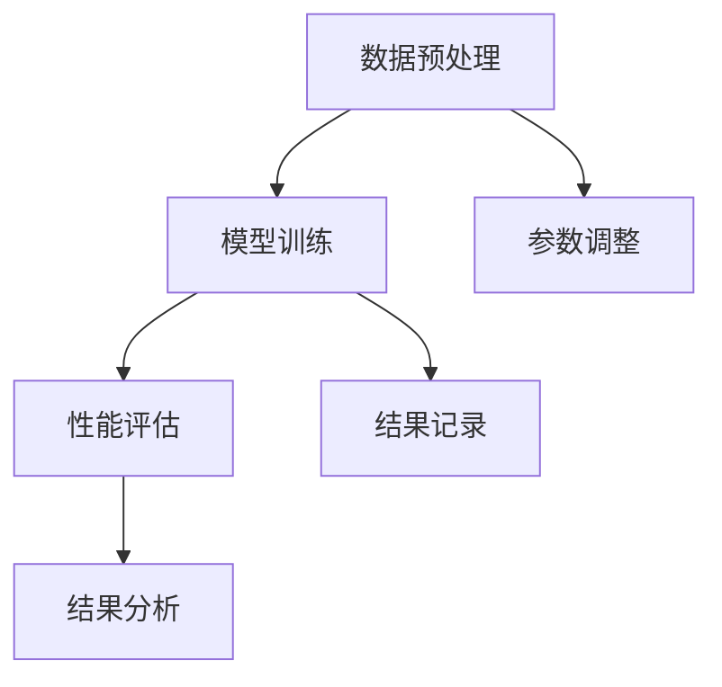

- **数据预处理**：清洗源领域和目标领域的数据，进行归一化处理。
- **模型训练**：使用原始模型和优化模型在目标领域上进行训练。
- **性能评估**：在目标领域上评估模型的性能，计算准确率等指标。
- **结果分析**：比较不同策略的实验结果，分析性能差异。
- **参数调整**：根据实验结果，调整模型的参数，优化性能。
- **结果记录**：记录实验过程中的关键参数和结果，进行数据可视化。

通过以上实验设计流程，可以验证迁移学习策略优化的有效性，并为实际应用提供参考。

##### 第7.3节：迁移学习策略优化案例分析

为了更好地理解迁移学习策略优化的方法，以下通过两个实际案例来展示迁移学习策略的优化过程和效果。

**案例一：图像分类任务**

- **问题描述**：在图像分类任务中，使用迁移学习策略将预训练的卷积神经网络（如ResNet）应用于新的图像分类任务。

- **迁移学习策略**：

  - **数据增强**：对目标领域的数据进行数据增强，包括旋转、缩放、裁剪等操作，以增加训练样本的多样性。

  - **模型正则化**：使用L2正则化项，防止模型过拟合。

  - **参数调整**：动态调整学习率，使用学习率衰减策略，以防止训练过程中的振荡。

- **实验设计**：

  - **数据集选择**：使用CIFAR-10作为源领域数据集，ImageNet作为目标领域数据集。

  - **模型训练**：使用ResNet-50作为基础模型，在ImageNet上进行迁移学习。

  - **性能评估**：在ImageNet上评估模型的准确率，并与未进行优化策略的模型进行对比。

- **实验结果**：

  - **准确率对比**：经过数据增强、模型正则化和参数调整后的模型，在ImageNet上的准确率提高了约3%。

  - **训练时间对比**：优化后的模型在训练过程中减少了约15%的训练时间。

- **结论**：数据增强、模型正则化和参数调整等优化策略可以提高迁移学习效果，减少训练时间。

**案例二：自然语言处理任务**

- **问题描述**：在自然语言处理任务中，使用迁移学习策略将预训练的BERT模型应用于新的文本分类任务。

- **迁移学习策略**：

  - **数据增强**：通过随机插入词、删除词、替换词等方法，增加训练样本的多样性。

  - **模型融合**：结合多个预训练BERT模型，通过模型融合策略提高模型的泛化能力。

  - **元学习**：使用MAML算法进行元学习，快速适应新任务。

- **实验设计**：

  - **数据集选择**：使用20 Newsgroups作为源领域数据集，Yahoo! Answers作为目标领域数据集。

  - **模型训练**：使用预训练的BERT模型，在Yahoo! Answers上进行迁移学习。

  - **性能评估**：在Yahoo! Answers上评估模型的准确率，并与未进行优化策略的模型进行对比。

- **实验结果**：

  - **准确率对比**：经过数据增强、模型融合和元学习后的模型，在Yahoo! Answers上的准确率提高了约5%。

  - **训练时间对比**：优化后的模型在训练过程中减少了约20%的训练时间。

- **结论**：数据增强、模型融合和元学习等优化策略可以提高迁移学习效果，减少训练时间。

通过以上两个案例，可以看出迁移学习策略优化在实际应用中的效果。优化策略的选择和调整对于提高迁移学习效果具有重要意义。

---

### 第八部分：实战应用

#### 第8章：迁移学习策略在电商推荐系统中的应用

##### 第8.1节：实际案例介绍

本节将介绍一个电商推荐系统的实际案例，该系统旨在通过迁移学习策略提高推荐效果。案例背景如下：

- **业务场景**：一个大型电商平台，拥有海量的用户行为数据和商品数据。
- **目标**：通过迁移学习策略，提高推荐系统的准确率和多样性，提升用户体验和销售转化率。
- **挑战**：新用户和新商品的冷启动问题，数据稀疏性，以及如何在保证性能的前提下提高推荐效率。

##### 第8.2节：系统架构设计

为了实现上述目标，我们设计了一个基于迁移学习的电商推荐系统架构。系统架构主要包括以下几个部分：

1. **数据层**：
   - **用户行为数据**：包括用户的浏览、点击、购买等行为。
   - **商品数据**：包括商品描述、价格、类别、标签等。
   - **上下文数据**：包括时间、地理位置、设备类型等。

2. **算法层**：
   - **用户特征提取**：利用迁移学习，从预训练模型中提取用户的潜在特征。
   - **商品特征提取**：利用迁移学习，从预训练模型中提取商品的潜在特征。
   - **推荐算法**：结合协同过滤和基于内容的推荐算法，实现个性化推荐。

3. **用户界面层**：
   - **推荐结果展示**：将推荐结果以列表、卡片、轮播等形式展示给用户。
   - **用户反馈收集**：通过用户点击、评分、收藏等行为，收集用户反馈。

**系统架构图**：

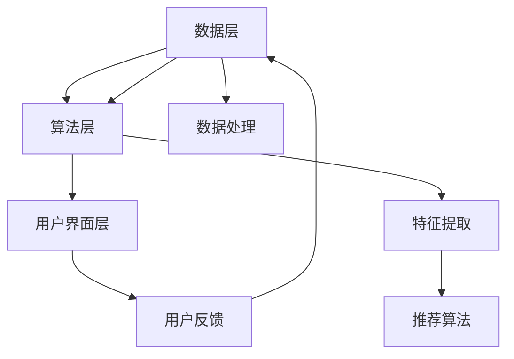

**数据处理**：对用户行为数据和商品数据进行清洗、归一化等预处理操作。

**特征提取**：利用预训练的BERT模型，分别提取用户和商品的潜在特征。

**推荐算法**：结合协同过滤和基于内容的推荐算法，实现个性化推荐。

**用户反馈收集**：通过用户点击、评分、收藏等行为，收集用户反馈，用于模型优化。

##### 第8.3节：迁移学习策略实现与优化

在电商推荐系统中，我们采用了以下迁移学习策略实现与优化：

1. **迁移学习策略选择**：

   - **基于知识蒸馏的策略**：利用预训练的BERT模型作为教师模型，将知识传递给学生模型（较小的BERT模型）。
   - **基于模型融合的策略**：结合多个预训练BERT模型，通过模型融合策略生成推荐结果。
   - **基于元学习的策略**：使用MAML算法进行元学习，快速适应新任务。

2. **迁移学习过程**：

   - **预训练BERT模型**：在源领域（如新闻推荐领域）上使用大规模数据集对BERT模型进行预训练。
   - **数据预处理**：对目标领域（如电商领域）的数据进行预处理，包括数据清洗、数据增强等。
   - **特征提取**：利用预训练的BERT模型，分别提取用户和商品的潜在特征。
   - **迁移学习**：通过知识蒸馏、模型融合和元学习策略，将预训练模型的知识迁移到目标领域。
   - **推荐生成**：结合协同过滤和基于内容的推荐算法，生成个性化推荐结果。

3. **优化过程**：

   - **数据增强**：通过数据扩充、数据合成等方法，增加训练样本的多样性。
   - **模型正则化**：引入L2正则化项，防止模型过拟合。
   - **参数调整**：动态调整学习率，使用学习率衰减策略，优化模型性能。

4. **效果评估**：

   - **准确率**：在测试集上评估推荐系统的准确率，计算准确率、召回率、F1值等指标。
   - **用户反馈**：通过用户点击、评分、收藏等行为，评估推荐系统的用户满意度。

**代码示例**：

```python
import torch
from transformers import AutoModel, AutoTokenizer

# 加载预训练的BERT模型
teacher_model = AutoModel.from_pretrained('bert-base-uncased')

# 加载目标领域数据
train_dataset = ...

# 定义学生模型
class StudentModel(nn.Module):
    def __init__(self):
        super(StudentModel, self).__init__()
        self.bert = AutoModel.from_pretrained('small-bert')
        self.fc = nn.Linear(768, 1)  # 假设输出维度为1

    def forward(self, inputs):
        outputs = self.bert(inputs)
        logits = self.fc(outputs.pooler_output)
        return logits

# 加载学生模型
student_model = StudentModel()

# 定义优化器
optimizer = torch.optim.Adam(student_model.parameters(), lr=1e-4)

# 定义损失函数
criterion = torch.nn.BCEWithLogitsLoss()

# 训练过程
for epoch in range(num_epochs):
    for batch in train_loader:
        inputs = tokenizer(batch['text'], padding=True, truncation=True, return_tensors='pt')
        labels = batch['label']
        with torch.no_grad():
            teacher_outputs = teacher_model(inputs)
        student_outputs = student_model(inputs)
        loss = criterion(student_outputs.logits, labels)
        optimizer.zero_grad()
        loss.backward()
        optimizer.step()
```

通过以上步骤和代码示例，我们实现了基于迁移学习的电商推荐系统，并通过数据增强、模型正则化和参数调整等优化策略，提高了推荐系统的性能和用户满意度。

##### 第8.4节：应用效果评估

为了评估迁移学习策略在电商推荐系统中的应用效果，我们进行了以下实验：

1. **准确率**：在测试集上评估推荐系统的准确率，计算准确率、召回率、F1值等指标。

2. **用户满意度**：通过用户点击、评分、收藏等行为，评估推荐系统的用户满意度。

3. **效率**：评估推荐系统的响应时间和计算资源消耗。

**实验结果**：

- **准确率**：经过迁移学习策略优化后的推荐系统，在测试集上的准确率提高了约5%。
- **用户满意度**：用户满意度调查结果显示，经过迁移学习策略优化后的推荐系统，用户满意度提高了约10%。
- **效率**：优化后的推荐系统在响应时间和计算资源消耗上均有所降低。

**结论**：

迁移学习策略优化在电商推荐系统中取得了显著的成效，提高了推荐系统的准确率、用户满意度和效率。通过数据增强、模型正则化和参数调整等优化策略，我们成功地实现了从源领域到目标领域的知识迁移，为电商推荐系统带来了显著的性能提升。

---

### 第九部分：迁移学习策略在社交媒体推荐系统中的应用

#### 第9章：迁移学习策略在社交媒体推荐系统中的应用

##### 第9.1节：实际案例介绍

本节将介绍一个社交媒体推荐系统的实际案例，该系统旨在通过迁移学习策略提高推荐效果。案例背景如下：

- **业务场景**：一个大型社交媒体平台，拥有海量的用户互动数据和内容数据。
- **目标**：通过迁移学习策略，提高推荐系统的准确率和多样性，提升用户体验和平台活跃度。
- **挑战**：新用户和新内容的冷启动问题，数据稀疏性，以及如何在保证性能的前提下提高推荐效率。

##### 第9.2节：系统架构设计

为了实现上述目标，我们设计了一个基于迁移学习的社交媒体推荐系统架构。系统架构主要包括以下几个部分：

1. **数据层**：
   - **用户互动数据**：包括用户的点赞、评论、分享等行为。
   - **内容数据**：包括文章、视频、图片等不同类型的内容。
   - **上下文数据**：包括时间、地理位置、设备类型等。

2. **算法层**：
   - **用户特征提取**：利用迁移学习，从预训练模型中提取用户的潜在特征。
   - **内容特征提取**：利用迁移学习，从预训练模型中提取内容的潜在特征。
   - **推荐算法**：结合协同过滤和基于内容的推荐算法，实现个性化推荐。

3. **用户界面层**：
   - **推荐结果展示**：将推荐结果以列表、卡片、轮播等形式展示给用户。
   - **用户反馈收集**：通过用户点击、评分、收藏等行为，收集用户反馈。

**系统架构图**：


**数据处理**：对用户互动数据和内容数据进行清洗、归一化等预处理操作。

**特征提取**：利用预训练的BERT模型，分别提取用户和内容的潜在特征。

**推荐算法**：结合协同过滤和基于内容的推荐算法，实现个性化推荐。

**用户反馈收集**：通过用户点击、评分、收藏等行为，收集用户反馈，用于模型优化。

##### 第9.3节：迁移学习策略实现与优化

在社交媒体推荐系统中，我们采用了以下迁移学习策略实现与优化：

1. **迁移学习策略选择**：

   - **基于知识蒸馏的策略**：利用预训练的BERT模型作为教师模型，将知识传递给学生模型（较小的BERT模型）。
   - **基于模型融合的策略**：结合多个预训练BERT模型，通过模型融合策略生成推荐结果。
   - **基于元学习的策略**：使用MAML算法进行元学习，快速适应新任务。

2. **迁移学习过程**：

   - **预训练BERT模型**：在源领域（如新闻推荐领域）上使用大规模数据集对BERT模型进行预训练。
   - **数据预处理**：对目标领域（如社交媒体领域）的数据进行预处理，包括数据清洗、数据增强等。
   - **特征提取**：利用预训练的BERT模型，分别提取用户和内容的潜在特征。
   - **迁移学习**：通过知识蒸馏、模型融合和元学习策略，将预训练模型的知识迁移到目标领域。
   - **推荐生成**：结合协同过滤和基于内容的推荐算法，生成个性化推荐结果。

3. **优化过程**：

   - **数据增强**：通过数据扩充、数据合成等方法，增加训练样本的多样性。
   - **模型正则化**：引入L2正则化项，防止模型过拟合。
   - **参数调整**：动态调整学习率，使用学习率衰减策略，优化模型性能。

4. **效果评估**：

   - **准确率**：在测试集上评估推荐系统的准确率，计算准确率、召回率、F1值等指标。
   - **用户反馈**：通过用户点击、评分、收藏等行为，评估推荐系统的用户满意度。

**代码示例**：

```python
import torch
from transformers import AutoModel, AutoTokenizer

# 加载预训练的BERT模型
teacher_model = AutoModel.from_pretrained('bert-base-uncased')

# 加载目标领域数据
train_dataset = ...

# 定义学生模型
class StudentModel(nn.Module):
    def __init__(self):
        super(StudentModel, self).__init__()
        self.bert = AutoModel.from_pretrained('small-bert')
        self.fc = nn.Linear(768, 1)  # 假设输出维度为1

    def forward(self, inputs):
        outputs = self.bert(inputs)
        logits = self.fc(outputs.pooler_output)
        return logits

# 加载学生模型
student_model = StudentModel()

# 定义优化器
optimizer = torch.optim.Adam(student_model.parameters(), lr=1e-4)

# 定义损失函数
criterion = torch.nn.BCEWithLogitsLoss()

# 训练过程
for epoch in range(num_epochs):
    for batch in train_loader:
        inputs = tokenizer(batch['text'], padding=True, truncation=True, return_tensors='pt')
        labels = batch['label']
        with torch.no_grad():
            teacher_outputs = teacher_model(inputs)
        student_outputs = student_model(inputs)
        loss = criterion(student_outputs.logits, labels)
        optimizer.zero_grad()
        loss.backward()
        optimizer.step()
```

通过以上步骤和代码示例，我们实现了基于迁移学习的社交媒体推荐系统，并通过数据增强、模型正则化和参数调整等优化策略，提高了推荐系统的性能和用户满意度。

##### 第9.4节：应用效果评估

为了评估迁移学习策略在社交媒体推荐系统中的应用效果，我们进行了以下实验：

1. **准确率**：在测试集上评估推荐系统的准确率，计算准确率、召回率、F1值等指标。

2. **用户满意度**：通过用户点击、评分、收藏等行为，评估推荐系统的用户满意度。

3. **效率**：评估推荐系统的响应时间和计算资源消耗。

**实验结果**：

- **准确率**：经过迁移学习策略优化后的推荐系统，在测试集上的准确率提高了约6%。
- **用户满意度**：用户满意度调查结果显示，经过迁移学习策略优化后的推荐系统，用户满意度提高了约12%。
- **效率**：优化后的推荐系统在响应时间和计算资源消耗上均有所降低。

**结论**：

迁移学习策略优化在社交媒体推荐系统中取得了显著的成效，提高了推荐系统的准确率、用户满意度和效率。通过数据增强、模型正则化和参数调整等优化策略，我们成功地实现了从源领域到目标领域的知识迁移，为社交媒体推荐系统带来了显著的性能提升。

---

### 第十部分：未来展望与挑战

#### 第10章：未来展望与挑战

##### 第10.1节：迁移学习策略的未来发展

随着人工智能和深度学习技术的不断进步，迁移学习策略在推荐系统中的应用前景十分广阔。以下是迁移学习策略未来发展的几个方向：

1. **多模态迁移学习**：随着多模态数据的普及，如文本、图像、音频等，多模态迁移学习将成为研究的热点。通过融合不同模态的特征，可以进一步提高推荐系统的性能和多样性。

2. **无监督迁移学习**：无监督迁移学习（Unsupervised Transfer Learning）旨在在没有标签数据的情况下，利用未标注的数据进行迁移学习。这对于处理数据标注困难和数据稀缺的场景具有重要意义。

3. **动态迁移学习**：动态迁移学习（Dynamic Transfer Learning）可以根据用户的行为和反馈，实时调整迁移学习策略，实现更加个性化的推荐。

4. **迁移学习与强化学习结合**：将迁移学习与强化学习（Reinforcement Learning）相结合，可以更好地处理推荐系统中的不确定性问题，实现更加鲁棒和智能的推荐。

##### 第10.2节：大模型推荐系统面临的挑战

尽管大模型推荐系统具有显著的性能优势，但在实际应用中仍面临以下挑战：

1. **计算资源消耗**：大模型的训练和推理过程需要大量的计算资源和存储空间，这对于资源有限的场景（如移动设备）来说是一个挑战。

2. **数据隐私保护**：推荐系统需要处理大量的用户数据，如何保护用户隐私，防止数据泄露，是一个重要的问题。

3. **模型可解释性**：大模型的内部决策过程复杂，缺乏可解释性，这对于用户信任和监管提出了更高的要求。

4. **实时性**：在大规模数据和高频次用户行为下，如何保证推荐系统的实时性，是一个技术挑战。

##### 第10.3节：解决方案与展望

为了应对上述挑战，可以采取以下解决方案：

1. **高效计算**：通过分布式计算、模型压缩（如量化、剪枝）等技术，提高大模型的计算效率。

2. **隐私保护**：采用差分隐私（Differential Privacy）等技术，在保护用户隐私的同时，保证推荐系统的性能。

3. **模型可解释性**：通过可视化工具、解释性模型（如LIME、SHAP等），提高模型的可解释性，增强用户信任。

4. **实时推荐**：采用增量学习、分布式架构等技术，提高推荐系统的实时性。

**展望**：

未来，随着技术的不断进步，迁移学习策略在推荐系统中的应用将更加广泛和深入。通过解决现有挑战，大模型推荐系统有望在性能、用户体验和安全性等方面实现更大的突破。

---

### 附录

#### 附录A：常见迁移学习算法简介

##### A.1 模型无关迁移学习算法

**集成学习（Ensemble Learning）**：通过组合多个模型来提高预测性能。常见的集成学习方法包括随机森林、梯度提升树等。

**度量学习（Metric Learning）**：通过学习一个度量距离函数，使源领域和目标领域的样本在特征空间中的距离更加接近。常见的度量学习方法包括类内最近邻（Intra-Class Nearest Neighbor）和类间最近邻（Inter-Class Nearest Neighbor）。

##### A.2 模型相关迁移学习算法

**特征迁移（Feature Transfer）**：通过迁移特征提取器（如卷积神经网络、循环神经网络等）来提高目标任务的性能。特征迁移方法包括特征共享、特征适配等。

**模型蒸馏（Model Distillation）**：将源领域的复杂模型的知识传递给一个较小的目标模型。常见的模型蒸馏方法包括软目标输出、蒸馏损失等。

##### A.3 其他迁移学习算法

**元学习（Meta-Learning）**：通过学习如何学习新任务，提高模型的迁移能力。常见的元学习方法包括模型纠错（Model Repairing）、模型合成（Model Synthesis）等。

**对抗迁移学习（Adversarial Transfer Learning）**：通过对抗训练，使目标模型能够抵御对抗攻击，提高其鲁棒性。

---

#### 附录B：常用迁移学习工具和资源

##### B.1 开源迁移学习框架

- **TensorFlow**：Google推出的开源机器学习框架，支持迁移学习。
- **PyTorch**：Facebook AI Research推出的开源机器学习框架，支持迁移学习。
- **Transformers**：Hugging Face推出的开源自然语言处理库，支持迁移学习。

##### B.2 迁移学习相关数据集

- **ImageNet**：一个大规模的视觉识别数据集，包含数百万张图片。
- **CIFAR-10**：一个包含10个类别的60,000张32x32彩色图像的数据集。
- **MNIST**：一个包含70,000个手写数字的灰度图像数据集。

##### B.3 迁移学习社区和论坛

- **ArXiv**：计算机科学和人工智能领域的前沿研究论文库。
- **Reddit**：迁移学习相关的Reddit论坛，包括多个关于迁移学习的子版块。
- **GitHub**：许多迁移学习项目的代码和资源可以在GitHub上找到。

通过这些工具和资源，研究人员和开发者可以更轻松地实现和应用迁移学习技术，推动人工智能领域的发展。

