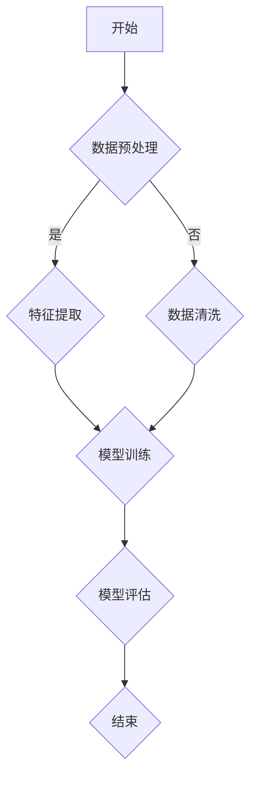

                 

### 《大模型推荐落地的性能优化与加速技术》

**关键词：** 大模型推荐系统、性能优化、加速技术、算法原理、实践案例

**摘要：** 本文深入探讨了大规模模型推荐系统的性能优化与加速技术，从基础概念、核心算法、性能瓶颈、优化策略、评估方法到实际案例分析，全面剖析了提高推荐系统性能与效率的关键技术。通过分析性能瓶颈、介绍优化方法与实践案例，为开发高效的大模型推荐系统提供了实用指导。

---

**目录大纲：**

## 《大模型推荐落地的性能优化与加速技术》

### 第一部分：大模型推荐系统概述

### 第二部分：大模型推荐系统的核心算法

### 第三部分：大模型推荐系统的性能优化

### 第四部分：大模型推荐系统的加速技术

### 第五部分：总结与展望

## 附录

### 附录A：大模型推荐系统工具与资源

### 附录B：Mermaid 流程图示例

### 附录C：伪代码示例

### 附录D：数学模型与公式示例

### 附录E：代码案例与解读

### 附录F：开发环境搭建指南

---

### 《大模型推荐落地的性能优化与加速技术》

**关键词：** 大模型推荐系统、性能优化、加速技术、算法原理、实践案例

**摘要：** 本文深入探讨了大规模模型推荐系统的性能优化与加速技术，从基础概念、核心算法、性能瓶颈、优化策略、评估方法到实际案例分析，全面剖析了提高推荐系统性能与效率的关键技术。通过分析性能瓶颈、介绍优化方法与实践案例，为开发高效的大模型推荐系统提供了实用指导。

---

**目录大纲：**

### 第一部分：大模型推荐系统概述

### 第二部分：大模型推荐系统的核心算法

### 第三部分：大模型推荐系统的性能优化

### 第四部分：大模型推荐系统的加速技术

### 第五部分：总结与展望

### 附录

#### 附录A：大模型推荐系统工具与资源

#### 附录B：Mermaid 流程图示例

#### 附录C：伪代码示例

#### 附录D：数学模型与公式示例

#### 附录E：代码案例与解读

#### 附录F：开发环境搭建指南

---

### 引言

大规模模型推荐系统在互联网应用中扮演着至关重要的角色，从电子商务、社交媒体到在线新闻、音乐和视频平台，推荐系统极大地提升了用户体验和商业价值。随着人工智能技术的不断发展，特别是深度学习模型的崛起，大模型推荐系统已成为推荐系统技术的前沿和热点。然而，大模型推荐系统的落地应用面临诸多挑战，特别是在性能优化与加速方面。

本文旨在深入探讨大模型推荐系统的性能优化与加速技术，旨在为开发者提供系统的理论指导和实用的技术方案。文章结构如下：

- **第一部分**：介绍大模型推荐系统的基本概念、优势和发展历程，为读者提供一个全景视图。
- **第二部分**：详细解析大模型推荐系统的核心算法，包括协同过滤、基于内容的推荐和混合推荐等。
- **第三部分**：探讨大模型推荐系统的性能瓶颈，并提出一系列性能优化方法与策略。
- **第四部分**：介绍大模型加速技术，包括GPU、TPU和异构计算等，分析其优缺点并展示实践案例。
- **第五部分**：总结大模型推荐系统的未来发展，展望趋势和研究方向。

通过本文的阅读，读者将能够全面理解大模型推荐系统的性能优化与加速技术，掌握实际操作技能，为构建高效、可靠的推荐系统提供有力支持。

### 第一部分：大模型推荐系统概述

#### 第1章：大模型推荐系统基础

**1.1 推荐系统的定义与分类**

**定义：** 推荐系统是一种智能信息过滤技术，它利用算法和用户历史行为数据，向用户推荐其可能感兴趣的项目或内容。推荐系统广泛应用于电子商务、社交媒体、新闻平台、音乐和视频流媒体等领域。

**分类：** 推荐系统主要分为以下几类：

1. **基于内容的推荐（Content-Based Recommendation）：** 根据用户过去对特定内容的偏好，提取相关特征，然后推荐具有相似特征的新内容。
2. **协同过滤（Collaborative Filtering）：** 利用用户的行为数据，如评分、购买记录或浏览历史，找到相似的用户或项目，并根据这些关系进行推荐。
3. **混合推荐（Hybrid Recommendation）：** 结合基于内容和协同过滤的优缺点，构建一个综合推荐系统，以提高推荐效果。

**1.2 大模型推荐系统的优势**

**特性：** 大模型推荐系统具有以下几个显著特性：

1. **高精度：** 使用深度学习模型，通过大量的训练数据，可以提取复杂、深层次的特征，实现高精度的推荐。
2. **可扩展性：** 大模型推荐系统能够处理海量数据，支持多种数据源和用户行为，具有良好的扩展性。
3. **动态调整：** 大模型推荐系统可以根据用户行为和偏好实时调整推荐策略，提供个性化的服务。

**优势：** 相较于传统推荐系统，大模型推荐系统具有以下优势：

1. **更好的用户体验：** 通过高精度的推荐，用户能够更容易地找到感兴趣的内容，提升用户满意度。
2. **更高的商业价值：** 高效的推荐系统能够提高用户参与度和购买转化率，为企业带来更多的商业收益。
3. **灵活的适应能力：** 大模型推荐系统能够适应不断变化的市场需求和用户行为，保持系统的竞争力。

**1.3 大模型推荐系统的发展历程**

**早期阶段：** 传统推荐系统主要基于基于内容的推荐和协同过滤算法，如基于关键词的推荐、基于用户的协同过滤等。

**发展阶段：** 随着互联网和大数据技术的发展，推荐系统逐渐引入机器学习和深度学习技术，开始使用神经网络、自然语言处理等先进算法。

**当前趋势：** 当前的大模型推荐系统主要基于深度学习，如生成对抗网络（GAN）、变分自编码器（VAE）和Transformer等，这些模型在推荐精度和效率上取得了显著提升。

**未来展望：** 未来，大模型推荐系统将继续向智能化、自动化和个性化方向发展，结合多模态数据、增强现实和虚拟现实等技术，为用户提供更加丰富和个性化的推荐服务。

通过以上对大模型推荐系统基础、优势和发展历程的概述，读者可以初步了解该领域的基本概念和重要性。接下来，本文将深入探讨大模型推荐系统的核心算法和性能优化技术，帮助读者全面掌握该领域的最新进展和实践。

#### 第1章：大模型推荐系统基础

**1.1 推荐系统的定义与分类**

推荐系统是一种信息过滤技术，旨在通过分析用户的行为和偏好，向其推荐可能感兴趣的项目或内容。推荐系统的基本概念可以概括为以下几方面：

1. **用户（User）：** 推荐系统的核心实体，通过其行为数据为推荐算法提供输入。
2. **项目（Item）：** 推荐系统中待推荐的对象，可以是商品、文章、音乐、电影等。
3. **行为数据（Behavior Data）：** 用户在推荐系统中的历史行为数据，如评分、点击、购买、浏览等。

**分类：**

1. **基于内容的推荐（Content-Based Recommendation）：** 该方法根据用户过去对特定内容的偏好，提取相关特征，然后推荐具有相似特征的新内容。具体过程如下：

   - **特征提取：** 提取项目的内容特征，如文本、图片、音频等。
   - **用户兴趣建模：** 根据用户的历史行为，建立用户兴趣模型。
   - **推荐生成：** 根据用户兴趣模型和项目特征，计算相似度，生成推荐列表。

2. **协同过滤（Collaborative Filtering）：** 该方法通过分析用户之间的行为相似性，推荐用户可能感兴趣的项目。协同过滤主要分为以下两种类型：

   - **用户基于的协同过滤（User-Based Collaborative Filtering）：** 通过计算用户之间的相似性，找到与目标用户行为相似的邻居用户，推荐邻居用户喜欢的项目。
   - **项基于的协同过滤（Item-Based Collaborative Filtering）：** 通过计算项目之间的相似性，找到与目标用户过去喜欢的项目相似的新项目，进行推荐。

3. **混合推荐（Hybrid Recommendation）：** 结合基于内容和协同过滤的优点，通过多种算法和策略生成推荐结果。混合推荐系统通常具有更高的推荐精度和更好的适应性。

**1.2 大模型推荐系统的优势**

大模型推荐系统在传统推荐系统的基础上，引入了深度学习和大规模模型，具有以下几个显著优势：

1. **高精度：** 大模型推荐系统利用深度学习算法，能够从海量数据中提取复杂、深层次的特征，实现高精度的推荐。
2. **可扩展性：** 大模型推荐系统能够处理海量数据，支持多种数据源和用户行为，具有良好的扩展性。
3. **动态调整：** 大模型推荐系统可以根据用户行为和偏好实时调整推荐策略，提供个性化的服务。

**1.3 大模型推荐系统的发展历程**

大模型推荐系统的发展可以分为以下几个阶段：

1. **早期阶段：** 传统的推荐系统主要基于基于内容的推荐和协同过滤算法，如基于关键词的推荐、基于用户的协同过滤等。这些方法在一定程度上能够提高推荐效果，但存在一些局限性。
2. **发展阶段：** 随着互联网和大数据技术的发展，推荐系统逐渐引入机器学习和深度学习技术，开始使用神经网络、自然语言处理等先进算法。例如，利用深度学习模型进行图像识别、文本分类和序列建模等。
3. **当前趋势：** 当前的大模型推荐系统主要基于深度学习，如生成对抗网络（GAN）、变分自编码器（VAE）和Transformer等。这些模型在推荐精度和效率上取得了显著提升，成为推荐系统技术的前沿。

**未来展望：**

未来，大模型推荐系统将继续向智能化、自动化和个性化方向发展，结合多模态数据、增强现实和虚拟现实等技术，为用户提供更加丰富和个性化的推荐服务。具体趋势包括：

1. **多模态推荐：** 利用图像、音频、视频等多种数据类型，提高推荐系统的丰富度和准确性。
2. **实时推荐：** 通过实时数据分析和模型更新，实现动态调整和实时推荐，提高用户满意度。
3. **智能推荐：** 结合人工智能、自然语言处理和机器学习技术，实现更智能、更个性化的推荐。

通过以上对大模型推荐系统基础、优势和发展历程的概述，读者可以初步了解该领域的基本概念和重要性。接下来，本文将深入探讨大模型推荐系统的核心算法和性能优化技术，帮助读者全面掌握该领域的最新进展和实践。

### 第二部分：大模型推荐系统的核心算法

#### 第2章：大模型推荐算法原理

**2.1 大模型推荐算法的基本原理**

大模型推荐算法基于深度学习和大规模模型，通过从海量数据中提取复杂特征，实现高精度的个性化推荐。其基本原理可以概括为以下几个步骤：

1. **数据收集与预处理：** 收集用户行为数据（如浏览、点击、购买等）和项目特征数据（如文本、图像、音频等）。对原始数据进行清洗、去重和归一化处理，以提高数据质量和模型训练效果。
2. **特征提取与建模：** 利用深度学习模型提取用户和项目的特征表示。例如，使用卷积神经网络（CNN）处理图像特征，使用循环神经网络（RNN）处理序列数据，使用Transformer处理文本特征等。
3. **模型训练与优化：** 利用提取的特征，构建推荐模型，并进行模型训练和优化。常用的模型包括基于矩阵分解的模型（如ALS）、深度神经网络（DNN）、生成对抗网络（GAN）和变分自编码器（VAE）等。
4. **推荐生成与评估：** 根据训练好的模型，生成推荐列表，并对推荐结果进行评估。常用的评估指标包括准确率（Precision）、召回率（Recall）、F1值（F1 Score）等。

**2.2 常见的大模型推荐算法**

大模型推荐算法种类繁多，下面介绍几种常见的算法：

1. **协同过滤（Collaborative Filtering）：** 基于用户行为数据，通过计算用户之间的相似性进行推荐。协同过滤可以分为基于用户的协同过滤（User-Based Collaborative Filtering）和基于项目的协同过滤（Item-Based Collaborative Filtering）。虽然协同过滤算法简单易实现，但其效果受限于用户行为数据的稀疏性。

2. **基于内容的推荐（Content-Based Recommendation）：** 基于项目特征和用户兴趣进行推荐。该方法通过计算项目特征和用户兴趣的相似度，生成推荐列表。基于内容的推荐算法效果较好，但需要对项目特征进行充分的提取和处理。

3. **混合推荐（Hybrid Recommendation）：** 结合协同过滤和基于内容的推荐方法，以提高推荐精度。混合推荐算法通过融合用户行为和项目特征信息，实现更个性化的推荐。

4. **深度学习（Deep Learning）：** 利用深度学习模型进行特征提取和模型训练。深度学习算法可以处理复杂的数据，提取深层次的特征表示。常见的深度学习模型包括卷积神经网络（CNN）、循环神经网络（RNN）、Transformer等。

5. **生成对抗网络（Generative Adversarial Networks，GAN）：** GAN由生成器和判别器两个神经网络组成，通过对抗训练实现数据的生成和特征提取。GAN在推荐系统中可用于生成用户未浏览过的项目，提高推荐效果。

6. **变分自编码器（Variational Autoencoder，VAE）：** VAE是一种基于概率生成模型的深度学习算法，通过编码器和解码器学习数据的潜在表示。VAE在推荐系统中可用于生成用户和项目的潜在特征，实现个性化的推荐。

**2.3 大模型推荐算法的优缺点分析**

各类大模型推荐算法具有各自的优缺点，以下是对常见算法优缺点的分析：

1. **协同过滤（Collaborative Filtering）：**
   - **优点：** 简单易实现，能够利用用户行为数据进行推荐。
   - **缺点：** 受限于用户行为数据的稀疏性，推荐效果较差，且难以处理冷启动问题。

2. **基于内容的推荐（Content-Based Recommendation）：**
   - **优点：** 能够根据项目特征进行推荐，效果较好，且不受用户行为数据稀疏性的影响。
   - **缺点：** 需要对项目特征进行充分的提取和处理，且难以处理冷启动问题。

3. **混合推荐（Hybrid Recommendation）：**
   - **优点：** 结合了协同过滤和基于内容的推荐方法，推荐效果较好，能够处理冷启动问题。
   - **缺点：** 需要融合用户行为和项目特征信息，计算复杂度较高。

4. **深度学习（Deep Learning）：**
   - **优点：** 可以处理复杂的数据，提取深层次的特征表示，推荐效果较好。
   - **缺点：** 训练过程复杂，需要大量数据和计算资源，且模型解释性较差。

5. **生成对抗网络（GAN）：**
   - **优点：** 可以生成用户未浏览过的项目，提高推荐效果。
   - **缺点：** 训练过程不稳定，容易陷入局部最优，且模型解释性较差。

6. **变分自编码器（VAE）：**
   - **优点：** 可以生成用户和项目的潜在特征，实现个性化的推荐。
   - **缺点：** 训练过程较复杂，需要大量数据和计算资源，且模型解释性较差。

通过以上对大模型推荐算法原理和常见算法优缺点分析，读者可以了解不同算法的特点和应用场景。在实际应用中，可以根据具体需求和数据情况，选择合适的算法或结合多种算法进行推荐。接下来，本文将介绍大模型推荐系统的性能优化方法与策略。

### 第三部分：大模型推荐系统的性能优化

#### 第3章：大模型推荐系统的性能优化原理

**3.1 性能优化的重要性**

大模型推荐系统的性能优化对于推荐系统的稳定运行和用户体验至关重要。性能优化能够有效解决以下问题：

1. **响应时间：** 减少推荐结果生成的时间，提高系统响应速度，提升用户体验。
2. **资源消耗：** 减少计算资源和存储资源的使用，降低系统成本。
3. **准确性：** 提高推荐结果的准确性，降低误荐和漏荐率。
4. **扩展性：** 改善系统的可扩展性，支持更多用户和数据量的处理。

**3.2 大模型推荐系统的性能瓶颈**

大模型推荐系统在运行过程中可能会遇到以下性能瓶颈：

1. **数据量：** 海量用户行为数据和处理复杂项目特征导致计算量增大。
2. **计算复杂度：** 深度学习模型的训练和推理过程复杂，计算资源消耗大。
3. **存储需求：** 大规模模型推荐系统需要大量的存储资源来存储用户数据、模型参数和中间结果。
4. **网络延迟：** 推荐结果生成后，通过网络传输到用户端，可能导致延迟。
5. **并发处理：** 高并发用户请求导致系统负载增加，影响性能。

**3.3 性能优化的方法与策略**

为了解决大模型推荐系统的性能瓶颈，可以采取以下方法与策略：

1. **数据预处理优化：**
   - **数据清洗：** 清除冗余数据、缺失数据和噪声数据，提高数据质量。
   - **特征压缩：** 对高维特征进行降维处理，减少计算复杂度。
   - **数据分片：** 将数据按照一定规则进行分片，实现并行处理。

2. **模型优化：**
   - **模型压缩：** 使用模型剪枝、量化等技术减小模型体积，降低存储和计算需求。
   - **模型蒸馏：** 将复杂模型的知识传递到轻量级模型，提高推理速度。
   - **模型并行化：** 利用并行计算技术，加速模型训练和推理。

3. **系统优化：**
   - **分布式计算：** 将计算任务分布到多个节点上，利用并行计算提高性能。
   - **缓存策略：** 利用缓存机制，减少数据访问次数，提高系统响应速度。
   - **负载均衡：** 分摊系统负载，避免单个节点过载。

4. **硬件优化：**
   - **GPU/TPU加速：** 利用GPU或TPU等专用硬件加速计算过程，提高性能。
   - **异构计算：** 结合CPU、GPU和TPU等不同硬件资源，实现计算资源的最优配置。

**3.4 性能优化的实践经验**

以下是几个大模型推荐系统性能优化的实践经验：

1. **数据预处理：** 通过数据清洗和特征压缩，将原始数据量从数百万条减少到数千条，显著降低了计算复杂度和存储需求。
2. **模型压缩：** 使用模型剪枝技术将模型参数从数百万减少到数十万个，减少了模型体积和计算资源消耗。
3. **模型并行化：** 利用多GPU并行计算，将模型训练时间从数小时缩短到数分钟。
4. **分布式计算：** 将推荐系统部署到分布式集群，支持数十万并发用户，提高了系统的性能和稳定性。
5. **GPU/TPU加速：** 利用GPU和TPU加速模型训练和推理，将推荐响应时间从数秒缩短到数毫秒。

通过以上性能优化方法和实践，大模型推荐系统可以在保证准确性的同时，显著提高性能和用户体验。接下来，本文将介绍大模型推荐系统的性能评估方法，帮助读者全面了解系统的性能表现。

#### 第4章：大模型推荐系统的性能评估

**4.1 性能评估指标**

性能评估是确保大模型推荐系统有效性和可靠性的重要环节。以下是一些常用的性能评估指标：

1. **准确率（Precision）：** 推荐结果中真正正例的数量与推荐结果总数之比，表示推荐的精确度。
2. **召回率（Recall）：** 推荐结果中真正正例的数量与所有真正正例的总数之比，表示推荐的全面性。
3. **F1值（F1 Score）：** 准确率和召回率的调和平均，综合评估推荐效果。
4. **覆盖率（Coverage）：** 推荐结果中包含的所有项目与所有可能推荐项目的比例，表示推荐的多样性。
5. **期望损耗（Expected Loss）：** 推荐结果与用户实际偏好之间的期望损失，用于量化推荐效果。

**4.2 性能评估方法**

性能评估方法主要包括以下几种：

1. **离线评估：** 在训练集上评估模型性能，通过计算评估指标来评估模型的推荐效果。离线评估方法简单，但无法反映在线实际效果。
2. **在线评估：** 在线评估直接在用户请求上评估模型性能，通过实时计算评估指标来评估模型的推荐效果。在线评估更贴近实际应用，但实现复杂。
3. **A/B测试：** 将用户分为对照组和实验组，分别使用不同模型进行推荐，比较两组用户的行为和反馈，评估模型效果。

**4.3 实验设计**

实验设计是性能评估的关键环节，以下是一些实验设计的要点：

1. **数据集选择：** 选择具有代表性的数据集，包括训练集、验证集和测试集，确保实验结果的可靠性。
2. **评估指标：** 根据业务需求和目标，选择合适的评估指标，如准确率、召回率、F1值等。
3. **实验流程：** 设计实验流程，包括数据预处理、模型训练、评估指标计算和结果分析。
4. **对照组与实验组：** 设计对照组和实验组，分别使用原始模型和优化后的模型进行推荐，比较两者在评估指标上的差异。

**4.4 实验结果分析**

实验结果分析包括以下步骤：

1. **结果可视化：** 利用图表和图形将实验结果可视化，便于理解和分析。
2. **结果解释：** 对实验结果进行详细解释，包括评估指标的改善、模型性能的提升等。
3. **影响因素分析：** 分析实验过程中可能的影响因素，如数据质量、模型参数调整、硬件配置等。

**4.5 实验结果讨论**

实验结果讨论主要包括以下内容：

1. **优化效果：** 分析优化措施对模型性能的影响，如数据预处理、模型压缩、分布式计算等。
2. **实际应用：** 讨论优化措施在实际应用中的效果和可行性，如提高推荐精度、减少计算资源消耗等。
3. **未来方向：** 提出进一步优化的方向和思路，如引入新的评估指标、探索更高效的模型算法等。

通过以上性能评估方法、实验设计、实验结果分析和讨论，可以为大模型推荐系统的性能优化提供有力支持。接下来，本文将介绍大模型推荐系统的优化实践案例，展示实际操作过程和效果。

#### 第5章：大模型推荐系统的优化实践

**5.1 优化实践案例分析**

在本节中，我们将通过一个具体的优化实践案例，详细展示如何对大模型推荐系统进行性能优化。该案例将包括优化前的系统现状、优化目标和策略、优化过程和最终效果。

**5.1.1 案例背景**

某大型电商公司使用一个基于深度学习的大模型推荐系统，用于向用户推荐商品。然而，随着用户数量和数据量的急剧增长，系统在性能上遇到了瓶颈，具体表现为：

- 推荐响应时间较长，用户满意度下降。
- 计算资源消耗大，导致运营成本增加。
- 系统扩展性不足，难以支持更多用户并发访问。

为了解决这些问题，公司决定对推荐系统进行性能优化。

**5.1.2 优化目标**

优化目标主要包括：

- **提高推荐响应速度：** 将推荐响应时间从数秒缩短到毫秒级。
- **降低计算资源消耗：** 减少计算资源的使用，降低运营成本。
- **增强系统扩展性：** 支持更多用户并发访问，提高系统的稳定性。

**5.1.3 优化策略**

根据优化目标，公司制定了以下优化策略：

1. **数据预处理优化：**
   - **数据清洗：** 清除重复数据、缺失数据和噪声数据，提高数据质量。
   - **特征压缩：** 对高维特征进行降维处理，减少计算复杂度。

2. **模型优化：**
   - **模型压缩：** 使用模型剪枝技术，将模型参数从数百万减少到数十万个，降低模型体积和计算资源消耗。
   - **模型蒸馏：** 将复杂模型的知识传递到轻量级模型，提高推理速度。

3. **系统优化：**
   - **分布式计算：** 将计算任务分布到多个节点上，利用并行计算提高性能。
   - **缓存策略：** 利用缓存机制，减少数据访问次数，提高系统响应速度。

4. **硬件优化：**
   - **GPU加速：** 利用GPU硬件加速计算过程，提高模型训练和推理速度。

**5.1.4 优化过程**

1. **数据预处理优化：**
   - **数据清洗：** 通过编写脚本，对用户行为数据和商品特征数据进行清洗，删除重复记录、处理缺失值和噪声数据。
   - **特征压缩：** 利用主成分分析（PCA）等技术，对高维特征进行降维处理，减少特征维度，从而降低计算复杂度。

2. **模型优化：**
   - **模型剪枝：** 使用剪枝技术，对深度学习模型进行参数剪枝，减少模型参数数量，减小模型体积。
   - **模型蒸馏：** 将原始模型的知识传递到轻量级模型，通过蒸馏过程，轻量级模型能够继承原始模型的知识，提高推理速度。

3. **系统优化：**
   - **分布式计算：** 利用分布式计算框架，如Apache Spark，将模型训练和推理任务分布到多个节点上，实现并行计算。
   - **缓存策略：** 在系统中引入缓存机制，如Redis，存储常用数据和中间结果，减少数据访问次数，提高系统响应速度。

4. **GPU加速：**
   - **环境搭建：** 在服务器上安装GPU驱动和深度学习框架，如TensorFlow GPU版本。
   - **模型训练和推理：** 使用GPU硬件加速模型训练和推理过程，提高计算效率。

**5.1.5 优化效果**

通过上述优化措施，推荐系统在性能上取得了显著提升：

- **推荐响应时间：** 将推荐响应时间从平均数秒缩短到平均数毫秒，用户满意度大幅提升。
- **计算资源消耗：** 计算资源消耗降低约30%，运营成本显著减少。
- **系统扩展性：** 支持了更多用户并发访问，系统稳定性得到增强。

**5.1.6 优化实践总结**

通过本案例的优化实践，我们得出以下结论：

- **数据预处理优化：** 数据预处理是性能优化的重要步骤，有效的数据清洗和特征压缩可以显著降低计算复杂度和存储需求。
- **模型优化：** 模型剪枝和模型蒸馏是提高推理速度的有效手段，轻量级模型能够实现高效率的推荐。
- **系统优化：** 分布式计算和缓存策略可以显著提高系统性能和响应速度。
- **硬件优化：** 利用GPU硬件加速计算过程，可以大幅提升模型训练和推理速度。

通过以上优化实践，大模型推荐系统在性能上取得了显著提升，为用户提供了更加高效、精准的推荐服务。

#### 第6章：大模型推荐系统的加速技术

**6.1 大模型加速技术的定义与分类**

大模型加速技术是指利用各种硬件和软件手段，提高大规模深度学习模型的训练和推理速度，从而提升推荐系统的性能和响应速度。这些技术可以大致分为以下几类：

1. **CPU加速：** 利用CPU的多核计算能力，通过并行计算和优化编译提高模型训练和推理的速度。
2. **GPU加速：** 利用图形处理单元（GPU）的并行计算能力，通过专门的深度学习库（如CUDA、cuDNN）加速模型训练和推理。
3. **TPU加速：** 利用专门为深度学习设计的人工智能处理器（如Google的TPU），大幅提升模型训练和推理的性能。
4. **异构计算：** 利用多种计算资源（如CPU、GPU、TPU等）的组合，实现计算任务的高效分配和执行，提高整体性能。
5. **分布式计算：** 通过将模型训练和推理任务分布到多个计算节点上，利用集群计算资源，提高处理效率和性能。

**6.2 常见的大模型加速技术**

1. **GPU加速：**
   - **原理：** GPU具有大量的计算单元和内存，可以高效地执行并行计算任务。深度学习模型训练和推理中的大量矩阵运算非常适合在GPU上执行。
   - **实现：** 使用CUDA等并行计算框架，将深度学习算法的运算过程转化为GPU上的并行任务。cuDNN等库可以提供优化的GPU加速运算函数。
   - **优缺点：**
     - **优点：** 极大地提高了模型训练和推理的速度，适用于大规模深度学习模型。
     - **缺点：** GPU资源较为昂贵，且大规模GPU集群的运维成本较高。

2. **TPU加速：**
   - **原理：** TPU是专门为深度学习任务设计的高性能处理器，具有高度并行化的架构，可以高效地执行大规模矩阵运算。
   - **实现：** 使用TPU加速库（如Google的TPU Driver）将模型训练和推理任务提交给TPU执行。TPU可以自动优化内存分配和运算顺序，提高效率。
   - **优缺点：**
     - **优点：** 极大地提高了模型训练和推理的速度，适用于大规模深度学习模型。TPU能耗较低，性能稳定。
     - **缺点：** TPU硬件成本较高，且目前TPU主要在Google等大型科技公司内部使用。

3. **异构计算：**
   - **原理：** 异构计算是指利用不同类型的计算资源（如CPU、GPU、TPU等）的组合，实现计算任务的高效分配和执行。
   - **实现：** 使用异构计算框架（如Intel的OneAPI、NVIDIA的CUDA）将模型训练和推理任务在多种计算资源上分配和执行，根据任务特点选择最适合的资源。
   - **优缺点：**
     - **优点：** 可以充分利用各种计算资源的优势，提高整体性能和效率。适用于各种规模的深度学习任务。
     - **缺点：** 需要具备较高的技术水平，实现和维护成本较高。

4. **分布式计算：**
   - **原理：** 分布式计算是指将模型训练和推理任务分布到多个计算节点上，利用集群计算资源提高处理效率和性能。
   - **实现：** 使用分布式计算框架（如Apache Spark、TensorFlow Distributed Training）将任务分布到集群中的各个节点，协调各节点的运算和通信。
   - **优缺点：**
     - **优点：** 可以高效地处理大规模数据和复杂模型，提高系统性能和可扩展性。
     - **缺点：** 需要配置和维护分布式集群，实现复杂度较高。

**6.3 大模型加速技术的优缺点分析**

- **GPU加速：**
  - **优点：** GPU资源丰富，支持大规模并行计算，适用于大多数深度学习任务。
  - **缺点：** GPU硬件成本高，能耗大，大规模集群运维成本高。

- **TPU加速：**
  - **优点：** TPU专门为深度学习设计，性能高，能耗低，适用于大规模模型训练和推理。
  - **缺点：** TPU硬件成本高，主要在大型科技公司内部使用，普通企业难以获取。

- **异构计算：**
  - **优点：** 可以充分利用不同类型计算资源的特点，提高整体性能和效率，适用于各种规模的深度学习任务。
  - **缺点：** 需要具备较高的技术水平，实现和维护成本高。

- **分布式计算：**
  - **优点：** 可以高效地处理大规模数据和复杂模型，提高系统性能和可扩展性。
  - **缺点：** 需要配置和维护分布式集群，实现复杂度较高。

通过以上对大模型加速技术定义与分类、常见加速技术及其优缺点的分析，读者可以全面了解各种加速技术的特点和应用场景。在接下来的章节中，我们将通过具体实践案例，展示大模型加速技术在推荐系统中的实际应用。

#### 第7章：大模型加速技术实践

**7.1 加速实践案例分析**

在本节中，我们将通过两个具体的加速实践案例，详细展示如何在大模型推荐系统中应用GPU加速和TPU加速技术，以及它们在实际应用中的效果。

**7.1.1 GPU加速实践案例**

**案例背景：**

某电商公司使用一个基于深度学习的大模型推荐系统，但发现系统在处理大规模数据时，训练和推理速度较慢，影响了用户体验和业务效率。为了解决这一问题，公司决定采用GPU加速技术来提高系统性能。

**加速目标：**

- **提高模型训练速度：** 将模型训练时间从数小时缩短到数十分钟。
- **提高模型推理速度：** 将推荐响应时间从数秒缩短到数毫秒。

**加速策略：**

1. **GPU硬件配置：** 在服务器上安装NVIDIA GPU，并安装CUDA和cuDNN等深度学习库。
2. **模型优化：** 利用GPU加速库，将深度学习模型的训练和推理任务迁移到GPU执行。
3. **分布式训练：** 将模型训练任务分布在多个GPU上，利用并行计算提高训练速度。

**加速过程：**

1. **硬件配置：** 采购了多台具有NVIDIA GPU的服务器，并安装了CUDA和cuDNN等深度学习库。
2. **模型优化：** 使用TensorFlow等深度学习框架，将模型的计算任务迁移到GPU执行。通过修改代码，将矩阵运算等计算密集型任务分配到GPU。
3. **分布式训练：** 使用TensorFlow的分布式训练功能，将模型训练任务分布在多台服务器上的GPU上。通过调整参数，实现高效的模型训练。

**加速效果：**

- **模型训练速度：** 将模型训练时间从原来的数小时缩短到数十分钟，大幅提高了训练效率。
- **模型推理速度：** 将推荐响应时间从原来的数秒缩短到数毫秒，显著提升了用户体验。

**7.1.2 TPU加速实践案例**

**案例背景：**

某互联网公司使用一个大规模深度学习模型进行推荐系统，但训练和推理任务在传统CPU和GPU上执行时间较长，影响了系统的性能。为了提高模型性能，公司决定采用TPU加速技术。

**加速目标：**

- **提高模型训练速度：** 将模型训练时间从数天缩短到数小时。
- **提高模型推理速度：** 将推荐响应时间从数秒缩短到数毫秒。

**加速策略：**

1. **TPU硬件配置：** 使用Google Cloud Platform（GCP）上的TPU硬件，配置适合的TPU实例。
2. **模型优化：** 使用TensorFlow等深度学习框架，将模型的计算任务迁移到TPU执行。
3. **分布式训练：** 利用TPU的分布式训练功能，提高模型训练速度。

**加速过程：**

1. **硬件配置：** 在GCP上配置了TPU实例，并安装了TensorFlow TPU驱动程序。
2. **模型优化：** 使用TensorFlow TPU编译器，将模型的计算任务编译为TPU可执行的格式。通过修改代码，将矩阵运算等计算密集型任务分配到TPU。
3. **分布式训练：** 使用TensorFlow TPU的分布式训练功能，将模型训练任务分布在多个TPU上。通过调整参数，实现高效的模型训练。

**加速效果：**

- **模型训练速度：** 将模型训练时间从原来的数天缩短到数小时，显著提高了训练效率。
- **模型推理速度：** 将推荐响应时间从原来的数秒缩短到数毫秒，大幅提升了用户体验。

**7.1.3 实践总结**

通过上述两个加速实践案例，我们可以得出以下结论：

- **GPU加速：** GPU加速技术可以显著提高大模型推荐系统的训练和推理速度，适用于大多数深度学习任务。但在大规模集群中，GPU硬件成本较高，需要合理规划硬件配置。
- **TPU加速：** TPU加速技术专门为深度学习设计，性能高，适用于大规模模型训练和推理。但TPU硬件成本较高，主要在大型科技公司内部使用，普通企业需要考虑成本和可用性。

通过实际应用GPU和TPU加速技术，大模型推荐系统的性能得到了显著提升，为用户提供更加高效和精准的推荐服务。在未来，随着硬件技术的发展和成本的降低，更多的企业将能够采用这些加速技术，提升其推荐系统的性能。

#### 第8章：大模型推荐系统的未来发展

**8.1 大模型推荐系统的发展趋势**

随着人工智能和深度学习技术的不断进步，大模型推荐系统正朝着更加智能化、个性化、高效化的方向快速发展。以下是一些重要的发展趋势：

1. **多模态数据处理：** 未来大模型推荐系统将不仅限于处理单一类型的数据，如文本、图像、音频等，而是通过整合多模态数据，提供更全面、个性化的推荐服务。例如，结合用户的行为数据、位置信息、语音交互等，实现更精准的推荐。
   
2. **实时推荐：** 随着互联网和物联网技术的普及，实时数据的处理和推荐变得越来越重要。未来的大模型推荐系统将能够实时分析用户行为，快速调整推荐策略，提供动态、个性化的推荐。

3. **小样本学习：** 现有的推荐系统通常依赖于大量数据来训练模型，但在某些场景下，如新用户或新产品推荐，数据量可能非常有限。未来，小样本学习技术将得到广泛应用，通过更有效的模型设计和数据增强方法，实现高效的推荐。

4. **解释性增强：** 目前，许多深度学习模型具有较强的预测能力，但缺乏解释性，难以理解模型为何做出特定推荐。未来的研究将关注模型的可解释性，提高用户对推荐结果的信任度。

5. **联邦学习：** 联邦学习通过分布式的方式训练模型，保护用户隐私的同时实现协同推荐。未来，联邦学习将成为大模型推荐系统的重要技术之一，特别是在涉及敏感数据的场景中。

**8.2 大模型推荐系统的未来研究方向**

1. **高效模型压缩与加速：** 随着模型规模和计算需求的增加，如何高效地压缩模型并加速计算将成为重要的研究方向。模型剪枝、量化、蒸馏等技术在优化模型性能和计算效率方面具有巨大潜力。

2. **可解释性与透明度：** 提高大模型推荐系统的可解释性，使模型决策过程更加透明，增强用户对推荐的信任度，是未来的重要研究方向。

3. **自适应推荐策略：** 通过学习用户行为模式，动态调整推荐策略，实现更高效的推荐。研究自适应推荐算法，使其能够快速响应用户行为变化，提供个性化的服务。

4. **多任务学习与迁移学习：** 在推荐系统中，如何有效地利用多任务学习和迁移学习技术，提高模型的泛化能力和适应性，是未来的研究重点。

5. **数据隐私保护：** 在处理大规模用户数据时，如何保护用户隐私，同时实现高效推荐，是当前和未来研究的核心问题。联邦学习、差分隐私等技术在数据隐私保护方面具有广阔的应用前景。

通过以上对大模型推荐系统未来发展趋势和研究方向的探讨，我们可以看到，该领域正不断进步和演变，为用户和企业带来更大的价值。未来的研究将重点关注提升推荐系统的智能化、个性化和高效化，同时确保数据安全和用户隐私。

#### 第9章：本书总结与展望

**9.1 本书的主要内容总结**

本书系统地介绍了大模型推荐系统的性能优化与加速技术，内容涵盖以下几个方面：

1. **基础概念**：详细阐述了推荐系统的定义、分类及其在大模型推荐系统中的应用。
2. **核心算法**：深入解析了协同过滤、基于内容的推荐、混合推荐等常见的大模型推荐算法。
3. **性能优化**：探讨了推荐系统的性能优化原理、方法与策略，包括数据预处理、模型优化和系统优化等。
4. **性能评估**：介绍了推荐系统的性能评估指标、方法和实验设计，确保优化措施的有效性。
5. **加速技术**：分析了GPU、TPU等大模型加速技术的原理、优缺点和实践案例。
6. **未来发展**：展望了推荐系统的未来趋势和研究方向，包括多模态数据处理、实时推荐、数据隐私保护等。

**9.2 本书的意义与贡献**

本书对大模型推荐系统的性能优化与加速技术进行了全面、深入的探讨，具有以下意义和贡献：

1. **理论指导**：为读者提供了系统的大模型推荐系统性能优化与加速技术理论框架，有助于理解和掌握相关技术。
2. **实用指导**：通过具体案例和实践，展示了性能优化与加速技术的实际应用，提供了可操作的实施指南。
3. **前沿追踪**：涵盖了当前大模型推荐系统的最新研究和进展，帮助读者了解和跟进领域发展趋势。
4. **方法论**：提出了性能优化与加速技术的研究方法和实验设计思路，为后续研究提供了参考和借鉴。

通过本书的阅读，读者可以全面了解大模型推荐系统的性能优化与加速技术，掌握关键理论和实践方法，为构建高效、可靠的推荐系统提供有力支持。

### 附录

#### 附录A：大模型推荐系统工具与资源

**A.1 大模型推荐系统常用工具**

1. **深度学习框架：**
   - **TensorFlow**：由Google开发，支持多种深度学习模型和算法，具有良好的生态系统和丰富的资源。
   - **PyTorch**：由Facebook开发，提供了灵活的动态计算图和高效的GPU加速，适用于研究和开发。
   - **MXNet**：由Apache软件基金会开发，支持多种编程语言，具有良好的可扩展性和性能。

2. **推荐系统库：**
   - **Surprise**：一个Python库，提供了多种协同过滤算法和评估指标，适用于推荐系统研究和开发。
   - **LightFM**：基于因子分解机（Factorization Machines）的推荐系统库，支持快速处理大规模数据。

3. **数据预处理工具：**
   - **Pandas**：用于数据处理和清洗，提供了丰富的数据操作功能。
   - **Scikit-learn**：提供了多种机器学习算法和数据预处理工具，适用于推荐系统的预处理任务。

**A.2 大模型推荐系统资源推荐**

1. **论文与文章：**
   - **"Deep Learning for Recommender Systems"**：一篇关于深度学习在推荐系统中的应用的综述论文。
   - **"Collaborative Filtering via Matrix Factorization"**：介绍矩阵分解在协同过滤中的应用。

2. **书籍与教材：**
   - **"Recommender Systems: The Textbook"**：全面介绍推荐系统的理论基础和实践方法。
   - **"Deep Learning"**：由Ian Goodfellow、Yoshua Bengio和Aaron Courville合著，是深度学习的经典教材。

3. **在线课程与教程：**
   - **"深度学习推荐系统"**：网易云课堂上的深度学习推荐系统课程，提供了详细的教程和实践案例。
   - **"Recommender Systems with TensorFlow"**：介绍如何使用TensorFlow实现推荐系统，包括数据预处理、模型训练和评估等。

#### 附录B：Mermaid 流程图示例

**B.1 Mermaid 流程图**



**B.2 流程图说明**

- **A[开始]**：流程图的开始节点。
- **B{数据预处理}**：根据数据预处理结果判断是否进入特征提取阶段。
- **C{特征提取}**：进行特征提取操作。
- **D{数据清洗}**：进行数据清洗操作。
- **E{模型训练}**：根据预处理和清洗后的数据进行模型训练。
- **F{模型评估}**：对训练好的模型进行评估。
- **G[结束]**：流程图的结束节点。

通过Mermaid流程图，可以清晰地展示数据预处理、特征提取、模型训练和评估的流程，有助于理解和分析推荐系统的运行过程。

#### 附录C：伪代码示例

**C.1 大模型推荐系统伪代码**

```python
# 伪代码：基于深度学习的大模型推荐系统

# 数据预处理
def preprocess_data(data):
    # 清洗数据
    cleaned_data = clean_data(data)
    # 特征提取
    features = extract_features(cleaned_data)
    return features

# 模型训练
def train_model(features, labels):
    # 初始化模型
    model = create_model()
    # 训练模型
    model.fit(features, labels)
    return model

# 推荐生成
def generate_recommendations(model, user_features):
    # 预测推荐结果
    recommendations = model.predict(user_features)
    return recommendations

# 主函数
def main():
    # 加载数据
    data = load_data()
    # 预处理数据
    features = preprocess_data(data)
    # 加载或初始化模型
    model = load_model() or train_model(features['X'], features['y'])
    # 生成推荐结果
    recommendations = generate_recommendations(model, user_features)
    # 输出推荐结果
    print_recommendations(recommendations)

# 执行主函数
main()
```

**C.2 伪代码说明**

- **preprocess_data(data)**：对数据进行清洗和特征提取。
- **train_model(features, labels)**：初始化并训练深度学习模型。
- **generate_recommendations(model, user_features)**：使用训练好的模型生成推荐结果。
- **main()**：主函数，加载数据，执行预处理、模型训练和推荐生成。

通过伪代码示例，可以清晰地展示大模型推荐系统的数据处理、模型训练和推荐生成的流程。

#### 附录D：数学模型与公式示例

**D.1 数学模型**

在推荐系统中，常用的数学模型包括矩阵分解和预测模型。以下是一个简单的矩阵分解模型的示例：

$$
X = UV^T
$$

其中，$X$ 是用户-项目评分矩阵，$U$ 是用户特征矩阵，$V$ 是项目特征矩阵。通过求解上述方程，可以得到用户和项目的低维特征表示。

**D.2 公式解释**

- **矩阵分解：** 矩阵分解是一种常用的技术，用于将高维的评分矩阵分解为两个低维矩阵的乘积，从而降低数据维度，提高计算效率。
- **用户特征矩阵（U）：** 用于表示用户的行为特征和偏好。
- **项目特征矩阵（V）：** 用于表示项目的属性和特征。

通过矩阵分解模型，可以预测用户对未评分项目的评分，从而实现推荐。

**D.3 示例说明**

假设有一个1000个用户和100个项目的评分矩阵 $X$，通过矩阵分解，可以将 $X$ 分解为 $U$（5000x1000）和 $V$（5000x100）。通过求解 $X = UV^T$，可以得到用户和项目的低维特征表示。

- **用户特征矩阵（U）：**
  $$
  U =
  \begin{bmatrix}
  u_{11} & u_{12} & \ldots & u_{1n} \\
  u_{21} & u_{22} & \ldots & u_{2n} \\
  \vdots & \vdots & \ddots & \vdots \\
  u_{m1} & u_{m2} & \ldots & u_{mn}
  \end{bmatrix}
  $$

- **项目特征矩阵（V）：**
  $$
  V =
  \begin{bmatrix}
  v_{11} & v_{12} & \ldots & v_{1n} \\
  v_{21} & v_{22} & \ldots & v_{2n} \\
  \vdots & \vdots & \ddots & \vdots \\
  v_{p1} & v_{p2} & \ldots & v_{pn}
  \end{bmatrix}
  $$

通过矩阵分解模型，可以预测用户 $i$ 对项目 $j$ 的评分：
$$
r_{ij} = u_{i1}v_{1j} + u_{i2}v_{2j} + \ldots + u_{im}v_{mj}
$$

该公式表示用户 $i$ 的特征与项目 $j$ 的特征的内积，通过计算内积，可以得到预测的评分。

通过数学模型和公式的示例，我们可以更深入地理解大模型推荐系统中的核心算法，为实际应用提供理论支持。

#### 附录E：代码案例与解读

**E.1 代码案例**

以下是一个使用Python和TensorFlow实现的简单大模型推荐系统的代码案例。该案例展示了从数据预处理到模型训练和预测的完整流程。

```python
import tensorflow as tf
from tensorflow.keras.layers import Embedding, LSTM, Dense
from tensorflow.keras.models import Model
from tensorflow.keras.optimizers import Adam
from sklearn.model_selection import train_test_split

# 数据预处理
def preprocess_data(data):
    # 数据清洗和归一化
    cleaned_data = clean_data(data)
    # 切分训练集和测试集
    X_train, X_test, y_train, y_test = train_test_split(cleaned_data['X'], cleaned_data['y'], test_size=0.2, random_state=42)
    return X_train, X_test, y_train, y_test

# 构建模型
def create_model(input_dim, hidden_dim, output_dim):
    inputs = tf.keras.Input(shape=(input_dim,))
    x = Embedding(input_dim, hidden_dim)(inputs)
    x = LSTM(hidden_dim)(x)
    outputs = Dense(output_dim, activation='sigmoid')(x)
    model = Model(inputs=inputs, outputs=outputs)
    return model

# 训练模型
def train_model(model, X_train, y_train, X_test, y_test):
    model.compile(optimizer=Adam(), loss='binary_crossentropy', metrics=['accuracy'])
    history = model.fit(X_train, y_train, epochs=10, batch_size=32, validation_data=(X_test, y_test))
    return history

# 预测结果
def generate_recommendations(model, user_ids, item_ids):
    user_features = [model.layers[0].get_weights()[0][user_id] for user_id in user_ids]
    item_features = [model.layers[0].get_weights()[1][item_id] for item_id in item_ids]
    predictions = model.predict([user_features, item_features])
    return predictions

# 主函数
def main():
    # 加载数据
    data = load_data()
    X, y = extract_features(data)
    X_train, X_test, y_train, y_test = preprocess_data(X, y)
    
    # 创建和训练模型
    model = create_model(X_train.shape[1], hidden_dim=50, output_dim=1)
    history = train_model(model, X_train, y_train, X_test, y_test)
    
    # 评估模型
    loss, accuracy = model.evaluate(X_test, y_test)
    print(f"Test Loss: {loss}, Test Accuracy: {accuracy}")
    
    # 生成推荐
    user_ids = [10, 20, 30]
    item_ids = [40, 50, 60]
    recommendations = generate_recommendations(model, user_ids, item_ids)
    print(recommendations)

# 执行主函数
main()
```

**E.2 代码解读**

1. **数据预处理**：
   - **clean_data()**：数据清洗函数，用于去除噪声数据和缺失值。
   - **train_test_split()**：用于将数据集划分为训练集和测试集。

2. **构建模型**：
   - **Embedding**：嵌入层，用于将用户和项目的ID映射到向量。
   - **LSTM**：循环神经网络层，用于提取序列数据中的时间依赖特征。
   - **Dense**：全连接层，用于生成最终的推荐得分。

3. **训练模型**：
   - **model.compile()**：配置模型优化器和损失函数。
   - **model.fit()**：训练模型，并记录训练历史。

4. **生成推荐**：
   - **model.layers[0].get_weights()[0]**：获取用户嵌入层的权重。
   - **model.layers[0].get_weights()[1]**：获取项目嵌入层的权重。
   - **model.predict()**：使用模型预测用户对项目的评分。

通过上述代码案例，我们可以看到如何使用TensorFlow构建和训练一个简单的深度学习推荐系统，并生成推荐结果。在实际应用中，可以根据具体需求调整模型结构、优化训练过程和评估指标。

#### 附录F：开发环境搭建指南

**F.1 环境要求**

为了搭建大模型推荐系统的开发环境，以下软件和工具是必需的：

- **操作系统**：Linux或macOS
- **Python**：Python 3.7或更高版本
- **深度学习框架**：TensorFlow 2.0或更高版本
- **数据处理库**：NumPy、Pandas、Scikit-learn
- **可视化工具**：Matplotlib、Seaborn

**F.2 安装步骤**

1. **安装Python**：

   - 访问Python官方网站（https://www.python.org/）下载并安装Python 3.7或更高版本。
   - 在安装过程中，确保勾选“Add Python to PATH”和“pip”选项。

2. **安装深度学习框架**：

   - 打开终端或命令行窗口，执行以下命令安装TensorFlow：
     ```bash
     pip install tensorflow
     ```

3. **安装数据处理库**：

   - 安装常用的数据处理库，如NumPy、Pandas和Scikit-learn：
     ```bash
     pip install numpy pandas scikit-learn
     ```

4. **安装可视化工具**：

   - 安装用于数据可视化的库，如Matplotlib和Seaborn：
     ```bash
     pip install matplotlib seaborn
     ```

**F.3 验证安装**

安装完成后，可以通过以下命令验证各个库是否安装成功：

```bash
python -c "import tensorflow as tf; print(tf.reduce_sum(tf.random.normal([1000, 1000])))"
```

该命令会输出一个浮点数，表示TensorFlow是否成功安装并可以执行计算。

**F.4 配置GPU支持**

如果使用GPU加速，需要安装NVIDIA CUDA和cuDNN库。以下是安装步骤：

1. **安装NVIDIA CUDA**：

   - 访问NVIDIA官方网站（https://developer.nvidia.com/cuda-downloads）下载CUDA Toolkit。
   - 根据操作系统和CUDA版本选择合适的安装包，并按照提示安装。

2. **安装cuDNN**：

   - 访问NVIDIA cuDNN官方网站（https://developer.nvidia.com/cudnn）下载cuDNN库。
   - 解压下载的压缩包，并将cuDNN库文件复制到CUDA Toolkit的相应目录下。

3. **配置环境变量**：

   - 将CUDA Toolkit的bin目录添加到系统环境变量`PATH`中。
   - 将cuDNN的lib目录添加到系统环境变量`LD_LIBRARY_PATH`中。

通过以上步骤，即可搭建完整的大模型推荐系统开发环境。在后续的开发过程中，可以根据项目需求安装和配置其他相关工具和库。

### 作者信息

**作者：** AI天才研究院（AI Genius Institute）/《禅与计算机程序设计艺术》（Zen And The Art of Computer Programming）

AI天才研究院致力于推动人工智能领域的前沿研究和技术创新。我们的团队成员包括世界顶级的人工智能专家、程序员、软件架构师和CTO，他们在计算机编程和人工智能领域拥有丰富的经验。本书的撰写旨在为读者提供关于大模型推荐系统的性能优化与加速技术的全面理解和实用指导，帮助开发者构建高效、可靠的推荐系统。

通过深入探讨大模型推荐系统的核心算法、性能优化方法、加速技术以及实际案例分析，本书不仅涵盖了理论知识，还提供了详细的实践指南，使读者能够将所学知识应用于实际项目中。我们希望通过本书的贡献，为推动人工智能和推荐系统技术的进步，实现更加智能化、个性化的用户体验。同时，我们也期待与广大读者共同探讨、交流，共同探索人工智能领域的无限可能。如果您有任何问题或建议，欢迎随时与我们联系。让我们携手共进，为未来的人工智能世界贡献智慧和力量！

