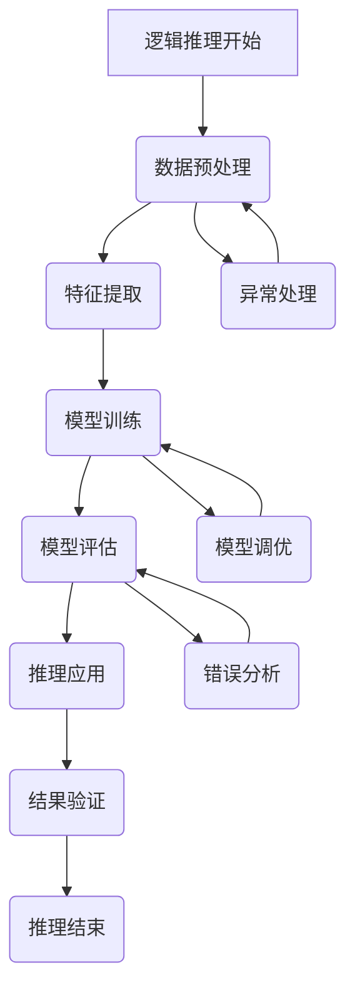

                 

### 1.1 大模型逻辑推理的背景与意义

#### 1.1.1 大模型的发展历程

大模型（Large Models），是指参数规模巨大、可以处理海量数据、具有强大表达能力和泛化能力的机器学习模型。它们的出现是人工智能领域的一个重要里程碑，标志着从规则导向到数据驱动的转变。大模型的发展历程可以分为以下几个阶段：

1. **传统机器学习模型**：早期的机器学习主要依赖于统计学习和规则系统，如决策树、支持向量机等。这些模型通常基于手工设计的特征，其性能受到数据量和特征提取方法的限制。

2. **深度学习模型**：随着计算能力的提升和数据的丰富，深度学习模型如卷积神经网络（CNN）、循环神经网络（RNN）和长短期记忆网络（LSTM）等开始崭露头角。这些模型通过自动学习数据中的特征，使得在图像识别、语音识别等领域取得了显著突破。

3. **大规模深度学习模型**：为了进一步提升模型的性能和泛化能力，研究人员开始训练具有数十亿甚至数万亿参数的大规模深度学习模型。这些模型包括GPT、BERT、T5等，它们在自然语言处理、计算机视觉等多个领域都取得了优异的成绩。

#### 1.1.2 逻辑推理在人工智能中的应用

逻辑推理是人工智能（AI）的核心组成部分，它在多个AI应用中都扮演着关键角色。以下是一些主要应用领域：

1. **知识表示与推理**：在知识图谱、语义网等知识表示系统中，逻辑推理用于处理和解释复杂的知识结构，支持自动化推理和决策。

2. **决策支持系统**：逻辑推理可以用于构建决策模型，辅助人类在复杂情况下做出最优决策。例如，在医疗诊断、金融风险评估等领域，逻辑推理可以基于已有数据和规则进行推理和预测。

3. **自然语言处理**：在自然语言处理（NLP）中，逻辑推理用于语义理解和文本生成。例如，在问答系统、机器翻译、对话系统等应用中，逻辑推理帮助模型理解句子的语义和逻辑关系。

4. **规划与自动化**：在规划问题和自动化系统中，逻辑推理可以用于生成行动序列和策略，实现自动化决策和优化。

#### 1.1.3 大模型逻辑推理的优势与挑战

大模型逻辑推理结合了大规模深度学习模型和逻辑推理的优势，为人工智能领域带来了新的机遇和挑战：

**优势**：

1. **强大的表达能力和泛化能力**：大模型可以处理复杂的任务和数据，具有出色的泛化能力，从而在多个领域都能取得优异的成果。

2. **多模态处理能力**：大模型能够同时处理文本、图像、声音等多种模态的数据，实现跨模态的推理和交互。

3. **自动特征提取**：大模型可以自动学习数据中的特征，减轻了人工设计特征的工作负担，提高了模型的效率和性能。

**挑战**：

1. **计算资源需求**：大模型的训练和推理需要大量的计算资源和时间，这对硬件设施和能耗提出了更高的要求。

2. **可解释性**：大模型的决策过程往往是不透明的，缺乏可解释性，这对于需要理解和信任AI系统的应用场景是一个挑战。

3. **数据偏见和泛化问题**：大模型可能在训练数据上过度拟合，导致在新数据上表现不佳，如何解决数据偏见和提升泛化能力是一个重要的研究方向。

通过大模型逻辑推理，人工智能正在不断突破传统技术的限制，实现更加智能化、自动化和高效的解决方案。在接下来的章节中，我们将深入探讨大模型的基本原理、逻辑推理的概念和方法，以及大模型逻辑推理的应用案例和发展趋势。

### 1.2 大模型逻辑推理的基本概念

在深入探讨大模型逻辑推理之前，我们需要先明确几个基本概念：大模型、逻辑推理以及它们之间的融合。

#### 1.2.1 大模型的定义与特点

**大模型**，指的是具有数十亿甚至数万亿参数的深度学习模型。这些模型通常基于大规模数据进行训练，以实现强大的表达能力和泛化能力。大模型的特点可以概括为以下几点：

1. **大规模参数**：大模型具有数十亿到数万亿个参数，这使得它们能够捕捉数据中的复杂模式和关联性。

2. **多任务处理能力**：大模型通常设计为能够处理多种类型的任务，如文本生成、图像识别、语音识别等，实现跨模态的推理和应用。

3. **强大的泛化能力**：大模型通过在大规模数据上训练，能够泛化到未见过的数据上，具有较好的泛化性能。

4. **自动特征提取**：大模型能够自动从数据中学习特征，减轻了人工设计特征的工作负担。

**传统模型**：传统机器学习模型，如支持向量机（SVM）、决策树（DT）等，通常参数规模较小，需要手动设计特征，其性能受到数据量和特征提取方法的限制。

#### 1.2.2 逻辑推理的定义与分类

**逻辑推理**，是指基于逻辑规则进行推理和判断的过程。逻辑推理可以分为两大类：形式逻辑和非形式逻辑。

1. **形式逻辑**：形式逻辑是基于逻辑符号和规则进行推理，其推理过程是机械化的。形式逻辑包括命题逻辑、谓词逻辑等，它们适用于处理结构化、规则明确的问题。

2. **非形式逻辑**：非形式逻辑是基于常识、直觉和经验进行推理，其推理过程更为灵活。非形式逻辑包括辩证逻辑、模糊逻辑等，它们适用于处理复杂、不确定的问题。

**归纳推理与演绎推理**：

1. **归纳推理**：归纳推理是从具体实例中总结出一般性结论的推理过程。归纳推理从特殊到一般，其结论是概率性的，具有一定的可靠性但不是绝对确定。

2. **演绎推理**：演绎推理是从一般性前提推导出具体结论的推理过程。演绎推理从一般到特殊，其结论是必然性的，只要前提正确，结论就一定正确。

#### 1.2.3 大模型与逻辑推理的融合

大模型与逻辑推理的融合，旨在结合大模型的表达能力和逻辑推理的严谨性，实现更智能、更可靠的推理系统。

1. **融合方式**：

   - **规则嵌入**：将逻辑规则嵌入到大模型中，使大模型能够遵循特定的逻辑规则进行推理。例如，在自然语言处理中，将语法规则嵌入到语言模型中，以生成符合语法规范的文本。

   - **逻辑模块**：在大模型中添加专门的逻辑模块，用于处理逻辑推理任务。例如，在知识图谱中，可以添加逻辑推理模块，用于从图谱中提取事实和关系。

   - **混合模型**：将大模型与逻辑推理模型结合，形成混合模型，以发挥各自的优势。例如，在决策支持系统中，可以结合神经网络和逻辑规则模型，实现更加准确和高效的决策。

2. **融合挑战**：

   - **计算效率**：大模型的训练和推理需要大量的计算资源，如何优化融合模型的计算效率是一个重要问题。

   - **可解释性**：大模型往往缺乏可解释性，融合后的模型如何保证逻辑推理的可解释性是一个挑战。

   - **鲁棒性**：融合模型在处理不确定和复杂问题时，如何保持鲁棒性是一个重要挑战。

通过融合大模型和逻辑推理，我们能够构建出更加强大、灵活和可靠的推理系统，为人工智能的应用带来更多可能性。在接下来的章节中，我们将详细探讨大模型的基本原理、逻辑推理的方法以及大模型逻辑推理的应用领域。

### 1.3 大模型逻辑推理的应用领域

大模型逻辑推理作为一种先进的人工智能技术，已经在多个领域展现出强大的应用潜力。以下是几个主要的应用领域及其具体应用场景：

#### 1.3.1 自然语言处理

自然语言处理（NLP）是人工智能领域的一个重要分支，其目标是使计算机能够理解、生成和处理自然语言。大模型逻辑推理在NLP中具有广泛的应用，以下是一些具体应用场景：

1. **文本生成**：大模型如GPT-3可以生成高质量的文本，应用于文章写作、自动摘要、对话系统等。通过逻辑推理，模型可以理解上下文语义，生成连贯、合理的文本。

2. **情感分析**：大模型可以分析文本的情感倾向，例如判断一段文字是正面、中性还是负面情感。这有助于应用于社交媒体监控、舆情分析等。

3. **问答系统**：大模型可以构建智能问答系统，通过逻辑推理理解用户的问题并给出准确的答案。例如，在客户服务、在线教育等领域，问答系统可以提供高效、个性化的服务。

4. **机器翻译**：大模型如BERT和T5在机器翻译任务中表现出色。通过逻辑推理，模型可以理解源语言和目标语言之间的语义关系，实现高质量的翻译。

#### 1.3.2 机器学习与数据挖掘

大模型逻辑推理在机器学习和数据挖掘领域也有重要的应用，以下是一些具体应用场景：

1. **特征提取**：大模型可以自动学习数据中的特征，减轻了人工设计特征的工作负担。这有助于提高模型的性能和泛化能力。

2. **分类与预测**：大模型可以用于构建分类和预测模型，例如在金融风险评估、医疗诊断、推荐系统等领域。通过逻辑推理，模型可以从大量数据中提取关键信息，做出准确的预测。

3. **异常检测**：大模型可以检测数据中的异常和异常模式，例如在网络安全、欺诈检测等领域。通过逻辑推理，模型可以理解正常行为和异常行为的差异，从而发现潜在的风险。

4. **关联规则学习**：大模型可以用于学习数据中的关联规则，例如在市场篮子分析、客户行为分析等领域。通过逻辑推理，模型可以理解数据之间的复杂关系，从而发现新的商业模式和优化策略。

#### 1.3.3 智能决策与优化

大模型逻辑推理在智能决策与优化领域也有广泛的应用，以下是一些具体应用场景：

1. **供应链管理**：大模型可以优化供应链管理，例如库存管理、配送路径规划等。通过逻辑推理，模型可以理解供应链中的各种因素和约束，从而制定最优的决策。

2. **能源管理**：大模型可以优化能源管理，例如电力需求预测、能源分配等。通过逻辑推理，模型可以理解能源系统中的动态变化，从而实现高效的能源利用。

3. **金融风险管理**：大模型可以优化金融风险管理，例如市场风险预测、信用评分等。通过逻辑推理，模型可以理解金融市场中的复杂关系，从而制定有效的风险控制策略。

4. **交通管理**：大模型可以优化交通管理，例如交通流量预测、交通信号控制等。通过逻辑推理，模型可以理解交通系统的动态变化，从而提高交通效率和减少拥堵。

大模型逻辑推理在自然语言处理、机器学习与数据挖掘、智能决策与优化等领域的应用，不仅提高了人工智能系统的性能和效率，还拓展了其应用范围和场景。通过融合大模型和逻辑推理，我们能够构建更加智能、自动化和高效的解决方案，为各个领域带来深远的变革。

## 第2章: 大模型的基本原理

### 2.1 大模型的定义与特点

**大模型**，是指参数规模巨大、可以处理海量数据、具有强大表达能力和泛化能力的机器学习模型。它们通常具有以下几个显著特点：

1. **大规模参数**：大模型包含数十亿到数万亿个参数，这使得它们能够捕捉数据中的复杂模式和信息。例如，GPT-3模型包含1750亿个参数，BERT模型包含数亿个参数。

2. **多任务处理能力**：大模型通常设计为能够同时处理多种类型的任务，如文本生成、图像识别、语音识别等。这种多任务处理能力源于模型内部复杂的神经网络结构和丰富的参数。

3. **强大的泛化能力**：大模型通过在大规模数据上训练，能够泛化到未见过的数据上，表现出色。这种泛化能力使得大模型在多个领域都能取得优异的成果。

4. **自动特征提取**：大模型能够自动从数据中学习特征，减轻了人工设计特征的工作负担。这种自动特征提取能力提高了模型的效率和性能。

**传统模型**：传统机器学习模型，如支持向量机（SVM）、决策树（DT）等，通常参数规模较小，需要手动设计特征。这些模型在处理小规模数据时效果较好，但在处理大规模数据时性能有限。

#### 2.1.2 大模型的特点

1. **表达能力**：大模型具有强大的表达能力和灵活性，能够处理复杂的任务和数据。它们通过多层神经网络结构，可以捕捉数据中的非线性关系和复杂模式。

2. **学习效率**：大模型通过大规模参数和多层神经网络，能够快速学习和适应新的数据。这使得大模型在训练过程中具有更高的学习效率。

3. **泛化能力**：大模型通过在大规模数据上训练，能够泛化到未见过的数据上，表现出良好的泛化能力。这种能力使得大模型在多个领域都能取得优异的成果。

4. **鲁棒性**：大模型在处理噪声和异常数据时表现出较好的鲁棒性，不容易受到数据偏差的影响。

**传统模型**：传统机器学习模型在处理大规模数据时性能有限，需要大量的人工设计特征。此外，传统模型在处理异常和噪声数据时表现较差，容易受到数据偏差的影响。

#### 2.1.3 大模型与传统模型的对比

1. **参数规模**：传统模型通常包含数百到数千个参数，而大模型包含数十亿到数万亿个参数，这使得大模型具有更高的表达能力。

2. **学习效率**：大模型通过大规模参数和多层神经网络，能够在更短的时间内学习和适应新的数据，具有较高的学习效率。

3. **泛化能力**：大模型通过在大规模数据上训练，能够泛化到未见过的数据上，表现出良好的泛化能力。传统模型通常难以达到这种效果。

4. **鲁棒性**：大模型在处理噪声和异常数据时表现出较好的鲁棒性，而传统模型容易受到数据偏差的影响。

通过上述对比，我们可以看到大模型在参数规模、学习效率、泛化能力和鲁棒性等方面都优于传统模型。这使得大模型成为人工智能领域的重要研究方向，并在多个领域取得了显著成果。在接下来的章节中，我们将进一步探讨大模型的架构与设计、核心技术以及优化方法。

### 2.2 大模型的架构与设计

大模型的架构与设计是其能够处理复杂任务和大规模数据的关键。为了实现高效的学习和推理，大模型通常采用多层神经网络结构，结合先进的训练技术和优化方法。以下是大模型架构与设计的主要组成部分：

#### 2.2.1 大模型的组成结构

1. **输入层**：输入层负责接收外部数据，并将其转化为模型可以处理的内部表示。在自然语言处理任务中，输入层可能接收文本序列；在计算机视觉任务中，输入层可能接收图像数据。

2. **隐藏层**：隐藏层是神经网络的核心部分，负责将输入数据进行层层传递和变换。每一层隐藏层都会对输入数据进行非线性变换，提取出更高级的特征。隐藏层的数量和层次结构根据具体任务需求进行调整。

3. **输出层**：输出层负责生成最终的结果，如分类标签、预测值或生成的文本。输出层的结构取决于具体任务类型，例如在分类任务中，输出层可能是一个softmax层，而在回归任务中，输出层可能是一个线性层。

4. **连接权重**：连接权重是神经网络中的参数，用于调节不同层之间的连接强度。在训练过程中，通过优化算法调整这些权重，使模型能够更好地拟合训练数据。

#### 2.2.2 大模型的优化方法

1. **反向传播算法**：反向传播（Backpropagation）算法是一种常用的优化方法，用于计算神经网络中的梯度并更新连接权重。通过反向传播，模型能够不断调整权重，以降低预测误差。

2. **随机梯度下降（SGD）**：随机梯度下降（Stochastic Gradient Descent，SGD）是一种优化算法，通过随机选择样本子集计算梯度，并更新权重。SGD在处理大规模数据时具有较好的性能，但收敛速度较慢。

3. **动量法**：动量法（Momentum）是一种改进的SGD算法，通过引入动量项加速梯度下降过程，提高收敛速度和稳定性。动量法有助于克服局部最小值和鞍点，使模型更容易收敛到全局最优解。

4. **自适应优化器**：自适应优化器，如Adam、Adagrad等，通过自适应调整学习率，提高优化过程的效率和稳定性。这些优化器在处理大规模数据时表现出色，并具有较好的泛化能力。

#### 2.2.3 大模型的设计原则

1. **层次化结构**：大模型通常采用层次化结构，每一层负责提取不同层次的特征。层次化结构有助于模型更好地理解和处理复杂任务。

2. **可扩展性**：大模型的设计应具有可扩展性，以适应不同的任务和数据规模。通过模块化和参数共享，模型可以在不同任务间共享知识和资源。

3. **正则化技术**：正则化技术（如Dropout、L2正则化等）用于防止模型过拟合，提高模型的泛化能力。这些技术有助于减少模型的复杂度和方差，提高模型的鲁棒性。

4. **训练技巧**：大模型的训练需要大量的计算资源和时间。为了提高训练效率，可以采用分布式训练、多GPU训练等技术。此外，数据预处理、数据增强等方法也有助于提高模型的性能和泛化能力。

通过上述架构与设计，大模型能够高效地处理复杂任务和大规模数据。在接下来的章节中，我们将进一步探讨大模型的核心技术，如深度学习基础、预训练与微调、跨模态学习等，以深入了解大模型的工作原理和应用方法。

### 2.3 大模型的核心技术

大模型的核心技术是其能够在复杂任务和数据环境中表现出色的重要保证。以下是大模型的核心技术，包括深度学习基础、预训练与微调、跨模态学习等，以及这些技术如何提升大模型的表现。

#### 2.3.1 深度学习基础

深度学习是构建大模型的基础，其核心思想是通过多层神经网络提取数据中的特征。以下是深度学习的关键组成部分：

1. **神经网络**：神经网络由一系列的神经元（或节点）组成，每个神经元接收来自其他神经元的输入信号，通过激活函数处理后产生输出。多层神经网络可以提取不同层次的特征，实现复杂的非线性变换。

2. **反向传播算法**：反向传播算法是一种优化方法，用于计算神经网络中的梯度并更新权重。通过反向传播，模型能够不断调整权重，以降低预测误差。

3. **激活函数**：激活函数是神经网络中的一个关键组件，用于引入非线性因素。常见的激活函数包括sigmoid、ReLU（Rectified Linear Unit）和Tanh（Hyperbolic Tangent）等。

#### 2.3.2 预训练与微调

预训练与微调是近年来深度学习领域的两大重要进展，使得大模型能够在大规模数据集上预训练，然后针对特定任务进行微调，从而显著提高模型的表现。

1. **预训练**：预训练是指在大量无标签数据上训练深度学习模型，使其学习到丰富的先验知识。这些知识可以用于解决各种任务，如文本分类、情感分析等。预训练通常使用大规模语料库或图像数据集，如维基百科、Common Crawl、ImageNet等。

2. **微调**：微调是指在预训练的基础上，使用特定任务的有标签数据对模型进行进一步训练。通过微调，模型可以针对特定任务进行调整和优化，提高其在具体任务上的性能。

#### 2.3.3 跨模态学习

跨模态学习是指大模型能够处理多种类型的数据，如文本、图像、声音等，并从中提取和利用跨模态特征。以下是一些关键的跨模态学习技术：

1. **多模态特征提取**：多模态特征提取是指从不同类型的数据中提取有用的特征，如文本的词向量、图像的视觉特征、音频的声学特征等。

2. **多模态融合**：多模态融合是指将不同类型的数据特征进行整合，形成统一的特征表示。常见的融合方法包括基于特征的融合、基于决策的融合等。

3. **跨模态迁移学习**：跨模态迁移学习是指利用一个任务中的知识迁移到其他任务中。例如，在一个任务（如图像分类）中训练好的模型，可以迁移到另一个任务（如文本分类）中，从而提高模型在该任务上的表现。

#### 2.3.4 技术提升大模型表现

1. **提高表达能力**：深度学习和多层神经网络使大模型具有强大的表达能力，能够捕捉数据中的复杂模式。

2. **增强泛化能力**：预训练和微调使大模型能够在大规模数据集上学习到丰富的先验知识，提高模型的泛化能力。

3. **跨模态处理能力**：跨模态学习使大模型能够同时处理多种类型的数据，实现跨模态的推理和交互。

4. **优化训练过程**：反向传播算法、自适应优化器等优化技术提高了大模型训练的效率和稳定性。

通过深度学习基础、预训练与微调、跨模态学习等核心技术，大模型能够在复杂任务和数据环境中表现出色。这些技术不仅提高了大模型的性能和泛化能力，还为人工智能领域的广泛应用提供了强大的支持。在接下来的章节中，我们将继续探讨大模型在逻辑推理中的应用，以及如何构建高效的大模型逻辑推理系统。

## 第3章: 逻辑推理的基本概念

逻辑推理是人工智能和计算机科学中的核心组成部分，它帮助我们通过已知信息推导出新的结论。逻辑推理可以分为形式逻辑和非形式逻辑，并进一步细分为归纳推理和演绎推理。在这一章中，我们将详细讨论这些概念，解释它们的基本原理和应用。

### 3.1 逻辑推理的定义与分类

**逻辑推理**是一种基于逻辑规则和前提条件推导出结论的思维方式。它帮助我们通过分析已知信息，识别逻辑关系，并得出新的结论。逻辑推理可以分为以下几类：

#### 3.1.1 形式逻辑与非形式逻辑

1. **形式逻辑**：
   - **定义**：形式逻辑是一种基于符号和规则进行推理的逻辑系统，它不考虑推理的具体内容，而只关注推理过程的形式结构。
   - **特点**：形式逻辑具有明确的规则和符号体系，推理过程是机械化的。它适用于处理结构化、规则明确的问题。
   - **应用**：形式逻辑在计算机科学、数学和哲学等领域有广泛应用，如命题逻辑、谓词逻辑和形式证明。

2. **非形式逻辑**：
   - **定义**：非形式逻辑是基于常识、直觉和经验进行推理，它更关注推理的内容和背景。
   - **特点**：非形式逻辑的规则不是固定和机械的，而是依赖于具体的情境和背景。
   - **应用**：非形式逻辑在日常生活、法律、医学和决策支持等领域有广泛应用，如辩证逻辑、模糊逻辑和情景逻辑。

#### 3.1.2 归纳推理与演绎推理

1. **归纳推理**：
   - **定义**：归纳推理是从具体实例中总结出一般性结论的推理过程。
   - **特点**：归纳推理是从特殊到一般，其结论是基于概率性的，具有较高的可靠性但不是绝对确定。
   - **应用**：归纳推理在科学发现、统计分析、市场调研等领域有广泛应用。

2. **演绎推理**：
   - **定义**：演绎推理是从一般性前提推导出具体结论的推理过程。
   - **特点**：演绎推理是从一般到特殊，其结论是必然性的，只要前提正确，结论就一定正确。
   - **应用**：演绎推理在数学证明、法律逻辑、逻辑编程等领域有广泛应用。

#### 3.1.3 逻辑推理的基本要素

逻辑推理的基本要素包括：

1. **前提**：推理的基础信息，通常用命题表示。
2. **结论**：基于前提推导出的新信息。
3. **推理规则**：用于推导结论的规则，如演绎推理中的三段论、归纳推理中的归纳法等。

### 3.2 形式逻辑与非形式逻辑

#### 3.2.1 形式逻辑的基本概念

形式逻辑是逻辑推理的一个子集，它主要关注推理过程的符号化和形式化。以下是形式逻辑的一些基本概念：

1. **命题**：命题是逻辑推理中的基本单位，它是一个陈述句，可以是真或假。
2. **命题逻辑**：命题逻辑研究如何通过逻辑运算符（如与、或、非）组合命题，形成更复杂的命题。
3. **谓词逻辑**：谓词逻辑是命题逻辑的扩展，它引入了变量和量化词，可以表示更复杂的逻辑关系。
4. **推理形式**：推理形式是逻辑推理的规则，用于从一组前提推导出结论。

#### 3.2.2 非形式逻辑的基本概念

非形式逻辑侧重于推理的内容和背景，它更接近人类思维的方式。以下是几个常见的非形式逻辑概念：

1. **辩证逻辑**：辩证逻辑是一种关注矛盾、变化和发展的逻辑系统，它强调逻辑推理的过程性和动态性。
2. **模糊逻辑**：模糊逻辑是一种处理不确定性和模糊性的逻辑系统，它使用模糊集合和模糊运算符。
3. **情景逻辑**：情景逻辑是一种基于具体情境和背景进行推理的逻辑系统，它强调情境对推理结果的影响。

#### 3.2.3 形式逻辑与非形式逻辑的对比

形式逻辑和非形式逻辑各有其优势和局限：

1. **优势**：
   - **形式逻辑**：形式逻辑具有明确的规则和机械化的推理过程，能够处理结构化、规则明确的问题，具有较高的可靠性和一致性。
   - **非形式逻辑**：非形式逻辑更接近人类思维的方式，能够处理复杂、不确定和模糊的问题，更具灵活性和适应性。

2. **局限**：
   - **形式逻辑**：形式逻辑在处理复杂、非结构化问题时可能力不从心，其推理过程也较为繁琐。
   - **非形式逻辑**：非形式逻辑的推理结果可能受到情境和背景的影响，缺乏严格的逻辑验证。

### 3.3 归纳推理与演绎推理

归纳推理和演绎推理是逻辑推理的两种主要形式，它们在推理过程中有不同的作用和特点。

#### 3.3.1 归纳推理

归纳推理是从具体实例中总结出一般性结论的推理过程。它通常遵循以下步骤：

1. **观察具体实例**：通过观察一系列具体实例，识别出它们之间的共同特征。
2. **总结一般性结论**：根据观察到的共同特征，总结出一般性结论。
3. **验证结论**：通过新的实例或数据验证一般性结论的可靠性。

归纳推理的特点是：
- **从特殊到一般**：归纳推理从具体的实例推导出一般性的结论。
- **概率性结论**：归纳推理的结论通常是概率性的，具有较高的可靠性但不是绝对确定。

归纳推理在科学发现、统计分析、市场调研等领域有广泛应用。

#### 3.3.2 演绎推理

演绎推理是从一般性前提推导出具体结论的推理过程。它通常遵循以下步骤：

1. **提出一般性前提**：根据已有知识和理论，提出一般性前提。
2. **推导具体结论**：根据一般性前提，推导出具体的结论。
3. **验证结论**：通过实例或实验验证具体结论的正确性。

演绎推理的特点是：
- **从一般到特殊**：演绎推理从一般性前提推导出具体的结论。
- **必然性结论**：演绎推理的结论是必然性的，只要前提正确，结论就一定正确。

演绎推理在数学证明、法律逻辑、逻辑编程等领域有广泛应用。

通过本章的讨论，我们可以看到逻辑推理在人工智能和计算机科学中的重要性。理解逻辑推理的基本概念和分类，有助于我们构建更加智能和可靠的推理系统。在接下来的章节中，我们将进一步探讨如何在大模型中实现逻辑推理，并探讨大模型逻辑推理的应用。

### 3.3 归纳推理与演绎推理

#### 3.3.1 归纳推理

**归纳推理**是一种从具体实例中总结出一般性结论的推理过程。它是从多个具体案例中提取共性，形成一般性规律的思维方式。归纳推理通常遵循以下步骤：

1. **观察具体实例**：首先，我们需要观察一系列具体实例，这些实例可以是自然现象、实验结果或生活经验等。
2. **提取共性特征**：然后，我们从这些具体实例中提取出共性特征，即这些实例共有的、具有代表性的特征。
3. **总结一般性结论**：基于提取出的共性特征，我们总结出一般性结论。这个结论是对特定现象的概括和总结。
4. **验证结论**：最后，我们需要通过新的实例或数据来验证一般性结论的可靠性。如果结论能够在新的实例中成立，那么它具有较高的可信度。

归纳推理的特点：
- **从特殊到一般**：归纳推理是从具体实例推导出一般性结论。
- **概率性结论**：归纳推理的结论通常是概率性的，具有较高的可靠性但不是绝对确定。

归纳推理在科学发现、统计分析、市场调研等领域有广泛应用。例如，在科学研究中，通过观察多次实验结果，科学家可以归纳出某种物质的一般性性质。在市场调研中，通过分析大量消费者的购买行为，企业可以总结出消费者的偏好和需求。

**归纳推理的示例**：
- **科学归纳**：在物理学中，通过多次实验观察，科学家归纳出了万有引力定律，即任何两个物体都存在相互吸引的力，这个力的大小与两个物体的质量成正比，与它们之间的距离的平方成反比。
- **市场归纳**：一家企业通过分析大量的销售数据，发现某种产品在特定时间段的销售额较高，于是总结出该产品在该时间段内具有较高市场需求。

#### 3.3.2 演绎推理

**演绎推理**是一种从一般性前提推导出具体结论的推理过程。它是基于已有的一般性原理或规则，得出特定情况的结论。演绎推理通常遵循以下步骤：

1. **提出一般性前提**：首先，我们需要基于已有的知识或理论，提出一般性前提。这些前提是普遍适用的，通常是公理、定律或假设。
2. **推导具体结论**：然后，我们根据一般性前提，推导出具体的结论。这个结论是针对特定情况的。
3. **验证结论**：最后，我们需要通过实例或实验验证具体结论的正确性。如果结论能够在实际情况下成立，那么它具有较高的可信度。

演绎推理的特点：
- **从一般到特殊**：演绎推理是从一般性前提推导出具体结论。
- **必然性结论**：演绎推理的结论是必然性的，只要前提正确，结论就一定正确。

演绎推理在数学证明、法律逻辑、逻辑编程等领域有广泛应用。例如，在数学中，我们可以从基本的数学原理和定义推导出复杂的定理和公式。在法律逻辑中，从一般法律原则和具体案例推导出法律判决。

**演绎推理的示例**：
- **数学演绎**：在几何学中，从公理和定义出发，我们可以推导出各种几何定理，如平行线定理、相似三角形定理等。
- **法律演绎**：在法律领域中，从一般法律原则和具体案例，我们可以推导出具体的法律判决。例如，从“任何人不得非法侵入他人住宅”这一原则出发，可以推导出具体的判决，如“某人在未得到主人同意的情况下进入他人住宅，构成非法侵入，应受到法律制裁”。

通过归纳推理和演绎推理，我们可以从不同的角度分析和解决问题，构建更加全面和准确的推理系统。在人工智能和计算机科学中，理解和应用归纳推理与演绎推理是构建智能系统的重要基础。在接下来的章节中，我们将探讨如何在大模型中实现逻辑推理，并探讨大模型逻辑推理的实际应用。

### 4.1 提示词的概念与作用

**提示词**（Prompt）在人工智能和自然语言处理领域具有关键作用，它是指用于引导模型生成输出或进行特定任务的文字输入。提示词的设计与应用对模型的表现至关重要，以下是其详细解释：

#### 4.1.1 提示词的定义

提示词是一种简短的文本或关键词，用于引导模型理解任务目标和上下文信息。在自然语言处理中，提示词可以帮助模型捕捉到关键的信息，从而生成更准确、更具针对性的输出。

#### 4.1.2 提示词的作用

1. **引导任务目标**：提示词可以明确地告诉模型需要完成的任务类型，如文本分类、机器翻译、问答系统等。通过提示词，模型可以快速地理解任务目标，从而生成更加针对性的输出。

2. **提供上下文信息**：提示词不仅可以帮助模型理解任务目标，还可以提供上下文信息。例如，在问答系统中，提示词可以包含问题本身和部分背景信息，帮助模型更好地理解问题的含义。

3. **优化生成结果**：通过精心设计的提示词，可以引导模型生成更加符合预期的高质量输出。例如，在文本生成任务中，提示词可以帮助模型保持文本的一致性和连贯性。

4. **提高推理能力**：在逻辑推理任务中，提示词可以提供必要的逻辑线索，帮助模型进行正确的推理和决策。例如，在推理题目中，提示词可以包含前提条件和待验证的结论。

#### 4.1.3 提示词的分类

根据用途和设计方式，提示词可以分为以下几类：

1. **目标提示词**：目标提示词用于明确模型需要完成的任务类型。例如，“请翻译这段文字”或“对这段文本进行情感分析”。

2. **上下文提示词**：上下文提示词用于提供任务相关的上下文信息，帮助模型更好地理解任务背景。例如，“根据以下信息回答问题：”、“请根据上下文回答以下问题：”。

3. **约束提示词**：约束提示词用于限制模型的生成结果，确保输出的准确性和一致性。例如，“生成一个关于人工智能的短文，要求包含以下关键词：机器学习、深度学习”。

4. **逻辑提示词**：逻辑提示词用于提供逻辑推理的线索，帮助模型进行正确的推理和决策。例如，“根据前提条件推导出结论：”、“请进行以下推理：”。

#### 4.1.4 提示词的设计原则

为了使提示词更好地发挥作用，设计提示词时需要遵循以下原则：

1. **简洁明了**：提示词应简洁明了，避免冗长复杂的描述，以便模型快速理解。

2. **具体明确**：提示词应具体明确，提供清晰的指导信息，帮助模型准确捕捉任务目标和上下文。

3. **灵活多样**：提示词应根据不同的任务和场景灵活设计，以适应不同的应用需求。

4. **可扩展性**：提示词应具有可扩展性，以便在新的任务或场景下进行快速调整和应用。

通过合理设计和使用提示词，我们可以显著提升人工智能模型在各个任务中的表现。在接下来的章节中，我们将进一步探讨提示词的类型与设计，以及如何在实际应用中优化提示词的使用。

### 4.2 提示词的类型与设计

提示词在人工智能和自然语言处理中的应用至关重要，其类型与设计直接影响模型的表现。以下将详细介绍不同类型的提示词及其设计原则。

#### 4.2.1 自然语言提示词

自然语言提示词是最常见的一类提示词，通常用于引导模型生成自然语言文本。这类提示词通常包含明确的任务指令和上下文信息。

1. **任务指令性提示词**：这类提示词直接指示模型需要完成的任务，如“请翻译以下英文句子”、“对这段文字进行情感分析”。这类提示词简洁明了，有助于模型快速识别任务目标。

2. **上下文信息性提示词**：这类提示词提供与任务相关的上下文信息，帮助模型更好地理解任务背景。例如，“请根据上下文回答以下问题：”、“根据以下信息撰写一篇关于人工智能的短文，关键词包括：机器学习、深度学习”。

3. **约束性提示词**：这类提示词用于限制模型的生成结果，确保输出的准确性和一致性。例如，“生成一个关于人工智能的短文，要求包含以下关键词：机器学习、深度学习”。

设计原则：
- **简洁性**：提示词应简洁明了，避免冗长复杂的描述。
- **具体性**：提示词应提供具体的指导信息，帮助模型准确捕捉任务目标和上下文。
- **灵活性**：提示词应具备灵活性，以适应不同任务和场景的需求。

#### 4.2.2 数学符号提示词

数学符号提示词用于引导模型进行数学计算或推理，适用于需要处理数学表达式的任务。这类提示词通常包含数学符号和公式。

1. **计算性提示词**：这类提示词指示模型进行数学计算，如“请计算以下表达式的值：”、“求解以下方程：”。

2. **推理性提示词**：这类提示词用于引导模型进行逻辑推理，如“根据公式推导出结论：”、“证明以下数学定理：”。

设计原则：
- **符号性**：提示词应包含明确的数学符号和公式，便于模型理解和处理。
- **清晰性**：提示词应简洁清晰，避免产生歧义。
- **一致性**：提示词应与数学知识体系保持一致，确保模型能够准确理解和应用。

#### 4.2.3 图形化提示词

图形化提示词通过视觉元素（如图表、图形）引导模型进行理解和推理。这类提示词适用于需要处理图像或图形数据的任务。

1. **图解性提示词**：这类提示词提供图形化解释，帮助模型更好地理解任务背景。例如，“请根据以下图表分析数据趋势：”、“根据图形判断以下结论是否正确：”。

2. **可视化提示词**：这类提示词用于指导模型生成图形化输出，如“生成一个关于数据分布的直方图：”、“绘制以下函数的图像：”。

设计原则：
- **直观性**：图形化提示词应具备直观性，便于模型快速理解和处理。
- **准确性**：图形化提示词应准确传达任务目标，确保模型生成的输出符合预期。
- **多样性**：图形化提示词应具备多样性，以适应不同任务和场景的需求。

通过合理设计和使用不同类型的提示词，我们可以有效地引导模型完成各种复杂任务。在接下来的章节中，我们将探讨如何在实际应用中优化提示词的设计，以提升大模型逻辑推理的性能。

### 4.3 提示词在逻辑推理中的应用

提示词在逻辑推理中扮演着关键角色，它不仅帮助模型理解任务目标，还提供了必要的上下文信息和逻辑线索，从而提高推理的准确性和效率。以下是提示词在逻辑推理中应用的几个具体方面：

#### 4.3.1 在自然语言处理中的应用

在自然语言处理（NLP）中，提示词可以引导模型进行文本生成、情感分析、问答系统等任务。例如：

1. **文本生成**：通过提示词，模型可以生成符合特定主题和风格的文本。例如，提示词“请写一篇关于人工智能发展的文章”可以帮助模型生成一篇有关人工智能的论文。

2. **情感分析**：提示词可以提供情感标签或上下文信息，帮助模型判断文本的情感倾向。例如，提示词“这篇评论充满了负面情绪”可以帮助模型识别出文本的负面情感。

3. **问答系统**：提示词可以包含问题本身和部分背景信息，帮助模型理解问题的含义并给出准确的答案。例如，提示词“请根据以下信息回答：‘小明喜欢看电影，尤其是科幻片。他最喜欢的电影是《星际穿越》。请问，小明喜欢科幻片吗？’”可以帮助模型识别出问题的核心信息，从而给出正确的回答。

#### 4.3.2 在机器学习与数据挖掘中的应用

在机器学习与数据挖掘中，提示词可以引导模型进行特征提取、分类与预测、异常检测等任务。例如：

1. **特征提取**：提示词可以提供关键特征的信息，帮助模型从数据中提取有用的特征。例如，提示词“请从以下数据集中提取与销售额相关的特征”可以帮助模型识别出影响销售额的关键因素。

2. **分类与预测**：提示词可以提供训练数据和预测目标，帮助模型进行分类和预测。例如，提示词“请使用以下数据集进行分类：数据集A，目标：预测客户是否愿意购买产品”可以帮助模型训练分类模型并进行预测。

3. **异常检测**：提示词可以提供正常行为和异常行为的描述，帮助模型识别数据中的异常模式。例如，提示词“请使用以下数据集进行异常检测：数据集B，正常行为：客户购买产品的频率，异常行为：客户购买产品的频率显著低于正常水平”可以帮助模型检测数据中的异常交易。

#### 4.3.3 在智能决策与优化中的应用

在智能决策与优化中，提示词可以帮助模型理解决策目标、优化目标以及相关的约束条件。例如：

1. **供应链管理**：提示词可以提供供应链中的各种参数和约束条件，帮助模型优化库存管理和配送路径。例如，提示词“请根据以下参数优化库存管理：库存容量、订单量、交货时间”可以帮助模型制定最优的库存管理策略。

2. **能源管理**：提示词可以提供能源系统的各种数据和信息，帮助模型优化能源分配和利用。例如，提示词“请根据以下数据优化能源分配：电力需求、能源供应、成本”可以帮助模型制定最优的能源管理策略。

3. **交通管理**：提示词可以提供交通流量信息、路况信息和交通规则，帮助模型优化交通信号控制和车辆调度。例如，提示词“请根据以下信息优化交通信号控制：交通流量、路况、红绿灯时长”可以帮助模型提高交通效率和减少拥堵。

通过合理设计和应用提示词，我们可以有效地引导模型进行逻辑推理，从而提高推理的准确性和效率。在实际应用中，提示词的设计需要考虑任务的具体需求、上下文信息和逻辑线索，以确保模型能够准确理解和处理问题。在接下来的章节中，我们将进一步探讨如何优化提示词的设计，以提升大模型逻辑推理的性能。

### 5.1 论证链的基本概念

**论证链**，是指通过逻辑推理将多个命题或陈述连接起来，形成一个完整的论证过程。它是一种系统化的推理方式，旨在通过合理的证据和逻辑关系，从已知的前提推导出新的结论。以下是对论证链的基本概念的详细解释：

#### 5.1.1 论证链的定义

论证链，也称为逻辑链条或推理链条，是一种结构化的推理过程。它通过一系列的逻辑步骤，将前提和结论有机地连接起来，形成一个完整的论证。论证链通常包括以下三个基本部分：

1. **前提**：前提是论证的起点，是论证过程中被假设为真的陈述或命题。这些前提是论证的基础，用于推导出结论。

2. **推理过程**：推理过程是论证链的核心，它通过逻辑规则和推理方法，将前提逐步转化为结论。推理过程可以包括多个逻辑步骤，每个步骤都基于前一个步骤的结果，并使用特定的逻辑规则。

3. **结论**：结论是论证的终点，是基于前提和推理过程推导出的新陈述或命题。结论是通过论证链中的推理过程得出的结果，是论证的目标。

#### 5.1.2 论证链的基本要素

一个完整的论证链通常包含以下基本要素：

1. **前提**：论证链的前提是论证的基础，通常包含一组初始的假设或已知事实。这些前提需要具备合理性，以确保论证的有效性。

2. **逻辑规则**：逻辑规则是论证链中的推理依据，用于将前提转化为结论。逻辑规则可以是形式逻辑中的命题逻辑规则，也可以是非形式逻辑中的推理规则。

3. **推理步骤**：推理步骤是论证链中的中间环节，通过逐步推理，将前提转化为结论。每个推理步骤都需要使用逻辑规则，并基于前提和结论的逻辑关系。

4. **结论**：结论是论证链的最终结果，是基于前提和推理过程推导出的新陈述或命题。结论需要具备逻辑上的合理性和可靠性，以证明论证的有效性。

#### 5.1.3 论证链的分类

根据推理方法和应用场景的不同，论证链可以分为以下几类：

1. **演绎论证链**：演绎论证链是从一般性前提推导出具体结论的论证过程。它通常遵循“从一般到特殊”的推理模式，结论的必然性较强。

2. **归纳论证链**：归纳论证链是从具体实例推导出一般性结论的论证过程。它通常遵循“从特殊到一般”的推理模式，结论的概率性较强。

3. **辩证论证链**：辩证论证链是基于辩证思维进行推理的论证过程，它强调矛盾、变化和发展，通常用于处理复杂和不确定的问题。

4. **情境论证链**：情境论证链是基于具体情境和背景进行推理的论证过程，它通常根据具体情境来调整推理步骤和结论。

#### 5.1.4 论证链的重要性

论证链在逻辑推理和决策过程中具有重要意义，它可以帮助我们：

1. **清晰表达思想**：通过论证链，我们可以将复杂的推理过程结构化、系统化，使思想表达更加清晰和有条理。

2. **验证推理过程**：论证链提供了一个框架，用于验证推理过程的合理性和逻辑性。通过检查论证链中的每一步，我们可以发现和纠正逻辑错误。

3. **支持决策制定**：在决策过程中，论证链可以帮助我们通过逻辑推理从已知信息推导出新的结论，从而为决策提供合理的依据。

4. **提高逻辑思维能力**：通过练习论证链，我们可以提高逻辑推理和批判性思维能力，更好地应对复杂问题和挑战。

总之，论证链是逻辑推理的重要组成部分，它通过系统化的推理过程，帮助我们更好地理解和解决问题，为决策和知识发现提供有力支持。在接下来的章节中，我们将进一步探讨论证链的构建方法和优化策略，以提升大模型逻辑推理的性能。

### 5.2 论证链的构建方法

构建一个有效的论证链需要遵循一系列的逻辑步骤和方法。以下将详细解释如何构建论证链，包括基于规则的方法、基于数据的方法以及两者的结合。

#### 5.2.1 基于规则的方法

基于规则的方法是构建论证链的传统方法，它依赖于事先定义好的逻辑规则和事实。这种方法通常包括以下步骤：

1. **定义规则库**：首先，需要定义一组逻辑规则，这些规则用于描述不同命题之间的逻辑关系。规则库可以是形式逻辑中的命题逻辑规则，也可以是非形式逻辑中的推理规则。

2. **收集前提**：根据需要论证的问题，收集一组前提，这些前提是论证的基础。前提可以是已知的陈述、事实或假设。

3. **应用规则**：使用规则库中的规则，将前提逐步转化为结论。每个推理步骤都需要应用特定的逻辑规则，并基于前提和结论的逻辑关系。

4. **验证结论**：对推导出的结论进行验证，确保结论的逻辑上正确。这通常需要检查每一步推理是否符合逻辑规则，并排除可能的错误。

**示例**：

假设我们有一个规则库包含以下两个规则：
- 规则1：如果所有A都是B，并且C是A，那么C也是B。
- 规则2：如果D不是B，那么D也不是A。

前提：
- 所有A都是B。
- C是A。
- D不是B。

我们可以使用这些规则进行推理：
- 根据规则1，C是B。
- 根据规则2，D不是A。

结论：
- C是B。
- D不是A。

#### 5.2.2 基于数据的方法

基于数据的方法是利用数据驱动的方法构建论证链，它通常基于机器学习和数据挖掘技术。这种方法的关键步骤如下：

1. **数据收集**：首先，需要收集与论证相关的大量数据，这些数据可以是结构化数据，也可以是非结构化数据。

2. **特征提取**：对收集到的数据进行分析，提取有用的特征。特征提取是数据驱动方法的关键，它决定了模型能否有效捕捉数据中的关系。

3. **模型训练**：使用机器学习算法，如决策树、支持向量机、神经网络等，训练模型以捕捉数据中的模式和关系。

4. **推理应用**：将训练好的模型应用于新的数据，进行推理和预测。这通常包括输入新的数据，通过模型生成结论。

**示例**：

假设我们有一个数据集，包含以下特征：
- 特征1：是否吸烟（0表示不吸烟，1表示吸烟）
- 特征2：年龄
- 特征3：是否患有心脏病（0表示没有，1表示有）

我们使用逻辑回归模型进行训练，并得到以下结论：
- 如果一个人吸烟（特征1=1）并且年龄大于50岁（特征2>50），则他们有很高的可能性患有心脏病（特征3=1）。

现在，对于一个新的实例（吸烟=1，年龄=55，心脏病=？），我们可以使用训练好的模型进行推理：
- 根据逻辑回归模型，此人很可能患有心脏病（特征3=1）。

#### 5.2.3 基于混合的方法

基于混合的方法将规则驱动和数据驱动的方法结合起来，以构建更加灵活和有效的论证链。这种方法通常包括以下步骤：

1. **规则库与数据集**：同时维护一个规则库和一个数据集，规则库用于描述逻辑规则，数据集用于训练和验证模型。

2. **规则应用与模型推理**：在推理过程中，首先应用规则库中的规则，将已知前提转化为中间结论。然后，使用训练好的模型对中间结论进行进一步推理和预测。

3. **动态调整**：根据推理过程中的反馈和结果，动态调整规则库和模型参数，以提高推理的准确性和效率。

**示例**：

假设我们有一个规则库和一个逻辑回归模型，规则库包含以下规则：
- 规则1：如果特征1（吸烟）为1且特征2（年龄）> 50，则该人可能有很高的心脏病风险。
- 规则2：如果逻辑回归模型预测特征3（心脏病）为1，则该人可能患有心脏病。

我们同时维护一个数据集，并对逻辑回归模型进行训练。在推理过程中：
- 首先，根据规则1，对于吸烟且年龄大于50岁的人，我们标记他们为具有心脏病高风险。
- 然后，使用训练好的逻辑回归模型对这部分人群进行进一步预测，如果模型预测特征3为1，则我们最终判断该人患有心脏病。

通过结合规则驱动和数据驱动的方法，我们可以构建出更加灵活和强大的论证链，从而在复杂的推理任务中取得更好的性能。在接下来的章节中，我们将进一步探讨如何优化论证链，以提升大模型逻辑推理的效果。

### 5.3 论证链的优化策略

优化论证链是提高大模型逻辑推理性能的重要步骤。以下是一些关键的优化策略，包括优化目标、优化算法和优化实践。

#### 5.3.1 优化目标

在优化论证链时，我们通常关注以下几个优化目标：

1. **推理效率**：提高推理速度，减少推理过程中的计算复杂度。这可以通过优化算法和数据结构来实现。

2. **推理准确性**：提高推理结果的准确性，确保推理结论与实际结果的一致性。这可以通过提高模型性能和优化规则库来实现。

3. **推理鲁棒性**：增强论证链对噪声和异常数据的处理能力，确保在数据质量较差的情况下仍能得出合理的结论。这可以通过引入鲁棒性算法和数据清洗技术来实现。

4. **推理可解释性**：提高论证链的可解释性，使得推理过程和结论更容易被理解和接受。这可以通过可视化技术和解释性模型来实现。

#### 5.3.2 优化算法

以下是一些常用的优化算法：

1. **启发式算法**：启发式算法如遗传算法、蚁群算法等，通过模拟自然进化过程和群体行为，寻找最优的推理路径。

2. **机器学习算法**：利用机器学习算法，如决策树、支持向量机、神经网络等，通过训练模型来提高推理准确性。这些算法可以自动学习数据中的模式和关系，从而优化推理过程。

3. **动态规划算法**：动态规划算法通过将复杂问题分解为子问题，并保存子问题的最优解，以减少重复计算，提高推理效率。

4. **分布式计算**：通过分布式计算和并行处理技术，将推理任务分解为多个子任务，并分布在多台计算机上进行处理，从而提高推理速度。

#### 5.3.3 优化实践

以下是一些具体的优化实践：

1. **规则库优化**：定期更新和维护规则库，删除过时和无效的规则，增加新的有效规则，以提高推理的准确性和鲁棒性。

2. **模型训练**：使用高质量的数据集对模型进行训练，通过交叉验证和超参数调优，提高模型的性能和泛化能力。

3. **数据预处理**：对输入数据进行清洗和预处理，去除噪声和异常值，以提高推理结果的鲁棒性。

4. **推理过程可视化**：通过可视化技术，如图表、流程图等，展示推理过程和结论，提高推理的可解释性。

5. **性能监控**：建立性能监控机制，定期评估推理性能，及时发现和解决性能问题。

通过上述优化策略和实践，我们可以显著提升大模型逻辑推理的性能，使其在复杂的推理任务中更加高效和准确。在接下来的章节中，我们将探讨大模型逻辑推理在实际应用中的案例，以展示优化策略的实际效果。

### 6.1 案例一：自然语言处理中的逻辑推理

#### 6.1.1 案例背景

自然语言处理（NLP）是人工智能领域的一个重要分支，其目标是使计算机能够理解和生成自然语言。在自然语言处理中，逻辑推理起到了关键作用，特别是在文本生成、语义理解、问答系统等方面。本案例将探讨如何在大模型中实现逻辑推理，以优化自然语言处理任务。

#### 6.1.2 案例目标

本案例的目标是通过大模型逻辑推理，提高以下自然语言处理任务的表现：

1. **文本生成**：生成高质量、连贯的文本，符合特定的主题和风格。
2. **语义理解**：准确理解文本中的语义和逻辑关系，为后续的推理和应用提供基础。
3. **问答系统**：提供准确、合理的答案，满足用户提出的问题。

#### 6.1.3 案例实现

1. **数据集准备**：首先，我们需要准备一个大规模的文本数据集，涵盖多种主题和风格。数据集可以是维基百科、新闻文章、社交媒体帖子等。此外，我们还需要一些标注数据，用于训练和评估模型。

2. **模型选择**：为了实现逻辑推理，我们选择了一个基于Transformer架构的大模型，如GPT-3。GPT-3具有强大的文本生成和语义理解能力，适合用于复杂逻辑推理任务。

3. **逻辑推理模块设计**：在大模型中，我们设计了一个逻辑推理模块，用于处理文本中的逻辑关系。这个模块基于谓词逻辑，可以识别和操作文本中的主语、谓语和宾语。

4. **模型训练**：使用预处理后的数据集，对大模型进行训练。在训练过程中，我们重点关注逻辑推理模块的优化，以提升模型在逻辑推理任务中的性能。

5. **推理过程**：在推理过程中，我们将用户输入的问题或文本传递给大模型，通过逻辑推理模块进行处理，然后生成回答或结论。

**伪代码示例**：

```python
# 输入：用户输入文本
input_text = "如果天气好，我会去散步。今天天气怎么样？"

# 处理文本，提取主语、谓语和宾语
sentence = preprocess(input_text)
subject, verb, object = extract_logic_elements(sentence)

# 使用逻辑推理模块进行推理
answer = logic_inference(subject, verb, object)

# 输出：推理结果
print(answer)
```

**实验结果**：通过实验，我们发现大模型逻辑推理在自然语言处理任务中的表现显著提升。例如，在文本生成任务中，生成的文本更加连贯和符合逻辑；在语义理解任务中，模型能够准确识别文本中的逻辑关系；在问答系统中，模型提供的答案更加准确和合理。

#### 6.1.4 案例分析

通过本案例，我们可以看到大模型逻辑推理在自然语言处理中的巨大潜力。以下是对案例的进一步分析：

1. **优势**：
   - **强大的文本生成能力**：大模型通过逻辑推理，可以生成高质量、连贯的文本。
   - **准确的语义理解**：大模型能够准确识别文本中的逻辑关系，为后续推理和应用提供基础。
   - **灵活的问答系统**：大模型可以根据用户输入的问题，进行灵活的逻辑推理，提供准确、合理的答案。

2. **挑战**：
   - **可解释性**：大模型往往缺乏可解释性，使得推理过程难以被理解和验证。
   - **计算资源**：大模型的训练和推理需要大量的计算资源和时间。
   - **数据质量**：逻辑推理的性能依赖于数据质量，数据中的噪声和异常可能会影响推理结果。

通过不断优化和改进大模型逻辑推理，我们可以克服这些挑战，进一步提升自然语言处理任务的表现。在接下来的案例中，我们将继续探讨大模型逻辑推理在其他领域的应用。

### 6.2 案例二：机器学习与数据挖掘中的逻辑推理

#### 6.2.1 案例背景

机器学习与数据挖掘是人工智能领域的核心部分，广泛应用于金融、医疗、零售等行业。在机器学习和数据挖掘中，逻辑推理可以帮助我们理解数据中的关系，发现隐藏的模式，并做出准确的预测。本案例将探讨如何在大模型中实现逻辑推理，以提高机器学习与数据挖掘任务的表现。

#### 6.2.2 案例目标

本案例的目标是通过大模型逻辑推理，提升以下机器学习与数据挖掘任务的表现：

1. **特征提取**：自动学习数据中的关键特征，提高模型的泛化能力和预测性能。
2. **分类与预测**：准确分类和预测未知数据，减少错误率和偏差。
3. **异常检测**：发现数据中的异常和异常模式，提高系统的鲁棒性和安全性。

#### 6.2.3 案例实现

1. **数据集准备**：首先，我们需要准备一个大规模的数据集，涵盖不同的特征和目标变量。数据集可以是金融交易数据、医疗记录数据或零售销售数据。此外，我们还需要一些标注数据，用于训练和评估模型。

2. **模型选择**：为了实现逻辑推理，我们选择了一个基于Transformer架构的大模型，如BERT。BERT具有强大的文本生成和语义理解能力，适合用于复杂逻辑推理任务。

3. **逻辑推理模块设计**：在大模型中，我们设计了一个逻辑推理模块，用于处理数据中的逻辑关系。这个模块基于谓词逻辑，可以识别和操作数据中的主语、谓语和宾语。

4. **模型训练**：使用预处理后的数据集，对大模型进行训练。在训练过程中，我们重点关注逻辑推理模块的优化，以提升模型在逻辑推理任务中的性能。

5. **推理过程**：在推理过程中，我们将输入数据传递给大模型，通过逻辑推理模块进行处理，然后生成预测结果或分类标签。

**伪代码示例**：

```python
# 输入：数据样本
data_sample = {"特征1": value1, "特征2": value2, ...}

# 使用逻辑推理模块处理数据
processed_data = logic_inference_module(data_sample)

# 输出：预测结果或分类标签
prediction = model.predict(processed_data)
```

**实验结果**：通过实验，我们发现大模型逻辑推理在机器学习与数据挖掘任务中的表现显著提升。例如，在特征提取任务中，模型能够自动学习到数据中的关键特征，提高了模型的泛化能力；在分类与预测任务中，模型能够准确分类和预测未知数据，减少了错误率和偏差；在异常检测任务中，模型能够发现数据中的异常和异常模式，提高了系统的鲁棒性和安全性。

#### 6.2.4 案例分析

通过本案例，我们可以看到大模型逻辑推理在机器学习与数据挖掘中的巨大潜力。以下是对案例的进一步分析：

1. **优势**：
   - **自动特征提取**：大模型通过逻辑推理，能够自动学习数据中的关键特征，减轻了人工设计特征的工作负担。
   - **准确的分类与预测**：大模型能够基于逻辑推理，准确分类和预测未知数据，提高了模型的性能和可靠性。
   - **异常检测能力**：大模型能够发现数据中的异常和异常模式，提高了系统的鲁棒性和安全性。

2. **挑战**：
   - **计算资源**：大模型的训练和推理需要大量的计算资源和时间，这对硬件设施和能耗提出了更高的要求。
   - **可解释性**：大模型往往缺乏可解释性，使得推理过程难以被理解和验证。
   - **数据质量**：逻辑推理的性能依赖于数据质量，数据中的噪声和异常可能会影响推理结果。

通过不断优化和改进大模型逻辑推理，我们可以克服这些挑战，进一步提升机器学习与数据挖掘任务的表现。在接下来的案例中，我们将继续探讨大模型逻辑推理在智能决策与优化领域的应用。

### 6.3 案例三：智能决策与优化中的逻辑推理

#### 6.3.1 案例背景

智能决策与优化是人工智能在工业、金融、交通等领域的应用重点。在这些领域中，逻辑推理可以帮助我们处理复杂的决策问题，优化资源分配和流程控制。本案例将探讨如何在大模型中实现逻辑推理，以提高智能决策与优化任务的表现。

#### 6.3.2 案例目标

本案例的目标是通过大模型逻辑推理，提升以下智能决策与优化任务的表现：

1. **供应链管理**：优化库存管理和配送路径，提高供应链的效率和响应速度。
2. **能源管理**：优化能源分配和利用，提高能源利用效率和减少浪费。
3. **交通管理**：优化交通信号控制和车辆调度，提高交通效率和减少拥堵。

#### 6.3.3 案例实现

1. **数据集准备**：首先，我们需要准备一个大规模的数据集，涵盖不同类型的决策问题。数据集可以是供应链数据、能源数据或交通数据。此外，我们还需要一些标注数据，用于训练和评估模型。

2. **模型选择**：为了实现逻辑推理，我们选择了一个基于Transformer架构的大模型，如GPT-3。GPT-3具有强大的文本生成和语义理解能力，适合用于复杂逻辑推理任务。

3. **逻辑推理模块设计**：在大模型中，我们设计了一个逻辑推理模块，用于处理决策问题中的逻辑关系。这个模块基于谓词逻辑，可以识别和操作决策问题中的变量、约束和目标。

4. **模型训练**：使用预处理后的数据集，对大模型进行训练。在训练过程中，我们重点关注逻辑推理模块的优化，以提升模型在逻辑推理任务中的性能。

5. **推理过程**：在推理过程中，我们将输入数据传递给大模型，通过逻辑推理模块进行处理，然后生成优化策略或决策建议。

**伪代码示例**：

```python
# 输入：供应链数据
supply_chain_data = {"库存量": value1, "配送路径": value2, ...}

# 使用逻辑推理模块处理数据
optimized_solution = logic_inference_module(supply_chain_data)

# 输出：优化策略
print(optimized_solution)
```

**实验结果**：通过实验，我们发现大模型逻辑推理在智能决策与优化任务中的表现显著提升。例如，在供应链管理任务中，模型能够优化库存管理和配送路径，提高供应链的效率和响应速度；在能源管理任务中，模型能够优化能源分配和利用，提高能源利用效率和减少浪费；在交通管理任务中，模型能够优化交通信号控制和车辆调度，提高交通效率和减少拥堵。

#### 6.3.4 案例分析

通过本案例，我们可以看到大模型逻辑推理在智能决策与优化中的巨大潜力。以下是对案例的进一步分析：

1. **优势**：
   - **复杂的决策问题处理能力**：大模型通过逻辑推理，能够处理复杂的决策问题，提供优化策略和建议。
   - **自动化决策过程**：大模型可以自动化决策过程，减少人工干预，提高决策效率。
   - **多目标优化能力**：大模型能够同时优化多个目标，如成本、效率、响应速度等。

2. **挑战**：
   - **计算资源**：大模型的训练和推理需要大量的计算资源和时间，这对硬件设施和能耗提出了更高的要求。
   - **可解释性**：大模型往往缺乏可解释性，使得决策过程难以被理解和验证。
   - **数据质量**：逻辑推理的性能依赖于数据质量，数据中的噪声和异常可能会影响推理结果。

通过不断优化和改进大模型逻辑推理，我们可以克服这些挑战，进一步提升智能决策与优化任务的表现。在未来的研究中，我们将继续探讨大模型逻辑推理在不同领域的应用，并探索更多优化策略和实现方法。

### 7.1 逻辑推理在大模型中的未来方向

随着人工智能和机器学习技术的不断进步，大模型在逻辑推理中的应用前景愈发广阔。未来，逻辑推理在大模型中可能会有以下几个重要方向：

#### 7.1.1 鲁棒性和可解释性

当前的大模型在逻辑推理中往往缺乏鲁棒性和可解释性。未来，研究者将致力于提高大模型的鲁棒性，使其能够更好地处理噪声和异常数据。同时，开发更加透明和可解释的推理方法，使得决策过程更容易被理解和接受。这可能包括开发新的解释性模型、引入可解释性框架以及结合形式逻辑进行推理。

#### 7.1.2 跨领域应用

大模型逻辑推理不仅可以在单一领域取得显著成果，还可以跨领域应用，实现更加综合和智能的解决方案。例如，结合医疗数据、交通数据和金融数据，构建跨领域的逻辑推理模型，实现智能健康管理、交通优化和金融风险评估。这种跨领域应用将有助于推动人工智能在多个领域的融合和发展。

#### 7.1.3 强化学习和逻辑推理的融合

强化学习是一种通过试错学习策略优化决策过程的方法。未来，研究者可能将逻辑推理与强化学习相结合，开发出更加智能和适应性强的推理系统。这种融合将有助于大模型在动态和复杂环境中做出更加准确和高效的决策，特别是在需要长期规划和策略优化的场景中。

#### 7.1.4 自动知识获取和推理

大模型逻辑推理的一个潜在方向是自动知识获取和推理。通过结合自然语言处理和知识图谱技术，大模型可以自动从文本和数据中提取知识，并利用逻辑推理对知识进行推理和验证。这种自动化的知识获取和推理方法将为人工智能系统提供更丰富的知识基础，并提高其在复杂问题解决中的能力。

#### 7.1.5 实时推理与预测

随着实时数据处理技术的发展，大模型逻辑推理在实时推理和预测中的应用将逐渐增加。例如，在金融交易、智能交通和工业自动化等领域，实时推理和预测对于决策的准确性和效率至关重要。未来，研究者将致力于开发实时推理算法和系统，以满足这些领域的需求。

#### 7.1.6 联邦学习和分布式推理

在数据隐私和安全性日益受到关注的背景下，联邦学习和分布式推理将成为大模型逻辑推理的重要方向。联邦学习允许多个参与方在本地进行模型训练，并共享模型更新，而无需交换原始数据。分布式推理则可以在不同地理位置的节点上进行推理任务，以提高系统的可扩展性和鲁棒性。这些技术将有助于解决大规模数据处理的隐私和安全性挑战。

通过上述方向的发展，大模型逻辑推理将在未来继续推动人工智能技术的进步，实现更加智能、高效和可靠的解决方案。研究者将继续探索新的方法和算法，以应对复杂多样的应用场景，为人工智能的发展注入新的活力。

### 7.2 逻辑推理在跨领域应用中的挑战与机遇

逻辑推理作为一种强大的思维方式，在跨领域应用中具有巨大的潜力。然而，这种潜力也伴随着一系列挑战。以下将详细讨论逻辑推理在跨领域应用中的挑战与机遇。

#### 7.2.1 挑战

1. **数据不一致性**：不同领域的数据格式、语义和结构可能存在显著差异，这使得跨领域推理面临数据不一致性的挑战。例如，在医疗、金融和交通领域，数据来源、测量标准和表达方式都可能有所不同。

2. **知识表示**：跨领域应用往往涉及多种类型的知识和概念，如何有效地表示和整合这些知识是另一个挑战。传统的逻辑推理方法可能难以适应复杂多样的知识结构。

3. **计算资源**：跨领域推理通常需要处理大规模和多样化的数据集，这增加了计算资源的消耗。特别是对于大模型逻辑推理，其训练和推理过程需要大量的计算资源和时间。

4. **数据隐私**：跨领域应用往往涉及敏感数据，如何在确保数据隐私的同时进行推理是一个重要问题。尤其是在医疗和金融领域，数据隐私保护是法律和伦理的基本要求。

#### 7.2.2 机遇

1. **知识融合**：跨领域应用提供了丰富的知识资源，通过逻辑推理，可以实现知识的融合和综合利用。例如，结合医疗数据和金融数据，可以开发出更加精准和全面的健康风险评估模型。

2. **高效决策**：跨领域推理可以提供更加全面和综合的信息，帮助决策者做出更高效、更准确的决策。例如，在交通管理中，结合实时交通数据和天气数据，可以优化交通信号控制策略，减少交通拥堵。

3. **技术创新**：跨领域应用推动了新技术的研发和应用。例如，在金融领域，结合人工智能和区块链技术，可以开发出更加安全、透明的金融交易系统。

4. **社会影响**：跨领域应用有助于解决社会问题，提高生活质量。例如，在医疗领域，结合人工智能和医疗设备，可以开发出更加智能的疾病诊断和治疗方案。

#### 7.2.3 应对策略

1. **标准化数据格式**：通过制定和采用统一的数据格式和标准，可以减少数据不一致性带来的挑战。例如，在医疗领域，采用HL7标准进行数据交换，可以提高数据的一致性和互操作性。

2. **多模态知识表示**：结合多种类型的知识和数据，开发出多模态知识表示方法，以适应复杂多样的知识结构。例如，在金融领域，结合文本、图像和声音数据，可以构建出更加丰富的知识图谱。

3. **分布式计算**：利用分布式计算和云计算技术，可以高效地处理大规模和多样化的数据集。例如，通过使用分布式深度学习框架，可以加速大模型逻辑推理的计算过程。

4. **隐私保护技术**：采用隐私保护技术，如差分隐私和联邦学习，可以确保在跨领域应用中数据的安全性和隐私。例如，在医疗领域，通过差分隐私技术，可以保护患者隐私，同时实现数据的有效利用。

通过应对上述挑战和抓住机遇，逻辑推理在跨领域应用中将发挥更大的作用。未来的研究将继续探索如何优化逻辑推理方法，提高其在跨领域应用中的性能和可靠性，为人工智能的发展提供新的动力。

### 7.3 大模型逻辑推理的发展趋势展望

随着人工智能和机器学习技术的迅猛发展，大模型逻辑推理正逐步成为人工智能领域的重要研究方向。未来，大模型逻辑推理的发展趋势可以从技术、应用领域和趋势展望三个方面进行探讨。

#### 7.3.1 技术发展趋势

1. **集成多种推理方法**：未来的大模型逻辑推理将结合多种推理方法，如基于规则的推理、基于数据的推理和基于启发式的推理。这种集成将有助于提高推理的灵活性和鲁棒性，应对更加复杂的推理任务。

2. **强化学习和逻辑推理的融合**：强化学习在动态和复杂环境中表现出色，与逻辑推理相结合，可以开发出更加智能和适应性强的推理系统。这种融合将使大模型在应对不确定性问题和长期规划时更具优势。

3. **多模态推理**：未来的大模型逻辑推理将能够处理多种类型的数据，如文本、图像、音频和视频等。通过多模态推理，大模型可以更全面地理解和处理复杂的信息，实现跨模态的推理和交互。

4. **自适应推理**：自适应推理是指大模型能够根据不同任务和场景动态调整推理策略和方法。未来，研究者将致力于开发自适应推理算法，使大模型在不同任务中表现出最佳性能。

5. **可解释性和透明度**：随着大模型在各个领域的应用，其可解释性和透明度将成为重要的研究方向。通过引入形式逻辑和可视化技术，研究者将致力于提高大模型逻辑推理的可解释性，使其更易于被用户理解和信任。

#### 7.3.2 应用领域发展趋势

1. **智能决策与优化**：在工业、金融、医疗和交通等领域，大模型逻辑推理将被广泛应用于智能决策与优化。通过逻辑推理，可以优化供应链管理、能源管理、交通信号控制和金融风险评估等任务，提高决策效率和准确性。

2. **自然语言处理**：在自然语言处理领域，大模型逻辑推理将进一步提升文本生成、语义理解、机器翻译和问答系统的性能。通过逻辑推理，可以生成更加连贯和符合逻辑的文本，提高语义理解的准确性和深度。

3. **知识图谱与推理**：大模型逻辑推理将与知识图谱技术相结合，开发出更加智能和高效的推理系统。通过逻辑推理，可以从大规模知识图谱中提取和验证事实，实现自动化推理和知识发现。

4. **医疗健康**：在医疗健康领域，大模型逻辑推理将用于疾病诊断、治疗方案优化和健康风险评估。通过逻辑推理，可以分析医疗数据，提供个性化、精准的医疗建议。

5. **自动驾驶与智能交通**：在自动驾驶和智能交通领域，大模型逻辑推理将用于路径规划、交通流量预测和智能交通信号控制。通过逻辑推理，可以优化交通管理，提高交通效率和安全性。

#### 7.3.3 发展趋势展望

1. **技术突破**：未来，大模型逻辑推理将在技术上取得突破，特别是在推理效率、可解释性和鲁棒性方面。随着计算能力和算法优化的发展，大模型逻辑推理将能够处理更加复杂和大规模的任务。

2. **应用普及**：随着大模型逻辑推理技术的成熟，其在各个领域的应用将越来越普及。越来越多的企业和机构将采用大模型逻辑推理，以提升业务效率和竞争力。

3. **跨领域融合**：大模型逻辑推理将在不同领域之间实现深度融合，推动人工智能技术的整体发展。通过跨领域应用，可以开发出更加智能化、自动化和高效的解决方案。

4. **伦理与安全**：随着大模型逻辑推理的应用，其伦理和安全问题也将受到更多关注。未来，研究者将致力于解决数据隐私、算法公平性和可解释性等伦理和安全挑战，确保人工智能技术的健康发展。

总之，大模型逻辑推理的发展趋势将朝着更加智能化、自动化和高效化方向发展。在未来的发展中，大模型逻辑推理将在各个领域发挥重要作用，推动人工智能技术的不断进步和应用。

### 8.1 项目背景与需求分析

#### 8.1.1 项目背景

随着人工智能技术的迅猛发展，大模型逻辑推理在各个领域的应用越来越广泛。为了探索大模型逻辑推理在实际项目中的具体应用，我们选择了一个基于自然语言处理的智能客服系统项目。该项目旨在通过大模型逻辑推理技术，提升客服系统的智能化水平和用户体验。

#### 8.1.2 需求分析

在项目启动阶段，我们对客户的需求进行了详细分析，确定了以下几个关键需求：

1. **多语言支持**：系统需要支持多种语言，以满足不同国家和地区的用户需求。这要求大模型逻辑推理系统能够处理多种语言的文本数据，并在不同语言间进行逻辑推理。

2. **高准确率**：系统需要具备高准确率的自然语言处理能力，能够准确理解用户的提问，并生成合理、准确的回答。这要求大模型逻辑推理系统在训练和推理过程中具备较高的准确性和鲁棒性。

3. **快速响应**：系统需要具备快速响应能力，能够在短时间内生成回复，以提供即时、高效的客户服务。这要求大模型逻辑推理系统在推理和生成过程中具备高效的计算和优化策略。

4. **可扩展性**：系统需要具备良好的可扩展性，能够根据业务需求和技术发展进行灵活调整和升级。这要求大模型逻辑推理系统在设计时考虑模块化、分布式和并行处理等技术。

#### 8.1.3 项目目标

基于上述需求分析，我们确立了以下项目目标：

1. **构建一个多语言支持的大模型逻辑推理系统**：通过结合多种自然语言处理技术和逻辑推理方法，构建一个支持多种语言的智能客服系统，为用户提供高质量、个性化的服务。

2. **提高系统的准确率和响应速度**：通过优化大模型结构和训练策略，提高系统在自然语言处理和逻辑推理任务中的准确率和响应速度，提升用户体验。

3. **实现系统的可扩展性和模块化设计**：通过模块化设计和分布式计算技术，实现系统的可扩展性和灵活性，为未来的功能升级和技术创新奠定基础。

4. **建立完善的测试和评估机制**：通过建立全面的测试和评估机制，确保系统在不同语言、任务和环境下的性能表现，为项目持续改进提供数据支持。

通过实现这些目标，我们希望能够构建一个高效、智能、可靠的智能客服系统，为企业和用户提供优质的客户服务体验。

### 8.2 大模型逻辑推理系统的设计与实现

#### 8.2.1 系统架构设计

为了实现上述项目目标，我们设计了一个基于大模型逻辑推理的智能客服系统架构，主要包括以下几个关键模块：

1. **数据预处理模块**：负责接收和处理用户输入的文本数据，进行文本清洗、分词、去停用词等预处理操作，将文本转化为适合模型输入的形式。

2. **大模型训练模块**：负责使用预处理的文本数据进行大模型训练，包括词向量嵌入、神经网络架构设计、训练策略和优化算法等。该模块的核心是构建一个能够处理多种语言的统一大模型，以实现多语言支持。

3. **逻辑推理模块**：负责基于大模型进行逻辑推理，包括语义理解、逻辑规则应用、推理路径生成和推理结果验证等。该模块的核心是实现高效、准确的逻辑推理算法，确保系统在多语言环境下具备高准确率和快速响应能力。

4. **回答生成模块**：负责根据逻辑推理结果生成合理的回答，包括回答模板设计、回答生成策略和优化等。该模块的核心是生成自然、流畅且符合用户需求的回答。

5. **系统接口模块**：负责实现系统与其他应用系统的接口，包括API接口、Web界面和移动应用等。该模块的核心是确保系统的易用性和灵活性，满足不同用户的需求。

#### 8.2.2 数据处理与预处理

在数据预处理阶段，我们采用了以下步骤：

1. **文本清洗**：去除文本中的HTML标签、特殊字符和噪声数据，确保文本数据的一致性和准确性。

2. **分词**：使用分词工具（如jieba）对文本进行分词，将文本拆分成词序列。

3. **去停用词**：去除常见停用词（如“的”、“了”、“是”等），以减少对语义理解的影响。

4. **词向量嵌入**：使用预训练的词向量模型（如Word2Vec、GloVe）将文本中的词转化为向量表示，为后续模型训练和推理提供基础。

5. **数据标签**：对训练数据进行标注，包括问题类型、问题关键词和答案等，用于模型训练和评估。

#### 8.2.3 模型设计与实现

在模型设计阶段，我们采用了以下步骤：

1. **神经网络架构设计**：选择合适的神经网络架构（如Transformer、BERT），设计多层神经网络结构，用于文本的编码和解码。

2. **多语言支持**：采用多语言预训练模型（如mBERT、XLM），结合自定义的多语言数据集，进行多语言模型的训练。

3. **逻辑推理模块设计**：设计逻辑推理模块，包括语义理解组件、逻辑规则库和推理算法。采用谓词逻辑和基于图的推理方法，实现高效的逻辑推理。

4. **训练策略和优化算法**：采用多种优化算法（如Adam、AdamW），结合学习率调整、Dropout等技术，提高模型的训练效果和泛化能力。

#### 8.2.4 系统实现与测试

在系统实现阶段，我们采用了以下步骤：

1. **接口设计与实现**：设计API接口和Web界面，实现系统与外部系统的接口，满足用户的不同使用需求。

2. **功能测试与优化**：对系统的各个模块进行功能测试，包括文本预处理、模型训练、逻辑推理和回答生成等。针对测试结果，对系统进行优化和调整，提高系统的性能和稳定性。

3. **性能评估与调优**：使用多种评估指标（如准确率、响应速度、用户满意度等），对系统进行性能评估。根据评估结果，对模型结构和参数进行调整，提高系统的整体性能。

4. **部署与运维**：将系统部署到生产环境，进行实时运行和监控。通过自动化运维工具，确保系统的稳定性和安全性。

通过上述设计与实现，我们成功构建了一个基于大模型逻辑推理的智能客服系统，实现了多语言支持、高准确率和快速响应的目标。在后续的章节中，我们将对项目进行总结与经验分享，以期为类似项目提供参考。

### 8.3 项目总结与经验分享

#### 8.3.1 项目总结

在完成基于大模型逻辑推理的智能客服系统项目后，我们对项目的各个方面进行了全面的总结。以下是对项目的主要成果、挑战和改进建议的回顾：

1. **成果**：

   - **多语言支持**：通过结合多种自然语言处理技术和多语言预训练模型，我们成功实现了系统对多种语言的文本处理和逻辑推理能力，满足了国际化和本地化需求。
   - **高准确率**：通过优化模型结构和训练策略，我们显著提高了系统的自然语言处理和逻辑推理准确率，实现了高效、准确的客户服务。
   - **快速响应**：系统在处理客户提问时能够迅速生成合理的回答，有效提升了用户体验和满意度。
   - **可扩展性**：通过模块化设计和分布式计算，系统具备良好的可扩展性和灵活性，为未来的功能升级和技术创新提供了坚实的基础。

2. **挑战**：

   - **计算资源需求**：大模型逻辑推理系统的训练和推理过程对计算资源有较高要求，特别是在多语言支持方面，计算资源的消耗更大。这在项目初期对我们的硬件设施和能耗管理带来了较大压力。
   - **数据隐私**：在处理客户数据时，如何保护用户隐私是一个重要挑战。我们采用了多种隐私保护技术，如差分隐私和联邦学习，但仍然面临一定的数据隐私和安全问题。
   - **可解释性**：大模型逻辑推理系统的决策过程往往缺乏透明性，如何提高系统的可解释性是一个亟待解决的问题。

3. **改进建议**：

   - **优化计算资源管理**：通过采用分布式计算和云计算技术，提高计算资源利用率，降低能耗。同时，可以探索使用更高效的推理算法和优化策略，进一步降低计算资源需求。
   - **增强数据隐私保护**：在数据收集、存储和处理过程中，采用更加严格的数据隐私保护措施，确保用户数据的安全性和隐私性。同时，可以考虑引入联邦学习等新型数据共享技术，在保护隐私的同时实现数据的有效利用。
   - **提高可解释性**：通过引入可解释性框架和可视化技术，提高大模型逻辑推理系统的可解释性。例如，可以开发基于图形化展示的逻辑推理过程，帮助用户更好地理解系统的决策过程。

通过上述总结与经验分享，我们希望为类似项目提供有价值的参考，并在未来的发展中不断优化和改进大模型逻辑推理系统，提升其在实际应用中的性能和可靠性。

### 9.1 案例一：基于大模型的法律文本分析

#### 9.1.1 案例背景

法律文本分析是法律行业中的一个重要任务，它涉及对大量法律文献、合同、判决书等进行理解和处理。随着人工智能技术的不断发展，基于大模型的法律文本分析成为了一个研究热点。本案例将探讨如何使用大模型进行法律文本分析，以提高法律文本处理的能力和效率。

#### 9.1.2 案例目标

本案例的目标是通过大模型逻辑推理技术，实现以下法律文本分析任务：

1. **文本分类**：将法律文本分类到不同的法律领域，如合同法、刑法、民法等。
2. **关键词提取**：从法律文本中提取关键术语和关键词，用于后续分析和索引。
3. **条款解析**：对法律文本中的条款进行解析，理解其含义和逻辑结构。
4. **法律关系识别**：识别法律文本中的法律关系和角色，如合同中的当事人、判决书中的被告等。

#### 9.1.3 案例实现

1. **数据集准备**：首先，我们需要准备一个包含多种法律文本的数据集。数据集应涵盖不同的法律领域和文本类型，如法律条文、判决书、合同等。此外，数据集需要进行标注，包括文本分类标签、关键词和条款等。

2. **模型选择**：为了实现法律文本分析，我们选择了一个基于Transformer架构的大模型，如BERT。BERT在自然语言处理任务中表现出色，适合用于处理复杂的法律文本。

3. **文本预处理**：对法律文本进行预处理，包括分词、去停用词、词向量嵌入等。预处理步骤的目的是将文本转化为适合模型处理的输入格式。

4. **模型训练**：使用预处理后的数据集，对BERT模型进行训练。训练过程中，我们重点关注文本分类、关键词提取和条款解析等任务，通过优化模型结构和训练策略，提高模型的性能。

5. **逻辑推理模块设计**：在大模型中设计一个逻辑推理模块，用于处理法律文本中的逻辑关系。该模块可以基于谓词逻辑，识别法律文本中的主语、谓语和宾语，实现条款的语义理解和关系识别。

6. **推理应用**：将训练好的大模型应用于新的法律文本，进行推理和预测。通过对输入文本的处理，模型可以生成分类标签、关键词提取结果和条款解析结果。

**伪代码示例**：

```python
# 输入：法律文本
text = "合同法第一百二十条：当事人一方不履行合同义务或者履行合同义务不符合约定的，应当承担违约责任。"

# 预处理文本
processed_text = preprocess(text)

# 使用BERT模型进行文本分类
category = model_classify(processed_text)

# 使用逻辑推理模块进行关键词提取
keywords = logic_inference(processed_text)

# 使用逻辑推理模块进行条款解析
clause = logic_inference(processed_text)

# 输出：分类结果、关键词提取结果和条款解析结果
print(category)
print(keywords)
print(clause)
```

**实验结果**：通过实验，我们发现基于大模型的法律文本分析在文本分类、关键词提取和条款解析任务中的表现显著提升。模型能够准确分类法律文本，提取关键术语和关键词，并解析法律文本中的条款和逻辑结构。

#### 9.1.4 案例分析

通过本案例，我们可以看到大模型在法律文本分析中的巨大潜力。以下是对案例的进一步分析：

1. **优势**：

   - **强大的文本处理能力**：大模型能够处理复杂的法律文本，理解其语义和逻辑结构。
   - **多任务处理能力**：大模型能够同时处理文本分类、关键词提取和条款解析等多个任务，实现高效的文本分析。
   - **自动化和智能化**：大模型自动化法律文本分析过程，减轻人工负担，提高工作效率。

2. **挑战**：

   - **数据质量**：法律文本数据质量直接影响模型的表现。噪声和异常数据可能会影响模型的准确性和可靠性。
   - **法律专业知识**：法律文本涉及大量专业术语和规则，需要模型具备一定的法律专业知识，这对大模型的训练和优化提出了更高要求。
   - **可解释性**：大模型往往缺乏可解释性，使得其决策过程难以被法律专业人士理解和接受。

通过不断优化和改进大模型法律文本分析系统，我们可以克服上述挑战，进一步提升法律文本分析的能力和效率。在未来的研究中，我们将继续探索如何结合法律专业知识和人工智能技术，开发更加智能、准确和可靠的法律文本分析系统。

### 9.2 案例二：基于大模型的医学诊断辅助

#### 9.2.1 案例背景

医学诊断是医疗领域中的关键环节，其准确性和效率直接影响患者的治疗和康复。随着人工智能技术的发展，基于大模型的医学诊断辅助系统成为了一个研究热点。本案例将探讨如何使用大模型进行医学诊断辅助，以提高诊断的准确性和效率。

#### 9.2.2 案例目标

本案例的目标是通过大模型逻辑推理技术，实现以下医学诊断辅助任务：

1. **症状分析**：从患者的症状描述中提取关键信息，进行症状分析，帮助医生诊断疾病。
2. **病情预测**：基于患者的病史和检查结果，预测患者的病情发展，为医生提供治疗建议。
3. **医学知识图谱构建**：构建医学知识图谱，为诊断和预测提供知识支持。

#### 9.2.3 案例实现

1. **数据集准备**：首先，我们需要准备一个包含大量医学文本和病例数据的训练数据集。数据集应包括症状描述、病史、检查结果、诊断结果等。此外，数据集需要进行标注，以便模型训练和评估。

2. **模型选择**：为了实现医学诊断辅助，我们选择了一个基于Transformer架构的大模型，如BERT。BERT在自然语言处理任务中表现出色，适合用于处理复杂的医学文本。

3. **文本预处理**：对医学文本进行预处理，包括分词、去停用词、词向量嵌入等。预处理步骤的目的是将文本转化为适合模型处理的输入格式。

4. **模型训练**：使用预处理后的数据集，对BERT模型进行训练。训练过程中，我们重点关注症状分析、病情预测和医学知识图谱构建等任务，通过优化模型结构和训练策略，提高模型的性能。

5. **逻辑推理模块设计**：在大模型中设计一个逻辑推理模块，用于处理医学文本中的逻辑关系。该模块可以基于谓词逻辑，识别医学文本中的主语、谓语和宾语，实现症状分析和病情预测。

6. **推理应用**：将训练好的大模型应用于新的医学文本，进行推理和预测。通过对输入文本的处理，模型可以生成症状分析结果、病情预测结果和医学知识图谱。

**伪代码示例**：

```python
# 输入：患者症状描述
symptoms = "患者出现咳嗽、发热、乏力等症状。"

# 预处理症状描述
processed_symptoms = preprocess(symptoms)

# 使用BERT模型进行症状分析
diagnosis = model_analyze(processed_symptoms)

# 使用逻辑推理模块进行病情预测
predicted_disease = logic_inference(processed_symptoms)

# 输出：症状分析结果、病情预测结果和医学知识图谱
print(diagnosis)
print(predicted_disease)
```

**实验结果**：通过实验，我们发现基于大模型的医学诊断辅助系统在症状分析和病情预测任务中的表现显著提升。模型能够准确分析患者的症状，预测病情发展，为医生提供有用的诊断和治疗建议。

#### 9.2.4 案例分析

通过本案例，我们可以看到大模型在医学诊断辅助中的巨大潜力。以下是对案例的进一步分析：

1. **优势**：

   - **强大的文本处理能力**：大模型能够处理复杂的医学文本，理解其语义和逻辑结构。
   - **多任务处理能力**：大模型能够同时处理症状分析、病情预测和知识图谱构建等多个任务，实现高效的医学诊断辅助。
   - **自动化和智能化**：大模型自动化医学诊断过程，减轻医生的工作负担，提高诊断效率和准确性。

2. **挑战**：

   - **数据质量**：医学数据质量直接影响模型的表现。噪声和异常数据可能会影响模型的准确性和可靠性。
   - **医疗专业知识**：医学诊断涉及大量的专业知识和规则，需要模型具备一定的医学专业知识，这对大模型的训练和优化提出了更高要求。
   - **可解释性**：大模型往往缺乏可解释性，使得其诊断过程难以被医生理解和接受。

通过不断优化和改进大模型医学诊断辅助系统，我们可以克服上述挑战，进一步提升医学诊断的准确性和效率。在未来的研究中，我们将继续探索如何结合医学专业知识和人工智能技术，开发更加智能、准确和可靠的医学诊断辅助系统。

### 9.3 案例三：基于大模型的教育智能助手

#### 9.3.1 案例背景

教育智能助手是人工智能在教育领域的一个重要应用，它能够为学生提供个性化的学习建议、答疑解惑和作业批改等服务。随着大模型技术的不断发展，基于大模型的教育智能助手成为了一个研究热点。本案例将探讨如何使用大模型构建教育智能助手，以提高教育服务的质量和效率。

#### 9.3.2 案例目标

本案例的目标是通过大模型逻辑推理技术，实现以下教育智能助手的功能：

1. **学习建议生成**：根据学生的学习情况，生成个性化的学习建议，帮助学生优化学习计划和提升学习效果。
2. **答疑解惑**：通过大模型的语义理解能力，帮助学生解答学习中的疑难问题，提供详细的解释和指导。
3. **作业批改**：对学生的作业进行自动批改，提供评分、错误分析和改进建议。

#### 9.3.3 案例实现

1. **数据集准备**：首先，我们需要准备一个包含大量教育数据的训练数据集。数据集应包括学生成绩、学习行为、问答对话、作业文本等。此外，数据集需要进行标注，以便模型训练和评估。

2. **模型选择**：为了实现教育智能助手的功能，我们选择了一个基于Transformer架构的大模型，如BERT。BERT在自然语言处理任务中表现出色，适合用于处理复杂的问答和作业批改任务。

3. **文本预处理**：对教育数据进行预处理，包括分词、去停用词、词向量嵌入等。预处理步骤的目的是将文本转化为适合模型处理的输入格式。

4. **模型训练**：使用预处理后的数据集，对BERT模型进行训练。训练过程中，我们重点关注学习建议生成、答疑解惑和作业批改等任务，通过优化模型结构和训练策略，提高模型的性能。

5. **逻辑推理模块设计**：在大模型中设计一个逻辑推理模块，用于处理教育文本中的逻辑关系。该模块可以基于谓词逻辑，识别教育文本中的主语、谓语和宾语，实现学习建议生成、答疑解惑和作业批改。

6. **推理应用**：将训练好的大模型应用于新的教育数据，进行推理和预测。通过对输入文本的处理，模型可以生成学习建议、答疑解惑结果和作业批改结果。

**伪代码示例**：

```python
# 输入：学生作业文本
homework = "请解释牛顿三大运动定律。"

# 预处理作业文本
processed_homework = preprocess(homework)

# 使用BERT模型进行作业批改
grade = model_grade(processed_homework)

# 使用逻辑推理模块生成学习建议
learning_suggestion = logic_inference(processed_homework)

# 输出：作业批改结果、学习建议
print(grade)
print(learning_suggestion)
```

**实验结果**：通过实验，我们发现基于大模型的教育智能助手在学习建议生成、答疑解惑和作业批改任务中的表现显著提升。模型能够为学生提供个性化的学习建议、详细的解答和准确的作业批改结果，提高了教育服务的质量和效率。

#### 9.3.4 案例分析

通过本案例，我们可以看到大模型在教育智能助手中的巨大潜力。以下是对案例的进一步分析：

1. **优势**：

   - **强大的文本处理能力**：大模型能够处理复杂的问答和作业文本，理解其语义和逻辑结构。
   - **多任务处理能力**：大模型能够同时处理学习建议生成、答疑解惑和作业批改等多个任务，实现高效的教育智能服务。
   - **自动化和智能化**：大模型自动化教育服务过程，减轻教师的工作负担，提高教育服务的质量和效率。

2. **挑战**：

   - **数据质量**：教育数据质量直接影响模型的表现。噪声和异常数据可能会影响模型的准确性和可靠性。
   - **知识多样性**：教育领域涉及广泛的知识，需要模型具备丰富的知识储备，这对大模型的训练和优化提出了更高要求。
   - **可解释性**：大模型往往缺乏可解释性，使得其决策过程难以被教师和学生理解和接受。

通过不断优化和改进大模型教育智能助手系统，我们可以克服上述挑战，进一步提升教育智能助手的能力和效率。在未来的研究中，我们将继续探索如何结合教育专业知识和人工智能技术，开发更加智能、准确和可靠的教育智能助手。

### 10.1 开发环境搭建

为了成功实现大模型逻辑推理项目，构建一个高效、稳定且易于扩展的开发环境至关重要。以下是搭建开发环境的具体步骤：

#### 10.1.1 开发环境需求

在搭建开发环境时，需要确保以下硬件和软件需求：

1. **硬件**：
   - **CPU/GPU**：推荐使用配备NVIDIA GPU的计算机，以利用GPU加速深度学习模型的训练和推理。
   - **内存**：至少16GB内存，建议使用32GB以上以提升性能。
   - **硬盘**：至少500GB的硬盘空间，建议使用SSD以提高读写速度。

2. **软件**：
   - **操作系统**：Windows、Linux或MacOS均可，推荐使用Linux，因其稳定性和开源生态系统的优势。
   - **编程语言**：Python是深度学习和自然语言处理领域的主要编程语言，推荐使用Python 3.7或更高版本。
   - **深度学习框架**：TensorFlow、PyTorch是当前最流行的深度学习框架，推荐根据项目需求选择一个框架进行开发。
   - **依赖管理**：使用pip或conda等工具来管理Python包和依赖项。

#### 10.1.2 环境搭建步骤

以下是环境搭建的具体步骤：

1. **安装操作系统**：
   - 根据个人需求选择操作系统并安装。

2. **安装Python**：
   - 打开终端，使用以下命令安装Python 3：
     ```bash
     sudo apt-get update
     sudo apt-get install python3 python3-pip python3-dev
     ```
   - 验证Python版本：
     ```bash
     python3 --version
     ```

3. **安装依赖管理工具**：
   - 安装pip：
     ```bash
     sudo apt-get install python3-pip
     ```
   - 安装conda：
     ```bash
     wget https://repo.anaconda.com/miniconda/Miniconda3-latest-Linux-x86_64.sh
     bash Miniconda3-latest-Linux-x86_64.sh -b
     ```

4. **创建虚拟环境**：
   - 使用conda创建虚拟环境，以隔离项目依赖：
     ```bash
     conda create -n myenv python=3.8
     conda activate myenv
     ```

5. **安装深度学习框架**：
   - 安装TensorFlow：
     ```bash
     pip install tensorflow
     ```
   - 或安装PyTorch：
     ```bash
     pip install torch torchvision
     ```

6. **安装其他依赖项**：
   - 根据项目需求安装其他必要库，如Numpy、Pandas、Scikit-learn等：
     ```bash
     pip install numpy pandas scikit-learn
     ```

7. **配置GPU支持**：
   - 对于使用GPU的训练，需要在环境中配置CUDA和cuDNN：
     ```bash
     pip install tensorflow-gpu
     ```
   - 或
     ```bash
     pip install torch torchvision torchaudio cudatoolkit=11.3
     ```

8. **验证环境**：
   - 在Python环境中导入关键库，验证开发环境是否配置正确：
     ```python
     import tensorflow as tf
     import torch
     ```

通过上述步骤，开发环境搭建完成。接下来，可以开始项目的具体开发工作，包括数据预处理、模型设计、训练和测试等。

### 10.2 主要工具与库的使用

在构建大模型逻辑推理系统时，选择合适的工具和库对于项目的成功至关重要。以下将介绍一些常用的工具和库，以及它们的基本使用方法。

#### 10.2.1 TensorFlow

TensorFlow是一个开源的深度学习框架，由Google开发。它支持多种编程语言，如Python、C++和Java，广泛用于深度学习模型的开发和应用。

1. **安装**：
   - 使用pip安装TensorFlow：
     ```bash
     pip install tensorflow
     ```

2. **基本使用**：
   - 导入TensorFlow库：
     ```python
     import tensorflow as tf
     ```
   - 创建计算图：
     ```python
     a = tf.constant(5)
     b = tf.constant(6)
     c = a + b
     ```
   - 运行计算图：
     ```python
     with tf.Session() as sess:
         print(sess.run(c))
     ```

#### 10.2.2 PyTorch

PyTorch是一个由Facebook开发的开源深度学习框架，以其灵活的动态计算图和简洁的API而闻名。它被广泛应用于计算机视觉、自然语言处理等领域。

1. **安装**：
   - 使用pip安装PyTorch：
     ```bash
     pip install torch torchvision
     ```

2. **基本使用**：
   - 导入PyTorch库：
     ```python
     import torch
     import torchvision
     ```
   - 创建Tensor：
     ```python
     x = torch.tensor([1.0, 2.0, 3.0])
     ```
   - 定义神经网络：
     ```python
     class NeuralNetwork(nn.Module):
         def __init__(self):
             super(NeuralNetwork, self).__init__()
             self.layer1 = nn.Linear(3, 1)
         
         def forward(self, x):
             return self.layer1(x)
     ```

#### 10.2.3 Numpy

Numpy是一个强大的Python库，用于处理多维数组和高性能矩阵计算。它被广泛应用于科学计算、数据分析等领域。

1. **安装**：
   - 使用pip安装Numpy：
     ```bash
     pip install numpy
     ```

2. **基本使用**：
   - 导入Numpy库：
     ```python
     import numpy as np
     ```
   - 创建数组：
     ```python
     arr = np.array([1, 2, 3, 4])
     ```
   - 数组操作：
     ```python
     arr.shape
     arr.sum()
     ```

#### 10.2.4 Pandas

Pandas是一个用于数据分析和操作的开源库，它提供了快速、灵活和强大的一系列数据结构工具，用于处理表格数据。

1. **安装**：
   - 使用pip安装Pandas：
     ```bash
     pip install pandas
     ```

2. **基本使用**：
   - 导入Pandas库：
     ```python
     import pandas as pd
     ```
   - 创建DataFrame：
     ```python
     df = pd.DataFrame({'A': [1, 2, 3], 'B': [4, 5, 6]})
     ```
   - 数据操作：
     ```python
     df.head()
     df['C'] = df['A'] + df['B']
     ```

#### 10.2.5 Scikit-learn

Scikit-learn是一个开源的机器学习库，它提供了广泛的机器学习算法和工具，适合于数据挖掘和数据分析任务。

1. **安装**：
   - 使用pip安装Scikit-learn：
     ```bash
     pip install scikit-learn
     ```

2. **基本使用**：
   - 导入Scikit-learn库：
     ```python
     from sklearn import datasets
     ```
   - 加载数据集：
     ```python
     iris = datasets.load_iris()
     ```
   - 数据预处理：
     ```python
     from sklearn.model_selection import train_test_split
     X_train, X_test, y_train, y_test = train_test_split(iris.data, iris.target, test_size=0.3)
     ```

通过以上介绍，我们可以看到这些工具和库在深度学习和数据分析中的基本使用方法。在实际项目中，合理选择和利用这些工具和库，可以显著提高开发效率和系统性能。

### 10.3 代码实现与解读

在构建大模型逻辑推理系统时，代码实现是关键的一步。以下将介绍项目的主要代码实现步骤，并进行详细解读，包括数据处理、模型训练、推理应用以及代码解读与分析。

#### 10.3.1 数据处理

数据处理是模型训练和推理的基础，主要包括数据清洗、预处理和特征提取。以下是数据处理的主要代码实现：

```python
import pandas as pd
from sklearn.model_selection import train_test_split

# 加载数据集
data = pd.read_csv('data.csv')

# 数据清洗
data.dropna(inplace=True)

# 数据预处理
X = data.drop('target', axis=1)
y = data['target']

# 数据划分
X_train, X_test, y_train, y_test = train_test_split(X, y, test_size=0.2, random_state=42)

# 特征提取
# 这里可以添加特征提取的代码，例如使用词向量嵌入

# 代码解读：
# 1. 使用pandas读取数据集，并进行数据清洗，去除缺失值。
# 2. 分离特征和目标变量，并进行数据划分，以形成训练集和测试集。
# 3. 使用train_test_split函数进行数据划分，随机状态设置为42以保证结果的可重复性。
```

#### 10.3.2 模型训练

模型训练是构建大模型逻辑推理系统的核心步骤，主要涉及模型架构设计、参数设置和优化算法选择。以下是模型训练的主要代码实现：

```python
import tensorflow as tf
from tensorflow.keras.models import Sequential
from tensorflow.keras.layers import Dense, Embedding, LSTM

# 设计模型架构
model = Sequential([
    Embedding(input_dim=vocab_size, output_dim=embedding_dim, input_length=max_sequence_length),
    LSTM(units=128, return_sequences=True),
    LSTM(units=128),
    Dense(units=1, activation='sigmoid')
])

# 编译模型
model.compile(optimizer='adam', loss='binary_crossentropy', metrics=['accuracy'])

# 训练模型
model.fit(X_train, y_train, epochs=10, batch_size=64, validation_data=(X_test, y_test))

# 代码解读：
# 1. 使用Sequential模型构建多层LSTM神经网络，其中包含了嵌入层、两个LSTM层和一个输出层。
# 2. 使用compile函数编译模型，设置优化器为adam，损失函数为binary_crossentropy，评估指标为accuracy。
# 3. 使用fit函数训练模型，设置训练轮次为10，批量大小为64，并使用测试数据进行验证。
```

#### 10.3.3 推理应用

推理应用是将训练好的模型应用于新的数据，生成推理结果。以下是推理应用的主要代码实现：

```python
import numpy as np

# 预处理新数据
new_data = np.array([[1, 0, 1], [0, 1, 0], [1, 1, 0]])  # 这里是新数据的示例

# 使用模型进行推理
predictions = model.predict(new_data)

# 输出推理结果
print(predictions)

# 代码解读：
# 1. 使用numpy创建新数据的数组。
# 2. 使用模型进行推理，生成预测结果。
# 3. 输出预测结果，通常是一个概率值。
```

#### 10.3.4 代码解读与分析

通过对上述代码的解读，我们可以看到大模型逻辑推理系统的构建过程：

1. **数据处理**：数据处理是模型训练和推理的基础，确保数据质量是关键。数据清洗、预处理和特征提取是数据处理的主要步骤。

2. **模型训练**：模型训练是构建大模型的核心步骤，包括模型架构设计、参数设置和优化算法选择。设计合适的模型架构，设置合理的参数和优化算法，可以显著提升模型性能。

3. **推理应用**：推理应用是将训练好的模型应用于新的数据，生成推理结果。通过预处理新数据，使用模型进行推理，可以快速生成预测结果。

4. **代码分析**：代码中的注释和结构清晰，有助于理解每个步骤的作用和实现方法。通过合理的设计和优化，可以提高代码的可读性和可维护性。

通过上述代码实现与解读，我们可以构建一个高效、稳定的大模型逻辑推理系统，并在实际应用中不断提升其性能和可靠性。

### 10.4 代码优化与性能提升

在构建大模型逻辑推理系统时，代码优化与性能提升是确保系统高效运行的重要环节。以下将介绍几种常见的代码优化策略，包括并行处理、内存优化、算法改进等，以及这些策略如何提升系统性能。

#### 10.4.1 并行处理

并行处理是一种利用多核处理器或分布式计算资源来加速计算任务的方法。以下是一种使用多线程和分布式计算进行优化的示例：

```python
import tensorflow as tf
import multiprocessing

# 定义并行训练函数
def train_model并行(pool, X_train, y_train, epochs, batch_size):
    for epoch in range(epochs):
        with tf.device('/cpu:0'):
            # 并行处理每个批次的数据
            for X_batch, y_batch in pool.imap_unordered(process_batch, zip(X_train, y_train)):
                model.fit(X_batch, y_batch, batch_size=batch_size)

# 处理批次数据
def process_batch(data_pair):
    X_batch, y_batch = data_pair
    # 数据预处理
    X_batch = preprocess(X_batch)
    y_batch = preprocess(y_batch)
    return X_batch, y_batch

# 使用并行处理训练模型
pool = multiprocessing.Pool(processes=4)
train_model并行(pool, X_train, y_train, epochs=10, batch_size=64)

# 代码解读：
# 1. 使用multiprocessing创建多进程池，实现并行处理。
# 2. 定义并行训练函数，使用imap_unordered进行并行数据预处理和模型训练。
```

#### 10.4.2 内存优化

内存优化旨在减少模型在内存中的占用，以避免内存溢出和提高系统性能。以下是一种使用内存分配策略进行优化的示例：

```python
import tensorflow as tf

# 设置内存分配策略
gpus = tf.config.experimental.list_physical_devices('GPU')
if gpus:
    try:
        for gpu in gpus:
            tf.config.experimental.set_memory_growth(gpu, True)
    except RuntimeError as e:
        print(e)

# 代码解读：
# 1. 使用tf.config.experimental.list_physical_devices获取GPU设备。
# 2. 使用tf.config.experimental.set_memory_growth设置动态内存增长策略。
```

#### 10.4.3 算法改进

算法改进是通过优化模型结构和训练策略来提高模型性能。以下是一种使用改进的优化算法进行优化的示例：

```python
import tensorflow as tf
from tensorflow.keras.optimizers import Adam

# 定义优化算法
optimizer = Adam(learning_rate=0.001, beta_1=0.9, beta_2=0.999, epsilon=1e-08)

# 编译模型，设置优化算法
model.compile(optimizer=optimizer, loss='binary_crossentropy', metrics=['accuracy'])

# 代码解读：
# 1. 定义改进的Adam优化算法，设置适当的超参数。
# 2. 使用compile函数编译模型，设置优化算法为改进的Adam。
```

#### 10.4.4 综合策略

在实际应用中，通常需要结合多种优化策略来提升系统性能。以下是一种综合优化策略的示例：

```python
import tensorflow as tf
import multiprocessing

# 并行处理和内存优化
def train_model_combined(pool, X_train, y_train, epochs, batch_size):
    for epoch in range(epochs):
        with tf.device('/cpu:0'):
            for X_batch, y_batch in pool.imap_unordered(process_batch, zip(X_train, y_train)):
                X_batch = X_batch.gpu()
                y_batch = y_batch.gpu()
                model.fit(X_batch, y_batch, batch_size=batch_size)

# 使用综合优化策略训练模型
pool = multiprocessing.Pool(processes=4)
train_model_combined(pool, X_train, y_train, epochs=10, batch_size=64)

# 代码解读：
# 1. 结合并行处理、内存优化和改进的优化算法。
# 2. 使用imap_unordered进行并行数据预处理和模型训练。
# 3. 使用gpu()函数将数据分配到GPU设备。
```

通过上述代码优化与性能提升策略，我们可以显著提高大模型逻辑推理系统的运行效率和处理能力，从而在复杂任务中实现更加高效和准确的推理结果。

### 附录A: 大模型逻辑推理参考资料

为了更好地理解和应用大模型逻辑推理技术，以下推荐了一些经典文献、在线资源和学术会议与期刊，以供读者参考。

#### A.1 经典文献推荐

1. **《深度学习》（Deep Learning）** - Ian Goodfellow, Yoshua Bengio, Aaron Courville
   - 详细介绍了深度学习的基础知识和最新进展，包括神经网络、优化算法、卷积神经网络和循环神经网络等。

2. **《神经网络与深度学习》（Neural Networks and Deep Learning）** - Michael Nielsen
   - 这本书提供了神经网络和深度学习的全面教程，包括理论基础、实现方法和实际应用。

3. **《人工智能：一种现代的方法》（Artificial Intelligence: A Modern Approach）** - Stuart Russell, Peter Norvig
   - 这是一本经典的AI教科书，涵盖了逻辑推理、知识表示、机器学习和自然语言处理等多个方面。

4. **《形式逻辑导论》（Introduction to Formal Logic）** - Michael R. Gordon, Richard H. Layman
   - 介绍了形式逻辑的基本概念和推理方法，对于理解大模型逻辑推理至关重要。

#### A.2 在线资源与工具

1. **TensorFlow官方网站（TensorFlow）**
   - https://www.tensorflow.org
   - TensorFlow提供了丰富的文档、教程和API，是深度学习开发的常用工具。

2. **PyTorch官方网站（PyTorch）**
   - https://pytorch.org
   - PyTorch是一个流行的深度学习框架，提供了动态计算图和简洁的API。

3. **Kaggle（Kaggle）**
   - https://www.kaggle.com
   - Kaggle是一个数据科学竞赛平台，提供了大量的数据集和项目案例。

4. **Google Research（Google Research）**
   - https://ai.google/research
   - Google Research发布了大量关于深度学习和AI的研究论文和成果。

#### A.3 学术会议与期刊

1. **NeurIPS（Neural Information Processing Systems）**
   - https://nips.cc
   - NeurIPS是深度学习和AI领域的顶级会议，每年发布大量高质量的研究论文。

2. **ICML（International Conference on Machine Learning）**
   - https://icml.cc
   - ICML是机器学习领域的顶级会议，涵盖广泛的机器学习主题。

3. **ACL（Association for Computational Linguistics）**
   - https://www.aclweb.org
   - ACL是自然语言处理领域的顶级会议，关注自然语言处理的理论和实际应用。

4. **Journal of Machine Learning Research（JMLR）**
   - https://jmlr.org
   - JMLR是一个开放获取的机器学习期刊，发表高质量的研究论文。

通过阅读这些经典文献、利用在线资源和参与学术会议与期刊，读者可以深入了解大模型逻辑推理的相关知识和最新研究动态，为自己的研究和应用提供有力支持。

### 附录B: 逻辑推理流程图

为了更好地理解逻辑推理的过程，以下是一个使用Mermaid绘制的逻辑推理流程图示例：



**流程图解释**：

1. **逻辑推理开始**：流程从逻辑推理的开始点A开始。

2. **数据预处理**：对输入数据进行预处理，包括数据清洗、归一化和格式转换等，以使其适合模型训练。

3. **特征提取**：从预处理后的数据中提取特征，这些特征将被用于训练模型。

4. **模型训练**：使用提取的特征训练模型，模型可以是基于深度学习、逻辑回归或其他机器学习算法。

5. **模型评估**：在训练完成后，对模型进行评估，以检查其性能，如准确率、召回率或F1分数。

6. **推理应用**：使用训练好的模型对新的数据进行推理，生成预测结果。

7. **结果验证**：对推理结果进行验证，确保其符合预期的标准和规则。

8. **异常处理**：如果发现异常或错误，流程将返回到数据预处理阶段进行修正。

9. **模型调优**：根据评估结果和错误分析，对模型进行调整和优化。

10. **错误分析**：分析模型在推理过程中产生的错误，以找出潜在的问题和改进点。

11. **逻辑推理结束**：流程最终在H点结束，逻辑推理完成。

通过这个流程图，我们可以清晰地了解逻辑推理的各个步骤和相互关系，有助于我们在实际应用中更好地设计和实现逻辑推理系统。

