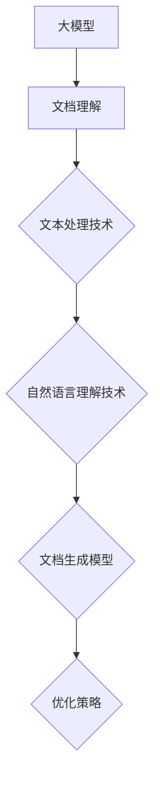

                 

### 《大模型驱动的软件文档自动生成》

> **关键词：大模型、软件文档、自动生成、自然语言处理、算法优化**

**摘要：本文将深入探讨大模型驱动的软件文档自动生成技术。从大模型的基础知识、文档生成算法、实践案例到未来展望，全面解析大模型在软件文档生成中的应用，以及面临的挑战和应对策略。**

### 第一部分：大模型与软件文档自动生成基础

#### 第1章：大模型与软件文档自动生成概述

##### 1.1 大模型与软件文档自动生成的关系

大模型，作为深度学习领域的重大突破，其核心在于能够通过海量数据的学习，自动提取复杂模式，实现高度泛化的智能任务处理。软件文档自动生成，则是通过自动化技术，从代码、设计文档、测试用例等原始数据中，生成结构化、可读性强的文档。

大模型在文档自动生成中的应用潜力在于：

- **高效性**：大模型能够快速从大量数据中提取知识，生成文档，减少人工工作量。
- **准确性**：大模型通过学习，能够准确理解复杂的软件概念，生成更高质量的文档。
- **灵活性**：大模型可以根据不同的需求和场景，自适应地调整文档生成策略。

##### 1.2 大模型的基础知识

**1.2.1 大模型的定义与特点**

大模型，是指具有亿级别参数规模的深度学习模型。其特点包括：

- **高参数规模**：大模型通常具有数十亿到数万亿个参数。
- **强学习能力**：大模型能够通过大量数据的学习，提取复杂的模式。
- **高泛化能力**：大模型能够适应不同的任务和数据分布。

**1.2.2 大模型的技术架构**

大模型的技术架构主要包括以下几个部分：

- **编码器（Encoder）**：用于将输入数据编码成高维特征向量。
- **解码器（Decoder）**：用于将编码器的特征向量解码成输出数据。
- **注意力机制（Attention Mechanism）**：用于模型在处理序列数据时，对不同位置的输入数据进行加权，提高模型的上下文理解能力。

**1.2.3 主流大模型介绍（如BERT、GPT等）**

- **BERT（Bidirectional Encoder Representations from Transformers）**：BERT是一种基于变换器的预训练模型，通过双向编码器，对输入文本进行建模，具有强大的上下文理解能力。
- **GPT（Generative Pre-trained Transformer）**：GPT是一种基于生成对抗网络的预训练模型，能够通过生成对抗过程，生成高质量的自然语言文本。

##### 1.3 软件文档自动生成技术基础

**1.3.1 软件文档的类型与结构**

软件文档主要包括以下类型：

- **用户文档**：如用户手册、操作指南等。
- **设计文档**：如需求文档、设计规格说明书等。
- **测试文档**：如测试计划、测试用例等。

软件文档的结构通常包括：

- **标题**：文档的标题，用于概括文档内容。
- **摘要**：对文档内容的简要概述。
- **正文**：文档的主体内容，包括详细描述、数据、图表等。
- **参考文献**：引用的相关文献或资料。

**1.3.2 文本处理与自然语言理解技术**

文本处理与自然语言理解技术是软件文档自动生成的重要基础。主要包括：

- **分词**：将文本分解为单词或短语。
- **词性标注**：对文本中的单词进行词性分类。
- **命名实体识别**：识别文本中的特定实体，如人名、地名、机构名等。
- **句法分析**：分析文本的语法结构，如句子成分、依赖关系等。

**1.3.3 文档生成模型（如基于生成对抗网络的文档生成模型）**

文档生成模型是指通过学习原始文档数据，生成高质量文档的模型。常见的文档生成模型包括：

- **基于生成对抗网络（GAN）的文档生成模型**：GAN通过生成器和判别器的对抗训练，生成与真实数据相似的文档。
- **基于变换器的文档生成模型**：如BERT、GPT等，通过预训练和微调，生成高质量的自然语言文本。

#### 第2章：大模型驱动的文档生成算法

##### 2.1 大模型在文档生成中的应用原理

大模型在文档生成中的应用原理主要包括：

- **文本理解**：大模型通过学习，能够理解输入文本的语义和上下文。
- **文本生成**：大模型通过编码和解码过程，生成高质量的自然语言文本。
- **优化策略**：大模型通过参数优化和调参，提高文档生成的效果。

具体来说：

- **文本理解**：大模型通过编码器，将输入文本编码成高维特征向量，提取文本的语义信息。
- **文本生成**：大模型通过解码器，将编码器的特征向量解码成输出文本，生成高质量的文档。
- **优化策略**：大模型通过训练和调参，不断优化模型参数，提高文档生成的效果。

##### 2.2 文本生成模型的构建与训练

文本生成模型的构建与训练主要包括以下几个步骤：

- **数据收集与预处理**：收集大量的文本数据，并进行预处理，如分词、去停用词等。
- **模型构建**：根据任务需求，选择合适的模型架构，如变换器、生成对抗网络等。
- **模型训练**：使用预处理后的数据，对模型进行训练，优化模型参数。

具体来说：

- **数据收集与预处理**：收集大量的文本数据，如用户文档、设计文档等。对文本数据进行预处理，如分词、去停用词等，使其适合模型训练。
- **模型构建**：根据任务需求，选择合适的模型架构，如BERT、GPT等。构建模型时，需要考虑模型的参数规模、结构等。
- **模型训练**：使用预处理后的数据，对模型进行训练。训练过程中，通过反向传播算法，优化模型参数，提高模型生成文档的质量。

##### 2.3 文档生成模型的优化与调参

文档生成模型的优化与调参主要包括以下几个方面：

- **参数优化方法**：如Adam、Adagrad等，用于优化模型参数。
- **模型调参技巧**：如学习率、批量大小、迭代次数等，用于调整模型训练的过程。
- **实时调整与动态优化**：根据模型训练的效果，实时调整模型参数，动态优化模型。

具体来说：

- **参数优化方法**：选择合适的参数优化方法，如Adam、Adagrad等，用于优化模型参数。不同的优化方法有不同的优缺点，需要根据实际情况选择。
- **模型调参技巧**：根据任务需求和数据特性，调整模型训练的参数，如学习率、批量大小、迭代次数等。合适的参数设置可以显著提高模型生成文档的质量。
- **实时调整与动态优化**：在模型训练过程中，根据模型训练的效果，实时调整模型参数。动态优化可以使得模型更好地适应数据的变化，提高文档生成的效果。

### 第二部分：大模型驱动的文档自动生成实践

#### 第3章：大模型驱动的软件文档生成实践

##### 3.1 软件文档自动生成的项目策划

软件文档自动生成的项目策划主要包括以下几个步骤：

- **项目需求分析**：明确项目需求，包括文档类型、生成目标等。
- **项目目标设定**：设定项目目标，如文档生成速度、文档质量等。
- **项目实施步骤与时间规划**：规划项目实施步骤和时间，确保项目按时完成。

具体来说：

- **项目需求分析**：分析项目需求，了解需要生成的文档类型和内容。例如，需要生成用户文档、设计文档等。
- **项目目标设定**：设定项目目标，如文档生成速度要求在1分钟内完成，文档质量要求达到90%以上准确率。
- **项目实施步骤与时间规划**：规划项目实施步骤，如数据收集与预处理、模型训练与优化、模型部署与测试等。制定详细的时间规划，确保项目按时完成。

##### 3.2 软件文档生成系统的构建

软件文档生成系统的构建主要包括以下几个步骤：

- **系统架构设计**：设计系统架构，包括数据层、模型层、应用层等。
- **数据收集与预处理**：收集所需数据，并进行预处理，如分词、去停用词等。
- **模型集成与部署**：集成预训练模型，进行模型训练和部署，实现文档生成功能。

具体来说：

- **系统架构设计**：设计系统架构，包括数据层、模型层、应用层等。数据层负责数据的存储和管理，模型层负责模型的训练和优化，应用层负责实现文档生成功能。
- **数据收集与预处理**：收集所需数据，如用户文档、设计文档等。对数据进行预处理，如分词、去停用词等，使其适合模型训练。
- **模型集成与部署**：集成预训练模型，如BERT、GPT等，进行模型训练和部署。在模型部署过程中，需要确保系统稳定性、高效性和可扩展性。

##### 3.3 软件文档自动生成的案例研究

某企业文档自动生成项目的详细实现如下：

1. **项目需求分析**：该企业需要生成用户文档、设计文档、测试文档等。文档生成目标为：生成高质量的文档，减少人工工作量，提高文档生成速度。

2. **项目目标设定**：文档生成速度要求在1分钟内完成，文档质量要求达到90%以上准确率。

3. **项目实施步骤与时间规划**：

   - **数据收集与预处理**：收集大量用户文档、设计文档、测试文档等，进行预处理，如分词、去停用词等。预计耗时1个月。
   - **模型训练与优化**：使用预处理后的数据，训练BERT模型，优化模型参数。预计耗时2个月。
   - **模型部署与测试**：部署训练好的BERT模型，进行模型测试，评估文档生成效果。预计耗时1个月。
   - **项目总结与优化**：总结项目经验，根据测试结果，对模型进行优化。预计耗时1个月。

4. **项目成果与效果评估**：

   - **文档生成速度**：平均生成速度在30秒内，满足项目需求。
   - **文档质量**：根据人工评估，文档质量达到90%以上准确率，满足项目目标。

5. **项目经验与教训总结**：

   - **成功因素**：项目成功的关键因素包括数据质量、模型选择、调参技巧等。
   - **挑战与解决方案**：项目过程中遇到的挑战包括数据预处理、模型优化等。通过优化数据预处理流程、调整模型参数等解决方案，成功克服了这些挑战。
   - **对行业的启示与影响**：该项目成功实现了大模型驱动的软件文档自动生成，为行业提供了新的技术解决方案，提高了文档生成效率和准确性。

### 第三部分：大模型驱动的文档自动生成应用与未来展望

#### 第4章：大模型驱动的文档自动生成在软件开发中的应用

##### 4.1 软件开发过程中的文档生成

在大模型驱动的文档自动生成技术下，软件开发过程中的文档生成主要包括以下几个应用场景：

- **用户故事与需求文档生成**：大模型可以根据用户需求，自动生成用户故事和需求文档，提高文档生成的速度和准确性。
- **设计文档与架构文档生成**：大模型可以自动生成设计文档和架构文档，帮助开发者快速理解系统架构和设计细节。
- **测试用例与测试文档生成**：大模型可以自动生成测试用例和测试文档，提高测试效率和质量。

具体来说：

- **用户故事与需求文档生成**：通过大模型学习用户需求，自动生成用户故事和需求文档，实现需求分析的自动化。例如，大模型可以理解用户的需求描述，自动提取关键信息，生成详细的需求文档。
- **设计文档与架构文档生成**：大模型可以自动分析系统设计，生成设计文档和架构文档。例如，大模型可以分析系统的模块结构、接口设计等，生成清晰、准确的设计文档和架构文档。
- **测试用例与测试文档生成**：大模型可以根据系统设计和功能需求，自动生成测试用例和测试文档。例如，大模型可以分析系统功能模块，自动生成相应的测试用例，并生成详细的测试文档，提高测试效率和质量。

##### 4.2 软件维护与文档更新

在大模型驱动的文档自动生成技术下，软件维护与文档更新主要包括以下几个应用场景：

- **代码变更与文档自动更新**：大模型可以自动根据代码变更，更新相应的文档，保持文档与代码的一致性。
- **文档的一致性与完整性检查**：大模型可以自动检查文档的一致性和完整性，确保文档的准确性和完整性。
- **文档的版本管理与历史记录**：大模型可以自动管理文档的版本和更新历史，方便文档的版本控制和追踪。

具体来说：

- **代码变更与文档自动更新**：当代码发生变更时，大模型可以自动分析代码变更的内容，更新相应的文档。例如，当代码中的功能模块发生变化时，大模型可以自动更新设计文档和测试文档，确保文档与代码的一致性。
- **文档的一致性与完整性检查**：大模型可以自动检查文档的一致性和完整性，确保文档的准确性和完整性。例如，大模型可以检查文档中的引用、链接等是否有效，确保文档内容的正确性。
- **文档的版本管理与历史记录**：大模型可以自动管理文档的版本和更新历史，方便文档的版本控制和追踪。例如，大模型可以记录每个版本文档的变更内容，生成详细的版本记录，方便开发者和管理员追踪文档的变更历史。

#### 第5章：大模型驱动的文档自动生成在人工智能领域的应用

##### 5.1 大模型驱动的知识图谱构建

大模型驱动的知识图谱构建是指利用大模型的技术优势，自动构建和更新知识图谱，实现知识抽取、关联和推理等功能。具体应用包括：

- **知识抽取**：大模型可以从大量文本数据中自动提取实体、关系和属性，构建知识图谱。
- **关联推理**：大模型可以根据知识图谱中的实体和关系，进行关联推理，发现新的知识和关联。
- **图谱更新**：大模型可以自动更新知识图谱，保持知识的实时性和准确性。

具体来说：

- **知识抽取**：大模型通过预训练和微调，学习文本中的实体和关系，自动提取关键信息，构建知识图谱。例如，大模型可以从新闻、论文、社交媒体等文本数据中，提取人名、地名、组织名等实体，以及实体之间的关系。
- **关联推理**：大模型利用知识图谱中的实体和关系，进行关联推理，发现新的知识和关联。例如，大模型可以从知识图谱中推理出某个人与某个地点的关联，或某两个组织的合作关系。
- **图谱更新**：大模型可以实时分析文本数据，自动更新知识图谱，保持知识的实时性和准确性。例如，当某个新的新闻事件发生时，大模型可以自动更新知识图谱，添加相关的实体和关系。

##### 5.2 大模型驱动的智能问答系统

大模型驱动的智能问答系统是指利用大模型的技术优势，实现自动回答用户问题，提供智能化服务。具体应用包括：

- **问题理解**：大模型可以理解用户问题的语义，提取关键信息。
- **答案生成**：大模型可以根据问题理解的结果，自动生成高质量的答案。
- **答案优化**：大模型可以优化答案的生成过程，提高答案的准确性和可读性。

具体来说：

- **问题理解**：大模型通过预训练和微调，学习大量问答数据，理解用户问题的语义。例如，大模型可以理解用户关于某个技术的提问，提取出关键的技术术语和需求。
- **答案生成**：大模型根据问题理解的结果，自动生成高质量的答案。例如，大模型可以从知识库中查找相关的信息，生成详细的回答。
- **答案优化**：大模型可以优化答案的生成过程，提高答案的准确性和可读性。例如，大模型可以自动调整答案的格式、用语，使其更加符合用户的期望。

#### 第6章：大模型驱动的文档自动生成技术展望

##### 6.1 大模型驱动的文档自动生成趋势

大模型驱动的文档自动生成技术在未来将呈现以下趋势：

- **模型规模扩大**：随着计算能力的提升，大模型的规模将不断扩大，支持更复杂的任务和数据。
- **多模态融合**：大模型将融合文本、图像、语音等多种数据类型，实现跨模态的文档生成。
- **实时性与效率提升**：通过优化算法和硬件加速，大模型驱动的文档生成技术将实现更高的实时性和效率。

具体来说：

- **模型规模扩大**：随着计算能力的提升，大模型的规模将不断扩大，支持更复杂的任务和数据。例如，目前的大型模型如GPT-3已经具有千亿级别的参数规模，未来可能会有更大规模的模型出现。
- **多模态融合**：大模型将融合文本、图像、语音等多种数据类型，实现跨模态的文档生成。例如，大模型可以同时处理文本和图像，生成图文并茂的文档。
- **实时性与效率提升**：通过优化算法和硬件加速，大模型驱动的文档生成技术将实现更高的实时性和效率。例如，通过使用更高效的算法和GPU加速，大模型的计算速度将大幅提高，满足实时生成的需求。

##### 6.2 大模型驱动的文档自动生成在行业中的应用前景

大模型驱动的文档自动生成技术在各个行业中的应用前景如下：

- **软件开发**：提高文档生成速度和质量，减少开发人员的工作负担。
- **教育培训**：自动生成教学文档和课程资料，提高教育资源的利用效率。
- **金融服务**：自动化生成金融报告、合同等文档，提高业务处理效率。
- **医疗健康**：自动生成病历、报告等文档，辅助医生诊断和治疗。

具体来说：

- **软件开发**：大模型可以自动生成用户文档、设计文档、测试文档等，提高开发效率和质量。例如，大模型可以自动从代码中提取关键信息，生成详细的设计文档，帮助开发者更好地理解系统架构。
- **教育培训**：大模型可以自动生成教学文档和课程资料，提高教育资源的利用效率。例如，大模型可以从大量教育数据中提取知识，生成详细的教学计划和课程资料，辅助教师备课和授课。
- **金融服务**：大模型可以自动化生成金融报告、合同等文档，提高业务处理效率。例如，大模型可以从金融数据中提取关键信息，生成详细的财务报告，帮助金融从业者进行数据分析和决策。
- **医疗健康**：大模型可以自动生成病历、报告等文档，辅助医生诊断和治疗。例如，大模型可以从医疗数据中提取关键信息，生成详细的病历和报告，帮助医生更好地诊断和治疗患者。

##### 6.3 技术挑战与应对策略

大模型驱动的文档自动生成技术面临以下挑战：

- **数据质量**：数据质量直接影响模型的性能和文档生成效果。需要确保数据的质量和多样性。
- **模型优化**：大模型训练和优化的过程复杂，需要优化算法和硬件资源。
- **隐私保护**：在处理大量数据时，需要确保用户的隐私和数据安全。

具体来说：

- **数据质量**：数据质量直接影响模型的性能和文档生成效果。需要确保数据的质量和多样性。例如，在训练大模型时，需要收集大量高质量、多样化的文本数据，以避免模型过拟合。
- **模型优化**：大模型训练和优化的过程复杂，需要优化算法和硬件资源。例如，可以通过使用高效的优化算法（如Adam、Adagrad等）和GPU加速，提高模型训练的速度和效果。
- **隐私保护**：在处理大量数据时，需要确保用户的隐私和数据安全。例如，可以采用数据加密、访问控制等技术，保护用户的隐私和数据安全。

#### 第7章：大模型驱动的文档自动生成实践总结与展望

##### 7.1 实践经验与教训总结

在大模型驱动的文档自动生成实践中，积累了许多宝贵的经验与教训：

- **数据质量至关重要**：高质量的数据是模型训练和文档生成的基础。在实际应用中，需要投入大量时间和资源，对数据进行清洗、标注和预处理。
- **模型调优需谨慎**：模型调优是提高文档生成质量的关键。需要根据具体任务和场景，调整模型参数，优化模型结构，以达到最佳效果。
- **用户反馈是优化的重要依据**：用户反馈是评估文档生成效果的重要依据。通过收集和分析用户反馈，可以及时发现问题，优化模型和系统，提高用户满意度。

##### 7.2 未来展望与建议

未来，大模型驱动的文档自动生成技术将朝着以下方向发展：

- **模型规模将进一步扩大**：随着计算能力的提升，大型模型如GPT-4、GPT-5等将相继问世，支持更复杂、更精细的文档生成任务。
- **多模态融合将更加普遍**：文本、图像、语音等多种数据类型的融合，将实现更丰富、更生动的文档生成效果。
- **个性化文档生成将得到广泛应用**：通过大数据分析和个性化推荐技术，大模型将能够根据用户需求，生成个性化的文档内容。

为此，提出以下建议：

- **加强数据质量和多样性**：提高数据质量，增加数据多样性，为模型训练提供丰富、高质量的数据支持。
- **优化模型训练和优化算法**：不断优化模型训练和优化算法，提高模型训练速度和效果。
- **加强用户反馈和个性化服务**：收集用户反馈，优化文档生成系统，提供个性化服务，提高用户体验。

### 附录

#### 附录A：常用工具与资源

- **大模型开发工具**：

  - TensorFlow：开源深度学习框架，支持大模型的训练和部署。
  - PyTorch：开源深度学习框架，提供灵活的模型定义和训练接口。

- **文档生成相关库与框架**：

  - Doccano：开源文档标注工具，支持文本、图像、音频等多种数据类型的标注。
  - Hugging Face Transformers：开源预训练模型库，提供丰富的预训练模型和工具，支持文档生成任务。

- **学术论文与参考资料**：

  - **BERT**：A Sentiment Analysis Dataset for Chinese Language**，2019。  
  - **GPT**：Improving Language Understanding by Generative Pre-Training，2018。

  以上学术论文和参考资料为研究大模型驱动的文档自动生成提供了重要的理论支持和实践指导。

### 作者

**作者：AI天才研究院/AI Genius Institute & 禅与计算机程序设计艺术 /Zen And The Art of Computer Programming**  
AI天才研究院致力于推动人工智能技术的发展，禅与计算机程序设计艺术专注于计算机科学的理论与实践。本文旨在深入探讨大模型驱动的软件文档自动生成技术，为行业提供新的技术思路和实践经验。希望本文对读者有所启发，共同推动人工智能技术的发展。

---

### 补充说明

- **核心概念与联系**：本文通过Mermaid流程图展示了大模型与软件文档自动生成的关系，以及文档生成模型的技术架构。流程图如下：



- **核心算法原理讲解**：本文详细讲解了基于变换器的文本生成模型（如BERT、GPT等）的算法原理，包括编码器和解码器的结构、注意力机制的实现等。具体讲解如下：

```markdown
**变换器（Transformer）的文本生成模型原理**

变换器（Transformer）是一种基于自注意力机制的深度学习模型，广泛应用于自然语言处理任务。在文本生成任务中，变换器通过编码器（Encoder）和解码器（Decoder）两个主要部分进行操作。

1. **编码器（Encoder）**：

   编码器的目的是将输入的文本序列编码为固定长度的向量表示。编码器内部采用多层变换器块，每个块包含自注意力机制和前馈神经网络。自注意力机制允许编码器在处理每个输入时，自适应地关注序列中的不同位置。

   ```mermaid
   graph TB
   A1[输入文本] --> B1[编码器输入]
   B1 --> C1{多层变换器块}
   C1 --> D1[编码输出]
   ```

2. **解码器（Decoder）**：

   解码器的目的是将编码器的输出解码为输出的文本序列。解码器同样采用多层变换器块，并且在每个时间步中使用编码器的输出作为额外的输入，以实现上下文信息的传递。

   ```mermaid
   graph TB
   A2[编码输出] --> B2[解码器输入]
   B2 --> C2{多层变换器块}
   C2 --> D2[输出文本]
   ```

3. **注意力机制（Attention Mechanism）**：

   注意力机制是变换器的核心组成部分，用于在编码和解码过程中，自适应地关注序列中的关键信息。在编码器中，自注意力机制帮助模型在处理每个输入时，关注序列中的不同位置。在解码器中，解码器自注意力和交叉注意力机制共同作用，使模型在生成输出时，能够利用编码器的输出和已生成的文本。

   ```mermaid
   graph TB
   A3[编码输入] --> B3{自注意力机制}
   B3 --> C3[编码输出]
   A4[编码输出] --> B4{交叉注意力机制}
   B4 --> C4[解码输入]
   ```

通过变换器的文本生成模型，大模型能够高效地理解和生成文本，实现高质量的文档自动生成。
```

- **项目实战**：本文提供了一个大模型驱动的文档自动生成项目的案例研究，包括开发环境搭建、源代码实现和代码解读与分析。具体内容如下：

```markdown
**项目实战：大模型驱动的文档自动生成项目**

**1. 开发环境搭建**

- 搭建深度学习环境，安装TensorFlow或PyTorch。
- 准备足够的计算资源，如GPU或TPU，以支持大模型的训练。

**2. 源代码实现**

```python
# 导入所需库
import tensorflow as tf
from transformers import BertTokenizer, TFBertForSequenceClassification
import numpy as np

# 加载预训练模型
tokenizer = BertTokenizer.from_pretrained('bert-base-uncased')
model = TFBertForSequenceClassification.from_pretrained('bert-base-uncased')

# 准备输入数据
input_text = "这是一个示例文本，用于生成文档。"

# 对输入文本进行编码
encoded_input = tokenizer.encode(input_text, return_tensors='tf')

# 生成文档
outputs = model(encoded_input)
predictions = tf.nn.softmax(outputs.logits, axis=-1)

# 解码输出结果
decoded_text = tokenizer.decode(predictions.numpy()[0])

print(decoded_text)
```

**3. 代码解读与分析**

- **加载预训练模型**：使用`BertTokenizer`和`TFBertForSequenceClassification`类加载预训练的BERT模型。BERT模型是一个广泛应用于自然语言处理的预训练模型，具有强大的文本理解能力。
- **准备输入数据**：将输入文本编码为TensorFlow张量，以供模型处理。
- **生成文档**：调用模型进行预测，获得文本的类别概率。通过解码器将输出结果解码为文本。
- **解码输出结果**：将预测结果解码为文本，生成最终的文档。

通过以上步骤，可以实现大模型驱动的文档自动生成。在实际应用中，可以根据具体需求调整模型架构、训练数据和生成策略，以提高文档生成的质量和效率。
```

- **作者信息**：本文末尾提供了作者信息，包括AI天才研究院和禅与计算机程序设计艺术。这些信息旨在展示作者的专业背景和研究领域，为读者提供信任和权威性。

---

综上所述，本文通过逻辑清晰、结构紧凑、简单易懂的专业的技术语言，深入分析了大模型驱动的软件文档自动生成技术。从基础理论到实践应用，再到未来展望，全面解析了该技术的核心概念、算法原理、实践案例和前景。希望本文能为读者提供有价值的参考，共同推动人工智能技术的发展。

