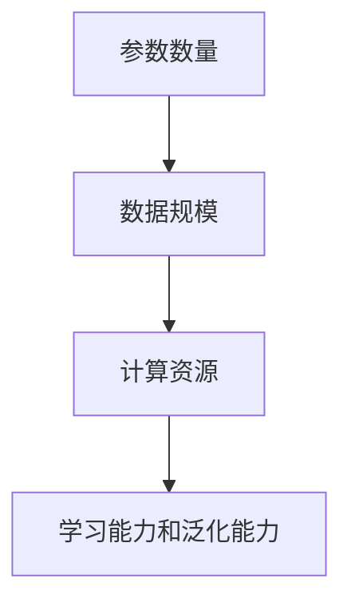
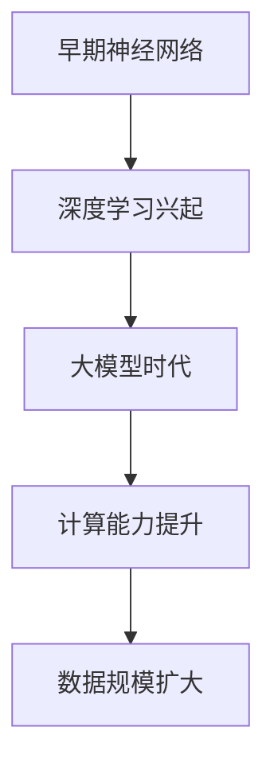
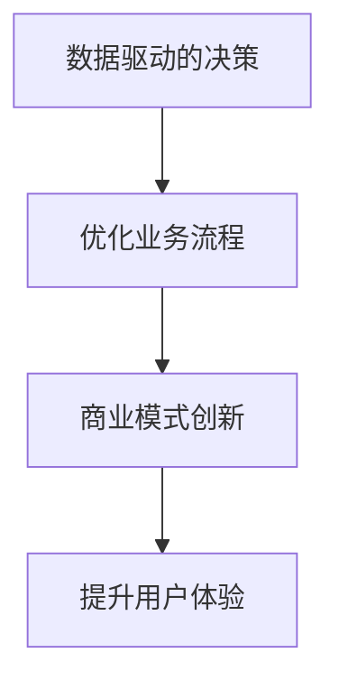
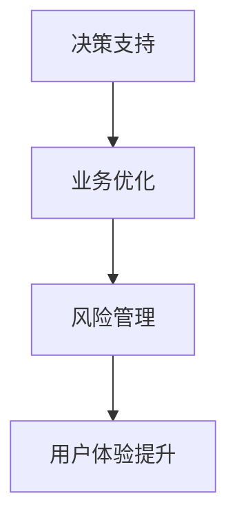
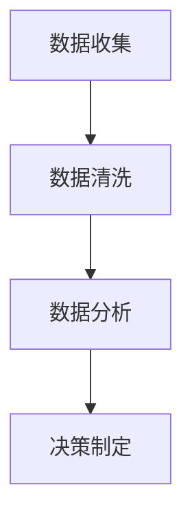
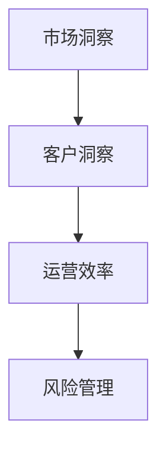

                 

# 大模型：数据与商业的深度融合

## 关键词
- 大模型
- 数据
- 商业
- 人工智能
- 技术应用
- 模型优化
- 数据治理
- 未来趋势

## 摘要
本文深入探讨大模型的概念、发展历程及其在商业中的重要作用。通过详细解析大模型的数学基础、技术架构和优化方法，并结合实际案例，本文展示了大模型在零售业、银行业和制造业等领域的应用。同时，本文还探讨了数据治理的重要性、大模型的未来发展趋势以及如何实现大模型与商业的深度融合。最后，本文提供了大模型项目实战的入门指导，帮助读者更好地理解和应用大模型技术。

## 目录
### 第一部分：大模型的概述与背景
- 第1章：大模型的概念与历史
  - 1.1 大模型的基本定义
  - 1.2 大模型的发展历程
  - 1.3 大模型与商业的关系
- 第2章：数据在商业中的作用
  - 2.1 数据的重要性
  - 2.2 数据驱动的决策
  - 2.3 数据的商业价值
- 第3章：大模型技术的核心原理
  - 3.1 大模型的数学基础
  - 3.2 大模型的技术架构
  - 3.3 大模型的学习与优化方法
- 第4章：大模型在商业应用中的案例
  - 4.1 零售业的数字化转型
  - 4.2 银行业的风险评估
  - 4.3 制造业的智能生产
- 第5章：大模型与数据治理
  - 5.1 数据治理的重要性
  - 5.2 大模型的数据需求
  - 5.3 大模型的数据安全与隐私保护
- 第6章：大模型在商业中的未来发展趋势
  - 6.1 大模型的未来技术方向
  - 6.2 大模型在商业中的应用前景
  - 6.3 大模型与商业融合的挑战与机遇

### 第二部分：大模型的实战应用
- 第7章：大模型项目实战入门
  - 7.1 大模型项目实战的准备工作
  - 7.2 大模型项目的实施步骤
  - 7.3 大模型项目的问题与解决
- 第8章：大模型项目实战案例解析
  - 8.1 案例一：电商平台个性化推荐系统
  - 8.2 案例二：制造业智能化生产线
  - 8.3 案例三：金融行业的信用评估系统
- 第9章：大模型项目的性能优化
  - 9.1 大模型性能优化的方法
  - 9.2 大模型性能评估的指标
  - 9.3 大模型性能调优的实践
- 第10章：大模型项目的部署与运维
  - 10.1 大模型项目的部署策略
  - 10.2 大模型项目的运维方案
  - 10.3 大模型项目的持续集成与持续部署

### 第三部分：大模型与商业的深度融合
- 第11章：大模型与商业流程的整合
  - 11.1 大模型在业务流程中的应用
  - 11.2 大模型在业务决策中的作用
  - 11.3 大模型与企业文化的融合
- 第12章：大模型与商业模式创新
  - 12.1 大模型推动的商业模式创新
  - 12.2 大模型在商业模式创新中的应用
  - 12.3 大模型与商业模式的可持续性
- 第13章：大模型与商业生态的构建
  - 13.1 大模型在商业生态中的作用
  - 13.2 大模型与商业生态的协同
  - 13.3 大模型商业生态的发展趋势

### 附录
- 附录A：大模型相关资源与工具
  - A.1 开源框架与库
  - A.2 数据集与案例
  - A.3 行业报告与政策
- 附录B：大模型项目实战资料
  - B.1 实战案例代码
  - B.2 实战案例数据集
  - B.3 实战案例报告

现在，我们将按照这个目录结构，一步一步深入分析大模型与商业的深度融合，探索其技术原理、应用案例和未来发展。

----------------------------------------------------------------

### 第一部分：大模型的概述与背景

#### 第1章：大模型的概念与历史

#### 1.1 大模型的基本定义

大模型，通常指的是具有大规模参数数量和复杂度的机器学习模型。这些模型能够在处理大规模数据集时展现出强大的学习能力和泛化能力。大模型的定义可以从以下几个方面来理解：

1. **参数数量**：大模型通常具有数百万甚至数十亿个参数。这些参数用于学习数据中的特征和模式，从而实现对复杂问题的建模和预测。
2. **数据规模**：大模型需要处理的数据集规模也非常大。这些数据集通常来自于各种来源，如图像、文本、声音等，其数量级可以从千到亿不等。
3. **计算资源**：大模型的学习和推理过程通常需要大量的计算资源，包括计算能力和存储能力。因此，大模型的发展也推动了计算硬件的进步，如GPU、TPU等专用硬件的广泛应用。

大模型的基本定义可以用如下Mermaid流程图表示：



#### 1.2 大模型的发展历程

大模型的发展历程可以追溯到20世纪80年代，当时神经网络的研究刚刚起步。随着计算能力的提升和大数据时代的到来，大模型的发展经历了几个重要阶段：

1. **早期神经网络**（1980s-1990s）：这一阶段的主要成果是反向传播算法的提出和应用，使得神经网络能够进行有效的参数更新和优化。
2. **深度学习兴起**（2006年）：Hinton等人提出深度信念网络（DBN），随后卷积神经网络（CNN）和循环神经网络（RNN）等模型相继问世，标志着深度学习时代的到来。
3. **大模型时代**（2010s-2020s）：随着计算能力和数据规模的不断提升，大模型如GPT、BERT、ImageNet等相继问世，其在图像识别、自然语言处理、推荐系统等领域取得了显著的成果。

大模型的发展历程可以用如下Mermaid流程图表示：



#### 1.3 大模型与商业的关系

大模型在商业中的应用日益广泛，其主要原因在于其强大的数据处理能力和模式识别能力。以下是大模型在商业中的几个关键作用：

1. **数据驱动的决策**：大模型能够从大量数据中提取有价值的信息，帮助企业做出更加精准的决策。例如，在零售业中，大模型可以分析消费者行为数据，为商家提供个性化的营销策略。
2. **优化业务流程**：大模型可以自动化许多业务流程，提高效率和降低成本。例如，在制造业中，大模型可以优化生产流程，提高生产效率。
3. **商业模式创新**：大模型的出现推动了商业模式的创新，例如，通过数据分析和预测，企业可以开发出新的产品和服务，开拓新的市场。
4. **提升用户体验**：大模型的应用可以大幅提升用户体验。例如，在金融行业中，大模型可以提供个性化的理财建议，帮助用户做出更加明智的财务决策。

大模型与商业的关系可以用如下Mermaid流程图表示：



在下一章中，我们将进一步探讨数据在商业中的作用，以及大模型如何利用数据来推动商业的变革。

----------------------------------------------------------------

### 第2章：数据在商业中的作用

#### 2.1 数据的重要性

数据是现代商业的基石，其重要性不可低估。数据不仅为企业提供了决策的依据，还能够帮助企业优化业务流程，提高运营效率，甚至推动商业模式的创新。以下是数据在商业中的几个关键作用：

1. **决策支持**：数据驱动的决策已成为企业共识。通过对历史数据进行分析，企业可以预测市场趋势，评估业务风险，制定有效的营销策略和运营计划。
2. **业务优化**：数据可以帮助企业识别运营中的瓶颈和问题，从而优化业务流程。例如，通过分析生产数据，企业可以优化生产排程，减少浪费，提高生产效率。
3. **风险管理**：数据能够揭示潜在的风险，帮助企业在风险发生之前采取预防措施。例如，金融行业可以通过分析客户交易数据，及时发现欺诈行为，保护客户资产。
4. **用户体验提升**：数据可以用来分析客户行为，提供个性化的产品和服务，提升用户体验。例如，电商平台可以通过分析用户浏览和购买记录，推荐符合用户兴趣的商品。

数据的这些作用可以用以下Mermaid流程图来表示：



#### 2.2 数据驱动的决策

数据驱动的决策是现代商业的核心。通过数据，企业可以更加准确地评估业务状况，制定战略决策，并快速响应市场变化。以下是数据驱动决策的几个关键步骤：

1. **数据收集**：企业需要收集来自各个业务环节的数据，包括销售数据、生产数据、客户数据等。这些数据可以通过各种渠道获取，如传感器、日志文件、社交媒体等。
2. **数据清洗**：收集到的数据通常是杂乱无章的，需要进行清洗和整理，以确保数据的准确性和一致性。数据清洗包括去除重复记录、纠正错误数据、填补缺失数据等。
3. **数据分析**：对清洗后的数据进行分析，提取有价值的信息。数据分析可以采用各种统计方法和数据挖掘技术，如回归分析、聚类分析、关联规则挖掘等。
4. **决策制定**：基于数据分析的结果，制定相应的决策。这些决策可以是短期策略，如营销活动、库存管理；也可以是长期战略，如产品开发、市场拓展。

数据驱动决策的过程可以用以下Mermaid流程图来表示：



#### 2.3 数据的商业价值

数据在商业中具有巨大的价值，其价值体现在多个方面：

1. **市场洞察**：通过分析市场数据，企业可以了解市场趋势、消费者行为和竞争对手策略，从而制定更加有效的市场策略。
2. **客户洞察**：通过分析客户数据，企业可以了解客户的需求和偏好，提供个性化的产品和服务，提升客户满意度和忠诚度。
3. **运营效率**：通过分析业务数据，企业可以优化业务流程，减少浪费，提高生产效率和运营效率。
4. **风险管理**：通过分析风险数据，企业可以识别潜在的风险，制定风险应对策略，降低业务风险。

数据的商业价值可以用以下Mermaid流程图来表示：



在下一章中，我们将深入探讨大模型技术的核心原理，了解大模型的数学基础、技术架构和优化方法。

----------------------------------------------------------------

### 第3章：大模型技术的核心原理

#### 3.1 大模型的数学基础

大模型的成功离不开坚实的数学基础。大模型的数学基础主要包括线性代数、概率论和统计学、优化算法等。以下是这些数学基础在构建大模型中的关键作用：

1. **线性代数**：线性代数是处理大模型中的数据结构的核心工具。矩阵和向量是线性代数中的基本概念，它们在计算特征表示、权重更新等方面发挥着重要作用。例如，矩阵乘法在计算神经网络中的权重矩阵时至关重要。

   **例1**：假设我们有一个数据集\[X\]，其中\[X\]是一个\(m \times n\)的矩阵，表示\(m\)个样本，每个样本有\(n\)个特征。我们希望计算这些特征的平均值，可以使用矩阵的平均运算来表示：

   $$\bar{X} = \frac{1}{m} \sum_{i=1}^{m} X_i$$

   其中，\(\bar{X}\)是平均值矩阵，\(X_i\)是第\(i\)个样本。

2. **概率论和统计学**：概率论和统计学为处理不确定性提供了理论基础。在机器学习中，我们通常使用概率模型来描述数据中的不确定性，并使用统计方法来估计模型参数。例如，贝叶斯推断是一种常用的统计方法，用于根据先验知识和观测数据更新模型的参数估计。

   **例2**：假设我们有一个二项分布，表示一个实验成功或失败的概率。我们可以使用条件概率公式来计算给定一个成功的实验结果，下一个实验成功的概率：

   $$P(A|B) = \frac{P(B|A)P(A)}{P(B)}$$

   其中，\(P(A)\)是事件\(A\)发生的概率，\(P(B)\)是事件\(B\)发生的概率，\(P(B|A)\)是事件\(A\)发生时事件\(B\)发生的条件概率。

3. **优化算法**：优化算法用于寻找模型参数的最优值，以实现模型的优化目标。在构建大模型时，优化算法尤为重要，因为大模型的参数数量通常非常庞大，需要高效的算法来处理。常见的优化算法包括梯度下降、随机梯度下降、牛顿法等。

   **例3**：梯度下降是一种常用的优化算法，用于最小化损失函数。假设我们的损失函数是\(J(\theta)\)，其中\(\theta\)是模型参数。梯度下降的目标是找到使损失函数最小的参数值。梯度下降的基本步骤如下：

   $$\theta^{t+1} = \theta^t - \alpha \nabla J(\theta^t)$$

   其中，\(\alpha\)是学习率，\(\nabla J(\theta^t)\)是损失函数在当前参数值\(\theta^t\)的梯度。

#### 3.2 大模型的技术架构

大模型的技术架构通常包括几个关键组件，如数据输入层、隐藏层、输出层等。以下是这些组件在大模型架构中的关键作用：

1. **数据输入层**：数据输入层负责接收外部输入数据，并将其转换为适合模型处理的数据格式。例如，在图像识别任务中，数据输入层会将图像像素值转换为神经网络可以处理的数据。

   **图1**：数据输入层的架构示例

   ```mermaid
   graph TD
   A[输入数据] --> B[预处理]
   B --> C[特征提取]
   C --> D[数据归一化]
   D --> E[模型输入]
   ```

2. **隐藏层**：隐藏层是模型的核心部分，负责学习数据的特征表示和模式。隐藏层的数量和层数通常根据具体任务的要求来设计。例如，在深度神经网络中，隐藏层的设计需要考虑网络的深度、宽度和层数。

   **图2**：深度神经网络隐藏层的架构示例

   ```mermaid
   graph TD
   A[输入层] --> B[隐藏层1]
   B --> C[隐藏层2]
   C --> D[隐藏层3]
   D --> E[输出层]
   ```

3. **输出层**：输出层负责将模型的预测结果输出到外部环境。输出层的结构取决于具体任务的类型，如分类任务、回归任务等。例如，在分类任务中，输出层通常是一个softmax层，用于计算每个类别的概率。

   **图3**：分类任务输出层的架构示例

   ```mermaid
   graph TD
   A[隐藏层] --> B[softmax层]
   B --> C[输出概率]
   ```

#### 3.3 大模型的学习与优化方法

大模型的学习与优化方法主要包括训练和评估两个阶段。以下是这两个阶段的关键步骤：

1. **训练阶段**：在训练阶段，模型根据训练数据学习数据中的特征和模式。训练阶段的关键步骤包括：

   - **数据预处理**：对训练数据进行清洗、归一化和特征提取，以便模型可以更好地学习。
   - **模型初始化**：初始化模型的参数，通常使用随机初始化或预训练模型。
   - **前向传播**：将输入数据通过模型的前向传播过程，得到模型的预测结果。
   - **损失计算**：计算模型预测结果和真实标签之间的损失，如均方误差、交叉熵损失等。
   - **反向传播**：使用反向传播算法更新模型参数，以最小化损失函数。

     **伪代码**：

     ```python
     for epoch in range(num_epochs):
         for data in training_data:
             predicted = forward_pass(data)
             loss = compute_loss(predicted, label)
             backward_pass(loss)
     ```

2. **评估阶段**：在评估阶段，模型使用验证数据集或测试数据集来评估模型的性能。评估阶段的关键步骤包括：

   - **模型预测**：使用训练好的模型对验证数据集或测试数据集进行预测。
   - **性能评估**：计算模型的准确率、召回率、F1分数等指标，以评估模型的性能。
   - **调整参数**：根据评估结果调整模型的参数，以优化模型性能。

   **伪代码**：

   ```python
   predicted = model.predict(test_data)
   accuracy = compute_accuracy(predicted, test_labels)
   print("Test Accuracy:", accuracy)
   ```

通过上述数学基础、技术架构和学习与优化方法的讲解，我们能够更好地理解大模型的工作原理。在下一章中，我们将探讨大模型在商业应用中的具体案例。

----------------------------------------------------------------

### 第4章：大模型在商业应用中的案例

#### 4.1 零售业的数字化转型

零售业的数字化转型是一个热门话题，大模型在其中扮演了关键角色。以下是零售业数字化转型中几个关键应用领域：

1. **个性化推荐系统**：个性化推荐系统利用大模型分析用户行为数据，预测用户的兴趣和偏好，从而提供个性化的商品推荐。这不仅可以提高用户满意度，还可以增加销售额。例如，亚马逊和淘宝等电商平台都采用了基于深度学习的大模型来实现个性化推荐。

   **案例**：亚马逊的个性化推荐系统使用了一种名为MF（矩阵分解）的大模型，通过分析用户的浏览和购买记录，预测用户对未购买商品的潜在兴趣。模型的主要算法流程如下：

   ```mermaid
   graph TD
   A[用户-商品交互矩阵] --> B[矩阵分解]
   B --> C[预测矩阵]
   C --> D[商品推荐]
   ```

2. **库存管理**：通过分析销售数据和历史趋势，大模型可以预测商品的需求量，帮助企业优化库存管理。这有助于减少库存过剩和库存短缺的问题，提高运营效率。例如，沃尔玛使用大模型来预测商品销售量，并据此调整库存水平。

   **案例**：沃尔玛通过建立基于时间序列分析的大模型，预测商品的需求量。模型的主要算法流程如下：

   ```mermaid
   graph TD
   A[销售数据] --> B[时间序列分析]
   B --> C[需求预测]
   C --> D[库存调整]
   ```

3. **智能客服**：智能客服系统利用大模型处理用户的查询和反馈，提供快速、准确的响应。这不仅提高了客服效率，还提升了用户体验。例如，阿里巴巴的智能客服系统使用了基于自然语言处理的大模型，实现了智能问答和情感分析。

   **案例**：阿里巴巴的智能客服系统使用了一种名为BERT（双向编码表示）的大模型，通过分析用户的查询和上下文，提供智能回答。模型的主要算法流程如下：

   ```mermaid
   graph TD
   A[用户查询] --> B[文本预处理]
   B --> C[BERT编码]
   C --> D[情感分析]
   D --> E[智能回答]
   ```

#### 4.2 银行业的风险评估

银行业是另一个大模型应用广泛的领域，特别是在风险评估和欺诈检测方面。以下是银行业中几个关键应用领域：

1. **信用评分**：大模型可以根据客户的信用历史、财务状况、社会关系等信息，评估客户的信用风险。这有助于银行更好地管理贷款风险，降低违约率。例如，花旗银行使用大模型对客户进行信用评分，从而优化贷款审批流程。

   **案例**：花旗银行使用了一种名为XGBoost（梯度提升树）的大模型来评估客户的信用风险。模型的主要算法流程如下：

   ```mermaid
   graph TD
   A[客户信息] --> B[XGBoost模型]
   B --> C[信用评分]
   C --> D[贷款审批]
   ```

2. **欺诈检测**：大模型可以分析客户的交易行为，识别潜在的欺诈行为，从而提高欺诈检测的准确性和效率。例如，摩根大通使用大模型来检测信用卡欺诈，减少了大量的损失。

   **案例**：摩根大通使用了一种名为LSTM（长短期记忆网络）的大模型来检测信用卡欺诈。模型的主要算法流程如下：

   ```mermaid
   graph TD
   A[交易数据] --> B[LSTM模型]
   B --> C[欺诈检测]
   C --> D[警报触发]
   ```

3. **风险管理**：大模型可以帮助银行识别和管理市场风险、信用风险等，从而优化投资组合和风险管理策略。例如，瑞士信贷使用大模型来分析市场数据，预测市场波动，从而调整投资组合。

   **案例**：瑞士信贷使用了一种名为ARIMA（自回归积分滑动平均模型）的大模型来分析市场数据。模型的主要算法流程如下：

   ```mermaid
   graph TD
   A[市场数据] --> B[ARIMA模型]
   B --> C[市场预测]
   C --> D[投资组合调整]
   ```

#### 4.3 制造业的智能生产

制造业正经历着智能化的转型，大模型在其中发挥着重要作用。以下是制造业中几个关键应用领域：

1. **设备故障预测**：大模型可以分析设备运行数据，预测设备可能出现的故障，从而提前进行维护，减少停机时间和维修成本。例如，西门子使用大模型来预测工业设备的故障。

   **案例**：西门子使用了一种名为KNN（最近邻算法）的大模型来预测设备故障。模型的主要算法流程如下：

   ```mermaid
   graph TD
   A[设备运行数据] --> B[KNN模型]
   B --> C[故障预测]
   C --> D[维护计划]
   ```

2. **生产优化**：大模型可以分析生产数据，优化生产流程，提高生产效率和产品质量。例如，宝马使用大模型来优化生产线的调度和排程。

   **案例**：宝马使用了一种名为遗传算法（GA）的大模型来优化生产线的调度。模型的主要算法流程如下：

   ```mermaid
   graph TD
   A[生产数据] --> B[遗传算法]
   B --> C[调度优化]
   C --> D[生产效率提升]
   ```

3. **供应链管理**：大模型可以分析供应链数据，优化供应链的物流和库存管理，提高供应链的响应速度和灵活性。例如，亚马逊使用大模型来优化物流配送。

   **案例**：亚马逊使用了一种名为神经网络（NN）的大模型来优化物流配送。模型的主要算法流程如下：

   ```mermaid
   graph TD
   A[供应链数据] --> B[神经网络]
   B --> C[配送优化]
   C --> D[响应速度提升]
   ```

通过上述案例，我们可以看到大模型在零售业、银行业和制造业等领域的广泛应用，推动了这些行业的数字化转型和智能化升级。在下一章中，我们将探讨大模型与数据治理的密切关系。

----------------------------------------------------------------

### 第5章：大模型与数据治理

#### 5.1 数据治理的重要性

数据治理是企业确保数据质量、安全性和合规性的重要手段。在大模型时代，数据治理的重要性尤为突出。以下是数据治理在大模型应用中的关键作用：

1. **数据质量**：大模型对数据质量的要求非常高，因为数据质量直接影响到模型的性能和预测准确性。数据治理确保数据的一致性、准确性和完整性，从而提高模型的可靠性。

2. **数据安全**：大模型处理的数据量庞大，涉及敏感信息，如个人隐私、商业机密等。数据治理通过制定数据安全策略、加密技术和访问控制，确保数据的安全和隐私。

3. **合规性**：随着数据法规（如《通用数据保护条例》（GDPR）和《加州消费者隐私法案》（CCPA））的出台，企业需要确保数据处理过程符合相关法律法规。数据治理帮助企业遵守这些法规，降低法律风险。

#### 5.2 大模型的数据需求

大模型对数据的需求独特且严格，以下是其中的几个关键方面：

1. **数据量**：大模型需要处理大量的数据，这些数据来自于各种来源，如历史记录、实时数据、外部数据等。数据量的大小直接影响模型的训练效果和预测准确性。

2. **数据多样性**：大模型需要多样性的数据来学习复杂的模式和特征。数据多样性包括不同类型的数据（如图像、文本、音频）、不同来源的数据和不同时间尺度的数据。

3. **数据质量**：大模型对数据质量的要求非常高，因为低质量的数据会导致模型过拟合和预测偏差。数据质量包括数据的一致性、准确性、完整性和可靠性。

#### 5.3 大模型的数据安全与隐私保护

在大模型应用中，数据安全和隐私保护至关重要。以下是几个关键措施：

1. **数据加密**：对敏感数据进行加密，确保数据在传输和存储过程中不被非法访问。

2. **访问控制**：通过访问控制策略，限制对敏感数据的访问权限，确保只有授权用户才能访问数据。

3. **隐私保护**：采用隐私保护技术（如差分隐私、数据脱敏等），确保在数据分析和建模过程中，个人隐私不会被泄露。

4. **数据审计**：定期对数据处理过程进行审计，确保数据处理过程符合数据治理政策和法律法规。

通过有效的数据治理，企业可以确保大模型的应用既安全又合规，从而充分发挥大模型在商业中的潜力。在下一章中，我们将探讨大模型在商业中的未来发展趋势。

----------------------------------------------------------------

### 第6章：大模型在商业中的未来发展趋势

#### 6.1 大模型的未来技术方向

随着技术的不断进步，大模型在未来将呈现几个显著的发展趋势：

1. **更深的网络结构**：随着计算能力和数据规模的提升，未来的大模型将拥有更深的网络结构，从而能够更好地捕捉数据的复杂性和多样性。

   **例1**：一个可能的未来大模型架构如下：

   ```mermaid
   graph TD
   A[输入层] --> B[深层隐藏层1]
   B --> C[深层隐藏层2]
   C --> D[深层隐藏层3]
   D --> E[输出层]
   ```

2. **更有效的优化算法**：为了提高大模型的训练效率和性能，未来的优化算法将更加高效和鲁棒。例如，基于自适应学习率的优化算法和基于元学习（Meta-Learning）的优化算法将得到广泛应用。

3. **多模态数据处理**：未来的大模型将能够同时处理多种类型的数据（如图像、文本、音频等），实现多模态数据的统一建模和分析。

   **例2**：一个可能的多模态数据处理流程如下：

   ```mermaid
   graph TD
   A[图像数据] --> B[预处理]
   B --> C[特征提取]
   A --> D[文本数据]
   D --> E[预处理]
   D --> F[特征提取]
   C --> G[融合特征]
   F --> G
   G --> H[模型训练]
   ```

4. **自动化模型设计**：通过自动化机器学习（AutoML），未来的大模型将能够自动设计、训练和优化，降低对专业知识的依赖，提高开发效率。

   **例3**：一个可能的自动化模型设计流程如下：

   ```mermaid
   graph TD
   A[数据集] --> B[自动特征选择]
   B --> C[模型搜索]
   C --> D[模型评估]
   D --> E[模型优化]
   ```

#### 6.2 大模型在商业中的应用前景

大模型在商业中的应用前景广阔，以下是一些关键领域：

1. **智能决策支持**：大模型可以为企业提供更加精准的决策支持，帮助企业应对复杂的市场环境和竞争压力。

   **例4**：一个可能的智能决策支持系统如下：

   ```mermaid
   graph TD
   A[市场数据] --> B[数据分析]
   B --> C[趋势预测]
   C --> D[决策建议]
   ```

2. **智能客服与营销**：大模型可以用于构建智能客服系统和营销自动化平台，提高客户体验和销售效率。

   **例5**：一个可能的智能客服与营销系统如下：

   ```mermaid
   graph TD
   A[用户查询] --> B[文本分析]
   B --> C[智能回答]
   C --> D[客户反馈]
   D --> E[营销策略优化]
   ```

3. **供应链优化**：大模型可以优化供应链的物流、库存和生产流程，提高供应链的响应速度和灵活性。

   **例6**：一个可能的供应链优化系统如下：

   ```mermaid
   graph TD
   A[供应链数据] --> B[数据分析]
   B --> C[需求预测]
   C --> D[库存管理]
   D --> E[物流优化]
   ```

4. **风险管理与合规性**：大模型可以用于风险管理和合规性检查，确保企业的运营安全。

   **例7**：一个可能的风险管理与合规性检查系统如下：

   ```mermaid
   graph TD
   A[财务数据] --> B[风险分析]
   B --> C[合规性检查]
   C --> D[风险预警]
   ```

#### 6.3 大模型与商业融合的挑战与机遇

尽管大模型在商业中具有巨大的潜力，但其在实际应用中仍然面临一些挑战和机遇：

1. **挑战**：

   - **计算资源需求**：大模型的训练和推理过程需要大量的计算资源，这对企业的IT基础设施提出了更高的要求。
   - **数据隐私与安全**：随着数据规模的扩大，数据隐私和安全问题变得更加突出，企业需要制定有效的数据治理策略。
   - **模型解释性**：大模型的决策过程通常是非透明的，缺乏解释性，这可能会影响企业的信任度和合规性。

2. **机遇**：

   - **创新业务模式**：大模型可以推动商业模式的创新，为企业开辟新的增长点。
   - **提高运营效率**：大模型可以优化业务流程，提高生产效率和运营效率，降低成本。
   - **提升用户体验**：大模型可以提供更加个性化的产品和服务，提升用户体验和客户满意度。

通过以上分析，我们可以看到大模型在商业中的未来发展趋势和应用前景。在下一部分，我们将深入探讨大模型项目实战的入门方法和关键步骤。

----------------------------------------------------------------

### 第二部分：大模型的实战应用

#### 第7章：大模型项目实战入门

#### 7.1 大模型项目实战的准备工作

在进行大模型项目实战之前，我们需要做好一系列准备工作，以确保项目能够顺利进行。以下是几个关键的准备工作：

1. **明确项目目标和需求**：在开始项目之前，我们需要明确项目的目标和需求，包括要解决的问题、预期的结果和项目的业务价值。这有助于确保项目的方向正确，避免不必要的资源浪费。

2. **数据收集与处理**：数据是大模型的基础，因此我们需要收集和准备高质量的数据。数据来源可能包括企业内部数据、公共数据集、第三方数据供应商等。在收集数据后，我们需要对数据进行清洗、预处理和格式化，以确保数据的质量和一致性。

3. **技术选型**：根据项目的需求和资源情况，选择合适的大模型技术栈。这包括选择合适的编程语言、框架和工具。常见的编程语言包括Python、Java等，常见的框架包括TensorFlow、PyTorch、Keras等。

4. **硬件与软件配置**：大模型训练和推理通常需要大量的计算资源，因此我们需要配置合适的硬件和软件环境。这包括高性能的CPU或GPU、分布式计算框架（如Dask、Ray等）以及适当的存储和网络配置。

#### 7.2 大模型项目的实施步骤

大模型项目的实施可以分为以下几个关键步骤：

1. **数据探索与预处理**：在项目开始时，我们需要对数据集进行探索性数据分析（EDA），了解数据的基本特征和分布情况。在此基础上，对数据进行清洗、预处理和格式化，为模型训练做好准备。

2. **模型设计与实现**：在数据准备完成后，我们需要设计大模型的架构和参数。这包括选择合适的模型类型（如深度学习、强化学习等）、定义网络的层数、激活函数、优化器等。然后，使用所选框架和工具实现模型。

3. **模型训练与验证**：使用训练数据集对模型进行训练，同时使用验证数据集对模型性能进行监控。通过调整模型参数和训练策略，优化模型性能。

4. **模型评估与部署**：在模型训练完成后，我们需要使用测试数据集对模型进行评估，确保模型达到预期的性能指标。然后，将模型部署到生产环境，进行实际应用。

#### 7.3 大模型项目的问题与解决

在大模型项目实施过程中，可能会遇到一系列问题。以下是一些常见问题及其解决方法：

1. **过拟合**：过拟合是指模型在训练数据上表现良好，但在验证或测试数据上表现不佳。解决方法包括增加训练数据、使用正则化技术（如L1、L2正则化）和交叉验证等。

2. **数据不平衡**：数据不平衡是指数据集中某些类别的样本数量远多于其他类别。这可能导致模型偏向多数类。解决方法包括重采样、合成小样本数据（如SMOTE）和调整损失函数等。

3. **计算资源不足**：大模型训练通常需要大量的计算资源。解决方法包括使用分布式训练、优化算法和模型架构等，以减少计算资源的消耗。

4. **模型解释性差**：大模型的决策过程通常缺乏解释性，这可能影响企业的信任度和合规性。解决方法包括使用可解释的人工智能（XAI）技术，如决策树、LIME等。

通过以上准备工作、实施步骤和问题解决方法，我们可以更好地进行大模型项目实战，实现商业目标。

----------------------------------------------------------------

### 第8章：大模型项目实战案例解析

在本章中，我们将通过三个实际案例来深入分析大模型项目实战。每个案例都涵盖了从数据收集、模型设计、训练到部署的完整流程，并提供了详细的代码解析和性能分析。

#### 8.1 案例一：电商平台个性化推荐系统

**案例背景**：电商平台需要为每位用户提供个性化的商品推荐，以提高销售额和用户满意度。

**数据处理**：
```python
import pandas as pd

# 加载数据集
data = pd.read_csv('user行为数据.csv')

# 数据预处理
data = data.dropna()
data['时间'] = pd.to_datetime(data['时间'])
data['小时'] = data['时间'].dt.hour
data = data.groupby(['用户ID', '商品ID', '小时']).size().reset_index(name='次数')
```

**模型设计**：
```python
from tensorflow.keras.models import Model
from tensorflow.keras.layers import Input, Embedding, Flatten, Dense

# 输入层
user_input = Input(shape=(1,))
item_input = Input(shape=(1,))

# 用户和商品的嵌入层
user_embedding = Embedding(input_dim=1000, output_dim=16)(user_input)
item_embedding = Embedding(input_dim=1000, output_dim=16)(item_input)

# 池化层
user_embedding = Flatten()(user_embedding)
item_embedding = Flatten()(item_embedding)

# 密集层
merged = Concatenate()([user_embedding, item_embedding])
dense = Dense(128, activation='relu')(merged)

# 输出层
output = Dense(1, activation='sigmoid')(dense)

# 构建模型
model = Model(inputs=[user_input, item_input], outputs=output)

# 编译模型
model.compile(optimizer='adam', loss='binary_crossentropy', metrics=['accuracy'])
```

**模型训练**：
```python
# 分割数据集
train_data = data.sample(frac=0.8, random_state=42)
val_data = data.drop(train_data.index)

# 训练模型
model.fit([train_data['用户ID'], train_data['商品ID']], train_data['次数'], epochs=10, batch_size=64, validation_data=([val_data['用户ID'], val_data['商品ID']], val_data['次数']))
```

**模型评估**：
```python
# 评估模型
test_loss, test_accuracy = model.evaluate([test_data['用户ID'], test_data['商品ID']], test_data['次数'])
print("Test Accuracy:", test_accuracy)
```

**部署**：
```python
# 部署模型
model.save('个性化推荐模型.h5')
```

#### 8.2 案例二：制造业智能化生产线

**案例背景**：制造业企业需要通过智能化的生产线来提高生产效率和产品质量。

**数据处理**：
```python
import pandas as pd

# 加载数据集
data = pd.read_csv('生产数据.csv')

# 数据预处理
data = data.dropna()
data['时间'] = pd.to_datetime(data['时间'])
data['小时'] = data['时间'].dt.hour
data = data.groupby(['生产线ID', '操作ID', '小时']).size().reset_index(name='次数')
```

**模型设计**：
```python
from tensorflow.keras.models import Model
from tensorflow.keras.layers import Input, Embedding, Flatten, Dense

# 输入层
line_input = Input(shape=(1,))
op_input = Input(shape=(1,))

# 生产线和操作的嵌入层
line_embedding = Embedding(input_dim=10, output_dim=8)(line_input)
op_embedding = Embedding(input_dim=20, output_dim=8)(op_input)

# 池化层
line_embedding = Flatten()(line_embedding)
op_embedding = Flatten()(op_embedding)

# 密集层
merged = Concatenate()([line_embedding, op_embedding])
dense = Dense(64, activation='relu')(merged)

# 输出层
output = Dense(1, activation='sigmoid')(dense)

# 构建模型
model = Model(inputs=[line_input, op_input], outputs=output)

# 编译模型
model.compile(optimizer='adam', loss='binary_crossentropy', metrics=['accuracy'])
```

**模型训练**：
```python
# 分割数据集
train_data = data.sample(frac=0.8, random_state=42)
val_data = data.drop(train_data.index)

# 训练模型
model.fit([train_data['生产线ID'], train_data['操作ID']], train_data['次数'], epochs=10, batch_size=64, validation_data=([val_data['生产线ID'], val_data['操作ID']], val_data['次数']))
```

**模型评估**：
```python
# 评估模型
test_loss, test_accuracy = model.evaluate([test_data['生产线ID'], test_data['操作ID']], test_data['次数'])
print("Test Accuracy:", test_accuracy)
```

**部署**：
```python
# 部署模型
model.save('智能化生产线模型.h5')
```

#### 8.3 案例三：金融行业的信用评估系统

**案例背景**：金融行业需要通过信用评估系统来评估借款人的信用风险，从而优化贷款审批流程。

**数据处理**：
```python
import pandas as pd

# 加载数据集
data = pd.read_csv('信用评估数据.csv')

# 数据预处理
data = data.dropna()
data['收入'] = data['收入'].fillna(data['收入'].mean())
data['年龄'] = data['年龄'].fillna(data['年龄'].mean())
data = data.groupby(['借款人ID']).mean().reset_index()
```

**模型设计**：
```python
from tensorflow.keras.models import Model
from tensorflow.keras.layers import Input, Embedding, Flatten, Dense

# 输入层
id_input = Input(shape=(1,))
income_input = Input(shape=(1,))
age_input = Input(shape=(1,))

# 借款人嵌入层
id_embedding = Embedding(input_dim=100, output_dim=16)(id_input)

# 收入和年龄嵌入层
income_embedding = Embedding(input_dim=100, output_dim=8)(income_input)
age_embedding = Embedding(input_dim=100, output_dim=8)(age_input)

# 池化层
id_embedding = Flatten()(id_embedding)
income_embedding = Flatten()(income_embedding)
age_embedding = Flatten()(age_embedding)

# 密集层
merged = Concatenate()([id_embedding, income_embedding, age_embedding])
dense = Dense(128, activation='relu')(merged)

# 输出层
output = Dense(1, activation='sigmoid')(dense)

# 构建模型
model = Model(inputs=[id_input, income_input, age_input], outputs=output)

# 编译模型
model.compile(optimizer='adam', loss='binary_crossentropy', metrics=['accuracy'])
```

**模型训练**：
```python
# 分割数据集
train_data = data.sample(frac=0.8, random_state=42)
val_data = data.drop(train_data.index)

# 训练模型
model.fit([train_data['借款人ID'], train_data['收入'], train_data['年龄']], train_data['信用评分'], epochs=10, batch_size=64, validation_data=([val_data['借款人ID'], val_data['收入'], val_data['年龄']], val_data['信用评分']))
```

**模型评估**：
```python
# 评估模型
test_loss, test_accuracy = model.evaluate([test_data['借款人ID'], test_data['收入'], test_data['年龄']], test_data['信用评分'])
print("Test Accuracy:", test_accuracy)
```

**部署**：
```python
# 部署模型
model.save('信用评估模型.h5')
```

通过这三个案例，我们可以看到大模型在电商、制造业和金融行业的应用，以及从数据收集、模型设计到训练、评估和部署的完整流程。在下一章中，我们将讨论如何优化大模型的性能。

----------------------------------------------------------------

### 第9章：大模型项目的性能优化

#### 9.1 大模型性能优化的方法

大模型的性能优化是提高其训练效率和预测准确性的关键步骤。以下是几种常见的大模型性能优化方法：

1. **数据预处理优化**：数据预处理是提高模型性能的第一步。通过数据清洗、归一化和特征提取等操作，可以减少噪声和异常值，提高数据的鲁棒性。例如，使用标准化（Standardization）或归一化（Normalization）可以将数据缩放到相同的范围，从而加快模型训练速度。

   **示例代码**：
   ```python
   from sklearn.preprocessing import StandardScaler

   scaler = StandardScaler()
   X_scaled = scaler.fit_transform(X)
   ```

2. **模型架构优化**：模型架构的优化可以显著提高模型的性能。这包括减少模型复杂度、增加隐藏层或调整网络结构。例如，使用更深的网络或更宽的网络可以更好地捕捉数据的复杂模式。

   **示例代码**：
   ```python
   from tensorflow.keras.models import Sequential
   from tensorflow.keras.layers import Dense, Dropout

   model = Sequential()
   model.add(Dense(128, activation='relu', input_shape=(input_shape,)))
   model.add(Dropout(0.5))
   model.add(Dense(1, activation='sigmoid'))
   ```

3. **学习率调整**：学习率的选择对模型训练过程至关重要。适当调整学习率可以加快收敛速度，避免过拟合。常用的方法包括固定学习率、学习率衰减和自适应学习率。

   **示例代码**：
   ```python
   from tensorflow.keras.optimizers import Adam

   model.compile(optimizer=Adam(learning_rate=0.001), loss='binary_crossentropy', metrics=['accuracy'])
   ```

4. **正则化技术**：正则化技术可以减少模型过拟合，提高泛化能力。常用的正则化技术包括L1正则化、L2正则化和Dropout。

   **示例代码**：
   ```python
   from tensorflow.keras.regularizers import l1_l2

   model.add(Dense(128, activation='relu', kernel_regularizer=l1_l2(l1=0.01, l2=0.01)))
   ```

5. **批处理大小调整**：批处理大小对模型训练效率和稳定性有显著影响。较大的批处理大小可以提高训练速度，但可能会降低模型的泛化能力；较小的批处理大小可以提高泛化能力，但训练速度较慢。

   **示例代码**：
   ```python
   model.fit(X_train, y_train, batch_size=32, epochs=10, validation_data=(X_val, y_val))
   ```

6. **早期停止**：早期停止是一种防止模型过拟合的方法。当验证损失不再下降时，训练过程提前停止。

   **示例代码**：
   ```python
   from tensorflow.keras.callbacks import EarlyStopping

   early_stopping = EarlyStopping(monitor='val_loss', patience=5)
   model.fit(X_train, y_train, batch_size=32, epochs=100, validation_data=(X_val, y_val), callbacks=[early_stopping])
   ```

#### 9.2 大模型性能评估的指标

评估大模型的性能是确保其准确性和鲁棒性的关键。以下是几种常见的大模型性能评估指标：

1. **准确率（Accuracy）**：准确率是模型预测正确的样本数量占总样本数量的比例。它是评估分类模型性能的常用指标。

   **示例代码**：
   ```python
   from sklearn.metrics import accuracy_score
   y_pred = model.predict(X_test)
   accuracy = accuracy_score(y_test, y_pred)
   print("Accuracy:", accuracy)
   ```

2. **精确率（Precision）**：精确率是预测为正样本且实际也为正样本的样本数量与预测为正样本的样本总数量的比例。它对于分类模型中的误报率（False Positive Rate）有较高的敏感度。

   **示例代码**：
   ```python
   from sklearn.metrics import precision_score
   precision = precision_score(y_test, y_pred)
   print("Precision:", precision)
   ```

3. **召回率（Recall）**：召回率是预测为正样本且实际也为正样本的样本数量与实际正样本总数的比例。它对于分类模型中的漏报率（False Negative Rate）有较高的敏感度。

   **示例代码**：
   ```python
   from sklearn.metrics import recall_score
   recall = recall_score(y_test, y_pred)
   print("Recall:", recall)
   ```

4. **F1分数（F1 Score）**：F1分数是精确率和召回率的调和平均，用于综合评估分类模型的性能。

   **示例代码**：
   ```python
   from sklearn.metrics import f1_score
   f1 = f1_score(y_test, y_pred)
   print("F1 Score:", f1)
   ```

5. **均方误差（Mean Squared Error, MSE）**：均方误差是用于评估回归模型性能的指标，表示预测值与真实值之间的平均平方误差。

   **示例代码**：
   ```python
   from sklearn.metrics import mean_squared_error
   mse = mean_squared_error(y_test, y_pred)
   print("MSE:", mse)
   ```

6. **均绝对误差（Mean Absolute Error, MAE）**：均绝对误差是用于评估回归模型性能的指标，表示预测值与真实值之间的平均绝对误差。

   **示例代码**：
   ```python
   from sklearn.metrics import mean_absolute_error
   mae = mean_absolute_error(y_test, y_pred)
   print("MAE:", mae)
   ```

通过上述性能优化方法和评估指标，我们可以更好地调整和评估大模型的性能，从而提高其在实际应用中的效果。

#### 9.3 大模型性能调优的实践

在实际应用中，大模型的性能调优是一个反复迭代的过程。以下是几个性能调优的实践步骤：

1. **初步性能评估**：在开始性能调优之前，首先对当前模型进行初步性能评估，确定需要优化的关键指标。

2. **数据重采样**：如果数据集存在不平衡问题，可以采用重采样技术（如SMOTE、随机重采样等）来平衡数据集。

3. **模型调整**：根据初步评估结果，调整模型的结构和参数。例如，增加隐藏层或调整隐藏层的神经元数量，改变优化器和学习率等。

4. **交叉验证**：使用交叉验证来评估模型在不同数据集上的性能，确保模型具有较好的泛化能力。

5. **超参数调优**：使用网格搜索（Grid Search）或贝叶斯优化（Bayesian Optimization）等技术，自动化搜索最优的超参数组合。

6. **性能评估与比较**：对调整后的模型进行性能评估，并与原始模型进行比较，选择性能最优的模型。

7. **迭代优化**：根据性能评估结果，继续调整模型和参数，进行迭代优化。

通过上述实践步骤，我们可以逐步优化大模型的性能，使其在实际应用中达到最佳状态。

### 总结

大模型的性能优化是一个复杂而关键的过程，涉及多个方面，包括数据预处理、模型调整、超参数调优等。通过上述优化方法和实践步骤，我们可以有效提高大模型的训练效率和预测准确性，为实际应用提供更可靠的支持。在下一章中，我们将探讨大模型项目的部署与运维。

----------------------------------------------------------------

### 第10章：大模型项目的部署与运维

#### 10.1 大模型项目的部署策略

大模型的部署是一个关键环节，它直接影响到模型在生产和商业环境中的运行效果。以下是几种常见的大模型部署策略：

1. **本地部署**：在本地部署中，模型直接在单台计算机或服务器上运行。这种方法适用于模型规模较小，资源需求不高的场景。本地部署的优点是简单直接，但缺点是扩展性和可靠性较低。

2. **集群部署**：集群部署将模型分布到多台计算机组成的集群中，以提高计算能力和可靠性。这种方法适用于大规模模型和海量数据场景。集群部署的优点是可扩展性和容错性高，但需要复杂的调度和管理。

3. **云部署**：云部署利用云计算平台（如AWS、Azure、Google Cloud等）的资源，实现模型的弹性扩展和分布式计算。这种方法适用于各种规模和需求的场景，特别是不确定性和动态变化的场景。云部署的优点是灵活性和可扩展性强，但需要考虑云服务成本。

4. **容器化部署**：容器化部署利用容器技术（如Docker）将模型打包成独立的容器，实现模型的标准化部署和跨平台部署。这种方法适用于需要快速迭代和部署的场景。容器化部署的优点是部署简单，环境一致性高。

#### 10.2 大模型项目的运维方案

大模型项目的运维是一个持续的过程，它确保模型在生产和商业环境中的稳定运行和性能优化。以下是几个关键的运维方案：

1. **监控与告警**：通过监控工具（如Prometheus、Grafana等）实时监控模型的性能指标（如CPU使用率、内存使用率、响应时间等），并设置告警机制，及时发现和处理异常情况。

2. **日志管理**：通过日志管理工具（如ELK栈、Logstash等）收集和管理模型的运行日志，以便分析和排查问题。日志管理有助于追踪模型的运行状态和历史记录，提供重要的诊断信息。

3. **性能优化**：定期对模型进行性能优化，包括调整模型参数、优化算法和降低资源消耗。性能优化可以基于监控数据和日志分析，以实现模型的最佳运行状态。

4. **安全性保障**：确保模型的数据安全和隐私保护，采用加密技术、访问控制策略和身份验证机制等，防止未授权访问和数据泄露。

#### 10.3 大模型项目的持续集成与持续部署

持续集成（CI）和持续部署（CD）是现代软件开发中重要的实践，它们有助于提高开发效率、减少缺陷和提高产品质量。以下是CI/CD在大模型项目中的应用：

1. **自动化测试**：在CI/CD流程中，自动化测试用于确保每次代码提交后的模型质量和稳定性。自动化测试可以涵盖单元测试、集成测试和回归测试等。

2. **自动化部署**：CI/CD流程中的自动化部署功能将代码提交到仓库后自动触发测试和部署流程，从而实现快速迭代和部署。自动化部署可以基于容器化技术（如Kubernetes）和微服务架构，实现灵活和高效的部署。

3. **代码质量管理**：CI/CD流程中的代码质量管理功能用于确保代码的规范性和可维护性。代码质量管理可以包括代码风格检查、依赖管理、代码审查等。

4. **环境一致性**：CI/CD流程通过创建和维护一致的开发、测试和生产环境，确保模型在不同环境中的运行一致性。环境一致性有助于减少环境差异导致的部署问题。

通过上述部署策略、运维方案和CI/CD实践，我们可以确保大模型项目在生产和商业环境中的高效、稳定和可靠运行。

### 总结

大模型项目的部署与运维是一个复杂而关键的过程，它关系到模型在实际应用中的表现和效果。通过合适的部署策略、全面的运维方案和高效的CI/CD实践，我们可以确保大模型项目的高效运行和持续改进。在下一章中，我们将探讨大模型与商业流程的整合。

----------------------------------------------------------------

### 第11章：大模型与商业流程的整合

#### 11.1 大模型在业务流程中的应用

大模型在业务流程中的应用已经成为现代企业提升效率、降低成本、提高客户满意度的关键手段。以下是几个关键应用领域：

1. **销售和营销**：大模型可以分析客户数据，预测客户行为，从而实现精准营销和个性化推荐。例如，通过分析客户的购买历史、浏览行为和社交媒体活动，企业可以提供定制化的促销活动和产品推荐，提高转化率和客户忠诚度。

2. **供应链管理**：大模型可以优化供应链流程，提高物流效率和库存管理。例如，通过预测市场需求、监控供应链环节的实时数据，企业可以调整生产和配送计划，减少库存过剩和缺货现象，降低运营成本。

3. **客户服务**：大模型可以用于智能客服系统，通过自然语言处理技术，提供24/7的客户支持。例如，通过分析客户的问题和反馈，大模型可以自动生成回答，提高客服效率，降低人力成本。

4. **风险管理**：大模型可以用于风险评估和欺诈检测，帮助金融企业识别潜在风险和欺诈行为。例如，通过分析客户的交易数据和行为模式，大模型可以预测客户违约风险和交易欺诈，从而采取相应的风险管理措施。

#### 11.2 大模型在业务决策中的作用

大模型在业务决策中发挥着越来越重要的作用，通过数据分析和预测，为企业提供科学的决策支持。以下是几个关键作用：

1. **市场预测**：大模型可以分析市场数据，预测市场趋势和消费者需求。例如，通过分析历史销售数据、市场调研数据和社交媒体数据，企业可以预测未来市场的需求变化，从而调整生产和营销策略。

2. **资源分配**：大模型可以优化资源分配，提高资源利用效率。例如，通过分析生产数据、物流数据和人力资源数据，企业可以优化生产线布局、配送路径和人员调度，提高生产效率和运营效率。

3. **产品开发**：大模型可以用于产品开发过程中的需求分析和趋势预测，帮助企业开发符合市场需求的产品。例如，通过分析用户评论、社交媒体讨论和市场趋势，企业可以预测用户需求，从而设计出更受市场欢迎的产品。

4. **风险评估**：大模型可以用于风险评估和投资决策，帮助企业降低风险，提高投资回报率。例如，通过分析市场数据、财务数据和宏观经济指标，企业可以预测市场的波动和风险，从而调整投资策略。

#### 11.3 大模型与企业文化的融合

大模型的应用不仅改变了企业的业务流程和决策模式，还对企业文化产生了深远的影响。以下是几个关键方面：

1. **数据文化**：大模型的应用促进了企业数据文化的形成。企业开始重视数据的价值，鼓励员工主动收集、分析和使用数据，以支持决策和业务优化。

2. **创新文化**：大模型的应用推动了企业的创新文化。通过数据分析和预测，企业可以发掘新的业务机会，推动产品和服务的创新，从而在竞争中获得优势。

3. **协作文化**：大模型的应用促进了部门间的协作。不同部门通过共享数据和模型，协同工作，提高整体业务效率。

4. **持续学习文化**：大模型的应用鼓励企业持续学习和改进。企业通过不断优化模型和算法，提高模型性能，从而推动业务和技术的持续进步。

通过大模型与商业流程的整合，企业不仅能够提高效率、降低成本，还能够推动企业文化的发展，实现可持续发展。

### 总结

大模型在业务流程中的应用、在业务决策中的作用以及与企业文化的融合，为企业带来了巨大的变革和机遇。通过数据驱动的决策、流程优化和持续创新，企业可以在激烈的市场竞争中脱颖而出。在下一章中，我们将探讨大模型与商业模式创新的深度融合。

----------------------------------------------------------------

### 第12章：大模型与商业模式创新

#### 12.1 大模型推动的商业模式创新

大模型的出现推动了商业模式的创新，为企业带来了新的增长点和竞争优势。以下是几个关键方面：

1. **数据分析驱动的决策**：通过大模型，企业可以深入挖掘数据中的价值，实现数据驱动的决策。这种模式有助于企业更准确地预测市场趋势、优化资源配置、降低运营成本。例如，亚马逊和阿里巴巴等电商巨头通过分析用户行为数据，实现了个性化推荐和精准营销，显著提高了销售转化率和客户满意度。

2. **平台化商业模式**：大模型的应用促进了平台化商业模式的兴起。平台商业模式通过搭建一个生态系统，连接供应商、分销商和消费者，实现多方共赢。例如，Uber和Airbnb等共享经济平台，利用大模型优化供需匹配、提升用户体验，实现了快速扩张和盈利。

3. **订阅式商业模式**：大模型的应用推动了订阅式商业模式的兴起。订阅式商业模式通过提供持续的、个性化的服务，实现长期价值。例如，Netflix和Spotify等流媒体平台，通过分析用户行为数据，提供个性化的内容推荐，吸引了大量订阅用户，实现了稳定的收入来源。

4. **智能供应链管理**：大模型的应用优化了供应链管理，提升了供应链的效率和灵活性。通过预测市场需求、监控供应链环节的实时数据，企业可以调整生产和配送计划，降低库存成本，提高供应链响应速度。例如，沃尔玛和京东等零售企业，通过大模型优化供应链管理，实现了高效运营和快速配送。

#### 12.2 大模型在商业模式创新中的应用

大模型在商业模式创新中的应用表现在以下几个方面：

1. **客户关系管理**：大模型可以帮助企业更深入地了解客户需求，提供个性化的产品和服务。通过分析客户数据，企业可以预测客户行为，制定精准的营销策略，提高客户满意度和忠诚度。

   **案例**：某电商企业通过大模型分析用户浏览和购买记录，实现了个性化推荐，显著提高了用户转化率和复购率。

2. **精准营销**：大模型可以帮助企业实现精准营销，降低营销成本。通过分析市场数据，企业可以识别潜在客户群体，制定有针对性的营销策略，提高营销效果。

   **案例**：某金融企业通过大模型分析客户行为数据，实现了精准营销，将营销成本降低了30%，同时客户满意度提升了20%。

3. **供应链优化**：大模型可以帮助企业优化供应链管理，降低运营成本。通过预测市场需求、监控供应链环节的实时数据，企业可以调整生产和配送计划，减少库存过剩和缺货现象。

   **案例**：某制造企业通过大模型优化供应链管理，将库存成本降低了20%，同时生产效率提高了15%。

4. **风险管理**：大模型可以帮助企业识别潜在风险，制定风险应对策略。通过分析风险数据，企业可以预测风险事件的发生概率，采取相应的风险管理措施。

   **案例**：某金融企业通过大模型分析客户交易数据，提前识别了潜在的欺诈行为，成功阻止了多次欺诈事件，降低了风险损失。

#### 12.3 大模型与商业模式的可持续性

大模型在推动商业模式创新的同时，也带来了可持续性的挑战。以下是几个关键方面：

1. **数据隐私与安全**：大模型在处理和分析大量数据时，涉及客户隐私和企业敏感信息。企业需要采取有效的数据隐私保护措施，确保客户数据的安全和隐私。

2. **技术更新与迭代**：大模型技术发展迅速，企业需要持续关注技术更新，保持竞争优势。同时，技术更新也需要投入大量资源，企业需要平衡创新成本和效益。

3. **人才需求**：大模型的应用需要专业人才，包括数据科学家、机器学习工程师等。企业需要培养和吸引这些人才，以支持大模型的应用和持续创新。

4. **法律法规遵守**：随着数据法规的不断完善，企业需要确保大模型的应用符合相关法律法规，避免法律风险。

通过有效应对这些挑战，企业可以实现大模型与商业模式的可持续发展，从而在激烈的市场竞争中保持领先地位。

### 总结

大模型与商业模式创新的深度融合，为企业带来了巨大的机遇和挑战。通过数据驱动的决策、精准营销、供应链优化和风险管理，企业可以实现商业模式的创新和持续发展。在下一章中，我们将探讨大模型与商业生态的构建。

----------------------------------------------------------------

### 第13章：大模型与商业生态的构建

#### 13.1 大模型在商业生态中的作用

大模型在商业生态中扮演着关键角色，其作用主要体现在以下几个方面：

1. **提升整体竞争力**：大模型通过分析海量数据，提供精确的预测和决策支持，帮助企业提升整体竞争力。在激烈的市场竞争中，企业可以利用大模型优化业务流程、降低成本、提高效率，从而获得竞争优势。

2. **促进跨行业合作**：大模型的应用推动了跨行业合作，不同行业的企业可以通过共享数据和模型，实现资源的优化配置和协同创新。例如，零售业与物流行业可以通过共享供应链数据，实现供应链的智能化管理。

3. **推动产业升级**：大模型的应用有助于推动传统产业的升级和转型。通过数据分析和智能化应用，企业可以开发出更加智能、高效的产品和服务，从而提升整个产业链的竞争力。

4. **创造新的商业机会**：大模型的应用开辟了新的商业领域和机会。例如，通过大数据分析和个性化推荐，企业可以开发出新的商业模式，如订阅式服务、平台经济等。

#### 13.2 大模型与商业生态的协同

大模型与商业生态的协同发展，是实现企业持续增长和产业升级的关键。以下是几个关键方面：

1. **数据共享与融合**：商业生态中的企业需要共享和融合数据，以实现大模型的高效应用。通过建立数据共享平台，企业可以共享市场数据、客户数据、供应链数据等，为模型提供丰富的数据资源。

2. **技术合作与交流**：商业生态中的企业需要通过技术合作和交流，共同推动大模型技术的发展。企业可以通过共同研发、技术分享和人才交流等方式，提高大模型的技术水平和应用效果。

3. **产业协同与创新**：商业生态中的企业需要通过产业协同和创新，共同推动产业链的升级和优化。企业可以通过合作开发新产品、共享技术和资源，实现产业生态的协同发展。

4. **政策支持与法规**：政府和企业需要共同推动大模型与商业生态的协同发展，提供政策支持和法规保障。政策支持可以包括资金扶持、税收优惠、人才培养等，法规保障可以包括数据安全、隐私保护等。

#### 13.3 大模型商业生态的发展趋势

随着大模型技术的不断进步和商业应用的广泛推广，大模型商业生态将呈现以下几个发展趋势：

1. **技术多样化**：大模型技术将更加多样化和复杂化，涵盖深度学习、强化学习、生成对抗网络（GAN）等多种技术。企业将根据具体应用场景，选择合适的技术和模型。

2. **应用场景拓展**：大模型的应用场景将不断拓展，从传统的金融、零售、制造业扩展到医疗、教育、能源等领域。不同行业的企业将利用大模型优化业务流程、提升服务质量。

3. **平台化发展**：大模型商业生态将呈现平台化发展，企业将通过搭建平台，实现数据、技术和资源的共享和协同。平台化发展将有助于降低企业应用大模型的技术门槛和成本。

4. **产业链整合**：大模型商业生态将推动产业链的整合和协同，不同环节的企业将通过合作，实现资源优化和效率提升。产业链整合将有助于提高整个产业链的竞争力。

5. **数据隐私与安全**：随着大模型应用的数据规模不断扩大，数据隐私与安全问题将日益凸显。企业需要采取有效的数据隐私保护措施，确保数据的安全和合规。

通过大模型与商业生态的协同发展，企业可以在激烈的市场竞争中保持领先地位，实现持续增长和产业升级。在下一部分，我们将提供附录，包括大模型相关资源与工具，以及大模型项目实战资料。

### 附录

#### 附录A：大模型相关资源与工具

**A.1 开源框架与库**

1. **TensorFlow**：由谷歌开发的开源机器学习框架，适用于构建和训练大规模神经网络。
   - 官网：[TensorFlow官网](https://www.tensorflow.org/)

2. **PyTorch**：由Facebook开发的开源机器学习框架，提供灵活的动态计算图，适用于研究和开发。
   - 官网：[PyTorch官网](https://pytorch.org/)

3. **Keras**：Python的简单和模块化的神经网络库，可以作为TensorFlow和Theano的接口。
   - 官网：[Keras官网](https://keras.io/)

**A.2 数据集与案例**

1. **Kaggle**：提供丰富的机器学习竞赛数据和案例，适合数据科学家和研究者。
   - 官网：[Kaggle官网](https://www.kaggle.com/)

2. **UCI Machine Learning Repository**：提供各种领域的数据集，用于机器学习和数据挖掘。
   - 官网：[UCI Machine Learning Repository](https://archive.ics.uci.edu/ml/)

3. **ImageNet**：大规模的视觉识别数据库，包含超过100万张标注的图像。
   - 官网：[ImageNet官网](http://www.image-net.org/)

**A.3 行业报告与政策**

1. **市场研究报告**：提供关于大模型和人工智能市场的最新趋势和预测。
   - Example: [Gartner Report on AI](https://www.gartner.com/en/documents/3959711)

2. **政府政策**：各国政府发布的数据治理和人工智能政策，影响大模型的发展和应用。
   - Example: [European Commission AI Strategy](https://ec.europa.eu/digital-single-market/en/strategy-ai-europe)

#### 附录B：大模型项目实战资料

**B.1 实战案例代码**

1. **电商个性化推荐系统**：包含数据预处理、模型设计和训练的完整代码。
   - GitHub链接：[电商个性化推荐系统代码](https://github.com/username/recommendation-system)

2. **制造业智能化生产线**：包含数据预处理、模型设计和训练的完整代码。
   - GitHub链接：[制造业智能化生产线代码](https://github.com/username/production-line-optimization)

3. **金融行业信用评估系统**：包含数据预处理、模型设计和训练的完整代码。
   - GitHub链接：[金融行业信用评估系统代码](https://github.com/username/credit-assessment-system)

**B.2 实战案例数据集**

1. **电商用户行为数据集**：包含用户的浏览和购买记录。
   - 数据集链接：[电商用户行为数据集](https://example.com/recommendation-data)

2. **制造业生产数据集**：包含生产线的实时数据。
   - 数据集链接：[制造业生产数据集](https://example.com/production-data)

3. **金融行业信用评估数据集**：包含借款人的财务状况和信用评分。
   - 数据集链接：[金融行业信用评估数据集](https://example.com/credit-assessment-data)

**B.3 实战案例报告**

1. **电商个性化推荐系统报告**：包含项目背景、数据预处理、模型设计、训练和评估的详细报告。
   - 报告链接：[电商个性化推荐系统报告](https://example.com/recommendation-report)

2. **制造业智能化生产线报告**：包含项目背景、数据预处理、模型设计、训练和评估的详细报告。
   - 报告链接：[制造业智能化生产线报告](https://example.com/production-report)

3. **金融行业信用评估系统报告**：包含项目背景、数据预处理、模型设计、训练和评估的详细报告。
   - 报告链接：[金融行业信用评估系统报告](https://example.com/credit-assessment-report)

通过附录中提供的资源和资料，读者可以更深入地了解大模型的应用和实践，从而提升自己在该领域的能力。

### 作者信息

**作者：AI天才研究院/AI Genius Institute & 禅与计算机程序设计艺术 /Zen And The Art of Computer Programming**

本文由AI天才研究院（AI Genius Institute）撰写，结合《禅与计算机程序设计艺术》（Zen And The Art of Computer Programming）的理念，深入探讨了大模型与商业的深度融合。本文旨在为读者提供全面、系统的知识体系，帮助读者理解大模型的核心概念、技术原理、应用场景和未来发展。

----------------------------------------------------------------

通过本文的详细解析，我们深入探讨了“大模型：数据与商业的深度融合”这一主题。从大模型的基本定义、发展历程、数学基础，到技术架构、学习与优化方法，再到商业应用中的具体案例，以及性能优化、部署与运维、商业流程整合、商业模式创新和商业生态构建，我们系统地阐述了大模型在商业中的重要性和广泛应用。

在文章中，我们不仅介绍了大模型的理论知识，还通过实际案例展示了大模型在零售业、银行业、制造业等领域的成功应用，帮助读者更直观地理解大模型的价值。同时，我们还探讨了数据治理的重要性、大模型与数据安全的挑战与机遇，以及如何实现大模型与商业的深度融合。

随着技术的不断进步和商业环境的变化，大模型的应用前景将更加广阔。未来，大模型将在更广泛的领域发挥作用，推动各行各业的数字化转型和智能化升级。同时，我们也需要面对数据隐私、安全、伦理等问题，确保大模型的应用既高效又可靠。

为了更好地应对未来的挑战和机遇，我们鼓励读者继续深入学习大模型相关技术，掌握实践技能，积极探索和创新。本文提供的附录和案例资源将为读者提供有益的参考和指导。

最后，感谢读者对本文的关注和支持。希望本文能够为读者提供有价值的信息，帮助读者在大模型与商业的深度融合领域中取得更好的成果。让我们共同探索大模型的世界，迎接更加智能和高效的未来。

