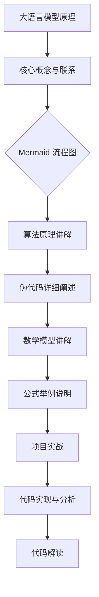

                 

# 大语言模型原理与工程实践：LLaMA 系列

> **关键词：** 大语言模型，LLaMA，原理，工程实践，Transformer，自注意力机制，数学基础，优化算法，应用案例

> **摘要：** 本文将深入探讨大语言模型的原理与工程实践。首先介绍大语言模型的发展历程与优势，然后详细讲解其数学基础、核心算法，以及优化与训练策略。接着，通过实际应用案例展示大语言模型在文本生成与问答系统中的使用，最后展望其未来发展趋势与潜在应用领域。

## 第一部分：大语言模型基础

### 第1章：大语言模型概述

#### 1.1 大语言模型的发展历程

大语言模型（Large Language Models）的发展历程可以追溯到上世纪80年代，那时研究人员开始探索基于统计方法和规则系统的语言模型。这些早期模型，如N-gram模型，基于词频统计来预测下一个词的出现概率。

随着计算机性能的提升和大数据的兴起，语言模型的发展进入了一个新的阶段。2003年，IBM提出IBM Language Model，它使用了基于语法规则的方法，显著提高了语言模型的效果。随后，神经网络模型逐渐成为主流，尤其是在2013年，词嵌入（word embeddings）的出现使得神经网络模型在语言建模方面取得了突破性的进展。

进入2018年，OpenAI发布的GPT（Generative Pre-trained Transformer）模型，开启了大语言模型的新纪元。GPT-1，GPT-2，到如今的GPT-3，模型规模和效果都在不断突破，展现了强大的文本生成和语言理解能力。

#### 1.1.1 大语言模型的起源

大语言模型的起源可以追溯到2018年，OpenAI的GPT模型。这个模型基于Transformer架构，使用了预训练和微调的方法，在大量数据上训练，从而获得了优秀的语言理解和生成能力。

GPT的成功激发了学术和工业界的热情，多个团队和研究机构相继推出了自己的大型语言模型，如Google的BERT、Facebook的RoBERTa、以及微软的T5等。这些模型在自然语言处理（NLP）任务中表现出了惊人的效果，推动了NLP领域的快速发展。

#### 1.1.2 大语言模型的演进

随着时间的推移，大语言模型在规模和性能上都在不断演进。从最初的GPT开始，模型规模逐渐增大，参数数量从上亿级别增长到数十亿级别，甚至上百亿级别。

同时，训练数据和算法的优化也在不断推动模型性能的提升。预训练技术从简单的未标注数据扩展到包含有监督、半监督和无监督数据的多模态数据集。算法方面，深度学习技术的进步和优化算法的改进，使得模型能够在更短的时间内达到更高的效果。

#### 1.1.3 大语言模型的优势与应用场景

大语言模型具有以下几个显著优势：

1. **强大的文本生成能力**：能够生成流畅、连贯的文本，适用于自动写作、故事生成等场景。
2. **卓越的语言理解能力**：能够理解复杂的语言结构和语义信息，适用于问答系统、对话生成等任务。
3. **跨领域知识整合**：通过在大量数据上训练，能够整合跨领域的知识，提高模型在不同领域的适应能力。

应用场景包括：

- **文本生成**：如自动写作、新闻生成、故事创作等。
- **问答系统**：如虚拟助手、智能客服等。
- **自然语言处理**：如机器翻译、文本分类、情感分析等。
- **辅助创作**：如歌词写作、诗歌创作等。

### 第2章：大语言模型的原理

#### 2.1 语言模型的基本概念

语言模型（Language Model）是一种统计模型，用于预测一个序列中出现下一个词的概率。语言模型是自然语言处理（NLP）中的基础，为文本生成、翻译、语音识别等任务提供了概率基础。

语言模型通常由以下几个部分组成：

- **词汇表**：定义模型中所有可能的词汇。
- **概率分布**：描述每个词汇在给定上下文下的出现概率。

语言模型可以分为基于规则模型和基于统计模型。基于规则模型使用手工编写的语法规则来预测词汇的概率，如概率上下文无关文法（PCFG）。基于统计模型则使用大量文本数据来学习词汇出现的概率，如N-gram模型。

#### 2.2 语言模型的类型

语言模型主要分为以下几种类型：

- **N-gram模型**：基于前N个词的统计方法，简单易实现，但存在长程依赖问题。
- **神经网络模型**：基于深度学习的方法，能够更好地捕捉长程依赖关系，如循环神经网络（RNN）和长短时记忆网络（LSTM）。
- **Transformer模型**：基于自注意力机制，能够在全局范围内建模词汇关系，显著提高了模型的效果。

#### 2.3 大语言模型的训练过程

大语言模型的训练过程通常包括以下几个阶段：

1. **数据收集与预处理**：收集大量文本数据，并进行预处理，如分词、去噪、去除停用词等。
2. **词嵌入**：将文本数据转换为向量表示，如Word2Vec、GloVe等。
3. **模型训练**：使用预训练技术，在大量数据上训练模型，如GPT、BERT等。
4. **微调**：在特定任务上对模型进行微调，以提高模型在具体任务上的性能。

#### 2.4 大语言模型的架构

大语言模型的架构通常包括以下几个部分：

- **嵌入层**：将输入词转换为向量表示。
- **编码层**：使用自注意力机制和多层神经网络，捕捉输入词之间的依赖关系。
- **输出层**：根据上下文生成下一个词的概率分布。

常见的架构包括GPT、BERT、T5等，其中GPT基于Transformer架构，BERT和T5则结合了Transformer和自注意力机制。

### 第3章：大语言模型的数学基础

#### 3.1 线性代数

线性代数是理解大语言模型的核心数学基础，主要包括以下内容：

- **矩阵与向量**：矩阵与向量是线性代数的基础概念，用于表示和操作数据。
- **矩阵运算**：包括矩阵加法、矩阵乘法、矩阵求逆等基本运算。
- **矩阵分解**：包括奇异值分解（SVD）、LU分解等，用于降维和矩阵分解。

#### 3.2 概率论与信息论

概率论与信息论是构建大语言模型的重要理论基础，主要包括以下内容：

- **概率论基础**：包括概率分布、条件概率、贝叶斯定理等。
- **信息论基础**：包括熵、信息增益、KL散度等，用于衡量信息的传递和压缩。

#### 3.3 语言模型的概率计算

语言模型的概率计算通常基于马尔可夫假设，即当前词的概率仅依赖于前一个词或前几个词。具体计算方法包括：

- **N-gram概率计算**：使用N-gram模型计算当前词的概率，如一元语法、二元语法等。
- **神经网络概率计算**：使用神经网络模型计算当前词的概率分布，如GPT、BERT等。

### 第4章：大语言模型的核心算法

#### 4.1 自注意力机制

自注意力机制（Self-Attention）是Transformer模型的核心算法，用于计算输入词之间的依赖关系。自注意力机制的主要步骤包括：

1. **输入词嵌入**：将输入词转换为向量表示。
2. **计算自注意力权重**：使用点积或加性注意力计算每个词与其他词之间的注意力权重。
3. **加权求和**：根据注意力权重对输入词进行加权求和，得到每个词的加权表示。

自注意力机制的数学表达如下：

$$
\text{Attention}(Q, K, V) = \text{softmax}\left(\frac{QK^T}{\sqrt{d_k}}\right)V
$$

其中，$Q$、$K$、$V$分别为查询向量、键向量和值向量，$d_k$为键向量的维度。

#### 4.2 生成式模型与判别式模型

生成式模型（Generative Model）和判别式模型（Discriminative Model）是两种不同的建模方法，用于预测输入序列的概率分布。

- **生成式模型**：直接生成目标序列的概率分布，如Gaussian Mixture Model、HMM等。
- **判别式模型**：通过学习输入序列和目标序列之间的关系，预测目标序列的概率分布，如Logistic Regression、SVM等。

生成式模型与判别式模型的优缺点如下：

| **模型类型** | **优点** | **缺点** |
| --- | --- | --- |
| 生成式模型 | 能够生成新的样本，适用于数据生成任务 | 难以学习复杂的关系，对数据量要求较高 |
| 判别式模型 | 能够精确地预测目标序列，适用于分类、回归等任务 | 无法直接生成新的样本 |

#### 4.3 Transformer模型

Transformer模型是自注意力机制的典型实现，其架构包括以下几个部分：

1. **嵌入层**：将输入词转换为向量表示。
2. **多头自注意力层**：使用多头自注意力机制计算输入词之间的依赖关系。
3. **前馈神经网络**：对多头自注意力层的输出进行非线性变换。
4. **层归一化与残差连接**：通过层归一化和残差连接提高模型的稳定性。

Transformer模型在序列建模任务中表现出色，已经成为大规模语言模型的主流架构。

### 第5章：大语言模型的优化与训练

#### 5.1 训练策略

大语言模型的训练策略主要包括以下几种：

1. **批量训练**（Batch Training）：将整个训练数据集分成多个批次，每次训练一个批次的数据。
2. **增量训练**（Incremental Training）：每次只训练一部分数据，逐步增加训练数据量。
3. **微调**（Fine-tuning）：在预训练模型的基础上，针对特定任务进行微调，以适应特定任务的需求。

#### 5.2 优化算法

优化算法用于更新模型的参数，以提高模型的效果。常见的优化算法包括：

1. **随机梯度下降**（Stochastic Gradient Descent，SGD）：每次使用一个样本的梯度来更新参数。
2. **Adam优化器**（Adam Optimizer）：结合SGD和Momentum，提高了训练效果和稳定性。
3. **其他优化器**：如RMSprop、Adadelta等，通过不同的策略优化参数更新过程。

### 第6章：大语言模型的应用

#### 6.1 文本生成

文本生成是大语言模型的重要应用之一，其挑战主要包括：

1. **长文本生成**：如何生成连贯、流畅的长文本。
2. **多样性生成**：如何保证生成的文本具有足够的多样性。
3. **控制生成内容**：如何控制生成文本的主题、风格等。

常见的文本生成模型包括：

1. **RNN模型**：如LSTM、GRU等。
2. **Transformer模型**：如GPT、BERT等。
3. **生成式对抗网络**（GAN）：通过生成器和判别器的对抗训练，生成高质量的文本。

文本生成应用案例包括：

1. **自动写作**：如新闻写作、故事创作等。
2. **对话系统**：如聊天机器人、智能客服等。
3. **内容生成**：如广告文案、营销文案等。

#### 6.2 问答系统

问答系统（Question Answering System）是一种能够自动回答用户问题的系统，其基本概念包括：

1. **问题**：用户提出的问题。
2. **答案**：系统根据问题提供的答案。

常见的问答系统架构包括：

1. **基于规则的方法**：使用预定义的规则来匹配问题和答案。
2. **基于统计的方法**：使用统计模型来匹配问题和答案。
3. **基于机器学习的方法**：使用机器学习模型，如神经网络，来匹配问题和答案。

问答系统的应用案例包括：

1. **智能客服**：如在线客服、电话客服等。
2. **虚拟助手**：如语音助手、聊天机器人等。
3. **教育辅助**：如在线问答平台、智能教育系统等。

### 第7章：LLaMA 系列

#### 6.1 LLaMA 的背景与特点

LLaMA（Large Language Model Meta-Analysis）是由Meta AI发布的一个大型语言模型系列。LLaMA的特点包括：

1. **高效率**：通过优化训练过程，提高了模型的训练效率。
2. **强泛化能力**：在多种任务上表现出了强大的泛化能力。
3. **可扩展性**：支持多种模型大小和参数配置，适用于不同规模的任务。

LLaMA的架构主要包括：

1. **嵌入层**：使用预训练的词嵌入技术，将输入词转换为向量表示。
2. **编码层**：使用多层Transformer结构，捕捉输入词之间的依赖关系。
3. **输出层**：使用全连接层和激活函数，生成输出词的概率分布。

#### 6.2 LLaMA 的训练

LLaMA的训练过程主要包括以下几个步骤：

1. **数据收集与预处理**：收集大量文本数据，并进行预处理，如分词、去噪等。
2. **词嵌入**：将输入词转换为预训练的词嵌入向量。
3. **模型训练**：使用预训练技术，在大量数据上训练模型。
4. **微调**：在特定任务上对模型进行微调，以提高模型在具体任务上的性能。

LLaMA的训练策略包括：

1. **批量训练**：使用大批次训练，以提高训练效率。
2. **增量训练**：逐步增加训练数据量，以提高模型的泛化能力。
3. **微调**：在特定任务上对模型进行微调，以适应特定任务的需求。

#### 6.3 LLaMA 的应用

LLaMA的应用非常广泛，包括但不限于以下领域：

1. **文本生成**：如自动写作、新闻生成、故事创作等。
2. **问答系统**：如智能客服、虚拟助手等。
3. **自然语言处理**：如机器翻译、文本分类、情感分析等。
4. **辅助创作**：如歌词写作、诗歌创作等。

### 第8章：大语言模型的未来发展趋势

#### 8.1 大语言模型的优化方向

大语言模型在未来将继续优化，主要方向包括：

1. **参数效率**：通过模型压缩、量化等方法，降低模型的参数数量，提高计算效率。
2. **训练效率**：通过分布式训练、并行计算等方法，提高模型的训练速度。
3. **模型可解释性**：通过可视化、解释性方法，提高模型的可解释性，便于理解和调试。

#### 8.2 大语言模型的应用拓展

大语言模型在未来的应用将更加广泛，包括：

1. **人工智能助手**：如智能秘书、智能导师等。
2. **自然语言处理**：如智能客服、智能搜索等。
3. **跨学科应用**：如医学、法律、金融等领域的专业应用。
4. **创意产业**：如影视制作、音乐创作、文学创作等。

### 附录

#### 附录 A：大语言模型开发工具与资源

- **开发环境搭建**：如何配置Python、TensorFlow等开发环境。
- **常用深度学习框架**：如TensorFlow、PyTorch、Keras等。
- **其他开发资源**：如数据集、教程、论文等。

#### 附录 B：大语言模型相关论文与资料

- **LLaMA 系列**：介绍 Meta AI 发布的 LLaMA 系列论文。
- **其他重要论文**：如GPT、BERT、T5等经典论文。
- **相关开源代码与数据集**：如Hugging Face 的 Transformers 库、GLM 模型等。

# Mermaid 流程图



# 核心算法原理讲解（伪代码）

```python
// 伪代码：训练大语言模型
Initialize parameters
for each batch in training_data:
    Compute inputs and labels
    Compute logits using the trained model
    Compute loss using logits and labels
    Compute gradients using backpropagation
    Update parameters using optimizer

// 伪代码：生成文本
Initialize context
while not end_of_sequence:
    Compute logits using the trained model
    Sample next token using logits
    Update context with sampled token
    Generate text based on context
```

# 数学模型和数学公式

## 数学公式讲解

### 期望与方差
$$
E(X) = \sum_{x} x \cdot P(x)
$$
$$
Var(X) = E[(X - E(X))^2]
$$

### 自注意力机制
$$
\text{Attention}(Q, K, V) = \text{softmax}\left(\frac{QK^T}{\sqrt{d_k}}\right)V
$$
$$
d_k \text{ is the dimension of keys and values}
$$
$$
\text{Multi-head Attention} = \text{Concat}(\text{head}_1, \text{head}_2, ..., \text{head}_h)W^O
$$
$$
h \text{ is the number of heads}
$$

### 优化算法
$$
\text{SGD}: \theta_{t+1} = \theta_{t} - \alpha \cdot \nabla_{\theta} J(\theta)
$$
$$
\text{Adam}: \theta_{t+1} = \theta_{t} - \alpha \cdot \nabla_{\theta} J(\theta)
$$
$$
m_t = \beta_1 m_{t-1} + (1 - \beta_1) \nabla_{\theta} J(\theta)
$$
$$
v_t = \beta_2 v_{t-1} + (1 - \beta_2) (\nabla_{\theta} J(\theta))^2
$$
$$
\theta_{t+1} = \theta_{t} - \alpha \cdot \frac{m_t}{\sqrt{1 - \beta_2^t} + \epsilon}
$$
$$
\beta_1, \beta_2 \text{ are smoothing parameters}, \alpha \text{ is the learning rate}, \epsilon \text{ is a small constant}
$$

# 项目实战

### 文本生成案例

#### 开发环境搭建

- 安装 Python 3.8 或更高版本
- 安装 TensorFlow 2.x 或更高版本

#### 代码实现

```python
import tensorflow as tf
from tensorflow.keras.layers import Embedding, LSTM, Dense
from tensorflow.keras.models import Sequential

# 搭建 LSTM 语言模型
model = Sequential([
    Embedding(input_dim=vocabulary_size, output_dim=embedding_size),
    LSTM(units=128, return_sequences=True),
    LSTM(units=128),
    Dense(units=vocabulary_size, activation='softmax')
])

# 编译模型
model.compile(optimizer='adam', loss='categorical_crossentropy', metrics=['accuracy'])

# 训练模型
model.fit(x_train, y_train, epochs=10, batch_size=64)

# 生成文本
def generate_text(model, seed_text, length=50):
    tokens = tokenizer.texts_to_sequences([seed_text])
    prediction = model.predict(tokens)
    sampled_indices = np.argmax(prediction, axis=-1)
    sampled_text = tokenizer.sequences_to_texts([sampled_indices])[0]
    return sampled_text

generated_text = generate_text(model, seed_text='The quick brown fox jumps over the lazy dog', length=50)
print(generated_text)
```

#### 代码解读与分析

- **模型搭建**：使用 TensorFlow 的 Sequential 模型堆叠 Embedding、LSTM 和 Dense 层，构建一个简单的语言模型。
- **编译模型**：使用 'adam' 优化器和 'categorical_crossentropy' 损失函数，配置模型。
- **训练模型**：使用训练数据对模型进行训练，设置训练轮次和批次大小。
- **生成文本**：定义 `generate_text` 函数，接受种子文本和生成长度，使用模型预测下一个单词的索引，并将这些索引转换为文本。

### 问答系统案例

#### 开发环境搭建

- 安装 Python 3.8 或更高版本
- 安装 TensorFlow 2.x 或更高版本

#### 代码实现

```python
import tensorflow as tf
from tensorflow.keras.layers import Embedding, LSTM, Dense, Concatenate
from tensorflow.keras.models import Model

# 搭建问答系统模型
question_input = Embedding(input_dim=vocabulary_size, output_dim=embedding_size)
answer_input = Embedding(input_dim=vocabulary_size, output_dim=embedding_size)
question_embedding = question_input(question_sequence)
answer_embedding = answer_input(answer_sequence)
merged_embedding = Concatenate(axis=-1)([question_embedding, answer_embedding])
answer_prediction = LSTM(units=128, return_sequences=True)(merged_embedding)
answer_output = Dense(units=vocabulary_size, activation='softmax')(answer_prediction)

model = Model(inputs=[question_input, answer_input], outputs=answer_output)

# 编译模型
model.compile(optimizer='adam', loss='categorical_crossentropy', metrics=['accuracy'])

# 训练模型
model.fit([question_sequence, answer_sequence], answer_sequence, epochs=10, batch_size=64)

# 回答问题
def answer_question(model, question):
    question_sequence = tokenizer.texts_to_sequences([question])
    answer_sequence = model.predict(question_sequence)
    sampled_indices = np.argmax(answer_sequence, axis=-1)
    answer = tokenizer.sequences_to_texts([sampled_indices])[0]
    return answer

question = "What is the capital of France?"
answer = answer_question(model, question)
print(answer)
```

#### 代码解读与分析

- **模型搭建**：构建一个问答系统模型，包含两个输入层（问题和答案）和一个合并层，使用 LSTM 层进行嵌入表示的融合，最后使用 Dense 层输出答案。
- **编译模型**：使用 'adam' 优化器和 'categorical_crossentropy' 损失函数。
- **训练模型**：使用训练数据对模型进行训练。
- **回答问题**：定义 `answer_question` 函数，接收问题文本，将其转换为序列，使用模型预测答案，并将答案转换为文本输出。

## 附录

### 附录 A：大语言模型开发工具与资源

- **开发环境搭建**：如何配置 Python、TensorFlow 等开发环境。
- **常用深度学习框架**：如 TensorFlow、PyTorch、Keras 等。
- **其他开发资源**：如数据集、教程、论文等。

### 附录 B：大语言模型相关论文与资料

- **LLaMA 系列**：介绍 Meta AI 发布的 LLaMA 系列论文。
- **其他重要论文**：如 GPT、BERT、T5 等。
- **相关开源代码与数据集**：如 Hugging Face 的 Transformers 库、GLM 模型等。

